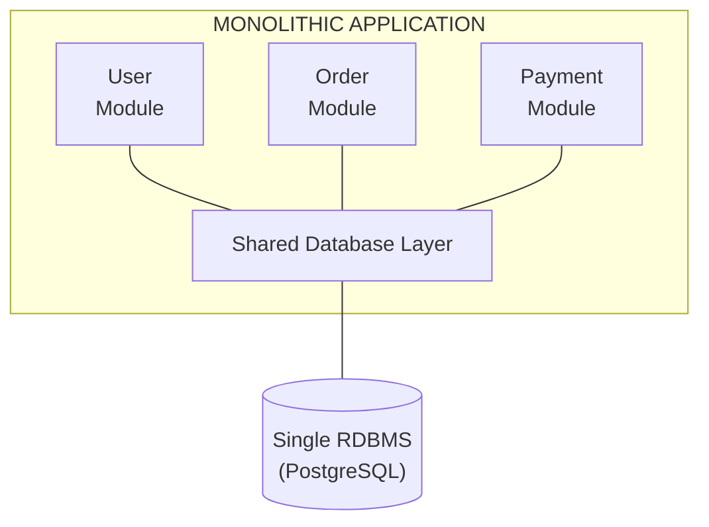
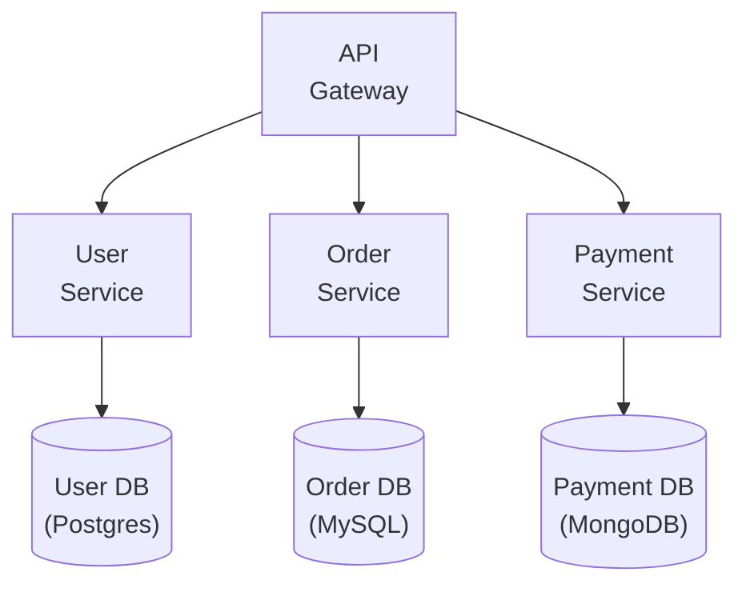
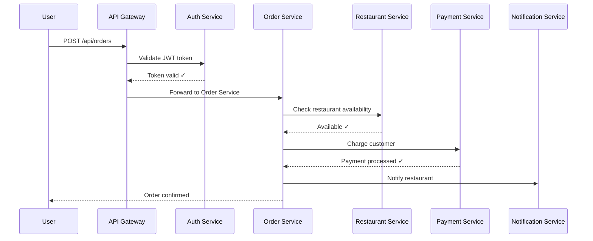
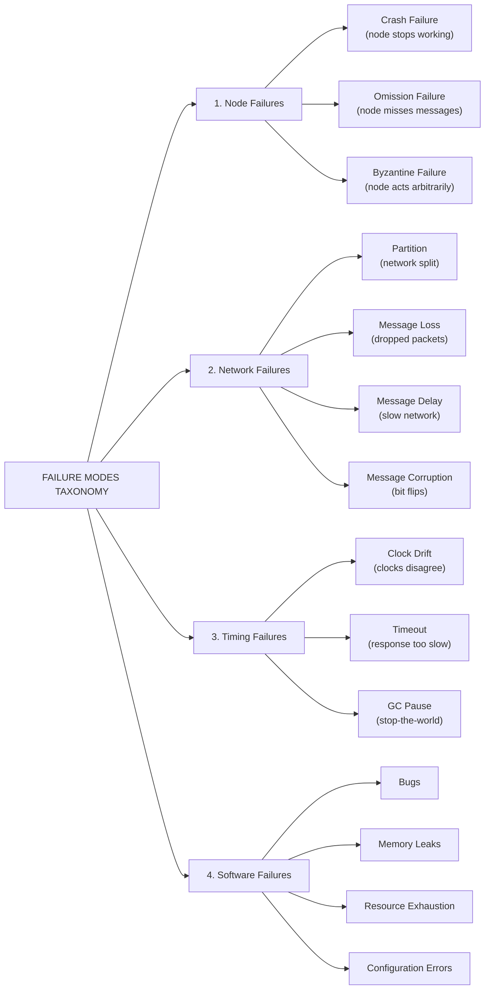
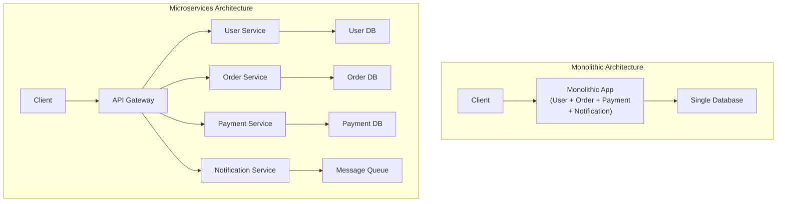
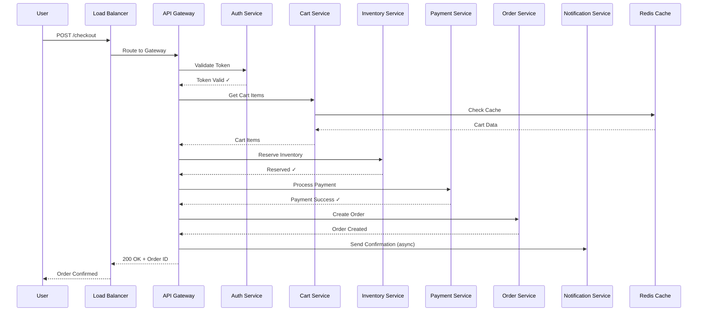
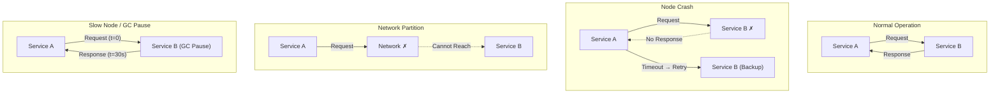
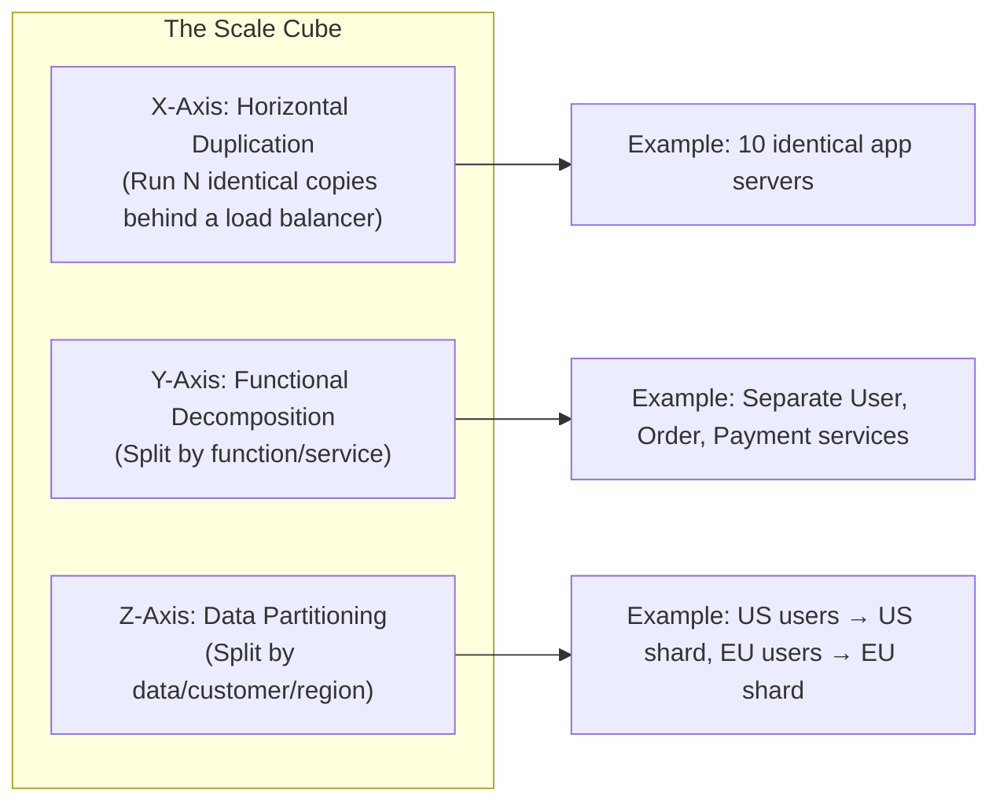
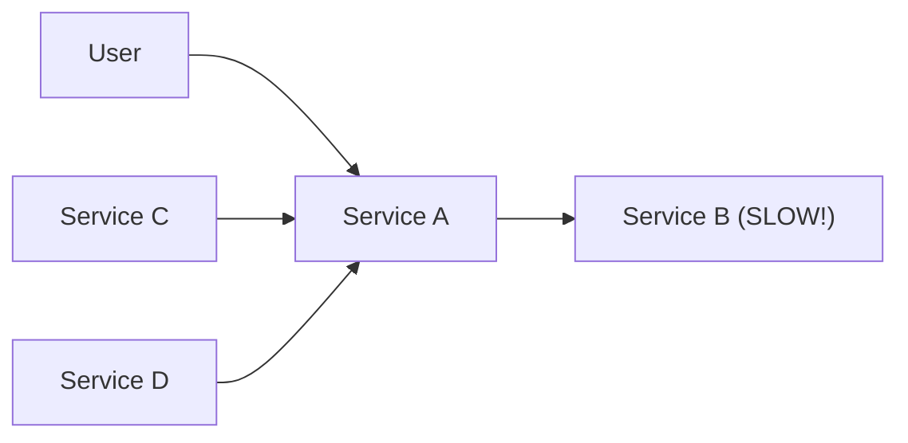

# Chapter 1: Introduction to Distributed Systems

---

> *"A distributed system is one in which the failure of a computer you didn't even know existed can render your own computer unusable."*  
> — Leslie Lamport

---

## 1. Why This Matters

Every time you open Google Search, stream a movie on Netflix, order food through DoorDash, or send a message on WhatsApp, you are interacting with a distributed system. The phone in your pocket communicates with data centers spread across continents, and those data centers coordinate with each other to serve you a response in milliseconds. Understanding distributed systems is not optional for any serious software engineer — it is the **foundation** of modern computing.

### The Scale of the Problem

Consider these numbers:

| Company | Scale Metric | Implication |
|---------|-------------|-------------|
| Google | 8.5 billion searches/day | ~99,000 queries per second sustained |
| Netflix | 238 million subscribers streaming | Petabytes of video delivered per hour |
| Amazon | 375 million items in catalog | Millions of transactions per second on Prime Day |
| WhatsApp | 100 billion messages/day | ~1.15 million messages per second |
| Uber | 23 million trips/day | Real-time matching, routing, pricing across 10,000+ cities |

No single computer — no matter how powerful — can handle this load. No single data center can survive a hurricane, earthquake, or power outage while maintaining 99.999% uptime. No single geographic location can serve users globally with sub-100ms latency.

**This is why distributed systems exist.**

### Industry Relevance

- **System Design Interviews**: FAANG companies expect deep understanding of distributed systems. Every system design question (design Twitter, design Uber, design a URL shortener) is fundamentally a distributed systems problem.
- **Cloud-Native Development**: AWS, GCP, and Azure are platforms for building distributed systems. Kubernetes, Kafka, DynamoDB — all distributed systems.
- **Career Growth**: Senior engineers and architects must reason about consistency, availability, partitioning, replication, and consensus. These are all distributed systems concepts.
- **Production Reliability**: Understanding distributed systems is the difference between building systems that gracefully handle failures and systems that cascade into total outages.

### Who Needs This Knowledge

- Backend engineers building microservices
- Platform/infrastructure engineers designing for scale
- Site Reliability Engineers (SREs) debugging production incidents
- Engineering managers making architectural decisions
- Anyone preparing for system design interviews

---

## 2. Beginner Intuition

### The Restaurant Analogy

Imagine you own a small restaurant with one chef, one waiter, and one cashier. Everything works fine when you have 10 customers. The chef cooks, the waiter serves, the cashier handles payments. Everyone communicates by shouting across the room.

**This is a monolithic system.**

Now imagine your restaurant becomes wildly popular. You have 10,000 customers per day. What do you do?

**Option 1: Get a bigger restaurant (Vertical Scaling)**
You move to a bigger space, hire a faster chef, get a bigger oven. This works... until it doesn't. There's a limit to how fast one chef can cook, how big one oven can be. And if your chef gets sick, the entire restaurant shuts down.

**Option 2: Open multiple restaurants (Horizontal Scaling)**
You open 10 restaurants across the city. Each restaurant handles a portion of the customers. Now you have new problems:
- How do you keep the menu consistent across all locations? (**Consistency**)
- If one restaurant catches fire, how do customers know to go to another? (**Fault Tolerance**)
- How do you ensure customers get routed to the nearest restaurant? (**Load Balancing**)
- If a customer starts dining at one location and wants to pay at another, how do you handle that? (**State Management**)
- What if the phone lines between restaurants go down? (**Network Partitions**)

**This is a distributed system.**

### The Simplest Definition

A distributed system is a collection of independent computers (nodes) that appears to the user as a single coherent system.

Think of it like a swan gliding across a lake — serene and effortless on the surface, but paddling furiously beneath the water. The user sees one system; underneath, dozens (or thousands) of machines are coordinating, failing, recovering, and communicating to maintain the illusion.

### Key Intuitions to Build

Before diving into formalism, build these intuitions:

1. **Messages, not method calls**: In a distributed system, components communicate by sending messages over a network, not by calling functions in the same process. Messages can be lost, delayed, duplicated, or reordered.

2. **Partial failure is the norm**: In a single computer, either the whole machine works or the whole machine crashes. In a distributed system, some parts can fail while others continue working. This is the fundamental challenge.

3. **No global clock**: Each machine has its own clock, and they drift. You cannot simply say "this event happened before that event" without careful coordination.

4. **No shared memory**: Each machine has its own memory. To share data, you must send it over the network, which is slow and unreliable compared to local memory access.

5. **Things take time**: Network communication adds latency. A local function call takes nanoseconds; a network round-trip takes milliseconds. That's a million-fold difference.

```
Local function call:    ~1 nanosecond      (1 ns)
In-memory cache:        ~100 nanoseconds   (100 ns)
SSD read:               ~16 microseconds   (16,000 ns)
Network round-trip:     ~500 microseconds  (500,000 ns)  — same data center
Cross-region network:   ~50 milliseconds   (50,000,000 ns)
Cross-continent:        ~150 milliseconds  (150,000,000 ns)
```

---

## 3. Core Theory

### 3.1 Formal Definition

**Andrew Tanenbaum's Definition:**
> "A distributed system is a collection of independent computers that appears to its users as a single coherent system."

**Leslie Lamport's (Humorous) Definition:**
> "A distributed system is one in which the failure of a computer you didn't even know existed can render your own computer unusable."

**Coulouris et al.'s Definition:**
> "A distributed system is one in which components located at networked computers communicate and coordinate their actions only by passing messages."

Let's formalize this. A distributed system `DS` can be characterized as a tuple:

```
DS = (N, C, P, F)
```

Where:
- **N** = {n₁, n₂, ..., nₖ} is a set of nodes (independent computing entities)
- **C** = communication channels between nodes (the network)
- **P** = a set of protocols governing how nodes interact
- **F** = a failure model describing what can go wrong

Each node `nᵢ` has:
- Its own local state `Sᵢ`
- Its own local clock `Tᵢ`
- Its own processing capability
- No direct access to the state of other nodes

### 3.2 Why Distributed Systems Exist

There are five fundamental reasons why we build distributed systems:

#### 1. Scalability
A single machine has physical limits: CPU cores, RAM capacity, disk I/O bandwidth, network bandwidth. When your application exceeds these limits, you must distribute the workload across multiple machines.

**Types of Scalability:**
- **Vertical Scaling (Scale Up)**: Bigger machine, more RAM, faster CPU. Limited by hardware ceilings and increasingly expensive.
- **Horizontal Scaling (Scale Out)**: More machines, each handling a portion of the work. Theoretically unlimited but introduces complexity.

**Vertical Scaling Cost Curve** *(Cost grows superlinearly with vertical scaling)*
| Performance | 1 | 2 | 3 | 4 | 5 | 6 | 7 | 8 | 9 | 10 |
|-------------|---|---|---|---|---|---|---|---|---|----|
| **Cost ($)**| 1 | 2 | 4 | 8 | 16| 28| 45| 65| 85| 100|

<br/>

**Horizontal Scaling Cost Curve** *(Cost grows roughly linearly with horizontal scaling)*
| Performance | 1 | 2 | 3 | 4 | 5 | 6 | 7 | 8 | 9 | 10 |
|-------------|---|---|---|---|---|---|---|---|---|----|
| **Cost ($)**| 10| 20| 30| 40| 50| 60| 70| 80| 90| 100|

#### 2. Reliability and Fault Tolerance
Hardware fails. Networks fail. Data centers lose power. Natural disasters happen. A distributed system can be designed to tolerate failures by replicating data and computation across multiple independent nodes and locations.

**The math of reliability:**
- Single server with 99.9% uptime = ~8.7 hours of downtime/year
- Two redundant servers, each 99.9%: P(both down) = 0.001 × 0.001 = 0.000001 = 99.9999% uptime = ~31 seconds of downtime/year

This assumes independent failures, which in practice requires geographic separation, independent power supplies, and independent network paths.

#### 3. Geographic Distribution
Users are spread across the globe. Physics limits the speed of light, and thus the minimum latency for network communication:
- New York to London: ~75ms round-trip (best case)
- New York to Tokyo: ~160ms round-trip (best case)
- New York to Sydney: ~230ms round-trip (best case)

By placing servers close to users, you reduce latency. This requires a distributed system.

#### 4. Economic Efficiency
- Commodity hardware (many cheap machines) is more cost-effective than specialized supercomputers for most workloads.
- Cloud computing (AWS, GCP, Azure) makes it trivially easy to add machines.
- Pay-per-use models incentivize distributed architectures that can scale elastically.

#### 5. Regulatory Requirements
- GDPR requires data about EU citizens to be stored in the EU.
- Data sovereignty laws in various countries mandate local data storage.
- This forces geographic distribution of data and computation.

### 3.3 Characteristics of Distributed Systems

#### Concurrency
Multiple components execute simultaneously. Two users on different continents might be updating the same record at the same time. Handling this correctly is one of the hardest problems in distributed systems.

#### No Global Clock
Each node has its own clock, and clocks drift. NTP (Network Time Protocol) can synchronize clocks to within a few milliseconds, but not perfectly. This means:
- You cannot simply timestamp events and compare them across nodes.
- Ordering events requires logical clocks (Lamport timestamps) or vector clocks.
- Google's TrueTime API uses GPS and atomic clocks to bound clock uncertainty.

#### Independent Failures
Nodes and network links can fail independently. This leads to **partial failures** — some parts of the system work while others don't. Detecting whether a remote node has failed or is just slow is fundamentally impossible to distinguish with certainty (this is the crux of the FLP impossibility result).

#### Message Passing
Nodes communicate by sending messages over a network. Messages can be:
- **Lost**: The network can drop packets.
- **Delayed**: Messages may arrive much later than expected.
- **Duplicated**: Retransmission mechanisms can create duplicates.
- **Reordered**: Messages may arrive in a different order than sent.
- **Corrupted**: Bit flips can alter message contents (though checksums catch most).

### 3.4 Models of Distributed Systems

#### Synchronous Model
- Bounded message delivery time
- Bounded processing time
- Bounded clock drift
- **Theoretical assumption**, rarely true in practice
- Simplifies algorithm design but is unrealistic

#### Asynchronous Model
- No bounds on message delivery time
- No bounds on processing time
- No global clock
- **Most realistic** model for the Internet
- Makes many problems harder or impossible (see FLP)

#### Partially Synchronous Model
- Behaves asynchronously sometimes, synchronously at other times
- There exists an unknown bound after which the system behaves synchronously
- **Most practical** model — used by most real distributed systems

#### Failure Models
| Model | Description | Example |
|-------|-------------|---------|
| Crash-stop | Node stops working and never recovers | Power failure |
| Crash-recovery | Node stops but can recover with stable storage | Process crash with restart |
| Omission | Node fails to send/receive some messages | Network packet loss |
| Byzantine | Node behaves arbitrarily, including maliciously | Compromised server, hardware bug |

### 3.5 The 8 Fallacies of Distributed Computing

In 1994, Peter Deutsch (with additions from James Gosling) identified eight false assumptions that programmers new to distributed systems commonly make. These fallacies are as relevant today as they were 30 years ago.

#### Fallacy 1: The Network Is Reliable

**The Reality:** Networks fail constantly. Cables get cut by construction workers. Routers crash. Switches get misconfigured. DNS servers go down. AWS us-east-1 has had multiple major network partitions.

**Real-world Example:** In 2017, a typo in an AWS S3 command caused a massive outage affecting thousands of websites. The S3 API became unavailable in us-east-1 for about 4 hours, bringing down services like Slack, Trello, and IFTTT.

**Implications for Design:**
- Always implement retries with exponential backoff
- Design for idempotency (operations can be safely retried)
- Implement circuit breakers to prevent cascading failures
- Use dead letter queues for messages that can't be delivered
- Never assume a network call will succeed

```java
// BAD: Assuming the network is reliable
public User getUser(String userId) {
    return httpClient.get("/users/" + userId, User.class);
    // What if this call fails? Throws an exception? Times out?
}

// GOOD: Handling network unreliability
public Optional<User> getUser(String userId) {
    int maxRetries = 3;
    for (int attempt = 0; attempt < maxRetries; attempt++) {
        try {
            User user = httpClient.get("/users/" + userId, User.class);
            return Optional.of(user);
        } catch (TimeoutException e) {
            log.warn("Timeout fetching user {}, attempt {}/{}", 
                userId, attempt + 1, maxRetries);
            if (attempt < maxRetries - 1) {
                sleep(exponentialBackoff(attempt));
            }
        } catch (NetworkException e) {
            log.error("Network error fetching user {}", userId, e);
            circuitBreaker.recordFailure();
            break;
        }
    }
    return Optional.empty(); // Graceful degradation
}
```

#### Fallacy 2: Latency Is Zero

**The Reality:** Every network call adds latency. A local function call takes ~1 nanosecond. A network call to a machine in the same data center takes ~500 microseconds. A cross-continent call takes ~150 milliseconds. That's a factor of 150,000,000x.

**The Chatty Service Problem:** If your service makes 100 sequential network calls to process a single request, and each call takes 5ms, the total latency is 500ms — unacceptable for user-facing applications.

**Implications for Design:**
- Batch requests where possible
- Use caching to avoid unnecessary network calls
- Colocate services that communicate frequently
- Use asynchronous communication for non-critical paths
- Monitor P50, P95, P99 latencies, not just averages
- Design APIs to return everything needed in a single call (avoid chatty interfaces)

#### Fallacy 3: Bandwidth Is Infinite

**The Reality:** While bandwidth has increased dramatically, so has the volume of data. Video streaming, machine learning model training, and big data analytics push bandwidth to its limits. Even within a data center, network bandwidth is shared and can become congested.

**Implications for Design:**
- Compress data before sending
- Use efficient serialization formats (Protocol Buffers, Avro) instead of verbose JSON/XML for internal communication
- Implement pagination for large data sets
- Use streaming instead of loading entire data sets into memory
- Consider data locality — move computation to data, not data to computation

#### Fallacy 4: The Network Is Secure

**The Reality:** Networks are hostile environments. Man-in-the-middle attacks, packet sniffing, DNS spoofing, DDoS attacks — these are daily realities for any system connected to the Internet.

**Implications for Design:**
- Encrypt all communication (TLS/mTLS)
- Authenticate every request (JWT, OAuth, API keys)
- Implement zero-trust networking (don't trust internal networks)
- Use network segmentation
- Regular security audits and penetration testing

#### Fallacy 5: Topology Doesn't Change

**The Reality:** In modern cloud environments, topology changes constantly. VMs spin up and down. Containers are scheduled on different hosts. Auto-scaling groups add and remove instances. Service meshes route traffic dynamically.

**Implications for Design:**
- Use service discovery (Consul, Eureka, Kubernetes DNS)
- Don't hardcode IP addresses
- Design for dynamic scaling
- Implement health checks and automatic failover

#### Fallacy 6: There Is One Administrator

**The Reality:** In a large distributed system, many teams manage different components. Your service depends on databases managed by the DBA team, networks managed by the infrastructure team, cloud resources managed by the platform team, and third-party APIs managed by external companies.

**Implications for Design:**
- Design defensively — don't trust your dependencies
- Implement bulkheads to isolate failures
- Use contracts (API specifications) between teams
- Monitor your dependencies

#### Fallacy 7: Transport Cost Is Zero

**The Reality:** Serializing data, sending it over the network, and deserializing it on the other end all cost CPU cycles and time. Cloud providers charge for data transfer. Cross-region and cross-provider transfer is expensive.

**Implications for Design:**
- Be mindful of serialization overhead
- Cache aggressively to reduce network calls
- Colocate related services to minimize cross-zone traffic
- Use efficient wire formats (Protobuf over JSON for internal services)

**Cost Reference (approximate):**
```
AWS Data Transfer Costs (2024):
- Same Availability Zone: Free
- Cross-AZ (same region): $0.01/GB each way
- Cross-region: $0.02/GB
- To internet: $0.09/GB (first 10 TB)
```

#### Fallacy 8: The Network Is Homogeneous

**The Reality:** Your distributed system will span multiple types of networks — data center LANs, WANs, cellular networks, WiFi. Each has different characteristics (bandwidth, latency, reliability, MTU).

**Implications for Design:**
- Don't assume consistent network performance
- Implement adaptive behavior based on network conditions
- Use protocol negotiation
- Handle varying MTU sizes
- Design for the worst case while optimizing for the common case

### 3.6 Key Properties of Distributed Systems

#### Transparency

Transparency in distributed systems means hiding the distributed nature from users and application programmers. ISO defines several types:

| Type | Description | Example |
|------|-------------|---------|
| Access Transparency | Hide differences in data representation and invocation | RPC making remote calls look local |
| Location Transparency | Hide where resources are located | DNS names instead of IP addresses |
| Migration Transparency | Hide that resources may move | VM live migration |
| Relocation Transparency | Hide that resources may move while in use | Mobile IP |
| Replication Transparency | Hide that resources are replicated | Read replicas behind a load balancer |
| Concurrency Transparency | Hide that resources are shared by concurrent users | Database transactions |
| Failure Transparency | Hide failures and recovery | Automatic failover |
| Persistence Transparency | Hide whether data is in memory or on disk | Transparent caching layers |

**Important**: Full transparency is often impossible or undesirable. Sometimes you *want* to expose the distributed nature. For example, you might want to let users choose their data center region for regulatory compliance.

#### Openness

An open distributed system offers services according to standard rules (interfaces, protocols). This enables interoperability and extensibility. Key aspects:
- Well-defined interfaces (IDL, OpenAPI specifications)
- Standard protocols (HTTP, gRPC, AMQP)
- Separation of policy from mechanism

#### Scalability

A system is scalable if it can handle increased load without fundamental changes to its architecture. Scalability has three dimensions:

1. **Size Scalability**: Adding more users/resources without performance degradation
2. **Geographic Scalability**: Users and resources can be far apart without unacceptable latency
3. **Administrative Scalability**: Easy to manage even with many independent organizations

#### Fault Tolerance

The ability of a system to continue operating (possibly in a degraded mode) when some components fail. Key concepts:
- **Availability**: Fraction of time the system is operational (measured in "nines")
- **Reliability**: Ability to run continuously without failure
- **Safety**: Nothing catastrophic happens when failures occur
- **Maintainability**: How easily a failed system can be restored

```
Availability Levels:
────────────────────────────────────────────────────
99%      ("two nines")   = 3.65 days downtime/year
99.9%    ("three nines") = 8.77 hours downtime/year
99.99%   ("four nines")  = 52.6 minutes downtime/year
99.999%  ("five nines")  = 5.26 minutes downtime/year
99.9999% ("six nines")   = 31.5 seconds downtime/year
────────────────────────────────────────────────────
```

---

## 4. Architecture Deep Dive

### 4.1 Monolithic Architecture

In a monolithic architecture, the entire application runs as a single process (or a small number of processes) on a single machine (or a cluster of identical machines behind a load balancer).



**Advantages of Monoliths:**
- Simple to develop, test, deploy
- Single codebase, single deployment artifact
- No network calls between components (in-process communication)
- ACID transactions across the entire data model
- Easy to debug (single process, single log stream)
- Low latency (no serialization/deserialization overhead)
- Consistent: all modules see the same database state

**Disadvantages of Monoliths:**
- Single point of failure
- Cannot scale individual components independently
- Technology lock-in (one language, one framework)
- Long deployment cycles (deploying entire app for one-line change)
- Team coordination challenges at scale
- Resource waste (cannot allocate more resources to hot modules)
- Memory and CPU limits of a single machine

### 4.2 Distributed (Microservices) Architecture

In a distributed architecture, the application is decomposed into independent services, each running in its own process, communicating via network protocols.



**Advantages of Distributed Systems:**
- Independent scaling of services
- Technology diversity (polyglot)
- Independent deployments
- Fault isolation
- Team autonomy
- Better resource utilization

**Disadvantages of Distributed Systems:**
- Operational complexity
- Network unreliability
- Distributed transactions are hard
- Debugging across services is challenging
- Data consistency challenges
- Higher latency (network calls)
- Monitoring and observability overhead

### 4.3 Monolith vs Distributed: Detailed Comparison

| Dimension | Monolith | Distributed |
|-----------|----------|-------------|
| **Complexity** | Application complexity | Operational complexity |
| **Deployment** | All-or-nothing | Independent services |
| **Scaling** | Vertical (scale up) | Horizontal (scale out) |
| **Data Consistency** | Strong (ACID) | Eventual (usually) |
| **Latency** | Low (in-process) | Higher (network calls) |
| **Fault Isolation** | Poor (one bug crashes all) | Good (failures contained) |
| **Technology Choice** | One stack | Polyglot |
| **Team Structure** | One team or tightly coupled | Independent teams |
| **Testing** | Unit + integration (simpler) | Contract + integration (complex) |
| **Debugging** | Single process, stack trace | Distributed tracing required |
| **Transaction** | ACID across entire DB | Saga pattern, eventual consistency |
| **Initial Development** | Faster | Slower |
| **Long-term Maintenance** | Gets harder over time | Easier with proper boundaries |

### 4.4 Migration Stories

#### Amazon's Migration (2001-2006)

In the early 2000s, Amazon's monolithic application was becoming unmaintainable. CEO Jeff Bezos issued his famous mandate:

1. All teams will henceforth expose their data and functionality through service interfaces.
2. Teams must communicate with each other through these interfaces.
3. There will be no other form of interprocess communication allowed.
4. It doesn't matter what technology they use.
5. All service interfaces, without exception, must be designed from the ground up to be externalizable.
6. Anyone who doesn't do this will be fired.

This mandate transformed Amazon into a services-oriented company and eventually gave birth to AWS.

#### Netflix's Migration (2008-2016)

In 2008, Netflix had a major database corruption incident with their monolithic Oracle database. This was the catalyst for their migration to a distributed, cloud-native architecture on AWS.

Key decisions:
- Moved from a single Oracle database to dozens of distributed databases (Cassandra, DynamoDB, etc.)
- Developed the Netflix OSS stack (Eureka, Zuul, Hystrix, Ribbon)
- Implemented the Chaos Engineering discipline (Chaos Monkey, Chaos Kong)
- Moved from a single data center to multi-region AWS deployment

The migration took ~7 years but resulted in a system that could:
- Serve 238+ million subscribers globally
- Survive entire AWS region failures
- Deploy thousands of times per day

#### Twitter's Journey

Twitter initially ran on a monolithic Ruby on Rails application. As the platform grew (remember the "Fail Whale"?), they decomposed it into:
- Timeline service
- Tweet service  
- User service
- Search service (Earlybird)
- Fan-out service

They rewrote critical paths in Scala (using the Finatra framework) and Java for performance.

### 4.5 Request Flow in a Distributed System

Let's trace a request through a modern distributed system — ordering food on a delivery platform:



This flow involves:
- **6 network hops** minimum
- **4 different services** coordinated
- **Multiple databases** updated
- **At least 3 potential failure points** (what if payment fails? what if notification fails?)
- **Distributed transaction** semantics (if payment fails, roll back the order)

### 4.6 Failure Modes in Distributed Systems



### 4.7 Architectures of Distributed Systems

#### Client-Server Architecture
The most fundamental pattern. Clients send requests to servers, servers process them and respond.
- Examples: Web applications, REST APIs, database clients

#### Peer-to-Peer (P2P) Architecture
Every node is both a client and a server. No central authority.
- Examples: BitTorrent, Bitcoin, IPFS
- Advantages: No single point of failure, scales naturally
- Disadvantages: Hard to search, inconsistent quality of nodes

#### Three-Tier Architecture
- **Presentation Tier**: User interface (web browser, mobile app)
- **Application Tier**: Business logic (application servers)
- **Data Tier**: Data storage (databases)

#### N-Tier Architecture
Extension of three-tier with additional layers:
- API Gateway
- Load Balancer
- Application Servers
- Cache Layer
- Message Queue
- Database Layer
- Analytics Layer

#### Event-Driven Architecture
Components communicate through events (asynchronous messages).
- Examples: Kafka-based architectures, CQRS/Event Sourcing
- Advantages: Loose coupling, scalability, resilience
- Disadvantages: Debugging complexity, eventual consistency

---

## 5. Visual Diagrams

### Diagram 1: Monolith vs Microservices



### Diagram 2: Request Flow in a Distributed E-Commerce System



### Diagram 3: Failure Modes in Distributed System



### Diagram 4: Scale Cube (Three Dimensions of Scaling)



### Diagram 5: History and Evolution Timeline

**History of Distributed Systems:**

- **1960s**: ARPANET (precursor to Internet), Time-sharing systems
- **1970s**: Ethernet invented (1973), TCP/IP protocol (1974), First email systems
- **1980s**: DNS invented (1983), Sun RPC & NFS, Distributed databases emerge
- **1990s**: World Wide Web (1991), CORBA, Java RMI, 8 Fallacies (1994), Google founded (1998)
- **2000s**: MapReduce paper (2004), Amazon Dynamo paper (2007), Google BigTable (2006), CAP Theorem formalized (2002), AWS launches (2006)
- **2010s**: Docker (2013), Kubernetes (2014), Apache Kafka mature, Microservices explosion, Service meshes (Istio)
- **2020s**: Serverless maturity, Edge computing, WebAssembly at the edge, AI-driven autoscaling

---

## 6. Real Production Examples

### 6.1 Google Search

Google Search is one of the most impressive distributed systems ever built. When you type a query and press Enter, here's what happens in ~200 milliseconds:

**Architecture Overview:**
1. **DNS Resolution**: Your browser resolves google.com to an IP address, typically routed to the nearest Google data center via Anycast.
2. **Google Front End (GFE)**: The first server that handles your request. Terminates TLS, parses the HTTP request.
3. **Web Server**: Determines the type of query and routes it appropriately.
4. **Index Servers**: The query is fanned out to hundreds of index servers in parallel. Each server holds a portion of the web index (sharded by document ID). Each returns the top-K results from its shard.
5. **Doc Servers**: For the top results, document servers fetch snippets, metadata, and other information.
6. **Ad Servers**: In parallel, the ad system runs an auction to determine which ads to show.
7. **Aggregation**: Results from all sources are merged, ranked, and formatted.
8. **Response**: The final HTML is sent back to the user.

**Scale Numbers:**
- Indexes 100+ petabytes of web data
- Processes 8.5 billion searches per day
- Median response time: ~200ms
- Uses custom hardware (TPUs for ML ranking)
- Operates 30+ data centers globally

**Key Distributed Systems Concepts Used:**
- **MapReduce / Flume**: For building the index
- **BigTable / Spanner**: For storing structured data
- **GFS / Colossus**: For distributed file storage
- **Chubby**: For distributed locking
- **Borg (now Kubernetes)**: For container orchestration
- **Consistent Hashing**: For data distribution

### 6.2 Amazon E-Commerce

Amazon's architecture evolved from a monolith to thousands of microservices over 15+ years.

**Key Services:**
- **Product Catalog Service**: Manages 375M+ product listings
- **Recommendation Engine**: "Customers who bought X also bought Y"
- **Inventory Service**: Tracks inventory across fulfillment centers
- **Cart Service**: Session-based shopping cart (eventually became DynamoDB)
- **Order Service**: Complex workflow for order processing
- **Payment Service**: Multiple payment method support
- **Fulfillment Service**: Routes orders to optimal fulfillment centers

**Key Technologies Built:**
- **DynamoDB**: Born from the Amazon shopping cart requirements (always-writable, eventually consistent key-value store, see the Dynamo paper)
- **SQS**: Distributed message queue for decoupling services
- **S3**: Object storage used internally and externally
- **CloudFront**: CDN for static content
- **AWS**: Amazon built AWS largely to solve their own scaling problems

**Prime Day Architecture:**
- Pre-scales services weeks in advance
- Uses chaos engineering to verify readiness
- Deploys to multiple AWS regions
- Implements sophisticated rate limiting and throttling
- Uses "cell-based architecture" to contain blast radius

### 6.3 Netflix Streaming

Netflix is the gold standard for resilient distributed systems design.

**Architecture Components:**
1. **Edge Services (Zuul)**: API gateway handling authentication, routing, and request filtering
2. **Middle Tier Services**: Hundreds of microservices for business logic
3. **Data Layer**: 
   - Cassandra for user data, viewing history (AP system)
   - EVCache (memcached-based) for caching
   - MySQL for billing data (CP system)
4. **Content Delivery**: Open Connect CDN (Netflix's own CDN)
5. **Real-time Data Pipeline**: Apache Kafka + Apache Flink for real-time analytics

**Key Innovations:**
- **Chaos Engineering**: Invented Chaos Monkey (randomly kills production instances), Chaos Kong (simulates entire region failure), Latency Monkey (introduces artificial delays)
- **Circuit Breaker Pattern (Hystrix)**: Prevents cascading failures
- **Service Discovery (Eureka)**: Dynamic service registration and lookup
- **Client-Side Load Balancing (Ribbon)**: Smart routing based on instance health
- **Bulkhead Pattern**: Isolates thread pools per dependency

**Resilience Design:**
```
Netflix's Resilience Layers:
─────────────────────────────────────────────
Layer 1: Timeouts (every call has a timeout)
Layer 2: Retries (with exponential backoff)
Layer 3: Circuit Breakers (stop calling failing services)
Layer 4: Bulkheads (isolate resources per dependency)
Layer 5: Fallbacks (degraded but functional responses)
Layer 6: Regional Failover (entire region evacuation)
─────────────────────────────────────────────
```

### 6.4 Uber Architecture

Uber's platform handles real-time ride matching, pricing, navigation, and payments across 10,000+ cities.

**Core Services:**
- **Dispatch Service**: Matches riders with drivers using geospatial indexing
- **Pricing Service**: Dynamic surge pricing based on supply/demand
- **ETA Service**: Real-time estimated time of arrival
- **Maps Service**: Custom mapping and routing
- **Payment Service**: Multi-currency, multi-method payment processing
- **Trip Service**: Manages the lifecycle of a trip

**Technical Decisions:**
- Initially: Monolith in Python → Microservices in Go, Java, Node.js
- Developed their own RPC framework (TChannel, later replaced with gRPC)
- Built custom geospatial index (H3: hexagonal hierarchical spatial index)
- Ringpop: Consistent hash ring for distributed services
- Cadence: Workflow orchestration engine (now Temporal)
- Schemaless: Custom distributed database built on top of MySQL
- Apache Kafka: Real-time event streaming backbone

**Scale:**
- 5 million trips per day (peak)
- Processes location updates from millions of drivers simultaneously
- Sub-second matching latency
- Real-time pricing computed for every ride request

### 6.5 Meta (Facebook) Architecture

**Key Systems:**
- **TAO**: Distributed graph database for the social graph (billions of nodes, trillions of edges)
- **Memcached at Scale**: Facebook's use of memcached is legendary — they run the largest memcached deployment in the world
- **MySQL + Vitess/Shard Manager**: Heavily sharded MySQL for persistent storage
- **Thrift**: RPC framework for inter-service communication
- **React + GraphQL**: Frontend data fetching
- **ZippyDB**: Distributed key-value store built on RocksDB

**Scale:**
- 3 billion monthly active users
- 100+ petabytes of data
- Millions of requests per second
- Custom data center hardware designs (Open Compute Project)

---

## 7. Java Implementations

### 7.1 Simple Client-Server Communication

This example demonstrates the fundamental pattern of distributed communication: a client sends a request over the network to a server, which processes it and sends back a response.

```java
// =====================================================
// SimpleDistributedServer.java
// A basic TCP server that handles client requests
// =====================================================

import java.io.*;
import java.net.*;
import java.util.concurrent.*;
import java.util.logging.*;

/**
 * A simple distributed system server that handles client requests.
 * 
 * Key distributed systems concepts demonstrated:
 * 1. Network communication via TCP sockets
 * 2. Concurrent request handling with thread pool
 * 3. Request-response pattern
 * 4. Graceful shutdown
 * 
 * In production, you'd use frameworks like Netty, Spring Boot,
 * or gRPC instead of raw sockets. This is for learning.
 */
public class SimpleDistributedServer {

    private static final Logger logger = Logger.getLogger(
            SimpleDistributedServer.class.getName());

    private final int port;
    private final ExecutorService threadPool;
    private volatile boolean running = true;
    private ServerSocket serverSocket;

    // Thread pool sizing: 
    // - Core threads handle normal load
    // - Max threads handle burst load
    // - In production, tune these based on profiling
    public SimpleDistributedServer(int port, int maxThreads) {
        this.port = port;
        this.threadPool = new ThreadPoolExecutor(
                maxThreads / 2,       // core pool size
                maxThreads,           // maximum pool size
                60L, TimeUnit.SECONDS, // keep-alive time for idle threads
                new LinkedBlockingQueue<>(1000), // bounded queue prevents OOM
                new ThreadPoolExecutor.CallerRunsPolicy() // backpressure
        );
    }

    public void start() throws IOException {
        serverSocket = new ServerSocket(port);
        logger.info("Server started on port " + port);

        // Register shutdown hook for graceful shutdown
        Runtime.getRuntime().addShutdownHook(new Thread(this::shutdown));

        while (running) {
            try {
                Socket clientSocket = serverSocket.accept();
                
                // Set socket timeout to prevent slow clients from
                // holding connections indefinitely
                clientSocket.setSoTimeout(30_000); // 30 second timeout
                
                threadPool.submit(new ClientHandler(clientSocket));
            } catch (SocketException e) {
                if (running) {
                    logger.log(Level.SEVERE, "Socket error", e);
                }
                // If not running, this is expected during shutdown
            }
        }
    }

    public void shutdown() {
        running = false;
        try {
            serverSocket.close();
        } catch (IOException e) {
            logger.log(Level.WARNING, "Error closing server socket", e);
        }
        threadPool.shutdown();
        try {
            if (!threadPool.awaitTermination(30, TimeUnit.SECONDS)) {
                threadPool.shutdownNow();
            }
        } catch (InterruptedException e) {
            threadPool.shutdownNow();
            Thread.currentThread().interrupt();
        }
        logger.info("Server shut down gracefully");
    }

    /**
     * Handles individual client connections.
     * Each client gets its own thread from the pool.
     */
    private static class ClientHandler implements Runnable {
        private final Socket socket;
        private static final Logger logger = Logger.getLogger(
                ClientHandler.class.getName());

        ClientHandler(Socket socket) {
            this.socket = socket;
        }

        @Override
        public void run() {
            String clientAddress = socket.getRemoteSocketAddress().toString();
            logger.info("New connection from " + clientAddress);

            try (BufferedReader in = new BufferedReader(
                         new InputStreamReader(socket.getInputStream()));
                 PrintWriter out = new PrintWriter(
                         socket.getOutputStream(), true)) {

                String request;
                while ((request = in.readLine()) != null) {
                    logger.info("Received from " + clientAddress + ": " + request);
                    
                    // Process the request
                    String response = processRequest(request);
                    
                    // Send response back to client
                    out.println(response);
                    logger.info("Sent to " + clientAddress + ": " + response);
                }
            } catch (SocketTimeoutException e) {
                logger.warning("Client " + clientAddress + " timed out");
            } catch (IOException e) {
                logger.log(Level.WARNING, 
                        "Error handling client " + clientAddress, e);
            } finally {
                try {
                    socket.close();
                } catch (IOException e) {
                    logger.log(Level.WARNING, "Error closing socket", e);
                }
            }
        }

        /**
         * Simple request processor.
         * In a real system, this would route to appropriate handlers,
         * query databases, call other services, etc.
         */
        private String processRequest(String request) {
            // Simulate processing time
            try {
                Thread.sleep(10); // 10ms processing time
            } catch (InterruptedException e) {
                Thread.currentThread().interrupt();
            }

            if (request.startsWith("GET_TIME")) {
                return "TIME:" + System.currentTimeMillis();
            } else if (request.startsWith("ECHO:")) {
                return "ECHO:" + request.substring(5);
            } else if (request.startsWith("HEALTH")) {
                return "STATUS:HEALTHY";
            } else {
                return "ERROR:UNKNOWN_COMMAND";
            }
        }
    }

    public static void main(String[] args) throws IOException {
        int port = args.length > 0 ? Integer.parseInt(args[0]) : 8080;
        int maxThreads = Runtime.getRuntime().availableProcessors() * 2;
        
        SimpleDistributedServer server = new SimpleDistributedServer(port, maxThreads);
        server.start();
    }
}
```

```java
// =====================================================
// SimpleDistributedClient.java
// A TCP client with retry logic and error handling
// =====================================================

import java.io.*;
import java.net.*;
import java.util.Optional;
import java.util.logging.*;

/**
 * A client that communicates with the SimpleDistributedServer.
 * 
 * Key distributed systems concepts demonstrated:
 * 1. Connection management
 * 2. Retry with exponential backoff
 * 3. Timeout handling
 * 4. Graceful error handling
 */
public class SimpleDistributedClient {

    private static final Logger logger = Logger.getLogger(
            SimpleDistributedClient.class.getName());

    private final String host;
    private final int port;
    private final int maxRetries;
    private final int baseRetryDelayMs;
    private Socket socket;
    private BufferedReader in;
    private PrintWriter out;

    public SimpleDistributedClient(String host, int port) {
        this(host, port, 3, 100);
    }

    public SimpleDistributedClient(String host, int port, 
                                    int maxRetries, int baseRetryDelayMs) {
        this.host = host;
        this.port = port;
        this.maxRetries = maxRetries;
        this.baseRetryDelayMs = baseRetryDelayMs;
    }

    /**
     * Connect to the server with retry logic.
     * 
     * Uses exponential backoff: wait 100ms, 200ms, 400ms, ...
     * This prevents thundering herd when many clients retry simultaneously.
     */
    public void connect() throws IOException {
        IOException lastException = null;

        for (int attempt = 0; attempt < maxRetries; attempt++) {
            try {
                socket = new Socket();
                // Connection timeout: don't wait forever
                socket.connect(
                    new InetSocketAddress(host, port), 
                    5000 // 5 second connection timeout
                );
                // Read timeout: don't wait forever for responses
                socket.setSoTimeout(10_000); // 10 second read timeout

                in = new BufferedReader(
                        new InputStreamReader(socket.getInputStream()));
                out = new PrintWriter(socket.getOutputStream(), true);

                logger.info("Connected to " + host + ":" + port 
                        + " on attempt " + (attempt + 1));
                return;
            } catch (IOException e) {
                lastException = e;
                logger.warning("Connection attempt " + (attempt + 1) 
                        + " failed: " + e.getMessage());

                if (attempt < maxRetries - 1) {
                    // Exponential backoff with jitter
                    long delay = (long) (baseRetryDelayMs 
                            * Math.pow(2, attempt) 
                            * (0.5 + Math.random() * 0.5)); // add jitter
                    logger.info("Retrying in " + delay + "ms...");
                    try {
                        Thread.sleep(delay);
                    } catch (InterruptedException ie) {
                        Thread.currentThread().interrupt();
                        throw new IOException("Interrupted during retry", ie);
                    }
                }
            }
        }

        throw new IOException("Failed to connect after " + maxRetries 
                + " attempts", lastException);
    }

    /**
     * Send a request and receive a response.
     * Returns Optional.empty() if the request fails.
     */
    public Optional<String> sendRequest(String request) {
        try {
            out.println(request);
            String response = in.readLine();
            if (response == null) {
                logger.warning("Server closed connection");
                return Optional.empty();
            }
            return Optional.of(response);
        } catch (SocketTimeoutException e) {
            logger.warning("Request timed out: " + request);
            return Optional.empty();
        } catch (IOException e) {
            logger.log(Level.WARNING, "Error sending request", e);
            return Optional.empty();
        }
    }

    public void disconnect() {
        try {
            if (socket != null && !socket.isClosed()) {
                socket.close();
                logger.info("Disconnected from " + host + ":" + port);
            }
        } catch (IOException e) {
            logger.log(Level.WARNING, "Error disconnecting", e);
        }
    }

    public static void main(String[] args) throws IOException {
        SimpleDistributedClient client = new SimpleDistributedClient(
                "localhost", 8080);

        try {
            client.connect();

            // Send various requests
            client.sendRequest("GET_TIME")
                    .ifPresent(r -> System.out.println("Server time: " + r));
            
            client.sendRequest("ECHO:Hello Distributed World!")
                    .ifPresent(r -> System.out.println("Echo: " + r));
            
            client.sendRequest("HEALTH")
                    .ifPresent(r -> System.out.println("Health: " + r));
            
            client.sendRequest("UNKNOWN_CMD")
                    .ifPresent(r -> System.out.println("Unknown: " + r));

        } finally {
            client.disconnect();
        }
    }
}
```

### 7.2 Simple RPC Framework

Remote Procedure Call (RPC) is a foundational abstraction in distributed systems. It makes a remote call look like a local function call. Here's a simplified RPC framework:

```java
// =====================================================
// SimpleRpcFramework.java
// A minimal RPC framework demonstrating the concept
// =====================================================

import java.io.*;
import java.lang.reflect.*;
import java.net.*;
import java.util.concurrent.*;
import java.util.logging.*;

/**
 * A simplified RPC framework that demonstrates:
 * 1. Serialization of method calls over the network
 * 2. Dynamic proxy for transparent remote invocation
 * 3. Service registry and dispatch
 * 4. Error handling across process boundaries
 * 
 * Production frameworks like gRPC handle:
 * - Efficient binary serialization (Protobuf)
 * - HTTP/2 multiplexing
 * - Streaming
 * - Load balancing
 * - Interceptors/middleware
 * - Code generation
 */

// --- Request and Response DTOs ---
class RpcRequest implements Serializable {
    private static final long serialVersionUID = 1L;
    
    private final String serviceName;
    private final String methodName;
    private final Class<?>[] parameterTypes;
    private final Object[] arguments;
    private final String requestId; // For tracing and deduplication

    public RpcRequest(String serviceName, String methodName,
                      Class<?>[] parameterTypes, Object[] arguments) {
        this.serviceName = serviceName;
        this.methodName = methodName;
        this.parameterTypes = parameterTypes;
        this.arguments = arguments;
        this.requestId = java.util.UUID.randomUUID().toString();
    }

    // Getters
    public String getServiceName() { return serviceName; }
    public String getMethodName() { return methodName; }
    public Class<?>[] getParameterTypes() { return parameterTypes; }
    public Object[] getArguments() { return arguments; }
    public String getRequestId() { return requestId; }
}

class RpcResponse implements Serializable {
    private static final long serialVersionUID = 1L;
    
    private final Object result;
    private final Throwable error;
    private final String requestId;

    public static RpcResponse success(Object result, String requestId) {
        return new RpcResponse(result, null, requestId);
    }

    public static RpcResponse error(Throwable error, String requestId) {
        return new RpcResponse(null, error, requestId);
    }

    private RpcResponse(Object result, Throwable error, String requestId) {
        this.result = result;
        this.error = error;
        this.requestId = requestId;
    }

    public Object getResult() { return result; }
    public Throwable getError() { return error; }
    public String getRequestId() { return requestId; }
    public boolean isSuccess() { return error == null; }
}

// --- RPC Server ---
class RpcServer {
    private static final Logger logger = Logger.getLogger(
            RpcServer.class.getName());
    
    private final int port;
    private final ConcurrentHashMap<String, Object> serviceRegistry = 
            new ConcurrentHashMap<>();
    private final ExecutorService executor;
    private volatile boolean running = true;

    public RpcServer(int port, int threadPoolSize) {
        this.port = port;
        this.executor = Executors.newFixedThreadPool(threadPoolSize);
    }

    /**
     * Register a service implementation.
     * The service name is used by clients to identify which service to call.
     */
    public <T> void registerService(String serviceName, T implementation) {
        serviceRegistry.put(serviceName, implementation);
        logger.info("Registered service: " + serviceName + " -> " 
                + implementation.getClass().getSimpleName());
    }

    public void start() throws IOException {
        ServerSocket serverSocket = new ServerSocket(port);
        logger.info("RPC Server started on port " + port);

        while (running) {
            try {
                Socket clientSocket = serverSocket.accept();
                executor.submit(() -> handleClient(clientSocket));
            } catch (SocketException e) {
                if (running) {
                    logger.log(Level.SEVERE, "Server socket error", e);
                }
            }
        }
    }

    private void handleClient(Socket socket) {
        try (ObjectInputStream in = new ObjectInputStream(
                     socket.getInputStream());
             ObjectOutputStream out = new ObjectOutputStream(
                     socket.getOutputStream())) {

            RpcRequest request = (RpcRequest) in.readObject();
            logger.info("Received RPC request: " + request.getServiceName() 
                    + "." + request.getMethodName() 
                    + " [" + request.getRequestId() + "]");

            RpcResponse response = invokeService(request);
            out.writeObject(response);
            out.flush();

        } catch (Exception e) {
            logger.log(Level.SEVERE, "Error handling RPC request", e);
        } finally {
            try { socket.close(); } catch (IOException ignored) {}
        }
    }

    /**
     * Invoke the target service method using reflection.
     * In production, code generation (like gRPC stubs) replaces reflection.
     */
    private RpcResponse invokeService(RpcRequest request) {
        try {
            Object service = serviceRegistry.get(request.getServiceName());
            if (service == null) {
                return RpcResponse.error(
                    new RuntimeException("Service not found: " 
                        + request.getServiceName()),
                    request.getRequestId()
                );
            }

            Method method = service.getClass().getMethod(
                    request.getMethodName(), request.getParameterTypes());
            Object result = method.invoke(service, request.getArguments());
            
            return RpcResponse.success(result, request.getRequestId());
        } catch (InvocationTargetException e) {
            return RpcResponse.error(
                    e.getTargetException(), request.getRequestId());
        } catch (Exception e) {
            return RpcResponse.error(e, request.getRequestId());
        }
    }
}

// --- RPC Client (Dynamic Proxy) ---
class RpcClient {
    private static final Logger logger = Logger.getLogger(
            RpcClient.class.getName());
    
    private final String host;
    private final int port;

    public RpcClient(String host, int port) {
        this.host = host;
        this.port = port;
    }

    /**
     * Create a proxy that makes remote calls look like local calls.
     * 
     * This is the magic of RPC: the caller uses the proxy as if it were
     * a local object, but each method call is serialized and sent over
     * the network to the RPC server.
     * 
     * @param serviceInterface The interface to proxy
     * @param serviceName The name of the remote service
     * @return A proxy that implements the interface
     */
    @SuppressWarnings("unchecked")
    public <T> T createProxy(Class<T> serviceInterface, String serviceName) {
        return (T) Proxy.newProxyInstance(
                serviceInterface.getClassLoader(),
                new Class<?>[]{serviceInterface},
                new RpcInvocationHandler(host, port, serviceName)
        );
    }

    private static class RpcInvocationHandler implements InvocationHandler {
        private final String host;
        private final int port;
        private final String serviceName;

        RpcInvocationHandler(String host, int port, String serviceName) {
            this.host = host;
            this.port = port;
            this.serviceName = serviceName;
        }

        @Override
        public Object invoke(Object proxy, Method method, Object[] args) 
                throws Throwable {
            // Handle Object methods locally (toString, hashCode, equals)
            if (method.getDeclaringClass() == Object.class) {
                return method.invoke(this, args);
            }

            RpcRequest request = new RpcRequest(
                    serviceName,
                    method.getName(),
                    method.getParameterTypes(),
                    args != null ? args : new Object[0]
            );

            logger.info("Sending RPC request: " + serviceName + "." 
                    + method.getName() + " [" + request.getRequestId() + "]");

            // Send request over network
            try (Socket socket = new Socket(host, port);
                 ObjectOutputStream out = new ObjectOutputStream(
                         socket.getOutputStream());
                 ObjectInputStream in = new ObjectInputStream(
                         socket.getInputStream())) {

                socket.setSoTimeout(10_000); // 10 second timeout
                
                out.writeObject(request);
                out.flush();

                RpcResponse response = (RpcResponse) in.readObject();

                if (response.isSuccess()) {
                    return response.getResult();
                } else {
                    throw response.getError();
                }
            }
        }
    }
}

// --- Example Service Interface and Implementation ---
interface UserService extends Serializable {
    String getUserName(int userId);
    boolean createUser(String name, String email);
    int getUserCount();
}

class UserServiceImpl implements UserService {
    private final ConcurrentHashMap<Integer, String> users = 
            new ConcurrentHashMap<>();
    private int nextId = 1;

    @Override
    public String getUserName(int userId) {
        String name = users.get(userId);
        if (name == null) {
            throw new RuntimeException("User not found: " + userId);
        }
        return name;
    }

    @Override
    public boolean createUser(String name, String email) {
        users.put(nextId++, name);
        return true;
    }

    @Override
    public int getUserCount() {
        return users.size();
    }
}

// --- Putting It All Together ---
class RpcDemo {
    public static void main(String[] args) throws Exception {
        // Start the server in a background thread
        RpcServer server = new RpcServer(9090, 10);
        server.registerService("UserService", new UserServiceImpl());
        
        Thread serverThread = new Thread(() -> {
            try { server.start(); } 
            catch (IOException e) { e.printStackTrace(); }
        });
        serverThread.setDaemon(true);
        serverThread.start();
        
        // Give the server a moment to start
        Thread.sleep(1000);

        // Create a client and use the remote service
        RpcClient client = new RpcClient("localhost", 9090);
        UserService userService = client.createProxy(
                UserService.class, "UserService");

        // These look like local method calls, but they're remote!
        userService.createUser("Alice", "alice@example.com");
        userService.createUser("Bob", "bob@example.com");
        
        System.out.println("User count: " + userService.getUserCount());
        System.out.println("User 1: " + userService.getUserName(1));
        System.out.println("User 2: " + userService.getUserName(2));
        
        // This will throw a RemoteException wrapped around the
        // "User not found" RuntimeException
        try {
            userService.getUserName(999);
        } catch (Throwable e) {
            System.out.println("Expected error: " + e.getMessage());
        }
    }
}
```

### 7.3 Health Check and Service Discovery (Simplified)

```java
// =====================================================
// ServiceRegistry.java
// Simplified service discovery with health checks
// =====================================================

import java.util.*;
import java.util.concurrent.*;
import java.util.logging.*;

/**
 * A simplified service registry that demonstrates:
 * 1. Service registration and deregistration
 * 2. Health checking
 * 3. Client-side service discovery
 * 
 * Production alternatives: Consul, Eureka, Kubernetes Service Discovery
 */
public class ServiceRegistry {
    
    private static final Logger logger = Logger.getLogger(
            ServiceRegistry.class.getName());

    private final ConcurrentHashMap<String, List<ServiceInstance>> registry = 
            new ConcurrentHashMap<>();
    private final ScheduledExecutorService healthChecker = 
            Executors.newScheduledThreadPool(2);

    public ServiceRegistry() {
        // Periodically check health of all registered services
        healthChecker.scheduleAtFixedRate(
                this::checkAllHealth, 10, 10, TimeUnit.SECONDS);
    }

    /**
     * Register a service instance.
     * In production, services self-register on startup and 
     * send periodic heartbeats.
     */
    public void register(String serviceName, ServiceInstance instance) {
        registry.computeIfAbsent(serviceName, k -> 
                new CopyOnWriteArrayList<>()).add(instance);
        logger.info("Registered: " + serviceName + " @ " 
                + instance.getHost() + ":" + instance.getPort());
    }

    /**
     * Deregister a service instance.
     * Called during graceful shutdown.
     */
    public void deregister(String serviceName, ServiceInstance instance) {
        List<ServiceInstance> instances = registry.get(serviceName);
        if (instances != null) {
            instances.remove(instance);
            logger.info("Deregistered: " + serviceName + " @ " 
                    + instance.getHost() + ":" + instance.getPort());
        }
    }

    /**
     * Discover a healthy instance of a service.
     * Uses round-robin load balancing.
     */
    public Optional<ServiceInstance> discover(String serviceName) {
        List<ServiceInstance> instances = registry.get(serviceName);
        if (instances == null || instances.isEmpty()) {
            return Optional.empty();
        }

        // Filter to healthy instances only
        List<ServiceInstance> healthyInstances = instances.stream()
                .filter(ServiceInstance::isHealthy)
                .toList();

        if (healthyInstances.isEmpty()) {
            logger.warning("No healthy instances for: " + serviceName);
            return Optional.empty();
        }

        // Simple round-robin selection
        int index = ThreadLocalRandom.current()
                .nextInt(healthyInstances.size());
        return Optional.of(healthyInstances.get(index));
    }

    /**
     * Check health of all registered service instances.
     */
    private void checkAllHealth() {
        for (Map.Entry<String, List<ServiceInstance>> entry : 
                registry.entrySet()) {
            for (ServiceInstance instance : entry.getValue()) {
                boolean wasHealthy = instance.isHealthy();
                boolean isHealthy = instance.checkHealth();
                
                if (wasHealthy && !isHealthy) {
                    logger.warning("Instance became unhealthy: " 
                            + entry.getKey() + " @ " 
                            + instance.getHost() + ":" + instance.getPort());
                } else if (!wasHealthy && isHealthy) {
                    logger.info("Instance recovered: " 
                            + entry.getKey() + " @ " 
                            + instance.getHost() + ":" + instance.getPort());
                }
            }
        }
    }

    /**
     * Represents a single instance of a service.
     */
    public static class ServiceInstance {
        private final String host;
        private final int port;
        private volatile boolean healthy = true;
        private volatile long lastHealthCheck = System.currentTimeMillis();

        public ServiceInstance(String host, int port) {
            this.host = host;
            this.port = port;
        }

        public String getHost() { return host; }
        public int getPort() { return port; }
        public boolean isHealthy() { return healthy; }

        /**
         * Check if this instance is healthy.
         * In production, this would make an HTTP call to /health endpoint.
         */
        public boolean checkHealth() {
            try (java.net.Socket socket = new java.net.Socket()) {
                socket.connect(
                    new java.net.InetSocketAddress(host, port), 2000);
                healthy = true;
            } catch (Exception e) {
                healthy = false;
            }
            lastHealthCheck = System.currentTimeMillis();
            return healthy;
        }

        @Override
        public boolean equals(Object o) {
            if (this == o) return true;
            if (o == null || getClass() != o.getClass()) return false;
            ServiceInstance that = (ServiceInstance) o;
            return port == that.port && host.equals(that.host);
        }

        @Override
        public int hashCode() {
            return Objects.hash(host, port);
        }
    }
}
```

---

## 8. Performance Analysis

### 8.1 Latency Analysis

Understanding latency in distributed systems requires understanding each component's contribution:

```
Request Latency Breakdown (typical web request):
──────────────────────────────────────────────────────────
Component                        Typical Latency
──────────────────────────────────────────────────────────
DNS Resolution                   1-50ms (cached: <1ms)
TCP Handshake                    ~1ms (same DC), ~75ms (cross-continent)
TLS Handshake                    ~2ms (same DC, TLS 1.3)
Load Balancer                    ~0.5ms
API Gateway processing           ~1-5ms
Service business logic            ~5-50ms
Database query                    ~1-10ms (indexed), ~100ms+ (scan)
Inter-service call               ~1-5ms (same DC)
Serialization/Deserialization    ~0.1-1ms
Response transmission             ~0.5ms
──────────────────────────────────────────────────────────
Total (same DC, single service):  ~10-50ms
Total (multi-service, same DC):   ~30-150ms
Total (cross-region):             ~200-500ms
──────────────────────────────────────────────────────────
```

### 8.2 Throughput Analysis

Throughput depends on the bottleneck in the system:

| Bottleneck | Typical Throughput | How to Scale |
|------------|-------------------|--------------|
| CPU-bound computation | ~10K-100K ops/sec/core | Add more cores/machines |
| Database writes (single master) | ~1K-10K writes/sec | Shard the database |
| Database reads | ~10K-100K reads/sec | Add read replicas, add cache |
| Network bandwidth | ~1-10 Gbps per machine | Add machines, optimize payload |
| Disk I/O | ~100K-1M IOPS (SSD) | Use faster storage, cache |

### 8.3 Scalability Patterns

**Amdahl's Law**: The speedup of a program using multiple processors is limited by the sequential fraction of the program.

```
Speedup(N) = 1 / (S + (1-S)/N)

Where:
  S = fraction of work that must be sequential
  N = number of processors

Example:
  If 5% of work is sequential (S = 0.05):
  - 10 processors:  Speedup = 1 / (0.05 + 0.95/10) = 6.9x
  - 100 processors: Speedup = 1 / (0.05 + 0.95/100) = 16.8x
  - 1000 processors: Speedup = 1 / (0.05 + 0.95/1000) = 19.6x
  - ∞ processors:   Speedup = 1 / 0.05 = 20x (maximum!)
```

Even with 95% parallelizable work, you can never exceed 20x speedup. This is why eliminating sequential bottlenecks (single leader, global locks, shared state) is crucial.

**Universal Scalability Law (USL)**: Extends Amdahl's Law by also accounting for coherency overhead (the cost of keeping distributed copies in sync):

```
Capacity(N) = N / (1 + σ(N-1) + κ·N·(N-1))

Where:
  σ = contention parameter (queuing for shared resources)
  κ = coherency parameter (cost of maintaining consistency)
  N = number of nodes
```

When κ > 0, throughput actually *decreases* beyond a certain number of nodes. This is why naively adding more nodes can make things slower.

### 8.4 Latency Distribution

**Why averages lie:**

```
P50 (median): 5ms      ← "typical" request
P95:          50ms     ← 1 in 20 users sees this
P99:          500ms    ← 1 in 100 users sees this
P99.9:        2000ms   ← 1 in 1000 users sees this

If you serve 10,000 requests/second:
  - P99 = 100 users per second have >500ms experience
  - P99.9 = 10 users per second have >2000ms experience
  
With fan-out (service calls N backends):
  - P99 of overall = 1 - (1 - 0.01)^N
  - With 50 fan-out: 1 - (0.99)^50 = 39.5% of requests hit a P99 backend!
```

This "tail latency amplification" is why Google designed systems to be robust against tail latencies (hedged requests, speculative execution, tied requests).

---

## 9. Tradeoffs

### 9.1 The Fundamental Tradeoff: CAP Theorem (Preview)

The CAP Theorem (covered in depth in a later chapter) states that a distributed system can provide at most two of three guarantees:
- **Consistency**: Every read receives the most recent write
- **Availability**: Every request receives a response (not an error)
- **Partition Tolerance**: The system continues to operate despite network partitions

Since network partitions are inevitable in a distributed system, the real choice is between **CP** (sacrifice availability during partitions) and **AP** (sacrifice consistency during partitions).

### 9.2 Monolith vs Distributed: When to Choose What

| Factor | Choose Monolith | Choose Distributed |
|--------|----------------|-------------------|
| Team size | Small (< 10 engineers) | Large (50+ engineers) |
| Traffic | Moderate (< 10K RPS) | High (> 100K RPS) |
| Time to market | Critical (MVP, startup) | Can invest in infra |
| Domain complexity | Simple, well-understood | Complex, evolving |
| Availability needs | 99.9% is sufficient | 99.99%+ required |
| Data size | Fits on one machine | Exceeds single machine |
| Geographic distribution | Single region | Multi-region |
| Regulatory requirements | Single jurisdiction | Multiple jurisdictions |

### 9.3 Consistency vs Latency

Stronger consistency guarantees = higher latency

```
Consistency Level       Typical Latency     Use Case
─────────────────────────────────────────────────────────────
Linearizable            50-200ms            Bank transfers
Sequential              20-100ms            Social media posts
Causal                  10-50ms             Collaborative editing
Eventual                1-10ms              DNS, CDN caches
─────────────────────────────────────────────────────────────
```

### 9.4 Simplicity vs Resilience

Every layer of resilience adds complexity:
- Retries → require idempotency
- Replication → requires consistency protocol
- Sharding → requires routing logic
- Circuit breakers → require fallback logic
- Multi-region → requires data sync

**Rule of Thumb**: Don't add distributed systems complexity unless you have a concrete need. Start simple, measure, then add complexity where needed.

### 9.5 Cost Analysis

```
Cost of Distributed Systems:
──────────────────────────────────────────────────────
Category          Monolith    Microservices
──────────────────────────────────────────────────────
Infrastructure    $             $$$
Operations        $             $$$$
Development       $$            $$
Testing           $             $$$
Debugging         $             $$$$
Monitoring        $             $$$
──────────────────────────────────────────────────────
Total (small)     $             $$$$  ← Microservices overkill
Total (large)     $$$$$         $$$   ← Monolith becomes expensive
──────────────────────────────────────────────────────
```

---

## 10. Failure Scenarios

### 10.1 Network Partition

**Scenario**: A network switch fails, splitting your cluster into two halves. Each half can communicate internally but not with the other.

**Consequences**:
- If you have a single-leader database, one partition loses write access
- If you have multiple leaders, both accept writes → split-brain → data divergence
- Clients in each partition see a different version of the system

**Real-world Example**: In 2011, Amazon had a network partition in US-East-1 that caused an EBS outage. The EBS nodes got into a "re-mirroring storm" — each node tried to replicate to find a partner, overwhelming the network.

**Mitigation**:
- Use consensus protocols (Raft, Paxos) for leader election
- Implement fencing tokens to prevent stale leaders from operating
- Design for graceful degradation during partitions
- Test partition scenarios regularly (Chaos Engineering)

### 10.2 Cascading Failures

**Scenario**: Service A depends on Service B. Service B becomes slow (not failed, just slow). Service A's threads are blocked waiting for B, exhausting A's thread pool. Now Service A can't handle any requests, including those that don't depend on B. Services C and D, which depend on A, also start failing.



**Timeline:**
* **t=0:** Service B becomes slow (P99 → 10 seconds)
* **t=10s:** Service A's thread pool exhausted
* **t=15s:** Service C and D start failing
* **t=20s:** All services affected → total outage

**Mitigation**:
- **Timeouts**: Every remote call must have a timeout
- **Circuit Breakers**: Stop calling a failing service
- **Bulkheads**: Isolate thread pools per dependency
- **Fallbacks**: Return degraded results when a dependency is down

### 10.3 Split Brain

**Scenario**: In a leader-follower setup, a network partition makes followers believe the leader is dead. They elect a new leader. Now you have two leaders accepting writes.

**Consequences**:
- Two conflicting writes to the same data
- Data divergence
- When the partition heals, you have conflicting data that must be reconciled

**Real-world Example**: MongoDB's replica sets have experienced split-brain scenarios where both old and new primaries accepted writes simultaneously, leading to data loss.

**Mitigation**:
- Use quorum-based leader election (majority required)
- Implement fencing tokens (monotonically increasing tokens that invalidate stale leaders)
- Use an odd number of nodes (3, 5, 7) to avoid ties

### 10.4 Thundering Herd

**Scenario**: A cached value expires, and suddenly thousands of requests hit the database simultaneously to refetch the value.

**Mitigation**:
- **Cache stampede protection**: Only one request refreshes the cache; others wait or get stale data
- **Probabilistic early expiration**: Randomly refresh cache before TTL expires
- **Distributed locking**: Use a lock so only one node refreshes

### 10.5 Retry Storms

**Scenario**: A service becomes temporarily overloaded. Clients retry. The retries add more load. The service becomes more overloaded. More retries. Positive feedback loop → complete collapse.

**Mitigation**:
- **Exponential backoff**: Wait longer between retries
- **Jitter**: Randomize retry timing to prevent synchronized retries
- **Circuit breakers**: Stop retrying after a threshold
- **Retry budgets**: Limit the total number of retries in the system
- **Server-side rate limiting**: Reject excess requests with 429 status

### 10.6 Data Corruption

**Scenario**: A bug in the application writes corrupted data to the database. The corrupted data is replicated to all replicas. Backups contain the corrupted data.

**Mitigation**:
- **Immutable data / Event Sourcing**: Never update, only append. You can always replay to recover.
- **Delayed replication**: One replica is intentionally delayed (e.g., 1 hour behind) so you can recover from before the corruption.
- **Point-in-time recovery**: Databases that support restoring to any point in time.
- **Checksums**: Detect corruption early.

---

## 11. Debugging & Observability

### 11.1 The Three Pillars of Observability

In a distributed system, debugging is fundamentally different from debugging a monolith. You can't just look at a single log file or attach a debugger. You need three pillars:

#### 1. Logs
Structured, searchable records of events.

```java
// BAD: Unstructured log
logger.info("User created successfully");

// GOOD: Structured log with correlation
logger.info("User created successfully", Map.of(
    "userId", user.getId(),
    "email", user.getEmail(),
    "traceId", MDC.get("traceId"),
    "spanId", MDC.get("spanId"),
    "service", "user-service",
    "latencyMs", stopwatch.elapsed(TimeUnit.MILLISECONDS)
));
```

**Tools**: ELK Stack (Elasticsearch, Logstash, Kibana), Splunk, Datadog Logs, Loki

#### 2. Metrics
Aggregated numerical measurements over time.

**Key metrics for distributed systems:**
- **Rate**: Requests per second (RPS)
- **Errors**: Error rate (5xx responses)
- **Duration**: P50, P95, P99 latencies
- **Saturation**: CPU utilization, memory usage, queue depth

**The RED Method** (for services):
- **R**ate: Number of requests per second
- **E**rrors: Number of failed requests per second
- **D**uration: Distribution of request latencies

**The USE Method** (for resources):
- **U**tilization: Fraction of resource busy
- **S**aturation: Degree of queuing
- **E**rrors: Error events

**Tools**: Prometheus + Grafana, Datadog, CloudWatch, New Relic

#### 3. Distributed Tracing
End-to-end tracking of a request as it traverses multiple services.

```
Trace: abc-123
──────────────────────────────────────────────────
├── API Gateway (2ms)
│   ├── Auth Service (5ms)
│   └── Order Service (95ms)  ← bottleneck!
│       ├── Inventory Service (8ms)
│       ├── Pricing Service (12ms)
│       └── Database Query (65ms) ← slow query!
└── Total: 102ms
──────────────────────────────────────────────────
```

**Key Concepts:**
- **Trace**: The entire journey of a request
- **Span**: A single unit of work within a trace
- **Context Propagation**: Passing trace IDs across service boundaries (via HTTP headers, message metadata)

**Tools**: Jaeger, Zipkin, Datadog APM, AWS X-Ray, OpenTelemetry

### 11.2 Debugging Distributed Systems Checklist

1. **Start with traces**: Find the trace ID for the failing request
2. **Identify the slow/failing span**: Which service is the bottleneck?
3. **Check that service's metrics**: CPU? Memory? Error rate spike?
4. **Look at that service's logs**: Any errors or warnings?
5. **Check dependencies**: Is a downstream service or database slow?
6. **Look for patterns**: Is it all requests or specific users/regions?
7. **Check recent deployments**: Was anything deployed recently?
8. **Check infrastructure**: Any node failures? Network issues?

### 11.3 Alerting Strategy

```
Alert Levels:
─────────────────────────────────────────────────────
Level     Response      Example
─────────────────────────────────────────────────────
P0        Immediate     Complete service outage
P1        < 15 min      Significant degradation (>10% errors)
P2        < 1 hour      Minor degradation (<5% errors)
P3        Next day      Non-critical warning (disk 80% full)
P4        Next sprint   Performance optimization opportunity
─────────────────────────────────────────────────────

Golden Signals to Alert On:
- Latency:    P99 > 500ms for >5 minutes
- Traffic:    RPS drops >50% unexpectedly
- Errors:     5xx rate > 1% for >2 minutes
- Saturation: CPU > 80% for >10 minutes
```

---

## 12. Interview Questions

### Beginner Level

**Q1: What is a distributed system? Give an example.**

**Expected Answer**: A distributed system is a collection of independent computers that work together and appear to users as a single system. They communicate via message passing over a network. Examples include Google Search (thousands of servers process each query), Netflix (content stored across thousands of CDN nodes globally), and even a simple web application with a separate database server.

**Q2: What is the difference between vertical and horizontal scaling?**

**Expected Answer**: 
- **Vertical scaling** (scale up): Adding more resources (CPU, RAM, disk) to a single machine. Simpler but limited by hardware maximums, single point of failure, and increasingly expensive.
- **Horizontal scaling** (scale out): Adding more machines. More complex (need load balancing, data distribution) but can scale almost indefinitely. This is what most large-scale systems use.
- Example: If your database is slow, vertical scaling means upgrading to a more powerful server. Horizontal scaling means sharding the database across multiple servers.

**Q3: Name three challenges of distributed systems that don't exist in single-machine programs.**

**Expected Answer**:
1. **Partial failures**: Some nodes fail while others continue. In a single machine, either everything works or everything crashes.
2. **Network unreliability**: Messages can be lost, delayed, duplicated, or reordered. In a single machine, function calls are instant and reliable.
3. **No global clock**: Each machine's clock drifts independently. Ordering events across machines requires special algorithms (logical clocks, vector clocks).

### Intermediate Level

**Q4: Explain the 8 Fallacies of Distributed Computing. Which one do you think is the most dangerous?**

**Expected Answer**: [List all 8 with brief explanations]. The most dangerous is arguably "The network is reliable" because it leads engineers to write code that silently fails when the network hiccups. Without retries, timeouts, and circuit breakers, a brief network issue can cascade into a total outage. However, "Latency is zero" is also extremely dangerous because it leads to chatty service designs that become unbearably slow at scale.

**Q5: You're designing a system that needs 99.99% availability (about 52 minutes of downtime per year). What architectural decisions would you make?**

**Expected Answer**:
- Multi-region deployment (survive entire region failures)
- Active-active configuration (no single point of failure)
- Automated failover (human-initiated failover is too slow for 99.99%)
- Health checks and circuit breakers (detect and isolate failures fast)
- Graceful degradation (serve partial results rather than errors)
- Chaos engineering to verify resilience (regularly test failure scenarios)
- Redundant networking (multiple ISPs, multiple paths)
- Database replication with automatic leader election
- CDN for static content (reduce load on origin)
- Load shedding and rate limiting (protect against overload)

**Q6: What is the difference between latency and throughput? Can you improve one without affecting the other?**

**Expected Answer**:
- **Latency**: Time for a single request to complete (measured in ms). User-facing metric.
- **Throughput**: Number of requests processed per unit time (measured in RPS). System capacity metric.
- They are often correlated but not the same. For example:
  - Adding a cache can improve both (lower latency, higher throughput)
  - Batching can improve throughput but increase latency (waiting to fill the batch)
  - Adding more replicas can improve throughput but doesn't improve individual request latency
  - HTTP/2 multiplexing improves throughput on a single connection without significantly affecting individual request latency

### Advanced / FAANG Level

**Q7: You're at Amazon and a service is experiencing cascading failures during Prime Day. Walk me through how you would diagnose and fix the issue in real-time.**

**Expected Answer**:
1. **Triage (0-2 minutes)**: Check dashboards for golden signals. Is it latency, errors, or traffic? Which service is the root cause?
2. **Identify pattern (2-5 minutes)**: Is it correlated with a deployment? A specific region? A specific customer segment? Check recent change logs.
3. **Isolate (5-10 minutes)**: 
   - If it's a bad deployment: rollback immediately
   - If it's a dependency failure: activate circuit breakers, serve from cache/fallback
   - If it's traffic overload: activate rate limiting, shed non-critical load
4. **Mitigate (10-20 minutes)**:
   - Scale up the affected service
   - Redirect traffic away from the affected region
   - Disable non-critical features to reduce load
5. **Communicate**: Update the incident channel, notify stakeholders
6. **Post-mortem**: After the incident, write a thorough post-mortem with root cause, timeline, impact, and preventive actions

**Q8: Explain why exactly-once message delivery is impossible in a distributed system. Then explain how systems like Kafka achieve "effectively exactly-once" semantics.**

**Expected Answer**:
True exactly-once delivery is impossible because of the Two Generals Problem. If a sender sends a message and doesn't get an acknowledgment, it can't know if:
(a) The message was lost (should retry)
(b) The message was delivered but the ack was lost (should NOT retry, or will duplicate)

Since there's no way to distinguish these cases, you must choose between at-most-once (never retry → may lose messages) or at-least-once (always retry → may duplicate messages).

Kafka achieves "effectively exactly-once" through idempotent producers and transactional messaging:
- **Idempotent producer**: Each message is assigned a sequence number. The broker detects and deduplicates retried messages based on (producer ID, sequence number).
- **Transactions**: A producer can atomically write to multiple partitions and commit offsets, ensuring that consumed-then-produced message chains are processed exactly once.
- This is "effectively" exactly-once because the messages may physically be sent multiple times, but the system guarantees they are processed exactly once.

**Q9: Design a system that can handle 1 million WebSocket connections on a single server. What are the bottlenecks?**

**Expected Answer**:
- Use non-blocking I/O (Java NIO, Netty, or epoll on Linux)
- Each connection needs minimal memory (~10KB for socket buffers → 10GB for 1M connections)
- Bottlenecks: File descriptor limits (need to raise ulimit), memory (10GB+), CPU for handling messages, network bandwidth
- Use event-driven architecture (single thread per event loop, not thread per connection)
- In Java: Netty with EpollEventLoopGroup on Linux
- Tune kernel parameters: net.core.somaxconn, net.ipv4.tcp_tw_reuse, fs.file-max
- This is the C10M problem (10 million concurrent connections)

---

## 13. Exercises

### Conceptual Exercises

**Exercise 1: Fallacy Identification**
For each scenario, identify which fallacy of distributed computing is being violated:
1. A developer writes code that makes 50 sequential HTTP calls to render a single page, assuming each call takes 1ms.
2. A system architect designs a service that stores configuration as a hardcoded list of IP addresses for its dependencies.
3. A startup deploys their application without TLS, reasoning that "we're inside a VPC, so we're safe."
4. A team deploys a new service that sends 1MB JSON payloads between services in different data centers.

**Exercise 2: Availability Calculation**
A system has the following dependency chain: User Service → Order Service → Payment Service → Database. Each component has 99.9% availability. What is the overall system availability? How can you improve it?

**Exercise 3: Scaling Analysis**
Your web application currently serves 1000 requests per second on a single server. Traffic is growing 10x per year. Design a scaling strategy for the next 3 years. What changes at each stage?

### Coding Exercises

**Exercise 4: Implement Exponential Backoff with Jitter**
Write a Java class that implements retry logic with exponential backoff and jitter. The class should:
- Accept a maximum number of retries
- Accept a base delay in milliseconds
- Add random jitter to prevent thundering herd
- Support a configurable maximum delay cap
- Return both the result and the number of attempts

**Exercise 5: Implement a Simple Circuit Breaker**
Write a Java circuit breaker that:
- Tracks the number of failures in a sliding window
- Opens the circuit when failures exceed a threshold
- Periodically attempts a "half-open" test
- Resets to closed state on success
- Provides metrics (total calls, failures, circuit state)

**Exercise 6: Build a Simple Key-Value Store with Replication**
Build a key-value store that:
- Runs on 3 nodes
- Replicates all writes to all nodes
- Handles node failures gracefully
- Demonstrates the challenge of consistency when nodes are temporarily partitioned

### System Design Exercises

**Exercise 7: Design a URL Shortener**
Design a distributed URL shortener (like bit.ly) that handles:
- 100 million new URLs per day
- 10 billion redirects per day
- 99.99% availability
- < 10ms redirect latency

Consider: ID generation, storage, caching, analytics, geographic distribution.

**Exercise 8: Design a Real-Time Chat System**
Design a distributed chat system (like Slack) that handles:
- 10 million concurrent users
- Real-time message delivery (< 100ms)
- Message persistence and search
- Read receipts and typing indicators
- File sharing

Consider: WebSocket management, message routing, presence tracking, storage.

---

## 14. Expert Insights

### 14.1 The Distributed Monolith Anti-Pattern

One of the most common mistakes is building a "distributed monolith" — a system that has all the complexity of microservices with none of the benefits. Signs of a distributed monolith:

- Services must be deployed together
- Changing one service requires changes in many others
- Shared databases between services
- Synchronous chains of calls across many services
- Tightly coupled data models

**How to avoid it**: Define clear service boundaries along business domain lines (Domain-Driven Design). Each service should own its data and be independently deployable.

### 14.2 The Coordination Avoidance Principle

Every coordination point (locks, consensus, distributed transactions) is a potential bottleneck and failure point. The best distributed systems are designed to minimize coordination.

**Strategies:**
- Use CRDTs (Conflict-free Replicated Data Types) instead of locks
- Use event-driven architecture instead of synchronous RPCs
- Use eventual consistency where possible
- Partition data to avoid cross-partition coordination
- Use idempotent operations to make retries safe

### 14.3 Start With a Monolith (Usually)

Martin Fowler's advice: "Almost all the cases where I've heard of a system that was built as a microservice system from scratch, it has ended up in serious trouble... You shouldn't start a new project with microservices, even if you're sure your application will be big enough to make it worthwhile."

**The recommended path:**
1. Start with a well-structured monolith
2. Identify performance bottlenecks and scaling needs through measurement
3. Extract services one at a time, starting with the most critical
4. Each extraction should solve a concrete problem, not satisfy architectural aesthetics

### 14.4 The Network Is the Bottleneck

In most distributed systems, the network is the bottleneck, not CPU or memory. Strategies to minimize network impact:

- **Data locality**: Move computation to data, not data to computation
- **Batch operations**: Amortize network overhead across many operations
- **Compression**: Reduce payload sizes (gzip, zstd, Protocol Buffers)
- **Connection pooling**: Reuse TCP connections
- **Caching**: Avoid unnecessary network calls
- **Asynchronous communication**: Don't block on network calls when possible

### 14.5 Hidden Complexity: Time

Time in distributed systems is deeply complex:

- **Wall clock time**: Unreliable across machines (clock drift, NTP adjustments)
- **Monotonic clock**: Reliable for measuring duration on a single machine, but not comparable across machines
- **Logical clocks**: Lamport timestamps establish partial ordering but not wall-clock time
- **Vector clocks**: Track causal ordering but grow with the number of nodes
- **Hybrid logical clocks (HLC)**: Combine wall-clock time with logical counters
- **TrueTime (Google)**: Uses GPS + atomic clocks to bound uncertainty

**Lesson**: Never use `System.currentTimeMillis()` for ordering events across machines. Use logical clocks or a centralized time service.

### 14.6 Common Mistakes Engineers Make

1. **Not setting timeouts**: Every network call must have a timeout. No exceptions.
2. **Retrying without backoff**: Immediate retries can cause retry storms.
3. **Retrying non-idempotent operations**: If your operation isn't idempotent, retrying can cause duplicates or corruption.
4. **Ignoring partial failures**: Assuming all-or-nothing behavior in a system designed for partial failures.
5. **Premature distribution**: Breaking a monolith into microservices before you need to.
6. **Shared databases between services**: This creates tight coupling and eliminates the independence that makes microservices valuable.
7. **Not testing failure scenarios**: If you haven't tested it, it will fail in production.
8. **Trusting the network**: See Fallacy #1.
9. **Not monitoring**: If you can't see it, you can't fix it.
10. **Over-engineering**: Using Kubernetes for a system that gets 10 requests per minute.

### 14.7 When NOT to Use Distributed Systems

Don't distribute when:
- Your application fits on a single machine (most applications do!)
- You have a small team (< 5 engineers)
- You need strong consistency everywhere (use a single database)
- Your application has low traffic (< 1000 RPS)
- You're building an MVP (speed > architecture)
- The complexity cost exceeds the scaling benefit

**Real wisdom**: A single PostgreSQL instance can handle ~10,000 transactions per second. A single modern server can handle ~50,000 HTTP requests per second. Most applications never exceed these limits.

---

## 15. Chapter Summary

### Key Takeaways

- **A distributed system** is a collection of independent computers that appears to users as a single coherent system. Nodes communicate by passing messages over a network.

- **Five reasons for distribution**: Scalability, reliability, geographic distribution, economic efficiency, and regulatory requirements.

- **Monoliths vs. distributed systems** is not about one being better than the other — it's about choosing the right tool for your scale, team size, and requirements. Most applications should start as monoliths.

- **The 8 Fallacies of Distributed Computing** describe assumptions that fail in distributed environments:
  1. The network is reliable
  2. Latency is zero
  3. Bandwidth is infinite
  4. The network is secure
  5. Topology doesn't change
  6. There is one administrator
  7. Transport cost is zero
  8. The network is homogeneous

- **Key properties** of distributed systems include transparency, openness, scalability, and fault tolerance.

- **Partial failure** is the fundamental challenge — some components fail while others continue. This is fundamentally different from single-machine computing.

- **No global clock** means ordering events requires logical clocks, vector clocks, or specialized hardware (GPS/atomic clocks).

- **Real-world systems** (Google, Amazon, Netflix, Uber) evolved from monoliths to distributed architectures over years, driven by concrete scaling needs.

- **Performance in distributed systems** is dominated by network latency. Tail latency amplification makes P99 latencies critical.

- **Common failure modes** include network partitions, cascading failures, split brain, thundering herd, and retry storms. Mitigations include timeouts, retries with backoff, circuit breakers, bulkheads, and fallbacks.

- **Observability** through logs, metrics, and distributed tracing is essential — you cannot debug what you cannot see.

- **Start simple**: Don't distribute prematurely. Measure first, then scale where needed.

### What's Next

In the next chapter, we'll dive deep into **Networking Fundamentals** — the communication layer that makes distributed systems possible. We'll cover TCP/IP, HTTP protocols, gRPC, DNS, load balancers, and the network behaviors that distributed systems must handle.

---

*"Distributed systems are easy to build and hard to build correctly."*  
*— Anonymous (Every Distributed Systems Engineer Ever)*
