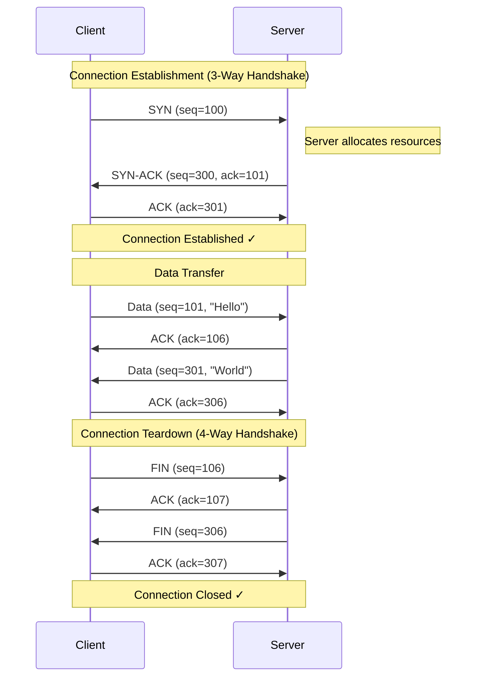
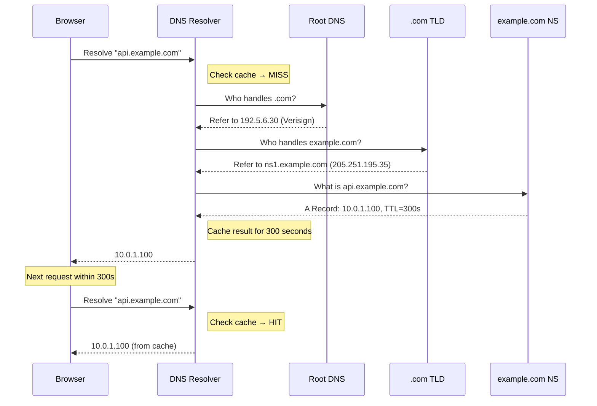
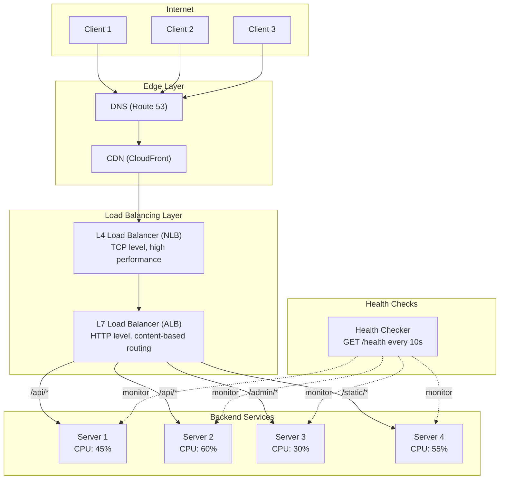
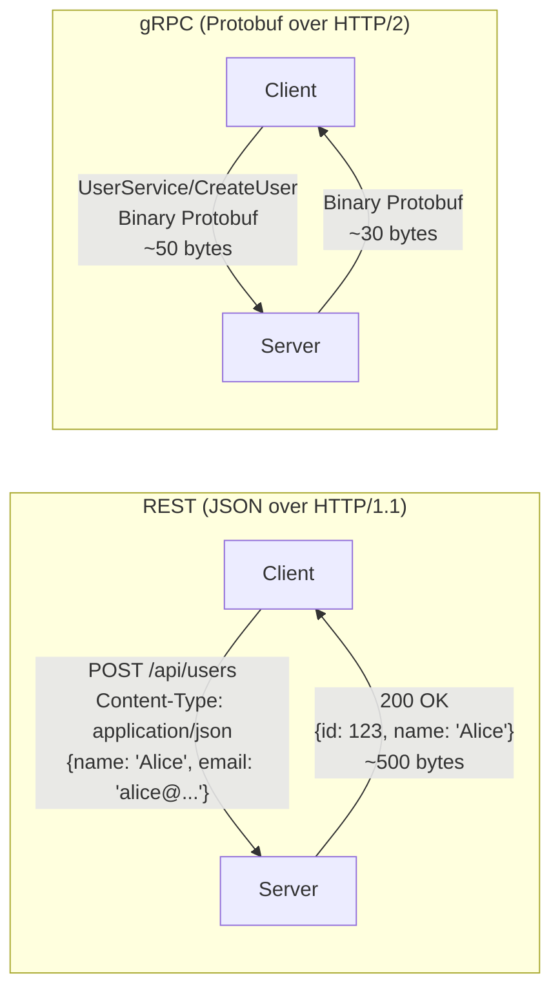
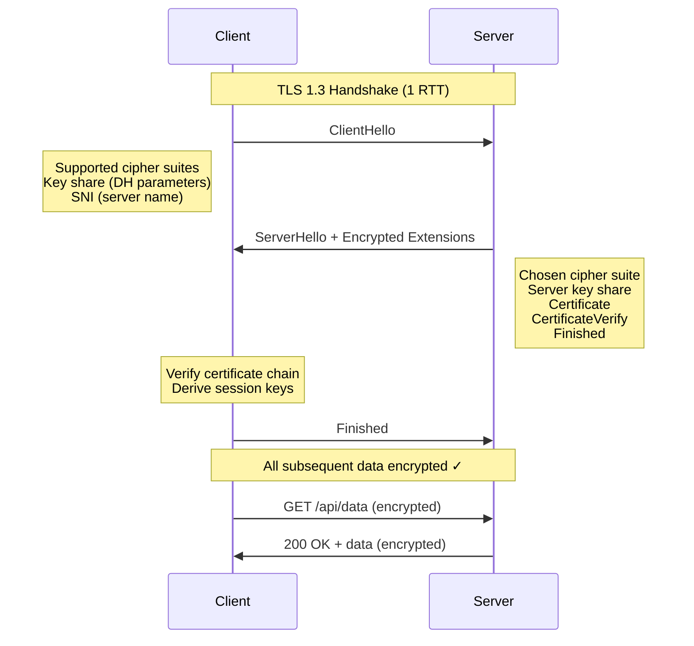
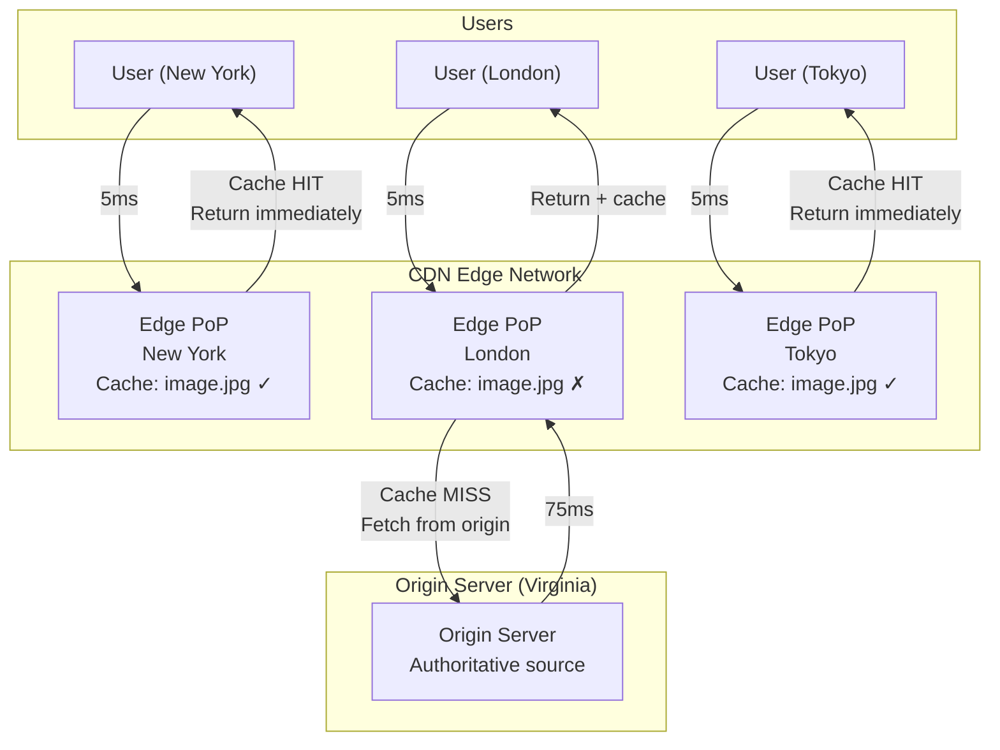

# Chapter 2: Networking Fundamentals for Distributed Systems

---

> *"The Internet is not a truck. It's a series of tubes."*  
> — Senator Ted Stevens (2006)  
>  
> *While the Senator was ridiculed, his analogy isn't entirely wrong — networks are pipelines with limited capacity, routing logic, and failure modes. Understanding how these "tubes" work is essential for building reliable distributed systems.*

---

## 1. Why This Matters

Every distributed system is built on top of a network. The network is the glue that connects independent nodes, the medium through which all coordination happens, and — crucially — the most common source of failures and performance problems. A distributed systems engineer who doesn't deeply understand networking is like a structural engineer who doesn't understand the properties of steel.

### The Network Is Everywhere

In a typical microservices request:

```
User → CDN → Load Balancer → API Gateway → Auth Service → Order Service → Database
       ↑       ↑                ↑              ↑             ↑            ↑
     HTTPS   TCP/L4          HTTP/2          gRPC          gRPC        TCP
     TLS     Health          Routing         mTLS          mTLS        Connection
     DNS     Checks          Rate            Retry         Circuit     Pooling
             Algo            Limiting        Backoff       Breaker
```

Every arrow is a network hop. Each hop involves:
- DNS resolution (sometimes)
- TCP connection establishment (3-way handshake)
- TLS negotiation (if encrypted)
- Serialization and deserialization
- Potential failure and retry

**Understanding networking is understanding the substrate on which your distributed system runs.**

### What Goes Wrong

| Network Issue | Impact on Distributed System |
|--------------|------------------------------|
| Packet loss | Retransmissions, increased latency |
| High latency | Timeouts, cascading failures |
| DNS failure | Complete service unreachability |
| Load balancer misconfiguration | Uneven load, hot spots |
| TLS certificate expiry | Complete connection failure |
| MTU mismatch | Silent packet drops |
| Connection pool exhaustion | Service hangs |
| Network partition | Split-brain, data inconsistency |

### Career Impact

- **System Design Interviews**: "How does DNS work?" "Explain the TCP handshake." "Compare gRPC vs REST." "How do load balancers work?" — these are table-stakes questions.
- **Production Debugging**: 90% of "the service is slow" issues are network issues. Connection timeouts, DNS resolution delays, TLS handshake overhead, connection pool exhaustion.
- **Architecture Decisions**: Choosing HTTP/2 vs gRPC, L4 vs L7 load balancers, connection pooling strategies — these decisions impact performance, cost, and reliability.

---

## 2. Beginner Intuition

### The Postal System Analogy

Think of computer networking like the postal system:

**Sending a Letter (UDP):**
You write a letter, put it in an envelope with the recipient's address, and drop it in a mailbox. You have no guarantee it will arrive. You don't know when it will arrive. You don't even know if the address exists. But it's fast — you just drop it and go.

**Sending a Registered Letter (TCP):**
You go to the post office. You register the letter. The post office gives you a tracking number. When the letter is delivered, the recipient signs for it, and you get a confirmation. If the letter is lost, the post office will resend it. It's slower, but you have guarantees.

**Sending via FedEx (HTTP):**
You use a standardized service built on top of the postal system. FedEx has rules: specific envelope formats, tracking systems, delivery confirmations, and standard shipping options. HTTP is like FedEx — a standardized application-layer protocol built on top of TCP.

**IP Address = Mailing Address:** Where to deliver  
**Port = Apartment Number:** Which application at that address  
**Protocol = Language:** How to interpret the contents  
**Router = Post Office:** Forwards mail to the next hop  
**DNS = Phone Book:** Looks up addresses by name  

### Layers of Abstraction

Networking uses layers, like a stack of abstraction. Each layer provides services to the layer above and uses services from the layer below:

```
You write a message in English              → Application Layer (HTTP, gRPC)
You put it in a standard envelope            → Transport Layer (TCP, UDP)
The post office stamps it with routing info  → Network Layer (IP)
The mail truck physically carries it         → Data Link + Physical Layer (Ethernet, WiFi)
```

Each layer only needs to understand its immediate neighbors. This modularity is what makes networking manageable.

### The Coffee Shop Analogy for HTTP

Imagine you're at a coffee shop:

**HTTP/1.1 (One Order at a Time):**
- You walk to the counter
- You order a coffee
- You wait for it to be made
- You receive your coffee
- THEN you can order a muffin
- You wait again
- You receive your muffin

Even if the barista could start the muffin while making coffee, the protocol doesn't allow it.

**HTTP/2 (Multiple Orders, One Counter):**
- You walk to the counter
- You order a coffee AND a muffin AND an orange juice at the same time
- The barista works on all three simultaneously
- They hand you items as they're ready (maybe juice first, then muffin, then coffee)
- All through the same counter (single connection)

**HTTP/3 (Multiple Independent Counters):**
- Like HTTP/2, but if the coffee machine breaks, you still get your muffin and juice
- Each order is independent — one failure doesn't block the others (no head-of-line blocking)

---

## 3. Core Theory

### 3.1 The TCP/IP Protocol Stack

The TCP/IP model is the foundation of Internet communication. It has four layers (sometimes mapped to the 7-layer OSI model):

```
┌──────────────────────────────────────────────────────┐
│  Layer 4: APPLICATION                                 │
│  (HTTP, gRPC, DNS, SMTP, FTP, SSH, MQTT)             │
│  What: Application-specific protocols                 │
│  Data Unit: Messages                                  │
├──────────────────────────────────────────────────────┤
│  Layer 3: TRANSPORT                                   │
│  (TCP, UDP, QUIC)                                     │
│  What: End-to-end communication, reliability          │
│  Data Unit: Segments (TCP) / Datagrams (UDP)          │
├──────────────────────────────────────────────────────┤
│  Layer 2: INTERNET (NETWORK)                          │
│  (IP, ICMP, ARP)                                      │
│  What: Routing packets across networks                │
│  Data Unit: Packets                                   │
├──────────────────────────────────────────────────────┤
│  Layer 1: NETWORK ACCESS (LINK + PHYSICAL)            │
│  (Ethernet, WiFi, Fiber, DSL)                         │
│  What: Physical transmission of bits                  │
│  Data Unit: Frames                                    │
└──────────────────────────────────────────────────────┘
```

#### Layer 1: Network Access Layer (Link + Physical)

**Physical Layer**: Deals with raw bit transmission over physical media.
- **Ethernet**: Copper cables (Cat5e, Cat6), up to 10 Gbps
- **Fiber Optic**: Light pulses through glass, up to 400 Gbps
- **WiFi**: Radio waves, 802.11ax (WiFi 6) up to 9.6 Gbps theoretical
- **Cellular**: 4G LTE (~100 Mbps), 5G (~10 Gbps theoretical)

**Data Link Layer**: Handles frame delivery on a local network segment.
- **MAC Addresses**: 48-bit hardware addresses (e.g., `aa:bb:cc:dd:ee:ff`)
- **Ethernet Frames**: Header (14 bytes) + Payload (46-1500 bytes) + CRC (4 bytes)
- **Switches**: Forward frames based on MAC address tables
- **MTU (Maximum Transmission Unit)**: Maximum frame payload size, typically 1500 bytes for Ethernet
- **Jumbo Frames**: MTU of 9000 bytes, used in data centers for efficiency

**Why this matters for distributed systems:**
- MTU mismatches can cause silent packet drops
- Data center networks use jumbo frames for efficiency
- WiFi vs Ethernet has very different reliability characteristics
- Understanding physical limitations (speed of light in fiber = ~200,000 km/s) sets minimum latency bounds

#### Layer 2: Internet Layer (Network Layer)

**IP (Internet Protocol)**: Routes packets across network boundaries.

**IPv4:**
- 32-bit addresses (e.g., `192.168.1.1`)
- ~4.3 billion addresses (exhausted in 2011)
- NAT (Network Address Translation) extends address space

**IPv6:**
- 128-bit addresses (e.g., `2001:0db8:85a3:0000:0000:8a2e:0370:7334`)
- 3.4 × 10³⁸ addresses (enough for every grain of sand on Earth)
- Slow adoption but accelerating

**Key IP Concepts:**

| Concept | Description | Distributed Systems Impact |
|---------|-------------|---------------------------|
| TTL (Time to Live) | Max hops before packet is dropped | Prevents routing loops |
| Fragmentation | Breaking large packets into smaller ones | Performance overhead; often avoided with Path MTU Discovery |
| IP Routing | Forwarding packets hop-by-hop via routing tables | Determines latency and path |
| Multicast | Send to a group of hosts | Used in service discovery, cluster membership |
| Anycast | Multiple hosts share same IP; nearest responds | Used by CDNs and DNS (Google's 8.8.8.8) |

**ICMP (Internet Control Message Protocol):**
- Used for network diagnostics
- `ping` (echo request/reply)
- `traceroute` (TTL-based path discovery)
- Error messages (destination unreachable, time exceeded)

#### Layer 3: Transport Layer

This is the most critical layer for distributed systems engineers. It provides end-to-end communication between applications.

**TCP (Transmission Control Protocol):**
- **Connection-oriented**: Must establish connection before data transfer
- **Reliable**: Guarantees delivery through acknowledgments and retransmissions
- **Ordered**: Data arrives in the order it was sent
- **Flow control**: Prevents fast sender from overwhelming slow receiver (sliding window)
- **Congestion control**: Prevents overloading the network (slow start, AIMD)
- **Full duplex**: Data flows in both directions simultaneously

**UDP (User Datagram Protocol):**
- **Connectionless**: No handshake, just send
- **Unreliable**: No guarantee of delivery
- **Unordered**: Packets may arrive in any order
- **No flow/congestion control**: Sender can blast at full speed
- **Low overhead**: 8-byte header vs TCP's 20-byte minimum header
- **Low latency**: No handshake delay

**QUIC (Quick UDP Internet Connections):**
- Built on UDP but provides TCP-like reliability
- Developed by Google, now standardized as HTTP/3's transport
- 0-RTT connection establishment (for repeat connections)
- Built-in encryption (TLS 1.3 integrated)
- Multiplexing without head-of-line blocking
- Connection migration (survives IP changes, e.g., WiFi to cellular)

#### Layer 4: Application Layer

This layer contains the protocols that applications directly use:

| Protocol | Port | Purpose | Transport |
|----------|------|---------|-----------|
| HTTP | 80 | Web content | TCP |
| HTTPS | 443 | Encrypted web content | TCP (or QUIC) |
| DNS | 53 | Name resolution | UDP (primarily) |
| gRPC | varies | RPC framework | HTTP/2 over TCP |
| SMTP | 25 | Email sending | TCP |
| SSH | 22 | Secure shell access | TCP |
| MQTT | 1883 | IoT messaging | TCP |
| AMQP | 5672 | Message queuing | TCP |
| WebSocket | 80/443 | Full-duplex communication | TCP |

### 3.2 TCP Deep Dive

#### The TCP Three-Way Handshake

TCP establishes a connection through a three-way handshake:

```
Client                                    Server
  │                                         │
  │─── SYN (seq=x) ──────────────────────>│   Step 1: Client says "I want to connect"
  │                                         │           and picks initial sequence number
  │                                         │
  │<── SYN-ACK (seq=y, ack=x+1) ─────────│   Step 2: Server agrees, picks its own
  │                                         │           sequence number, acknowledges client's
  │                                         │
  │─── ACK (ack=y+1) ────────────────────>│   Step 3: Client acknowledges server's
  │                                         │           sequence number
  │                                         │
  │═══════ CONNECTION ESTABLISHED ═════════│
  │                                         │
  │←────────── DATA EXCHANGE ─────────────→│
  │                                         │
```

**Cost**: 1.5 round-trips before any data is sent. At 150ms cross-continent latency, that's 225ms just for the handshake.

**Optimization**: TCP Fast Open (TFO) allows data in the SYN packet for repeat connections, saving 1 RTT.

#### TCP Connection Teardown (Four-Way Handshake)

```
Client                                    Server
  │                                         │
  │─── FIN ──────────────────────────────>│   Step 1: Client says "I'm done sending"
  │                                         │
  │<── ACK ──────────────────────────────│   Step 2: Server acknowledges
  │                                         │
  │<── FIN ──────────────────────────────│   Step 3: Server says "I'm done too"
  │                                         │
  │─── ACK ──────────────────────────────>│   Step 4: Client acknowledges
  │                                         │
  │═══════ CONNECTION CLOSED ══════════════│
```

**TIME_WAIT State**: After closing, the client enters TIME_WAIT for 2×MSL (Maximum Segment Lifetime, typically 60 seconds). This prevents old packets from being confused with new connections. In high-throughput servers, this can exhaust ephemeral ports.

**Fix**: Enable `SO_REUSEADDR` and `tcp_tw_reuse` to allow reuse of TIME_WAIT sockets.

#### TCP Flow Control

TCP uses a **sliding window** mechanism:

```
Sender's view of the byte stream:
┌───┬───┬───┬───┬───┬───┬───┬───┬───┬───┬───┬───┐
│ 1 │ 2 │ 3 │ 4 │ 5 │ 6 │ 7 │ 8 │ 9 │10 │11 │12 │
└───┴───┴───┴───┴───┴───┴───┴───┴───┴───┴───┴───┘
 ▲─ACKed──▲    ▲───── Send Window ─────▲    ▲─Not yet sendable
 (can free)    (can send without waiting)    (waiting for ACK)
```

The **receive window** (rwnd) advertised by the receiver tells the sender how much data the receiver can accept. This prevents a fast sender from overwhelming a slow receiver.

#### TCP Congestion Control

TCP implements several congestion control algorithms to prevent network overload:

**Slow Start:**
- Start with a small congestion window (cwnd = 1 MSS)
- Double cwnd every RTT (exponential growth)
- Continue until reaching slow-start threshold (ssthresh) or detecting loss

**Congestion Avoidance (AIMD):**
- After reaching ssthresh, increase cwnd by 1 MSS per RTT (additive increase)
- On packet loss, halve cwnd (multiplicative decrease)

```
     Congestion Window Size
     │
     │           ╱\      ╱\
     │         ╱    \   ╱    \
     │       ╱       ╲╱       \
     │      ╱                   \
     │    ╱                      ╲
     │  ╱    Slow     ╱Congestion \
     │╱     Start   ╱  Avoidance   ╲
     │─────────────────────────────────
     0                            Time
              ↑                ↑
         Loss detected    Loss detected
         (halve cwnd)     (halve cwnd)
```

**Modern Algorithms:**
- **TCP CUBIC**: Default in Linux. Uses a cubic function for window growth.
- **BBR (Bottleneck Bandwidth and RTT)**: Developed by Google. Models the network's bottleneck bandwidth and RTT rather than using loss as a congestion signal. Better for long-distance, high-bandwidth paths.

### 3.3 TCP vs UDP: Deep Comparison

| Feature | TCP | UDP |
|---------|-----|-----|
| **Connection** | Connection-oriented (handshake required) | Connectionless |
| **Reliability** | Guaranteed delivery with ACKs | No guarantees |
| **Ordering** | Maintains order | No ordering |
| **Flow Control** | Yes (sliding window) | No |
| **Congestion Control** | Yes (slow start, AIMD) | No |
| **Header Size** | 20-60 bytes | 8 bytes |
| **Latency** | Higher (handshake + head-of-line blocking) | Lower |
| **Overhead** | Higher (state, retransmissions) | Lower |
| **Multiplexing** | Head-of-line blocking | No HOL blocking |
| **Use Cases** | Web, email, file transfer, database | DNS, video streaming, gaming, VoIP |

**When to use TCP:**
- Data integrity is critical (financial transactions, file transfers)
- Order matters (streaming a video, loading a web page)
- You need guaranteed delivery (database replication)

**When to use UDP:**
- Low latency is critical (real-time gaming, VoIP)
- Small, independent messages (DNS queries)
- You can handle loss at the application layer (video streaming — a dropped frame is better than delayed frames)
- Multicast/broadcast (service discovery)

**Head-of-Line Blocking (TCP's Achilles' Heel):**
```
TCP stream with multiple logical messages:
┌─────┐┌─────┐┌─────┐┌─────┐
│ Msg1 ││ Msg2 ││ Msg3 ││ Msg4 │
└─────┘└─────┘└─────┘└─────┘

If Msg2's packet is lost:
- Msg3 and Msg4 must wait for Msg2's retransmission
- Even though Msg3 and Msg4 are complete and independent
- This is head-of-line blocking

QUIC (HTTP/3) solves this:
- Each stream is independent
- Msg2's loss only blocks Msg2, not Msg3 or Msg4
```

### 3.4 HTTP Protocol Evolution

#### HTTP/1.0 (1996)
- One request per TCP connection
- Connection closed after each response
- Extremely wasteful: TCP handshake for every request

#### HTTP/1.1 (1997) — Still widely used
- **Keep-Alive**: Reuse TCP connections for multiple requests
- **Pipelining**: Send multiple requests without waiting (but responses must be in order → head-of-line blocking)
- **Chunked Transfer Encoding**: Stream response without knowing total size
- **Host Header**: Multiple domains on one IP address (virtual hosting)
- **Caching**: Cache-Control, ETag, If-Modified-Since

**HTTP/1.1 Limitations:**
- Head-of-line blocking (even with pipelining, responses must be ordered)
- Text-based headers (verbose, no compression)
- No multiplexing (browsers open 6-8 connections per domain as workaround)
- No server push

#### HTTP/2 (2015) — Major leap forward
- **Binary Framing**: Headers and data encoded in binary (more compact, faster parsing)
- **Multiplexing**: Multiple requests/responses over a single TCP connection simultaneously
- **Stream Prioritization**: Client can indicate which resources are more important
- **Header Compression (HPACK)**: Dramatically reduces header overhead
- **Server Push**: Server can proactively send resources the client will need

```
HTTP/1.1: 6 parallel connections, one request each
┌──────┐ ┌──────┐ ┌──────┐ ┌──────┐ ┌──────┐ ┌──────┐
│Conn 1│ │Conn 2│ │Conn 3│ │Conn 4│ │Conn 5│ │Conn 6│
│Req 1 │ │Req 2 │ │Req 3 │ │Req 4 │ │Req 5 │ │Req 6 │
│Resp 1│ │Resp 2│ │Resp 3│ │Resp 4│ │Resp 5│ │Resp 6│
│Req 7 │ │Req 8 │ │      │ │      │ │      │ │      │
│Resp 7│ │Resp 8│ │      │ │      │ │      │ │      │
└──────┘ └──────┘ └──────┘ └──────┘ └──────┘ └──────┘

HTTP/2: 1 connection, multiplexed streams
┌──────────────────────────────────────────────────────┐
│                  Single Connection                    │
│                                                      │
│  Stream 1: ██░░██░░                                  │
│  Stream 2: ░░██░░██░░                                │
│  Stream 3: ████░░░░██                                │
│  Stream 4: ░░░░████░░                                │
│  Stream 5: ██████░░░░                                │
│  Stream 6: ░░░░░░████                                │
│  Stream 7: ██░░░░░░██                                │
│  Stream 8: ░░██████░░                                │
└──────────────────────────────────────────────────────┘
(Frames from different streams interleaved on one connection)
```

**HTTP/2 Limitation**: Still uses TCP, so a single lost packet blocks ALL streams (TCP-level head-of-line blocking).

#### HTTP/3 (2022) — Built on QUIC

- **QUIC Transport**: Uses UDP instead of TCP
- **No TCP HOL Blocking**: Each stream is independent at the transport level
- **0-RTT Connection**: For repeat visitors, can send data immediately
- **Built-in Encryption**: TLS 1.3 is mandatory and integrated into the transport
- **Connection Migration**: Connections survive IP address changes (WiFi → cellular)

```
HTTP/1.1 over TCP:
  Connect: 1 RTT (TCP) + 2 RTT (TLS 1.2) = 3 RTT before data

HTTP/2 over TCP:
  Connect: 1 RTT (TCP) + 1 RTT (TLS 1.3) = 2 RTT before data

HTTP/3 over QUIC:
  Connect: 1 RTT (QUIC + TLS 1.3 combined) = 1 RTT before data
  Repeat:  0 RTT (0-RTT resumption)
```

#### Comparison Table

| Feature | HTTP/1.1 | HTTP/2 | HTTP/3 |
|---------|----------|--------|--------|
| Transport | TCP | TCP | QUIC (UDP) |
| Multiplexing | No (workaround: multiple connections) | Yes | Yes |
| Header Compression | No | HPACK | QPACK |
| Server Push | No | Yes | Yes |
| Binary Protocol | No (text) | Yes | Yes |
| HOL Blocking | Application level | TCP level | None |
| Connection Setup | 2-3 RTT | 2 RTT | 1 RTT (0 for repeat) |
| Encryption | Optional | Practically required | Mandatory |
| Connection Migration | No | No | Yes |

### 3.5 HTTPS and TLS

#### Why TLS Matters

Without TLS, all HTTP traffic is plaintext. Anyone on the network path (ISP, coffee shop WiFi, rogue router) can:
- **Read** all data (passwords, tokens, personal information)
- **Modify** data in transit (inject ads, malware, redirect traffic)
- **Impersonate** either party (man-in-the-middle attack)

TLS provides three guarantees:
1. **Confidentiality**: Data is encrypted; only intended parties can read it
2. **Integrity**: Data cannot be modified in transit without detection
3. **Authentication**: The server (and optionally the client) is verified to be who they claim

#### TLS 1.3 Handshake (Modern)

TLS 1.3 (2018) simplified the handshake from 2 RTT to 1 RTT:

```
Client                                           Server
  │                                                │
  │──── ClientHello ─────────────────────────────>│
  │     (supported cipher suites,                  │
  │      key share for Diffie-Hellman,             │
  │      supported versions)                       │
  │                                                │
  │<─── ServerHello + EncryptedExtensions ────────│
  │     (chosen cipher suite,                      │
  │      server key share,                         │
  │      certificate,                              │
  │      certificate verify,                       │
  │      finished)                                 │
  │                                                │
  │──── Finished ────────────────────────────────>│
  │                                                │
  │══════ ENCRYPTED DATA EXCHANGE ═════════════════│
  │      (from this point, ALL data is encrypted)  │
```

**Key Improvements over TLS 1.2:**
- 1 RTT handshake (was 2 RTT in TLS 1.2)
- 0-RTT resumption for repeat connections (pre-shared keys)
- Removed insecure algorithms (RC4, DES, MD5, SHA-1)
- Perfect Forward Secrecy (PFS) mandatory — even if long-term keys are compromised, past sessions are safe
- Encrypted handshake (certificate and extensions encrypted)

#### mTLS (Mutual TLS)

In standard TLS, only the server presents a certificate. In mTLS, both client and server present certificates and verify each other. This is critical for service-to-service communication in distributed systems (zero-trust networking).

```
Standard TLS:   Client verifies Server identity
mTLS:           Client verifies Server AND Server verifies Client

Used in:
- Kubernetes service mesh (Istio, Linkerd)
- Internal microservice communication
- API authentication for B2B integrations
```

### 3.6 gRPC

gRPC is a high-performance RPC framework developed by Google. It's the dominant choice for internal service-to-service communication in modern distributed systems.

#### Core Concepts

**Protocol Buffers (Protobuf):**
- Binary serialization format (much more compact than JSON)
- Schema-defined (`.proto` files)
- Backward/forward compatible
- Code generation for multiple languages (Java, Go, Python, C++, etc.)

```protobuf
// user_service.proto
syntax = "proto3";

package userservice;

// Service definition — defines the RPC methods
service UserService {
    // Unary RPC: one request, one response
    rpc GetUser(GetUserRequest) returns (GetUserResponse);
    
    // Server streaming: one request, stream of responses
    rpc ListUsers(ListUsersRequest) returns (stream UserResponse);
    
    // Client streaming: stream of requests, one response
    rpc UploadUsers(stream CreateUserRequest) returns (UploadUsersResponse);
    
    // Bidirectional streaming: both sides stream
    rpc Chat(stream ChatMessage) returns (stream ChatMessage);
}

message GetUserRequest {
    int64 user_id = 1;
}

message GetUserResponse {
    int64 user_id = 1;
    string name = 2;
    string email = 3;
    int64 created_at = 4;
    repeated string roles = 5;
}

message ListUsersRequest {
    int32 page_size = 1;
    string page_token = 2;
}

message UserResponse {
    int64 user_id = 1;
    string name = 2;
    string email = 3;
}

message CreateUserRequest {
    string name = 1;
    string email = 2;
}

message UploadUsersResponse {
    int32 created_count = 1;
}

message ChatMessage {
    string sender = 1;
    string content = 2;
    int64 timestamp = 3;
}
```

#### Four Types of gRPC Communication

```
1. Unary RPC (Request-Response)
   Client ────Request────> Server
   Client <───Response──── Server

2. Server Streaming
   Client ────Request────> Server
   Client <───Response 1── Server
   Client <───Response 2── Server
   Client <───Response N── Server

3. Client Streaming
   Client ────Request 1──> Server
   Client ────Request 2──> Server
   Client ────Request N──> Server
   Client <───Response──── Server

4. Bidirectional Streaming
   Client ────Request 1──> Server
   Client <───Response 1── Server
   Client ────Request 2──> Server
   Client ────Request 3──> Server
   Client <───Response 2── Server
   Client <───Response 3── Server
```

#### gRPC vs REST: Deep Comparison

| Dimension | gRPC | REST |
|-----------|------|------|
| **Protocol** | HTTP/2 | HTTP/1.1 or HTTP/2 |
| **Serialization** | Protocol Buffers (binary) | JSON (text, usually) |
| **Contract** | Strict (.proto files) | Loose (OpenAPI optional) |
| **Streaming** | Native (4 patterns) | Workarounds (SSE, WebSocket) |
| **Code Generation** | Built-in, many languages | Third-party tools |
| **Browser Support** | Limited (needs gRPC-Web proxy) | Native |
| **Human Readability** | Binary (not readable) | JSON (human readable) |
| **Performance** | ~7-10x faster serialization | Slower but good enough for most |
| **Payload Size** | ~30-80% smaller | Larger (JSON verbose) |
| **Error Handling** | Rich status codes + details | HTTP status codes |
| **Deadlines** | Built-in propagation | Must implement manually |
| **Load Balancing** | Needs L7 or client-side | Standard L7 works |
| **Caching** | Not built-in (HTTP/2 push) | Built-in (HTTP caching) |
| **API Discoverability** | Requires proto files | Browsable (HATEOAS) |
| **Adoption** | Growing fast for internal | Universal, industry standard |

**When to use gRPC:**
- Internal service-to-service communication
- Low-latency, high-throughput requirements
- Polyglot environments (multiple programming languages)
- Streaming use cases
- Strict API contracts are important

**When to use REST:**
- Public-facing APIs
- Browser clients
- Simple CRUD operations
- When human readability of payloads matters
- When caching is important (CDN, browser cache)

### 3.7 REST API Design Principles

REST (Representational State Transfer) is an architectural style for building web APIs, defined by Roy Fielding in his 2000 dissertation.

#### Six REST Constraints

1. **Client-Server**: Separation of concerns between UI and data storage
2. **Stateless**: Each request contains all information needed; server stores no client context
3. **Cacheable**: Responses must define themselves as cacheable or not
4. **Uniform Interface**: Standardized way to interact with resources
5. **Layered System**: Client can't tell if connected directly to server or through intermediary
6. **Code on Demand** (optional): Server can extend client by sending executable code (JavaScript)

#### REST Best Practices

```
Good REST API Design:
────────────────────────────────────────────────────────────

Resource Naming (nouns, not verbs):
  ✓ GET    /users              (list users)
  ✓ GET    /users/123          (get user 123)
  ✓ POST   /users              (create user)
  ✓ PUT    /users/123          (replace user 123)
  ✓ PATCH  /users/123          (update user 123 partially)
  ✓ DELETE /users/123          (delete user 123)
  ✗ GET    /getUser?id=123     (verb in URL)
  ✗ POST   /createUser         (verb in URL)

Relationships:
  ✓ GET    /users/123/orders          (orders for user 123)
  ✓ GET    /users/123/orders/456      (order 456 for user 123)

Filtering, Sorting, Pagination:
  ✓ GET    /users?status=active&sort=name&page=2&limit=20

Versioning:
  ✓ GET    /v1/users/123              (URL versioning)
  ✓ GET    /users/123                 (Header: Accept: application/vnd.api.v1+json)

HTTP Status Codes:
  200 OK              - Successful GET, PUT, PATCH
  201 Created         - Successful POST
  204 No Content      - Successful DELETE
  400 Bad Request     - Invalid request body
  401 Unauthorized    - Missing or invalid authentication
  403 Forbidden       - Authenticated but not authorized
  404 Not Found       - Resource doesn't exist
  409 Conflict        - Conflicting update (optimistic locking)
  429 Too Many Req    - Rate limit exceeded
  500 Internal Error  - Server error
  503 Service Unavail - Temporarily overloaded/maintenance
```

### 3.8 DNS (Domain Name System)

DNS is the phonebook of the Internet. It translates human-readable domain names (google.com) to IP addresses (142.250.80.46).

#### DNS Hierarchy

```
                    ┌──────────────┐
                    │  Root Servers │ (13 root server clusters, worldwide)
                    │  (.)          │
                    └──────┬───────┘
                           │
              ┌────────────┼────────────┐
              │            │            │
        ┌─────▼────┐ ┌────▼─────┐ ┌───▼──────┐
        │ .com TLD │ │ .org TLD │ │ .io TLD  │  (Top-Level Domain servers)
        └─────┬────┘ └──────────┘ └──────────┘
              │
     ┌────────┼────────────┐
     │        │            │
┌────▼───┐ ┌─▼────────┐ ┌▼────────┐
│google  │ │amazon    │ │netflix  │  (Authoritative name servers)
│.com    │ │.com      │ │.com     │
└────────┘ └──────────┘ └─────────┘
```

#### DNS Resolution Process

```
User's Browser                DNS Resolver          Root Server    .com TLD    example.com
     │                        (e.g., 8.8.8.8)           │            │          Auth NS
     │                             │                     │            │            │
     │  "What is example.com?"     │                     │            │            │
     │ ──────────────────────────>│                     │            │            │
     │                             │  "Where is .com?"   │            │            │
     │                             │────────────────────>│            │            │
     │                             │  "Ask 192.5.6.30"   │            │            │
     │                             │<────────────────────│            │            │
     │                             │                     │            │            │
     │                             │  "Where is example.com?"         │            │
     │                             │────────────────────────────────>│            │
     │                             │  "Ask 205.251.195.35"           │            │
     │                             │<────────────────────────────────│            │
     │                             │                     │            │            │
     │                             │  "What is the A record for example.com?"     │
     │                             │───────────────────────────────────────────>  │
     │                             │  "93.184.216.34, TTL=300"                    │
     │                             │<──────────────────────────────────────────── │
     │                             │                     │            │            │
     │  "93.184.216.34"            │  (cache result                  │            │
     │ <──────────────────────────│   for 300 seconds)               │            │
     │                             │                                  │            │
```

#### DNS Record Types

| Type | Purpose | Example |
|------|---------|---------|
| **A** | Maps name to IPv4 address | `example.com → 93.184.216.34` |
| **AAAA** | Maps name to IPv6 address | `example.com → 2606:2800:220:1:248:1893:25c8:1946` |
| **CNAME** | Alias to another name | `www.example.com → example.com` |
| **MX** | Mail exchange server | `example.com → mail.example.com` |
| **TXT** | Arbitrary text (SPF, DKIM) | `example.com → "v=spf1 include:..."` |
| **NS** | Authoritative name server | `example.com → ns1.example.com` |
| **SRV** | Service location with port | `_http._tcp.example.com → server1:8080` |
| **SOA** | Start of authority | Zone metadata |
| **PTR** | Reverse lookup (IP → name) | `34.216.184.93 → example.com` |

#### DNS in Distributed Systems

**Service Discovery via DNS:**
- Kubernetes uses DNS extensively (`my-service.my-namespace.svc.cluster.local`)
- SRV records can include port information and priority/weight for load balancing
- Consul provides DNS interface for service discovery

**DNS-Based Load Balancing:**
- Return multiple A records; client picks one (usually the first)
- Weighted DNS: return different records with different probabilities
- Geographic DNS: return different IPs based on client location

**DNS Failover:**
- Health-checked DNS (Route 53, Cloudflare)
- Automatically remove unhealthy IPs from DNS responses
- TTL determines how quickly clients pick up changes

**DNS Caching Layers:**
```
Browser cache (seconds to minutes)
  → OS resolver cache (respects TTL)
    → Local DNS resolver (ISP or 8.8.8.8)
      → Intermediate resolvers
        → Authoritative DNS server
```

**DNS Problems in Production:**
- **TTL too long**: Changes take too long to propagate
- **TTL too short**: High DNS query load, increased latency
- **DNS resolver failure**: Complete service unreachability (this is why many services hardcode critical IPs as fallback)
- **DNS cache poisoning**: Malicious DNS responses redirect traffic

### 3.9 Load Balancers

Load balancers distribute incoming traffic across multiple backend servers. They are critical for scalability, availability, and performance.

#### L4 vs L7 Load Balancers

```
┌────────────────────────────────────────────────────────┐
│          L4 (Transport Layer) Load Balancer             │
│                                                        │
│  Operates at TCP/UDP level                             │
│  Decisions based on: IP address, port, protocol        │
│  Does NOT inspect content (HTTP headers, URL, etc.)    │
│  Very fast (just forwards packets)                     │
│  Examples: AWS NLB, HAProxy (TCP mode), iptables       │
│                                                        │
│  Use when: Raw performance matters, non-HTTP protocols │
└────────────────────────────────────────────────────────┘

┌────────────────────────────────────────────────────────┐
│          L7 (Application Layer) Load Balancer           │
│                                                        │
│  Operates at HTTP/HTTPS level                          │
│  Decisions based on: URL path, headers, cookies, body  │
│  CAN inspect and modify content                        │
│  Slower than L4 (must parse HTTP)                      │
│  Examples: AWS ALB, Nginx, HAProxy (HTTP mode), Envoy  │
│                                                        │
│  Use when: Content-based routing, SSL termination,     │
│            rate limiting, header manipulation needed    │
└────────────────────────────────────────────────────────┘
```

**Comparison:**

| Feature | L4 Load Balancer | L7 Load Balancer |
|---------|-----------------|-----------------|
| Layer | Transport (TCP/UDP) | Application (HTTP) |
| Performance | Very high (~millions of connections/sec) | High (~100K-1M req/sec) |
| Content Inspection | No | Yes |
| SSL Termination | Pass-through or terminate | Typically terminates |
| URL-based Routing | No | Yes |
| Header Manipulation | No | Yes |
| WebSocket Support | Yes (transparent) | Yes (protocol-aware) |
| Health Checks | TCP connect / simple probe | HTTP endpoint checks |
| Cost | Lower | Higher |
| Complexity | Lower | Higher |

#### Load Balancing Algorithms

**1. Round Robin**
Requests are distributed to servers sequentially in a circular order.
```
Request 1 → Server A
Request 2 → Server B
Request 3 → Server C
Request 4 → Server A
Request 5 → Server B
...
```
- **Pros**: Simple, fair distribution
- **Cons**: Ignores server capacity and current load
- **Best for**: Homogeneous servers with similar request costs

**2. Weighted Round Robin**
Like round robin, but servers with higher weight receive more requests.
```
Weights: A=5, B=3, C=2
Request distribution: A,A,A,A,A,B,B,B,C,C (then repeat)
```
- **Pros**: Accounts for different server capacities
- **Cons**: Static weights; doesn't adapt to actual load

**3. Least Connections**
Send to the server with the fewest active connections.
```
Server A: 10 active connections
Server B: 7 active connections   ← next request goes here
Server C: 15 active connections
```
- **Pros**: Adapts to actual server load
- **Cons**: Doesn't account for request complexity
- **Best for**: Long-lived connections, varying request costs

**4. Least Response Time**
Send to the server with the lowest average response time AND fewest connections.
- **Pros**: Best approximation of actual server capacity
- **Cons**: Requires monitoring response times, can oscillate

**5. IP Hash**
Hash the client's IP address to determine which server receives the request. Same IP always goes to the same server (sticky sessions).
```
hash(client_IP) % num_servers = server_index
```
- **Pros**: Session affinity without cookies
- **Cons**: Uneven distribution if IP distribution is skewed

**6. Consistent Hashing**
Maps both servers and requests to a hash ring. Requests go to the nearest server clockwise on the ring.
```
          Server A
          ╱    ╲
       ╱          ╲
     ╱              ╲
   ╱     Hash Ring    ╲
  ╱                    ╲
 │                      │
 │                      │
  ╲                    ╱  Server B
   ╲                ╱
     ╲            ╱
       ╲        ╱
         Server C
```
- **Pros**: Adding/removing servers only remaps ~1/N of keys (not all of them)
- **Cons**: Can be uneven without virtual nodes
- **Best for**: Caching layers (memcached, Redis), distributed storage

**7. Random**
Send to a randomly chosen server.
- **Pros**: No state to maintain, simple
- **Cons**: Can be uneven in short bursts
- **Best for**: Large number of servers (law of large numbers makes it even)

**8. Power of Two Random Choices**
Choose two servers randomly, then send to the one with fewer connections.
- **Pros**: Much better than pure random, nearly as good as least connections, but with less coordination overhead
- **Cons**: Slightly more complex than random
- **Best for**: Large-scale systems where full least-connections state is expensive

### 3.10 Proxies and Reverse Proxies

#### Forward Proxy
Sits between clients and the Internet. The client knows about the proxy and sends requests through it.

```
Client → Forward Proxy → Internet → Server

Use cases:
- Content filtering (corporate firewalls)
- Anonymity (hide client IP)
- Caching (reduce bandwidth)
- Access control
```

#### Reverse Proxy
Sits between the Internet and backend servers. Clients don't know about it; they think they're talking directly to the server.

```
Client → Internet → Reverse Proxy → Backend Servers

Use cases:
- Load balancing
- SSL termination
- Caching
- Compression
- Rate limiting
- Security (WAF, DDoS protection)
- URL rewriting
```

#### Popular Reverse Proxies

**Nginx:**
- Event-driven, non-blocking architecture
- Extremely efficient for static content
- Widely used as reverse proxy and load balancer
- Configuration via `.conf` files
- Can handle 10,000+ concurrent connections easily

**HAProxy:**
- Purpose-built for load balancing
- Best-in-class TCP (L4) and HTTP (L7) proxying
- Rich health checking capabilities
- Detailed statistics and monitoring
- Used by GitHub, Reddit, Stack Overflow, Twitter

**Envoy:**
- Modern, cloud-native proxy built for microservices
- Designed for service mesh (sidecar pattern)
- Rich observability (distributed tracing, metrics, logging)
- Dynamic configuration via xDS API
- Used as the data plane in Istio service mesh
- Supports HTTP/2 and gRPC natively

**Comparison:**

| Feature | Nginx | HAProxy | Envoy |
|---------|-------|---------|-------|
| Primary Use | Web server + reverse proxy | Load balancer | Service mesh proxy |
| Configuration | Static (reload for changes) | Static (reload) | Dynamic (API-driven) |
| L4 Support | Yes | Excellent | Yes |
| L7 Support | Yes | Yes | Excellent |
| gRPC | Yes | Limited | Excellent |
| Observability | Basic | Good stats page | Excellent (tracing, metrics) |
| Service Discovery | No (third-party) | No (third-party) | Built-in (via xDS) |
| Hot Reload | Yes (graceful reload) | Yes | Yes (dynamic via API) |
| Performance | Excellent | Excellent | Good (more features = more overhead) |

### 3.11 Network Partitions

A network partition occurs when a network failure splits the system into two or more groups that cannot communicate with each other, but each group can still communicate internally.

```
Before Partition:
┌─────────────────────────────────────────┐
│  Node A ←──→ Node B ←──→ Node C        │
│     ↕           ↕           ↕           │
│  Node D ←──→ Node E ←──→ Node F        │
└─────────────────────────────────────────┘

After Partition:
┌──────────────────┐    ✗    ┌────────────────────┐
│  Node A ←──→ Node B│   ✗   │ Node C              │
│     ↕           ↕  │   ✗   │    ↕                 │
│  Node D ←──→ Node E│   ✗   │ Node F              │
└──────────────────┘    ✗    └────────────────────┘
   Partition 1               Partition 2
```

**Impact on Distributed Systems:**
- If using single-leader replication: one partition loses write access
- If using multi-leader: both accept writes → conflict resolution needed
- If using consensus (Raft/Paxos): the partition with majority continues; minority stops
- Clients in the minority partition may see stale data or errors

**Detection:**
- Heartbeat-based failure detection (if no heartbeat for N seconds, assume partitioned)
- Problem: can't distinguish "node crashed" from "network partitioned"
- Phi Accrual Failure Detector: assigns a continuous suspicion level rather than binary alive/dead

**Real-world Partition Examples:**
- GitHub had a 24-hour outage in 2018 due to a network partition that caused a split-brain in their MySQL cluster
- AWS us-east-1 has had multiple partition events affecting services like S3, DynamoDB
- Google experienced a BGP misconfiguration in 2020 that created partitions between their data centers

### 3.12 CDNs (Content Delivery Networks)

A CDN is a geographically distributed network of proxy servers that cache content close to end users, reducing latency and load on origin servers.

```
Without CDN:
User (Tokyo) ──── 200ms ────> Origin (Virginia)

With CDN:
User (Tokyo) ──── 5ms ────> CDN Edge (Tokyo) ──── cache hit ────> Response
                            or
User (Tokyo) ──── 5ms ────> CDN Edge (Tokyo) ──── cache miss ───> Origin (Virginia)
                                                                    ↓
                                                              CDN caches response
                                                              for future requests
```

**How CDNs Work:**
1. User requests `https://example.com/image.jpg`
2. DNS resolves to CDN edge server nearest to user (using Anycast or geo-DNS)
3. Edge server checks its cache
4. **Cache Hit**: Returns cached content immediately (< 10ms)
5. **Cache Miss**: Fetches from origin, caches it, then returns to user

**CDN Caching Strategies:**

| Strategy | Description | Use Case |
|----------|-------------|----------|
| **Pull** | CDN fetches from origin on cache miss | Most common, simple |
| **Push** | Origin proactively pushes content to CDN | Large files, planned releases |
| **Invalidation** | Origin tells CDN to purge cached content | Updated content |

**Major CDN Providers:**
- Cloudflare (free tier, 300+ edge locations)
- AWS CloudFront (integrated with AWS)
- Akamai (largest, most enterprise)
- Fastly (edge computing, real-time purging)
- Google Cloud CDN

**CDN for More Than Static Content:**
- Edge computing (run code at the edge: Cloudflare Workers, Lambda@Edge)
- DDoS protection
- Web Application Firewall (WAF)
- Bot mitigation
- Image optimization (resize, format conversion at edge)

### 3.13 Connection Pooling

Creating a new TCP connection is expensive (3-way handshake, TLS negotiation). Connection pooling maintains a pool of reusable connections to avoid this overhead.

```
Without Connection Pooling:
Request 1: [Handshake 1.5 RTT] + [TLS 1 RTT] + [Request/Response] + [Close]
Request 2: [Handshake 1.5 RTT] + [TLS 1 RTT] + [Request/Response] + [Close]
Request 3: [Handshake 1.5 RTT] + [TLS 1 RTT] + [Request/Response] + [Close]

With Connection Pooling:
Request 1: [Handshake 1.5 RTT] + [TLS 1 RTT] + [Request/Response]
Request 2: [Request/Response]  ← Reused connection!
Request 3: [Request/Response]  ← Reused connection!
```

**Connection Pool Parameters:**

| Parameter | Description | Typical Value |
|-----------|-------------|---------------|
| Min Pool Size | Minimum connections to maintain | 5-10 |
| Max Pool Size | Maximum connections allowed | 20-100 |
| Idle Timeout | Close idle connections after this time | 30-300 seconds |
| Max Lifetime | Close connection after this time (regardless of idle) | 30-60 minutes |
| Connection Timeout | Max time to wait for a new connection | 5-10 seconds |
| Validation Interval | How often to verify connection health | 30-60 seconds |

### 3.14 Keep-Alive Connections

HTTP Keep-Alive (persistent connections) allows multiple HTTP requests over a single TCP connection.

```
Without Keep-Alive (HTTP/1.0 default):
TCP Connect → Request 1 → Response 1 → TCP Close
TCP Connect → Request 2 → Response 2 → TCP Close
TCP Connect → Request 3 → Response 3 → TCP Close

With Keep-Alive (HTTP/1.1 default):
TCP Connect → Request 1 → Response 1
           → Request 2 → Response 2
           → Request 3 → Response 3
           → ... → TCP Close (after timeout or max requests)
```

**Keep-Alive vs Connection Pooling:**
- **Keep-Alive**: HTTP-level mechanism to reuse TCP connections
- **Connection Pooling**: Application-level management of a pool of reusable connections
- They work together: the pool manages connections, and keep-alive keeps those connections open

---

## 4. Architecture Deep Dive

### 4.1 How a Modern Web Request Traverses the Network Stack

Let's trace what happens when a user types `https://www.amazon.com` in their browser:

```
1. URL Parsing
   Browser parses: scheme=https, host=www.amazon.com, port=443, path=/

2. DNS Resolution
   Browser checks:
   a. Browser DNS cache → miss
   b. OS DNS cache → miss
   c. DNS resolver (e.g., 8.8.8.8) → queries root → .com TLD → amazon.com NS
   d. Returns: 23.43.201.55 (might be a CDN edge IP via Anycast)

3. TCP Handshake
   Client → SYN → Server
   Client ← SYN-ACK ← Server
   Client → ACK → Server
   (Connection established: ~14ms within same region)

4. TLS 1.3 Handshake
   Client → ClientHello (cipher suites, key share)
   Client ← ServerHello + Certificate + Finished
   Client → Finished
   (TLS established: ~14ms additional)

5. HTTP/2 Request
   Client → GET / HTTP/2
   Headers: Host: www.amazon.com, Accept: text/html, Cookie: session=abc...

6. Server-Side Processing
   a. Load balancer receives request
   b. Routes to API Gateway
   c. API Gateway authenticates (validate session cookie)
   d. Routes to appropriate backend service
   e. Service calls databases, caches, other services
   f. Response generated

7. HTTP/2 Response
   Server → 200 OK
   Headers: Content-Type: text/html, Content-Encoding: gzip
   Body: <compressed HTML>

8. Browser Rendering
   Browser decompresses, parses HTML
   Discovers CSS, JS, images
   Makes additional HTTP/2 requests (multiplexed on same connection)
   Renders page progressively

Total Time: ~200-500ms for first meaningful paint
```

### 4.2 Data Center Networking Architecture

```
┌─────────────────────────────────────────────────────────┐
│                    DATA CENTER                           │
│                                                         │
│  ┌───────────────────────────────────────────────────┐  │
│  │         CORE SWITCHES (Border/Edge Routers)        │  │
│  │    ┌──────┐   ┌──────┐   ┌──────┐                 │  │
│  │    │Core 1│   │Core 2│   │Core 3│   (Redundant)    │  │
│  │    └──┬───┘   └──┬───┘   └──┬───┘                 │  │
│  └───────┼──────────┼──────────┼─────────────────────┘  │
│          │          │          │                          │
│  ┌───────┼──────────┼──────────┼─────────────────────┐  │
│  │    AGGREGATION SWITCHES (Distribution Layer)       │  │
│  │  ┌───┴──┐ ┌──┴───┐ ┌───┴──┐ ┌──────┐             │  │
│  │  │Agg 1 │ │Agg 2 │ │Agg 3 │ │Agg 4 │             │  │
│  │  └──┬───┘ └──┬───┘ └──┬───┘ └──┬───┘             │  │
│  └─────┼────────┼────────┼────────┼──────────────────┘  │
│        │        │        │        │                      │
│  ┌─────┼────────┼────────┼────────┼──────────────────┐  │
│  │  TOP-OF-RACK SWITCHES (Access Layer)               │  │
│  │ ┌──┴──┐ ┌──┴──┐ ┌──┴──┐ ┌──┴──┐ ... (per rack)   │  │
│  │ │ToR 1│ │ToR 2│ │ToR 3│ │ToR 4│                   │  │
│  │ └──┬──┘ └──┬──┘ └──┬──┘ └──┬──┘                   │  │
│  └────┼───────┼───────┼───────┼──────────────────────┘  │
│       │       │       │       │                          │
│   ┌───┴───┐┌──┴──┐┌──┴──┐┌──┴──┐                       │
│   │Rack 1 ││Rack2││Rack3││Rack4│  (20-40 servers each) │
│   │Servers││Serv.││Serv.││Serv.│                        │
│   └───────┘└─────┘└─────┘└─────┘                        │
│                                                         │
└─────────────────────────────────────────────────────────┘

Modern approach: CLOS/Fat-Tree topology (Spine-Leaf)
- Leaf switches (ToR): Connect to servers
- Spine switches: Connect all leaf switches
- Every leaf connects to every spine → uniform bandwidth
```

**Network Latency Within Data Center:**
- Same rack: ~0.1ms
- Same data center (cross-rack): ~0.5ms
- Same region (cross-DC): ~1-5ms
- Cross-region: ~50-150ms
- Cross-continent: ~100-300ms

### 4.3 Service Mesh Architecture

A service mesh is a dedicated infrastructure layer for handling service-to-service communication. It's implemented as a network of sidecar proxies deployed alongside service instances.

```
┌──────────────────────────────────────────────────────┐
│  Service Mesh (Istio/Linkerd)                        │
│                                                      │
│  ┌─────────────┐    ┌─────────────┐                  │
│  │ Control Plane│    │ Control Plane│                  │
│  │ (Istiod)     │    │ (Config,     │                  │
│  │              │    │  Certs,      │                  │
│  │              │    │  Discovery)  │                  │
│  └──────┬───────┘    └──────┬──────┘                  │
│         │ Config Push        │ Config Push             │
│         ▼                    ▼                         │
│  ┌──────────────┐    ┌──────────────┐                 │
│  │ Pod A         │    │ Pod B         │                 │
│  │ ┌──────────┐ │    │ ┌──────────┐ │                 │
│  │ │Service A │ │    │ │Service B │ │                 │
│  │ └────┬─────┘ │    │ └────▲─────┘ │                 │
│  │      │       │    │      │       │                 │
│  │ ┌────▼─────┐ │    │ ┌────┴─────┐ │                 │
│  │ │Envoy     │ │    │ │Envoy     │ │                 │
│  │ │Sidecar   │─┼────┼─│Sidecar   │ │                 │
│  │ │Proxy     │ │mTLS│ │Proxy     │ │                 │
│  │ └──────────┘ │    │ └──────────┘ │                 │
│  └──────────────┘    └──────────────┘                 │
│                                                      │
│  Features: mTLS, load balancing, retries, circuit     │
│  breakers, rate limiting, observability, traffic       │
│  shaping, canary deployments                          │
└──────────────────────────────────────────────────────┘
```

---

## 5. Visual Diagrams

### Diagram 1: TCP Three-Way Handshake



### Diagram 2: DNS Resolution Flow



### Diagram 3: Load Balancer Architecture



### Diagram 4: gRPC vs REST Communication



### Diagram 5: TLS 1.3 Handshake



### Diagram 6: CDN Architecture



---

## 6. Real Production Examples

### 6.1 Google's Networking Infrastructure

Google operates one of the most sophisticated private networks in the world.

**B4 (Software-Defined WAN):**
- Custom-built WAN connecting Google's data centers
- Uses OpenFlow for centralized traffic engineering
- Achieves ~100% link utilization (typical WANs: 30-40%)
- Prioritizes traffic: user-facing > batch processing

**Espresso (Peering Edge SDN):**
- Software-defined networking at the Internet peering edge
- Dynamically routes traffic to the best peering point
- Reduces latency for users by choosing optimal paths

**Maglev (L4 Load Balancer):**
- Custom software L4 load balancer
- Handles millions of connections per second per machine
- Uses consistent hashing for connection persistence
- Distributed across multiple machines with ECMP (Equal-Cost Multi-Path)
- No single point of failure

**gRPC:**
- Internally used for virtually all service-to-service communication
- Handles billions of RPCs per second across Google's infrastructure
- Designed for multi-language support (Google uses C++, Java, Go, Python)

### 6.2 Netflix's CDN: Open Connect

Netflix accounts for ~15% of all global Internet traffic. They built their own CDN to handle this.

**Architecture:**
- **Open Connect Appliances (OCAs)**: Custom hardware servers placed inside ISP networks
- Each OCA: 100TB+ of NVMe storage, 100 Gbps network
- Content is pre-positioned during off-peak hours
- Over 17,000 OCAs in 6,000+ ISP locations globally

**How It Works:**
1. User opens Netflix app → steering service determines best OCA
2. Steering considers: OCA health, BGP routing, ISP congestion, user location
3. Video streamed from OCA inside user's ISP network → near-zero internet traversal
4. If local OCA doesn't have content → fill from higher-tier CDN cache

**Results:**
- 95%+ of Netflix traffic served from within the user's ISP
- Massive reduction in Internet backbone traffic
- Consistent video quality even during peak hours

### 6.3 Cloudflare's Anycast Network

Cloudflare operates one of the largest Anycast networks in the world.

**How Anycast Works:**
- Same IP address announced from 300+ edge locations
- BGP routing naturally directs users to the nearest edge
- No DNS-based geo-routing needed (simpler, faster)

**DDoS Mitigation:**
- Attack traffic is distributed across 300+ locations
- Each location absorbs a fraction of the attack
- 248 Tbps total network capacity (can absorb massive attacks)
- Legitimate traffic continues to be served

### 6.4 Amazon's Elastic Load Balancing

AWS offers three types of load balancers:

**Application Load Balancer (ALB) — L7:**
- Content-based routing (URL path, host header, HTTP method)
- WebSocket support
- gRPC support
- Lambda function targets
- Sticky sessions via cookies
- Best for: HTTP/HTTPS microservices

**Network Load Balancer (NLB) — L4:**
- Ultra-low latency (~100μs added)
- Millions of requests per second
- Static IP address per AZ
- TLS termination at scale
- Best for: TCP/UDP workloads, extreme performance

**Gateway Load Balancer (GWLB) — L3:**
- Routes traffic to virtual appliances (firewalls, IDS/IPS)
- Transparent insertion into network path
- Best for: Network security appliances

### 6.5 Uber's Network Architecture

Uber's architecture requires extremely low-latency networking for real-time ride matching.

**Key Networking Decisions:**
- gRPC for service-to-service communication (replaced custom TChannel)
- HTTP/2 for mobile client → backend communication
- QUIC experimentation for mobile clients (handles WiFi → cellular transitions)
- Dedicated point-of-presence (PoP) servers in major cities
- Custom DNS infrastructure for fast service discovery

**Latency Optimization:**
- Pre-established connections from mobile app to nearest PoP
- Connection pooling between all service pairs
- Regional data placement (user data stored in closest region)
- Speculative execution for latency-critical paths

---

## 7. Java Implementations

### 7.1 Modern HTTP Server with Java HttpServer

```java
// =====================================================
// ModernHttpServer.java
// A clean HTTP server demonstrating networking concepts
// =====================================================

import com.sun.net.httpserver.*;
import java.io.*;
import java.net.*;
import java.nio.charset.StandardCharsets;
import java.util.*;
import java.util.concurrent.*;
import java.util.logging.*;

/**
 * A modern HTTP server demonstrating key networking concepts:
 * 1. HTTP request/response handling
 * 2. Routing
 * 3. JSON serialization
 * 4. Connection handling
 * 5. Graceful shutdown
 * 
 * In production, use Spring Boot, Quarkus, or Micronaut.
 * This raw implementation is for learning networking concepts.
 */
public class ModernHttpServer {

    private static final Logger logger = Logger.getLogger(
            ModernHttpServer.class.getName());

    private final HttpServer server;
    private final ExecutorService executor;

    public ModernHttpServer(int port, int threadPoolSize) throws IOException {
        // Create HTTP server
        this.server = HttpServer.create(new InetSocketAddress(port), 0);
        
        // Thread pool for handling requests concurrently
        this.executor = new ThreadPoolExecutor(
                threadPoolSize / 2,
                threadPoolSize,
                60L, TimeUnit.SECONDS,
                new LinkedBlockingQueue<>(5000),
                new ThreadPoolExecutor.AbortPolicy()
        );
        server.setExecutor(executor);

        // Register route handlers
        server.createContext("/api/health", new HealthHandler());
        server.createContext("/api/users", new UserHandler());
        server.createContext("/api/echo", new EchoHandler());
        
        logger.info("HTTP Server configured on port " + port);
    }

    public void start() {
        server.start();
        logger.info("HTTP Server started and listening...");
        
        // Graceful shutdown hook
        Runtime.getRuntime().addShutdownHook(new Thread(() -> {
            logger.info("Shutting down HTTP Server...");
            server.stop(5); // 5 second grace period
            executor.shutdown();
            try {
                if (!executor.awaitTermination(10, TimeUnit.SECONDS)) {
                    executor.shutdownNow();
                }
            } catch (InterruptedException e) {
                executor.shutdownNow();
            }
            logger.info("HTTP Server shut down");
        }));
    }

    // --- Health Check Handler ---
    static class HealthHandler implements HttpHandler {
        @Override
        public void handle(HttpExchange exchange) throws IOException {
            if (!"GET".equals(exchange.getRequestMethod())) {
                sendResponse(exchange, 405, 
                        "{\"error\": \"Method Not Allowed\"}");
                return;
            }
            
            // In production, check database connectivity, 
            // downstream services, disk space, etc.
            String response = String.format(
                "{\"status\": \"healthy\", \"timestamp\": %d, " +
                "\"uptime_ms\": %d, \"java_version\": \"%s\"}",
                System.currentTimeMillis(),
                ManagementFactory.getRuntimeMXBean().getUptime(),
                System.getProperty("java.version")
            );
            
            sendResponse(exchange, 200, response);
        }
    }

    // --- User CRUD Handler ---
    static class UserHandler implements HttpHandler {
        // In-memory store (in production: database)
        private final ConcurrentHashMap<String, Map<String, String>> users = 
                new ConcurrentHashMap<>();
        private int nextId = 1;

        @Override
        public void handle(HttpExchange exchange) throws IOException {
            String method = exchange.getRequestMethod();
            String path = exchange.getRequestURI().getPath();

            // Add CORS headers
            exchange.getResponseHeaders().add("Access-Control-Allow-Origin", "*");
            exchange.getResponseHeaders().add("Content-Type", "application/json");

            try {
                switch (method) {
                    case "GET" -> handleGet(exchange, path);
                    case "POST" -> handlePost(exchange);
                    case "DELETE" -> handleDelete(exchange, path);
                    default -> sendResponse(exchange, 405, 
                            "{\"error\": \"Method Not Allowed\"}");
                }
            } catch (Exception e) {
                logger.log(Level.SEVERE, "Error handling request", e);
                sendResponse(exchange, 500, 
                        "{\"error\": \"Internal Server Error\"}");
            }
        }

        private void handleGet(HttpExchange exchange, String path) 
                throws IOException {
            // GET /api/users — list all users
            if ("/api/users".equals(path)) {
                StringBuilder sb = new StringBuilder("[");
                boolean first = true;
                for (Map.Entry<String, Map<String, String>> entry : 
                        users.entrySet()) {
                    if (!first) sb.append(",");
                    sb.append(mapToJson(entry.getValue()));
                    first = false;
                }
                sb.append("]");
                sendResponse(exchange, 200, sb.toString());
                return;
            }

            // GET /api/users/{id} — get specific user
            String id = path.substring("/api/users/".length());
            Map<String, String> user = users.get(id);
            if (user == null) {
                sendResponse(exchange, 404, 
                        "{\"error\": \"User not found\"}");
            } else {
                sendResponse(exchange, 200, mapToJson(user));
            }
        }

        private void handlePost(HttpExchange exchange) throws IOException {
            String body = new String(
                    exchange.getRequestBody().readAllBytes(),
                    StandardCharsets.UTF_8);

            // Simple JSON parsing (in production, use Jackson/Gson)
            String name = extractJsonField(body, "name");
            String email = extractJsonField(body, "email");

            if (name == null || email == null) {
                sendResponse(exchange, 400, 
                        "{\"error\": \"name and email are required\"}");
                return;
            }

            String id = String.valueOf(nextId++);
            Map<String, String> user = new LinkedHashMap<>();
            user.put("id", id);
            user.put("name", name);
            user.put("email", email);
            user.put("created_at", String.valueOf(System.currentTimeMillis()));
            users.put(id, user);

            sendResponse(exchange, 201, mapToJson(user));
        }

        private void handleDelete(HttpExchange exchange, String path) 
                throws IOException {
            String id = path.substring("/api/users/".length());
            Map<String, String> removed = users.remove(id);
            if (removed == null) {
                sendResponse(exchange, 404, 
                        "{\"error\": \"User not found\"}");
            } else {
                sendResponse(exchange, 204, "");
            }
        }

        private String extractJsonField(String json, String field) {
            String search = "\"" + field + "\":\"";
            int start = json.indexOf(search);
            if (start == -1) return null;
            start += search.length();
            int end = json.indexOf("\"", start);
            return json.substring(start, end);
        }

        private String mapToJson(Map<String, String> map) {
            StringBuilder sb = new StringBuilder("{");
            boolean first = true;
            for (Map.Entry<String, String> entry : map.entrySet()) {
                if (!first) sb.append(",");
                sb.append("\"").append(entry.getKey()).append("\":\"")
                  .append(entry.getValue()).append("\"");
                first = false;
            }
            sb.append("}");
            return sb.toString();
        }
    }

    // --- Echo Handler (for testing) ---
    static class EchoHandler implements HttpHandler {
        @Override
        public void handle(HttpExchange exchange) throws IOException {
            StringBuilder response = new StringBuilder("{");
            response.append("\"method\": \"")
                    .append(exchange.getRequestMethod()).append("\",");
            response.append("\"path\": \"")
                    .append(exchange.getRequestURI()).append("\",");
            response.append("\"remote_address\": \"")
                    .append(exchange.getRemoteAddress()).append("\",");
            response.append("\"headers\": {");
            
            boolean first = true;
            for (Map.Entry<String, List<String>> header : 
                    exchange.getRequestHeaders().entrySet()) {
                if (!first) response.append(",");
                response.append("\"").append(header.getKey()).append("\": \"")
                        .append(String.join(", ", header.getValue()))
                        .append("\"");
                first = false;
            }
            response.append("}");
            
            if ("POST".equals(exchange.getRequestMethod()) || 
                "PUT".equals(exchange.getRequestMethod())) {
                String body = new String(
                        exchange.getRequestBody().readAllBytes(),
                        StandardCharsets.UTF_8);
                response.append(", \"body\": \"")
                        .append(body.replace("\"", "\\\"")).append("\"");
            }
            
            response.append("}");
            sendResponse(exchange, 200, response.toString());
        }
    }

    // --- Utility ---
    private static void sendResponse(HttpExchange exchange, int statusCode,
                                      String body) throws IOException {
        byte[] bytes = body.getBytes(StandardCharsets.UTF_8);
        exchange.getResponseHeaders().add("Content-Type", "application/json");
        exchange.sendResponseHeaders(statusCode, 
                statusCode == 204 ? -1 : bytes.length);
        if (statusCode != 204) {
            try (OutputStream os = exchange.getResponseBody()) {
                os.write(bytes);
            }
        }
        exchange.close();
    }

    private static java.lang.management.RuntimeMXBean ManagementFactory;

    public static void main(String[] args) throws IOException {
        int port = args.length > 0 ? Integer.parseInt(args[0]) : 8080;
        int threads = Runtime.getRuntime().availableProcessors() * 2;
        
        ModernHttpServer server = new ModernHttpServer(port, threads);
        server.start();
        
        System.out.println("Server running on http://localhost:" + port);
        System.out.println("Endpoints:");
        System.out.println("  GET  /api/health  - Health check");
        System.out.println("  GET  /api/users   - List users");
        System.out.println("  POST /api/users   - Create user");
        System.out.println("  GET  /api/echo    - Echo request details");
    }
}
```

### 7.2 gRPC Service Implementation

```java
// =====================================================
// gRPC Service Implementation
// Demonstrates gRPC server, client, and streaming
// =====================================================

// --- Proto file (user_service.proto) --- 
// (Code generation produces Java classes from this)
/*
syntax = "proto3";
package com.example.grpc;
option java_package = "com.example.grpc";

service UserService {
    rpc GetUser(GetUserRequest) returns (UserResponse);
    rpc CreateUser(CreateUserRequest) returns (UserResponse);
    rpc ListUsers(ListUsersRequest) returns (stream UserResponse);
    rpc BatchCreateUsers(stream CreateUserRequest) returns (BatchCreateResponse);
}

message GetUserRequest { int64 user_id = 1; }
message CreateUserRequest { string name = 1; string email = 2; }
message ListUsersRequest { int32 page_size = 1; }
message UserResponse { int64 user_id = 1; string name = 2; string email = 3; }
message BatchCreateResponse { int32 created_count = 1; }
*/

// --- Server Implementation ---
import io.grpc.*;
import io.grpc.stub.StreamObserver;
import java.io.IOException;
import java.util.concurrent.*;
import java.util.concurrent.atomic.*;
import java.util.logging.*;

/**
 * gRPC Server implementing UserService.
 * 
 * Key networking concepts demonstrated:
 * 1. HTTP/2-based communication (multiplexing, header compression)
 * 2. Protobuf serialization (compact binary format)
 * 3. Server streaming (ListUsers)
 * 4. Client streaming (BatchCreateUsers)
 * 5. Interceptors (logging, metrics, auth)
 * 6. Deadline propagation
 */
public class UserServiceGrpcServer extends UserServiceGrpc.UserServiceImplBase {

    private static final Logger logger = Logger.getLogger(
            UserServiceGrpcServer.class.getName());

    private final ConcurrentHashMap<Long, UserResponse> users = 
            new ConcurrentHashMap<>();
    private final AtomicLong nextId = new AtomicLong(1);

    // --- Unary RPC: Get a single user ---
    @Override
    public void getUser(GetUserRequest request, 
                        StreamObserver<UserResponse> responseObserver) {
        long userId = request.getUserId();
        logger.info("GetUser called for id: " + userId);

        UserResponse user = users.get(userId);
        if (user == null) {
            // gRPC has rich error model with status codes
            responseObserver.onError(
                Status.NOT_FOUND
                    .withDescription("User not found: " + userId)
                    .asRuntimeException()
            );
            return;
        }

        responseObserver.onNext(user);
        responseObserver.onCompleted();
    }

    // --- Unary RPC: Create a user ---
    @Override
    public void createUser(CreateUserRequest request, 
                           StreamObserver<UserResponse> responseObserver) {
        long id = nextId.getAndIncrement();
        
        UserResponse user = UserResponse.newBuilder()
                .setUserId(id)
                .setName(request.getName())
                .setEmail(request.getEmail())
                .build();

        users.put(id, user);
        logger.info("Created user: " + id + " - " + request.getName());

        responseObserver.onNext(user);
        responseObserver.onCompleted();
    }

    // --- Server Streaming: List all users ---
    @Override
    public void listUsers(ListUsersRequest request, 
                          StreamObserver<UserResponse> responseObserver) {
        int pageSize = request.getPageSize() > 0 ? request.getPageSize() : 10;
        logger.info("ListUsers called, page_size: " + pageSize);

        int count = 0;
        for (UserResponse user : users.values()) {
            if (count >= pageSize) break;

            // Check if client has cancelled the request
            // This is important for streaming - don't waste resources
            // sending data nobody wants
            if (Context.current().isCancelled()) {
                logger.warning("Client cancelled ListUsers stream");
                responseObserver.onError(
                    Status.CANCELLED.withDescription("Client cancelled")
                        .asRuntimeException());
                return;
            }

            responseObserver.onNext(user);
            count++;

            // Simulate some processing time per record
            try { Thread.sleep(10); } catch (InterruptedException e) {
                Thread.currentThread().interrupt();
            }
        }

        responseObserver.onCompleted();
        logger.info("ListUsers completed, sent " + count + " users");
    }

    // --- Client Streaming: Batch create users ---
    @Override
    public StreamObserver<CreateUserRequest> batchCreateUsers(
            StreamObserver<BatchCreateResponse> responseObserver) {
        
        AtomicInteger createdCount = new AtomicInteger(0);

        return new StreamObserver<CreateUserRequest>() {
            @Override
            public void onNext(CreateUserRequest request) {
                long id = nextId.getAndIncrement();
                UserResponse user = UserResponse.newBuilder()
                        .setUserId(id)
                        .setName(request.getName())
                        .setEmail(request.getEmail())
                        .build();
                users.put(id, user);
                createdCount.incrementAndGet();
                logger.info("Batch created user: " + id);
            }

            @Override
            public void onError(Throwable t) {
                logger.log(Level.WARNING, "BatchCreate error", t);
            }

            @Override
            public void onCompleted() {
                // Send summary response when client finishes streaming
                BatchCreateResponse response = BatchCreateResponse.newBuilder()
                        .setCreatedCount(createdCount.get())
                        .build();
                responseObserver.onNext(response);
                responseObserver.onCompleted();
                logger.info("BatchCreate completed, created " 
                        + createdCount.get() + " users");
            }
        };
    }

    // --- Server Startup ---
    public static void startServer(int port) throws IOException, 
            InterruptedException {
        
        // Build server with interceptors
        Server server = ServerBuilder.forPort(port)
                .addService(new UserServiceGrpcServer())
                .addService(
                    // gRPC health check service (standard)
                    io.grpc.protobuf.services.HealthStatusManager
                        .newDefault().getHealthService())
                // Interceptor for logging (like HTTP middleware)
                .intercept(new ServerInterceptor() {
                    @Override
                    public <ReqT, RespT> ServerCall.Listener<ReqT> interceptCall(
                            ServerCall<ReqT, RespT> call,
                            Metadata headers,
                            ServerCallHandler<ReqT, RespT> next) {
                        long startTime = System.nanoTime();
                        String methodName = call.getMethodDescriptor()
                                .getFullMethodName();
                        logger.info("gRPC call started: " + methodName);
                        
                        return next.startCall(
                            new ForwardingServerCall
                                .SimpleForwardingServerCall<>(call) {
                                @Override
                                public void close(Status status, 
                                                  Metadata trailers) {
                                    long duration = (System.nanoTime() 
                                            - startTime) / 1_000_000;
                                    logger.info("gRPC call completed: " 
                                            + methodName 
                                            + " status=" + status.getCode() 
                                            + " duration=" + duration + "ms");
                                    super.close(status, trailers);
                                }
                            }, headers);
                    }
                })
                .build();

        server.start();
        logger.info("gRPC Server started on port " + port);

        // Graceful shutdown
        Runtime.getRuntime().addShutdownHook(new Thread(() -> {
            logger.info("Shutting down gRPC server...");
            server.shutdown();
            try {
                server.awaitTermination(30, TimeUnit.SECONDS);
            } catch (InterruptedException e) {
                server.shutdownNow();
            }
        }));

        server.awaitTermination();
    }
}
```

```java
// --- gRPC Client ---
/**
 * gRPC client demonstrating:
 * 1. Channel management (connection pooling built-in to gRPC)
 * 2. Deadline propagation
 * 3. Retry policy
 * 4. Server streaming consumption
 * 5. Client streaming
 */
public class UserServiceGrpcClient {

    private static final Logger logger = Logger.getLogger(
            UserServiceGrpcClient.class.getName());

    private final ManagedChannel channel;
    private final UserServiceGrpc.UserServiceBlockingStub blockingStub;
    private final UserServiceGrpc.UserServiceStub asyncStub;

    public UserServiceGrpcClient(String host, int port) {
        // Create a gRPC channel (manages HTTP/2 connections)
        this.channel = ManagedChannelBuilder.forAddress(host, port)
                .usePlaintext() // For development only! Use TLS in production
                // Enable retry policy
                .enableRetry()
                .maxRetryAttempts(3)
                // Set maximum message size (default 4MB)
                .maxInboundMessageSize(16 * 1024 * 1024) // 16MB
                // Keep-alive settings
                .keepAliveTime(30, TimeUnit.SECONDS)
                .keepAliveTimeout(10, TimeUnit.SECONDS)
                .keepAliveWithoutCalls(true)
                .build();

        // Blocking stub for synchronous calls
        this.blockingStub = UserServiceGrpc.newBlockingStub(channel);
        // Async stub for streaming calls
        this.asyncStub = UserServiceGrpc.newStub(channel);
    }

    /**
     * Create a user with a deadline.
     * Deadlines propagate through the call chain in gRPC.
     * If the deadline expires, both client and server cancel the RPC.
     */
    public UserResponse createUser(String name, String email) {
        CreateUserRequest request = CreateUserRequest.newBuilder()
                .setName(name)
                .setEmail(email)
                .build();

        try {
            // Set a 5-second deadline for this call
            return blockingStub
                    .withDeadlineAfter(5, TimeUnit.SECONDS)
                    .createUser(request);
        } catch (StatusRuntimeException e) {
            if (e.getStatus().getCode() == Status.Code.DEADLINE_EXCEEDED) {
                logger.warning("CreateUser timed out for: " + name);
            } else {
                logger.warning("CreateUser failed: " 
                        + e.getStatus().getDescription());
            }
            throw e;
        }
    }

    /**
     * Get a user by ID.
     */
    public UserResponse getUser(long userId) {
        GetUserRequest request = GetUserRequest.newBuilder()
                .setUserId(userId)
                .build();

        return blockingStub
                .withDeadlineAfter(3, TimeUnit.SECONDS)
                .getUser(request);
    }

    /**
     * List users using server streaming.
     * The server sends users one by one, and we process them as they arrive.
     */
    public void listUsers(int pageSize) {
        ListUsersRequest request = ListUsersRequest.newBuilder()
                .setPageSize(pageSize)
                .build();

        // Blocking iteration over server stream
        Iterator<UserResponse> iterator = blockingStub
                .withDeadlineAfter(30, TimeUnit.SECONDS)
                .listUsers(request);

        System.out.println("--- Users ---");
        while (iterator.hasNext()) {
            UserResponse user = iterator.next();
            System.out.printf("  [%d] %s (%s)%n", 
                    user.getUserId(), user.getName(), user.getEmail());
        }
        System.out.println("--- End ---");
    }

    /**
     * Batch create users using client streaming.
     */
    public void batchCreateUsers(List<String[]> userDataList) 
            throws InterruptedException {
        CountDownLatch finishLatch = new CountDownLatch(1);

        StreamObserver<BatchCreateResponse> responseObserver = 
                new StreamObserver<>() {
            @Override
            public void onNext(BatchCreateResponse response) {
                System.out.println("Batch created " 
                        + response.getCreatedCount() + " users");
            }

            @Override
            public void onError(Throwable t) {
                logger.log(Level.WARNING, "BatchCreate failed", t);
                finishLatch.countDown();
            }

            @Override
            public void onCompleted() {
                logger.info("BatchCreate stream completed");
                finishLatch.countDown();
            }
        };

        StreamObserver<CreateUserRequest> requestObserver = 
                asyncStub.batchCreateUsers(responseObserver);

        try {
            for (String[] userData : userDataList) {
                CreateUserRequest request = CreateUserRequest.newBuilder()
                        .setName(userData[0])
                        .setEmail(userData[1])
                        .build();
                requestObserver.onNext(request);

                // Check for errors from the server
                if (finishLatch.getCount() == 0) {
                    logger.warning("Server completed before all " +
                            "requests sent");
                    return;
                }
            }
        } catch (RuntimeException e) {
            requestObserver.onError(e);
            throw e;
        }

        // Signal that we're done sending
        requestObserver.onCompleted();

        // Wait for server to finish processing
        if (!finishLatch.await(30, TimeUnit.SECONDS)) {
            logger.warning("BatchCreate timed out");
        }
    }

    public void shutdown() throws InterruptedException {
        channel.shutdown().awaitTermination(5, TimeUnit.SECONDS);
    }
}
```

### 7.3 Connection Pool Implementation

```java
// =====================================================
// SimpleConnectionPool.java
// Demonstrates connection pooling concepts
// =====================================================

import java.io.*;
import java.net.*;
import java.util.*;
import java.util.concurrent.*;
import java.util.concurrent.atomic.*;
import java.util.logging.*;

/**
 * A simplified connection pool demonstrating key concepts:
 * 1. Pre-creating connections (warm pool)
 * 2. Borrowing and returning connections
 * 3. Connection validation
 * 4. Idle connection eviction
 * 5. Maximum pool size enforcement
 * 6. Connection lifetime management
 * 
 * Production alternatives: HikariCP (database), Apache HttpClient (HTTP),
 * OkHttp (HTTP), Netty (low-level TCP)
 */
public class SimpleConnectionPool {

    private static final Logger logger = Logger.getLogger(
            SimpleConnectionPool.class.getName());

    // Pool configuration
    private final String host;
    private final int port;
    private final int minPoolSize;
    private final int maxPoolSize;
    private final long maxIdleTimeMs;
    private final long maxLifetimeMs;
    private final long connectionTimeoutMs;

    // Pool state
    private final BlockingDeque<PooledConnection> availableConnections = 
            new LinkedBlockingDeque<>();
    private final Set<PooledConnection> allConnections = 
            ConcurrentHashMap.newKeySet();
    private final AtomicInteger totalConnections = new AtomicInteger(0);
    private final AtomicBoolean closed = new AtomicBoolean(false);

    // Pool metrics
    private final AtomicLong totalBorrows = new AtomicLong(0);
    private final AtomicLong totalReturns = new AtomicLong(0);
    private final AtomicLong totalCreated = new AtomicLong(0);
    private final AtomicLong totalDestroyed = new AtomicLong(0);
    private final AtomicLong totalTimeouts = new AtomicLong(0);

    // Background maintenance
    private final ScheduledExecutorService maintenanceExecutor = 
            Executors.newSingleThreadScheduledExecutor(r -> {
                Thread t = new Thread(r, "connection-pool-maintenance");
                t.setDaemon(true);
                return t;
            });

    public SimpleConnectionPool(String host, int port, 
                                 int minPoolSize, int maxPoolSize) {
        this(host, port, minPoolSize, maxPoolSize, 
             60_000, 300_000, 5_000);
    }

    public SimpleConnectionPool(String host, int port, int minPoolSize, 
                                 int maxPoolSize, long maxIdleTimeMs,
                                 long maxLifetimeMs, long connectionTimeoutMs) {
        this.host = host;
        this.port = port;
        this.minPoolSize = minPoolSize;
        this.maxPoolSize = maxPoolSize;
        this.maxIdleTimeMs = maxIdleTimeMs;
        this.maxLifetimeMs = maxLifetimeMs;
        this.connectionTimeoutMs = connectionTimeoutMs;

        // Initialize minimum connections
        initializePool();

        // Schedule maintenance (evict idle connections, maintain minimum)
        maintenanceExecutor.scheduleAtFixedRate(
                this::performMaintenance, 30, 30, TimeUnit.SECONDS);
    }

    /**
     * Pre-create minimum number of connections.
     * This "warms" the pool so the first requests don't pay 
     * connection setup cost.
     */
    private void initializePool() {
        for (int i = 0; i < minPoolSize; i++) {
            try {
                PooledConnection conn = createConnection();
                availableConnections.add(conn);
                logger.fine("Pre-created connection " + (i + 1) 
                        + "/" + minPoolSize);
            } catch (IOException e) {
                logger.warning("Failed to pre-create connection: " 
                        + e.getMessage());
            }
        }
        logger.info("Connection pool initialized with " 
                + availableConnections.size() + " connections");
    }

    /**
     * Borrow a connection from the pool.
     * If no connection is available, creates a new one 
     * (up to maxPoolSize).
     * If pool is full, waits up to connectionTimeoutMs.
     */
    public PooledConnection borrowConnection() throws IOException {
        if (closed.get()) {
            throw new IllegalStateException("Connection pool is closed");
        }

        totalBorrows.incrementAndGet();

        // Try to get an available connection
        PooledConnection conn = availableConnections.pollFirst();
        
        if (conn != null) {
            // Validate the connection before returning
            if (isConnectionValid(conn)) {
                conn.markBorrowed();
                return conn;
            } else {
                // Connection is stale, destroy it
                destroyConnection(conn);
                // Fall through to create a new one
            }
        }

        // No available connection — try to create a new one
        if (totalConnections.get() < maxPoolSize) {
            try {
                conn = createConnection();
                conn.markBorrowed();
                return conn;
            } catch (IOException e) {
                logger.warning("Failed to create new connection: " 
                        + e.getMessage());
                throw e;
            }
        }

        // Pool is at max capacity — wait for a connection to be returned
        try {
            conn = availableConnections.pollFirst(
                    connectionTimeoutMs, TimeUnit.MILLISECONDS);
            if (conn == null) {
                totalTimeouts.incrementAndGet();
                throw new IOException("Connection pool timeout: no " +
                        "available connections after " 
                        + connectionTimeoutMs + "ms");
            }
            if (isConnectionValid(conn)) {
                conn.markBorrowed();
                return conn;
            } else {
                destroyConnection(conn);
                throw new IOException("No valid connections available");
            }
        } catch (InterruptedException e) {
            Thread.currentThread().interrupt();
            throw new IOException("Interrupted while waiting for connection");
        }
    }

    /**
     * Return a connection to the pool.
     */
    public void returnConnection(PooledConnection conn) {
        if (conn == null) return;
        
        totalReturns.incrementAndGet();

        if (closed.get() || !isConnectionValid(conn) 
                || conn.isExpired(maxLifetimeMs)) {
            destroyConnection(conn);
            return;
        }

        conn.markReturned();
        availableConnections.addFirst(conn); // LIFO: reuse recently used
    }

    /**
     * Create a new TCP connection.
     */
    private PooledConnection createConnection() throws IOException {
        Socket socket = new Socket();
        socket.connect(
            new InetSocketAddress(host, port), 
            (int) connectionTimeoutMs);
        socket.setKeepAlive(true);      // Enable TCP keep-alive
        socket.setTcpNoDelay(true);      // Disable Nagle's algorithm
        socket.setSoTimeout(30_000);     // 30 second read timeout

        PooledConnection conn = new PooledConnection(socket);
        allConnections.add(conn);
        totalConnections.incrementAndGet();
        totalCreated.incrementAndGet();
        
        logger.fine("Created connection to " + host + ":" + port 
                + " (total: " + totalConnections.get() + ")");
        return conn;
    }

    /**
     * Destroy a connection and remove it from the pool.
     */
    private void destroyConnection(PooledConnection conn) {
        allConnections.remove(conn);
        totalConnections.decrementAndGet();
        totalDestroyed.incrementAndGet();
        conn.close();
        logger.fine("Destroyed connection (total: " 
                + totalConnections.get() + ")");
    }

    /**
     * Check if a connection is still valid.
     */
    private boolean isConnectionValid(PooledConnection conn) {
        if (conn.isClosed()) return false;
        if (conn.isExpired(maxLifetimeMs)) return false;
        if (conn.getIdleTimeMs() > maxIdleTimeMs) return false;
        return true;
    }

    /**
     * Periodic maintenance: evict idle/expired connections,
     * maintain minimum pool size.
     */
    private void performMaintenance() {
        if (closed.get()) return;

        // Remove idle and expired connections
        Iterator<PooledConnection> it = availableConnections.iterator();
        while (it.hasNext()) {
            PooledConnection conn = it.next();
            if (!isConnectionValid(conn)) {
                it.remove();
                destroyConnection(conn);
            }
        }

        // Ensure minimum pool size
        while (totalConnections.get() < minPoolSize) {
            try {
                PooledConnection conn = createConnection();
                availableConnections.add(conn);
            } catch (IOException e) {
                logger.warning("Maintenance: failed to create connection: "
                        + e.getMessage());
                break;
            }
        }

        logger.fine("Maintenance complete: total=" + totalConnections.get() 
                + " available=" + availableConnections.size());
    }

    /**
     * Get pool statistics.
     */
    public String getStats() {
        return String.format(
            "ConnectionPool[host=%s:%d, total=%d, available=%d, " +
            "borrows=%d, returns=%d, created=%d, destroyed=%d, timeouts=%d]",
            host, port, totalConnections.get(), availableConnections.size(),
            totalBorrows.get(), totalReturns.get(), totalCreated.get(),
            totalDestroyed.get(), totalTimeouts.get()
        );
    }

    /**
     * Close the pool and all connections.
     */
    public void close() {
        if (closed.compareAndSet(false, true)) {
            maintenanceExecutor.shutdown();
            for (PooledConnection conn : allConnections) {
                conn.close();
            }
            allConnections.clear();
            availableConnections.clear();
            totalConnections.set(0);
            logger.info("Connection pool closed");
        }
    }

    /**
     * Wrapper around a raw Socket that tracks metadata.
     */
    public static class PooledConnection {
        private final Socket socket;
        private final long createdAt;
        private volatile long lastUsedAt;
        private volatile long lastReturnedAt;
        private volatile boolean closed = false;

        PooledConnection(Socket socket) {
            this.socket = socket;
            this.createdAt = System.currentTimeMillis();
            this.lastUsedAt = createdAt;
            this.lastReturnedAt = createdAt;
        }

        public Socket getSocket() { return socket; }

        void markBorrowed() { 
            lastUsedAt = System.currentTimeMillis(); 
        }

        void markReturned() { 
            lastReturnedAt = System.currentTimeMillis(); 
        }

        long getIdleTimeMs() { 
            return System.currentTimeMillis() - lastReturnedAt; 
        }

        boolean isExpired(long maxLifetimeMs) { 
            return System.currentTimeMillis() - createdAt > maxLifetimeMs; 
        }

        boolean isClosed() { 
            return closed || socket.isClosed(); 
        }

        void close() {
            closed = true;
            try { socket.close(); } catch (IOException ignored) {}
        }

        public InputStream getInputStream() throws IOException {
            return socket.getInputStream();
        }

        public OutputStream getOutputStream() throws IOException {
            return socket.getOutputStream();
        }
    }
}
```

---

## 8. Performance Analysis

### 8.1 Protocol Performance Comparison

```
Serialization Benchmarks (1000 operations, average):
────────────────────────────────────────────────────────────
Format          Serialize    Deserialize   Payload Size
────────────────────────────────────────────────────────────
JSON            850 μs       1200 μs       524 bytes
XML             1200 μs      1800 μs       847 bytes
Protobuf        120 μs       95 μs         189 bytes
Avro            180 μs       150 μs        195 bytes
MessagePack     200 μs       180 μs        265 bytes
Thrift Binary   140 μs       110 μs        197 bytes
────────────────────────────────────────────────────────────
```

**Key Insight**: Protobuf is ~7x faster and ~3x smaller than JSON. For internal service communication at scale (millions of RPCs per second), this matters enormously.

### 8.2 HTTP Version Performance

```
Benchmark: Loading a page with 100 resources
────────────────────────────────────────────────────────────
Protocol      Connections   Latency    Bandwidth Usage
────────────────────────────────────────────────────────────
HTTP/1.1      6 parallel    2.5s       12% overhead (headers)
HTTP/2        1             0.8s       3% overhead (HPACK)
HTTP/3        1             0.6s       3% overhead (QPACK)
────────────────────────────────────────────────────────────

With packet loss (1%):
────────────────────────────────────────────────────────────
HTTP/1.1      6 parallel    4.2s       (TCP retransmit per conn)
HTTP/2        1             3.8s       (ALL streams blocked by HOL)
HTTP/3        1             1.1s       (only affected stream blocked)
────────────────────────────────────────────────────────────
```

HTTP/3 shines in lossy networks (mobile, WiFi) where packet loss is common.

### 8.3 TCP Handshake Cost

```
Connection establishment cost at different latencies:
────────────────────────────────────────────────────────────
                 TCP Handshake    + TLS 1.3    Total
────────────────────────────────────────────────────────────
Same DC          ~0.5ms           ~1ms         ~1.5ms
Same region      ~5ms             ~10ms        ~15ms
Cross-region     ~50ms            ~100ms       ~150ms
Cross-continent  ~150ms           ~300ms       ~450ms
────────────────────────────────────────────────────────────

Impact on throughput (without connection pooling):
  1000 req/sec × 150ms connection setup = 150 seconds of CPU time
  = need 150 cores just for connection establishment!
  
With connection pooling:
  1000 req/sec × 1ms request time = 1 second of CPU time
  = need ~1 core for actual request handling
```

This is why connection pooling is critical for distributed systems.

### 8.4 DNS Resolution Cost

```
DNS Resolution Latency:
────────────────────────────────────────────────────────────
Cache Level           Latency          Hit Rate (typical)
────────────────────────────────────────────────────────────
Browser cache         ~0ms             ~60%
OS cache              ~0ms             ~20%
Local resolver        ~1-5ms           ~15%
Recursive resolution  ~50-200ms        ~5%
────────────────────────────────────────────────────────────

Weighted average: ~3-10ms per DNS lookup (with caching)
Without caching: ~50-200ms per DNS lookup
```

### 8.5 Load Balancer Overhead

```
Added latency by load balancer type:
────────────────────────────────────────────────────────────
Type              Added Latency     Max Throughput
────────────────────────────────────────────────────────────
L4 (NLB/IPVS)    ~50-100μs         Millions of conn/sec
L7 (ALB/Nginx)   ~1-5ms            100K-1M req/sec
L7 (Envoy)       ~1-3ms            100K-500K req/sec
DNS LB            ~0ms (at LB)     Unlimited (distributed)
────────────────────────────────────────────────────────────
```

---

## 9. Tradeoffs

### 9.1 TCP vs UDP

| Use Case | Choose TCP | Choose UDP |
|----------|-----------|-----------|
| Web browsing | ✓ | |
| File transfer | ✓ | |
| Email | ✓ | |
| Database queries | ✓ | |
| DNS queries | | ✓ |
| Video streaming | | ✓ (or QUIC) |
| Online gaming | | ✓ |
| VoIP/Video calls | | ✓ |
| IoT sensor data | | ✓ |
| Service discovery | | ✓ (multicast) |

### 9.2 REST vs gRPC

| Dimension | Choose REST | Choose gRPC |
|-----------|------------|-------------|
| Client type | Browser, mobile, third-party | Internal services |
| API style | Resource-oriented CRUD | Action-oriented RPC |
| Streaming | Not needed or SSE sufficient | Bidirectional streaming |
| Performance | Acceptable (~50ms overhead) | Critical (<5ms) |
| Schema enforcement | Flexible, evolving | Strict, contract-first |
| Developer experience | Easy to test (curl, Postman) | Needs tooling |
| Ecosystem | Universal | Growing |

### 9.3 L4 vs L7 Load Balancers

| Dimension | Choose L4 | Choose L7 |
|-----------|----------|----------|
| Performance | Critical (millions of conn/sec) | Moderate |
| Routing needs | Simple (IP/port) | Complex (URL, headers, cookies) |
| SSL termination | Not needed at LB | Yes |
| Protocol | Non-HTTP (TCP, UDP) | HTTP/HTTPS |
| Cost | Lower | Higher |
| WebSocket | Transparent pass-through | Protocol-aware support |
| Monitoring | Limited | Rich (HTTP metrics) |

### 9.4 Connection Pooling Parameters

**Pool Size Too Small:**
- Contention under load
- Requests queued, increased latency
- Potential timeouts

**Pool Size Too Large:**
- Wasted resources (each connection uses memory on both client and server)
- May overwhelm the backend server with too many connections
- Database connection limits (PostgreSQL default: 100)

**Sweet Spot Formula:**
```
Optimal pool size ≈ (Number of threads using the pool) × (Average query time / Average idle time between queries)

HikariCP recommendation for databases:
pool_size = (core_count × 2) + effective_spindle_count

For a 4-core machine with SSD:
pool_size = (4 × 2) + 1 = 9 connections

Less is more — a pool of 10 connections often outperforms a pool of 100.
```

### 9.5 Keep-Alive Configuration

**Keep-Alive Timeout Too Short:**
- Connections closed frequently
- More TCP handshakes
- Higher latency, lower throughput

**Keep-Alive Timeout Too Long:**
- Connections held open consuming resources
- May hit connection limits
- Stale connections (server may have closed its end)

**Recommended Settings:**
```
Nginx:        keepalive_timeout 65s;
Apache:       KeepAliveTimeout 5s;
HAProxy:      timeout http-keep-alive 10s;
Application:  30-120 seconds (depends on traffic pattern)
```

---

## 10. Failure Scenarios

### 10.1 DNS Failure

**Scenario**: Your DNS provider (e.g., Dyn) gets hit by a massive DDoS attack (this happened in 2016, taking down Twitter, Netflix, Reddit, etc.).

**Impact**: No one can resolve your domain name. Your entire application is unreachable.

**Mitigations:**
- Use multiple DNS providers (e.g., Route 53 + Cloudflare)
- Use long TTLs on critical records (so cached records last longer)
- Implement DNS failover with health checks
- Hardcode critical IP addresses as fallback in client applications
- Monitor DNS resolution time and availability

### 10.2 SSL/TLS Certificate Expiry

**Scenario**: Your TLS certificate expires at 2:00 AM on a Saturday. All HTTPS connections fail. Users see "NET::ERR_CERT_DATE_INVALID" errors.

**Impact**: Complete service unavailability for all HTTPS traffic.

**Real-world Example**: Microsoft Teams had a multi-hour outage in 2020 because an authentication certificate expired. Ericsson had a 12-hour mobile network outage affecting millions of users due to an expired certificate in an internal system.

**Mitigations:**
- Automated certificate management (Let's Encrypt + certbot)
- Certificate monitoring and alerting (alert 30 days before expiry)
- Use AWS Certificate Manager or similar managed services (auto-renewal)
- Implement certificate rotation without downtime

### 10.3 Connection Pool Exhaustion

**Scenario**: A downstream service becomes slow. Your connection pool fills up with connections waiting for responses. New requests can't get a connection and start timing out. The circuit breaker doesn't trip because requests technically aren't failing — they're just slow.

```
Normal:
Pool: [idle][idle][busy][idle][busy]  (5/50 in use)

Under load with slow dependency:
Pool: [busy][busy][busy]...[busy][busy]  (50/50 in use)
                                          ↓
                          New requests: TIMEOUT waiting for connection
```

**Mitigations:**
- Set aggressive connection timeouts (not just read timeouts)
- Use connection pool per dependency (bulkhead pattern)
- Circuit breaker that considers latency, not just errors
- Connection pool monitoring and alerting on utilization

### 10.4 Network Partition Between Services

**Scenario**: A network switch fails, and Service A can't reach Service B, but both can reach Service C.

```
Before:  A ←→ B ←→ C (all can communicate)
After:   A ←→ C ←→ B (A can't reach B directly)
         A ╳ B        (network partition between A and B)
```

**Impact**: If A depends on B, A starts failing. But C (which can reach both) might see inconsistent state.

**Mitigations:**
- Redundant network paths
- Service mesh with automatic retries and fallback routing
- Circuit breakers with fallback responses
- Async communication (queue messages during partition, deliver after recovery)

### 10.5 Head-of-Line Blocking

**Scenario (HTTP/2 over TCP)**: Your service makes many parallel requests over a single HTTP/2 connection. One packet is lost. TCP retransmits it. ALL streams on that connection are blocked until the retransmission completes.

**Impact**: All parallel requests experience the same delay, even though only one stream had a packet loss.

**Mitigation:**
- Consider HTTP/3 (QUIC) which eliminates TCP-level HOL blocking
- Use multiple HTTP/2 connections (defeats the purpose but helps)
- For mobile clients, consider QUIC's connection migration feature

### 10.6 MTU Black Holes

**Scenario**: A router on the path doesn't fragment packets and silently drops packets larger than its MTU. Since the "Don't Fragment" bit is set (common with Path MTU Discovery), packets over 1500 bytes are dropped without any error message.

**Symptoms**: Small requests work fine. Large requests mysteriously hang.

**Mitigations:**
- Use Path MTU Discovery (PMTUD)
- Monitor ICMP "Fragmentation Needed" messages
- Set a safe maximum segment size (MSS)
- In cloud environments, check VPN MTU settings (often 1400 bytes due to encapsulation overhead)

---

## 11. Debugging & Observability

### 11.1 Network Debugging Tools

| Tool | Purpose | Example Command |
|------|---------|----------------|
| `ping` | Test reachability and RTT | `ping google.com` |
| `traceroute`/`tracert` | Show network path | `traceroute google.com` |
| `nslookup`/`dig` | DNS queries | `dig google.com A` |
| `netstat`/`ss` | Connection state | `ss -tuln` |
| `tcpdump` | Packet capture | `tcpdump -i eth0 port 80` |
| `Wireshark` | Packet analysis (GUI) | Capture and filter |
| `curl` | HTTP requests | `curl -v https://api.example.com` |
| `mtr` | Continuous traceroute | `mtr google.com` |
| `openssl` | TLS debugging | `openssl s_client -connect host:443` |
| `wrk`/`hey` | HTTP load testing | `wrk -t4 -c100 -d30s http://localhost:8080` |

### 11.2 Key Network Metrics to Monitor

```
Connection Metrics:
──────────────────────────────────────────────────
Metric                          Alert Threshold
──────────────────────────────────────────────────
TCP connections in TIME_WAIT    > 10,000
TCP connections in ESTABLISHED  > 80% of max
Connection errors per second    > 10
Connection pool utilization     > 80%
Socket backlog queue depth      > 100
──────────────────────────────────────────────────

Latency Metrics:
──────────────────────────────────────────────────
DNS resolution P99              > 100ms
TCP handshake time P99          > 50ms (same DC)
TLS handshake time P99          > 100ms (same DC)
HTTP request latency P99        > 500ms
gRPC request latency P99        > 100ms
──────────────────────────────────────────────────

Error Metrics:
──────────────────────────────────────────────────
DNS resolution failures         > 0.1%
Connection timeouts             > 1%
Connection resets               > 0.5%
HTTP 5xx error rate             > 1%
TLS handshake failures          > 0.1%
──────────────────────────────────────────────────
```

### 11.3 Debugging Checklist: "The Service Is Slow"

90% of distributed system performance issues are network-related. Here's a checklist:

1. **Check DNS**: `dig api.example.com` — Is resolution slow? Is it returning the right IP?
2. **Check connectivity**: `ping <server-ip>` — Is the server reachable? What's the RTT?
3. **Check path**: `traceroute <server-ip>` — Is there a bottleneck in the path?
4. **Check connections**: `ss -tuln | grep <port>` — How many connections? Any in TIME_WAIT?
5. **Check TLS**: `openssl s_client -connect host:443` — Certificate issues? TLS version?
6. **Check connection pool**: Are connections being exhausted? What's the wait time?
7. **Check bandwidth**: `iftop` or cloud monitoring — Is the network saturated?
8. **Check server-side**: CPU, memory, disk I/O, thread pool utilization
9. **Check recent changes**: DNS changes? Certificate rotation? Load balancer config?
10. **Capture packets**: `tcpdump` for detailed analysis of individual slow requests

### 11.4 Common Network Issues and Their Symptoms

| Symptom | Likely Cause | Investigation |
|---------|-------------|---------------|
| Intermittent timeouts | Network congestion, firewall rules | tcpdump, check firewall |
| Connection refused | Service not running, wrong port | Check service status, ss -tuln |
| Connection reset | Server overloaded, keep-alive timeout mismatch | Check server logs, timeouts |
| Slow first request, fast subsequent | DNS resolution, cold connection pool | Check DNS TTL, pool warmup |
| All requests slow simultaneously | Network saturation, shared resource contention | Check bandwidth, CPU |
| Requests work for some users, not others | DNS caching, routing, geographic issue | Check from different locations |

---

## 12. Interview Questions

### Beginner Level

**Q1: Explain the difference between TCP and UDP. When would you use each?**

**Expected Answer**: TCP is connection-oriented, reliable, and ordered. It guarantees delivery through acknowledgments and retransmissions. Use it when data integrity is critical: web pages, file transfers, database queries, API calls.

UDP is connectionless, unreliable, and unordered. It has no guarantees but very low overhead and latency. Use it for real-time applications where speed matters more than reliability: DNS queries, video streaming, online gaming, VoIP. A dropped video frame is better than a delayed one.

Key difference: TCP has head-of-line blocking (one lost packet blocks all subsequent data), while UDP doesn't.

**Q2: What happens when you type `https://www.google.com` in your browser?**

**Expected Answer** (networking focus):
1. Browser parses URL (scheme=https, host=www.google.com, port=443)
2. DNS resolution: Browser cache → OS cache → DNS resolver → root → .com TLD → google.com NS → returns IP address
3. TCP 3-way handshake (SYN, SYN-ACK, ACK) to establish connection
4. TLS 1.3 handshake (ClientHello, ServerHello+Cert, Finished) to establish encryption
5. HTTP/2 GET request sent over encrypted connection
6. Server processes request, returns HTML response
7. Browser receives response, parses HTML, discovers additional resources
8. Additional HTTP/2 requests sent (multiplexed on same connection) for CSS, JS, images
9. Browser renders the page

**Q3: What is DNS? Why is it important for distributed systems?**

**Expected Answer**: DNS (Domain Name System) translates human-readable domain names to IP addresses. It's a globally distributed, hierarchical database. For distributed systems, DNS is critical because:
- Service discovery (find the IP of a service by its name)
- Load balancing (return multiple IPs or different IPs based on location)
- Failover (remove unhealthy IPs from DNS responses)
- Geographic routing (direct users to nearest data center)
- It's often the first thing that fails in a distributed system outage

### Intermediate Level

**Q4: Compare HTTP/1.1, HTTP/2, and HTTP/3. Why did we need each evolution?**

**Expected Answer**:
- **HTTP/1.1**: Keep-alive connections (reuse TCP), but only one request at a time per connection (head-of-line blocking). Browsers work around this by opening 6 connections per domain.
- **HTTP/2**: Multiplexing (many requests over one connection), binary framing (more efficient), header compression (HPACK), server push. But still uses TCP, so a single lost packet blocks ALL streams.
- **HTTP/3**: Built on QUIC (UDP-based), eliminates TCP HOL blocking (each stream independent), 0-RTT for repeat connections, built-in encryption, connection migration (WiFi→cellular without reconnecting).

Each evolution solved the biggest remaining bottleneck of its predecessor.

**Q5: Explain how a load balancer works. Compare L4 and L7 load balancers.**

**Expected Answer**: A load balancer distributes incoming traffic across backend servers. L4 operates at the transport layer (TCP/UDP) — it routes based on IP and port without inspecting content. It's very fast but can't do content-based routing. L7 operates at the application layer (HTTP) — it can route based on URL path, headers, cookies, request body. It's more flexible but adds more latency.

Choose L4 for: Raw performance, non-HTTP protocols, TCP pass-through.
Choose L7 for: Content-based routing, SSL termination, rate limiting, WebSocket support.

**Q6: What is connection pooling and why is it important?**

**Expected Answer**: Connection pooling maintains a set of pre-established connections that can be reused across requests, avoiding the overhead of creating new connections (TCP handshake + TLS handshake). Each new connection costs 1-3 RTTs (potentially hundreds of milliseconds cross-region). With connection pooling, only the first request pays this cost; subsequent requests reuse existing connections.

Key parameters: min/max pool size, idle timeout, max lifetime, validation interval. Too few connections → contention. Too many → resource waste and potential server overload. HikariCP recommends pool_size = (cores × 2) + effective_spindle_count for database connections.

### Advanced / FAANG Level

**Q7: You're seeing intermittent 500ms latency spikes in a service that normally responds in 5ms. How do you debug this?**

**Expected Answer**:
1. **Check if it's correlated**: Is it periodic? Related to traffic patterns? Time of day?
2. **Check GC pauses**: Java GC can cause stop-the-world pauses. Check GC logs for pauses coinciding with latency spikes.
3. **Check network**: Are there retransmissions? `tcpdump` to look for packet loss and retransmits. TCP retransmit timeout starts at 200ms and doubles.
4. **Check DNS**: Is DNS resolution intermittently slow? DNS TTL expiry + recursive resolution = spikes.
5. **Check connection pool**: Is the pool occasionally exhausted? New connections being created (cold start)?
6. **Check noisy neighbors**: Is another workload on the same host consuming resources? CPU steal time?
7. **Check TLS renegotiation**: Session tickets expiring and forcing full handshakes?
8. **Check load balancer**: Health check flapping causing traffic redistribution?
9. **Measure at each hop**: Add timing to each layer (DNS, TCP, TLS, application) to isolate which layer introduces the spike.

**Q8: Design a CDN. How does it work? How do you handle cache invalidation?**

**Expected Answer**:
Architecture:
- Edge nodes in 100+ locations worldwide
- Users routed to nearest edge via Anycast DNS or geo-DNS
- Cache content at edge (static files, API responses with cache headers)
- On cache miss, fetch from origin, cache for TTL duration

Cache invalidation strategies:
- **TTL-based**: Set appropriate TTL; content refreshes automatically after expiry
- **Purge API**: Origin server sends invalidation request to CDN (Fastly: ~150ms global purge)
- **Versioned URLs**: `/assets/style-v2.css` — never invalidate, just change URL
- **Stale-while-revalidate**: Serve stale content while fetching fresh in background

Challenges:
- Cache stampede on expiry (thundering herd)
- Consistency between edge nodes (eventual consistency is usually acceptable)
- Cache poisoning attacks (validate cache keys carefully)
- Large cache working set → storage costs at edge

**Q9: Explain how gRPC achieves better performance than REST. What are the tradeoffs?**

**Expected Answer**:
Performance advantages:
1. **Protobuf** vs JSON: ~7x faster serialization, ~3x smaller payloads (binary vs text)
2. **HTTP/2** multiplexing: Multiple RPCs on one connection vs 6 connections for HTTP/1.1
3. **HPACK** header compression: Headers compressed and cached across requests
4. **Code generation**: Compiled client/server stubs vs runtime reflection for JSON parsing
5. **Streaming**: Native bidirectional streaming vs SSE/WebSocket workarounds
6. **Deadline propagation**: Built-in timeout cascade across services

Tradeoffs:
- Not human-readable (can't curl and read the response)
- Poor browser support (needs gRPC-Web proxy)
- Harder to debug (binary payloads need special tools)
- No native caching (HTTP cache headers don't apply naturally)
- Requires schema management (proto files must be shared)
- Load balancing is more complex (L7 aware needed, not simple round-robin)

---

## 13. Exercises

### Conceptual Exercises

**Exercise 1: Protocol Analysis**
You're building a multiplayer online game with the following requirements:
- Real-time player position updates (60 per second per player)
- Chat messages between players
- Game state synchronization
- Leaderboard updates

For each requirement, choose between TCP, UDP, or QUIC and justify your choice.

**Exercise 2: Load Balancer Selection**
For each scenario, recommend L4 or L7 load balancing and the algorithm:
1. A video streaming platform (HLS/DASH) with 10 million concurrent viewers
2. A microservices platform with 200 services communicating via gRPC
3. A real-time bidding platform where latency must be < 10ms
4. An e-commerce site where logged-in users must always reach the same backend

**Exercise 3: Latency Budget**
You're designing a checkout flow that must complete in under 500ms. The flow involves:
- Auth service check
- Cart service (get items)
- Inventory service (check availability)
- Pricing service (calculate total)
- Payment service (charge card)
- Order service (create order)
- Notification service (send confirmation)

Design the flow to meet the 500ms budget. Which calls can be parallelized? Which can be async? What's the critical path?

### Coding Exercises

**Exercise 4: Implement HTTP Client with Retries and Circuit Breaker**
Write a Java HTTP client that:
- Supports GET and POST methods
- Implements retry with exponential backoff (3 retries, base delay 100ms)
- Implements a circuit breaker (open after 5 failures in 60 seconds)
- Tracks request latency metrics (P50, P95, P99)
- Uses connection pooling

**Exercise 5: Build a DNS Cache**
Implement a simple DNS cache in Java that:
- Caches DNS resolution results with TTL
- Handles TTL expiry
- Supports negative caching (remember failed lookups briefly)
- Is thread-safe
- Provides cache hit/miss statistics

**Exercise 6: Implement a Simple Load Balancer**
Build a software load balancer in Java that:
- Supports Round Robin, Weighted Round Robin, and Least Connections algorithms
- Performs health checks on backends every 10 seconds
- Removes unhealthy backends from rotation
- Provides statistics (requests per backend, error rates)
- Handles backend failures gracefully

### System Design Exercises

**Exercise 7: Design a CDN**
Design a CDN that serves static assets for a global e-commerce platform:
- 10 billion requests per day
- 5 PB of content
- P99 latency < 50ms globally
- Cache hit rate > 95%

Consider: Edge node placement, caching strategy, cache invalidation, origin shielding, DNS routing, cost optimization.

**Exercise 8: Design a Service Mesh**
Design a service mesh for a platform with 500 microservices:
- mTLS between all services
- Request-level metrics and tracing
- Circuit breaking and retry policies
- Canary deployments
- Traffic splitting

Consider: Sidecar vs library, control plane vs data plane, performance overhead, operational complexity.

---

## 14. Expert Insights

### 14.1 TCP Tuning for High-Performance Services

Default TCP settings are optimized for general use, not high-performance services. Key tunings:

```bash
# Increase socket buffer sizes (for high bandwidth)
net.core.rmem_max = 16777216          # 16MB max receive buffer
net.core.wmem_max = 16777216          # 16MB max send buffer
net.ipv4.tcp_rmem = 4096 87380 16777216  # min default max
net.ipv4.tcp_wmem = 4096 65536 16777216

# Connection handling
net.core.somaxconn = 65535            # max socket backlog
net.ipv4.tcp_max_syn_backlog = 65535  # max SYN queue
net.core.netdev_max_backlog = 65535   # max packet backlog

# TIME_WAIT handling
net.ipv4.tcp_tw_reuse = 1            # reuse TIME_WAIT sockets
net.ipv4.tcp_fin_timeout = 15        # reduce FIN-WAIT-2 timeout

# Keepalive
net.ipv4.tcp_keepalive_time = 300    # seconds before first probe
net.ipv4.tcp_keepalive_intvl = 30    # seconds between probes
net.ipv4.tcp_keepalive_probes = 5    # number of probes before closing

# Congestion control
net.ipv4.tcp_congestion_control = bbr  # Better for long-distance paths
net.core.default_qdisc = fq           # Fair queuing for BBR
```

### 14.2 The Latency Tax of TLS

TLS adds latency, but it's non-negotiable in production. Optimizations:

1. **TLS 1.3**: Mandatory. Saves 1 RTT over TLS 1.2.
2. **Session tickets**: Allow 0-RTT resumption for repeat connections.
3. **OCSP Stapling**: Attach certificate status to TLS handshake (saves client from making separate OCSP request).
4. **Certificate chain optimization**: Use only necessary intermediate certificates.
5. **Hardware acceleration**: AES-NI instructions on modern CPUs make encryption nearly free.
6. **TLS termination at load balancer**: Backend services communicate in plaintext (or mTLS within trusted network).

**Modern reality**: With TLS 1.3 + session tickets + AES-NI, the cost of TLS is ~1-2ms. Not zero, but negligible for most applications.

### 14.3 DNS Is a Single Point of Failure

DNS is the most overlooked SPOF in many architectures:

- **Mitigation**: Use at least 2 DNS providers (e.g., Route 53 + Cloudflare)
- **Secondary DNS**: Most DNS providers support zone transfer for secondary
- **Local caching**: Run a local DNS resolver (unbound, dnsmasq) for caching
- **Service discovery**: For internal services, use Consul or Kubernetes DNS instead of public DNS
- **Hardcode fallbacks**: For critical dependencies, cache DNS results and/or have hardcoded IP fallbacks

### 14.4 gRPC in Production: Lessons Learned

Common issues and solutions:

1. **Load balancing**: gRPC uses long-lived HTTP/2 connections. L4 load balancers assign a connection to one backend → uneven load. Solution: Use client-side load balancing (gRPC lookaside LB) or L7 load balancer that understands HTTP/2.

2. **Deadline propagation**: Always set deadlines. If Service A calls Service B with a 5-second deadline, and B calls C, B should propagate a reduced deadline to C (e.g., 4 seconds). gRPC handles this automatically if you propagate the context.

3. **Error handling**: gRPC has rich status codes (OK, CANCELLED, DEADLINE_EXCEEDED, NOT_FOUND, ALREADY_EXISTS, PERMISSION_DENIED, etc.). Map these correctly to your application's error model.

4. **Monitoring**: Use gRPC interceptors to capture metrics (latency, error rates, payload sizes). OpenTelemetry has native gRPC support.

5. **Keep-alive**: Configure gRPC keep-alive to match your load balancer's idle timeout. If the LB has a 60-second idle timeout and gRPC's keep-alive is 120 seconds, connections will be silently dropped.

### 14.5 Common Mistakes Engineers Make

1. **Not using connection pooling**: Creating a new connection for every request. Especially egregious with HTTPS (TCP + TLS handshake for every request).

2. **Ignoring DNS TTL**: Setting TTL too high makes failover slow. Setting TTL too low overloads DNS infrastructure. Common sweet spot: 60-300 seconds.

3. **Not setting timeouts**: Every network call needs a timeout. DNS resolution, TCP connection, TLS handshake, request/response — each should have an explicit timeout.

4. **Using HTTP/1.1 for internal services**: HTTP/2 or gRPC provides multiplexing, header compression, and streaming. There's almost no reason to use HTTP/1.1 for service-to-service communication.

5. **Hardcoding IPs**: Services should be discovered dynamically. IP addresses change, especially in cloud environments.

6. **Ignoring TCP TIME_WAIT**: High-throughput servers can exhaust ephemeral ports if they create many short-lived connections. Use connection pooling and enable TCP reuse.

7. **Oversized payloads**: Sending 10MB JSON payloads between services. Use pagination, compression, or streaming.

8. **Not monitoring the network layer**: Monitoring application metrics but not network metrics (packet loss, retransmissions, DNS failures).

9. **Treating the CDN as magic**: CDN misconfiguration (caching private data, wrong cache keys, insufficient invalidation) causes subtle bugs.

10. **Using JSON for everything**: JSON is great for external APIs but inefficient for high-volume internal communication. Consider Protobuf, Avro, or MessagePack.

### 14.6 When NOT to Optimize Networking

Not every application needs aggressive networking optimization:

- **Low traffic**: If you're serving 100 requests/second, connection pooling and HTTP/2 are nice-to-haves, not critical.
- **Simple architecture**: If you have 3 services, a service mesh is overkill.
- **Internal tools**: If latency isn't user-facing, JSON over REST is perfectly fine.
- **Prototyping**: Start with REST + JSON. Migrate to gRPC when you need the performance.

**Premature optimization is the root of all evil** — but once you're at scale, networking optimization becomes the difference between a 50ms and 500ms user experience.

---

## 15. Chapter Summary

### Key Takeaways

- **The TCP/IP stack** has four layers: Network Access (physical), Internet (IP routing), Transport (TCP/UDP), and Application (HTTP, gRPC, DNS). Each layer provides services to the layer above.

- **TCP** provides reliable, ordered, connection-oriented communication at the cost of latency (handshake) and head-of-line blocking. **UDP** provides fast, unreliable, connectionless communication. **QUIC** combines the best of both.

- **HTTP has evolved significantly**: HTTP/1.1 (keep-alive), HTTP/2 (multiplexing, header compression, binary), HTTP/3 (QUIC, no HOL blocking, 0-RTT). Each version solved the biggest remaining bottleneck.

- **TLS 1.3** provides encryption, integrity, and authentication with just 1 RTT (0 RTT for repeat connections). mTLS adds client authentication for zero-trust service-to-service communication.

- **gRPC** (Protobuf + HTTP/2) is ~7x faster and ~3x more compact than REST (JSON + HTTP/1.1) for internal service communication. Use gRPC for internal, REST for external.

- **DNS** is the Internet's naming system. It's hierarchical, cached at multiple levels, and a common single point of failure. Use multiple DNS providers.

- **Load balancers** distribute traffic across backends. **L4** (fast, simple, transport-level) vs **L7** (flexible, content-aware, application-level). Common algorithms: Round Robin, Least Connections, Consistent Hashing.

- **Proxies and reverse proxies** (Nginx, HAProxy, Envoy) handle SSL termination, routing, caching, and observability at the network edge.

- **Network partitions** are inevitable in distributed systems. Design for them: consensus protocols, fencing tokens, graceful degradation.

- **CDNs** cache content at edge locations worldwide, reducing latency from hundreds of milliseconds to single digits. Essential for global services.

- **Connection pooling** eliminates the overhead of repeated TCP/TLS handshakes. Pool sizing is critical: too small → contention, too large → waste.

- **Keep-alive connections** allow multiple HTTP requests over a single TCP connection, amortizing handshake costs.

- **Network debugging** requires understanding DNS, TCP, TLS, and application layers. Tools: `tcpdump`, `dig`, `traceroute`, `ss`, `curl -v`.

### What's Next

In the next chapter, we'll explore **Communication Patterns in Distributed Systems** — synchronous vs asynchronous communication, message queues, event-driven architectures, and the patterns that make distributed services work together reliably.

---

*"Any sufficiently advanced network infrastructure is indistinguishable from magic — until it breaks, at which point it becomes indistinguishable from a nightmare."*  
*— Every On-Call SRE*
