# Chapter 3: Time and Clocks in Distributed Systems

---

> *"There is no such thing as a global clock in a distributed system. And yet, almost everything we want to do requires knowing what happened first."*
> — Leslie Lamport

---

## 1. Why This Matters

Time is the invisible skeleton of every distributed system. Every database transaction, every cache invalidation, every message delivery, every conflict resolution—all depend on answering one deceptively simple question: **"What happened first?"**

In a single-machine system, you never think about time. The CPU has a single clock, memory operations are ordered, and the operating system gives you `System.currentTimeMillis()`. Easy. Done.

But in a distributed system, everything breaks:

- **Two servers in different data centers** process the same customer's order. Which one was first?
- **A database replica in Singapore** receives an update at `10:00:00.003`, and a replica in Virginia receives a conflicting update at `10:00:00.001`. But the Virginia clock is 5 milliseconds ahead. Which update actually happened first?
- **A stock trade** arrives at Exchange Server A at `09:30:00.000001` and at Exchange Server B at `09:30:00.000003`. Was it the same trade, or two different trades?
- **A distributed lock** is acquired by Node 1 at time T. Node 2 checks at time T+1 and sees the lock is free. Both nodes now believe they hold the lock. A **split-brain** scenario unfolds.

These aren't academic puzzles. They are **production incidents** that have cost companies millions:

| Incident | Root Cause | Impact |
|----------|-----------|--------|
| **Amazon S3 Outage (2017)** | Time-dependent billing system corruption | 4 hours of outage, estimated $150M+ loss |
| **Google Spanner Design** | Required GPS + atomic clocks for correctness | $2B+ infrastructure investment |
| **Stock Exchange Flash Crashes** | Sub-microsecond clock disagreements | Billions in erroneous trades |
| **Cloudflare DNS Outage** | Leap second handling bug | Global DNS disruption |
| **MongoDB Replication Bugs** | Clock skew between replica set members | Data loss in production |

### Why Engineers Must Master This

1. **System Design Interviews**: Every FAANG interview involving databases, caches, or messaging will touch on ordering guarantees.
2. **Debugging Production Issues**: Clock-related bugs are the hardest to reproduce because they depend on timing conditions you can't easily control.
3. **Choosing the Right Database**: Understanding TrueTime vs HLC vs vector clocks helps you choose between Spanner, CockroachDB, DynamoDB, or Cassandra.
4. **Distributed Transactions**: Serializability requires ordering. Ordering requires time. Time is broken. Now what?
5. **Regulatory Compliance**: Financial systems (MiFID II) require microsecond-accurate timestamps for audit trails.

By the end of this chapter, you will understand **why time is fundamentally broken** in distributed systems, the brilliant solutions engineers have invented, and how to choose the right approach for your system.

---

## 2. Beginner Intuition

### The "Conference Call" Analogy

Imagine three colleagues on a conference call from different time zones:

- **Alice** is in New York (EST)
- **Bob** is in London (GMT)
- **Charlie** is in Tokyo (JST)

They're trying to coordinate a project. Alice says, "I'll send the report at 3 PM." But 3 PM *whose time*? If everyone uses their local clock, chaos ensues:

- Alice sends at 3 PM EST
- Bob thinks it should arrive at 3 PM GMT (which is 10 AM EST)
- Charlie expects it at 3 PM JST (which is 1 AM EST)

**Solution 1: Use a shared clock (UTC)**. Everyone agrees to use UTC. This is like having a **physical clock** that everyone synchronizes to. But what if Alice's watch is 2 minutes fast? She sends "early" and Bob's system rejects it because the timestamp is in the future.

**Solution 2: Forget real time, just track order**. Instead of saying "I sent it at 3 PM," Alice says, "I sent it after Bob's email #7 and before Charlie's email #12." This is a **logical clock**—we don't care about wall time, just the order of events.

**Solution 3: Track full history**. Each person keeps a counter for every other person. When Alice sends a message, she includes her view of everyone's counters: `[Alice:5, Bob:3, Charlie:7]`. Now everyone can reconstruct exactly what everyone knew when a message was sent. This is a **vector clock**.

### The Core Problem in One Sentence

> In a distributed system, there is no single, universally agreed-upon "now." Every node has its own slightly different version of time, and messages between nodes arrive with unpredictable delays.

### Three Fundamental Challenges

```
┌─────────────────────────────────────────────────────────────────┐
│              THE THREE TIME PROBLEMS                            │
│                                                                 │
│  1. CLOCK DRIFT:    My clock runs faster/slower than yours      │
│                     (quartz crystals aren't perfect)            │
│                                                                 │
│  2. CLOCK SKEW:     Right now, our clocks show different times  │
│                     (even after synchronization)                │
│                                                                 │
│  3. NETWORK DELAY:  Messages take unpredictable time to arrive  │
│                     (can't use "time sent" as "time happened")  │
│                                                                 │
└─────────────────────────────────────────────────────────────────┘
```

---

## 3. Core Theory

### 3.1 Physical Clocks

Every computer has a physical clock—a hardware device that tracks the passage of time. Understanding how these work (and fail) is essential.

#### 3.1.1 Quartz Crystal Oscillators

The most common clock in computers. A quartz crystal vibrates at a precise frequency when voltage is applied (the **piezoelectric effect**).

**How it works:**
1. A tiny quartz crystal (typically 32.768 kHz for RTCs, or higher for CPUs) vibrates when electrically stimulated
2. An electronic circuit counts these vibrations
3. Every 32,768 vibrations = 1 second (for 32.768 kHz crystals, which is 2^15, convenient for binary counters)
4. The OS reads this counter and converts it to human time

**Accuracy:**
- Typical drift: **±10-20 parts per million (ppm)**
- This means: 10-20 microseconds per second, or **0.86 - 1.73 seconds per day**
- Temperature-compensated oscillators (TCXO): ±1-2 ppm
- Oven-controlled oscillators (OCXO): ±0.01-0.1 ppm

**Why it drifts:**
- Temperature changes (quartz frequency varies with temperature)
- Aging of the crystal (frequency shifts over years)
- Manufacturing imperfections
- Voltage variations
- Mechanical stress or vibration

```
Temperature Sensitivity of Quartz Crystals:

Frequency
Deviation     ▲
(ppm)         │
  +20 ────────│──────────────────────╱──
              │                    ╱
  +10 ────────│──────────────────╱────
              │               ╱
    0 ────────│─────────────●────────── ← Turnover point (~25°C)
              │           ╱
  -10 ────────│─────────╱────────────
              │       ╱
  -20 ────────│─────╱────────────────
              │   ╱
  -30 ────────│─╱────────────────────
              └──┬──┬──┬──┬──┬──┬──→ Temperature (°C)
                -20  0  20 40 60 80
```

#### 3.1.2 Atomic Clocks

The gold standard of timekeeping. Used in GPS satellites, national standards labs, and (uniquely) Google's data centers.

**How it works:**
1. **Cesium-133** atoms are excited with microwave radiation
2. The radiation frequency is tuned until maximum atoms transition between energy states
3. This resonant frequency is **exactly 9,192,631,770 Hz** (by definition—this IS what defines one second)
4. Count these oscillations to measure time

**Types:**
| Type | Accuracy | Cost | Size | Use Case |
|------|----------|------|------|----------|
| Cesium beam | ±1 second in 1,000,000 years | $50,000-$80,000 | Rack-mounted | National labs, Spanner |
| Rubidium | ±1 second in 100,000 years | $2,000-$5,000 | Small module | Telecom, military |
| Chip-scale atomic (CSAC) | ±1 second in 10,000 years | $1,500 | 17 cm³ | Portable, drones |
| Hydrogen maser | ±1 second in 10,000,000 years | $200,000+ | Large | Deep space, VLBI |
| Optical lattice | ±1 second in 15 billion years | $1M+ | Lab-sized | Research |

#### 3.1.3 GPS Clocks

Each of the 31+ GPS satellites carries multiple atomic clocks (cesium and rubidium). GPS receivers can derive extremely accurate time by:

1. Receiving signals from 4+ satellites
2. Each signal contains the satellite's atomic clock time and position
3. The receiver calculates its position using trilateration
4. As a byproduct, it can determine UTC to **within ~10-30 nanoseconds**

**This is how Google Spanner works**: Every data center has GPS receivers and atomic clocks, giving Spanner access to extremely accurate, globally consistent time.

### 3.2 Clock Drift and Clock Skew

These are the two fundamental problems with physical clocks in distributed systems.

#### Clock Drift

**Definition**: The rate at which a clock deviates from a perfect reference clock. Measured in parts per million (ppm).

```
Clock Drift Visualization:

True Time  ────────────────────────────────────→
           0s    1s    2s    3s    4s    5s

Fast Clock ─────────────────────────────────────→ (runs ahead)
           0s   1.00002s  2.00004s  3.00006s

Slow Clock ──────────────────────────────────→   (falls behind)
           0s   0.99998s  1.99996s  2.99994s

After 24 hours at 20 ppm drift:
  Fast clock: 24:00:01.728 (1.728 seconds ahead)
  Slow clock: 23:59:58.272 (1.728 seconds behind)
  Maximum skew between the two: 3.456 seconds!
```

#### Clock Skew

**Definition**: The instantaneous difference between two clocks at any given moment.

```
Clock Skew = Clock_A(t) - Clock_B(t)
```

Even after NTP synchronization, typical clock skew between machines:
- **Same data center**: 0.1 - 1 ms
- **Same region**: 1 - 10 ms  
- **Cross-continent**: 10 - 100 ms
- **Extreme cases**: 100 ms - seconds

#### Impact on Distributed Systems

| Problem | Scenario | Consequence |
|---------|----------|-------------|
| **Last-write-wins conflicts** | Node A writes at `T=100`, Node B writes at `T=99` (but B was actually later) | Wrong value wins, data loss |
| **Lease expiration** | Lock holder thinks lease expires at `T=200`, lock server thinks at `T=198` | Two holders simultaneously |
| **Certificate validation** | Node's clock is behind, thinks a certificate's `notBefore` hasn't passed | TLS handshake failure |
| **Log correlation** | Logs from different services can't be ordered | Unable to debug distributed traces |
| **Cache TTL** | Cache node thinks it's `T=100`, TTL was set to expire at `T=99` | Serving stale data |

### 3.3 The Happens-Before Relationship

Leslie Lamport's 1978 paper "Time, Clocks, and the Ordering of Events in a Distributed System" introduced the foundational concept: the **happens-before** relation.

#### Formal Definition

For events `a` and `b`, we say **a happens-before b** (written **a → b**) if:

1. **Same process rule**: `a` and `b` are events in the same process, and `a` comes before `b` in the process's local execution order.
2. **Message rule**: `a` is the sending of a message by one process and `b` is the receipt of that same message by another process.
3. **Transitivity**: If `a → b` and `b → c`, then `a → c`.

#### Concurrent Events

If neither `a → b` nor `b → a`, then `a` and `b` are **concurrent** (written `a ‖ b`). This means **we cannot determine** which happened first. They might have happened at the same real time, or either could have happened first—we simply cannot tell from the information available.

> **Key insight**: Concurrency doesn't mean "at the same time." It means "we have no evidence of causal ordering."

#### Causality vs. Concurrency

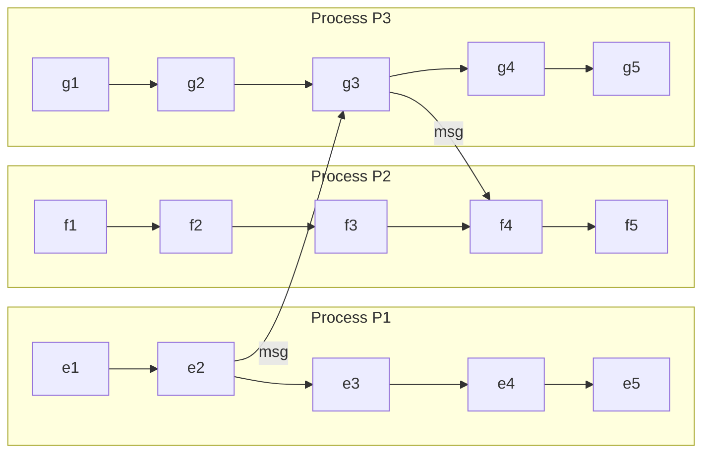

**Happens-before relationships:**
- `e2 → g3`  (message from P1 to P3)
- `g3 → f4`  (message from P3 to P2)
- `e2 → f4`  (transitivity: `e2 → g3 → f4`)
- `e1 → e2`  (same process)

**Concurrent events:**
- `e1 ‖ f1`   (no causal connection)
- `e3 ‖ g2`   (no causal connection)
- `f2 ‖ g2`   (no causal connection)

### 3.4 Partial Order vs. Total Order

#### Partial Order

The happens-before relation defines a **partial order** on events:
- **Reflexive**: `a → a` (trivially, every event happens before itself)
- **Antisymmetric**: If `a → b` then NOT `b → a`
- **Transitive**: If `a → b` and `b → c`, then `a → c`

It's called "partial" because some events are **incomparable** (concurrent)—we can't order all pairs.

#### Total Order

A **total order** means every pair of events can be compared. We can assign a sequence number to every event such that if `a → b`, then `seq(a) < seq(b)`, AND even concurrent events get distinct, comparable numbers.

**Why total order matters**: Many algorithms (like state machine replication, total order broadcast, serializable transactions) require a total order of events.

**The challenge**: How do you create a total order when events are concurrent and clocks disagree?

### 3.5 Causal Ordering

Causal ordering is stronger than "eventually consistent" but weaker than "total ordering":

```
Ordering Strength Spectrum:

No ordering ←──── Causal ordering ←──── Total ordering
(FIFO only)       (respects →)          (all events ordered)

  Weakest                                    Strongest
  Cheapest                                   Most expensive
  Easiest                                    Hardest
```

**Causal ordering** guarantees: If event `a` causally precedes event `b`, then every process will see `a` before `b`. But concurrent events may be seen in different orders by different processes.

**Example**: In a social media system:
1. Alice posts: "I'm getting married!"
2. Bob replies to Alice's post: "Congratulations!"
3. Charlie posts (independently): "Anyone want pizza?"

Causal ordering guarantees every user sees Alice's post before Bob's reply. But Charlie's post can appear anywhere—before Alice's post, between Alice's and Bob's, or after Bob's reply.

---

## 4. Architecture Deep Dive

### 4.1 NTP (Network Time Protocol)

NTP is the most widely deployed clock synchronization protocol, used by virtually every computer connected to the Internet.

#### Architecture: Hierarchical Stratum Model

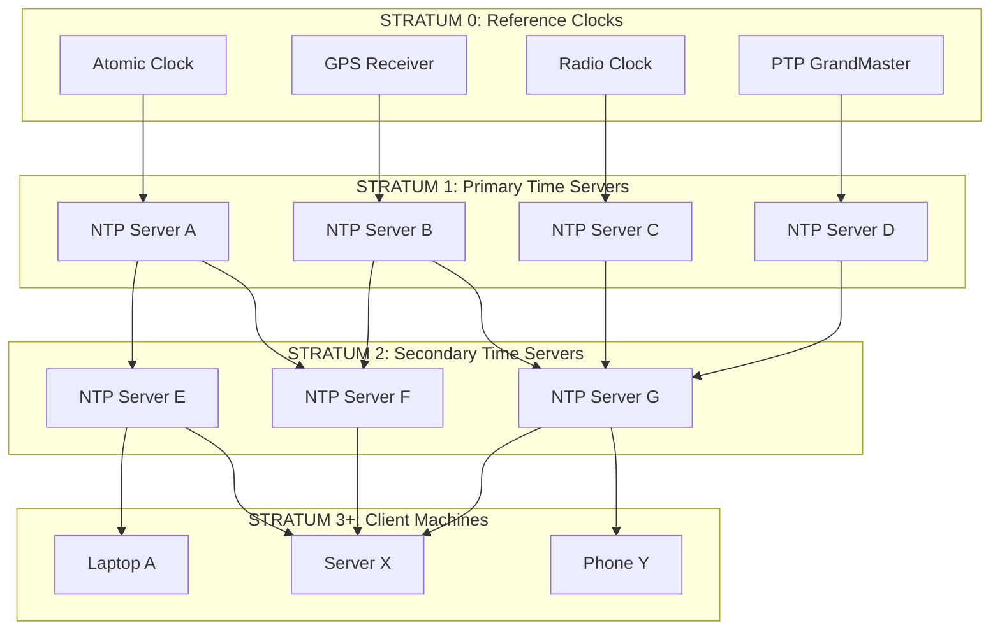

#### NTP Message Exchange

NTP uses a 4-timestamp algorithm to compute both the **offset** (how far off my clock is) and the **round-trip delay** (how long messages take):

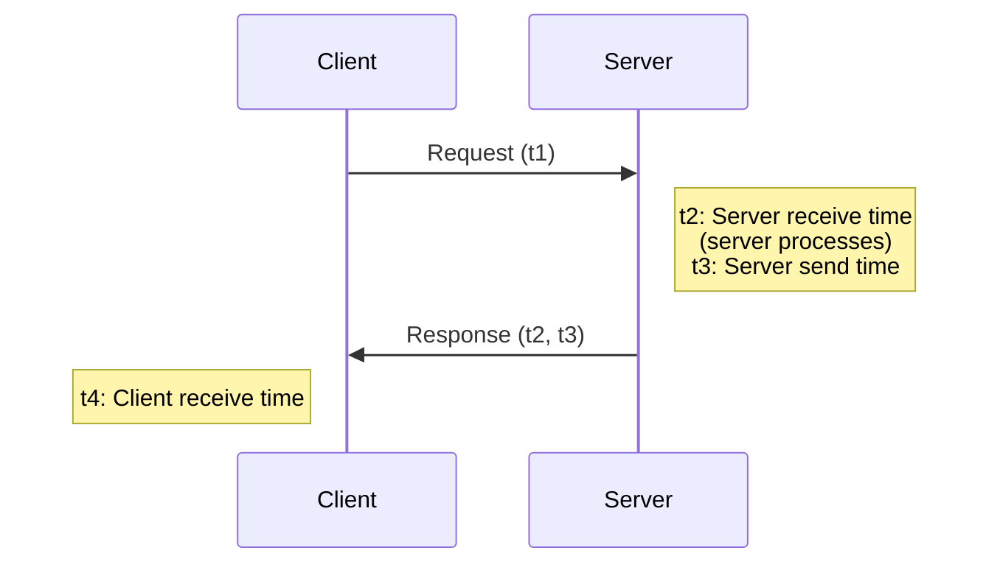

*Note:*
- `t1` = client send time (client's clock)
- `t2` = server receive time (server's clock)
- `t3` = server send time (server's clock)
- `t4` = client receive time (client's clock)

**Calculations:**

```
Round-trip delay (δ) = (t4 - t1) - (t3 - t2)
                     = total_time - server_processing_time

Clock offset (θ)     = ((t2 - t1) + (t3 - t4)) / 2
                     = average of forward and backward one-way delays
```

**Critical assumption**: NTP assumes the network delay is **symmetric** (same in both directions). This is often wrong! Asymmetric routing, congestion, and buffering can violate this assumption.

#### NTP Accuracy

| Scenario | Typical Accuracy |
|----------|-----------------|
| LAN (same switch) | 0.1 - 1 ms |
| LAN (same building) | 1 - 5 ms |
| WAN (same continent) | 5 - 50 ms |
| WAN (intercontinental) | 50 - 200 ms |
| Worst case (Internet) | 100 ms - seconds |

#### NTP Limitations

1. **Asymmetric delays**: The fundamental assumption of symmetric paths is often violated
2. **Best-effort**: No hard guarantees on accuracy
3. **Leap seconds**: Can cause time to jump or repeat (the famous Cloudflare bug)
4. **Monotonicity**: NTP can step the clock backwards (dangerous for distributed systems!)
5. **Network congestion**: Degrades accuracy unpredictably
6. **Security**: Vulnerable to spoofing and man-in-the-middle attacks (NTS helps)
7. **Polling interval**: Typically 64-1024 seconds; transient errors between polls

#### PTP (Precision Time Protocol - IEEE 1588)

PTP achieves **sub-microsecond** accuracy using hardware timestamping:

| Feature | NTP | PTP |
|---------|-----|-----|
| Accuracy | 1-50 ms | 10 ns - 1 μs |
| Hardware support | None required | Required (NIC timestamping) |
| Network support | Any | Needs PTP-aware switches |
| Cost | Free | Expensive |
| Use case | General purpose | Financial, telecom, 5G |
| Complexity | Low | High |

### 4.2 Lamport Clocks

Leslie Lamport's logical clock (1978) was the first solution to ordering events without synchronized physical clocks.

#### Algorithm

Each process `P_i` maintains a counter `C_i` (initially 0):

**Rule 1 (Internal Event)**: Before each local event, increment the counter:
```
C_i = C_i + 1
```

**Rule 2 (Send)**: When sending a message `m`, attach the current counter as the timestamp:
```
C_i = C_i + 1
send(m, C_i)
```

**Rule 3 (Receive)**: When receiving message `m` with timestamp `T_m`:
```
C_i = max(C_i, T_m) + 1
```

#### Key Property

**If a → b, then L(a) < L(b)** — if event `a` happens before event `b`, then `a`'s Lamport timestamp is less than `b`'s.

**But NOT the converse!** `L(a) < L(b)` does NOT imply `a → b`. Two concurrent events might have different Lamport timestamps. This is the fundamental limitation.

```
Given: L(a) < L(b)

Three possibilities:
  1. a → b (a causally precedes b)
  2. b → a (IMPOSSIBLE - would violate the property)  
  3. a ‖ b (concurrent - we can't tell!)
```

#### Creating a Total Order with Lamport Clocks

To break ties (same Lamport timestamp, different processes), use the **process ID** as a tiebreaker:

```
Total order timestamp: (L(e), process_id)

Compare: (L(a), pid_a) < (L(b), pid_b) iff
  L(a) < L(b), OR
  L(a) = L(b) AND pid_a < pid_b
```

This gives a **total order consistent with causality**, but it's **arbitrary for concurrent events**.

### 4.3 Vector Clocks

Vector clocks (Mattern 1989, Fidge 1988) solve Lamport clocks' limitation: they can detect concurrency.

#### Algorithm

Each process `P_i` in a system of `N` processes maintains a vector `VC_i[0..N-1]`:

- `VC_i[i]` = number of events at process `i` (local counter)
- `VC_i[j]` = latest known event count from process `j`

**Rule 1 (Internal Event)**:
```
VC_i[i] = VC_i[i] + 1
```

**Rule 2 (Send)**:
```
VC_i[i] = VC_i[i] + 1
send(m, VC_i)  // attach entire vector
```

**Rule 3 (Receive)**:
```
VC_i[j] = max(VC_i[j], VC_msg[j])   for all j
VC_i[i] = VC_i[i] + 1
```

#### Comparison Rules

```
VC_a = VC_b     iff  VC_a[i] = VC_b[i]  for all i
VC_a ≤ VC_b     iff  VC_a[i] ≤ VC_b[i]  for all i
VC_a < VC_b     iff  VC_a ≤ VC_b AND VC_a ≠ VC_b
VC_a ‖ VC_b     iff  NOT(VC_a ≤ VC_b) AND NOT(VC_b ≤ VC_a)
```

#### The Key Property (Characterization Theorem)

**a → b if and only if VC(a) < VC(b)**

This is strictly stronger than Lamport clocks! Vector clocks perfectly capture causality. If `VC(a)` is not less than or equal to `VC(b)` and vice versa, the events are **provably concurrent**.

#### Lamport Clocks vs. Vector Clocks

| Property | Lamport Clock | Vector Clock |
|----------|--------------|--------------|
| Size | Single integer | N integers (N = processes) |
| a → b implies L(a) < L(b) | ✅ Yes | ✅ Yes |
| L(a) < L(b) implies a → b | ❌ No | ✅ Yes |
| Detects concurrency | ❌ No | ✅ Yes |
| Space complexity | O(1) | O(N) |
| Message overhead | 1 integer | N integers |
| Scalability | Excellent | Poor for large N |

### 4.4 Hybrid Logical Clocks (HLC)

HLC (Kulkarni et al., 2014) combines the best of physical and logical clocks.

#### Motivation

- **Physical clocks** give you real time but can't guarantee causal ordering
- **Logical clocks** guarantee causal ordering but have no relationship to real time
- **Vector clocks** are perfect but don't scale (O(N) space per event)

HLC provides:
1. Causal ordering (like logical clocks)
2. Bounded divergence from physical time (like physical clocks)
3. O(1) space (like Lamport clocks, unlike vector clocks)

#### HLC Structure

Each HLC timestamp is a pair `(l, c)`:
- `l`: The logical component, always close to the physical clock `pt`
- `c`: A counter that distinguishes events with the same `l`

#### HLC Algorithm

**Send or Internal Event at process `j`:**
```
l'_j = l_j                          // save old l
l_j  = max(l'_j, pt_j)              // advance l to physical time
if l_j = l'_j then
    c_j = c_j + 1                   // same l, increment counter
else
    c_j = 0                         // new l, reset counter
timestamp = (l_j, c_j)
```

**Receive Event at process `j` receiving message with timestamp `(l_m, c_m)`:**
```
l'_j = l_j                          // save old l
l_j  = max(l'_j, l_m, pt_j)         // take max of all three
if l_j = l'_j = l_m then
    c_j = max(c_j, c_m) + 1         // all same, increment max counter
else if l_j = l'_j then
    c_j = c_j + 1                   // local l won, increment local counter
else if l_j = l_m then
    c_j = c_m + 1                   // message l won, increment message counter
else
    c_j = 0                         // physical time won, reset counter
timestamp = (l_j, c_j)
```

#### Key Properties

1. **Monotonic**: HLC timestamps always increase at each process
2. **Bounded divergence**: `l - pt ≤ ε` where ε is bounded by the maximum clock skew
3. **Causal consistency**: If `e → f`, then `HLC(e) < HLC(f)`
4. **Compact**: Only 2 values per timestamp (vs N for vector clocks)
5. **NTP-compatible**: Can be used with NTP-synchronized clocks

### 4.5 Google TrueTime

TrueTime is the brilliant (and expensive) innovation that makes Google Spanner possible.

#### The Core Idea

Instead of returning a single timestamp, TrueTime returns an **interval**:

```
TT.now() = [earliest, latest]
```

This interval represents the **uncertainty** in what the true time actually is. Google guarantees:

```
earliest ≤ true_time ≤ latest
```

The **uncertainty** (ε) is typically:
- **1-7 milliseconds** (average ~4 ms)
- Dominated by: network delay to GPS/atomic clock servers + time since last sync

#### TrueTime Architecture

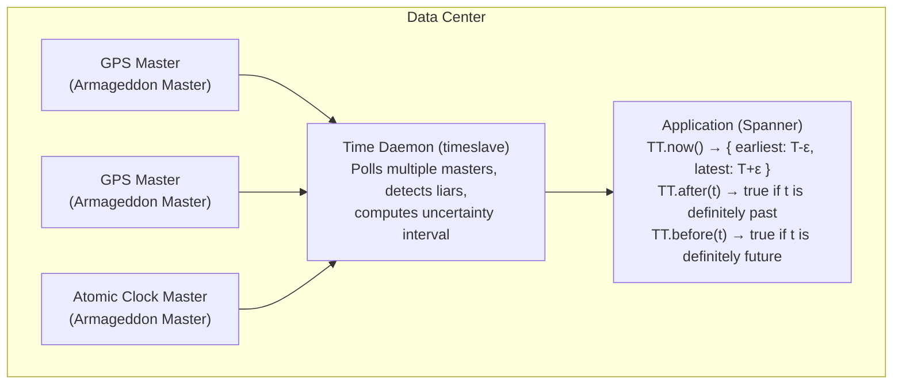

#### How Spanner Uses TrueTime for Transactions

The key insight: **If you want to be sure that transaction T1 committed before transaction T2, you must wait out the uncertainty.**

```
Commit Protocol:
1. Assign commit timestamp s = TT.now().latest
2. WAIT until TT.after(s) is true (the "commit wait")
3. This ensures: if T2 starts after T1's commit wait,
   then T2's timestamp > T1's timestamp

Commit Wait Duration = 2ε (typically ~7-14 ms)
```

**Why this works:** By waiting until the uncertainty interval has passed, Spanner ensures that any future transaction will see a later timestamp. This gives Spanner **external consistency**—a guarantee stronger than serializability.

```
Timeline:

T1: ───[assign s1]───[commit wait]───[committed]───────→
         |←── 2ε ──→|
                                    T2 starts here
                                    T2: ──[assign s2]───→
                                          s2 > s1 ✓

If T1 commits before T2 begins, s1 < s2 is guaranteed!
```

#### Cost of TrueTime

Google's investment in TrueTime infrastructure is enormous:
- GPS antennas on every data center roof
- Atomic clocks in every data center
- Custom hardware (Armageddon masters) with redundancy
- Estimated: **$2-5 billion** in infrastructure

This is why most companies can't replicate Spanner's approach and use alternatives like HLC (CockroachDB) instead.

---

## 5. Visual Diagrams

### 5.1 Lamport Clock Example Across 3 Processes

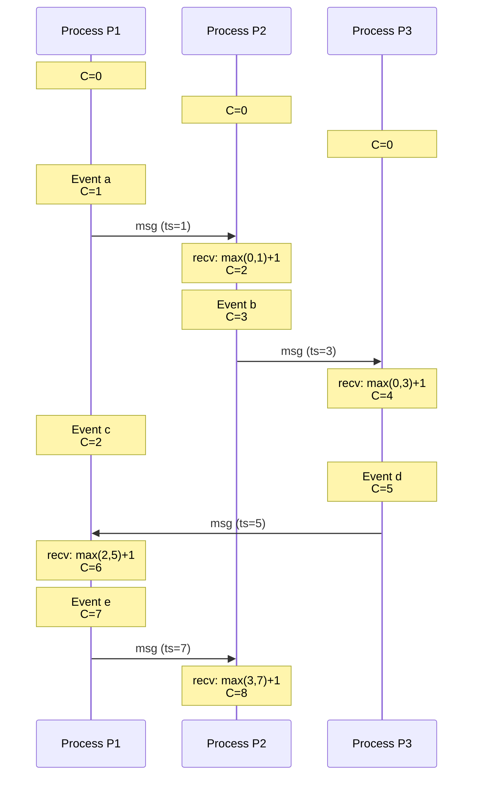

### 5.2 Vector Clock Example

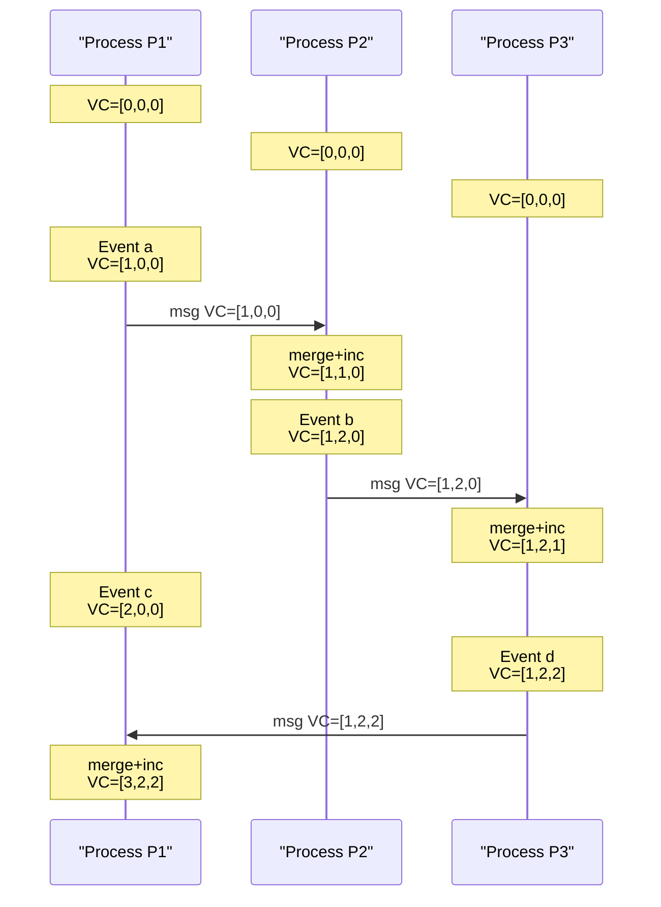

### 5.3 Happens-Before Relationship Diagram

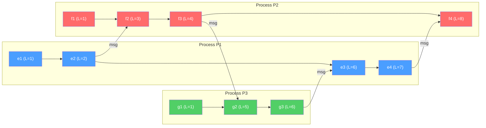

### 5.4 TrueTime Confidence Intervals

```mermaid
gantt
    title TrueTime Confidence Intervals During Commit
    dateFormat X
    axisFormat %s

    section Transaction T1
    Uncertainty interval     :t1, 0, 7
    Commit wait             :crit, cw1, 7, 14
    Committed               :milestone, m1, 14, 14

    section Transaction T2
    T2 starts after T1      :t2start, 15, 15
    Uncertainty interval    :t2, 15, 22
    Commit wait            :crit, cw2, 22, 29
    Committed              :milestone, m2, 29, 29
```

### 5.5 Clock Synchronization Protocols Comparison

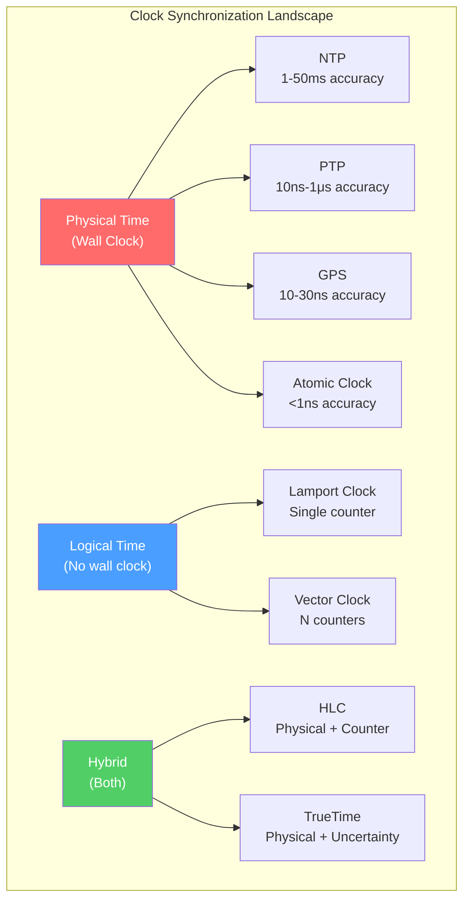

### 5.6 NTP 4-Timestamp Exchange

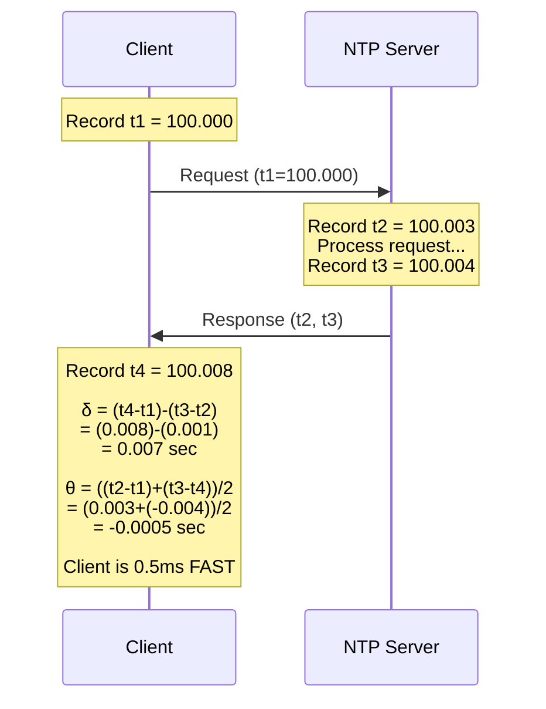

---

## 6. Real Production Examples

### 6.1 Google Spanner and TrueTime

**The Problem**: Google needed a globally distributed database that supports externally consistent (linearizable) transactions across continents.

**The Solution**: TrueTime API + commit-wait protocol.

**Architecture Details**:
- Every Google data center has multiple **Armageddon masters**: servers connected to GPS receivers or atomic clocks
- A **time daemon** on each machine polls multiple Armageddon masters
- The daemon uses Marzullo's algorithm to compute a time interval `[earliest, latest]`
- GPS and atomic clocks are used together because they have **independent failure modes**: GPS can fail (jamming, spoofing, antenna issues) but atomic clocks continue; atomic clocks can drift but GPS corrects them

**Key Metrics (from the Spanner paper)**:
- Average uncertainty (ε): **~4 ms**
- Worst-case ε: **< 7 ms**
- ε between polls: Increases by ~200 μs per second of drift
- Poll interval: 30 seconds
- 99.9% of ε samples: **< 6 ms**

**Performance Impact of Commit-Wait**:
- Each read-write transaction must wait **2ε ≈ 8-14 ms** before committing
- This is the **price of external consistency**
- For read-only transactions at a snapshot, there's no wait if the snapshot is old enough

**Production Learnings**:
- Initially, ε was higher (~10 ms). Google invested in better GPS infrastructure to reduce it.
- Leap seconds were a concern; they use a "leap smear" (spreading the leap second over hours)
- Clock firmware bugs in servers can cause sudden large ε values; TrueTime detects these and isolates the affected machines

### 6.2 CockroachDB and Hybrid Logical Clocks

**The Problem**: Reproduce Spanner's external consistency without Google's hardware infrastructure.

**The Solution**: HLC + transaction uncertainty intervals.

**How CockroachDB Uses HLC**:
1. Every node runs HLC synchronized via NTP (not GPS/atomic clocks)
2. When a transaction reads a value, it checks if the value's timestamp falls within the reader's uncertainty interval
3. If so, the transaction **restarts at a higher timestamp** to avoid reading stale data
4. This gives "serializable" isolation but with a probabilistic element

**Clock Skew Budget**:
- CockroachDB assumes max clock skew of **500 ms** (configurable)
- If actual skew exceeds this, linearizability violations are possible
- In practice, well-configured NTP gives 1-10 ms skew, so 500 ms is very conservative

**Trade-offs vs. Spanner**:
| Aspect | Spanner | CockroachDB |
|--------|---------|-------------|
| Clock source | GPS + atomic | NTP |
| Uncertainty | ~4 ms | ~250-500 ms (configured) |
| Commit latency | 8-14 ms (wait) | Higher restart rate |
| Linearizability | Guaranteed | Best-effort (bounded) |
| Hardware cost | Very high | None |
| Deploy anywhere | No (need GPS) | Yes |

### 6.3 Amazon DynamoDB and Vector Clocks (Historical)

**The Problem**: DynamoDB (originally Dynamo) needed a highly available, eventually consistent key-value store that could handle conflicts from concurrent writes.

**The Solution (Original Dynamo Paper, 2007)**: Vector clocks for conflict detection.

**How Dynamo Used Vector Clocks**:
1. Each write includes a vector clock (actually a list of `(node_id, counter)` pairs)
2. When two versions of the same key exist and their vector clocks are not comparable (concurrent), **both versions are kept**
3. On the next read, the client receives both versions and must **resolve the conflict** (e.g., merge shopping carts)
4. The resolved value is written back with a new vector clock

**Example - Shopping Cart Conflict**:
```
Client A adds item X:  VC = [(A,1)]         → value: {X}
Client A adds item Y:  VC = [(A,2)]         → value: {X, Y}

Network partition! Two clients continue:

Client B (sees VC [(A,2)]):
  adds item Z:         VC = [(A,2),(B,1)]   → value: {X, Y, Z}

Client C (also sees VC [(A,2)]):
  removes item X:      VC = [(A,2),(C,1)]   → value: {Y}

After partition heals:
  VC [(A,2),(B,1)] ‖ VC [(A,2),(C,1)]  → CONCURRENT!
  
  Client reads BOTH versions: {X, Y, Z} and {Y}
  Client must merge: {Y, Z}  (or whatever policy)
  Writes back:         VC = [(A,2),(B,1),(C,1)]
```

**Why DynamoDB Moved Away from Vector Clocks**:
- Vector clocks grow with the number of writing nodes (not bounded)
- Client-side conflict resolution is complex and error-prone
- Most applications preferred "last-write-wins" (simpler, lossy)
- Modern DynamoDB uses **last-writer-wins** with server-side timestamps for most use cases

### 6.4 Apache Cassandra and Last-Write-Wins

**The Approach**: Cassandra uses physical timestamps for conflict resolution with a "last-write-wins" (LWW) policy.

**How It Works**:
1. Every write includes a client-generated timestamp (typically `System.currentTimeMillis()`)
2. When replicas receive conflicting writes for the same key, the write with the **highest timestamp wins**
3. No vector clocks, no client conflict resolution

**The Dangers**:
- If Client A's clock is ahead, A's writes always win even if they were logically earlier
- Clock skew can cause data loss (a "later" logical write with an "earlier" timestamp is silently discarded)
- Cassandra mitigates this by requiring NTP synchronization and warning when clocks are >1 second apart

### 6.5 Apache Kafka and Log Offsets

Kafka takes a completely different approach: **it doesn't use clocks for ordering at all**.

- Messages within a partition are ordered by **offset** (a monotonically increasing integer)
- The broker assigns offsets, so there's no clock dependency
- This is essentially a **centralized Lamport clock** for each partition
- Cross-partition ordering is not guaranteed (concurrent by design)

---

## 7. Java Implementations

### 7.1 Lamport Clock Implementation

```java
import java.util.concurrent.atomic.AtomicLong;

/**
 * Thread-safe Lamport logical clock implementation.
 * 
 * Properties:
 * - If a → b, then L(a) < L(b) (consistency with causality)
 * - Monotonically increasing
 * - Total order when combined with process ID
 * 
 * Usage: Distributed mutual exclusion, total order broadcast,
 *        causal message ordering
 */
public class LamportClock {
    
    private final AtomicLong counter;
    private final int processId;
    
    /**
     * Creates a new Lamport clock for a given process.
     * @param processId Unique identifier for this process
     */
    public LamportClock(int processId) {
        this.processId = processId;
        this.counter = new AtomicLong(0);
    }
    
    /**
     * Record a local event. Increments the clock.
     * Used for any internal state change or action.
     * 
     * @return The new timestamp after the event
     */
    public long localEvent() {
        return counter.incrementAndGet();
    }
    
    /**
     * Prepare a message for sending.
     * Increments the clock and returns the timestamp to attach.
     * 
     * @return Timestamp to include in the outgoing message
     */
    public long prepareSend() {
        return counter.incrementAndGet();
    }
    
    /**
     * Process a received message.
     * Updates clock to max(local, received) + 1.
     * 
     * This ensures causality: the receive event has a timestamp
     * strictly greater than both the send event and any prior
     * local event.
     * 
     * @param receivedTimestamp The timestamp from the incoming message
     * @return The new timestamp after processing the receive
     */
    public long processReceive(long receivedTimestamp) {
        long current;
        long newValue;
        do {
            current = counter.get();
            newValue = Math.max(current, receivedTimestamp) + 1;
        } while (!counter.compareAndSet(current, newValue));
        return newValue;
    }
    
    /**
     * Get the current clock value without incrementing.
     * Useful for debugging and monitoring.
     */
    public long getCurrentTime() {
        return counter.get();
    }
    
    /**
     * Get the process ID.
     */
    public int getProcessId() {
        return processId;
    }
    
    /**
     * Create a total-order comparable timestamp.
     * Breaks ties between equal Lamport values using process ID.
     */
    public LamportTimestamp createTimestamp() {
        return new LamportTimestamp(counter.incrementAndGet(), processId);
    }
    
    @Override
    public String toString() {
        return String.format("LamportClock[pid=%d, time=%d]", processId, counter.get());
    }
    
    /**
     * Immutable total-order timestamp combining Lamport time with process ID.
     * Implements Comparable for total ordering.
     */
    public record LamportTimestamp(long time, int processId) 
            implements Comparable<LamportTimestamp> {
        
        @Override
        public int compareTo(LamportTimestamp other) {
            int timeCmp = Long.compare(this.time, other.time);
            if (timeCmp != 0) return timeCmp;
            return Integer.compare(this.processId, other.processId);
        }
        
        @Override
        public String toString() {
            return String.format("(%d, P%d)", time, processId);
        }
    }
}

/**
 * Demonstration of Lamport clocks across multiple processes.
 */
class LamportClockDemo {
    
    public static void main(String[] args) {
        LamportClock p1 = new LamportClock(1);
        LamportClock p2 = new LamportClock(2);
        LamportClock p3 = new LamportClock(3);
        
        // P1: local event
        long ts1 = p1.localEvent();
        System.out.printf("P1 local event: %d%n", ts1);  // 1
        
        // P1 sends to P2
        long sendTs = p1.prepareSend();
        System.out.printf("P1 sends (ts=%d) to P2%n", sendTs);  // 2
        
        // P2 receives from P1
        long recvTs = p2.processReceive(sendTs);
        System.out.printf("P2 receives: %d%n", recvTs);  // 3
        
        // P2: local event
        long ts2 = p2.localEvent();
        System.out.printf("P2 local event: %d%n", ts2);  // 4
        
        // P2 sends to P3
        long sendTs2 = p2.prepareSend();
        System.out.printf("P2 sends (ts=%d) to P3%n", sendTs2);  // 5
        
        // P3 receives from P2
        long recvTs2 = p3.processReceive(sendTs2);
        System.out.printf("P3 receives: %d%n", recvTs2);  // 6
        
        // P1: local event (concurrent with P3's event)
        long ts3 = p1.localEvent();
        System.out.printf("P1 local event: %d (concurrent with P3!)%n", ts3);  // 3
        
        System.out.println("\nFinal states:");
        System.out.println(p1);
        System.out.println(p2);
        System.out.println(p3);
    }
}
```

### 7.2 Vector Clock Implementation

```java
import java.util.*;
import java.util.concurrent.ConcurrentHashMap;

/**
 * Production-grade Vector Clock implementation.
 * 
 * Supports:
 * - Detecting causality (a → b)
 * - Detecting concurrency (a ‖ b)
 * - Merging concurrent versions
 * - Dynamic node membership
 * 
 * This implementation uses String node IDs instead of integer indices,
 * making it suitable for dynamic systems where nodes join and leave.
 */
public class VectorClock implements Comparable<VectorClock> {
    
    // Map from node ID to logical counter
    private final Map<String, Long> clock;
    private final String nodeId;
    
    public VectorClock(String nodeId) {
        this.nodeId = nodeId;
        this.clock = new ConcurrentHashMap<>();
        this.clock.put(nodeId, 0L);
    }
    
    // Private constructor for cloning
    private VectorClock(String nodeId, Map<String, Long> clock) {
        this.nodeId = nodeId;
        this.clock = new ConcurrentHashMap<>(clock);
    }
    
    /**
     * Record a local event. Increments this node's counter.
     * @return A snapshot of the vector clock after the event
     */
    public VectorClock localEvent() {
        clock.merge(nodeId, 1L, Long::sum);
        return snapshot();
    }
    
    /**
     * Prepare to send a message. Increments counter and returns clock snapshot.
     * The returned snapshot should be attached to the outgoing message.
     * 
     * @return Snapshot to attach to the message
     */
    public VectorClock prepareSend() {
        clock.merge(nodeId, 1L, Long::sum);
        return snapshot();
    }
    
    /**
     * Process a received message's vector clock.
     * Merges the received clock with the local clock using component-wise max,
     * then increments the local counter.
     * 
     * @param received The vector clock from the received message
     * @return Updated clock snapshot after receive
     */
    public VectorClock processReceive(VectorClock received) {
        // Merge: take component-wise maximum
        for (Map.Entry<String, Long> entry : received.clock.entrySet()) {
            clock.merge(entry.getKey(), entry.getValue(), Math::max);
        }
        // Increment local counter
        clock.merge(nodeId, 1L, Long::sum);
        return snapshot();
    }
    
    /**
     * Create an immutable snapshot of the current clock.
     */
    public VectorClock snapshot() {
        return new VectorClock(nodeId, clock);
    }
    
    /**
     * Get the counter value for a specific node.
     */
    public long get(String node) {
        return clock.getOrDefault(node, 0L);
    }
    
    /**
     * Check if this clock is causally before another.
     * VC(a) < VC(b) iff VC(a) ≤ VC(b) AND VC(a) ≠ VC(b)
     * 
     * This means: event a happened-before event b.
     */
    public boolean isBefore(VectorClock other) {
        return isBeforeOrEqual(other) && !this.equals(other);
    }
    
    /**
     * Check if this clock is ≤ another (component-wise).
     */
    public boolean isBeforeOrEqual(VectorClock other) {
        // All entries in this clock must be ≤ corresponding entries in other
        Set<String> allNodes = new HashSet<>();
        allNodes.addAll(this.clock.keySet());
        allNodes.addAll(other.clock.keySet());
        
        for (String node : allNodes) {
            long thisVal = this.clock.getOrDefault(node, 0L);
            long otherVal = other.clock.getOrDefault(node, 0L);
            if (thisVal > otherVal) {
                return false;
            }
        }
        return true;
    }
    
    /**
     * Check if this clock is causally after another.
     * VC(a) > VC(b) iff VC(b) < VC(a)
     */
    public boolean isAfter(VectorClock other) {
        return other.isBefore(this);
    }
    
    /**
     * Check if this clock is concurrent with another.
     * VC(a) ‖ VC(b) iff NOT(VC(a) ≤ VC(b)) AND NOT(VC(b) ≤ VC(a))
     * 
     * Concurrent means: neither event causally precedes the other.
     */
    public boolean isConcurrentWith(VectorClock other) {
        return !this.isBeforeOrEqual(other) && !other.isBeforeOrEqual(this);
    }
    
    /**
     * Merge two vector clocks (component-wise max).
     * Used for conflict resolution when concurrent writes are detected.
     * 
     * @return A new vector clock representing the merge
     */
    public static VectorClock merge(VectorClock a, VectorClock b) {
        Map<String, Long> merged = new HashMap<>();
        Set<String> allNodes = new HashSet<>();
        allNodes.addAll(a.clock.keySet());
        allNodes.addAll(b.clock.keySet());
        
        for (String node : allNodes) {
            long aVal = a.clock.getOrDefault(node, 0L);
            long bVal = b.clock.getOrDefault(node, 0L);
            merged.put(node, Math.max(aVal, bVal));
        }
        
        return new VectorClock(a.nodeId, merged);
    }
    
    /**
     * Determine the relationship between two events.
     */
    public enum Relationship {
        BEFORE,      // this → other (this happened before other)
        AFTER,       // other → this (other happened before this)
        CONCURRENT,  // this ‖ other (no causal relationship)
        EQUAL        // same event
    }
    
    public Relationship relationshipWith(VectorClock other) {
        if (this.equals(other)) return Relationship.EQUAL;
        if (this.isBefore(other)) return Relationship.BEFORE;
        if (this.isAfter(other)) return Relationship.AFTER;
        return Relationship.CONCURRENT;
    }
    
    @Override
    public boolean equals(Object obj) {
        if (this == obj) return true;
        if (!(obj instanceof VectorClock other)) return false;
        
        Set<String> allNodes = new HashSet<>();
        allNodes.addAll(this.clock.keySet());
        allNodes.addAll(other.clock.keySet());
        
        for (String node : allNodes) {
            if (this.clock.getOrDefault(node, 0L).longValue() != 
                other.clock.getOrDefault(node, 0L).longValue()) {
                return false;
            }
        }
        return true;
    }
    
    @Override
    public int hashCode() {
        return clock.hashCode();
    }
    
    @Override
    public int compareTo(VectorClock other) {
        if (this.isBefore(other)) return -1;
        if (this.isAfter(other)) return 1;
        return 0; // concurrent or equal
    }
    
    @Override
    public String toString() {
        StringBuilder sb = new StringBuilder();
        sb.append("{");
        clock.entrySet().stream()
            .sorted(Map.Entry.comparingByKey())
            .forEach(e -> {
                if (sb.length() > 1) sb.append(", ");
                sb.append(e.getKey()).append(":").append(e.getValue());
            });
        sb.append("}");
        return sb.toString();
    }
    
    // ==================== Demo ====================
    
    public static void main(String[] args) {
        System.out.println("=== Vector Clock Demo ===\n");
        
        VectorClock vcA = new VectorClock("A");
        VectorClock vcB = new VectorClock("B");
        VectorClock vcC = new VectorClock("C");
        
        // A does a local event
        VectorClock a1 = vcA.localEvent();
        System.out.printf("A local event: %s%n", a1);  // {A:1}
        
        // A sends to B
        VectorClock msgAtoB = vcA.prepareSend();
        System.out.printf("A sends to B:  %s%n", msgAtoB);  // {A:2}
        
        // B receives from A
        VectorClock b1 = vcB.processReceive(msgAtoB);
        System.out.printf("B receives:    %s%n", b1);  // {A:2, B:1}
        
        // B sends to C
        VectorClock msgBtoC = vcB.prepareSend();
        System.out.printf("B sends to C:  %s%n", msgBtoC);  // {A:2, B:2}
        
        // C receives from B
        VectorClock c1 = vcC.processReceive(msgBtoC);
        System.out.printf("C receives:    %s%n", c1);  // {A:2, B:2, C:1}
        
        // A does another local event (concurrent with C!)
        VectorClock a3 = vcA.localEvent();
        System.out.printf("A local event: %s%n", a3);  // {A:3}
        
        // Check relationships
        System.out.println("\n=== Relationships ===");
        System.out.printf("a1 → b1? %s%n", a1.relationshipWith(b1));  // BEFORE
        System.out.printf("b1 → c1? %s%n", b1.relationshipWith(c1));  // BEFORE
        System.out.printf("a1 → c1? %s%n", a1.relationshipWith(c1));  // BEFORE (transitive)
        System.out.printf("a3 vs c1? %s%n", a3.relationshipWith(c1)); // CONCURRENT!
        
        // Demonstrate conflict detection
        System.out.println("\n=== Conflict Detection ===");
        if (a3.isConcurrentWith(c1)) {
            System.out.println("CONFLICT: A's event and C's event are concurrent!");
            System.out.printf("  A's clock: %s%n", a3);
            System.out.printf("  C's clock: %s%n", c1);
            VectorClock merged = VectorClock.merge(a3, c1);
            System.out.printf("  Merged:    %s%n", merged);
        }
    }
}
```

### 7.3 Hybrid Logical Clock (HLC) Implementation

```java
import java.util.concurrent.atomic.AtomicReference;
import java.util.function.Supplier;

/**
 * Hybrid Logical Clock (HLC) implementation.
 * 
 * Combines physical time with logical counters to provide:
 * 1. Causal ordering (if a → b, then HLC(a) < HLC(b))
 * 2. Bounded divergence from physical time
 * 3. O(1) space per timestamp (unlike O(N) for vector clocks)
 * 
 * Based on: "Logical Physical Clocks and Consistent Snapshots
 * in Globally Distributed Databases" (Kulkarni et al., 2014)
 * 
 * Used by: CockroachDB, YugabyteDB
 */
public class HybridLogicalClock {
    
    /**
     * HLC Timestamp: (logicalTime, counter)
     * logicalTime is always >= physical time and close to it
     * counter disambiguates events at the same logical time
     */
    public record HLCTimestamp(long logicalTime, int counter) 
            implements Comparable<HLCTimestamp> {
        
        @Override
        public int compareTo(HLCTimestamp other) {
            int lcmp = Long.compare(this.logicalTime, other.logicalTime);
            if (lcmp != 0) return lcmp;
            return Integer.compare(this.counter, other.counter);
        }
        
        /**
         * Pack into a single 64-bit long for efficient storage.
         * Upper 48 bits: logical time (milliseconds, good for 8900 years)
         * Lower 16 bits: counter (up to 65535 events per ms)
         */
        public long pack() {
            return (logicalTime << 16) | (counter & 0xFFFF);
        }
        
        /**
         * Unpack from a 64-bit long.
         */
        public static HLCTimestamp unpack(long packed) {
            long l = packed >>> 16;
            int c = (int) (packed & 0xFFFF);
            return new HLCTimestamp(l, c);
        }
        
        @Override
        public String toString() {
            return String.format("HLC(%d, %d)", logicalTime, counter);
        }
    }
    
    // Thread-safe state: (logicalTime, counter)
    private final AtomicReference<HLCTimestamp> state;
    
    // Physical clock supplier (injectable for testing)
    private final Supplier<Long> physicalClock;
    
    // Maximum allowed drift between logical and physical time (ms)
    private final long maxDrift;
    
    /**
     * Create an HLC with the system clock.
     * @param maxDrift Maximum allowed drift in milliseconds (e.g., 500 for CockroachDB)
     */
    public HybridLogicalClock(long maxDrift) {
        this(System::currentTimeMillis, maxDrift);
    }
    
    /**
     * Create an HLC with a custom clock source (useful for testing).
     */
    public HybridLogicalClock(Supplier<Long> physicalClock, long maxDrift) {
        this.physicalClock = physicalClock;
        this.maxDrift = maxDrift;
        long pt = physicalClock.get();
        this.state = new AtomicReference<>(new HLCTimestamp(pt, 0));
    }
    
    /**
     * Generate a timestamp for a local or send event.
     * 
     * Algorithm:
     * 1. Get physical time
     * 2. Set l = max(old_l, physical_time)
     * 3. If l didn't advance, increment counter; else reset counter
     * 4. Check drift bound
     * 
     * @return New HLC timestamp
     * @throws ClockDriftException if drift exceeds maxDrift
     */
    public HLCTimestamp now() {
        while (true) {
            HLCTimestamp old = state.get();
            long pt = physicalClock.get();
            
            long newL;
            int newC;
            
            if (old.logicalTime >= pt) {
                // Logical time is ahead; increment counter
                newL = old.logicalTime;
                newC = old.counter + 1;
            } else {
                // Physical time caught up; reset counter
                newL = pt;
                newC = 0;
            }
            
            // Check drift bound
            if (newL - pt > maxDrift) {
                throw new ClockDriftException(
                    String.format("HLC drift %d ms exceeds max %d ms", 
                                  newL - pt, maxDrift));
            }
            
            HLCTimestamp newState = new HLCTimestamp(newL, newC);
            if (state.compareAndSet(old, newState)) {
                return newState;
            }
            // CAS failed; retry
        }
    }
    
    /**
     * Process a received message and generate a receive timestamp.
     * 
     * Algorithm:
     * 1. Get physical time
     * 2. Set l = max(old_l, msg_l, physical_time)
     * 3. Update counter based on which value won
     * 4. Check drift bound
     * 
     * @param messageTimestamp The HLC timestamp from the received message
     * @return New HLC timestamp for the receive event
     */
    public HLCTimestamp receive(HLCTimestamp messageTimestamp) {
        while (true) {
            HLCTimestamp old = state.get();
            long pt = physicalClock.get();
            
            long newL;
            int newC;
            
            if (old.logicalTime > messageTimestamp.logicalTime 
                    && old.logicalTime > pt) {
                // Local logical time is ahead of both
                newL = old.logicalTime;
                newC = old.counter + 1;
            } else if (messageTimestamp.logicalTime > old.logicalTime 
                    && messageTimestamp.logicalTime > pt) {
                // Message logical time is ahead of both
                newL = messageTimestamp.logicalTime;
                newC = messageTimestamp.counter + 1;
            } else if (messageTimestamp.logicalTime == old.logicalTime 
                    && messageTimestamp.logicalTime > pt) {
                // Both logical times are equal and ahead of physical
                newL = old.logicalTime;
                newC = Math.max(old.counter, messageTimestamp.counter) + 1;
            } else {
                // Physical time is ahead (or equal to max)
                newL = pt;
                newC = 0;
            }
            
            // Check drift bound
            if (newL - pt > maxDrift) {
                throw new ClockDriftException(
                    String.format("HLC drift %d ms exceeds max %d ms (received msg from future?)",
                                  newL - pt, maxDrift));
            }
            
            HLCTimestamp newState = new HLCTimestamp(newL, newC);
            if (state.compareAndSet(old, newState)) {
                return newState;
            }
            // CAS failed; retry
        }
    }
    
    /**
     * Get the current HLC timestamp without advancing.
     * For monitoring/debugging only.
     */
    public HLCTimestamp peek() {
        return state.get();
    }
    
    /**
     * Get the current drift (logical time - physical time).
     */
    public long getCurrentDrift() {
        HLCTimestamp current = state.get();
        return current.logicalTime - physicalClock.get();
    }
    
    /**
     * Exception thrown when clock drift exceeds the configured maximum.
     * This typically indicates a severely misconfigured NTP or a rogue node.
     */
    public static class ClockDriftException extends RuntimeException {
        public ClockDriftException(String message) {
            super(message);
        }
    }
    
    // ==================== Demo ====================
    
    public static void main(String[] args) {
        System.out.println("=== HLC Demo ===\n");
        
        // Use controllable clocks for demonstration
        long[] time = {1000}; // shared simulated time
        
        HybridLogicalClock hlc1 = new HybridLogicalClock(() -> time[0], 500);
        HybridLogicalClock hlc2 = new HybridLogicalClock(() -> time[0], 500);
        
        // Node 1: event at physical time 1000
        HLCTimestamp ts1 = hlc1.now();
        System.out.printf("Node1 event:   %s  (pt=%d)%n", ts1, time[0]);
        // HLC(1000, 0)
        
        // Node 1: another event at same physical time
        HLCTimestamp ts2 = hlc1.now();
        System.out.printf("Node1 event:   %s  (pt=%d)%n", ts2, time[0]);
        // HLC(1000, 1) — counter increments
        
        // Physical time advances
        time[0] = 1005;
        
        // Node 2: event at physical time 1005
        HLCTimestamp ts3 = hlc2.now();
        System.out.printf("Node2 event:   %s  (pt=%d)%n", ts3, time[0]);
        // HLC(1005, 0)
        
        // Node 2 receives message from Node 1 (ts2)
        HLCTimestamp ts4 = hlc2.receive(ts2);
        System.out.printf("Node2 receive: %s  (pt=%d, msg=%s)%n", 
                          ts4, time[0], ts2);
        // HLC(1005, 1) — physical time is ahead, but counter needed
        
        // Verify ordering
        System.out.println("\n=== Ordering ===");
        System.out.printf("ts1 < ts2? %b%n", ts1.compareTo(ts2) < 0);  // true
        System.out.printf("ts2 < ts3? %b%n", ts2.compareTo(ts3) < 0);  // true (1000 < 1005)
        System.out.printf("ts3 < ts4? %b%n", ts3.compareTo(ts4) < 0);  // true
        
        // Demonstrate packed representation
        System.out.println("\n=== Packed Representation ===");
        long packed = ts4.pack();
        HLCTimestamp unpacked = HLCTimestamp.unpack(packed);
        System.out.printf("Original:  %s%n", ts4);
        System.out.printf("Packed:    %d%n", packed);
        System.out.printf("Unpacked:  %s%n", unpacked);
    }
}
```

### 7.4 Versioned Key-Value Store with Vector Clocks

```java
import java.util.*;
import java.util.concurrent.ConcurrentHashMap;

/**
 * A simplified versioned key-value store using vector clocks
 * for conflict detection (similar to Amazon Dynamo).
 * 
 * Features:
 * - Concurrent writes produce multiple versions (siblings)
 * - Reads return all concurrent versions for client-side resolution
 * - Causal writes are automatically resolved (later version wins)
 */
public class VersionedKeyValueStore {
    
    /**
     * A versioned value: combines data with its vector clock.
     */
    public record VersionedValue<V>(V value, VectorClock clock) {
        @Override
        public String toString() {
            return String.format("%s@%s", value, clock);
        }
    }
    
    private final Map<String, List<VersionedValue<String>>> store;
    private final String nodeId;
    private final VectorClock clock;
    
    public VersionedKeyValueStore(String nodeId) {
        this.nodeId = nodeId;
        this.store = new ConcurrentHashMap<>();
        this.clock = new VectorClock(nodeId);
    }
    
    /**
     * Write a value for a key, optionally based on a previously read context.
     * 
     * @param key The key to write
     * @param value The value to write
     * @param context The vector clock from a previous read (null for new writes)
     */
    public VersionedValue<String> put(String key, String value, VectorClock context) {
        // Advance our clock
        VectorClock writeClock;
        if (context != null) {
            writeClock = clock.processReceive(context);
        } else {
            writeClock = clock.localEvent();
        }
        
        VersionedValue<String> newVersion = new VersionedValue<>(value, writeClock);
        
        store.compute(key, (k, existing) -> {
            if (existing == null) {
                return new ArrayList<>(List.of(newVersion));
            }
            
            // Remove any versions that are causally dominated by the new write
            List<VersionedValue<String>> survivors = new ArrayList<>();
            for (VersionedValue<String> v : existing) {
                if (!v.clock().isBeforeOrEqual(writeClock)) {
                    // This version is concurrent or after; keep it
                    survivors.add(v);
                }
                // If v.clock <= writeClock, it's superseded; drop it
            }
            survivors.add(newVersion);
            return survivors;
        });
        
        return newVersion;
    }
    
    /**
     * Read all versions of a key.
     * Returns multiple versions if there are unresolved conflicts.
     * 
     * @return List of concurrent versions (siblings)
     */
    public List<VersionedValue<String>> get(String key) {
        return store.getOrDefault(key, Collections.emptyList());
    }
    
    /**
     * Resolve conflicts by providing a merged value.
     * The resolved value's clock dominates all input versions.
     */
    public VersionedValue<String> resolve(String key, String resolvedValue, 
                                           List<VersionedValue<String>> siblings) {
        // Merge all sibling clocks
        VectorClock mergedClock = siblings.get(0).clock();
        for (int i = 1; i < siblings.size(); i++) {
            mergedClock = VectorClock.merge(mergedClock, siblings.get(i).clock());
        }
        
        // Write the resolved value with the merged clock
        return put(key, resolvedValue, mergedClock);
    }
    
    // ==================== Demo ====================
    
    public static void main(String[] args) {
        System.out.println("=== Versioned KV Store Demo ===\n");
        
        VersionedKeyValueStore storeA = new VersionedKeyValueStore("A");
        VersionedKeyValueStore storeB = new VersionedKeyValueStore("B");
        
        // Client 1 writes to Store A
        var v1 = storeA.put("cart", "{items: [book]}", null);
        System.out.printf("StoreA write: %s%n", v1);
        
        // Replicate v1 to Store B (simulated)
        storeB.put("cart", v1.value(), v1.clock());
        
        // Now simulate a network partition!
        // Client 1 writes to Store A
        var v2 = storeA.put("cart", "{items: [book, pen]}", v1.clock());
        System.out.printf("StoreA write (during partition): %s%n", v2);
        
        // Client 2 independently writes to Store B (concurrent!)
        var v3 = storeB.put("cart", "{items: [book, laptop]}", v1.clock());
        System.out.printf("StoreB write (during partition): %s%n", v3);
        
        // Partition heals: merge both stores' state
        // Store A receives v3
        storeA.put("cart", v3.value(), v3.clock());
        
        // Read from Store A - should see BOTH versions (conflict!)
        var versions = storeA.get("cart");
        System.out.printf("\nConflicting versions for 'cart': %d siblings%n", 
                          versions.size());
        for (var v : versions) {
            System.out.printf("  Version: %s%n", v);
        }
        
        // Client resolves the conflict
        if (versions.size() > 1) {
            System.out.println("\nClient resolves conflict...");
            var resolved = storeA.resolve("cart", 
                "{items: [book, pen, laptop]}", // merged cart
                versions);
            System.out.printf("Resolved: %s%n", resolved);
            
            // Verify: only one version now
            var afterResolve = storeA.get("cart");
            System.out.printf("Versions after resolve: %d%n", afterResolve.size());
        }
    }
}
```

### 7.5 NTP Client Simulator

```java
/**
 * Simplified NTP offset calculation demonstrating
 * the 4-timestamp algorithm.
 */
public class NTPClient {
    
    public record NTPResult(
        double offsetMs,      // How far our clock is off
        double roundTripMs,   // Network round-trip time
        double oneWayDelayMs  // Estimated one-way delay
    ) {
        @Override
        public String toString() {
            return String.format(
                "NTP Result: offset=%.3f ms, RTT=%.3f ms, one-way=%.3f ms",
                offsetMs, roundTripMs, oneWayDelayMs);
        }
    }
    
    /**
     * Calculate clock offset using the NTP 4-timestamp algorithm.
     * 
     * @param t1 Client send time (client's clock, ms)
     * @param t2 Server receive time (server's clock, ms)
     * @param t3 Server send time (server's clock, ms)
     * @param t4 Client receive time (client's clock, ms)
     * @return Calculated offset and delay
     */
    public static NTPResult calculateOffset(
            double t1, double t2, double t3, double t4) {
        
        // Round-trip delay (network time only, excluding server processing)
        double roundTrip = (t4 - t1) - (t3 - t2);
        
        // Clock offset (positive = client is behind server)
        double offset = ((t2 - t1) + (t3 - t4)) / 2.0;
        
        // Estimated one-way delay (assuming symmetric)
        double oneWay = roundTrip / 2.0;
        
        return new NTPResult(offset, roundTrip, oneWay);
    }
    
    /**
     * Simulate multiple NTP exchanges and select the best estimate.
     * NTP typically takes the result with the lowest round-trip time
     * (less network asymmetry).
     */
    public static NTPResult bestOfN(List<NTPResult> results) {
        return results.stream()
            .min(Comparator.comparingDouble(NTPResult::roundTripMs))
            .orElseThrow();
    }
    
    public static void main(String[] args) {
        System.out.println("=== NTP Offset Calculation Demo ===\n");
        
        // Scenario: Client clock is 5ms behind server
        // Network delay: ~10ms each way
        
        // Exchange 1: Symmetric network
        var r1 = calculateOffset(
            100.000,  // t1: client sends at 100.000 (client clock)
            105.010,  // t2: server receives at 105.010 (server clock, which is 5ms ahead)
            105.011,  // t3: server sends at 105.011 (server processed in 1ms)
            100.020   // t4: client receives at 100.020 (client clock)
        );
        System.out.println("Exchange 1 (symmetric): " + r1);
        
        // Exchange 2: Asymmetric network (forward slow, return fast)
        var r2 = calculateOffset(
            200.000,  // t1
            205.015,  // t2 (15ms forward delay)
            205.016,  // t3
            200.021   // t4 (5ms return delay)
        );
        System.out.println("Exchange 2 (asymmetric): " + r2);
        
        // The asymmetric case shows the limitation:
        // offset error ≈ (forward_delay - return_delay) / 2
        System.out.printf("%nNote: Exchange 2 has offset error due to asymmetry!%n");
        System.out.printf("True offset: 5.000 ms%n");
        System.out.printf("Exchange 1 estimate: %.3f ms%n", r1.offsetMs());
        System.out.printf("Exchange 2 estimate: %.3f ms (wrong!)%n", r2.offsetMs());
    }
}
```

---

## 8. Performance Analysis

### 8.1 Clock Mechanism Performance

| Mechanism | Message Overhead | Storage per Event | Comparison Cost | Sync Latency |
|-----------|-----------------|-------------------|-----------------|--------------|
| Physical Clock (NTP) | 0 (periodic sync) | 8 bytes (long) | O(1) | 1-50 ms |
| Lamport Clock | 8 bytes per msg | 8 bytes | O(1) | None needed |
| Vector Clock (N nodes) | 8N bytes per msg | 8N bytes | O(N) | None needed |
| HLC | 12 bytes per msg | 12 bytes (long+int) | O(1) | None needed |
| TrueTime | 0 (local API) | 16 bytes (interval) | O(1) | ~4 ms uncertainty |

### 8.2 Scalability Analysis

#### Vector Clock Scaling Problem

For a system with N nodes:
- Each message carries O(N) integers
- Comparing two vector clocks: O(N)
- Storage: O(N) per event

This is why vector clocks don't scale:

```
Nodes  | VC Size per Message | 1M messages/sec
-------|--------------------|-----------------
10     | 80 bytes           | 80 MB/s overhead
100    | 800 bytes          | 800 MB/s overhead
1000   | 8 KB               | 8 GB/s overhead  ← INFEASIBLE
10000  | 80 KB              | 80 GB/s overhead  ← ABSURD
```

This is why Amazon moved away from vector clocks and why systems like CockroachDB use HLC instead.

#### HLC Scaling

HLC is O(1) regardless of cluster size:
- Always 12 bytes per timestamp (8 for logical time + 4 for counter)
- Scales to thousands of nodes
- This is why CockroachDB can run 200+ node clusters

#### Lamport Clock Scaling

Lamport clocks are the most efficient:
- 8 bytes per timestamp (single long)
- O(1) everything
- But they can't detect concurrency

### 8.3 TrueTime Commit-Wait Cost

The commit-wait adds latency to every write transaction:

```
Write Latency Breakdown (Spanner):

Without commit-wait:
  Network:     ~1-5 ms  (Paxos consensus)
  Disk:        ~1-3 ms  (SSD write)
  Total:       ~2-8 ms

With commit-wait:
  Network:     ~1-5 ms
  Disk:        ~1-3 ms
  Commit-wait: ~7-14 ms  (2ε)
  Total:       ~10-22 ms

Impact: 2-3x latency increase for writes
But:    Read-only transactions at snapshots have ZERO wait
```

### 8.4 NTP Synchronization Frequency vs. Accuracy

```
NTP Poll Interval vs. Clock Drift:

Interval  | Max Drift (20ppm) | Accuracy Achievable
----------|-------------------|-----------------------
1 sec     | 20 μs             | ~100 μs (with jitter)
16 sec    | 320 μs            | ~500 μs
64 sec    | 1.28 ms           | ~2 ms
1024 sec  | 20.48 ms          | ~30 ms

More frequent polling = better accuracy but more network overhead
NTP adapts polling interval based on clock stability (64-1024s typical)
```

---

## 9. Tradeoffs

### 9.1 The Fundamental Tradeoff Triangle

```
                    Accuracy
                    ╱      ╲
                   ╱        ╲
                  ╱          ╲
                 ╱            ╲
               Cost ────────── Scalability

  TrueTime:    High accuracy, High cost, Medium scalability
  HLC:         Medium accuracy, Low cost, High scalability
  Vector Clock: Perfect accuracy*, Low cost, LOW scalability
  Lamport:     Low accuracy**, Zero cost, High scalability
  NTP:         Low accuracy, Zero cost, High scalability

  * Accuracy of causality detection (not wall clock)
  ** Can't detect concurrency
```

### 9.2 Detailed Tradeoff Matrix

| Approach | Causal Order | Detect Concurrency | Wall Clock Proximity | Space | Message Overhead | Hardware Cost | Use When |
|----------|-------------|-------------------|---------------------|-------|-----------------|---------------|----------|
| NTP Only | ❌ No | ❌ No | ✅ 1-50ms | O(1) | None | None | Simple LWW systems |
| Lamport | ✅ Yes | ❌ No | ❌ No relation | O(1) | O(1) | None | Total order broadcast |
| Vector | ✅ Yes | ✅ Yes | ❌ No relation | O(N) | O(N) | None | Small conflict-detection systems |
| HLC | ✅ Yes | ❌ No* | ✅ Bounded | O(1) | O(1) | None | Distributed databases |
| TrueTime | ✅ Yes | ✅ Yes | ✅ ~4ms | O(1) | None | Very High | Global transactions |

*HLC can detect some concurrent events by comparing timestamps, but not as completely as vector clocks.

### 9.3 When NOT to Use Each Approach

**Don't use Lamport clocks when:**
- You need to detect concurrent updates (conflict resolution)
- You need timestamps that correlate with real time
- You're building a multi-writer database

**Don't use vector clocks when:**
- Your system has more than ~50 active writers
- Message size matters (IoT, mobile, bandwidth-constrained)
- You can tolerate occasional lost updates (LWW is acceptable)

**Don't use HLC when:**
- You need mathematically proven external consistency (use TrueTime)
- Your NTP is unreliable (HLC degrades with bad physical clocks)
- You need to detect all concurrent events (use vector clocks)

**Don't use TrueTime when:**
- You don't have Google's budget for GPS + atomic clocks
- Commit-wait latency (~7-14ms per write) is unacceptable
- You're running on public cloud (no GPS antenna access)

### 9.4 CAP Implications

Clock choice affects your CAP position:

- **CP systems** (Spanner, CockroachDB): Need strong clock guarantees for linearizability. Use TrueTime or HLC.
- **AP systems** (Dynamo, Cassandra): Use LWW or vector clocks. Accept clock skew as source of conflict.
- **CA systems** (single-datacenter): NTP is usually sufficient.

---

## 10. Failure Scenarios

### 10.1 Clock Backward Jump

**Scenario**: NTP steps the clock backward because it was ahead of the server.

**Impact**:
- Duplicate timestamps in logs
- Cache entries that "haven't expired yet" suddenly expire
- Distributed lock leases may be extended unexpectedly
- Monotonic IDs become non-monotonic

**Real example**: Amazon experienced a leap-second bug in 2012 where Linux's clock jumped backward by 1 second, causing high CPU usage in many Java applications (due to `Thread.sleep()` calling `futex()` which returned `-ETIMEDOUT` incorrectly).

**Mitigation**:
- Use `CLOCK_MONOTONIC` instead of `CLOCK_REALTIME` for durations
- Use NTP slew mode (adjust rate, never step) for small corrections
- Use HLC which only advances forward

```java
// BAD: Using wall clock for durations
long start = System.currentTimeMillis();
doWork();
long elapsed = System.currentTimeMillis() - start;
// If clock jumps backward, elapsed could be NEGATIVE!

// GOOD: Using monotonic clock for durations
long start = System.nanoTime();
doWork();
long elapsed = System.nanoTime() - start;
// nanoTime() is monotonic, never goes backward
```

### 10.2 Clock Skew Exceeds Configured Bound

**Scenario**: CockroachDB's configured max clock offset is 500ms, but actual NTP skew is 800ms.

**Impact**:
- Read-write transactions may read stale data without detecting it
- Linearizability violations: Transaction T2 reads a value that T1 hasn't written yet
- Data corruption if not detected

**Mitigation**:
- CockroachDB nodes monitor NTP offset and **refuse to start** if offset exceeds 80% of configured max
- Continuous monitoring with alerts at 50% of max offset
- Node self-quarantine if drift exceeds bounds

### 10.3 GPS Spoofing / Signal Loss

**Scenario**: GPS antenna loses signal (obstructed, jammed, or spoofed).

**Impact**:
- TrueTime's uncertainty interval grows over time
- After enough time without GPS, the node can't participate in transactions
- Spanner falls back to atomic clocks during GPS outages

**Mitigation**:
- Google uses both GPS AND atomic clocks (independent failure modes)
- Multiple GPS receivers per data center
- Atomic clocks provide holdover for hours/days
- "Armageddon master" is designed to survive simultaneous failure of all GPS

### 10.4 Split Brain Due to Clock-Based Leases

**Scenario**: Node A acquires a distributed lock with a lease expiring at `T=100`. Node A's clock is slow (shows `T=95` when true time is `T=101`). Node B correctly sees `T=101`, acquires the "expired" lock. Both nodes believe they hold the lock.

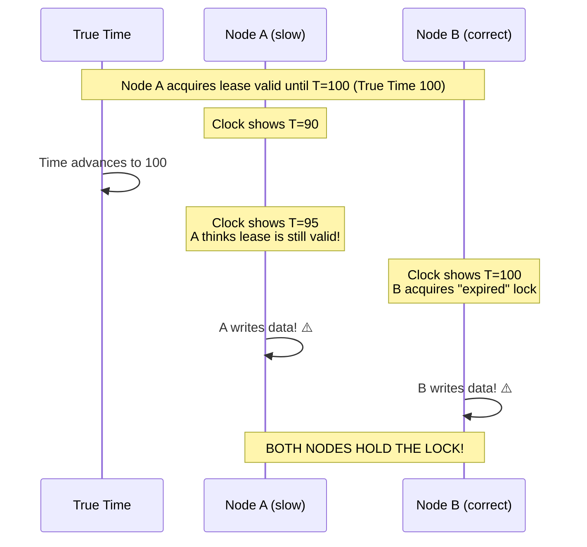

**Mitigation**:
- **Fencing tokens**: Lock server issues a monotonically increasing token with each lock grant. Resource servers reject tokens older than the latest seen.
- **Conservative lease expiry**: The lock holder considers the lease expired earlier than the server does (clock skew budget)
- **TrueTime-style approach**: Wait out the uncertainty before using the lock

### 10.5 Lamport Clock Rollover / Overflow

**Scenario**: A high-throughput system processes 10 billion events per second. Using a 64-bit Lamport counter, how long until overflow?

```
Max long value:    9,223,372,036,854,775,807
At 10B events/sec: overflow in ~29 years
At 1B events/sec:  overflow in ~292 years
At 1M events/sec:  overflow in ~292,000 years

Practically, overflow is rare but should be monitored.
```

**Mitigation**:
- Use unsigned 64-bit counters (if language supports it)
- Monitor counter values and alert at high water marks
- Reset counters during planned maintenance windows

### 10.6 Vector Clock Explosion

**Scenario**: In a system where any node can accept writes, the vector clock size grows with every new node that writes. After 10,000 different nodes have written to a key, the vector clock has 10,000 entries.

**Impact**:
- Each read/write for that key transfers 80 KB of vector clock data
- Comparison takes O(10,000)
- Storage overhead becomes significant

**Mitigation**:
- **Pruning**: Remove entries for nodes that haven't written recently (risks losing concurrency info)
- **Bounded vector clocks**: Cap at K entries, evicting oldest (Amazon Dynamo's approach)
- **Use HLC instead**: O(1) space, trades off concurrency detection

---

## 11. Debugging & Observability

### 11.1 Key Metrics to Monitor

```yaml
# Prometheus metrics for clock health

# NTP offset from reference server
node_ntp_offset_seconds:
  type: gauge
  alert: if abs(value) > 0.1  # 100ms

# NTP round-trip time
node_ntp_rtt_seconds:
  type: gauge
  alert: if value > 0.5  # 500ms (network problems)

# HLC logical-physical drift
hlc_drift_milliseconds:
  type: gauge
  alert: if value > max_configured_drift * 0.5

# Lamport clock value (for detecting runaway clocks)
lamport_clock_value:
  type: counter
  alert: if rate > 1000000  # Suspicious high rate

# Vector clock size (for detecting bloat)
vector_clock_entries:
  type: histogram
  alert: if p99 > 100  # Too many entries

# TrueTime uncertainty (if using Spanner)
truetime_uncertainty_ms:
  type: histogram
  alert: if p99 > 10  # Growing uncertainty

# Clock-related transaction restarts (CockroachDB)
clock_uncertainty_restarts:
  type: counter
  alert: if rate > 100/sec  # Too many restarts
```

### 11.2 Log Patterns

```java
// Structured logging for clock events

// Log NTP sync events
log.info("ntp.sync", Map.of(
    "offset_ms", ntpResult.offsetMs(),
    "rtt_ms", ntpResult.roundTripMs(),
    "server", ntpServer,
    "stratum", stratum
));

// Log HLC drift warnings
if (drift > maxDrift * 0.5) {
    log.warn("hlc.drift.warning", Map.of(
        "drift_ms", drift,
        "max_drift_ms", maxDrift,
        "logical_time", hlcState.logicalTime(),
        "physical_time", physicalTime
    ));
}

// Log vector clock conflict detection
if (vc1.isConcurrentWith(vc2)) {
    log.info("vector_clock.conflict", Map.of(
        "key", key,
        "version_count", siblings.size(),
        "vc1", vc1.toString(),
        "vc2", vc2.toString()
    ));
}

// Log clock-based transaction restart
log.warn("transaction.restart.clock_uncertainty", Map.of(
    "txn_id", txnId,
    "read_timestamp", readTs,
    "value_timestamp", valueTs,
    "uncertainty_window", uncertaintyMs,
    "restart_count", restartCount
));
```

### 11.3 Distributed Tracing with Clocks

The irony: distributed tracing systems (Jaeger, Zipkin) depend on clocks to order spans, but clocks are unreliable. Here's how they cope:

```
Span Ordering Strategy:
1. Use parent-child relationships (causal, reliable)
2. Use timestamps only for visualization (approximate)
3. Accept that sibling spans may appear out of order
4. Include clock skew as metadata for debugging

Best Practice:
- Always log BOTH wall clock time AND a Lamport/HLC timestamp
- Use HLC for ordering, wall clock for human readability
- Include node ID, process ID, and monotonic sequence number
```

### 11.4 Common Debugging Scenarios

**Scenario: "Stale reads in CockroachDB"**

```
Symptoms:
- Application reads old value even after another client wrote a new one
- Happens intermittently, more common during high load

Diagnosis:
1. Check NTP offset: cockroach node status --decommission
2. Look for "uncertainty interval" restarts: grep logs for "restart"
3. Measure clock skew between involved nodes
4. Check if max-offset is configured correctly

Root cause likely:
- NTP offset exceeded configured max-offset
- Network partition caused NTP sync failure
- VM migration caused clock jump
```

**Scenario: "Duplicate events in Kafka consumer"**

```
Symptoms:
- Consumer processes same message twice
- Happens after consumer restart or rebalance

Diagnosis:
1. Check consumer group commit timestamps
2. Verify offset commit frequency
3. Look for clock-backward-jump events

Root cause likely:
- Consumer committed offset with future timestamp
- After clock correction, re-read messages "before" the commit
- OR: consumer failed between processing and commit (at-least-once)
```

### 11.5 Grafana Dashboard Template

```
Clock Health Dashboard:
┌──────────────────────────────────────────────────────────┐
│  NTP Offset (all nodes)              │  HLC Drift        │
│  ┌──────────────────┐               │  ┌──────────────┐ │
│  │ ^^^^  ▼▼▼  ^^^^  │               │  │ ──────────── │ │
│  │    ▼▼    ▼▼      │ Target: 0ms   │  │ Max: 2ms     │ │
│  │──────────────────│               │  │ Avg: 0.5ms   │ │
│  │ Alert: >100ms    │               │  │ Alert: >250ms│ │
│  └──────────────────┘               │  └──────────────┘ │
├──────────────────────────────────────┼───────────────────┤
│  Clock Uncertainty Restarts/sec      │  Vector Clock Size│
│  ┌──────────────────┐               │  ┌──────────────┐ │
│  │ ▄▄▄▄▄▄           │               │  │ P50: 5       │ │
│  │ ████████          │               │  │ P99: 23      │ │
│  │ ████████████▄▄▄▄▄ │               │  │ Max: 47      │ │
│  │ Alert: >100/sec  │               │  │ Alert: >100  │ │
│  └──────────────────┘               │  └──────────────┘ │
└──────────────────────────────────────────────────────────┘
```

---

## 12. Interview Questions

### 12.1 Beginner Level

**Q1: Why can't distributed systems just use NTP and be done with it?**

**Expected Answer**: NTP synchronizes clocks to within 1-50ms typically, but it can't guarantee perfect synchronization because:
1. Network delays are variable and asymmetric
2. Clock drift between sync intervals means clocks diverge
3. NTP can step clocks backward, breaking monotonicity
4. During network partitions, NTP can't sync at all

For many applications, the remaining skew is enough to cause incorrect ordering of events, which can lead to data loss (last-write-wins with wrong timestamps), lock violations, and consistency bugs.

**Q2: What's the difference between clock drift and clock skew?**

**Expected Answer**: **Clock drift** is the *rate* at which a clock deviates from true time (measured in ppm—e.g., a clock drifts 20 microseconds per second). **Clock skew** is the *instantaneous difference* between two clocks at a given moment (e.g., Server A's clock is 5ms ahead of Server B's clock right now). Drift causes skew to grow over time; synchronization (NTP) reduces skew but can't eliminate it completely.

**Q3: Explain the happens-before relationship with an example.**

**Expected Answer**: The happens-before relation (→) captures causal ordering:
- If A sends a message and B receives it, then A's send → B's receive
- If events occur in sequence on the same process, they're ordered
- It's transitive: if a → b and b → c, then a → c

Example: Alice posts "I'm getting married!" (event A), then Bob reads the post and replies "Congrats!" (event B). A → B because Bob's reply was *caused by* Alice's post. If Charlie independently posts "Nice weather today" (event C), then C is *concurrent* with both A and B—we can't say whether C happened before or after A.

### 12.2 Intermediate Level

**Q4: Explain the difference between Lamport clocks and vector clocks. When would you choose one over the other?**

**Expected Answer**: 

*Lamport clocks*: Single counter per process. Guarantees: if a → b, then L(a) < L(b). But the converse is NOT true—L(a) < L(b) doesn't mean a → b; they could be concurrent. Space: O(1). Can't detect concurrency.

*Vector clocks*: Array of N counters (one per process). Guarantees: a → b **if and only if** VC(a) < VC(b). Can detect concurrency: if VC(a) ≮ VC(b) and VC(b) ≮ VC(a), then a ‖ b. Space: O(N).

**Choose Lamport** when: You need total ordering (like total order broadcast, distributed mutex), don't need conflict detection, or N is very large.

**Choose vector clocks** when: You need to detect concurrent updates (conflict resolution), N is small (<50 nodes), and you can afford O(N) message overhead. Example: Amazon Dynamo for shopping cart conflict detection.

**Q5: How does Google Spanner achieve external consistency? What is the commit-wait?**

**Expected Answer**: Spanner uses TrueTime, which returns a time interval `[earliest, latest]` with guaranteed bounds on true time. For writes:

1. Assign commit timestamp `s = TT.now().latest`
2. **Wait** until `TT.after(s)` is true (meaning the uncertainty interval has fully passed)
3. This "commit wait" ensures that any transaction starting after the wait will get a strictly higher timestamp

The commit-wait takes roughly 2ε (~7-14ms). This is the price for **external consistency**: if T1 commits before T2 starts, then T1's timestamp < T2's timestamp, guaranteed. No other distributed database provides this without specialized hardware (GPS + atomic clocks).

**Q6: What is a Hybrid Logical Clock and why does CockroachDB use it?**

**Expected Answer**: HLC combines physical time with a logical counter: timestamp = (logical_time, counter). The logical_time component is always ≥ physical time and close to it (bounded drift). The counter breaks ties when multiple events happen at the same logical_time.

CockroachDB uses HLC because:
1. It provides causal ordering (like Lamport clocks)
2. It stays close to wall-clock time (unlike Lamport clocks)
3. It's O(1) space (unlike vector clocks)
4. It doesn't require GPS or atomic clocks (unlike TrueTime)

The trade-off: CockroachDB can't guarantee external consistency like Spanner. Instead, it uses an "uncertainty interval" and restarts transactions if a read value's timestamp falls within the interval.

### 12.3 Advanced Level

**Q7: Design a conflict resolution system for a globally distributed shopping cart. Which clock mechanism would you choose and why?**

**Expected Answer**: 

I'd use a **CRDT-based approach** with **HLC timestamps** or **per-key version vectors** (bounded vector clocks):

1. **Data model**: Shopping cart as a set CRDT (add-wins set)
   - Each item addition is tagged with an HLC timestamp
   - Deletions are tracked with tombstones (also timestamped)
   
2. **Why not full vector clocks**: With potentially millions of users, vector clocks are too large. Use HLC for global ordering with bounded size.

3. **Why not LWW**: Shopping carts need merge semantics, not overwrite. If User A adds item X and User B adds item Y concurrently, we want {X, Y}, not just one of them.

4. **Conflict resolution**: 
   - Additions: Union of all items (add-wins)
   - Removals: Only effective if the removal's timestamp > the item's latest add timestamp
   - No user intervention needed

5. **Replication**: Anti-entropy (Merkle tree comparison) + read-repair + hinted handoff

This is similar to how Riak and the original Dynamo handled shopping carts, but with CRDTs replacing manual conflict resolution.

**Q8: You're debugging a distributed database where some transactions read stale data. The system uses HLC. What's your debugging approach?**

**Expected Answer**:

1. **Check NTP health** on all nodes:
   - `ntpq -p` to see peer status
   - Look for large offsets (>50ms)
   - Check if NTP service is running and reachable

2. **Check HLC drift metrics**:
   - Compare logical_time - physical_time on each node
   - If drift exceeds configured max-offset, the HLC can't maintain causal ordering guarantees

3. **Look for uncertainty interval restarts**:
   - High restart rate suggests clock skew is near the configured bound
   - Restarts increase tail latency

4. **Check for clock backward jumps**:
   - Look in system logs for NTP step adjustments
   - VM live migration can cause clock jumps

5. **Verify max-offset configuration**:
   - If configured max-offset (e.g., 500ms) is too low for actual clock skew, linearizability is violated silently
   - If too high, every read in the uncertainty window causes a restart

6. **Root cause patterns**:
   - Cloud VMs often have higher clock skew due to hypervisor scheduling
   - Network partitions prevent NTP sync
   - Hardware failures (stuck NTP daemon, failed RTC battery)

**Q9: Compare the time models used by Spanner, CockroachDB, and Cassandra. What are the practical implications for application developers?**

**Expected Answer**:

| Aspect | Spanner (TrueTime) | CockroachDB (HLC) | Cassandra (NTP + LWW) |
|--------|-------------------|-------------------|----------------------|
| Clock source | GPS + atomic | NTP | NTP |
| Ordering guarantee | External consistency | Serializable (with restarts) | Last-write-wins |
| Clock skew handling | Bounded interval, commit-wait | Uncertainty window, restarts | Ignored (risk of data loss) |
| Cost | Very expensive hardware | No special hardware | No special hardware |
| Write latency | +7-14ms (commit wait) | Occasional restart overhead | No overhead |
| Correct under skew | Always (if hardware works) | If skew < configured max | No guarantee |

**For developers**:
- **Spanner**: "Just works"—timestamps are globally ordered. No clock worries.
- **CockroachDB**: Mostly works. Configure max-offset conservatively. Monitor NTP. Expect occasional transaction restarts under high clock skew.
- **Cassandra**: You're responsible. If two clients write conflicting values, the one with the higher timestamp wins, regardless of actual order. Never trust timestamps from different clients.

### 12.4 FAANG System Design Questions

**Q10: Design a global event ordering system for a social media platform (like Twitter's timeline). How do you handle time?**

**Key Discussion Points**:

1. **Requirements analysis**: Do we need total order (all users see same order) or causal order (replies after posts)?
   - Causal consistency is sufficient for social media
   - Total order is too expensive globally

2. **Architecture**:
   - Use Lamport clocks within a single data center for total ordering
   - Use HLC across data centers for causal ordering
   - Snowflake IDs (timestamp-based) for globally unique, roughly-ordered IDs

3. **Timeline rendering**:
   - Fetch posts from multiple shards
   - Sort by HLC timestamp (close to wall-clock, so timeline looks natural)
   - For replies, enforce causal ordering (reply must appear after parent)

4. **Handling cross-datacenter inconsistency**:
   - User in US posts, user in EU replies
   - EU data center may not have the original post yet
   - Solution: Check for causal dependencies before rendering; fetch missing posts

---

## 13. Exercises

### 13.1 Conceptual Exercises

**Exercise 1: Lamport Clock Trace**

Given three processes P1, P2, P3 with the following events:
1. P1 sends message m1 to P2
2. P1 sends message m2 to P3
3. P2 receives m1
4. P2 sends message m3 to P3
5. P3 receives m2
6. P3 receives m3
7. P1 has a local event

Draw the space-time diagram and compute all Lamport timestamps. Identify all pairs of concurrent events.

**Solution**:
```
P1:  e1(send m1)  e2(send m2)  e7(local)
     C=1          C=2          C=3

P2:  ............  e3(recv m1)  e4(send m3)
                   C=2          C=3

P3:  ............  e5(recv m2)  e6(recv m3)
                   C=3          C=4

Concurrent pairs:
  e1 ‖ e3? No, e1 → e3 (message m1)
  e7 ‖ e6? Yes! No causal path between them
  e2 ‖ e3? Yes! e2 was sent by P1 but not received by P2
  e7 ‖ e4? Yes!
```

**Exercise 2: Vector Clock Conflict Detection**

A key-value store has three replicas (A, B, C). Trace through these operations and identify all conflicts:

1. Client writes "x=1" to replica A
2. Replica A replicates to B
3. Client writes "x=2" to replica A
4. Client writes "x=3" to replica B (concurrent with step 3!)
5. Replica A and B exchange states

Show the vector clocks at each step and explain what happens in step 5.

**Exercise 3: NTP Offset Calculation**

An NTP client exchanges timestamps with a server:
- t1 = 1000.000 ms (client send)
- t2 = 1000.850 ms (server receive)  
- t3 = 1000.851 ms (server send)
- t4 = 1001.500 ms (client receive)

Calculate: round-trip delay, estimated offset, and one-way delay. If the actual network path is asymmetric (800ms forward, 700ms return), what is the true offset and what is the error in NTP's estimate?

**Solution**:
```
δ = (t4-t1) - (t3-t2) = 1500 - 1 = 1499 μs ... wait, let me recalculate in proper units.
t1=1000.000, t2=1000.850, t3=1000.851, t4=1001.500 (all in ms)

δ = (t4-t1) - (t3-t2) = (1001.500-1000.000) - (1000.851-1000.850)
  = 1.500 - 0.001 = 1.499 ms

θ = ((t2-t1) + (t3-t4)) / 2
  = ((1000.850-1000.000) + (1000.851-1001.500)) / 2
  = (0.850 + (-0.649)) / 2
  = 0.201 / 2
  = 0.1005 ms

NTP estimates: client is 0.1005 ms behind server.
One-way delay estimate: 1.499/2 = 0.7495 ms each way.

With asymmetric path (800μs forward, 700μs return = 0.8 + 0.7 ms):
True offset = t2 - t1 - forward_delay 
            = 0.850 - 0.800 = 0.050 ms

NTP error = |0.1005 - 0.050| = 0.0505 ms
This error is (forward - return)/2 = (0.800-0.700)/2 = 0.050 ms ✓
```

### 13.2 Coding Exercises

**Exercise 4: Implement a Bounded Vector Clock**

Implement a vector clock that limits entries to K most recent writers. When adding a new writer would exceed K, evict the writer with the smallest timestamp. Consider: what correctness guarantees do you lose?

**Exercise 5: Build a TrueTime Simulator**

Create a TrueTime simulator with configurable:
- Number of GPS + atomic clock masters
- Failure probability per master
- Uncertainty growth rate (between syncs)
- Sync interval

Implement `now()`, `after(t)`, and `before(t)`. Verify that commit-wait ensures external consistency by running 1000 simulated transactions across 3 nodes.

**Exercise 6: Causal Broadcast**

Implement a causal broadcast protocol using vector clocks. N processes send messages, and each process delivers messages only when all causally preceding messages have been delivered. Test with simulated network delays and out-of-order delivery.

### 13.3 System Design Exercise

**Exercise 7: Design a Distributed Debugger**

Design a system that collects logs from 1000 servers and presents them in **causal order** (not timestamp order) to a debugger. Consider:
- How to assign HLC timestamps to log entries
- How to reconstruct causal order at the collector
- How to handle late-arriving logs
- How to visualize concurrent events
- Performance with 10M log entries per second

---

## 14. Expert Insights

### 14.1 Hidden Complexities

#### Leap Seconds Are Terrifying

A leap second is inserted (or theoretically removed) to keep UTC aligned with Earth's rotation. On June 30, 2012, the leap second caused:

- Reddit went down (Java's NTP handling bug)
- Hadoop clusters crashed (jobs had negative elapsed time)
- Linux kernel bug caused `futex()` to spin (high CPU on thousands of servers)
- Airline booking systems experienced timeouts

**Modern solution**: Google and Amazon use **leap smearing**—instead of adding a sudden second, they spread it over hours by slowing/speeding the clock by tiny amounts. But not everyone smears, and different providers smear differently, creating *divergent time* between systems during the smear window.

#### Clock Monotonicity vs. Accuracy

There's a fundamental tension:
- **Monotonicity**: The clock should never go backward (needed for IDs, durations, progress)
- **Accuracy**: The clock should match true time (needed for TTLs, scheduling, coordination)

You can't always have both. If your clock is 5 seconds ahead and you correct it:
- **Step correction**: Accurate but breaks monotonicity (clock jumps backward)
- **Slew correction**: Monotonic but takes time to converge (inaccurate during slewing)
- **Solution**: Use two clocks: `CLOCK_MONOTONIC` for durations, `CLOCK_REALTIME` for timestamps

#### The Java `System.currentTimeMillis()` Trap

```java
// This code has a subtle bug:
long expiresAt = System.currentTimeMillis() + 30000; // 30 second timeout

// Later...
if (System.currentTimeMillis() > expiresAt) {
    // Timeout!
}

// Problem: If NTP steps the clock backward by 1 minute between 
// setting expiresAt and checking it, the timeout will be 1 minute 
// longer than intended!

// Fix: Use System.nanoTime() for durations
long deadline = System.nanoTime() + TimeUnit.SECONDS.toNanos(30);
if (System.nanoTime() > deadline) {
    // Timeout!
}
```

### 14.2 Industry Lessons

#### Lesson 1: "Good enough" clock sync is never good enough

Teams routinely underestimate the impact of clock skew. Common refrain: "Our clocks are synced via NTP, so they're accurate enough." But:
- NTP on cloud VMs can drift by 100ms+ during hypervisor scheduling delays
- VM live migration can cause clock jumps of 10-100ms
- Docker containers inherit the host's clock; if host NTP fails, all containers are affected

**Rule of thumb**: Design your system to tolerate clock skew 10x worse than your measured skew.

#### Lesson 2: CockroachDB's Hard-Won Wisdom

CockroachDB's engineering blog documents extensive learnings:
- They initially set max-offset to 250ms; raised to 500ms after production incidents
- High transaction restart rates were caused by VMs on overloaded hypervisors (200ms+ skew)
- They added a "minimum required NTP sync" check at node startup
- They developed tooling to continuously measure inter-node clock skew

#### Lesson 3: Facebook's Time Infrastructure

Facebook (Meta) invested heavily in PTP (Precision Time Protocol) for their data centers:
- ~1 microsecond accuracy within a data center
- GPS-disciplined PTP grandmaster clocks
- Hardware timestamping on all network switches
- Motivation: Consistent database snapshots for their TAO graph database

#### Lesson 4: Financial Markets and MiFID II

The EU's MiFID II regulation requires:
- Timestamps accurate to **1 microsecond** for high-frequency trading events
- Timestamps traceable to UTC
- Mandatory use of PTP or equivalent
- This drove a massive industry investment in precision timing infrastructure

### 14.3 Scaling Pain Points

#### Vector Clock Pruning in Production

When Amazon's Dynamo paper said "use vector clocks," it sounded simple. In practice:
- With thousands of Dynamo nodes, vector clocks grew to KB per key
- Pruning heuristics (remove entries older than X seconds, or cap at K entries) caused **false conflicts** (detecting two versions as concurrent when one actually causally dominated)
- This is a major reason DynamoDB moved to a simpler LWW model for most use cases

#### The Tyranny of the NTP Percentile

Even if NTP is accurate to 1ms at P50, the P99 might be 50ms and the P99.9 might be 500ms. In a large cluster:
- 1000 nodes, each with P99 NTP accuracy of 50ms
- At any given time, ~10 nodes have >50ms skew
- These nodes will cause problems (stale reads, lock issues, etc.)
- **You don't design for the average; you design for the worst case**

#### Time in Serverless

Serverless functions (Lambda, Cloud Functions) have unique time challenges:
- Cold starts may have stale clocks (the VM was idle, NTP didn't sync)
- Clock quality depends on the underlying VM, which you don't control
- Execution may be migrated between invocations
- No guarantee of `System.nanoTime()` continuity between invocations

### 14.4 Emerging Trends

#### Optical Clocks

Next-generation atomic clocks using optical transitions (visible light frequencies instead of microwaves):
- 100x more accurate than cesium clocks
- Could reduce TrueTime uncertainty to microseconds instead of milliseconds
- Currently lab-only; commercial availability in ~5-10 years

#### White Rabbit Protocol

A precision time protocol for particle physics (CERN) achieving sub-nanosecond accuracy:
- Based on PTP with enhancements
- Requires fiber optic connections with known path length
- Being adopted by some financial exchanges

#### Logical Clocks in Blockchain

Blockchains are essentially distributed systems that need total ordering without trusted time:
- Bitcoin: Proof-of-work as a "logical clock" (each block is a tick)
- Block timestamps are unreliable (miners set them freely within ±2 hours)
- Block height (analogous to Lamport clock) is the true ordering mechanism

---

## 15. Chapter Summary

### Key Takeaways

- **Time is fundamentally broken** in distributed systems. There is no global "now," and physical clocks drift at 10-20 ppm (up to 1.7 seconds/day).

- **Clock skew** (instantaneous difference between clocks) is unavoidable. NTP achieves 1-50ms accuracy; PTP achieves sub-microsecond with hardware support.

- **NTP uses a 4-timestamp algorithm** to estimate clock offset, assuming symmetric network delays. This assumption is often wrong, limiting accuracy.

- **The happens-before relation** (Lamport, 1978) formalizes causal ordering: `a → b` means `a` could have influenced `b`. Events with no causal link are **concurrent**.

- **Lamport clocks** provide a total order consistent with causality using a single counter. Limitation: can't detect concurrency (`L(a) < L(b)` doesn't imply `a → b`).

- **Vector clocks** perfectly capture causality (bidirectional: `a → b ⟺ VC(a) < VC(b)`) but don't scale—O(N) space and messages for N processes.

- **Hybrid Logical Clocks (HLC)** combine physical time with a logical counter, providing causal ordering with O(1) space and bounded divergence from wall-clock time. Used by CockroachDB and YugabyteDB.

- **Google TrueTime** returns a time interval `[earliest, latest]` with hardware-backed bounds. Spanner uses **commit-wait** (waiting out the uncertainty) to achieve external consistency. Requires GPS + atomic clock infrastructure.

- **The fundamental trade-offs** in clock design:
  - Accuracy vs. cost (TrueTime vs. NTP)
  - Completeness vs. scalability (Vector clocks vs. HLC)
  - Latency vs. consistency (commit-wait vs. eventual consistency)

- **Production lessons**: Design for 10x your expected clock skew. Monitor NTP continuously. Use `System.nanoTime()` for durations, never `System.currentTimeMillis()`. Beware leap seconds.

- **Real systems**: Spanner uses TrueTime, CockroachDB uses HLC, Cassandra uses LWW, Kafka uses log offsets. Each makes different trade-offs appropriate for their use case.

### Quick Reference Decision Tree

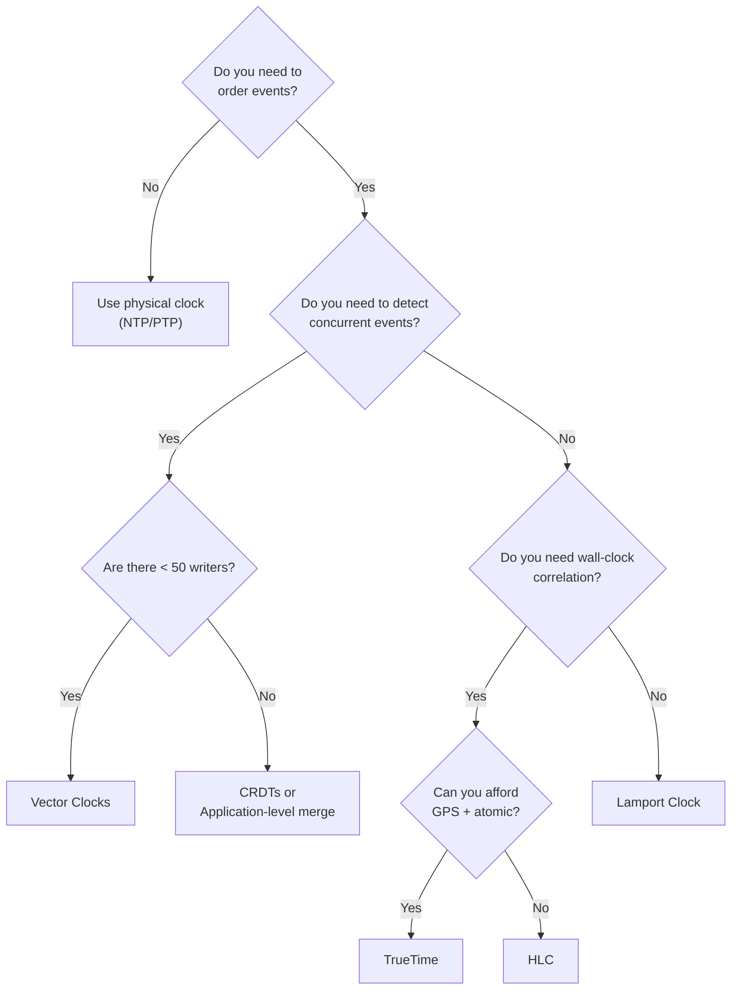

---

## References

1. Lamport, L. (1978). "Time, Clocks, and the Ordering of Events in a Distributed System." *Communications of the ACM*, 21(7), 558-565.
2. Mattern, F. (1989). "Virtual Time and Global States of Distributed Systems." *Parallel and Distributed Algorithms*, 215-226.
3. Fidge, C. (1988). "Timestamps in Message-Passing Systems That Preserve the Partial Ordering." *Australian Computer Science Communications*, 10(1), 56-66.
4. Corbett, J.C., et al. (2013). "Spanner: Google's Globally-Distributed Database." *ACM Transactions on Computer Systems*, 31(3).
5. Kulkarni, S., et al. (2014). "Logical Physical Clocks and Consistent Snapshots in Globally Distributed Databases." *OPODIS 2014*.
6. DeCandia, G., et al. (2007). "Dynamo: Amazon's Highly Available Key-value Store." *SOSP 2007*.
7. Mills, D.L. (2010). *Computer Network Time Synchronization: The Network Time Protocol on Earth and in Space.* CRC Press.
8. Demirbas, M., & Kulkarni, S. (2013). "Beyond TrueTime: Using AugmentedTime for Improving Spanner." *LADIS 2013*.

---

*Next Chapter: [Chapter 4 - Processes, Threads, and Concurrency](Chapter-04-Processes-Threads-Concurrency.md)*
