# Chapter 4: Processes, Threads, and Concurrency in Distributed Systems

---

> *"Concurrency is not parallelism, although it enables parallelism. If you have only one processor, your program can still be concurrent but it cannot be parallel."*
> — Rob Pike

---

## 1. Why This Matters

Every distributed system is, at its core, a collection of **concurrent processes** communicating over a network. Before you can understand how Kafka partitions are consumed, how a web server handles 100,000 simultaneous connections, how a database manages lock contention, or how a microservice processes requests—you must first master concurrency within a single machine.

Concurrency is the **foundation** upon which all distributed systems are built:

| Distributed Concept | Underlying Concurrency Concept |
|---------------------|-------------------------------|
| Multiple replicas processing requests | Thread pools handling concurrent work |
| Database row locks | Mutual exclusion (mutex) |
| Message queue consumers | Producer-consumer pattern |
| Distributed deadlocks | Local deadlocks, elevated |
| Leader election | Atomic compare-and-swap |
| Event-driven microservices | Async programming, reactive streams |
| gRPC streaming | Non-blocking I/O, virtual threads |
| Connection pooling | Resource management, semaphores |

### Real-World Costs of Getting It Wrong

| Incident | Concurrency Bug | Impact |
|----------|-----------------|--------|
| **Therac-25 Radiation Machine** | Race condition between UI and hardware | 6 patients received lethal radiation doses |
| **Northeast Blackout (2003)** | Race condition in monitoring software | 55 million people lost power for 2 days |
| **Mars Pathfinder (1997)** | Priority inversion (mutex contention) | Rover repeatedly rebooted on Mars |
| **Knight Capital (2012)** | Old code deployed to one of eight servers | $440 million lost in 45 minutes |
| **Cloudflare (2019)** | Regular expression CPU exhaustion | Global CDN outage |

### Why Engineers Must Master This

1. **Every system design interview** involves concurrency—thread pools, connection pools, request handling, caching.
2. **Production debugging** requires understanding thread dumps, deadlock detection, and race conditions.
3. **Performance optimization** is fundamentally about managing concurrency—lock contention, context switching, cache coherence.
4. **Modern Java** (Project Loom, virtual threads) is reshaping how we build concurrent systems. Understanding the evolution is critical.
5. **Distributed systems amplify** every local concurrency bug. A race condition that manifests once per million operations locally becomes a daily occurrence across 1000 nodes.

---

## 2. Beginner Intuition

### The Restaurant Analogy

Think of a busy restaurant:

**Process = An independent restaurant franchise location**
- Has its own kitchen, staff, and customer base
- Doesn't share anything with other locations
- Communicating with another franchise requires phone calls (IPC)

**Thread = A chef in the kitchen**
- Multiple chefs share the same kitchen (memory space)
- They share knives, cutting boards, ovens (shared resources)
- They can talk to each other directly (shared memory)
- But they must coordinate: two chefs can't use the same cutting board simultaneously

**Concurrency = Handling multiple orders at the same time**
- Even one chef can handle multiple orders by switching between them (while soup simmers, prepare salad)
- This is concurrency: **managing** multiple tasks, not necessarily executing them simultaneously

**Parallelism = Having multiple chefs working simultaneously**
- Two chefs actually cooking at the same time on different stations
- This requires **multiple physical stations** (CPU cores)

**Race Condition = Two chefs reaching for the same ingredient**
- Chef A checks: "Do we have garlic?" → Yes, 1 clove
- Chef B checks: "Do we have garlic?" → Yes, 1 clove  
- Both chefs take the garlic → someone's dish has no garlic!
- Solution: **One chef at a time** checks AND takes the ingredient (mutual exclusion)

**Deadlock = Two chefs waiting for each other**
- Chef A holds the knife, needs the cutting board
- Chef B holds the cutting board, needs the knife
- Both wait forever → no food is ever served!

### The Core Concepts in One Diagram

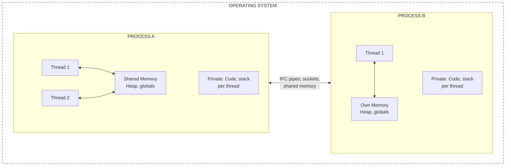

---

## 3. Core Theory

### 3.1 Processes vs. Threads: Detailed Comparison

#### What Is a Process?

A **process** is an instance of a running program. The OS provides each process with:

1. **Virtual address space**: An isolated chunk of memory (typically 4 GB on 32-bit, 256 TB on 64-bit Linux)
2. **Open file descriptors**: File handles, sockets, pipes
3. **Security context**: User ID, group ID, capabilities
4. **Scheduling state**: Running, ready, blocked, terminated
5. **Signal handlers**: How to respond to OS signals (SIGTERM, SIGKILL, etc.)
6. **Resource limits**: CPU time, memory, open files (ulimits)

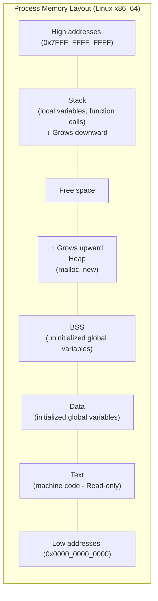

#### What Is a Thread?

A **thread** is the smallest unit of execution within a process. Threads within the same process share:

- **Code segment**: Same program text
- **Data segment**: Same global variables
- **Heap**: Same dynamically allocated memory
- **Open file descriptors**: Same file handles
- **Signal handlers**: Same signal disposition

Each thread has its **own**:
- **Stack**: Local variables, function call chain (typically 1-8 MB)
- **Program counter**: Where the thread is executing
- **CPU registers**: Current register values
- **Thread-local storage**: Per-thread global-ish variables
- **Stack pointer**: Current position in the stack

#### Comparison Table

| Feature | Process | Thread |
|---------|---------|--------|
| **Memory** | Isolated virtual address space | Shared address space within process |
| **Creation cost** | Heavy (fork: copy page tables, ~1-10ms) | Light (clone: share page tables, ~10-100μs) |
| **Context switch cost** | Expensive (~1-5μs, TLB flush) | Cheaper (~0.5-2μs, no TLB flush) |
| **Communication** | IPC (pipes, sockets, shared mem) | Direct memory access |
| **Failure isolation** | Full: crash doesn't affect others | None: one thread crash kills all |
| **Security isolation** | Full: separate user, capabilities | None: all threads share credentials |
| **Scalability limit** | OS limit (thousands) | Per-process limit (thousands) |
| **Debugging** | Easier (isolated state) | Harder (shared state, race conditions) |
| **Use case** | Microservices, sandboxing, security | Parallelism within a service, I/O handling |

### 3.2 Thread Models

#### 3.2.1 One-to-One Model (1:1)

Every user-level thread maps to exactly one kernel thread (OS thread).

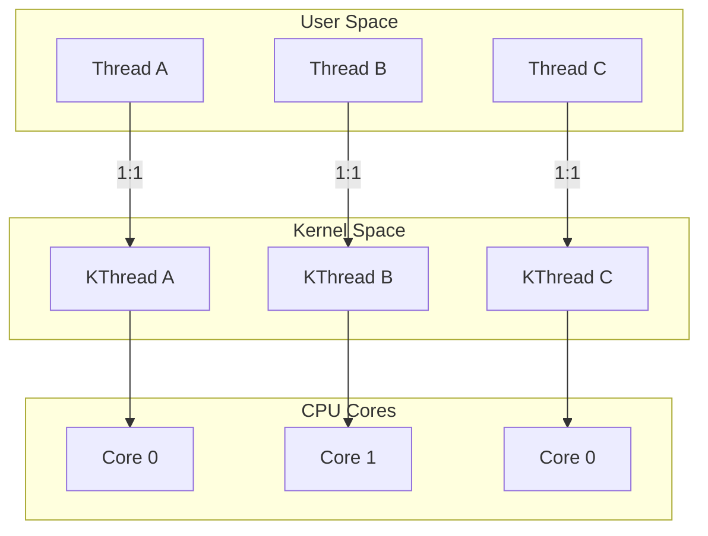

**Used by**: Linux (NPTL), Windows, modern macOS
**Pros**: True parallelism, kernel handles scheduling, preemptive
**Cons**: OS thread creation is expensive (~10-100μs), stack memory overhead (1-8 MB per thread), OS limit on thread count (typically ~10,000-30,000)

#### 3.2.2 Many-to-One Model (M:1)

Many user-level threads map to one kernel thread. The user-level thread library handles scheduling.

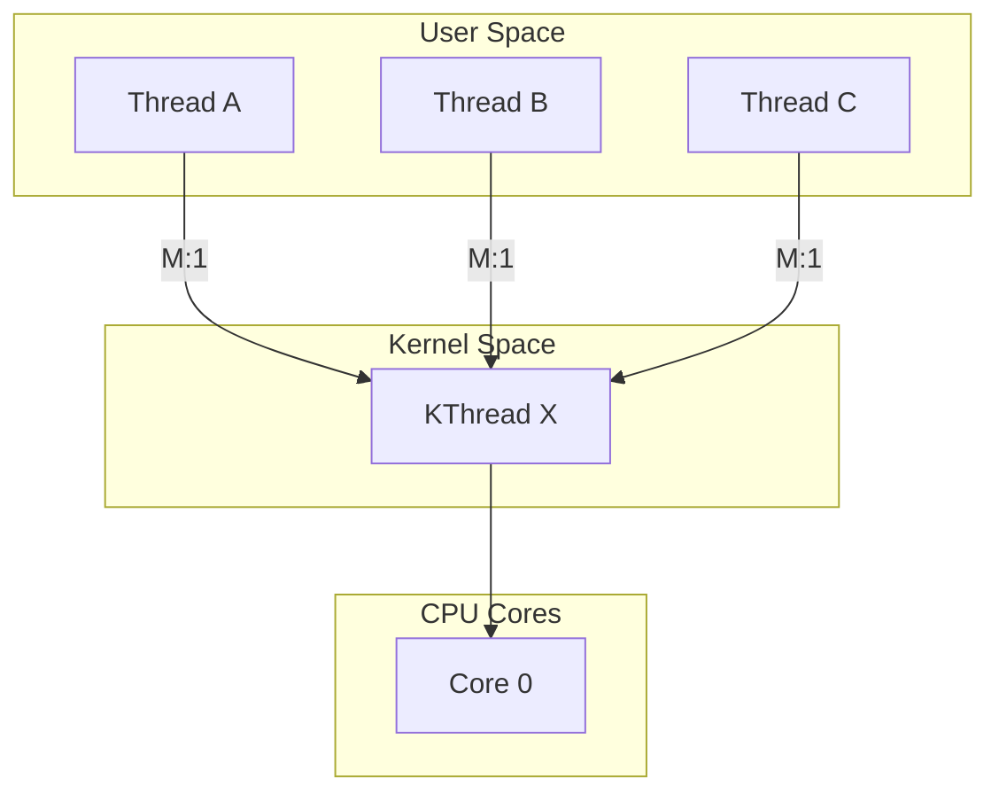

**Used by**: Early Java (green threads), GNU Portable Threads
**Pros**: Very lightweight thread creation, no kernel involvement
**Cons**: No true parallelism (can only use one core), one blocking syscall blocks ALL threads

#### 3.2.3 Many-to-Many Model (M:N)

M user-level threads are multiplexed onto N kernel threads (where M >> N).

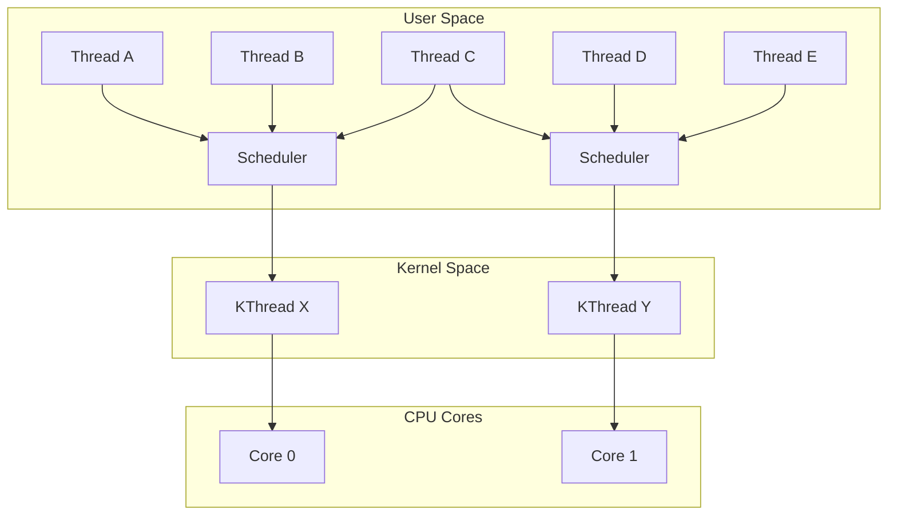

**Used by**: Go (goroutines), Erlang (processes), Java 21+ (virtual threads)
**Pros**: Best of both worlds—lightweight creation AND true parallelism
**Cons**: Complex scheduling, harder to debug, potential for subtle scheduling bugs

#### 3.2.4 Green Threads

User-space threads managed entirely by the runtime/VM, not the OS.

**Historical Java** (JDK 1.0-1.1): Java originally used green threads because many OSes didn't support kernel threads well. Abandoned in JDK 1.2 for native threads.

**Modern Revival**: Java 21's virtual threads are essentially "green threads done right"—M:N scheduling with integration for blocking I/O.

#### 3.2.5 Virtual Threads (Java Project Loom)

Virtual threads, introduced in Java 21 (JEP 444), are lightweight threads managed by the JVM:

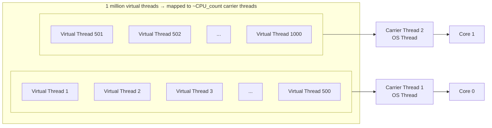

> **Key insight**: When a virtual thread blocks on I/O, the JVM UNMOUNTS it from the carrier thread and MOUNTS another virtual thread, keeping the CPU busy.

**Key properties**:
- **Creation cost**: ~1μs (vs 10-100μs for OS threads)
- **Memory**: ~few KB initial stack (vs 1MB for OS threads)
- **Count**: Millions of virtual threads are practical
- **Scheduling**: JVM's ForkJoinPool (work-stealing)
- **Blocking**: When a virtual thread blocks (I/O, `Thread.sleep()`, `Lock.lock()`), it's unmounted from the carrier thread
- **Pinning**: Blocking in `synchronized` block or native code **pins** the virtual thread to the carrier (bad for performance)

### 3.3 Context Switching

#### What Is a Context Switch?

A **context switch** is the process of saving the state of one thread/process and restoring another. It's the fundamental cost of concurrency.

#### Context Switch Steps

```
Thread A is running on Core 0:
1. Hardware timer interrupt fires (or Thread A blocks)
2. CPU saves Thread A's registers to kernel stack
3. Kernel saves Thread A's full state to its Task Control Block (TCB)
4. Kernel's scheduler selects Thread B to run
5. Kernel loads Thread B's state from its TCB
6. CPU restores Thread B's registers
7. Thread B resumes execution on Core 0

Additional costs:
- TLB flush (if switching processes, not threads)
- Cache pollution (Thread B's data not in L1/L2 cache)
- Pipeline flush (CPU speculative execution wasted)
- Branch predictor pollution
```

#### Context Switch Costs

| Scenario | Direct Cost | Indirect Cost (Cache) | Total |
|----------|------------|----------------------|-------|
| Thread switch (same process) | 0.5-2 μs | 5-20 μs | 5-22 μs |
| Process switch (same user) | 1-5 μs | 10-50 μs | 11-55 μs |
| Process switch (different user) | 2-10 μs | 10-50 μs | 12-60 μs |
| Virtual thread switch (Java 21) | 0.1-0.5 μs | ~0 (same carrier) | 0.1-0.5 μs |

**The hidden cost is cache pollution**: When Thread B starts running, its working data isn't in the CPU cache. The first memory accesses will be **cache misses**, each costing 100-300 CPU cycles. This "cache warm-up" cost often dominates the direct context switch cost.

#### Impact on Throughput

```
Scenario: Web server handling HTTP requests

Thread-per-request with 10,000 concurrent requests:
  10,000 threads, ~100 context switches per second per thread
  = 1,000,000 context switches/second
  = 1M × 20μs = 20 seconds of CPU time wasted on switching!
  
  On an 8-core server, that's 20/8 = 2.5 seconds/second PER CORE
  → ~30% of CPU wasted on context switching alone!

With virtual threads (1,000 concurrent on 8 carrier threads):
  8 carrier threads, very few OS-level context switches
  Virtual thread switches: ~0.3μs each
  Much less cache pollution (carrier threads stay on cores)
  → <1% overhead
```

### 3.4 Concurrency vs. Parallelism

These terms are often confused. They are **different concepts**:

| Aspect | Concurrency | Parallelism |
|--------|-------------|-------------|
| **Definition** | Dealing with multiple things at once | Doing multiple things at once |
| **Analogy** | One cook, multiple dishes (time-slicing) | Multiple cooks, multiple dishes |
| **Requires** | Task management/switching | Multiple CPU cores |
| **Single core?** | ✅ Yes (via time-slicing) | ❌ No |
| **Goal** | Structure (manage complexity) | Speed (execute faster) |
| **Examples** | Event loop, async I/O | MapReduce, SIMD, GPU |

```
Concurrency (1 core):

Time →
Core 0: [Task A][Task B][Task A][Task C][Task B][Task A]

Tasks overlap in TIME (interleaved), not in EXECUTION.
The illusion of simultaneity.

Parallelism (4 cores):

Time →
Core 0: [Task A ████████████]
Core 1: [Task B ████████████]
Core 2: [Task C ████████████]
Core 3: [Task D ████████████]

Tasks literally execute SIMULTANEOUSLY on different cores.
```

**Key insight**: Concurrency is about **structure** (how your program is organized to handle multiple tasks). Parallelism is about **execution** (how your program uses hardware). You can have concurrency without parallelism (single-core system), and you can have parallelism without concurrency (SIMD instruction processing identical data).

### 3.5 Synchronization Primitives

#### 3.5.1 Mutex (Mutual Exclusion)

The most basic synchronization primitive. Only one thread can hold the mutex at a time.

```java
// Java intrinsic lock (monitor)
synchronized (lockObject) {
    // Critical section: only one thread at a time
    sharedCounter++;
}

// Java ReentrantLock (more flexible)
ReentrantLock lock = new ReentrantLock();
lock.lock();
try {
    sharedCounter++;
} finally {
    lock.unlock(); // ALWAYS unlock in finally!
}
```

**Properties**:
- **Mutual exclusion**: Only one holder at a time
- **Blocking**: Waiting threads are blocked (sleeping)
- **Reentrant**: Same thread can acquire the same lock multiple times (in Java)
- **Fairness**: Optional fair ordering (FIFO) in `ReentrantLock(true)`

#### 3.5.2 Semaphore

A generalization of mutex: allows up to N threads to access a resource.

```java
// Connection pool: max 10 concurrent connections
Semaphore connectionPool = new Semaphore(10);

void useConnection() throws InterruptedException {
    connectionPool.acquire(); // blocks if 10 connections in use
    try {
        // Use a connection
        executeQuery();
    } finally {
        connectionPool.release(); // return the permit
    }
}
```

**Types**:
- **Binary semaphore** (N=1): Equivalent to a mutex (but non-reentrant, non-owned)
- **Counting semaphore** (N>1): Rate limiting, connection pooling

#### 3.5.3 Monitor

A higher-level construct that combines a mutex with **condition variables**. Java's `synchronized` + `wait()`/`notify()` implements a monitor.

```java
class BoundedBuffer<T> {
    private final Queue<T> queue = new LinkedList<>();
    private final int capacity;
    
    BoundedBuffer(int capacity) { this.capacity = capacity; }
    
    synchronized void put(T item) throws InterruptedException {
        while (queue.size() == capacity) {
            wait(); // Release monitor, wait for space
        }
        queue.add(item);
        notifyAll(); // Wake up waiting consumers
    }
    
    synchronized T take() throws InterruptedException {
        while (queue.isEmpty()) {
            wait(); // Release monitor, wait for items
        }
        T item = queue.remove();
        notifyAll(); // Wake up waiting producers
        return item;
    }
}
```

#### 3.5.4 Read-Write Lock

Allows multiple concurrent readers OR one exclusive writer.

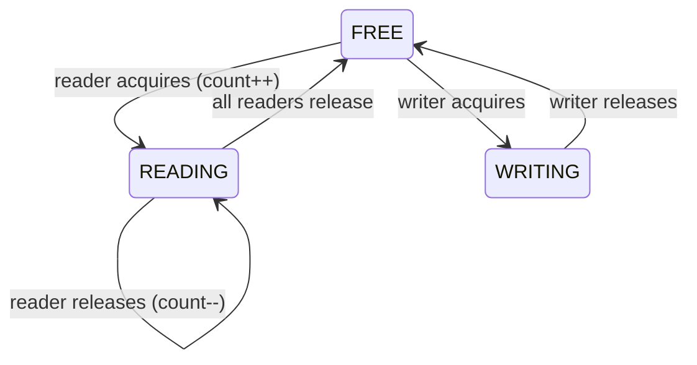

```java
ReadWriteLock rwLock = new ReentrantReadWriteLock();

// Read path: many concurrent readers allowed
rwLock.readLock().lock();
try {
    return cache.get(key);
} finally {
    rwLock.readLock().unlock();
}

// Write path: exclusive access
rwLock.writeLock().lock();
try {
    cache.put(key, value);
} finally {
    rwLock.writeLock().unlock();
}
```

**When to use**: Read-heavy workloads (>90% reads). If writes are frequent, the overhead of RW lock management exceeds a simple mutex.

#### 3.5.5 Spin Lock

Instead of blocking (sleeping), a spin lock keeps the thread **busy-waiting** (spinning):

```java
// Simplified spin lock using AtomicBoolean
class SpinLock {
    private final AtomicBoolean locked = new AtomicBoolean(false);
    
    void lock() {
        while (!locked.compareAndSet(false, true)) {
            Thread.onSpinWait(); // CPU hint for spin-wait optimization
        }
    }
    
    void unlock() {
        locked.set(false);
    }
}
```

**When to use**: When critical sections are very short (< ~1μs) and context switch cost exceeds spin cost. Common in OS kernels and low-latency systems.

### 3.6 Race Conditions

A **race condition** occurs when the behavior of a program depends on the relative timing of events (the "race" between threads).

#### Classic Example: Check-Then-Act

```java
// RACE CONDITION!
if (!map.containsKey(key)) {    // Check
    map.put(key, computeValue()); // Act
}
// Thread A checks: not present
// Thread B checks: not present
// Thread A inserts
// Thread B inserts (overwrites A's value!)

// Fix: Atomic check-and-act
map.computeIfAbsent(key, k -> computeValue());
```

#### Read-Modify-Write Race

```java
// RACE CONDITION!
counter++;  
// This is THREE operations:
// 1. Read counter to register
// 2. Increment register
// 3. Write register to counter

// Thread A reads: counter = 5
// Thread B reads: counter = 5
// Thread A writes: counter = 6
// Thread B writes: counter = 6  (should be 7!)

// Fix: Atomic operation
AtomicInteger counter = new AtomicInteger(0);
counter.incrementAndGet();
```

#### Detection Techniques

| Technique | Description | Tools |
|-----------|-------------|-------|
| **Static analysis** | Analyze source code for potential races | FindBugs, ErrorProne, SpotBugs |
| **Dynamic analysis** | Detect races at runtime | ThreadSanitizer (C++), Java Flight Recorder |
| **Model checking** | Exhaustively explore thread interleavings | Java Pathfinder, TLA+ |
| **Code review** | Human review for unsynchronized shared state | Team reviews, checklists |
| **Stress testing** | Run with many threads, random delays | JCStress, custom test harnesses |

### 3.7 Deadlocks

A **deadlock** occurs when two or more threads are blocked forever, each waiting for a resource held by another.

#### Four Necessary Conditions (Coffman Conditions)

All four must hold simultaneously for deadlock:

1. **Mutual exclusion**: Resources cannot be shared (at least one resource is held exclusively)
2. **Hold and wait**: A thread holds resources while waiting for others
3. **No preemption**: Resources cannot be forcibly taken from a thread
4. **Circular wait**: A circular chain of threads, each waiting for a resource held by the next

#### Deadlock Prevention (Break One Condition)

| Condition | Prevention Strategy | Practicality |
|-----------|-------------------|--------------|
| Mutual exclusion | Use lock-free algorithms | Hard; not always possible |
| Hold and wait | Acquire all locks at once (or none) | Reduces concurrency |
| No preemption | Use tryLock() with timeout | Risk of livelock |
| Circular wait | **Lock ordering**: always acquire locks in the same global order | Most practical; widely used |

#### Deadlock Detection

```java
// Java can detect deadlocks via ThreadMXBean:
ThreadMXBean threadMXBean = ManagementFactory.getThreadMXBean();
long[] deadlockedThreads = threadMXBean.findDeadlockedThreads();

if (deadlockedThreads != null) {
    ThreadInfo[] threadInfos = threadMXBean.getThreadInfo(deadlockedThreads, true, true);
    for (ThreadInfo info : threadInfos) {
        System.err.println("Deadlocked thread: " + info.getThreadName());
        System.err.println("  Waiting for: " + info.getLockName());
        System.err.println("  Held by: " + info.getLockOwnerName());
        for (StackTraceElement ste : info.getStackTrace()) {
            System.err.println("    at " + ste);
        }
    }
}
```

### 3.8 The Java Memory Model (JMM)

The JMM defines how threads interact through memory and what behaviors are legal.

#### The Problem

Modern CPUs reorder instructions for performance. Without the JMM, this could cause threads to see stale or inconsistent data.

```java
// Without JMM guarantees, this code is BROKEN:
// Thread 1:
data = 42;        // (1)
ready = true;     // (2)

// Thread 2:
if (ready) {      // (3)
    print(data);  // (4) — could print 0, not 42!
}

// CPU might reorder (1) and (2) in Thread 1!
// Thread 2 sees ready=true but data=0 (old value)
```

#### Key JMM Concepts

**Happens-Before Relationships** (same concept as Chapter 3, but within a JVM!):

1. **Program order**: Within a thread, earlier actions happen-before later actions
2. **Monitor lock**: Unlock happens-before subsequent lock on the same monitor
3. **Volatile**: Write to volatile field happens-before subsequent read of same field
4. **Thread start**: `thread.start()` happens-before any action in the started thread
5. **Thread join**: All actions in a thread happen-before `join()` returns
6. **Transitivity**: If A happens-before B, and B happens-before C, then A happens-before C

**Volatile Variables**:
```java
// volatile guarantees:
// 1. Visibility: writes are immediately visible to all threads
// 2. Ordering: no reordering across volatile access
// 3. Atomicity: 64-bit reads/writes are atomic (for long and double)
//    (32-bit reads/writes are already atomic for other types)

private volatile boolean ready = false;
private int data = 0;

// Thread 1:
data = 42;        // (1) happens-before (2) due to volatile write
ready = true;     // (2) volatile write

// Thread 2:
if (ready) {      // (3) volatile read, happens-after (2)
    print(data);  // (4) guaranteed to see 42!
}
```

### 3.9 Lock-Free Programming

Lock-free algorithms avoid mutual exclusion entirely, using atomic CPU instructions instead.

#### Compare-And-Swap (CAS)

The foundation of lock-free programming:

```java
// Pseudocode for CAS (this is a CPU instruction):
boolean compareAndSwap(memoryLocation, expectedValue, newValue) {
    // ATOMIC: The following three steps happen as one indivisible operation
    if (memoryLocation.value == expectedValue) {
        memoryLocation.value = newValue;
        return true;
    }
    return false;
}
```

#### Lock-Free Stack (Treiber Stack)

```java
public class LockFreeStack<T> {
    private final AtomicReference<Node<T>> top = new AtomicReference<>(null);
    
    private static class Node<T> {
        final T value;
        final Node<T> next;
        
        Node(T value, Node<T> next) {
            this.value = value;
            this.next = next;
        }
    }
    
    public void push(T value) {
        Node<T> newNode = new Node<>(value, null);
        while (true) {
            Node<T> currentTop = top.get();
            newNode = new Node<>(value, currentTop);
            if (top.compareAndSet(currentTop, newNode)) {
                return; // Success!
            }
            // CAS failed: another thread pushed first. Retry.
        }
    }
    
    public T pop() {
        while (true) {
            Node<T> currentTop = top.get();
            if (currentTop == null) return null; // Empty stack
            if (top.compareAndSet(currentTop, currentTop.next)) {
                return currentTop.value; // Success!
            }
            // CAS failed: another thread popped first. Retry.
        }
    }
}
```

**Lock-free guarantees**:
- **Lock-free**: At least one thread makes progress (no deadlocks, but individual threads can starve)
- **Wait-free**: Every thread makes progress in bounded steps (strongest guarantee, hardest to achieve)
- **Obstruction-free**: A thread makes progress if all other threads are suspended (weakest useful guarantee)

---

## 4. Architecture Deep Dive

### 4.1 Thread Pool Architecture

Thread pools are the backbone of server-side Java:

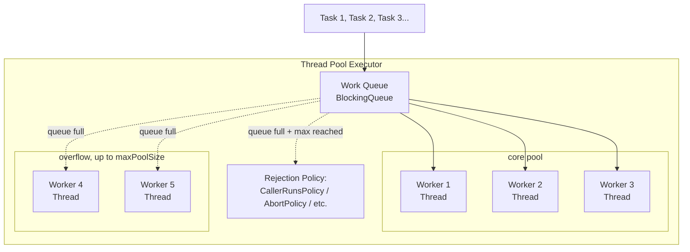

#### ThreadPoolExecutor Configuration

```java
ThreadPoolExecutor executor = new ThreadPoolExecutor(
    corePoolSize,      // Threads always alive (even idle)
    maxPoolSize,       // Maximum threads under load
    keepAliveTime,     // How long overflow threads stay alive
    TimeUnit.SECONDS,
    workQueue,         // Queue for pending tasks
    threadFactory,     // Custom thread creation
    rejectionHandler   // What to do when queue is full AND max threads reached
);
```

**How it works**:
1. New task arrives → if `activeThreads < corePoolSize`, create new thread
2. If `activeThreads >= corePoolSize`, put task in queue
3. If queue is full AND `activeThreads < maxPoolSize`, create new thread
4. If queue is full AND `activeThreads >= maxPoolSize`, reject task

**Queue types**:

| Queue Type | Behavior | Use Case |
|-----------|----------|----------|
| `LinkedBlockingQueue` (unbounded) | Never rejects, maxPoolSize ignored | Dangerous: can OOM! |
| `ArrayBlockingQueue` (bounded) | Rejects when full + max threads | Production default |
| `SynchronousQueue` (zero capacity) | Direct handoff, no queuing | Max responsiveness, used by CachedThreadPool |
| `PriorityBlockingQueue` | Priority ordering | Task prioritization |

### 4.2 The Actor Model

The Actor Model (Hewitt, 1973) is an alternative to shared-memory concurrency:

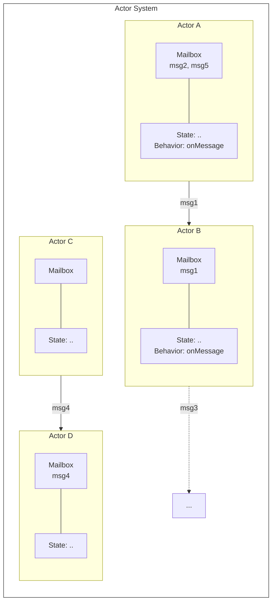

**Rules:**
1. Actors communicate ONLY via messages
2. Each actor processes ONE message at a time
3. No shared state between actors
4. Actors can create new actors
5. Actors can change their own behavior

**Key principles**:
1. **No shared state**: Actors never access each other's state directly
2. **Asynchronous messages**: Communication is via immutable messages delivered to a mailbox
3. **Sequential processing**: Each actor processes one message at a time (no internal concurrency)
4. **Location transparency**: An actor's address works whether it's local or remote

**Actor Model vs. Shared Memory**:

| Aspect | Shared Memory + Locks | Actor Model |
|--------|----------------------|-------------|
| Communication | Shared variables | Messages |
| Synchronization | Locks, monitors | Message ordering |
| Deadlock risk | High | Low (but livelock possible) |
| Race condition risk | High | Eliminated by design |
| Debugging | Hard (non-deterministic) | Easier (message traces) |
| Distribution | Doesn't extend naturally | Extends naturally to network |
| Performance (local) | Faster (no message copy) | Overhead of message passing |
| Frameworks | Java `synchronized`, locks | Akka, Erlang/OTP, Orleans |

### 4.3 Async Programming Architecture

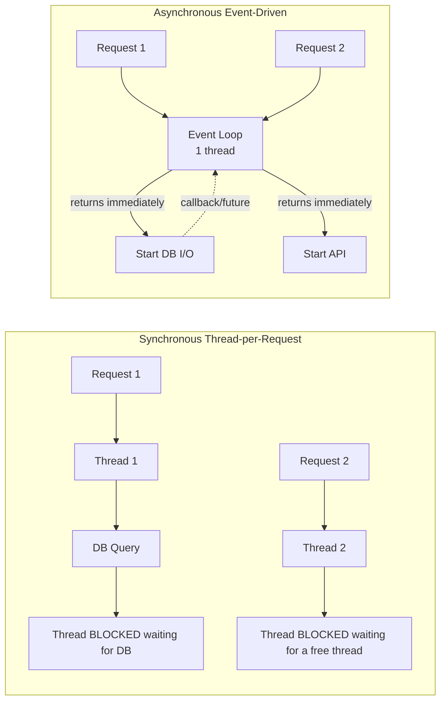

> **Note**: In the asynchronous model, one thread handles MANY concurrent requests by never blocking!

### 4.4 Virtual Threads Architecture (Java 21)

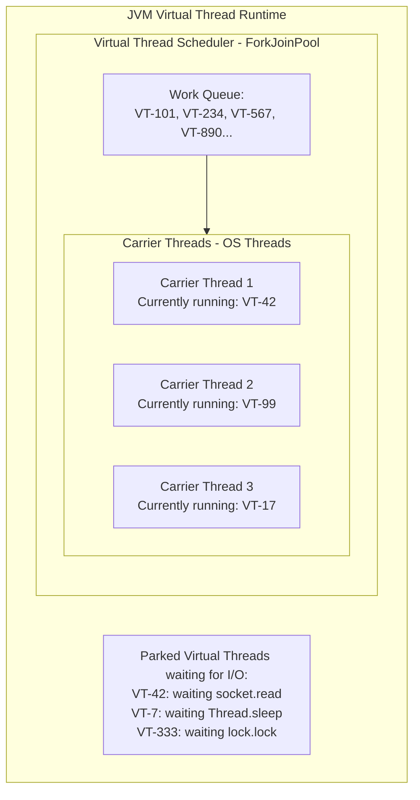

**When VT-42 calls socket.read() (blocks):**
1. JVM saves VT-42's stack (to heap, NOT OS stack)
2. JVM unmounts VT-42 from Carrier Thread 1
3. JVM mounts VT-567 onto Carrier Thread 1
4. When socket data arrives, VT-42 is re-scheduled

---

## 5. Visual Diagrams

### 5.1 Thread Lifecycle

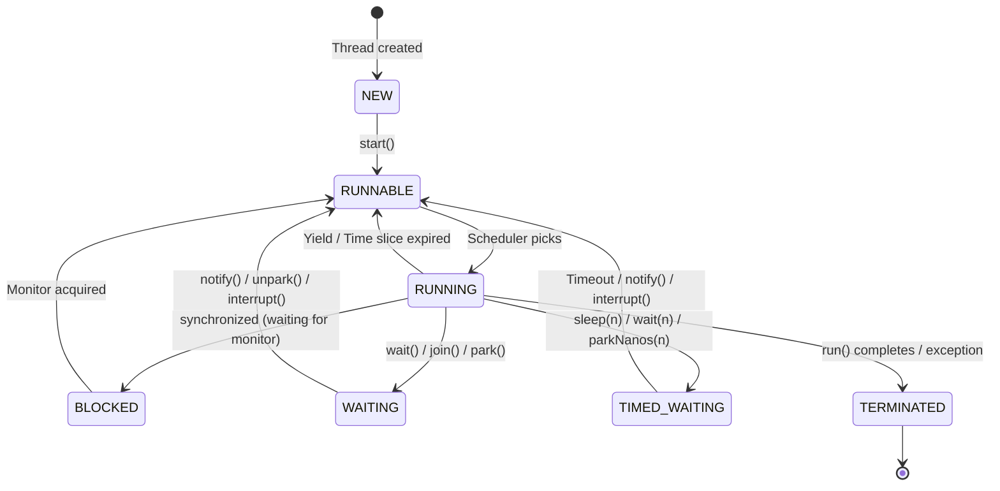

### 5.2 Deadlock Scenario

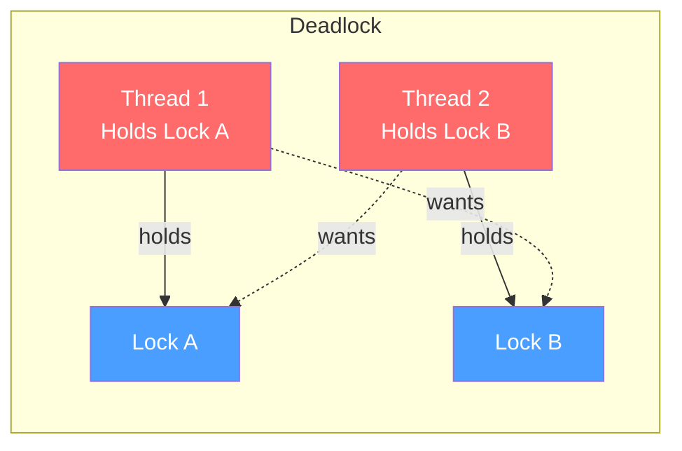

### 5.3 Thread Pool Architecture

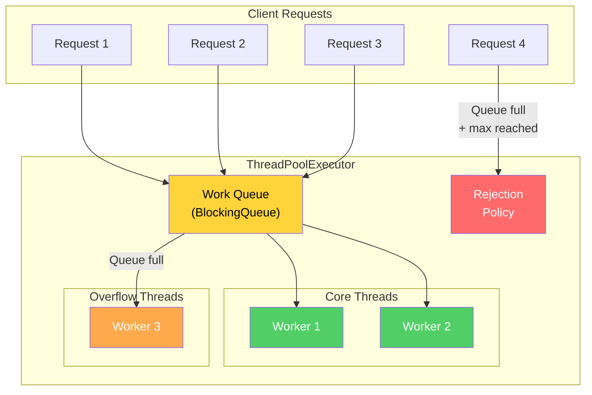

### 5.4 Actor Model Message Passing

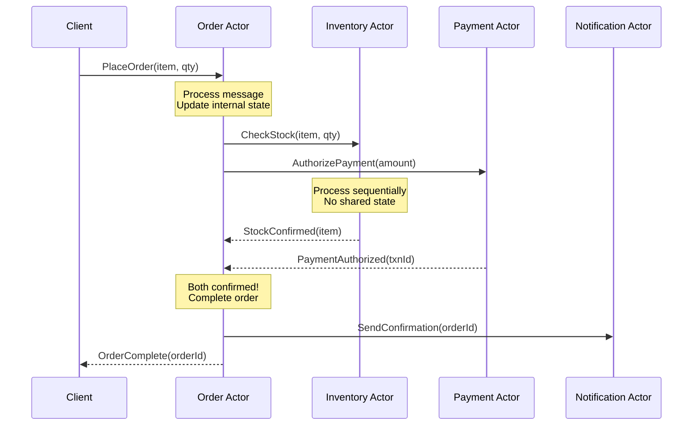

### 5.5 Producer-Consumer Pattern

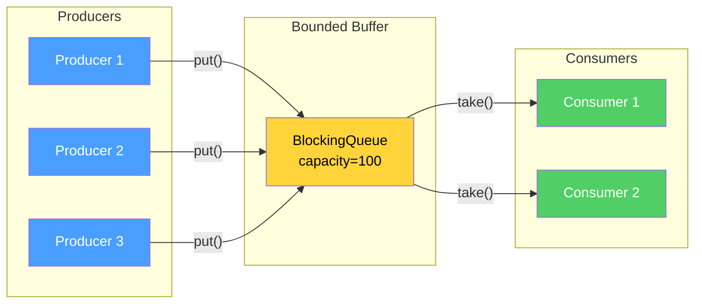

### 5.6 Concurrency vs. Parallelism

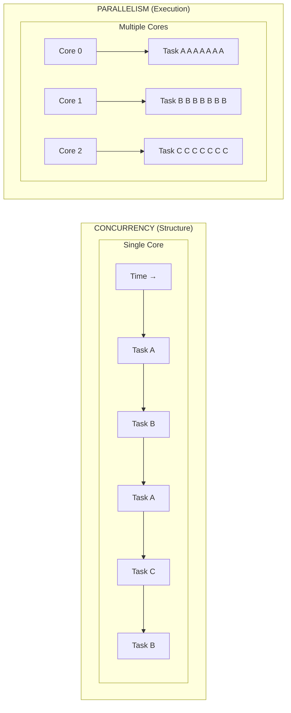

**Concurrency:** Interleaved execution, all tasks SHARE one core.  
**Parallelism:** Simultaneous execution, each task has its OWN core.

---

## 6. Real Production Examples

### 6.1 Netflix: Thread Pool Isolation with Hystrix

**Problem**: In a microservice architecture, a slow downstream service can consume all threads in the calling service's thread pool, causing cascading failures.

**Solution**: Netflix's Hystrix library uses **bulkhead isolation** via separate thread pools per downstream service:

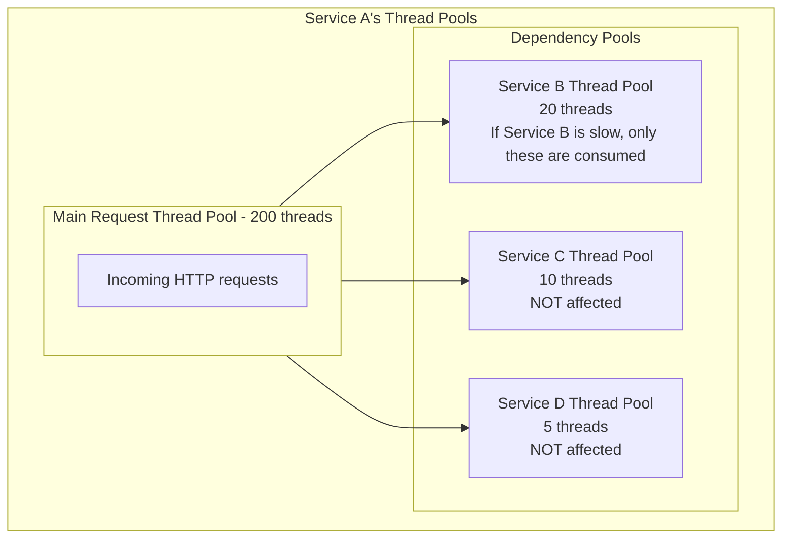

**Key metrics**: Thread pool saturation (active/max), rejection count, timeout rate.

### 6.2 Uber: Thread-Per-Request to Async

**Before (2016)**: Uber's Go services used goroutines (lightweight threads) to handle requests. Java services used thread-per-request with large thread pools (500+ threads per service).

**Problems**:
- 500 threads × 1MB stack = 500MB just for stacks
- Context switching overhead at high concurrency
- Thread pool exhaustion during traffic spikes (New Year's Eve)

**After**: Moved critical Java services to async using CompletableFuture and later Reactive Streams:
- Reduced thread count from 500 to 50 per service
- Handled 10x more concurrent requests
- Reduced tail latency by 40% (less context switching)

### 6.3 Discord: From Go to Rust for Concurrency

**Problem**: Discord's Read States service (tracking which messages users have read) was originally written in Go. At scale:
- Go's garbage collector caused latency spikes every 2 minutes
- Goroutine scheduling overhead at millions of concurrent operations
- Memory overhead per goroutine (~2KB) added up

**Solution**: Rewrote in Rust with async/await and Tokio runtime:
- Zero GC pauses
- Lighter async tasks (~200 bytes vs ~2KB)
- P99 latency dropped from 200ms to 10ms

### 6.4 LMAX Disruptor: Lock-Free at Scale

The LMAX Exchange processes 6 million transactions per second on a **single thread** using:

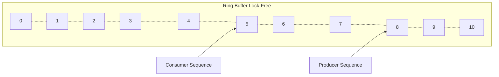

**Key Design Decisions:**
1. Pre-allocated ring buffer (no GC)
2. Padding to avoid false sharing (cache line alignment)
3. Single writer principle (one producer, multiple consumers)
4. Busy-spin waiting (not blocking) for lowest latency
5. Memory barriers instead of locks

**Result**: 100 nanosecond latency per operation. Compare to:
- `ArrayBlockingQueue`: ~1,000 ns (10x slower)
- Kafka (network): ~1,000,000 ns (10,000x slower)

### 6.5 Java Virtual Threads at Scale

**Netflix (2023-2024)**: Early adopter of Java virtual threads in production:
- Migrated Zuul API Gateway from Netty's async model to virtual threads
- Simplified code dramatically (removed callback chains)
- Performance was equivalent or better than hand-tuned async code
- Development velocity increased significantly (simpler mental model)

**Key finding**: Virtual threads shine for I/O-bound workloads (which is most of what microservices do). For CPU-bound work, traditional thread pools with parallelism are still better.

### 6.6 Amazon DynamoDB: Request Router Concurrency

DynamoDB's request routers handle millions of requests per second:

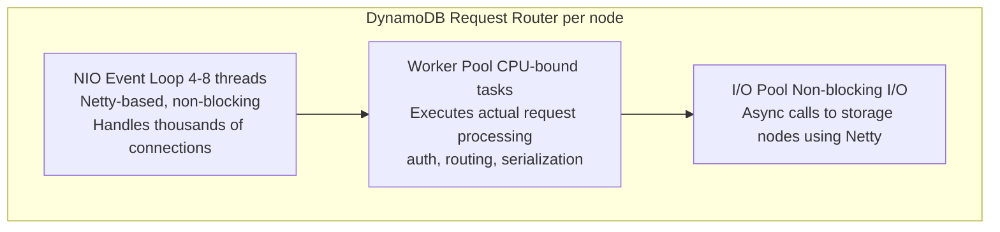

Separation of I/O threads from worker threads is critical for preventing I/O stalls from blocking request processing.

---

## 7. Java Implementations

### 7.1 Production Thread Pool Implementation

```java
import java.util.concurrent.*;
import java.util.concurrent.atomic.AtomicInteger;

/**
 * Production-grade thread pool configuration with monitoring,
 * graceful shutdown, and proper rejection handling.
 * 
 * This follows patterns used in Netflix, Uber, and other
 * high-scale Java services.
 */
public class ProductionThreadPool {
    
    /**
     * Creates a thread pool optimized for I/O-bound tasks.
     * I/O-bound tasks spend most of their time waiting (DB, HTTP, file I/O).
     * More threads than cores is beneficial because threads are often blocked.
     * 
     * Rule of thumb: threads = cores * (1 + wait_time/compute_time)
     * For typical microservices: threads ≈ cores * 10-20
     */
    public static ThreadPoolExecutor createIOBoundPool(String name, int queueCapacity) {
        int cores = Runtime.getRuntime().availableProcessors();
        int poolSize = cores * 10; // Typical for I/O-bound
        
        ThreadPoolExecutor executor = new ThreadPoolExecutor(
            poolSize,                                    // core pool size
            poolSize * 2,                                // max pool size (burst)
            60L, TimeUnit.SECONDS,                       // keep-alive for overflow
            new ArrayBlockingQueue<>(queueCapacity),     // bounded queue
            new NamedThreadFactory(name),                // custom names for debugging
            new MonitoredRejectionHandler(name)          // track rejections
        );
        
        // Allow core threads to timeout (important for auto-scaling down)
        executor.allowCoreThreadTimeOut(true);
        
        return executor;
    }
    
    /**
     * Creates a thread pool optimized for CPU-bound tasks.
     * CPU-bound tasks actively use the CPU (computation, serialization).
     * More threads than cores causes context switching overhead.
     * 
     * Rule of thumb: threads = cores + 1 (the +1 handles the case where
     * a thread page-faults and another can use the core)
     */
    public static ThreadPoolExecutor createCPUBoundPool(String name) {
        int cores = Runtime.getRuntime().availableProcessors();
        
        return new ThreadPoolExecutor(
            cores + 1,                                   // core = cores + 1
            cores + 1,                                   // max = same (no overflow)
            0L, TimeUnit.SECONDS,                        // no timeout
            new LinkedBlockingQueue<>(1000),              // bounded queue
            new NamedThreadFactory(name),
            new ThreadPoolExecutor.CallerRunsPolicy()    // backpressure
        );
    }
    
    /**
     * Thread factory that names threads for debugging.
     * When you take a thread dump, "order-processor-3" is much more
     * useful than "pool-1-thread-3".
     */
    static class NamedThreadFactory implements ThreadFactory {
        private final AtomicInteger threadNumber = new AtomicInteger(1);
        private final String namePrefix;
        
        NamedThreadFactory(String name) {
            this.namePrefix = name + "-";
        }
        
        @Override
        public Thread newThread(Runnable r) {
            Thread t = new Thread(r, namePrefix + threadNumber.getAndIncrement());
            t.setDaemon(false); // Don't use daemon threads for work!
            t.setUncaughtExceptionHandler((thread, ex) -> {
                System.err.printf("Uncaught exception in %s: %s%n", 
                                  thread.getName(), ex.getMessage());
                ex.printStackTrace();
                // In production: send to error tracking (Sentry, etc.)
            });
            return t;
        }
    }
    
    /**
     * Rejection handler that monitors and logs rejections.
     * In production, you'd increment a Prometheus counter here.
     */
    static class MonitoredRejectionHandler implements RejectedExecutionHandler {
        private final AtomicInteger rejectionCount = new AtomicInteger(0);
        private final String poolName;
        
        MonitoredRejectionHandler(String poolName) {
            this.poolName = poolName;
        }
        
        @Override
        public void rejectedExecution(Runnable r, ThreadPoolExecutor executor) {
            int count = rejectionCount.incrementAndGet();
            System.err.printf(
                "[ALERT] Task rejected from pool '%s' (total rejections: %d). " +
                "Pool: active=%d, queue=%d/%d%n",
                poolName, count,
                executor.getActiveCount(),
                executor.getQueue().size(),
                ((ArrayBlockingQueue<?>) executor.getQueue()).remainingCapacity()
                        + executor.getQueue().size()
            );
            // Don't silently drop! Options:
            // 1. Throw exception (let caller handle)
            throw new RejectedExecutionException(
                "Task rejected from pool '" + poolName + "'");
            // 2. Run on caller's thread (backpressure)
            // new CallerRunsPolicy().rejectedExecution(r, executor);
            // 3. Put in overflow queue (secondary handling)
        }
        
        public int getRejectionCount() {
            return rejectionCount.get();
        }
    }
    
    /**
     * Graceful shutdown: finish in-progress tasks, then stop.
     * Critical for microservices receiving SIGTERM from Kubernetes.
     */
    public static void gracefulShutdown(ExecutorService executor, 
                                         int timeoutSeconds) {
        // Stop accepting new tasks
        executor.shutdown();
        
        try {
            // Wait for in-progress tasks to complete
            if (!executor.awaitTermination(timeoutSeconds, TimeUnit.SECONDS)) {
                System.err.println("Pool did not terminate in time. Forcing shutdown.");
                executor.shutdownNow(); // Cancel running tasks
                
                if (!executor.awaitTermination(5, TimeUnit.SECONDS)) {
                    System.err.println("Pool did not terminate after force shutdown!");
                }
            }
        } catch (InterruptedException e) {
            executor.shutdownNow();
            Thread.currentThread().interrupt();
        }
    }
    
    /**
     * Health check: reports pool metrics for monitoring.
     */
    public static String healthCheck(ThreadPoolExecutor executor, String name) {
        return String.format(
            "Pool '%s': active=%d/%d, queue=%d, completed=%d, rejected=%s",
            name,
            executor.getActiveCount(),
            executor.getMaximumPoolSize(),
            executor.getQueue().size(),
            executor.getCompletedTaskCount(),
            executor.getRejectedExecutionHandler() instanceof MonitoredRejectionHandler mrh 
                ? mrh.getRejectionCount() : "N/A"
        );
    }
    
    // ==================== Demo ====================
    
    public static void main(String[] args) throws InterruptedException {
        ThreadPoolExecutor pool = createIOBoundPool("order-processor", 100);
        
        // Submit tasks
        for (int i = 0; i < 50; i++) {
            final int taskId = i;
            pool.submit(() -> {
                System.out.printf("[%s] Processing order %d%n",
                    Thread.currentThread().getName(), taskId);
                try {
                    Thread.sleep(100); // Simulate I/O
                } catch (InterruptedException e) {
                    Thread.currentThread().interrupt();
                }
            });
        }
        
        // Monitor
        Thread.sleep(50);
        System.out.println(healthCheck(pool, "order-processor"));
        
        // Graceful shutdown
        gracefulShutdown(pool, 10);
        System.out.println("Pool shut down gracefully.");
    }
}
```

### 7.2 Producer-Consumer Pattern

```java
import java.util.concurrent.*;
import java.util.concurrent.atomic.AtomicBoolean;

/**
 * Production producer-consumer implementation using BlockingQueue.
 * 
 * This pattern is everywhere in distributed systems:
 * - Message queue consumers (Kafka, RabbitMQ)
 * - Event processing pipelines
 * - Work distribution systems
 * - Connection pools
 */
public class ProducerConsumerSystem<T> {
    
    private final BlockingQueue<T> queue;
    private final ExecutorService producerPool;
    private final ExecutorService consumerPool;
    private final AtomicBoolean running = new AtomicBoolean(true);
    
    /**
     * @param capacity Maximum queue capacity (backpressure bound)
     * @param numProducers Number of producer threads
     * @param numConsumers Number of consumer threads
     */
    public ProducerConsumerSystem(int capacity, int numProducers, int numConsumers) {
        this.queue = new ArrayBlockingQueue<>(capacity);
        this.producerPool = Executors.newFixedThreadPool(numProducers, 
            r -> new Thread(r, "producer-" + Thread.currentThread().threadId()));
        this.consumerPool = Executors.newFixedThreadPool(numConsumers,
            r -> new Thread(r, "consumer-" + Thread.currentThread().threadId()));
    }
    
    /**
     * Start producers and consumers.
     * 
     * @param producer Function that generates items
     * @param consumer Function that processes items
     */
    public void start(Callable<T> producer, java.util.function.Consumer<T> consumer) {
        // Start consumers
        for (int i = 0; i < ((ThreadPoolExecutor)consumerPool).getCorePoolSize(); i++) {
            consumerPool.submit(() -> {
                while (running.get() || !queue.isEmpty()) {
                    try {
                        T item = queue.poll(100, TimeUnit.MILLISECONDS);
                        if (item != null) {
                            try {
                                consumer.accept(item);
                            } catch (Exception e) {
                                System.err.printf("[%s] Error processing item: %s%n",
                                    Thread.currentThread().getName(), e.getMessage());
                                // In production: dead-letter queue, retry, alert
                            }
                        }
                    } catch (InterruptedException e) {
                        Thread.currentThread().interrupt();
                        break;
                    }
                }
            });
        }
        
        // Start producers
        for (int i = 0; i < ((ThreadPoolExecutor)producerPool).getCorePoolSize(); i++) {
            producerPool.submit(() -> {
                while (running.get()) {
                    try {
                        T item = producer.call();
                        if (item != null) {
                            // offer with timeout: backpressure!
                            boolean added = queue.offer(item, 1, TimeUnit.SECONDS);
                            if (!added) {
                                System.err.printf("[%s] Queue full! Backpressure active.%n",
                                    Thread.currentThread().getName());
                                // In production: metric, possibly slow down source
                            }
                        }
                    } catch (InterruptedException e) {
                        Thread.currentThread().interrupt();
                        break;
                    } catch (Exception e) {
                        System.err.printf("[%s] Producer error: %s%n",
                            Thread.currentThread().getName(), e.getMessage());
                    }
                }
            });
        }
    }
    
    /**
     * Graceful shutdown: stop producers first, drain queue, then stop consumers.
     */
    public void shutdown(int timeoutSeconds) throws InterruptedException {
        System.out.println("Shutting down: stopping producers...");
        running.set(false);
        producerPool.shutdown();
        producerPool.awaitTermination(timeoutSeconds, TimeUnit.SECONDS);
        
        System.out.printf("Producers stopped. Draining queue (%d items)...%n", 
                          queue.size());
        
        // Wait for consumers to drain the queue
        consumerPool.shutdown();
        consumerPool.awaitTermination(timeoutSeconds, TimeUnit.SECONDS);
        
        System.out.println("Shutdown complete.");
    }
    
    public int getQueueSize() { return queue.size(); }
    
    // ==================== Demo ====================
    
    public static void main(String[] args) throws Exception {
        var system = new ProducerConsumerSystem<String>(
            100,  // queue capacity
            3,    // producers
            2     // consumers
        );
        
        var counter = new java.util.concurrent.atomic.AtomicInteger(0);
        
        system.start(
            // Producer: generates work items
            () -> {
                Thread.sleep(10); // Simulate production time
                return "order-" + counter.incrementAndGet();
            },
            // Consumer: processes work items
            item -> {
                System.out.printf("[%s] Processing: %s%n",
                    Thread.currentThread().getName(), item);
                try { Thread.sleep(50); } // Simulate processing
                catch (InterruptedException e) { Thread.currentThread().interrupt(); }
            }
        );
        
        // Run for 2 seconds
        Thread.sleep(2000);
        System.out.printf("Queue size: %d%n", system.getQueueSize());
        system.shutdown(5);
    }
}
```

### 7.3 Read-Write Lock Implementation

```java
import java.util.concurrent.*;
import java.util.concurrent.locks.*;

/**
 * Thread-safe cache using ReadWriteLock for high read concurrency.
 * 
 * Pattern used in: distributed caches, configuration stores,
 * in-memory databases, reference data caches.
 * 
 * Performance: N concurrent readers with zero contention.
 * Writers get exclusive access (readers must wait during writes).
 */
public class ReadWriteCache<K, V> {
    
    private final ConcurrentHashMap<K, CacheEntry<V>> cache;
    private final ReadWriteLock rwLock;
    private final Lock readLock;
    private final Lock writeLock;
    private final int maxSize;
    
    record CacheEntry<V>(V value, long expiresAt) {
        boolean isExpired() {
            return System.nanoTime() > expiresAt;
        }
    }
    
    public ReadWriteCache(int maxSize) {
        this.maxSize = maxSize;
        this.cache = new ConcurrentHashMap<>();
        this.rwLock = new ReentrantReadWriteLock(true); // fair
        this.readLock = rwLock.readLock();
        this.writeLock = rwLock.writeLock();
    }
    
    /**
     * Get a value from the cache. Multiple threads can read simultaneously.
     */
    public V get(K key) {
        readLock.lock();
        try {
            CacheEntry<V> entry = cache.get(key);
            if (entry == null || entry.isExpired()) {
                return null;
            }
            return entry.value();
        } finally {
            readLock.unlock();
        }
    }
    
    /**
     * Put a value with TTL. Exclusive access during writes.
     */
    public void put(K key, V value, long ttlMillis) {
        writeLock.lock();
        try {
            // Evict if at capacity
            if (cache.size() >= maxSize && !cache.containsKey(key)) {
                evictOldest();
            }
            
            long expiresAt = System.nanoTime() + 
                             TimeUnit.MILLISECONDS.toNanos(ttlMillis);
            cache.put(key, new CacheEntry<>(value, expiresAt));
        } finally {
            writeLock.unlock();
        }
    }
    
    /**
     * Read-then-write pattern: get or compute.
     * Demonstrates lock upgrading (read → write).
     * 
     * Note: Java's ReentrantReadWriteLock does NOT support
     * upgrading from read to write lock (would deadlock!).
     * Must release read lock first.
     */
    public V getOrCompute(K key, java.util.function.Function<K, V> compute,
                           long ttlMillis) {
        // Try read lock first (fast path)
        readLock.lock();
        try {
            CacheEntry<V> entry = cache.get(key);
            if (entry != null && !entry.isExpired()) {
                return entry.value();
            }
        } finally {
            readLock.unlock();
        }
        
        // Cache miss: acquire write lock (slow path)
        writeLock.lock();
        try {
            // Double-check after acquiring write lock
            // (another thread might have populated while we waited)
            CacheEntry<V> entry = cache.get(key);
            if (entry != null && !entry.isExpired()) {
                return entry.value();
            }
            
            // Compute and store
            V value = compute.apply(key);
            long expiresAt = System.nanoTime() + 
                             TimeUnit.MILLISECONDS.toNanos(ttlMillis);
            cache.put(key, new CacheEntry<>(value, expiresAt));
            return value;
        } finally {
            writeLock.unlock();
        }
    }
    
    /**
     * Evict expired entries. Run periodically.
     */
    public int evictExpired() {
        writeLock.lock();
        try {
            int before = cache.size();
            cache.entrySet().removeIf(e -> e.getValue().isExpired());
            return before - cache.size();
        } finally {
            writeLock.unlock();
        }
    }
    
    private void evictOldest() {
        // Simple: remove first entry (not ideal; use LRU in production)
        var iterator = cache.entrySet().iterator();
        if (iterator.hasNext()) {
            iterator.next();
            iterator.remove();
        }
    }
    
    public int size() {
        readLock.lock();
        try {
            return cache.size();
        } finally {
            readLock.unlock();
        }
    }
    
    // ==================== Demo ====================
    
    public static void main(String[] args) throws Exception {
        ReadWriteCache<String, String> cache = new ReadWriteCache<>(1000);
        
        // Populate
        for (int i = 0; i < 100; i++) {
            cache.put("key-" + i, "value-" + i, 5000);
        }
        
        // Concurrent reads (should not contend)
        ExecutorService readers = Executors.newFixedThreadPool(10);
        var latch = new CountDownLatch(1000);
        
        long start = System.nanoTime();
        for (int i = 0; i < 1000; i++) {
            final int idx = i % 100;
            readers.submit(() -> {
                String val = cache.get("key-" + idx);
                latch.countDown();
            });
        }
        latch.await();
        long elapsed = System.nanoTime() - start;
        
        System.out.printf("1000 reads in %d μs (%.1f reads/μs)%n",
            elapsed / 1000, 1000.0 / (elapsed / 1000.0));
        
        readers.shutdown();
        
        // GetOrCompute demo
        String result = cache.getOrCompute("new-key", 
            k -> "computed-" + k, 
            10000);
        System.out.printf("Computed: %s%n", result);
    }
}
```

### 7.4 CompletableFuture Examples

```java
import java.util.concurrent.*;
import java.util.List;
import java.util.stream.Collectors;

/**
 * Production patterns with CompletableFuture for async programming.
 * 
 * CompletableFuture replaces callback hell with composable async operations.
 * Used extensively in microservices for fan-out/fan-in patterns.
 */
public class AsyncPatterns {
    
    private static final ExecutorService ioPool = Executors.newFixedThreadPool(20);
    
    // ====== Pattern 1: Fan-Out / Fan-In ======
    
    /**
     * Fetch data from multiple services in parallel, combine results.
     * Common in BFF (Backend for Frontend) patterns.
     */
    record ProductPage(String product, String reviews, String recommendations) {}
    
    static CompletableFuture<ProductPage> fetchProductPage(String productId) {
        // Fan-out: kick off all requests in parallel
        CompletableFuture<String> productFuture = CompletableFuture
            .supplyAsync(() -> fetchProduct(productId), ioPool);
        
        CompletableFuture<String> reviewsFuture = CompletableFuture
            .supplyAsync(() -> fetchReviews(productId), ioPool);
        
        CompletableFuture<String> recosFuture = CompletableFuture
            .supplyAsync(() -> fetchRecommendations(productId), ioPool);
        
        // Fan-in: combine results when ALL complete
        return CompletableFuture.allOf(productFuture, reviewsFuture, recosFuture)
            .thenApply(v -> new ProductPage(
                productFuture.join(),
                reviewsFuture.join(),
                recosFuture.join()
            ));
    }
    
    // ====== Pattern 2: Timeout and Fallback ======
    
    /**
     * Call a service with timeout and fallback.
     * Essential for resilient microservices.
     */
    static CompletableFuture<String> fetchWithTimeout(
            String url, long timeoutMs, String fallback) {
        
        CompletableFuture<String> future = CompletableFuture
            .supplyAsync(() -> httpGet(url), ioPool);
        
        // Timeout after specified duration
        return future
            .orTimeout(timeoutMs, TimeUnit.MILLISECONDS)
            .exceptionally(ex -> {
                if (ex.getCause() instanceof TimeoutException) {
                    System.err.printf("Timeout calling %s after %dms%n", url, timeoutMs);
                } else {
                    System.err.printf("Error calling %s: %s%n", url, ex.getMessage());
                }
                return fallback; // Graceful degradation
            });
    }
    
    // ====== Pattern 3: Retry with Exponential Backoff ======
    
    /**
     * Retry an async operation with exponential backoff.
     * Critical for handling transient failures in distributed systems.
     */
    static <T> CompletableFuture<T> retryWithBackoff(
            Callable<T> operation, int maxRetries, long initialDelayMs) {
        
        return CompletableFuture.supplyAsync(() -> {
            int attempt = 0;
            long delay = initialDelayMs;
            
            while (true) {
                try {
                    return operation.call();
                } catch (Exception e) {
                    attempt++;
                    if (attempt >= maxRetries) {
                        throw new CompletionException(
                            new RuntimeException("All " + maxRetries + " retries failed", e));
                    }
                    System.out.printf("Attempt %d failed (%s). Retrying in %dms...%n",
                        attempt, e.getMessage(), delay);
                    try {
                        Thread.sleep(delay);
                    } catch (InterruptedException ie) {
                        Thread.currentThread().interrupt();
                        throw new CompletionException(ie);
                    }
                    delay = Math.min(delay * 2, 30_000); // Cap at 30 seconds
                }
            }
        }, ioPool);
    }
    
    // ====== Pattern 4: First Successful (Racing) ======
    
    /**
     * Send request to multiple replicas, use first response.
     * Used for hedged requests (tail latency optimization).
     */
    static CompletableFuture<String> hedgedRequest(List<String> replicas) {
        List<CompletableFuture<String>> futures = replicas.stream()
            .map(replica -> CompletableFuture.supplyAsync(
                () -> httpGet(replica), ioPool))
            .collect(Collectors.toList());
        
        // Return first successful result
        return CompletableFuture.anyOf(futures.toArray(new CompletableFuture[0]))
            .thenApply(result -> (String) result);
    }
    
    // ====== Pattern 5: Pipeline (Chain of Async Operations) ======
    
    /**
     * Process an order through multiple async stages.
     */
    static CompletableFuture<String> processOrder(String orderId) {
        return CompletableFuture.supplyAsync(() -> validateOrder(orderId), ioPool)
            .thenApplyAsync(validated -> checkInventory(validated), ioPool)
            .thenApplyAsync(inventoryOk -> processPayment(inventoryOk), ioPool)
            .thenApplyAsync(paymentOk -> shipOrder(paymentOk), ioPool)
            .thenApplyAsync(shipped -> notifyCustomer(shipped), ioPool)
            .whenComplete((result, ex) -> {
                if (ex != null) {
                    System.err.printf("Order %s failed: %s%n", orderId, ex.getMessage());
                    // Compensating transaction (saga pattern)
                } else {
                    System.out.printf("Order %s completed: %s%n", orderId, result);
                }
            });
    }
    
    // Stub methods for demonstration
    static String fetchProduct(String id) { sleep(50); return "Product:" + id; }
    static String fetchReviews(String id) { sleep(100); return "Reviews:" + id; }
    static String fetchRecommendations(String id) { sleep(75); return "Recos:" + id; }
    static String httpGet(String url) { sleep(100); return "Response from " + url; }
    static String validateOrder(String id) { sleep(20); return "validated-" + id; }
    static String checkInventory(String s) { sleep(30); return "instock-" + s; }
    static String processPayment(String s) { sleep(50); return "paid-" + s; }
    static String shipOrder(String s) { sleep(40); return "shipped-" + s; }
    static String notifyCustomer(String s) { sleep(10); return "notified-" + s; }
    
    static void sleep(long ms) {
        try { Thread.sleep(ms); } catch (InterruptedException e) { Thread.currentThread().interrupt(); }
    }
    
    // ==================== Demo ====================
    
    public static void main(String[] args) throws Exception {
        System.out.println("=== Fan-Out / Fan-In ===");
        long start = System.currentTimeMillis();
        ProductPage page = fetchProductPage("PROD-123").join();
        long elapsed = System.currentTimeMillis() - start;
        System.out.printf("Product page fetched in %dms (parallel): %s%n", elapsed, page);
        // Should take ~100ms (max of the three), not ~225ms (sum)
        
        System.out.println("\n=== Timeout and Fallback ===");
        String result = fetchWithTimeout("http://slow-service/api", 50, "cached-default").join();
        System.out.printf("Result: %s%n", result);
        
        System.out.println("\n=== Order Pipeline ===");
        String orderResult = processOrder("ORD-456").join();
        System.out.printf("Final: %s%n", orderResult);
        
        ioPool.shutdown();
    }
}
```

### 7.5 Virtual Threads Example (Java 21+)

```java
import java.time.Duration;
import java.time.Instant;
import java.util.concurrent.*;
import java.util.stream.IntStream;

/**
 * Virtual Threads (Project Loom) - Java 21+
 * 
 * Virtual threads allow writing simple, blocking code that scales
 * like async code. The JVM automatically unmounts blocked virtual
 * threads from carrier threads, achieving high concurrency without
 * the complexity of reactive programming.
 * 
 * Key rule: Write blocking code as if threading were free.
 */
public class VirtualThreadsDemo {
    
    // ====== Example 1: Creating Virtual Threads ======
    
    static void basicVirtualThreads() throws InterruptedException {
        System.out.println("=== Basic Virtual Threads ===");
        
        // Method 1: Thread.ofVirtual()
        Thread vt = Thread.ofVirtual()
            .name("my-virtual-thread")
            .start(() -> {
                System.out.printf("[%s] Running on carrier: %s%n",
                    Thread.currentThread(),
                    Thread.currentThread().isVirtual() ? "virtual" : "platform");
            });
        vt.join();
        
        // Method 2: ExecutorService with virtual threads
        try (var executor = Executors.newVirtualThreadPerTaskExecutor()) {
            // Each task gets its own virtual thread
            // NO thread pool sizing needed!
            for (int i = 0; i < 10; i++) {
                final int id = i;
                executor.submit(() -> {
                    System.out.printf("[VT-%d] Processing%n", id);
                    sleep(Duration.ofMillis(100));
                    return "result-" + id;
                });
            }
        } // auto-closes, waits for all tasks
    }
    
    // ====== Example 2: Massive Concurrency ======
    
    static void massiveConcurrency() throws InterruptedException {
        System.out.println("\n=== 100,000 Concurrent Virtual Threads ===");
        
        Instant start = Instant.now();
        
        try (var executor = Executors.newVirtualThreadPerTaskExecutor()) {
            // Launch 100,000 virtual threads, each doing "I/O" (sleeping)
            var futures = IntStream.range(0, 100_000)
                .mapToObj(i -> executor.submit(() -> {
                    Thread.sleep(Duration.ofSeconds(1)); // Simulate I/O
                    return i;
                }))
                .toList();
            
            // Wait for all to complete
            int completed = 0;
            for (var future : futures) {
                try {
                    future.get();
                    completed++;
                } catch (ExecutionException e) {
                    // Handle error
                }
            }
            
            Duration elapsed = Duration.between(start, Instant.now());
            System.out.printf("Completed %d tasks in %s%n", completed, elapsed);
            // Should complete in ~1 second (all sleeping concurrently!)
            // With platform threads, you'd need 100,000 threads (impossible)
        }
    }
    
    // ====== Example 3: Structured Concurrency (JEP 453) ======
    
    /**
     * Structured concurrency ensures that subtasks complete before
     * the scope exits. Like structured programming but for threads.
     * 
     * Note: StructuredTaskScope is a preview feature in Java 21.
     */
    record UserProfile(String user, String orders, String preferences) {}
    
    static UserProfile fetchUserProfile(String userId) throws Exception {
        // Using StructuredTaskScope (Preview in Java 21+)
        try (var scope = new StructuredTaskScope.ShutdownOnFailure()) {
            // Fork subtasks
            var userTask = scope.fork(() -> fetchUser(userId));
            var ordersTask = scope.fork(() -> fetchOrders(userId));
            var prefsTask = scope.fork(() -> fetchPrefs(userId));
            
            // Wait for ALL subtasks to complete (or one to fail)
            scope.join();
            scope.throwIfFailed(); // Propagate first failure
            
            // All succeeded! Combine results.
            return new UserProfile(
                userTask.get(),
                ordersTask.get(),
                prefsTask.get()
            );
        }
        // If ANY subtask fails, the scope cancels the others!
        // No orphan threads, no resource leaks.
    }
    
    // ====== Example 4: Virtual Threads vs Platform Threads Benchmark ======
    
    static void benchmark() throws InterruptedException {
        int taskCount = 10_000;
        
        // Platform threads
        Instant start1 = Instant.now();
        try (var executor = Executors.newFixedThreadPool(200)) {
            var futures = IntStream.range(0, taskCount)
                .mapToObj(i -> executor.submit(() -> {
                    Thread.sleep(Duration.ofMillis(100));
                    return i;
                }))
                .toList();
            for (var f : futures) { try { f.get(); } catch (Exception e) {} }
        }
        Duration platformTime = Duration.between(start1, Instant.now());
        
        // Virtual threads
        Instant start2 = Instant.now();
        try (var executor = Executors.newVirtualThreadPerTaskExecutor()) {
            var futures = IntStream.range(0, taskCount)
                .mapToObj(i -> executor.submit(() -> {
                    Thread.sleep(Duration.ofMillis(100));
                    return i;
                }))
                .toList();
            for (var f : futures) { try { f.get(); } catch (Exception e) {} }
        }
        Duration virtualTime = Duration.between(start2, Instant.now());
        
        System.out.printf("\n=== Benchmark (%d tasks, 100ms sleep each) ===%n", taskCount);
        System.out.printf("Platform threads (200 pool): %s%n", platformTime);
        System.out.printf("Virtual threads:             %s%n", virtualTime);
        System.out.printf("Speedup: %.1fx%n", 
            (double) platformTime.toMillis() / virtualTime.toMillis());
    }
    
    // Stub methods
    static String fetchUser(String id) throws Exception { 
        Thread.sleep(50); return "User:" + id; 
    }
    static String fetchOrders(String id) throws Exception { 
        Thread.sleep(100); return "Orders:" + id; 
    }
    static String fetchPrefs(String id) throws Exception { 
        Thread.sleep(75); return "Prefs:" + id; 
    }
    static void sleep(Duration d) { 
        try { Thread.sleep(d); } catch (InterruptedException e) { Thread.currentThread().interrupt(); } 
    }
    
    public static void main(String[] args) throws Exception {
        basicVirtualThreads();
        massiveConcurrency();
        benchmark();
    }
}
```

### 7.6 Actor Pattern in Java

```java
import java.util.concurrent.*;
import java.util.function.Consumer;

/**
 * Simple Actor implementation in pure Java.
 * Demonstrates the Actor model without external frameworks like Akka.
 * 
 * Each actor:
 * - Has a private mailbox (queue)
 * - Processes one message at a time (no internal concurrency)
 * - Can send messages to other actors
 * - Never shares mutable state
 */
public class SimpleActor<T> {
    
    private final String name;
    private final BlockingQueue<T> mailbox;
    private final Consumer<ActorContext<T>> behavior;
    private final Thread processingThread;
    private volatile boolean running = true;
    
    /**
     * Context passed to the actor's behavior function.
     * Provides access to the message and ability to send to other actors.
     */
    public record ActorContext<T>(T message, SimpleActor<?> self) {
        @SuppressWarnings("unchecked")
        public <M> void send(SimpleActor<M> target, M msg) {
            target.tell(msg);
        }
    }
    
    public SimpleActor(String name, Consumer<ActorContext<T>> behavior) {
        this.name = name;
        this.mailbox = new LinkedBlockingQueue<>(1000);
        this.behavior = behavior;
        
        // Each actor has its own processing thread
        // (In production frameworks like Akka, actors share a thread pool)
        this.processingThread = Thread.ofVirtual()
            .name("actor-" + name)
            .start(this::processMessages);
    }
    
    /**
     * Send a message to this actor (asynchronous, non-blocking).
     */
    public void tell(T message) {
        if (!mailbox.offer(message)) {
            System.err.printf("[%s] Mailbox full! Message dropped: %s%n", name, message);
        }
    }
    
    /**
     * Internal message processing loop.
     * Processes ONE message at a time (the key actor guarantee).
     */
    private void processMessages() {
        while (running) {
            try {
                T message = mailbox.poll(100, TimeUnit.MILLISECONDS);
                if (message != null) {
                    try {
                        behavior.accept(new ActorContext<>(message, this));
                    } catch (Exception e) {
                        System.err.printf("[%s] Error processing message: %s%n", 
                                          name, e.getMessage());
                        // In Akka: supervision strategy (restart, stop, escalate)
                    }
                }
            } catch (InterruptedException e) {
                Thread.currentThread().interrupt();
                break;
            }
        }
    }
    
    public void stop() {
        running = false;
    }
    
    public String getName() { return name; }
    public int getMailboxSize() { return mailbox.size(); }
    
    // ==================== Demo: Order Processing System ====================
    
    /**
     * Demonstrates actor-based order processing.
     * No shared mutable state. No locks. No race conditions.
     */
    public static void main(String[] args) throws InterruptedException {
        // Message types
        sealed interface OrderMessage permits 
            PlaceOrder, OrderValidated, PaymentProcessed, OrderShipped {}
        record PlaceOrder(String orderId, String item, double amount) 
            implements OrderMessage {}
        record OrderValidated(String orderId) implements OrderMessage {}
        record PaymentProcessed(String orderId, String txnId) 
            implements OrderMessage {}
        record OrderShipped(String orderId, String trackingId) 
            implements OrderMessage {}
        
        // Create actors (each with independent state and behavior)
        
        // Notification actor
        var notifier = new SimpleActor<OrderMessage>("notifier", ctx -> {
            switch (ctx.message()) {
                case OrderShipped shipped -> 
                    System.out.printf("[Notifier] 📧 Customer notified: %s tracking=%s%n",
                        shipped.orderId(), shipped.trackingId());
                default -> {}
            }
        });
        
        // Shipping actor
        var shipper = new SimpleActor<OrderMessage>("shipper", ctx -> {
            switch (ctx.message()) {
                case PaymentProcessed paid -> {
                    System.out.printf("[Shipper] 📦 Shipping order %s%n", paid.orderId());
                    // Simulate shipping
                    try { Thread.sleep(50); } catch (InterruptedException e) {}
                    String trackingId = "TRACK-" + System.nanoTime();
                    ctx.send(notifier, new OrderShipped(paid.orderId(), trackingId));
                }
                default -> {}
            }
        });
        
        // Payment actor
        var payment = new SimpleActor<OrderMessage>("payment", ctx -> {
            switch (ctx.message()) {
                case OrderValidated validated -> {
                    System.out.printf("[Payment] 💳 Processing payment for %s%n", 
                                      validated.orderId());
                    try { Thread.sleep(100); } catch (InterruptedException e) {}
                    String txnId = "TXN-" + System.nanoTime();
                    ctx.send(shipper, new PaymentProcessed(validated.orderId(), txnId));
                }
                default -> {}
            }
        });
        
        // Order validator actor
        var validator = new SimpleActor<OrderMessage>("validator", ctx -> {
            switch (ctx.message()) {
                case PlaceOrder order -> {
                    System.out.printf("[Validator] ✅ Validating order %s: %s ($%.2f)%n",
                        order.orderId(), order.item(), order.amount());
                    try { Thread.sleep(30); } catch (InterruptedException e) {}
                    ctx.send(payment, new OrderValidated(order.orderId()));
                }
                default -> {}
            }
        });
        
        // Submit orders (all processed asynchronously through actor pipeline)
        System.out.println("=== Actor-Based Order Processing ===\n");
        validator.tell(new PlaceOrder("ORD-001", "Laptop", 999.99));
        validator.tell(new PlaceOrder("ORD-002", "Mouse", 29.99));
        validator.tell(new PlaceOrder("ORD-003", "Keyboard", 79.99));
        
        // Wait for processing
        Thread.sleep(2000);
        
        // Cleanup
        validator.stop();
        payment.stop();
        shipper.stop();
        notifier.stop();
        
        System.out.println("\nAll actors stopped.");
    }
}
```

---

## 8. Performance Analysis

### 8.1 Thread Creation Cost

```
Operation                          Time
─────────────────────────────────────────────
Create platform thread (Java)     ~50-200 μs
Create virtual thread (Java 21)   ~1-5 μs
Create goroutine (Go)             ~0.3-1 μs
fork() process (Linux)            ~100-500 μs
clone() thread (Linux kernel)     ~10-50 μs
Erlang process creation            ~1-3 μs
```

### 8.2 Synchronization Primitive Costs

```
Operation                          Time (uncontended)   Time (contended)
────────────────────────────────────────────────────────────────────────
Atomic increment (CAS)             ~5-10 ns             ~50-200 ns
synchronized (biased lock)         ~5 ns                ~1-5 μs
ReentrantLock.lock()               ~20-30 ns            ~1-10 μs
ReadWriteLock.readLock()            ~30-50 ns            ~50-200 ns
Semaphore.acquire()                ~30-50 ns            ~1-5 μs
volatile read                      ~1-5 ns              N/A (no contention)
volatile write                     ~10-20 ns            N/A (no contention)
StampedLock (optimistic read)      ~5 ns                ~20-50 ns
```

### 8.3 Context Switch Impact Analysis

```
Workload: 100K requests/sec web server

Scenario A: Thread-per-request (1000 threads)
  Context switches: ~50,000/sec
  Cost per switch: ~20μs (including cache effects)
  Total overhead: 1 second of CPU/sec = 12.5% of 8 cores
  Memory: 1000 × 1MB stack = 1 GB

Scenario B: Event loop + worker pool (8 event + 32 worker threads)
  Context switches: ~5,000/sec
  Cost per switch: ~10μs (better cache locality)
  Total overhead: 50ms of CPU/sec = 0.6% of 8 cores
  Memory: 40 × 1MB stack = 40 MB

Scenario C: Virtual threads (100K virtual, 8 carrier threads)
  OS context switches: ~1,000/sec
  Virtual thread switches: ~200,000/sec but cost ~0.3μs each
  Total overhead: ~61ms of CPU/sec = 0.8% of 8 cores
  Memory: 100K × ~5KB = 500 MB (but growable stacks)

Winner: Event loop (lowest overhead) for throughput
        Virtual threads (simplest code) for developer productivity
```

### 8.4 Lock Contention Analysis

```
Lock Contention Visualization:

Threads   |  Throughput (ops/sec)
──────────┼──────────────────────────
  1       |  ████████████████████████  10M
  2       |  ███████████████████████   9.5M  (near-linear)
  4       |  ██████████████████████    9M    (slight overhead)
  8       |  ████████████████          6M    (contention starts)
  16      |  ████████████              4M    (significant contention)
  32      |  ████████                  3M    (lock dominates)
  64      |  ██████                    2M    (thrashing)
  128     |  ████                      1.5M  (mostly waiting)

Amdahl's Law applies:
If 5% of your code is serialized (in a lock),
maximum speedup is 1/0.05 = 20x regardless of thread count.

Lock-free version:
  1       |  ████████████████████████  10M
  2       |  ██████████████████████████████  14M  (super-linear: less contention)
  4       |  ████████████████████████████████████  18M
  8       |  ██████████████████████████████████████  20M  (scaling!)
  16      |  ██████████████████████████████████████  20M  (CAS contention)
```

### 8.5 Memory Overhead Comparison

| Thread Type | Stack Size | Per-Thread Overhead | 10K Threads | 1M Threads |
|-------------|-----------|-------------------|-------------|------------|
| Platform thread (Java) | 1 MB default | ~1.5 MB total | 15 GB | Impossible |
| Virtual thread (Java 21) | ~few KB (grows) | ~5-20 KB | 50-200 MB | 5-20 GB |
| Go goroutine | 8 KB (grows) | ~10-15 KB | 100-150 MB | 10-15 GB |
| Erlang process | ~300 bytes | ~1 KB | 10 MB | 1 GB |
| OS process | 4+ MB | ~10 MB | 100 GB | Impossible |

---

## 9. Tradeoffs

### 9.1 Concurrency Model Tradeoff Space

```
                    Simplicity
                    ╱        ╲
                   ╱          ╲
                  ╱            ╲
                 ╱              ╲
           Performance ────── Correctness

Thread + Lock:   High perf, moderate simplicity, LOW correctness
Actor Model:     Moderate perf, HIGH simplicity, HIGH correctness
Event Loop:      HIGHEST perf, LOW simplicity, moderate correctness
Virtual Threads: HIGH perf, HIGH simplicity, moderate correctness
Lock-Free:       HIGHEST perf, LOWEST simplicity, HIGH correctness
```

### 9.2 Detailed Model Comparison

| Model | Throughput | Latency | Memory | Complexity | Debug-ability | Best For |
|-------|-----------|---------|--------|------------|---------------|----------|
| Thread-per-request | Medium | Low | High | Low | Easy | Simple CRUD services |
| Thread pool | High | Low | Medium | Medium | Medium | Most server apps |
| Event loop (Netty) | Very High | Very Low | Low | High | Hard | Proxies, gateways |
| Actor (Akka) | High | Medium | Medium | Medium | Medium | Stateful services |
| Virtual threads | High | Low | Medium | Low | Easy | I/O-bound services |
| Reactive (WebFlux) | Very High | Low | Low | Very High | Very Hard | Streaming, high-scale |
| Lock-free | Very High | Very Low | Low | Very High | Very Hard | Core data structures |

### 9.3 When NOT to Use Each

**Thread-per-request**: Don't use when handling >10K concurrent connections (C10K problem). Don't use for WebSocket/long-polling servers (threads tied up waiting).

**Thread pools**: Don't use with unbounded queues (OOM risk). Don't use CallerRunsPolicy if the caller is an event loop thread (blocks all other events).

**Event loops (Netty/NIO)**: Don't use for CPU-intensive work (blocks the event loop). Don't use when team isn't experienced with async programming. Don't use when debugging ease is critical.

**Actors**: Don't use for simple request-response patterns (overhead of message passing). Don't use when you need transactions across multiple actors (no built-in transaction support). Don't use when ask pattern (request-reply) dominates (negates actor benefits).

**Virtual threads**: Don't use with `synchronized` blocks on hot paths (causes pinning). Don't use for CPU-bound work (no benefit over platform threads). Don't use when you need thread-local storage that is expensive to create (each virtual thread gets its own copy).

**Reactive/WebFlux**: Don't use when team velocity matters more than scale. Don't use for CRUD apps that handle <1K concurrent requests. Don't use when debugging and stack traces are important.

### 9.4 The Pinning Problem (Virtual Threads)

```java
// BAD: synchronized causes virtual thread pinning
// The virtual thread stays mounted on the carrier thread even when blocked!

synchronized (lock) {
    socket.read(buffer); // PINNED! Carrier thread is blocked!
}

// GOOD: Use ReentrantLock instead
ReentrantLock lock = new ReentrantLock();
lock.lock();
try {
    socket.read(buffer); // Virtual thread unmounts properly
} finally {
    lock.unlock();
}
```

**Pinning impact**: If you have 8 carrier threads and all 8 are pinned by `synchronized` blocks, no other virtual threads can run until the blocking operations complete. This defeats the purpose of virtual threads.

---

## 10. Failure Scenarios

### 10.1 Thread Pool Exhaustion

**Scenario**: A microservice calls a downstream service that becomes slow. All threads in the pool are waiting for responses, leaving no threads to handle new requests.

```
Normal: Downstream responds in 50ms
  Thread 1: [████ free]  [████ free]  [████ free]
  Thread 2: [████ free]  [████ free]  [████ free]
  100 req/sec handled easily with 10 threads

Slow downstream: Responds in 5 seconds
  Thread 1: [████████████████████████████████████████...]
  Thread 2: [████████████████████████████████████████...]
  ...
  Thread 10: [████████████████████████████████████████...]
  Thread 11: NONE AVAILABLE → All new requests REJECTED!

  10 threads × 5 sec = max 2 req/sec instead of 100 req/sec
```

**Prevention**:
1. **Timeout on downstream calls** (always! Never wait forever)
2. **Circuit breaker** (stop calling failing service)
3. **Bulkhead isolation** (separate thread pool per dependency)
4. **Backpressure** (reject requests when overloaded)

### 10.2 Deadlock in Production

**Scenario**: Two services each call the other, each holding a database lock.

```
Service A:                          Service B:
1. Lock row X                      1. Lock row Y
2. Call Service B (which needs Y)  2. Call Service A (which needs X)
3. Wait for B's response...        3. Wait for A's response...
   (B is waiting for lock on Y)       (A is waiting for lock on X)

DISTRIBUTED DEADLOCK!
```

**Detection**: Unlike single-JVM deadlocks (which `ThreadMXBean` can detect), distributed deadlocks require:
- Timeout-based detection (most common)
- Wait-for graph analysis across services (complex)
- Distributed deadlock detector (academic, rarely used)

**Prevention**:
- Always acquire locks in the same global order
- Use timeouts on all lock acquisitions
- Prefer optimistic concurrency (version checks) over pessimistic locks

### 10.3 Race Condition Leading to Data Corruption

**Scenario**: Two concurrent requests update a user's balance without proper synchronization.

```java
// BROKEN: Check-then-act without synchronization
public void transfer(Account from, Account to, BigDecimal amount) {
    if (from.getBalance().compareTo(amount) >= 0) {  // Check
        from.debit(amount);                            // Act
        to.credit(amount);                             // Act
    }
}

// Thread A: transfer(alice, bob, $100)  
// Thread B: transfer(alice, charlie, $100)
// Alice has $150

// Thread A checks: $150 >= $100 → true
// Thread B checks: $150 >= $100 → true  (RACE!)
// Thread A debits: Alice = $50
// Thread B debits: Alice = -$50  (NEGATIVE BALANCE!)
```

**Fix**: Use database transactions with proper isolation, or application-level locking:
```java
public void transfer(Account from, Account to, BigDecimal amount) {
    synchronized (getLockFor(from.getId())) {
        if (from.getBalance().compareTo(amount) >= 0) {
            from.debit(amount);
            to.credit(amount);
        }
    }
}
```

### 10.4 Priority Inversion

**The Mars Pathfinder Bug** (1997):

```
Three tasks with different priorities:

High priority:   [Data bus task] — needs mutex M
Medium priority: [Communication task] — CPU-intensive, no mutex
Low priority:    [Meteorological task] — holds mutex M

What happens:
1. Low-priority task acquires mutex M
2. High-priority task preempts, tries to acquire M → BLOCKED
3. Medium-priority task preempts LOW (it's higher priority)
4. Medium task runs for a long time
5. Low task can't run → can't release M → HIGH is stuck!

HIGH waits for LOW, but LOW can't run because MEDIUM is running.
HIGH is effectively running at LOW's priority!

Fix: Priority inheritance protocol.
When HIGH blocks on M held by LOW, LOW temporarily gets HIGH's priority.
Now LOW preempts MEDIUM, finishes, releases M, HIGH runs.
```

### 10.5 Thread Leak

**Scenario**: A thread is created for each request but never properly terminated:

```java
// THREAD LEAK!
public void handleRequest(Request req) {
    Thread t = new Thread(() -> {
        try {
            processAsync(req);
        } catch (Exception e) {
            // Exception swallowed; thread dies but new ones keep being created
        }
    });
    t.start();
    // No tracking, no pool, no limit!
}

// After 100,000 requests: 100,000 threads!
// Each thread: ~1MB stack = 100GB virtual memory!
// Eventually: OutOfMemoryError: unable to create native thread
```

**Prevention**: Always use thread pools. Never create raw threads in request handlers.

### 10.6 False Sharing

**Scenario**: Two threads update different variables that happen to be on the same CPU cache line (64 bytes on most CPUs).

```
Cache Line (64 bytes):
┌────────────────────────────────────────────────────────┐
│ counterA (8 bytes) │ counterB (8 bytes) │ padding...   │
└────────────────────────────────────────────────────────┘

Thread 1 (Core 0): increments counterA
Thread 2 (Core 1): increments counterB

They're updating DIFFERENT variables, but...
Core 0 writes counterA → invalidates entire cache line on Core 1
Core 1 writes counterB → invalidates entire cache line on Core 0

Result: Cache coherence protocol ping-pongs the line between cores.
Performance drops 10-100x!
```

**Fix** (LMAX Disruptor approach): Pad variables to fill entire cache lines:

```java
// Padded to prevent false sharing
public class PaddedAtomicLong extends AtomicLong {
    // 7 longs = 56 bytes padding before
    public volatile long p1, p2, p3, p4, p5, p6, p7;
    
    // AtomicLong value is here (8 bytes)
    
    // 7 longs = 56 bytes padding after
    public volatile long p8, p9, p10, p11, p12, p13, p14;
}

// Java 8+ annotation (cleaner approach):
@jdk.internal.vm.annotation.Contended
public class PaddedCounter {
    volatile long value;
}
```

---

## 11. Debugging & Observability

### 11.1 Thread Dump Analysis

The most important debugging tool for Java concurrency issues:

```
// Taking a thread dump:
// 1. jstack <PID>
// 2. kill -3 <PID> (Unix)
// 3. Thread.getAllStackTraces()

// What to look for in a thread dump:

// BLOCKED: Thread is waiting for a monitor lock
"http-nio-8080-exec-1" #15 daemon prio=5 os_prio=0 
   java.lang.Thread.State: BLOCKED (on object monitor)
	at com.example.UserService.getUser(UserService.java:42)
	- waiting to lock <0x00000000c0e85c28> (a java.lang.Object)
	- locked by "http-nio-8080-exec-5" #19
	at com.example.UserController.getUser(UserController.java:28)

// WAITING: Thread is waiting indefinitely
"pool-1-thread-3" #22 prio=5 os_prio=0 
   java.lang.Thread.State: WAITING (parking)
	at sun.misc.Unsafe.park(Native Method)
	- parking to wait for <0x00000000c1234568> (ReentrantLock$NonfairSync)
	at java.util.concurrent.locks.LockSupport.park(LockSupport.java:175)
	at java.util.concurrent.locks.AbstractQueuedSynchronizer.parkAndCheckInterrupt

// TIMED_WAITING: Thread is sleeping or waiting with timeout
"scheduler-1" #25 daemon prio=5 
   java.lang.Thread.State: TIMED_WAITING (sleeping)
	at java.lang.Thread.sleep(Native Method)
	at com.example.Poller.poll(Poller.java:55)
```

### 11.2 Key Metrics for Concurrency Monitoring

```yaml
# Prometheus metrics

# Thread pool metrics (CRITICAL)
thread_pool_active_threads{pool="order-processor"}:
  type: gauge
  alert: if value > max_pool_size * 0.8  # 80% utilization

thread_pool_queue_size{pool="order-processor"}:
  type: gauge
  alert: if value > queue_capacity * 0.5  # Queue filling up

thread_pool_rejected_total{pool="order-processor"}:
  type: counter
  alert: if rate > 0  # Any rejection is concerning

thread_pool_completed_total{pool="order-processor"}:
  type: counter
  # Use rate() to calculate throughput

# Lock contention metrics
lock_wait_time_seconds:
  type: histogram
  alert: if p99 > 0.1  # 100ms lock wait is problematic

lock_contention_count:
  type: counter
  alert: if rate > 1000/sec  # High contention

# JVM thread metrics
jvm_threads_live:
  type: gauge
  alert: if value > 500  # Possible thread leak

jvm_threads_daemon:
  type: gauge

jvm_threads_deadlocked:
  type: gauge
  alert: if value > 0  # ANY deadlock is critical!

# Virtual thread metrics (Java 21+)
jvm_virtual_threads_mounted:
  type: gauge

jvm_virtual_threads_pinned:
  type: counter
  alert: if rate > 10/sec  # Pinning degrades virtual thread performance
```

### 11.3 Common Debugging Scenarios

**Scenario: "Service latency spikes every 30 seconds"**

```
Investigation:
1. Check GC logs → GC pauses? (not concurrency issue)
2. Thread dump during spike → many BLOCKED threads?
3. If threads blocked on same lock → contention hotspot
4. Look at lock holder's stack trace → what's taking so long?

Common root cause:
- Synchronized method doing I/O (holds lock during network call)
- Lock-ordering issue causing brief deadlocks resolved by timeout
- Scheduled task that takes a global lock

Fix:
- Move I/O outside synchronized block
- Use finer-grained locks (lock per entity, not global)
- Use read-write lock if reads dominate
```

**Scenario: "OutOfMemoryError: unable to create native thread"**

```
Investigation:
1. jstack <PID> | grep "threads"  → count total threads
2. ulimit -u → check max process/thread limit
3. Check /proc/<PID>/status → VmSize, Threads

Common root cause:
- Thread leak: new threads created but never shut down
- Unbounded thread pool (newCachedThreadPool)
- Each HTTP connection spawns a thread without pooling

Fix:
- Use bounded thread pools with named threads
- Add monitoring for thread count
- Track thread creation with custom ThreadFactory
```

### 11.4 Java Flight Recorder (JFR) for Concurrency

```java
// Enable JFR for concurrency analysis:
// java -XX:StartFlightRecording=filename=recording.jfr,duration=60s -jar app.jar

// Key JFR events for concurrency:
// - jdk.JavaMonitorWait: Thread waiting on a monitor
// - jdk.JavaMonitorEnter: Thread trying to enter a synchronized block
// - jdk.ThreadPark: Thread parked (Lock, Condition, etc.)
// - jdk.ThreadSleep: Thread sleeping
// - jdk.VirtualThreadPinned: Virtual thread pinned to carrier (Java 21+)
// - jdk.ExecutorStatistics: Thread pool statistics

// Analyze with:
// JDK Mission Control (JMC) → Thread analysis tab
// Shows: lock contention graph, hot locks, thread timeline
```

---

## 12. Interview Questions

### 12.1 Beginner Level

**Q1: What's the difference between a process and a thread?**

**Expected Answer**: A process is an independent program instance with its own memory space, while threads exist within a process and share the same memory space. Processes communicate via IPC (pipes, sockets), threads communicate via shared memory. Creating a process is expensive (fork/exec), creating a thread is cheaper (clone). A crash in one process doesn't affect others, but a crash in one thread kills the entire process. In distributed systems, each service runs as a separate process, while within a service, threads handle concurrent requests.

**Q2: What's the difference between concurrency and parallelism?**

**Expected Answer**: Concurrency is about **dealing with** multiple tasks at once (structure). Parallelism is about **doing** multiple tasks at once (execution). Concurrency is possible on a single core (time-slicing); parallelism requires multiple cores. A single-threaded event loop (Node.js) is concurrent but not parallel. A GPU computing identical operations on thousands of data points is parallel. In practice, most server applications need both: concurrent structure (handle many clients) with parallel execution (use multiple cores).

**Q3: What is a race condition? Give an example.**

**Expected Answer**: A race condition occurs when the correctness of a program depends on the relative timing of thread execution—specifically when multiple threads access shared data and at least one is writing, without proper synchronization.

Example: Two threads incrementing a shared counter. Thread A reads counter (5), Thread B reads counter (5), Thread A writes 6, Thread B writes 6. Expected result was 7, but we got 6—one increment was lost. This is a "lost update" race condition.

Fix: Use `AtomicInteger.incrementAndGet()` (CAS-based, lock-free) or `synchronized` block.

### 12.2 Intermediate Level

**Q4: Explain the four conditions for deadlock and how to prevent each.**

**Expected Answer**: (Coffman conditions)

1. **Mutual Exclusion**: Resources can't be shared. Prevention: Use lock-free algorithms or make resources shareable (immutable data).

2. **Hold and Wait**: Process holds resources while waiting for others. Prevention: Acquire all needed locks atomically (two-phase locking), or release all locks before requesting new ones.

3. **No Preemption**: Resources can't be forcibly taken. Prevention: Use `tryLock()` with timeouts; if timeout expires, release held locks and retry.

4. **Circular Wait**: Circular chain of processes waiting for each other. Prevention: **Lock ordering**—assign a global order to all locks and always acquire them in that order. Most practical and widely used.

**Q5: What are virtual threads in Java 21? How do they differ from platform threads?**

**Expected Answer**: Virtual threads (Project Loom) are lightweight threads managed by the JVM, not the OS. Key differences:

1. **Creation cost**: ~1μs (vs ~100μs for platform threads)
2. **Memory**: ~few KB stack (vs ~1MB default for platform threads)
3. **Scheduling**: M:N model—JVM multiplexes millions of virtual threads onto ~CPU_count carrier (OS) threads
4. **Blocking behavior**: When a virtual thread blocks on I/O, the JVM unmounts it from the carrier thread and mounts another virtual thread, keeping the CPU busy
5. **Use case**: I/O-bound workloads (HTTP clients, database queries, file I/O). Not beneficial for CPU-bound work.

Important caveat: `synchronized` blocks cause "pinning" (virtual thread stays mounted during blocking), so use `ReentrantLock` instead.

**Q6: Explain the Producer-Consumer pattern and its use in distributed systems.**

**Expected Answer**: Producer-Consumer decouples work generation from work processing using a shared buffer (queue):

- **Producers** generate work items and put them in the queue
- **Consumers** take work items from the queue and process them
- **The queue** acts as a buffer, handling rate differences between producers and consumers

In distributed systems, this maps directly to **message queues**:
- Kafka topics are the buffer
- Service A (producer) publishes events
- Service B (consumer) processes them
- Backpressure: Kafka partitions act as bounded buffers

In Java: Use `BlockingQueue` (ArrayBlockingQueue for bounded, LinkedBlockingQueue for unbounded). The `put()` method blocks when full (backpressure), and `take()` blocks when empty.

### 12.3 Advanced Level

**Q7: Design a connection pool for a high-throughput database client.**

**Expected Answer**:

Key design decisions:
1. **Fixed size** (not dynamic): Prevents resource exhaustion, predictable behavior
2. **Borrow/return pattern**: Use `Semaphore` to limit concurrent borrows
3. **Health checking**: Validate connections before returning to caller (or periodically)
4. **Timeout**: Bounded wait time for acquiring a connection
5. **Leak detection**: Track borrowed connections, alert if not returned within SLA

```java
class ConnectionPool {
    private final BlockingQueue<Connection> pool;
    private final Semaphore permits;
    private final int maxSize;
    
    Connection borrow(long timeoutMs) throws TimeoutException {
        if (!permits.tryAcquire(timeoutMs, MILLISECONDS)) {
            throw new TimeoutException("No connection available");
        }
        Connection conn = pool.poll();
        if (conn == null || !conn.isValid()) {
            conn = createNewConnection();
        }
        return conn;
    }
    
    void returnConnection(Connection conn) {
        if (conn.isValid()) {
            pool.offer(conn);
        }
        permits.release();
    }
}
```

Production considerations: HikariCP is the gold standard—studies show optimal pool size is roughly `connections = ((core_count * 2) + effective_spindle_count)` for disk-based databases. For most applications: 10-30 connections.

**Q8: How would you implement a rate limiter that handles 100K requests/second with minimal contention?**

**Expected Answer**:

Approach: **Token bucket algorithm** with **lock-free CAS operations**:

```java
class LockFreeRateLimiter {
    private final AtomicLong tokens; // Available tokens
    private final AtomicLong lastRefill; // Last refill timestamp
    private final long maxTokens;
    private final long refillRate; // Tokens per second
    
    boolean tryAcquire() {
        while (true) {
            long now = System.nanoTime();
            long last = lastRefill.get();
            long elapsed = now - last;
            
            // Calculate tokens to add
            long newTokens = elapsed * refillRate / 1_000_000_000L;
            if (newTokens > 0) {
                lastRefill.compareAndSet(last, now);
                tokens.updateAndGet(t -> Math.min(t + newTokens, maxTokens));
            }
            
            // Try to consume a token
            long current = tokens.get();
            if (current <= 0) return false;
            if (tokens.compareAndSet(current, current - 1)) return true;
            // CAS failed, retry
        }
    }
}
```

For distributed rate limiting: Use Redis with Lua scripts (`MULTI/EXEC` for atomicity) or a dedicated rate limiting service with sliding window counters.

**Q9: Compare the Actor model (Akka) with traditional thread + lock programming for building a trading system.**

**Expected Answer**:

| Aspect | Thread + Locks | Actor Model (Akka) |
|--------|---------------|-------------------|
| State management | Shared mutable state with locks | Isolated state per actor |
| Correctness | Hard (race conditions, deadlocks) | Easier (no shared state) |
| Performance | Highest (direct memory access) | Slight overhead (message passing) |
| Ordering | Must be enforced with locks | Per-actor mailbox ordering |
| Failure handling | try-catch, manual cleanup | Supervision trees (auto-restart) |
| Scaling to cluster | Major refactoring needed | Location-transparent (Akka Cluster) |
| Latency | Lowest (no message overhead) | Slightly higher (mailbox processing) |
| Debugging | Thread dumps, JFR | Message tracing, Lightbend telemetry |

For a trading system:
- **Order matching engine**: Thread + locks (or lock-free). Latency is king. LMAX Disruptor pattern.
- **Risk management**: Actor model. Complex state machine, fault tolerance needed, not ultra-low latency.
- **Trade reporting**: Either works. Actors for natural message passing to downstream systems.

### 12.4 FAANG System Design Questions

**Q10: Design a web crawler that can crawl 1 billion pages per day. How do you handle concurrency?**

**Key Discussion Points**:

1. **Architecture**:
   - Producer: URL frontier (prioritized queue of URLs to crawl)
   - Consumer: Crawler workers (fetch + parse + extract new URLs)
   - Distributed across 100+ machines

2. **Concurrency within each machine**:
   - Use async I/O (Netty) for HTTP requests (most time is waiting for responses)
   - ~1000 concurrent connections per machine with ~10 threads
   - DNS resolution: async with caching
   - URL dedup: ConcurrentHashMap with BloomFilter for O(1) check

3. **Rate limiting**:
   - Per-domain rate limiter (politeness: max 1 req/sec per domain)
   - Use token bucket per domain, stored in concurrent map
   - Group URLs by domain for batch processing

4. **Thread model**:
   - Event loop for network I/O (Netty)
   - Worker pool for CPU-intensive parsing
   - Virtual threads (Java 21) would simplify: one virtual thread per URL, blocking I/O is fine

5. **Distributed coordination**:
   - URL frontier: distributed queue (Kafka partitioned by domain hash)
   - Dedup: distributed BloomFilter or Redis set
   - Politeness: domain-level locking in distributed cache

---

## 13. Exercises

### 13.1 Conceptual Exercises

**Exercise 1: Deadlock Detection**

Given the following code, identify if a deadlock can occur. If yes, show the interleaving that causes it. If no, explain why.

```java
Lock lockA = new ReentrantLock();
Lock lockB = new ReentrantLock();

// Thread 1
lockA.lock();
Thread.sleep(100);
lockB.lock();
// ... work ...
lockB.unlock();
lockA.unlock();

// Thread 2
lockB.lock();
Thread.sleep(100);
lockA.lock();
// ... work ...
lockA.unlock();
lockB.unlock();
```

**Solution**: Yes, deadlock is possible. Thread 1 acquires lockA and sleeps. Thread 2 acquires lockB and sleeps. Thread 1 wakes up and tries to acquire lockB (blocked—Thread 2 holds it). Thread 2 wakes up and tries to acquire lockA (blocked—Thread 1 holds it). Circular wait → deadlock.

Fix: Always acquire locks in the same order (lockA before lockB).

**Exercise 2: Thread Pool Sizing**

You're building a service that handles HTTP requests. Each request involves:
- 5ms of CPU computation
- 50ms waiting for a database query
- 10ms of CPU computation
- 20ms waiting for an external API
- 5ms of CPU computation

Your server has 8 CPU cores. Calculate the optimal thread pool size.

**Solution**:
```
Total time per request = 5 + 50 + 10 + 20 + 5 = 90ms
CPU time = 5 + 10 + 5 = 20ms
Wait time = 50 + 20 = 70ms
Wait/Compute ratio = 70/20 = 3.5

Optimal threads = cores × (1 + wait/compute)
                = 8 × (1 + 3.5)
                = 8 × 4.5
                = 36 threads

With 36 threads:
- While one thread waits for DB (50ms), other threads use the CPU
- All 8 cores are kept busy
- Throughput ≈ 36/0.09 ≈ 400 requests/sec
```

**Exercise 3: Race Condition Analysis**

This code attempts to implement a thread-safe singleton. Find the race condition:

```java
public class Singleton {
    private static Singleton instance;
    
    public static Singleton getInstance() {
        if (instance == null) {           // Check
            instance = new Singleton();   // Create
        }
        return instance;
    }
}
```

**Solution**: Classic check-then-act race. Two threads can both see `instance == null`, both create instances, and the second overwrites the first. Additionally, even with `synchronized`, the **double-checked locking** pattern is broken without `volatile` because of instruction reordering—a thread might see a non-null `instance` reference to a partially constructed object.

Correct implementations:
1. `volatile` + double-checked locking
2. Enum singleton: `public enum Singleton { INSTANCE; }`
3. Holder pattern: `private static class Holder { static final Singleton INSTANCE = new Singleton(); }`

### 13.2 Coding Exercises

**Exercise 4: Implement a Thread-Safe Bounded Queue**

Implement a bounded blocking queue from scratch using `synchronized`, `wait()`, and `notifyAll()`. Support:
- `put(T item)`: blocks if full
- `take()`: blocks if empty
- `size()`: current size

Test with multiple producers and consumers.

**Exercise 5: Implement a Read-Write Lock from Scratch**

Implement a read-write lock using only `synchronized`, `wait()`, and `notifyAll()`. Support:
- `lockRead()`: Multiple concurrent readers allowed
- `unlockRead()`
- `lockWrite()`: Exclusive access
- `unlockWrite()`
- Writer preference (no writer starvation)

**Exercise 6: Implement a Work-Stealing Thread Pool**

Implement a simplified work-stealing thread pool where:
- Each worker has its own deque of tasks
- When a worker's deque is empty, it "steals" from another worker's deque
- Compare throughput with a standard single-queue thread pool

### 13.3 System Design Exercise

**Exercise 7: Design a Rate Limiter Service**

Design a distributed rate limiter that:
- Supports 100K rate-limit checks per second
- Supports per-user and per-API rate limits
- Works across multiple data centers
- Handles clock skew between servers
- Provides eventual consistency (not exactly-once)

Consider:
- Sliding window vs. token bucket vs. leaky bucket
- Local counting with periodic sync vs. central counting (Redis)
- Thread-safety of the rate limiter data structure
- Memory-efficient storage for millions of users

---

## 14. Expert Insights

### 14.1 Hidden Complexities

#### JVM Biased Locking Removal (Java 15+)

Java's `synchronized` keyword historically used **biased locking**: if only one thread ever locks an object, the lock is "biased" to that thread (essentially free). But biased locking caused problems:
- Safepoint operations required to revoke bias (GC pauses)
- Incompatible with value types and Valhalla
- Complex JVM code path for diminishing returns

**Java 15+** disabled biased locking by default. Impact: `synchronized` on uncontended locks went from ~5ns to ~20-30ns. Most applications saw no difference; some (with millions of uncontended `synchronized` blocks) saw measurable regression.

#### The ConcurrentHashMap Resizing Problem

ConcurrentHashMap uses a clever trick during resizing: **cooperative resizing**. When the table needs to grow:
1. One thread initiates the resize
2. Other threads that access the map help transfer entries to the new table
3. This distributes the resizing work across all threads

But: if one thread is the only one accessing the map (common during startup), it does ALL the resizing work. This can cause unexpected latency spikes during initialization.

#### Virtual Thread Thread-Local Proliferation

Each virtual thread has its own `ThreadLocal` storage. If your code creates expensive thread-locals (connection pools, buffers, formatters), and you have 1 million virtual threads, you now have 1 million copies of that expensive object.

```java
// DANGER with virtual threads:
private static final ThreadLocal<SimpleDateFormat> formatter = 
    ThreadLocal.withInitial(() -> new SimpleDateFormat("yyyy-MM-dd"));

// With 1M virtual threads: 1M SimpleDateFormat objects!
// Each is ~1KB → 1GB of memory for formatters alone!

// Fix: Use scoped values (Java 21 preview) or instance methods
private static final ScopedValue<SimpleDateFormat> FORMATTER = 
    ScopedValue.newInstance();
```

### 14.2 Industry Lessons

#### Lesson 1: Netflix's Thread Pool Discovery

Netflix discovered that their optimal thread pool size was dramatically different from textbook recommendations. For their microservices:
- Theoretical optimal: `cores × (1 + W/C)` ≈ 200 threads
- Actual optimal: 20-40 threads
- Reason: Context switching overhead and cache pollution at high thread counts outweighed the benefit of keeping CPUs busy during I/O waits
- Their solution: Hystrix with per-dependency thread pools sized at 10-30 threads

#### Lesson 2: Google's Approach to Concurrency Bugs

Google enforces strict concurrency practices:
- **Thread-safety annotations**: `@GuardedBy`, `@ThreadSafe`, `@NotThreadSafe`
- **Static analysis**: Enforced at code review time, blocks submission of unsafe code
- **TSAN (ThreadSanitizer)**: Runtime detection of data races in C++ (catching bugs Java developers might miss)
- **Ownership model**: Clear documentation of which thread "owns" which data
- **Go's approach**: "Don't communicate by sharing memory; share memory by communicating" (channels)

#### Lesson 3: Amazon's Thread Per Connection Disaster

Early Amazon services used thread-per-connection for database access. During Black Friday:
- Each service instance had 500 database connections
- Each connection = 1 thread
- 100 service instances × 500 = 50,000 threads hitting the database
- Database connection limit: 5,000
- Result: Mass connection refused errors → cascading failures

Solution: 
1. Connection pooling with strict limits (HikariCP, max 20-30 per instance)
2. Connection multiplexing (ProxySQL)
3. Service mesh with connection management (Envoy)

#### Lesson 4: The Cost of Reactive Programming

Multiple large companies (including Spring's own team) have noted the cost of reactive programming:
- **Debugging**: Stack traces are useless (callbacks, not actual call stack)
- **Learning curve**: 6-12 months for a team to become productive with WebFlux
- **Code complexity**: Simple CRUD operations require 3-5x more code
- **Context propagation**: Tracing, MDC, security context—all need special handling

Many teams that adopted WebFlux pre-Java 21 are now migrating back to blocking code with virtual threads. The performance is comparable, but the code is dramatically simpler.

### 14.3 Scaling Pain Points

#### Contention Under Scale

A single `AtomicLong` counter can handle ~100M increments/second on one thread. Add 16 threads on 16 cores: throughput drops to ~10M/sec (CAS failures). At 64 threads: ~3M/sec.

**Solution**: `LongAdder` (Java 8+) uses **striped counters**: each thread updates its own counter, and `sum()` aggregates. Under high contention, `LongAdder` is 10-100x faster than `AtomicLong`.

```java
// For counters (metrics, stats):
LongAdder requestCount = new LongAdder();
requestCount.increment(); // Each thread increments its own stripe
long total = requestCount.sum(); // Aggregate when needed

// For accumulators (running totals):
LongAccumulator maxLatency = new LongAccumulator(Math::max, 0);
maxLatency.accumulate(latencyMs);
long max = maxLatency.get();
```

#### The Thundering Herd Problem

When a popular cache entry expires, many threads simultaneously try to recompute it:

```
Cache entry "product-123" expires at T=100

T=100.001: Thread 1 reads cache → MISS → starts computing
T=100.002: Thread 2 reads cache → MISS → starts computing
T=100.003: Thread 3 reads cache → MISS → starts computing
...
T=100.050: Thread 50 reads cache → MISS → starts computing

50 threads all computing the same value!
50 database queries instead of 1!
```

**Fix**: Cache stampede protection:
```java
// Only ONE thread recomputes; others wait
Striped<Lock> locks = Striped.lock(64); // Guava striped locks
Lock lock = locks.get(key);
if (lock.tryLock()) {
    try {
        // Recompute and populate cache
        value = expensiveComputation();
        cache.put(key, value, ttl);
    } finally {
        lock.unlock();
    }
} else {
    // Another thread is computing; wait briefly then retry
    Thread.sleep(10);
    value = cache.get(key); // Should be populated now
}
```

### 14.4 How Concurrency Applies in Distributed Systems

Every local concurrency concept has a distributed equivalent:

| Local Concept | Distributed Equivalent |
|---------------|----------------------|
| Mutex | Distributed lock (ZooKeeper, Redis SETNX) |
| Semaphore | Distributed rate limiter |
| Read-Write Lock | Leader-follower read replicas |
| Thread pool | Worker service pool (auto-scaling group) |
| BlockingQueue | Message queue (Kafka, SQS) |
| CompletableFuture | Async API call, saga orchestration |
| AtomicInteger | Distributed counter (Redis INCR) |
| ConcurrentHashMap | Distributed cache (Redis, Memcached) |
| Deadlock | Distributed deadlock (2PC timeout) |
| Race condition | Split brain, dual writes |
| Thread dump | Distributed tracing (Jaeger) |
| Priority queue | Priority-based message routing |

The key difference: distributed equivalents must handle **partial failures** (network partitions, node crashes, message loss) that don't exist in local concurrency. A `synchronized` block either works or doesn't; a distributed lock might be held by a crashed node.

---

## 15. Chapter Summary

### Key Takeaways

- **Processes** provide memory isolation and fault isolation; **threads** share memory within a process and are lighter-weight. Distributed systems use processes (services) for isolation and threads within each service for concurrency.

- **Thread models** evolved from 1:1 (OS threads) to M:N (**virtual threads**, goroutines), enabling millions of concurrent tasks with low overhead. Java 21's virtual threads are a paradigm shift for I/O-bound services.

- **Context switching** costs 0.5-20μs directly but 5-50μs with cache effects. At high thread counts, context switching overhead can consume 10-30% of CPU time. Thread pool sizing matters enormously.

- **Concurrency ≠ Parallelism**: Concurrency is about structure (managing multiple tasks); parallelism is about execution (using multiple cores simultaneously). Good design uses both.

- **Synchronization primitives** (mutex, semaphore, read-write lock, monitor) protect shared state but introduce contention. Lock-free programming using CAS operations avoids locks but is extremely hard to get right.

- **Race conditions** occur when program behavior depends on thread timing. The check-then-act and read-modify-write patterns are the most common. Use atomic operations, synchronized blocks, or immutable data to prevent them.

- **Deadlocks** require four conditions (Coffman conditions). Break **circular wait** with lock ordering. Use **timeouts** on all lock acquisitions. Detect with `ThreadMXBean` or thread dumps.

- **The Java Memory Model** defines happens-before relationships that govern memory visibility between threads. Use `volatile` for visibility, `synchronized` for atomicity + visibility, and `final` for safe publication.

- **Thread pools** are the backbone of server-side Java. Size I/O-bound pools at `cores × (1 + wait/compute)` and CPU-bound pools at `cores + 1`. Always use bounded queues with rejection policies.

- **The Actor Model** eliminates shared state by having actors communicate via messages. Each actor processes one message at a time. Extends naturally to distributed systems (Akka Cluster).

- **Async programming** (CompletableFuture, reactive streams) enables high concurrency without many threads, at the cost of code complexity. Virtual threads may make this trade-off unnecessary for many use cases.

- **Virtual threads** (Java 21) allow writing simple blocking code that scales like async code. Key pitfall: `synchronized` blocks cause pinning—use `ReentrantLock` instead.

- **In distributed systems**, every local concurrency concept has a distributed equivalent (mutex → distributed lock, queue → message queue, etc.), but with the added complexity of partial failures, network latency, and clock skew.

### Common Mistakes Engineers Make

1. Using unbounded thread pools or queues (leads to OOM)
2. Not setting timeouts on lock acquisitions (leads to deadlocks)
3. Using `synchronized` with virtual threads (causes pinning)
4. Holding locks during I/O operations (kills throughput)
5. Using `ThreadLocal` with virtual threads (memory explosion)
6. Not naming threads (makes debugging impossible)
7. Creating threads directly instead of using pools (thread leak risk)
8. Using `double-checked locking` without `volatile` (broken JMM)
9. Ignoring thread pool rejection policies (silent task drops)
10. Over-engineering with reactive when virtual threads would suffice

### Quick Reference: Choosing a Concurrency Model

```
Is your workload I/O-bound or CPU-bound?
├── I/O-bound (network calls, DB queries, file I/O)
│   ├── Java 21+ available? → Virtual Threads (simplest, fast)
│   ├── Need backpressure? → Reactive Streams (WebFlux)
│   └── Simple service? → Thread Pool + CompletableFuture
└── CPU-bound (computation, data processing)
    ├── Embarrassingly parallel? → ForkJoinPool / parallel streams
    ├── Shared mutable state? → Locks or Lock-free (careful!)
    ├── Complex state machine? → Actor Model (Akka)
    └── Ultra-low latency? → Single-threaded + LMAX Disruptor
```

---

## References

1. Goetz, B. (2006). *Java Concurrency in Practice.* Addison-Wesley. (The definitive reference for Java concurrency)
2. Herlihy, M., & Shavit, N. (2012). *The Art of Multiprocessor Programming.* Morgan Kaufmann.
3. Hewitt, C. (1973). "A Universal Modular Actor Formalism for Artificial Intelligence." *IJCAI*.
4. JEP 444: Virtual Threads. OpenJDK. https://openjdk.org/jeps/444
5. JEP 453: Structured Concurrency. OpenJDK. https://openjdk.org/jeps/453
6. Thompson, M., et al. (2011). "Disruptor: High performance alternative to bounded queues for exchanging data between concurrent threads." *LMAX Exchange*.
7. Preshing, J. (2012). "An Introduction to Lock-Free Programming." https://preshing.com/
8. Lea, D. (2005). *The java.util.concurrent Synchronizer Framework.* Science of Computer Programming.
9. Netflix Technology Blog. "Performance Under Load" and Hystrix documentation.
10. Butcher, P. (2014). *Seven Concurrency Models in Seven Weeks.* Pragmatic Bookshelf.

---

*Previous Chapter: [Chapter 3 - Time and Clocks](Chapter-03-Time-and-Clocks.md)*
*Next Chapter: [Chapter 5 - Remote Procedure Calls (RPC)](../PART-2-CORE-PRINCIPLES/Chapter-05-Remote-Procedure-Calls.md)*
