# Chapter 5: Distributed System Models

> *"All models are wrong, but some are useful."* — George E. P. Box

> *"The purpose of abstracting is not to be vague, but to create a new semantic level in which one can be absolutely precise."* — Edsger W. Dijkstra

---

## 1. Why This Matters

### The Fundamental Need for Models

When you sit down to design a distributed system — whether it's a global payment processor, a social media feed, or a multiplayer game server — you face a terrifying question: **How do I know this will work correctly when things go wrong?**

In a single-machine program, your mental model is straightforward. The CPU executes instructions sequentially. Memory is shared. If something fails, the whole process crashes. But in a distributed system, everything is uncertain:

- **Messages might be lost** — a packet vanishes on the network, and your node never knows.
- **Messages might be delayed** — your heartbeat arrives 30 seconds late, and the cluster thinks you're dead.
- **Nodes might crash** — silently, without warning, mid-operation.
- **Nodes might lie** — due to bugs, corruption, or malicious actors, a node sends incorrect data.
- **Clocks might drift** — your "happened before" assumption is wrong by milliseconds or hours.

Without formal models, you're flying blind. You're writing code that *seems* correct, testing it in conditions that *seem* realistic, and deploying it to production where it *will* encounter scenarios you never imagined.

### Why Formal Models Matter in Practice

Formal models give us:

1. **A shared vocabulary** — When an engineer says "crash-stop failure," the entire team knows exactly what's assumed. No ambiguity.
2. **Provable guarantees** — We can mathematically prove that an algorithm works under specific assumptions.
3. **Clear boundaries** — We know exactly when our system will break, and we can design around those boundaries.
4. **Interview and design clarity** — In system design interviews at Google, Amazon, and Meta, modeling assumptions is the first step in any good answer.
5. **Production resilience** — Netflix's Chaos Engineering is built on understanding failure models. You can't inject meaningful faults if you don't know what faults look like.

### Industry Relevance

| Company | How They Use Models |
|---------|-------------------|
| **Google** | Spanner assumes a partially synchronous network with crash-recovery failures. TrueTime assumes bounded clock uncertainty. |
| **Amazon** | DynamoDB assumes an asynchronous network with crash-stop failures. Their Dynamo paper explicitly states timing assumptions. |
| **Netflix** | Chaos Monkey operates under crash-stop and omission failure models. They deliberately inject failures that match formal models. |
| **Cloudflare** | Their distributed DNS assumes Byzantine failures from compromised edge nodes. |
| **Meta** | TAO (their social graph cache) assumes crash-recovery with bounded recovery time. |

### The Cost of Ignoring Models

- **2017 Amazon S3 Outage**: A typo in a command took down a massive portion of S3. The system's failure model didn't account for operator error cascading through the control plane. Cost: estimated $150M+ across dependent businesses.
- **2012 Knight Capital**: A deployment error caused a trading algorithm to behave like a Byzantine node — sending incorrect orders. The system had no Byzantine fault tolerance. Cost: $440M in 45 minutes.
- **2020 Cloudflare Outage**: A configuration error in their backbone network caused partitions. Their routing protocol's failure model didn't handle this specific partition topology. Cost: 27 minutes of global outage.

---

## 2. Beginner Intuition

### The Restaurant Analogy

Imagine you run a chain of restaurants across 10 cities. Each restaurant has its own kitchen, its own inventory, and its own staff. They communicate by phone.

**Network Models** — How reliable is the phone system?
- *Reliable network*: Every phone call always connects, and you hear everything perfectly. (Like a LAN in a data center.)
- *Fair-loss network*: Sometimes calls drop, but if you keep trying, you'll eventually get through. (Like the internet.)
- *Byzantine network*: Sometimes when you call the Chicago branch, you hear someone who *claims* to be the manager but gives you wrong information. (Like a compromised node.)

**Timing Models** — How fast are responses?
- *Synchronous*: Every restaurant answers within exactly 30 seconds. Always. (Like a real-time system with hardware guarantees.)
- *Partially synchronous*: Usually they answer within 30 seconds, but sometimes there's a rush and it takes 5 minutes. (Like most internet services.)
- *Asynchronous*: You have no idea when they'll answer. Could be 1 second, could be 1 hour. (Like email.)

**Failure Models** — What goes wrong?
- *Crash-stop*: A restaurant closes permanently. It's gone. (Like a server that loses power and never comes back.)
- *Crash-recovery*: A restaurant closes temporarily for renovation. When it reopens, it remembers its recipes but maybe not today's orders. (Like a server that reboots.)
- *Byzantine*: A restaurant starts serving food that looks right but has the wrong ingredients. It doesn't *know* it's doing anything wrong — or worse, it does. (Like a node with corrupted memory or a hacked server.)
- *Omission*: A restaurant sometimes doesn't hear the phone ringing. (Like a network dropping packets.)

### The Postal Service Analogy for Two Generals

Imagine two armies on opposite sides of a valley. They need to attack at the same time to win. They can only communicate by sending messengers through the valley — but the enemy might capture any messenger. 

General A sends a message: "Attack at dawn." 
But did General B receive it? 
General B sends back: "Got it, attacking at dawn." 
But did General A receive the confirmation? 
General A sends: "Got your confirmation." 
But did General B receive *that*?

No matter how many messages you send, you can never be **certain** that both generals agree. This is the **Two Generals Problem**, and it proves that perfect agreement is impossible over unreliable communication.

### Why Models Are Like Physics Equations

In physics, we model a ball rolling down a hill. We ignore air resistance, surface friction, the ball's rotation — not because they don't exist, but because ignoring them lets us understand the fundamental forces at work. Later, we add complexity back in.

Distributed system models work the same way. We start with simple assumptions (crash-stop failures, synchronous timing), prove our algorithms work there, and then gradually relax assumptions toward reality.

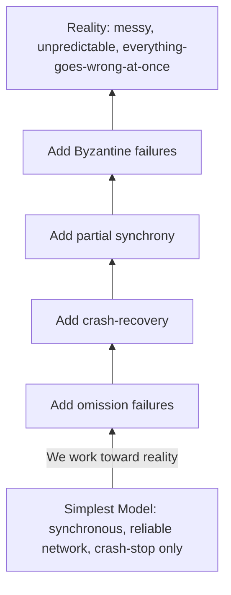

---

## 3. Core Theory

### 3.1 System Models Overview

A **system model** is a set of assumptions about the behavior of processes, communication channels, and time in a distributed system. It defines the "rules of the game" — what can go wrong, what always works, and what we can rely on.

Formally, a system model specifies:

1. **Process behavior**: How nodes execute, fail, and (optionally) recover.
2. **Communication behavior**: How messages are transmitted, delayed, lost, or corrupted.
3. **Timing behavior**: What bounds (if any) exist on processing time, message delivery time, and clock drift.

#### Why We Need Formal Models

Consider the consensus problem: getting N nodes to agree on a value. Without a formal model, you might write an algorithm that works "most of the time" in testing. But does it work:
- When 2 out of 5 nodes crash simultaneously?
- When network latency spikes from 1ms to 10 seconds?
- When one node has a corrupted disk and sends garbage?

A formal model lets you **prove** correctness under specific conditions and **know** when your algorithm will fail.

#### The Model Hierarchy

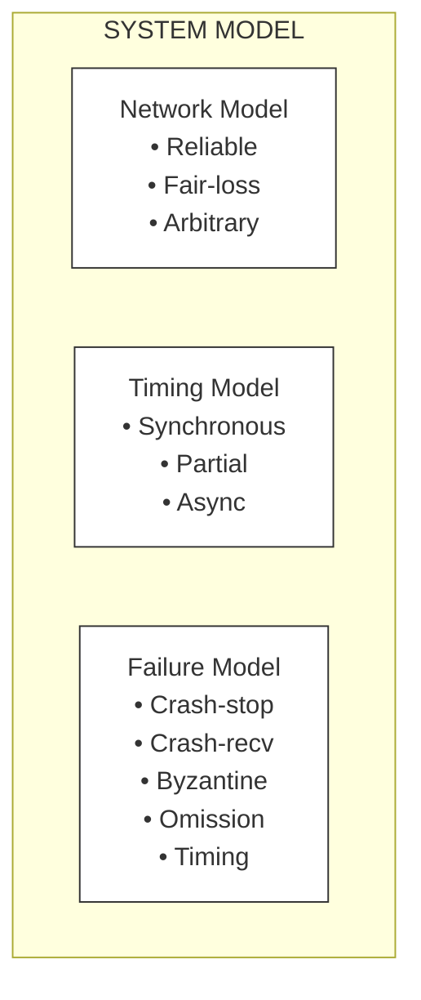

### 3.2 Network Models

The network model defines how messages behave when sent between nodes.

#### 3.2.1 Reliable Links

**Definition**: If a correct process `p` sends a message `m` to a correct process `q`, then `q` eventually delivers `m`. Messages are not duplicated, and they are not created spontaneously.

**Properties**:
- **Reliable delivery**: No message is lost between correct processes.
- **No duplication**: Every message is delivered at most once.
- **No creation**: No message is delivered unless it was actually sent.

**Where it applies**: Communication within a single data center rack, over TCP in ideal conditions, or between processes on the same machine.

**In practice**: TCP provides reliable delivery at the transport layer through acknowledgments and retransmissions. However, TCP connections can be reset, and the reliable-link abstraction breaks down during network partitions.

#### 3.2.2 Fair-Loss Links

**Definition**: If a correct process `p` sends a message `m` infinitely often to a correct process `q`, then `q` delivers `m` infinitely often. Messages may be lost, but not infinitely often.

**Properties**:
- **Fair loss**: If you keep trying, some messages will get through.
- **Finite duplication**: Messages may be duplicated, but only finitely many times.
- **No creation**: Same as reliable links.

**Where it applies**: UDP communication, unreliable wireless networks, the internet in general.

**How to build reliable links from fair-loss links**: 
1. Keep retransmitting the message until you receive an acknowledgment.
2. At the receiver, deduplicate messages using sequence numbers.
3. This is essentially what TCP does over IP.

```java
/**
 * Building reliable delivery from fair-loss links.
 * This is conceptually what TCP does at a higher level.
 */
public class ReliableLink {
    private final FairLossLink link;
    private final Set<MessageId> delivered = ConcurrentHashMap.newKeySet();
    private final Map<MessageId, Message> pending = new ConcurrentHashMap<>();
    
    public void send(Node destination, Message message) {
        MessageId id = message.getId();
        pending.put(id, message);
        
        // Retransmit until acknowledged
        scheduler.scheduleAtFixedRate(() -> {
            if (pending.containsKey(id)) {
                link.send(destination, message);
            }
        }, 0, RETRANSMIT_INTERVAL_MS, TimeUnit.MILLISECONDS);
    }
    
    public void onReceive(Message message) {
        MessageId id = message.getId();
        
        // Deduplicate
        if (delivered.add(id)) {
            deliverToApplication(message);
        }
        
        // Send acknowledgment
        link.send(message.getSender(), new Ack(id));
    }
    
    public void onAckReceive(Ack ack) {
        pending.remove(ack.getMessageId());
    }
}
```

#### 3.2.3 Arbitrary (Byzantine) Links

**Definition**: Messages may be lost, duplicated, corrupted, or fabricated. An adversary may inject, modify, or replay messages.

**Properties**:
- No guarantee on delivery.
- Messages may be altered in transit.
- Fake messages may appear.

**Where it applies**: Public internet (man-in-the-middle attacks), cross-organizational communication, blockchain networks, systems exposed to adversaries.

**How to handle**: Use cryptographic techniques:
- **Message authentication codes (MACs)** or **digital signatures** to prevent fabrication and tampering.
- **Sequence numbers and timestamps** to prevent replay attacks.
- **TLS/SSL** for encrypted, authenticated communication.

### 3.3 Timing Models

The timing model defines assumptions about processing speed, message delivery time, and clock accuracy.

#### 3.3.1 Synchronous Model

**Definition**: There exist known, fixed upper bounds on:
1. **Processing time**: Every step of a process takes at most `Δ_proc` time.
2. **Message delivery time**: Every message is delivered within `Δ_msg` time.
3. **Clock drift**: Clocks drift at most `ρ` rate.

**Properties**:
- You can use **timeouts** to reliably detect failures. If a node doesn't respond within `Δ_msg + Δ_proc`, it has crashed.
- Algorithms can be round-based: "In round 1, everyone sends their value. In round 2, everyone sends what they received."

**Where it applies**: Real-time systems, embedded systems, some specialized networks (e.g., CAN bus in automobiles, avionics).

**Limitations**: 
- Real networks (especially the internet) don't have known, fixed bounds.
- Even in data centers, garbage collection pauses, disk I/O, and network congestion can violate timing assumptions.
- Designing for synchronous assumptions in an asynchronous world leads to **false failure detections** and **split-brain** scenarios.

#### 3.3.2 Partially Synchronous Model

**Definition**: The system behaves synchronously *most of the time*, but there may be periods of asynchrony. Formally: there exists a time `T` (called the **Global Stabilization Time**, or GST) after which the system becomes synchronous. Before `T`, there are no timing guarantees.

**Properties**:
- After GST, messages arrive within a known bound `Δ`.
- Before GST, anything goes — messages can be delayed arbitrarily.
- **Crucially**: We don't know when GST occurs.

**Why this model is important**:
- It matches reality better than either pure synchronous or pure asynchronous.
- Most practical consensus protocols (Paxos, Raft, PBFT) are designed for partial synchrony.
- The model allows us to guarantee **safety** always (even during asynchronous periods) and **liveness** after GST.

**Formally**: 
```
∀ messages m sent after GST:
    delivery_time(m) ≤ Δ

Before GST:
    delivery_time(m) = undefined (can be arbitrarily long)
```

**Where it applies**: Most internet services, data center networks, cloud computing.

#### 3.3.3 Asynchronous Model

**Definition**: There are **no timing assumptions** whatsoever. Messages can take arbitrarily long. Processes can take arbitrarily long to execute a step. There are no bounds on clock drift.

**Properties**:
- You **cannot** use timeouts to detect failures (a slow node is indistinguishable from a crashed one).
- This is the **hardest** model to design algorithms for.
- The **FLP impossibility theorem** applies here: deterministic consensus is impossible even with a single crash failure.

**Where it applies**: Theoretical lower bounds, understanding fundamental limitations.

**In practice**: No real system is truly asynchronous (eventually the sun will die), but the asynchronous model forces us to design algorithms that don't depend on timing — which makes them more robust.

#### Comparison Table

| Property | Synchronous | Partially Synchronous | Asynchronous |
|----------|------------|----------------------|-------------|
| Message delay bound | Known, fixed | Known after GST | None |
| Processing time bound | Known, fixed | Known after GST | None |
| Timeout-based detection | ✅ Reliable | ⚠️ After GST only | ❌ Impossible |
| Consensus solvable? | ✅ Easy | ✅ Yes (Paxos, Raft) | ❌ FLP impossible |
| Matches reality? | Rarely | Usually | Theoretically |
| Design difficulty | Easy | Moderate | Hard |

### 3.4 Failure Models

Failure models describe **how processes can malfunction**. They form a hierarchy from least severe to most severe.

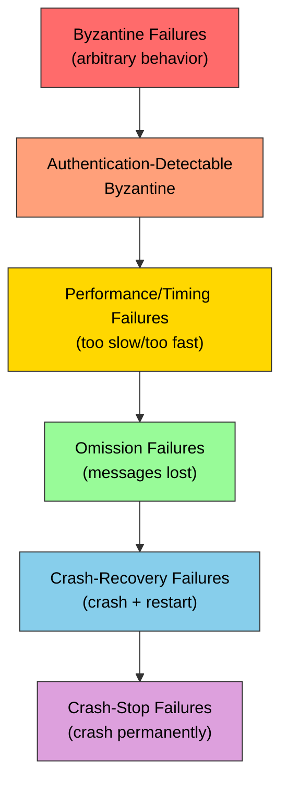

Each higher level **subsumes** all lower levels. A Byzantine failure model allows everything that a crash-stop model allows, plus more. This means an algorithm designed for Byzantine failures also handles crash-stop failures, but not vice versa.

#### 3.4.1 Crash-Stop Failures

**Definition**: A process executes correctly until it crashes, at which point it permanently stops executing. A crashed process does nothing — it doesn't send messages, respond to messages, or recover.

**Formal properties**:
- Before crashing: the process follows its algorithm correctly.
- After crashing: the process does nothing, forever.
- A correct process is one that never crashes.

**Assumption count**: In a system of `n` processes, we typically assume at most `f < n` can crash. Many algorithms require `f < n/2` (a majority must survive).

**Where it's used**:
- Paxos and Raft assume crash-stop (or crash-recovery) failures.
- Most traditional consensus protocols.
- ZooKeeper's ZAB protocol.

**In practice**: Processes *do* recover (servers reboot), so crash-stop is a simplification. But it's useful because:
1. A recovered process with no persistent state is equivalent to a new process joining — easier to reason about.
2. It gives us a lower bound: if we can't solve a problem with crash-stop, we certainly can't solve it with worse failures.

```java
/**
 * Simulating crash-stop behavior.
 * Once crashed, the node never recovers.
 */
public class CrashStopNode implements Node {
    private volatile boolean crashed = false;
    
    @Override
    public void processMessage(Message msg) {
        if (crashed) {
            // Silently drop - crashed nodes do nothing
            return;
        }
        
        try {
            // Normal processing
            handleMessage(msg);
        } catch (CrashException e) {
            // Permanent crash
            crashed = true;
            log.info("Node {} has crash-stopped", nodeId);
            // No recovery - ever
        }
    }
    
    @Override
    public boolean isAlive() {
        return !crashed;
    }
}
```

#### 3.4.2 Crash-Recovery Failures

**Definition**: A process may crash and later recover. Upon recovery, it may have access to **stable storage** (disk) that survives crashes, but its **volatile state** (RAM) is lost.

**Formal properties**:
- A process alternates between "up" and "down" states.
- While up, it follows its algorithm correctly.
- While down, it does nothing.
- Upon recovery, it can read from stable storage.
- A correct process is one that is eventually **always up** (crashes only finitely many times).

**Key challenge**: The process must be able to reconstruct enough state from stable storage to continue participating in the protocol.

**Where it's used**:
- Write-ahead logging (WAL) in databases.
- Raft log replication — followers recover by replaying their logs.
- ZooKeeper — nodes recover using their transaction logs and snapshots.

**Design implications**:
- Critical protocol state must be written to **durable storage** before sending messages.
- The `fsync()` call is your best friend and worst enemy — it ensures durability but kills performance.
- Recovery protocols must handle the case where a node crashed between writing to disk and sending a message (or vice versa).

```java
/**
 * Crash-recovery node with persistent state.
 * Demonstrates the pattern used by consensus protocols.
 */
public class CrashRecoveryNode implements Node {
    
    private final PersistentStorage storage;  // Survives crashes
    private volatile Map<String, Object> volatileState;  // Lost on crash
    
    public CrashRecoveryNode(PersistentStorage storage) {
        this.storage = storage;
        this.volatileState = new HashMap<>();
        recover();  // Called on startup/restart
    }
    
    private void recover() {
        // Reconstruct state from stable storage
        long lastTerm = storage.readLong("currentTerm", 0);
        String votedFor = storage.readString("votedFor", null);
        List<LogEntry> log = storage.readLog();
        
        // Rebuild volatile state from persistent state
        this.volatileState.put("currentTerm", lastTerm);
        this.volatileState.put("votedFor", votedFor);
        this.volatileState.put("log", log);
        this.volatileState.put("commitIndex", 0L); // Must be rediscovered
        this.volatileState.put("lastApplied", 0L); // Must be reapplied
        
        log.info("Node {} recovered. Term={}, logLength={}", 
                 nodeId, lastTerm, log.size());
    }
    
    public void updateTerm(long newTerm) {
        // CRITICAL: Write to stable storage BEFORE acting on it
        storage.writeLong("currentTerm", newTerm);
        storage.fsync(); // Ensure durability
        
        volatileState.put("currentTerm", newTerm);
    }
    
    public void appendToLog(LogEntry entry) {
        storage.appendLog(entry);
        storage.fsync(); // Must be durable before acknowledging
        
        List<LogEntry> log = (List<LogEntry>) volatileState.get("log");
        log.add(entry);
    }
}
```

#### 3.4.3 Omission Failures

**Definition**: A process fails to send or receive some messages. It may still be running and processing correctly, but some communications are silently dropped.

**Types**:
- **Send omission**: The process fails to send a message it should have sent.
- **Receive omission**: The process fails to receive a message that was sent to it.
- **General omission**: Both send and receive omissions.

**Where it occurs**:
- Network congestion causing packet drops (even with TCP, at the application level).
- Full message queues where new messages are dropped.
- Garbage collection pauses causing heartbeat omissions.
- Overloaded processes that can't keep up with incoming messages.

**Why it's distinct from crash failures**: The node is still running and may be processing some messages correctly. Other nodes can't easily tell if a node has crashed or is just experiencing omission failures.

**Real-world example**: A Java application experiences a 30-second GC pause. During this pause:
- It doesn't send heartbeats → other nodes think it crashed.
- It doesn't process incoming messages → messages pile up.
- When it resumes, it catches up — but the cluster may have already elected a new leader.

This is why JVM-based distributed systems (Kafka, ZooKeeper, Cassandra, Elasticsearch) tune GC very carefully.

#### 3.4.4 Timing Failures

**Definition**: A process responds, but not within the expected time bounds. It may be too slow or (sometimes) too fast.

**Types**:
- **Clock failures**: Local clock drifts beyond acceptable bounds.
- **Performance failures**: Processing takes longer than the specified bound.
- **Response failures**: Messages arrive after the deadline.

**Where it matters**:
- Real-time systems where deadlines are hard (avionics, industrial control).
- Lease-based systems where a lease expires because a node was too slow.
- Leader election where a slow leader causes unnecessary elections.

**Relationship to other models**: Timing failures only make sense in the **synchronous** or **partially synchronous** model, where time bounds exist. In the asynchronous model, there are no timing assumptions to violate.

#### 3.4.5 Byzantine Failures (Detailed)

**Definition**: A process may exhibit **arbitrary behavior**. It can crash, send wrong messages, send contradictory messages to different nodes, collude with other Byzantine nodes, or do anything at all — except break cryptography (in the authenticated Byzantine model).

**Formal definition**: A Byzantine faulty process may deviate from its algorithm in any way. It may:
1. Send messages it shouldn't send.
2. Not send messages it should send.
3. Send different messages to different nodes for the same protocol step.
4. Send messages with incorrect content.
5. Appear to crash and then resume.
6. Collude with other Byzantine processes.

**What Byzantine failures look like in practice**:

| Cause | Byzantine Behavior |
|-------|-------------------|
| **Hardware fault** | Corrupted memory causes wrong values to be computed and sent |
| **Software bug** | A race condition causes a node to send conflicting votes |
| **Compromised node** | A hacked server deliberately sends false data |
| **Disk corruption** | Silent data corruption causes wrong data to be served |
| **Operator error** | A misconfigured node sends malformed protocol messages |
| **Version skew** | An old version of software interprets messages differently |

**How many Byzantine failures can we tolerate?**

The fundamental result (proved by Lamport, Shostak, and Pease in 1982):

> **Byzantine consensus requires `n ≥ 3f + 1` processes to tolerate `f` Byzantine failures.**

This means:
- To tolerate 1 Byzantine node: need at least 4 nodes.
- To tolerate 2 Byzantine nodes: need at least 7 nodes.
- To tolerate 3 Byzantine nodes: need at least 10 nodes.

**Why 3f + 1?** Intuition:
- You need enough correct nodes to outvote the Byzantine ones.
- Byzantine nodes can lie. If you have `f` Byzantine nodes, they might all tell you different things.
- You need `f + 1` correct nodes to agree (to outvote the `f` Byzantine ones), but you don't know which nodes are correct.
- So you need at least `2f + 1` non-Byzantine nodes.
- Total: `2f + 1 + f = 3f + 1`.

**With digital signatures** (authenticated Byzantine model):
- We can reduce the requirement to `n ≥ 2f + 1` for some problems.
- Signatures prevent Byzantine nodes from forging messages from correct nodes.

```java
/**
 * Simple Byzantine behavior simulation.
 * Shows the different types of Byzantine faults.
 */
public class ByzantineNode implements Node {
    
    public enum ByzantineStrategy {
        HONEST,           // Follows protocol correctly
        SILENT,           // Never sends messages (like crash)
        LIAR,             // Always sends wrong values
        EQUIVOCATOR,      // Sends different values to different nodes
        RANDOM,           // Sends random garbage
        STRATEGIC         // Deliberately tries to cause disagreement
    }
    
    private final ByzantineStrategy strategy;
    private final Random random = new Random();
    
    public void sendProposal(List<Node> peers, String correctValue) {
        switch (strategy) {
            case HONEST:
                // Send the correct value to everyone
                for (Node peer : peers) {
                    send(peer, new Proposal(correctValue));
                }
                break;
                
            case SILENT:
                // Send nothing - equivalent to crash
                break;
                
            case LIAR:
                // Send an incorrect value to everyone
                String wrongValue = "CORRUPTED_" + correctValue;
                for (Node peer : peers) {
                    send(peer, new Proposal(wrongValue));
                }
                break;
                
            case EQUIVOCATOR:
                // Send different values to different nodes
                // This is the most dangerous Byzantine behavior!
                for (int i = 0; i < peers.size(); i++) {
                    String value = "value_" + i; // Different value for each peer
                    send(peers.get(i), new Proposal(value));
                }
                break;
                
            case RANDOM:
                for (Node peer : peers) {
                    String garbage = UUID.randomUUID().toString();
                    send(peer, new Proposal(garbage));
                }
                break;
                
            case STRATEGIC:
                // Try to create a split: half see value A, half see value B
                int half = peers.size() / 2;
                for (int i = 0; i < peers.size(); i++) {
                    String value = (i < half) ? "A" : "B";
                    send(peers.get(i), new Proposal(value));
                }
                break;
        }
    }
}
```

### 3.5 Safety and Liveness Properties

Every property of a distributed system can be classified as either a **safety property** or a **liveness property**. Understanding this distinction is crucial for reasoning about correctness.

#### Safety Properties

**Definition**: A safety property states that **"something bad never happens."** If a safety property is violated, it is violated at a specific point in time, and it cannot be "unviolated" later.

**Formal definition**: A property P is a safety property if, for every execution that violates P, there exists a finite prefix of that execution that also violates P.

**Examples**:
- **Agreement**: No two correct processes decide different values. (If they do, we can point to the exact moment.)
- **Validity**: A decided value was proposed by some process. (If not, we can point to the invalid decision.)
- **Mutual exclusion**: At most one process is in the critical section at any time.
- **Consistency**: A read returns the most recent write. (If not, we can identify the violating read.)

**Key insight**: Safety properties must hold at **all times**, even during periods of asynchrony. A protocol that temporarily violates safety (e.g., allows two leaders) is broken, not "eventually correct."

#### Liveness Properties

**Definition**: A liveness property states that **"something good eventually happens."** If a liveness property hasn't been satisfied yet, it might be satisfied in the future.

**Formal definition**: A property P is a liveness property if every finite execution can be extended to satisfy P.

**Examples**:
- **Termination**: Every correct process eventually decides.
- **Eventual delivery**: Every message is eventually delivered.
- **Progress**: The system eventually makes progress.
- **Eventual consistency**: Replicas eventually converge.

**Key insight**: Liveness can be temporarily violated (e.g., the system is slow and hasn't decided yet) without the system being "broken." It just needs to *eventually* satisfy the property.

#### The Fundamental Tradeoff

> **In an asynchronous system with failures, you cannot guarantee both safety and liveness simultaneously.** (This is essentially the FLP impossibility theorem.)

Most practical systems prioritize **safety over liveness**:
- Raft/Paxos: Safety always holds (no two different values are committed for the same log entry). Liveness is guaranteed only during periods of synchrony.
- PBFT: Safety always holds. Liveness requires partial synchrony.

```
Safety:   "We will never give a wrong answer"      → MUST hold always
Liveness: "We will eventually give some answer"     → May require assumptions
```

**The CAP theorem** (Chapter 6) is another expression of this tradeoff: during a partition, you choose between consistency (safety) and availability (liveness).

---

## 4. Architecture Deep Dive

### 4.1 The FLP Impossibility Theorem

The **Fischer-Lynch-Paterson (FLP) impossibility result** (1985) is one of the most important theorems in distributed computing. It establishes a fundamental limit on what's possible.

#### Statement

> **In an asynchronous system, there is no deterministic algorithm that solves consensus if even one process can crash.**

More precisely: There is no deterministic protocol that guarantees consensus (agreement + validity + termination) in an asynchronous system where at least one process may fail by crashing.

#### What This Means

- **Asynchronous system**: No bounds on message delivery time or processing time.
- **Deterministic**: The protocol's behavior is fully determined by the messages it receives (no randomness).
- **One crash**: Even if only one out of N processes might crash.
- **Consensus**: All correct processes agree on a value (agreement), the value was proposed (validity), and everyone eventually decides (termination).

#### Proof Intuition

The proof works by showing that from any "bivalent" configuration (where both 0 and 1 are still possible decisions), there's always a way for the adversary (who controls message scheduling) to reach another bivalent configuration. The adversary keeps the system undecided forever.

```
Configuration where decision 0 is still possible AND decision 1 is still possible
    = "bivalent" configuration

The adversary can always find a schedule that maintains bivalency.
    → The system never reaches a decision.
    → Termination is violated.
```

**Key idea**: The adversary exploits the fact that in an asynchronous system, you can't tell if a process is slow or crashed. So the adversary can delay a message to make the system think a process might have crashed, keeping it in an undecided state.

#### What FLP Does NOT Say

FLP is often misunderstood. It does **not** say:

1. ❌ "Consensus is impossible in distributed systems." (It's quite possible with partial synchrony or randomization.)
2. ❌ "You can't build practical consensus systems." (Paxos, Raft, Zab all work in practice.)
3. ❌ "Crash failures make consensus impossible." (Only with pure asynchrony AND determinism.)

#### Workarounds for FLP

Since FLP applies to deterministic algorithms in fully asynchronous systems, we work around it by relaxing one of these assumptions:

| Workaround | What Changes | Examples |
|-----------|-------------|---------|
| **Partial synchrony** | Assume eventual timing bounds | Paxos, Raft, PBFT |
| **Randomization** | Allow probabilistic termination | Ben-Or's protocol, blockchain |
| **Failure detectors** | Abstract away timing assumptions | Chandra-Toueg protocols |
| **Weaker problems** | Solve something easier than consensus | Reliable broadcast |

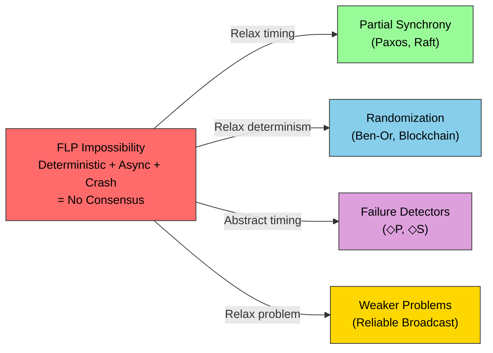

### 4.2 The Two Generals Problem

The **Two Generals Problem** (1975, by Akkoyunlu, Ekanadham, and Huber, later refined by Gray) is the earliest known result about the fundamental limitations of distributed agreement.

#### Problem Statement

Two army generals (A and B) are camped on opposite sides of an enemy city. They must **coordinate an attack** — both must attack at the same time, or neither should attack (attacking alone means certain defeat).

Their only communication channel is sending messengers through the enemy-occupied valley. **Any messenger may be captured** (message lost).

**Goal**: Both generals agree on whether to attack and at what time.

#### Why It's Impossible

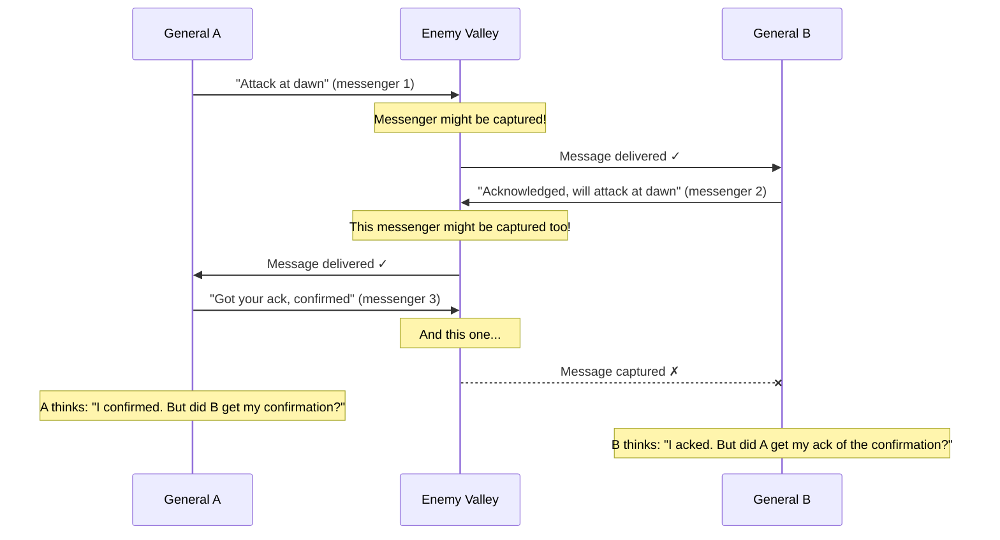

**The fundamental issue**: No matter how many rounds of acknowledgment you add, the **last message** is always uncertain. The general who sent the last message doesn't know if it was received.

**Formal proof**: Suppose there exists a protocol that solves the problem with N messages. Consider the execution where the Nth (last) message is lost. The sender of the Nth message acts as if it was received. The receiver acts as if it wasn't sent. If the protocol is correct, it must work in both cases — but the sender and receiver now have different information, leading to a contradiction.

#### Real-World Implications

The Two Generals Problem manifests everywhere:

1. **TCP Connection Termination**: The TCP FIN/FIN-ACK/ACK handshake for closing connections. The last ACK might be lost. TCP solves this with TIME_WAIT (the "I'll wait and hope" approach), not with perfect agreement.

2. **Payment Processing**: Your server sends a payment request to Stripe. The response is lost. Did the payment go through? You don't know. Solution: **idempotency keys**. Make the operation idempotent so that retrying is safe.

3. **Database Two-Phase Commit**: The coordinator sends COMMIT. A participant doesn't acknowledge. The coordinator can't be sure if the participant committed or not. This is why 2PC is called a "blocking protocol."

4. **Online Shopping**: You click "Place Order." Your browser shows a loading spinner, then a network error. Did the order go through? Should you retry? This is the Two Generals Problem in your browser.

#### How Real Systems Handle It

Since perfect agreement is impossible, practical systems use **probabilistic** and **economic** solutions:

| Strategy | Description | Example |
|---------|------------|---------|
| **Retry + Idempotency** | Retry the operation but make it safe to execute multiple times | Stripe payment API |
| **Timeout + Default** | If no response within T, assume failure and compensate | TCP TIME_WAIT |
| **At-least-once delivery** | Send multiple times, receiver deduplicates | Kafka producers |
| **Compensating transactions** | If unsure, do it and fix later | Saga pattern |

### 4.3 The Byzantine Generals Problem

The **Byzantine Generals Problem** (Lamport, Shostak, Pease, 1982) generalizes the Two Generals Problem to a setting with more than two parties and the possibility of **traitorous** (malicious/faulty) participants.

#### Problem Statement

A group of Byzantine generals, each commanding a division of the army, surrounds an enemy city. They must agree on a common battle plan (attack or retreat). They communicate by messengers, and some generals may be **traitors** who try to prevent the loyal generals from reaching agreement.

**Goals**:
1. **Agreement**: All loyal generals decide on the same plan.
2. **Validity**: If all loyal generals propose the same value, that value is decided.

**Constraint**: The algorithm must work even if up to `f` out of `n` generals are traitors.

#### The 3-General Impossibility

With 3 generals and 1 traitor, agreement is **impossible** (without cryptographic authentication):

```
Scenario 1: General C is the traitor

    A (loyal)          B (loyal)          C (traitor)
    proposes ATTACK    proposes ATTACK    
    
    A tells B: ATTACK    C tells A: RETREAT    C tells B: RETREAT
    B tells A: ATTACK    
    
    A sees: 2 ATTACK, 1 RETREAT → decides ATTACK ✓
    B sees: 2 ATTACK, 1 RETREAT → decides ATTACK ✓
    
Scenario 2: General A is the traitor

    A (traitor)         B (loyal)           C (loyal)
    
    A tells B: ATTACK    A tells C: RETREAT
    
    B sees: A says ATTACK, C relays something
    C sees: A says RETREAT, B relays something
    
    B and C can't distinguish this from Scenario 1!
```

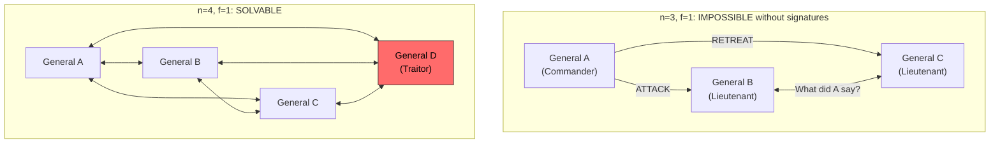

#### Solution Requirements

**Oral Messages (No Signatures)**:
- Requires `n ≥ 3f + 1`
- The OM(f) algorithm by Lamport, Shostak, and Pease
- Works by having nodes relay messages and take majority vote

**Signed Messages (With Cryptographic Signatures)**:
- Requires `n ≥ 2f + 1` (or even `n ≥ f + 2`)
- Traitors can't forge honest generals' signatures
- Solution is easier because equivocation (saying different things to different generals) is detectable

### 4.4 Practical Byzantine Fault Tolerance (PBFT)

**PBFT** (Castro and Liskov, 1999) was the first practical algorithm for Byzantine fault tolerance. It showed that BFT could work in real systems, not just in theory.

#### System Model

- `n = 3f + 1` replicas, tolerating `f` Byzantine faults.
- Partially synchronous network.
- Cryptographic authentication (digital signatures).
- Deterministic service being replicated.

#### Algorithm Overview

PBFT operates in **views**. Each view has a designated **primary** (leader). If the primary is suspected of being Byzantine, a **view change** occurs.

The normal-case operation has three phases:

1. **Pre-prepare**: The primary assigns a sequence number to the client request and multicasts a PRE-PREPARE message.
2. **Prepare**: Each backup verifies the pre-prepare and multicasts a PREPARE message.
3. **Commit**: Once a replica receives `2f + 1` matching PREPARE messages (a quorum), it multicasts a COMMIT message.
4. **Reply**: Once a replica receives `2f + 1` matching COMMIT messages, it executes the request and sends the result to the client.

The client waits for `f + 1` identical replies.

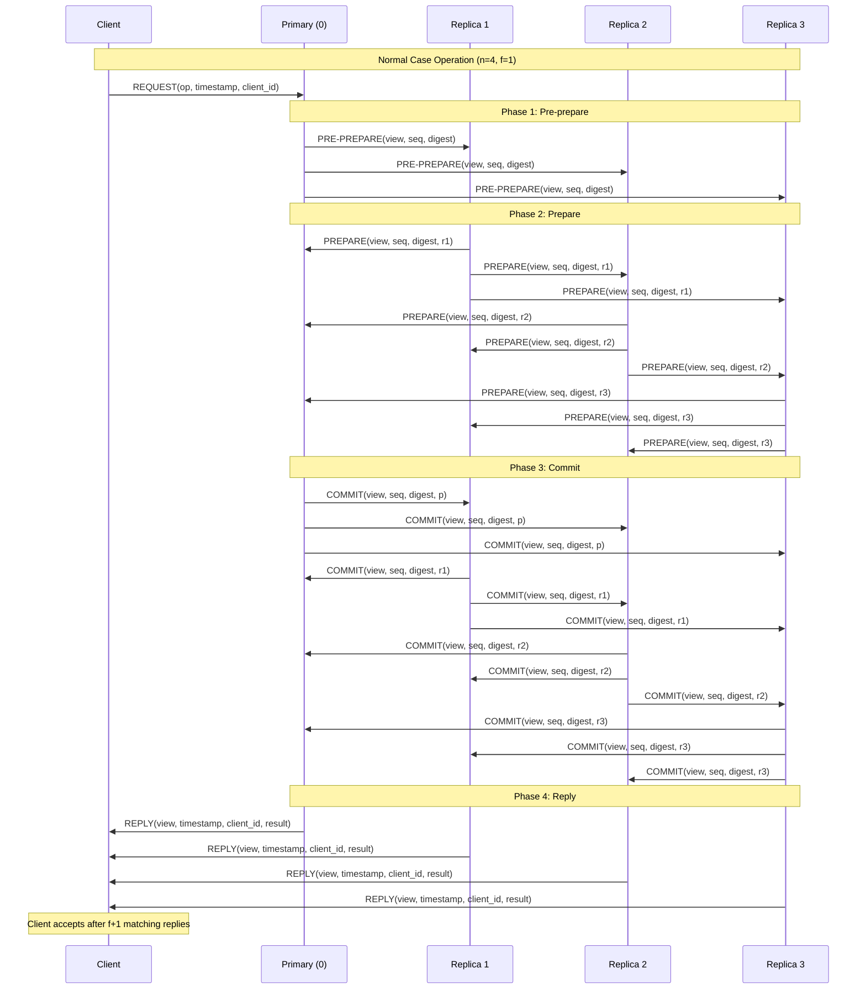

#### Why Each Phase Is Necessary

1. **Pre-prepare** ensures the primary has assigned a unique sequence number. Without this, a Byzantine primary could assign different sequence numbers to the same request.

2. **Prepare** ensures that all honest replicas agree on the ordering. After receiving `2f + 1` prepares (a "prepared certificate"), a replica knows that enough replicas agree on this ordering. A Byzantine primary can't equivocate — if it sends different pre-prepares to different replicas, they'll detect the inconsistency during prepare.

3. **Commit** ensures that the prepared certificate is durable across view changes. Even if a view change occurs, the commit quorum guarantees that the decision persists.

#### View Change Protocol

When replicas suspect the primary is Byzantine (e.g., it's not sending pre-prepares, or it's sending inconsistent ones), they trigger a **view change**:

1. Replicas send VIEW-CHANGE messages with their prepared certificates.
2. The new primary collects `2f + 1` view-change messages.
3. It creates a NEW-VIEW message that includes the collected information.
4. Normal operation resumes with the new primary.

This ensures that any committed decisions from the old view are preserved in the new view.

#### PBFT Complexity

| Metric | Value |
|--------|-------|
| Message complexity per request | O(n²) |
| Communication rounds | 3 (pre-prepare, prepare, commit) |
| Minimum replicas for f faults | 3f + 1 |
| Client wait | f + 1 matching replies |
| Throughput | ~10,000-50,000 ops/sec (2018 benchmarks) |

The O(n²) message complexity is PBFT's main scalability limitation. For `n = 100` replicas, each request generates roughly 10,000 messages.

### 4.5 Failure Detectors

**Failure detectors** (Chandra and Toueg, 1996) provide an elegant abstraction for dealing with the FLP impossibility. Instead of reasoning about timing assumptions directly, we define an oracle that "suspects" crashed processes.

#### The Idea

A failure detector is a distributed oracle that provides each process with a list of processes it suspects have crashed. Failure detectors can make mistakes (false suspicions), and the type of failure detector determines what mistakes are allowed.

#### Types of Failure Detectors

**Perfect Failure Detector (P)**:
- **Strong completeness**: Every crashed process is eventually suspected by every correct process.
- **Strong accuracy**: No correct process is ever suspected.
- Equivalent to a synchronous system — only realizable if you have timing bounds.

**Eventually Perfect Failure Detector (◇P)**:
- **Strong completeness**: Every crashed process is eventually suspected by every correct process.
- **Eventual strong accuracy**: After some time T (unknown), no correct process is suspected.
- Before time T, false suspicions may occur.
- Equivalent to partial synchrony.

**Eventually Strong Failure Detector (◇S)**:
- **Strong completeness**: Every crashed process is eventually suspected by every correct process.
- **Eventual weak accuracy**: After some time T, there exists at least one correct process that is never suspected.
- The weakest failure detector sufficient to solve consensus (with a majority of correct processes).

**Unreliable Failure Detector**:
- May suspect correct processes and may not suspect crashed processes.
- Useful only in combination with other mechanisms.

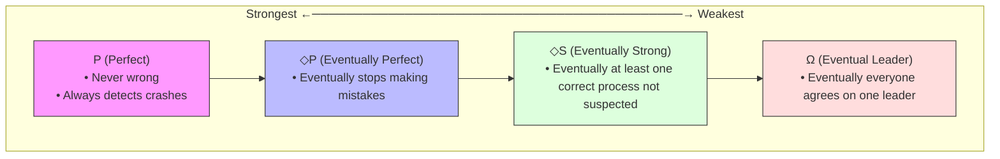

#### Relationship to Consensus

Chandra and Toueg showed:
- **◇S** (or equivalently, the **Ω** leader oracle) is the **weakest** failure detector that can solve consensus with crash failures and a majority of correct processes.
- This means any protocol that solves consensus in an asynchronous system must implicitly or explicitly implement at least ◇S.
- Paxos and Raft essentially implement Ω (eventual leader election) through their leader election mechanisms.

---

## 5. Visual Diagrams

### Failure Model Hierarchy

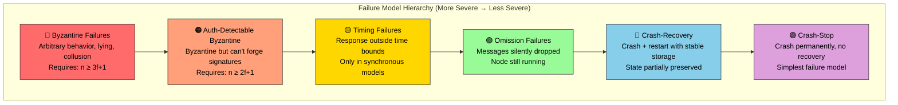

### System Model Decision Tree

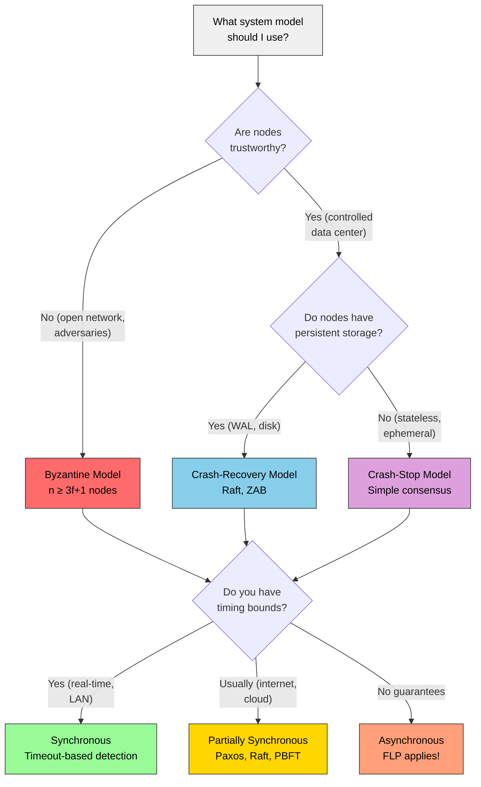

### PBFT State Machine

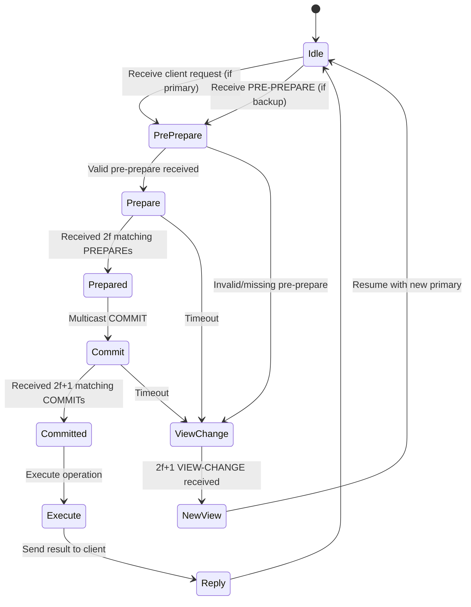

### Two Generals - All Scenarios

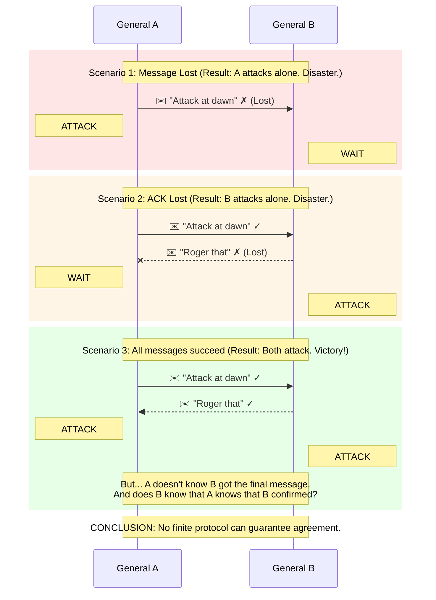

### Failure Detector Behavior Over Time


Detector   ok     ok    suspect  ok    ok     ok     ok     ok
output:                  (false        │
                         positive)     │
                                   After GST: no more false positives
```

---

## 6. Real Production Examples

### 6.1 Google Spanner: Timing Model in Practice

Google Spanner makes a fascinating choice in its system model:

**Network Model**: Fair-loss links (messages may be lost but retransmitted via reliable transport).

**Timing Model**: Partially synchronous with an important innovation: **TrueTime**.

TrueTime doesn't assume clocks are perfectly synchronized, but it bounds the uncertainty. Each server has a `TT.now()` function that returns an interval `[earliest, latest]` — the true time is guaranteed to be within that interval.

```
Traditional assumption:  clock = true_time ± ε  (but we don't know ε)
Spanner's TrueTime:      TT.now() = [earliest, latest], guaranteed true_time ∈ [earliest, latest]
```

Spanner's wait rule: Before committing a transaction at timestamp `t`, wait until `TT.after(t)` is true (i.e., until the current time is definitely past `t`). This guarantees that if transaction T1 commits before T2 starts, T1 will have a lower timestamp — providing **external consistency** (linearizability).

**Failure Model**: Crash-recovery (Paxos groups can lose members and recover). Not Byzantine — Google trusts its own data centers.

**Key lesson**: By investing heavily in hardware (GPS receivers and atomic clocks in every data center) to reduce clock uncertainty to ~7ms, Spanner turns the timing problem into an engineering problem rather than an impossibility.

### 6.2 Amazon DynamoDB: Prioritizing Availability

Amazon's original Dynamo paper (2007) explicitly states its system model:

**Network Model**: Fair-loss (messages can be lost, network can partition between data centers).

**Timing Model**: Asynchronous (no assumption about when messages arrive).

**Failure Model**: Crash-recovery (nodes may crash and rejoin).

**Design philosophy**: "Always writeable." Even during network partitions, the system accepts writes. This is an AP (Available + Partition-tolerant) choice.

Key mechanisms that emerge from this model choice:
- **Vector clocks** for conflict detection (since there's no global ordering).
- **Sloppy quorums** for availability during partitions.
- **Read repair** and **anti-entropy** for eventual consistency.
- **Last-writer-wins** or application-level conflict resolution.

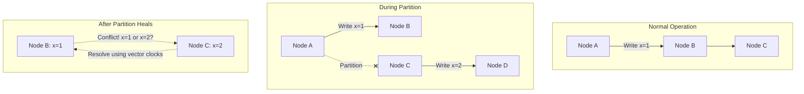

### 6.3 Netflix: Chaos Engineering and Failure Models

Netflix's Chaos Engineering practice is essentially the **systematic exploration of failure models** in production:

| Chaos Tool | Failure Model Tested | What It Does |
|-----------|---------------------|-------------|
| **Chaos Monkey** | Crash-stop | Randomly terminates EC2 instances |
| **Chaos Kong** | Network partition | Simulates an entire AWS region going down |
| **Latency Monkey** | Timing failures | Introduces artificial delays in RESTful calls |
| **Conformity Monkey** | Omission failures | Finds instances not following best practices |

Netflix's key insight: **You don't truly understand your failure model until you've tested it in production.**

Their architecture assumes:
- **Network**: Fair-loss between services, partitions between regions.
- **Timing**: Partially synchronous — timeouts are tuned but not guaranteed.
- **Failures**: Crash-recovery for individual instances, crash-stop for entire regions (fail over, don't recover).
- **No Byzantine assumptions**: They trust their own code (modulo bugs, which they treat as crash-recovery).

### 6.4 Bitcoin/Ethereum: Byzantine Model in the Wild

Blockchain systems operate under the strongest adversarial model:

**Network Model**: Arbitrary — adversaries may delay, reorder, or suppress messages.

**Timing Model**: Partially synchronous — the protocol needs messages to eventually arrive for liveness, but safety holds regardless.

**Failure Model**: Byzantine — any node might be an adversary trying to double-spend, censor transactions, or disrupt the network.

**Key innovation**: Instead of `n ≥ 3f + 1`, Bitcoin uses **Proof of Work** (economic rather than voting-based BFT). Honest behavior is incentivized by block rewards, and attacking the network is made expensive by the computational cost of mining.

**Ethereum 2.0 (Proof of Stake)**: Uses a BFT-inspired protocol (Casper FFG + LMD-GHOST) where validators stake ETH. The economic model replaces `3f + 1` with "1/3 of staked ETH must be Byzantine to break safety."

### 6.5 Meta (Facebook) TAO: Crash-Recovery at Scale

TAO is Facebook's social graph cache, serving billions of reads per second:

**Model**:
- **Network**: Reliable within a data center, fair-loss between data centers.
- **Timing**: Partially synchronous.
- **Failures**: Crash-recovery for cache servers, crash-stop for entire caches (replaced by new instances).

**Key design decisions**:
- Read-after-write consistency within a region, eventual consistency across regions.
- Write-through caching: writes go to the database, invalidations propagate to caches.
- Refill protocol: when a cache crashes and recovers, it refills from the database (crash-recovery with stable storage being the database).

### 6.6 CockroachDB: Balancing Models

CockroachDB chooses a model between Spanner (which has TrueTime) and traditional systems:

**Network**: Fair-loss, partitions expected between nodes.

**Timing**: Partially synchronous. Without TrueTime, CockroachDB uses **NTP-bounded clock offsets** with a configurable maximum offset (default 500ms). Transactions that span multiple nodes must account for this uncertainty.

**Failures**: Crash-recovery. Uses Raft for replication with durable logs.

**Key tradeoff**: CockroachDB accepts higher latency (waiting out clock uncertainty) to provide serializable transactions without specialized hardware.

---

## 7. Java Implementations

### 7.1 Heartbeat-Based Failure Detector

This implementation demonstrates an **eventually perfect failure detector** (◇P) using heartbeats and adaptive timeouts.

```java
import java.util.*;
import java.util.concurrent.*;
import java.util.concurrent.atomic.AtomicBoolean;
import java.util.concurrent.atomic.AtomicLong;

/**
 * Eventually Perfect Failure Detector (◇P) Implementation.
 * 
 * Uses heartbeats with adaptive timeouts to detect node failures.
 * 
 * Properties:
 * - Strong completeness: Every crashed node is eventually suspected.
 * - Eventual strong accuracy: After GST, no correct node is falsely suspected.
 * 
 * The adaptive timeout mechanism handles the "eventually" part:
 * - If a node is suspected but later sends a heartbeat (false positive),
 *   we increase the timeout for that node.
 * - This means false positives become less frequent over time.
 * - After enough adjustments (i.e., after GST), no correct node is suspected.
 */
public class EventuallyPerfectFailureDetector {

    /**
     * Represents a monitored remote node and its heartbeat state.
     */
    private static class NodeState {
        final String nodeId;
        final AtomicLong lastHeartbeatTime = new AtomicLong(System.nanoTime());
        final AtomicLong timeoutNanos;
        final AtomicBoolean suspected = new AtomicBoolean(false);
        int falsePositiveCount = 0;

        NodeState(String nodeId, long initialTimeoutNanos) {
            this.nodeId = nodeId;
            this.timeoutNanos = new AtomicLong(initialTimeoutNanos);
        }
    }

    // Configuration
    private final long baseTimeoutMs;
    private final long heartbeatIntervalMs;
    private final long timeoutIncrementMs;
    private final int maxTimeoutMultiplier;
    
    // State
    private final String localNodeId;
    private final Map<String, NodeState> monitoredNodes = new ConcurrentHashMap<>();
    private final List<FailureDetectorListener> listeners = new CopyOnWriteArrayList<>();
    
    // Executor
    private final ScheduledExecutorService scheduler = 
        Executors.newScheduledThreadPool(2, r -> {
            Thread t = new Thread(r, "failure-detector");
            t.setDaemon(true);
            return t;
        });

    /**
     * Listener interface for failure detection events.
     */
    public interface FailureDetectorListener {
        void onNodeSuspected(String nodeId, long lastHeartbeatAge);
        void onNodeRestored(String nodeId);
    }

    public EventuallyPerfectFailureDetector(
            String localNodeId,
            long baseTimeoutMs,
            long heartbeatIntervalMs) {
        this.localNodeId = localNodeId;
        this.baseTimeoutMs = baseTimeoutMs;
        this.heartbeatIntervalMs = heartbeatIntervalMs;
        this.timeoutIncrementMs = baseTimeoutMs / 2; // Increase by 50% on false positive
        this.maxTimeoutMultiplier = 10; // Max timeout = 10x base
    }

    /**
     * Start monitoring a remote node.
     */
    public void monitor(String nodeId) {
        long timeoutNanos = TimeUnit.MILLISECONDS.toNanos(baseTimeoutMs);
        monitoredNodes.putIfAbsent(nodeId, new NodeState(nodeId, timeoutNanos));
    }

    /**
     * Called when a heartbeat is received from a remote node.
     * 
     * If the node was previously suspected (false positive),
     * we increase its timeout to reduce future false positives.
     */
    public void receiveHeartbeat(String nodeId) {
        NodeState state = monitoredNodes.get(nodeId);
        if (state == null) {
            return;
        }

        state.lastHeartbeatTime.set(System.nanoTime());

        // If we had a false positive, increase timeout (adaptive mechanism)
        if (state.suspected.compareAndSet(true, false)) {
            state.falsePositiveCount++;
            
            // Increase timeout to reduce future false positives
            long currentTimeout = state.timeoutNanos.get();
            long increment = TimeUnit.MILLISECONDS.toNanos(timeoutIncrementMs);
            long maxTimeout = TimeUnit.MILLISECONDS.toNanos(
                baseTimeoutMs * maxTimeoutMultiplier);
            long newTimeout = Math.min(currentTimeout + increment, maxTimeout);
            
            state.timeoutNanos.set(newTimeout);
            
            // Notify listeners of restoration
            for (FailureDetectorListener listener : listeners) {
                listener.onNodeRestored(nodeId);
            }
            
            System.out.printf("[FD] Node %s restored (false positive #%d). " +
                "Timeout increased to %d ms%n",
                nodeId, state.falsePositiveCount,
                TimeUnit.NANOSECONDS.toMillis(newTimeout));
        }
    }

    /**
     * Start the failure detector.
     * Periodically checks all monitored nodes for heartbeat timeouts.
     */
    public void start() {
        // Periodically send heartbeats (in a real system, this would
        // send over the network)
        scheduler.scheduleAtFixedRate(
            this::sendHeartbeats,
            0, heartbeatIntervalMs, TimeUnit.MILLISECONDS);

        // Periodically check for timed-out nodes
        scheduler.scheduleAtFixedRate(
            this::checkTimeouts,
            heartbeatIntervalMs, heartbeatIntervalMs / 2, 
            TimeUnit.MILLISECONDS);
    }

    /**
     * Send heartbeats to all monitored nodes.
     * In a real implementation, this would send network messages.
     */
    private void sendHeartbeats() {
        // In production, this would send actual network messages
        // For this implementation, we simulate with the heartbeat receiver
    }

    /**
     * Check all monitored nodes for heartbeat timeouts.
     */
    private void checkTimeouts() {
        long now = System.nanoTime();

        for (NodeState state : monitoredNodes.values()) {
            long elapsed = now - state.lastHeartbeatTime.get();
            long timeout = state.timeoutNanos.get();

            if (elapsed > timeout && state.suspected.compareAndSet(false, true)) {
                long ageMs = TimeUnit.NANOSECONDS.toMillis(elapsed);
                
                System.out.printf("[FD] Node %s SUSPECTED (no heartbeat for %d ms, " +
                    "timeout=%d ms)%n",
                    state.nodeId, ageMs,
                    TimeUnit.NANOSECONDS.toMillis(timeout));

                // Notify listeners
                for (FailureDetectorListener listener : listeners) {
                    listener.onNodeSuspected(state.nodeId, ageMs);
                }
            }
        }
    }

    /**
     * Get the current set of suspected nodes.
     */
    public Set<String> getSuspectedNodes() {
        Set<String> suspected = new HashSet<>();
        for (NodeState state : monitoredNodes.values()) {
            if (state.suspected.get()) {
                suspected.add(state.nodeId);
            }
        }
        return Collections.unmodifiableSet(suspected);
    }

    /**
     * Check if a specific node is currently suspected.
     */
    public boolean isSuspected(String nodeId) {
        NodeState state = monitoredNodes.get(nodeId);
        return state != null && state.suspected.get();
    }

    /**
     * Add a listener for failure detection events.
     */
    public void addListener(FailureDetectorListener listener) {
        listeners.add(listener);
    }

    /**
     * Get diagnostic information about a monitored node.
     */
    public Map<String, Object> getNodeDiagnostics(String nodeId) {
        NodeState state = monitoredNodes.get(nodeId);
        if (state == null) return Collections.emptyMap();

        Map<String, Object> diag = new LinkedHashMap<>();
        diag.put("nodeId", nodeId);
        diag.put("suspected", state.suspected.get());
        diag.put("currentTimeoutMs", 
            TimeUnit.NANOSECONDS.toMillis(state.timeoutNanos.get()));
        diag.put("lastHeartbeatAgeMs", 
            TimeUnit.NANOSECONDS.toMillis(
                System.nanoTime() - state.lastHeartbeatTime.get()));
        diag.put("falsePositiveCount", state.falsePositiveCount);
        return diag;
    }

    public void shutdown() {
        scheduler.shutdown();
    }
}
```

### 7.2 Accrual Failure Detector (Phi Accrual)

The **Phi Accrual Failure Detector** (used by Akka, Cassandra) provides a continuous suspicion level instead of a binary yes/no.

```java
import java.util.*;
import java.util.concurrent.*;

/**
 * Phi Accrual Failure Detector.
 * 
 * Instead of providing a binary "suspected / not suspected" output,
 * this failure detector outputs a continuous "phi" (φ) value that
 * represents the confidence that the monitored node has crashed.
 * 
 * φ = -log10(1 - F(timeSinceLastHeartbeat))
 * 
 * where F is the CDF of the normal distribution of heartbeat inter-arrival times.
 * 
 * Higher φ → higher confidence of failure.
 * Typical threshold: φ ≥ 8 means "node is probably dead."
 * 
 * Used by: Apache Cassandra, Akka Cluster, Hazelcast.
 */
public class PhiAccrualFailureDetector {

    /**
     * Sliding window to track heartbeat inter-arrival times.
     * Used to compute mean and variance for the phi calculation.
     */
    private static class HeartbeatHistory {
        private final long[] intervals;
        private int count = 0;
        private int head = 0;
        private long sum = 0;
        private long sumOfSquares = 0;

        HeartbeatHistory(int windowSize) {
            this.intervals = new long[windowSize];
        }

        synchronized void add(long intervalMs) {
            if (count < intervals.length) {
                intervals[count] = intervalMs;
                count++;
            } else {
                // Remove oldest, add newest
                long oldest = intervals[head];
                sum -= oldest;
                sumOfSquares -= oldest * oldest;
                intervals[head] = intervalMs;
                head = (head + 1) % intervals.length;
            }
            sum += intervalMs;
            sumOfSquares += intervalMs * intervalMs;
        }

        synchronized double mean() {
            if (count == 0) return 0;
            return (double) sum / count;
        }

        synchronized double variance() {
            if (count < 2) return 0;
            double mean = mean();
            return ((double) sumOfSquares / count) - (mean * mean);
        }

        synchronized double stdDeviation() {
            return Math.sqrt(variance());
        }

        synchronized int size() {
            return count;
        }
    }

    private static class NodeMonitor {
        final String nodeId;
        final HeartbeatHistory history;
        volatile long lastHeartbeatTimeMs;
        
        NodeMonitor(String nodeId, int windowSize) {
            this.nodeId = nodeId;
            this.history = new HeartbeatHistory(windowSize);
            this.lastHeartbeatTimeMs = System.currentTimeMillis();
        }
    }

    // Configuration
    private final double phiThreshold;       // Default: 8.0
    private final int windowSize;             // Number of samples to keep
    private final long minStdDeviationMs;     // Floor for standard deviation
    private final long acceptableHeartbeatPauseMs;
    private final long firstHeartbeatEstimateMs;

    // State
    private final Map<String, NodeMonitor> monitors = new ConcurrentHashMap<>();

    public PhiAccrualFailureDetector(
            double phiThreshold,
            int windowSize,
            long minStdDeviationMs,
            long acceptableHeartbeatPauseMs,
            long firstHeartbeatEstimateMs) {
        this.phiThreshold = phiThreshold;
        this.windowSize = windowSize;
        this.minStdDeviationMs = minStdDeviationMs;
        this.acceptableHeartbeatPauseMs = acceptableHeartbeatPauseMs;
        this.firstHeartbeatEstimateMs = firstHeartbeatEstimateMs;
    }

    /**
     * Factory method with Cassandra-like defaults.
     */
    public static PhiAccrualFailureDetector withDefaults() {
        return new PhiAccrualFailureDetector(
            8.0,    // phi threshold
            1000,   // window size
            500,    // min std deviation
            0,      // acceptable heartbeat pause
            500     // first heartbeat estimate
        );
    }

    /**
     * Record a heartbeat from a remote node.
     */
    public void heartbeat(String nodeId) {
        NodeMonitor monitor = monitors.computeIfAbsent(
            nodeId, id -> new NodeMonitor(id, windowSize));
        
        long now = System.currentTimeMillis();
        long interval = now - monitor.lastHeartbeatTimeMs;
        
        if (monitor.history.size() == 0) {
            // First heartbeat - use estimate
            monitor.history.add(firstHeartbeatEstimateMs);
        } else {
            monitor.history.add(interval);
        }
        
        monitor.lastHeartbeatTimeMs = now;
    }

    /**
     * Calculate the phi value for a node.
     * 
     * φ = -log10(1 - CDF(timeSinceLastHeartbeat))
     * 
     * where CDF is the cumulative distribution function of the
     * normal distribution with parameters estimated from the
     * heartbeat history.
     * 
     * @return phi value. Higher = more likely failed.
     */
    public double phi(String nodeId) {
        NodeMonitor monitor = monitors.get(nodeId);
        if (monitor == null || monitor.history.size() == 0) {
            return 0.0; // Unknown node, assume alive
        }

        long now = System.currentTimeMillis();
        long timeSinceLastHeartbeat = now - monitor.lastHeartbeatTimeMs;

        double mean = monitor.history.mean() + acceptableHeartbeatPauseMs;
        double stdDev = Math.max(monitor.history.stdDeviation(), minStdDeviationMs);

        return phi(timeSinceLastHeartbeat, mean, stdDev);
    }

    /**
     * Core phi calculation using the normal distribution CDF.
     */
    private double phi(long timeDiff, double mean, double stdDev) {
        // Standardize
        double y = (timeDiff - mean) / stdDev;
        
        // CDF of standard normal distribution (approximation)
        double cdf = normalCDF(y);
        
        // phi = -log10(1 - CDF(timeDiff))
        double pLater = 1.0 - cdf;
        
        // Avoid log(0) and log of very small numbers
        if (pLater < 1e-12) {
            return Double.MAX_VALUE;
        }
        
        return -Math.log10(pLater);
    }

    /**
     * Approximate CDF of the standard normal distribution.
     * Uses the Abramowitz and Stegun approximation.
     */
    private double normalCDF(double x) {
        // Approximation coefficients
        double a1 = 0.254829592;
        double a2 = -0.284496736;
        double a3 = 1.421413741;
        double a4 = -1.453152027;
        double a5 = 1.061405429;
        double p  = 0.3275911;

        // Save the sign
        int sign = x < 0 ? -1 : 1;
        x = Math.abs(x) / Math.sqrt(2);

        // A&S formula 7.1.26
        double t = 1.0 / (1.0 + p * x);
        double y = 1.0 - (((((a5 * t + a4) * t) + a3) * t + a2) * t + a1) * t * 
                   Math.exp(-x * x);

        return 0.5 * (1.0 + sign * y);
    }

    /**
     * Check if a node is considered failed.
     */
    public boolean isAvailable(String nodeId) {
        return phi(nodeId) < phiThreshold;
    }

    /**
     * Get diagnostics for a node.
     */
    public Map<String, Object> getDiagnostics(String nodeId) {
        NodeMonitor monitor = monitors.get(nodeId);
        Map<String, Object> diag = new LinkedHashMap<>();
        
        if (monitor == null) {
            diag.put("status", "unknown");
            return diag;
        }

        double currentPhi = phi(nodeId);
        diag.put("nodeId", nodeId);
        diag.put("phi", String.format("%.2f", currentPhi));
        diag.put("threshold", phiThreshold);
        diag.put("available", currentPhi < phiThreshold);
        diag.put("meanIntervalMs", String.format("%.0f", monitor.history.mean()));
        diag.put("stdDevMs", String.format("%.0f", monitor.history.stdDeviation()));
        diag.put("sampleCount", monitor.history.size());
        diag.put("timeSinceLastHeartbeatMs", 
            System.currentTimeMillis() - monitor.lastHeartbeatTimeMs);
        
        return diag;
    }
}
```

### 7.3 Simple Byzantine Fault Tolerance Simulation

This simulation demonstrates the core principles of BFT consensus.

```java
import java.security.*;
import java.util.*;
import java.util.concurrent.*;
import java.util.stream.*;

/**
 * Simplified BFT Consensus Simulation.
 * 
 * Demonstrates the key principles:
 * - n ≥ 3f + 1 nodes required
 * - Honest nodes follow the protocol
 * - Byzantine nodes may send conflicting messages
 * - Majority voting resolves conflicts
 * 
 * This is NOT a production PBFT implementation, but captures
 * the essential mechanics for educational purposes.
 */
public class SimpleBFTConsensus {

    /**
     * Represents a message in the BFT protocol.
     */
    public record BFTMessage(
        String senderId,
        int round,
        MessageType type,
        String value,
        String signature  // Simplified: just sender ID as "signature"
    ) {
        enum MessageType { PROPOSE, ECHO, READY, DECIDE }
    }

    /**
     * Represents a node in the BFT system.
     */
    public static class BFTNode {
        final String id;
        final boolean isByzantine;
        final int totalNodes;
        final int maxFaults;
        
        // Message buffers for each round
        final Map<Integer, List<BFTMessage>> proposalBuffer = new ConcurrentHashMap<>();
        final Map<Integer, List<BFTMessage>> echoBuffer = new ConcurrentHashMap<>();
        final Map<Integer, List<BFTMessage>> readyBuffer = new ConcurrentHashMap<>();
        
        // Decision state
        volatile String decidedValue = null;
        volatile boolean hasDecided = false;
        
        // Network: reference to all nodes for message sending
        Map<String, BFTNode> network;
        
        // For Byzantine nodes: what conflicting values to send
        final Random random = new Random();

        public BFTNode(String id, boolean isByzantine, int totalNodes) {
            this.id = id;
            this.isByzantine = isByzantine;
            this.totalNodes = totalNodes;
            this.maxFaults = (totalNodes - 1) / 3; // f = floor((n-1)/3)
        }

        /**
         * Phase 1: Propose a value.
         * The designated proposer broadcasts its value.
         * Byzantine nodes may send conflicting values.
         */
        public void propose(int round, String value) {
            if (isByzantine) {
                // Byzantine behavior: send different values to different nodes
                int i = 0;
                for (BFTNode peer : network.values()) {
                    if (!peer.id.equals(this.id)) {
                        String byzantineValue = "BYZ_VALUE_" + (i % 3);
                        sendMessage(peer, new BFTMessage(
                            id, round, BFTMessage.MessageType.PROPOSE,
                            byzantineValue, id));
                        i++;
                    }
                }
                System.out.printf("  [BYZANTINE] Node %s sent conflicting proposals%n", id);
            } else {
                // Honest behavior: send the same value to everyone
                broadcast(new BFTMessage(
                    id, round, BFTMessage.MessageType.PROPOSE, value, id));
                System.out.printf("  [HONEST] Node %s proposed: %s%n", id, value);
            }
        }

        /**
         * Handle a received proposal.
         * If we receive a valid proposal, we echo it.
         */
        public void handleProposal(BFTMessage msg) {
            proposalBuffer.computeIfAbsent(msg.round(), k -> new CopyOnWriteArrayList<>())
                          .add(msg);
            
            // Echo the value we received
            if (!isByzantine) {
                broadcast(new BFTMessage(
                    id, msg.round(), BFTMessage.MessageType.ECHO,
                    msg.value(), id));
            } else {
                // Byzantine: echo something different
                broadcast(new BFTMessage(
                    id, msg.round(), BFTMessage.MessageType.ECHO,
                    "BYZ_ECHO_" + random.nextInt(10), id));
            }
        }

        /**
         * Handle a received echo.
         * If we receive n-f matching echoes, we send a READY message.
         */
        public void handleEcho(BFTMessage msg) {
            List<BFTMessage> echoes = echoBuffer.computeIfAbsent(
                msg.round(), k -> new CopyOnWriteArrayList<>());
            echoes.add(msg);
            
            // Check if we have enough matching echoes
            int quorum = totalNodes - maxFaults; // n - f
            Map<String, Long> valueCounts = echoes.stream()
                .collect(Collectors.groupingBy(BFTMessage::value, Collectors.counting()));
            
            for (Map.Entry<String, Long> entry : valueCounts.entrySet()) {
                if (entry.getValue() >= quorum) {
                    // We have enough matching echoes - send READY
                    if (!isByzantine) {
                        broadcast(new BFTMessage(
                            id, msg.round(), BFTMessage.MessageType.READY,
                            entry.getKey(), id));
                        System.out.printf("  [HONEST] Node %s is READY for value: %s " +
                            "(received %d matching echoes)%n",
                            id, entry.getKey(), entry.getValue());
                    }
                    break;
                }
            }
        }

        /**
         * Handle a received ready message.
         * If we receive 2f+1 matching ready messages, we decide.
         */
        public void handleReady(BFTMessage msg) {
            List<BFTMessage> readies = readyBuffer.computeIfAbsent(
                msg.round(), k -> new CopyOnWriteArrayList<>());
            readies.add(msg);
            
            // Check if we have enough matching readies
            int decisionQuorum = 2 * maxFaults + 1; // 2f + 1
            Map<String, Long> valueCounts = readies.stream()
                .collect(Collectors.groupingBy(BFTMessage::value, Collectors.counting()));
            
            for (Map.Entry<String, Long> entry : valueCounts.entrySet()) {
                if (entry.getValue() >= decisionQuorum && !hasDecided) {
                    decide(entry.getKey());
                    break;
                }
            }
        }

        /**
         * Decide on a value.
         */
        private void decide(String value) {
            if (!hasDecided) {
                hasDecided = true;
                decidedValue = value;
                System.out.printf("  ✓ Node %s DECIDED: %s%n", id, value);
            }
        }

        /**
         * Broadcast a message to all nodes.
         */
        private void broadcast(BFTMessage msg) {
            for (BFTNode peer : network.values()) {
                if (!peer.id.equals(this.id)) {
                    sendMessage(peer, msg);
                }
            }
        }

        /**
         * Send a message to a specific node.
         */
        private void sendMessage(BFTNode target, BFTMessage msg) {
            // Simulate network delay (in real system, this would be async)
            switch (msg.type()) {
                case PROPOSE -> target.handleProposal(msg);
                case ECHO -> target.handleEcho(msg);
                case READY -> target.handleReady(msg);
                case DECIDE -> {} // Not used in this simplified version
            }
        }
    }

    /**
     * Run the BFT simulation.
     */
    public static SimulationResult simulate(
            int totalNodes, int byzantineCount, String proposedValue) {
        
        if (totalNodes < 3 * byzantineCount + 1) {
            return new SimulationResult(false, 
                "Cannot tolerate " + byzantineCount + " Byzantine nodes with only " + 
                totalNodes + " total nodes. Need at least " + (3 * byzantineCount + 1));
        }

        System.out.printf("=== BFT Simulation: %d nodes, %d Byzantine ===%n",
            totalNodes, byzantineCount);

        // Create nodes
        Map<String, BFTNode> network = new LinkedHashMap<>();
        for (int i = 0; i < totalNodes; i++) {
            boolean byzantine = i >= (totalNodes - byzantineCount);
            String id = "Node-" + i + (byzantine ? " (BYZ)" : "");
            BFTNode node = new BFTNode(id, byzantine, totalNodes);
            network.put(id, node);
        }

        // Wire up network
        for (BFTNode node : network.values()) {
            node.network = network;
        }

        // Run protocol
        System.out.println("\n--- Phase 1: Propose ---");
        BFTNode proposer = network.values().iterator().next();
        proposer.propose(1, proposedValue);

        System.out.println("\n--- Results ---");
        List<String> decisions = new ArrayList<>();
        boolean allHonestAgreed = true;
        String agreedValue = null;

        for (BFTNode node : network.values()) {
            if (!node.isByzantine) {
                if (node.hasDecided) {
                    decisions.add(node.decidedValue);
                    if (agreedValue == null) {
                        agreedValue = node.decidedValue;
                    } else if (!agreedValue.equals(node.decidedValue)) {
                        allHonestAgreed = false;
                    }
                }
                System.out.printf("  %s: decided=%s, value=%s%n",
                    node.id, node.hasDecided, node.decidedValue);
            }
        }

        boolean success = allHonestAgreed && agreedValue != null;
        return new SimulationResult(success, 
            success ? "All honest nodes agreed on: " + agreedValue 
                    : "Agreement not reached");
    }

    public record SimulationResult(boolean success, String message) {}

    /**
     * Demo main method.
     */
    public static void main(String[] args) {
        System.out.println("╔══════════════════════════════════════════╗");
        System.out.println("║   Byzantine Fault Tolerance Simulator    ║");
        System.out.println("╚══════════════════════════════════════════╝\n");

        // Test 1: 4 nodes, 1 Byzantine (should succeed: 4 ≥ 3*1+1)
        System.out.println("Test 1: n=4, f=1 (should succeed)");
        SimulationResult r1 = simulate(4, 1, "COMMIT_TX");
        System.out.println("Result: " + r1.message() + "\n");

        // Test 2: 7 nodes, 2 Byzantine (should succeed: 7 ≥ 3*2+1)
        System.out.println("Test 2: n=7, f=2 (should succeed)");
        SimulationResult r2 = simulate(7, 2, "EXECUTE_TRADE");
        System.out.println("Result: " + r2.message() + "\n");

        // Test 3: 3 nodes, 1 Byzantine (should fail: 3 < 3*1+1)
        System.out.println("Test 3: n=3, f=1 (should fail - not enough nodes)");
        SimulationResult r3 = simulate(3, 1, "DEPLOY");
        System.out.println("Result: " + r3.message() + "\n");
    }
}
```

### 7.4 Network Partition Simulator

```java
import java.util.*;
import java.util.concurrent.*;
import java.util.function.Consumer;

/**
 * Network Partition Simulator.
 * 
 * Simulates different network conditions:
 * - Reliable links
 * - Fair-loss links (random drops)
 * - Network partitions (groups of nodes that can't communicate)
 * 
 * Useful for testing distributed algorithms under various network models.
 */
public class NetworkSimulator {

    public enum LinkType {
        RELIABLE,     // All messages delivered
        FAIR_LOSS,    // Messages randomly dropped
        PARTITIONED   // No messages delivered
    }

    /**
     * A simulated message on the network.
     */
    public record NetworkMessage(
        String from,
        String to,
        byte[] payload,
        long sentAt,
        long deliverAt  // Simulated delivery time
    ) {}

    /**
     * Configuration for a network link between two nodes.
     */
    public static class LinkConfig {
        LinkType type = LinkType.RELIABLE;
        double dropRate = 0.0;        // For FAIR_LOSS: probability of dropping
        long minLatencyMs = 1;         // Minimum delivery delay
        long maxLatencyMs = 10;        // Maximum delivery delay
        double duplicateRate = 0.0;    // Probability of duplicating
        double corruptionRate = 0.0;   // Probability of corruption

        public static LinkConfig reliable() {
            return new LinkConfig();
        }

        public static LinkConfig fairLoss(double dropRate) {
            LinkConfig config = new LinkConfig();
            config.type = LinkType.FAIR_LOSS;
            config.dropRate = dropRate;
            return config;
        }

        public static LinkConfig partitioned() {
            LinkConfig config = new LinkConfig();
            config.type = LinkType.PARTITIONED;
            return config;
        }
    }

    // Network state
    private final Map<String, Consumer<NetworkMessage>> nodeHandlers = 
        new ConcurrentHashMap<>();
    private final Map<String, LinkConfig> linkConfigs = new ConcurrentHashMap<>();
    private final Random random = new Random();
    private final ScheduledExecutorService scheduler = 
        Executors.newScheduledThreadPool(4);
    
    // Metrics
    private final Map<String, Long> sentCount = new ConcurrentHashMap<>();
    private final Map<String, Long> deliveredCount = new ConcurrentHashMap<>();
    private final Map<String, Long> droppedCount = new ConcurrentHashMap<>();

    // Partition groups
    private final List<Set<String>> partitionGroups = new CopyOnWriteArrayList<>();

    /**
     * Register a node with the network.
     */
    public void registerNode(String nodeId, Consumer<NetworkMessage> handler) {
        nodeHandlers.put(nodeId, handler);
    }

    /**
     * Configure the link between two nodes.
     */
    public void configureLinkBetween(String nodeA, String nodeB, LinkConfig config) {
        String key = linkKey(nodeA, nodeB);
        linkConfigs.put(key, config);
    }

    /**
     * Create a network partition.
     * Nodes in group1 cannot communicate with nodes in group2.
     */
    public void createPartition(Set<String> group1, Set<String> group2) {
        partitionGroups.add(group1);
        partitionGroups.add(group2);
        
        // Set all cross-partition links to PARTITIONED
        for (String a : group1) {
            for (String b : group2) {
                configureLinkBetween(a, b, LinkConfig.partitioned());
            }
        }
        
        System.out.printf("[NET] Partition created: %s <--X--> %s%n", group1, group2);
    }

    /**
     * Heal a partition - restore communication between all nodes.
     */
    public void healPartition() {
        partitionGroups.clear();
        linkConfigs.clear(); // Reset all to default (reliable)
        System.out.println("[NET] Partition healed - all links restored");
    }

    /**
     * Send a message from one node to another.
     * The message may be dropped, delayed, duplicated, or corrupted
     * depending on the link configuration.
     */
    public void send(String from, String to, byte[] payload) {
        sentCount.merge(linkKey(from, to), 1L, Long::sum);

        LinkConfig config = linkConfigs.getOrDefault(
            linkKey(from, to), LinkConfig.reliable());

        switch (config.type) {
            case PARTITIONED:
                // Message is silently dropped
                droppedCount.merge(linkKey(from, to), 1L, Long::sum);
                return;

            case FAIR_LOSS:
                if (random.nextDouble() < config.dropRate) {
                    // Message dropped
                    droppedCount.merge(linkKey(from, to), 1L, Long::sum);
                    return;
                }
                break;

            case RELIABLE:
                // Always delivered
                break;
        }

        // Calculate delivery delay
        long delay = config.minLatencyMs + 
            (long) (random.nextDouble() * (config.maxLatencyMs - config.minLatencyMs));

        long now = System.currentTimeMillis();
        NetworkMessage msg = new NetworkMessage(from, to, payload, now, now + delay);

        // Schedule delivery
        scheduler.schedule(() -> deliverMessage(msg), delay, TimeUnit.MILLISECONDS);

        // Possibly duplicate
        if (random.nextDouble() < config.duplicateRate) {
            long dupDelay = delay + random.nextLong(config.maxLatencyMs);
            scheduler.schedule(() -> deliverMessage(msg), dupDelay, TimeUnit.MILLISECONDS);
        }
    }

    /**
     * Deliver a message to the target node.
     */
    private void deliverMessage(NetworkMessage msg) {
        Consumer<NetworkMessage> handler = nodeHandlers.get(msg.to());
        if (handler != null) {
            deliveredCount.merge(linkKey(msg.from(), msg.to()), 1L, Long::sum);
            handler.accept(msg);
        }
    }

    /**
     * Get network statistics.
     */
    public Map<String, Object> getStats() {
        Map<String, Object> stats = new LinkedHashMap<>();
        stats.put("totalSent", sentCount.values().stream().mapToLong(l -> l).sum());
        stats.put("totalDelivered", deliveredCount.values().stream().mapToLong(l -> l).sum());
        stats.put("totalDropped", droppedCount.values().stream().mapToLong(l -> l).sum());
        stats.put("activePartitions", partitionGroups.size() / 2);
        return stats;
    }

    private String linkKey(String a, String b) {
        return a.compareTo(b) < 0 ? a + "->" + b : b + "->" + a;
    }

    public void shutdown() {
        scheduler.shutdown();
    }
}
```

---

## 8. Performance Analysis

### 8.1 Failure Detection Performance

| Failure Detector Type | Detection Latency | False Positive Rate | Message Overhead |
|----------------------|-------------------|--------------------|--------------------|
| **Heartbeat (fixed timeout)** | 1 × timeout | High during GC/load spikes | O(n) per interval |
| **Heartbeat (adaptive timeout)** | 1-10 × base timeout | Low after warmup | O(n) per interval |
| **Phi Accrual** | Variable (φ-based) | Configurable via threshold | O(n) per interval |
| **SWIM (gossip-based)** | O(log n) × protocol period | Low (indirect probing) | O(n) per interval |
| **All-to-all heartbeats** | 1 × timeout | Moderate | O(n²) per interval |

### 8.2 BFT Protocol Performance

| Protocol | Message Complexity | Rounds | Fault Tolerance | Throughput |
|----------|-------------------|--------|-----------------|------------|
| **PBFT** | O(n²) | 3 | n ≥ 3f+1 | ~10K-50K ops/s |
| **HotStuff** | O(n) | 3 | n ≥ 3f+1 | ~100K ops/s |
| **Tendermint** | O(n²) | 3 | n ≥ 3f+1 | ~10K ops/s |
| **SBFT** | O(n) | 2 (optimistic) | n ≥ 3f+1 | ~170K ops/s |

### 8.3 Impact of System Model on Performance

The choice of system model directly impacts performance:

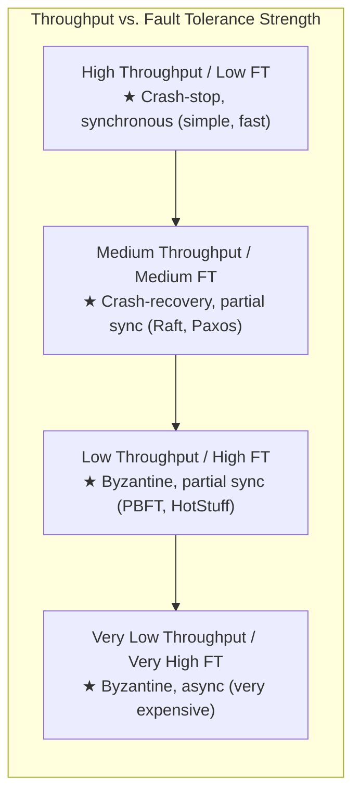

### 8.4 Latency Breakdown

For a Raft-based system (crash-recovery, partial synchrony):
```
Client request → Leader: ~1ms (network)
Leader appends to local log: ~0.1ms (memory) + ~1ms (fsync)
Leader sends AppendEntries: ~1ms (network)
Followers append + fsync: ~1ms
Followers send ACK: ~1ms
Leader commits + responds: ~0.1ms

Total: ~5ms for a committed write (WAN: 50-200ms)
```

For a PBFT-based system (Byzantine, partial synchrony):
```
Client → Primary: ~1ms
Pre-prepare broadcast: ~1ms
Prepare broadcast (n² messages): ~2ms
Commit broadcast (n² messages): ~2ms
Execute + Reply: ~1ms

Total: ~7ms for 4 nodes (grows with n²)
       ~50ms for 100 nodes
```

---

## 9. Tradeoffs

### 9.1 Model Selection Tradeoffs

| Aspect | Weaker Model (e.g., Async + Byzantine) | Stronger Model (e.g., Sync + Crash-stop) |
|--------|---------------------------------------|------------------------------------------|
| **Safety** | Harder to prove, but robust | Easy to prove, but fragile |
| **Liveness** | May be impossible (FLP) | Easily achievable |
| **Performance** | Low (BFT overhead) | High (simple protocols) |
| **Complexity** | Very high | Low |
| **Cost** | More replicas (3f+1 vs 2f+1) | Fewer replicas needed |
| **Realism** | Matches hostile environments | Matches controlled environments |

### 9.2 When to Use Which Model

| Scenario | Recommended Model | Why |
|---------|-------------------|-----|
| Internal microservices in a data center | Crash-recovery + partial sync | Trust your own nodes, need fast consensus |
| Cross-data-center replication | Crash-recovery + async | Can't guarantee timing across WANs |
| Blockchain / cryptocurrency | Byzantine + partial sync | Don't trust any participant |
| Flight control system | Crash-stop + synchronous | Hard real-time, certified hardware |
| Multi-tenant cloud service | Omission + partial sync | Tenants may be noisy neighbors |
| Financial trading | Crash-recovery + synchronous | Low latency, controlled hardware |

### 9.3 The Cost of Byzantine Fault Tolerance

BFT is expensive. Here's why most systems don't use it:

1. **More replicas**: 3f+1 vs 2f+1 for crash tolerance. To tolerate 2 faults:
   - Crash: 5 nodes
   - Byzantine: 7 nodes
   - That's 40% more hardware.

2. **More messages**: O(n²) vs O(n) per operation. For 7 nodes:
   - Crash (Raft): ~7 messages per operation
   - Byzantine (PBFT): ~49 messages per operation

3. **Cryptographic overhead**: Every message must be signed and verified.
   - RSA signature: ~0.5ms
   - Ed25519 signature: ~0.05ms
   - With n² messages and n nodes, this adds up.

4. **Complexity**: BFT protocols have subtle bugs. The PBFT paper itself had errors that were found years later.

### 9.4 The Failure Detector Tradeoff

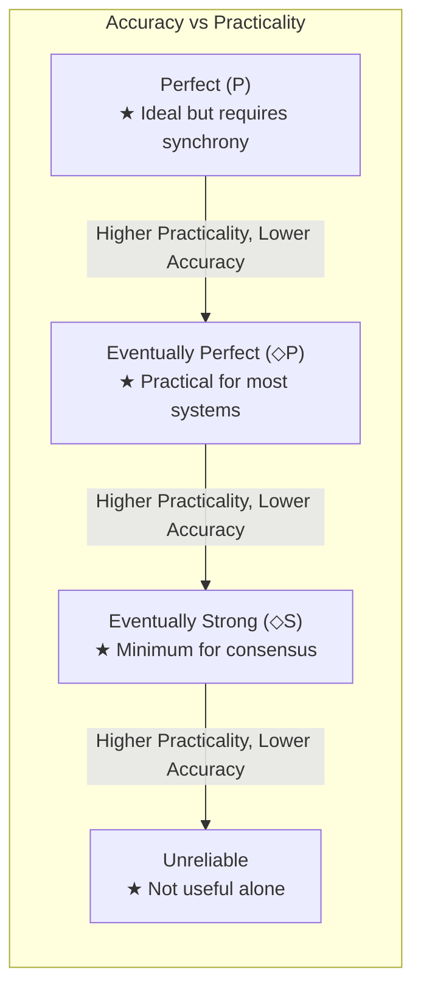

- **Stronger failure detectors** require stronger timing assumptions.
- **Weaker failure detectors** are easier to implement but harder to build upon.
- **The sweet spot** for most systems: Eventually Perfect (◇P) — equivalent to timeout-based detection with adaptive timeouts.

---

## 10. Failure Scenarios

### 10.1 Split Brain Due to Incorrect Failure Detection

**Scenario**: In a 3-node Raft cluster, the leader (Node A) experiences a long GC pause. Nodes B and C suspect A has crashed and elect B as the new leader. When A's GC pause ends, both A and B think they're the leader.

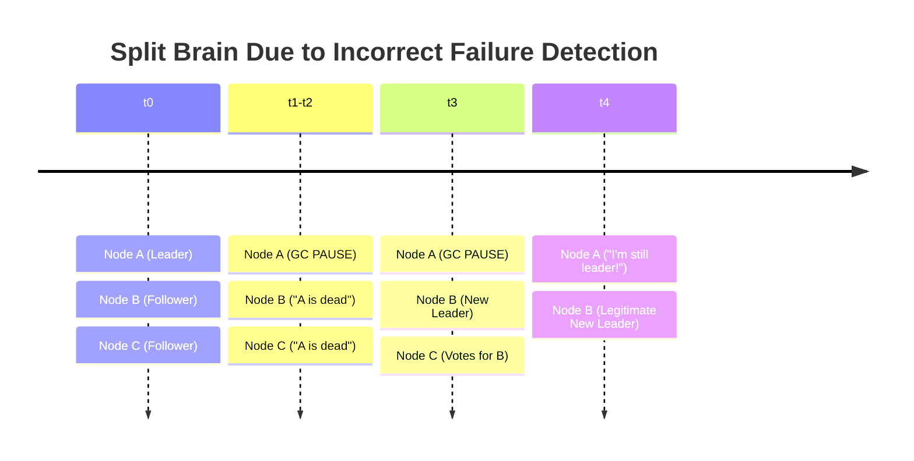

**Solution**: 
- Leader leases: A only serves reads if its lease hasn't expired.
- Fencing tokens: All writes carry a monotonically increasing token. The storage layer rejects writes with old tokens.
- Raft's term mechanism: A's term is lower than B's. When A contacts anyone, it discovers the higher term and steps down.

### 10.2 Byzantine Failure in a Non-BFT System

**Scenario**: A node in a 3-node Raft cluster has a memory corruption (bit flip). It acknowledges entries it never actually stored. The leader commits entries based on this false acknowledgment. When the leader crashes, the corrupted follower becomes leader and doesn't have the "committed" entries.

```
Node A (Leader):  "Commit entry 42" (has ACKs from B and C)
Node B (corrupted): ACKed entry 42 but actually stored garbage
Node C (follower): Stored entry 42 correctly

A crashes. Election:
  - If B wins: Entry 42 is lost! B never had it.
  - If C wins: Entry 42 is preserved.
  
With n=3 and assuming crash-stop, losing 1 node and having 1 corrupted
leaves only 1 correct copy. System integrity is compromised.
```

**Solution**:
- Checksums on all stored data (detect corruption).
- End-to-end verification of acknowledged data.
- Use BFT protocols if you need to tolerate this.
- In practice: run more replicas (5 instead of 3) and verify data integrity periodically.

### 10.3 FLP in Action: Oscillating Leaders

**Scenario**: Two nodes keep electing themselves as leader, but each election causes the other to time out and start a new election. The system never makes progress.

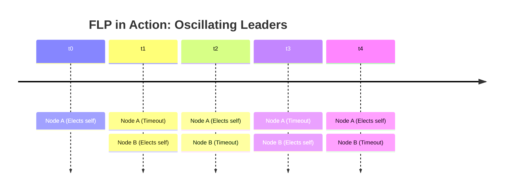

**This is FLP in action**: The system is live (both nodes are running) but it never reaches consensus on a leader. 

**Solutions**:
- **Randomized timeouts** (Raft): Each node picks a random election timeout, reducing the probability of simultaneous elections.
- **Pre-vote** (Raft optimization): Before starting an election, check if you'd actually win, preventing unnecessary elections.
- **Stable leaders** (Multi-Paxos): Once elected, a leader stays in charge until it actually fails.

### 10.4 Network Partition with State Divergence

**Scenario**: A 5-node cluster partitions into {A, B} and {C, D, E}. The minority partition {A, B} can't form a majority and stops serving writes. But if A was the leader, it might still serve stale reads for a short time.

```
Partition:  {A, B}    ||    {C, D, E}
            2 nodes   ||    3 nodes (majority)
            
{A, B}: Can't commit new writes (no majority)
        A may serve stale reads during leader lease
        After lease expires: completely unavailable

{C, D, E}: Elects new leader (has majority)
            Continues serving reads and writes
            
After partition heals:
  A and B must catch up with C, D, E
  Any clients connected to A/B see a gap
```

### 10.5 Two Generals in Production: Payment Double-Charge

**Scenario**: Your service sends a charge request to a payment provider. The response is lost due to a network timeout. 

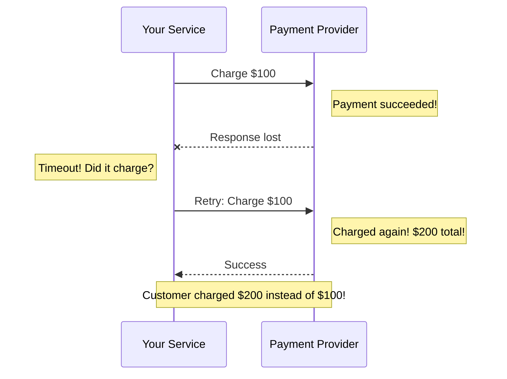

**Solution**: 
- Use an **idempotency key** with each payment request.
- The payment provider deduplicates requests with the same idempotency key.
- This doesn't solve the Two Generals Problem (you still don't know if the first charge went through), but it makes retry safe.

---

## 11. Debugging & Observability

### 11.1 Key Metrics for System Model Monitoring

```java
/**
 * Metrics collection for distributed system model monitoring.
 * These metrics help operators understand which failure model
 * the system is actually experiencing.
 */
public class SystemModelMetrics {

    // Network Model Metrics
    private final Counter messagesSent;
    private final Counter messagesDelivered;
    private final Counter messagesLost;
    private final Counter messagesDuplicated;
    private final Histogram messageLatencyMs;
    
    // Timing Model Metrics
    private final Histogram heartbeatIntervalMs;
    private final Counter timeoutEvents;
    private final Gauge clockDriftMs;
    
    // Failure Model Metrics
    private final Counter nodeCrashes;
    private final Counter nodeRecoveries;
    private final Counter falseFailureDetections;
    private final Counter byzantineEventsDetected;
    private final Gauge suspectedNodeCount;

    public SystemModelMetrics(MeterRegistry registry) {
        // Network
        this.messagesSent = registry.counter("network.messages.sent");
        this.messagesDelivered = registry.counter("network.messages.delivered");
        this.messagesLost = registry.counter("network.messages.lost");
        this.messagesDuplicated = registry.counter("network.messages.duplicated");
        this.messageLatencyMs = registry.histogram("network.latency.ms");
        
        // Timing
        this.heartbeatIntervalMs = registry.histogram("timing.heartbeat.interval.ms");
        this.timeoutEvents = registry.counter("timing.timeout.events");
        this.clockDriftMs = registry.gauge("timing.clock.drift.ms");
        
        // Failures
        this.nodeCrashes = registry.counter("failure.node.crashes");
        this.nodeRecoveries = registry.counter("failure.node.recoveries");
        this.falseFailureDetections = registry.counter("failure.false.detections");
        this.byzantineEventsDetected = registry.counter("failure.byzantine.detected");
        this.suspectedNodeCount = registry.gauge("failure.suspected.nodes");
    }

    /**
     * Dashboard queries (Prometheus/Grafana):
     * 
     * Message Loss Rate:
     *   rate(network_messages_lost[5m]) / rate(network_messages_sent[5m])
     * 
     * P99 Message Latency:
     *   histogram_quantile(0.99, network_latency_ms)
     * 
     * False Positive Rate:
     *   rate(failure_false_detections[1h]) / rate(timing_timeout_events[1h])
     * 
     * Node Availability:
     *   1 - (failure_suspected_nodes / total_nodes)
     * 
     * Recovery Time:
     *   rate(failure_node_recoveries[5m]) > 0 
     *   → check recovery_duration_ms histogram
     */
}
```

### 11.2 Diagnosing System Model Violations

| Symptom | Likely Model Violation | How to Diagnose |
|---------|----------------------|-----------------|
| Leader elections happening too often | Timing model violation (timeouts too aggressive) | Check `heartbeat_interval_ms` histogram, look for GC pauses |
| Data inconsistency across replicas | Byzantine failure or bug | Compare checksums, check WAL integrity |
| Operations timing out but succeeding | Network omission (ACK lost, not request) | Check idempotency key hits, audit logs |
| Split brain (two leaders) | Failure detector too aggressive | Check `false_failure_detections` counter |
| Slow convergence after partition | Recovery protocol issue | Check `node_recovery_duration_ms` |

### 11.3 Logging Best Practices for Distributed Systems

```java
/**
 * Structured logging for distributed system events.
 * Each log entry includes enough context to reconstruct the system model.
 */
public class DistributedSystemLogger {

    private static final Logger log = LoggerFactory.getLogger("dist-sys");

    /**
     * Log a failure detection event with full context.
     */
    public static void logFailureDetection(
            String suspectedNode,
            String detectorNode, 
            long lastHeartbeatAgeMs,
            long timeoutMs,
            double phiValue,
            boolean isFalsePositive) {
        
        log.warn("FAILURE_DETECTED node={} detector={} " +
                "heartbeat_age_ms={} timeout_ms={} phi={} " +
                "false_positive={} model=crash_suspected",
                suspectedNode, detectorNode,
                lastHeartbeatAgeMs, timeoutMs, 
                String.format("%.2f", phiValue),
                isFalsePositive);
    }

    /**
     * Log a network partition event.
     */
    public static void logPartition(
            Set<String> reachableNodes,
            Set<String> unreachableNodes,
            String detectorNode) {
        
        log.error("NETWORK_PARTITION detector={} reachable={} unreachable={} " +
                "model=fair_loss_violated",
                detectorNode, reachableNodes, unreachableNodes);
    }

    /**
     * Log a Byzantine behavior detection.
     */
    public static void logByzantine(
            String suspectedNode,
            String reason,
            String evidence) {
        
        log.error("BYZANTINE_DETECTED node={} reason={} evidence={} " +
                "model=byzantine_failure",
                suspectedNode, reason, evidence);
    }
}
```

### 11.4 Distributed Tracing for Model Verification

```
Trace ID: abc-123-def
Span 1: Client Request → Leader (Node A)
  ├─ Timestamp: 2024-01-15T10:00:00.000Z
  ├─ Duration: 5ms
  └─ Tags: {role=leader, term=42}

Span 2: Leader → Follower Replication (Node B)
  ├─ Timestamp: 2024-01-15T10:00:00.005Z
  ├─ Duration: 3ms (network: 1ms, fsync: 2ms)
  └─ Tags: {role=follower, ack=true}

Span 3: Leader → Follower Replication (Node C)
  ├─ Timestamp: 2024-01-15T10:00:00.005Z
  ├─ Duration: TIMEOUT (10000ms)
  └─ Tags: {role=follower, ack=false, suspected=true}
  
Analysis:
  - Network model: Node C link appears to be fair-loss (or node crashed)
  - Timing model: 10s timeout suggests partial synchrony
  - Failure model: Node C suspected of crash-stop
```

---

## 12. Interview Questions

### Beginner Level

**Q1: What is a system model in distributed computing, and why do we need one?**

**Expected Answer**: A system model defines the assumptions about how processes behave, how the network operates, and what timing guarantees exist. We need models because:
1. They give us a shared vocabulary to discuss system behavior.
2. They let us prove algorithm correctness under specific conditions.
3. They help us understand exactly when our system will fail.
4. Without models, we can't distinguish between "works most of the time" and "provably correct."

**Q2: Explain the difference between crash-stop and crash-recovery failure models.**

**Expected Answer**: 
- **Crash-stop**: A node stops executing permanently. It never comes back. Other nodes must tolerate its permanent absence. Example: a VM that's terminated.
- **Crash-recovery**: A node may crash but can restart. Upon recovery, it has access to data it wrote to stable storage (disk) but loses volatile state (RAM). Example: a server that reboots after a power outage.

The key difference is that crash-recovery algorithms must handle nodes that rejoin the cluster with partial state. They typically use write-ahead logs to reconstruct state after a crash.

**Q3: What is the Two Generals Problem?**

**Expected Answer**: Two generals must coordinate an attack, communicating only through messengers that may be captured. The problem proves that it's impossible to guarantee agreement over an unreliable communication channel. No matter how many confirmations are sent, the last message is always uncertain. This is fundamental because it shows why operations like TCP connection teardown use heuristics (TIME_WAIT) rather than perfect agreement, and why payment systems use idempotency keys.

### Intermediate Level

**Q4: Explain the FLP impossibility theorem and its practical implications.**

**Expected Answer**: FLP (Fischer, Lynch, Paterson, 1985) proves that **no deterministic protocol can guarantee consensus in an asynchronous system even with just one crash failure**. 

The key insight is that in an asynchronous system, you can't distinguish a slow process from a crashed one. An adversary can always delay messages to keep the system in an undecided state.

Practical implications:
1. We can't have *both* safety *and* liveness with deterministic algorithms in async systems.
2. This is why Paxos/Raft need timeouts (partial synchrony) for liveness.
3. This is why blockchains use randomization (PoW) to circumvent FLP.
4. FLP is *not* a practical obstacle — it's a theoretical limit that we work around with reasonable assumptions.

**Q5: How does a Phi Accrual failure detector work, and why is it better than a simple timeout?**

**Expected Answer**: A Phi Accrual detector outputs a continuous suspicion level (φ) instead of a binary yes/no. It maintains a sliding window of heartbeat inter-arrival times, computes their statistical distribution, and calculates the probability that the current silence indicates failure.

φ = -log₁₀(1 - CDF(timeSinceLastHeartbeat))

Advantages over simple timeout:
1. **Adaptive**: Automatically adjusts to network conditions. No manual timeout tuning.
2. **Probabilistic**: Operators can set different φ thresholds for different use cases (φ=8 for leader election, φ=12 for permanent removal).
3. **Fewer false positives**: Accounts for natural variation in heartbeat timing.
4. Used by Cassandra and Akka in production.

**Q6: Why does Byzantine fault tolerance require n ≥ 3f+1 nodes?**

**Expected Answer**: Intuition: With f Byzantine nodes that can lie:
1. You need enough honest nodes to outvote the Byzantine ones: f+1 honest nodes must agree.
2. But you don't know which nodes are honest.
3. When you receive 2f+1 messages with the same value, at least f+1 must be from honest nodes (since at most f are Byzantine).
4. To ensure you *can* receive 2f+1 messages even if f nodes are silent, you need n ≥ 3f+1.

Formally: Two quorums of size 2f+1 must intersect in at least f+1 nodes (so at least one honest node is in both quorums). This requires n ≥ 3f+1.

### Advanced Level

**Q7: Explain PBFT's three-phase protocol and why each phase is necessary.**

**Expected Answer**:
1. **Pre-prepare**: The primary assigns a sequence number to a request and broadcasts it. This prevents a Byzantine primary from assigning different sequence numbers to the same request for different replicas. Replicas check that the assignment is consistent.

2. **Prepare**: Each replica that accepts the pre-prepare multicasts a PREPARE. When a replica receives 2f matching PREPAREs (plus its own), it has a "prepared certificate." This means 2f+1 nodes agree on the ordering, so a Byzantine primary can't cause disagreement.

3. **Commit**: After being prepared, a replica multicasts COMMIT. When it receives 2f+1 matching COMMITs, the decision is durable across view changes. Without the commit phase, a view change could lose a prepared decision (because prepared certificates might not be in the new view's quorum).

Without pre-prepare: Byzantine primary can equivocate.
Without prepare: Ordering not agreed upon.
Without commit: Decisions not preserved across view changes.

**Q8: How does Google Spanner use TrueTime to provide external consistency, and what system model assumptions does this rely on?**

**Expected Answer**: Spanner assumes:
- Partially synchronous network (within and across data centers)
- Crash-recovery failure model (Paxos groups)
- **Bounded clock uncertainty** (via TrueTime)

TrueTime provides an interval [earliest, latest] guaranteed to contain the true time. The uncertainty is ~7ms (using GPS + atomic clocks).

For external consistency (linearizability): When committing a transaction at timestamp t, Spanner waits until TT.after(t) is true — meaning the true time has definitely passed t. This ensures that if T1 commits before T2 starts, T1 gets a lower timestamp.

This relies on:
1. Hardware investment (GPS receivers, atomic clocks in every data center).
2. Clock uncertainty being bounded (not Byzantine).
3. The wait time being proportional to clock uncertainty (tradeoff: lower uncertainty = lower latency).

Without TrueTime, CockroachDB uses NTP (uncertainty ~100-500ms), resulting in higher commit latency.

**Q9: Design a failure detector for a system where nodes can experience both crash and omission failures.**

**Expected Answer**: The key challenge is distinguishing between a crashed node and one experiencing omission failures.

Approach: **Indirect probing** (similar to SWIM protocol):
1. Node A sends a heartbeat to Node B. No response after timeout.
2. Before suspecting B, A asks k random nodes (C, D, E) to probe B.
3. If any of C, D, E get a response from B, B is alive (was just having send-omission to A).
4. If none of C, D, E get a response, B is more likely crashed.

This reduces false positives from omission failures because it's unlikely that B has omission failures on all links simultaneously.

Additional features:
- Adaptive timeout based on observed latency distribution (Phi Accrual).
- Exponential backoff on suspicion announcements.
- Distinction between "suspect" (temporary) and "confirmed dead" (after multiple rounds of indirect probing fail).

### FAANG-Level

**Q10: You're designing a global financial trading system. What system model do you choose, and how do you handle the tradeoffs?**

**Expected Answer**:

**Model choice**:
- **Failure model**: Crash-recovery (nodes have persistent logs) with optional Byzantine detection (checksums, auditing) for regulatory compliance.
- **Timing model**: Partially synchronous — we need bounded latency for trading, but network delays happen.
- **Network model**: Fair-loss links with strong retry mechanisms.

**Key tradeoffs**:
1. **Latency vs. durability**: Use synchronous replication for critical paths (trade execution) and async for non-critical (reporting). Accept higher latency for safety.

2. **Consistency vs. availability**: CP choice — we'd rather reject an order than execute it incorrectly. Use Raft/Paxos with leader leases for strong consistency.

3. **Byzantine tolerance**: Full BFT is too expensive for performance-critical trading. Instead:
   - Use checksums and MACs on all messages.
   - Implement audit trails for post-hoc Byzantine detection.
   - Use separate validation services that verify trade consistency.

4. **Failure detection**: Phi Accrual detector with aggressive thresholds (φ=4). Accept some false positives (unnecessary failovers) over missed real failures. Each failover costs ~100ms; a missed failure costs regulatory penalties.

5. **Partition handling**: In a partition, the minority side refuses all trades (CP). The majority side continues. After partition heals, reconcile using the total order from the consensus log.

---

## 13. Exercises

### Exercise 1: Conceptual — Model Classification (Beginner)

For each of the following real-world scenarios, identify the most appropriate:
- Network model (reliable, fair-loss, arbitrary)
- Timing model (synchronous, partially synchronous, asynchronous)
- Failure model (crash-stop, crash-recovery, Byzantine, omission)

Scenarios:
1. A 3-node ZooKeeper ensemble in a single data center rack.
2. A blockchain network with anonymous participants worldwide.
3. A Mars rover communicating with Earth (signal delay: 3-22 minutes).
4. A microservice mesh using gRPC within a Kubernetes cluster.
5. A multi-player online game with players on different continents.

### Exercise 2: Coding — Implement a SWIM-style Failure Detector (Intermediate)

Implement a failure detector based on the SWIM protocol:
1. Each round, pick a random node to probe directly.
2. If no ACK within timeout, pick k random nodes to probe on your behalf (indirect probe).
3. If indirect probes also fail, suspect the node.
4. Suspected nodes are marked as "alive" if they respond to future probes.
5. Use gossip to disseminate membership updates.

Requirements:
- Support adding/removing nodes dynamically.
- Track suspicion count — after N failed probes, declare node dead.
- Expose metrics: probe latency, false positive rate, detection time.

### Exercise 3: System Design — Design a BFT Key-Value Store (Advanced)

Design a Byzantine fault-tolerant key-value store:

Requirements:
- Linearizable reads and writes.
- Tolerate f=1 Byzantine faults (so n=4 replicas).
- Client library that sends requests and waits for f+1 matching replies.
- View change protocol when the primary is suspected.
- Checkpoint protocol for garbage collection.

Deliverables:
1. Architecture diagram (Mermaid).
2. Message format definitions.
3. Normal-case protocol pseudocode.
4. View change protocol pseudocode.
5. Java implementation of the client library.

### Exercise 4: Proof — FLP Impossibility (Expert)

Work through the FLP impossibility proof:

1. Define a "bivalent" configuration formally.
2. Show that there exists an initial bivalent configuration.
3. Show that from any bivalent configuration, there exists a step that leads to another bivalent configuration.
4. Conclude that the protocol can never terminate.

Bonus: Explain why adding randomization (e.g., coin flips) breaks this argument.

### Exercise 5: Analysis — Failure Detector Tuning (Intermediate)

Given the following heartbeat data from a production system:

```
Heartbeat inter-arrival times (ms): 
100, 102, 98, 105, 99, 101, 97, 103, 100, 250, 101, 99, 100, 98, 
103, 101, 100, 500, 99, 102, 100, 101, 99, 98, 100, 103, 100
```

1. Calculate the mean and standard deviation.
2. At what timeout would a simple timeout detector have 0 false positives? What's the detection latency for a real crash?
3. Calculate the Phi value at time = 200ms after the last heartbeat, time = 300ms, time = 500ms.
4. If the Phi threshold is 8, at what time after the last heartbeat would the node be suspected?
5. Recommend timeout/threshold settings and justify your choices.

---

## 14. Expert Insights

### 14.1 Hidden Complexities

**"Partial synchrony is not what you think."** Many engineers assume partial synchrony means "usually fast, sometimes slow." The formal definition is much stronger: there exists an unknown time GST after which the system is synchronous. The algorithm doesn't know when GST occurs, and there are NO guarantees before GST. This means before GST, the adversary has complete control over message scheduling. Your algorithm must maintain safety during this adversarial period.

**"Crash-recovery is harder than it looks."** The subtle issue is the order of operations: write to stable storage THEN send the message, or send THEN write? If you write then send, and crash between the two, you've committed but the world doesn't know. If you send then write, and crash between, you've told the world but haven't committed. Both orderings have failure cases, and your protocol must handle both.

**"Byzantine failures are more common than you think."** Most engineers dismiss Byzantine failures as "only for blockchain." But in practice:
- Memory bit flips (cosmic rays) are a real thing at scale. Google reported 1 bit flip per GB of RAM per 1.5 years.
- Software bugs can cause Byzantine behavior — a node might send conflicting messages due to a race condition.
- Version skew between nodes in a rolling deployment can look Byzantine.
- Human operators issuing incorrect commands is Byzantine behavior.

### 14.2 Industry Lessons

**Amazon's lesson (Dynamo paper, 2007)**: "Customers should be able to add items to their shopping cart even when parts of the infrastructure are unavailable." This drove Amazon to choose an asynchronous + crash-recovery model with eventual consistency. The business requirement (availability) drove the model choice, not vice versa.

**Google's lesson (Spanner paper, 2012)**: "Engineers find it much easier to reason about systems that provide strong consistency." Despite the higher latency cost, Google chose strong consistency because programmer productivity matters at scale. The model choice (partially synchronous + crash-recovery with TrueTime) was driven by the human cost of debugging inconsistencies.

**Netflix's lesson (Chaos Engineering)**: "You don't really understand your failure model until you test it in production." Netflix discovered that their theoretical model (crash-stop for instances, omission for services) was incomplete — cascading failures, retry storms, and resource exhaustion created emergent failure modes that weren't in any model.

### 14.3 Scaling Pain Points

**Failure detector at 10,000 nodes**: All-to-all heartbeats (O(n²) messages) don't scale past ~100 nodes. Solutions:
- SWIM protocol: O(n) messages per round, O(log n) detection time.
- Hierarchical failure detection: Group nodes, detect within groups, then across groups.
- Gossip-based dissemination: Piggyback failure information on gossip messages.

**BFT at scale**: PBFT's O(n²) message complexity limits it to ~20-100 nodes. Modern BFT protocols:
- HotStuff (2019): O(n) messages using threshold signatures. Used by Meta's (now discontinued) Diem/Libra.
- Tendermint: O(n²) but optimized for blockchain use cases (~200 validators).
- Narwhal/Bullshark: DAG-based BFT with high throughput (>100K TPS with 50 nodes).

**Clock synchronization at global scale**: NTP gives ~10-100ms accuracy. For Spanner-like systems, you need better:
- GPS: ~1μs accuracy, but requires hardware and sky visibility.
- PTP (Precision Time Protocol): ~1μs over LAN, requires hardware support.
- Atomic clocks: ~1μs, very expensive.
- Hybrid: GPS + atomic clock (Spanner's approach) gives ~7ms bounded uncertainty.

### 14.4 When NOT to Use Certain Models

- **Don't use Byzantine model** when all nodes are under your control, in your data center, running your code. The overhead isn't justified. Use checksums and audit logs instead.
- **Don't assume synchronous model** unless you have hardware-level guarantees (RTOS, CAN bus). Even a "fast" LAN can have GC pauses, packet retransmissions, and switch failures.
- **Don't use crash-stop** if your nodes have persistent storage. You're leaving fault tolerance on the table. Crash-recovery lets you recover with less data replication.
- **Don't ignore omission failures** just because you're using TCP. Application-level message queues can overflow, TCP connections can be reset, and timeout-driven retries can be misrouted.

### 14.5 Common Mistakes Engineers Make

1. **Confusing safety and liveness**: "Our system is eventually consistent, so it's safe." No — eventual consistency is a liveness property. Safety would be "reads never return values from the future" or "writes are never lost."

2. **Assuming TCP = reliable links**: TCP provides reliable *byte streams*, but TCP connections can be reset, and application-level messages can be lost between TCP delivery and application processing.

3. **Using fixed timeouts in production**: A fixed 5-second timeout works in development but fails in production under load, during GC, or during network congestion. Always use adaptive timeouts.

4. **Designing for crash-stop when nodes actually recover**: If your crashed node comes back with stale state and starts participating, your crash-stop algorithm can't handle it. This is how split-brain scenarios start.

5. **Ignoring Byzantine failures in critical systems**: "We trust all our nodes" is fine until a disk silently corrupts data, a misconfigured node sends wrong responses, or an operator makes an error.

---

## 15. Chapter Summary

### Key Concepts

- **System models** define the assumptions about processes, networks, and timing in a distributed system. They are the foundation for proving algorithm correctness.

- **Network models**: Reliable links (perfect delivery), fair-loss links (some messages lost), arbitrary links (anything can happen including fabrication).

- **Timing models**: Synchronous (known bounds), partially synchronous (bounds exist after unknown GST), asynchronous (no bounds at all).

- **Failure models** form a hierarchy:
  - **Crash-stop**: Permanent, silent failure.
  - **Crash-recovery**: Temporary failure with durable state.
  - **Omission**: Messages silently dropped.
  - **Timing**: Responses outside expected bounds.
  - **Byzantine**: Arbitrary, potentially malicious behavior.

- **FLP impossibility**: Deterministic consensus is impossible in asynchronous systems with even one crash failure. Workarounds: partial synchrony, randomization, failure detectors.

- **Two Generals Problem**: Perfect agreement over unreliable communication is impossible. Practical solutions: idempotency keys, at-least-once delivery, compensating transactions.

- **Byzantine Generals Problem**: Agreement with traitors requires n ≥ 3f+1 nodes (without signatures) or n ≥ 2f+1 (with signatures).

- **PBFT**: First practical BFT protocol. Three phases (pre-prepare, prepare, commit), O(n²) messages, works in partial synchrony.

- **Failure detectors**: Abstraction for handling process failures. Ranges from Perfect (P) to Eventually Strong (◇S). Phi Accrual provides continuous suspicion levels.

- **Safety vs. Liveness**: Safety = "bad things never happen" (must hold always). Liveness = "good things eventually happen" (may require timing assumptions). Most systems prioritize safety over liveness.

### Decision Framework

```
1. What's your trust model?
   → Trusted nodes: crash-stop or crash-recovery
   → Untrusted nodes: Byzantine

2. What are your timing guarantees?
   → Hard real-time: synchronous
   → Best-effort: partially synchronous
   → No guarantees: asynchronous (limited by FLP)

3. What's your priority?
   → Correctness: prioritize safety, accept liveness limitations
   → Availability: accept eventual consistency, implement conflict resolution

4. What's your scale?
   → Small (3-7 nodes): PBFT, Raft, Paxos work well
   → Medium (10-100): Raft, Paxos, optimized BFT
   → Large (100+): Need hierarchical/gossip-based protocols
```

### One-Line Takeaway

> **Choose your system model carefully — it determines what your algorithms can guarantee, what failures they can tolerate, and what your system cannot do.**

---

*Next Chapter: [Chapter 6 — CAP Theorem](./Chapter-06-CAP-Theorem.md) — Where we explore the fundamental tradeoff between consistency, availability, and partition tolerance.*
