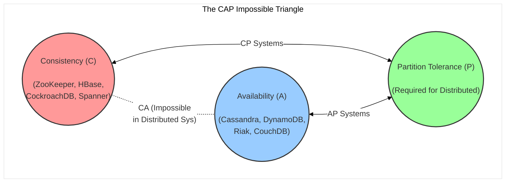
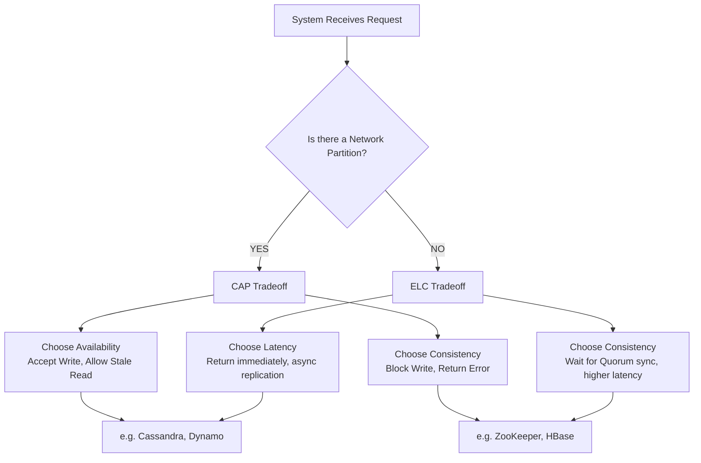
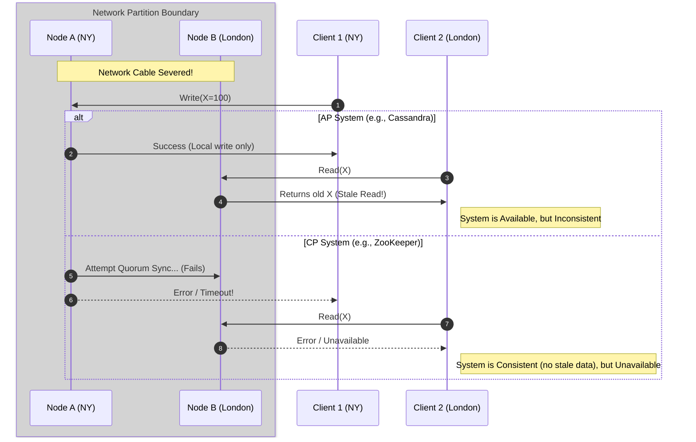
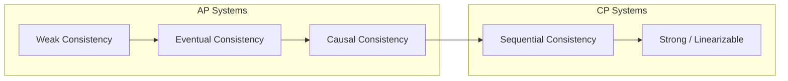

# Chapter 6: The CAP Theorem and Consistency Tradeoffs

## 1. Why This Matters

If you remember only one concept from the entire field of distributed systems, it must be the CAP Theorem. It is the fundamental impossibility result that governs how data behaves when it is spread across a network.

In a single-node system, life is simple. You write data to a hard drive; if the hard drive is working, you can immediately read that data back. If the computer crashes, the system is down, and nobody can read or write. There is no ambiguity. The system is either completely available or completely broken, and when it is available, the data is always consistent.

However, modern systems cannot run on a single machine. The scale of the internet demands that data be replicated across multiple machines, multiple data centers, and even multiple continents to ensure high performance, survivability during disasters, and capacity scaling. 

As soon as you split data across a network, a harsh reality sets in: **networks are unreliable**. Packets get dropped, switches crash, fiber optic cables are accidentally severed by construction equipment, and routers become overloaded. When a network fails and your machines can no longer talk to each other, you face an unavoidable architectural choice:
1. Do you continue to accept reads and writes on the disconnected machines, risking that they diverge and show users conflicting information?
2. Or do you halt operations on some (or all) machines until the network heals, guaranteeing data correctness but causing an outage for your users?

This is the essence of the CAP Theorem. It proves mathematically that you cannot have a distributed database that guarantees perfect consistency, perfect availability, and complete resilience to network partitions all at the same time. You must choose. 

This choice dictates the entire architecture of a distributed database. It determines whether a system is suitable for an e-commerce shopping cart, a banking ledger, a social media timeline, or a real-time multiplayer game. Understanding CAP and its nuances (like the PACELC theorem and the Consistency Spectrum) is the difference between an architect who builds robust, predictable systems and one who builds systems that silently corrupt user data or suffer catastrophic outages when a network switch blinks.

---

## 2. Beginner Intuition

To truly understand CAP, forget about servers and networks for a moment. Let’s imagine a real-world scenario involving human beings.

### The "Two-Branch Bank" Analogy

Imagine you are the CEO of a small bank, "Reliable Bank," which has exactly two branches: Branch A in New York and Branch B in London. To provide excellent customer service, you promise your customers two things:
1. **Consistency:** If a customer deposits money in New York, they can immediately walk into the London branch and see that updated balance.
2. **Availability:** The bank is always open, 24/7, and will always process transactions immediately.

To make this work, you give the branch managers a dedicated, direct telephone line. Whenever a customer deposits money in New York, the New York manager tells the customer, "Please wait a moment," picks up the phone, calls London, and says, "Update Alice's account to add $100." Only after London confirms the update does New York tell the customer, "Your deposit is complete."

This system works perfectly—until a storm severs the telephone line between New York and London. 

This severed telephone line is a **Network Partition (P)**. You, as the CEO, cannot prevent storms. The partition has happened. Now, a customer walks into the New York branch and wants to deposit $100. 

Because the managers cannot communicate, the New York manager must make a choice. They only have two options:

**Option 1: The CP Choice (Consistency over Availability)**
The New York manager tells the customer, "I'm sorry, our communication line to London is down. I cannot accept your deposit right now because if I do, the London branch won't know about it, and your balance will be inconsistent."
* **Result:** You maintained perfect **Consistency (C)** (neither branch has wrong information), but you sacrificed **Availability (A)** (the customer was turned away).

**Option 2: The AP Choice (Availability over Consistency)**
The New York manager says, "No problem, I will take your $100." They write it down in their local ledger. However, London does not know about this. If the customer's spouse walks into the London branch five minutes later and asks for the balance, London will report the old balance.
* **Result:** You maintained perfect **Availability (A)** (the customer's request was processed), but you sacrificed **Consistency (C)** (the two branches now have conflicting information about Alice's balance).

**The Illusion of CA:**
What if you say, "I want both Consistency and Availability"? You would have to guarantee that the telephone line *never* breaks. In the real world (and in distributed systems), you cannot guarantee the network. Therefore, **Partition Tolerance (P)** is not a choice; it is a fact of life. You must choose how your system reacts *when* a partition occurs: do you become CP or AP?

---

## 3. Core Theory

The CAP theorem states that a distributed data store cannot simultaneously guarantee more than two of the following three properties: Consistency, Availability, and Partition tolerance. 

Let's rigorously define these terms, as their specific definitions in CAP are often misunderstood.

### History
The concept was first presented as a conjecture by Dr. Eric Brewer at the Symposium on Principles of Distributed Computing (PODC) in the year 2000. It deeply influenced the NoSQL movement, giving engineers "permission" to relax consistency in exchange for extreme scalability and availability. 

In 2002, Seth Gilbert and Nancy Lynch of MIT published a formal mathematical proof of Brewer's conjecture, elevating it from a rule-of-thumb to a proven theorem in computer science.

### The Definitions

**1. Consistency (C)**
In CAP, Consistency means **Linearizability**. It means that every read receives the most recent write or an error. It requires that the system behaves as if there were only a single copy of the data, and all operations occurred instantaneously in a single, global timeline. 
* *Note:* This is entirely different from the "C" in ACID (which stands for database constraints like foreign keys or unique indices). CAP consistency is about *staleness* and *recency* of distributed state.

**2. Availability (A)**
Every non-failing node in the system returns a non-error response for every request, without guaranteeing that it contains the most recent write.
* *Crucial Detail:* To be formally "Available" under CAP, the system must respond *eventually* (meaning it cannot block indefinitely). More importantly, if a node is alive, it *must* process the request. It cannot say, "I am alive, but I am in a partitioned state, so I am refusing your read." Refusing a read is a violation of CAP Availability.

**3. Partition Tolerance (P)**
The system continues to operate despite an arbitrary number of messages being dropped, delayed, or lost by the network between nodes. 
* As a system architect, you do not "choose" partition tolerance. The network will partition. Therefore, you are forced to build a system that tolerates it, and you must decide how it behaves (C or A) when the partition occurs.

### The Gilbert-Lynch Proof Intuition
The proof relies on an asynchronous network model where messages can be delayed indefinitely. 
Imagine a simple system with two nodes, Node $N_1$ and Node $N_2$.
1. The network completely fails between $N_1$ and $N_2$. They cannot exchange messages (a Partition).
2. A client sends a `write(X = 1)` to $N_1$.
3. Since the system must be Available (A), $N_1$ must accept the write and respond "Success". $N_1$ now holds $X=1$.
4. A split-second later, another client sends a `read(X)` to $N_2$.
5. Since the system must be Available (A), $N_2$ must respond. 
6. Because the network is partitioned, $N_2$ never received the update from $N_1$. $N_2$ only knows the old value (e.g., $X=0$).
7. $N_2$ returns $X=0$.
8. The system has just returned a stale value after a successful write. **Consistency (C) is violated.**

To avoid returning $X=0$, $N_2$ would have had to block or return an error, which would violate Availability. Thus, during a partition, you cannot have both C and A. Q.E.D.

### Harvest and Yield
Eric Brewer later proposed thinking about availability in terms of **Harvest** and **Yield**:
* **Yield:** The probability of completing a request (traditional availability). "Out of 100 requests, how many succeeded?"
* **Harvest:** The fraction of the data reflected in the response. If you query a search engine and 1 out of 100 partitions is down, the system might return results from the 99 healthy partitions. The yield is 100% (the query succeeded), but the harvest is 99% (you missed 1% of the database). This is a practical way AP systems handle failures gracefully.

---

## 4. Architecture Deep Dive

How do databases actually implement CP or AP behavior internally? It radically changes the core architecture.

### AP Systems Architecture (High Availability, Eventual Consistency)
Systems like Cassandra, DynamoDB, and Riak optimize for Availability.
* **Topology:** Often peer-to-peer (no single master). Any node can accept writes.
* **Data Distribution:** Consistent Hashing is used to distribute data across a ring of nodes.
* **Replication Strategy:** "Sloppy Quorums" and asynchronous replication. When a write arrives, the coordinating node writes to whatever replicas are currently reachable.
* **Failure Handling:** If the target replica for a write is unreachable, the system performs a **Hinted Handoff**. It writes the data to a *different*, reachable node with a "hint" saying, "When node X comes back online, give this to X."
* **Conflict Resolution:** Because any node can accept writes during a partition, concurrent conflicting writes *will* happen. AP systems rely on:
  1. **Last-Write-Wins (LWW):** Using timestamps. Vulnerable to clock skew.
  2. **Vector Clocks:** Tracking causality to detect conflicts and force the client to resolve them.
  3. **CRDTs (Conflict-free Replicated Data Types):** Data structures that mathematically merge conflicting updates without data loss (e.g., a distributed counter).
* **Read Repair:** When a client reads data, the system queries multiple replicas. If it detects that some replicas have stale data, it returns the newest data to the client and asynchronously sends an update to the stale replicas to fix them.

### CP Systems Architecture (Strong Consistency, Partial Unavailability)
Systems like ZooKeeper, etcd, Spanner, and HBase optimize for Consistency.
* **Topology:** Usually Leader-Follower (Master-Slave). 
* **Data Distribution:** Sharded, but each shard has a strict designated Leader.
* **Replication Strategy:** Synchronous replication via Consensus Algorithms (Paxos, Raft, Zab).
* **Failure Handling:** To accept a write, the Leader *must* receive acknowledgments from a majority (quorum) of nodes. E.g., in a 5-node cluster, 3 nodes must agree. 
* **Partition Behavior:** If a partition separates the Leader from the majority of the cluster, the Leader steps down. It realizes it cannot form a quorum, so it stops accepting reads and writes to prevent split-brain. The system becomes Unavailable in that minority partition. Meanwhile, the majority partition elects a new Leader and continues.
* **Consistency Guarantee:** Because every write and every read goes through a rigorous quorum process or directly to the single Leader, stale reads are impossible.

### The PACELC Theorem
Daniel Abadi recognized that CAP only talks about what happens *during* a partition. But partitions are rare. What tradeoffs do systems make when the network is perfectly healthy?
He proposed **PACELC**:
* **If P** (Partition occurs): You must choose between **A** (Availability) and **C** (Consistency).
* **E**lse (Network is healthy): You must choose between **L** (Latency) and **C** (Consistency).

**PACELC breakdown:**
* **CP/EC (e.g., MongoDB with strict settings, HBase):** If partition, choose Consistency. Else, choose Consistency (which implies higher Latency, as you must wait for synchronous replication).
* **AP/EL (e.g., Cassandra, DynamoDB):** If partition, choose Availability. Else, choose Latency (serve responses extremely fast locally, replicate in the background, sacrificing Consistency).
* **CP/EL (e.g., Yahoo PNUTS):** Very rare. Give up availability during partitions, but optimize for latency during normal operations.

---

## 5. Visual Diagrams

### Diagram 1: The CAP Triangle Mapping
While it's mathematically impossible to be strictly at the CA point in a distributed system, this triangle shows the design goals of various systems.



### Diagram 2: PACELC Decision Tree



### Diagram 3: Network Partition Scenario (CP vs AP)



### Diagram 4: The Consistency Spectrum



---

## 6. Real Production Examples

### Amazon DynamoDB (AP Origins, highly configurable)
Originally birthed from the famous "Dynamo" paper, which pioneered the AP architecture. Amazon realized that if the shopping cart was unavailable, they lost millions of dollars. If the shopping cart was inconsistent (a deleted item reappeared, or a quantity was slightly off), the user would just delete it again at checkout. Availability was strictly more profitable than Consistency.
Today, DynamoDB allows you to configure reads: you can do "Eventually Consistent Reads" (AP, half the price, highly available) or "Strongly Consistent Reads" (CP, higher latency, might fail during partitions).

### Apache Cassandra (Strict AP)
Designed to handle massive write volumes across multiple data centers without ever going down. It uses tunable consistency. You can say `WRITE QUORUM` and `READ QUORUM`. If `Read nodes + Write nodes > Total Replication Factor`, you get strong consistency *assuming no partitions*. However, if a partition happens and nodes go down, you can gracefully degrade your application to `WRITE ONE` to keep the app alive (AP mode). 

### Google Spanner (The "CA" Illusion / Extremely High-Availability CP)
Google published a paper claiming Spanner is effectively CA. Technically, under CAP, it is a **CP** system. It uses Paxos for strict consistency. If a partition occurs, minority nodes stop accepting reads/writes.
However, Google controls their own fiber-optic private global network. They engineered the network so that partitions are phenomenally rare. Furthermore, they use atomic clocks and GPS receivers (TrueTime) in every data center to bound clock skew. Because network partitions almost never happen on Google's private fiber, and hardware redundancy is immense, Spanner achieves 5 nines (99.999%) of availability while maintaining strict linearizable consistency. It’s CP, but the 'P' failure is so rare that it feels CA to the user.

### Apache ZooKeeper / etcd (Strict CP)
Used for critical infrastructure coordination (e.g., "Which Kafka broker is the current leader?", "Where are the database shards located?").
If there is a network partition, it is drastically better for the system to stop and wait than to elect two different leaders (Split-Brain) which would result in data corruption. Thus, etcd and ZooKeeper require a strict majority quorum. If they lose quorum, they completely shut down availability to protect consistency.

### CockroachDB (CP)
Inspired by Spanner. Uses Raft for consensus at the range (shard) level. Guarantees Serializable transactions. If a region goes down in a multi-region deployment, reads and writes that require quorum from the downed region will stall or time out. It explicitly chooses C over A.

---

## 7. Java Implementations

Let's build a conceptual simulation demonstrating how AP and CP systems react entirely differently to a network partition. 

We will create a simple Key-Value store interface and simulate a network that can forcefully drop packets.

```java
import java.util.concurrent.*;
import java.util.concurrent.atomic.AtomicInteger;
import java.util.Map;
import java.util.HashMap;

/**
 * Chapter 6: CAP Theorem Simulation
 * This code demonstrates CP vs AP behavior under a network partition.
 */

// --- Network Simulation ---
class NetworkSimulator {
    private boolean isPartitioned = false;

    public void createPartition() {
        System.out.println("\n[NETWORK ALERT] A physical cable was severed. Partition created!");
        isPartitioned = true;
    }

    public void healPartition() {
        System.out.println("\n[NETWORK ALERT] Cable repaired. Partition healed!");
        isPartitioned = false;
    }

    public boolean canCommunicate() {
        return !isPartitioned;
    }
}

// --- Common Node Interface ---
interface DatabaseNode {
    void write(String key, String value) throws Exception;
    String read(String key) throws Exception;
}

// --- 1. The CP System (Consistency over Availability) ---
// Simulates a Leader node that requires synchronous acknowledgment from Follower.
class CPLeaderNode implements DatabaseNode {
    private final Map<String, String> dataStore = new ConcurrentHashMap<>();
    private final NetworkSimulator network;
    // Simulating the follower node that must acknowledge writes
    private final Map<String, String> followerDataStore = new ConcurrentHashMap<>();

    public CPLeaderNode(NetworkSimulator network) {
        this.network = network;
    }

    @Override
    public void write(String key, String value) throws Exception {
        System.out.println("[CP] Client attempting to write: " + key + "=" + value);
        
        // 1. Check if we can reach the quorum (follower)
        if (!network.canCommunicate()) {
            throw new Exception("CP Write Failed: Network Partition! Cannot reach quorum to guarantee consistency.");
        }
        
        // 2. Synchronous replication to follower
        followerDataStore.put(key, value); 
        
        // 3. Local commit
        dataStore.put(key, value);
        System.out.println("[CP] Write successful. Replicated across quorum.");
    }

    @Override
    public String read(String key) throws Exception {
        System.out.println("[CP] Client attempting to read: " + key);
        
        // In strict CP, even reads might require checking quorum to ensure we are still the leader
        if (!network.canCommunicate()) {
            throw new Exception("CP Read Failed: Network Partition! I might be isolated and have stale data.");
        }
        return dataStore.get(key);
    }
}

// --- 2. The AP System (Availability over Consistency) ---
// Simulates a masterless system where local writes are accepted and synced later.
class APNode implements DatabaseNode {
    private final Map<String, String> dataStore = new ConcurrentHashMap<>();
    private final NetworkSimulator network;
    private final Map<String, String> remoteReplicaDataStore = new ConcurrentHashMap<>();
    
    // Hinted handoff queue
    private final ConcurrentLinkedQueue<Runnable> pendingSyncs = new ConcurrentLinkedQueue<>();

    public APNode(NetworkSimulator network) {
        this.network = network;
        
        // Background thread to heal data when partition resolves
        Thread antiEntropy = new Thread(() -> {
            while (true) {
                try {
                    Thread.sleep(1000);
                    if (network.canCommunicate() && !pendingSyncs.isEmpty()) {
                        System.out.println("[AP Background] Network healed. Processing hinted handoffs...");
                        while(!pendingSyncs.isEmpty()) {
                            pendingSyncs.poll().run();
                        }
                    }
                } catch (InterruptedException e) { break; }
            }
        });
        antiEntropy.setDaemon(true);
        antiEntropy.start();
    }

    @Override
    public void write(String key, String value) throws Exception {
        System.out.println("[AP] Client attempting to write: " + key + "=" + value);
        
        // 1. Always accept the write locally! (High Availability)
        dataStore.put(key, value);
        
        // 2. Try to replicate, if fail, queue it (Hinted Handoff)
        if (network.canCommunicate()) {
            remoteReplicaDataStore.put(key, value);
            System.out.println("[AP] Write successful and replicated.");
        } else {
            System.out.println("[AP] Write accepted locally, but partition detected. Queuing async sync.");
            pendingSyncs.add(() -> remoteReplicaDataStore.put(key, value));
        }
    }

    @Override
    public String read(String key) throws Exception {
        System.out.println("[AP] Client attempting to read: " + key);
        // Always return local data immediately, even if partitioned (High Availability)
        // Warning: Might return stale data if we are partitioned from other writers!
        return dataStore.get(key);
    }
    
    public String readRemote(String key) {
        return remoteReplicaDataStore.get(key);
    }
}

// --- Main Execution ---
public class CAPSimulation {
    public static void main(String[] args) throws InterruptedException {
        NetworkSimulator network = new NetworkSimulator();
        
        CPLeaderNode cpDatabase = new CPLeaderNode(network);
        APNode apDatabase = new APNode(network);

        System.out.println("=== NORMAL OPERATION (No Partition) ===");
        try {
            cpDatabase.write("balance", "100");
            apDatabase.write("balance", "100");
        } catch (Exception e) {}

        // Uh oh, backhoe cuts the fiber line
        network.createPartition();

        System.out.println("\n=== TESTING CP SYSTEM DURING PARTITION ===");
        try {
            cpDatabase.write("balance", "200");
        } catch (Exception e) {
            System.err.println(e.getMessage()); // Will throw Exception!
        }
        try {
            cpDatabase.read("balance");
        } catch (Exception e) {
            System.err.println(e.getMessage()); // Will throw Exception!
        }

        System.out.println("\n=== TESTING AP SYSTEM DURING PARTITION ===");
        try {
            apDatabase.write("balance", "200"); // Will succeed!
            String val = apDatabase.read("balance"); // Will succeed!
            System.out.println("[AP] Read result from Node A: " + val);
            System.out.println("[AP] Read result from Node B (Remote): " + apDatabase.readRemote("balance")); 
            System.out.println("[AP] Notice the inconsistency! Node A = 200, Node B = 100.");
        } catch (Exception e) {
            System.err.println(e.getMessage());
        }

        network.healPartition();
        Thread.sleep(1500); // Wait for background AP sync
        
        System.out.println("\n=== AFTER PARTITION HEALS ===");
        System.out.println("[AP] Read result from Node B (Remote): " + apDatabase.readRemote("balance"));
    }
}
```

**Key Takeaways from the Code:**
* The CP System aggressively uses `throw new Exception()` when `!network.canCommunicate()`. It completely blocks the client to protect the sanctity of the data.
* The AP System never throws an exception on write. It uses a queue (`pendingSyncs`) to defer work, accepting that Node A and Node B will have different values temporarily.

---

## 8. Performance Analysis

The CAP theorem dictates behavior during failures, but PACELC highlights performance implications during normal operations.

### CP Systems and Latency (The 'L' in PACELC)
When you choose Consistency, you generally pay a latency penalty even when the network is healthy. 
* To commit a write, a CP system (like Raft or Paxos) must send the data to multiple nodes and wait for $N/2 + 1$ acknowledgments. 
* **Throughput:** Usually lower than AP systems. Every transaction requires cross-network coordination.
* **Tail Latency:** P99 latency is heavily impacted by the slowest node in the quorum. If Node B is doing Java Garbage Collection and pauses for 50ms, the entire quorum write is delayed by 50ms.
* **Scaling bottleneck:** The single Leader handles all writes. You can only scale writes vertically (bigger machine) or by sharding the data to multiple leaders.

### AP Systems and Latency
AP systems are designed for blistering speed.
* Because an AP system can accept a write on *any* node and return success immediately (replicating asynchronously in the background), the write latency is effectively the speed of local disk I/O.
* **Throughput:** Incredibly high. Scaling is linear; just add more nodes.
* **Tail Latency:** Very predictable and low. If a node is slow, the client library automatically routes requests to a faster replica (Hedging requests).
* **Cost:** AP systems often consume more background network bandwidth and CPU (for read repairs, anti-entropy, and Merkle tree calculations) to constantly fix data divergence.

---

## 9. Tradeoffs

Designing a system requires mapping business requirements to CAP tradeoffs. 

### When to choose CP (Consistency)
**Use Cases:** Banking ledgers, billing systems, inventory management, distributed locks.
**Pros:** 
- The developer experience is identical to a single SQL database. You write data, you read it, it’s correct. 
- You never have to write complex business logic to resolve conflicts.
**Cons:**
- An outage in the data center or a network switch failure translates directly into user-facing downtime. 
- Multi-region setups have high write latency (speed of light between regions).

### When to choose AP (Availability)
**Use Cases:** Social media timelines, IoT sensor data, shopping carts, analytics metrics, messaging systems.
**Pros:**
- Extreme resilience. A whole rack of servers can catch fire, and the system won't drop a single user request.
- Very fast, localized response times, making it excellent for multi-continent deployments.
**Cons:**
- Application developers must handle data anomalies. You might read an old value. You might get "ghost" records.
- Conflict resolution is hard. If two users edit the same profile simultaneously during a partition, how do you merge the results? (Last-Write-Wins implies data loss for one user).

---

## 10. Failure Scenarios

What actually happens when things break?

**1. The Split Brain Scenario**
Imagine a 2-node cluster without a tie-breaker. The network partitions. Node A thinks Node B is dead. Node B thinks Node A is dead. If the system is misconfigured to promote both to Leader, they both accept independent writes. When the network heals, the databases have completely diverged. This is catastrophic data corruption. (This is why CP systems require an odd number of nodes—3, 5, or 7—so a strict majority can always be established).

**2. Asymmetric Partitions**
Network failures are rarely clean. Often, Node A can talk to Node B, and Node B can talk to Node C, but Node A *cannot* talk to Node C. This breaks consensus algorithms that assume symmetric connectivity. Advanced CP systems (like Raft) implement specific pre-vote phases to handle this gracefully without causing endless leader election thrashing.

**3. Retry Storms (Cascading Failures in CP)**
When a partition occurs in a CP system, requests start timing out. Client applications often automatically retry. Millions of clients retrying simultaneously can cause a massive DDoS attack against your own infrastructure. When the partition heals, the sudden flood of retried traffic can instantly crash the recovered nodes.

**4. Clock Skew and Data Loss (AP)**
AP systems often use Last-Write-Wins (LWW) to resolve conflicts. If Node A's system clock drifts ahead by 5 minutes, every write Node A accepts will have a timestamp 5 minutes in the future. During replication, Node A's writes will silently overwrite and destroy legitimate, newer writes from Node B simply because of clock drift.

---

## 11. Debugging & Observability

Validating that a system actually adheres to its CAP promises is notoriously difficult.

### Jepsen Testing
Kyle Kingsbury created **Jepsen**, an open-source framework specifically designed to torture distributed databases and prove they violate their CAP claims. Jepsen:
1. Spawns a cluster of database nodes.
2. Generates a concurrent stream of reads and writes via client threads.
3. Introduces a "Nemesis" - a process that intentionally wreaks havoc. It drops packets using `iptables`, kills processes with `SIGKILL`, pauses nodes using `SIGSTOP`, and desynchronizes clocks via NTP.
4. Uses a linearizability checker (Knossos) to verify that the history of reads and writes makes logical sense. 
Jepsen tests have found severe data loss and split-brain bugs in almost every major database (MongoDB, Cassandra, Elasticsearch, Kafka, etc.).

### Observability Metrics to Track
* **Replica Lag (AP/CP):** How far behind are the followers/replicas from the primary/coordinator? If this spikes, an AP system will start serving highly stale data.
* **Read Repair Rate (AP):** In Cassandra, if this metric spikes, it indicates that nodes are diverging heavily and the background repair processes are working overtime.
* **Leader Election Count (CP):** If your CP system is electing a new leader multiple times a day, your network is extremely unstable or nodes are experiencing severe GC pauses, causing constant micro-outages.

---

## 12. Interview Questions

CAP theorem is heavily tested in Senior System Design interviews.

### Beginner Level
**Q: Explain the CAP theorem in simple terms.**
**A:** The CAP theorem states that in a distributed computer system, you cannot simultaneously guarantee Consistency (every read gets the most recent write), Availability (every request receives a non-error response), and Partition Tolerance (the system operates despite network failures). Because networks are inherently unreliable, partitions will happen. Therefore, you must architect the system to favor either Consistency (CP) or Availability (AP) during a failure.

### Intermediate Level
**Q: Can you just build a "CA" system and avoid partitions?**
**A:** No. A network partition is a physical reality (hardware failure, router misconfiguration, severed cables). You cannot programmatically prevent physics. Saying you have a "CA" system is equivalent to saying, "My system works perfectly as long as the network never ever fails." In the context of distributed systems spanning multiple machines, 'P' is a prerequisite, not an option. A single-node SQL database is CA, but it isn't a distributed system.

**Q: In an e-commerce platform, which parts of the architecture should be CP and which should be AP?**
**A:** 
- **Inventory/Checkout (CP):** You cannot sell an item you don't have. Decrementing stock must be strongly consistent. If the network partitions, it is better to block checkout (sacrifice availability) than to oversell an item and anger a customer. Use a relational DB or CP store like Spanner.
- **Product Catalog / User Reviews / Shopping Cart (AP):** If the catalog shows a price that is 5 minutes stale, or a review takes an extra minute to appear, or a shopping cart briefly shows 2 items instead of 3, the business impact is minimal. The priority is keeping the site browsing experience incredibly fast and 100% available. Use an AP store like Cassandra or DynamoDB.

### Advanced (FAANG-level)
**Q: Explain the PACELC theorem and how it applies to a database like MongoDB.**
**A:** PACELC expands on CAP. It states that during a Partition (P), you must choose between Availability (A) and Consistency (C). Else (E), during normal operation, you must choose between Latency (L) and Consistency (C). 
MongoDB, by default, is a single-leader replica set. During a partition, if it loses the primary, it stops accepting writes (chooses C over A). During normal operations, if you set WriteConcern to `majority` and ReadConcern to `linearizable`, it waits for replication, sacrificing latency for consistency. Thus, under strict settings, Mongo is **CP/EC**. If you configure it to read from secondary nodes, you sacrifice Consistency for Latency, shifting its behavior.

**Q: How does Google Spanner claim to circumvent CAP?**
**A:** Spanner doesn't violate CAP; mathematically, it is a CP system. It uses Paxos to ensure strong consistency and will become unavailable if quorum is lost. However, Google uses TrueTime (atomic clocks/GPS) to bound clock uncertainty, and they run on a highly redundant, privately owned fiber network. By virtually eliminating network partitions (the 'P' event) and bounding latency, the unavailability windows are so astronomically small that Google calls it "effectively CA." But under strict CAP definitions, it prioritizes C.

---

## 13. Exercises

**Conceptual Exercise:**
Map the following real-world systems to CAP/PACELC:
1. ATM Network (Cash withdrawals). *Hint: Do ATMs allow you to withdraw money if they lose connection to the central bank?*
2. Twitter / X Timeline.
3. Multiplayer First-Person Shooter Game State.

**System Design Exercise:**
Design a distributed counter system that tracks ad impressions. The system must never drop an impression count, even during network partitions. 
* *Goal:* Design an AP system.
* *Challenge:* How do you merge the counts when the partition heals without overwriting data? Investigate CRDTs (specifically G-Counters or PN-Counters).

**Coding Exercise:**
Take the Java `CAPSimulation` provided in Chapter 7. Modify the `APNode` to use a **Vector Clock** instead of blind overwrites. When a network partition heals and the system attempts hinted handoffs, write logic to detect if `Node A` and `Node B` have conflicting versions of the same key, and throw an `UnresolvedConflictException` requiring manual client intervention.

---

## 14. Expert Insights

### The Misconception of "2 out of 3"
A massive disservice was done to the industry by explaining CAP as "Pick 2 out of 3." It implies you can choose CA and throw away P. 
As Coda Hale famously wrote: "You cannot choose CA. That is like choosing to make a distributed system without the network. CAP means: When the network fails, you have to choose between C and A."

### The Rise of NewSQL
For a decade (2005-2015), the industry was obsessed with AP systems (NoSQL). Developers were told to accept eventual consistency to achieve scale. 
However, eventually consistent applications are notoriously difficult to debug. Application developers ended up writing massive amounts of code to handle edge cases, race conditions, and dirty reads. 
Experts realized that while extreme AP is necessary for things like Amazon's shopping cart, 95% of businesses do not need that level of scale. This led to the rise of **NewSQL** (CockroachDB, TiDB, Spanner)—systems that embrace CP architectures, use advanced consensus protocols (Raft), and rely on extremely fast modern data center networks to minimize the latency penalty. The industry pendulum is swinging back toward Strong Consistency.

### CAP is Not Binary
Consistency is a spectrum (Eventual -> Causal -> Sequential -> Strong). Availability is a spectrum (0 nines to 5 nines). Even "Partition Tolerance" isn't binary; a network can be slow, drop 50% of packets, or alter packet ordering. CAP provides the theoretical extremes, but in real life, you tune knobs. Cassandra lets you adjust consistency per-query. DynamoDB gives you a toggle switch in the API. The best architects don't lock themselves into C or A; they understand how to slide the dial dynamically based on the exact business transaction at hand.

---

## 15. Chapter Summary

* **CAP Theorem:** In a distributed system, you cannot have Consistency, Availability, and Partition Tolerance simultaneously. 
* **The Reality of P:** Partitions are inevitable due to the physical nature of networks. Therefore, the real choice is between Consistency (CP) and Availability (AP) *when* a failure occurs.
* **Consistency (C):** Every read receives the most recent write. Requires synchronous replication and consensus algorithms.
* **Availability (A):** Every request receives a response. Often relies on asynchronous replication and eventual consistency.
* **CP Systems:** ZooKeeper, HBase, Spanner, CockroachDB. They protect data correctness at the cost of downtime during network failures.
* **AP Systems:** Cassandra, DynamoDB, Riak. They keep the application alive at the cost of serving stale data and requiring complex conflict resolution.
* **PACELC:** An extension of CAP that adds: Even when the network is healthy, you must trade off Latency (L) versus Consistency (C).
* **Testing:** Verifying CAP properties requires sophisticated chaos engineering, exemplified by tools like Jepsen, which intentionally break networks to observe database behavior. 
* **The Architect's Role:** Real-world design is about mapping different features of a single application (e.g., checkout vs. product catalog) to the correct point on the CAP/PACELC spectrum.
