# Chapter 7: Consistency Models

---

> *"The word 'consistency' is terribly overloaded in computer science. In distributed systems, it means something very different from what it means in ACID transactions. Confusing the two has caused more production outages than any single bug."*
> — A battle-scarred distributed systems engineer

---

## 1. Why This Matters

Imagine you post a photo on Instagram. You refresh the page — and the photo is gone. You refresh again — it's back. Your friend, sitting next to you, opens Instagram and doesn't see the photo at all. Five minutes later, they see it. You delete the photo. Your friend still sees it for another ten minutes.

This is not a bug. This is **eventual consistency** in action — and it's a deliberate engineering choice that allows Instagram to serve billions of users across dozens of data centers worldwide.

**Consistency models** are the contract between a distributed system and its clients about what values a read operation may return after a write. They are the single most important concept in distributed systems design because they determine:

1. **Correctness**: Can users trust what they see? Can financial systems rely on balances being accurate?
2. **Performance**: Stronger consistency = more coordination = higher latency. Weaker consistency = less coordination = lower latency.
3. **Availability**: Stronger consistency often requires sacrificing availability during network partitions (CAP theorem).
4. **Developer Experience**: What mental model must application developers use when writing code?
5. **Cost**: Coordination across data centers is expensive — in latency, bandwidth, and dollar cost.

### Where This Appears in Production

| System | Consistency Model | Why |
|--------|------------------|-----|
| Google Spanner | Linearizability (external consistency) | Global financial transactions |
| Apache Cassandra | Tunable consistency | Flexible per-query tradeoffs |
| Amazon DynamoDB | Eventual (default), Strong (optional) | Shopping cart, inventory |
| Redis (single node) | Strong consistency | In-memory cache, simple topology |
| CockroachDB | Serializable | SQL compatibility |
| MongoDB | Read Concern/Write Concern tunable | Document store flexibility |
| Riak | Eventual with CRDTs | High availability |

### Where This Appears in Interviews

- **Every** system design interview touches consistency tradeoffs
- "Design a distributed counter" → tests CRDT knowledge
- "Design a collaborative editor" → tests OT vs CRDT knowledge
- "How does DynamoDB handle conflicts?" → tests eventual consistency understanding
- "What's the difference between linearizability and serializability?" → the most common trick question

Understanding consistency models is not optional for any engineer working on distributed systems. It is the foundation upon which every other decision — replication strategy, conflict resolution, API design — is built.

---

## 2. Beginner Intuition

### The Library Analogy

Imagine a library with multiple branches across a city. When the central branch gets a new book, how quickly should all branches know about it?

**Strong Consistency (Linearizability)**:
Every branch has a magical, instantaneous communication system. The moment the central branch catalogs a new book, every single branch in the city simultaneously knows about it. If anyone walks into any branch and searches for the book, they will find it. This is incredibly expensive — imagine the cost of that magical communication system!

**Sequential Consistency**:
All branches receive book updates in the same order, but there might be a slight delay. Branch A and Branch B will both show "Harry Potter added, then Lord of the Rings added" — never in different orders. But Branch A might be a few minutes ahead of Branch B.

**Causal Consistency**:
If a librarian at Branch A adds a book *because* they removed another book (a replacement), then every branch will see the removal before the replacement. But unrelated updates (like adding a cookbook at Branch A and adding a mystery novel at Branch B) can appear in any order at other branches.

**Eventual Consistency**:
Each branch has a daily mail truck that carries catalog updates. Eventually, every branch will have the same catalog. But at any given moment, different branches might have slightly different catalogs. If you walk into Branch A right after a new book arrives at central, you might not find it. Come back tomorrow, and you will.

### The Bank Account Analogy

You have a joint bank account with your spouse. You both have debit cards.

- **Strong Consistency**: Both cards always see the exact same balance, instantly. If you withdraw $100, your spouse's card immediately shows $100 less. (Expensive to implement — requires real-time communication between all ATMs.)
- **Eventual Consistency**: You withdraw $100 from ATM A. Your spouse checks balance at ATM B and still sees the old balance. Minutes later, it updates. (Risk: if both withdraw simultaneously, you might overdraw.)
- **Read-Your-Writes**: After *you* withdraw $100, *your* next check will show the updated balance. But your spouse might still see the old balance for a while.

### The Key Mental Model

Think of consistency as a **spectrum**, not a binary choice:

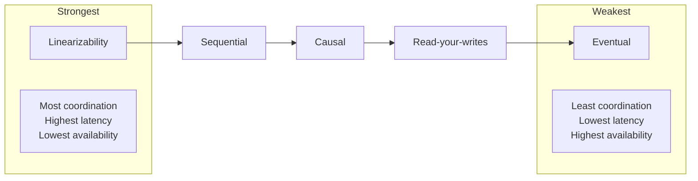

Every step to the right trades correctness guarantees for performance and availability. The art of distributed systems is choosing the right point on this spectrum for each use case.

---

## 3. Core Theory

### 3.1 What Is a Consistency Model?

A **consistency model** is a formal specification that defines the set of allowable behaviors (histories) for a distributed data store. It answers the fundamental question:

> Given a set of read and write operations by multiple clients, which read return values are legal?

Formally, a consistency model is a set of **constraints on the order and visibility of operations**. Stronger models impose more constraints, reducing the set of legal behaviors. Weaker models relax constraints, allowing more behaviors (some of which may surprise clients).

#### Operations and Histories

An **operation** is a read or write on a data object. Each operation has:
- **Invocation time**: when the client sends the request
- **Response time**: when the client receives the response
- **Real-time interval**: [invocation, response]

A **history** is a sequence of operations across all clients. A consistency model determines which histories are **valid**.

### 3.2 Strong Consistency (Linearizability)

**Linearizability** (also called **atomic consistency** or **external consistency**) is the strongest single-object consistency model in common use. It was formally defined by Herlihy and Wing in 1990.

#### Formal Definition

A history is **linearizable** if:
1. Each operation appears to take effect **instantaneously** at some point between its invocation and response (called the **linearization point**).
2. The order of these linearization points is consistent with the **real-time order** of operations: if operation A completes before operation B starts, then A's linearization point precedes B's.
3. The sequential history formed by ordering operations by their linearization points is a valid sequential execution.

In simpler terms: **the system behaves as if there is only one copy of the data, and all operations are atomic**. Even though the data is replicated across multiple nodes, clients cannot distinguish the system from a single-node system.

#### Key Properties

- **Recency guarantee**: A read always returns the most recent completed write.
- **Real-time ordering**: If write W completes before read R starts, R must see W (or a later write).
- **Composability**: Linearizability is **composable** — if each object individually is linearizable, the entire system is linearizable. This is a unique and extremely valuable property.

#### Cost of Linearizability

Linearizability is expensive:
1. **Latency**: Every read must contact a majority of replicas (or use a lease mechanism). Cross-datacenter reads can take 100ms+.
2. **Availability**: During network partitions, at least one partition cannot serve reads (CAP theorem).
3. **Throughput**: Coordination limits throughput. All reads and writes must be serialized through a consensus protocol.

#### The CAP Connection

The CAP theorem (Gilbert & Lynch, 2002) states: in the presence of a network partition, a system must choose between **consistency** (linearizability) and **availability**. You cannot have both.

- **CP systems** (choose consistency): Refuse to serve requests during partitions. Examples: Spanner, ZooKeeper, etcd.
- **AP systems** (choose availability): Serve requests during partitions, but may return stale data. Examples: Cassandra, DynamoDB (default), Riak.

### 3.3 Sequential Consistency

**Sequential consistency** (Lamport, 1979) is slightly weaker than linearizability.

#### Formal Definition

A history is **sequentially consistent** if there exists a total ordering of all operations such that:
1. The ordering is consistent with the **program order** of each individual client (if client C issues operation A before B, A appears before B in the total order).
2. Every read returns the value of the most recent preceding write in the total order.

#### Key Difference from Linearizability

Sequential consistency does **not** require the ordering to be consistent with **real-time** — only with each client's program order.

**Example** showing the difference:

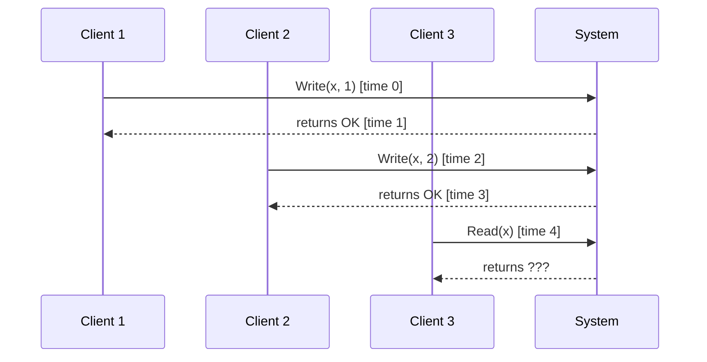

- **Linearizable**: Client 3 MUST return 2 (the most recent completed write in real-time).
- **Sequentially consistent**: Client 3 MAY return 1 or 2 (as long as there exists some total order consistent with each client's program order).

Sequential consistency allows a "stale" view, as long as all clients see operations in the same order.

#### Where It Appears

- **ZooKeeper** provides sequential consistency for reads (not linearizable reads by default; you must call `sync()` first)
- **CPU memory models**: x86 provides Total Store Ordering (TSO), which is close to sequential consistency

### 3.4 Causal Consistency

**Causal consistency** tracks the cause-and-effect relationships between operations.

#### Formal Definition

Two operations are **causally related** if:
1. They are by the same client (program order), OR
2. One reads a value written by the other, OR
3. There is a chain of such relationships (transitivity).

A history is **causally consistent** if:
- All clients see causally related operations in the same order.
- Concurrent (causally unrelated) operations may be seen in different orders by different clients.

#### Causal vs. Sequential vs. Linearizable

| Property | Linearizable | Sequential | Causal |
|----------|-------------|-----------|--------|
| Real-time ordering | Yes | No | No |
| Total ordering (all ops) | Yes | Yes | No (only causal ops) |
| Same order per client | Yes | Yes | Yes |
| Causally related same order | Yes | Yes | Yes |

#### Implementation with Vector Clocks

Causal consistency is typically implemented using **vector clocks** (or their more efficient variants, like **version vectors**).

Each node maintains a vector of logical clocks, one per node:

```
Node A: [A:3, B:2, C:1]  — A has done 3 operations, knows about B's first 2 and C's first 1
Node B: [A:2, B:4, C:1]  — B has done 4 operations, knows about A's first 2 and C's first 1
```

**Rules**:
1. Before each local operation, increment your own clock: `VC[self] += 1`
2. When sending a message, attach your current vector clock
3. When receiving a message with vector clock `VC_msg`:
   - For each entry: `VC[i] = max(VC[i], VC_msg[i])`
   - Then increment your own: `VC[self] += 1`

**Determining causality**:
- `VC_a < VC_b` (a happened before b) if `VC_a[i] <= VC_b[i]` for all i, and at least one is strictly less.
- If neither `VC_a < VC_b` nor `VC_b < VC_a`, the operations are **concurrent**.

#### Production Systems

- **MongoDB** (since 3.6): Offers causal consistency sessions using cluster timestamps
- **COPS** (research system): Causal+ consistency across data centers
- **Eiger**: Causally consistent, low-latency geo-replication

### 3.5 Eventual Consistency

**Eventual consistency** is the weakest commonly used consistency model.

#### Formal Definition

If no new updates are made to a data item, **eventually** all replicas will converge to the same value. More formally:

> If no new writes are submitted to a data item, then after some finite time, all reads to that item will return the same value.

There are **no guarantees** about:
- How long convergence takes
- What intermediate values readers see
- The order in which updates propagate

#### Convergence Mechanisms

How do replicas eventually agree? Three main approaches:

**1. Anti-Entropy (Background Repair)**
Nodes periodically compare their data and reconcile differences. This is a push/pull gossip protocol.

- **Merkle trees**: Cassandra uses Merkle trees to efficiently compare data ranges between replicas. Two replicas exchange tree roots; if they differ, they drill down to find divergent ranges.
- **Gossip protocols**: Nodes periodically exchange state with random peers. Over time, all nodes converge. The epidemic metaphor: information spreads like a virus.

**2. Read Repair**
When a read query contacts multiple replicas and discovers inconsistencies, the coordinator sends the latest value to the stale replicas.

**3. Hinted Handoff**
When a write cannot reach a target replica (because it's down), another node temporarily stores the write as a "hint." When the target recovers, the hint is forwarded.

#### The Danger of Eventual Consistency

Eventual consistency allows behaviors that can confuse users and break applications:

1. **Read-after-write inconsistency**: You write a value, immediately read it back, and get the old value.
2. **Non-monotonic reads**: You read value V2 (newer), then read again and get V1 (older). Time appears to go backward.
3. **Lost updates**: Two clients concurrently update the same item. One update is silently lost.

### 3.6 Read-Your-Writes Consistency

**Read-your-writes** (also called **read-after-write**) consistency guarantees:

> After a client writes a value, that same client will always read the new value (or a later one). Other clients may still see the old value.

#### Implementation Strategies

1. **Route reads to the leader**: For data the user might have modified, always read from the leader. Problem: defeats the purpose of read replicas.
2. **Track write timestamps**: When the client writes, remember the timestamp. When reading, ensure the replica has caught up to at least that timestamp.
3. **Sticky sessions**: Route the user's requests to the same replica. If that replica has the write, the read will see it.

#### Cross-Device Read-Your-Writes

This becomes tricky when a user accesses the system from multiple devices (phone and laptop):
- The write might come from the phone, but the read from the laptop
- Sticky sessions per device won't work
- Solution: centralize the write timestamp per user account, not per session

### 3.7 Monotonic Reads

**Monotonic reads** guarantee:

> If a client reads a value V at time T, any subsequent read by that client will return V or a later value — never an earlier one.

This prevents the "time travel" problem where a user sees a new value, refreshes, and sees an older value (because the second read hit a more stale replica).

#### Implementation

- **Sticky sessions**: Always route a user to the same replica. Since individual replicas never roll back, reads are naturally monotonic.
- **Read quorums with minimum version**: Include a "minimum version" parameter; replicas only respond if they're at least that current.

### 3.8 Monotonic Writes

**Monotonic writes** guarantee:

> A write by a client is only applied to a replica after all preceding writes by that client have been applied.

This ensures that writes are applied in the client's intended order. Without this, you might see:
1. Client writes x = 1
2. Client writes x = 2
3. Replica A applies x = 2 first, then x = 1, so x = 1 (wrong!)

### 3.9 Session Consistency

**Session consistency** combines read-your-writes, monotonic reads, and monotonic writes within a single **session** (typically a TCP connection or an application session).

- Within a session: strong guarantees
- Across sessions: eventual consistency

This is a practical sweet spot for many applications. Azure Cosmos DB explicitly offers session consistency as an option.

### 3.10 Linearizability vs. Serializability

This distinction is **the most commonly confused concept** in distributed systems and databases. They sound similar but mean fundamentally different things.

| | Linearizability | Serializability |
|---|---|---|
| **Scope** | Single object (register) | Multiple objects (transactions) |
| **Domain** | Distributed systems | Databases |
| **Guarantees** | Operations on one object appear atomic and real-time ordered | Transactions appear to execute in some serial order |
| **Real-time?** | Yes | No |
| **Composable?** | Yes | No |

#### Linearizability (Distributed Systems)

- Concerns a **single object** (like a single register, counter, or set)
- Operations appear to occur instantaneously at some point during their real-time interval
- "It behaves like a single copy"

#### Serializability (Databases)

- Concerns **transactions** that may read/write **multiple objects**
- Transactions appear to execute in some serial order (but not necessarily real-time order)
- "It behaves like transactions ran one at a time"

#### Strict Serializability (The Strongest)

**Strict serializability** = serializability + linearizability. Transactions appear to execute in a serial order that is consistent with real-time.

- This is what Google Spanner provides (they call it **external consistency**)
- It is the gold standard but the most expensive

#### Common Interview Mistake

Many candidates say "consistent" without specifying which consistency model. In interviews, always clarify:
- "Do you mean linearizability (single-object, real-time)?"
- "Do you mean serializability (multi-object transactions)?"
- "Do you mean eventual consistency?"

### 3.11 Multi-Version Concurrency Control (MVCC)

**MVCC** is not a consistency model per se — it is an **implementation technique** that enables efficient reads under various consistency models, particularly **snapshot isolation**.

#### Core Idea

Instead of overwriting values in-place, **every write creates a new version** of the data. Reads access the appropriate version based on a **snapshot timestamp**.

```
Key: "account_balance"
Version 1: value=1000, timestamp=100, created_by=txn_1
Version 2: value=900,  timestamp=200, created_by=txn_2  (withdrew $100)
Version 3: value=950,  timestamp=300, created_by=txn_3  (deposited $50)
```

A transaction starting at timestamp 250 would see Version 2 (value=900), not Version 3 — even if Version 3 was committed before the transaction completes its read.

#### How MVCC Works

1. **Begin Transaction**: Assign a start timestamp `T_start`.
2. **Read**: Find the latest version with `timestamp <= T_start` that was committed. Ignore uncommitted versions and versions from transactions that started after `T_start`.
3. **Write**: Create a new version with a new timestamp. Don't overwrite old versions.
4. **Commit**: Assign a commit timestamp. Make new versions visible.
5. **Garbage Collection**: Old versions that no running transaction could possibly need are eventually deleted.

#### Snapshot Isolation

MVCC naturally supports **snapshot isolation**:
- Each transaction sees a consistent snapshot of the database at its start time
- Writes by concurrent transactions are invisible
- Write-write conflicts are detected (first committer wins)

**The Write Skew Problem**:
Snapshot isolation allows a subtle anomaly called **write skew**:
- Transaction T1 reads x and y, decides based on both, writes x
- Transaction T2 reads x and y, decides based on both, writes y
- Both transactions read the same snapshot, both pass their checks, both commit
- But the combined result violates an invariant that depends on x + y

Example: Two doctors are on call. Each checks "is the other doctor on call?" Both see yes. Both remove themselves from the schedule. Now nobody is on call.

#### MVCC in Production

| Database | MVCC Implementation |
|----------|-------------------|
| PostgreSQL | Each row has `xmin` (creating transaction) and `xmax` (deleting transaction) |
| MySQL/InnoDB | Undo log stores old versions, rollback pointers link versions |
| Oracle | Undo tablespace stores old row versions |
| CockroachDB | MVCC with timestamps in the key (key + timestamp → value) |
| FoundationDB | MVCC with 5-second transaction window |

### 3.12 Tunable Consistency

Some systems let you choose the consistency level on a **per-operation** basis. This is called **tunable consistency**.

#### Cassandra's Consistency Levels

Cassandra is the poster child for tunable consistency. Given `N` replicas, `R` read replicas, and `W` write replicas:

| Level | Read (R) | Write (W) | Guarantee |
|-------|----------|-----------|-----------|
| ONE | 1 | 1 | Fastest, weakest |
| TWO | 2 | 2 | Slightly stronger |
| QUORUM | ⌊N/2⌋ + 1 | ⌊N/2⌋ + 1 | Strong if R + W > N |
| ALL | N | N | Strongest, least available |
| LOCAL_QUORUM | Quorum in local DC | Quorum in local DC | Strong within DC |
| EACH_QUORUM | - | Quorum in each DC | Global strong writes |

**Key Formula**: If `R + W > N`, you get **strong consistency** (linearizability for single keys), because every read will overlap with the latest write's replica set.

**Common Configurations**:
- `W=QUORUM, R=QUORUM`: Strong consistency, good availability (can tolerate ⌊(N-1)/2⌋ failures)
- `W=ONE, R=ONE`: Fastest, eventual consistency
- `W=ALL, R=ONE`: Writes are durable everywhere before acknowledging, reads are fast
- `W=ONE, R=ALL`: Writes are fast, reads contact all replicas (repair on read)

### 3.13 CRDTs (Conflict-Free Replicated Data Types)

**CRDTs** are data structures designed to be replicated across multiple nodes and merged automatically without conflicts. They achieve **strong eventual consistency**: once all updates are delivered, all replicas converge to the same state, deterministically, without any conflict resolution logic.

#### Why CRDTs?

In eventually consistent systems, concurrent updates to the same data create **conflicts**. Traditional approaches:
1. **Last-Writer-Wins (LWW)**: Discard one update. Data loss!
2. **Application-level resolution**: Complex, error-prone
3. **CRDTs**: Mathematically guarantee conflict-free merging

#### The Mathematical Foundation

CRDTs are based on **join-semilattices**. A join-semilattice is a partially ordered set with a **least upper bound** (join) for every pair of elements.

The **merge** operation must be:
- **Commutative**: merge(a, b) = merge(b, a)
- **Associative**: merge(merge(a, b), c) = merge(a, merge(b, c))
- **Idempotent**: merge(a, a) = a

These properties ensure that regardless of the order or number of times updates are received, all replicas converge to the same state.

#### Two Flavors of CRDTs

1. **State-based CRDTs (CvRDTs)**: Replicas periodically send their **full state** to other replicas. The receiving replica **merges** the states. Requires the merge operation to be commutative, associative, and idempotent.

2. **Operation-based CRDTs (CmRDTs)**: Replicas broadcast **operations** (not state). Requires a reliable causal broadcast layer (operations must be delivered exactly once, in causal order).

#### G-Counter (Grow-Only Counter)

The simplest CRDT. Each node maintains its own counter. The total is the sum of all counters.

```
Node A: {A: 5, B: 3, C: 2}  → Total = 10
Node B: {A: 4, B: 7, C: 2}  → Total = 13
Node C: {A: 5, B: 5, C: 4}  → Total = 14

Merge: {A: max(5,4,5)=5, B: max(3,7,5)=7, C: max(2,2,4)=4} → Total = 16
```

- **Increment**: Increment your own entry: `counters[self] += 1`
- **Query (value)**: Sum all entries: `sum(counters.values())`
- **Merge**: Take element-wise maximum: `merged[i] = max(a[i], b[i])`

#### PN-Counter (Positive-Negative Counter)

Supports both increment and decrement. Internally, it's two G-Counters: one for increments (P) and one for decrements (N).

```
Value = sum(P) - sum(N)

Increment: P[self] += 1
Decrement: N[self] += 1
Query: sum(P) - sum(N)
Merge: merge(P_a, P_b) for positives, merge(N_a, N_b) for negatives
```

#### LWW-Register (Last-Writer-Wins Register)

Stores a single value with a timestamp. On merge, the value with the higher timestamp wins.

```
Node A: {value: "hello", timestamp: 100}
Node B: {value: "world", timestamp: 200}

Merge: {value: "world", timestamp: 200}  — Node B's value wins
```

**Danger**: LWW can silently drop writes. If two writes happen "simultaneously" (same timestamp), one is arbitrarily discarded. This is acceptable for some use cases (e.g., user profile "last seen" status) but dangerous for others (e.g., shopping cart).

#### OR-Set (Observed-Remove Set)

The most sophisticated common CRDT. Supports both add and remove operations. Each addition is tagged with a unique ID. Remove only removes elements with known tags.

```
Add "apple" at Node A → {("apple", uuid1)}
Add "apple" at Node B → {("apple", uuid2)}
Remove "apple" at Node A → removes uuid1 only

Merge: {("apple", uuid2)}  — uuid2 survives because Node A's remove didn't know about it
```

This achieves the intuition of "add wins over concurrent remove," which is what users usually expect.

#### Operational Transformation (OT) vs CRDTs

Both solve the problem of concurrent editing (e.g., Google Docs), but differently:

| | OT | CRDTs |
|---|---|---|
| **Approach** | Transform operations against each other | Design data structures that merge automatically |
| **Central server** | Required (for transformation ordering) | Not required (fully decentralized) |
| **Complexity** | O(n²) transformation functions, correctness proofs are difficult | Simpler correctness, but larger metadata |
| **Metadata overhead** | Low | Can be high (tombstones, unique tags) |
| **Production use** | Google Docs, Google Wave | Figma, Redis (CRDTs), Riak, Apple Notes |
| **Real-time** | Excellent | Excellent |

Google Docs uses OT because it was designed when CRDTs were less mature. Figma switched to CRDTs for their collaborative design tool. The industry trend is moving toward CRDTs.

---

## 4. Architecture Deep Dive

### 4.1 How Linearizability Is Implemented

There are several approaches to implementing linearizability:

#### Approach 1: Single Leader with Synchronous Replication

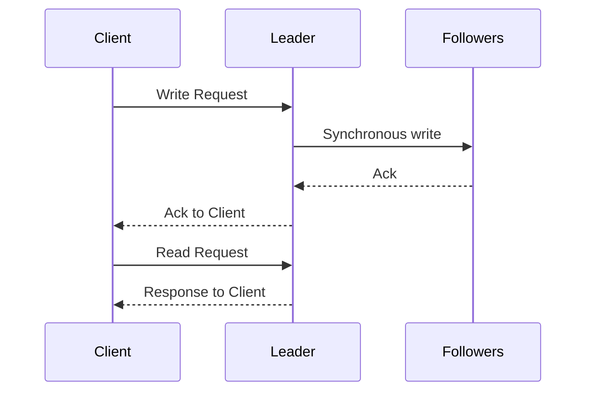

**How it works**:
1. All writes go to the leader
2. Leader replicates synchronously to a majority of followers
3. Only after majority ack does the leader respond to the client
4. All reads go to the leader (or use leases)

**Problem**: Leader becomes a bottleneck and a single point of failure.

#### Approach 2: Consensus Protocol (Raft, Paxos)

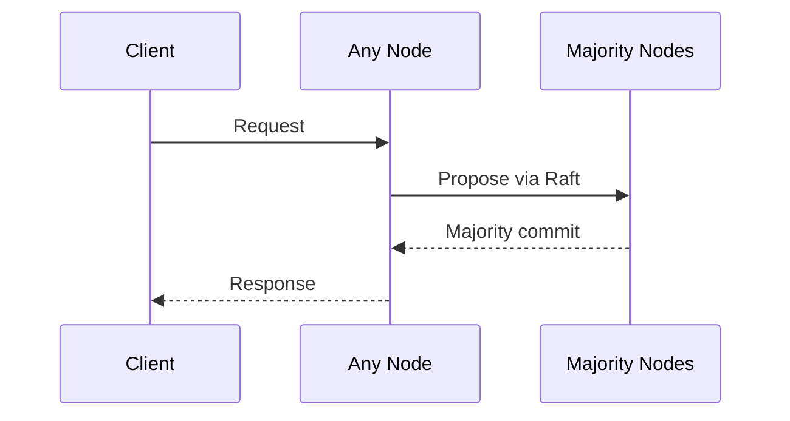

**How it works**:
1. Client sends request to any node
2. That node proposes the operation via the consensus protocol
3. Once a majority agrees, the operation is committed
4. The response is sent to the client
5. Reads must also go through consensus (or use the lease optimization)

**This is how etcd, ZooKeeper, and CockroachDB work.**

#### Approach 3: Google Spanner's TrueTime

Spanner achieves external consistency (linearizability for transactions) using GPS clocks and atomic clocks:

1. Each data center has GPS receivers and atomic clocks
2. TrueTime API returns a time interval `[earliest, latest]` rather than a point
3. Transactions wait out the clock uncertainty before committing ("commit wait")
4. This ensures that if transaction T1 commits before T2 starts, T1's timestamp < T2's timestamp

**Commit wait**: After obtaining a commit timestamp, the transaction waits until `TrueTime.now().latest > commit_timestamp` before making the write visible. This is typically 5-10ms.

### 4.2 How Causal Consistency Is Implemented

#### Vector Clocks Architecture

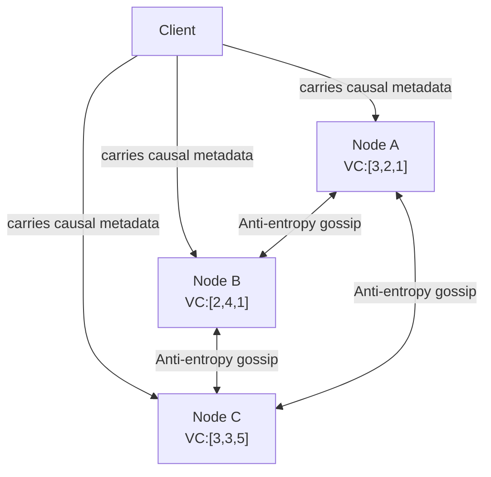

**Client-side tracking**:
1. Each client maintains a **causal context** (essentially a vector clock)
2. Every read response includes the version vector of the value read
3. Every write request includes the client's causal context
4. The server only applies a write when all causally preceding writes have been applied

**Server-side enforcement**:
1. When a server receives a write with causal context `CC`, it checks: have all operations in `CC` been applied locally?
2. If yes: apply the write immediately
3. If no: buffer the write until the dependencies are satisfied

### 4.3 How MVCC Works Internally

#### PostgreSQL's MVCC (Detailed)

PostgreSQL doesn't use undo logs. Instead, old row versions live in the same table (heap) alongside current versions:

```
Table: accounts
┌────────┬───────┬──────────┬──────────┬─────────┐
│ ctid   │ xmin  │ xmax     │ balance  │ name    │
├────────┼───────┼──────────┼──────────┼─────────┤
│ (0,1)  │ 100   │ 200      │ 1000     │ Alice   │  ← old version (created by txn 100, deleted by txn 200)
│ (0,2)  │ 200   │ 0 (live) │ 900      │ Alice   │  ← current version (created by txn 200)
│ (0,3)  │ 150   │ 0 (live) │ 500      │ Bob     │  ← current version
└────────┴───────┴──────────┴──────────┴─────────┘
```

- `xmin`: The transaction ID that created this row version
- `xmax`: The transaction ID that deleted/updated this row version (0 if still live)
- A transaction with ID 180 would see `(0,1)` for Alice (xmin=100 ≤ 180, xmax=200 > 180) and `(0,3)` for Bob

**Visibility rules** for a transaction with snapshot S:
1. The row version's `xmin` must be committed and < S's start time
2. The row version's `xmax` must be either 0 (not deleted) or from a transaction not yet committed/visible to S

**VACUUM**: Since old versions accumulate, PostgreSQL's `VACUUM` process periodically removes versions that no running transaction could need.

#### InnoDB's MVCC (MySQL)

InnoDB uses a different approach — **undo logs**:
1. The current version lives in the table
2. Old versions are reconstructed from the undo log
3. Each row has a hidden `DB_TRX_ID` (last modifying transaction) and `DB_ROLL_PTR` (pointer to undo log)

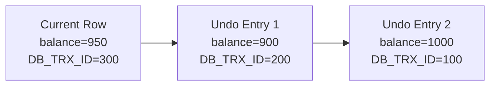

To find the correct version for transaction T, InnoDB follows the undo chain until it finds a version with `DB_TRX_ID ≤ T`.

### 4.4 How CRDTs Propagate State

#### State-Based CRDT Propagation
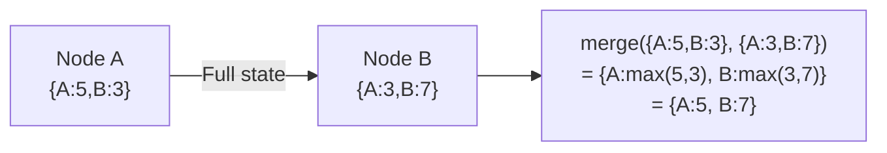

Nodes periodically (or on change) send their full state to peers. The receiving node merges using the CRDT's merge function. Because merge is commutative, associative, and idempotent, the order and frequency of these exchanges doesn't matter — convergence is guaranteed.

#### Operation-Based CRDT Propagation

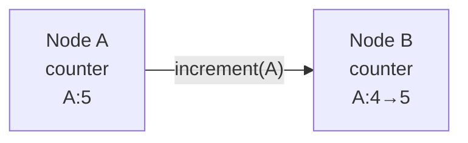

Nodes broadcast operations (not state). The middleware must guarantee:
- **At-least-once delivery** (or exactly-once)
- **Causal ordering** (causally preceding operations arrive first)

---

## 5. Visual Diagrams

### 5.1 Consistency Model Hierarchy

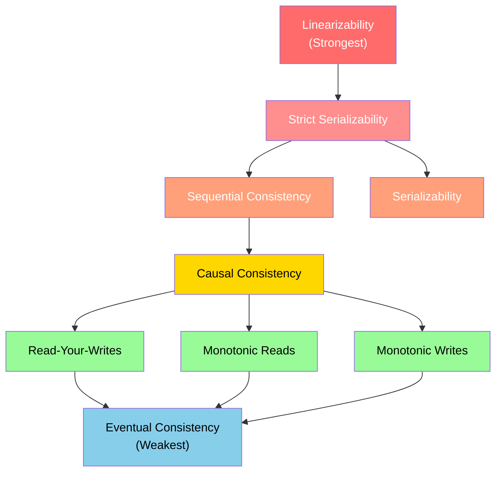

### 5.2 Linearizability Example Timeline

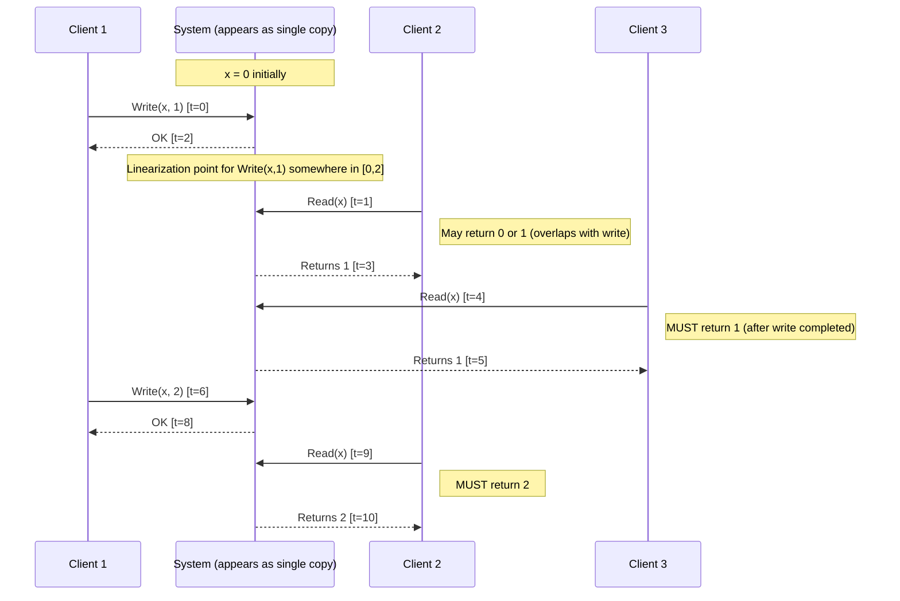

### 5.3 MVCC Version Chain

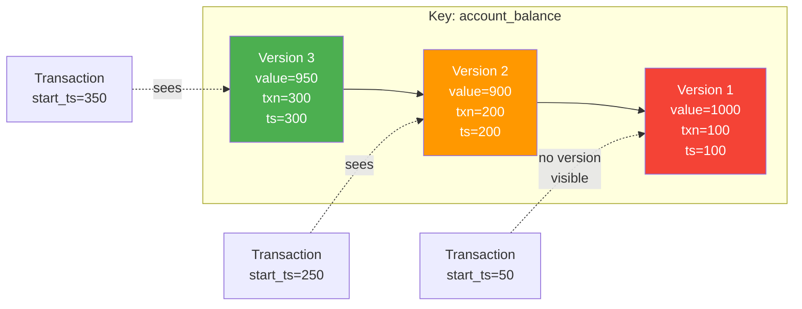

### 5.4 CRDT G-Counter Merge

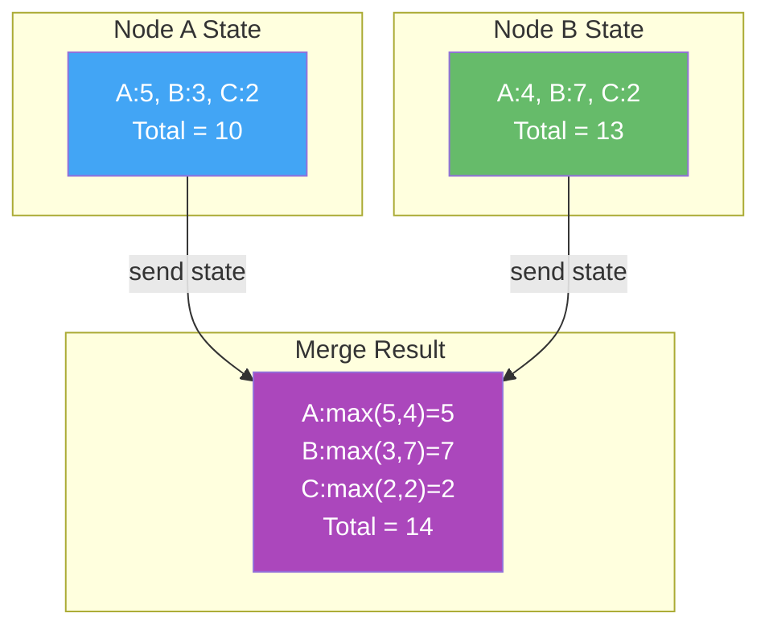

### 5.5 Tunable Consistency — Quorum Overlap

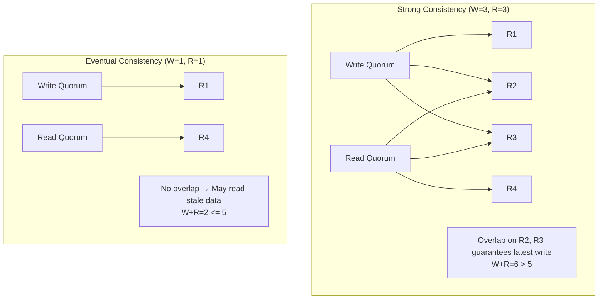

### 5.6 Causal Consistency with Vector Clocks

```mermaid
sequenceDiagram
    participant A as Node A
    participant B as Node B
    participant C as Node C

    Note over A: VC: [1,0,0]
    Note over B: VC: [0,0,0]
    Note over C: VC: [0,0,0]

    A->>A: write(x=1)
    Note over A: VC: [2,0,0]
    
    A->>B: gossip
    Note over B: receive<br/>VC: [2,1,0]
    
    B->>B: write(y=2)
    Note over B: VC: [2,2,0]
    
    B->>A: gossip
    Note over A: merge<br/>VC: [2,2,0]
    
    B->>C: gossip
    Note over C: receive + local op<br/>VC: [2,2,1]

    Note across A,C: Causality: write(x=1) → write(y=2) because B received A's state before writing y.<br/>Node C sees both writes in causal order.
```

### 5.7 Snapshot Isolation — Write Skew

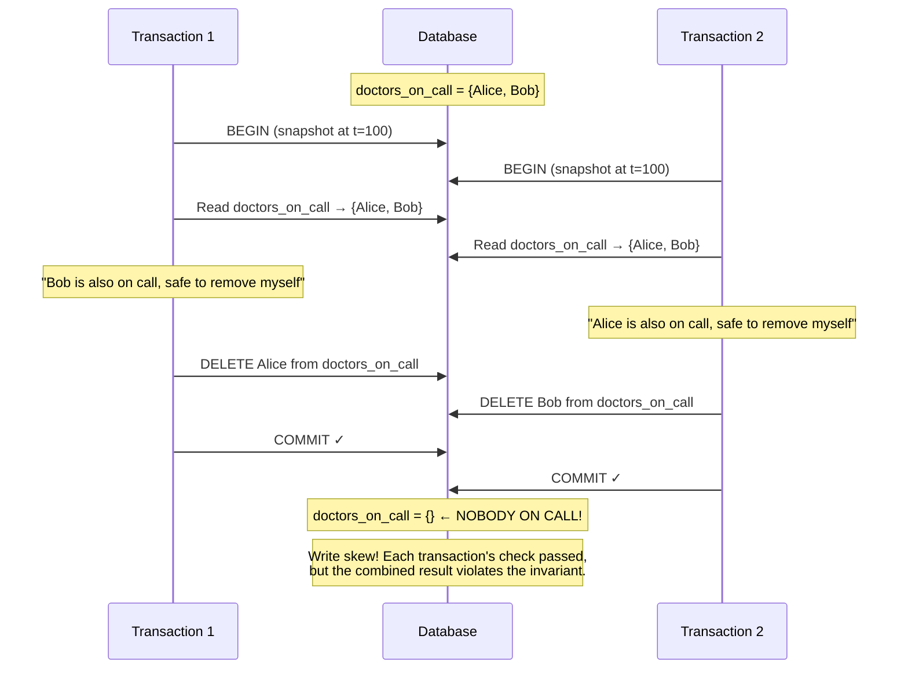

---

## 6. Real Production Examples

### 6.1 Google Spanner — Linearizable + Serializable

**Architecture**: Spanner is a globally distributed database that provides **external consistency** (strict serializability) using **TrueTime**.

**How it works**:
1. Data is sharded across **Paxos groups** (called "splits")
2. Each split has a leader that coordinates reads and writes via Paxos
3. **TrueTime** provides globally consistent timestamps using GPS and atomic clocks
4. **Commit wait**: After obtaining a commit timestamp, wait until you're sure no other transaction could get an earlier timestamp

**Why this matters**: Spanner is the first system to offer externally consistent reads and writes at global scale. Before Spanner, everyone assumed global consistency was too expensive.

**Use cases at Google**: AdWords, Google Play, Google F1 (advertising backend)

**Performance characteristics**:
- Write latency: ~10-15ms (due to Paxos + commit wait)
- Read latency: ~1ms for local reads with stale timestamps, ~5-10ms for linearizable reads
- Cross-continent writes: ~100-200ms

### 6.2 Apache Cassandra — Tunable Consistency

**Architecture**: Cassandra uses a ring topology with consistent hashing. No leader — all nodes are equal.

**Consistency in practice**:
- Default: `ONE` for both reads and writes (eventual consistency)
- Common production setting: `LOCAL_QUORUM` for both (strong within a datacenter)
- Critical data: `QUORUM` for both (strong across all datacenters)

**Real-world story**: Instagram (before the Facebook acquisition) used Cassandra with `QUORUM` reads and writes for their feed storage. They later switched to a mix of `LOCAL_QUORUM` for low-latency and `QUORUM` for critical operations.

**Conflict resolution**: Cassandra uses **last-write-wins (LWW)** with client-provided timestamps. This means:
- If two writes happen "simultaneously," one is silently lost
- The client can manipulate timestamps to control which write wins
- This is simple but can lead to subtle data loss

### 6.3 Amazon DynamoDB — Eventual (Default) + Strong (Optional)

**Architecture**: DynamoDB uses a partitioned, replicated architecture. Each partition has three replicas across availability zones.

**Consistency options**:
- **Eventually consistent reads** (default): May return stale data, cheaper, lower latency
- **Strongly consistent reads**: Always returns the latest data, costs 2x, slightly higher latency

**Production story from Amazon**:
The original Dynamo paper (2007) described the shopping cart service at Amazon. During high traffic events (Black Friday), they chose availability over consistency. The result:
- Customers could always add items to their cart (availability)
- But items could "reappear" after being removed (eventual consistency)
- Amazon decided this was better than a "Service Unavailable" error

**DynamoDB Transactions** (added 2018): Provides ACID transactions across multiple items, at 2x the cost. Uses a two-phase commit protocol internally.

### 6.4 Redis — Strong for Single Node

**Architecture**: Redis is primarily a single-node in-memory store. With Redis Cluster, data is sharded across nodes.

**Consistency characteristics**:
- **Single node**: Strong consistency (single-threaded event loop serializes all operations)
- **Replication**: Asynchronous by default → eventual consistency for replicas
- **Redis Cluster**: No cross-shard transactions → no serializability across shards
- **WAIT command**: Can wait for a write to be replicated to N followers (but doesn't guarantee linearizability during failover)

**Redis Streams and CRDTs**: Redis has been experimenting with CRDTs for multi-master replication (Redis Enterprise's Active-Active feature uses CRDTs for conflict-free replication).

### 6.5 CockroachDB — Serializable by Default

**Architecture**: CockroachDB provides serializable transactions using MVCC + an optimized variant of Spanner's approach.

**Key differences from Spanner**:
- No GPS/atomic clocks — uses **hybrid logical clocks (HLC)** instead
- When clock uncertainty is too high, CockroachDB restarts transactions
- Slightly weaker than Spanner's external consistency, but serializable

**Interesting design choice**: CockroachDB defaults to **SERIALIZABLE** isolation (the strongest SQL standard level). Most other databases default to **READ COMMITTED** (PostgreSQL, Oracle) or **REPEATABLE READ** (MySQL/InnoDB).

### 6.6 Figma — CRDTs for Real-Time Collaboration

Figma uses CRDTs for their collaborative design tool:
- Multiple designers can edit the same design simultaneously
- Each designer's changes are represented as CRDT operations
- Operations are broadcast to all connected clients
- CRDTs guarantee that all clients converge to the same state
- No central server needed for conflict resolution (though they use one for relay)

### 6.7 MongoDB — Causal Consistency Sessions

MongoDB (since 3.6) offers **causal consistency sessions**:
- Within a session, reads reflect preceding writes (read-your-writes)
- Monotonic reads and writes within a session
- Writes follow reads within a session (writes in causal order)
- Uses cluster timestamps (similar to Lamport timestamps) for ordering

---

## 7. Java Implementations

### 7.1 G-Counter (Grow-Only Counter) CRDT

```java
import java.util.*;
import java.util.concurrent.ConcurrentHashMap;

/**
 * G-Counter (Grow-Only Counter) CRDT.
 * 
 * Each node maintains its own counter. The total value is the sum of all counters.
 * Merge takes the element-wise maximum.
 * 
 * Properties:
 * - Only supports increment (no decrement)
 * - Merge is commutative, associative, idempotent
 * - Converges to correct total after all states are exchanged
 * 
 * Space complexity: O(N) where N = number of nodes
 * Time complexity: O(N) for value(), O(N) for merge()
 */
public class GCounter {
    
    private final String nodeId;
    private final Map<String, Long> counters;
    
    public GCounter(String nodeId) {
        this.nodeId = Objects.requireNonNull(nodeId, "nodeId must not be null");
        this.counters = new ConcurrentHashMap<>();
        this.counters.put(nodeId, 0L);
    }
    
    /**
     * Private constructor for creating copies (used in merge).
     */
    private GCounter(String nodeId, Map<String, Long> counters) {
        this.nodeId = nodeId;
        this.counters = new ConcurrentHashMap<>(counters);
    }
    
    /**
     * Increment the counter by 1.
     * Only increments this node's entry in the vector.
     */
    public void increment() {
        counters.merge(nodeId, 1L, Long::sum);
    }
    
    /**
     * Increment the counter by a specified positive amount.
     * 
     * @param amount Must be positive
     * @throws IllegalArgumentException if amount is not positive
     */
    public void increment(long amount) {
        if (amount <= 0) {
            throw new IllegalArgumentException("G-Counter can only increment by positive amounts, got: " + amount);
        }
        counters.merge(nodeId, amount, Long::sum);
    }
    
    /**
     * Get the current value of the counter.
     * The value is the sum of all nodes' counters.
     * 
     * @return The total count across all nodes
     */
    public long value() {
        return counters.values().stream().mapToLong(Long::longValue).sum();
    }
    
    /**
     * Merge another G-Counter's state into this one.
     * Takes the element-wise maximum for each node's counter.
     * 
     * Properties:
     * - Commutative: merge(a, b) == merge(b, a)
     * - Associative: merge(merge(a, b), c) == merge(a, merge(b, c))
     * - Idempotent: merge(a, a) == a
     * 
     * @param other The other G-Counter to merge with
     */
    public void merge(GCounter other) {
        Objects.requireNonNull(other, "Cannot merge with null");
        
        for (Map.Entry<String, Long> entry : other.counters.entrySet()) {
            counters.merge(entry.getKey(), entry.getValue(), Math::max);
        }
    }
    
    /**
     * Get the state for replication (state-based CRDT).
     * Returns an immutable copy of the internal state.
     */
    public Map<String, Long> getState() {
        return Collections.unmodifiableMap(new HashMap<>(counters));
    }
    
    /**
     * Compare this counter with another to determine causal ordering.
     * 
     * @return true if this counter's state is ≤ the other's (component-wise)
     */
    public boolean isLessThanOrEqual(GCounter other) {
        for (Map.Entry<String, Long> entry : this.counters.entrySet()) {
            long otherValue = other.counters.getOrDefault(entry.getKey(), 0L);
            if (entry.getValue() > otherValue) {
                return false;
            }
        }
        return true;
    }
    
    @Override
    public String toString() {
        return "GCounter{nodeId='" + nodeId + "', counters=" + counters + ", value=" + value() + "}";
    }
    
    // ─── Demo ────────────────────────────────────────────────────
    
    public static void main(String[] args) {
        // Simulate three nodes
        GCounter counterA = new GCounter("node-A");
        GCounter counterB = new GCounter("node-B");
        GCounter counterC = new GCounter("node-C");
        
        // Node A increments 5 times
        for (int i = 0; i < 5; i++) counterA.increment();
        
        // Node B increments 3 times
        for (int i = 0; i < 3; i++) counterB.increment();
        
        // Node C increments 7 times
        for (int i = 0; i < 7; i++) counterC.increment();
        
        System.out.println("Before merge:");
        System.out.println("  A: " + counterA);  // value=5
        System.out.println("  B: " + counterB);  // value=3
        System.out.println("  C: " + counterC);  // value=7
        
        // Merge all states (simulating anti-entropy)
        counterA.merge(counterB);
        counterA.merge(counterC);
        
        System.out.println("\nAfter A merges B and C:");
        System.out.println("  A: " + counterA);  // value=15 (5+3+7)
        
        // Idempotent: merging again doesn't change the value
        counterA.merge(counterB);
        System.out.println("\nAfter A merges B again (idempotent):");
        System.out.println("  A: " + counterA);  // still value=15
    }
}
```

### 7.2 PN-Counter (Positive-Negative Counter) CRDT

```java
import java.util.*;

/**
 * PN-Counter CRDT - supports both increment and decrement.
 * 
 * Internally composed of two G-Counters:
 * - P (positive): tracks increments
 * - N (negative): tracks decrements
 * 
 * Value = P.value() - N.value()
 * 
 * This is a classic example of CRDT composition:
 * a more complex CRDT built from simpler ones.
 */
public class PNCounter {
    
    private final String nodeId;
    private final GCounter positiveCounter;  // tracks increments
    private final GCounter negativeCounter;  // tracks decrements
    
    public PNCounter(String nodeId) {
        this.nodeId = Objects.requireNonNull(nodeId);
        this.positiveCounter = new GCounter(nodeId);
        this.negativeCounter = new GCounter(nodeId);
    }
    
    /**
     * Increment the counter by 1.
     */
    public void increment() {
        positiveCounter.increment();
    }
    
    /**
     * Increment the counter by a specified positive amount.
     */
    public void increment(long amount) {
        positiveCounter.increment(amount);
    }
    
    /**
     * Decrement the counter by 1.
     */
    public void decrement() {
        negativeCounter.increment();
    }
    
    /**
     * Decrement the counter by a specified positive amount.
     */
    public void decrement(long amount) {
        negativeCounter.increment(amount);
    }
    
    /**
     * Get the current value: increments - decrements.
     * Note: the value CAN be negative.
     */
    public long value() {
        return positiveCounter.value() - negativeCounter.value();
    }
    
    /**
     * Merge another PN-Counter's state into this one.
     * Simply merges both internal G-Counters independently.
     */
    public void merge(PNCounter other) {
        this.positiveCounter.merge(other.positiveCounter);
        this.negativeCounter.merge(other.negativeCounter);
    }
    
    @Override
    public String toString() {
        return "PNCounter{nodeId='" + nodeId + 
               "', value=" + value() + 
               ", increments=" + positiveCounter.value() + 
               ", decrements=" + negativeCounter.value() + "}";
    }
    
    // ─── Demo ────────────────────────────────────────────────────
    
    public static void main(String[] args) {
        PNCounter counterA = new PNCounter("node-A");
        PNCounter counterB = new PNCounter("node-B");
        
        // Node A: +10, -3 → net = 7
        counterA.increment(10);
        counterA.decrement(3);
        
        // Node B: +5, -8 → net = -3
        counterB.increment(5);
        counterB.decrement(8);
        
        System.out.println("Before merge:");
        System.out.println("  A: " + counterA);  // value=7
        System.out.println("  B: " + counterB);  // value=-3
        
        // Merge
        counterA.merge(counterB);
        counterB.merge(counterA);
        
        System.out.println("\nAfter merge:");
        System.out.println("  A: " + counterA);  // value=4 (15-11)
        System.out.println("  B: " + counterB);  // value=4 (15-11)
        
        // Both converge to the same value!
        assert counterA.value() == counterB.value();
    }
}
```

### 7.3 LWW-Register (Last-Writer-Wins Register) CRDT

```java
import java.time.Instant;
import java.util.Objects;
import java.util.concurrent.atomic.AtomicReference;

/**
 * LWW-Register (Last-Writer-Wins Register) CRDT.
 * 
 * Stores a single value with a timestamp. On merge,
 * the value with the higher timestamp wins.
 * 
 * WARNING: LWW can silently drop concurrent writes.
 * Use only when losing a concurrent update is acceptable.
 * 
 * Suitable for:
 * - User profile fields (name, bio, avatar)
 * - "Last seen" timestamps
 * - Configuration values
 * 
 * NOT suitable for:
 * - Shopping carts (use OR-Set instead)
 * - Counters (use G-Counter/PN-Counter instead)
 * - Any data where losing an update is unacceptable
 * 
 * @param <T> The type of value stored in the register
 */
public class LWWRegister<T> {
    
    /**
     * Immutable timestamped value.
     */
    private static class TimestampedValue<T> {
        final T value;
        final long timestamp;  // Lamport timestamp or wall clock
        final String nodeId;   // Tie-breaker for equal timestamps
        
        TimestampedValue(T value, long timestamp, String nodeId) {
            this.value = value;
            this.timestamp = timestamp;
            this.nodeId = nodeId;
        }
        
        /**
         * Compare two timestamped values.
         * Higher timestamp wins. Equal timestamps broken by nodeId.
         */
        boolean isNewerThan(TimestampedValue<T> other) {
            if (other == null) return true;
            if (this.timestamp != other.timestamp) {
                return this.timestamp > other.timestamp;
            }
            // Tie-breaker: lexicographic comparison of nodeId
            return this.nodeId.compareTo(other.nodeId) > 0;
        }
    }
    
    private final String nodeId;
    private final AtomicReference<TimestampedValue<T>> current;
    private long logicalClock;  // Lamport clock for timestamp generation
    
    public LWWRegister(String nodeId) {
        this.nodeId = Objects.requireNonNull(nodeId);
        this.current = new AtomicReference<>(null);
        this.logicalClock = 0;
    }
    
    /**
     * Set a new value. Automatically assigns a timestamp.
     */
    public synchronized void set(T value) {
        logicalClock++;
        TimestampedValue<T> newValue = new TimestampedValue<>(value, logicalClock, nodeId);
        current.set(newValue);
    }
    
    /**
     * Set a value with an explicit timestamp (for replication).
     */
    public synchronized void set(T value, long timestamp) {
        logicalClock = Math.max(logicalClock, timestamp) + 1;
        TimestampedValue<T> newValue = new TimestampedValue<>(value, timestamp, nodeId);
        TimestampedValue<T> currentValue = current.get();
        
        if (newValue.isNewerThan(currentValue)) {
            current.set(newValue);
        }
    }
    
    /**
     * Get the current value.
     * 
     * @return The current value, or null if never set
     */
    public T get() {
        TimestampedValue<T> tv = current.get();
        return tv != null ? tv.value : null;
    }
    
    /**
     * Get the current timestamp.
     */
    public long getTimestamp() {
        TimestampedValue<T> tv = current.get();
        return tv != null ? tv.timestamp : 0;
    }
    
    /**
     * Merge another register's state into this one.
     * The value with the higher timestamp wins.
     */
    public synchronized void merge(LWWRegister<T> other) {
        TimestampedValue<T> otherValue = other.current.get();
        if (otherValue == null) return;
        
        TimestampedValue<T> currentValue = current.get();
        logicalClock = Math.max(logicalClock, other.logicalClock);
        
        if (otherValue.isNewerThan(currentValue)) {
            current.set(otherValue);
        }
    }
    
    @Override
    public String toString() {
        TimestampedValue<T> tv = current.get();
        if (tv == null) return "LWWRegister{empty}";
        return "LWWRegister{nodeId='" + nodeId + 
               "', value=" + tv.value + 
               ", timestamp=" + tv.timestamp + 
               ", writtenBy=" + tv.nodeId + "}";
    }
    
    // ─── Demo ────────────────────────────────────────────────────
    
    public static void main(String[] args) {
        LWWRegister<String> regA = new LWWRegister<>("node-A");
        LWWRegister<String> regB = new LWWRegister<>("node-B");
        
        // Concurrent writes
        regA.set("hello");     // timestamp 1 at node-A
        regB.set("world");     // timestamp 1 at node-B
        
        System.out.println("Before merge:");
        System.out.println("  A: " + regA);
        System.out.println("  B: " + regB);
        
        // Node A writes again (timestamp 2)
        regA.set("foo");
        
        // Merge
        regA.merge(regB);
        regB.merge(regA);
        
        System.out.println("\nAfter merge:");
        System.out.println("  A: " + regA);  // "foo" (timestamp 2 > 1)
        System.out.println("  B: " + regB);  // "foo" (same)
    }
}
```

### 7.4 OR-Set (Observed-Remove Set) CRDT

```java
import java.util.*;
import java.util.concurrent.ConcurrentHashMap;
import java.util.stream.Collectors;

/**
 * OR-Set (Observed-Remove Set) CRDT.
 * 
 * Supports both add and remove operations without conflicts.
 * Each addition is tagged with a unique identifier.
 * Remove only removes elements with tags that the removing node has observed.
 * 
 * Semantics: "add wins" over concurrent remove.
 * If node A adds "apple" and node B concurrently removes "apple",
 * "apple" will be in the final set (because B's remove only removes
 * the tags B has seen, not A's new tag).
 * 
 * @param <E> The type of elements in the set
 */
public class ORSet<E> {
    
    /**
     * Each element is stored with a set of unique tags.
     * Adding creates a new tag. Removing removes known tags.
     */
    private final String nodeId;
    private final Map<E, Set<String>> elements;  // element → set of unique tags
    private long tagCounter;  // for generating unique tags
    
    public ORSet(String nodeId) {
        this.nodeId = Objects.requireNonNull(nodeId);
        this.elements = new ConcurrentHashMap<>();
        this.tagCounter = 0;
    }
    
    /**
     * Generate a globally unique tag for an addition.
     */
    private String generateTag() {
        tagCounter++;
        return nodeId + ":" + tagCounter;
    }
    
    /**
     * Add an element to the set.
     * Creates a new unique tag for this addition.
     */
    public synchronized void add(E element) {
        String tag = generateTag();
        elements.computeIfAbsent(element, k -> ConcurrentHashMap.newKeySet())
                .add(tag);
    }
    
    /**
     * Remove an element from the set.
     * Only removes tags that are currently observed (known).
     * If another node concurrently adds the same element with a new tag,
     * that addition will "win" (the new tag won't be removed).
     */
    public synchronized void remove(E element) {
        elements.remove(element);
    }
    
    /**
     * Check if the set contains an element.
     */
    public boolean contains(E element) {
        Set<String> tags = elements.get(element);
        return tags != null && !tags.isEmpty();
    }
    
    /**
     * Get all elements currently in the set.
     */
    public Set<E> elements() {
        return elements.entrySet().stream()
                .filter(e -> !e.getValue().isEmpty())
                .map(Map.Entry::getKey)
                .collect(Collectors.toUnmodifiableSet());
    }
    
    /**
     * Get the size of the set.
     */
    public int size() {
        return (int) elements.entrySet().stream()
                .filter(e -> !e.getValue().isEmpty())
                .count();
    }
    
    /**
     * Merge another OR-Set's state into this one.
     * 
     * For each element:
     * - Tags present in either set are included in the merged set
     * - Tags removed in one set (but still present in the other) are included
     *   only if they're in the other set (the other set hasn't removed them)
     * 
     * Simplified merge (state-based): union of all tag sets.
     */
    public synchronized void merge(ORSet<E> other) {
        for (Map.Entry<E, Set<String>> entry : other.elements.entrySet()) {
            E element = entry.getKey();
            Set<String> otherTags = entry.getValue();
            
            elements.computeIfAbsent(element, k -> ConcurrentHashMap.newKeySet())
                    .addAll(otherTags);
        }
    }
    
    /**
     * Get internal state for debugging.
     */
    public Map<E, Set<String>> getState() {
        Map<E, Set<String>> state = new HashMap<>();
        for (Map.Entry<E, Set<String>> entry : elements.entrySet()) {
            if (!entry.getValue().isEmpty()) {
                state.put(entry.getKey(), new HashSet<>(entry.getValue()));
            }
        }
        return Collections.unmodifiableMap(state);
    }
    
    @Override
    public String toString() {
        return "ORSet{nodeId='" + nodeId + "', elements=" + elements() + "}";
    }
    
    // ─── Demo ────────────────────────────────────────────────────
    
    public static void main(String[] args) {
        ORSet<String> setA = new ORSet<>("node-A");
        ORSet<String> setB = new ORSet<>("node-B");
        
        // Both nodes add "apple"
        setA.add("apple");
        setB.add("apple");
        
        // Node A also adds "banana"
        setA.add("banana");
        
        // Node B removes "apple" (only removes B's tag)
        setB.remove("apple");
        
        // Node B adds "cherry"
        setB.add("cherry");
        
        System.out.println("Before merge:");
        System.out.println("  A: " + setA);  // {apple, banana}
        System.out.println("  B: " + setB);  // {cherry}
        System.out.println("  A state: " + setA.getState());
        System.out.println("  B state: " + setB.getState());
        
        // Merge
        setA.merge(setB);
        setB.merge(setA);
        
        System.out.println("\nAfter merge:");
        System.out.println("  A: " + setA);  // {apple, banana, cherry}
        System.out.println("  B: " + setB);  // {apple, banana, cherry}
        // "apple" survives because A's tag was never removed by B!
    }
}
```

### 7.5 MVCC Implementation

```java
import java.util.*;
import java.util.concurrent.*;
import java.util.concurrent.atomic.AtomicLong;
import java.util.concurrent.locks.ReentrantReadWriteLock;

/**
 * Simplified MVCC (Multi-Version Concurrency Control) implementation.
 * 
 * Demonstrates the core concepts:
 * - Multiple versions per key
 * - Snapshot-based reads
 * - Write-write conflict detection
 * - Garbage collection of old versions
 * 
 * This is a teaching implementation; production systems (PostgreSQL, MySQL)
 * have far more optimized implementations.
 */
public class MVCCStore {
    
    /**
     * A single version of a value.
     */
    static class Version implements Comparable<Version> {
        final long timestamp;     // When this version was created
        final String value;       // The value
        final long transactionId; // Which transaction created this
        final boolean committed;  // Whether the creating transaction has committed
        
        Version(long timestamp, String value, long transactionId, boolean committed) {
            this.timestamp = timestamp;
            this.value = value;
            this.transactionId = transactionId;
            this.committed = committed;
        }
        
        @Override
        public int compareTo(Version other) {
            return Long.compare(this.timestamp, other.timestamp);
        }
        
        @Override
        public String toString() {
            return String.format("Version{ts=%d, value='%s', txn=%d, committed=%s}",
                    timestamp, value, transactionId, committed);
        }
    }
    
    /**
     * A transaction in the MVCC system.
     */
    static class Transaction {
        final long id;
        final long startTimestamp;
        final Set<String> writtenKeys;
        volatile boolean committed;
        volatile boolean aborted;
        long commitTimestamp;
        
        Transaction(long id, long startTimestamp) {
            this.id = id;
            this.startTimestamp = startTimestamp;
            this.writtenKeys = ConcurrentHashMap.newKeySet();
            this.committed = false;
            this.aborted = false;
        }
    }
    
    // ─── Store State ─────────────────────────────────────────────
    
    /** Key → list of versions (sorted by timestamp) */
    private final ConcurrentHashMap<String, CopyOnWriteArrayList<Version>> store;
    
    /** Active transactions */
    private final ConcurrentHashMap<Long, Transaction> activeTransactions;
    
    /** Global timestamp counter */
    private final AtomicLong timestampCounter;
    
    /** Transaction ID counter */
    private final AtomicLong txnIdCounter;
    
    /** Lock for conflict detection during commit */
    private final ReentrantReadWriteLock commitLock;
    
    public MVCCStore() {
        this.store = new ConcurrentHashMap<>();
        this.activeTransactions = new ConcurrentHashMap<>();
        this.timestampCounter = new AtomicLong(0);
        this.txnIdCounter = new AtomicLong(0);
        this.commitLock = new ReentrantReadWriteLock();
    }
    
    /**
     * Begin a new transaction.
     * The transaction gets a snapshot timestamp = current time.
     * It will only see versions committed before this timestamp.
     * 
     * @return The transaction ID
     */
    public long beginTransaction() {
        long txnId = txnIdCounter.incrementAndGet();
        long startTs = timestampCounter.get();
        Transaction txn = new Transaction(txnId, startTs);
        activeTransactions.put(txnId, txn);
        System.out.println("[TXN " + txnId + "] BEGIN at snapshot timestamp " + startTs);
        return txnId;
    }
    
    /**
     * Read a value within a transaction.
     * Returns the latest committed version visible to this transaction's snapshot.
     * 
     * @param txnId The transaction ID
     * @param key The key to read
     * @return The value, or null if not found
     * @throws IllegalStateException if the transaction is not active
     */
    public String read(long txnId, String key) {
        Transaction txn = getActiveTransaction(txnId);
        
        CopyOnWriteArrayList<Version> versions = store.get(key);
        if (versions == null) return null;
        
        // Find the latest version that:
        // 1. Was committed before our snapshot, OR
        // 2. Was written by this transaction
        Version bestVersion = null;
        
        for (Version v : versions) {
            // Skip versions from the future (after our snapshot)
            if (v.timestamp > txn.startTimestamp && v.transactionId != txnId) {
                continue;
            }
            
            // Include our own uncommitted writes
            if (v.transactionId == txnId) {
                bestVersion = v;
                continue;
            }
            
            // Include committed versions from before our snapshot
            if (v.committed && v.timestamp <= txn.startTimestamp) {
                if (bestVersion == null || v.timestamp > bestVersion.timestamp) {
                    bestVersion = v;
                }
            }
        }
        
        String result = bestVersion != null ? bestVersion.value : null;
        System.out.println("[TXN " + txnId + "] READ " + key + " = " + result);
        return result;
    }
    
    /**
     * Write a value within a transaction.
     * Creates a new version. Does NOT make it visible to other transactions
     * until commit.
     * 
     * @param txnId The transaction ID
     * @param key The key to write
     * @param value The value to write
     */
    public void write(long txnId, String key, String value) {
        Transaction txn = getActiveTransaction(txnId);
        
        long timestamp = timestampCounter.incrementAndGet();
        Version version = new Version(timestamp, value, txnId, false);
        
        store.computeIfAbsent(key, k -> new CopyOnWriteArrayList<>()).add(version);
        txn.writtenKeys.add(key);
        
        System.out.println("[TXN " + txnId + "] WRITE " + key + " = " + value + " (version ts=" + timestamp + ")");
    }
    
    /**
     * Commit a transaction.
     * Makes all writes visible. Checks for write-write conflicts
     * (first-committer-wins).
     * 
     * @param txnId The transaction ID
     * @return true if committed successfully, false if aborted due to conflict
     */
    public boolean commit(long txnId) {
        Transaction txn = getActiveTransaction(txnId);
        
        commitLock.writeLock().lock();
        try {
            // Check for write-write conflicts
            for (String key : txn.writtenKeys) {
                CopyOnWriteArrayList<Version> versions = store.get(key);
                if (versions != null) {
                    for (Version v : versions) {
                        // Another transaction wrote to this key after our snapshot
                        // and already committed → conflict!
                        if (v.transactionId != txnId && 
                            v.committed && 
                            v.timestamp > txn.startTimestamp) {
                            System.out.println("[TXN " + txnId + "] ABORT - write-write conflict on key '" + key + "'");
                            abort(txnId);
                            return false;
                        }
                    }
                }
            }
            
            // No conflicts - commit all versions
            long commitTs = timestampCounter.incrementAndGet();
            txn.commitTimestamp = commitTs;
            txn.committed = true;
            
            for (String key : txn.writtenKeys) {
                CopyOnWriteArrayList<Version> versions = store.get(key);
                if (versions != null) {
                    for (Version v : versions) {
                        if (v.transactionId == txnId) {
                            // Mark as committed (in a real system, we'd use a
                            // proper commit record, not mutating the version)
                            store.get(key).remove(v);
                            store.get(key).add(new Version(v.timestamp, v.value, v.transactionId, true));
                        }
                    }
                }
            }
            
            activeTransactions.remove(txnId);
            System.out.println("[TXN " + txnId + "] COMMIT at timestamp " + commitTs);
            return true;
            
        } finally {
            commitLock.writeLock().unlock();
        }
    }
    
    /**
     * Abort a transaction. Remove all its uncommitted versions.
     */
    public void abort(long txnId) {
        Transaction txn = activeTransactions.remove(txnId);
        if (txn == null) return;
        
        txn.aborted = true;
        
        // Remove uncommitted versions
        for (String key : txn.writtenKeys) {
            CopyOnWriteArrayList<Version> versions = store.get(key);
            if (versions != null) {
                versions.removeIf(v -> v.transactionId == txnId && !v.committed);
            }
        }
        
        System.out.println("[TXN " + txnId + "] ABORTED");
    }
    
    /**
     * Garbage collect old versions that no active transaction could need.
     */
    public void garbageCollect() {
        long oldestActiveSnapshot = activeTransactions.values().stream()
                .mapToLong(t -> t.startTimestamp)
                .min()
                .orElse(Long.MAX_VALUE);
        
        int removedCount = 0;
        
        for (Map.Entry<String, CopyOnWriteArrayList<Version>> entry : store.entrySet()) {
            CopyOnWriteArrayList<Version> versions = entry.getValue();
            
            // Keep at least the latest version before each active transaction's snapshot
            // For simplicity, we just remove all but the latest version that's
            // older than the oldest active snapshot
            List<Version> committed = versions.stream()
                    .filter(v -> v.committed && v.timestamp < oldestActiveSnapshot)
                    .sorted()
                    .collect(java.util.stream.Collectors.toList());
            
            // Keep the latest, remove the rest
            if (committed.size() > 1) {
                for (int i = 0; i < committed.size() - 1; i++) {
                    versions.remove(committed.get(i));
                    removedCount++;
                }
            }
        }
        
        System.out.println("[GC] Removed " + removedCount + " old versions");
    }
    
    private Transaction getActiveTransaction(long txnId) {
        Transaction txn = activeTransactions.get(txnId);
        if (txn == null) {
            throw new IllegalStateException("Transaction " + txnId + " is not active");
        }
        if (txn.aborted) {
            throw new IllegalStateException("Transaction " + txnId + " has been aborted");
        }
        return txn;
    }
    
    /**
     * Print all versions for debugging.
     */
    public void debugPrint() {
        System.out.println("\n=== Store State ===");
        for (Map.Entry<String, CopyOnWriteArrayList<Version>> entry : store.entrySet()) {
            System.out.println("Key: " + entry.getKey());
            for (Version v : entry.getValue()) {
                System.out.println("  " + v);
            }
        }
        System.out.println("==================\n");
    }
    
    // ─── Demo ────────────────────────────────────────────────────
    
    public static void main(String[] args) {
        MVCCStore store = new MVCCStore();
        
        // Transaction 1: Initialize data
        long txn1 = store.beginTransaction();
        store.write(txn1, "account_A", "1000");
        store.write(txn1, "account_B", "500");
        store.commit(txn1);
        
        // Transaction 2: Transfer $100 from A to B
        long txn2 = store.beginTransaction();
        String balA = store.read(txn2, "account_A");  // sees 1000
        String balB = store.read(txn2, "account_B");  // sees 500
        
        // Transaction 3: Concurrent read (snapshot before txn2's writes)
        long txn3 = store.beginTransaction();
        
        // txn2 writes
        store.write(txn2, "account_A", String.valueOf(Integer.parseInt(balA) - 100));
        store.write(txn2, "account_B", String.valueOf(Integer.parseInt(balB) + 100));
        
        // txn3 reads — should still see the OLD values (snapshot isolation!)
        String txn3ReadA = store.read(txn3, "account_A");  // still sees 1000
        String txn3ReadB = store.read(txn3, "account_B");  // still sees 500
        System.out.println("\nTxn3 snapshot reads: A=" + txn3ReadA + ", B=" + txn3ReadB);
        
        store.commit(txn2);
        store.commit(txn3);
        
        // New transaction sees the committed transfer
        long txn4 = store.beginTransaction();
        System.out.println("\nAfter transfer:");
        System.out.println("  A = " + store.read(txn4, "account_A"));  // 900
        System.out.println("  B = " + store.read(txn4, "account_B"));  // 600
        store.commit(txn4);
        
        store.debugPrint();
    }
}
```

### 7.6 Tunable Consistency Client

```java
import java.util.*;
import java.util.concurrent.*;

/**
 * Simulates a tunable consistency client similar to Cassandra's approach.
 * 
 * Demonstrates:
 * - Configurable consistency levels (ONE, QUORUM, ALL)
 * - Parallel requests to replicas
 * - Quorum-based read/write coordination
 * - Read repair
 * - Handling of node failures
 */
public class TunableConsistencyClient {
    
    enum ConsistencyLevel {
        ONE(1),
        TWO(2),
        QUORUM(-1),  // calculated based on replication factor
        ALL(-1);      // all replicas
        
        final int fixedCount;
        
        ConsistencyLevel(int fixedCount) {
            this.fixedCount = fixedCount;
        }
        
        int requiredResponses(int replicationFactor) {
            return switch (this) {
                case ONE -> 1;
                case TWO -> 2;
                case QUORUM -> (replicationFactor / 2) + 1;
                case ALL -> replicationFactor;
            };
        }
    }
    
    /**
     * Represents a timestamped value stored on a replica.
     */
    record VersionedValue(String value, long timestamp) implements Comparable<VersionedValue> {
        @Override
        public int compareTo(VersionedValue other) {
            return Long.compare(this.timestamp, other.timestamp);
        }
    }
    
    /**
     * Simulates a storage replica node.
     */
    static class ReplicaNode {
        final String nodeId;
        final Map<String, VersionedValue> data;
        volatile boolean isAlive;
        final long simulatedLatencyMs;
        
        ReplicaNode(String nodeId, long simulatedLatencyMs) {
            this.nodeId = nodeId;
            this.data = new ConcurrentHashMap<>();
            this.isAlive = true;
            this.simulatedLatencyMs = simulatedLatencyMs;
        }
        
        VersionedValue read(String key) throws Exception {
            if (!isAlive) throw new RuntimeException("Node " + nodeId + " is down");
            Thread.sleep(simulatedLatencyMs);  // simulate network latency
            return data.get(key);
        }
        
        void write(String key, VersionedValue value) throws Exception {
            if (!isAlive) throw new RuntimeException("Node " + nodeId + " is down");
            Thread.sleep(simulatedLatencyMs);  // simulate network latency
            data.merge(key, value, (existing, incoming) -> 
                incoming.timestamp() > existing.timestamp() ? incoming : existing
            );
        }
    }
    
    // ─── Client State ────────────────────────────────────────────
    
    private final List<ReplicaNode> replicas;
    private final int replicationFactor;
    private final ExecutorService executor;
    private long timestampCounter;
    
    public TunableConsistencyClient(List<ReplicaNode> replicas) {
        this.replicas = replicas;
        this.replicationFactor = replicas.size();
        this.executor = Executors.newFixedThreadPool(replicas.size());
        this.timestampCounter = 0;
    }
    
    /**
     * Write a value with the specified consistency level.
     * 
     * Sends write to ALL replicas, but only waits for the required
     * number of acknowledgments based on the consistency level.
     * 
     * @return true if the write was acknowledged by enough replicas
     */
    public boolean write(String key, String value, ConsistencyLevel cl) {
        int required = cl.requiredResponses(replicationFactor);
        long timestamp = ++timestampCounter;
        VersionedValue vv = new VersionedValue(value, timestamp);
        
        System.out.printf("[WRITE] key=%s, value=%s, CL=%s (need %d of %d acks)%n",
                key, value, cl, required, replicationFactor);
        
        // Send writes to all replicas in parallel
        List<Future<Boolean>> futures = new ArrayList<>();
        for (ReplicaNode replica : replicas) {
            futures.add(executor.submit(() -> {
                try {
                    replica.write(key, vv);
                    System.out.printf("  [ACK] %s wrote key=%s%n", replica.nodeId, key);
                    return true;
                } catch (Exception e) {
                    System.out.printf("  [FAIL] %s failed: %s%n", replica.nodeId, e.getMessage());
                    return false;
                }
            }));
        }
        
        // Wait for required number of acknowledgments
        int acks = 0;
        for (Future<Boolean> future : futures) {
            try {
                if (future.get(5, TimeUnit.SECONDS)) {
                    acks++;
                    if (acks >= required) {
                        System.out.printf("[WRITE] SUCCESS - got %d acks (needed %d)%n", acks, required);
                        return true;
                    }
                }
            } catch (Exception e) {
                // Timeout or error
            }
        }
        
        System.out.printf("[WRITE] FAILED - only got %d acks (needed %d)%n", acks, required);
        return false;
    }
    
    /**
     * Read a value with the specified consistency level.
     * 
     * Sends read to all replicas, waits for the required number of responses,
     * returns the most recent value, and performs read repair if stale values
     * are detected.
     * 
     * @return The most recent value, or null if not found
     */
    public String read(String key, ConsistencyLevel cl) {
        int required = cl.requiredResponses(replicationFactor);
        
        System.out.printf("[READ] key=%s, CL=%s (need %d of %d responses)%n",
                key, cl, required, replicationFactor);
        
        // Send reads to all replicas in parallel
        List<Future<VersionedValue>> futures = new ArrayList<>();
        List<ReplicaNode> respondingNodes = new CopyOnWriteArrayList<>();
        
        for (ReplicaNode replica : replicas) {
            futures.add(executor.submit(() -> {
                try {
                    VersionedValue result = replica.read(key);
                    respondingNodes.add(replica);
                    System.out.printf("  [RESP] %s returned %s%n", replica.nodeId, result);
                    return result;
                } catch (Exception e) {
                    System.out.printf("  [FAIL] %s failed: %s%n", replica.nodeId, e.getMessage());
                    return null;
                }
            }));
        }
        
        // Collect responses
        List<VersionedValue> responses = new ArrayList<>();
        for (Future<VersionedValue> future : futures) {
            try {
                VersionedValue result = future.get(5, TimeUnit.SECONDS);
                if (result != null) {
                    responses.add(result);
                }
                if (responses.size() >= required) break;
            } catch (Exception e) {
                // Timeout or error
            }
        }
        
        if (responses.size() < required) {
            System.out.printf("[READ] FAILED - only got %d responses (needed %d)%n", 
                    responses.size(), required);
            return null;
        }
        
        // Find the most recent value
        VersionedValue latest = responses.stream()
                .max(Comparator.naturalOrder())
                .orElse(null);
        
        // Perform read repair: send the latest value to stale replicas
        if (latest != null && responses.size() > 1) {
            performReadRepair(key, latest, respondingNodes);
        }
        
        String result = latest != null ? latest.value() : null;
        System.out.printf("[READ] SUCCESS - returning '%s' (ts=%d)%n", 
                result, latest != null ? latest.timestamp() : -1);
        return result;
    }
    
    /**
     * Read repair: send the latest value to replicas that have stale data.
     * This is a background process — it doesn't affect the read response time.
     */
    private void performReadRepair(String key, VersionedValue latest, 
                                    List<ReplicaNode> respondingNodes) {
        executor.submit(() -> {
            for (ReplicaNode node : respondingNodes) {
                try {
                    VersionedValue nodeValue = node.read(key);
                    if (nodeValue == null || nodeValue.timestamp() < latest.timestamp()) {
                        node.write(key, latest);
                        System.out.printf("  [READ-REPAIR] Updated %s with latest value%n", node.nodeId);
                    }
                } catch (Exception e) {
                    // Best effort
                }
            }
        });
    }
    
    /**
     * Check if the consistency levels guarantee strong consistency.
     */
    public boolean isStronglyConsistent(ConsistencyLevel readCL, ConsistencyLevel writeCL) {
        int r = readCL.requiredResponses(replicationFactor);
        int w = writeCL.requiredResponses(replicationFactor);
        boolean strong = (r + w) > replicationFactor;
        System.out.printf("[CHECK] R=%d + W=%d = %d %s N=%d → %s consistency%n",
                r, w, r + w, strong ? ">" : "<=", replicationFactor,
                strong ? "STRONG" : "EVENTUAL");
        return strong;
    }
    
    public void shutdown() {
        executor.shutdown();
    }
    
    // ─── Demo ────────────────────────────────────────────────────
    
    public static void main(String[] args) throws InterruptedException {
        // Create 5 replicas with varying latencies
        List<ReplicaNode> replicas = List.of(
            new ReplicaNode("replica-1", 10),
            new ReplicaNode("replica-2", 20),
            new ReplicaNode("replica-3", 15),
            new ReplicaNode("replica-4", 25),
            new ReplicaNode("replica-5", 30)
        );
        
        TunableConsistencyClient client = new TunableConsistencyClient(replicas);
        
        // Check consistency guarantees
        client.isStronglyConsistent(ConsistencyLevel.QUORUM, ConsistencyLevel.QUORUM);
        client.isStronglyConsistent(ConsistencyLevel.ONE, ConsistencyLevel.ONE);
        
        System.out.println("\n--- Writing with QUORUM ---");
        client.write("user:123:name", "Alice", ConsistencyLevel.QUORUM);
        
        Thread.sleep(100);  // let writes propagate
        
        System.out.println("\n--- Reading with QUORUM ---");
        client.read("user:123:name", ConsistencyLevel.QUORUM);
        
        System.out.println("\n--- Simulating node failure ---");
        replicas.get(3).isAlive = false;
        replicas.get(4).isAlive = false;
        
        System.out.println("\n--- Reading with ONE (should succeed) ---");
        client.read("user:123:name", ConsistencyLevel.ONE);
        
        System.out.println("\n--- Reading with ALL (should fail, 2 nodes down) ---");
        client.read("user:123:name", ConsistencyLevel.ALL);
        
        client.shutdown();
    }
}
```

### 7.7 Vector Clock Implementation

```java
import java.util.*;
import java.util.stream.Collectors;

/**
 * Vector Clock implementation for tracking causal ordering.
 * 
 * Used to implement causal consistency:
 * - Determines if events are causally related or concurrent
 * - Enables causal ordering of messages in distributed systems
 * 
 * Comparison rules:
 * - VC_a < VC_b: a happened before b (all components a[i] <= b[i], at least one strictly less)
 * - VC_a > VC_b: b happened before a
 * - Neither: events are concurrent (incomparable)
 */
public class VectorClock {
    
    private final Map<String, Long> clock;
    
    public VectorClock() {
        this.clock = new HashMap<>();
    }
    
    public VectorClock(Map<String, Long> clock) {
        this.clock = new HashMap<>(clock);
    }
    
    /**
     * Increment the clock for a local event.
     * 
     * @param nodeId The node where the event occurred
     * @return A new VectorClock with the incremented value
     */
    public VectorClock increment(String nodeId) {
        Map<String, Long> newClock = new HashMap<>(this.clock);
        newClock.merge(nodeId, 1L, Long::sum);
        return new VectorClock(newClock);
    }
    
    /**
     * Merge two vector clocks (take component-wise maximum).
     * Used when receiving a message from another node.
     * 
     * @param other The other vector clock to merge with
     * @return A new VectorClock representing the merged state
     */
    public VectorClock merge(VectorClock other) {
        Map<String, Long> merged = new HashMap<>(this.clock);
        for (Map.Entry<String, Long> entry : other.clock.entrySet()) {
            merged.merge(entry.getKey(), entry.getValue(), Math::max);
        }
        return new VectorClock(merged);
    }
    
    /**
     * Determine the causal relationship between two vector clocks.
     */
    public enum Ordering {
        BEFORE,      // this happened before other
        AFTER,       // this happened after other
        CONCURRENT,  // events are concurrent (no causal relationship)
        EQUAL        // same vector clock
    }
    
    public Ordering compare(VectorClock other) {
        boolean thisLeq = true;   // all this[i] <= other[i]
        boolean otherLeq = true;  // all other[i] <= this[i]
        
        Set<String> allNodes = new HashSet<>();
        allNodes.addAll(this.clock.keySet());
        allNodes.addAll(other.clock.keySet());
        
        for (String node : allNodes) {
            long thisValue = this.clock.getOrDefault(node, 0L);
            long otherValue = other.clock.getOrDefault(node, 0L);
            
            if (thisValue > otherValue) otherLeq = false;
            if (otherValue > thisValue) thisLeq = false;
        }
        
        if (thisLeq && otherLeq) return Ordering.EQUAL;
        if (thisLeq) return Ordering.BEFORE;
        if (otherLeq) return Ordering.AFTER;
        return Ordering.CONCURRENT;
    }
    
    /**
     * Check if this vector clock happened before another.
     */
    public boolean happenedBefore(VectorClock other) {
        return compare(other) == Ordering.BEFORE;
    }
    
    /**
     * Check if two events are concurrent.
     */
    public boolean isConcurrentWith(VectorClock other) {
        return compare(other) == Ordering.CONCURRENT;
    }
    
    public long get(String nodeId) {
        return clock.getOrDefault(nodeId, 0L);
    }
    
    @Override
    public String toString() {
        return clock.entrySet().stream()
                .sorted(Map.Entry.comparingByKey())
                .map(e -> e.getKey() + ":" + e.getValue())
                .collect(Collectors.joining(", ", "[", "]"));
    }
    
    @Override
    public boolean equals(Object o) {
        if (this == o) return true;
        if (!(o instanceof VectorClock other)) return false;
        return this.compare(other) == Ordering.EQUAL;
    }
    
    @Override
    public int hashCode() {
        return clock.hashCode();
    }
    
    // ─── Demo ────────────────────────────────────────────────────
    
    public static void main(String[] args) {
        // Simulate three nodes communicating
        VectorClock vcA = new VectorClock();
        VectorClock vcB = new VectorClock();
        VectorClock vcC = new VectorClock();
        
        // Node A performs a local event
        vcA = vcA.increment("A");
        System.out.println("A does local event: " + vcA);  // [A:1]
        
        // Node A sends message to B (B receives and merges)
        vcB = vcB.merge(vcA).increment("B");
        System.out.println("B receives from A: " + vcB);    // [A:1, B:1]
        
        // Node B does another local event
        vcB = vcB.increment("B");
        System.out.println("B does local event: " + vcB);   // [A:1, B:2]
        
        // Node C does a local event (independent of A and B)
        vcC = vcC.increment("C");
        System.out.println("C does local event: " + vcC);   // [C:1]
        
        // Check causality
        System.out.println("\nCausality analysis:");
        System.out.println("A -> B? " + vcA.compare(vcB));  // BEFORE
        System.out.println("B -> A? " + vcB.compare(vcA));  // AFTER
        System.out.println("A || C? " + vcA.compare(vcC));  // CONCURRENT
        System.out.println("B || C? " + vcB.compare(vcC));  // CONCURRENT
        
        // Node B sends to C
        vcC = vcC.merge(vcB).increment("C");
        System.out.println("\nC receives from B: " + vcC);  // [A:1, B:2, C:2]
        System.out.println("A -> C? " + vcA.compare(vcC));  // BEFORE (now causally related via B)
    }
}
```

---

## 8. Performance Analysis

### 8.1 Latency Comparison

| Consistency Model | Typical Read Latency | Typical Write Latency | Why |
|---|---|---|---|
| Linearizability | 5-200ms | 10-200ms | Must contact majority/leader; cross-DC adds 50-150ms |
| Sequential | 1-50ms | 10-200ms | Reads from local replica; writes through leader |
| Causal | 1-10ms | 1-10ms | Local reads if dependencies met; async replication |
| Eventual | <1ms | <1ms | Read/write to nearest replica; no coordination |
| Session | 1-10ms | 1-10ms | Sticky sessions; slightly more routing overhead |

### 8.2 Throughput Impact

**Strong consistency** limits throughput because:
1. All writes must be serialized through consensus (Raft/Paxos)
2. Read throughput is limited by leader capacity (unless leases are used)
3. Cross-datacenter coordination adds round trips

**Eventual consistency** maximizes throughput because:
1. Writes can go to any replica (no coordination)
2. Reads can go to any replica (no coordination)
3. Replication happens asynchronously in the background

**Real numbers** (approximate, single-region):

| Model | Write Throughput | Read Throughput |
|---|---|---|
| Linearizable (Raft) | ~10K-50K ops/s | ~50K-100K ops/s (with leases) |
| Eventual (Cassandra) | ~100K-500K ops/s | ~200K-1M ops/s |
| Strong (Spanner) | ~5K-20K ops/s | ~20K-100K ops/s |

### 8.3 MVCC Performance Characteristics

**Advantages**:
- Readers never block writers (huge win for read-heavy workloads)
- Writers never block readers
- Consistent snapshots are "free" (no snapshot locks needed)

**Disadvantages**:
- Storage overhead: multiple versions of each row
- Garbage collection (VACUUM in PostgreSQL) can be CPU-intensive
- Long-running transactions hold back GC, causing "table bloat"
- Undo log growth in InnoDB during long transactions

**PostgreSQL VACUUM impact**:
- Auto-vacuum runs in the background, consuming 5-20% of I/O
- If VACUUM falls behind (due to long-running transactions), table size can balloon
- `VACUUM FULL` reclaims space but takes an exclusive lock — avoid in production

### 8.4 CRDT Performance

**Space overhead**:
- G-Counter: O(N) per counter (N = number of nodes)
- OR-Set: O(elements × additions) due to tombstones
- In a 1000-node cluster, each G-Counter requires 8KB (1000 × 8 bytes)

**Network overhead**:
- State-based CRDTs: full state transfer on each sync. For a G-Counter with 1000 nodes: 8KB per sync.
- Operation-based CRDTs: individual operations only. Much smaller per message, but requires reliable causal broadcast.

**Computation overhead**:
- Merge operations are typically O(N) for counters, O(elements) for sets
- For high-frequency updates (e.g., "like" counters), merge can be a bottleneck

### 8.5 Scalability Analysis

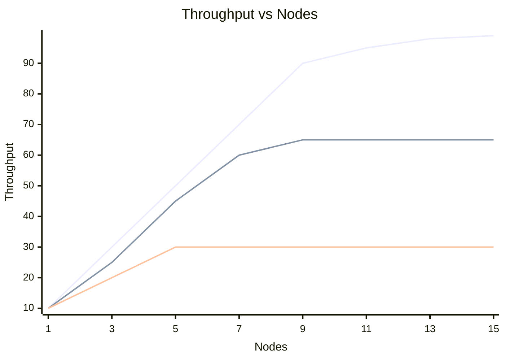
*Note: Eventual consistency scales nearly linearly with nodes (top line). Linearizability throughput plateaus due to coordination overhead (bottom line).*

---

## 9. Tradeoffs

### 9.1 The Fundamental Tradeoff Triangle

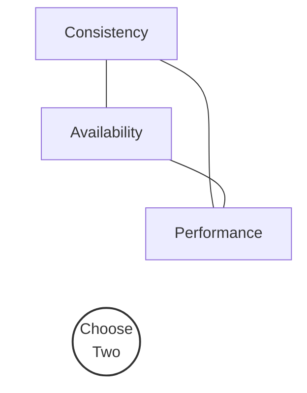

You cannot optimize all three simultaneously:
- **Strong consistency + High availability**: Requires infinite network speed (impossible)
- **Strong consistency + High performance**: Requires no replication (single point of failure)
- **High availability + High performance**: Requires weak consistency

### 9.2 When to Use Each Model

| Model | Use When | Don't Use When |
|---|---|---|
| **Linearizable** | Financial transactions, leader election, distributed locks, coordination | High throughput needed; multi-region with tight latency SLAs |
| **Sequential** | ZooKeeper-style configuration stores; acceptable if reads can be slightly stale | Real-time financial data |
| **Causal** | Social media feeds (comments should appear after their parent posts); collaborative editing | Need total ordering of all events |
| **Eventual** | Shopping carts, analytics, metrics, logs, user sessions | Financial balances, inventory counts (unless combined with conflict resolution) |
| **Session** | Web applications, personalization, user preferences | Cross-user coordination |
| **Tunable** | Mixed workloads with different consistency needs per query | Simple systems where one model suffices |

### 9.3 Cost Analysis

| Model | Hardware Cost | Development Cost | Operational Cost |
|---|---|---|---|
| Linearizable | High (consensus quorum, fast interconnects) | Low (simple mental model) | Medium (leader failover) |
| Eventual | Low (any node can serve any request) | High (must handle conflicts, stale reads) | Low (self-healing) |
| Tunable | Medium | High (must understand per-query tradeoffs) | High (monitoring consistency SLAs) |
| CRDTs | Medium | Medium (limited data structures) | Low (automatic convergence) |

### 9.4 CAP Theorem Implications

During a network partition:

| Choice | Behavior | Example |
|---|---|---|
| **CP** | Refuse writes/reads on minority partition | Spanner, etcd, ZooKeeper |
| **AP** | Accept writes on all partitions; reconcile later | Cassandra (CL=ONE), DynamoDB (default) |

**Important nuance**: Most systems are not purely CP or AP. They offer per-operation tunability:
- Cassandra with CL=QUORUM is CP for that specific operation
- DynamoDB with strongly consistent reads is CP for that specific read
- The system itself is neither — it's the operation that chooses

### 9.5 Common Mistakes

1. **Assuming linearizability when you have eventual consistency**: The most dangerous mistake. Example: checking inventory with eventual consistency before selling an item → overselling.

2. **Using strong consistency everywhere**: "Just make everything linearizable" → system becomes slow and unavailable during partitions. 90% of reads probably don't need it.

3. **Ignoring clock skew**: Using physical timestamps for LWW and assuming they're perfectly synchronized → data loss. Use logical clocks or hybrid clocks instead.

4. **Confusing linearizability with serializability**: They are different things! A system can be serializable but not linearizable, and vice versa.

5. **Thinking eventual consistency means "eventually correct"**: It means "eventually the same across replicas." If the conflict resolution strategy is wrong (e.g., LWW with bad timestamps), you converge to the wrong value everywhere.

6. **Underestimating CRDT metadata overhead**: OR-Sets can accumulate enormous amounts of metadata (tombstones). Without garbage collection, they can grow unboundedly.

---

## 10. Failure Scenarios

### 10.1 Network Partition under Strong Consistency

**Scenario**: A 5-node Raft cluster partitions into [A, B] and [C, D, E].

```
Partition:  [A, B]  |||  [C, D, E]

[A, B]: Cannot form majority (need 3 of 5)
         → All writes REJECTED
         → Reads may be stale (if A or B was leader)
         → Leader steps down after election timeout

[C, D, E]: Can form majority (3 of 5)
            → Elects new leader
            → Continues serving reads and writes
            → When partition heals, A and B catch up
```

**Impact**: Clients connected to A or B experience downtime. Clients connected to C, D, or E see no disruption.

### 10.2 Split Brain in Multi-Leader Replication

**Scenario**: Two data centers each have a leader. Network partition between them.

```
DC-West (Leader W):  Write(user.email = "alice@west.com")
                     ┊
        PARTITION    ┊
                     ┊
DC-East (Leader E):  Write(user.email = "alice@east.com")
```

**When partition heals**: Both leaders have conflicting writes for the same key.

**Resolution options**:
1. **LWW**: Latest timestamp wins → one email is silently lost
2. **Application-level merge**: Present both values to the user
3. **CRDTs**: If the data type supports it, merge automatically

### 10.3 Stale Reads under Eventual Consistency

**Scenario**: User updates their profile picture, then immediately views their profile.

```
1. Client → Write to Replica A (primary): profile_pic = "new.jpg" ✓
2. Client → Read from Replica B (secondary): profile_pic = "old.jpg" ← STALE!
3. User sees old profile picture, thinks update failed
4. User uploads again, creating duplicate data
```

**Fix**: Use read-your-writes consistency (sticky sessions or read-from-primary-after-write).

### 10.4 Write-Write Conflict in Leaderless Systems

**Scenario**: Two clients concurrently update the same shopping cart.

```
Client A: Add "laptop" to cart    → Replica 1, 2 (quorum W=2 of N=3)
Client B: Add "keyboard" to cart  → Replica 2, 3 (quorum W=2 of N=3)

Replica 1: cart = {laptop}
Replica 2: cart = ??? (received both writes)
Replica 3: cart = {keyboard}
```

**If using LWW**: One item is lost! The shopping cart only has either "laptop" or "keyboard."

**If using CRDTs (OR-Set)**: Both items are preserved. Cart = {laptop, keyboard}.

**This is why Amazon's original Dynamo used "siblings"** — it returned both conflicting values and let the application merge them.

### 10.5 MVCC Long-Running Transaction Problem

**Scenario**: A reporting query takes 2 hours. Meanwhile, the OLTP workload generates millions of updates.

```
Report TX starts at snapshot T=1000
OLTP writes: T=1001, 1002, ..., 1,000,000

All versions from T=1001 to T=1,000,000 CANNOT be garbage collected
because the report TX might still need T=1000 versions!

Result: Table bloat, disk fills up, VACUUM cannot keep up
```

**Fix**: 
- Use a separate read replica for reporting queries
- Set `idle_in_transaction_session_timeout` in PostgreSQL
- Use FoundationDB (hard 5-second transaction limit)

### 10.6 Clock Skew and LWW

**Scenario**: Node A's clock is 10 seconds ahead of Node B's clock.

```
Real time 0: Node A writes x = "from_A", timestamp = 10 (clock skew!)
Real time 5: Node B writes x = "from_B", timestamp = 5

LWW resolution: "from_A" wins (timestamp 10 > 5)
But "from_B" was actually written LATER in real time!
```

**Impact**: Data loss. The later write is silently discarded.

**Fix**: Use Hybrid Logical Clocks (HLC), Lamport timestamps, or Google's TrueTime.

### 10.7 CRDT Tombstone Accumulation

**Scenario**: An OR-Set is used for a "recently viewed items" list. Items are added and removed frequently.

```
Day 1: 100 unique tags
Day 30: 50,000 unique tags (many from removed elements)
Day 365: 2,000,000 unique tags

State transfer size: 2,000,000 × 40 bytes = ~80MB per sync!
```

**Fix**: Periodic "garbage collection" or "causal stability" — once all nodes have seen a tombstone, it can be pruned. Riak implements this with a configurable tombstone GC interval.

---

## 11. Debugging & Observability

### 11.1 Key Metrics to Monitor

#### Consistency-Related Metrics

| Metric | Description | Alert Threshold |
|---|---|---|
| `replication_lag_seconds` | Time since last sync to replica | >1s for session CL, >30s for eventual |
| `consistency_violations_total` | Detected reads that returned stale data | Any non-zero in strong CL |
| `conflict_resolution_total` | Number of write conflicts resolved | Increasing trend indicates issues |
| `crdt_merge_duration_ms` | Time to merge CRDT states | >100ms indicates metadata bloat |
| `mvcc_version_count` | Number of live versions per key | >100 indicates GC backlog |
| `vacuum_last_run_age_seconds` | Time since last VACUUM (PostgreSQL) | >1 hour for active tables |
| `read_repair_count` | Number of read repairs triggered | High count indicates replication lag |

#### Cassandra-Specific Metrics

```
# JMX metrics to monitor
org.apache.cassandra.metrics:
  ClientRequest.Read.Latency.99thPercentile
  ClientRequest.Write.Latency.99thPercentile  
  Storage.TotalHints              # hinted handoff backlog
  Storage.TotalHintsInProgress    # hints being delivered
  ThreadPools.ReadStage.PendingTasks
  ColumnFamily.ReadRepairRequests # read repairs triggered
```

### 11.2 Detecting Consistency Violations

#### Linearizability Checker (Jepsen-Style)

```java
/**
 * Simple linearizability checker.
 * Records all operations and checks if a valid linearization exists.
 * 
 * In production, use Jepsen (https://jepsen.io) for thorough testing.
 */
public class LinearizabilityChecker {
    
    record Operation(
        String type,        // "read" or "write"
        String key,
        String value,       // written value (write) or returned value (read)
        long invokeTime,    // when the operation started
        long responseTime   // when the operation completed
    ) {}
    
    private final List<Operation> history = new ArrayList<>();
    
    public void recordRead(String key, String value, long invokeTime, long responseTime) {
        history.add(new Operation("read", key, value, invokeTime, responseTime));
    }
    
    public void recordWrite(String key, String value, long invokeTime, long responseTime) {
        history.add(new Operation("write", key, value, invokeTime, responseTime));
    }
    
    /**
     * Check if the recorded history is linearizable.
     * This is a simplified check for single-key histories.
     * 
     * Full linearizability checking is NP-complete in general,
     * but efficient for small histories.
     */
    public boolean checkSingleKey(String key) {
        List<Operation> keyOps = history.stream()
                .filter(op -> op.key.equals(key))
                .sorted(Comparator.comparingLong(Operation::invokeTime))
                .toList();
        
        // For each read, check: does there exist a valid linearization point
        // for a preceding write that produces this read value?
        String currentValue = null;
        long lastWriteResponseTime = 0;
        
        for (Operation op : keyOps) {
            if (op.type.equals("write")) {
                currentValue = op.value;
                lastWriteResponseTime = op.responseTime;
            } else { // read
                // If the read started after the last write completed,
                // it MUST return the written value
                if (op.invokeTime > lastWriteResponseTime && !Objects.equals(op.value, currentValue)) {
                    System.err.println("LINEARIZABILITY VIOLATION: Read returned '" + op.value + 
                            "' but expected '" + currentValue + "' at time " + op.invokeTime);
                    return false;
                }
            }
        }
        return true;
    }
}
```

### 11.3 Distributed Tracing for Consistency

Use OpenTelemetry to trace consistency-related operations:

```java
import io.opentelemetry.api.trace.Span;
import io.opentelemetry.api.trace.Tracer;

public class ConsistencyAwareService {
    
    private final Tracer tracer;
    
    public String readWithConsistency(String key, String consistencyLevel) {
        Span span = tracer.spanBuilder("read")
                .setAttribute("db.consistency_level", consistencyLevel)
                .setAttribute("db.key", key)
                .startSpan();
        
        try {
            long start = System.nanoTime();
            
            String value = performRead(key, consistencyLevel);
            
            long latencyMs = (System.nanoTime() - start) / 1_000_000;
            span.setAttribute("db.read_latency_ms", latencyMs);
            span.setAttribute("db.replicas_contacted", getReplicasContacted());
            span.setAttribute("db.read_repair_triggered", wasReadRepairTriggered());
            
            return value;
        } catch (Exception e) {
            span.recordException(e);
            throw e;
        } finally {
            span.end();
        }
    }
    
    // Implementation stubs
    private String performRead(String key, String cl) { return "value"; }
    private int getReplicasContacted() { return 3; }
    private boolean wasReadRepairTriggered() { return false; }
}
```

### 11.4 Logging Best Practices

```java
// Log consistency-related events at appropriate levels

// INFO: Normal operations
log.info("Read key={} with CL={}, latency={}ms, replicas={}", 
    key, consistencyLevel, latency, replicaCount);

// WARN: Degraded consistency  
log.warn("Read repair triggered for key={}, stale_replicas={}", 
    key, staleReplicaCount);

log.warn("Hinted handoff accumulated: hints={}, target_node={}", 
    hintCount, targetNode);

// ERROR: Consistency violations
log.error("Consistency violation detected: expected={}, actual={}, key={}, CL={}", 
    expected, actual, key, consistencyLevel);

// DEBUG: CRDT merge operations
log.debug("CRDT merge: type={}, local_state_size={}, remote_state_size={}, merged_size={}", 
    crdtType, localSize, remoteSize, mergedSize);
```

### 11.5 Testing Consistency with Jepsen

Jepsen is the gold standard for testing consistency in distributed systems. It:
1. Deploys the system on multiple nodes
2. Runs concurrent operations
3. Injects failures (network partitions, clock skew, process crashes)
4. Records a history of all operations
5. Checks if the history is consistent with the claimed consistency model

Systems that have been tested with Jepsen:
- **Passed**: etcd (linearizable), CockroachDB (serializable), Redis Raft
- **Failed initially**: MongoDB (lost writes), Cassandra (counter anomalies), Elasticsearch (stale reads under partition)

---

## 12. Interview Questions

### 12.1 Beginner Level

**Q1: What is consistency in distributed systems?**

**Expected Answer**: Consistency in distributed systems refers to the guarantee about what values a read operation will return after a write. It defines the contract between the system and its clients about the visibility and ordering of operations. Unlike ACID consistency (which is about invariants), distributed consistency is about agreement across replicas.

**Q2: Explain eventual consistency with a real-world example.**

**Expected Answer**: Eventual consistency means that if no new writes occur, all replicas will eventually converge to the same value. Example: DNS propagation. When you update a DNS record, it doesn't instantly appear everywhere. Different DNS servers may return the old IP for hours. But eventually, all DNS servers will have the new record. During the propagation period, different users may see different IPs.

**Q3: What is the CAP theorem?**

**Expected Answer**: The CAP theorem states that in the presence of a network partition, a distributed system must choose between Consistency (all nodes see the same data) and Availability (all requests get a response). You cannot guarantee both during a partition. Note: CAP uses "consistency" to mean linearizability specifically.

### 12.2 Intermediate Level

**Q4: What is the difference between linearizability and serializability?**

**Expected Answer**: 
- **Linearizability** is about single objects — operations on a single object appear to happen atomically and in real-time order. It's a distributed systems concept.
- **Serializability** is about transactions — multiple operations on multiple objects appear to execute in some serial order. It's a database concept.
- **Strict serializability** is both — transactions are serializable and ordered by real time. Spanner provides this.
- A common mistake is using them interchangeably.

**Q5: How does Cassandra's tunable consistency work?**

**Expected Answer**: Cassandra lets you set the consistency level per operation. With N replicas, you choose how many replicas must acknowledge a read (R) or write (W). If R + W > N, you get strong consistency because at least one replica in the read set will have the latest write. Common settings: QUORUM for both (R = W = ⌊N/2⌋ + 1) gives strong consistency; ONE for both gives eventual consistency with lowest latency.

**Q6: What is read repair and how does it work?**

**Expected Answer**: Read repair is a mechanism used in eventually consistent systems. When a coordinator sends a read request to multiple replicas and receives responses with different versions, it identifies the most recent version and asynchronously sends it to the stale replicas, "repairing" the inconsistency. Cassandra performs this probabilistically (configurable percentage of reads).

### 12.3 Advanced Level

**Q7: Explain CRDTs and when you would use them instead of traditional conflict resolution.**

**Expected Answer**: CRDTs are data structures that can be replicated and merged without conflicts. They guarantee strong eventual consistency: once all updates are delivered, all replicas have the same state. Use CRDTs when: (1) you need multi-master writes without coordination, (2) you can model your data as a counter, set, register, or map, (3) you're okay with the metadata overhead. Don't use when: (1) your data model doesn't fit CRDT types, (2) metadata overhead is unacceptable, (3) you need constraints that CRDTs can't enforce (e.g., account balance ≥ 0).

**Q8: Explain the write skew anomaly and how to prevent it.**

**Expected Answer**: Write skew occurs under snapshot isolation when two transactions read overlapping data, make decisions based on what they read, and write to different objects. Each transaction's read-write doesn't conflict (they write different objects), so both commit. But the combined result violates an invariant. Example: Two doctors both check if another doctor is on call, both see "yes," both remove themselves. Prevention: (1) true serializable isolation (SSI in PostgreSQL), (2) SELECT FOR UPDATE to take explicit locks, (3) materializing the conflict by creating a lock row.

**Q9: How does Google Spanner achieve external consistency without perfectly synchronized clocks?**

**Expected Answer**: Spanner uses TrueTime, which provides a bounded uncertainty interval [earliest, latest] instead of a point timestamp. After a transaction obtains a commit timestamp T, it performs "commit wait" — it waits until TrueTime reports that the current time is definitely after T. This guarantees that any transaction that starts after the wait sees T's effects. The uncertainty is typically 1-7ms thanks to GPS receivers and atomic clocks in each data center. This means every commit adds ~7ms of latency, but guarantees external consistency.

### 12.4 FAANG-Level System Design

**Q10: Design a distributed counter that can handle millions of increments per second across multiple data centers.**

**Expected Answer Framework**:

1. **Use a G-Counter CRDT** — each node only increments its own counter
2. **Shard the counter** — partition by user/region for even higher throughput
3. **Periodic inter-DC synchronization** — send state every few seconds (not per operation)
4. **Accept that the displayed count may lag** — "10M+ views" is fine; exact count in real-time is not needed
5. **For exact counts when needed** — route to a single leader or use consensus
6. **For decrements (e.g., inventory)** — use a PN-Counter, but be aware that negative values are possible; enforce constraints at the application layer periodically

**Q11: You're designing a collaborative document editor (like Google Docs). Compare using OT vs CRDTs. Which would you choose and why?**

**Expected Answer Framework**:

1. **OT**: Requires a central server to order operations. Good for text editing. Google Docs uses it. Simpler client logic, but complex server-side transformation functions. Cannot work offline (need server for ordering).

2. **CRDTs**: Fully decentralized. Can work offline. Each client applies operations locally and syncs later. Higher metadata overhead. Figma uses this approach. Recent advances (Yjs, Automerge) make text CRDTs practical.

3. **Choice**: For a new system, CRDTs (specifically Yjs or Automerge) because: offline support, simpler correctness reasoning, no central server bottleneck. OT is a legacy approach (Google would probably use CRDTs if building Docs today).

---

## 13. Exercises

### Exercise 1: Consistency Level Analysis (Conceptual)

You have a Cassandra cluster with `N=5` replicas. For each scenario below, determine: (a) the minimum consistency level for reads and writes, and (b) what happens if one node fails.

1. You need strong consistency for a banking application
2. You need low-latency reads for a recommendation engine (stale data is OK)
3. You need fast writes for a logging system (reads are rare and can be stale)

**Hints**: Use the formula R + W > N for strong consistency.

### Exercise 2: Implement an LWW-Map CRDT (Coding)

Implement a Last-Writer-Wins Map that supports:
- `put(key, value)` — add/update a key-value pair
- `remove(key)` — remove a key
- `get(key)` — get the current value
- `merge(other)` — merge with another LWW-Map

Each entry should have a timestamp. On merge, the entry with the higher timestamp wins (whether it's a put or a remove). A remove with a higher timestamp than a put should win.

### Exercise 3: MVCC Conflict Detection (Coding)

Extend the MVCC implementation in Section 7 to detect and handle write skew:
1. Add a `readSet` to each transaction (track what was read)
2. During commit, check if any value in the read set has been modified by a committed transaction since the snapshot
3. If so, abort the transaction

### Exercise 4: Eventual Consistency Simulation (System Design)

Design a simulation of an eventually consistent key-value store with:
- 5 nodes in a ring
- Gossip-based anti-entropy (random peer sync every 100ms)
- Measure: how long does it take for a write to propagate to all nodes?
- Plot: convergence time vs gossip frequency

### Exercise 5: Linearizability Testing (Advanced)

Implement a simple linearizability checker:
1. Record all read and write operations with their invoke/response timestamps
2. For each read, verify that a valid linearization point exists
3. Test it against: (a) a linearizable implementation (single lock), (b) an eventually consistent implementation (delayed replication)

### Exercise 6: CRDT Shopping Cart (System Design)

Design a shopping cart using CRDTs that:
- Supports add, remove, and change quantity
- Works across multiple data centers
- Handles the "removed item reappears" problem
- Preserves the intent of all concurrent modifications

**Hint**: Use an OR-Set for items and a PN-Counter for quantities per item.

---

## 14. Expert Insights

### 14.1 The Hidden Cost of Strong Consistency

**Tail latency amplification**: In a quorum system, the read/write latency is determined by the slowest responder in the quorum. With 3 replicas and QUORUM (2 of 3), your latency = max(fastest 2). This means a single slow node affects 2/3 of requests. With 5 replicas, a single slow node affects fewer requests, but you need 3 acks (more total work).

**Production insight**: At Google, Spanner's commit wait adds ~7ms to every write. For the vast majority of use cases, this is acceptable. But for high-frequency trading or real-time gaming, it's a dealbreaker.

### 14.2 Eventual Consistency Is Harder Than You Think

**The "eventually" problem**: How long is "eventually"? There's no upper bound! In practice:
- Same data center: milliseconds to seconds
- Cross data center: seconds to minutes
- During network partition: indefinitely
- After partition heals: seconds to hours (depending on backlog)

**Production lesson from Amazon**: The original Dynamo paper showed that in practice, 99.9% of reads in a well-functioning cluster return consistent data within 100ms. But that 0.1% can cause real problems — especially for inventory management during flash sales.

### 14.3 CRDTs in Production: Lessons Learned

**Riak's experience**:
- CRDTs work great for small, frequently updated objects (counters, sets with <1000 elements)
- For large objects, the metadata overhead becomes a real problem
- Tombstone accumulation requires careful GC tuning
- Engineers must understand CRDT semantics to avoid misuse

**Redis Enterprise's experience**:
- CRDT-based Active-Active replication enables multi-master across data centers
- But: not all Redis data types have natural CRDT equivalents
- Lists, for example, are difficult to make conflict-free (order matters)

### 14.4 The Future: Programmable Consistency

Modern systems are moving toward **programmable consistency** where developers specify consistency requirements declaratively:

```sql
-- Hypothetical SQL extension
SELECT * FROM users WHERE id = 123
  WITH CONSISTENCY LINEARIZABLE;

SELECT * FROM products WHERE category = 'electronics'
  WITH CONSISTENCY EVENTUAL
  MAX_STALENESS 5 SECONDS;
```

Google's Spanner already supports bounded staleness reads:
```sql
-- Read data that is at most 10 seconds stale
SELECT * FROM accounts 
  WHERE customer_id = 42
  WITH MAX_STALENESS 10s;
```

### 14.5 Consistency and Microservices

In a microservices architecture, consistency becomes even more complex:
- Each service owns its data (no shared database)
- Cross-service operations require distributed coordination
- The **Saga pattern** provides eventual consistency for cross-service transactions
- **Outbox pattern** ensures reliable event publishing

**Key insight**: In microservices, **eventual consistency is the default**. Strong consistency across service boundaries requires explicit coordination (e.g., two-phase commit, which most architects avoid due to availability concerns).

### 14.6 The Pacelc Theorem (Beyond CAP)

PACELC extends CAP: During a **P**artition, choose between **A**vailability and **C**onsistency. **E**lse (normal operation), choose between **L**atency and **C**onsistency.

| System | PA/PC | EL/EC |
|---|---|---|
| Spanner | PC | EC (high latency for consistency) |
| Cassandra (CL=ONE) | PA | EL (low latency, weak consistency) |
| Cassandra (CL=QUORUM) | PC | EC |
| DynamoDB (default) | PA | EL |
| MongoDB (default) | PA | EL |

This is more nuanced than CAP because it captures the latency-consistency tradeoff during normal operation (not just during partitions).

### 14.7 Scaling CRDTs: Delta-State CRDTs

Standard state-based CRDTs send their full state on each sync, which doesn't scale. **Delta-state CRDTs** (δ-CRDTs) improve this by sending only the changes since the last sync:

- Instead of sending `{A:5000, B:3000, C:7000}`, send `{A:+1}` (the delta)
- Deltas are themselves CRDTs — they can be merged
- If a delta is lost, the system falls back to full state sync
- This dramatically reduces network overhead for large states

### 14.8 Consistency Models and Testing

**The testing spectrum**:

1. **Unit tests**: Test CRDT merge properties (commutativity, associativity, idempotency)
2. **Integration tests**: Test consistency under normal operation
3. **Chaos tests (Jepsen)**: Test consistency under failures
4. **Production verification**: Continuously verify consistency in production (shadow reads)

**Shadow reads**: Read from both the primary and replica, compare results, log discrepancies. This is how many companies detect consistency issues in production without affecting users.

---

## 15. Chapter Summary

### Key Concepts

- **Consistency models** define the contract between a distributed system and its clients about what values reads may return after writes.

- **Linearizability** is the strongest model: the system behaves as if there's one copy. Expensive but simple to reason about. Used for coordination: locks, leader election, financial transactions.

- **Sequential consistency** relaxes real-time ordering but maintains a global total order. All clients see operations in the same order, but may be behind real-time.

- **Causal consistency** preserves cause-and-effect ordering. Implemented with vector clocks. Good for social media, collaborative editing.

- **Eventual consistency** guarantees convergence but provides no timing or ordering guarantees. The weakest useful model. Highest performance and availability.

- **Session consistency** (read-your-writes + monotonic reads + monotonic writes) is a practical sweet spot for user-facing applications.

- **Linearizability ≠ Serializability**: Linearizability is about single objects in distributed systems; serializability is about multi-object transactions in databases. Don't confuse them.

- **MVCC** enables efficient reads by maintaining multiple versions. Powers snapshot isolation. Used in PostgreSQL, MySQL, CockroachDB.

- **Tunable consistency** (Cassandra-style) lets you choose per-operation. R + W > N → strong consistency. Lower values → eventual consistency with better performance.

- **CRDTs** are data structures that merge automatically without conflicts. G-Counter, PN-Counter, LWW-Register, OR-Set are the building blocks. Based on join-semilattice math (commutative, associative, idempotent merge).

- **OT vs CRDTs** for collaborative editing: OT needs a central server; CRDTs are decentralized. Industry is moving toward CRDTs.

### Critical Tradeoffs

- Stronger consistency → Higher latency, lower availability, lower throughput
- Weaker consistency → Lower latency, higher availability, higher throughput, more application complexity
- The right choice depends on the use case, not on a universal rule

### Production Rules of Thumb

1. Default to eventual consistency; strengthen only where needed
2. Use session consistency for user-facing reads
3. Use linearizability only for coordination (locks, elections)
4. Monitor replication lag — it's the #1 indicator of consistency issues
5. Test your consistency guarantees with Jepsen or equivalent tools
6. CRDTs are great for specific data types; don't try to make everything a CRDT
7. MVCC is your friend for read-heavy workloads, but watch out for VACUUM
8. Understand the difference between linearizability and serializability — interviewers love this question

---

*"In distributed systems, there is no single 'right' consistency model. There is only the consistency model that makes the right tradeoff for your specific use case, failure mode, and latency budget."*
