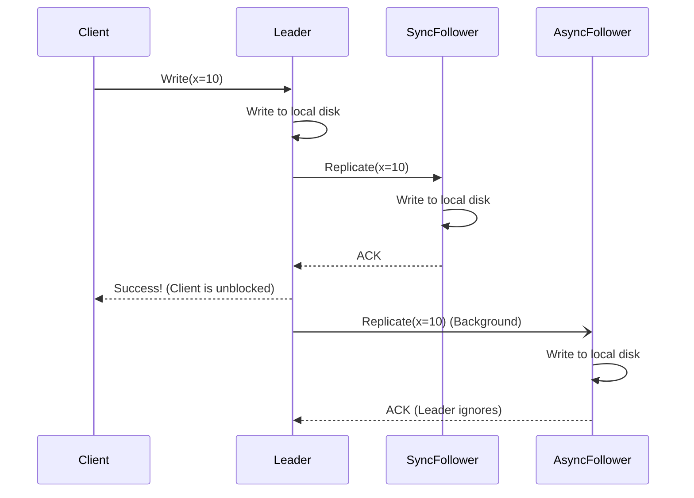
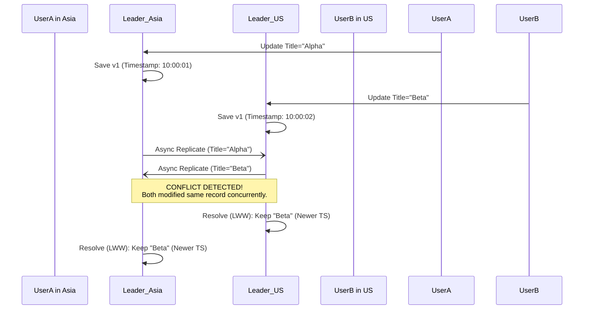
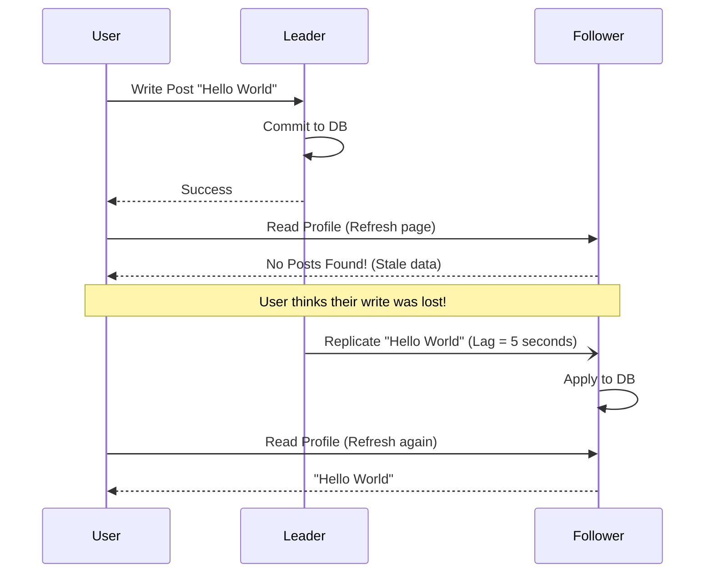
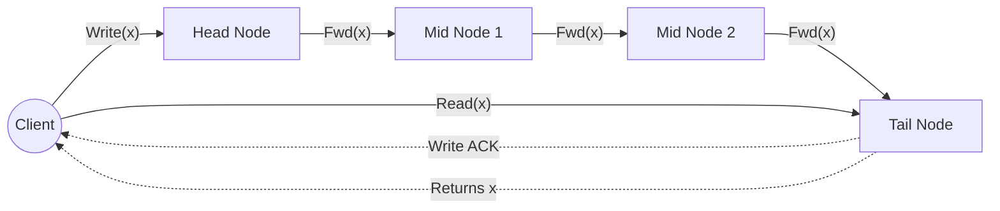

# Chapter 8: Replication

## 1. Why This Matters

In the world of distributed systems, data is the most critical asset. However, relying on a single node to store and serve data is a recipe for disaster. Hardware fails, networks partition, and traffic spikes can overwhelm even the most powerful single-machine architectures. This is where **replication**—the practice of keeping a copy of the same data on multiple machines that are connected via a network—becomes indispensable. 

Replication matters because it directly addresses three foundational pillars of distributed system design:

1. **High Availability (Fault Tolerance):** If one machine goes down due to a hardware crash, power loss, or software bug, the system can continue to operate seamlessly because other machines hold a replica of the same data. The system can survive partial failures without compromising overall service uptime.
2. **Reduced Latency (Geographic Proximity):** If your users are globally distributed, routing all requests to a single datacenter in US-East will result in terrible latency for users in Asia or Europe. By replicating data to datacenters close to your users, you drastically reduce round-trip times, leading to a much snappier user experience.
3. **Increased Throughput (Read Scalability):** If your application is read-heavy (e.g., a social media feed, a product catalog, or a content delivery network), a single machine can only serve a finite number of queries per second. By replicating the data across dozens or hundreds of machines, you can distribute the read workload, scaling your read throughput almost linearly.

Without replication, modern cloud-native architectures, highly available databases, and globally scaled applications like Netflix, Google, Amazon, and Uber would fundamentally cease to exist. However, replication is not a silver bullet. The moment you store data in more than one place, you introduce the hardest problem in distributed systems: **Keeping the copies in sync**. When data changes on one replica, how do the other replicas know? What happens if they disagree? What if a network partition prevents them from communicating? 

Understanding replication means understanding the intricate dance of consistency, performance, and fault tolerance.

---

## 2. Beginner Intuition

Imagine you are the manager of a highly popular, fast-paced restaurant. You have a single "Master Recipe Book" that contains the secret ingredients for all the dishes. 

Initially, you keep the book in a safe in your office. Every time a chef needs a recipe, they have to walk all the way to your office, wait in line if another chef is reading it, look up the recipe, and walk back. This is slow (high latency), and if your office door is locked (node failure), the entire kitchen grinds to a halt.

To solve this, you decide to **replicate** the Master Recipe Book. You make three exact copies and give one to the Head Chef, one to the Sous Chef, and one to the Pastry Chef. 

Now, when a chef needs a recipe, they just look at their local copy. **Latency is near zero, and throughput is massive.** If the Pastry Chef loses their book, they can just borrow the Head Chef's book while a new copy is printed. The kitchen is highly available.

But there is a catch. Suppose you decide to change the recipe for the signature soup, reducing the amount of salt. You update your Master Recipe Book. But the chefs are currently cooking using their local copies. 

How do you propagate the update?
- **Synchronous Replication:** You shout to all the chefs, "Stop cooking! Bring me your books!" You update every single book, verify they are updated, and then say, "Resume cooking!" This guarantees everyone uses the new recipe, but the kitchen is stalled while the updates happen. If the Pastry Chef is in the bathroom, you have to wait for them to return before anyone can cook again.
- **Asynchronous Replication:** You send a runner with sticky notes containing the new recipe to each chef. The runner updates the books whenever the chefs have a free second. This is fast, the kitchen never stops, but for a brief window of time, some chefs might use the old salty recipe while others use the new one. 

What if you allow *any* chef to invent and update a recipe in their own book, without going through you? This is **Multi-Leader Replication**. If the Head Chef adds sugar to the sauce in their book, and the Sous Chef adds spice to the sauce in their book at the exact same time, what is the *true* recipe when they eventually sync up? You now have a **conflict** that needs resolving.

This analogy perfectly captures the core tensions of database replication: Availability vs. Consistency, and Throughput vs. Latency.

---

## 3. Core Theory

The theoretical foundation of replication revolves around how state changes (writes) are ordered and propagated across distributed nodes. There are three primary paradigms for replication, along with mathematical formalisms for ensuring consistency.

### 3.1. Single-Leader (Leader-Follower) Replication
In this model, one node is designated as the **Leader** (or Master/Primary). All write requests from clients must be routed to the leader. The leader writes the new data to its local storage and then sends the data change to all other nodes, known as **Followers** (or Slaves/Read Replicas/Secondaries), as part of a replication log or change stream.
- **Reads** can be served by the leader or any follower.
- **Writes** are strictly ordered by the leader, preventing concurrent write conflicts.
- **Tradeoff:** The leader is a single point of failure for writes, and a bottleneck for write scalability.

### 3.2. Multi-Leader (Active-Active) Replication
In this model, more than one node can accept writes. Each leader acts as a leader to clients, but also as a follower to other leaders, receiving and applying their write streams.
- Primarily used in multi-datacenter setups where you want a leader in each geographic region for low write latency.
- **Tradeoff:** Concurrent writes to the same record on different leaders introduce **Conflicts**. Conflict resolution (CRDTs, Last-Write-Wins, custom logic) becomes a core theoretical requirement.

### 3.3. Leaderless Replication (Dynamo-Style)
In this model, *any* replica can accept a write directly from a client. There is no designated leader. To ensure reliability, clients typically send writes to *several* replicas concurrently, and read from *several* replicas concurrently.
- **Quorums:** To ensure that a read always returns the most recent write, leaderless systems rely on strict quorum mathematics:
  `W + R > N`
  Where `N` is the total number of replicas, `W` is the minimum number of nodes that must acknowledge a write for it to be considered successful, and `R` is the minimum number of nodes that must be queried for a read.
  If `W + R > N`, the set of nodes written to and the set of nodes read from must overlap, guaranteeing that at least one node in the read quorum has the most recent data.

### 3.4. State Machine Replication (SMR)
State Machine Replication is a theoretical abstraction used to build fault-tolerant systems. It treats a replica as a deterministic state machine.
- If two identical state machines start in the same initial state and process the exact same sequence of commands in the exact same order, they will end up in the exact same final state.
- Therefore, the problem of replication reduces to the problem of **Distributed Consensus**: ensuring that all replicas agree on the *ordered sequence* of commands (the log). This is the basis for protocols like Raft, Paxos, and Zab.

### 3.5. Replication Lag
The difference in time (or sequence number) between the leader applying a write and a follower applying that same write is known as **Replication Lag**. In asynchronous systems, this lag can lead to consistency anomalies:
- **Read-After-Write (Read-Your-Writes) Consistency:** A guarantee that if a user reloads a page immediately after writing data, they will see their own update, rather than a stale replica.
- **Monotonic Reads:** A guarantee that a user will not read older data after having previously read newer data (which can happen if they are load-balanced across followers with different lag times).

---

## 4. Architecture Deep Dive

Let's dissect the mechanics of how these replication paradigms are implemented under the hood.

### 4.1. Single-Leader Replication Deep Dive

#### Synchronous vs. Asynchronous Replication
When a client sends a write to the leader:
- **Synchronous:** The leader waits for the follower(s) to acknowledge they have safely written the data to disk before returning a "Success" to the client. 
  - *Pros:* Zero data loss if the leader crashes.
  - *Cons:* If a follower is dead or the network is slow, the leader blocks. The system's availability is tied to the slowest node.
- **Asynchronous:** The leader writes to its own disk and immediately returns "Success" to the client. It sends the update to followers in the background.
  - *Pros:* High performance, low latency, immune to follower outages.
  - *Cons:* If the leader crashes before the background sync completes, any acknowledged writes are permanently lost.
- **Semi-Synchronous:** A hybrid approach where the leader waits for exactly *one* follower to acknowledge the write. This provides a balance of safety and performance.

#### Setting up New Followers
Adding a new node to a running, highly-active database is non-trivial. You cannot simply lock the database and copy files. The process usually involves:
1. Take a consistent snapshot of the leader's database at a specific point in time (without taking locks, e.g., using MVCC or snapshot isolation).
2. Copy the snapshot to the new follower node.
3. The follower connects to the leader and requests all data changes that occurred *since* the snapshot was taken. This requires the snapshot to be associated with an exact position in the leader's replication log (e.g., a Log Sequence Number, LSN, or MySQL's binlog coordinates).
4. The follower processes the backlog (catching up) until it is in sync with the leader.

#### Handling Node Outages
- **Follower Failure (Catch-up recovery):** The follower keeps a log on its local disk of the last transaction it processed. When it reboots, it connects to the leader and requests all transactions subsequent to its last known state.
- **Leader Failure (Failover):** This is much harder. 
  1. *Detection:* Nodes use heartbeats to detect the leader is dead.
  2. *Election:* The remaining nodes (or a configuration manager like ZooKeeper) elect a new leader. Usually, the follower with the most up-to-date log is chosen.
  3. *Reconfiguration:* Clients must be rerouted to the new leader.
  *Dangers of Failover:* Split-brain (two nodes think they are the leader), discarded writes (the old leader wakes up and realizes it was deposed, but it accepted writes that the new leader doesn't have. These are usually discarded).

#### Implementation: How the Data is Replicated
- **Statement-based replication:** The leader logs every SQL statement (`INSERT`, `UPDATE`) and followers execute the exact same statements. 
  - *Flaw:* Non-deterministic functions like `NOW()` or `RAND()` will generate different results on replicas.
- **Write-Ahead Log (WAL) shipping:** The leader sends its low-level, disk-block WAL bytes to followers. (Used in PostgreSQL). 
  - *Flaw:* Tightly couples the replication to the exact storage engine and version. You can't run different software versions on the leader and follower easily.
- **Logical (Row-based) replication:** The leader writes a log of exactly which rows were changed (e.g., row ID 123, column X changed from 'A' to 'B'). This decouples replication from the storage engine format and is the most common modern approach (e.g., MySQL binlog row format).

### 4.2. Multi-Leader Replication Deep Dive

Multi-leader is predominantly used in multi-datacenter deployments. If you have datacenters in Tokyo, Frankfurt, and Virginia, each DC has a leader. Clients route to their closest DC.

#### Topologies
How do the leaders send updates to each other?
- **Circular Topology:** A -> B -> C -> A. If one node fails, it breaks the replication loop.
- **Star Topology:** One central node routes to all others. Also fragile.
- **All-to-All Topology:** Every leader sends its writes to every other leader. This is the most fault-tolerant but introduces network complexities (messages can arrive out of order, e.g., an UPDATE arrives before the INSERT).

#### Conflict Resolution
If User 1 updates Title to 'A' in Tokyo, and User 2 updates Title to 'B' in Virginia at the same time, we have a conflict.
- **Last Write Wins (LWW):** Assign a timestamp to every write. Discard the write with the older timestamp. (Prone to clock skew issues; data can be lost).
- **Merge/Concat:** If it's text, merge them together (e.g., 'A/B').
- **Custom Application Logic:** The database passes the conflicting versions back to the application layer. The application resolves it using business logic (e.g., merging shopping carts).
- **CRDTs (Conflict-Free Replicated Data Types):** Advanced mathematical data structures (like maps, sets, counters) that automatically merge concurrent updates in a mathematically provable, conflict-free way (used in Riak, Redis Enterprise).

### 4.3. Leaderless Replication Deep Dive (Dynamo-Style)

In leaderless systems (like Cassandra, DynamoDB, Riak), the client acts as the coordinator or sends requests to a coordinator node which broadcasts to the replica set.

#### Handling Stale Reads
Since writes are accepted even if some nodes are down, how do nodes catch up?
- **Read Repair:** When a client reads from a quorum of nodes, it might get version 5 from Node A and version 4 from Node B. The client (or coordinator) notices Node B is stale, and immediately issues a background write to Node B with version 5. This heals the system during read operations.
- **Anti-Entropy Process:** A background daemon constantly runs on the nodes, comparing data using **Merkle Trees** (cryptographic hash trees that allow efficient comparison of large datasets). If a difference is found, the missing blocks are synced.

#### Sloppy Quorums and Hinted Handoff
What if the network partitions and the client cannot reach a strict quorum (W) of the designated nodes for a specific row?
In a strictly consistent system, the write fails. But leaderless systems favor availability.
They use a **Sloppy Quorum**: The write is accepted by *any* N healthy nodes in the cluster, even if they aren't the designated replicas for that partition.
These proxy nodes store a "hint" alongside the data indicating its true destination. When the network heals, the proxy node uses **Hinted Handoff** to forward the data to the correct replica.
This provides massive write availability, but breaks the `W+R>N` consistency guarantee temporarily.

### 4.4 Chain Replication
A unique variant of single-leader replication used in systems requiring high throughput and strong consistency (e.g., Microsoft CRAQ).
- Nodes are arranged in a linear chain.
- Writes are always sent to the **Head** of the chain. The Head applies the write and forwards it to the next node.
- The write propagates down the chain.
- When it hits the **Tail** node, the write is considered committed, and the Tail replies to the client.
- Reads are *always* served by the Tail. This guarantees that any data read has been fully replicated across all nodes, preventing dirty reads and ensuring strong consistency without the overhead of quorum voting.

---

## 5. Visual Diagrams

Here are five Mermaid diagrams illustrating the core concepts of replication architectures.

### 5.1. Single-Leader Synchronous vs Asynchronous Replication Flow


### 5.2. Multi-Leader Conflict Scenario


### 5.3. Quorum Read/Write in Leaderless Architecture
```mermaid
flowchart TD
    Client((Client))
    NodeA[(Node A)]
    NodeB[(Node B)]
    NodeC[(Node C)]
    NodeD[(Node D - Dead)]

    subgraph Cluster [N=3 Replicas for Key K]
        NodeA
        NodeB
        NodeC
    end

    Client -- "Write Request" --> NodeA
    Client -- "Write Request" --> NodeB
    Client -- "Write Request" --> NodeC

    NodeA -. "ACK (1)" .-> Client
    NodeB -. "ACK (2)" .-> Client
    
    Note right of Client: Write Success!<br/>W=2 nodes acknowledged.
    
    Client -- "Read Request" --> NodeB
    Client -- "Read Request" --> NodeC
    
    NodeB -. "Returns v2" .-> Client
    NodeC -. "Returns v1" .-> Client

    Note right of Client: Read Success! R=2.<br/>Client resolves v2 as newest.<br/>Issues Read Repair to Node C.
```

### 5.4. Replication Lag Timeline & Read-Your-Writes Anomaly


### 5.5. Chain Replication


---

## 6. Real Production Examples

How do the tech giants use these replication concepts in production?

### 6.1. MySQL and PostgreSQL (Traditional Single-Leader)
Most traditional web architectures (e.g., early Facebook, Twitter, GitHub) started with MySQL or PostgreSQL using Single-Leader replication.
- **GitHub:** Uses massive MySQL clusters. To handle read scale, they replicate asynchronously to dozens of read replicas. They have built robust infrastructure to monitor replication lag, routing read queries to the leader if the replica lag exceeds a certain threshold, ensuring users don't experience "read-your-writes" anomalies.
- **Failover:** Automated failover is handled by tools like Orchestrator (MySQL) or Patroni (PostgreSQL) which monitor the leader and safely promote a follower using consensus protocols like Raft to avoid split-brain.

### 6.2. Amazon DynamoDB and Apache Cassandra (Leaderless)
Amazon's original Dynamo paper revolutionized leaderless replication.
- **Cassandra (used by Netflix, Uber):** Operates on a peer-to-peer ring. Every node is identical. When Uber stores rider locations, it writes to a quorum of nodes. Because there is no single leader, write availability is exceptional—perfect for high-velocity telemetry data.
- **Tuning Quorums:** Netflix often tunes Cassandra quorums based on the use case. For critical billing data, they use `QUORUM` reads and writes (slower but strictly consistent). For video view history, they might use `LOCAL_ONE` writes (extreme speed, lower consistency).

### 6.3. Google Spanner (State Machine Replication / TrueTime)
Google Spanner provides global, synchronous replication with strict serializability. 
- It uses **Paxos** (a consensus algorithm) to replicate data across global datacenters synchronously.
- Because synchronous global replication is usually terribly slow, Spanner uses **TrueTime** (atomic clocks and GPS receivers in datacenters) to tightly bound clock uncertainty. This allows Spanner to order transactions globally without heavy coordination overhead, giving the illusion of a single-leader database on a global scale.

### 6.4. Figma and Collaborative Editing (Multi-Leader / CRDTs)
Figma allows dozens of users to edit a design canvas simultaneously.
- This is effectively an extreme form of multi-leader replication, where *every client browser* acts as a local leader, accepting local writes immediately for a smooth UX.
- The state is synced asynchronously to the cloud. Figma uses custom conflict resolution algorithms (similar to CRDTs) to mathematically merge overlapping edits (e.g., User A moves a box left, User B changes the box color).

---

## 7. Java Implementations

To truly understand replication, we must look at code. Below are production-grade Java examples illustrating a basic Replication Log, Quorum Reads, and Conflict Resolution.

### 7.1. Simple Replication WAL (Write-Ahead Log) implementation
This simulates a leader appending to a log and followers consuming from it asynchronously.

```java
import java.util.ArrayList;
import java.util.List;
import java.util.concurrent.CopyOnWriteArrayList;
import java.util.concurrent.atomic.AtomicLong;

// Represents a single change to the database
class LogEntry {
    final long lsn; // Log Sequence Number
    final String command;

    public LogEntry(long lsn, String command) {
        this.lsn = lsn;
        this.command = command;
    }
    
    @Override
    public String toString() { return lsn + ":" + command; }
}

// The Leader Database
class LeaderDatabase {
    private final List<LogEntry> wal = new CopyOnWriteArrayList<>();
    private final AtomicLong lsnGenerator = new AtomicLong(0);
    private final List<String> actualDataStore = new ArrayList<>(); // Simulated storage
    
    // Asynchronous replication subscribers
    private final List<FollowerDatabase> followers = new ArrayList<>();

    public void addFollower(FollowerDatabase follower) {
        followers.add(follower);
    }

    public synchronized void write(String data) {
        // 1. Assign sequence number
        long currentLsn = lsnGenerator.incrementAndGet();
        LogEntry entry = new LogEntry(currentLsn, data);
        
        // 2. Append to WAL
        wal.add(entry);
        
        // 3. Apply to local state machine
        actualDataStore.add(data);
        System.out.println("Leader applied: " + entry);

        // 4. Asynchronously push to followers (Fire and forget)
        for (FollowerDatabase follower : followers) {
            new Thread(() -> follower.replicate(entry)).start();
        }
    }
    
    public List<LogEntry> getWalSince(long lsn) {
        // Used for follower catch-up recovery
        List<LogEntry> catchUpLogs = new ArrayList<>();
        for (LogEntry entry : wal) {
            if (entry.lsn > lsn) catchUpLogs.add(entry);
        }
        return catchUpLogs;
    }
}

// The Follower Database
class FollowerDatabase {
    private final String nodeId;
    private long lastAppliedLsn = 0;
    private final List<String> actualDataStore = new ArrayList<>();

    public FollowerDatabase(String nodeId) {
        this.nodeId = nodeId;
    }

    // Called by the leader async thread
    public synchronized void replicate(LogEntry entry) {
        if (entry.lsn == lastAppliedLsn + 1) {
            actualDataStore.add(entry.command);
            lastAppliedLsn = entry.lsn;
            System.out.println("Follower " + nodeId + " applied: " + entry);
        } else {
            System.out.println("Follower " + nodeId + " detected out-of-order log. Expected " + (lastAppliedLsn + 1) + " but got " + entry.lsn);
            // In reality, follower would request missing logs here.
        }
    }
}

public class ReplicationDemo {
    public static void main(String[] args) throws InterruptedException {
        LeaderDatabase leader = new LeaderDatabase();
        FollowerDatabase replica1 = new FollowerDatabase("Replica-1");
        FollowerDatabase replica2 = new FollowerDatabase("Replica-2");
        
        leader.addFollower(replica1);
        leader.addFollower(replica2);
        
        leader.write("INSERT User 'Alice'");
        leader.write("UPDATE User 'Alice' set age = 30");
        
        Thread.sleep(100); // Wait for async threads
    }
}
```

### 7.2. Leaderless Quorum Read/Write implementation
This code demonstrates a Dynamo-style coordinator writing to multiple nodes and resolving versions on read.

```java
import java.util.*;
import java.util.concurrent.*;

// Represents a value with a logical timestamp (version)
class VersionedValue {
    final String value;
    final long timestamp;

    public VersionedValue(String value, long timestamp) {
        this.value = value;
        this.timestamp = timestamp;
    }
}

// A generic storage node
class StorageNode {
    private final String name;
    private final Map<String, VersionedValue> store = new ConcurrentHashMap<>();

    public StorageNode(String name) { this.name = name; }

    public void write(String key, String value, long timestamp) {
        // Last-Write-Wins logic locally on the node
        store.compute(key, (k, existing) -> {
            if (existing == null || existing.timestamp < timestamp) {
                return new VersionedValue(value, timestamp);
            }
            return existing; // Ignore older write
        });
    }

    public VersionedValue read(String key) {
        return store.get(key);
    }
    
    public String getName() { return name; }
}

// Coordinator managing Quorums
class QuorumCoordinator {
    private final List<StorageNode> cluster;
    private final int N; // Total nodes
    private final int W; // Write quorum
    private final int R; // Read quorum

    public QuorumCoordinator(List<StorageNode> cluster, int w, int r) {
        this.cluster = cluster;
        this.N = cluster.size();
        this.W = w;
        this.R = r;
        if (W + R <= N) {
            System.out.println("WARNING: W + R <= N. Strict consistency not guaranteed.");
        }
    }

    public boolean writeQuorum(String key, String value) throws InterruptedException {
        long timestamp = System.currentTimeMillis();
        CountDownLatch latch = new CountDownLatch(W);
        AtomicInteger successCount = new AtomicInteger(0);

        for (StorageNode node : cluster) {
            new Thread(() -> {
                try {
                    // Simulate network latency or failure
                    if (Math.random() > 0.2) { 
                        node.write(key, value, timestamp);
                        successCount.incrementAndGet();
                        latch.countDown();
                    }
                } catch (Exception e) {}
            }).start();
        }

        // Wait for W acknowledgments, timeout after 2 seconds
        boolean quorumReached = latch.await(2, TimeUnit.SECONDS);
        return quorumReached && successCount.get() >= W;
    }

    public String readQuorum(String key) throws InterruptedException {
        CountDownLatch latch = new CountDownLatch(R);
        List<VersionedValue> results = Collections.synchronizedList(new ArrayList<>());

        for (StorageNode node : cluster) {
            new Thread(() -> {
                try {
                    VersionedValue val = node.read(key);
                    if (val != null) {
                        results.add(val);
                    }
                    latch.countDown();
                } catch (Exception e) {}
            }).start();
        }

        boolean quorumReached = latch.await(2, TimeUnit.SECONDS);
        if (!quorumReached || results.size() < R) {
            throw new RuntimeException("Read Quorum not reached!");
        }

        // Resolve conflict: Return value with highest timestamp (Read Repair omitted for brevity)
        VersionedValue newest = results.stream()
                .max(Comparator.comparingLong(v -> v.timestamp))
                .orElse(null);

        return newest != null ? newest.value : null;
    }
}
```

### 7.3. Vector Clocks (Conflict Resolution)
In multi-leader systems, timestamps aren't enough due to clock skew. Vector clocks track causal history.

```java
import java.util.HashMap;
import java.util.Map;

class VectorClock {
    // Map of NodeID -> Counter
    private final Map<String, Integer> clock = new HashMap<>();

    public void increment(String nodeId) {
        clock.put(nodeId, clock.getOrDefault(nodeId, 0) + 1);
    }

    // Returns true if this clock is causally before the 'other' clock
    public boolean isBefore(VectorClock other) {
        boolean strictlySmaller = false;
        
        // Ensure all our entries are <= other's entries
        for (Map.Entry<String, Integer> entry : clock.entrySet()) {
            String node = entry.getKey();
            int myCount = entry.getValue();
            int otherCount = other.clock.getOrDefault(node, 0);
            
            if (myCount > otherCount) return false;
            if (myCount < otherCount) strictlySmaller = true;
        }
        
        // Also check if other has entries we don't have
        for (String node : other.clock.keySet()) {
            if (!clock.containsKey(node)) strictlySmaller = true;
        }
        
        return strictlySmaller;
    }
    
    public void merge(VectorClock other) {
        for (Map.Entry<String, Integer> entry : other.clock.entrySet()) {
            clock.put(entry.getKey(), Math.max(clock.getOrDefault(entry.getKey(), 0), entry.getValue()));
        }
    }
}
```

---

## 8. Performance Analysis

Replication radically alters the performance profile of a database.

### 8.1. Scalability Bottlenecks
- **Single-Leader Write Bottleneck:** In a leader-follower setup, you can scale read throughput infinitely by adding more followers. However, write throughput is strictly bound by the vertical capacity of the single Leader node (CPU, Disk I/O). If your workload is 90% writes (e.g., IoT sensor ingestion), single-leader replication will choke. You must either shard/partition the data or move to a leaderless architecture.
- **Network Bandwidth:** If a leader processes 1 GB/s of writes, and has 10 followers, it must transmit 10 GB/s over the network. This can easily saturate datacenter network links, leading to massive replication lag. Modern systems solve this by creating topologies where followers replicate from other followers (cascading replication).

### 8.2. Tail Latency
In synchronous replication, latency is heavily impacted by the slowest node. 
If you require 3 nodes to acknowledge a write, your write latency will be the maximum of the latency of those 3 nodes. 
In leaderless systems, configuring `W` and `R` dictates your latency profile. If N=5, `W=2`, `R=4`, writes will be fast (only waiting for 2 nodes), but reads will be slow (waiting for 4 nodes, suffering from the 99th percentile tail latency of the slowest node). By tuning quorums, operators can intentionally trade write latency for read latency.

### 8.3. Throughput Degradation under Failure
When a node dies in a replicated system, throughput often degrades, not just because capacity is lost, but because the remaining nodes take on the burden of recovery. In Cassandra, if a node goes down and comes back up, "Anti-Entropy Repair" triggers, consuming massive amounts of Disk I/O and CPU to calculate Merkle trees, dramatically slowing down user requests.

---

## 9. Tradeoffs

The architecture of your replication system is essentially an exercise in choosing your pain.

| Architecture | Pros | Cons | Ideal Use Case |
|--------------|------|------|----------------|
| **Single-Leader** | Simple to reason about. Strong write consistency. Easy transaction support. | Write bottleneck. Leader failover is dangerous (split-brain). | Relational data, financial ledgers, mostly-read web apps. |
| **Multi-Leader** | Fast writes globally. Resilient to whole-datacenter outages. | Complex conflict resolution. Tricky to maintain referential integrity. | Collaborative editing, offline-first apps, multi-datacenter active-active. |
| **Leaderless** | Massive write availability. No single point of failure. Highly scalable. | Eventual consistency. Complex to tune quorums. Read repairs impact latency. | Timeseries data, shopping carts, high-volume metrics ingestion. |

### The CAP Theorem Context
Replication is where the CAP Theorem (Consistency, Availability, Partition Tolerance) is practically applied.
- Synchronous single-leader replication chooses **CP** (Consistency and Partition Tolerance): If the network partitions and followers are unreachable, the leader refuses writes to remain consistent, sacrificing availability.
- Leaderless replication with sloppy quorums chooses **AP** (Availability and Partition Tolerance): The system will accept writes even during massive network partitions, sacrificing strong consistency.

---

## 10. Failure Scenarios

Distributed systems fail constantly and unpredictably. Here is how replication architectures handle (or fail to handle) specific disasters.

### 10.1. Split-Brain (The Nightmare Scenario)
In a single-leader system, the network partition isolates the Leader from the rest of the network, but the Leader is still communicating with the client.
The followers assume the Leader is dead and elect a new Leader. Now, two nodes think they are the leader and both are accepting writes. 
When the network heals, the database contains divergent, conflicting histories. 
**Resolution:** Modern systems use a "Fencing Token" or ZooKeeper-based distributed lock. When a new leader is elected, the epoch number increments. The storage layer will reject any writes from the old leader holding an outdated epoch number.

### 10.2. The Phantom Write (Asynchronous Data Loss)
1. Client writes to Leader. Leader acknowledges.
2. Leader crashes before async replication sends the data to the Follower.
3. Follower is promoted to Leader. 
4. Client queries for the data, but it's gone.
**Resolution:** If you cannot tolerate data loss under any circumstances, you must use synchronous or semi-synchronous replication, accepting the latency hit.

### 10.3. Monotonic Read Violation (Time Travel)
A user updates their profile picture on the leader. The write succeeds.
The user refreshes the page. The load balancer routes the request to Follower A, which has 1ms lag. The user sees the new picture.
The user refreshes the page again. The load balancer routes to Follower B, which has 10s lag. The user sees their old picture. It looks like their action was undone.
**Resolution:** "Read-Your-Writes" or "Sticky Sessions." The application routes the user's reads to the leader for a few seconds after a write, or caches the user's session ID and ensures they only read from replicas that have caught up to their last write timestamp.

### 10.4. Retry Storms (Cascading Failure)
In a leaderless system, if the network is congested, quorum reads might timeout. The client assumes failure and retries. Thousands of clients retrying simultaneously create a **Retry Storm**, effectively DDOSing the database nodes, causing more timeouts, leading to more retries.
**Resolution:** Implement strict Circuit Breakers and Exponential Backoff with Jitter in the database client libraries.

---

## 11. Debugging & Observability

When replication goes wrong, it manifests silently. Data just looks "weird." Without proper observability, debugging is impossible.

### 11.1. Crucial Metrics to Monitor
- **Replication Lag (Seconds):** The most critical metric. How far behind is the replica in wall-clock time? If this spikes from 10ms to 5 minutes, you have a network issue or the replica's disk I/O is saturated.
- **Replication Lag (Bytes/LSN):** How many bytes or transactions behind is the replica?
- **Quorum Failure Rate:** In leaderless systems, tracking how often a read fails to achieve W+R>N.
- **Conflict Rate:** In multi-leader systems, how often are custom conflict resolvers being invoked? High rates indicate poor data partitioning.
- **Anti-Entropy Sync Volume:** How much data is being transferred by background read-repair processes. Spikes indicate dropped writes.

### 11.2. Tracing and Logs
To debug a dropped write, distributed tracing (e.g., OpenTelemetry) is required. You must inject a Trace ID at the client edge, log it on the Leader's WAL, and log it on the Follower when applied. This allows you to query your logging system (Elasticsearch/Splunk) and see the exact lifecycle of a single record across multiple servers.

### 11.3. Auditing Consistency
How do you know your replicas actually match? You cannot halt the database to run a `SELECT COUNT(*)`. 
Advanced teams use background verifier jobs that compute cryptographic hashes of table partitions on the leader and the followers during off-peak hours to mathematically verify data consistency.

---

## 12. Interview Questions

Replication is a massive topic in System Design and Senior Engineering interviews.

### Beginner Level
**Q: What is the difference between synchronous and asynchronous replication?**
**A:** Synchronous blocks the client until replicas acknowledge the write, ensuring zero data loss but increasing latency. Asynchronous returns immediately after the leader writes, providing fast responses but risking data loss if the leader crashes before syncing.

**Q: Why can't we just write to all nodes and read from all nodes?**
**A:** Writing to all nodes synchronously destroys availability (if one node is down, the system halts) and latency. Reading from all nodes destroys read throughput. Quorums solve this.

### Intermediate Level
**Q: Explain how `W + R > N` guarantees strong consistency in a leaderless system.**
**A:** By ensuring the read quorum and write quorum overlap by at least one node, the Pigeonhole Principle guarantees that at least one node in the read set will possess the most recent write. The client can then compare timestamps to return the correct data.

**Q: How would you prevent a user from experiencing "Read-Your-Writes" anomalies?**
**A:** 1. Route reads to the leader for `X` seconds after the user makes a write. 2. Track the timestamp of the user's last write in their session cookie, and pass this to the database. The database will block the read until the replica has caught up to that timestamp.

### Advanced / FAANG Level
**Q: In a Multi-Leader architecture spanning US and Asia, how do you handle concurrent updates to the same user profile without using Last-Write-Wins (which drops data)?**
**A:** You can use Version Vectors or Vector Clocks to detect the conflict. Once detected, the database should not drop data but rather store *siblings* (both versions). The next time the client reads the profile, the API returns both siblings, and forces the application layer or the user to manually merge the data and write back a unified version, resolving the conflict. Alternatively, model the data using CRDTs (e.g., separating the profile into discrete fields that don't conflict, or using an observed-remove set).

**Q: Explain how Split-Brain happens in ZooKeeper/Raft leader election and how Fencing Tokens prevent data corruption.**
**A:** Split brain happens when a leader suffers a GC pause or network partition, loses its lease, and a new leader is elected. The old leader wakes up unaware. Fencing tokens are monotonically increasing integers granted by the consensus system. New leader gets Token 5. Old leader has Token 4. The storage subsystem enforces a rule: reject writes from any token smaller than the highest seen. Old leader's writes are safely rejected.

---

## 13. Exercises

1. **Conceptual Design:** You are designing a globally distributed shopping cart. Latency must be under 50ms for adding items, and data loss is unacceptable. Which replication model do you choose and why? Draw the architecture.
2. **Coding Challenge:** Extend the Java `QuorumCoordinator` code provided in Section 7 to implement **Read Repair**. When the `readQuorum` method detects nodes with older timestamps, it should asynchronously fire off write requests to those nodes with the newest data.
3. **System Setup:** Spin up three Docker containers running PostgreSQL. Configure them using streaming physical replication (WAL shipping) with one primary and two hot standbys. Write a bash script that writes data to the primary in a loop, abruptly kill the primary container, and observe the behavior of the standbys.
4. **Vector Clock Trace:** Given three nodes (A, B, C) and a sequence of cross-node messages, write out the state of the Vector Clock at each node after every event. Identify which events are concurrent and which are causally related.

---

## 14. Expert Insights

From years of building and operating distributed data stores at scale, here are lessons often learned the hard way:

- **Never use Multi-Leader unless absolutely forced by physics.** The complexity of conflict resolution, the difficulty of maintaining secondary indexes across active-active clusters, and the operational nightmare of diagnosing split-brain data corruption will consume your engineering team. If you can solve your problem by routing writes to a single region and paying a 100ms latency penalty, do it.
- **Replication Lag is a Business Problem, not just a Tech Problem.** Engineers often treat lag as a metric to be charted. But to a user, lag means they transferred money to a friend, refreshed the screen, and the money is gone from their account but not in the friend's account. You must design your UI/UX to mask eventual consistency (e.g., using optimistic UI updates, or showing "Transaction Pending" states).
- **Physical vs Logical Replication in Migrations:** If you are migrating a massive legacy database to a new schema without downtime, physical WAL replication is useless. You must use logical replication (like Debezium / Change Data Capture), which streams the logical intent of the change, allowing you to transform the data structure in flight before applying it to the new system.
- **Quorums are not magic.** In leaderless systems, relying on `W=Quorum, R=Quorum` seems mathematically safe, but in the presence of node failures, hinted handoffs, and sloppy quorums, edge cases exist where stale data *can* be read. If your data requires absolute strict serializability (like financial ledgers), do not use a Dynamo-style system. Use a strongly consistent consensus-backed system like Spanner or CockroachDB.

---

## 15. Chapter Summary

- **Replication** is the act of keeping copies of data on multiple network-connected machines to improve High Availability, lower Latency, and increase Read Throughput.
- **Single-Leader Replication** routes all writes to a single master node, which then streams logs (WAL or Logical) to followers. It is simple but suffers from write bottlenecks and tricky failover mechanics.
- **Synchronous replication** ensures safety at the cost of latency; **Asynchronous replication** ensures speed at the risk of data loss.
- **Multi-Leader Replication** allows multiple nodes to accept writes, excellent for multi-datacenter setups but introduces complex data conflicts that require strategies like Last-Write-Wins or CRDTs.
- **Leaderless Replication** (Dynamo-style) allows writes to any node, relying on `W + R > N` quorum mathematics to ensure consistency. It provides massive write availability but requires read-repair and anti-entropy to resolve eventual consistency.
- **Replication Anomalies** like "Read-Your-Writes" or "Monotonic Reads" occur when clients read from asynchronous followers experiencing replication lag.
- **Observability** into replication lag and conflict rates is non-negotiable for operating distributed databases in production.
- Choosing a replication strategy is a direct application of the **CAP Theorem**, forcing a tradeoff between strong consistency and high availability under network partitions.
