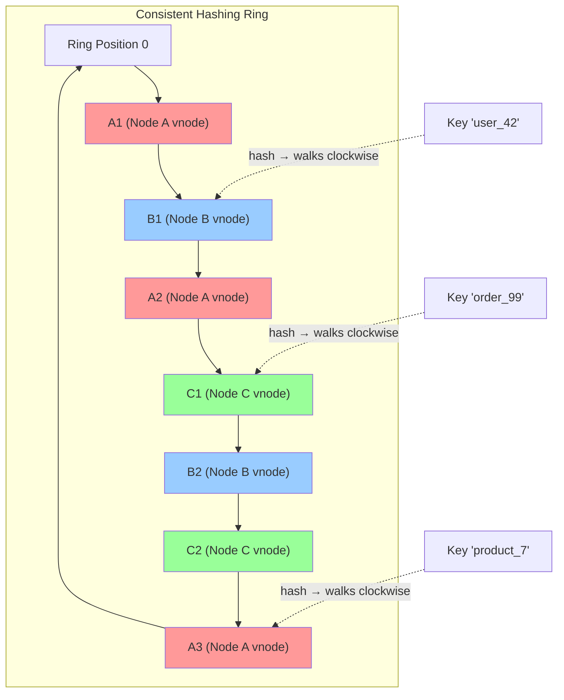
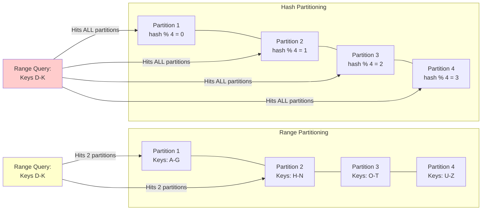
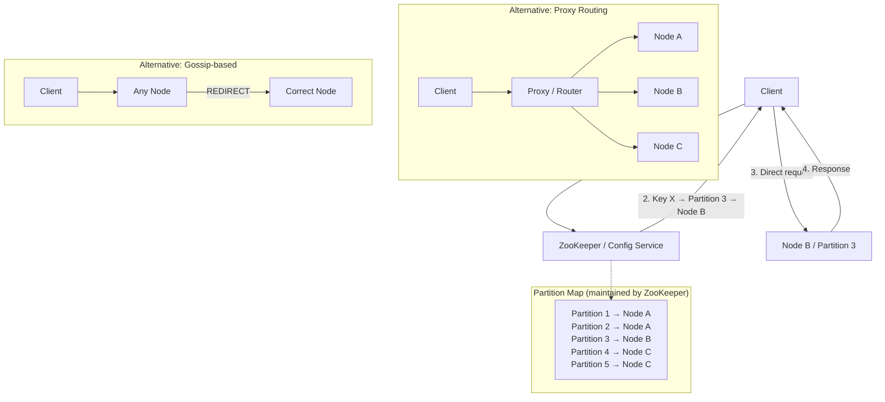
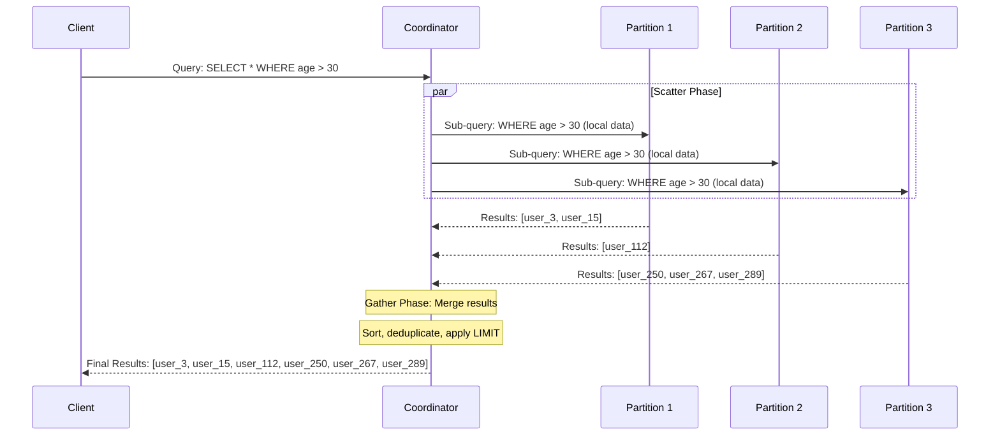
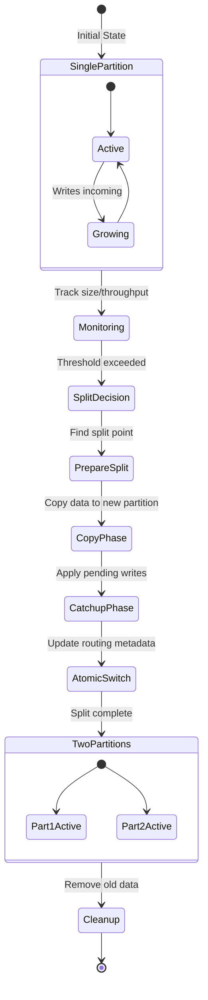

# Chapter 9: Partitioning and Sharding

---

## 1. Why This Matters

Every successful system eventually faces a moment of reckoning: the data no longer fits on a single machine, or a single machine can no longer handle the query throughput. When that moment arrives, the only path forward is **partitioning** — the art and science of splitting data across multiple nodes so that each node handles a subset of the total workload.

Partitioning is not optional at scale. It is the **fundamental mechanism** that enables:

- **Horizontal scalability**: Adding more machines to handle more data and more traffic.
- **Throughput amplification**: Distributing reads and writes across many machines instead of bottlenecking on one.
- **Storage beyond single-node limits**: No single disk can hold petabytes; you must spread data across hundreds or thousands of nodes.
- **Fault isolation**: A failure in one partition doesn't necessarily bring down the entire dataset.
- **Geographic distribution**: Placing partitions closer to users in different regions.

### Industry Relevance

| Company | Scale | Partitioning Approach |
|---------|-------|----------------------|
| Google Bigtable | Exabytes of data | Range-based tablet splitting |
| Amazon DynamoDB | Millions of partitions | Hash-based with consistent hashing |
| Apache Kafka | Trillions of messages/day | Topic partitions |
| MongoDB | Multi-TB collections | Range and hash sharding |
| Elasticsearch | Billions of documents | Hash-based shards |
| Vitess (YouTube) | Millions of QPS on MySQL | Application-level sharding |
| Cassandra | Petabyte-scale clusters | Consistent hashing with virtual nodes |

### System Design Interviews

Partitioning is one of the **most frequently tested concepts** in system design interviews. Every design — URL shortener, chat system, social feed, payment system — requires you to reason about how data is distributed. Interviewers specifically probe:

- How do you choose a partition key?
- What happens with hot partitions?
- How do you handle cross-partition queries?
- How does rebalancing work when you add nodes?
- How do secondary indexes interact with partitioning?

Understanding partitioning deeply separates senior engineers from junior ones, and strong system design candidates from weak ones.

---

## 2. Beginner Intuition

### The Library Analogy

Imagine you're the head librarian of a rapidly growing library. Initially, all books fit on shelves in one room. But as the collection grows to millions of books, you face a problem: one room isn't enough, and one librarian can't serve all the patrons.

You decide to expand into multiple rooms. But how do you split the books?

**Option 1: By Author's Last Name (Range Partitioning)**
- Room A: Authors A-F
- Room B: Authors G-M
- Room C: Authors N-S
- Room D: Authors T-Z

This is intuitive — if someone asks for "Tolkien," you know to go to Room D. And if someone wants all authors from "K" to "M," Room B has them all. But there's a problem: J.K. Rowling's room gets overwhelmed because she's so popular (hot spot), while Room D has barely any visitors.

**Option 2: By Book ID Hash (Hash Partitioning)**
- Take each book's ISBN, run it through a hash function
- Hash result determines the room assignment

Now books are evenly spread across rooms (no more hot spots!), but if someone wants "all books by Tolkien," they have to check every room (loss of range queries).

**Option 3: By Subject Matter (Vertical Partitioning)**
- Room A: Fiction (title, author, plot summary)
- Room B: Non-fiction (title, author, research data)
- Each room stores different types of information

This is splitting by the *nature* of the data, not by how much there is.

### The Core Challenge

The fundamental challenge of partitioning is simple to state but hard to solve:

> **Distribute data so that each node gets a fair share of data AND a fair share of queries, while maintaining the ability to find any piece of data quickly and handle failures gracefully.**

This chapter is about the strategies, algorithms, and real-world systems that solve this challenge.

---

## 3. Core Theory

### 3.1 Formal Definitions

**Partitioning** (also called **sharding**) is the process of dividing a dataset into disjoint subsets (partitions), where each partition is assigned to one or more nodes in a distributed system.

> **Definition**: Given a dataset D and a set of nodes N = {n₁, n₂, ..., nₖ}, a **partitioning function** P: D → N maps each data item d ∈ D to a node nᵢ ∈ N such that:
> 1. **Completeness**: Every data item is assigned to at least one partition.
> 2. **Non-overlap** (for primary partitions): Each data item is assigned to exactly one primary partition.

**Terminology varies across systems:**

| System | Term for Partition | Term for Node |
|--------|--------------------|---------------|
| MongoDB | Shard | Shard Server |
| Kafka | Partition | Broker |
| Elasticsearch | Shard | Node |
| HBase | Region | Region Server |
| Bigtable | Tablet | Tablet Server |
| Cassandra | Partition (vnode) | Node |
| CockroachDB | Range | Node |
| Vitess | Shard | VTTablet |

### 3.2 Horizontal vs. Vertical Partitioning

These are two fundamentally different approaches to splitting data.

#### Horizontal Partitioning (Row-based Sharding)

Horizontal partitioning splits **rows** across nodes. Each partition contains a subset of the rows but all columns.

```
Original Table: Users (1M rows, 10 columns)

Partition 1 (Node A): Users 1-250,000      (all 10 columns)
Partition 2 (Node B): Users 250,001-500,000 (all 10 columns)
Partition 3 (Node C): Users 500,001-750,000 (all 10 columns)
Partition 4 (Node D): Users 750,001-1,000,000 (all 10 columns)
```

**When to use**: When you have too many rows for a single node, or when queries typically access individual rows or small ranges of rows.

#### Vertical Partitioning (Column-based Splitting)

Vertical partitioning splits **columns** across nodes. Each partition contains all rows but only a subset of columns.

```
Original Table: Users (user_id, name, email, profile_pic, bio, preferences, activity_log)

Partition 1 (Node A): user_id, name, email          (frequently accessed)
Partition 2 (Node B): user_id, profile_pic, bio      (large but less frequent)
Partition 3 (Node C): user_id, preferences, activity_log (analytics data)
```

**When to use**: When different columns have very different access patterns, different sizes, or different update frequencies. Common in microservice architectures where different services own different attributes.

#### Functional Partitioning

A third approach is **functional partitioning**, where different types of data go to entirely different systems:

```
Users → PostgreSQL
Products → MongoDB
Search Index → Elasticsearch
Session Data → Redis
Activity Stream → Kafka + Cassandra
```

This is the most common form of partitioning in modern architectures, though it's usually discussed under the umbrella of "polyglot persistence" or "microservices data ownership."

### 3.3 The Partitioning Spectrum

```
          ┌─────────────────────────────────────────────────┐
          │              Partitioning Strategies             │
          ├─────────────────────────────────────────────────┤
          │                                                 │
          │  Key Range ←──────────────────→ Hash Based      │
          │                                                 │
          │  ● Good range queries        ● Even distribution│
          │  ● Risk of hot spots         ● No range queries │
          │  ● Easy to understand        ● More complex     │
          │  ● Used by: HBase, Bigtable  ● Used by: Dynamo  │
          │                                                 │
          │              Compound / Hybrid                  │
          │  ● Combines range + hash                        │
          │  ● Used by: Cassandra, DynamoDB                 │
          └─────────────────────────────────────────────────┘
```

### 3.4 Properties of Good Partitioning

A good partitioning scheme should satisfy these properties:

1. **Uniform distribution**: Data should be evenly distributed across partitions to avoid storage imbalance.
2. **Uniform load**: Queries should be evenly distributed across partitions to avoid throughput imbalance.
3. **Minimal movement**: When nodes are added or removed, the minimum amount of data should need to move.
4. **Predictable routing**: Given a key, it should be efficient to determine which partition it belongs to.
5. **Range-query support** (when needed): Queries over a range of keys should ideally not require scanning all partitions.

Unfortunately, no single strategy perfectly satisfies all five properties simultaneously. The design space is full of tradeoffs.

---

## 4. Architecture Deep Dive

### 4.1 Key Range Partitioning

In key range partitioning, the keyspace is divided into contiguous ranges, and each range is assigned to a partition.

```
Keys:      [0 ─────────── 100 ─────────── 200 ─────────── 300]
            │                │                │                │
Partition:  │   Partition 1  │   Partition 2  │   Partition 3  │
            │  Keys: 0-99    │  Keys: 100-199 │  Keys: 200-300 │
Node:       │   Node A       │   Node B       │   Node C       │
```

#### How It Works

1. **Sorted key space**: The partition key space is conceptually a sorted, continuous range.
2. **Boundary assignment**: Each partition owns a range defined by [start_key, end_key).
3. **Routing**: To find the partition for a key, binary search the partition boundaries.
4. **Range queries**: To scan keys from X to Y, only the partitions whose ranges overlap [X, Y] need to be queried.

#### Advantages

- **Efficient range scans**: If your partition key has temporal or lexicographic ordering, range queries only hit relevant partitions.
- **Easy to understand**: The mapping from key to partition is intuitive.
- **Efficient for time-series data**: If you partition by timestamp, recent data clusters together.

#### Disadvantages

- **Hot spots**: If workloads are concentrated in certain key ranges (e.g., today's data in a time-series system), some partitions get far more traffic than others.
- **Manual or complex rebalancing**: When a partition gets too large, it must be split, which requires careful coordination.
- **Prefix hot spots**: If keys share common prefixes (e.g., all starting with "user_"), early partitions may be overloaded.

#### Real-World Example: HBase

HBase uses key range partitioning with automatic region splitting:

1. Initially, a table has one region covering the entire key range [−∞, +∞).
2. As data grows and the region exceeds a size threshold (default 10 GB), HBase splits the region at the midpoint.
3. Split regions are assigned to different region servers.
4. The HBase Master maintains a meta-table that maps key ranges to region servers.

```
Before Split:
Region 1: [A, Z)  → RegionServer 1

After Split:
Region 1a: [A, M) → RegionServer 1
Region 1b: [M, Z) → RegionServer 2
```

### 4.2 Hash Partitioning

In hash partitioning, a hash function determines the partition assignment.

```
Key → hash(key) → partition_id = hash(key) % num_partitions
```

#### How It Works

1. **Hash function**: Apply a deterministic hash function (e.g., MurmurHash3, MD5, CRC32) to the partition key.
2. **Modular assignment**: The hash output is mapped to a partition, typically via modulo: `partition = hash(key) % N`.
3. **Uniform distribution**: A good hash function distributes keys uniformly, preventing hot spots.

#### Advantages

- **Even distribution**: Hash functions scatter keys uniformly, eliminating hot spots from key distribution.
- **Simple routing**: Hash computation is fast and deterministic.
- **No knowledge of data distribution needed**: Works regardless of key patterns.

#### Disadvantages

- **No range queries**: Hash destroys key ordering. A range query like "all users with ID 1000-2000" must scan every partition.
- **Rebalancing problem with modulo**: If N changes (add/remove nodes), `hash(key) % N` changes for most keys, requiring massive data movement.
- **Hash collisions**: Multiple keys can hash to the same value, though this is rare with good hash functions.

#### The Modulo Problem

The biggest problem with naive hash partitioning is what happens when you add a node:

```
With 3 nodes: hash("user_123") % 3 = 2  → Node C
With 4 nodes: hash("user_123") % 4 = 1  → Node B  ← MOVED!

On average, (N-1)/N fraction of keys must be reassigned when going from N to N+1 nodes.
With 100 nodes, adding 1 node moves ~99% of keys!
```

This is why naive modulo-based partitioning is rarely used in practice. Instead, systems use **consistent hashing**.

### 4.3 Consistent Hashing — Deep Dive

Consistent hashing is the foundational algorithm for distributed hash-based partitioning. It was introduced by Karger et al. in 1997 and solves the rebalancing problem.

#### The Core Idea

Instead of mapping keys to nodes directly, consistent hashing maps both keys and nodes to positions on a **ring** (a circular hash space, typically 0 to 2^32 - 1 or 0 to 2^128 - 1).

```
Step 1: Hash each node to a position on the ring.
Step 2: Hash each key to a position on the ring.
Step 3: Walk clockwise from the key's position until you hit a node.
        That node owns the key.
```

#### Detailed Algorithm

```
Ring: 0 ──────────── 2^32 - 1 (wraps around)

Nodes hashed to positions:
  Node A → position 1000
  Node B → position 5000
  Node C → position 9000

Key hashed to position:
  "user_42" → position 3500

Walk clockwise from 3500:
  3500 → ... → 5000 (Node B)
  "user_42" is owned by Node B

Key ranges:
  Node A: (9000, 1000]  ← wraps around
  Node B: (1000, 5000]
  Node C: (5000, 9000]
```

#### Adding a Node

When Node D is added at position 7000:

```
Before:
  Node A: (9000, 1000]
  Node B: (1000, 5000]
  Node C: (5000, 9000]    ← owns range 5000-9000

After adding Node D at 7000:
  Node A: (9000, 1000]
  Node B: (1000, 5000]
  Node C: (5000, 7000]    ← range shrinks
  Node D: (7000, 9000]    ← takes part of C's range

Only keys in range (7000, 9000] need to move from C to D.
On average, only 1/N of keys move when adding a node!
```

#### The Problem with Basic Consistent Hashing

With only a few physical nodes, the ring positions may be unevenly distributed, leading to load imbalance:

```
Uneven distribution:
Node A ──────────────────────────── Node B ── Node C ──
      (huge range for A)              (tiny ranges)
```

#### Virtual Nodes (vnodes)

The solution is **virtual nodes**: each physical node claims multiple positions on the ring.

```
Physical Node A → Virtual nodes: A1 at 500, A2 at 3000, A3 at 7500
Physical Node B → Virtual nodes: B1 at 1500, B2 at 5000, B3 at 8500
Physical Node C → Virtual nodes: C1 at 2500, C2 at 6000, C3 at 9500
```

With many virtual nodes (typically 128-256 per physical node), the load becomes statistically balanced.

**Tradeoffs of vnodes:**
- **More vnodes** = better balance, but more metadata to track
- **Fewer vnodes** = simpler, but more potential for imbalance
- Cassandra uses 256 vnodes by default (reduced to 16-32 in recent versions with improved token allocation)

#### Jump Consistent Hashing

Jump Consistent Hash (Google, 2014) is an algorithm that:
- Uses no ring or virtual nodes
- Produces a partition assignment with perfect uniformity
- Requires O(1) space and O(ln n) time
- Only works for numbered buckets (0 to n-1); nodes can't have names

```python
# The entire algorithm in 5 lines:
def jump_consistent_hash(key, num_buckets):
    b, j = -1, 0
    while j < num_buckets:
        b = j
        key = ((key * 2862933555777941757) + 1) & 0xFFFFFFFFFFFFFFFF
        j = int((b + 1) * (1 << 31) / ((key >> 33) + 1))
    return b
```

**Limitations:**
- Only supports numbered buckets; can't remove arbitrary nodes from the middle.
- Only supports appending/removing the last bucket.
- Not suitable for systems where arbitrary nodes can join/leave.

#### Rendezvous Hashing (Highest Random Weight)

An alternative to consistent hashing where each key is assigned to the node with the highest hash(key, node):

```
For key "user_42":
  score(A) = hash("user_42", "A") = 0.73
  score(B) = hash("user_42", "B") = 0.91  ← highest
  score(C) = hash("user_42", "C") = 0.45

"user_42" → Node B
```

When a node is removed, only keys assigned to that node are reassigned. When a node is added, some keys from each existing node may move to it.

**Advantages over consistent hashing:**
- Simpler to implement (no ring, no virtual nodes)
- Naturally balanced without virtual nodes
- Supports weighted nodes easily

**Disadvantages:**
- O(n) lookup time (must compute hash for all nodes), versus O(log n) for ring-based consistent hashing
- Not practical with thousands of nodes

### 4.4 Compound Partitioning

Compound partitioning uses multiple keys to determine placement:

```
Partition key: (user_id, timestamp)

Strategy:
1. Hash user_id → determines the partition
2. Sort by timestamp within that partition → enables range queries on time

Result:
- All data for a user is on the same partition (data locality)
- Within a user's data, time-range queries are efficient
- Users are evenly distributed across partitions
```

This is the strategy used by **Cassandra** with its `PARTITION KEY` and `CLUSTERING COLUMNS`:

```sql
CREATE TABLE user_events (
    user_id UUID,          -- Partition key (hashed)
    event_time TIMESTAMP,  -- Clustering column (sorted within partition)
    event_type TEXT,
    event_data TEXT,
    PRIMARY KEY ((user_id), event_time)
) WITH CLUSTERING ORDER BY (event_time DESC);
```

### 4.5 Request Routing

When a client wants to read or write a key, how does it find the right partition?

#### Approach 1: Client-side Routing

The client knows the partitioning scheme and computes the target node directly.

```
Client → hash(key) → Node B → Response

Pros: No intermediary, low latency
Cons: Clients must know the partition map, must update on changes
Used by: Cassandra (token-aware driver), Kafka (client metadata)
```

#### Approach 2: Routing Tier (Proxy)

A routing tier sits between clients and partitions, forwarding requests to the correct node.

```
Client → Router/Proxy → Node B → Response

Pros: Clients are simple, routing logic centralized
Cons: Extra hop, proxy can become bottleneck
Used by: MongoDB (mongos), Vitess (VTGate), Redis Cluster (proxy mode)
```

#### Approach 3: Random Node + Forwarding

The client connects to any node; that node forwards to the correct node if needed.

```
Client → Node A → (forwards to) → Node B → Response → (back through) → Node A → Client

Pros: Simple client, any node is an entry point
Cons: Extra network hop, higher latency
Used by: Redis Cluster (MOVED/ASK redirects), Elasticsearch
```

#### Approach 4: Coordination Service

A coordination service (like ZooKeeper) maintains the authoritative partition map:

```
Client → ZooKeeper → "key X is on Node B" → Client → Node B → Response

Pros: Single source of truth, consistent view
Cons: Dependency on ZooKeeper, extra round trip for discovery
Used by: HBase (ZooKeeper for region location), Kafka (ZooKeeper/KRaft for metadata)
```

### 4.6 Secondary Indexes and Partitioning

Secondary indexes add significant complexity to partitioned systems because a secondary index query might need data from multiple partitions.

#### Document-based Partitioning (Local Index)

Each partition maintains its own secondary index covering only the data on that partition.

```
Partition 1 (Users 1-100):
  Primary Index: user_id → user_data
  Secondary Index (by city): "NYC" → [user_3, user_15, user_67]

Partition 2 (Users 101-200):
  Primary Index: user_id → user_data
  Secondary Index (by city): "NYC" → [user_112, user_189]

Query: "Find all users in NYC"
  → Must query BOTH partitions (scatter-gather)
```

**Pros:**
- Writes are local (only one partition needs updating)
- Simple to maintain

**Cons:**
- Reads require scatter-gather across all partitions
- Query latency = slowest partition (tail latency problem)

**Used by:** MongoDB, Elasticsearch, Cassandra (with limitations), DynamoDB (local secondary indexes)

#### Term-based Partitioning (Global Index)

The secondary index itself is partitioned, but independently from the data.

```
Data Partitioning (by user_id):
  Partition 1: Users 1-100
  Partition 2: Users 101-200

Index Partitioning (by city name):
  Index Partition A: cities A-M → "NYC" → [user_3, user_15, user_67, user_112, user_189]
  Index Partition B: cities N-Z → ...

Query: "Find all users in NYC"
  → Only Index Partition A needs to be queried → Then fetch from data partitions
```

**Pros:**
- Reads are efficient (single index partition for a term)
- No scatter-gather for secondary index lookups

**Cons:**
- Writes are complex (updating the global index requires cross-partition coordination)
- Index updates are often asynchronous (eventual consistency)

**Used by:** DynamoDB (global secondary indexes — eventually consistent), Google Bigtable (with external indexing)

### 4.7 Cross-Partition Queries (Scatter-Gather)

When a query cannot be answered by a single partition, the system must employ **scatter-gather**:

```
              ┌──────────┐
              │  Client   │
              └─────┬─────┘
                    │ Query: "SELECT * WHERE age > 30 AND city = 'NYC'"
                    ▼
              ┌──────────┐
              │ Coordinator│
              └─────┬─────┘
            ┌───────┼───────┐
            ▼       ▼       ▼
        ┌──────┐ ┌──────┐ ┌──────┐
        │Part 1│ │Part 2│ │Part 3│
        └──┬───┘ └──┬───┘ └──┬───┘
           │        │        │
           ▼        ▼        ▼
        Results  Results  Results
            └───────┼───────┘
                    ▼
              ┌──────────┐
              │  Merge &  │
              │  Return   │
              └──────────┘
```

#### Performance Characteristics

- **Latency**: Bounded by the slowest partition (p99 problem amplified)
- **Throughput**: Limited by the coordinator's ability to merge results
- **Network**: N round trips instead of 1

#### Optimization Strategies

1. **Partition pruning**: Analyze the query to determine which partitions can be skipped.
2. **Parallel execution**: Send queries to all relevant partitions simultaneously.
3. **Streaming merge**: Start processing results as they arrive instead of waiting for all.
4. **Caching**: Cache partition maps and frequent query results.
5. **Denormalization**: Store redundant data to avoid cross-partition reads.

### 4.8 Hot Spots and Skewed Workloads

Even with hash partitioning, hot spots can occur when certain keys are accessed far more frequently than others.

#### Celebrity Problem (Hot Key)

```
Example: Social media system
  - Justin Bieber has 100M followers
  - Partition key: user_id
  - All operations on Bieber's post → single partition → overloaded

Even though hash partitioning distributes keys evenly,
the WORKLOAD is not evenly distributed.
```

#### Mitigation Strategies

**1. Key Splitting (Fan-out)**
```
Instead of: post_id = "bieber_post_123"
Use:        post_id = "bieber_post_123_" + random(0, 99)

This creates 100 sub-keys spread across partitions.
Reads require scatter-gather across 100 sub-keys, but writes are distributed.
```

**2. Read Replicas for Hot Partitions**
```
Hot partition → create extra read replicas
Writes go to primary partition
Reads are balanced across primary + read replicas
```

**3. Application-Level Caching**
```
Cache hot data in-memory (Redis, Memcached)
Only uncached requests hit the partitioned store
```

**4. Workload-Aware Partitioning**
```
Monitor access patterns
Automatically split hot partitions into smaller ones
Merge cold partitions to reduce metadata
```

### 4.9 Partition Splits and Merges

Dynamic systems need to adapt as data grows and shrinks.

#### Automatic Splitting

When a partition exceeds a size or throughput threshold, it's split:

```
Before: Partition P1 [A-Z] (50 GB)
Threshold: 10 GB

Split at midpoint "M":
  P1a: [A-M) (25 GB) → stays on Node 1
  P1b: [M-Z] (25 GB) → moved to Node 3

1. Create split point
2. Copy data for P1b to Node 3
3. Update metadata (partition map)
4. Redirect traffic for [M-Z] to Node 3
5. Clean up old data on Node 1
```

#### Automatic Merging

When adjacent partitions become too small, they're merged:

```
P1: [A-F) (100 MB) on Node 1
P2: [F-K) (150 MB) on Node 1

Merge:
  P_merged: [A-K) (250 MB) on Node 1

1. Both partitions must be on the same node (or one is moved)
2. Metadata updated to reflect merged range
3. Old partition metadata removed
```

#### Fixed vs. Dynamic Partitioning

| Aspect | Fixed Partitioning | Dynamic Partitioning |
|--------|-------------------|---------------------|
| Number of partitions | Set at creation, doesn't change | Grows/shrinks with data |
| Partition size | Varies (depends on data distribution) | Bounded (split/merge thresholds) |
| Rebalancing | Move whole partitions between nodes | Split/merge + move |
| Metadata size | Constant | Grows with data |
| Examples | Kafka, Elasticsearch | HBase, Bigtable, CockroachDB |

#### Proportional Partitioning

A hybrid approach where the number of partitions is proportional to the number of nodes:

```
Rule: Each node owns a fixed number of partitions (e.g., 256)

When a new node joins:
  - It takes over some partitions from existing nodes
  - Each existing partition may be split

When a node leaves:
  - Its partitions are distributed to remaining nodes

This maintains a constant number of partitions per node.
Used by: Cassandra (with vnodes)
```

---

## 5. Visual Diagrams

### 5.1 Consistent Hashing Ring with Virtual Nodes



### 5.2 Consistent Hashing Ring — ASCII Representation

```
                         0 / 2^32
                           │
                    ╔══════╧══════╗
                ┌───╢   Ring      ╟───┐
                │   ╚═════════════╝   │
                │                     │
            A3 (pos: 15000)       B1 (pos: 3000)
                │                     │
                │    Keys "walk"      │
                │    clockwise →      │
                │                     │
            C2 (pos: 13000)       A1 (pos: 5000)
                │                     │
                │                     │
            B2 (pos: 11000)       C1 (pos: 7000)
                │                     │
                └───────────┬─────────┘
                            │
                        A2 (pos: 9000)

    Node A (physical): vnodes A1, A2, A3  [Red]
    Node B (physical): vnodes B1, B2      [Blue]
    Node C (physical): vnodes C1, C2      [Green]

    Key "user_42" hashes to position 4000 → walks to A1 (pos 5000) → Node A
    Key "order_99" hashes to position 10500 → walks to B2 (pos 11000) → Node B
```

### 5.3 Range vs Hash Partitioning Comparison



### 5.4 Request Routing Architecture



### 5.5 Scatter-Gather Query Flow



### 5.6 Partition Split Visualization



---

## 6. Real Production Examples

### 6.1 Apache Cassandra — Consistent Hashing with Virtual Nodes

**Architecture:**
- Uses consistent hashing ring with virtual nodes (vnodes)
- Default: 256 vnodes per node (reduced to 16 in newer versions with improved allocation)
- Hash function: Murmur3Partitioner (default), RandomPartitioner (MD5), ByteOrderedPartitioner (range)
- Each vnode owns a token range on the ring

**Partition Key Design:**
```sql
-- Good: High-cardinality partition key
CREATE TABLE sensor_data (
    sensor_id UUID,
    reading_time TIMESTAMP,
    value DOUBLE,
    PRIMARY KEY ((sensor_id), reading_time)
);
-- sensor_id is hashed → even distribution
-- reading_time is sorted within partition → efficient time-range queries

-- Bad: Low-cardinality partition key
CREATE TABLE logs (
    log_level TEXT,  -- Only 5 values: DEBUG, INFO, WARN, ERROR, FATAL
    timestamp TIMESTAMP,
    message TEXT,
    PRIMARY KEY ((log_level), timestamp)
);
-- Only 5 partitions! Massive imbalance.
```

**Replication on the Ring:**
```
Ring: ... → A → B → C → D → E → ...
Replication Factor: 3

Key hashes to position near B:
  Primary replica: B
  Replica 2: C (next clockwise)
  Replica 3: D (next clockwise after C)
```

**Lessons from Production:**
- Large partitions (>100 MB) cause read latency spikes and compaction pressure.
- Tombstones (deleted data markers) accumulating in partitions cause read performance degradation.
- vnodes make bootstrapping new nodes faster (parallel streaming from multiple sources) but increase repair complexity.

### 6.2 MongoDB — Range and Hash Sharding

**Architecture:**
- Sharding is done at the collection level
- Each shard is a replica set (typically 3 nodes)
- `mongos` routers direct queries to the correct shard(s)
- Config servers store the chunk-to-shard mapping

**Shard Key Selection:**
```javascript
// Range shard key — good for range queries
sh.shardCollection("mydb.orders", { "order_date": 1 });

// Hash shard key — good for even distribution
sh.shardCollection("mydb.users", { "user_id": "hashed" });

// Compound shard key — balance of both
sh.shardCollection("mydb.events", { "tenant_id": 1, "event_id": 1 });
```

**Chunk Management:**
- Default chunk size: 128 MB (was 64 MB)
- Automatic splitting when a chunk exceeds the threshold
- Balancer process moves chunks between shards to maintain balance
- Chunks are defined by [min_key, max_key) ranges

**Common Production Issues:**
1. **Jumbo chunks**: Chunks that can't be split because all documents have the same shard key value. Mitigate with high-cardinality shard keys.
2. **Scatter-gather on non-shard-key queries**: Queries without the shard key in the filter must hit all shards.
3. **Shard key immutability** (pre-4.2): Couldn't change shard key after collection creation. MongoDB 5.0+ supports `reshardCollection`.

### 6.3 Amazon DynamoDB — Partition Keys and Adaptive Capacity

**Architecture:**
- Partitions are managed automatically (users don't see partition count)
- Each partition handles up to ~3000 RCU (read capacity units) and ~1000 WCU (write capacity units) and ~10 GB
- Partition key is hashed to determine partition placement
- Sort key enables range queries within a partition

**Adaptive Capacity:**
- DynamoDB detects hot partitions and automatically adds burst capacity
- "Instant adaptive capacity" moves capacity from cold partitions to hot ones
- Introduced after the infamous "hot partition throttling" issues in early DynamoDB

**GSI (Global Secondary Index) Design:**
```
Base Table:
  Partition Key: user_id
  Sort Key: order_id
  Attributes: product_id, amount, status, order_date

GSI (by product):
  Partition Key: product_id
  Sort Key: order_date
  Projected: user_id, amount

Query "Find all orders for product P": Efficient (single GSI partition)
Query "Find all orders by user U": Efficient (single base table partition)
Query "Find all orders over $100": Scatter-gather (must scan all partitions)
```

### 6.4 Apache Kafka — Topic Partitions

**Architecture:**
- Each topic is divided into partitions (set at creation time, can be increased but not decreased)
- Each partition is an ordered, immutable log
- Partition assignment: `partition = hash(key) % num_partitions` (default, or custom partitioner)
- Each partition has a single leader broker (writes) and multiple follower replicas

**Partition Design:**
```
Topic: user-events (12 partitions, replication factor 3)

Partition 0: Leader on Broker 1, Followers on Brokers 2, 4
Partition 1: Leader on Broker 2, Followers on Brokers 3, 5
...
Partition 11: Leader on Broker 3, Followers on Brokers 1, 6

Message with key "user_42":
  hash("user_42") % 12 = 7 → Partition 7

All messages for user_42 go to Partition 7 → ordered processing
```

**Key Production Considerations:**
- **Number of partitions limits consumer parallelism**: Each partition can only be consumed by one consumer in a consumer group.
- **Over-partitioning**: Too many partitions increase metadata overhead, leader election time, and end-to-end latency.
- **Under-partitioning**: Too few partitions limit throughput scalability.
- **Rule of thumb**: Start with `max(throughput / partition_throughput, num_consumers)` partitions.

### 6.5 Elasticsearch — Index Shards

**Architecture:**
- Each index is split into shards (set at index creation, immutable for primary shards)
- Default: 1 primary shard (was 5 before ES 7.x)
- Each shard is a Lucene index
- Routing: `shard = hash(document_id) % num_primary_shards`

**Shard Sizing Best Practices:**
```
Recommended shard size: 10-50 GB (sweet spot: ~30 GB)
Max shards per node: ~20 shards per GB of heap

Example:
  Index: 300 GB of data
  Shard size target: 30 GB
  → 10 primary shards
  → With 1 replica: 20 total shards
  → Need at least 2 nodes (10 shards each)
```

**Custom Routing:**
```json
PUT /orders/_doc/123?routing=customer_456
{
    "customer_id": "customer_456",
    "amount": 99.99
}

// All documents for customer_456 go to the same shard
// Queries with routing= hit only one shard instead of all
```

### 6.6 Vitess — MySQL Sharding

**Architecture:**
- Originally built at YouTube to shard MySQL
- Application-level sharding layer on top of MySQL
- VTGate: Proxy that routes queries
- VTTablet: MySQL instance with Vitess management
- Topology service (etcd/ZooKeeper): Stores shard metadata

**Sharding Schemes:**
```sql
-- Vitess VSchema definition
{
  "sharded": true,
  "vindexes": {
    "hash": {
      "type": "hash"
    },
    "lookup_unique": {
      "type": "lookup_unique",
      "params": {
        "table": "user_lookup",
        "from": "email",
        "to": "user_id"
      }
    }
  },
  "tables": {
    "users": {
      "column_vindexes": [
        {"column": "user_id", "name": "hash"}
      ]
    }
  }
}
```

**Key Innovation:**
Vitess supports **resharding** (splitting and merging shards) without downtime using a process called:
1. Copy data to new shards
2. Start replicating binlog to new shards
3. Catch up on replication
4. Atomic cutover (read-only briefly, then switch)

---

## 7. Java Implementations

### 7.1 Consistent Hashing with Virtual Nodes

```java
import java.nio.charset.StandardCharsets;
import java.security.MessageDigest;
import java.security.NoSuchAlgorithmException;
import java.util.*;
import java.util.concurrent.ConcurrentSkipListMap;
import java.util.concurrent.locks.ReadWriteLock;
import java.util.concurrent.locks.ReentrantReadWriteLock;

/**
 * Production-grade consistent hashing implementation with virtual nodes.
 * 
 * Features:
 * - Configurable number of virtual nodes per physical node
 * - Thread-safe operations
 * - Weighted nodes (more vnodes = more data)
 * - MD5-based hashing for uniform distribution
 * 
 * @param <T> The type representing a physical node (e.g., String hostname)
 */
public class ConsistentHashRing<T> {

    private final ConcurrentSkipListMap<Long, T> ring;
    private final Map<T, Integer> nodeVnodeCount;
    private final int defaultVnodes;
    private final ReadWriteLock lock;
    private final HashFunction hashFunction;

    /**
     * Functional interface for pluggable hash functions.
     */
    @FunctionalInterface
    public interface HashFunction {
        long hash(String key);
    }

    /**
     * Creates a consistent hash ring with the specified default number of virtual nodes.
     * 
     * @param defaultVnodes Default number of virtual nodes per physical node (128-256 recommended)
     */
    public ConsistentHashRing(int defaultVnodes) {
        this(defaultVnodes, ConsistentHashRing::md5Hash);
    }

    /**
     * Creates a consistent hash ring with a custom hash function.
     */
    public ConsistentHashRing(int defaultVnodes, HashFunction hashFunction) {
        if (defaultVnodes <= 0) {
            throw new IllegalArgumentException("Number of virtual nodes must be positive");
        }
        this.ring = new ConcurrentSkipListMap<>();
        this.nodeVnodeCount = new HashMap<>();
        this.defaultVnodes = defaultVnodes;
        this.lock = new ReentrantReadWriteLock();
        this.hashFunction = hashFunction;
    }

    /**
     * Adds a physical node to the ring with the default number of virtual nodes.
     */
    public void addNode(T node) {
        addNode(node, defaultVnodes);
    }

    /**
     * Adds a physical node to the ring with a specified number of virtual nodes.
     * More virtual nodes = more data assigned to this node (weighted distribution).
     * 
     * @param node The physical node to add
     * @param vnodeCount Number of virtual nodes for this physical node
     */
    public void addNode(T node, int vnodeCount) {
        lock.writeLock().lock();
        try {
            if (nodeVnodeCount.containsKey(node)) {
                throw new IllegalArgumentException("Node already exists: " + node);
            }
            
            for (int i = 0; i < vnodeCount; i++) {
                long hash = hashFunction.hash(node.toString() + "#vnode" + i);
                ring.put(hash, node);
            }
            nodeVnodeCount.put(node, vnodeCount);
        } finally {
            lock.writeLock().unlock();
        }
    }

    /**
     * Removes a physical node and all its virtual nodes from the ring.
     * Data previously owned by this node will be redistributed to adjacent nodes.
     */
    public void removeNode(T node) {
        lock.writeLock().lock();
        try {
            Integer vnodeCount = nodeVnodeCount.remove(node);
            if (vnodeCount == null) {
                throw new IllegalArgumentException("Node not found: " + node);
            }
            
            for (int i = 0; i < vnodeCount; i++) {
                long hash = hashFunction.hash(node.toString() + "#vnode" + i);
                ring.remove(hash);
            }
        } finally {
            lock.writeLock().unlock();
        }
    }

    /**
     * Gets the node responsible for the given key.
     * Walks clockwise on the ring from the key's hash position.
     * 
     * @param key The data key to look up
     * @return The physical node responsible for this key
     */
    public T getNode(String key) {
        lock.readLock().lock();
        try {
            if (ring.isEmpty()) {
                throw new IllegalStateException("Ring is empty — no nodes available");
            }
            
            long hash = hashFunction.hash(key);
            
            // Find the first node clockwise from the hash position
            Map.Entry<Long, T> entry = ring.ceilingEntry(hash);
            
            // If we've gone past the end of the ring, wrap around to the first entry
            if (entry == null) {
                entry = ring.firstEntry();
            }
            
            return entry.getValue();
        } finally {
            lock.readLock().unlock();
        }
    }

    /**
     * Gets N distinct physical nodes responsible for the given key (for replication).
     * Walks clockwise, skipping virtual nodes of already-selected physical nodes.
     * 
     * @param key The data key
     * @param replicaCount Number of distinct physical nodes to return
     * @return List of physical nodes for replication
     */
    public List<T> getNodes(String key, int replicaCount) {
        lock.readLock().lock();
        try {
            if (ring.isEmpty()) {
                throw new IllegalStateException("Ring is empty");
            }
            
            int availableNodes = nodeVnodeCount.size();
            int count = Math.min(replicaCount, availableNodes);
            
            List<T> result = new ArrayList<>(count);
            Set<T> seen = new HashSet<>();
            
            long hash = hashFunction.hash(key);
            
            // Get all entries starting from the hash position, wrapping around
            SortedMap<Long, T> tailMap = ring.tailMap(hash);
            
            // First, walk from hash position to end of ring
            for (Map.Entry<Long, T> entry : tailMap.entrySet()) {
                T node = entry.getValue();
                if (seen.add(node)) {
                    result.add(node);
                    if (result.size() == count) return result;
                }
            }
            
            // Then wrap around from the beginning
            for (Map.Entry<Long, T> entry : ring.entrySet()) {
                if (entry.getKey() >= hash) break; // Already processed
                T node = entry.getValue();
                if (seen.add(node)) {
                    result.add(node);
                    if (result.size() == count) return result;
                }
            }
            
            return result;
        } finally {
            lock.readLock().unlock();
        }
    }

    /**
     * Returns statistics about the ring distribution.
     * Useful for monitoring and debugging load imbalance.
     */
    public Map<T, RingStats> getDistributionStats() {
        lock.readLock().lock();
        try {
            Map<T, Long> rangeSize = new HashMap<>();
            
            if (ring.size() <= 1) {
                if (!ring.isEmpty()) {
                    T node = ring.firstEntry().getValue();
                    rangeSize.put(node, Long.MAX_VALUE);
                }
            } else {
                Long prevHash = null;
                T prevNode = null;
                Long firstHash = ring.firstKey();
                
                for (Map.Entry<Long, T> entry : ring.entrySet()) {
                    if (prevHash != null) {
                        long range = entry.getKey() - prevHash;
                        rangeSize.merge(prevNode, range, Long::sum);
                    }
                    prevHash = entry.getKey();
                    prevNode = entry.getValue();
                }
                
                // Handle wrap-around: last node to first node
                if (prevHash != null) {
                    long wrapRange = (Long.MAX_VALUE - prevHash) + (firstHash - Long.MIN_VALUE);
                    rangeSize.merge(prevNode, wrapRange, Long::sum);
                }
            }
            
            long totalRange = rangeSize.values().stream().mapToLong(Long::longValue).sum();
            Map<T, RingStats> stats = new HashMap<>();
            
            for (Map.Entry<T, Long> entry : rangeSize.entrySet()) {
                double percentage = totalRange > 0 
                    ? (entry.getValue() * 100.0 / totalRange) : 0;
                int vnodes = nodeVnodeCount.getOrDefault(entry.getKey(), 0);
                stats.put(entry.getKey(), new RingStats(vnodes, entry.getValue(), percentage));
            }
            
            return stats;
        } finally {
            lock.readLock().unlock();
        }
    }

    /**
     * Gets the total number of virtual nodes on the ring.
     */
    public int getRingSize() {
        return ring.size();
    }

    /**
     * Gets the number of physical nodes on the ring.
     */
    public int getPhysicalNodeCount() {
        return nodeVnodeCount.size();
    }

    /**
     * MD5-based hash function that produces a long value.
     */
    private static long md5Hash(String key) {
        try {
            MessageDigest md = MessageDigest.getInstance("MD5");
            byte[] digest = md.digest(key.getBytes(StandardCharsets.UTF_8));
            // Use first 8 bytes of MD5 as a long
            long hash = 0;
            for (int i = 0; i < 8; i++) {
                hash = (hash << 8) | (digest[i] & 0xFF);
            }
            return hash;
        } catch (NoSuchAlgorithmException e) {
            throw new RuntimeException("MD5 not available", e);
        }
    }

    /**
     * Statistics for a physical node's ring coverage.
     */
    public static class RingStats {
        private final int vnodeCount;
        private final long totalRangeOwned;
        private final double percentageOfRing;

        public RingStats(int vnodeCount, long totalRangeOwned, double percentageOfRing) {
            this.vnodeCount = vnodeCount;
            this.totalRangeOwned = totalRangeOwned;
            this.percentageOfRing = percentageOfRing;
        }

        public int getVnodeCount() { return vnodeCount; }
        public long getTotalRangeOwned() { return totalRangeOwned; }
        public double getPercentageOfRing() { return percentageOfRing; }

        @Override
        public String toString() {
            return String.format("RingStats{vnodes=%d, range=%d, percentage=%.2f%%}", 
                vnodeCount, totalRangeOwned, percentageOfRing);
        }
    }

    // --- Example usage ---
    public static void main(String[] args) {
        ConsistentHashRing<String> ring = new ConsistentHashRing<>(150);
        
        // Add nodes
        ring.addNode("node-1.us-east.prod");
        ring.addNode("node-2.us-east.prod");
        ring.addNode("node-3.us-west.prod");
        ring.addNode("node-4.eu-west.prod");
        
        // Route keys
        System.out.println("user_42 → " + ring.getNode("user_42"));
        System.out.println("order_99 → " + ring.getNode("order_99"));
        System.out.println("product_7 → " + ring.getNode("product_7"));
        
        // Get replicas (for replication factor = 3)
        List<String> replicas = ring.getNodes("user_42", 3);
        System.out.println("Replicas for user_42: " + replicas);
        
        // Check distribution
        System.out.println("\nDistribution Stats:");
        ring.getDistributionStats().forEach((node, stats) -> 
            System.out.println("  " + node + ": " + stats));
        
        // Simulate adding a node — check what keys move
        System.out.println("\n--- Adding node-5 ---");
        String beforeAdd = ring.getNode("test_key_500");
        ring.addNode("node-5.ap-south.prod");
        String afterAdd = ring.getNode("test_key_500");
        System.out.println("test_key_500: " + beforeAdd + " → " + afterAdd + 
            (beforeAdd.equals(afterAdd) ? " (no move)" : " (MOVED)"));
        
        // Updated distribution
        System.out.println("\nUpdated Distribution Stats:");
        ring.getDistributionStats().forEach((node, stats) -> 
            System.out.println("  " + node + ": " + stats));
    }
}
```

### 7.2 Partition Router

```java
import java.util.*;
import java.util.concurrent.ConcurrentHashMap;
import java.util.concurrent.CopyOnWriteArrayList;
import java.util.function.Consumer;

/**
 * Partition Router that directs requests to the correct partition/node
 * based on configurable partitioning strategies.
 * 
 * Supports:
 * - Hash-based routing
 * - Range-based routing
 * - Consistent hash routing
 * - Custom routing
 * 
 * Thread-safe and supports dynamic topology changes.
 */
public class PartitionRouter<K, V> {

    private final PartitionStrategy<K> strategy;
    private final Map<Integer, PartitionInfo> partitionMap;
    private final List<TopologyChangeListener> listeners;
    private volatile int partitionCount;

    /**
     * Interface for pluggable partitioning strategies.
     */
    public interface PartitionStrategy<K> {
        /**
         * Determines the partition ID for the given key.
         * 
         * @param key The key to route
         * @param totalPartitions Total number of partitions
         * @return Partition ID (0-based)
         */
        int getPartition(K key, int totalPartitions);

        /**
         * Returns the name of this strategy for logging/monitoring.
         */
        String strategyName();
    }

    /**
     * Information about a single partition.
     */
    public static class PartitionInfo {
        private final int partitionId;
        private final String leaderNode;
        private final List<String> replicaNodes;
        private final KeyRange keyRange; // Optional, for range-based partitioning

        public PartitionInfo(int partitionId, String leaderNode, 
                           List<String> replicaNodes, KeyRange keyRange) {
            this.partitionId = partitionId;
            this.leaderNode = leaderNode;
            this.replicaNodes = Collections.unmodifiableList(new ArrayList<>(replicaNodes));
            this.keyRange = keyRange;
        }

        public int getPartitionId() { return partitionId; }
        public String getLeaderNode() { return leaderNode; }
        public List<String> getReplicaNodes() { return replicaNodes; }
        public KeyRange getKeyRange() { return keyRange; }
        
        @Override
        public String toString() {
            return String.format("Partition{id=%d, leader=%s, replicas=%s, range=%s}", 
                partitionId, leaderNode, replicaNodes, keyRange);
        }
    }

    /**
     * Represents a key range for range-based partitioning.
     */
    public static class KeyRange {
        private final String startKey; // inclusive
        private final String endKey;   // exclusive

        public KeyRange(String startKey, String endKey) {
            this.startKey = startKey;
            this.endKey = endKey;
        }

        public boolean contains(String key) {
            boolean afterStart = startKey == null || key.compareTo(startKey) >= 0;
            boolean beforeEnd = endKey == null || key.compareTo(endKey) < 0;
            return afterStart && beforeEnd;
        }

        @Override
        public String toString() {
            return String.format("[%s, %s)", 
                startKey != null ? startKey : "-∞", 
                endKey != null ? endKey : "+∞");
        }
    }

    /**
     * Listener for topology changes (partition reassignment, node failures).
     */
    @FunctionalInterface
    public interface TopologyChangeListener {
        void onTopologyChange(TopologyChangeEvent event);
    }

    public static class TopologyChangeEvent {
        public enum Type { PARTITION_ADDED, PARTITION_REMOVED, LEADER_CHANGED, REBALANCED }
        private final Type type;
        private final int partitionId;
        private final String description;

        public TopologyChangeEvent(Type type, int partitionId, String description) {
            this.type = type;
            this.partitionId = partitionId;
            this.description = description;
        }

        public Type getType() { return type; }
        public int getPartitionId() { return partitionId; }
        public String getDescription() { return description; }
    }

    public PartitionRouter(PartitionStrategy<K> strategy, int initialPartitions) {
        this.strategy = strategy;
        this.partitionCount = initialPartitions;
        this.partitionMap = new ConcurrentHashMap<>();
        this.listeners = new CopyOnWriteArrayList<>();
    }

    /**
     * Routes a key to the appropriate partition and returns routing information.
     */
    public RoutingResult route(K key) {
        int partitionId = strategy.getPartition(key, partitionCount);
        PartitionInfo info = partitionMap.get(partitionId);
        
        if (info == null) {
            throw new PartitionNotFoundException(
                "No partition info for partition " + partitionId + 
                " (key: " + key + ", strategy: " + strategy.strategyName() + ")");
        }
        
        return new RoutingResult(partitionId, info.getLeaderNode(), info.getReplicaNodes());
    }

    /**
     * Routes a key for read operations, optionally using a replica for load balancing.
     */
    public RoutingResult routeForRead(K key, ReadPreference preference) {
        RoutingResult baseResult = route(key);
        
        switch (preference) {
            case LEADER:
                return baseResult;
            case NEAREST:
            case ANY_REPLICA:
                if (!baseResult.replicaNodes.isEmpty()) {
                    // Simple round-robin; production would use latency-based selection
                    int idx = Math.abs(key.hashCode()) % baseResult.replicaNodes.size();
                    return new RoutingResult(
                        baseResult.partitionId, 
                        baseResult.replicaNodes.get(idx), 
                        baseResult.replicaNodes);
                }
                return baseResult;
            default:
                return baseResult;
        }
    }

    /**
     * Performs a scatter-gather operation across all partitions.
     */
    public <R> List<R> scatterGather(
            java.util.function.Function<PartitionInfo, R> queryFunction) {
        
        List<R> results = Collections.synchronizedList(new ArrayList<>());
        
        // In production, use parallel streams or CompletableFuture for true parallelism
        partitionMap.values().parallelStream().forEach(partitionInfo -> {
            try {
                R result = queryFunction.apply(partitionInfo);
                if (result != null) {
                    results.add(result);
                }
            } catch (Exception e) {
                // In production: circuit breaker, retry, partial result handling
                System.err.println("Error querying partition " + 
                    partitionInfo.getPartitionId() + ": " + e.getMessage());
            }
        });
        
        return results;
    }

    /**
     * Updates the partition map (called when topology changes).
     */
    public void updatePartition(int partitionId, PartitionInfo info) {
        partitionMap.put(partitionId, info);
    }

    /**
     * Registers a topology change listener.
     */
    public void addTopologyListener(TopologyChangeListener listener) {
        listeners.add(listener);
    }

    private void notifyListeners(TopologyChangeEvent event) {
        listeners.forEach(l -> l.onTopologyChange(event));
    }

    public enum ReadPreference {
        LEADER,
        ANY_REPLICA,
        NEAREST
    }

    public static class RoutingResult {
        private final int partitionId;
        private final String targetNode;
        private final List<String> replicaNodes;

        public RoutingResult(int partitionId, String targetNode, List<String> replicaNodes) {
            this.partitionId = partitionId;
            this.targetNode = targetNode;
            this.replicaNodes = replicaNodes;
        }

        public int getPartitionId() { return partitionId; }
        public String getTargetNode() { return targetNode; }
        public List<String> getReplicaNodes() { return replicaNodes; }

        @Override
        public String toString() {
            return String.format("Route{partition=%d, target=%s}", partitionId, targetNode);
        }
    }

    public static class PartitionNotFoundException extends RuntimeException {
        public PartitionNotFoundException(String message) { super(message); }
    }
}
```

### 7.3 Range Partitioner

```java
import java.util.*;

/**
 * Range-based partitioner that assigns keys to partitions based on sorted key ranges.
 * Supports dynamic range splitting and merging.
 * 
 * Suitable for ordered key spaces (timestamps, alphabetic keys, numeric IDs).
 */
public class RangePartitioner<K extends Comparable<K>> 
        implements PartitionRouter.PartitionStrategy<K> {

    private final TreeMap<K, Integer> rangeBoundaries; // startKey → partitionId
    private final List<Range<K>> ranges;

    /**
     * A range [start, end) where start is inclusive and end is exclusive.
     */
    public static class Range<K extends Comparable<K>> {
        private final K start; // inclusive, null means -∞
        private final K end;   // exclusive, null means +∞
        private final int partitionId;

        public Range(K start, K end, int partitionId) {
            this.start = start;
            this.end = end;
            this.partitionId = partitionId;
        }

        public boolean contains(K key) {
            boolean afterStart = start == null || key.compareTo(start) >= 0;
            boolean beforeEnd = end == null || key.compareTo(end) < 0;
            return afterStart && beforeEnd;
        }

        public K getStart() { return start; }
        public K getEnd() { return end; }
        public int getPartitionId() { return partitionId; }

        @Override
        public String toString() {
            return String.format("[%s, %s) → partition %d", 
                start != null ? start : "-∞", end != null ? end : "+∞", partitionId);
        }
    }

    /**
     * Creates a range partitioner with explicitly defined boundaries.
     * 
     * @param boundaries Sorted list of split points. N boundaries create N+1 partitions.
     *                   Example: [100, 200, 300] creates partitions:
     *                   [-∞, 100), [100, 200), [200, 300), [300, +∞)
     */
    public RangePartitioner(List<K> boundaries) {
        this.rangeBoundaries = new TreeMap<>();
        this.ranges = new ArrayList<>();
        
        if (boundaries.isEmpty()) {
            // Single partition covering entire range
            ranges.add(new Range<>(null, null, 0));
            return;
        }
        
        // Sort boundaries
        List<K> sorted = new ArrayList<>(boundaries);
        Collections.sort(sorted);
        
        // Create ranges
        // First range: [-∞, first_boundary)
        ranges.add(new Range<>(null, sorted.get(0), 0));
        
        // Middle ranges
        for (int i = 0; i < sorted.size() - 1; i++) {
            ranges.add(new Range<>(sorted.get(i), sorted.get(i + 1), i + 1));
            rangeBoundaries.put(sorted.get(i), i + 1);
        }
        
        // Last range: [last_boundary, +∞)
        ranges.add(new Range<>(sorted.get(sorted.size() - 1), null, sorted.size()));
        rangeBoundaries.put(sorted.get(sorted.size() - 1), sorted.size());
    }

    @Override
    public int getPartition(K key, int totalPartitions) {
        // Binary search using the TreeMap
        Map.Entry<K, Integer> floorEntry = rangeBoundaries.floorEntry(key);
        
        if (floorEntry == null) {
            return 0; // Key is before all boundaries → first partition
        }
        
        return floorEntry.getValue();
    }

    @Override
    public String strategyName() {
        return "RangePartitioner";
    }

    /**
     * Returns all partitions whose ranges overlap with the query range [queryStart, queryEnd).
     * This is the key advantage of range partitioning: efficient range scans.
     */
    public List<Integer> getPartitionsForRange(K queryStart, K queryEnd) {
        List<Integer> result = new ArrayList<>();
        
        for (Range<K> range : ranges) {
            // Check if ranges overlap
            boolean startsBeforeEnd = (range.start == null || queryEnd == null || 
                                       range.start.compareTo(queryEnd) < 0);
            boolean endsAfterStart = (range.end == null || queryStart == null || 
                                      range.end.compareTo(queryStart) > 0);
            
            if (startsBeforeEnd && endsAfterStart) {
                result.add(range.getPartitionId());
            }
        }
        
        return result;
    }

    /**
     * Splits a partition at the given split point.
     * Returns the two new ranges created by the split.
     */
    public SplitResult<K> splitPartition(int partitionId, K splitPoint) {
        Range<K> original = ranges.get(partitionId);
        
        if (original == null) {
            throw new IllegalArgumentException("Partition not found: " + partitionId);
        }
        
        // Validate split point is within the range
        if (original.start != null && splitPoint.compareTo(original.start) <= 0) {
            throw new IllegalArgumentException("Split point must be after range start");
        }
        if (original.end != null && splitPoint.compareTo(original.end) >= 0) {
            throw new IllegalArgumentException("Split point must be before range end");
        }
        
        Range<K> left = new Range<>(original.start, splitPoint, partitionId);
        Range<K> right = new Range<>(splitPoint, original.end, ranges.size());
        
        return new SplitResult<>(left, right);
    }

    public List<Range<K>> getRanges() {
        return Collections.unmodifiableList(ranges);
    }

    public static class SplitResult<K extends Comparable<K>> {
        private final Range<K> left;
        private final Range<K> right;

        public SplitResult(Range<K> left, Range<K> right) {
            this.left = left;
            this.right = right;
        }

        public Range<K> getLeft() { return left; }
        public Range<K> getRight() { return right; }
    }

    // --- Example usage ---
    public static void main(String[] args) {
        // Create a range partitioner with boundaries at 100, 200, 300
        List<Integer> boundaries = Arrays.asList(100, 200, 300);
        RangePartitioner<Integer> partitioner = new RangePartitioner<>(boundaries);
        
        System.out.println("Ranges:");
        partitioner.getRanges().forEach(r -> System.out.println("  " + r));
        
        // Route keys
        System.out.println("\nRouting:");
        System.out.println("  Key 50 → Partition " + partitioner.getPartition(50, 4));
        System.out.println("  Key 150 → Partition " + partitioner.getPartition(150, 4));
        System.out.println("  Key 250 → Partition " + partitioner.getPartition(250, 4));
        System.out.println("  Key 350 → Partition " + partitioner.getPartition(350, 4));
        
        // Range query
        List<Integer> rangePartitions = partitioner.getPartitionsForRange(80, 220);
        System.out.println("\nRange query [80, 220) hits partitions: " + rangePartitions);
    }
}
```

### 7.4 Hash Partitioner with MurmurHash3

```java
import java.nio.charset.StandardCharsets;

/**
 * Hash-based partitioner using MurmurHash3 for uniform key distribution.
 * 
 * MurmurHash3 is chosen over MD5/SHA because:
 * - It's much faster (not cryptographic)
 * - It has excellent distribution properties
 * - It's used by Kafka, Cassandra, and other production systems
 */
public class HashPartitioner implements PartitionRouter.PartitionStrategy<String> {

    private final HashAlgorithm algorithm;

    public enum HashAlgorithm {
        MURMUR3,
        FNV1A,
        JAVA_HASHCODE
    }

    public HashPartitioner() {
        this(HashAlgorithm.MURMUR3);
    }

    public HashPartitioner(HashAlgorithm algorithm) {
        this.algorithm = algorithm;
    }

    @Override
    public int getPartition(String key, int totalPartitions) {
        if (key == null) {
            throw new IllegalArgumentException("Partition key cannot be null");
        }
        if (totalPartitions <= 0) {
            throw new IllegalArgumentException("Total partitions must be positive");
        }
        
        int hash = computeHash(key);
        // Use Math.floorMod to handle negative hash values correctly
        return Math.floorMod(hash, totalPartitions);
    }

    @Override
    public String strategyName() {
        return "HashPartitioner(" + algorithm + ")";
    }

    private int computeHash(String key) {
        switch (algorithm) {
            case MURMUR3:
                return murmur3Hash32(key.getBytes(StandardCharsets.UTF_8), 0);
            case FNV1A:
                return fnv1aHash(key);
            case JAVA_HASHCODE:
                return key.hashCode();
            default:
                return murmur3Hash32(key.getBytes(StandardCharsets.UTF_8), 0);
        }
    }

    /**
     * MurmurHash3 32-bit implementation.
     * Ported from the original C++ by Austin Appleby.
     * 
     * Properties:
     * - Non-cryptographic (fast)
     * - Excellent avalanche behavior (small input changes → large output changes)
     * - Good distribution across all bits
     */
    public static int murmur3Hash32(byte[] data, int seed) {
        int h1 = seed;
        int length = data.length;
        int nblocks = length / 4;

        final int c1 = 0xcc9e2d51;
        final int c2 = 0x1b873593;

        // Body - process 4-byte blocks
        for (int i = 0; i < nblocks; i++) {
            int k1 = getBlock32(data, i * 4);

            k1 *= c1;
            k1 = Integer.rotateLeft(k1, 15);
            k1 *= c2;

            h1 ^= k1;
            h1 = Integer.rotateLeft(h1, 13);
            h1 = h1 * 5 + 0xe6546b64;
        }

        // Tail - process remaining bytes
        int tail = nblocks * 4;
        int k1 = 0;

        switch (length & 3) {
            case 3: k1 ^= (data[tail + 2] & 0xff) << 16;  // fall through
            case 2: k1 ^= (data[tail + 1] & 0xff) << 8;   // fall through
            case 1: k1 ^= (data[tail] & 0xff);
                    k1 *= c1;
                    k1 = Integer.rotateLeft(k1, 15);
                    k1 *= c2;
                    h1 ^= k1;
        }

        // Finalization - avalanche
        h1 ^= length;
        h1 = fmix32(h1);

        return h1;
    }

    private static int getBlock32(byte[] data, int index) {
        return (data[index] & 0xff) |
               ((data[index + 1] & 0xff) << 8) |
               ((data[index + 2] & 0xff) << 16) |
               ((data[index + 3] & 0xff) << 24);
    }

    private static int fmix32(int h) {
        h ^= h >>> 16;
        h *= 0x85ebca6b;
        h ^= h >>> 13;
        h *= 0xc2b2ae35;
        h ^= h >>> 16;
        return h;
    }

    /**
     * FNV-1a hash — simpler alternative, good for short strings.
     */
    private static int fnv1aHash(String key) {
        int hash = 0x811c9dc5; // FNV offset basis
        byte[] bytes = key.getBytes(StandardCharsets.UTF_8);
        for (byte b : bytes) {
            hash ^= (b & 0xFF);
            hash *= 0x01000193; // FNV prime
        }
        return hash;
    }

    /**
     * Demonstrates the distribution quality of hash partitioning.
     */
    public static void main(String[] args) {
        HashPartitioner partitioner = new HashPartitioner(HashAlgorithm.MURMUR3);
        int numPartitions = 8;
        int numKeys = 100000;
        int[] distribution = new int[numPartitions];
        
        for (int i = 0; i < numKeys; i++) {
            int partition = partitioner.getPartition("key_" + i, numPartitions);
            distribution[partition]++;
        }
        
        System.out.println("Distribution across " + numPartitions + 
            " partitions with " + numKeys + " keys:");
        double expected = (double) numKeys / numPartitions;
        for (int i = 0; i < numPartitions; i++) {
            double deviation = ((distribution[i] - expected) / expected) * 100;
            System.out.printf("  Partition %d: %d keys (%.1f%% deviation)%n", 
                i, distribution[i], deviation);
        }
    }
}
```

### 7.5 Compound Partitioner

```java
import java.util.Objects;

/**
 * Compound partitioner that uses a hash of the partition key for partition assignment
 * and a sort key for ordering within the partition.
 * 
 * This mirrors the design of DynamoDB and Cassandra:
 * - Partition key: determines WHICH partition (hashed)
 * - Sort key: determines ORDER within the partition (sorted)
 * 
 * This enables both:
 * - Even distribution across partitions (via hash)
 * - Efficient range queries within a partition (via sort key)
 */
public class CompoundPartitioner<PK, SK extends Comparable<SK>> 
        implements PartitionRouter.PartitionStrategy<CompoundPartitioner.CompoundKey<PK, SK>> {

    private final HashPartitioner hashPartitioner;

    /**
     * Represents a compound key with partition key and sort key.
     */
    public static class CompoundKey<PK, SK extends Comparable<SK>> 
            implements Comparable<CompoundKey<PK, SK>> {
        
        private final PK partitionKey;
        private final SK sortKey;

        public CompoundKey(PK partitionKey, SK sortKey) {
            this.partitionKey = Objects.requireNonNull(partitionKey, "Partition key required");
            this.sortKey = sortKey; // Sort key can be null for partition-only operations
        }

        public PK getPartitionKey() { return partitionKey; }
        public SK getSortKey() { return sortKey; }

        @Override
        public int compareTo(CompoundKey<PK, SK> other) {
            // Within the same partition, sort by sort key
            if (this.sortKey != null && other.sortKey != null) {
                return this.sortKey.compareTo(other.sortKey);
            }
            return 0;
        }

        @Override
        public boolean equals(Object o) {
            if (this == o) return true;
            if (o == null || getClass() != o.getClass()) return false;
            CompoundKey<?, ?> that = (CompoundKey<?, ?>) o;
            return partitionKey.equals(that.partitionKey) && 
                   Objects.equals(sortKey, that.sortKey);
        }

        @Override
        public int hashCode() {
            return Objects.hash(partitionKey, sortKey);
        }

        @Override
        public String toString() {
            return String.format("CompoundKey{pk=%s, sk=%s}", partitionKey, sortKey);
        }
    }

    public CompoundPartitioner() {
        this.hashPartitioner = new HashPartitioner(HashPartitioner.HashAlgorithm.MURMUR3);
    }

    @Override
    public int getPartition(CompoundKey<PK, SK> key, int totalPartitions) {
        // Only the partition key determines the partition (hashed)
        // The sort key is used for ordering WITHIN the partition
        return hashPartitioner.getPartition(
            key.getPartitionKey().toString(), totalPartitions);
    }

    @Override
    public String strategyName() {
        return "CompoundPartitioner";
    }

    /**
     * Check if two keys are in the same partition.
     * Useful for determining if a query can be answered by a single partition.
     */
    public boolean samePartition(CompoundKey<PK, SK> key1, CompoundKey<PK, SK> key2, 
                                  int totalPartitions) {
        return getPartition(key1, totalPartitions) == getPartition(key2, totalPartitions);
    }

    // --- Example usage ---
    public static void main(String[] args) {
        CompoundPartitioner<String, Long> partitioner = new CompoundPartitioner<>();
        int numPartitions = 8;

        // Same partition key, different sort keys → same partition
        CompoundKey<String, Long> key1 = new CompoundKey<>("user_42", 1000L);
        CompoundKey<String, Long> key2 = new CompoundKey<>("user_42", 2000L);
        CompoundKey<String, Long> key3 = new CompoundKey<>("user_42", 3000L);

        System.out.println("Same user, different timestamps:");
        System.out.printf("  %s → Partition %d%n", key1, 
            partitioner.getPartition(key1, numPartitions));
        System.out.printf("  %s → Partition %d%n", key2, 
            partitioner.getPartition(key2, numPartitions));
        System.out.printf("  %s → Partition %d%n", key3, 
            partitioner.getPartition(key3, numPartitions));
        System.out.println("  All same partition? " + 
            partitioner.samePartition(key1, key2, numPartitions));

        // Different partition keys → likely different partitions
        CompoundKey<String, Long> key4 = new CompoundKey<>("user_99", 1000L);
        System.out.printf("%n  %s → Partition %d%n", key4, 
            partitioner.getPartition(key4, numPartitions));
        System.out.println("  user_42 and user_99 same partition? " + 
            partitioner.samePartition(key1, key4, numPartitions));
    }
}
```

### 7.6 Partition Rebalancer

```java
import java.util.*;
import java.util.stream.Collectors;

/**
 * Partition Rebalancer handles the redistribution of partitions
 * when nodes are added or removed from the cluster.
 * 
 * Implements multiple rebalancing strategies:
 * 1. Round-robin: Simple even distribution
 * 2. Least-loaded: Assign to node with fewest partitions
 * 3. Minimal-movement: Move the minimum number of partitions
 */
public class PartitionRebalancer {

    /**
     * Represents the current assignment of partitions to nodes.
     */
    public static class Assignment {
        private final Map<Integer, String> partitionToNode;
        private final Map<String, Set<Integer>> nodeToPartitions;

        public Assignment() {
            this.partitionToNode = new HashMap<>();
            this.nodeToPartitions = new HashMap<>();
        }

        public Assignment(Assignment other) {
            this.partitionToNode = new HashMap<>(other.partitionToNode);
            this.nodeToPartitions = new HashMap<>();
            other.nodeToPartitions.forEach((node, partitions) -> 
                this.nodeToPartitions.put(node, new HashSet<>(partitions)));
        }

        public void assign(int partitionId, String nodeId) {
            String oldNode = partitionToNode.put(partitionId, nodeId);
            if (oldNode != null) {
                nodeToPartitions.getOrDefault(oldNode, new HashSet<>()).remove(partitionId);
            }
            nodeToPartitions.computeIfAbsent(nodeId, k -> new HashSet<>()).add(partitionId);
        }

        public String getNode(int partitionId) {
            return partitionToNode.get(partitionId);
        }

        public Set<Integer> getPartitions(String nodeId) {
            return nodeToPartitions.getOrDefault(nodeId, Collections.emptySet());
        }

        public int getPartitionCount() {
            return partitionToNode.size();
        }

        public Set<String> getNodes() {
            return nodeToPartitions.keySet();
        }

        public void removeNode(String nodeId) {
            Set<Integer> partitions = nodeToPartitions.remove(nodeId);
            if (partitions != null) {
                partitions.forEach(partitionToNode::remove);
            }
        }

        @Override
        public String toString() {
            StringBuilder sb = new StringBuilder("Assignment:\n");
            nodeToPartitions.forEach((node, parts) -> 
                sb.append(String.format("  %s: %s (%d partitions)%n", 
                    node, parts, parts.size())));
            return sb.toString();
        }
    }

    /**
     * Represents a single partition move (from one node to another).
     */
    public static class PartitionMove {
        private final int partitionId;
        private final String fromNode;
        private final String toNode;

        public PartitionMove(int partitionId, String fromNode, String toNode) {
            this.partitionId = partitionId;
            this.fromNode = fromNode;
            this.toNode = toNode;
        }

        @Override
        public String toString() {
            return String.format("Move partition %d: %s → %s", partitionId, fromNode, toNode);
        }
    }

    /**
     * Rebalances partitions using minimal-movement strategy.
     * 
     * Algorithm:
     * 1. Calculate target: each node should have floor(P/N) or ceil(P/N) partitions
     * 2. Identify overloaded nodes (more than ceil) and underloaded nodes (less than floor)
     * 3. Move partitions from overloaded to underloaded
     * 
     * @param current Current partition assignment
     * @param nodes Updated list of nodes (may include new nodes or exclude removed ones)
     * @return Plan of partition moves
     */
    public static RebalancePlan rebalanceMinimalMovement(Assignment current, List<String> nodes) {
        Assignment newAssignment = new Assignment(current);
        List<PartitionMove> moves = new ArrayList<>();
        int totalPartitions = current.getPartitionCount();
        int nodeCount = nodes.size();

        if (nodeCount == 0) {
            throw new IllegalArgumentException("Cannot rebalance with zero nodes");
        }

        // Ensure all nodes are in the assignment
        for (String node : nodes) {
            newAssignment.nodeToPartitions.putIfAbsent(node, new HashSet<>());
        }

        // Handle removed nodes: collect their partitions as unassigned
        List<Integer> unassigned = new ArrayList<>();
        Set<String> nodeSet = new HashSet<>(nodes);
        for (Map.Entry<Integer, String> entry : new HashMap<>(newAssignment.partitionToNode).entrySet()) {
            if (!nodeSet.contains(entry.getValue())) {
                unassigned.add(entry.getKey());
                newAssignment.partitionToNode.remove(entry.getKey());
            }
        }
        // Remove nodes not in the new set
        new HashSet<>(newAssignment.nodeToPartitions.keySet()).stream()
            .filter(n -> !nodeSet.contains(n))
            .forEach(newAssignment::removeNode);

        int targetMin = totalPartitions / nodeCount;       // floor
        int targetMax = targetMin + (totalPartitions % nodeCount > 0 ? 1 : 0); // ceil

        // Find overloaded nodes and collect excess partitions
        for (String node : nodes) {
            Set<Integer> partitions = newAssignment.getPartitions(node);
            while (partitions.size() > targetMax) {
                Integer partitionToMove = partitions.iterator().next();
                partitions.remove(partitionToMove);
                unassigned.add(partitionToMove);
                moves.add(new PartitionMove(partitionToMove, node, null)); // target TBD
            }
        }

        // Assign unassigned partitions to underloaded nodes
        Queue<Integer> unassignedQueue = new LinkedList<>(unassigned);
        for (String node : nodes) {
            Set<Integer> partitions = newAssignment.getPartitions(node);
            while (partitions.size() < targetMin && !unassignedQueue.isEmpty()) {
                Integer partitionId = unassignedQueue.poll();
                newAssignment.assign(partitionId, node);
                // Update the move's target
                moves.stream()
                    .filter(m -> m.partitionId == partitionId && m.toNode == null)
                    .findFirst()
                    .ifPresent(m -> moves.set(moves.indexOf(m), 
                        new PartitionMove(partitionId, m.fromNode, node)));
            }
        }

        // Distribute remaining (for the ceil case)
        for (String node : nodes) {
            Set<Integer> partitions = newAssignment.getPartitions(node);
            if (partitions.size() < targetMax && !unassignedQueue.isEmpty()) {
                Integer partitionId = unassignedQueue.poll();
                newAssignment.assign(partitionId, node);
                moves.stream()
                    .filter(m -> m.partitionId == partitionId && m.toNode == null)
                    .findFirst()
                    .ifPresent(m -> moves.set(moves.indexOf(m), 
                        new PartitionMove(partitionId, m.fromNode, node)));
            }
        }

        return new RebalancePlan(newAssignment, moves);
    }

    /**
     * Result of a rebalance operation.
     */
    public static class RebalancePlan {
        private final Assignment newAssignment;
        private final List<PartitionMove> moves;

        public RebalancePlan(Assignment newAssignment, List<PartitionMove> moves) {
            this.newAssignment = newAssignment;
            this.moves = moves;
        }

        public Assignment getNewAssignment() { return newAssignment; }
        public List<PartitionMove> getMoves() { return moves; }
        public int getMoveCount() { return moves.size(); }

        @Override
        public String toString() {
            StringBuilder sb = new StringBuilder();
            sb.append(String.format("Rebalance Plan (%d moves):%n", moves.size()));
            moves.forEach(m -> sb.append("  ").append(m).append("\n"));
            sb.append("\nNew ").append(newAssignment);
            return sb.toString();
        }
    }

    // --- Example usage ---
    public static void main(String[] args) {
        // Initial setup: 12 partitions across 3 nodes
        Assignment initial = new Assignment();
        for (int i = 0; i < 12; i++) {
            initial.assign(i, "node-" + (i % 3 + 1));
        }
        System.out.println("Initial " + initial);

        // Add a new node → rebalance
        System.out.println("=== Adding node-4 ===");
        List<String> newNodes = Arrays.asList("node-1", "node-2", "node-3", "node-4");
        RebalancePlan plan = rebalanceMinimalMovement(initial, newNodes);
        System.out.println(plan);

        // Remove a node → rebalance
        System.out.println("=== Removing node-2 ===");
        List<String> reducedNodes = Arrays.asList("node-1", "node-3", "node-4");
        RebalancePlan plan2 = rebalanceMinimalMovement(plan.getNewAssignment(), reducedNodes);
        System.out.println(plan2);
    }
}
```

---

## 8. Performance Analysis

### 8.1 Latency Characteristics

| Operation | Single Node | Partitioned (N partitions) | Notes |
|-----------|------------|---------------------------|-------|
| Point lookup (by partition key) | O(1) or O(log n) | O(1) routing + O(log(n/N)) lookup | Ideal case — same or better than single node |
| Range query (on partition key) | O(k) where k=result size | O(k/N) per partition × P partitions hit | P = number of partitions in range |
| Secondary index lookup | O(log n + k) | **Local index**: O(N) scatter-gather. **Global index**: O(1) routing + O(log(n/N)) | Scatter-gather is the bottleneck |
| Full scan | O(n) | O(n/N) per partition, parallel | Linear speedup with partitions |
| Write (by partition key) | O(1) or O(log n) | O(1) routing + O(log(n/N)) | Single partition write — same or better |
| Cross-partition transaction | N/A | O(2PC overhead × partitions involved) | Very expensive — avoid when possible |

### 8.2 Throughput Scaling

```
Ideal (linear) scaling:
  Throughput = Base_throughput × Number_of_partitions

Reality:
  Throughput = Base_throughput × Number_of_partitions × Efficiency_factor

Where Efficiency_factor depends on:
  - Cross-partition query frequency (lower is better)
  - Partition balance (more uniform = higher efficiency)
  - Network overhead for routing
  - Coordination overhead (locks, 2PC, consensus)

Typical efficiency factors:
  - Well-partitioned OLTP workload: 0.8-0.95
  - Analytics with scatter-gather: 0.5-0.7
  - Heavy cross-partition transactions: 0.3-0.5
```

### 8.3 Partition Size Impact

```
Too Small (< 256 MB):
  ✗ Metadata overhead dominates
  ✗ Too many partitions to manage
  ✗ Scheduling overhead for rebalancing
  ✓ Fast splits and merges
  ✓ Fine-grained load balancing

Sweet Spot (1-10 GB):
  ✓ Good balance of metadata vs data
  ✓ Manageable rebalancing time
  ✓ Efficient storage utilization

Too Large (> 100 GB):
  ✗ Long rebalancing time (hours)
  ✗ Recovery after failure is slow
  ✗ Hot partition affects many keys
  ✓ Low metadata overhead
  ✓ Fewer partitions to manage
```

### 8.4 Tail Latency in Scatter-Gather

Scatter-gather queries have amplified tail latency because the overall latency is the **maximum** of all partition latencies:

```
If each partition's p99 latency = 10ms:

Single partition query: p99 = 10ms

Scatter-gather across 10 partitions:
  P(all < 10ms) = 0.99^10 = 0.904
  → 10% of queries will exceed 10ms
  → Effective p99 is much higher

Scatter-gather across 100 partitions:
  P(all < 10ms) = 0.99^100 = 0.366
  → 63% of queries exceed 10ms!
  → Need to target much lower per-partition latency
```

**Mitigation:**
- Send queries to backup replicas and take the first response (hedged requests)
- Set timeouts on individual partition queries
- Use partial results if some partitions are slow
- Reduce partition count for scatter-gather-heavy workloads

---

## 9. Tradeoffs

### 9.1 Partitioning Strategy Tradeoffs

| Aspect | Range Partitioning | Hash Partitioning | Consistent Hashing |
|--------|-------------------|-------------------|-------------------|
| **Distribution** | Often skewed | Uniform | Uniform (with vnodes) |
| **Range queries** | Efficient (1-few partitions) | Impossible (all partitions) | Impossible |
| **Hot spots** | Common (popular ranges) | Rare (hash disperses) | Rare |
| **Rebalancing** | Split/merge ranges | Rehash everything (naive) | Move ~1/N data |
| **Complexity** | Low | Low | Medium |
| **Ordering** | Preserved | Destroyed | Destroyed |
| **Best for** | Time-series, sorted data | Random access, OLTP | Dynamic cluster membership |

### 9.2 Local vs. Global Secondary Indexes

| Aspect | Local (Document-based) | Global (Term-based) |
|--------|----------------------|---------------------|
| **Write cost** | Low (single partition) | High (cross-partition index update) |
| **Read cost** | High (scatter-gather) | Low (single index partition) |
| **Consistency** | Strong (same partition) | Usually eventual |
| **Complexity** | Low | High |
| **Best for** | Write-heavy workloads | Read-heavy workloads |

### 9.3 Number of Partitions: Fixed vs. Dynamic

| Aspect | Fixed | Dynamic |
|--------|-------|---------|
| **Operational simplicity** | Simple | Complex (split/merge logic) |
| **Right-sizing** | Must predict data size upfront | Adapts automatically |
| **Rebalancing** | Move whole partitions | Split/merge + move |
| **Metadata growth** | Constant | Grows with data |
| **Used by** | Kafka, Elasticsearch | HBase, Bigtable, CockroachDB |

### 9.4 CAP Implications

Partitioning increases the surface area for network partitions:

```
Without partitioning:
  Client ←→ Single Node (no partition possible between data)

With partitioning:
  Client ←→ Node A (Partition 1)
  Client ←→ Node B (Partition 2)
  
  Network partition between A and B:
  - Cross-partition queries fail
  - Cross-partition transactions fail
  - Individual partitions still serve local queries
```

**Design implication**: Minimize cross-partition operations. Design your partition key so that related data colocates.

---

## 10. Failure Scenarios

### 10.1 Node Failure

**Scenario**: A node hosting 3 partitions crashes.

```
Before failure:
  Node A: Partitions 1, 4, 7
  Node B: Partitions 2, 5, 8  ← CRASHES
  Node C: Partitions 3, 6, 9

Impact:
  - Partitions 2, 5, 8 are unavailable
  - 33% of data is unreachable

Recovery with replication (RF=3):
  - Replicas on other nodes serve reads
  - A new node or existing node takes over leadership
  - Failed node's data is re-replicated to restore RF
```

### 10.2 Hot Partition Overload

**Scenario**: A viral social media post causes millions of reads on one partition.

```
Partition 5 (Node B):
  Normal load: 1000 QPS
  Viral event: 500,000 QPS ← 500x spike

Cascading effects:
  1. Node B CPU/memory saturated
  2. Other partitions on Node B affected (noisy neighbor)
  3. Node B stops responding to health checks
  4. Load balancer marks Node B as dead
  5. All partitions on Node B failover
  6. Other nodes now overloaded with failover traffic
  7. Cascading failure across the cluster
```

**Prevention:**
- Rate limiting per partition
- Auto-scaling hot partitions (split or add replicas)
- Application-level caching for hot keys
- Circuit breakers to prevent cascading failures

### 10.3 Rebalancing Storm

**Scenario**: Adding multiple nodes simultaneously triggers massive data movement.

```
Cluster: 10 nodes, 1000 partitions, 10 TB total
Adding 5 nodes simultaneously:

Naive approach:
  - Each new node needs ~100 partitions (10 TB × 5/15 = 3.3 TB to move)
  - All moves happen simultaneously
  - Network saturated with rebalancing traffic
  - Normal query latency increases 10x
  - Some queries timeout
  - Clients retry → even more load
  - Cluster becomes unresponsive
```

**Prevention:**
- **Throttle rebalancing**: Limit bandwidth/rate of data movement
- **Add nodes one at a time**: Wait for one to finish before adding the next
- **Background rebalancing**: Low-priority data movement during off-peak hours
- **Streaming with rate limits**: Cassandra's `stream_throughput_outbound` setting

### 10.4 Split Brain During Partition Split

**Scenario**: A partition split partially completes, then the coordinator crashes.

```
Split Operation:
  1. ✓ Decide split point
  2. ✓ Create new partition P2
  3. ✓ Copy data to P2
  4. ✗ Update routing metadata  ← COORDINATOR CRASHES HERE
  5. ✗ Delete old data from P1

State:
  - P1 still has all data and serves all traffic
  - P2 has a copy of half the data but receives no traffic
  - Metadata still points to old P1 for everything
  - When coordinator recovers, must detect and clean up

Result: "Zombie partition" consuming resources without serving traffic
```

**Prevention:**
- Two-phase split with write-ahead log
- Idempotent split operations (safe to retry)
- Periodic consistency checks to detect orphaned partitions

### 10.5 Data Skew Causing Cascading OOM

**Scenario**: One partition accumulates disproportionately more data due to skewed key distribution.

```
Key: country_code (low cardinality)
Data: user events

Partition distribution:
  Partition "US": 500 GB (40% of all data)
  Partition "CN": 200 GB (16%)
  Partition "IN": 150 GB (12%)
  ...remaining countries: 400 GB (32%)

Node hosting "US" partition:
  - Runs out of memory during compaction
  - OOM kill → node restart
  - Recovery loads all 500 GB → OOM again
  - Node stuck in crash loop
```

**Prevention:**
- Choose high-cardinality partition keys
- Monitor partition size distribution
- Set alerts for partitions exceeding size thresholds
- Auto-split oversized partitions

---

## 11. Debugging & Observability

### 11.1 Key Metrics to Monitor

```yaml
# Partition-level metrics
partition.size.bytes:
  description: Size of each partition in bytes
  alert_threshold: "> 10 GB (configurable)"
  purpose: Detect data skew and oversized partitions

partition.request.rate:
  description: Requests per second per partition
  alert_threshold: "> 2x average"
  purpose: Detect hot partitions

partition.latency.p99:
  description: 99th percentile latency per partition
  alert_threshold: "> 3x baseline"
  purpose: Detect slow partitions

# Cluster-level metrics
cluster.partition.balance:
  description: "Standard deviation of partition sizes across nodes"
  alert_threshold: "> 30% of mean"
  purpose: Detect imbalanced distribution

cluster.scatter_gather.latency:
  description: End-to-end latency for scatter-gather queries
  alert_threshold: "> 5x single-partition latency"
  purpose: Detect problematic cross-partition queries

cluster.rebalance.in_progress:
  description: Whether a rebalancing operation is in progress
  purpose: Correlate with performance changes

cluster.rebalance.data_moved.bytes:
  description: Total bytes moved during rebalancing
  purpose: Track rebalancing impact
```

### 11.2 Distributed Tracing for Partitioned Queries

```java
/**
 * Trace-aware scatter-gather coordinator.
 * Integrates with distributed tracing (OpenTelemetry/Jaeger) to provide
 * visibility into cross-partition query execution.
 */
public class TracedScatterGather {

    // Simplified tracing example
    public <T> List<T> executeScatterGather(
            String queryId, 
            List<Integer> partitionIds,
            java.util.function.Function<Integer, T> queryFunction) {
        
        long startTime = System.nanoTime();
        Map<Integer, Long> partitionLatencies = new HashMap<>();
        List<T> results = new ArrayList<>();
        
        System.out.printf("[%s] Scatter-gather starting: %d partitions%n", 
            queryId, partitionIds.size());
        
        // In production: use CompletableFuture for parallel execution
        for (int partitionId : partitionIds) {
            long partStart = System.nanoTime();
            try {
                T result = queryFunction.apply(partitionId);
                results.add(result);
                long partLatency = (System.nanoTime() - partStart) / 1_000_000;
                partitionLatencies.put(partitionId, partLatency);
                
                System.out.printf("[%s]   Partition %d: %dms%n", 
                    queryId, partitionId, partLatency);
            } catch (Exception e) {
                long partLatency = (System.nanoTime() - partStart) / 1_000_000;
                System.out.printf("[%s]   Partition %d: FAILED after %dms - %s%n", 
                    queryId, partitionId, partLatency, e.getMessage());
            }
        }
        
        long totalLatency = (System.nanoTime() - startTime) / 1_000_000;
        long maxPartLatency = partitionLatencies.values().stream()
            .mapToLong(Long::longValue).max().orElse(0);
        long minPartLatency = partitionLatencies.values().stream()
            .mapToLong(Long::longValue).min().orElse(0);
        
        System.out.printf("[%s] Scatter-gather complete: %dms total, " +
            "partition range [%dms, %dms], %d/%d succeeded%n",
            queryId, totalLatency, minPartLatency, maxPartLatency,
            results.size(), partitionIds.size());
        
        return results;
    }
}
```

### 11.3 Common Debugging Scenarios

**Problem: Uneven partition sizes**
```bash
# MongoDB: Check chunk distribution across shards
db.adminCommand({ balancerStatus: 1 })
db.collection.getShardDistribution()

# Cassandra: Check token ownership
nodetool describecluster
nodetool ring
nodetool tablehistograms keyspace.table

# Kafka: Check partition sizes
kafka-log-dirs.sh --describe --broker-list localhost:9092
```

**Problem: Slow scatter-gather queries**
```bash
# Elasticsearch: Profile query across shards
GET /index/_search
{
  "profile": true,
  "query": { "match_all": {} }
}

# MongoDB: Explain plan shows shards queried
db.collection.find({ field: "value" }).explain("executionStats")
```

**Problem: Hot partition detection**
```bash
# DynamoDB: CloudWatch metrics
aws cloudwatch get-metric-statistics \
  --namespace AWS/DynamoDB \
  --metric-name ConsumedReadCapacityUnits \
  --dimensions Name=TableName,Value=MyTable \
  --statistics Sum

# Cassandra: Per-partition read/write rates
nodetool toppartitions keyspace table 5000
```

### 11.4 Logging Best Practices

```java
/**
 * Structured logging for partition operations.
 */
public class PartitionLogger {
    
    // Every request should log:
    // 1. The partition key used for routing
    // 2. The partition ID resolved
    // 3. The target node
    // 4. Whether it was a scatter-gather vs single-partition query
    
    public static void logRouting(String operation, String partitionKey, 
                                   int partitionId, String targetNode) {
        // Use structured logging (JSON) for easy aggregation
        System.out.printf(
            "{\"event\":\"partition_route\",\"op\":\"%s\"," +
            "\"partition_key\":\"%s\",\"partition_id\":%d," +
            "\"target_node\":\"%s\",\"timestamp\":%d}%n",
            operation, partitionKey, partitionId, targetNode, 
            System.currentTimeMillis());
    }
    
    public static void logRebalance(int partitionId, String fromNode, 
                                     String toNode, long dataSizeBytes) {
        System.out.printf(
            "{\"event\":\"partition_rebalance\",\"partition_id\":%d," +
            "\"from\":\"%s\",\"to\":\"%s\",\"data_size\":%d," +
            "\"timestamp\":%d}%n",
            partitionId, fromNode, toNode, dataSizeBytes,
            System.currentTimeMillis());
    }
    
    public static void logHotPartition(int partitionId, double requestRate, 
                                        double threshold) {
        System.out.printf(
            "{\"event\":\"hot_partition\",\"partition_id\":%d," +
            "\"request_rate\":%.1f,\"threshold\":%.1f," +
            "\"severity\":\"WARNING\",\"timestamp\":%d}%n",
            partitionId, requestRate, threshold,
            System.currentTimeMillis());
    }
}
```

---

## 12. Interview Questions

### Beginner Level

**Q1: What is the difference between horizontal and vertical partitioning?**

**Expected Answer**: Horizontal partitioning (sharding) splits rows across nodes — each partition has all columns but a subset of rows. Vertical partitioning splits columns — each partition has all rows but a subset of columns. Horizontal is used when you have too many rows; vertical when different columns have different access patterns or sizes.

**Q2: Why can't we just use `hash(key) % N` for partitioning?**

**Expected Answer**: Because when N changes (adding or removing a node), almost all keys get reassigned to different nodes, requiring massive data movement. With N nodes, adding one node changes the assignment of approximately (N-1)/N of all keys. This is why consistent hashing was invented — it only moves about 1/N of keys when a node is added.

**Q3: What is a hot spot in the context of partitioning?**

**Expected Answer**: A hot spot occurs when one partition receives disproportionately more traffic than others. This can happen with range partitioning (e.g., all recent data goes to one partition) or when certain keys are much more popular (e.g., celebrity accounts on social media). Hot spots negate the benefits of partitioning because they concentrate load on a single node.

### Intermediate Level

**Q4: How does Cassandra use consistent hashing? What are virtual nodes?**

**Expected Answer**: Cassandra maps each partition key through a hash function (Murmur3) to a position on a token ring (range 0 to 2^63 - 1). Each node owns multiple positions on the ring called virtual nodes (vnodes). The key is assigned to the first vnode encountered walking clockwise from its hash position. Virtual nodes provide better load distribution (many small ranges instead of one large range) and make rebalancing faster when nodes join or leave, as they only need to transfer data for a subset of their vnodes.

**Q5: Explain the tradeoff between local and global secondary indexes in a partitioned database.**

**Expected Answer**: Local secondary indexes are maintained per-partition — writes are cheap (only update one partition's index) but reads require scatter-gather across all partitions. Global secondary indexes are partitioned independently from the data — reads are efficient (query one index partition) but writes are expensive (may need to update an index partition on a different node, requiring cross-partition coordination) and typically offer only eventual consistency. Choose local for write-heavy workloads and global for read-heavy workloads.

**Q6: Design a partition key for a messaging application.**

**Expected Answer**: 
- **Option 1**: Partition by `conversation_id` — all messages in a conversation are on one partition, enabling efficient retrieval of conversation history. But popular group chats could create hot partitions.
- **Option 2**: Compound key `(conversation_id, message_date)` — distributes data for long-lived conversations across time-based partitions while keeping a day's messages together.
- **Option 3**: Partition by `user_id` — each user's messages are colocated, good for "show my recent messages" queries. But sending a message requires writing to two partitions (sender and recipient).
- The right choice depends on the most common query pattern.

### Advanced Level

**Q7: You're designing a URL shortener handling 10 billion URLs and 100K reads/sec. How would you partition the data?**

**Expected Answer:**
- **Partition key**: The short URL code (e.g., "abc123")
- **Strategy**: Hash partitioning with consistent hashing
- **Why hash?**: Short URL codes are random/pseudo-random, so hash distribution will be naturally uniform. We don't need range queries on URL codes.
- **Number of partitions**: ~100 (each handles 1K reads/sec, 100M URLs)
- **Replication**: RF=3 for fault tolerance
- **Hot URL handling**: Popular URLs (viral content) should be cached (Redis/CDN) rather than relying on the partition layer. Optionally, replicate hot data to all partitions for read distribution.
- **Write path**: Short URL generation → hash → write to partition → replicate
- **Read path**: Client → CDN cache → (miss) → hash → read from partition

**Q8: How would you implement resharding in a running production system with zero downtime?**

**Expected Answer:**
1. **Create new shard topology** alongside old one
2. **Double-write**: All new writes go to both old and new shards
3. **Backfill**: Copy historical data from old shards to new shards
4. **Verify**: Checksums to ensure data consistency
5. **Cutover reads**: Switch read traffic to new shards (can be gradual with feature flags)
6. **Stop double-writes**: Direct all writes to new shards
7. **Decommission old shards**: After a safety period

**Key concerns:**
- Race conditions during double-write (use idempotent writes)
- Handling in-flight transactions during cutover
- Rollback plan if verification fails
- Monitoring for data drift between old and new shards

**Q9: Explain the "scatter-gather tail latency problem" and how to mitigate it.**

**Expected Answer:**
When a query must hit N partitions, the overall latency is the MAX of all N partition latencies. If each partition has p99 = 10ms, and you query 50 partitions, the probability that ALL 50 respond within 10ms is 0.99^50 = 0.605, meaning 39.5% of queries will exceed 10ms. The effective p99 is much worse than any individual partition's p99.

**Mitigations:**
1. **Hedged requests**: Send duplicate requests to backup replicas, use the fastest response
2. **Partition pruning**: Analyze queries to skip irrelevant partitions
3. **Aggressive per-partition timeouts**: Fail fast and return partial results
4. **Caching**: Cache results of frequent scatter-gather queries
5. **Denormalization**: Restructure data to avoid scatter-gather
6. **Reduce partition count**: Fewer partitions = lower tail latency amplification

### FAANG-Level

**Q10: Design the sharding strategy for Google Docs. Consider collaborative editing, document ownership, search, and sharing.**

**Expected Answer:**
This is a complex multi-dimensional problem:

**Primary partition key**: `document_id`
- All versions, edits, and metadata for a document colocate
- Collaborative editing (OT/CRDT operations) is local to one partition
- Hash-based distribution prevents hot spots from sequential document creation

**Challenges:**
1. **User's document list**: A user's documents span many partitions → need a global index by `user_id` pointing to `document_id`s
2. **Search**: Full-text search across all documents requires a separate search index (Elasticsearch-like) with its own partitioning
3. **Sharing and permissions**: A shared document's access list may span millions of users → separate permissions table partitioned by `document_id`
4. **Real-time collaboration**: Requires low-latency writes to the document's partition → place partitions geographically close to the primary collaborators
5. **Hot documents**: A viral shared document (e.g., company-wide doc) gets massive read traffic → cache + read replicas

**Architecture:**
```
User Service → (user_id partition) → user metadata, doc_id list
Document Service → (doc_id partition) → document content, edit history
Collaboration Service → (doc_id partition) → OT/CRDT state, cursor positions
Search Service → (term-based partition) → inverted index
Permission Service → (doc_id partition) → ACLs, sharing links
```

---

## 13. Exercises

### Conceptual Exercises

**Exercise 1: Partition Key Analysis**
For each of the following applications, propose a partition key and explain the tradeoffs:
1. E-commerce order system (orders, products, customers)
2. IoT sensor data platform (millions of sensors, time-series data)
3. Social media feed (posts, likes, comments, users)
4. Multi-tenant SaaS analytics platform

**Exercise 2: Hot Spot Simulation**
Given a consistent hash ring with 5 nodes (100 vnodes each), calculate:
1. What percentage of keys need to move when adding a 6th node?
2. What is the theoretical vs. practical distribution skew with 100 vnodes vs. 10 vnodes?
3. How would you handle a sudden 100x traffic spike on one key?

**Exercise 3: Rebalancing Cost Analysis**
A cluster has 10 TB of data across 100 partitions on 10 nodes. Calculate:
1. Average partition size
2. Data movement when adding 2 nodes (optimal vs. naive)
3. Time to rebalance at 100 MB/s network throughput per node
4. Impact on query latency during rebalancing

### Coding Exercises

**Exercise 4: Implement Jump Consistent Hash**
Implement the Jump Consistent Hash algorithm in Java:
```java
/**
 * Implement jump consistent hash that:
 * 1. Maps a key to a bucket in [0, numBuckets)
 * 2. Has the property: when numBuckets changes from N to N+1,
 *    only ~1/(N+1) of keys change bucket
 * 3. O(ln n) time, O(1) space
 */
public int jumpConsistentHash(long key, int numBuckets) {
    // Your implementation here
}
```

**Exercise 5: Build a Partition-Aware Cache**
Implement a partition-aware caching layer that:
1. Caches results from individual partitions
2. Invalidates cache entries when partitions are rebalanced
3. Handles partial cache hits in scatter-gather queries
4. Supports configurable TTL per partition

**Exercise 6: Implement Rendezvous Hashing**
Implement Rendezvous (Highest Random Weight) hashing:
1. Support weighted nodes
2. Handle node addition/removal
3. Compare key reassignment rate with consistent hashing

### System Design Exercises

**Exercise 7: Design a Time-Series Database Partitioning Scheme**
Design a partitioning strategy for a time-series database that must:
- Ingest 1 million data points per second
- Support queries like "get data for sensor X between time T1 and T2"
- Support queries like "get data for all sensors in region R at time T"
- Retain data for 1 year
- Handle late-arriving data (up to 1 hour late)

**Exercise 8: Design Cross-Shard Transactions**
Design a system that supports transactions spanning multiple shards:
- Implement 2PC (two-phase commit) across shards
- Handle coordinator failure
- Handle participant failure
- Optimize for the common case (single-shard transactions)

---

## 14. Expert Insights

### 14.1 Hidden Complexities

**The "Simple" Partition Key Decision is Anything But**

Choosing a partition key looks simple — pick a column, hash it, done. In reality, it's one of the most consequential architectural decisions you'll make, and it's often irreversible (or extremely expensive to change). Here's what catches experienced engineers:

1. **Access pattern evolution**: Your queries today are by `user_id`, but next quarter the product team wants analytics by `region`. Your partition key doesn't support it. Now you need a secondary index (with all its costs) or a complete data migration.

2. **Cardinality traps**: Using `status` (3 values: active/suspended/deleted) as a partition key seems reasonable until 95% of your data is "active" and one partition has 95% of the load.

3. **Temporal data growth**: Partitioning a log table by `date` works until one day has 10x the usual data (Black Friday, viral event). Your "today" partition is now a hot spot.

4. **Join elimination**: In a single-database world, joins are natural. After sharding, every cross-shard join becomes a scatter-gather. You must colocate related data (e.g., user and their orders on the same shard) or accept scatter-gather costs.

### 14.2 Industry Lessons

**Lesson 1: Premature Sharding is Expensive**

> "The most common mistake I see teams make is sharding too early. A single well-tuned PostgreSQL server can handle far more load than most teams realize — often 10K-50K QPS and hundreds of GB of data. Shard only when you've exhausted vertical scaling options." — *Senior SRE at a major tech company*

**Lesson 2: Resharding is a Multi-Quarter Project**

At several large companies, resharding (changing the partition key or strategy) has taken 6-12 months:
1. Month 1-2: Design new sharding scheme, build migration tools
2. Month 3-4: Shadow traffic testing, data validation
3. Month 5-6: Gradual migration with double-writes
4. Month 7-8: Cutover, monitoring, fixing edge cases
5. Month 9-12: Cleanup, decommissioning old shards, documentation

**Lesson 3: Shard-Nothing Architectures Trade One Problem for Many**

Sharding eliminates the single-node bottleneck but introduces:
- Distributed transaction complexity
- Cross-shard query performance degradation
- Increased operational burden (N databases instead of 1)
- Schema migration across shards (Vitess and pt-online-schema-change help)
- Backup and restore complexity
- Monitoring and alerting complexity (per-shard metrics)

### 14.3 Scaling Pain Points

**Pain Point 1: The "N+1 Shard Problem"**

When you have N shards and add one more, the rebalancing can take hours or days during which system performance is degraded. Teams often postpone adding shards until the last possible moment, then face an emergency rebalancing under pressure.

**Solution**: Always have headroom. If your shards are at 70% capacity, start planning the next expansion. Use fixed partitioning (e.g., 1024 virtual partitions) that can be reassigned without splitting.

**Pain Point 2: Cross-Shard Reporting**

Business intelligence queries that need to aggregate across all shards are extremely slow with scatter-gather. 

**Solution**: Maintain a separate analytical data store (data warehouse) that combines data from all shards. Use CDC (Change Data Capture) to replicate shard data to the warehouse in near-real-time.

**Pain Point 3: Testing with Sharded Data**

Unit and integration tests that work on a single database may fail or behave differently on a sharded system. Cross-shard transactions that work in testing (small data) may fail in production (large data, network latency).

**Solution**: Test infrastructure should include a multi-shard setup. Use production-like shard counts in staging environments.

### 14.4 When NOT to Use Partitioning

- **Data fits on one node**: If your dataset is < 100 GB and your throughput is < 10K QPS, a single well-tuned database is simpler and faster.
- **Heavy cross-entity queries**: If most queries join data from different entities (users + orders + products), sharding makes every query a scatter-gather. Consider denormalization first.
- **Strong transactional requirements**: If you need ACID transactions across many entities, sharding introduces 2PC overhead. Consider NewSQL databases (CockroachDB, Spanner) that hide sharding behind a SQL interface.
- **Small team**: Operating a sharded database requires significant operational expertise. Small teams should prefer managed services (DynamoDB, Cloud Spanner) that handle sharding automatically.

### 14.5 Modern Approaches

**Automatic Sharding (NewSQL)**

Modern databases like CockroachDB, TiDB, and YugabyteDB automatically partition data into ranges, split and merge them dynamically, and rebalance across nodes — all transparently to the application. This represents the future of partitioning: the database handles it so you don't have to.

**Serverless Partitioning**

DynamoDB, Azure Cosmos DB, and similar serverless databases abstract partitioning entirely. You specify a partition key, and the service handles everything: partition management, rebalancing, hot partition mitigation, and scaling. The tradeoff is less control and potentially higher cost.

---

## 15. Chapter Summary

### Key Concepts

- **Partitioning** splits data across multiple nodes to achieve horizontal scalability, higher throughput, and storage beyond single-node limits.
- **Horizontal partitioning** (sharding) splits rows; **vertical partitioning** splits columns. Horizontal is far more common for scaling.
- **Range partitioning** preserves key ordering (efficient range queries) but is prone to hot spots.
- **Hash partitioning** provides uniform distribution but destroys key ordering (no range queries).
- **Compound partitioning** (hash partition key + sorted clustering key) combines the benefits of both.

### Algorithms

- **Consistent hashing** maps both keys and nodes to a ring, minimizing data movement when nodes join/leave (~1/N of keys move).
- **Virtual nodes** solve the distribution problem of basic consistent hashing by giving each physical node many positions on the ring.
- **Jump consistent hash** provides perfect distribution with O(ln n) time and O(1) space but only works for numbered buckets.
- **Rendezvous hashing** assigns keys to the node with the highest hash(key, node) score — simpler but O(n) per lookup.

### Production Considerations

- **Request routing** can be client-side, proxy-based, redirect-based, or coordination-service-based. Each has different latency and complexity tradeoffs.
- **Secondary indexes** in partitioned systems are either local (scatter-gather reads, cheap writes) or global (efficient reads, expensive writes).
- **Cross-partition queries** (scatter-gather) amplify tail latency: P(all N partitions fast) decreases exponentially with N.
- **Hot spots** occur even with hash partitioning when certain keys are accessed far more frequently (celebrity problem).
- **Rebalancing** must be throttled to avoid overwhelming the cluster with data movement.

### Real-World Systems

- **Cassandra**: Consistent hashing with vnodes, Murmur3 partitioner
- **MongoDB**: Range and hash sharding, mongos routing layer, automatic chunk balancing
- **DynamoDB**: Hash partitioning with adaptive capacity, GSIs with eventual consistency
- **Kafka**: Fixed topic partitions, hash-based message routing, partition-level ordering
- **Elasticsearch**: Hash-based shards, custom routing, scatter-gather for search
- **Vitess**: Application-level MySQL sharding with online resharding

### Common Mistakes

1. Choosing a low-cardinality partition key (e.g., country code, status)
2. Sharding too early (before exhausting single-node capacity)
3. Not considering cross-partition query patterns when choosing partition keys
4. Ignoring tail latency amplification in scatter-gather workloads
5. Adding multiple nodes simultaneously without throttling rebalancing
6. Not planning for resharding from the beginning

### Key Principle

> **The best partition key is one that colocates data that is accessed together, while distributing data that is accessed independently.**

---

*Next Chapter: [Chapter 10 — Consensus Algorithms](./Chapter-10-Consensus-Algorithms.md)*
