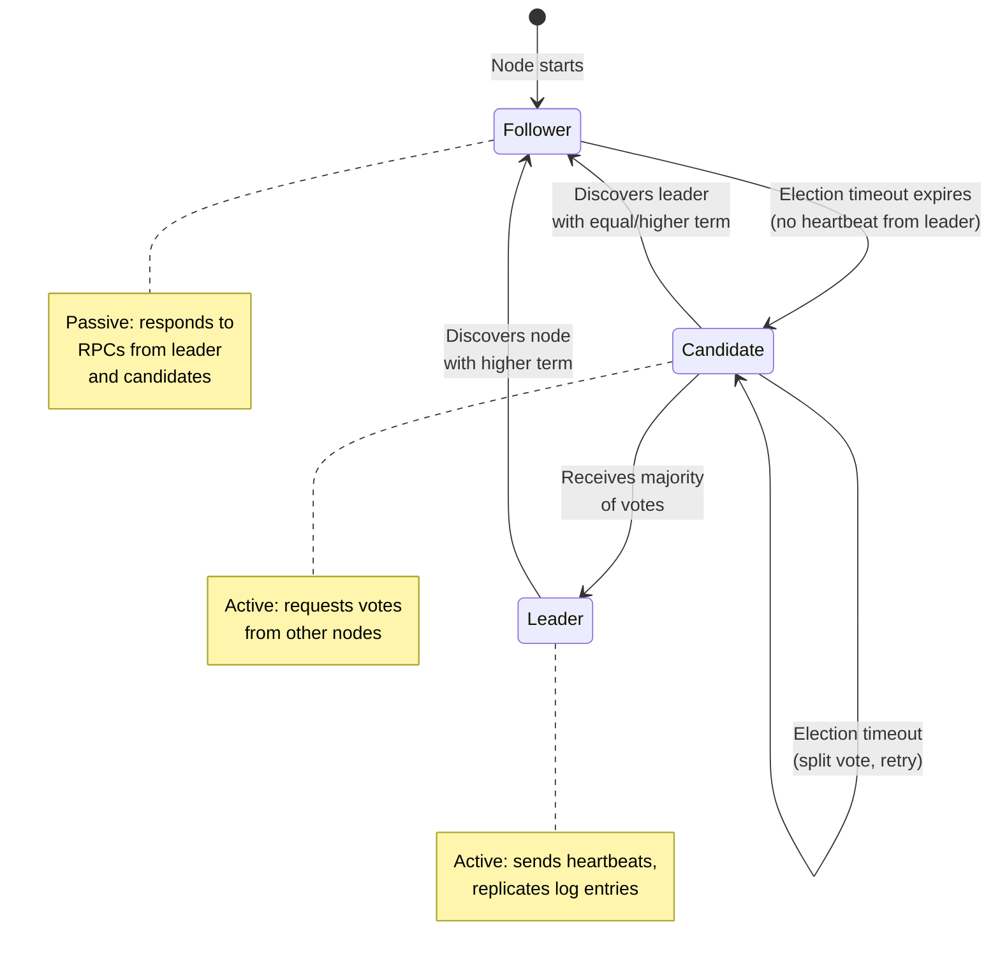
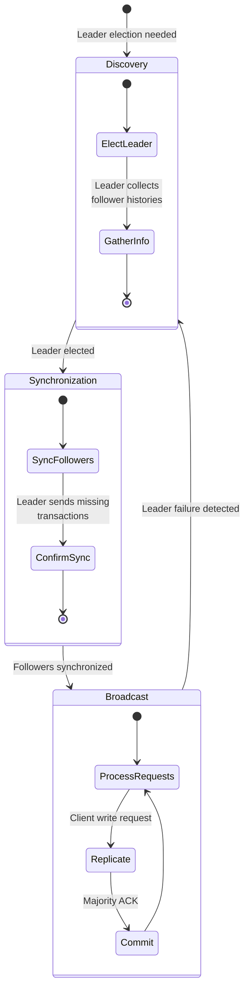
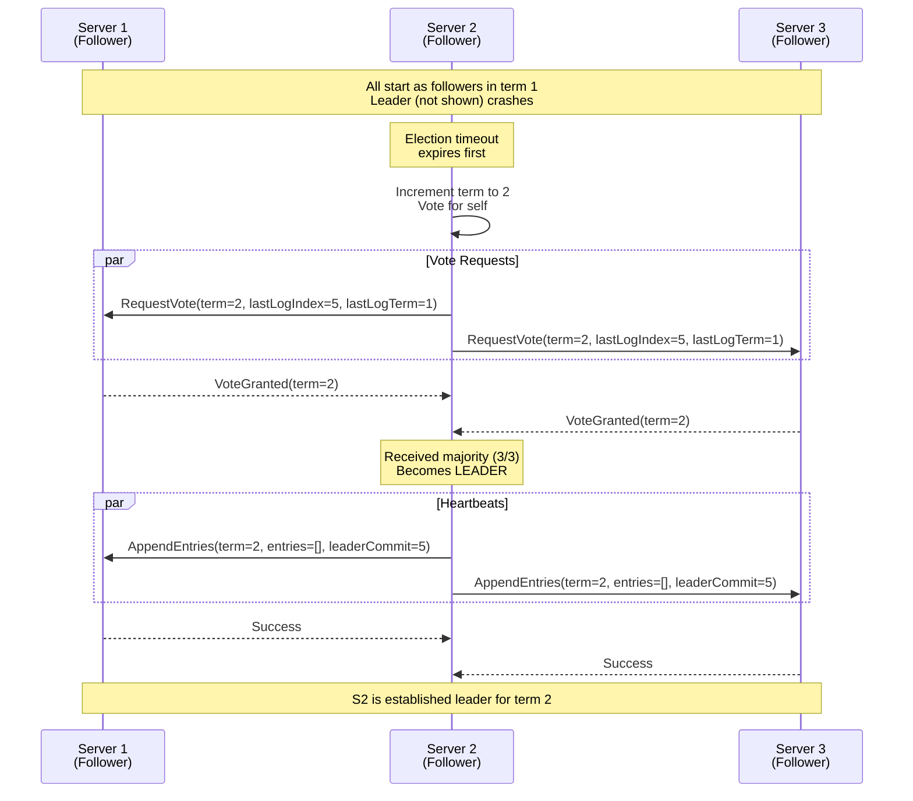
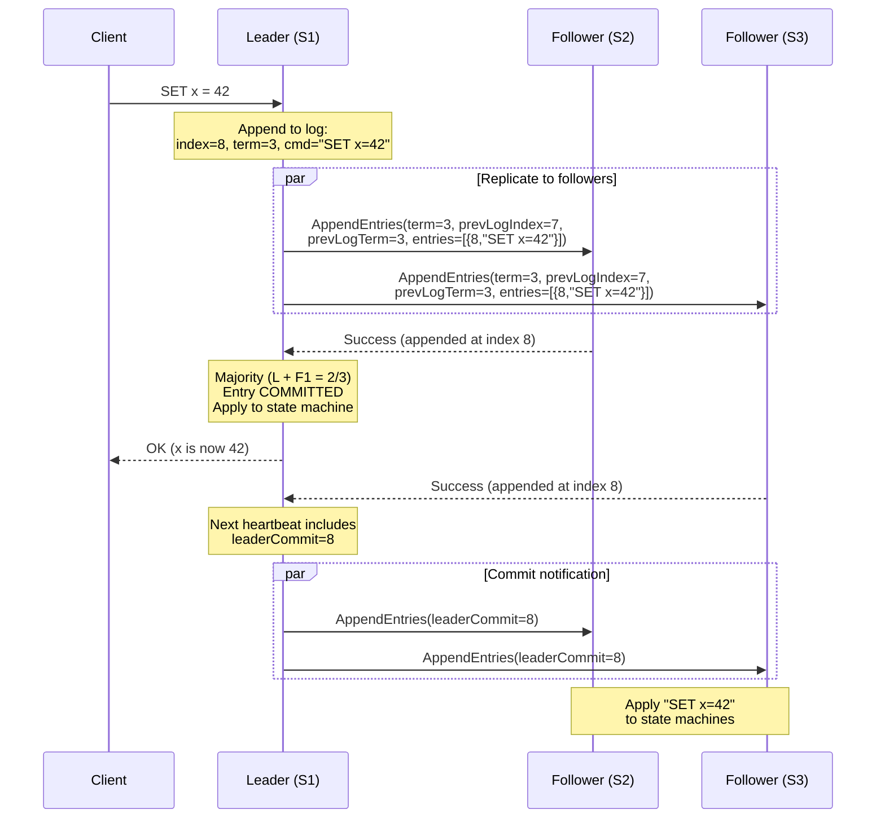
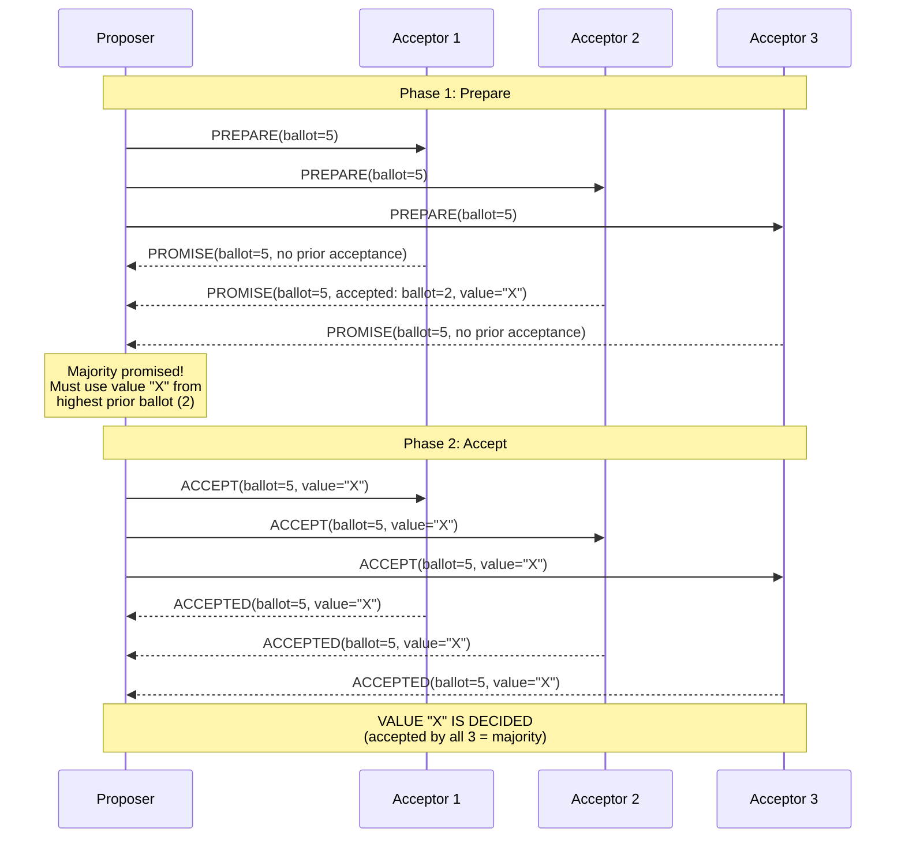
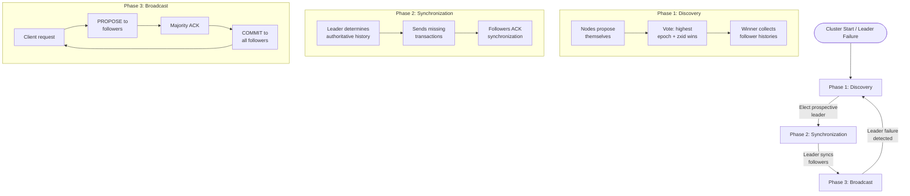
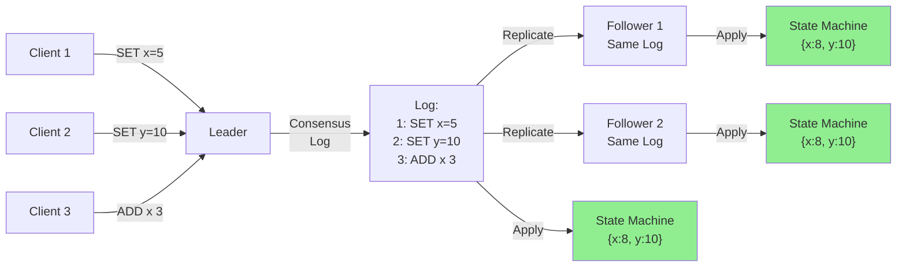

# Chapter 10: Consensus Algorithms

---

## 1. Why This Matters

Consensus is the **single most important problem** in distributed systems. It is the theoretical foundation that makes all reliable distributed infrastructure possible — from databases to message queues to configuration services to blockchain.

At its core, consensus answers one question:

> **How can a group of machines agree on a single value (or sequence of values) even when some of them crash, messages are delayed, or the network misbehaves?**

Without consensus, you cannot build:

- **Replicated state machines**: The basis of fault-tolerant services (etcd, ZooKeeper, CockroachDB)
- **Leader election**: Choosing exactly one leader when the current one fails
- **Distributed locks**: Ensuring mutual exclusion across machines
- **Atomic commit**: Ensuring all-or-nothing transaction semantics across partitions
- **Total order broadcast**: Delivering messages to all nodes in the same order
- **Configuration management**: Ensuring all nodes see the same configuration at the same time

### Why Consensus is Hard

Consensus would be trivial if networks were reliable and nodes never crashed. The difficulty arises because:

1. **Nodes can crash** at any moment — mid-write, mid-vote, mid-anything.
2. **Networks are unreliable** — messages can be delayed, reordered, duplicated, or lost.
3. **You can't distinguish a slow node from a crashed one** — this is the fundamental ambiguity of distributed systems.
4. **The FLP impossibility result** (1985): No deterministic consensus algorithm can guarantee termination in an asynchronous system where even one node can crash.

Despite FLP, practical consensus algorithms exist by making assumptions about timing (partial synchrony) or using randomization. The three most important consensus algorithms — **Paxos**, **Raft**, and **ZAB** — power the world's most critical infrastructure.

### Industry Relevance

| System | Consensus Algorithm | Purpose |
|--------|-------------------|---------|
| etcd | Raft | Kubernetes control plane, service discovery |
| ZooKeeper | ZAB | Distributed coordination, configuration, locking |
| Google Chubby | Paxos | Distributed lock service |
| Google Spanner | Multi-Paxos (TrueTime) | Globally distributed database |
| CockroachDB | Raft | Distributed SQL database |
| TiKV | Raft | Distributed key-value store (TiDB's storage) |
| Consul | Raft | Service mesh, service discovery |
| LogDevice (Meta) | Paxos variant | Distributed log storage |
| MongoDB (replica set) | Raft-like protocol | Database replication |
| VoltDB | Multi-Paxos | In-memory OLTP database |

### System Design Interview Relevance

Consensus appears in virtually every system design interview:
- "How do you elect a leader?" → Consensus
- "How do you ensure exactly-once delivery?" → Consensus for deduplication state
- "How do you implement a distributed lock?" → Consensus-based lock service
- "How does your database replicate reliably?" → Consensus for log replication
- "How do you ensure configuration consistency?" → Consensus

Understanding consensus deeply separates engineers who can design truly fault-tolerant systems from those who cannot.

---

## 2. Beginner Intuition

### The Restaurant Analogy

Imagine five friends trying to decide where to eat dinner. They're texting each other, but some texts arrive late, some don't arrive at all, and one friend's phone might die mid-conversation.

**The Naive Approach**: Everyone shouts their preference. Chaos — no agreement.

**The Dictator Approach**: One person (the "leader") decides. Everyone else follows. But what if the leader's phone dies? The group is stuck.

**The Democratic Approach** (Paxos/Raft):
1. One person volunteers to be the "proposer" (leader candidate).
2. They text everyone: "I'm proposing Thai food — do you accept?"
3. A majority (3 out of 5) must agree.
4. If a majority agrees, the decision is final. Even if 2 people's phones die, the group has a record of the decision.

**Key insight**: A **majority** (more than half) is crucial. Any two majorities overlap by at least one member, so no two conflicting decisions can both get majority approval.

### The Bank Analogy

Think of consensus as a notary service. Multiple parties want to record something in an official ledger:

1. They submit their proposed entries to the notary (leader).
2. The notary writes the entry, numbers it, and sends copies to multiple witnesses (followers).
3. Once a majority of witnesses confirm they've received the entry, it's **committed** — officially in the ledger.
4. If the notary dies, the witnesses elect a new notary. The new notary picks up from where the old one left off, because the witnesses have copies.

### The State Machine Intuition

Consensus is most powerful when used for **state machine replication**:

```
                     ┌─────────────────────────────────┐
Client Commands:     │  Command Log (agreed via consensus)  │
  SET x = 5        │  1: SET x = 5                    │
  SET y = 10       │  2: SET y = 10                   │
  ADD x 3          │  3: ADD x 3                      │
                     └───────────┬─────────────────────┘
                                 │ Apply in order
                    ┌────────────┼────────────────┐
                    ▼            ▼                ▼
              ┌──────────┐ ┌──────────┐ ┌──────────┐
              │ Node A   │ │ Node B   │ │ Node C   │
              │ x=8, y=10│ │ x=8, y=10│ │ x=8, y=10│
              │ (Leader) │ │(Follower)│ │(Follower)│
              └──────────┘ └──────────┘ └──────────┘
              
If all nodes apply the SAME commands in the SAME order,
they will all have the SAME state.

Consensus ensures: all nodes agree on the same log of commands.
```

---

## 3. Core Theory

### 3.1 Formal Definition of Consensus

The consensus problem requires a set of processes to agree on a single value. Formally, a consensus algorithm must satisfy:

1. **Validity** (Non-triviality): If a process decides a value v, then v was proposed by some process. (Can't decide on a value nobody proposed.)

2. **Agreement** (Safety): No two correct processes decide differently. (All correct processes decide the same value.)

3. **Termination** (Liveness): Every correct process eventually decides some value. (The algorithm doesn't deadlock.)

4. **Integrity**: Every process decides at most once. (No flip-flopping.)

### 3.2 The FLP Impossibility

In 1985, Fischer, Lynch, and Paterson proved that **no deterministic consensus algorithm can guarantee all three properties** (validity, agreement, termination) in an asynchronous system where even one process can crash.

**Why?** In a fully asynchronous system, you can't tell if a process is dead or just slow. Any algorithm that waits for a slow process might wait forever (violating termination). Any algorithm that gives up waiting might miss a message that would change the outcome (violating agreement).

**How real algorithms cope:**
- **Raft/Paxos**: Assume partial synchrony — messages are eventually delivered, and timeouts can distinguish slow from dead. They sacrifice termination (may get stuck temporarily) but never sacrifice safety (wrong decisions).
- **Randomized algorithms**: Use random coin flips to break ties, guaranteeing termination with probability 1.

### 3.3 Relationship Between Consensus Problems

Several distributed systems problems are **equivalent** to consensus — solving one solves all:

```
┌────────────────────────────────────────────────────────┐
│                   Equivalent Problems                   │
├────────────────────────────────────────────────────────┤
│  Consensus ⟺ Total Order Broadcast ⟺ Leader Election  │
│  ⟺ Atomic Commit ⟺ Replicated State Machine          │
│  ⟺ Linearizable Register                              │
└────────────────────────────────────────────────────────┘

If you can solve one, you can solve all of them.
If one is impossible, all are impossible.
```

### 3.4 Quorums and Majorities

The fundamental mechanism that enables consensus is the **quorum**: a subset of nodes large enough that any two quorums overlap.

```
Cluster size: 5 nodes
Quorum (majority): 3 nodes

Any two sets of 3 nodes from a 5-node cluster must share at least 1 member:
  {A, B, C} and {C, D, E} share C
  {A, B, D} and {B, C, E} share B

This overlap guarantees:
  - A value accepted by a quorum can be discovered by any future quorum
  - Two conflicting values cannot both be accepted by quorums
```

**Why majority?** With N nodes:
- Quorum size = ⌊N/2⌋ + 1
- Can tolerate up to ⌊(N-1)/2⌋ failures
- 3 nodes: quorum=2, tolerate 1 failure
- 5 nodes: quorum=3, tolerate 2 failures
- 7 nodes: quorum=4, tolerate 3 failures

### 3.5 The Role of Terms (Epochs/Ballots)

All consensus algorithms use a monotonically increasing number to prevent "stale" leaders from making conflicting decisions:

| Algorithm | Term Name | Purpose |
|-----------|-----------|---------|
| Paxos | Ballot number / Proposal number | Distinguishes proposals; higher ballot wins |
| Raft | Term | Identifies leadership periods; prevents stale leaders |
| ZAB | Epoch | Identifies leader eras; ensures new leader supersedes old |
| Viewstamped Replication | View number | Identifies primary changes |

```
Term 1: Node A is leader, processes requests
Term 2: Node A crashes, Node B becomes leader (new term)
Term 3: Node B crashes, Node C becomes leader (new term)

Node A recovers with stale term 1 data.
It sends a message with term 1.
Other nodes reject it: "Your term 1 < current term 3"
Node A learns it's no longer leader and steps down.
```

---

## 4. Architecture Deep Dive

### 4.1 Paxos

Paxos, invented by Leslie Lamport in 1989 (published 1998), is the first practical consensus algorithm. It is provably correct but notoriously difficult to understand and implement.

#### 4.1.1 Roles in Paxos

```
┌──────────────┐    ┌──────────────┐    ┌──────────────┐
│   Proposer    │    │   Acceptor   │    │   Learner    │
│               │    │              │    │              │
│ Proposes      │    │ Votes on     │    │ Learns the   │
│ values        │    │ proposals    │    │ decided value│
│               │    │              │    │              │
│ Sends:        │    │ Sends:       │    │ Receives:    │
│ - Prepare(n)  │    │ - Promise(n) │    │ - Accepted   │
│ - Accept(n,v) │    │ - Accepted   │    │   messages   │
└──────────────┘    └──────────────┘    └──────────────┘

In practice, each node plays all three roles.
```

#### 4.1.2 Single-Decree Paxos (Basic Paxos)

Single-decree Paxos agrees on **one value**. The protocol has two phases:

**Phase 1: Prepare/Promise**

```
Proposer P1 wants to propose value "X" with ballot number n:

Step 1: P1 → All Acceptors: PREPARE(n)
  "I want to make a proposal with ballot number n.
   Will you promise not to accept anything with a lower ballot?"

Step 2: Each Acceptor Aᵢ responds:
  IF n > highest ballot Aᵢ has seen:
    Aᵢ → P1: PROMISE(n, accepted_ballot, accepted_value)
    "I promise to ignore proposals with ballot < n.
     Here's the highest-balloted value I've already accepted (if any)."
  ELSE:
    Aᵢ → P1: REJECT(highest_seen)
    "I've already promised a higher ballot."
```

**Phase 2: Accept/Accepted**

```
Step 3: If P1 receives PROMISE from a majority:
  P1 chooses value v:
    - If any acceptor already accepted a value: use that value
      (the one with the highest ballot number among the responses)
    - If no acceptor has accepted anything: use the proposer's original value "X"
  
  P1 → All Acceptors: ACCEPT(n, v)
  "Please accept value v with ballot number n."

Step 4: Each Acceptor Aᵢ:
  IF n ≥ highest promised ballot:
    Aᵢ → All Learners: ACCEPTED(n, v)
    "I have accepted value v with ballot n."
  ELSE:
    Ignore (or REJECT)

Step 5: If a Learner receives ACCEPTED from a majority:
  The value v is DECIDED (chosen).
```

#### Why This Is Correct

The key insight: **Once a value is accepted by a majority, no different value can ever be accepted by any future majority.**

Proof sketch:
1. A value v is accepted by a majority at ballot n.
2. Any future proposer with ballot m > n must do Phase 1 first.
3. In Phase 1, the proposer contacts a majority, which must overlap with the majority that accepted v.
4. At least one respondent will report (n, v) as its accepted value.
5. The proposer must use v (or a value from a higher ballot, which by induction is also v).
6. Therefore, the new proposal also uses v. Same value — agreement maintained!

#### 4.1.3 The Dueling Proposers Problem (Livelock)

Paxos can fail to terminate (livelock) when two proposers keep preempting each other:

```
Time 0: P1 sends PREPARE(1) → majority promises
Time 1: P2 sends PREPARE(2) → majority promises (preempting P1)
Time 2: P1 sends ACCEPT(1, "X") → REJECTED (acceptors promised ballot 2)
Time 3: P1 sends PREPARE(3) → majority promises (preempting P2)
Time 4: P2 sends ACCEPT(2, "Y") → REJECTED (acceptors promised ballot 3)
... (cycle continues forever)
```

**Solution**: Elect a **distinguished proposer** (leader). Only the leader makes proposals. This is the basis of **Multi-Paxos**.

#### 4.1.4 Multi-Paxos

Multi-Paxos extends single-decree Paxos to decide a **sequence** of values (a log), which is what real systems need.

**Key optimization**: Once a leader is established, Phase 1 (Prepare/Promise) can be skipped for subsequent proposals. The leader just sends Phase 2 (Accept) messages.

```
                          ┌─────────────────────┐
Normal Operation:         │    Leader (Proposer) │
(Phase 1 done once)       └──────────┬──────────┘
                                     │
                     ┌───────────────┼───────────────┐
                     ▼               ▼               ▼
Slot 1: ACCEPT(1, "SET x=5")  → Majority ACK → COMMITTED
Slot 2: ACCEPT(2, "SET y=10") → Majority ACK → COMMITTED
Slot 3: ACCEPT(3, "DEL z")    → Majority ACK → COMMITTED
...

Phase 1 only needed when:
  - A new leader is elected
  - The leader's authority is challenged
```

#### 4.1.5 Why Paxos is Hard

Lamport's original paper presented Paxos as a story about a fictional Greek parliament on the island of Paxos, which many found confusing. Beyond the presentation, Paxos is genuinely hard to implement because:

1. **Many details are underspecified**: Paxos defines consensus for a single value. Extending to a log (Multi-Paxos) requires solving many additional problems: log compaction, membership changes, snapshots, client interaction.

2. **Multiple roles**: Proposers, acceptors, and learners can be any node. Managing this flexibility adds complexity.

3. **Gap handling**: In Multi-Paxos, log entries can be committed out of order (entry 5 before entry 3). The implementation must handle these gaps.

4. **Leader election**: Paxos doesn't specify how to elect a leader. You need a separate mechanism.

5. **Testing**: The number of failure scenarios is combinatorially explosive. Edge cases are subtle and hard to test.

> "There are significant gaps between the description of the Paxos algorithm and the needs of a real-world system. [...] The final system will be based on an unproven protocol." — *Chubby team at Google, "Paxos Made Live" (2007)*

#### 4.1.6 Paxos Optimizations

**Fast Paxos**: Allows clients to send proposals directly to acceptors, skipping the leader. Reduces latency by one message delay but requires a larger quorum (2f+1 out of 3f+1 instead of f+1 out of 2f+1).

**Flexible Paxos**: Observes that Phase 1 and Phase 2 quorums don't need to be the same size — they just need to overlap. This allows trading write availability for read availability or vice versa.

**Cheap Paxos**: Uses f+1 main processors and f cheap backup processors. The backups only participate when a main processor fails.

### 4.2 Raft — A Detailed Deep Dive

Raft was designed by Diego Ongaro and John Ousterhout in 2014 specifically to be **understandable**. It provides the same guarantees as Multi-Paxos but decomposes the problem into three sub-problems:

1. **Leader Election**: How to choose a leader
2. **Log Replication**: How the leader replicates entries to followers
3. **Safety**: How to ensure correctness through leader changes

#### 4.2.1 Raft Node States



#### 4.2.2 Leader Election — Detailed

**When does an election happen?**

Every follower has an **election timeout** — a random duration between 150ms and 300ms (configurable). If a follower doesn't receive a heartbeat from the leader within this timeout, it assumes the leader is dead and starts an election.

**The election process:**

```
Step 1: Follower F becomes a Candidate
  - Increments its current term: term = term + 1
  - Votes for itself
  - Resets its election timeout
  - Sends RequestVote RPC to all other nodes

Step 2: RequestVote contains:
  - Candidate's term
  - Candidate's ID
  - Index and term of candidate's last log entry (for safety check)

Step 3: Each node processes the RequestVote:
  IF candidate's term < node's term:
    REJECT (stale candidate)
  ELSE IF node hasn't voted in this term (or already voted for this candidate):
    AND candidate's log is at least as up-to-date as node's log:
      GRANT vote
  ELSE:
    REJECT

Step 4: Candidate collects votes:
  IF receives majority of votes:
    BECOME LEADER
    Send heartbeat (empty AppendEntries) to all nodes immediately
  IF receives AppendEntries from a valid leader (same or higher term):
    STEP DOWN to follower
  IF election timeout expires (no majority, no leader found):
    INCREMENT term, START NEW ELECTION
```

**Why randomized timeouts?**

Without random timeouts, all nodes would timeout simultaneously and all become candidates, splitting the vote. Randomization ensures one node typically times out first and wins the election before others start.

```
Node A timeout: 213ms  ← times out first, wins election
Node B timeout: 287ms
Node C timeout: 152ms  ← actually times out first!
Node D timeout: 341ms
Node E timeout: 195ms

Typical election: completes in < 1 round (< 300ms)
Split vote: rare, resolved in next round with new random timeouts
```

**The log up-to-dateness check is crucial:**

```
A candidate's log is "at least as up-to-date" if:
  (candidate's last log term > voter's last log term)
  OR
  (candidate's last log term == voter's last log term 
   AND candidate's last log index >= voter's last log index)

This ensures the elected leader has ALL committed entries.
```

#### 4.2.3 Log Replication — Detailed

Once a leader is elected, it handles all client requests and replicates them as log entries.

**Normal operation:**

```
Client → Leader: "SET x = 5"

Step 1: Leader appends entry to its local log
  Log: [..., (term=3, index=7, cmd="SET x=5")]

Step 2: Leader sends AppendEntries RPC to all followers (in parallel)
  Contains:
    - Leader's term
    - prevLogIndex: 6 (index of entry before the new one)
    - prevLogTerm: 3 (term of entry at prevLogIndex)
    - entries: [(term=3, index=7, cmd="SET x=5")]
    - leaderCommit: 6 (leader's current commit index)

Step 3: Follower processes AppendEntries:
  IF leader's term < follower's term:
    REJECT (stale leader)
  IF follower's log doesn't have an entry at prevLogIndex with prevLogTerm:
    REJECT (consistency check failed — log divergence)
  ELSE:
    Append new entries (overwriting any conflicting entries)
    Update commitIndex = min(leaderCommit, index of last new entry)
    ACCEPT

Step 4: Leader tracks responses:
  IF majority of nodes (including leader) have the entry:
    Entry is COMMITTED
    Leader advances commitIndex to 7
    Leader applies "SET x=5" to state machine
    Leader responds to client: "SUCCESS"
    Next AppendEntries will carry updated leaderCommit=7
    Followers apply committed entries to their state machines
```

**The consistency check (prevLogIndex/prevLogTerm):**

This is the mechanism that ensures log consistency across nodes. The leader sends the term and index of the entry immediately before the new entries. If the follower doesn't have a matching entry, the logs have diverged.

```
Leader's Log:    [1:A] [1:B] [2:C] [3:D] [3:E]
Follower's Log:  [1:A] [1:B] [2:X]

Leader sends: prevLogIndex=2, prevLogTerm=2, entries=[(3, D), (3, E)]
Follower check: entry at index 2 is (2:X) — term matches (2==2)? 
  Wait — the entry's content differs, but terms DO match in this case.
  Actually, if the term at prevLogIndex matches, Raft guarantees the logs agree 
  up to that point. If not:

Leader sends: prevLogIndex=3, prevLogTerm=2, entries=[(3, D)]
Follower check: no entry at index 3 → REJECT

Leader decrements nextIndex and retries:
Leader sends: prevLogIndex=2, prevLogTerm=2, entries=[(2:C), (3:D), (3:E)]
Follower: entry at index 2 has term 2 ✓ → ACCEPT → overwrites from index 3

After repair:
Leader's Log:    [1:A] [1:B] [2:C] [3:D] [3:E]
Follower's Log:  [1:A] [1:B] [2:C] [3:D] [3:E]  ← now consistent
```

#### 4.2.4 Safety Properties

**Safety Property 1: Election Safety**
At most one leader can be elected in a given term.
- Each node votes at most once per term
- A candidate needs a majority of votes
- Two majorities in a 5-node cluster must overlap → only one candidate can get a majority

**Safety Property 2: Leader Append-Only**
A leader never overwrites or deletes entries in its own log; it only appends.

**Safety Property 3: Log Matching**
If two logs contain an entry with the same index and term, then the logs are identical up to and including that index.
- Guaranteed by the consistency check in AppendEntries

**Safety Property 4: Leader Completeness**
If a log entry is committed in a given term, that entry will be present in the logs of all leaders of subsequent terms.
- Guaranteed by the election restriction (candidates must have up-to-date logs)

**Safety Property 5: State Machine Safety**
If a node applies a log entry at a given index, no other node will ever apply a different entry at that index.

#### 4.2.5 Committing Entries from Previous Terms

A subtle safety issue: **a leader cannot directly commit entries from previous terms by counting replicas.**

```
Scenario (the figure from the Raft paper):

Time 1: S1 is leader (term 2), replicates entry at index 2 to S2
         S1: [1] [2]
         S2: [1] [2]
         S3: [1]
         S4: [1]
         S5: [1]

Time 2: S1 crashes. S5 is elected leader (term 3) with votes from S3, S4, S5
         S5 replicates a different entry at index 2
         S5: [1] [3]

Time 3: S5 crashes. S1 is elected leader (term 4) 
         S1 replicates entry [2] from index 2 to S3
         S1: [1] [2] 
         S2: [1] [2]
         S3: [1] [2]  ← majority have [2] at index 2!
         S4: [1]
         S5: [1] [3]

Can S1 commit entry [2] at index 2? NO!
Because S5 could still be elected (it has entry with term 3 > term 2)
and would overwrite entry [2] with [3].

The SAFE approach: S1 must first commit a NEW entry from its own term (4).
Once entry from term 4 is committed, entry from term 2 is indirectly committed
(because committing term 4 implies all prior entries are committed).
```

**Rule**: A leader only commits entries from its current term by counting replicas. Previous-term entries are committed indirectly.

#### 4.2.6 Cluster Membership Changes

Changing the cluster configuration (adding/removing nodes) is dangerous because the old and new configurations might elect different leaders simultaneously.

**Raft's approach: Joint Consensus (from the dissertation)**

```
Phase 1: Leader replicates C_old,new configuration
  - Decisions require majorities from BOTH old AND new configurations
  - This prevents either configuration alone from making decisions

Phase 2: Once C_old,new is committed, leader replicates C_new
  - Now only the new configuration matters
  - Old nodes not in C_new step down

    C_old → C_old,new (committed) → C_new (committed)
    │         │                       │
    │         │ Both majorities       │ Only new
    │         │ required              │ majority
    ▼         ▼                       ▼
```

**Simpler approach: Single-server changes**

etcd and most implementations use a simpler approach: only add or remove one node at a time.

```
5-node cluster → 6-node cluster → 7-node cluster (not 5 → 7 directly)

Safe because: changing by 1 node means old and new majorities must overlap:
  Old: 5 nodes, majority = 3
  New: 6 nodes, majority = 4
  Total unique nodes = 6
  3 + 4 = 7 > 6 → must overlap by at least 1 node
```

#### 4.2.7 Log Compaction and Snapshots

Logs grow indefinitely. Without compaction, they consume unlimited storage and make recovery slow (must replay entire log).

**Snapshotting:**

```
Before snapshot:
  Log: [1:SET x=1] [1:SET y=2] [2:SET x=3] [2:DEL y] [3:SET x=5] [3:SET z=7]
  State: {x=5, z=7}

After snapshot at index 6:
  Snapshot: {x=5, z=7}, last_included_index=6, last_included_term=3
  Log: (empty — all entries through index 6 are captured in the snapshot)

New entries continue from index 7:
  Log: [3:SET w=9] [4:SET x=10] ...
```

**InstallSnapshot RPC**: When a follower is so far behind that the leader has already discarded the log entries it needs, the leader sends its snapshot instead of log entries.

```
Leader: "I've compacted my log. Here's a snapshot up to index 1000."
Slow Follower: 
  1. Receives snapshot
  2. Discards entire log
  3. Loads snapshot into state machine
  4. Continues receiving AppendEntries from index 1001
```

#### 4.2.8 Raft vs. Paxos Comparison

| Aspect | Paxos | Raft |
|--------|-------|------|
| **Understandability** | Very difficult | Designed for clarity |
| **Leader** | Not required (but Multi-Paxos uses one) | Required |
| **Log ordering** | Entries can commit out of order | Entries commit in order |
| **Leader election** | Separate mechanism needed | Built-in |
| **Membership changes** | Separate mechanism needed | Built-in (joint consensus) |
| **Correctness proof** | Complex | Simpler (TLA+ spec available) |
| **Performance** | Potentially higher (flexible quorums) | Slightly lower (strict ordering) |
| **Industry adoption** | Google (Spanner, Chubby) | etcd, CockroachDB, TiKV, Consul |
| **Implementations** | Few, hard to get right | Many, well-documented |

### 4.3 ZAB (ZooKeeper Atomic Broadcast)

ZAB is the consensus protocol used by Apache ZooKeeper. It's similar to Raft but was designed independently (before Raft was published).

#### 4.3.1 ZAB Protocol Phases

ZAB has three phases:



**Phase 1: Discovery (Leader Election)**

```
1. Each node proposes itself as leader with its epoch (term) and transaction history
2. Nodes vote for the candidate with:
   a. Highest epoch
   b. If tied, highest transaction ID (zxid)
   c. If still tied, highest node ID
3. Candidate receiving majority vote becomes "prospective leader"
4. Prospective leader collects histories from followers to find the most up-to-date log
```

**Phase 2: Synchronization**

```
1. Leader determines the authoritative transaction history
   (based on the most complete log among the quorum)
2. Leader sends missing transactions to each follower
3. Each follower applies the transactions and sends ACK
4. Once a quorum of followers is synchronized, leader enters Broadcast phase
```

**Phase 3: Broadcast (Normal Operation)**

```
1. Client sends write request to leader
2. Leader assigns a new zxid (epoch.counter)
3. Leader sends PROPOSE(zxid, transaction) to all followers
4. Each follower writes transaction to disk and sends ACK
5. Once leader has ACK from quorum: sends COMMIT to all followers
6. Followers apply the committed transaction

This is essentially a 2-phase commit with a majority quorum.
```

#### 4.3.2 How ZAB Differs from Raft

| Aspect | Raft | ZAB |
|--------|------|-----|
| **Transaction ID** | (term, index) pair | zxid: 64-bit (32-bit epoch + 32-bit counter) |
| **Election criterion** | Most up-to-date log | Highest epoch, then highest zxid |
| **Sync phase** | Implicit (AppendEntries repairs logs) | Explicit synchronization phase |
| **Commit semantics** | Committed when majority replicated | Committed when majority ACK + COMMIT sent |
| **Primary use** | General consensus | Ordered broadcast (ZooKeeper) |
| **Client interaction** | Direct to leader | Any node (writes forwarded to leader) |

### 4.4 Viewstamped Replication (VR)

Viewstamped Replication, developed by Oki and Liskov (1988), predates Paxos and is conceptually similar to Raft.

**Key concepts:**
- **View number**: Equivalent to Raft's term
- **Primary**: Equivalent to Raft's leader
- **View change**: Equivalent to leader election
- **Prepare/Commit**: Similar to Raft's AppendEntries

```
Normal Operation:
  Client → Primary: REQUEST(op, client-id, request-number)
  Primary → All Backups: PREPARE(view, op, op-number, commit-number)
  Backups → Primary: PREPAREOK(view, op-number)
  Primary (after f+1 PrepareOKs): Commit and respond to client
  Primary → All Backups: COMMIT(view, commit-number)

View Change (similar to Raft election):
  1. Backup detects primary failure (timeout)
  2. Backup initiates view change with higher view number
  3. Collects DOVIEWCHANGE messages from majority
  4. New primary determines latest state
  5. Sends STARTVIEW to all backups
  6. Normal operation resumes
```

### 4.5 EPaxos (Egalitarian Paxos)

EPaxos (2013) removes the single-leader bottleneck:

**Key innovation**: Any node can propose without being the leader. Proposals that don't conflict with each other can commit in parallel without coordination.

```
Scenario: Non-conflicting commands

Node A proposes: SET x = 5
Node B proposes: SET y = 10  (no conflict with x)

Both can commit independently in a single round trip!
No leader needed. Optimal for geo-distributed deployments.

Scenario: Conflicting commands

Node A proposes: SET x = 5
Node B proposes: SET x = 10  (CONFLICT!)

Requires coordination to determine order.
Falls back to a slower path similar to basic Paxos.
```

**Advantages:**
- No leader bottleneck
- Optimal commit latency (one round trip for non-conflicting commands)
- Better for geo-distributed deployments (nearest replica handles request)

**Disadvantages:**
- Much more complex implementation
- Recovery after failures is extremely complex
- Dependency tracking between commands adds overhead
- Few production implementations exist

### 4.6 Practical Considerations

#### Leader Lease

To serve reads without going through consensus:

```
Leader Election at time T:
  Leader acquires a "lease" valid until T + lease_duration
  
  During the lease:
    - Leader can serve reads locally without consensus
    - No other node can become leader (they must wait for lease expiry)
    
  Requires: Clock synchronization within bounded error
    Leader's lease: [T, T + lease_duration - clock_error_bound]
    
  Used by: CockroachDB, TiKV, Spanner (with TrueTime)
```

#### Read Optimization

Without optimization, every read goes through the consensus log (serialize like a write). Alternatives:

```
1. Leader Reads (with lease):
   Read from leader's local state during valid lease
   Pro: Fast, single node
   Con: Requires clock synchrony

2. ReadIndex:
   Leader checks it's still leader (heartbeat quorum)
   Then serves read from local state
   Pro: No clock dependency
   Con: One round of heartbeats

3. Follower Reads:
   Follower asks leader for current commit index
   Waits until its local state catches up
   Serves read from local state
   Pro: Distributes read load
   Con: Extra round trip to leader

4. Linearizable Reads via Consensus:
   Process the read as a log entry
   Pro: Strongest guarantee
   Con: Slowest (full consensus round)
```

#### Batching and Pipelining

Real implementations batch multiple client requests into a single consensus round:

```
Without batching:
  Request 1: propose → majority ACK → commit → respond  (1 RTT)
  Request 2: propose → majority ACK → commit → respond  (1 RTT)
  Request 3: propose → majority ACK → commit → respond  (1 RTT)
  Total: 3 RTTs

With batching:
  Requests 1,2,3: propose [1,2,3] → majority ACK → commit → respond
  Total: 1 RTT for all 3 requests

With pipelining:
  propose batch A → (don't wait) → propose batch B → (don't wait) → propose batch C
  ACK A → commit A
  ACK B → commit B
  ACK C → commit C
  Total: Overlapping RTTs, much higher throughput
```

---

## 5. Visual Diagrams

### 5.1 Raft Leader Election Sequence



### 5.2 Raft Log Replication



### 5.3 Paxos Prepare-Accept Flow



### 5.4 ZAB Protocol Phases



### 5.5 State Machine Replication



### 5.6 Raft Log States Across Nodes

```
Leader (term 5):
  Index:  1    2    3    4    5    6    7    8    9
  Term:  [1]  [1]  [2]  [3]  [3]  [3]  [4]  [5]  [5]
  Cmd:   [A]  [B]  [C]  [D]  [E]  [F]  [G]  [H]  [I]
                                    ↑ committed     ↑ replicated
                                                      not yet committed

Follower 1 (up to date):
  Index:  1    2    3    4    5    6    7    8    9
  Term:  [1]  [1]  [2]  [3]  [3]  [3]  [4]  [5]  [5]
  Cmd:   [A]  [B]  [C]  [D]  [E]  [F]  [G]  [H]  [I]

Follower 2 (slightly behind):
  Index:  1    2    3    4    5    6    7    8
  Term:  [1]  [1]  [2]  [3]  [3]  [3]  [4]  [5]
  Cmd:   [A]  [B]  [C]  [D]  [E]  [F]  [G]  [H]
  
  Missing index 9 — will receive on next AppendEntries

Follower 3 (crashed and recovered, needs repair):
  Index:  1    2    3    4    5
  Term:  [1]  [1]  [2]  [3]  [3]
  Cmd:   [A]  [B]  [C]  [D]  [E]
  
  Leader will backtrack nextIndex until consistency check passes
  Then send entries 6-9
```

---

## 6. Real Production Examples

### 6.1 etcd — Raft in Kubernetes

**Architecture:**
- etcd is a distributed key-value store that uses Raft for consensus
- It's the brain of Kubernetes: stores all cluster state (pods, services, configurations)
- Typically deployed as a 3 or 5 node cluster
- Written in Go, uses the `etcd/raft` library

**How etcd uses Raft:**

```
Every Kubernetes operation:
  kubectl apply → API Server → etcd → Raft consensus

Example: Creating a pod
  1. kubectl sends pod spec to API Server
  2. API Server writes to etcd: PUT /registry/pods/default/my-pod
  3. etcd leader proposes the write via Raft
  4. Majority of etcd nodes replicate the entry
  5. Entry committed → API Server gets success response
  6. Scheduler watches etcd (via API Server) → schedules the pod
```

**Production Configuration:**

```yaml
# etcd configuration for production
etcd:
  # Cluster size: always odd (3 or 5)
  initial-cluster-state: new
  initial-cluster-token: production-cluster
  
  # Heartbeat and election tuning
  heartbeat-interval: 100ms      # Default: 100ms
  election-timeout: 1000ms       # Default: 1000ms (10x heartbeat)
  
  # Snapshot tuning
  snapshot-count: 10000           # Snapshot every 10K entries
  
  # Performance
  max-request-bytes: 1572864     # 1.5 MB max request size
  quota-backend-bytes: 8589934592  # 8 GB max database size
```

**Common Production Issues:**

1. **Leader election storms**: Disk I/O latency causes heartbeat timeouts, triggering elections. Solution: Use SSDs, tune timeouts.
2. **Database size limit**: etcd is not designed for large datasets (recommended < 8 GB). Don't store large objects.
3. **Network latency**: In multi-region deployments, cross-region latency increases commit time. Keep etcd in a single region.

### 6.2 ZooKeeper — ZAB in Practice

**Architecture:**
- ZooKeeper provides a hierarchical key-value store (like a file system)
- Uses ZAB for replication across an ensemble (typically 3 or 5 nodes)
- All writes go through the leader
- Reads can be served by any node (potentially stale) or through `sync()` for linearizable reads

**How ZooKeeper is used:**

```
1. Service Discovery:
   /services/payment/instances/
     ├── instance-1 (ephemeral): {"host": "10.0.1.5", "port": 8080}
     ├── instance-2 (ephemeral): {"host": "10.0.1.6", "port": 8080}
     └── instance-3 (ephemeral): {"host": "10.0.1.7", "port": 8080}
   
   When instance-2 crashes, its ephemeral node is automatically deleted.
   Clients watching this path get notified.

2. Leader Election (using ZooKeeper recipes):
   /election/
     ├── candidate-000000001 (Node A's ephemeral sequential)
     ├── candidate-000000002 (Node B's ephemeral sequential)
     └── candidate-000000003 (Node C's ephemeral sequential)
   
   Lowest sequence number = leader (Node A)
   If Node A crashes, its ephemeral node disappears
   Node B watches Node A's node, gets notified, becomes leader

3. Distributed Lock:
   /locks/payment-processor/
     └── lock-000000001 (ephemeral sequential)
   
   Node creating the lowest-numbered ephemeral node holds the lock
   Lock released on node crash (session expires) or explicit delete
```

**ZooKeeper Transaction Processing:**

```
Client write "SET /config/db_host = 10.0.1.5":

1. Client → Any ZooKeeper node (may not be leader)
2. If not leader: FORWARD to leader
3. Leader assigns zxid: epoch=5, counter=12345 → zxid=0x500003039
4. Leader → PROPOSE(zxid=0x500003039, SET /config/db_host = 10.0.1.5)
5. Followers write to transaction log, send ACK
6. Leader receives majority ACK → COMMIT
7. Leader applies to in-memory data tree
8. Leader → COMMIT to all followers
9. Response to client: OK
```

### 6.3 Google Chubby — Paxos in Production

**Architecture:**
- Chubby is a distributed lock service used internally at Google
- Uses Paxos for replication (one of the earliest production Paxos implementations)
- Typically 5 replicas across geographically diverse data centers
- Provides coarse-grained locking (locks held for hours, not milliseconds)

**Key Design Decisions:**

```
1. Coarse-grained locks: Hold for minutes/hours, not milliseconds
   - Reduces load on the consensus system
   - Acceptable because Chubby is for coordination, not data access

2. Client-side caching with invalidation:
   - Clients cache Chubby data aggressively
   - Server sends cache invalidations through KeepAlive responses
   - Reduces read load on the Paxos group

3. Master lease:
   - Master (leader) holds a lease that prevents other replicas from becoming master
   - Allows the master to serve reads locally
   - Lease is refreshed via Paxos
```

**The "Paxos Made Live" Lessons:**

Google's paper "Paxos Made Live" (2007) documented the challenges of building a production Paxos system:

1. **Disk corruption**: Paxos assumes durable storage. Disk corruption can violate safety. Solution: Checksums on all disk writes.
2. **Multi-database consistency**: Keeping the Paxos log in sync with the application state machine requires careful crash recovery.
3. **Membership changes**: The Paxos paper doesn't specify how to change the set of participants. Google had to design this.
4. **Testing**: "We found that the weights of our code devoted to testing, dealing with corner cases, and resolving subtle specification ambiguities far exceeded the weight of the core algorithm."

### 6.4 CockroachDB — Raft for Distributed SQL

**Architecture:**
- CockroachDB divides data into **ranges** (default 512 MB each)
- Each range is a Raft group (typically 3 replicas)
- A single CockroachDB cluster may have thousands of Raft groups
- Uses the etcd/raft library

**Multi-Raft:**

```
CockroachDB cluster with 3 nodes:

Node 1:
  Range [A-D]: LEADER
  Range [E-H]: FOLLOWER
  Range [I-L]: FOLLOWER

Node 2:
  Range [A-D]: FOLLOWER
  Range [E-H]: LEADER
  Range [I-L]: FOLLOWER

Node 3:
  Range [A-D]: FOLLOWER
  Range [E-H]: FOLLOWER
  Range [I-L]: LEADER

Each range runs its own independent Raft consensus.
Leadership is distributed across nodes for load balancing.
```

**Transaction Flow (simplified):**

```
BEGIN; UPDATE accounts SET balance = balance - 100 WHERE id = 1; COMMIT;

1. SQL layer parses query
2. Determines key range for id=1 → Range [A-D]
3. Sends write intent to Range [A-D]'s Raft leader (Node 1)
4. Raft consensus: propose → replicate → commit
5. Once committed, respond to client
```

### 6.5 TiKV — Raft for Distributed Key-Value

**Architecture:**
- TiKV is the distributed storage layer of TiDB (distributed MySQL-compatible database)
- Data divided into **Regions** (default 96 MB)
- Each Region is a Raft group
- Regions automatically split when they exceed the size threshold
- PD (Placement Driver) manages Region metadata and load balancing

**Raft Optimizations in TiKV:**

```
1. Multi-Raft: Thousands of Raft groups on each node
   - Shared transport layer for all groups
   - Shared disk I/O (batch WAL writes across groups)
   - Shared timer management

2. Prevote: Before starting an election, candidates do a "prevote" round
   - Prevents disruptive elections from nodes that were network-partitioned
   - Only start a real election if prevote succeeds

3. Learner Replicas: Non-voting replicas that receive log entries
   - Used during Region split and merge
   - Receive data without affecting consensus quorum
   - Promoted to voter once caught up

4. Joint Consensus: For Region membership changes
   - Change from 3 replicas to 3 different replicas
   - Pass through a joint configuration where both old and new must agree
```

---

## 7. Java Implementations

### 7.1 Raft Leader Election Implementation

```java
import java.util.*;
import java.util.concurrent.*;
import java.util.concurrent.atomic.*;
import java.util.concurrent.locks.ReentrantLock;

/**
 * Raft leader election implementation.
 * 
 * This implements the election portion of Raft:
 * - Follower → Candidate transition on election timeout
 * - RequestVote RPC handling
 * - Leader establishment with heartbeats
 * 
 * Thread-safe with proper synchronization.
 */
public class RaftNode {

    // --- Node Identity ---
    private final String nodeId;
    private final List<String> peers;

    // --- Persistent State (on all servers) ---
    // Must be persisted to stable storage before responding to RPCs
    private volatile int currentTerm = 0;
    private volatile String votedFor = null;
    private final List<LogEntry> log = new CopyOnWriteArrayList<>();

    // --- Volatile State (on all servers) ---
    private volatile int commitIndex = 0;
    private volatile int lastApplied = 0;

    // --- Volatile State (on leaders) ---
    private final Map<String, Integer> nextIndex = new ConcurrentHashMap<>();
    private final Map<String, Integer> matchIndex = new ConcurrentHashMap<>();

    // --- Node State ---
    private volatile NodeState state = NodeState.FOLLOWER;
    private volatile String leaderId = null;

    // --- Timing ---
    private final ScheduledExecutorService scheduler = Executors.newScheduledThreadPool(2);
    private ScheduledFuture<?> electionTimer;
    private ScheduledFuture<?> heartbeatTimer;
    private final Random random = new Random();
    
    // Election timeout range in milliseconds
    private static final int ELECTION_TIMEOUT_MIN = 150;
    private static final int ELECTION_TIMEOUT_MAX = 300;
    private static final int HEARTBEAT_INTERVAL = 50;

    // --- Transport (simplified) ---
    private final RaftTransport transport;
    
    // --- Synchronization ---
    private final ReentrantLock stateLock = new ReentrantLock();

    public enum NodeState {
        FOLLOWER, CANDIDATE, LEADER
    }

    /**
     * Represents a single entry in the Raft log.
     */
    public static class LogEntry {
        private final int term;
        private final int index;
        private final String command;

        public LogEntry(int term, int index, String command) {
            this.term = term;
            this.index = index;
            this.command = command;
        }

        public int getTerm() { return term; }
        public int getIndex() { return index; }
        public String getCommand() { return command; }

        @Override
        public String toString() {
            return String.format("LogEntry{term=%d, index=%d, cmd='%s'}", 
                term, index, command);
        }
    }

    /**
     * RequestVote RPC arguments.
     */
    public static class RequestVoteArgs {
        public final int term;
        public final String candidateId;
        public final int lastLogIndex;
        public final int lastLogTerm;

        public RequestVoteArgs(int term, String candidateId, 
                              int lastLogIndex, int lastLogTerm) {
            this.term = term;
            this.candidateId = candidateId;
            this.lastLogIndex = lastLogIndex;
            this.lastLogTerm = lastLogTerm;
        }
    }

    /**
     * RequestVote RPC reply.
     */
    public static class RequestVoteReply {
        public final int term;
        public final boolean voteGranted;

        public RequestVoteReply(int term, boolean voteGranted) {
            this.term = term;
            this.voteGranted = voteGranted;
        }
    }

    /**
     * AppendEntries RPC arguments (used for heartbeats and replication).
     */
    public static class AppendEntriesArgs {
        public final int term;
        public final String leaderId;
        public final int prevLogIndex;
        public final int prevLogTerm;
        public final List<LogEntry> entries;
        public final int leaderCommit;

        public AppendEntriesArgs(int term, String leaderId, int prevLogIndex,
                                int prevLogTerm, List<LogEntry> entries, 
                                int leaderCommit) {
            this.term = term;
            this.leaderId = leaderId;
            this.prevLogIndex = prevLogIndex;
            this.prevLogTerm = prevLogTerm;
            this.entries = entries;
            this.leaderCommit = leaderCommit;
        }
    }

    /**
     * AppendEntries RPC reply.
     */
    public static class AppendEntriesReply {
        public final int term;
        public final boolean success;
        // Optimization: include conflict info for faster log repair
        public final int conflictIndex;
        public final int conflictTerm;

        public AppendEntriesReply(int term, boolean success, 
                                 int conflictIndex, int conflictTerm) {
            this.term = term;
            this.success = success;
            this.conflictIndex = conflictIndex;
            this.conflictTerm = conflictTerm;
        }
    }

    /**
     * Interface for inter-node communication.
     */
    public interface RaftTransport {
        CompletableFuture<RequestVoteReply> sendRequestVote(
            String targetNode, RequestVoteArgs args);
        CompletableFuture<AppendEntriesReply> sendAppendEntries(
            String targetNode, AppendEntriesArgs args);
    }

    /**
     * Creates a new Raft node.
     */
    public RaftNode(String nodeId, List<String> peers, RaftTransport transport) {
        this.nodeId = nodeId;
        this.peers = new ArrayList<>(peers);
        this.transport = transport;
        
        System.out.printf("[%s] Raft node created. Peers: %s%n", nodeId, peers);
    }

    /**
     * Starts the Raft node. Begins as a follower.
     */
    public void start() {
        state = NodeState.FOLLOWER;
        resetElectionTimer();
        System.out.printf("[%s] Started as FOLLOWER (term %d)%n", nodeId, currentTerm);
    }

    /**
     * Stops the Raft node.
     */
    public void stop() {
        scheduler.shutdown();
        System.out.printf("[%s] Stopped%n", nodeId);
    }

    // ==================== Election Logic ====================

    /**
     * Resets the election timer with a random timeout.
     * Called when: receiving a valid heartbeat or granting a vote.
     */
    private void resetElectionTimer() {
        if (electionTimer != null) {
            electionTimer.cancel(false);
        }
        int timeout = ELECTION_TIMEOUT_MIN + 
            random.nextInt(ELECTION_TIMEOUT_MAX - ELECTION_TIMEOUT_MIN);
        
        electionTimer = scheduler.schedule(
            this::startElection, timeout, TimeUnit.MILLISECONDS);
    }

    /**
     * Starts an election. Called when election timeout expires.
     */
    private void startElection() {
        stateLock.lock();
        try {
            if (state == NodeState.LEADER) return;

            // Transition to candidate
            state = NodeState.CANDIDATE;
            currentTerm++;
            votedFor = nodeId;  // Vote for self
            int electionTerm = currentTerm;

            System.out.printf("[%s] Starting election for term %d%n", 
                nodeId, electionTerm);

            // Prepare RequestVote arguments
            int lastLogIndex = getLastLogIndex();
            int lastLogTerm = getLastLogTerm();
            RequestVoteArgs args = new RequestVoteArgs(
                electionTerm, nodeId, lastLogIndex, lastLogTerm);

            AtomicInteger votesReceived = new AtomicInteger(1); // Self-vote
            int majority = (peers.size() + 1) / 2 + 1; // +1 for self

            // Send RequestVote to all peers
            for (String peer : peers) {
                transport.sendRequestVote(peer, args).whenComplete((reply, error) -> {
                    if (error != null) {
                        System.out.printf("[%s] RequestVote to %s failed: %s%n", 
                            nodeId, peer, error.getMessage());
                        return;
                    }

                    stateLock.lock();
                    try {
                        // Check if we're still in the same election
                        if (currentTerm != electionTerm || state != NodeState.CANDIDATE) {
                            return;
                        }

                        if (reply.term > currentTerm) {
                            // Discovered higher term — step down
                            stepDown(reply.term);
                            return;
                        }

                        if (reply.voteGranted) {
                            int votes = votesReceived.incrementAndGet();
                            System.out.printf("[%s] Received vote from %s (%d/%d)%n", 
                                nodeId, peer, votes, majority);

                            if (votes >= majority) {
                                becomeLeader();
                            }
                        }
                    } finally {
                        stateLock.unlock();
                    }
                });
            }

            // Reset election timer in case this election fails (split vote)
            resetElectionTimer();
            
        } finally {
            stateLock.unlock();
        }
    }

    /**
     * Transition to leader state.
     */
    private void becomeLeader() {
        state = NodeState.LEADER;
        leaderId = nodeId;
        
        System.out.printf("[%s] *** BECAME LEADER for term %d ***%n", 
            nodeId, currentTerm);

        // Cancel election timer
        if (electionTimer != null) {
            electionTimer.cancel(false);
        }

        // Initialize nextIndex and matchIndex for all peers
        int lastLogIdx = getLastLogIndex();
        for (String peer : peers) {
            nextIndex.put(peer, lastLogIdx + 1);
            matchIndex.put(peer, 0);
        }

        // Start sending heartbeats
        startHeartbeat();

        // Send immediate heartbeat to establish authority
        sendHeartbeats();
    }

    /**
     * Step down to follower due to discovering a higher term.
     */
    private void stepDown(int newTerm) {
        System.out.printf("[%s] Stepping down: term %d → %d%n", 
            nodeId, currentTerm, newTerm);
        
        currentTerm = newTerm;
        state = NodeState.FOLLOWER;
        votedFor = null;
        leaderId = null;

        // Stop heartbeats if we were leader
        if (heartbeatTimer != null) {
            heartbeatTimer.cancel(false);
        }

        resetElectionTimer();
    }

    /**
     * Start periodic heartbeat sending (leader only).
     */
    private void startHeartbeat() {
        heartbeatTimer = scheduler.scheduleAtFixedRate(
            this::sendHeartbeats, 0, HEARTBEAT_INTERVAL, TimeUnit.MILLISECONDS);
    }

    /**
     * Send heartbeat (empty AppendEntries) to all peers.
     */
    private void sendHeartbeats() {
        if (state != NodeState.LEADER) return;

        for (String peer : peers) {
            sendAppendEntries(peer);
        }
    }

    /**
     * Send AppendEntries to a specific peer.
     * Includes any new log entries the peer hasn't received yet.
     */
    private void sendAppendEntries(String peer) {
        stateLock.lock();
        int term = currentTerm;
        int nextIdx = nextIndex.getOrDefault(peer, getLastLogIndex() + 1);
        int prevLogIdx = nextIdx - 1;
        int prevLogTrm = prevLogIdx > 0 && prevLogIdx <= log.size() 
            ? log.get(prevLogIdx - 1).getTerm() : 0;
        
        // Get entries to send
        List<LogEntry> entries = new ArrayList<>();
        if (nextIdx <= log.size()) {
            entries.addAll(log.subList(nextIdx - 1, log.size()));
        }
        stateLock.unlock();

        AppendEntriesArgs args = new AppendEntriesArgs(
            term, nodeId, prevLogIdx, prevLogTrm, entries, commitIndex);

        transport.sendAppendEntries(peer, args).whenComplete((reply, error) -> {
            if (error != null) return;

            stateLock.lock();
            try {
                if (reply.term > currentTerm) {
                    stepDown(reply.term);
                    return;
                }

                if (state != NodeState.LEADER || currentTerm != term) return;

                if (reply.success) {
                    // Update nextIndex and matchIndex for the peer
                    int newMatchIndex = prevLogIdx + entries.size();
                    nextIndex.put(peer, newMatchIndex + 1);
                    matchIndex.put(peer, newMatchIndex);
                    
                    // Check if we can advance commitIndex
                    advanceCommitIndex();
                } else {
                    // Log inconsistency — decrement nextIndex and retry
                    // Optimization: use conflictIndex/conflictTerm for faster backup
                    if (reply.conflictTerm > 0) {
                        // Find the last entry with conflictTerm
                        int newNextIndex = reply.conflictIndex;
                        nextIndex.put(peer, Math.max(1, newNextIndex));
                    } else {
                        nextIndex.put(peer, Math.max(1, nextIdx - 1));
                    }
                }
            } finally {
                stateLock.unlock();
            }
        });
    }

    /**
     * Advance commitIndex if a majority has replicated up to a new index.
     */
    private void advanceCommitIndex() {
        for (int n = log.size(); n > commitIndex; n--) {
            if (log.get(n - 1).getTerm() != currentTerm) continue; // Only commit current term

            int replicationCount = 1; // Leader counts
            for (String peer : peers) {
                if (matchIndex.getOrDefault(peer, 0) >= n) {
                    replicationCount++;
                }
            }

            int majority = (peers.size() + 1) / 2 + 1;
            if (replicationCount >= majority) {
                System.out.printf("[%s] Committed entries up to index %d%n", nodeId, n);
                commitIndex = n;
                applyCommittedEntries();
                break;
            }
        }
    }

    /**
     * Apply committed but not yet applied entries to the state machine.
     */
    private void applyCommittedEntries() {
        while (lastApplied < commitIndex) {
            lastApplied++;
            LogEntry entry = log.get(lastApplied - 1);
            System.out.printf("[%s] Applied: %s%n", nodeId, entry);
            // In production: apply entry.command to state machine
        }
    }

    // ==================== RPC Handlers ====================

    /**
     * Handles a RequestVote RPC from a candidate.
     */
    public RequestVoteReply handleRequestVote(RequestVoteArgs args) {
        stateLock.lock();
        try {
            // Reply false if candidate's term < currentTerm
            if (args.term < currentTerm) {
                return new RequestVoteReply(currentTerm, false);
            }

            // If candidate's term > currentTerm, update and become follower
            if (args.term > currentTerm) {
                stepDown(args.term);
            }

            // Grant vote if:
            // 1. Haven't voted for anyone else in this term
            // 2. Candidate's log is at least as up-to-date as ours
            boolean canVote = (votedFor == null || votedFor.equals(args.candidateId));
            boolean logIsUpToDate = isLogUpToDate(args.lastLogIndex, args.lastLogTerm);

            if (canVote && logIsUpToDate) {
                votedFor = args.candidateId;
                resetElectionTimer(); // Reset timer on granting vote
                System.out.printf("[%s] Voted for %s in term %d%n", 
                    nodeId, args.candidateId, currentTerm);
                return new RequestVoteReply(currentTerm, true);
            }

            return new RequestVoteReply(currentTerm, false);
        } finally {
            stateLock.unlock();
        }
    }

    /**
     * Handles an AppendEntries RPC from the leader.
     */
    public AppendEntriesReply handleAppendEntries(AppendEntriesArgs args) {
        stateLock.lock();
        try {
            // Reply false if leader's term < currentTerm
            if (args.term < currentTerm) {
                return new AppendEntriesReply(currentTerm, false, 0, 0);
            }

            // Valid leader heartbeat — reset election timer
            resetElectionTimer();

            // If leader's term >= currentTerm
            if (args.term > currentTerm || state == NodeState.CANDIDATE) {
                stepDown(args.term);
            }
            
            leaderId = args.leaderId;

            // Consistency check: verify prevLogIndex and prevLogTerm
            if (args.prevLogIndex > 0) {
                if (args.prevLogIndex > log.size()) {
                    // We don't have the entry at prevLogIndex
                    return new AppendEntriesReply(currentTerm, false, 
                        log.size() + 1, 0);
                }
                int termAtPrev = log.get(args.prevLogIndex - 1).getTerm();
                if (termAtPrev != args.prevLogTerm) {
                    // Term mismatch at prevLogIndex
                    // Find the first index with this conflicting term
                    int conflictTerm = termAtPrev;
                    int conflictIndex = args.prevLogIndex;
                    while (conflictIndex > 1 && 
                           log.get(conflictIndex - 2).getTerm() == conflictTerm) {
                        conflictIndex--;
                    }
                    return new AppendEntriesReply(currentTerm, false, 
                        conflictIndex, conflictTerm);
                }
            }

            // Append new entries (overwriting any conflicting entries)
            int insertIndex = args.prevLogIndex;
            for (LogEntry entry : args.entries) {
                insertIndex++;
                if (insertIndex <= log.size()) {
                    if (log.get(insertIndex - 1).getTerm() != entry.getTerm()) {
                        // Conflict: remove this and all following entries
                        while (log.size() >= insertIndex) {
                            log.remove(log.size() - 1);
                        }
                        log.add(entry);
                    }
                    // If terms match, entry already exists — skip
                } else {
                    log.add(entry);
                }
            }

            // Update commit index
            if (args.leaderCommit > commitIndex) {
                commitIndex = Math.min(args.leaderCommit, getLastLogIndex());
                applyCommittedEntries();
            }

            return new AppendEntriesReply(currentTerm, true, 0, 0);
        } finally {
            stateLock.unlock();
        }
    }

    // ==================== Client Interface ====================

    /**
     * Submits a command to the Raft cluster (must be called on the leader).
     */
    public CompletableFuture<Boolean> submitCommand(String command) {
        stateLock.lock();
        try {
            if (state != NodeState.LEADER) {
                CompletableFuture<Boolean> f = new CompletableFuture<>();
                f.completeExceptionally(
                    new IllegalStateException("Not the leader. Leader is: " + leaderId));
                return f;
            }

            // Append entry to leader's log
            int newIndex = log.size() + 1;
            LogEntry entry = new LogEntry(currentTerm, newIndex, command);
            log.add(entry);

            System.out.printf("[%s] Appended entry: %s%n", nodeId, entry);

            // Replicate to followers (will happen in next heartbeat or immediately)
            for (String peer : peers) {
                sendAppendEntries(peer);
            }

            // In production: return a future that completes when the entry is committed
            return CompletableFuture.completedFuture(true);
        } finally {
            stateLock.unlock();
        }
    }

    // ==================== Helper Methods ====================

    private int getLastLogIndex() {
        return log.size();
    }

    private int getLastLogTerm() {
        return log.isEmpty() ? 0 : log.get(log.size() - 1).getTerm();
    }

    /**
     * Checks if a candidate's log is at least as up-to-date as ours.
     * This is the CRITICAL safety check that ensures leader completeness.
     */
    private boolean isLogUpToDate(int candidateLastIndex, int candidateLastTerm) {
        int myLastTerm = getLastLogTerm();
        int myLastIndex = getLastLogIndex();

        // Higher last term wins
        if (candidateLastTerm != myLastTerm) {
            return candidateLastTerm > myLastTerm;
        }
        // Same term: longer log wins
        return candidateLastIndex >= myLastIndex;
    }

    // ==================== Getters for monitoring ====================

    public String getNodeId() { return nodeId; }
    public int getCurrentTerm() { return currentTerm; }
    public NodeState getState() { return state; }
    public String getLeaderId() { return leaderId; }
    public int getCommitIndex() { return commitIndex; }
    public int getLogSize() { return log.size(); }
}
```

### 7.2 Paxos Proposer and Acceptor

```java
import java.util.*;
import java.util.concurrent.*;
import java.util.concurrent.atomic.AtomicInteger;

/**
 * Single-decree Paxos implementation.
 * 
 * This implements the core Paxos protocol:
 * - Phase 1: Prepare/Promise
 * - Phase 2: Accept/Accepted
 * 
 * Simplified for clarity — production implementations would need
 * persistence, proper networking, and Multi-Paxos extension.
 */
public class PaxosNode {

    private final String nodeId;
    private final List<String> peers;
    private final PaxosTransport transport;

    // --- Acceptor State (must be persistent) ---
    private volatile int highestPromisedBallot = 0;
    private volatile int highestAcceptedBallot = 0;
    private volatile String acceptedValue = null;

    // --- Proposer State ---
    private final AtomicInteger ballotCounter = new AtomicInteger(0);
    private volatile String decidedValue = null;

    /**
     * Prepare request message.
     */
    public static class PrepareRequest {
        public final int ballotNumber;
        public final String proposerId;

        public PrepareRequest(int ballotNumber, String proposerId) {
            this.ballotNumber = ballotNumber;
            this.proposerId = proposerId;
        }
    }

    /**
     * Promise response message.
     */
    public static class PromiseResponse {
        public final boolean promised;
        public final int ballotNumber;
        public final int acceptedBallot;    // Highest ballot of accepted value
        public final String acceptedValue;   // The value accepted at that ballot
        public final int highestSeenBallot;  // Used to help proposer choose higher ballot

        public PromiseResponse(boolean promised, int ballotNumber,
                              int acceptedBallot, String acceptedValue,
                              int highestSeenBallot) {
            this.promised = promised;
            this.ballotNumber = ballotNumber;
            this.acceptedBallot = acceptedBallot;
            this.acceptedValue = acceptedValue;
            this.highestSeenBallot = highestSeenBallot;
        }
    }

    /**
     * Accept request message.
     */
    public static class AcceptRequest {
        public final int ballotNumber;
        public final String value;
        public final String proposerId;

        public AcceptRequest(int ballotNumber, String value, String proposerId) {
            this.ballotNumber = ballotNumber;
            this.value = value;
            this.proposerId = proposerId;
        }
    }

    /**
     * Accepted response message.
     */
    public static class AcceptedResponse {
        public final boolean accepted;
        public final int ballotNumber;
        public final int highestSeenBallot;

        public AcceptedResponse(boolean accepted, int ballotNumber, 
                               int highestSeenBallot) {
            this.accepted = accepted;
            this.ballotNumber = ballotNumber;
            this.highestSeenBallot = highestSeenBallot;
        }
    }

    /**
     * Transport interface for Paxos messages.
     */
    public interface PaxosTransport {
        CompletableFuture<PromiseResponse> sendPrepare(String target, PrepareRequest req);
        CompletableFuture<AcceptedResponse> sendAccept(String target, AcceptRequest req);
    }

    public PaxosNode(String nodeId, List<String> peers, PaxosTransport transport) {
        this.nodeId = nodeId;
        this.peers = new ArrayList<>(peers);
        this.transport = transport;
    }

    /**
     * PROPOSER: Proposes a value using the full Paxos protocol.
     * 
     * @param proposedValue The value this proposer wants to decide
     * @return The decided value (may be different from proposedValue if 
     *         another value was already accepted)
     */
    public CompletableFuture<String> propose(String proposedValue) {
        return CompletableFuture.supplyAsync(() -> {
            int maxRetries = 10;
            int retryDelay = 100; // ms

            for (int attempt = 0; attempt < maxRetries; attempt++) {
                try {
                    // Generate a unique ballot number
                    // Convention: ballot = (sequence * numNodes) + nodeIndex
                    int ballot = generateBallot();
                    
                    System.out.printf("[%s] Phase 1: PREPARE(ballot=%d) attempt %d%n", 
                        nodeId, ballot, attempt + 1);

                    // ===== PHASE 1: PREPARE =====
                    String valueToPropose = runPhase1(ballot, proposedValue);
                    
                    if (valueToPropose == null) {
                        // Phase 1 failed — retry with higher ballot
                        Thread.sleep(retryDelay + new Random().nextInt(retryDelay));
                        continue;
                    }

                    System.out.printf("[%s] Phase 2: ACCEPT(ballot=%d, value='%s')%n", 
                        nodeId, ballot, valueToPropose);

                    // ===== PHASE 2: ACCEPT =====
                    boolean accepted = runPhase2(ballot, valueToPropose);
                    
                    if (accepted) {
                        decidedValue = valueToPropose;
                        System.out.printf("[%s] *** VALUE DECIDED: '%s' ***%n", 
                            nodeId, valueToPropose);
                        return valueToPropose;
                    }

                    // Phase 2 failed — retry
                    Thread.sleep(retryDelay + new Random().nextInt(retryDelay));

                } catch (InterruptedException e) {
                    Thread.currentThread().interrupt();
                    throw new CompletionException(e);
                }
            }

            throw new CompletionException(
                new RuntimeException("Failed to reach consensus after " + maxRetries + " attempts"));
        });
    }

    /**
     * Phase 1: Send PREPARE to all acceptors, collect PROMISE responses.
     * 
     * @return The value to propose in Phase 2, or null if Phase 1 failed
     */
    private String runPhase1(int ballot, String proposedValue) {
        List<CompletableFuture<PromiseResponse>> futures = new ArrayList<>();
        PrepareRequest request = new PrepareRequest(ballot, nodeId);

        // Include self as acceptor
        futures.add(CompletableFuture.completedFuture(
            handlePrepare(request)));

        // Send to all peers
        for (String peer : peers) {
            futures.add(transport.sendPrepare(peer, request)
                .orTimeout(1, TimeUnit.SECONDS)
                .exceptionally(e -> null)); // Treat failures as non-responses
        }

        // Wait for all responses
        CompletableFuture.allOf(futures.toArray(new CompletableFuture[0])).join();

        // Count promises and find highest accepted value
        int promiseCount = 0;
        int highestAcceptedBallot = -1;
        String highestAcceptedValue = null;
        int totalNodes = peers.size() + 1;
        int majority = totalNodes / 2 + 1;

        for (CompletableFuture<PromiseResponse> future : futures) {
            PromiseResponse response = future.getNow(null);
            if (response != null && response.promised) {
                promiseCount++;
                if (response.acceptedBallot > highestAcceptedBallot 
                        && response.acceptedValue != null) {
                    highestAcceptedBallot = response.acceptedBallot;
                    highestAcceptedValue = response.acceptedValue;
                }
            }
        }

        System.out.printf("[%s] Phase 1 result: %d/%d promises%n", 
            nodeId, promiseCount, majority);

        if (promiseCount < majority) {
            return null; // Failed to get majority promise
        }

        // If any acceptor has already accepted a value, use that
        // Otherwise, use our proposed value
        return highestAcceptedValue != null ? highestAcceptedValue : proposedValue;
    }

    /**
     * Phase 2: Send ACCEPT to all acceptors, collect ACCEPTED responses.
     */
    private boolean runPhase2(int ballot, String value) {
        List<CompletableFuture<AcceptedResponse>> futures = new ArrayList<>();
        AcceptRequest request = new AcceptRequest(ballot, value, nodeId);

        // Include self
        futures.add(CompletableFuture.completedFuture(
            handleAccept(request)));

        // Send to all peers
        for (String peer : peers) {
            futures.add(transport.sendAccept(peer, request)
                .orTimeout(1, TimeUnit.SECONDS)
                .exceptionally(e -> null));
        }

        CompletableFuture.allOf(futures.toArray(new CompletableFuture[0])).join();

        int acceptedCount = 0;
        int totalNodes = peers.size() + 1;
        int majority = totalNodes / 2 + 1;

        for (CompletableFuture<AcceptedResponse> future : futures) {
            AcceptedResponse response = future.getNow(null);
            if (response != null && response.accepted) {
                acceptedCount++;
            }
        }

        System.out.printf("[%s] Phase 2 result: %d/%d accepted%n", 
            nodeId, acceptedCount, majority);

        return acceptedCount >= majority;
    }

    // ==================== Acceptor Logic ====================

    /**
     * ACCEPTOR: Handles a PREPARE request.
     * 
     * If the ballot is higher than any previously seen, promise not to
     * accept anything lower and return any previously accepted value.
     */
    public synchronized PromiseResponse handlePrepare(PrepareRequest request) {
        if (request.ballotNumber > highestPromisedBallot) {
            highestPromisedBallot = request.ballotNumber;
            
            System.out.printf("[%s] PROMISE for ballot %d (accepted: ballot=%d, value='%s')%n", 
                nodeId, request.ballotNumber, highestAcceptedBallot, acceptedValue);
            
            return new PromiseResponse(true, request.ballotNumber,
                highestAcceptedBallot, acceptedValue, highestPromisedBallot);
        }

        System.out.printf("[%s] REJECT PREPARE ballot %d (already promised %d)%n", 
            nodeId, request.ballotNumber, highestPromisedBallot);
        
        return new PromiseResponse(false, request.ballotNumber,
            0, null, highestPromisedBallot);
    }

    /**
     * ACCEPTOR: Handles an ACCEPT request.
     * 
     * Accept the value if the ballot is >= the highest promised ballot.
     */
    public synchronized AcceptedResponse handleAccept(AcceptRequest request) {
        if (request.ballotNumber >= highestPromisedBallot) {
            highestPromisedBallot = request.ballotNumber;
            highestAcceptedBallot = request.ballotNumber;
            acceptedValue = request.value;
            
            System.out.printf("[%s] ACCEPTED ballot %d, value '%s'%n", 
                nodeId, request.ballotNumber, request.value);
            
            return new AcceptedResponse(true, request.ballotNumber, 
                highestPromisedBallot);
        }

        System.out.printf("[%s] REJECT ACCEPT ballot %d (promised %d)%n", 
            nodeId, request.ballotNumber, highestPromisedBallot);
        
        return new AcceptedResponse(false, request.ballotNumber, 
            highestPromisedBallot);
    }

    /**
     * Generates a unique ballot number.
     * Ballots must be globally unique and monotonically increasing per proposer.
     */
    private int generateBallot() {
        int nodeIndex = Math.abs(nodeId.hashCode() % 1000);
        int sequence = ballotCounter.incrementAndGet();
        return sequence * 1000 + nodeIndex;
    }

    public String getDecidedValue() { return decidedValue; }
    public String getNodeId() { return nodeId; }
}
```

### 7.3 Consensus-Based Distributed Lock

```java
import java.util.*;
import java.util.concurrent.*;

/**
 * Distributed lock service built on top of a consensus-based
 * replicated state machine (e.g., Raft or Paxos).
 * 
 * Similar to how etcd, ZooKeeper, and Chubby implement distributed locks.
 * 
 * Features:
 * - Mutual exclusion across the cluster
 * - Automatic lock release on client failure (lease-based)
 * - Fencing tokens to prevent stale lock holders
 * - Fair queuing (FIFO ordering of lock requests)
 */
public class DistributedLockService {

    private final ConsensusEngine consensus;
    private final Map<String, LockState> locks = new ConcurrentHashMap<>();
    private final ScheduledExecutorService leaseChecker = 
        Executors.newSingleThreadScheduledExecutor();

    /**
     * Represents the state of a single lock.
     */
    public static class LockState {
        private final String lockName;
        private volatile String ownerClientId;
        private volatile long fencingToken;
        private volatile long leaseExpirationMs;
        private final Queue<LockRequest> waitQueue = new ConcurrentLinkedQueue<>();
        
        // Monotonically increasing fencing token
        private long nextFencingToken = 1;

        public LockState(String lockName) {
            this.lockName = lockName;
        }

        public boolean isHeld() {
            return ownerClientId != null && 
                   System.currentTimeMillis() < leaseExpirationMs;
        }

        public boolean isHeldBy(String clientId) {
            return clientId.equals(ownerClientId) && isHeld();
        }

        public synchronized long acquire(String clientId, long leaseDurationMs) {
            if (isHeld() && !isHeldBy(clientId)) {
                return -1; // Lock is held by someone else
            }
            
            ownerClientId = clientId;
            fencingToken = nextFencingToken++;
            leaseExpirationMs = System.currentTimeMillis() + leaseDurationMs;
            return fencingToken;
        }

        public synchronized boolean release(String clientId, long fencingToken) {
            if (isHeldBy(clientId) && this.fencingToken == fencingToken) {
                ownerClientId = null;
                leaseExpirationMs = 0;
                return true;
            }
            return false;
        }

        public synchronized boolean renewLease(String clientId, long leaseDurationMs) {
            if (isHeldBy(clientId)) {
                leaseExpirationMs = System.currentTimeMillis() + leaseDurationMs;
                return true;
            }
            return false;
        }
    }

    /**
     * A pending lock request.
     */
    public static class LockRequest {
        public final String clientId;
        public final long requestTime;
        public final CompletableFuture<LockResult> future;

        public LockRequest(String clientId, CompletableFuture<LockResult> future) {
            this.clientId = clientId;
            this.requestTime = System.currentTimeMillis();
            this.future = future;
        }
    }

    /**
     * Result of a lock acquisition attempt.
     */
    public static class LockResult {
        public final boolean acquired;
        public final long fencingToken;
        public final long leaseExpirationMs;
        public final String message;

        public LockResult(boolean acquired, long fencingToken, 
                         long leaseExpirationMs, String message) {
            this.acquired = acquired;
            this.fencingToken = fencingToken;
            this.leaseExpirationMs = leaseExpirationMs;
            this.message = message;
        }
    }

    /**
     * Interface for the underlying consensus engine.
     * In production, this would be backed by Raft or Paxos.
     */
    public interface ConsensusEngine {
        /**
         * Proposes a command to the replicated state machine.
         * Returns true if the command was committed.
         */
        CompletableFuture<Boolean> propose(String command);
        
        /**
         * Returns true if this node is the leader.
         */
        boolean isLeader();
    }

    public DistributedLockService(ConsensusEngine consensus) {
        this.consensus = consensus;
        
        // Periodically check for expired leases
        leaseChecker.scheduleAtFixedRate(
            this::checkExpiredLeases, 1000, 1000, TimeUnit.MILLISECONDS);
    }

    /**
     * Attempts to acquire a distributed lock.
     * 
     * The lock request is submitted as a command to the consensus engine,
     * ensuring all nodes agree on who holds the lock.
     * 
     * @param lockName Name of the lock to acquire
     * @param clientId Unique ID of the client requesting the lock
     * @param leaseDurationMs How long the lock should be held (auto-expires after this)
     * @return LockResult with fencing token if successful
     */
    public CompletableFuture<LockResult> acquireLock(
            String lockName, String clientId, long leaseDurationMs) {
        
        if (!consensus.isLeader()) {
            return CompletableFuture.completedFuture(
                new LockResult(false, -1, 0, "Not the leader — redirect client"));
        }

        // Submit lock acquisition as a consensus command
        String command = String.format("LOCK_ACQUIRE|%s|%s|%d", 
            lockName, clientId, leaseDurationMs);

        return consensus.propose(command).thenApply(committed -> {
            if (!committed) {
                return new LockResult(false, -1, 0, "Consensus failed");
            }

            // Apply the command to the state machine
            LockState lockState = locks.computeIfAbsent(lockName, LockState::new);
            long fencingToken = lockState.acquire(clientId, leaseDurationMs);

            if (fencingToken > 0) {
                System.out.printf("[Lock] %s acquired by %s (token=%d, expires=%dms)%n",
                    lockName, clientId, fencingToken, leaseDurationMs);
                return new LockResult(true, fencingToken, 
                    lockState.leaseExpirationMs, "Lock acquired");
            } else {
                System.out.printf("[Lock] %s acquisition FAILED for %s (held by %s)%n",
                    lockName, clientId, lockState.ownerClientId);
                return new LockResult(false, -1, 0, 
                    "Lock held by: " + lockState.ownerClientId);
            }
        });
    }

    /**
     * Releases a distributed lock.
     * 
     * @param lockName Name of the lock to release
     * @param clientId Client ID of the lock holder
     * @param fencingToken The fencing token received during acquisition
     */
    public CompletableFuture<Boolean> releaseLock(
            String lockName, String clientId, long fencingToken) {
        
        String command = String.format("LOCK_RELEASE|%s|%s|%d", 
            lockName, clientId, fencingToken);

        return consensus.propose(command).thenApply(committed -> {
            if (!committed) return false;

            LockState lockState = locks.get(lockName);
            if (lockState != null) {
                boolean released = lockState.release(clientId, fencingToken);
                if (released) {
                    System.out.printf("[Lock] %s released by %s%n", lockName, clientId);
                    // Try to grant lock to next waiter
                    processWaitQueue(lockState);
                }
                return released;
            }
            return false;
        });
    }

    /**
     * Renews the lease on a held lock.
     * Must be called periodically to prevent lease expiration.
     */
    public CompletableFuture<Boolean> renewLease(
            String lockName, String clientId, long leaseDurationMs) {
        
        String command = String.format("LOCK_RENEW|%s|%s|%d", 
            lockName, clientId, leaseDurationMs);

        return consensus.propose(command).thenApply(committed -> {
            if (!committed) return false;

            LockState lockState = locks.get(lockName);
            if (lockState != null) {
                return lockState.renewLease(clientId, leaseDurationMs);
            }
            return false;
        });
    }

    /**
     * Checks all locks for expired leases and releases them.
     */
    private void checkExpiredLeases() {
        for (Map.Entry<String, LockState> entry : locks.entrySet()) {
            LockState lockState = entry.getValue();
            if (lockState.ownerClientId != null && !lockState.isHeld()) {
                System.out.printf("[Lock] %s lease EXPIRED (was held by %s)%n",
                    entry.getKey(), lockState.ownerClientId);
                lockState.ownerClientId = null;
                processWaitQueue(lockState);
            }
        }
    }

    /**
     * Processes the wait queue for a lock, granting to the next waiter if possible.
     */
    private void processWaitQueue(LockState lockState) {
        while (!lockState.waitQueue.isEmpty() && !lockState.isHeld()) {
            LockRequest request = lockState.waitQueue.poll();
            if (request != null && !request.future.isDone()) {
                long token = lockState.acquire(request.clientId, 30000); // 30s default lease
                if (token > 0) {
                    request.future.complete(new LockResult(true, token, 
                        lockState.leaseExpirationMs, "Lock acquired from queue"));
                }
            }
        }
    }

    /**
     * Shuts down the lock service.
     */
    public void shutdown() {
        leaseChecker.shutdown();
    }
}
```

---

## 8. Performance Analysis

### 8.1 Consensus Latency Breakdown

```
Single Raft commit (3-node cluster, same data center):

Client → Leader:              ~0.1 ms (network)
Leader appends to log:        ~0.5 ms (fsync to disk)
Leader → Followers:           ~0.2 ms (network, parallel)
Followers append to log:      ~0.5 ms (fsync to disk)
Followers → Leader (ACK):     ~0.2 ms (network)
Leader → Client (response):   ~0.1 ms (network)
                               ────────
Total:                        ~1.6 ms (dominated by 2x fsync)

Key insight: Disk fsync dominates consensus latency.
With NVMe SSDs: fsync ≈ 0.1 ms → total ≈ 0.6 ms
With spinning disks: fsync ≈ 5 ms → total ≈ 10+ ms
```

### 8.2 Throughput Characteristics

```
Without batching:
  Throughput = 1 / commit_latency
  With 1.6ms latency: ~625 commits/sec

With batching (100 commands per batch):
  Throughput = batch_size / commit_latency
  With 1.6ms latency: ~62,500 commands/sec

With pipelining (3 batches in flight):
  Throughput = pipeline_depth × batch_size / commit_latency
  With 1.6ms latency: ~187,500 commands/sec

Real-world numbers:
  etcd: 10K-30K writes/sec (with batching)
  TiKV: 100K-300K writes/sec (with batching + pipelining)
  ZooKeeper: 10K-20K writes/sec
```

### 8.3 Read Performance

```
Linearizable reads (through consensus):
  Same latency as writes: ~1.6ms
  Throughput limited by consensus

Leader reads (with lease):
  Latency: ~0.1ms (local read from memory/disk)
  Throughput: limited by single-node capacity
  Requirement: Valid lease (clock synchronization)

Follower reads (ReadIndex):
  Latency: ~0.5ms (one round trip to leader to confirm leadership)
  Throughput: scales with number of followers
  Guarantee: Linearizable

Stale reads (from any replica):
  Latency: ~0.1ms
  Throughput: scales linearly with replicas
  Guarantee: Eventual consistency (may read stale data)
```

### 8.4 Leader Election Performance

```
Election timeout: 150-300ms (randomized)
Typical election duration: 200-500ms (one round in most cases)
Split vote (worst case): up to 2-3 rounds, ~1-2 seconds

Factors affecting election time:
1. Election timeout range (wider = fewer split votes, slower detection)
2. Network latency between nodes
3. Disk latency for persisting votes
4. Number of nodes (more nodes = more messages)

Impact on availability:
  During election: NO writes accepted (~200-500ms outage)
  Reads during election: Depend on lease status
    - Valid lease: Leader can still serve reads briefly
    - Expired lease: No linearizable reads
```

### 8.5 Scaling Consensus

```
Consensus DOES NOT scale horizontally for writes:
  All writes go through one leader
  Leader is the bottleneck

Strategies for scaling:
1. Multiple Raft groups (Multi-Raft):
   - Partition data into ranges/shards
   - Each range has its own Raft group
   - Different groups can have different leaders (load distribution)
   - Used by: CockroachDB, TiKV

2. Read replicas:
   - Add followers to scale reads
   - Followers serve stale or ReadIndex reads
   - Doesn't help with write throughput

3. Batching and pipelining:
   - Amortize consensus overhead across many commands
   - Dramatically increases throughput

4. Faster storage:
   - NVMe SSDs for WAL (write-ahead log)
   - Opteron PMEM / Intel Optane for persistent memory
   - Reduces fsync latency
```

---

## 9. Tradeoffs

### 9.1 Consensus Algorithm Comparison

| Aspect | Paxos | Raft | ZAB | EPaxos |
|--------|-------|------|-----|--------|
| **Understandability** | Very hard | Easy | Medium | Hard |
| **Leader required** | Optional (Multi-Paxos uses one) | Required | Required | No |
| **Commit ordering** | Out-of-order possible | Strict in-order | Strict in-order | Flexible ordering |
| **Latency (best)** | 2 message delays | 2 message delays | 2 message delays | 1 message delay (non-conflicting) |
| **Geo-distributed** | Possible but complex | Expensive (leader bottleneck) | Expensive | Optimal |
| **Implementations** | Few, complex | Many, well-tested | ZooKeeper | Very few |
| **Correctness proofs** | Rigorous | TLA+ | Formal | Complex |

### 9.2 Safety vs. Liveness

All practical consensus algorithms prioritize **safety over liveness**:

```
Safety:    "Nothing bad ever happens" (no conflicting decisions)
Liveness:  "Something good eventually happens" (decisions are made)

When forced to choose (e.g., during network partition):
  - Algorithms ALWAYS maintain safety (never decide conflicting values)
  - Algorithms MAY sacrifice liveness (may not make progress)

This is the correct tradeoff:
  - Violating safety = data corruption, financial loss, system inconsistency
  - Violating liveness = temporary unavailability (recoverable)
```

### 9.3 Cluster Size Tradeoffs

| Cluster Size | Fault Tolerance | Write Latency | Availability |
|-------------|-----------------|---------------|--------------|
| 1 node | 0 failures | Lowest | Lowest (single point of failure) |
| 3 nodes | 1 failure | Low (wait for 1 follower) | Standard |
| 5 nodes | 2 failures | Medium (wait for 2 followers) | High |
| 7 nodes | 3 failures | Higher (wait for 3 followers) | Very high |

**Rule of thumb**: Use 3 nodes for most systems. Use 5 nodes for critical infrastructure (Kubernetes etcd, production ZooKeeper). Rarely use 7+.

### 9.4 Leader vs. Leaderless Tradeoffs

```
Leader-based (Raft, Multi-Paxos, ZAB):
  ✓ Simpler protocol
  ✓ Efficient in same-datacenter deployments
  ✓ Well-understood and well-tested
  ✗ Leader is a bottleneck
  ✗ Leader failure causes brief unavailability
  ✗ Cross-datacenter: all writes go to leader's datacenter

Leaderless (EPaxos):
  ✓ No single-point bottleneck
  ✓ Optimal for geo-distributed deployments
  ✓ Any node can handle writes
  ✗ Much more complex protocol
  ✗ Conflict handling adds latency for conflicting operations
  ✗ Recovery after failures is extremely complex
  ✗ Few production implementations
```

---

## 10. Failure Scenarios

### 10.1 Leader Crash

```
Scenario: 5-node Raft cluster, leader crashes mid-replication

Before crash:
  Leader (S1): Log [A, B, C, D, E]  (committed up to D)
  S2:          Log [A, B, C, D, E]
  S3:          Log [A, B, C, D]      (hasn't received E yet)
  S4:          Log [A, B, C, D]
  S5:          Log [A, B, C]         (very behind)

S1 crashes. Election starts.

Case 1: S2 wins election (has entry E)
  → E will be replicated to all followers
  → E will be committed ← CORRECT (entry was on a majority before crash? 
     Actually no — only S1 and S2 had E, not a majority)
  → Actually, E was NOT committed (only on 2 of 5 nodes)
  → S2 CAN propose E as part of its term, but E is not yet committed

Case 2: S3 wins election (doesn't have E)
  → S3's log becomes authoritative
  → E on S2 will be OVERWRITTEN by S3's entries
  → This is SAFE because E was never committed

Key insight: Only committed entries survive leader changes.
Uncommitted entries may be lost.
```

### 10.2 Network Partition

```
Scenario: 5-node cluster splits into [S1, S2] and [S3, S4, S5]
S1 is the leader.

Partition [S1, S2]:
  - S1 is still leader but can't reach majority (needs 3)
  - S1 can receive client requests but CANNOT commit them
  - Clients to S1 experience timeouts
  - Eventually, S1's lease expires (if using leader leases)

Partition [S3, S4, S5]:
  - S3, S4, S5 don't receive heartbeats from S1
  - Election timeout expires → new election
  - One of S3/S4/S5 becomes leader with higher term
  - New leader can commit (has majority: 3/5)
  - Clients connecting to S3/S4/S5 partition work normally

When partition heals:
  - S1 discovers a higher term → steps down to follower
  - S1's uncommitted entries are overwritten
  - S1 and S2 catch up from the new leader
  - Cluster returns to normal operation
```

### 10.3 Split Brain (Why Majority Prevents It)

```
Why split brain is impossible with majority quorum:

5 nodes: {A, B, C, D, E}

For any partition into two groups:
  {A, B} and {C, D, E}:     2 vs 3 → only {C, D, E} has majority
  {A, B, C} and {D, E}:     3 vs 2 → only {A, B, C} has majority
  {A, B, C, D} and {E}:     4 vs 1 → only {A, B, C, D} has majority

No partition produces two groups each with ≥ 3 nodes.
Therefore, at most one leader can be elected during any partition.
Therefore, no split-brain.

Exception: Even number of nodes (e.g., 4) can partition into 2/2.
Neither side has majority → no leader elected → unavailable.
This is why cluster sizes are always ODD.
```

### 10.4 Slow Follower (Performance Degradation)

```
Scenario: One follower has a slow disk

Leader: proposes entry E
  S2 ACK: 0.5ms
  S3 ACK: 0.5ms  ← majority achieved → committed
  S4 ACK: 50ms   ← slow disk
  S5 ACK: 0.5ms

In Raft: Commit doesn't wait for S4 (only needs majority).
Impact: S4 falls behind but doesn't affect commit latency.

But if S4 becomes leader (e.g., after S1 fails):
  → Slow disk NOW affects all commits
  → Throughput drops dramatically
  → Solution: Leader placement policy (prefer nodes with fast disks)
```

### 10.5 Byzantine Failures (Out of Scope for Paxos/Raft)

```
Paxos and Raft assume CRASH failures only:
  - Nodes either work correctly or crash
  - Nodes NEVER send wrong or malicious messages

Byzantine failures (nodes lying, sending wrong data):
  - Require different algorithms (PBFT, BFT-Raft)
  - Need 3f+1 nodes to tolerate f failures (vs 2f+1 for crash failures)
  - Much higher overhead
  - Used in: Blockchain, multi-organization systems

For most internal infrastructure: crash failure assumption is sufficient
  - Nodes are under your control
  - Hardware errors are detected by checksums
  - Software bugs are the main concern (handled by testing, not BFT)
```

### 10.6 Disk Corruption

```
Scenario: A follower's disk silently corrupts a committed log entry

Node State (before corruption):
  S3 log: [A, B, C, D, E] (committed)

After silent corruption:
  S3 log: [A, B, X, D, E] (entry C corrupted to X)

Impact:
  - S3's state machine applies X instead of C
  - S3's state diverges from other nodes
  - Reads from S3 return incorrect data

Prevention:
  1. Checksums on all log entries (detect corruption)
  2. Periodic log verification against peers
  3. Entry-level checksums in the WAL
  4. ECC memory and RAID storage
  5. If corruption detected: rebuild from peers
```

---

## 11. Debugging & Observability

### 11.1 Key Metrics

```yaml
# Raft-specific metrics
raft.term:
  type: gauge
  description: Current term number
  alert: "Rapid term increases indicate election storms"

raft.state:
  type: gauge
  values: [follower, candidate, leader]
  alert: "Unexpected leader changes"

raft.leader.changes:
  type: counter
  description: Number of leader elections since startup
  alert: "> 5 in 1 minute indicates instability"

raft.commit.latency:
  type: histogram
  description: Time from proposal to commit
  p99_threshold: "< 10ms (same DC), < 100ms (cross DC)"

raft.log.entries:
  type: gauge
  description: Number of entries in the log
  alert: "Growing without bound = snapshot not working"

raft.replication.lag:
  type: gauge  
  description: Number of uncommitted entries on followers
  alert: "> 1000 entries = follower falling behind"

raft.snapshot.duration:
  type: histogram
  description: Time to take a snapshot
  alert: "> 30 seconds = too much data"

raft.apply.latency:
  type: histogram
  description: Time to apply committed entry to state machine
  alert: "> 100ms = state machine is slow"
```

### 11.2 etcd Debugging Commands

```bash
# Check cluster health
etcdctl endpoint health --cluster

# Check leader status
etcdctl endpoint status --cluster -w table

# Check if there are slow operations
etcdctl watch --prefix / --write-out=json

# Check Raft log state
etcdctl debug --wal-dir /var/lib/etcd/member/wal --data-dir /var/lib/etcd

# Monitor leadership changes
journalctl -u etcd | grep "became leader"
journalctl -u etcd | grep "elected"

# Check for snapshot frequency
journalctl -u etcd | grep "saved snapshot"

# Prometheus metrics (via /metrics endpoint)
# raft_term: current term
# raft_applied_index: last applied log index  
# raft_committed_index: last committed index
# etcd_server_leader_changes_seen_total: leader changes
# etcd_disk_wal_fsync_duration_seconds: WAL sync latency (critical!)
# etcd_network_peer_round_trip_time_seconds: peer RTT
```

### 11.3 Common Issues and Diagnosis

**Issue: Frequent Leader Elections**

```
Symptoms:
  - raft_term increases rapidly
  - etcd_server_leader_changes_seen_total spikes
  - Client operations intermittently fail

Root Causes:
  1. Disk I/O latency:
     - etcd_disk_wal_fsync_duration_seconds > election_timeout
     - Fix: Use SSDs, reduce other disk I/O on the node
     
  2. Network latency:
     - etcd_network_peer_round_trip_time_seconds > heartbeat_interval
     - Fix: Reduce network hops, increase heartbeat interval
     
  3. CPU contention:
     - etcd can't process heartbeats on time
     - Fix: Dedicate CPU cores, reduce noisy neighbors
     
  4. GC pauses (Java-based systems like ZooKeeper):
     - Long GC pauses cause missed heartbeats
     - Fix: Tune GC, reduce heap size, use ZGC/Shenandoah
```

**Issue: Log Growing Without Bound**

```
Symptoms:
  - raft_log_entries keeps increasing
  - Disk space filling up
  - Recovery time after restart is very long

Root Causes:
  1. Snapshot not triggering:
     - snapshot-count too high
     - Fix: Lower snapshot-count (e.g., 10000)
     
  2. Snapshot failing:
     - Insufficient disk space or permissions
     - Fix: Check disk space, check file permissions
     
  3. Slow followers preventing log truncation:
     - In some implementations, log can't be truncated until all nodes have caught up
     - Fix: Rebuild the slow follower from a snapshot
```

### 11.4 Distributed Tracing for Consensus

```java
/**
 * Consensus operation tracing for debugging latency and correctness.
 */
public class ConsensusTracer {

    public static class TraceEvent {
        public final long timestampMs;
        public final String nodeId;
        public final String eventType;
        public final int term;
        public final String details;

        public TraceEvent(String nodeId, String eventType, int term, String details) {
            this.timestampMs = System.currentTimeMillis();
            this.nodeId = nodeId;
            this.eventType = eventType;
            this.term = term;
            this.details = details;
        }

        @Override
        public String toString() {
            return String.format("[%d] %s | term=%d | %s | %s",
                timestampMs, nodeId, term, eventType, details);
        }
    }

    // Trace events for a single consensus operation:
    // 1. CLIENT_REQUEST: Client submits command
    // 2. LEADER_APPEND: Leader appends to local log
    // 3. REPLICATE_SEND: Leader sends AppendEntries to each follower
    // 4. FOLLOWER_RECEIVE: Follower receives AppendEntries
    // 5. FOLLOWER_PERSIST: Follower writes to disk (WAL fsync)
    // 6. FOLLOWER_ACK: Follower sends ACK to leader
    // 7. LEADER_COMMIT: Leader determines majority and commits
    // 8. STATE_MACHINE_APPLY: Entry applied to state machine
    // 9. CLIENT_RESPONSE: Response sent to client

    public static void traceCommit(String operationId, 
                                    List<TraceEvent> events) {
        System.out.println("=== Consensus Trace: " + operationId + " ===");
        
        long firstEvent = events.get(0).timestampMs;
        for (TraceEvent event : events) {
            long elapsed = event.timestampMs - firstEvent;
            System.out.printf("  +%4dms %s%n", elapsed, event);
        }
        
        long totalLatency = events.get(events.size() - 1).timestampMs - firstEvent;
        System.out.printf("  Total latency: %dms%n", totalLatency);
    }
}
```

---

## 12. Interview Questions

### Beginner Level

**Q1: What is consensus in distributed systems?**

**Expected Answer**: Consensus is the process by which a group of distributed nodes agree on a single value or a sequence of values, even in the presence of failures. It ensures that all correct nodes decide the same value (agreement), the decided value was actually proposed (validity), and a decision is eventually made (termination). It's the foundation of reliable distributed systems.

**Q2: Why do consensus algorithms use an odd number of nodes?**

**Expected Answer**: Consensus requires a majority (more than half) to make decisions. With an even number (e.g., 4), a network partition could split nodes into two equal groups (2 and 2), where neither has a majority and no progress can be made. With odd numbers (e.g., 5), any partition produces groups of at least 2 and 3, ensuring at least one group has a majority and can make progress. 5 nodes tolerate 2 failures, while 4 nodes also only tolerate 1 failure — so 4 nodes wastes a node without improving fault tolerance.

**Q3: What is the difference between a committed and an uncommitted entry in Raft?**

**Expected Answer**: A committed entry has been replicated to a majority of nodes and is guaranteed to be permanent — it will never be lost or overwritten. An uncommitted entry exists only on some nodes (possibly just the leader) and may be lost if the leader crashes before achieving majority replication. Only committed entries are applied to the state machine and visible to clients.

### Intermediate Level

**Q4: Explain the Raft leader election process, including how split votes are handled.**

**Expected Answer**: When a follower's election timeout expires without receiving a heartbeat, it becomes a candidate: increments its term, votes for itself, and sends RequestVote to all other nodes. A node grants its vote if the candidate's term is at least as high and the candidate's log is at least as up-to-date (compared by last entry's term, then length). If a candidate receives votes from a majority, it becomes leader and sends heartbeats. 

Split votes occur when two nodes become candidates simultaneously and split the votes. Raft handles this with randomized election timeouts (150-300ms). When a split vote happens, no candidate gets a majority, the election times out, and a new election starts with new random timeouts. Since timeouts are random, one candidate will almost certainly time out first and win the next election.

**Q5: Why can't a Raft leader commit entries from previous terms by counting replicas?**

**Expected Answer**: This is a subtle safety issue. An entry from a previous term that's replicated to a majority is NOT necessarily safe to commit, because a different leader with a higher-term entry could have been elected and could overwrite it. 

The specific scenario: Leader L1 (term 2) replicates an entry but crashes before committing. L2 (term 3) becomes leader and writes a different entry. L1 recovers and becomes leader again (term 4). Even if L1's term-2 entry is now on a majority, committing it would be unsafe because L2's term-3 entry might also be on some nodes.

The solution: Leaders only commit entries from their own current term by majority. Once a current-term entry is committed, all prior entries are implicitly committed (because the committed entry's position in the log guarantees all preceding entries are agreed upon).

**Q6: Compare Paxos Phase 1 (Prepare) and Phase 2 (Accept).**

**Expected Answer**: 
- **Phase 1 (Prepare/Promise)**: The proposer announces its intention to propose with a ballot number n. It asks acceptors to promise not to accept any proposal with a ballot lower than n. Acceptors who haven't promised a higher ballot respond with a promise and report any value they've already accepted (with its ballot number). This phase discovers any previously accepted value and reserves the right to propose.

- **Phase 2 (Accept/Accepted)**: The proposer sends its actual proposal (ballot n, value v) to acceptors. The value v is either the proposer's own value (if no acceptor reported a prior acceptance) or the value from the highest-balloted prior acceptance (preserving decisions already in progress). Acceptors accept if they haven't promised a higher ballot since Phase 1. If a majority accepts, the value is decided.

The key insight is that Phase 1 serves two purposes: (1) preventing lower-numbered proposals and (2) discovering any value that might already be chosen.

### Advanced Level

**Q7: You're designing a globally distributed database (like Spanner). How would you use consensus while managing latency across continents?**

**Expected Answer:**

The main challenge is that consensus requires a round trip to a majority, and cross-continent latency is 50-150ms per round trip.

**Architecture:**
1. **Multi-Raft**: Partition data into ranges, each with its own Raft group. Different ranges can have leaders in different regions.
2. **Leader placement**: Place each range's leader in the region where most writes to that range originate, reducing write latency.
3. **Flexible quorums**: Place replicas across 3+ regions. A 5-node group across US-East, US-West, and Europe can commit with US-East + US-West majority (~30ms RTT), avoiding the Europe round trip.
4. **Read optimization**: Use leader leases with TrueTime (or NTP with uncertainty bounds) to serve linearizable reads locally.
5. **Follower reads**: For read-heavy workloads, followers can serve reads at a known timestamp (snapshot isolation).

**Latency breakdown:**
- Same-region writes: 1-5ms (single consensus round within datacenter)
- Cross-region writes: 50-200ms (consensus across regions)
- Same-region reads (with lease): <1ms
- Read from nearest replica: <1ms (eventually consistent)

**Q8: How would you implement a distributed lock service that survives node failures?**

**Expected Answer:**

Use a consensus-based replicated state machine (like etcd/ZooKeeper):

1. **Lock acquisition**: Client sends a lock request that's processed through Raft/Paxos consensus. Once committed, the lock state is durable across a majority of nodes.

2. **Fencing tokens**: Each lock acquisition gets a monotonically increasing fencing token. Clients include the fencing token with all operations. Downstream services reject operations with stale tokens.

3. **Lease-based expiration**: Locks have a TTL. If the client crashes, the lock automatically expires. Client must periodically renew the lease. This prevents deadlocks from crashed clients.

4. **Session-based approach (ZooKeeper style)**: Client establishes a session with the consensus cluster. Lock is tied to the session. If the session expires (client stops sending heartbeats), all locks held by that session are automatically released.

5. **Safety considerations**: 
   - After a GC pause, a client might think it still holds the lock, but the lease expired and another client acquired it. Fencing tokens prevent this from causing data corruption.
   - Network partition between client and consensus cluster: client's lease will expire, and it must re-acquire. The fencing token ensures the old client's operations are rejected.

### FAANG Level

**Q9: Design a multi-region, strongly consistent key-value store using Raft. Handle reads, writes, membership changes, and failure recovery.**

**Expected Answer:**

**Data model:**
- Key-value pairs partitioned into ranges (e.g., by hash prefix or key range)
- Each range has a 5-node Raft group spread across 3 regions (e.g., US-East x2, US-West x2, Europe x1)

**Write path:**
1. Client sends write to any node
2. Node routes to the Raft leader for the target range (may require redirect)
3. Leader proposes the write via Raft
4. Wait for 3 of 5 nodes to replicate (majority)
5. Respond to client once committed

**Read path (linearizable):**
1. Option A (ReadIndex): Client reads from leader. Leader confirms leadership with a heartbeat quorum round. Serves from local state.
2. Option B (Lease reads): Leader holds a time-based lease. Serves reads locally during the lease without confirming leadership. Requires clock synchronization.
3. Option C (Follower reads): Client reads from the nearest follower. Follower asks leader for current commit index. Waits until caught up. Serves locally.

**Leader placement:**
- Monitor write patterns per range
- Place leader in the region with the most writes for that range
- Transfer leadership when patterns shift (Raft leadership transfer)

**Membership changes:**
- Add one replica at a time (Raft single-server change)
- New replica starts as a learner (non-voting)
- Learns (replicates log/snapshot) until caught up
- Promoted to voter via a configuration change committed through Raft

**Failure recovery:**
- Node crash: Raft automatically elects a new leader (200-500ms). Ongoing writes may timeout during election but are retried. No data loss for committed entries.
- Region outage: If the remaining 2 regions have 3+ nodes, the system continues operating. Committed writes are safe. Reads might increase latency if the leader was in the failed region (new election chooses leader in a surviving region).
- Split brain: Impossible with majority quorum (3 of 5 needed). A minority partition cannot make progress.

**Q10: Compare and contrast how CockroachDB, Spanner, and TiDB use consensus. What are the key architectural differences?**

**Expected Answer:**

All three use Raft-based consensus but differ significantly:

**Google Spanner:**
- Uses Multi-Paxos (not Raft) internally
- TrueTime: GPS + atomic clock-based globally synchronized timestamps
- Enables externally consistent transactions with commit-wait
- Consensus groups per split (shard)
- Hardware-assisted time synchronization (unique advantage)

**CockroachDB:**
- Uses Raft (etcd/raft library)
- No specialized hardware; uses hybrid logical clocks (HLC) + clock skew assumptions
- Cannot guarantee external consistency without CockroachDB-managed clocks
- Uses closed timestamps for follower reads
- Parallel commits optimization: commit transaction record and write intents simultaneously

**TiDB/TiKV:**
- Uses Raft (custom implementation)
- Multi-Raft: each Region (~96 MB) is a Raft group
- PD (Placement Driver): separate service for metadata and scheduling
- Region split/merge: dynamic, based on size and load
- Separate timestamp oracle (TSO) for transaction timestamps — single point of ordering
- Learner replicas for cross-datacenter async replication

**Key differences:**
| Aspect | Spanner | CockroachDB | TiDB |
|--------|---------|-------------|------|
| **Time source** | TrueTime (HW) | HLC (SW) | TSO (centralized) |
| **External consistency** | Yes (commit-wait) | No (bounded staleness) | No |
| **Consensus** | Multi-Paxos | Raft | Raft |
| **Timestamp ordering** | Distributed | Distributed | Centralized (TSO) |
| **Deployment** | Google Cloud only | Any cloud | Any cloud |

---

## 13. Exercises

### Conceptual Exercises

**Exercise 1: Trace Through Raft**
Given a 5-node Raft cluster (S1-S5) with S1 as leader in term 3, trace through the following scenario step by step:
1. S1 receives client command "SET x = 10"
2. S1 replicates to S2 (success), S3 (success), S4 (network delay), S5 (crashed)
3. S1 commits and responds to client
4. S1 crashes before S4 receives the entry
5. Election occurs — who can win? Why?
6. What happens to the "SET x = 10" entry?

**Exercise 2: Paxos Correctness**
Two proposers, P1 and P2, both try to propose values simultaneously:
- P1 proposes "Alpha" with ballot 1
- P2 proposes "Beta" with ballot 2

Trace through all possible interleavings with 3 acceptors. Show that regardless of message ordering, the decided value is consistent.

**Exercise 3: FLP Impossibility Intuition**
Explain in your own words why deterministic consensus is impossible in a purely asynchronous system. Give a concrete example of a scenario where a consensus algorithm must choose between safety and liveness.

### Coding Exercises

**Exercise 4: Implement Raft Snapshots**
Extend the Raft implementation to support:
1. Periodic snapshotting of the state machine
2. InstallSnapshot RPC for slow followers
3. Log compaction after snapshot

**Exercise 5: Build a Consensus-Based Counter**
Using the provided Raft implementation as a foundation, build a distributed counter service:
1. Support INCREMENT, DECREMENT, GET operations
2. GET should be linearizable
3. Handle leader changes gracefully
4. Include a client library that handles redirects

**Exercise 6: Implement Multi-Paxos**
Extend the single-decree Paxos implementation to Multi-Paxos:
1. Support a sequence of decided values (log)
2. Implement leader optimization (skip Phase 1 for subsequent proposals)
3. Handle gaps in the log (out-of-order commits)
4. Implement basic log compaction

### System Design Exercises

**Exercise 7: Design a Configuration Service**
Design a distributed configuration service (like etcd or ZooKeeper):
- Support key-value operations (GET, PUT, DELETE)
- Support watches (notify clients when values change)
- Strong consistency for reads and writes
- Handle cluster membership changes
- Support lease-based ephemeral keys

**Exercise 8: Design a Distributed Lock Manager**
Design a production-grade distributed lock manager:
- Mutual exclusion guarantee
- Deadlock detection/prevention
- Automatic lock release on client failure
- Lock queueing (fairness)
- Fencing tokens
- Performance target: <5ms lock acquisition in same datacenter

---

## 14. Expert Insights

### 14.1 Hidden Complexities

**The Raft Paper is Not Enough**

The Raft paper is wonderfully clear, but implementing a production Raft system requires solving many problems the paper doesn't cover:

1. **Pre-vote protocol**: When a node is partitioned and rejoins, it has a very high term (incremented during elections while partitioned). It disrupts the cluster by forcing leader step-down with its high term. The pre-vote extension (adopted by etcd) has candidates send a PreVote that doesn't increment the term.

2. **Raft group lifecycle**: How do you create and destroy Raft groups? The paper assumes a static set of groups.

3. **Multi-Raft performance**: Running thousands of Raft groups on one node requires shared resources: batched WAL writes, shared network connections, shared timer management. Naive per-group implementations don't scale.

4. **Read-after-write consistency**: After a client writes a value, reading it back might go to a different node. How do you ensure the read reflects the write? Client-tracked commit index or sticky sessions.

5. **Exactly-once semantics**: Clients may retry commands after a timeout. How do you prevent duplicate application? Session-based deduplication with client-assigned sequence numbers.

### 14.2 Industry Lessons

**Lesson 1: The Disk is Your Friend and Enemy**

> "In our experience, the most common cause of Raft instability is disk I/O latency. When the WAL fsync takes longer than the heartbeat interval, followers can't acknowledge in time, and elections start cascading." — SRE engineer

The WAL (Write-Ahead Log) fsync is the critical path in consensus. NVMe SSDs reduced consensus latency by 5-10x compared to SATA SSDs, and 50-100x compared to spinning disks.

**Lesson 2: Testing Consensus is Extraordinarily Difficult**

The number of possible failure scenarios grows combinatorially:
- Which nodes can crash? (2^N subsets)
- When can they crash? (at any point in the protocol)
- What messages can be delayed? (any combination)
- In what order do messages arrive? (any permutation)

Successful teams use:
- **TLA+ model checking**: Formally verify the algorithm (etcd, CockroachDB have TLA+ specs)
- **Deterministic simulation testing** (FoundationDB approach): Simulate all sources of non-determinism (time, network, disk) and run millions of random schedules
- **Jepsen testing**: Kyle Kingsbury's tool for testing distributed systems under network partitions, clock skew, and process pauses
- **Chaos engineering**: Netflix-style fault injection in production-like environments

**Lesson 3: Consensus is Not Free**

Every write requires:
- At least 2 network round trips (leader → followers → leader)
- At least 2 disk fsyncs (leader + one follower minimum)
- Coordination through a single leader (serialization bottleneck)

At high throughput, these costs become significant. This is why:
- Production systems batch aggressively (hundreds of entries per consensus round)
- Pipeline proposals (start next round before previous completes)
- Use consensus only for what requires strong consistency
- Put large data in external storage, reference it from consensus log

### 14.3 Scaling Pain Points

**Pain Point 1: Single-Leader Throughput Limit**

All writes go through one leader. In a three-node cluster, the leader handles 100% of writes while followers are mostly idle (for writes). This creates an asymmetric load.

**Solutions:**
- Multi-Raft (CockroachDB, TiKV): Thousands of Raft groups, different leaders on different nodes
- Writer/reader separation: Leader handles writes, followers handle reads
- Batching: Amortize consensus overhead across many operations

**Pain Point 2: Cross-Region Consensus Latency**

With nodes in US-East, US-West, and Europe:
- US-East to US-West: ~60ms RTT
- US-East to Europe: ~90ms RTT
- Consensus (1 round trip): ~90ms (worst case, waiting for slowest majority member)

For a 5-node group (2 US-East, 2 US-West, 1 Europe):
- Writes from US-East: ~60ms (US-East leader, US-West follower completes the majority)
- Writes from Europe: ~90ms (must forward to leader)

**Solutions:**
- Place leader near writers
- Use Flexible Paxos (smaller write quorum + larger read quorum)
- EPaxos for leaderless geo-distributed consensus (complex but optimal latency)
- Accept eventual consistency for reads (where possible)

**Pain Point 3: Recovery Time After Failures**

When a failed node recovers, it must:
1. Discover it's behind (stale term/log)
2. Get a snapshot from the leader (if log is compacted)
3. Replay all entries after the snapshot
4. Catch up on entries added during recovery

For large state machines, this can take **minutes to hours**.

**Solutions:**
- Incremental snapshots (don't snapshot the entire state every time)
- Parallel streaming from multiple nodes
- Learner replicas that stream data without affecting consensus

### 14.4 When NOT to Use Consensus

1. **For caching**: Redis, Memcached don't use consensus. Cache misses are handled by the underlying data store.

2. **For analytics/batch processing**: MapReduce, Spark don't need consensus per operation. They use coarser-grained coordination (master election for the job scheduler).

3. **For high-throughput streaming**: Kafka uses consensus for metadata (controller) but replication for data (ISR). Full consensus per message would be too slow.

4. **For eventually-consistent use cases**: If your application tolerates eventual consistency (social media feeds, view counters, recommendation engines), using consensus adds unnecessary latency and complexity.

5. **Within a single machine**: If you can solve the problem with a single-machine database, don't use distributed consensus. A PostgreSQL primary with streaming replication covers many use cases.

### 14.5 The Future of Consensus

**Hardware-accelerated consensus**: RDMA (Remote Direct Memory Access) and persistent memory (Intel Optane) are enabling sub-100-microsecond consensus by bypassing the OS network and storage stacks.

**Deterministic databases**: Systems like Calvin and BOHM use deterministic transaction ordering to eliminate consensus during transaction execution — consensus is only needed to agree on the order, not the outcome.

**Leaderless consensus at scale**: EPaxos and its variants (Mencius, Caesar) are gaining interest for geo-distributed deployments where leader-based approaches create latency asymmetry.

**Consensus-as-a-service**: Cloud providers are abstracting consensus into managed services (Google Cloud Spanner, Amazon DynamoDB Transactions), so most applications don't need to implement consensus directly.

---

## 15. Chapter Summary

### Key Concepts

- **Consensus** is the problem of getting distributed nodes to agree on a value, even when some nodes crash and messages are delayed.
- The **FLP impossibility** proves that deterministic consensus is impossible in purely asynchronous systems. Practical algorithms cope by assuming partial synchrony.
- **Majority quorums** (more than half the nodes) are the fundamental mechanism: any two majorities overlap, preventing conflicting decisions.
- **Terms/epochs/ballots** are monotonically increasing numbers that prevent stale leaders from causing conflicts.

### Algorithms

- **Paxos** (1989): The first consensus algorithm. Two phases: Prepare/Promise and Accept/Accepted. Correct but notoriously hard to understand and implement. Multi-Paxos extends to a sequence of decisions.
- **Raft** (2014): Designed for understandability. Decomposes into leader election, log replication, and safety. Strong leader model — all operations go through the elected leader.
- **ZAB** (ZooKeeper): Three phases — Discovery (election), Synchronization (catch up), Broadcast (normal operation). Similar to Raft but developed independently.
- **Viewstamped Replication** (1988): Predates Paxos. Uses views (terms) and primary (leader) with view changes (elections).
- **EPaxos** (2013): Leaderless consensus. Optimal for geo-distributed deployments but much more complex.

### Raft Deep Dive

- **Leader election**: Random timeouts prevent split votes. Candidates need majority votes. Log up-to-dateness check ensures leaders have all committed entries.
- **Log replication**: Leader appends entries, sends AppendEntries to followers, commits after majority replication. Consistency check (prevLogIndex/prevLogTerm) ensures log agreement.
- **Safety**: Only leaders with the most up-to-date logs win elections. Leaders only commit current-term entries directly. Previous-term entries commit indirectly.
- **Membership changes**: Joint consensus or single-server changes ensure no split-brain during reconfiguration.
- **Snapshots**: Compact the log by saving state machine snapshots. InstallSnapshot RPC for slow followers.

### Production Considerations

- **Consensus latency** is dominated by disk fsync (0.1ms NVMe to 5ms HDD). Use SSDs.
- **Throughput** scales via batching (100x) and pipelining (3-10x).
- **Read optimization**: Leader leases, ReadIndex, follower reads, and stale reads provide different consistency/performance tradeoffs.
- **Multi-Raft**: Run thousands of independent Raft groups on the same nodes to scale writes across many keys/ranges.
- **Testing**: Use TLA+ for formal verification, Jepsen for partition testing, deterministic simulation for exhaustive testing.

### Real-World Systems

- **etcd (Raft)**: Kubernetes brain, 3-5 node clusters, 10K-30K writes/sec
- **ZooKeeper (ZAB)**: Distributed coordination, service discovery, leader election
- **Google Chubby (Paxos)**: Internal lock service, one of the first production Paxos implementations
- **CockroachDB (Multi-Raft)**: Distributed SQL with thousands of Raft groups per cluster
- **TiKV (Multi-Raft)**: Distributed KV store with learner replicas and preemptive voting

### Common Mistakes

1. Using an even number of nodes (doesn't improve fault tolerance, wastes resources)
2. Not accounting for disk I/O latency in election timeout configuration
3. Implementing consensus from scratch instead of using proven libraries
4. Using consensus for everything (many use cases don't need strong consistency)
5. Not monitoring consensus metrics (term changes, commit latency, replication lag)
6. Ignoring the single-leader throughput bottleneck in design

### Key Principle

> **Consensus algorithms guarantee safety ALWAYS and liveness EVENTUALLY. When in doubt, they refuse to make progress rather than risk making a wrong decision. This is the correct tradeoff — a temporarily unavailable system is far better than an inconsistent one.**

---

*Previous Chapter: [Chapter 9 — Partitioning and Sharding](./Chapter-09-Partitioning-and-Sharding.md)*

*Next Chapter: Chapter 11 — Distributed Transactions*
