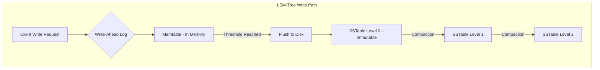
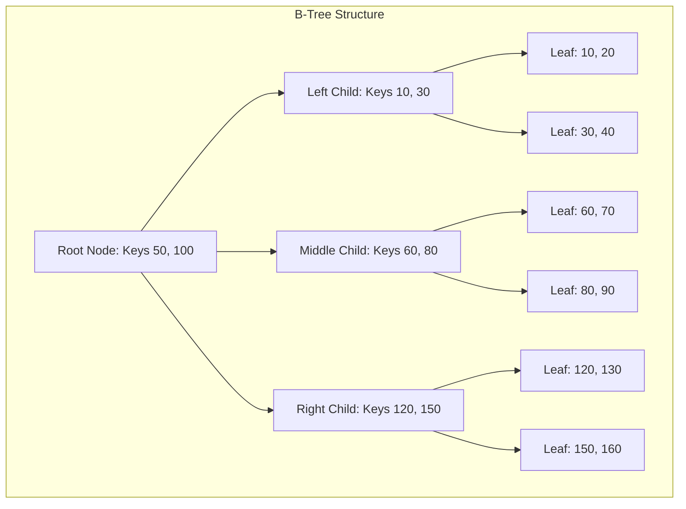
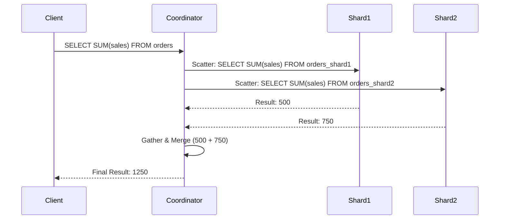
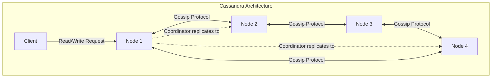
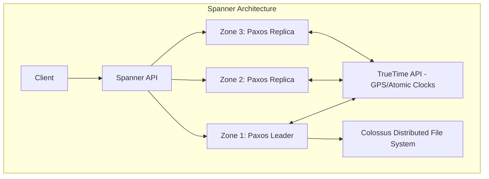

# Chapter 11: Distributed Databases

## 1. Why This Matters

In the era of modern internet-scale applications, data generation has outpaced Moore's Law. A single machine, no matter how vertically scaled (adding more RAM, CPU, and high-end NVMe SSDs), eventually hits a hard physical ceiling. When a database must handle petabytes of data or millions of read/write operations per second, a single-node architecture becomes a massive bottleneck and a single point of failure (SPOF).

Distributed databases matter because they solve three fundamental problems:
1. **Scalability:** They allow systems to handle arbitrarily large datasets and traffic spikes by adding more commodity machines horizontally.
2. **High Availability:** By replicating data across multiple nodes, availability zones, or even continents, distributed databases ensure that the system remains online even if several machines catch fire or a data center loses power.
3. **Latency Reduction (Geo-distribution):** Users expect instantaneous responses. By distributing data closer to the user geographically (e.g., placing European users' data in a Frankfurt data center and Asian users' data in Tokyo), we drastically reduce the speed-of-light tax on network requests.

Understanding distributed databases is the cornerstone of modern system design. Whether you are building the next global ride-sharing app, a high-frequency trading platform, or a massive social network, your data layer's architecture will dictate the ceiling of your system's capabilities.

## 2. Beginner Intuition

Imagine you are the chief librarian of the world's most popular library. Initially, you have one gigantic notebook (a single database) where you write down every book checked out. For a small town, this works perfectly. 

But soon, your library serves millions of people. A line forms out the door. People are screaming. Your hand cramps from writing so fast. What do you do?

You hire more librarians (nodes). But how do you divide the work?
- You could tell Librarian A to handle all patrons whose last names start with A-M, and Librarian B to handle N-Z. This is **Sharding (Partitioning)**. It splits the load.
- But what if Librarian A gets sick? The A-M patrons are stuck. To fix this, you assign an assistant librarian who explicitly copies everything Librarian A writes down. If A gets sick, the assistant steps in. This is **Replication**.
- What if someone moves from A-M to N-Z? You need a protocol to safely transfer their records without losing them. This is **Data Migration and Distributed Transactions**.
- What if someone wants to know the total number of books checked out across the whole library? You must ask both A and B and sum their answers. This is **Distributed Query Processing**.

A distributed database is simply this massive library system, automated through software, dealing constantly with librarians calling in sick (crashes), losing their notebooks (disk failures), or the intercom system breaking down (network partitions).

## 3. Core Theory

To deeply understand distributed databases, one must grasp several theoretical pillars.

### 3.1 CAP Theorem
Formulated by Eric Brewer, it states that a distributed data store can simultaneously provide at most two out of the following three guarantees:
- **Consistency (C):** Every read receives the most recent write or an error.
- **Availability (A):** Every request receives a (non-error) response, without the guarantee that it contains the most recent write.
- **Partition Tolerance (P):** The system continues to operate despite an arbitrary number of messages being dropped or delayed by the network between nodes.

In reality, network partitions (P) are unavoidable in distributed systems. Therefore, the choice is always between Consistency and Availability (CP vs. AP) during a partition. 

### 3.2 PACELC Theorem
An extension of CAP by Daniel Abadi. It states:
- If there is a Partition (P), how does the system trade off Availability and Consistency (A and C)?
- Else (E), when the system is running normally, how does it trade off Latency (L) and Consistency (C)?
For example, DynamoDB is typically PA/EL (trades C for A during partition, trades C for L normally).

### 3.3 Relational vs. Non-Relational (SQL vs NoSQL)
**SQL (Relational):**
- Strict schema, ACID guarantees.
- Normalized data models to reduce redundancy.
- Historically difficult to distribute because JOINs across network boundaries are incredibly slow, and enforcing strict ACID across nodes requires expensive coordination (like Two-Phase Commit).

**NoSQL (Non-Relational):**
- Flexible schema, BASE semantics (Basically Available, Soft state, Eventual consistency).
- Denormalized data models designed for specific query patterns.
- Designed from the ground up to distribute easily by sacrificing complex operations (like multi-shard JOINs) and strict consistency.

### 3.4 Sharding (Partitioning) Strategies
- **Hash-based:** Hash the partition key to determine the node. Distributes write load evenly but makes range queries impossible (since contiguous keys are hashed to random nodes).
- **Range-based:** Keys are assigned to nodes based on ranges (e.g., A-C, D-F). Excellent for range queries, but highly susceptible to "hot spots" (e.g., if everyone is querying data starting with 'A', one node gets all the traffic).

## 4. Architecture Deep Dive

### 4.1 Distributed SQL Databases (NewSQL)
The dream: The scalability of NoSQL with the ACID guarantees and SQL interface of traditional RDBMS.
Systems like **Google Spanner, CockroachDB, YugabyteDB, TiDB, and Vitess** achieve this.
- **Spanner:** Uses TrueTime (atomic clocks and GPS receivers) to assign globally meaningful timestamps to transactions, avoiding lock contention and achieving External Consistency.
- **CockroachDB / YugabyteDB:** Build on top of an LSM-tree based KV store (RocksDB/Pebble). They use Raft consensus for replication and two-phase commit (2PC) for cross-shard transactions, utilizing Hybrid Logical Clocks (HLC) for ordering.
- **Vitess:** Middleware that sits on top of MySQL, abstracting away the sharding logic so the application thinks it's talking to a monolithic MySQL database.

### 4.2 NoSQL Categories
1. **Key-Value Stores (Redis, DynamoDB):** 
   - Operations: `get(key)`, `put(key, value)`. 
   - Fastest, simplest. Used for caching, session management, shopping carts.
2. **Document Stores (MongoDB, CouchDB):** 
   - Store JSON/BSON documents. 
   - Values are inspectable. Good for CMS, user profiles, rapidly changing schemas.
3. **Column-Family Stores (Cassandra, HBase, Bigtable):** 
   - Data stored in sparse, multi-dimensional maps. 
   - Optimized for heavy write throughput and sequential reads. Used for time-series data, IoT, metrics.
4. **Graph Databases (Neo4j, Amazon Neptune):** 
   - Nodes and edges. 
   - Optimized for deeply traversing relationships (e.g., "Find friends of friends who bought product X").

### 4.3 Storage Engines
At the lowest level, how does a database write bytes to disk?

**B-Tree (Balance Tree):**
- Used in traditional DBs (PostgreSQL, MySQL/InnoDB).
- The tree structure keeps data sorted. Pages (typically 4KB or 8KB) are updated in-place.
- **Page Splits:** When a page is full, it splits into two. This causes cascading writes up the tree.
- **Write Amplification:** Changing 1 byte requires rewriting an entire 8KB page. Not ideal for extremely high write throughput.

**LSM-Tree (Log-Structured Merge Tree):**
- Used in Cassandra, RocksDB, LevelDB, HBase.
- Writes go into an append-only log (Write-Ahead Log) for durability, then into an in-memory tree called a **Memtable** (often a Skip List or Red-Black Tree).
- When the Memtable fills up, it is flushed to disk as an immutable **SSTable (Sorted String Table)**.
- Reads check the Memtable, then search SSTables from newest to oldest.
- **Compaction:** Background threads merge SSTables to remove deleted/overwritten data and reduce read latency.
  - *Size-tiered:* Merges SSTables of similar sizes. Great for writes, but read latency can spike.
  - *Leveled:* Maintains overlapping-free SSTables per level. Better read performance, higher write amplification during compaction.

### 4.4 Distributed Query Processing
When you run `SELECT * FROM users WHERE age > 30`, what happens?
1. **Parsing & Planning:** The Coordinator node parses the SQL and generates a logical plan.
2. **Distribution Planning:** The Coordinator consults the metadata service to locate which shards hold `users` data.
3. **Scatter:** The Coordinator rewrites the query for each specific shard and pushes it down to the data nodes.
4. **Gather & Merge:** Data nodes execute the query locally and stream results back. The Coordinator merges, sorts, and limits the final result set before returning it to the client.

## 5. Visual Diagrams











## 6. Real Production Examples

### Google Spanner
Google needed a globally distributed, synchronously replicated database to support AdWords. Sharding MySQL manually became a nightmare. Spanner provides External Consistency (linearizability) using **TrueTime**. By guaranteeing that clock skew between any two servers is bounded (e.g., max 7ms), Spanner can assign commit timestamps that reflect true global causality. If transaction T1 commits before T2 starts, T1's timestamp is strictly less than T2's. Spanner waits out the uncertainty window (7ms) during writes to ensure no other node can read stale data.

### Amazon DynamoDB
DynamoDB powers Amazon's shopping cart. It is a fully managed proprietary KV/Document store.
- **Data Modeling:** Requires defining a Partition Key (hash key) and an optional Sort Key. 
- **LSI & GSI:** To query by fields other than the primary key, developers create Local Secondary Indexes (LSI - same partition key, different sort key) or Global Secondary Indexes (GSI - entirely different partition key, asynchronously replicated).
- It heavily favors fast, predictable single-digit millisecond latency at any scale.

### Apache Cassandra
Created at Facebook, heavily inspired by Amazon Dynamo (architecture) and Google Bigtable (LSM-tree storage).
- Masterless architecture. Every node is a peer.
- Uses **Gossip Protocol** for node discovery and failure detection.
- Uses **Consistent Hashing** to distribute data across the ring.
- Highly tunable consistency (e.g., `QUORUM` reads and writes).

### MongoDB
The quintessential Document Store.
- **Replica Sets:** Usually deployed as a primary with multiple secondaries. Writes go to primary; reads can go to secondaries (resulting in eventual consistency).
- **Sharding:** Requires a shard key. The query router (`mongos`) routes queries to the appropriate shard. If a query lacks the shard key, it results in a "scatter-gather" query across all shards, which is incredibly inefficient.

## 7. Java Implementations

Let's look at the core of these distributed databases through clean, production-grade Java code.

### 7.1 LSM-Tree Implementation (Memtable + SSTable concept)

```java
import java.io.*;
import java.util.Map;
import java.util.concurrent.ConcurrentSkipListMap;
import java.util.concurrent.atomic.AtomicInteger;

/**
 * A simplified LSM-Tree engine demonstrating Memtable to SSTable flush.
 * In a real system (like RocksDB), this involves bloom filters, sparse indexes, and background compaction.
 */
public class LSMEngine {
    // Memtable using ConcurrentSkipListMap to maintain sorted order efficiently
    private ConcurrentSkipListMap<String, String> memtable;
    private final int memtableSizeLimit;
    private AtomicInteger currentSize;
    private final String dataDir;

    public LSMEngine(int memtableSizeLimit, String dataDir) {
        this.memtable = new ConcurrentSkipListMap<>();
        this.memtableSizeLimit = memtableSizeLimit;
        this.currentSize = new AtomicInteger(0);
        this.dataDir = dataDir;
        new File(dataDir).mkdirs();
    }

    /**
     * Writes are incredibly fast. Just append to a memory structure.
     * (Note: Real systems write to a WAL - Write Ahead Log first for durability).
     */
    public void put(String key, String value) {
        int entrySize = key.getBytes().length + value.getBytes().length;
        memtable.put(key, value);
        
        if (currentSize.addAndGet(entrySize) >= memtableSizeLimit) {
            flushToDisk();
        }
    }

    /**
     * Reads check the memtable first. If not found, they should check SSTables.
     */
    public String get(String key) {
        // 1. Check Memtable
        String val = memtable.get(key);
        if (val != null) {
            return val;
        }
        // 2. Check SSTables on disk (simplified: reverse order iteration)
        return searchSSTables(key);
    }

    private synchronized void flushToDisk() {
        if (memtable.isEmpty()) return;
        
        String sstableName = dataDir + "/sstable_" + System.currentTimeMillis() + ".dat";
        try (BufferedWriter writer = new BufferedWriter(new FileWriter(sstableName))) {
            // Because memtable is a SkipList, data is already sorted by key!
            for (Map.Entry<String, String> entry : memtable.entrySet()) {
                writer.write(entry.getKey() + "," + entry.getValue());
                writer.newLine();
            }
            System.out.println("Flushed Memtable to SSTable: " + sstableName);
        } catch (IOException e) {
            throw new RuntimeException("Failed to flush Memtable", e);
        }
        
        // Reset Memtable
        memtable = new ConcurrentSkipListMap<>();
        currentSize.set(0);
    }

    private String searchSSTables(String key) {
        // In reality, we use Bloom Filters and sparse indexes to avoid scanning disk!
        // This is a naive implementation for conceptual demonstration.
        File dir = new File(dataDir);
        File[] files = dir.listFiles((d, name) -> name.startsWith("sstable_"));
        if (files == null) return null;

        // Sort descending to read newest SSTables first
        java.util.Arrays.sort(files, (f1, f2) -> f2.getName().compareTo(f1.getName()));

        for (File f : files) {
            try (BufferedReader reader = new BufferedReader(new FileReader(f))) {
                String line;
                while ((line = reader.readLine()) != null) {
                    String[] parts = line.split(",", 2);
                    if (parts[0].equals(key)) {
                        return parts[1];
                    }
                }
            } catch (IOException e) {
                e.printStackTrace();
            }
        }
        return null;
    }
}
```

### 7.2 Distributed Query Router (Scatter-Gather)

```java
import java.util.List;
import java.util.ArrayList;
import java.util.concurrent.*;

/**
 * Demonstrates a scatter-gather distributed query processor.
 */
public class DistributedQueryRouter {
    private final ExecutorService executor = Executors.newFixedThreadPool(10);
    private final List<DataNode> shards;

    public DistributedQueryRouter(List<DataNode> shards) {
        this.shards = shards;
    }

    /**
     * Executes a count query across all shards in parallel and aggregates the result.
     */
    public long executeGlobalCount(String table) throws InterruptedException, ExecutionException {
        List<Future<Long>> futures = new ArrayList<>();

        // Scatter Phase
        for (DataNode shard : shards) {
            futures.add(executor.submit(() -> shard.localCount(table)));
        }

        // Gather & Merge Phase
        long totalCount = 0;
        for (Future<Long> future : futures) {
            totalCount += future.get(); // Blocks until shard completes
        }

        return totalCount;
    }

    public void shutdown() {
        executor.shutdown();
    }
}

class DataNode {
    private final String nodeId;
    
    public DataNode(String id) { this.nodeId = id; }

    public long localCount(String table) {
        // Simulate disk IO and local query processing
        try { Thread.sleep((long)(Math.random() * 100)); } catch (InterruptedException e) {}
        System.out.println("Node " + nodeId + " executing local count for " + table);
        return (long) (Math.random() * 1000); // return dummy count
    }
}
```

## 8. Performance Analysis

### Latency vs Throughput
- **LSM-Trees** are optimized for write throughput. Because writes are sequential append-only operations (WAL + Memtable), there is no random I/O during the write path. This allows Cassandra to ingest millions of metrics per second.
- **B-Trees** are optimized for read latency. You traverse the tree and typically find the data within 3-4 disk seeks (for massive datasets). 

### Amplification Metrics
- **Write Amplification (WA):** How many bytes are physically written to disk for every byte written by the app.
  - *B-Trees:* High WA. Modifying a 10-byte row requires writing an entire 8KB page.
  - *LSM-Trees:* Moderate WA. Compaction constantly rewrites data to merge SSTables.
- **Read Amplification (RA):** How many blocks are read from disk to satisfy a logical read.
  - *B-Trees:* Low RA. Usually exactly the blocks needed.
  - *LSM-Trees:* High RA. Might need to check multiple SSTables (across different levels) to find a key.
- **Space Amplification (SA):** Extra disk space used. LSM-trees temporarily require high SA during compaction.

## 9. Tradeoffs

| Feature | Distributed SQL (Spanner/Cockroach) | NoSQL (Cassandra/Dynamo) |
|---------|-------------------------------------|--------------------------|
| **Schema** | Strict, relational | Flexible, denormalized |
| **Consistency** | Strict (Linearizable/Serializable) | Tunable / Eventual |
| **Joins** | Supported (though cross-shard is slow)| Not supported (denormalize data) |
| **Write Speed** | Slower (requires consensus, locks) | Extremely Fast (leaderless, append) |
| **Use Case** | Financial ledgers, Billing systems | IoT telemetry, user sessions, chat logs |

**B-Tree vs LSM-Tree:**
Choose B-Tree if your workload is read-heavy or requires frequent in-place updates. Choose LSM-Tree if your workload is write-heavy (e.g., time-series).

## 10. Failure Scenarios

1. **The Network Partition:** Fiber-optic cables get cut. If Datacenter A cannot talk to Datacenter B, CP systems (CockroachDB) will reject writes if they can't achieve a quorum. AP systems (Cassandra) will accept writes, resolving conflicts later using Last-Write-Wins (LWW) or Vector Clocks.
2. **Hot Partitions:** If you shard by `company_id`, and Apple signs up for your service, the node holding Apple's data will melt from traffic while other nodes sit idle. **Fix:** Salt the partition key (e.g., `company_id + random(1..10)`) or use a better hash key.
3. **Zombie Nodes & Split Brain:** A node's garbage collector pauses for 30 seconds. The cluster thinks it's dead and elects a new leader. The GC finishes, the old node wakes up thinking it's still leader, and accepts writes. **Fix:** Fencing tokens, Lease timeouts.
4. **Retry Storms:** A node slows down. Clients time out and retry. The node is overwhelmed and dies. **Fix:** Exponential backoff, jitter, circuit breakers.

## 11. Debugging & Observability

Operating a distributed database is like flying a commercial jet. You cannot fly blind.
- **Compaction Queue Depth:** In Cassandra/RocksDB, if compaction falls behind, reads will become extremely slow because queries have to scan dozens of SSTables.
- **Cache Hit Rates:** Monitor row cache and block cache. A sudden drop means your working set has exceeded memory, causing disk thrashing.
- **Replication Lag:** The time difference between data written to the primary and applied at the replica. If this spikes, read-heavy workloads relying on replicas will see stale data.
- **Distributed Tracing:** Ensure queries are tagged with correlation IDs so you can trace a slow query as it fans out across 50 shards.

## 12. Interview Questions

1. **Beginner:** What is the CAP theorem, and why can't we have all three?
   *Answer:* You cannot avoid network partitions in distributed systems. When one occurs, you must choose to either halt writes (favor Consistency) or accept them and risk divergent data (favor Availability).
2. **Intermediate:** Explain how an LSM-Tree works and why it offers superior write performance compared to a B-Tree.
   *Answer:* LSM-Trees avoid random disk I/O. Writes are buffered in memory (Memtable) and flushed as sequential blocks (SSTables). Disk sequential writes are orders of magnitude faster than random seeks.
3. **Advanced:** In a distributed SQL database, how do you perform a cross-shard JOIN efficiently?
   *Answer:* By co-locating data (interleaving tables). If order lines are stored on the same physical shard as the order header, the JOIN is local. Otherwise, you must use scatter-gather, bloom filters to reduce data transfer, and hash-joins in the coordinator layer.
4. **Advanced:** How does Google Spanner avoid read locks for read-only transactions while maintaining external consistency?
   *Answer:* Spanner uses TrueTime. Every transaction commits with a precise timestamp. A read-only transaction picks a timestamp `t` and reads from a snapshot of the database at time `t`. Because TrueTime guarantees causality, no locks are needed.
5. **FAANG-level:** Design a distributed rate limiter for an API platform hitting 10 million requests per second. Which database would you use and why?
   *Answer:* A typical RDBMS would melt. I'd use Redis Cluster (KV store) for its in-memory speed. I'd use the Token Bucket algorithm via Lua scripts to ensure atomicity. To handle scale, I'd hash the `user_id` to distribute load. If strict accuracy isn't required across regions, I'd use local Redis nodes and eventually sync them to reduce cross-region latency.

## 13. Exercises

1. **System Design:** Design the data model for Twitter using Cassandra. How do you model the timeline so reads are fast? (Hint: Fan-out on write vs fan-out on read).
2. **Coding:** Extend the Java LSM-Tree implementation above. Add a `delete` method. (Hint: In LSM-Trees, you don't delete immediately. You insert a "Tombstone" marker).
3. **Conceptual:** Review your company's primary database schema. Identify 3 tables that would be extremely difficult to horizontally shard and explain why.

## 14. Expert Insights

- **The Leaky Abstraction of NoSQL:** Developers initially loved NoSQL because "you don't need schemas." In reality, NoSQL requires *stricter* upfront data modeling than SQL. In SQL, you model your data based on entities. In NoSQL (like DynamoDB), you must model your data based purely on your *Access Patterns*. If your access patterns change a year later, migrating a DynamoDB table is notoriously painful.
- **Pagination Pain:** `OFFSET` and `LIMIT` queries in distributed databases are deadly. `LIMIT 10 OFFSET 100000` means every shard must generate 100,010 records, send them to the coordinator, which sorts them and drops 100,000. Use cursor-based pagination instead.
- **Clock Sync:** Never trust server clocks in distributed systems. NTP drift can cause silent data corruption in Last-Write-Wins conflict resolution. Prefer logical clocks (Vector Clocks, Lamport timestamps).

## 15. Chapter Summary

- **Single nodes fail:** Distributed databases provide horizontal scalability, high availability, and geographic data distribution.
- **CAP Theorem dictates tradeoffs:** You must choose between Consistency and Availability during network Partitions.
- **Storage Engines:** B-Trees (in-place updates, fast reads, slow writes) vs. LSM-Trees (append-only, fast writes, require compaction).
- **Relational vs. NoSQL:** SQL provides ACID and flexibility via JOINs at the cost of hard sharding. NoSQL scales easily by sacrificing JOINs and enforcing strict access-pattern-based modeling.
- **NewSQL:** Systems like Spanner and CockroachDB bring SQL and ACID to distributed architecture using advanced consensus and time-keeping mechanisms.
- **Distribution mechanics:** Master-slave, Multi-master, and Leaderless architectures define how data flows and how failures are mitigated.
