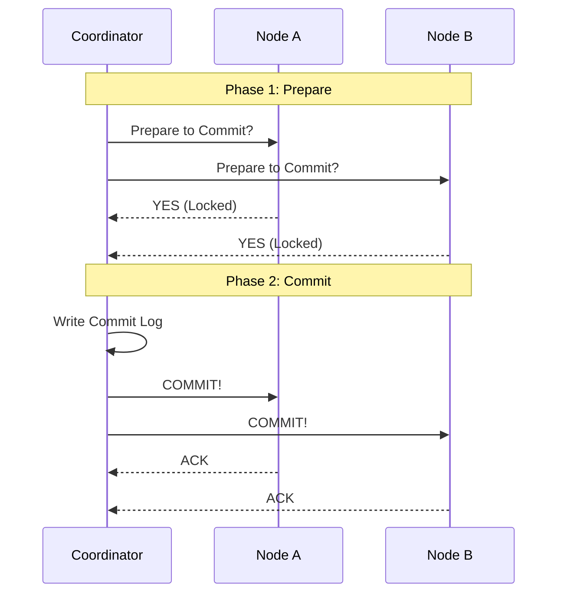
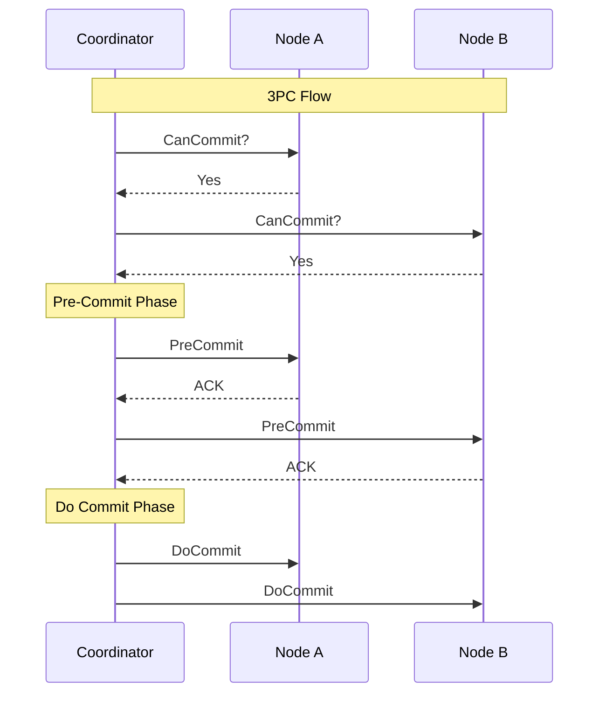
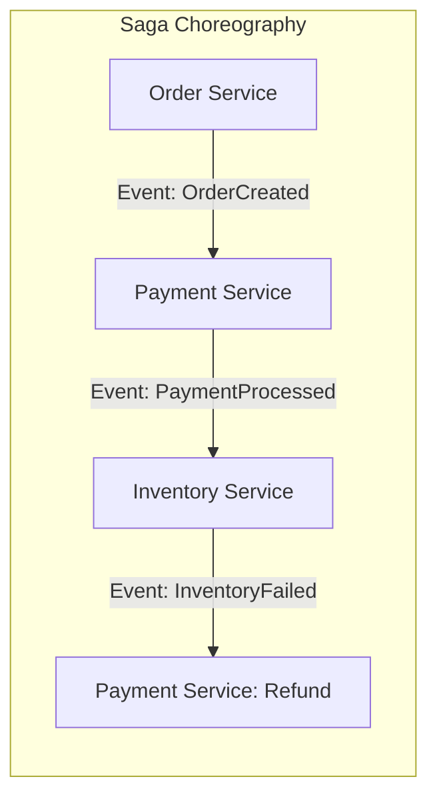
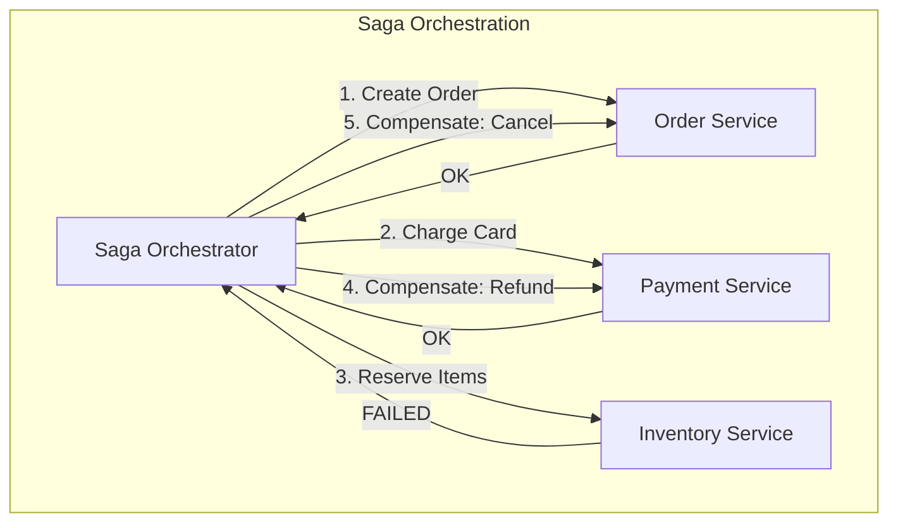
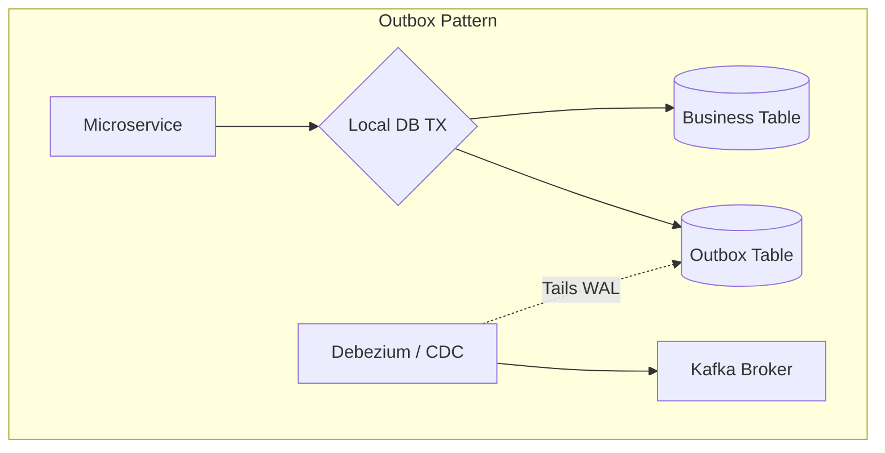

# Chapter 12: Distributed Transactions

## 1. Why This Matters

A transaction is a mechanism that groups multiple operations into a single logical unit of work. In a monolithic application with a single relational database, transactions are straightforward: you lock the rows, make changes, and either `COMMIT` or `ROLLBACK`. 

But modern systems are rarely monoliths. When you book an Uber, the system must charge your credit card (Billing Microservice), assign a driver (Routing Microservice), and send a notification (Notification Service). If the driver cancels at the last millisecond, your credit card charge must be reversed. 

If this fails—if the system charges your card but doesn't assign a driver—you have a furious customer. **Money is involved. Data integrity is involved. User trust is involved.** 

Distributed transactions matter because in a microservices architecture, operations span across multiple independent databases, APIs, and networks. Guaranteeing that *all* operations succeed or *none* of them do, despite network failures, server crashes, and concurrent modifications, is one of the most notoriously difficult problems in computer science.

## 2. Beginner Intuition

Imagine you are planning a group vacation with three friends: Alice (who books the flights), Bob (who books the hotel), and Charlie (who books the rental car). 

You all agree: **Either we all go, or nobody goes.**

- **The Monolith Approach:** You all sit in the same room. You count down "3, 2, 1, click!" and buy everything exactly at the same time. Easy.
- **The Distributed Approach:** You are all in different countries communicating via unreliable carrier pigeons.
  - You send a pigeon to Alice, Bob, and Charlie: "Are you ready to book?"
  - Alice replies: "Yes." Bob replies: "Yes." Charlie's pigeon gets eaten by a hawk.
  - What do you do? Do you tell Alice and Bob to cancel? What if Charlie actually booked the car, but only the return pigeon died?

This is the essence of a distributed transaction. You need a protocol to ensure that even if the network fails or someone crashes mid-action, the final state is consistent (everyone booked, or everyone canceled).

## 3. Core Theory

### ACID Properties in a Distributed Context
- **Atomicity:** All parts of the distributed transaction succeed, or all fail. There is no partial state.
- **Consistency:** The transaction takes all databases from one valid state to another valid state, honoring all invariants.
- **Isolation:** Concurrent distributed transactions do not interfere with each other. (Extremely hard to enforce without locking the entire system).
- **Durability:** Once committed, the changes are permanent across all participating nodes.

### The FLP Impossibility
Fischer, Lynch, and Paterson proved that in an asynchronous network where messages can be delayed and nodes can fail, **no consensus protocol can guarantee both safety and liveness**. You will always have edge cases where the system must block indefinitely (wait) to ensure data isn't corrupted. This theoretical limit underpins why 2PC blocks.

## 4. Architecture Deep Dive

### 4.1 Two-Phase Commit (2PC)
The classic algorithm for distributed atomicity. It uses a central **Coordinator** and multiple **Participants**.
- **Phase 1: Prepare (Voting)** 
  The coordinator asks all participants: "Can you commit this?" Participants lock necessary resources, write to their local Write-Ahead Logs, and reply "YES" or "NO".
- **Phase 2: Commit/Abort (Resolution)**
  If *all* participants say YES, the coordinator writes a commit record to its log and tells everyone to `COMMIT`. If *any* say NO, or timeout, the coordinator tells everyone to `ROLLBACK`.

**Failures & Blocking:**
- *Participant Fails:* The coordinator rolls back.
- *Coordinator Fails:* If the coordinator dies after Phase 1, participants that voted YES are **blocked**. They cannot release their database locks because they don't know the final outcome. This destroys performance.

### 4.2 Three-Phase Commit (3PC)
Attempts to solve the blocking problem of 2PC by adding a timeout mechanism and a **Pre-Commit** phase.
1. CanCommit
2. PreCommit (If everyone said yes, coordinator sends this. Participants know consensus was reached but don't commit yet).
3. DoCommit
*Why it's rarely used:* It assumes a synchronous network with bounded delays. In the real world (the internet), unbounded network delays make 3PC susceptible to network partitions, causing worse issues (split-brain) than 2PC. Thus, industry generally avoids 3PC.

### 4.3 Sagas Pattern
In microservices, locking databases across network calls (2PC) is an anti-pattern. Instead, we use **Sagas**. A Saga is a sequence of local transactions. Each service commits its local transaction and publishes an event to trigger the next step.
If a step fails, the Saga executes **Compensating Transactions** backward to undo the previous steps.

- **Choreography:** Decentralized. Service A finishes and publishes an event. Service B listens and reacts. Great for simple flows, but logic gets tangled ("event spaghetti") as flows grow.
- **Orchestration:** Centralized. A central **Saga Execution Coordinator (SEC)** explicitly tells Service A to do X, then tells Service B to do Y. Much easier to monitor and debug.

### 4.4 TCC (Try-Confirm-Cancel)
A variation of Sagas often used in financial systems. 
- **Try:** Reserves resources (e.g., freezes $50 in account).
- **Confirm:** Executes the action (deducts the frozen $50).
- **Cancel:** Unfreezes the funds.
It requires APIs to be designed explicitly with these three endpoints.

### 4.5 The Outbox Pattern & CDC
When you update your local database and publish a message to Kafka, what if the DB commits but Kafka is down? You lose the event.
**Transactional Outbox:** You save the business entity AND an "event payload" to an `Outbox` table in the *same* local database transaction. 
**Change Data Capture (CDC):** A tool like Debezium tails the database log (e.g., Postgres WAL), sees the outbox entry, and pushes it to Kafka. This guarantees reliable event delivery.

### 4.6 Exactly-Once Semantics & Idempotency
Because networks drop packets, distributed systems must retry. Retries mean an action might happen twice.
**Idempotency** ensures that `f(f(x)) = f(x)`. If the payment service receives "Charge $50 for Order #123" twice, it must only charge once. This is achieved using **Idempotency Keys** and deduplication tables.

### 4.7 Distributed Locks
Sometimes you just need mutually exclusive access to a resource across a cluster.
- **ZooKeeper:** Uses ephemeral nodes for robust locking.
- **Redis Redlock:** A time-based algorithm to acquire locks across a quorum of Redis nodes.
- **The Fencing Token Problem:** If a client acquires a lock, experiences a GC pause, loses the lock, and wakes up, it might corrupt data. Martin Kleppmann proved that distributed locks require a monotonically increasing **Fencing Token**. The storage layer must reject writes with older tokens.

## 5. Visual Diagrams











```mermaid
graph TD
    subgraph Distributed Lock with Fencing
        C1[Client 1] -->|1. Acquire Lock| L[Lock Service]
        L -->|2. OK, Token=33| C1
        C1 -.->|3. GC PAUSE (Sleeps)| C1
        C2[Client 2] -->|4. Acquire Lock (C1 Timeout)| L
        L -->|5. OK, Token=34| C2
        C2 -->|6. Write (Token=34)| DB[(Database)]
        DB -->|Accepted| C2
        C1 -.->|7. Wakes Up| C1
        C1 -->|8. Write (Token=33)| DB
        DB -->|REJECTED! Stale Token| C1
    end
```

## 6. Real Production Examples

### Google Spanner
Spanner supports massively distributed 2PC. It minimizes the performance penalty of 2PC by using Paxos groups for high availability of the coordinator and participants, and **TrueTime** to provide strict serializability without locking reads.

### Uber Cadence / Temporal
Uber open-sourced Cadence (later forked by its creators as Temporal). It is a highly scalable Saga Orchestrator. You write workflows in standard Java/Go code, and Temporal durably persists the execution state. If a server dies halfway through a 10-step distributed transaction, Temporal resumes the exact line of code on a new machine.

### AWS Step Functions
Amazon's serverless orchestration service. You define state machines (Sagas) in JSON. It handles timeouts, retries, and catching errors to trigger Lambda functions that act as compensating transactions.

## 7. Java Implementations

### 7.1 Simple 2PC Coordinator

```java
import java.util.List;

/**
 * A conceptual 2PC Coordinator demonstrating the blocking vulnerability.
 */
public class TwoPhaseCommitCoordinator {
    private List<Participant> participants;

    public TwoPhaseCommitCoordinator(List<Participant> participants) {
        this.participants = participants;
    }

    public boolean executeTransaction() {
        // Phase 1: Prepare
        for (Participant p : participants) {
            boolean vote = p.prepare();
            if (!vote) {
                // If any vote NO, abort all.
                abortAll();
                return false;
            }
        }

        // --- DANGER ZONE ---
        // If the coordinator crashes right here, participants are holding database locks forever!

        // Phase 2: Commit
        for (Participant p : participants) {
            p.commit();
        }
        return true;
    }

    private void abortAll() {
        for (Participant p : participants) {
            p.abort();
        }
    }
}

interface Participant {
    boolean prepare(); // Locks rows, writes to WAL
    void commit();     // Commits TX, releases locks
    void abort();      // Rollbacks TX, releases locks
}
```

### 7.2 Saga Orchestrator

```java
import java.util.Stack;

/**
 * A synchronous Saga Orchestrator implementing the compensation pattern.
 */
public class SagaOrchestrator {

    public void createOrderSaga(OrderRequest request) {
        Stack<Runnable> compensationStack = new Stack<>();

        try {
            // Step 1: Create Order
            OrderService.create(request);
            compensationStack.push(() -> OrderService.cancel(request)); // Register compensation

            // Step 2: Process Payment
            PaymentService.charge(request.getUserId(), request.getAmount());
            compensationStack.push(() -> PaymentService.refund(request.getUserId(), request.getAmount()));

            // Step 3: Reserve Inventory
            // If this throws an Exception, the catch block will trigger compensations
            InventoryService.reserve(request.getItemId());
            
            System.out.println("Saga Completed Successfully!");

        } catch (Exception e) {
            System.err.println("Saga failed at a step. Initiating Compensations...");
            while (!compensationStack.isEmpty()) {
                try {
                    Runnable compensation = compensationStack.pop();
                    compensation.run();
                } catch (Exception compEx) {
                    // CRITICAL: Compensations must ideally never fail (should be retried infinitely).
                    // If they fail, human intervention or a dead-letter queue is required.
                    System.err.println("FATAL: Compensation failed! " + compEx.getMessage());
                }
            }
            throw new RuntimeException("Transaction aborted and rolled back.");
        }
    }
}
```

### 7.3 Idempotent Operation Handler

```java
import java.util.Map;
import java.util.concurrent.ConcurrentHashMap;

/**
 * Ensuring Exactly-Once processing using Idempotency Keys.
 */
public class PaymentGateway {
    // In production, this would be a Redis cluster or a persistent DB table
    private Map<String, PaymentResponse> idempotencyStore = new ConcurrentHashMap<>();

    public PaymentResponse charge(String idempotencyKey, double amount) {
        // 1. Check if we already processed this request
        if (idempotencyStore.containsKey(idempotencyKey)) {
            System.out.println("Duplicate request detected. Returning cached response.");
            return idempotencyStore.get(idempotencyKey);
        }

        // 2. Perform actual business logic (e.g., call Stripe)
        PaymentResponse response = invokeExternalPaymentAPI(amount);

        // 3. Store result to prevent duplicate processing
        idempotencyStore.put(idempotencyKey, response);

        return response;
    }

    private PaymentResponse invokeExternalPaymentAPI(double amount) {
        // Mock external API call
        return new PaymentResponse("SUCCESS", "TXN_" + System.currentTimeMillis());
    }
}
```

### 7.4 Distributed Lock with Fencing Token

```java
/**
 * Demonstrates why a standard lock is unsafe and requires a Fencing Token.
 */
public class LockService {
    private long currentToken = 0;
    private String lockOwner = null;

    public synchronized LockAcquisition acquireLock(String clientId) {
        if (lockOwner == null) {
            lockOwner = clientId;
            currentToken++;
            return new LockAcquisition(true, currentToken);
        }
        return new LockAcquisition(false, -1);
    }
    
    public synchronized void releaseLock(String clientId) {
        if (clientId.equals(lockOwner)) {
            lockOwner = null;
        }
    }
}

class StorageEngine {
    private long lastSeenToken = -1;

    // The database itself MUST validate the token
    public synchronized boolean writeData(String data, long fencingToken) {
        if (fencingToken < lastSeenToken) {
            throw new RuntimeException("Stale Token Detected! Write Rejected to prevent corruption.");
        }
        this.lastSeenToken = fencingToken;
        System.out.println("Data written safely: " + data);
        return true;
    }
}

class LockAcquisition {
    boolean success;
    long token;
    public LockAcquisition(boolean s, long t) { success = s; token = t; }
}
```

## 8. Performance Analysis

- **2PC Latency:** High. To commit, the coordinator requires multiple network round trips and multiple forced disk `fsync()` calls (writing to WALs) across all participants sequentially. It scales terribly as participants increase.
- **Sagas Throughput:** Very High. Because local transactions commit immediately and release DB locks, throughput is bounded only by the underlying databases and message queues. However, overall end-to-end latency of a Saga might be longer due to asynchronous queuing.
- **Lock Contention:** Distributed locking slows down parallel processing. Instead of locking, try to partition data such that only one thread ever needs to write to a specific entity (Single Writer Principle).

## 9. Tradeoffs

| Mechanism | Pros | Cons |
|-----------|------|------|
| **2PC** | Strict ACID. Developers don't handle rollback logic. | Blocking, low throughput, SPOF on coordinator. |
| **Sagas** | High throughput, highly available, no global DB locks. | Eventual consistency, complex compensation logic, dirty reads possible. |
| **TCC** | Stronger business isolation than Sagas. | Requires API changes to support Try/Confirm/Cancel. |

**The Dirty Read Problem in Sagas:**
If a Saga commits Step 1, the data is visible to other queries immediately. If the Saga later fails and compensates Step 1, any system that read the intermediate state read "dirty" data. You must design business logic to tolerate this (e.g., showing an order status as "Pending Payment").

## 10. Failure Scenarios

1. **Coordinator Crash in 2PC:** Leaves participants holding database row locks indefinitely. Requires a robust recovery mechanism (another coordinator taking over, reading the transaction log).
2. **Compensation Failure in Sagas:** If the "Refund Payment" step fails, retries are the only option. If it fails infinitely, the system is left in an inconsistent state. This requires automated alerting and manual operational intervention (Dead Letter Queues).
3. **Dual Writes:** Updating a database and firing an API call. If the API call times out, did it succeed? You don't know. Always use the Outbox pattern.

## 11. Debugging & Observability

- **Distributed Tracing (OpenTelemetry/Jaeger):** You absolutely must inject a `trace_id` at the entry point of your system and propagate it through HTTP headers and Kafka message headers. This is the only way to reconstruct a distributed transaction visually.
- **Dead Letter Queues (DLQ):** When an async saga step fails 5 times, it gets routed to a DLQ. Engineers monitor the DLQ, fix the bug, and replay the messages.
- **State Machine Auditing:** With tools like Temporal, you get an out-of-the-box UI showing exactly which step a Saga is currently stuck on, with complete local variable inspection.

## 12. Interview Questions

1. **Beginner:** What is a distributed transaction and why not just use standard database transactions?
   *Answer:* Standard transactions apply to a single database. Distributed transactions span multiple services or databases. You cannot use standard locking across network boundaries reliably.
2. **Intermediate:** Explain the Outbox Pattern. Why is it necessary?
   *Answer:* It solves the "Dual Write" problem. You cannot atomically write to a database and publish to Kafka. The Outbox pattern writes the event into the database in the same ACID transaction as the business data update. A CDC process then reliably reads that table and pushes to Kafka.
3. **Advanced:** In a Saga, how do you handle a scenario where a compensating transaction permanently fails?
   *Answer:* Compensating transactions must be idempotent and retried exponentially. If they fail permanently (e.g., bug in code, permanent API block), the event must be moved to a Dead Letter Queue and alert operations for manual reconciliation. The system must be designed to tolerate temporary inconsistency.
4. **Advanced:** What is the Fencing Token problem in distributed locking?
   *Answer:* A client gets a lock, pauses (GC or network), the lock times out, another client gets the lock and writes. The first client wakes up, thinks it still has the lock, and overwrites the data. Fencing tokens solve this by attaching an incrementing ID to the lock. The storage layer rejects writes from older tokens.
5. **FAANG-level:** Design the payment checkout flow for an e-commerce platform. Would you use 2PC or Sagas? Defend your choice.
   *Answer:* Sagas. 2PC creates a massive availability bottleneck and tightly couples services. I would use an Orchestrated Saga with Temporal. Order Service creates a pending order, orchestrator calls Payment Service. If successful, it calls Inventory. If Inventory fails, orchestrator calls Payment to refund. This guarantees high availability, though we sacrifice strict isolation.

## 13. Exercises

1. **System Design:** Design the Saga compensating flow for a hotel booking system where the external flight API doesn't support an explicit "Cancel" endpoint, but only allows "Refund Requests."
2. **Coding:** Write a Spring Boot application utilizing the Outbox pattern using local JPA transactions.
3. **Conceptual:** Trace the failure paths of 3PC. Draw a state diagram showing what happens when a network partition separates the coordinator from half the participants during the Pre-Commit phase.

## 14. Expert Insights

- **The Best Distributed Transaction is NO Distributed Transaction:** World-class architects do everything possible to avoid them. They re-model the domain so that transaction boundaries fall within a single microservice. (e.g., Combine Cart and Order into a single service).
- **The Myth of Exact Consistency:** In the real world, businesses operate on eventual consistency. If you overdraw your bank account at an ATM, the bank doesn't block the transaction with 2PC. It lets it happen (availability), and compensates later by charging you an overdraft fee! Map your software to business reality.
- **Idempotency is Non-Negotiable:** If you build microservices without idempotency, you are building a time bomb. Every single mutating endpoint (POST, PUT, DELETE) must accept an idempotency key.

## 15. Chapter Summary

- **Distributed transactions are required** when an operation spans multiple databases/services, ensuring Atomicity and Consistency.
- **Two-Phase Commit (2PC)** provides strict consistency but is a blocking protocol. Coordinator failure leaves the system locked.
- **Sagas** break the transaction into local steps linked by events. They provide high availability and throughput but require complex compensating logic and sacrifice Isolation.
- **Outbox Pattern + CDC** is the industry standard for reliably bridging local database updates and distributed messaging (Kafka).
- **Distributed Locks** (like Redis Redlock) are dangerous without Fencing Tokens because asynchronous networks invalidate time-based lock assumptions.
- **Idempotency** guarantees that operations can be safely retried across the network without causing duplicate business effects.
