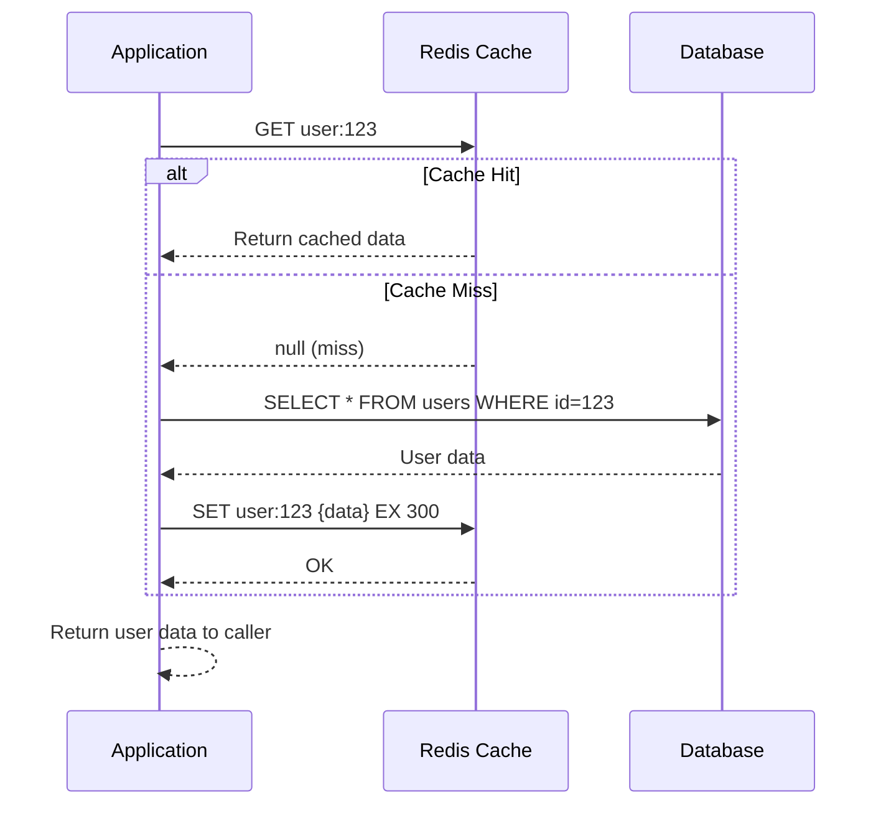
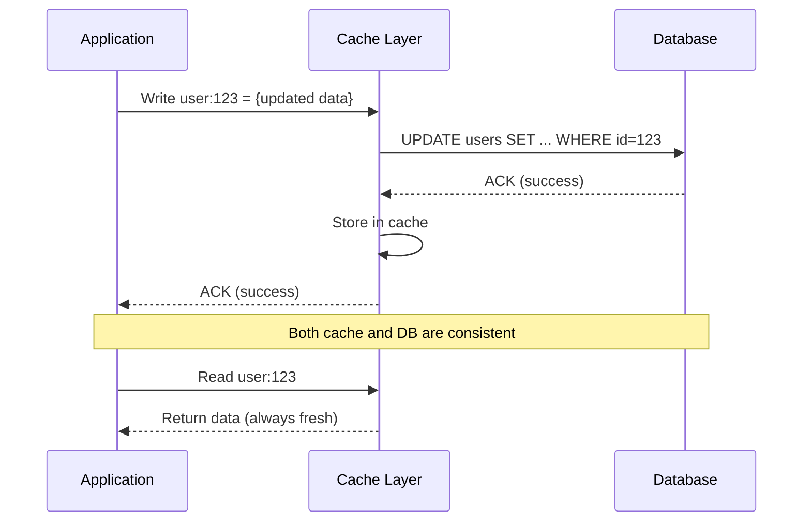
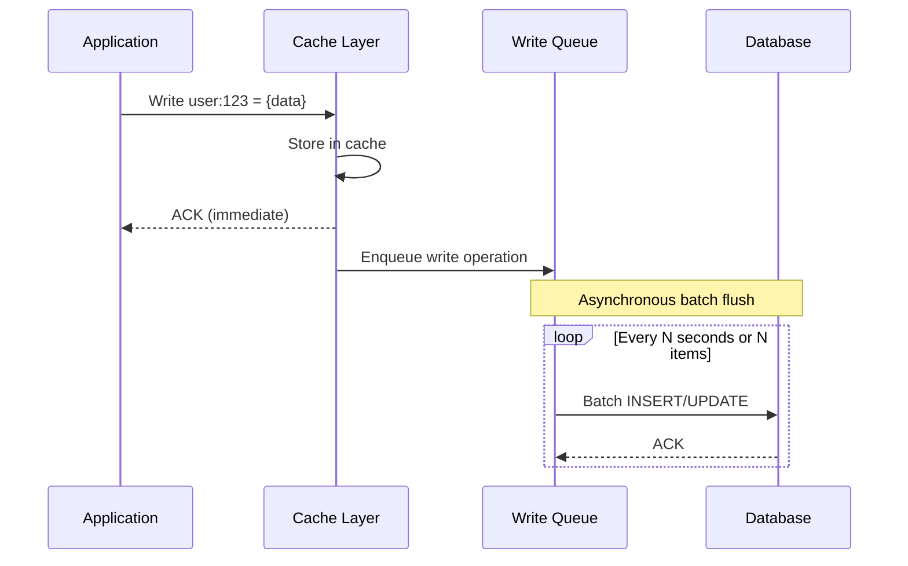
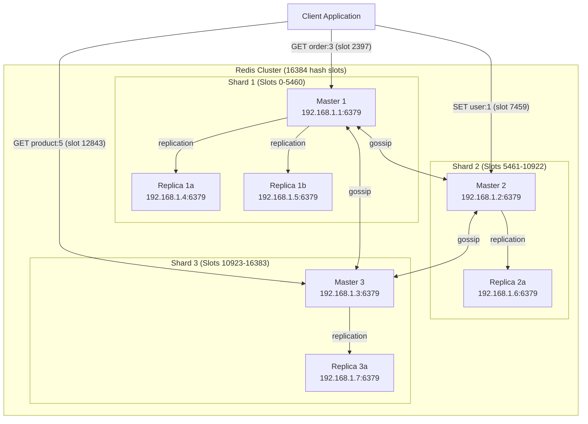
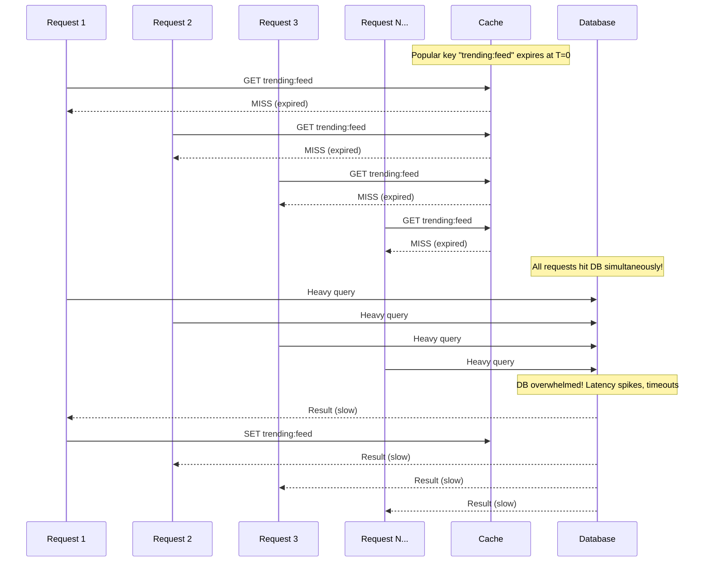
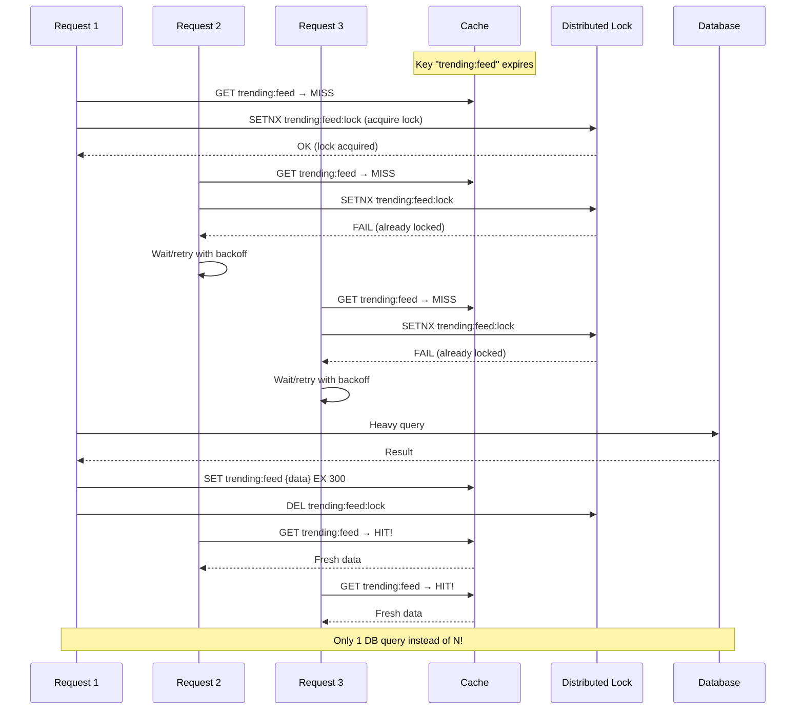
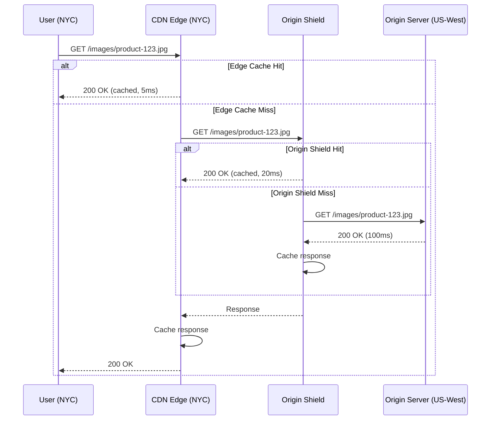

# Chapter 13: Distributed Caching

---

> *"There are only two hard things in Computer Science: cache invalidation and naming things."*
> — Phil Karlton

---

## 1. Why This Matters

Every modern distributed system at scale relies on caching. Without caching, the internet as we know it would collapse under its own weight. Consider these numbers:

- **Amazon** found that every 100ms of latency cost them 1% in sales
- **Google** discovered that an extra 0.5 seconds in search page generation dropped traffic by 20%
- **Facebook** serves billions of requests per second, with over 99% of reads served from cache
- **Netflix** would need 10x more backend infrastructure without their caching layer

### The Three Pillars of Caching Value

**1. Latency Reduction**
A database query might take 5-50ms. A cache lookup takes 0.1-1ms. For a page that requires 50 database queries, that's the difference between 250ms and 5ms — a 50x improvement. Users perceive anything under 100ms as "instant." Caching is often the only way to achieve this at scale.

**2. Throughput Amplification**
A single MySQL instance might handle 5,000 queries per second. A single Redis instance can handle 100,000+ operations per second. A single Memcached instance can handle 200,000+ operations per second. Caching amplifies your read capacity by orders of magnitude without scaling your database tier.

**3. Cost Reduction**
Database instances are expensive — they require fast SSDs, large amounts of RAM, and high-end CPUs. A caching layer that absorbs 99% of reads means you need far fewer database replicas, saving hundreds of thousands of dollars annually at scale.

### System Design Interview Relevance

Caching appears in virtually every system design interview. You'll be asked about:
- Designing a URL shortener → cache hot URLs
- Designing Twitter's timeline → cache user timelines
- Designing a news feed → cache feed data
- Designing a rate limiter → use Redis for counters
- Designing a leaderboard → use Redis sorted sets

Understanding distributed caching deeply is not optional — it's a **prerequisite** for any senior engineering role.

### The Fundamental Caching Principle

At its core, caching exploits a simple observation: **access patterns are not uniform**. In most systems, a small fraction of data accounts for the majority of accesses. This is the **Pareto principle** (80/20 rule) applied to data access — 20% of the data handles 80% of the traffic. By keeping this "hot" data in a faster storage tier, we dramatically improve overall system performance.

---

## 2. Beginner Intuition

### The Library Analogy

Imagine you're a student writing a thesis. You frequently reference certain books.

**Without caching (going to the library every time):**
1. Walk to the university library (5 minutes)
2. Find the book in the catalog (2 minutes)
3. Locate it on the shelf (3 minutes)
4. Read the relevant section (1 minute)
5. Walk back to your desk (5 minutes)
- **Total: 16 minutes per reference**

**With caching (keeping books on your desk):**
1. Reach for the book on your desk (5 seconds)
2. Open to the bookmarked page (5 seconds)
- **Total: 10 seconds per reference**

But your desk has limited space (like cache memory). You can only keep 10 books on it. When you need an 11th book, you must decide which one to remove. This is the **eviction problem**.

Sometimes the library updates a book with a new edition, but you still have the old one on your desk. This is the **stale data problem**.

Sometimes 100 students all need the same popular book at the same time and rush to the library. This is the **thundering herd problem**.

### The Cache Hierarchy — Multiple Desks

Now extend the analogy:
- **Your brain** (L1/L2 CPU cache) — fastest, smallest, holds the formula you're currently using
- **Your desk** (application-level cache) — fast, small, holds the books you're actively reading
- **Your room's bookshelf** (distributed cache like Redis) — medium speed, medium size
- **The university library** (database) — slow, large, holds everything
- **Inter-library loan** (remote API/service) — slowest, largest

Each level is progressively slower but larger. Data flows upward from slow-large to fast-small based on access patterns.

### What Makes Caching Hard?

Caching sounds simple — store frequently accessed data closer to where it's needed. But in distributed systems, it becomes incredibly complex:

1. **Where** do you cache? (client, server, CDN, database)
2. **What** do you cache? (raw data, computed results, HTML fragments)
3. **When** do you invalidate? (time-based, event-based, never)
4. **How** do you handle consistency? (stale reads, cache stampede)
5. **How** do you handle failures? (cache goes down, network partitions)

---

## 3. Core Theory

### 3.1 The Cache Hierarchy

Modern systems employ multiple layers of caching, each optimized for different access patterns:

```
┌─────────────────────────────────────────────────────────────────────┐
│                        CACHE HIERARCHY                              │
├──────────────────┬──────────┬───────────┬───────────────────────────┤
│ Level            │ Latency  │ Size      │ Examples                  │
├──────────────────┼──────────┼───────────┼───────────────────────────┤
│ L1 CPU Cache     │ ~1ns     │ 64KB      │ Hardware managed          │
│ L2 CPU Cache     │ ~4ns     │ 256KB     │ Hardware managed          │
│ L3 CPU Cache     │ ~12ns   │ 8-32MB    │ Hardware managed          │
│ Application Heap │ ~100ns   │ 1-32GB    │ HashMap, Guava, Caffeine  │
│ Distributed Cache│ ~1ms     │ 10-500GB+ │ Redis, Memcached          │
│ CDN              │ ~10ms    │ Petabytes │ CloudFront, Akamai        │
│ Database         │ ~5-50ms  │ Terabytes │ PostgreSQL, MySQL         │
│ Remote Storage   │ ~50-200ms│ Unlimited │ S3, GCS                   │
└──────────────────┴──────────┴───────────┴───────────────────────────┘
```

**L1/L2/L3 CPU Cache:**
Hardware-managed caches that exploit spatial and temporal locality. L1 is split into instruction cache (L1i) and data cache (L1d). These are per-core (L1, L2) or shared across cores (L3). Cache lines are typically 64 bytes. CPU caches use a write-back policy and MESI protocol for coherence.

**Application-Level Cache (In-Process):**
Data stored in the application's heap memory. Examples include Java's `ConcurrentHashMap`, Google's Guava Cache, and Caffeine. Zero network overhead, but limited to a single process and lost on restart. In Java, GC pressure from large in-process caches can cause long pause times.

**Distributed Cache (Out-of-Process):**
Shared cache accessible by multiple application instances over the network. Redis and Memcached are the dominant solutions. Survives individual application restarts, provides a shared view of cached data, and can scale horizontally.

**CDN (Content Delivery Network):**
Geographically distributed cache nodes that serve static content (images, CSS, JS) and sometimes dynamic content from edge locations closest to users. Examples: CloudFront, Akamai, Cloudflare, Fastly.

### 3.2 Cache Hit and Miss

The two fundamental cache operations:

**Cache Hit:** The requested data is found in the cache. The request is served directly from cache without touching the backend.

**Cache Miss:** The requested data is NOT in the cache. The system must fetch it from the backend (database, service), and typically stores it in the cache for future requests.

**Hit Rate** = Cache Hits / (Cache Hits + Cache Misses)

A good cache hit rate is typically **95-99%**. Below 90%, you should investigate your caching strategy, key design, or eviction policy.

**Effective Latency** = (Hit Rate × Cache Latency) + (Miss Rate × Backend Latency)

Example: With 95% hit rate, 1ms cache latency, 50ms DB latency:
- Effective Latency = (0.95 × 1ms) + (0.05 × 50ms) = 0.95ms + 2.5ms = **3.45ms**
- Without cache: **50ms** (14.5x slower)

### 3.3 Caching Strategies — The Five Canonical Patterns

#### 3.3.1 Cache-Aside (Lazy Loading)

The most common caching pattern. The application manages the cache explicitly.

**Read Path:**
1. Application checks the cache for the requested key
2. If cache hit → return cached data
3. If cache miss → query the database
4. Store the result in cache
5. Return the data to the caller

**Write Path:**
1. Application writes to the database
2. Application invalidates (deletes) the cache entry
3. The next read will miss and repopulate the cache

**Advantages:**
- Only requested data is cached (no wasted memory)
- Cache failure doesn't bring down the system (falls back to DB)
- Simple to implement and reason about

**Disadvantages:**
- First request always results in a cache miss (cold start)
- Stale data possible in a race condition between cache invalidation and reads
- Application must manage cache logic explicitly

**When to use:** Most read-heavy workloads. This is the default pattern and works well for 90% of use cases.

#### 3.3.2 Read-Through

Similar to cache-aside, but the cache itself is responsible for loading data on a miss.

**How it works:**
1. Application always reads from the cache
2. On cache miss, the cache library/provider loads data from the database
3. Cache stores the data and returns it to the application

**Advantages:**
- Application code is simpler (no cache-miss handling logic)
- Consistent data loading logic

**Disadvantages:**
- Data model in cache must match the data model in the database
- First request still results in a miss
- Less control over loading logic

**When to use:** When you want to decouple cache management from application logic. Often used with frameworks like Spring Cache.

#### 3.3.3 Write-Through

Every write goes through the cache to the database.

**How it works:**
1. Application writes data to the cache
2. Cache synchronously writes the data to the database
3. Both cache and database are updated atomically (from the application's perspective)

**Advantages:**
- Cache and database are always consistent
- No stale data in cache
- Simplified read path (data is always in cache after a write)

**Disadvantages:**
- Higher write latency (write must go to cache AND database)
- Caches data that may never be read (wasted memory)
- Write bottleneck in the cache layer

**When to use:** Systems where data consistency is critical and write latency is acceptable. Often combined with read-through.

#### 3.3.4 Write-Behind (Write-Back)

Writes go to the cache first, and the cache asynchronously flushes to the database.

**How it works:**
1. Application writes data to the cache
2. Cache acknowledges the write immediately
3. Cache asynchronously writes data to the database (batched, delayed)
4. If the cache fails before flushing, data is lost

**Advantages:**
- Lowest write latency (write only to cache)
- Batching reduces database load
- Absorbs write spikes

**Disadvantages:**
- **Data loss risk** if cache fails before flushing
- Complex to implement correctly
- Eventual consistency between cache and database
- Debugging is harder (where is the latest data?)

**When to use:** Write-heavy workloads where some data loss is acceptable (analytics, counters, logs). Never use for financial data.

#### 3.3.5 Refresh-Ahead

Proactively refreshes cache entries before they expire.

**How it works:**
1. Cache tracks access patterns and expiry times
2. Before a popular entry expires, cache proactively reloads it from the database
3. Users always get cache hits (no miss penalty)

**Advantages:**
- Eliminates cache miss latency for hot data
- Reduces thundering herd on expiry
- Smoother latency distribution

**Disadvantages:**
- Complex to implement
- Wastes resources refreshing data that might not be requested again
- Must accurately predict which entries to refresh

**When to use:** High-traffic systems where cache miss latency is unacceptable. Stock prices, sports scores, trending content.

### 3.4 Cache Invalidation — The Hardest Problem

Phil Karlton's famous quote exists because cache invalidation is genuinely one of the hardest problems in distributed systems. The core challenge: **how do you ensure the cache reflects the current state of the source of truth?**

#### 3.4.1 TTL-Based Invalidation (Time-To-Live)

Each cache entry has an expiration time. After the TTL expires, the entry is considered stale and will be refreshed on the next access.

```
Key: "user:123"
Value: {name: "Alice", age: 30}
TTL: 300 seconds (5 minutes)
```

**Advantages:**
- Simple to implement
- Bounds staleness to the TTL window
- Self-healing (stale data eventually expires)

**Disadvantages:**
- Data can be stale for up to the entire TTL duration
- Short TTLs reduce hit rate; long TTLs increase staleness
- Doesn't handle urgent invalidation (user changes password)

**Best practices:**
- Use different TTLs for different data types (user profile: 5min, product price: 30sec, config: 1hr)
- Add jitter to TTLs to prevent synchronized expiration (thundering herd)
- Use shorter TTLs for frequently changing data

#### 3.4.2 Event-Based Invalidation

When the source data changes, an event is published and the cache entry is invalidated or updated.

**Approaches:**
- **Database triggers:** Database fires a trigger on update → invalidates cache
- **Application events:** Application publishes events to a message broker → consumers invalidate cache
- **Change Data Capture (CDC):** Tools like Debezium capture database changes → stream to cache invalidation service

**Advantages:**
- Near-real-time consistency
- No stale data window (like TTL)
- Can update cache proactively (not just invalidate)

**Disadvantages:**
- Complex infrastructure (message brokers, CDC pipelines)
- Event ordering and delivery guarantees are tricky
- Failure in event pipeline means stale cache

#### 3.4.3 Version-Based Invalidation

Each piece of data has a version number. The cache stores data with its version. On read, the version is checked against the source.

```
Cache entry: { key: "product:456", version: 7, data: {...} }
Database:    { id: 456, version: 8, data: {...} }
→ Cache entry is stale, refresh needed
```

**Advantages:**
- Precise staleness detection
- Works well with optimistic concurrency
- Can be combined with ETags in HTTP caching

**Disadvantages:**
- Requires a version check on every read (or periodic check)
- Version store itself needs to be fast (defeating the purpose if it's in the DB)

### 3.5 Cache Eviction Policies

When the cache is full and a new entry needs to be added, which existing entry should be removed?

#### LRU (Least Recently Used)
Evicts the entry that hasn't been accessed for the longest time. Based on the assumption that recently accessed data will likely be accessed again (temporal locality).

**Implementation:** Doubly-linked list + HashMap. O(1) for get and put.

**Pros:** Simple, effective for most workloads
**Cons:** Scan pollution (a one-time scan of many items can evict frequently used items)

#### LFU (Least Frequently Used)
Evicts the entry that has been accessed the fewest number of times. Based on the assumption that frequently accessed data is more important.

**Implementation:** Min-heap or frequency-bucketed linked lists. O(1) with O(n) space.

**Pros:** Better than LRU for stable access patterns
**Cons:** Slow to adapt (newly added popular items have low frequency), frequency counts require maintenance

#### FIFO (First In, First Out)
Evicts the oldest entry regardless of access pattern.

**Implementation:** Simple queue.

**Pros:** Simplest to implement
**Cons:** No consideration of access patterns, poor hit rate

#### Random
Evicts a random entry.

**Implementation:** Random selection.

**Pros:** No overhead, surprisingly competitive in some workloads
**Cons:** Unpredictable behavior, can evict hot data

#### ARC (Adaptive Replacement Cache)
Self-tuning algorithm that balances between recency (LRU) and frequency (LFU). Maintains two LRU lists and dynamically adjusts the balance based on workload.

**How ARC Works:**
1. Maintains two lists: T1 (recently accessed once) and T2 (accessed multiple times)
2. Also maintains "ghost" lists B1 and B2 for recently evicted entries
3. If a cache miss hits B1 (entry was recently evicted from T1), increase T1's target size
4. If a cache miss hits B2, increase T2's target size
5. The algorithm adapts to the actual workload automatically

**Pros:** Adapts to changing workloads, excellent hit rate
**Cons:** More complex to implement, patented (IBM), more memory overhead

### 3.6 Cache Consistency Problems

#### Stale Data
The cache contains an outdated version of the data. Causes: TTL hasn't expired yet, invalidation event was lost, race condition between write and invalidation.

#### Thundering Herd
When a popular cache entry expires, many concurrent requests simultaneously miss the cache and all hit the database, potentially overwhelming it.

**Solutions:**
- **Locking:** Only one request fetches from DB; others wait for the cache to be populated
- **Stale-while-revalidate:** Serve stale data while refreshing in background
- **Jittered TTLs:** Add random jitter so entries don't all expire at the same time

#### Cache Stampede
Similar to thundering herd, but caused by a cache server restart or crash. All entries are cold, so all requests miss and hit the database simultaneously.

**Solutions:**
- **Cache warming:** Pre-populate cache before directing traffic
- **Gradual traffic shift:** Slowly redirect traffic to new cache nodes
- **Probabilistic early expiration:** Each request has a small probability of refreshing before actual TTL expiry

#### Hot Keys
A small number of cache keys receive a disproportionately large number of requests. This can overwhelm a single cache node (since keys are typically sharded by key hash).

**Solutions:**
- **Local caching:** Cache hot keys in application memory
- **Key replication:** Replicate hot keys across multiple cache nodes with suffixed key names (`key:1`, `key:2`, ..., `key:N`)
- **Read replicas:** Use Redis read replicas for hot keys

---

## 4. Architecture Deep Dive

### 4.1 Redis Deep Dive

Redis (Remote Dictionary Server) is the most popular distributed caching solution. It's an in-memory data structure server that supports persistence, replication, clustering, and Lua scripting.

#### 4.1.1 Data Structures

Redis is not just a key-value store — it's a **data structure server**. This distinction is crucial because it means you can perform operations on the data stored in Redis without fetching it, modifying it, and writing it back.

**Strings**
The simplest Redis type. Can hold text, integers, or binary data up to 512MB.

```
SET user:123:name "Alice"           → OK
GET user:123:name                   → "Alice"
INCR page:home:views               → 1 (atomic increment)
SETEX session:abc123 3600 "data"    → OK (expires in 1 hour)
MSET key1 "val1" key2 "val2"       → OK (set multiple)
MGET key1 key2                     → ["val1", "val2"]
```

Use cases: caching, counters, rate limiting, session storage, distributed locks.

**Hashes**
Maps of field-value pairs. Think of them as mini-objects.

```
HSET user:123 name "Alice" age "30" city "NYC"
HGET user:123 name                  → "Alice"
HGETALL user:123                    → {name: "Alice", age: "30", city: "NYC"}
HINCRBY user:123 age 1              → 31 (increment a field)
HDEL user:123 city                  → 1 (delete a field)
```

Use cases: storing objects, user profiles, configuration. More memory-efficient than storing each field as a separate key.

**Lists**
Ordered collections of strings, implemented as linked lists. O(1) push/pop at head or tail.

```
LPUSH queue:emails "email1" "email2"  → 2
RPUSH queue:emails "email3"            → 3
LPOP queue:emails                      → "email2"
RPOP queue:emails                      → "email3"
LRANGE queue:emails 0 -1              → ["email1"]
LLEN queue:emails                      → 1
```

Use cases: message queues, activity feeds, recent items lists.

**Sets**
Unordered collections of unique strings.

```
SADD tags:post:1 "redis" "cache" "distributed"
SMEMBERS tags:post:1                    → {"redis", "cache", "distributed"}
SISMEMBER tags:post:1 "redis"           → 1 (true)
SINTER tags:post:1 tags:post:2          → intersection of sets
SUNION tags:post:1 tags:post:2          → union of sets
SCARD tags:post:1                       → 3 (cardinality)
```

Use cases: tags, unique visitors, set operations (mutual friends, common interests).

**Sorted Sets (ZSets)**
Like sets, but each member has a score. Members are ordered by score. This is one of Redis's most powerful data structures.

```
ZADD leaderboard 100 "alice" 85 "bob" 92 "charlie"
ZRANGE leaderboard 0 -1 WITHSCORES     → [("bob",85), ("charlie",92), ("alice",100)]
ZREVRANGE leaderboard 0 2 WITHSCORES   → [("alice",100), ("charlie",92), ("bob",85)]
ZRANK leaderboard "bob"                 → 0 (rank, 0-indexed)
ZRANGEBYSCORE leaderboard 90 100       → ["charlie", "alice"]
ZINCRBY leaderboard 20 "bob"           → 105
```

Use cases: leaderboards, priority queues, rate limiters (sliding window), time-series data.

**Streams**
Append-only log data structure, introduced in Redis 5.0. Similar to Kafka topics but within Redis.

```
XADD mystream * sensor-id 1234 temperature 19.8
XADD mystream * sensor-id 1234 temperature 20.1
XLEN mystream                           → 2
XRANGE mystream - +                     → all entries
XREAD COUNT 10 BLOCK 5000 STREAMS mystream 0
```

Consumer groups provide Kafka-like functionality:
```
XGROUP CREATE mystream mygroup 0
XREADGROUP GROUP mygroup consumer1 COUNT 1 BLOCK 2000 STREAMS mystream >
XACK mystream mygroup 1526569495631-0
```

Use cases: event sourcing, activity feeds, real-time analytics, message queuing.

**HyperLogLog**
Probabilistic data structure for estimating the cardinality of a set. Uses only ~12KB of memory regardless of the number of elements.

```
PFADD visitors:2024-01-15 "user1" "user2" "user3"
PFADD visitors:2024-01-15 "user1" "user4"          → user1 already counted
PFCOUNT visitors:2024-01-15                          → ~4 (0.81% standard error)
PFMERGE visitors:week visitors:2024-01-15 visitors:2024-01-16
```

Use cases: unique visitor counts, unique search queries, unique events. Any scenario where you need approximate cardinality of a very large set.

**Bitmaps**
Not a separate data type — actually strings treated as bit arrays. Extremely memory-efficient for boolean operations.

```
SETBIT user:123:features 0 1       → set feature 0 to ON
SETBIT user:123:features 1 0       → set feature 1 to OFF
GETBIT user:123:features 0         → 1
BITCOUNT user:123:features         → 1
BITOP AND result bitmap1 bitmap2   → AND operation
```

Use cases: feature flags, daily active users, bloom filters.

#### 4.1.2 Redis Persistence

Redis is an in-memory store, but it provides persistence mechanisms to survive restarts.

**RDB (Redis Database) Snapshots**
Point-in-time snapshots of the dataset, written to disk as a compact binary file.

```
# redis.conf
save 900 1      # Save if at least 1 key changed in 900 seconds
save 300 10     # Save if at least 10 keys changed in 300 seconds
save 60 10000   # Save if at least 10000 keys changed in 60 seconds
```

How it works:
1. Redis forks the process (using `fork()` syscall with copy-on-write)
2. Child process writes the dataset to a temp RDB file
3. When complete, the temp file replaces the old RDB file
4. Parent process continues serving requests

**Pros:** Compact file, fast restart, good for backups
**Cons:** Data loss between snapshots (up to last save interval), fork() can be slow with large datasets

**AOF (Append-Only File)**
Logs every write operation. On restart, Redis replays the AOF to reconstruct the dataset.

```
# redis.conf
appendonly yes
appendfsync everysec    # fsync every second (recommended)
# appendfsync always    # fsync on every write (safest, slowest)
# appendfsync no        # let OS decide when to fsync (fastest, least safe)
```

AOF file contains human-readable commands:
```
*3\r\n$3\r\nSET\r\n$5\r\nuser1\r\n$5\r\nAlice\r\n
*3\r\n$3\r\nSET\r\n$5\r\nuser2\r\n$3\r\nBob\r\n
```

**AOF Rewriting:** Over time, AOF files grow large. Redis can rewrite the AOF file to contain only the minimal set of commands to reconstruct the current dataset.

**Pros:** More durable (at most 1 second of data loss with `everysec`), human-readable
**Cons:** Larger file size, slower restart than RDB

**Hybrid Persistence (Redis 4.0+)**
Combines RDB and AOF. The AOF file starts with an RDB snapshot, followed by AOF commands. On restart, Redis loads the RDB snapshot first (fast), then replays AOF commands (for recent changes).

```
# redis.conf
aof-use-rdb-preamble yes
```

**Pros:** Fast restart (RDB) + minimal data loss (AOF)
**Cons:** More complex, AOF file format is not purely human-readable

#### 4.1.3 Redis Replication and Sentinel

**Replication**
Redis uses asynchronous master-replica replication. One master handles writes; replicas receive copies and handle reads.

```
# On replica
REPLICAOF master-host 6379
```

Replication process:
1. Replica connects to master and sends `PSYNC` command
2. Master starts background save (RDB) and buffers new writes
3. Master sends RDB file to replica
4. Replica loads RDB into memory
5. Master sends buffered write commands to replica
6. Ongoing: master streams write commands to replica in real-time

**Partial resynchronization:** If a replica disconnects briefly, it can request only the missing commands (using the replication offset) instead of a full resync. This uses the replication backlog buffer.

**Redis Sentinel**
Provides high availability through automatic failover. Sentinel is a separate process that monitors Redis instances.

Sentinel capabilities:
1. **Monitoring:** Checks if master and replicas are working
2. **Notification:** Alerts administrators via API when something goes wrong
3. **Automatic failover:** Promotes a replica to master when the master fails
4. **Configuration provider:** Clients connect to Sentinel to discover the current master

```
# sentinel.conf
sentinel monitor mymaster 192.168.1.100 6379 2    # quorum of 2
sentinel down-after-milliseconds mymaster 5000     # 5s to detect failure
sentinel failover-timeout mymaster 60000            # 60s failover timeout
sentinel parallel-syncs mymaster 1                  # 1 replica syncs at a time
```

Failover process:
1. Sentinel detects master is down (subjective down: SDOWN)
2. Multiple Sentinels agree master is down (objective down: ODOWN, requires quorum)
3. Sentinel leader election (using Raft-like algorithm)
4. Leader Sentinel selects best replica (considers replication offset, priority, run ID)
5. Promotes selected replica to master
6. Reconfigures other replicas to replicate from new master
7. Updates clients via Pub/Sub

#### 4.1.4 Redis Cluster

Redis Cluster provides horizontal scaling by sharding data across multiple master nodes. Introduced in Redis 3.0.

**Hash Slots**
Redis Cluster divides the keyspace into 16,384 hash slots. Each key is mapped to a slot using CRC16:

```
slot = CRC16(key) mod 16384
```

Each master node is responsible for a subset of slots. For example:
- Node A: slots 0-5460
- Node B: slots 5461-10922
- Node C: slots 10923-16383

**Hash Tags**
You can force related keys to map to the same slot using hash tags:

```
SET {user:123}.profile "..."    → slot = CRC16("user:123")
SET {user:123}.sessions "..."   → same slot!
```

This enables multi-key operations (MGET, transactions) on related keys.

**Cluster Communication**
Nodes communicate via a gossip protocol on a dedicated bus port (data port + 10000). Every node sends periodic PING messages to random nodes and receives PONG responses. This gossip protocol shares:
- Cluster topology
- Node health status
- Slot assignments
- Failover decisions

**Resharding (Live Migration)**
When adding or removing nodes, slots must be redistributed. Redis Cluster supports live resharding — migrating slots between nodes with zero downtime.

```
# Using redis-cli
redis-cli --cluster reshard 192.168.1.100:6379
```

During migration:
1. Source node marks slot as MIGRATING
2. Target node marks slot as IMPORTING
3. Keys are migrated one by one
4. Clients hitting MIGRATING slot get ASK redirect to target
5. When complete, slot assignment is updated via gossip

**Failover in Redis Cluster**
Each master has one or more replicas. If a master fails:
1. Replicas detect master is unreachable (via heartbeat timeout)
2. Replicas request votes from other masters (like Raft election)
3. Elected replica promotes itself to master
4. New master announces new epoch and takes over slots
5. Cluster continues operating (assuming majority of masters are alive)

Cluster requires a majority of masters to be available. If more than half the masters are down, the cluster stops accepting writes (to prevent split-brain).

#### 4.1.5 Redis Pub/Sub

Redis supports publish/subscribe messaging.

```
# Subscriber
SUBSCRIBE news:sports news:tech

# Publisher
PUBLISH news:sports "Goal scored!"    → returns number of subscribers who received
PUBLISH news:tech "New release!"
```

Pattern subscriptions:
```
PSUBSCRIBE news:*                      → subscribes to all news channels
```

**Limitations:**
- **Fire-and-forget:** Messages are lost if no subscribers are listening
- **No persistence:** Messages are not stored
- **No consumer groups:** Every subscriber gets every message (no load balancing)
- **No acknowledgment:** No way to know if a subscriber processed the message
- **Memory pressure:** Slow subscribers cause publisher buffer to grow

For reliable messaging, use Redis Streams instead.

#### 4.1.6 Redis Streams vs Kafka

| Feature | Redis Streams | Apache Kafka |
|---------|--------------|--------------|
| **Storage** | In-memory (with persistence) | Disk-based (with page cache) |
| **Throughput** | 100K-500K msg/sec per node | 1M+ msg/sec per broker |
| **Latency** | Sub-millisecond | 2-10ms |
| **Retention** | Memory-limited | Configurable (days/unlimited) |
| **Consumer Groups** | Yes | Yes |
| **Ordering** | Per-stream | Per-partition |
| **Replay** | Yes (by ID) | Yes (by offset) |
| **Cluster** | Redis Cluster (single-stream on one shard) | Native partitioning |
| **Use Case** | Real-time, small-medium throughput | High-throughput, long-term event storage |
| **Complexity** | Low (Redis is already in stack) | High (separate cluster, ZooKeeper/KRaft) |

**When to choose Redis Streams:**
- Already using Redis
- Low-to-medium throughput messaging
- Sub-millisecond latency required
- Short-lived event data
- Simpler operational requirements

**When to choose Kafka:**
- High throughput (millions of events/sec)
- Long-term event storage (days, weeks)
- Event sourcing / stream processing
- Complex event routing and processing
- Multiple independent consumer applications

### 4.2 Memcached Deep Dive

Memcached is a high-performance, distributed memory object caching system. While simpler than Redis, it excels at pure caching workloads.

#### 4.2.1 Architecture

Memcached uses a simple client-server architecture:
- **Shared-nothing:** Each Memcached instance operates independently
- **Client-side sharding:** The client determines which server holds a given key (using consistent hashing)
- **Multi-threaded:** Unlike Redis (single-threaded for commands), Memcached is multi-threaded and can use multiple CPU cores
- **Simple protocol:** Text and binary protocols for GET, SET, DELETE, etc.

#### 4.2.2 Slab Allocation

Memcached uses a **slab allocator** to manage memory efficiently and avoid fragmentation.

**How it works:**
1. Memory is divided into **slab classes** of different sizes (64B, 128B, 256B, ..., 1MB)
2. Each slab class has **pages** (default 1MB) divided into **chunks** of the class's size
3. When storing an item, Memcached finds the smallest slab class that fits the item
4. Items are stored in chunks of that slab class

```
Slab Class 1: chunk size = 96 bytes    → small items (keys, counters)
Slab Class 2: chunk size = 120 bytes
Slab Class 3: chunk size = 152 bytes
...
Slab Class 42: chunk size = 1048576 bytes (1MB) → largest items
```

**Growth factor:** By default, each slab class is 1.25x the size of the previous one. You can tune this with `-f` flag.

**Internal waste:** If an item is 100 bytes and the nearest slab class is 120 bytes, 20 bytes are wasted per item. This is the tradeoff for avoiding memory fragmentation.

#### 4.2.3 Memcached vs Redis Comparison

| Feature | Memcached | Redis |
|---------|-----------|-------|
| **Data Types** | Strings only | Strings, Hashes, Lists, Sets, Sorted Sets, Streams, HyperLogLog, Bitmaps |
| **Threading** | Multi-threaded | Single-threaded (6.0+ I/O threads for reads) |
| **Persistence** | None | RDB, AOF, Hybrid |
| **Replication** | None (client-managed) | Master-replica |
| **Clustering** | Client-side sharding | Native cluster (hash slots) |
| **Memory Efficiency** | Better for simple strings | Better for complex structures |
| **Max Value Size** | 1MB (default) | 512MB |
| **Pub/Sub** | No | Yes |
| **Lua Scripting** | No | Yes |
| **Transactions** | No | Yes (MULTI/EXEC) |
| **Eviction** | LRU per slab class | Multiple policies (LRU, LFU, etc.) |
| **Use Case** | Simple, high-throughput caching | Versatile caching + data structures |

**When to choose Memcached:**
- Simple key-value caching only
- Need multi-threading for CPU-bound operations
- Slightly better memory efficiency for simple strings
- Very large cache (100GB+) with simple data

**When to choose Redis:**
- Need rich data structures
- Need persistence
- Need Pub/Sub or Streams
- Need replication/clustering built in
- Most modern use cases

---

## 5. Visual Diagrams

### 5.1 Cache-Aside Flow



### 5.2 Write-Through Flow



### 5.3 Write-Behind Flow



### 5.4 Redis Cluster Architecture



### 5.5 Cache Stampede Scenario



### 5.6 Cache Stampede Solution — Locking



### 5.7 CDN Caching Flow



### 5.8 Multi-Tier Caching Architecture

```
┌──────────────────────────────────────────────────────────────────────┐
│                     MULTI-TIER CACHING ARCHITECTURE                   │
│                                                                        │
│  ┌─────────┐    ┌─────────┐    ┌─────────┐    ┌─────────┐           │
│  │ Client 1 │    │ Client 2 │    │ Client 3 │    │ Client N │           │
│  └────┬─────┘    └────┬─────┘    └────┬─────┘    └────┬─────┘           │
│       │               │               │               │                 │
│  ┌────▼───────────────▼───────────────▼───────────────▼────┐           │
│  │                     CDN Edge Nodes                       │           │
│  │            (Static assets, API responses)                │ TIER 1    │
│  └─────────────────────────┬───────────────────────────────┘           │
│                            │ Miss                                       │
│  ┌─────────────────────────▼───────────────────────────────┐           │
│  │                   API Gateway Cache                      │           │
│  │              (Rate limiting, auth tokens)                │ TIER 2    │
│  └─────────────────────────┬───────────────────────────────┘           │
│                            │ Miss                                       │
│  ┌──────────┐  ┌──────────┐  ┌──────────┐  ┌──────────┐              │
│  │ App Srv 1 │  │ App Srv 2 │  │ App Srv 3 │  │ App Srv N │              │
│  │┌────────┐│  │┌────────┐│  │┌────────┐│  │┌────────┐│              │
│  ││L1 Cache││  ││L1 Cache││  ││L1 Cache││  ││L1 Cache││ TIER 3       │
│  │└────────┘│  │└────────┘│  │└────────┘│  │└────────┘│ (In-process) │
│  └────┬─────┘  └────┬─────┘  └────┬─────┘  └────┬─────┘              │
│       │              │              │              │                    │
│  ┌────▼──────────────▼──────────────▼──────────────▼────┐              │
│  │              Distributed Cache (Redis Cluster)        │              │
│  │                    (Shared state)                     │ TIER 4       │
│  └──────────────────────────┬───────────────────────────┘              │
│                             │ Miss                                      │
│  ┌──────────────────────────▼───────────────────────────┐              │
│  │                  Database (PostgreSQL)                 │              │
│  │                  (Source of truth)                     │ TIER 5       │
│  └──────────────────────────────────────────────────────┘              │
└──────────────────────────────────────────────────────────────────────┘
```

---

## 6. Real Production Examples

### 6.1 Facebook's Memcached Fleet (TAO)

Facebook operates one of the largest Memcached deployments in the world, serving **billions of requests per second**.

**Scale:**
- Thousands of Memcached servers
- Trillions of items cached
- Multiple data center regions
- Over 99% cache hit rate

**Architecture Evolution:**

**Phase 1: Simple Memcached**
Initially, Facebook used Memcached as a simple look-aside cache. Applications would check Memcached first, and on a miss, query MySQL.

**Phase 2: Regional Pools**
As traffic grew, they introduced regional Memcached pools:
- **Wildcard pool:** Default pool for most keys
- **Regional pool:** Data replicated per region to reduce cross-region latency
- **Small pool:** High-throughput keys isolated to prevent eviction

**Phase 3: Lease Mechanism**
To solve thundering herd and stale sets, Facebook introduced **leases**:

1. On cache miss, Memcached returns a **lease token** (64-bit ID)
2. Only the request holding the lease can set the value
3. Other concurrent misses get a "try again later" response
4. Leases expire after 10 seconds (in case the holder crashes)
5. This solved thundering herd with minimal overhead

**Phase 4: McRouter**
Facebook built **McRouter**, a Memcached protocol router that provides:
- Connection pooling
- Prefix-based routing
- Failover handling
- Replication across pools
- Warm-up from other regions

**Phase 5: TAO (The Associations and Objects)**
TAO is Facebook's graph-aware caching system built on top of Memcached:
- Objects (nodes): users, posts, photos
- Associations (edges): friendships, likes, comments
- TAO provides a graph API with caching built in
- Write-through cache for objects
- Eventual consistency across regions

**Key lessons from Facebook:**
1. At extreme scale, even Memcached needs a routing layer
2. Thundering herd is a real problem that needs active mitigation
3. Cross-region consistency requires careful design
4. Simple protocols (Memcached text protocol) scale well

### 6.2 Netflix EVCache

Netflix built **EVCache** (Ephemeral Volatile Cache) on top of Memcached for their global streaming platform.

**Scale:**
- ~50 million operations per second
- Thousands of Memcached instances
- Multiple AWS regions
- Petabytes of cached data

**Architecture:**
- Built on top of Memcached with a Java client library
- Uses consistent hashing for key distribution
- Zone-aware replication (data replicated across AWS Availability Zones)
- Automatic fallback to other zones on failure

**Key Features:**

1. **Zone-Aware Replication:**
   - Data written to all zones in a region simultaneously
   - Reads go to the nearest zone
   - If one zone fails, reads automatically go to another zone

2. **Dynamic Tuning:**
   - Cache sizes automatically adjusted based on hit rates
   - Monitoring dashboards track hit rates, latency, eviction rates
   - Alert on hit rate drops below threshold

3. **Data Chunking:**
   - Large values are automatically split into chunks
   - Stored across multiple Memcached keys
   - Reassembled transparently on read

4. **Near-Cache (L1):**
   - In-process cache (Caffeine) in front of EVCache
   - Reduces network calls for extremely hot data
   - Short TTL (seconds) to balance staleness vs performance

**Key lessons from Netflix:**
1. Multi-zone replication is essential for availability
2. In-process caching in front of distributed cache reduces latency further
3. Automatic chunking handles large values transparently
4. Monitoring and dynamic tuning are critical at scale

### 6.3 Twitter's Caching Architecture

Twitter uses a combination of Redis and Memcached for different use cases.

**Timeline Caching:**
- User timelines are cached in Redis
- Each timeline is a Redis list of tweet IDs
- When a user opens Twitter, their cached timeline is served from Redis
- Timeline fanout: when a celebrity tweets, the tweet ID is fanned out to millions of follower timelines in Redis

**Counting:**
- Like counts, retweet counts, follower counts stored in Redis
- Uses Redis `INCR`/`DECR` for atomic counters
- Periodically synced to database

**Rate Limiting:**
- API rate limiting using Redis sorted sets
- Sliding window rate limiter implementation

**Twemproxy (nutcracker):**
Twitter built **Twemproxy**, an open-source proxy for Memcached and Redis:
- Automatic sharding across multiple Redis/Memcached instances
- Connection pooling
- Consistent hashing with configurable hash functions
- Pipelining support
- Supports both Memcached and Redis protocols

**Key lessons from Twitter:**
1. Different cache technologies for different use cases (Redis for timelines, Memcached for general caching)
2. Fanout-on-write for timeline construction (pre-compute and cache)
3. Proxy layers (Twemproxy) help manage large cache fleets
4. Redis data structures (lists, sorted sets) enable complex use cases beyond simple caching

### 6.4 Real-World CDN Caching

**Cloudflare:**
- Serves 20%+ of all internet traffic
- 300+ data centers globally
- Caches static assets at the edge
- Tiered caching (edge → regional tier → origin)
- Workers (edge compute) for dynamic caching logic

**Akamai:**
- The largest CDN with 350,000+ servers in 130+ countries
- Intelligent platform that routes requests to optimal edge servers
- SureRoute technology for dynamic content acceleration
- EdgeCompute for running code at the edge

---

## 7. Java Implementations

### 7.1 Redis Cache with Spring Boot — Cache-Aside Pattern

```java
import org.springframework.boot.SpringApplication;
import org.springframework.boot.autoconfigure.SpringBootApplication;
import org.springframework.cache.annotation.EnableCaching;

@SpringBootApplication
@EnableCaching
public class CachingApplication {
    public static void main(String[] args) {
        SpringApplication.run(CachingApplication.class, args);
    }
}
```

```java
import org.springframework.context.annotation.Bean;
import org.springframework.context.annotation.Configuration;
import org.springframework.data.redis.cache.RedisCacheConfiguration;
import org.springframework.data.redis.cache.RedisCacheManager;
import org.springframework.data.redis.connection.RedisConnectionFactory;
import org.springframework.data.redis.connection.lettuce.LettuceConnectionFactory;
import org.springframework.data.redis.serializer.GenericJackson2JsonRedisSerializer;
import org.springframework.data.redis.serializer.RedisSerializationContext;
import org.springframework.data.redis.serializer.StringRedisSerializer;

import java.time.Duration;
import java.util.HashMap;
import java.util.Map;

/**
 * Redis cache configuration with multiple cache regions.
 * 
 * Production considerations:
 * - Different TTLs for different data types
 * - JSON serialization for debuggability
 * - Key prefixing for namespace isolation
 * - Connection pooling via Lettuce
 */
@Configuration
public class RedisCacheConfig {

    @Bean
    public RedisConnectionFactory redisConnectionFactory() {
        // In production, configure with:
        // - Connection pool (max-active, max-idle, min-idle)
        // - SSL/TLS for encryption in transit
        // - Cluster configuration for Redis Cluster
        // - Sentinel configuration for HA
        LettuceConnectionFactory factory = new LettuceConnectionFactory("localhost", 6379);
        return factory;
    }

    @Bean
    public RedisCacheManager cacheManager(RedisConnectionFactory connectionFactory) {
        // Default cache configuration
        RedisCacheConfiguration defaultConfig = RedisCacheConfiguration.defaultCacheConfig()
                .entryTtl(Duration.ofMinutes(10))
                .serializeKeysWith(
                    RedisSerializationContext.SerializationPair.fromSerializer(
                        new StringRedisSerializer()))
                .serializeValuesWith(
                    RedisSerializationContext.SerializationPair.fromSerializer(
                        new GenericJackson2JsonRedisSerializer()))
                .disableCachingNullValues()  // Don't cache null (prevent cache penetration)
                .prefixCacheNameWith("myapp:");  // Namespace isolation

        // Per-cache TTL configuration
        Map<String, RedisCacheConfiguration> cacheConfigurations = new HashMap<>();
        
        // User profiles: 5-minute TTL (changes occasionally)
        cacheConfigurations.put("users", defaultConfig
                .entryTtl(Duration.ofMinutes(5)));
        
        // Product catalog: 30-minute TTL (changes rarely)
        cacheConfigurations.put("products", defaultConfig
                .entryTtl(Duration.ofMinutes(30)));
        
        // Session data: 1-hour TTL
        cacheConfigurations.put("sessions", defaultConfig
                .entryTtl(Duration.ofHours(1)));
        
        // Leaderboard: 30-second TTL (changes frequently)
        cacheConfigurations.put("leaderboard", defaultConfig
                .entryTtl(Duration.ofSeconds(30)));

        return RedisCacheManager.builder(connectionFactory)
                .cacheDefaults(defaultConfig)
                .withInitialCacheConfigurations(cacheConfigurations)
                .transactionAware()  // Participate in Spring transactions
                .build();
    }
}
```

```java
import org.springframework.cache.annotation.CacheEvict;
import org.springframework.cache.annotation.CachePut;
import org.springframework.cache.annotation.Cacheable;
import org.springframework.stereotype.Service;

import java.util.Optional;

/**
 * User service with cache-aside pattern using Spring Cache annotations.
 * 
 * @Cacheable: Read-through (check cache first, load from DB on miss)
 * @CachePut: Update cache after write (write-through for reads)
 * @CacheEvict: Invalidate cache entry
 */
@Service
public class UserService {

    private final UserRepository userRepository;

    public UserService(UserRepository userRepository) {
        this.userRepository = userRepository;
    }

    /**
     * Cache-aside read: check cache → miss → load from DB → store in cache.
     * 
     * The key is generated from the method parameter (userId).
     * Cache name: "users"
     * Unless: don't cache if result is null (optional, we also disabled null caching globally)
     * Sync: true ensures only one thread loads from DB on cache miss (prevents thundering herd)
     */
    @Cacheable(value = "users", key = "#userId", sync = true)
    public User getUserById(Long userId) {
        // This method body executes ONLY on cache miss
        // Spring intercepts the call, checks cache first
        System.out.println("Cache MISS for user: " + userId + " — loading from database");
        return userRepository.findById(userId)
                .orElseThrow(() -> new UserNotFoundException("User not found: " + userId));
    }

    /**
     * Update user and update the cache.
     * @CachePut always executes the method and puts the result in cache.
     * This ensures the cache is consistent after an update.
     */
    @CachePut(value = "users", key = "#user.id")
    public User updateUser(User user) {
        System.out.println("Updating user: " + user.getId() + " — writing to DB and cache");
        return userRepository.save(user);
    }

    /**
     * Delete user and evict from cache.
     * @CacheEvict removes the entry from cache.
     * beforeInvocation=false: evict after successful deletion (default)
     */
    @CacheEvict(value = "users", key = "#userId")
    public void deleteUser(Long userId) {
        System.out.println("Deleting user: " + userId + " — removing from DB and cache");
        userRepository.deleteById(userId);
    }

    /**
     * Clear all user cache entries.
     * allEntries=true: removes all entries in the "users" cache.
     * Use with caution in production — can cause thundering herd.
     */
    @CacheEvict(value = "users", allEntries = true)
    public void clearUserCache() {
        System.out.println("Clearing entire user cache");
    }
}
```

### 7.2 Production-Grade Redis Cache Service (Manual Control)

```java
import com.fasterxml.jackson.core.JsonProcessingException;
import com.fasterxml.jackson.databind.ObjectMapper;
import org.slf4j.Logger;
import org.slf4j.LoggerFactory;
import org.springframework.data.redis.core.RedisTemplate;
import org.springframework.data.redis.core.script.DefaultRedisScript;
import org.springframework.stereotype.Service;

import java.time.Duration;
import java.util.*;
import java.util.concurrent.ThreadLocalRandom;
import java.util.concurrent.TimeUnit;
import java.util.function.Supplier;

/**
 * Production-grade Redis cache service with:
 * - Cache-aside pattern with thundering herd protection
 * - Jittered TTLs to prevent synchronized expiration
 * - Cache penetration protection (null value caching)
 * - Distributed locking for cache refresh
 * - Metrics and logging
 * - Graceful degradation on Redis failures
 */
@Service
public class RedisCacheService {

    private static final Logger log = LoggerFactory.getLogger(RedisCacheService.class);
    private static final String NULL_PLACEHOLDER = "__NULL__";
    private static final Duration LOCK_TIMEOUT = Duration.ofSeconds(10);
    private static final Duration NULL_CACHE_TTL = Duration.ofMinutes(1);

    private final RedisTemplate<String, String> redisTemplate;
    private final ObjectMapper objectMapper;
    private final CacheMetrics cacheMetrics;

    public RedisCacheService(RedisTemplate<String, String> redisTemplate,
                             ObjectMapper objectMapper,
                             CacheMetrics cacheMetrics) {
        this.redisTemplate = redisTemplate;
        this.objectMapper = objectMapper;
        this.cacheMetrics = cacheMetrics;
    }

    /**
     * Get a value from cache with automatic fallback to loader on miss.
     * Includes thundering herd protection via distributed locking.
     *
     * @param key        Cache key
     * @param type       Expected return type class
     * @param ttl        Time-to-live for cached value
     * @param loader     Function to load data on cache miss
     * @return Cached or loaded value, or null if not found
     */
    public <T> T getOrLoad(String key, Class<T> type, Duration ttl, Supplier<T> loader) {
        long startTime = System.nanoTime();
        try {
            // Step 1: Try cache
            String cached = safeRedisGet(key);
            if (cached != null) {
                cacheMetrics.recordHit(key);
                if (NULL_PLACEHOLDER.equals(cached)) {
                    return null;  // Cached null — prevents cache penetration
                }
                return deserialize(cached, type);
            }

            // Step 2: Cache miss — try to acquire lock to prevent thundering herd
            cacheMetrics.recordMiss(key);
            String lockKey = key + ":lock";
            boolean lockAcquired = tryAcquireLock(lockKey, LOCK_TIMEOUT);

            if (lockAcquired) {
                try {
                    // Double-check cache (another thread might have populated it)
                    cached = safeRedisGet(key);
                    if (cached != null && !NULL_PLACEHOLDER.equals(cached)) {
                        return deserialize(cached, type);
                    }

                    // Load from source
                    T value = loader.get();

                    // Cache the result (with jittered TTL)
                    Duration jitteredTtl = addJitter(ttl);
                    if (value != null) {
                        safeRedisSet(key, serialize(value), jitteredTtl);
                    } else {
                        // Cache null to prevent cache penetration
                        safeRedisSet(key, NULL_PLACEHOLDER, NULL_CACHE_TTL);
                    }

                    return value;
                } finally {
                    releaseLock(lockKey);
                }
            } else {
                // Could not acquire lock — another thread is loading
                // Wait briefly and retry from cache
                return waitAndRetry(key, type, ttl, loader, 3);
            }
        } finally {
            long elapsed = System.nanoTime() - startTime;
            cacheMetrics.recordLatency(key, elapsed);
        }
    }

    /**
     * Invalidate a cache entry.
     * Uses DEL rather than setting empty — cleaner semantics.
     */
    public void invalidate(String key) {
        try {
            redisTemplate.delete(key);
            log.debug("Cache invalidated: {}", key);
        } catch (Exception e) {
            log.warn("Failed to invalidate cache key: {}", key, e);
            // Don't throw — cache invalidation failure is not critical
        }
    }

    /**
     * Invalidate multiple cache entries matching a pattern.
     * WARNING: KEYS command is O(N) — use SCAN in production for large keyspaces.
     */
    public void invalidatePattern(String pattern) {
        try {
            Set<String> keys = redisTemplate.keys(pattern);
            if (keys != null && !keys.isEmpty()) {
                redisTemplate.delete(keys);
                log.info("Invalidated {} keys matching pattern: {}", keys.size(), pattern);
            }
        } catch (Exception e) {
            log.warn("Failed to invalidate pattern: {}", pattern, e);
        }
    }

    /**
     * Multi-get for batch cache operations.
     * Reduces network round-trips via Redis MGET.
     */
    public <T> Map<String, T> multiGet(List<String> keys, Class<T> type) {
        try {
            List<String> values = redisTemplate.opsForValue().multiGet(keys);
            Map<String, T> result = new HashMap<>();
            if (values != null) {
                for (int i = 0; i < keys.size(); i++) {
                    String value = values.get(i);
                    if (value != null && !NULL_PLACEHOLDER.equals(value)) {
                        result.put(keys.get(i), deserialize(value, type));
                    }
                }
            }
            return result;
        } catch (Exception e) {
            log.warn("Multi-get failed for {} keys", keys.size(), e);
            return Collections.emptyMap();
        }
    }

    // --- Private helper methods ---

    private boolean tryAcquireLock(String lockKey, Duration timeout) {
        try {
            Boolean result = redisTemplate.opsForValue()
                    .setIfAbsent(lockKey, "locked", timeout.toMillis(), TimeUnit.MILLISECONDS);
            return Boolean.TRUE.equals(result);
        } catch (Exception e) {
            log.warn("Failed to acquire lock: {}", lockKey, e);
            return false;  // On failure, proceed without lock
        }
    }

    private void releaseLock(String lockKey) {
        try {
            redisTemplate.delete(lockKey);
        } catch (Exception e) {
            log.warn("Failed to release lock: {}", lockKey, e);
            // Lock will expire via TTL anyway
        }
    }

    private <T> T waitAndRetry(String key, Class<T> type, Duration ttl,
                                Supplier<T> loader, int maxRetries) {
        for (int i = 0; i < maxRetries; i++) {
            try {
                Thread.sleep(50 * (i + 1));  // Progressive backoff: 50ms, 100ms, 150ms
            } catch (InterruptedException e) {
                Thread.currentThread().interrupt();
                break;
            }
            String cached = safeRedisGet(key);
            if (cached != null) {
                if (NULL_PLACEHOLDER.equals(cached)) return null;
                return deserialize(cached, type);
            }
        }
        // Fallback: load directly (no lock protection)
        log.warn("Lock contention exceeded retries for key: {}. Loading directly.", key);
        return loader.get();
    }

    /**
     * Add jitter to TTL to prevent synchronized cache expiration.
     * Adds ±10% random variation.
     */
    private Duration addJitter(Duration baseTtl) {
        long baseMs = baseTtl.toMillis();
        long jitter = (long) (baseMs * 0.1 * (ThreadLocalRandom.current().nextDouble() * 2 - 1));
        return Duration.ofMillis(baseMs + jitter);
    }

    private String safeRedisGet(String key) {
        try {
            return redisTemplate.opsForValue().get(key);
        } catch (Exception e) {
            log.warn("Redis GET failed for key: {}", key, e);
            cacheMetrics.recordError(key);
            return null;  // Graceful degradation — treat as cache miss
        }
    }

    private void safeRedisSet(String key, String value, Duration ttl) {
        try {
            redisTemplate.opsForValue().set(key, value, ttl.toMillis(), TimeUnit.MILLISECONDS);
        } catch (Exception e) {
            log.warn("Redis SET failed for key: {}", key, e);
            cacheMetrics.recordError(key);
            // Don't throw — cache write failure is not critical
        }
    }

    private String serialize(Object value) {
        try {
            return objectMapper.writeValueAsString(value);
        } catch (JsonProcessingException e) {
            throw new CacheSerializationException("Failed to serialize cache value", e);
        }
    }

    private <T> T deserialize(String json, Class<T> type) {
        try {
            return objectMapper.readValue(json, type);
        } catch (JsonProcessingException e) {
            throw new CacheSerializationException("Failed to deserialize cache value", e);
        }
    }
}
```

### 7.3 LRU Cache Implementation

```java
import java.util.HashMap;
import java.util.Map;

/**
 * Thread-safe LRU (Least Recently Used) Cache implementation.
 * 
 * Uses a doubly-linked list + HashMap for O(1) get and put operations.
 * The head of the list contains the most recently used item.
 * The tail contains the least recently used item (eviction candidate).
 *
 * This is a common interview question and also the basis for
 * understanding how production caches like Memcached work internally.
 *
 * Time Complexity: O(1) for get, put, remove
 * Space Complexity: O(capacity)
 */
public class LRUCache<K, V> {

    private final int capacity;
    private final Map<K, Node<K, V>> cache;
    private final Node<K, V> head;  // Sentinel head (MRU side)
    private final Node<K, V> tail;  // Sentinel tail (LRU side)
    private int size;

    // Metrics
    private long hits;
    private long misses;
    private long evictions;

    /**
     * Doubly-linked list node.
     */
    private static class Node<K, V> {
        K key;
        V value;
        Node<K, V> prev;
        Node<K, V> next;

        Node() {
            // Sentinel node constructor
        }

        Node(K key, V value) {
            this.key = key;
            this.value = value;
        }
    }

    public LRUCache(int capacity) {
        if (capacity <= 0) {
            throw new IllegalArgumentException("Capacity must be positive: " + capacity);
        }
        this.capacity = capacity;
        this.cache = new HashMap<>(capacity);
        this.size = 0;
        this.hits = 0;
        this.misses = 0;
        this.evictions = 0;

        // Initialize sentinel nodes
        // head <-> tail (empty list)
        head = new Node<>();
        tail = new Node<>();
        head.next = tail;
        tail.prev = head;
    }

    /**
     * Get value by key. Moves the accessed node to the head (most recently used).
     * Returns null if key not found.
     *
     * Time: O(1)
     */
    public synchronized V get(K key) {
        Node<K, V> node = cache.get(key);
        if (node == null) {
            misses++;
            return null;
        }
        hits++;
        // Move to head (mark as most recently used)
        moveToHead(node);
        return node.value;
    }

    /**
     * Put key-value pair. If key exists, update value and move to head.
     * If cache is full, evict the least recently used entry (tail).
     *
     * Time: O(1)
     */
    public synchronized void put(K key, V value) {
        Node<K, V> existing = cache.get(key);

        if (existing != null) {
            // Update existing entry
            existing.value = value;
            moveToHead(existing);
        } else {
            // Add new entry
            Node<K, V> newNode = new Node<>(key, value);
            cache.put(key, newNode);
            addToHead(newNode);
            size++;

            // Evict if over capacity
            if (size > capacity) {
                Node<K, V> evicted = removeTail();
                cache.remove(evicted.key);
                size--;
                evictions++;
            }
        }
    }

    /**
     * Remove a key from the cache.
     *
     * Time: O(1)
     */
    public synchronized V remove(K key) {
        Node<K, V> node = cache.remove(key);
        if (node != null) {
            removeNode(node);
            size--;
            return node.value;
        }
        return null;
    }

    /**
     * Check if key exists in cache without affecting LRU order.
     */
    public synchronized boolean containsKey(K key) {
        return cache.containsKey(key);
    }

    /**
     * Get current size of cache.
     */
    public synchronized int size() {
        return size;
    }

    /**
     * Get cache hit rate as a percentage.
     */
    public synchronized double getHitRate() {
        long total = hits + misses;
        return total == 0 ? 0.0 : (double) hits / total * 100;
    }

    /**
     * Get cache statistics.
     */
    public synchronized String getStats() {
        return String.format(
                "LRUCache[size=%d, capacity=%d, hits=%d, misses=%d, evictions=%d, hitRate=%.1f%%]",
                size, capacity, hits, misses, evictions, getHitRate());
    }

    // --- Internal linked list operations ---

    /**
     * Add a node right after the head sentinel.
     * head <-> newNode <-> ... <-> tail
     */
    private void addToHead(Node<K, V> node) {
        node.prev = head;
        node.next = head.next;
        head.next.prev = node;
        head.next = node;
    }

    /**
     * Remove a node from wherever it is in the list.
     */
    private void removeNode(Node<K, V> node) {
        node.prev.next = node.next;
        node.next.prev = node.prev;
    }

    /**
     * Move an existing node to the head (most recently used position).
     */
    private void moveToHead(Node<K, V> node) {
        removeNode(node);
        addToHead(node);
    }

    /**
     * Remove and return the node just before the tail sentinel (LRU item).
     */
    private Node<K, V> removeTail() {
        Node<K, V> lru = tail.prev;
        removeNode(lru);
        return lru;
    }

    // --- Main method for demonstration ---

    public static void main(String[] args) {
        LRUCache<String, String> cache = new LRUCache<>(3);

        cache.put("a", "Alice");
        cache.put("b", "Bob");
        cache.put("c", "Charlie");
        System.out.println("After adding a, b, c: " + cache.getStats());

        cache.get("a");  // Access 'a' — now 'b' is LRU
        System.out.println("After accessing 'a': " + cache.getStats());

        cache.put("d", "Diana");  // Exceeds capacity — evicts 'b' (LRU)
        System.out.println("After adding 'd' (evicts 'b'): " + cache.getStats());

        System.out.println("get('b') = " + cache.get("b"));  // null — evicted
        System.out.println("get('a') = " + cache.get("a"));  // Alice — still present
        System.out.println("get('c') = " + cache.get("c"));  // Charlie — still present
        System.out.println("get('d') = " + cache.get("d"));  // Diana — still present

        System.out.println("Final: " + cache.getStats());
    }
}
```

### 7.4 Distributed Cache with Consistent Hashing

```java
import java.nio.charset.StandardCharsets;
import java.security.MessageDigest;
import java.security.NoSuchAlgorithmException;
import java.util.*;
import java.util.concurrent.ConcurrentSkipListMap;

/**
 * Consistent Hashing ring for distributing cache keys across nodes.
 * 
 * Why Consistent Hashing?
 * With simple modular hashing (hash(key) % N), adding or removing a node
 * causes nearly ALL keys to be remapped. With consistent hashing, only
 * K/N keys are remapped (K = total keys, N = total nodes).
 *
 * Virtual Nodes:
 * To ensure even distribution, each physical node is mapped to multiple
 * "virtual nodes" on the hash ring. More virtual nodes = better distribution.
 * Typical production value: 100-200 virtual nodes per physical node.
 *
 * Used by: Memcached clients, DynamoDB, Cassandra, Akamai CDN
 */
public class ConsistentHashRing<T> {

    private final int virtualNodesPerNode;
    private final NavigableMap<Long, T> ring;
    private final Map<T, List<Long>> nodePositions;
    private final MessageDigest md5;

    /**
     * Create a consistent hash ring.
     * 
     * @param virtualNodesPerNode Number of virtual nodes per physical node.
     *                            Higher = better distribution, more memory.
     *                            Recommended: 100-200 for production.
     */
    public ConsistentHashRing(int virtualNodesPerNode) {
        this.virtualNodesPerNode = virtualNodesPerNode;
        this.ring = new ConcurrentSkipListMap<>();
        this.nodePositions = new HashMap<>();
        try {
            this.md5 = MessageDigest.getInstance("MD5");
        } catch (NoSuchAlgorithmException e) {
            throw new RuntimeException("MD5 not available", e);
        }
    }

    /**
     * Add a node to the ring with virtual nodes.
     */
    public synchronized void addNode(T node) {
        List<Long> positions = new ArrayList<>();
        for (int i = 0; i < virtualNodesPerNode; i++) {
            long hash = hash(node.toString() + "#" + i);
            ring.put(hash, node);
            positions.add(hash);
        }
        nodePositions.put(node, positions);
    }

    /**
     * Remove a node and all its virtual nodes from the ring.
     * Keys that were on this node will be redistributed to the next node clockwise.
     */
    public synchronized void removeNode(T node) {
        List<Long> positions = nodePositions.remove(node);
        if (positions != null) {
            positions.forEach(ring::remove);
        }
    }

    /**
     * Get the node responsible for the given key.
     * Walks clockwise on the ring from the key's hash position
     * to find the first node.
     *
     * @param key The cache key
     * @return The responsible node, or null if ring is empty
     */
    public T getNode(String key) {
        if (ring.isEmpty()) {
            return null;
        }

        long hash = hash(key);

        // Find the first node clockwise from the key's hash
        Map.Entry<Long, T> entry = ring.ceilingEntry(hash);

        // If we've gone past the end, wrap around to the beginning
        if (entry == null) {
            entry = ring.firstEntry();
        }

        return entry.getValue();
    }

    /**
     * Get N nodes responsible for the given key (for replication).
     * Returns N distinct physical nodes clockwise from the key's position.
     */
    public List<T> getNodes(String key, int count) {
        if (ring.isEmpty()) {
            return Collections.emptyList();
        }

        long hash = hash(key);
        List<T> result = new ArrayList<>();
        Set<T> seen = new HashSet<>();

        // Walk clockwise from the key's position
        NavigableMap<Long, T> tailMap = ring.tailMap(hash, true);
        
        for (T node : tailMap.values()) {
            if (seen.add(node)) {
                result.add(node);
                if (result.size() >= count) return result;
            }
        }

        // Wrap around to the beginning of the ring
        for (T node : ring.values()) {
            if (seen.add(node)) {
                result.add(node);
                if (result.size() >= count) return result;
            }
        }

        return result;
    }

    /**
     * Get the number of physical nodes in the ring.
     */
    public int getNodeCount() {
        return nodePositions.size();
    }

    /**
     * Hash function using MD5.
     * MD5 provides good distribution. We use the first 8 bytes as a long.
     */
    private long hash(String key) {
        byte[] digest;
        synchronized (md5) {
            md5.reset();
            digest = md5.digest(key.getBytes(StandardCharsets.UTF_8));
        }
        // Use first 8 bytes as a long value
        long hash = 0;
        for (int i = 0; i < 8; i++) {
            hash = (hash << 8) | (digest[i] & 0xFF);
        }
        return hash;
    }

    // --- Main method for demonstration ---

    public static void main(String[] args) {
        ConsistentHashRing<String> ring = new ConsistentHashRing<>(150);

        // Add cache nodes
        ring.addNode("redis-node-1");
        ring.addNode("redis-node-2");
        ring.addNode("redis-node-3");

        // Distribute some keys
        String[] keys = {"user:1", "user:2", "user:3", "product:100",
                         "session:abc", "order:500", "cart:42"};

        System.out.println("=== Initial Distribution ===");
        Map<String, Integer> distribution = new HashMap<>();
        for (String key : keys) {
            String node = ring.getNode(key);
            distribution.merge(node, 1, Integer::sum);
            System.out.printf("Key: %-15s → Node: %s%n", key, node);
        }
        System.out.println("Distribution: " + distribution);

        // Add a new node (simulating scaling out)
        System.out.println("\n=== After Adding redis-node-4 ===");
        ring.addNode("redis-node-4");
        int remapped = 0;
        distribution.clear();
        for (String key : keys) {
            String node = ring.getNode(key);
            distribution.merge(node, 1, Integer::sum);
            System.out.printf("Key: %-15s → Node: %s%n", key, node);
        }
        System.out.println("Distribution: " + distribution);

        // Get replicas for a key
        System.out.println("\n=== Replication (3 copies) ===");
        List<String> replicas = ring.getNodes("user:1", 3);
        System.out.println("Replicas for 'user:1': " + replicas);

        // Remove a node (simulating node failure)
        System.out.println("\n=== After Removing redis-node-2 ===");
        ring.removeNode("redis-node-2");
        distribution.clear();
        for (String key : keys) {
            String node = ring.getNode(key);
            distribution.merge(node, 1, Integer::sum);
            System.out.printf("Key: %-15s → Node: %s%n", key, node);
        }
        System.out.println("Distribution: " + distribution);
    }
}
```

### 7.5 Redis-Based Sliding Window Rate Limiter

```java
import org.springframework.data.redis.core.RedisTemplate;
import org.springframework.data.redis.core.script.DefaultRedisScript;
import org.springframework.stereotype.Component;

import java.time.Instant;
import java.util.Collections;
import java.util.List;

/**
 * Sliding window rate limiter using Redis Sorted Sets.
 *
 * Algorithm:
 * 1. Each request adds an entry to a sorted set with score = current timestamp
 * 2. Remove all entries outside the window (older than windowSize ago)
 * 3. Count remaining entries
 * 4. If count <= maxRequests, allow; otherwise, deny
 *
 * Advantages over fixed window:
 * - No boundary spike problem
 * - Smooth rate limiting across windows
 *
 * Uses Lua script for atomicity — all operations execute in a single Redis call.
 */
@Component
public class SlidingWindowRateLimiter {

    private final RedisTemplate<String, String> redisTemplate;

    // Lua script for atomic rate limiting
    // Executed entirely on the Redis server — no race conditions
    private static final String RATE_LIMIT_SCRIPT = """
        local key = KEYS[1]
        local now = tonumber(ARGV[1])
        local window = tonumber(ARGV[2])
        local max_requests = tonumber(ARGV[3])
        local request_id = ARGV[4]
        
        -- Remove entries outside the window
        redis.call('ZREMRANGEBYSCORE', key, 0, now - window)
        
        -- Count current entries in the window
        local current_count = redis.call('ZCARD', key)
        
        if current_count < max_requests then
            -- Allow: add this request
            redis.call('ZADD', key, now, request_id)
            -- Set expiry on the key to auto-cleanup
            redis.call('PEXPIRE', key, window)
            return 1  -- allowed
        else
            return 0  -- denied
        end
        """;

    private final DefaultRedisScript<Long> rateLimitScript;

    public SlidingWindowRateLimiter(RedisTemplate<String, String> redisTemplate) {
        this.redisTemplate = redisTemplate;
        this.rateLimitScript = new DefaultRedisScript<>(RATE_LIMIT_SCRIPT, Long.class);
    }

    /**
     * Check if a request is allowed under the rate limit.
     *
     * @param clientId     Unique client identifier (IP, user ID, API key)
     * @param maxRequests  Maximum requests allowed in the window
     * @param windowMillis Window size in milliseconds
     * @return true if request is allowed, false if rate limited
     */
    public boolean isAllowed(String clientId, int maxRequests, long windowMillis) {
        String key = "rate_limit:" + clientId;
        long now = Instant.now().toEpochMilli();
        String requestId = now + ":" + Thread.currentThread().getId();

        Long result = redisTemplate.execute(
                rateLimitScript,
                Collections.singletonList(key),
                String.valueOf(now),
                String.valueOf(windowMillis),
                String.valueOf(maxRequests),
                requestId
        );

        return result != null && result == 1L;
    }

    /**
     * Get remaining requests in the current window.
     */
    public long getRemainingRequests(String clientId, int maxRequests, long windowMillis) {
        String key = "rate_limit:" + clientId;
        long now = Instant.now().toEpochMilli();
        long windowStart = now - windowMillis;

        // Remove expired entries
        redisTemplate.opsForZSet().removeRangeByScore(key, 0, windowStart);

        // Count current entries
        Long currentCount = redisTemplate.opsForZSet().zCard(key);
        long count = currentCount != null ? currentCount : 0;

        return Math.max(0, maxRequests - count);
    }
}
```

---

## 8. Performance Analysis

### 8.1 Latency Comparison

| Operation | Typical Latency | Notes |
|-----------|----------------|-------|
| L1 CPU cache hit | ~1 ns | Hardware managed |
| L2 CPU cache hit | ~4 ns | Hardware managed |
| L3 CPU cache hit | ~12 ns | Hardware managed |
| In-process cache (Caffeine) | ~50-100 ns | No network, no serialization |
| Redis GET (local) | ~0.2-0.5 ms | Network + deserialization |
| Redis GET (same AZ) | ~0.5-1 ms | Network within AZ |
| Redis GET (cross-AZ) | ~1-3 ms | Cross-AZ network |
| Redis GET (cross-region) | ~50-150 ms | WAN latency |
| Memcached GET (local) | ~0.1-0.3 ms | Slightly faster than Redis for simple gets |
| MySQL query (indexed) | ~1-5 ms | Disk I/O + query parsing |
| MySQL query (complex) | ~10-100 ms | Joins, aggregations |
| PostgreSQL query (indexed) | ~2-10 ms | Similar to MySQL |
| S3 GET | ~50-200 ms | Network + object retrieval |

### 8.2 Throughput Comparison

| System | Throughput (ops/sec per node) | Notes |
|--------|------------------------------|-------|
| Redis (single thread) | 100,000-200,000 | GET/SET operations |
| Redis (with I/O threads) | 200,000-500,000 | Redis 6.0+ |
| Memcached (multi-threaded) | 200,000-700,000 | Scales with CPU cores |
| Caffeine (in-process) | 10,000,000+ | No network overhead |
| MySQL | 3,000-10,000 | Depending on query complexity |
| PostgreSQL | 2,000-8,000 | Depending on query complexity |

### 8.3 Memory Efficiency

**Redis memory overhead per key:**
- Small string: ~90 bytes overhead (key + metadata + pointer + SDS)
- Hash with < 128 fields: ziplist encoding, very compact
- Hash with > 128 fields: hashtable encoding, ~100 bytes per field
- List with < 128 elements: ziplist encoding
- Sorted set: ~100 bytes per entry (skip list + hash table)

**Memcached memory overhead per key:**
- Slab chunk overhead: typically 48-56 bytes per item
- More memory-efficient for simple key-value strings
- Less overhead per item, but wasted space from slab class rounding

**Memory optimization strategies:**
1. Use appropriate data structures (hashes for objects instead of separate keys)
2. Enable compression for large values
3. Use short key names in high-volume scenarios
4. Set appropriate `maxmemory` and eviction policy
5. Monitor memory fragmentation ratio

### 8.4 Scalability Patterns

**Vertical Scaling:**
- Increase memory on existing nodes
- Redis supports up to ~25GB per instance effectively (fork() performance degrades beyond this)
- Memcached can use more memory per instance (no fork overhead)

**Horizontal Scaling:**
- Redis Cluster: up to 1000 nodes
- Memcached: unlimited client-side sharding
- Read replicas for read-heavy workloads

**Typical production sizing:**

| Workload | Cache Size | Nodes | Pattern |
|----------|-----------|-------|---------|
| Small SaaS app | 1-5 GB | 1 Redis + 1 replica | Cache-aside |
| Medium e-commerce | 10-50 GB | 3-node Redis Cluster | Cache-aside + write-through |
| Large social media | 100-500 GB | 10-30 Redis Cluster nodes | Multi-tier caching |
| Mega-scale (Facebook) | 1+ TB | 1000s of Memcached | Custom fleet + TAO |

---

## 9. Tradeoffs

### 9.1 Cache vs No Cache

| Aspect | With Cache | Without Cache |
|--------|-----------|---------------|
| Read Latency | Low (sub-ms) | High (5-50ms) |
| System Complexity | Higher (cache invalidation, consistency) | Lower |
| Cost | Cache servers + DB | DB only (but need more replicas) |
| Data Freshness | Potentially stale | Always fresh |
| Failure Modes | More (cache crash, stale data, stampede) | Fewer |
| Operational Overhead | Higher (monitoring, tuning, scaling) | Lower |

**When NOT to use caching:**
- Data changes very frequently and staleness is unacceptable
- Access patterns are uniform (no hot data)
- Data set is small enough to fit entirely in database memory
- Strong consistency is an absolute requirement
- Regulatory requirements prohibit caching certain data

### 9.2 Redis vs Memcached

| Decision Factor | Choose Redis | Choose Memcached |
|----------------|-------------|-----------------|
| Data complexity | Complex structures needed | Simple key-value only |
| Persistence | Need durability | Pure cache (ephemeral) |
| High availability | Built-in replication + Sentinel | Must build externally |
| Memory efficiency | Acceptable overhead | Maximum efficiency needed |
| Operational simplicity | Prefer single tool | Don't mind separate systems |
| Multi-threading | Acceptable (Redis 6.0+ threads) | Critical (fully multi-threaded) |

### 9.3 In-Process vs Distributed Cache

| Aspect | In-Process (Caffeine) | Distributed (Redis) |
|--------|----------------------|---------------------|
| Latency | ~100 ns | ~0.5-1 ms |
| Capacity | Limited by heap | 100s of GB |
| Consistency | Per-instance (no sharing) | Shared across instances |
| Failure impact | Lost on restart | Survives app restart |
| GC pressure | Can cause GC pauses | No GC impact |
| Network | None | Required |
| Best for | Hot data, config, small datasets | Shared state, sessions, large datasets |

### 9.4 Caching Strategy Tradeoffs

| Strategy | Consistency | Latency | Complexity | Best For |
|----------|------------|---------|------------|----------|
| Cache-aside | Eventual | Miss penalty | Low | Most read-heavy workloads |
| Read-through | Eventual | Miss penalty | Medium | Decoupled cache loading |
| Write-through | Strong | Higher writes | Medium | Consistency-critical writes |
| Write-behind | Weak | Low writes | High | Write-heavy, loss-tolerant |
| Refresh-ahead | Strong-ish | Very low | High | Hot data, latency-sensitive |

### 9.5 TTL Tradeoffs

| Short TTL (seconds) | Long TTL (hours) |
|---------------------|------------------|
| Fresh data | Potentially stale data |
| Lower hit rate | Higher hit rate |
| More DB load | Less DB load |
| Higher latency variance | Lower latency variance |
| Good for: prices, inventory | Good for: user profiles, config |

### 9.6 CAP Theorem Implications

Caching inherently introduces eventual consistency:
- Cache and database are two separate data stores
- There's always a window where cache ≠ database
- You're trading **consistency** for **availability** and **performance**

In a network partition:
- If cache is available but DB is not → serve stale data (AP)
- If cache is unavailable → fallback to DB (assuming DB is up)
- If both are partitioned → decide: serve stale or error?

---

## 10. Failure Scenarios

### 10.1 Cache Server Crash

**Scenario:** Redis instance crashes or OOM kills.

**Impact:** All cached data lost (unless persistence is enabled). All requests hit the database — **cache stampede**.

**Mitigations:**
1. **Redis Sentinel/Cluster:** Automatic failover to replica within seconds
2. **Graceful degradation:** Application works (slowly) without cache
3. **Cache warming:** Pre-populate cache before directing traffic
4. **Circuit breaker:** If DB is overwhelmed, reject requests rather than cascade failure
5. **Persistence:** RDB/AOF for faster recovery

### 10.2 Network Partition Between App and Cache

**Scenario:** Network issue between application servers and Redis cluster.

**Impact:** All cache operations time out. Application falls back to database. Database gets hammered.

**Mitigations:**
1. **Short timeouts:** Don't wait too long for cache (100-500ms timeout)
2. **Local cache fallback:** Use in-process cache as L1
3. **Circuit breaker:** After N failures, stop trying cache for M seconds
4. **Multiple AZ deployment:** Cache nodes in multiple availability zones

### 10.3 Thundering Herd on Cache Expiry

**Scenario:** A popular key expires. 10,000 concurrent requests all miss and hit the database simultaneously.

**Impact:** Database overloaded, increased latency, potential cascading failure.

**Mitigations:**
1. **Distributed lock:** Only one request refreshes the cache; others wait
2. **Stale-while-revalidate:** Serve stale value while refreshing in background
3. **Jittered TTLs:** Prevent synchronized expiration
4. **Probabilistic early expiration:** Refresh before actual expiry
5. **Background refresh thread:** Dedicated thread refreshes before expiry

### 10.4 Hot Key Problem

**Scenario:** A celebrity's profile is cached on a single Redis node. That celebrity goes viral and receives 1M requests per second to that single key.

**Impact:** Single Redis node overwhelmed. Other keys on that node also affected.

**Mitigations:**
1. **Key replication:** Store as `celebrity:123:v1`, `celebrity:123:v2`, ..., `celebrity:123:vN` on different nodes. Client randomly picks a suffix.
2. **Local cache:** Cache hot keys in application memory (Caffeine)
3. **Read replicas:** Route reads to Redis replicas
4. **Key sharding:** Split the value into sub-keys

### 10.5 Cache Penetration

**Scenario:** Requests for data that doesn't exist in the database. Every request misses cache AND misses database.

**Impact:** Database gets hammered with pointless queries. Attacker can exploit this.

**Mitigations:**
1. **Cache null values:** Cache the "not found" result with a short TTL
2. **Bloom filter:** Check a bloom filter before cache/DB lookup. If bloom filter says "definitely not present," return immediately.
3. **Input validation:** Validate key format before cache lookup

### 10.6 Cache Avalanche

**Scenario:** A large number of cache entries expire at the same time (e.g., all loaded at startup with the same TTL).

**Impact:** Massive database load spike.

**Mitigations:**
1. **Jittered TTLs:** Add random variation to TTLs
2. **Staggered warm-up:** Load cache entries gradually
3. **Never-expire with background refresh:** Keys never expire; background process refreshes them

### 10.7 Inconsistency Between Cache and Database

**Scenario:** Write to DB succeeds, but cache invalidation fails (network error, Redis down).

**Impact:** Stale data served from cache until TTL expires.

**Mitigations:**
1. **Retry invalidation:** Retry with exponential backoff
2. **Outbox pattern:** Write invalidation event to outbox table; process asynchronously
3. **CDC-based invalidation:** Use Change Data Capture to invalidate cache based on DB changes
4. **Short TTLs:** Bound staleness even if invalidation fails
5. **Double-delete:** Delete cache before AND after DB write (with a short delay)

### 10.8 Split Brain in Redis Sentinel

**Scenario:** Network partition causes Sentinel to promote a replica while the old master is still running. Two masters accept writes — data divergence.

**Impact:** Data loss when the old master rejoins (it becomes a replica and loses its writes).

**Mitigations:**
1. **`min-replicas-to-write`:** Old master rejects writes if it can't reach replicas
2. **`min-replicas-max-lag`:** Additional safety check
3. **Odd number of Sentinels:** Ensure clean majority elections
4. **Fencing tokens:** Application uses fencing tokens to detect stale masters

---

## 11. Debugging & Observability

### 11.1 Key Metrics to Monitor

| Metric | Description | Alert Threshold | Action |
|--------|-------------|----------------|--------|
| Hit Rate | % of requests served from cache | < 90% | Check TTL, key design, eviction |
| Miss Rate | % of requests not in cache | > 10% | Same as above |
| Latency (p50, p95, p99) | Cache operation latency | p99 > 5ms | Check network, memory |
| Eviction Rate | Keys evicted per second | Consistently high | Increase memory or reduce TTL |
| Memory Usage | % of maxmemory used | > 80% | Scale up or tune eviction |
| Connection Count | Active connections | > 80% of max | Connection pooling |
| CPU Usage | Redis server CPU | > 70% | Check slow commands, optimize |
| Replication Lag | Bytes behind master | > 1MB | Check network, replica capacity |
| Keyspace Misses | Total misses (INFO stats) | Trending up | Check cache strategy |
| Fragmentation Ratio | used_memory_rss / used_memory | > 1.5 | Restart Redis or enable active defrag |

### 11.2 Redis Monitoring Commands

```bash
# Real-time statistics
redis-cli INFO stats
redis-cli INFO memory
redis-cli INFO replication
redis-cli INFO keyspace

# Slow query log
redis-cli SLOWLOG GET 10

# Monitor all commands in real-time (use carefully in production!)
redis-cli MONITOR

# Memory usage for a specific key
redis-cli MEMORY USAGE mykey

# Client list and connections
redis-cli CLIENT LIST

# Big keys analysis
redis-cli --bigkeys

# Memory analysis
redis-cli --memkeys

# Latency monitoring
redis-cli --latency
redis-cli --latency-history
```

### 11.3 Logging Best Practices

```java
/**
 * Cache operation logging for debugging and observability.
 * 
 * Log levels:
 * - DEBUG: Individual cache hits/misses (disable in production)
 * - INFO: Cache statistics summaries, configuration changes
 * - WARN: Cache failures, high miss rates, eviction spikes
 * - ERROR: Cache unavailable, serialization failures
 */

// Log cache miss with context
log.debug("Cache MISS: key={}, latency={}ms, fallback=database", key, latencyMs);

// Log cache hit (sampling at high throughput)
if (ThreadLocalRandom.current().nextInt(100) == 0) {  // 1% sampling
    log.debug("Cache HIT (sampled): key={}, latency={}μs", key, latencyMicros);
}

// Log cache error
log.warn("Cache operation failed: key={}, operation={}, error={}",
         key, "GET", e.getMessage());

// Log periodic statistics
log.info("Cache stats: hitRate={:.1f}%, size={}, evictions={}, " +
         "avgLatency={}ms", hitRate, size, evictions, avgLatencyMs);
```

### 11.4 Distributed Tracing with Cache Operations

```java
import io.opentelemetry.api.trace.Span;
import io.opentelemetry.api.trace.Tracer;

/**
 * Wrapping cache operations with OpenTelemetry spans
 * for end-to-end distributed tracing.
 */
public class TracedCacheService {

    private final RedisCacheService delegate;
    private final Tracer tracer;

    public <T> T getOrLoad(String key, Class<T> type, Duration ttl, 
                           Supplier<T> loader) {
        Span span = tracer.spanBuilder("cache.getOrLoad")
                .setAttribute("cache.key", key)
                .setAttribute("cache.type", "redis")
                .startSpan();

        try {
            T result = delegate.getOrLoad(key, type, ttl, loader);
            span.setAttribute("cache.hit", result != null);
            return result;
        } catch (Exception e) {
            span.recordException(e);
            throw e;
        } finally {
            span.end();
        }
    }
}
```

### 11.5 Grafana Dashboard Panels

Key dashboard panels for a Redis cache:

1. **Hit Rate Over Time** — Line chart showing hit rate % over 24h
2. **Latency Distribution** — Histogram of p50/p95/p99 latencies
3. **Memory Usage** — Gauge showing current vs max memory
4. **Eviction Rate** — Line chart showing evictions per second
5. **Connection Count** — Current connections vs max
6. **Key Count per DB** — Number of keys in each Redis database
7. **Replication Status** — Lag, connection status per replica
8. **Slow Commands** — Count and duration of slow operations
9. **Cache Errors** — Error rate broken down by type
10. **Top Hot Keys** — Most accessed keys (requires custom tracking)

---

## 12. Interview Questions

### Beginner Level

**Q1: What is caching and why do we use it?**
**A:** Caching stores frequently accessed data in a faster storage layer (usually memory) to reduce latency, increase throughput, and lower backend load. It exploits the principle that a small percentage of data accounts for most accesses (temporal locality). For example, instead of querying a database for every user profile view, we cache the profile in Redis and serve subsequent requests from memory (~0.5ms vs ~5ms).

**Q2: What is the difference between cache hit and cache miss?**
**A:** A cache hit occurs when the requested data is found in the cache — the request is served directly without touching the backend. A cache miss occurs when the data is NOT in the cache — the system must fetch it from the database and typically stores it in the cache for future requests. The cache hit rate (hits / total requests) is a key metric — a good system achieves 95-99%.

**Q3: Explain the cache-aside pattern.**
**A:** Cache-aside (lazy loading) is the most common caching pattern:
- **Read:** Check cache → if hit, return data. If miss, query database → store result in cache → return data.
- **Write:** Write to database → invalidate (delete) cache entry.
The application manages the cache explicitly. It's simple, resilient to cache failures (falls back to DB), and only caches data that's actually requested. The downside is a cold start miss on the first request and potential staleness between invalidation and the next read.

**Q4: What is TTL and why is it important?**
**A:** Time-To-Live (TTL) is the expiration time set on a cache entry. After the TTL expires, the entry is considered stale and will be refreshed on the next access. TTL is important because:
1. Prevents indefinitely stale data
2. Bounds the staleness window
3. Automatically frees memory over time
4. Short TTLs mean fresher data but lower hit rates; long TTLs mean higher hit rates but more staleness.

### Intermediate Level

**Q5: How would you handle the thundering herd problem?**
**A:** Thundering herd occurs when a popular cache entry expires and many concurrent requests simultaneously miss and overload the database. Solutions:
1. **Distributed locking:** Use Redis SETNX to let only one request load from the database. Other requests wait and retry from cache.
2. **Stale-while-revalidate:** Continue serving the stale value while one request refreshes in the background.
3. **Jittered TTLs:** Add random variation to TTLs so entries don't all expire simultaneously.
4. **Probabilistic early expiration:** Each request has a small probability of refreshing before actual expiry (XFetch algorithm).

**Q6: Compare write-through and write-behind caching strategies.**
**A:**
- **Write-through:** Writes go to both cache and database synchronously. Pros: cache is always consistent with DB, simplified reads. Cons: higher write latency (two writes), caches data that may not be read.
- **Write-behind (write-back):** Writes go to cache only, then asynchronously flushed to database in batches. Pros: much lower write latency, database load is smoothed by batching. Cons: risk of data loss if cache crashes before flush, complex implementation, harder debugging.
- Choose write-through when consistency matters; write-behind when write performance matters and some data loss is acceptable.

**Q7: How does Redis Cluster achieve horizontal scaling?**
**A:** Redis Cluster divides the keyspace into 16,384 hash slots. Each key is mapped to a slot via `CRC16(key) % 16384`. Each master node owns a subset of slots. When a client sends a command, if the key belongs to a different node, the node returns a MOVED redirect. The client then connects to the correct node. Resharding moves slots between nodes live. Failover promotes replicas when a master fails, using a Raft-like election among masters.

**Q8: How would you design a cache for a system where data consistency is critical?**
**A:** Several approaches:
1. **Write-through cache:** Every write updates both cache and DB synchronously
2. **Event-based invalidation via CDC:** Use Change Data Capture (e.g., Debezium) to capture DB changes and invalidate/update cache
3. **Short TTLs:** Bound staleness to seconds
4. **Read-your-writes consistency:** After a write, bypass cache for that user's subsequent reads for a short period
5. **Version-based validation:** Store version numbers; validate on every read
6. Combine approaches: CDC for real-time invalidation + short TTL as safety net

### Advanced / FAANG Level

**Q9: Design Twitter's celebrity tweet caching to handle millions of reads per second for a single key.**
**A:** The hot key problem. A single Redis node can't handle 1M+ ops/sec for one key. Solutions:
1. **Key replication with random suffix:** Store the tweet as `tweet:123:v0` through `tweet:123:v99` across different Redis nodes. Clients randomly pick a suffix, distributing load across 100 nodes.
2. **L1 in-process cache:** Each application server caches the hot tweet in Caffeine with a 1-second TTL. This absorbs 99% of reads before hitting Redis.
3. **Read replicas:** Each Redis master has multiple replicas; route reads to replicas.
4. **CDN caching:** For the API response, cache at the CDN edge.
5. **Combination:** L1 (Caffeine, 1s TTL) → L2 (Redis replicated key, 30s TTL) → Database. This creates a multi-tier solution that handles millions of reads.

**Q10: Facebook serves billions of requests per second through Memcached. How did they solve the thundering herd problem at this scale?**
**A:** Facebook introduced the **lease mechanism**:
1. On cache miss, Memcached returns a unique 64-bit lease token to the requesting client
2. Only the client holding the lease can SET the value
3. Concurrent misses for the same key receive a "try again shortly" response
4. If the lease holder crashes, the lease expires after 10 seconds
5. This reduced the peak DB load by 10x during cache stampedes

Additionally, they built McRouter (a Memcached protocol proxy) that handles connection pooling, routing, and replication. They also use regional pools (replicated per data center) and the TAO system (a graph-aware cache) that provides consistency guarantees for social graph data.

**Q11: How would you design a globally distributed caching system for an e-commerce platform operating in 20 countries?**
**A:** Multi-region architecture:
1. **CDN Layer:** Static assets (images, JS, CSS) cached at CloudFront/Akamai edge nodes in all 20 countries
2. **API Response Cache:** Dynamic API responses cached at regional API gateways
3. **Regional Redis Clusters:** One Redis Cluster per region (US, EU, APAC) for user sessions, cart data
4. **Global Redis (CRDTs):** For inventory/counters, use Redis with CRDT-based multi-master replication (or build atop a globally consistent store)
5. **Consistency Strategy:**
   - User profiles: eventually consistent with event-based invalidation (CDC)
   - Inventory: use a separate strong-consistency system (not cache)
   - Prices: cached with 30-second TTL + event-based invalidation
   - Product catalog: cached with 10-minute TTL
6. **Cache Warming:** When deploying a new region, warm cache from neighboring region before directing traffic
7. **Monitoring:** Per-region dashboards tracking hit rates, latency, staleness

**Q12: Explain the "delete-then-write" vs "write-then-delete" ordering problem in cache invalidation.**
**A:** This is a subtle race condition:

**Option A: Delete cache, then update DB**
1. Thread A deletes cache for key X
2. Thread B reads key X → cache miss → reads DB (old value) → writes old value to cache
3. Thread A updates DB with new value
4. Result: Cache has stale data, DB has new data. Inconsistent until TTL.

**Option B: Update DB, then delete cache**
1. Thread A updates DB with new value
2. Thread B reads key X → cache hit (old value, stale briefly)
3. Thread A deletes cache for key X
4. Thread C reads key X → cache miss → reads DB (new value) → writes new value to cache
5. Result: Brief staleness for Thread B, but cache is eventually consistent. This is the preferred approach.

**Option B is preferred** because the inconsistency window is much shorter. The "delete after write" approach combined with short TTLs provides good enough consistency for most systems.

For stronger guarantees, use the **delayed double-delete** pattern: Delete cache → Update DB → Wait 500ms → Delete cache again. The second delete catches the race condition from Option A.

---

## 13. Exercises

### Exercise 1: Conceptual — Cache Design for an E-Commerce Platform

Design the caching strategy for an e-commerce platform with the following requirements:
- Product catalog with 10M products (changes daily)
- User profiles (50M users, changes rarely)
- Shopping cart (highly dynamic, per-session)
- Product reviews (append-only, updated every few minutes)
- Inventory counts (changes frequently, consistency critical)
- Homepage recommendations (computed hourly)

For each data type, specify:
1. Caching strategy (cache-aside, write-through, etc.)
2. TTL
3. Invalidation strategy
4. Cache location (in-process, Redis, CDN)
5. What happens on cache failure?

### Exercise 2: Coding — Implement LFU Cache

Implement a Least Frequently Used (LFU) cache in Java with O(1) time complexity for `get()` and `put()`. The cache should:
- Evict the least frequently used item when full
- If multiple items have the same frequency, evict the least recently used among them
- Support `get(key)` → returns value or -1
- Support `put(key, value)` → inserts or updates

Hint: Use a HashMap for key-value lookup, a HashMap for key-frequency, and a LinkedHashMap for each frequency bucket.

### Exercise 3: System Design — Design a Distributed Rate Limiter

Design a distributed rate limiter that:
- Supports sliding window algorithm
- Handles 100K requests/second
- Works across multiple application instances
- Provides accurate limiting (no significant over-counting)
- Handles Redis failures gracefully
- Supports different rate limits for different API keys/tiers

Consider: consistency vs performance, local counting vs centralized, token bucket vs sliding window.

### Exercise 4: Debugging — Cache Performance Investigation

Your team reports that the cache hit rate for the user profile service dropped from 98% to 72% overnight. The service hasn't deployed any changes. What would you investigate?

Consider:
1. What metrics would you check first?
2. What could cause a sudden hit rate drop?
3. How would you diagnose the root cause?
4. What are the potential fixes?

### Exercise 5: Coding — Multi-Level Cache

Implement a two-level cache in Java:
- L1: In-process Caffeine cache (fast, small, per-instance)
- L2: Redis (slower, large, shared)
- Lookups check L1 first, then L2, then database
- Writes go to database, then invalidate L2, then invalidate L1 (across all instances via Redis Pub/Sub)

### Exercise 6: Analysis — TTL Optimization

Given the following access pattern data for a cache key:
- Average time between accesses: 45 seconds
- P99 time between accesses: 5 minutes
- Time to regenerate from DB: 200ms
- DB can handle: 1000 QPS additional load
- Current traffic: 10,000 QPS for this key
- Acceptable staleness: 60 seconds

What TTL would you set? Justify your answer considering hit rate, staleness, and DB load.

---

## 14. Expert Insights

### 14.1 Hidden Complexities

**Serialization Costs:**
In high-throughput systems, the CPU cost of serializing/deserializing objects to/from Redis can become the bottleneck, not the network. JSON serialization is human-readable but slow. Protobuf or MessagePack can be 5-10x faster. At Facebook's scale, they use a compact binary serialization format. Always benchmark serialization formats for your data.

**Connection Pool Tuning:**
Redis uses a single thread for commands. If your application creates hundreds of connections, Redis spends time managing connections instead of processing commands. Use connection pooling (Lettuce pool, Jedis pool) with:
- `maxActive`: Number of connections = number of application threads that make cache calls concurrently
- `maxIdle`: Keep connections warm to avoid reconnection cost
- `minIdle`: Minimum warm connections for consistent latency

**Memory Fragmentation:**
Redis allocates memory using jemalloc. Over time, as keys are created and deleted, memory can become fragmented — Redis reports using 10GB but the OS shows 15GB allocated (`mem_fragmentation_ratio > 1.5`). Solutions:
- Enable `activedefrag` (Redis 4.0+)
- Restart Redis periodically (during maintenance windows)
- Use consistent key sizes to reduce fragmentation

**Large Key Problem:**
Storing large values (>100KB) in Redis causes issues:
- Blocks the event loop during serialization
- Increases replication lag
- Can cause timeout errors
- Consumes network bandwidth

Solutions: compress large values, split into sub-keys, use Redis Streams for large datasets.

### 14.2 Industry Lessons

**Lesson 1: Cache is not a database**
Teams often start using Redis as a primary store instead of a cache. This works until it doesn't — Redis OOMs, data loss occurs, and there's no recovery. Always have a source of truth (database) that can reconstruct cached data. Exception: Redis with persistence for specific use cases like rate limiters, leaderboards, session storage where data loss is acceptable.

**Lesson 2: Monitor before you cache, measure after**
Before adding caching, instrument your database queries to understand access patterns. After adding caching, monitor hit rates closely. A cache with a 60% hit rate is adding complexity without sufficient benefit. If hit rate is low, investigate:
- Are keys too specific? (cache per-user per-page vs per-page)
- Is TTL too short?
- Is the data genuinely random access?

**Lesson 3: Cache warming is critical for deployments**
When deploying a new application version or scaling out, new instances have empty caches. If all traffic is suddenly routed to them — stampede. Solutions:
- Gradual traffic shift (canary deployment)
- Pre-warm cache from database before accepting traffic
- Copy cache from existing instances

**Lesson 4: The "cache everything" anti-pattern**
Caching every database query leads to:
- Massive memory consumption
- Low overall hit rate
- Complex invalidation
- Debugging nightmares

Instead, cache the 20% of data that serves 80% of traffic. Use database query logs and application metrics to identify hot data.

**Lesson 5: Operational readiness**
Before launching a cache in production, prepare for:
- Cache down: Application must work without cache (graceful degradation)
- Cache full: Know your eviction policy and max memory limits
- Cache inconsistency: Have a manual invalidation tool/runbook
- Cache performance: Dashboard for hit rate, latency, memory
- Cache recovery: Know how long it takes to warm a cold cache

### 14.3 Common Mistakes Engineers Make

1. **Not handling cache failures gracefully** — Application throws an error instead of falling back to database
2. **Using KEYS command in production** — KEYS * is O(N) and blocks Redis. Use SCAN instead
3. **Storing Java objects without proper serialization** — Leading to ClassNotFoundException after code changes
4. **Setting the same TTL for all keys** — Causes synchronized expiration (thundering herd)
5. **Not setting maxmemory** — Redis grows until OOM-killed by the OS
6. **Using Redis as primary store without persistence** — Data loss on restart
7. **Not monitoring replication lag** — Reading from replica with high lag = stale reads
8. **Caching error responses** — An API timeout cached for 5 minutes means 5 minutes of errors
9. **Not thinking about key naming** — Poor key design leads to collisions, difficulty debugging
10. **Ignoring serialization/deserialization costs** — Can dominate CPU at high throughput

### 14.4 Modern Cloud-Native Caching

**AWS ElastiCache:**
- Managed Redis and Memcached
- Multi-AZ with automatic failover
- Encryption at rest and in transit
- Global Datastore for cross-region replication

**Google Cloud Memorystore:**
- Managed Redis and Memcached
- Automatic patching
- VPC integration

**Azure Cache for Redis:**
- Managed Redis
- Enterprise tier with Redis modules
- Active geo-replication

**Best practices for cloud-native caching:**
1. Use managed services — operational overhead of running Redis yourself is significant
2. Deploy in the same VPC as your application
3. Use private endpoints (no public access)
4. Enable encryption for sensitive data
5. Set up alerts for memory, connection, and hit rate metrics
6. Use reserved instances for cost savings
7. Test failover regularly

---

## 15. Chapter Summary

### Key Concepts
- **Caching** exploits non-uniform access patterns to store hot data in faster storage tiers, reducing latency (10-100x), increasing throughput, and reducing costs
- The **cache hierarchy** spans CPU caches → in-process caches → distributed caches → CDN → database → cold storage
- **Cache hit rate** (95-99% target) is the most important metric for evaluating cache effectiveness

### Caching Strategies
- **Cache-aside** (most common): application manages cache, simple, resilient
- **Read-through**: cache manages loading, cleaner application code
- **Write-through**: synchronous cache+DB writes, strong consistency
- **Write-behind**: async DB writes, low latency, data loss risk
- **Refresh-ahead**: proactive refresh, eliminates miss latency for hot data

### Cache Invalidation
- **TTL-based**: simple, bounds staleness, but has freshness vs hit rate tradeoff
- **Event-based**: near-real-time, complex infrastructure (CDC, message brokers)
- **Version-based**: precise, but requires version check mechanism

### Redis
- Rich data structures: strings, hashes, lists, sets, sorted sets, streams, HyperLogLog
- Persistence: RDB (snapshots), AOF (append log), hybrid
- High availability: replication + Redis Sentinel (automatic failover)
- Horizontal scaling: Redis Cluster with 16,384 hash slots
- Pub/Sub for messaging; Streams for reliable messaging with consumer groups

### Memcached
- Simpler than Redis, but higher throughput for simple key-value operations
- Multi-threaded (uses all CPU cores)
- Slab allocation prevents memory fragmentation
- No persistence, no replication — pure caching

### Critical Problems
- **Thundering herd**: many requests hit DB simultaneously on cache miss → use locking, stale-while-revalidate
- **Cache stampede**: cache cold start overwhelms DB → use warming, gradual traffic shift
- **Hot keys**: single key overwhelms a cache node → use key replication, L1 cache
- **Cache penetration**: requests for non-existent data → cache null values, bloom filters
- **Stale data**: cache doesn't reflect DB state → use event-based invalidation, short TTLs

### Production Best Practices
- Use different TTLs per data type with jitter
- Always handle cache failures gracefully (fallback to DB)
- Monitor hit rate, latency, memory, evictions continuously
- Use consistent hashing for key distribution
- Multi-tier caching (L1 in-process + L2 distributed + CDN) for best performance
- Cache is not a database — always have a source of truth

### Eviction Policies
- **LRU** (most common): evicts least recently used, good for temporal locality
- **LFU**: evicts least frequently used, good for stable access patterns
- **ARC**: adaptive, self-tuning between recency and frequency
- **FIFO/Random**: simple but generally lower hit rates

### Real-World Systems
- **Facebook**: Thousands of Memcached servers, leases for thundering herd, McRouter for routing, TAO for graph caching
- **Netflix**: EVCache (Memcached-based), zone-aware replication, near-cache (Caffeine L1)
- **Twitter**: Redis for timelines and counters, Twemproxy for sharding, fanout-on-write pattern

---

*Next Chapter: [Chapter 14 — Distributed File Systems](./Chapter-14-Distributed-File-Systems.md)*
