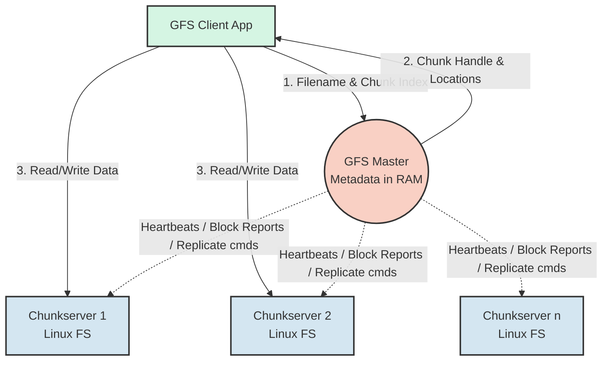
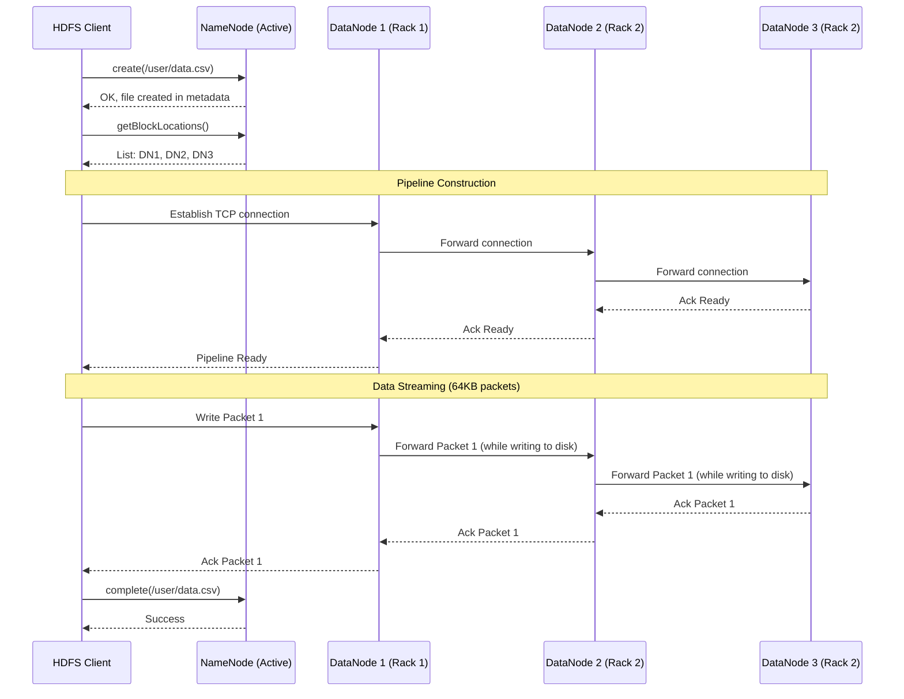
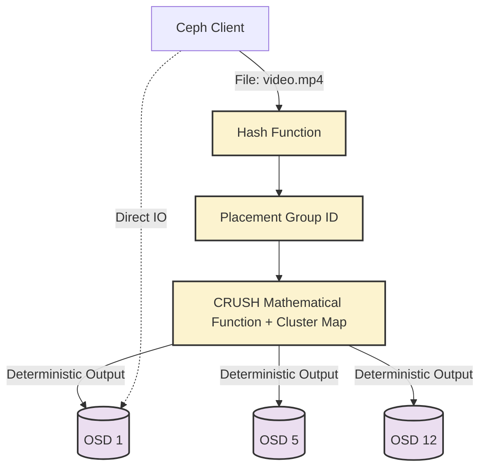
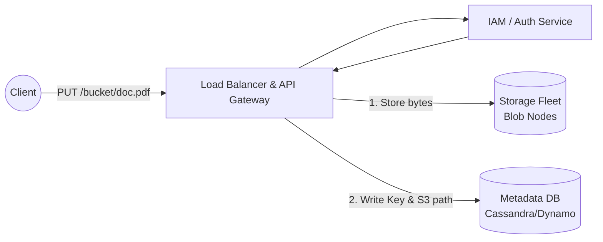

# Chapter 14: Distributed File Systems

## 1. Why This Matters

In the early days of computing, scaling storage was a matter of buying a bigger, more expensive hard drive (scale-up or vertical scaling). However, as the Internet exploded in the late 1990s and early 2000s, companies like Google and Yahoo realized that vertical scaling was a dead end. The sheer volume of web pages, logs, and user data outpaced the physical limitations and financial viability of single-machine storage architectures. 

Distributed File Systems (DFS) were born out of a fundamental paradigm shift: **instead of buying one million-dollar supercomputer with an ultra-reliable disk array (SAN/NAS), buy a thousand one-thousand-dollar commodity computers with cheap, failure-prone disks, and use software to make the entire cluster look like a single, massive, highly reliable file system.**

This matters profoundly because virtually every modern distributed data system—from databases (Cassandra, HBase) to Big Data processing engines (Hadoop MapReduce, Apache Spark) to AI/ML model training pipelines—relies on a distributed storage layer. If you cannot store petabytes of data reliably, you cannot process petabytes of data.

Furthermore, DFS architectures force engineers to confront the harsh realities of distributed systems:
- **Hardware fails constantly:** In a cluster of 10,000 machines, disk crashes, network switches failing, and power outages are not edge cases; they are daily occurrences.
- **Network bandwidth is finite:** Moving data to compute is expensive. DFS designs prioritize moving compute to the data (data locality).
- **Throughput over Latency:** While a local SSD can fetch a 4KB file in microseconds, a DFS might take milliseconds. But a DFS can deliver gigabytes per second of sustained sequential read throughput across thousands of parallel clients, which is exactly what analytics and AI workloads demand.

Understanding Distributed File Systems is the foundation for understanding everything else in the data engineering and large-scale backend infrastructure space. 

---

## 2. Beginner Intuition

Imagine you are managing a **massive municipal library** containing millions of books. 

If you try to put all the books into a single, giant building, you run into problems: the foundation might crack under the weight, the doors will get jammed with thousands of people trying to enter at once, and if the building catches fire, you lose all human knowledge. This is a single physical hard drive.

To solve this, you decide to rent **hundreds of smaller, cheap warehouses** spread across the city. 
- The warehouses are the **Data Nodes (or Chunkservers)**. Their only job is to store boxes of books on shelves. 
- To prevent data loss when a warehouse floods, you make a rule: every box of books must be copied and stored in at least **three different warehouses**. This is **Replication**.
- However, if people just walk into random warehouses, they will never find the book they want. So, you build a small, highly organized **Central Catalog Office**. 
- This office is the **Master Node (or NameNode)**. It doesn't store the actual books; it only stores a ledger (metadata) that says: *"The Harry Potter series is in Box #452. Box #452 is located in Warehouse A, Warehouse D, and Warehouse F."*

When a user wants to read a book, they:
1. Call the Central Catalog Office to ask where the box is.
2. The Catalog Office tells them the locations.
3. The user hangs up and drives *directly* to the nearest warehouse to get the books.

By separating the **metadata** (the catalog) from the **actual data** (the warehouses), and by ensuring everything is replicated, you have built a system that can scale infinitely simply by renting more warehouses, and can survive multiple warehouses burning down simultaneously.

---

## 3. Core Theory

Before diving into specific systems, we must establish the theoretical primitives that govern distributed file systems.

### 3.1 POSIX vs. Relaxed Semantics
Traditional file systems (ext4, NTFS) adhere strictly to POSIX semantics. POSIX guarantees strong consistency: if Client A writes a byte to a file, Client B will instantly see that byte upon reading. POSIX supports random writes, file locking, and directory hard links. 
In a distributed environment, providing strict POSIX semantics across thousands of nodes introduces massive locking overhead and latency. Therefore, modern DFS (like GFS and HDFS) **relax POSIX semantics**. They typically optimize for:
- **WORM (Write Once, Read Many):** Files are created, written sequentially, and then closed. They are rarely or never modified, only read.
- **Appends:** If modifications are allowed, they are usually restricted to appending data to the end of a file, rather than overwriting data in the middle.

### 3.2 Blocks and Chunks
A typical OS file system manages data in small blocks (e.g., 4KB). In a DFS, managing petabytes of data in 4KB blocks would require an impossibly large metadata catalog. Thus, a DFS divides files into massive chunks (e.g., 64MB in GFS, 128MB or 256MB in HDFS). 
- A 1GB file in HDFS (with 128MB blocks) is split into 8 blocks. 
- These blocks are stored as regular, individual files on the local Linux file system of the worker nodes.

### 3.3 Replication vs. Erasure Coding
To achieve fault tolerance, a DFS must store redundant data.
- **Replication:** The simplest method. A Replication Factor (RF) of 3 means 3 exact copies of a block exist. This has a 200% storage overhead.
- **Erasure Coding (EC):** An advanced mathematical technique (like Reed-Solomon). Data is split into $k$ data fragments and $m$ parity fragments. For example, RS(6,3) means 6 chunks of data generate 3 chunks of parity. You can lose *any* 3 chunks and still recover the original data. The storage overhead is only 50% ($3/6$), but it requires heavy CPU computation to reconstruct lost data and increases network traffic during recovery.

### 3.4 Consistency Models in Storage
- **Strong Consistency:** A read always returns the latest written data.
- **Eventual Consistency:** A read might return stale data, but eventually, all replicas will converge. Object stores (like early Amazon S3) heavily utilized eventual consistency for high availability. 

### 3.5 The CAP Theorem Implication
DFS architectures generally prioritize **C**onsistency and **P**artition Tolerance over strict **A**vailability. If the central metadata node goes down, the file system becomes temporarily unavailable rather than allowing split-brain writes that would corrupt the global namespace.

---

## 4. Architecture Deep Dive

### 4.1 Google File System (GFS)
Published in a seminal 2003 paper, GFS was designed for Google's specific workloads: massive web crawls and index generation.

#### Architecture Components
- **Single Master:** Maintains all file system metadata. This includes the namespace (directory tree), access control information, mapping of files to chunks, and current locations of chunks. The Master holds this entirely in memory for fast access.
- **Chunkservers:** Commodity Linux machines running a GFS daemon. They store chunks as standard local Linux files and read/write them specified by chunk handles and byte ranges.
- **Clients:** GFS library linked into applications. They communicate with the Master for metadata, but read/write data directly to/from Chunkservers.

#### The 64MB Chunk Size Decision
GFS chose an unusually large chunk size of 64MB. 
**Advantages:**
1. **Reduces Master Load:** Clients interact with the Master less frequently. A single request gives the location for 64MB of data.
2. **Network Efficiency:** Clients can keep persistent TCP connections to Chunkservers to read large amounts of data.
3. **Metadata Size:** The Master needs less than 64 bytes of metadata per 64MB chunk, allowing petabytes of file metadata to fit into gigabytes of RAM.

**Disadvantages (The Small Files Problem):**
If a file is 1MB, it still consumes a chunk (though logically it only takes 1MB on disk, not 64MB). If thousands of clients simultaneously access a small file (like an executable), the single Chunkserver holding it becomes a bottleneck. Google mitigated this by using higher replication factors for hot executables and staggering client start times.

#### Replication Strategy
By default, GFS replicates chunks 3 times. The Master places replicas across different server racks. If a rack's switch fails, the data remains available on another rack. 

#### Relaxed Consistency Model
GFS consistency is complex:
- **Defined:** All replicas are identical, and the client knows exactly what was written.
- **Consistent but Undefined:** All replicas are identical, but multiple clients wrote concurrently, resulting in interleaved data (a mix of fragments).
- **Inconsistent:** Replicas differ.

GFS relies on a **Primary Replica** to serialize mutations. The Master grants a "chunk lease" to one replica, making it the primary. The primary dictates the order of operations, and secondary replicas must follow that exact order.

#### Record Append Operations
Google built GFS primarily for MapReduce, where hundreds of workers might append logs to a single file simultaneously. GFS introduced **Atomic Record Append**. 
Instead of the client specifying the offset to write at, the client just says "append this data". GFS guarantees the data is written atomically **at least once** as a contiguous sequence of bytes. 
Because of the "at least once" guarantee, concurrent appends might result in duplicates or padding bytes. Applications using GFS were written to handle this by inserting checksums and unique identifiers in their records to filter out duplicates.

#### Master Failure Handling
The single Master is a vulnerability. 
- **Operation Log:** Every metadata change is written to an operation log, which is synchronously replicated to remote machines. 
- **Checkpoints:** To prevent the log from growing infinitely, the Master creates B-tree checkpoints of its state.
- **Shadow Masters:** If the primary Master dies, external monitoring systems promote a shadow master. Shadow masters continuously read the operation log to stay up-to-date and provide read-only access even while the primary is down.

### 4.2 Hadoop Distributed File System (HDFS)
HDFS is an open-source clone of GFS, created by Doug Cutting at Yahoo. It forms the backbone of the Hadoop ecosystem.

#### Architecture Components
- **NameNode (The Master):** Stores the namespace tree, the `FsImage` (checkpoint of metadata), and the `EditLog` (operation log).
- **DataNode (The Chunkserver):** Stores actual blocks (default 128MB or 256MB). Sends periodic Heartbeats and BlockReports to the NameNode.

#### Block Replication and Rack Awareness
When an HDFS client writes a file, the NameNode allocates blocks and dictates a **Rack-Aware Placement Policy**:
1. **Replica 1:** Placed on the same node as the writer (or a random node if the writer is outside the cluster).
2. **Replica 2:** Placed on a different, remote rack.
3. **Replica 3:** Placed on the *same* remote rack as Replica 2, but on a different node.
This brilliant policy minimizes cross-rack network traffic during writes (only one cross-rack hop) while still protecting against a total rack switch failure.

#### Detailed Data Flow (Reads and Writes)
**HDFS Read Flow:**
1. Client calls `open()` on `FileSystem`.
2. RPC to NameNode to get the block locations for the first few blocks. NameNode returns DataNodes sorted by proximity to the client.
3. Client calls `read()`, connecting to the closest DataNode. Data streams directly from DataNode to Client.
4. When the block ends, the client closes the connection and connects to the best DataNode for the next block.

**HDFS Write Pipeline Flow:**
1. Client calls `create()`. NameNode checks permissions and ensures the file doesn't exist.
2. Client writes data to an internal queue.
3. Client requests a block allocation. NameNode returns a list of 3 DataNodes.
4. The client forms a **pipeline**: Client $\rightarrow$ DN1 $\rightarrow$ DN2 $\rightarrow$ DN3.
5. Data is pushed in small packets (e.g., 64KB). Client pushes to DN1; DN1 writes to its disk and forwards to DN2; DN2 writes and forwards to DN3.
6. Acknowledgments flow backwards (DN3 $\rightarrow$ DN2 $\rightarrow$ DN1 $\rightarrow$ Client).
7. If a DataNode fails during the write, the pipeline is torn down, the failed node is removed, and the block is committed to the remaining nodes. The NameNode will asynchronously replicate the block to a new 3rd node later.

#### HDFS Federation and High Availability (HA)
- **Federation:** Because the NameNode keeps all metadata in RAM, it becomes a bottleneck around 100-200 million files. Federation allows multiple active NameNodes. For example, `NameNode A` manages `/user`, while `NameNode B` manages `/logs`. They share the same underlying pool of DataNodes.
- **HA NameNode:** Solves the single-point-of-failure problem. An Active NameNode and a Standby NameNode. The Active writes edits to a cluster of **JournalNodes** (quorum-based). The Standby constantly reads from JournalNodes to stay strictly synchronized. ZooKeeper and a ZKFailoverController (ZKFC) monitor the nodes and automatically trigger failover if the Active dies.

### 4.3 Ceph
While GFS and HDFS are optimized for massive sequential files, **Ceph** aims to be the unified "everything" storage system: Object, Block, and File, all in one cluster.

#### The CRUSH Algorithm
The most revolutionary aspect of Ceph is that **it has no central metadata server for data placement.** 
In HDFS, you must ask the NameNode where a block is. In Ceph, clients use the **CRUSH (Controlled Replication Under Scalable Hashing)** algorithm.
Given a file name and a cluster topology map, the client runs a deterministic mathematical function to calculate exactly which OSD (Object Storage Daemon / worker node) holds the data. 
Because calculation replaces lookups, Ceph eliminates the central metadata bottleneck completely.

#### Storage Abstractions
1. **RADOS (Reliable Autonomic Distributed Object Store):** The foundational layer. Everything in Ceph is ultimately an object stored in RADOS.
2. **RBD (RADOS Block Device):** Strips block device commands (like a virtual hard drive for VMs) and stores the blocks as objects in RADOS. Crucial for OpenStack and Kubernetes persistent volumes.
3. **CephFS:** A POSIX-compliant distributed file system built on top of RADOS. It uses a separate Metadata Server (MDS) cluster purely to handle directory trees and POSIX permissions, while data flows directly via CRUSH to OSDs.
4. **RGW (RADOS Gateway):** Provides S3-compatible REST object storage APIs.

#### Self-Healing and Peering
Ceph OSDs constantly heartbeat each other. If an OSD crashes, the cluster map is updated. The CRUSH algorithm inherently knows that data previously mapped to the dead node must now map to other surviving nodes. The surviving OSDs autonomously communicate (peering) and begin transferring data (backfilling) to restore the replication factor, completely transparent to the client.

### 4.4 Object Storage (S3, GCS, Azure Blob)
The cloud revolution brought Object Storage to the forefront. Unlike POSIX file systems, Object Storage features a **Flat Namespace**.

#### Architecture
There are no directories. `/images/2026/photo.jpg` is not a file inside a folder inside a folder. The entire string is simply a unique **Key**.
- **Data Model:** An object consists of Data (the file), Metadata (key-value pairs), and a globally unique Key.
- **RESTful Interface:** Accessed purely via HTTP verbs (PUT, GET, DELETE, HEAD). 

#### Consistency Models
Originally, systems like Amazon S3 offered **Eventual Consistency** to maximize availability across global data centers. If you wrote a new object and immediately read it, you might get a 404 Not Found. 
However, due to massive engineering efforts, modern S3 now provides **Strong Read-After-Write Consistency** for both new objects and overwrites, using complex consensus protocols behind the API gateway.

#### Tiered Storage
Because objects are self-contained and immutable, they are perfectly suited for lifecycle policies. Object stores automatically migrate cold data:
- **Hot/Standard:** Fast SSDs/HDDs, immediate access.
- **Infrequent Access (IA):** Cheaper storage, higher retrieval costs.
- **Archive (Glacier):** Tape drives or spun-down disks. Retrieval takes minutes to hours, but storage is pennies per terabyte.

---

## 5. Visual Diagrams

### 5.1 GFS Architecture


### 5.2 HDFS Write Pipeline Flow


### 5.3 Ceph CRUSH Data Placement


### 5.4 Object Storage Architecture (e.g., S3)


---

## 6. Real Production Examples

### 6.1 Google Colossus (The GFS Successor)
By 2010, the single-master design of GFS hit its absolute limits. A single machine could no longer hold the metadata for Google's ever-growing clusters. Google engineered **Colossus**.
- **Distributed Metadata:** Instead of a single RAM-based Master, Colossus stores its metadata in **Bigtable** (Google's NoSQL distributed database). This allows metadata to scale infinitely.
- **Smaller Chunks & Erasure Coding:** Because metadata scaling is no longer a bottleneck, Colossus supports chunk sizes as small as 1MB. It aggressively utilizes Reed-Solomon Erasure Coding rather than 3x replication, saving Google billions of dollars in hard drive costs.

### 6.2 Facebook's f4 (Warm Storage)
Facebook generates petabytes of photos and videos daily. They realized that data has temperature: new photos are "hot" (read constantly), but after 3 months, they become "warm" or "cold" (rarely read, but must never be deleted).
- **Haystack:** Facebook's system for Hot data.
- **f4:** Built specifically for Warm data. It assumes objects are immutable. It uses extremely dense storage racks with low-power CPUs. It uses a highly optimized Erasure Coding scheme (10 data blocks + 4 parity blocks) reducing replication overhead to just 1.4x (compared to 3.0x), completely revolutionizing cost-efficiency for social media scale.

### 6.3 LinkedIn Ambry
LinkedIn required a system optimized for storing billions of small media files (profile pictures, resumes, PDFs) with extremely low latency. HDFS was too slow, and commercial SANs were too expensive.
- **Ambry:** An open-source distributed object store designed by LinkedIn. It excels at **small object storage**. Instead of managing files individually, Ambry batches millions of small objects into large, append-only segment files. It uses aggressive memory mapping and zero-copy network I/O, delivering near-disk-speed reads over the network.

---

## 7. Java Implementations

Let's look at how these systems are implemented and interacted with in the real world using production-grade Java.

### 7.1 HDFS Client Read/Write Operations
When interacting with HDFS, you use the `org.apache.hadoop.fs.FileSystem` API. This abstracts away the complex NameNode RPCs and DataNode pipelines.

```java
import org.apache.hadoop.conf.Configuration;
import org.apache.hadoop.fs.FSDataInputStream;
import org.apache.hadoop.fs.FSDataOutputStream;
import org.apache.hadoop.fs.FileSystem;
import org.apache.hadoop.fs.Path;
import java.io.IOException;
import java.nio.charset.StandardCharsets;

public class HdfsClientService {
    private FileSystem fs;

    public HdfsClientService(String hdfsUri) throws IOException {
        Configuration conf = new Configuration();
        // Point the client to the NameNode URI
        conf.set("fs.defaultFS", hdfsUri);
        // Optimize for large sequential reads
        conf.setInt("io.file.buffer.size", 131072); 
        this.fs = FileSystem.get(conf);
    }

    /**
     * Writes a file to HDFS, handling the underlying pipeline abstraction automatically.
     */
    public void writeFile(String targetPath, String content) throws IOException {
        Path path = new Path(targetPath);
        
        // overwrite=true. Note: HDFS does not support random writes, only create/append.
        try (FSDataOutputStream out = fs.create(path, true)) {
            byte[] bytes = content.getBytes(StandardCharsets.UTF_8);
            out.write(bytes);
            // hsync() forces buffers to be flushed to DataNode disks (durability guarantee)
            out.hsync(); 
            System.out.println("File written successfully to HDFS: " + path);
        }
    }

    /**
     * Reads a file. HDFS attempts to read from the closest replica automatically.
     */
    public String readFile(String sourcePath) throws IOException {
        Path path = new Path(sourcePath);
        if (!fs.exists(path)) {
            throw new RuntimeException("File not found: " + sourcePath);
        }

        StringBuilder result = new StringBuilder();
        byte[] buffer = new byte[4096];
        int bytesRead;

        try (FSDataInputStream in = fs.open(path)) {
            while ((bytesRead = in.read(buffer)) > 0) {
                result.append(new String(buffer, 0, bytesRead, StandardCharsets.UTF_8));
            }
        }
        return result.toString();
    }
    
    public void close() throws IOException {
        if (fs != null) fs.close();
    }
}
```

### 7.2 Simple Distributed File System Chunk Server (Spring Boot)
To understand a DataNode/Chunkserver, here is a simplified implementation in Java. It receives a chunk over HTTP and saves it to local disk, computing a checksum.

```java
import org.springframework.boot.SpringApplication;
import org.springframework.boot.autoconfigure.SpringBootApplication;
import org.springframework.web.bind.annotation.*;
import org.springframework.http.ResponseEntity;
import org.springframework.http.HttpStatus;
import java.io.*;
import java.nio.file.*;
import java.security.MessageDigest;

@SpringBootApplication
@RestController
@RequestMapping("/api/chunk")
public class ChunkServerApplication {

    private static final String STORAGE_DIR = "/var/dfs/data/";

    public static void main(String[] args) {
        new File(STORAGE_DIR).mkdirs(); // Ensure data directory exists
        SpringApplication.run(ChunkServerApplication.class, args);
    }

    /**
     * Endpoint to receive a chunk from a client or coordinator.
     */
    @PostMapping("/{chunkId}")
    public ResponseEntity<String> storeChunk(
            @PathVariable String chunkId, 
            @RequestBody byte[] data) {
        
        try {
            Path path = Paths.get(STORAGE_DIR, chunkId);
            
            // 1. Write the raw data
            Files.write(path, data, StandardOpenOption.CREATE, StandardOpenOption.TRUNCATE_EXISTING);
            
            // 2. Compute checksum for data integrity (Silent Corruption protection)
            MessageDigest digest = MessageDigest.getInstance("SHA-256");
            byte[] hash = digest.digest(data);
            String checksum = bytesToHex(hash);
            
            // 3. Store checksum metadata alongside the chunk
            Files.writeString(Paths.get(STORAGE_DIR, chunkId + ".meta"), checksum);
            
            return ResponseEntity.ok("Chunk stored successfully. Checksum: " + checksum);
            
        } catch (Exception e) {
            return ResponseEntity.status(HttpStatus.INTERNAL_SERVER_ERROR)
                                 .body("Failed to store chunk: " + e.getMessage());
        }
    }

    // Helper for checksum formatting
    private String bytesToHex(byte[] bytes) {
        StringBuilder sb = new StringBuilder();
        for (byte b : bytes) {
            sb.append(String.format("%02x", b));
        }
        return sb.toString();
    }
}
```

### 7.3 File Upload with Replication Coordinator
This shows how a Master node or Client might coordinate writing a single chunk to 3 different nodes concurrently to achieve Replication Factor 3.

```java
import java.util.concurrent.*;
import java.util.List;
import java.net.http.*;
import java.net.URI;
import java.time.Duration;

public class ReplicationCoordinator {
    
    private final HttpClient httpClient;
    // Thread pool to handle parallel uploads
    private final ExecutorService executor = Executors.newFixedThreadPool(10);

    public ReplicationCoordinator() {
        this.httpClient = HttpClient.newBuilder()
                .connectTimeout(Duration.ofSeconds(5))
                .build();
    }

    /**
     * Replicates a chunk to a list of target DataNodes concurrently.
     * Returns true only if a quorum (majority) of nodes successfully write the data.
     */
    public boolean replicateChunk(String chunkId, byte[] data, List<String> dataNodeUrls) {
        CountDownLatch latch = new CountDownLatch(dataNodeUrls.size());
        ConcurrentLinkedQueue<Boolean> results = new ConcurrentLinkedQueue<>();

        for (String url : dataNodeUrls) {
            executor.submit(() -> {
                try {
                    HttpRequest request = HttpRequest.newBuilder()
                            .uri(URI.create(url + "/api/chunk/" + chunkId))
                            .header("Content-Type", "application/octet-stream")
                            .POST(HttpRequest.BodyPublishers.ofByteArray(data))
                            .build();

                    HttpResponse<String> response = httpClient.send(request, HttpResponse.BodyHandlers.ofString());
                    
                    if (response.statusCode() == 200) {
                        results.add(true);
                    } else {
                        System.err.println("Node " + url + " failed: " + response.body());
                        results.add(false);
                    }
                } catch (Exception e) {
                    System.err.println("Network error to node " + url + ": " + e.getMessage());
                    results.add(false);
                } finally {
                    latch.countDown();
                }
            });
        }

        try {
            // Wait up to 10 seconds for all replications to finish
            latch.await(10, TimeUnit.SECONDS);
        } catch (InterruptedException e) {
            Thread.currentThread().interrupt();
        }

        // Check if we achieved quorum
        long successCount = results.stream().filter(r -> r).count();
        int requiredQuorum = (dataNodeUrls.size() / 2) + 1;
        
        System.out.println("Replication success: " + successCount + "/" + dataNodeUrls.size());
        return successCount >= requiredQuorum;
    }
}
```

---

## 8. Performance Analysis

When analyzing the performance of Distributed File Systems, the rules of single-machine systems are inverted.

### 8.1 Throughput vs. Latency
DFS architectures happily sacrifice microsecond latency to achieve terabytes-per-second throughput. 
If a data scientist queries a 10TB dataset, saving 5 milliseconds on a file open operation is irrelevant. What matters is the ability of 500 DataNodes to stream data into 500 Spark executor nodes simultaneously via parallel TCP connections. DFS architectures use large buffers, pipeline writes, and read-ahead caching to maximize network interface saturation.

### 8.2 The Metadata Bottleneck
In HDFS, the NameNode holds the entire `FsImage` in JVM Heap Space. Each file, directory, and block object takes roughly 150 bytes of RAM. 
If you have 100 million files, the NameNode requires ~15GB of RAM just for metadata. If you have 1 billion files, you need 150GB of RAM, and JVM Garbage Collection pauses become catastrophic. A 10-second "Stop The World" GC pause on the NameNode causes DataNodes to assume the NameNode is dead, triggering a massive, chaotic failover. This is why small files kill Hadoop.

### 8.3 Network Bisection Bandwidth
Data locality is performance. If a Spark node is running on Rack 1, but the data block is on Rack 4, the data must traverse the Top-of-Rack (ToR) switch and the core aggregation switches. If 1,000 nodes do this simultaneously, the core network becomes heavily oversubscribed and acts as the ultimate bottleneck. HDFS combats this by ensuring compute engines schedule tasks on the exact same physical node (or at least the same rack) where the data block resides.

---

## 9. Tradeoffs

Designing a storage layer requires choosing between strict constraints. 

| Feature | HDFS / GFS | Ceph | Cloud Object Storage (S3) |
| :--- | :--- | :--- | :--- |
| **Primary Abstraction** | Large Files, Append-Only | Block, Object, File (POSIX) | Objects / Blobs |
| **Metadata Architecture** | Centralized (NameNode) | Decentralized (CRUSH Map) | Distributed DB behind API |
| **Target Workload** | Big Data Analytics (Spark/Hadoop) | VM Storage (Kubernetes/OpenStack) | Web apps, Backups, Cloud-native |
| **Consistency** | Strong (File level) | Strong | Strong (Read-after-write) |
| **Complexity to Run** | Medium | Very High | Zero (Managed Service) |

**Replication vs. Erasure Coding Tradeoff:**
- *Replication* is fast to read, fast to recover, but highly expensive (200% storage waste).
- *Erasure Coding* is computationally expensive (CPU heavy), slow to recover (must fetch multiple network chunks to rebuild), but cheap (50% storage waste). Modern systems use Replication for "Hot" data and background-convert it to Erasure Coding when it becomes "Cold".

---

## 10. Failure Scenarios

A robust DFS is defined not by how it runs when healthy, but by how it survives chaos.

### 10.1 Network Partition & Split Brain
**Scenario:** The switch connecting Rack A (where Active NameNode lives) to Rack B (where Standby NameNode lives) fails. Both NameNodes think the other is dead. Both attempt to become Active.
**Resolution:** HDFS uses **Fencing**. The ZooKeeper failover controller detects the split. Before the Standby takes over, it executes a fencing script (e.g., SSHing into the Active's power supply and shutting it off, or revoking its write access to the shared JournalNodes). The rule is: *Shoot the other node in the head before taking the crown.*

### 10.2 DataNode Crash During Pipeline Write
**Scenario:** Client is writing Block 1 through pipeline DN1 $\rightarrow$ DN2 $\rightarrow$ DN3. DN2's power supply blows up halfway through the block.
**Resolution:** The pipeline halts immediately. DN1 detects DN2 is gone. The client contacts the NameNode, reports DN2 dead, and requests a new pipeline with just DN1 and DN3. The remaining data is appended. Later, the NameNode detects DN3 is missing a replica and schedules an async replication to a new node to restore RF=3.

### 10.3 Silent Data Corruption (Bit Rot)
**Scenario:** A magnetic disk flips a 0 to a 1 due to cosmic rays or hardware degradation. The OS doesn't notice.
**Resolution:** Checksums. When a client writes data, it also computes CRC32 checksums and sends them. The DataNode stores these checksums in a separate `.meta` file. When a client reads data, it verifies the checksums. Furthermore, DataNodes run a background thread (Block Scanner) that constantly reads its own disks, verifying checksums. If a block is rotten, the DataNode deletes it and asks the NameNode for a fresh replica.

---

## 11. Debugging & Observability

Operating a distributed file system requires specialized tooling:
- **FSCK (File System Check):** HDFS provides `hdfs fsck /`. This command scans the entire namespace, identifying under-replicated blocks, corrupt blocks, and missing replicas.
- **NameNode UI & JMX:** Operators rely heavily on JMX metrics exposed by the NameNode: RPC queue times, Heap Memory utilization, and the count of live vs. dead DataNodes.
- **Slow Node Detection:** In a 5,000 node cluster, a few nodes will have failing disks that don't crash, but respond with 500ms latency. These "slow nodes" drag down the entire MapReduce job. Observability pipelines must track 99th percentile I/O latency per DataNode to automatically blacklist dying hardware.

---

## 12. Interview Questions

**Q1 (Beginner): Why do distributed file systems use large block sizes like 128MB instead of 4KB?**
*Answer:* To minimize metadata size on the centralized master node (NameNode), allowing the system to scale to petabytes. It also reduces network overhead, as clients can stream large continuous chunks of data without constantly querying the master for new locations.

**Q2 (Intermediate): Walk me through what happens in HDFS when a client reads a file.**
*Answer:* 1) Client contacts NameNode with the file path. 2) NameNode verifies permissions and returns a list of blocks and the DataNodes holding replicas, sorted by network proximity. 3) Client closes NameNode connection and connects directly to the nearest DataNode. 4) Client streams the block. 5) Repeats for subsequent blocks.

**Q3 (Advanced): How does the Ceph CRUSH algorithm fundamentally differ from HDFS architecture?**
*Answer:* HDFS uses a centralized metadata server (NameNode) to track exact block locations. Ceph has no central lookup server for data placement. Instead, Ceph clients use the CRUSH hashing algorithm to deterministically calculate which Object Storage Daemon (OSD) holds the data, based on the file name and a cluster topology map. This eliminates the central bottleneck entirely.

**Q4 (FAANG System Design): You are designing a warm-storage Blob system for social media images (like Facebook f4). How do you reduce storage costs?**
*Answer:* 1) Abandon POSIX compliance; blobs are immutable. 2) Batch small images into massive multi-gigabyte segment files to reduce metadata overhead. 3) Move from 3x Replication to Erasure Coding (e.g., Reed-Solomon 10+4), dropping storage overhead from 200% to 40%. 4) Use high-density disk enclosures and low-power CPUs since I/O will be infrequent.

**Q5 (Advanced): What is "Fencing" and why is it critical in HA setups?**
*Answer:* Fencing prevents Split-Brain syndrome during network partitions, where two master nodes both think they are active and attempt to write conflicting metadata. Fencing actively isolates the failed primary—either by cutting its power (STONITH: Shoot The Other Node In The Head) or revoking its network access—before the standby safely assumes control.

---

## 13. Exercises

1. **Conceptual Design:** Calculate the raw storage needed to store 10 Petabytes of logical data using HDFS with 3x replication, vs an Object Store using Reed-Solomon (6,3) Erasure coding. (Answer: HDFS = 30 PB. RS = 15 PB).
2. **Coding (Java):** Using the Java `Files` and `MessageDigest` APIs, write a small utility that takes a local 1GB file, splits it into 128MB chunks, computes the SHA-256 for each chunk, and saves them to a simulated `/tmp/dfs/` directory.
3. **System Design:** Sketch out a distributed object storage architecture. Include the Load Balancer, the API Gateway handling Auth, the Metadata Database mapping Keys to physical storage, and the background garbage collection process for deleted objects.

---

## 14. Expert Insights

**The Small Files Problem will haunt you.** 
In the enterprise, users love dumping millions of 10KB JSON files into HDFS. This exhausts the NameNode's RAM rapidly. Experts combat this using Hadoop Archives (HAR) to pack small files together, or by shifting the workload to Object Storage (S3), which handles billions of small files much better due to distributed NoSQL metadata layers.

**Cloud Object Storage is eating the world.**
While HDFS revolutionized the 2010s, maintaining physical disks, tuning JVMs, and upgrading NameNodes requires highly paid operational teams. Today, the industry standard is decoupling compute from storage. Companies spin up ephemeral Spark clusters that read directly from Amazon S3 or Google Cloud Storage, process the data, write results back to S3, and terminate the cluster. 

**Watch out for Thundering Herds.**
When a network switch bounces, 100 DataNodes might reconnect to the NameNode at the exact same millisecond, sending massive Block Reports. This can overwhelm the NameNode's RPC queue, causing it to crash. Enterprise tuning requires randomizing heartbeat intervals and utilizing backoff mechanisms.

---

## 15. Chapter Summary

- **Distributed File Systems (DFS)** allow thousands of commodity machines to act as a single, fault-tolerant storage volume, prioritizing throughput and data locality over low latency.
- **Google File System (GFS)** pioneered the architecture of a centralized Master storing metadata in RAM, and Chunkservers storing massive 64MB blocks to reduce metadata size and network overhead.
- **HDFS** brought GFS to the open-source world, introducing robust pipeline writes, Rack-Aware replica placement, and High Availability NameNodes to solve the single-point-of-failure.
- **Ceph** revolutionized placement by using the **CRUSH algorithm**, replacing centralized lookup tables with decentralized hash calculations, supporting Object, Block, and File storage simultaneously.
- **Object Storage (S3)** dominates modern cloud architectures due to its massive scalability, flat namespace, RESTful APIs, and built-in tiered storage lifecycles.
- Storage systems must aggressively balance **Cost vs. Reliability**, utilizing 3x Replication for hot data and CPU-intensive Erasure Coding for warm/cold data to save petabytes of disk space.
- Handling failures—from silent bit rot to catastrophic split-brain scenarios—requires checksums, fencing, and operation log checkpoints to guarantee data integrity.
