# Chapter 15: Stream Processing Systems

---

## 1. Why This Matters

Every second, the digital world generates an unfathomable amount of data. A single Uber ride produces hundreds of events — GPS pings, fare calculations, driver matching signals, ETAs, route updates. Netflix processes billions of events per day to decide which thumbnail to show you. LinkedIn's Kafka cluster handles over 7 trillion messages per day. Spotify tracks every song play, skip, and pause to power real-time recommendations.

**Stream processing is the backbone of the modern real-time internet.**

Consider what happens when you swipe your credit card:

1. The payment gateway must authorize the transaction in real time
2. A fraud detection system must score the transaction instantly
3. Your bank balance must update
4. A notification must be pushed to your phone
5. Merchant analytics must be updated
6. Regulatory compliance systems must log the transaction

All of this must happen in milliseconds, continuously, 24/7, across distributed systems spanning multiple data centers. This is stream processing.

### Why Should You Care?

| Concern | Why It Matters |
|---------|---------------|
| **System Design Interviews** | Stream processing is one of the most frequently tested topics at FAANG companies. "Design a real-time notification system," "Design a fraud detection pipeline," "Design a real-time leaderboard" — all require deep knowledge of stream processing |
| **Modern Architecture** | Every major tech company has moved from batch-first to stream-first architectures. Understanding this paradigm shift is essential |
| **Career Growth** | Engineers who understand Kafka, Flink, and real-time data pipelines are among the most sought-after in the industry |
| **Production Reliability** | Misunderstanding stream processing semantics (at-least-once vs exactly-once) has caused real-world financial losses and data corruption |
| **Data Engineering** | The boundary between backend engineering and data engineering is blurring. Stream processing sits right at that intersection |

### The Paradigm Shift

Traditional systems were built around request-response: a user makes a request, the server processes it, returns a response. But the world doesn't work that way. Events happen continuously. Sensors report. Users interact. Systems change state. The question isn't whether to process these events — it's whether you process them in real time or in delayed batches.

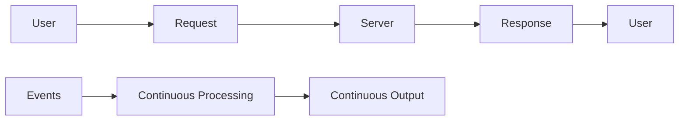

This chapter will take you from understanding why batch processing isn't enough, through the internals of Apache Kafka (the de facto standard for event streaming), to advanced stream processing frameworks like Apache Flink, and finally to the production realities of running stream processing at scale.

---

## 2. Beginner Intuition

### The Newspaper vs. Twitter Analogy

Imagine two ways of getting news:

**Batch Processing = The Morning Newspaper**
- A team of journalists collects news throughout the day
- At midnight, they compile everything into tomorrow's newspaper
- You read it the next morning
- The news is always at least hours old
- If something critical happens at 11 PM, you won't know until the next morning

**Stream Processing = Twitter/X Feed**
- Events are reported as they happen
- You see them in real time
- You can react immediately
- No waiting for the "next batch"

### The Assembly Line Analogy

Think of a car factory:

**Batch Processing:**
1. Collect 1,000 car frames
2. Paint all 1,000
3. Install engines in all 1,000
4. Install wheels in all 1,000
5. Output: 1,000 completed cars (after a long wait)

**Stream Processing:**
1. Each car frame enters the assembly line
2. It gets painted immediately
3. Engine installed immediately
4. Wheels installed immediately
5. Output: Each car rolls off the line one by one, continuously

The assembly line (stream processing) has much lower **latency** for each individual car, even though the overall **throughput** might be similar.

### The Water System Analogy for Kafka

Think of Apache Kafka like a city's water distribution system:

- **Producers** are the water sources (rivers, treatment plants)
- **Topics** are the main water pipelines (one for drinking water, one for irrigation, one for industrial use)
- **Partitions** are the individual pipes within each pipeline (allowing parallel flow)
- **Brokers** are the pumping stations that store and forward water
- **Consumers** are the buildings, homes, and factories that use the water
- **Consumer Groups** are neighborhoods — each neighborhood gets a copy of the water, but within a neighborhood, each building gets its own portion (no duplication)
- **Offsets** are the water meters — they track exactly how much water each consumer has used

The beauty of this system is that the water (data) keeps flowing regardless of whether any individual consumer is actively drinking. If a consumer goes offline and comes back, they can check their water meter (offset) and resume from where they left off.

### Key Concepts in Plain English

| Concept | Plain English |
|---------|--------------|
| **Event** | Something that happened. "User clicked buy button at 3:42 PM" |
| **Stream** | An unbounded, continuously arriving sequence of events |
| **Producer** | The thing that generates events |
| **Consumer** | The thing that processes events |
| **Broker** | The middleman that stores and delivers events |
| **Topic** | A category or channel for events |
| **Partition** | A way to split a topic for parallelism |
| **Offset** | A bookmark — "I've read up to event #42" |
| **Consumer Group** | A team of consumers sharing the work |
| **Exactly-once** | Every event is processed exactly one time — no duplicates, no losses |

---

## 3. Core Theory

### 3.1 Batch vs. Stream Processing: A Fundamental Distinction

#### Batch Processing

Batch processing systems process a **bounded** dataset — a dataset with a known beginning and end. Think: "Process all of yesterday's log files."

**Characteristics:**
- **Input**: Finite, bounded dataset (files, database dumps)
- **Processing**: High throughput, high latency
- **Output**: Produced after entire input is consumed
- **Scheduling**: Typically periodic (hourly, daily, weekly)
- **Fault tolerance**: Restart from the beginning or from checkpoints
- **Examples**: MapReduce, Spark batch, Hive, traditional ETL

**The MapReduce Model:**
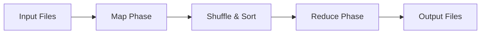

MapReduce revolutionized big data processing but had fundamental limitations:
1. **High latency**: Results available only after the entire job completes
2. **Repeated full scans**: Each job reads the entire dataset
3. **Multi-stage complexity**: Complex pipelines require chaining multiple jobs
4. **No incremental updates**: Can't process "just the new data"

#### Stream Processing

Stream processing systems process an **unbounded** dataset — data that has a beginning but no defined end. Think: "Process every click event as it arrives, forever."

**Characteristics:**
- **Input**: Infinite, unbounded stream of events
- **Processing**: Low latency, event-at-a-time or micro-batch
- **Output**: Produced continuously
- **Scheduling**: Always running
- **Fault tolerance**: Checkpointing, replay from offsets
- **Examples**: Kafka Streams, Flink, Spark Structured Streaming, Storm

#### The Spectrum: It's Not Binary

In practice, batch and stream processing exist on a spectrum:

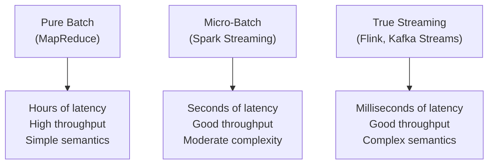

**Micro-batching** (used by Spark Streaming) is a hybrid: it collects events into small batches (e.g., every 100ms–2s) and processes each batch. This provides near-real-time latency with batch-like simplicity.

**True streaming** (used by Flink, Kafka Streams) processes each event individually as it arrives, providing the lowest possible latency but requiring more sophisticated state management and fault tolerance.

#### The Lambda Architecture

Jay Kreps (co-creator of Kafka) described the **Lambda Architecture** as a pattern where you run both batch and stream processing in parallel:

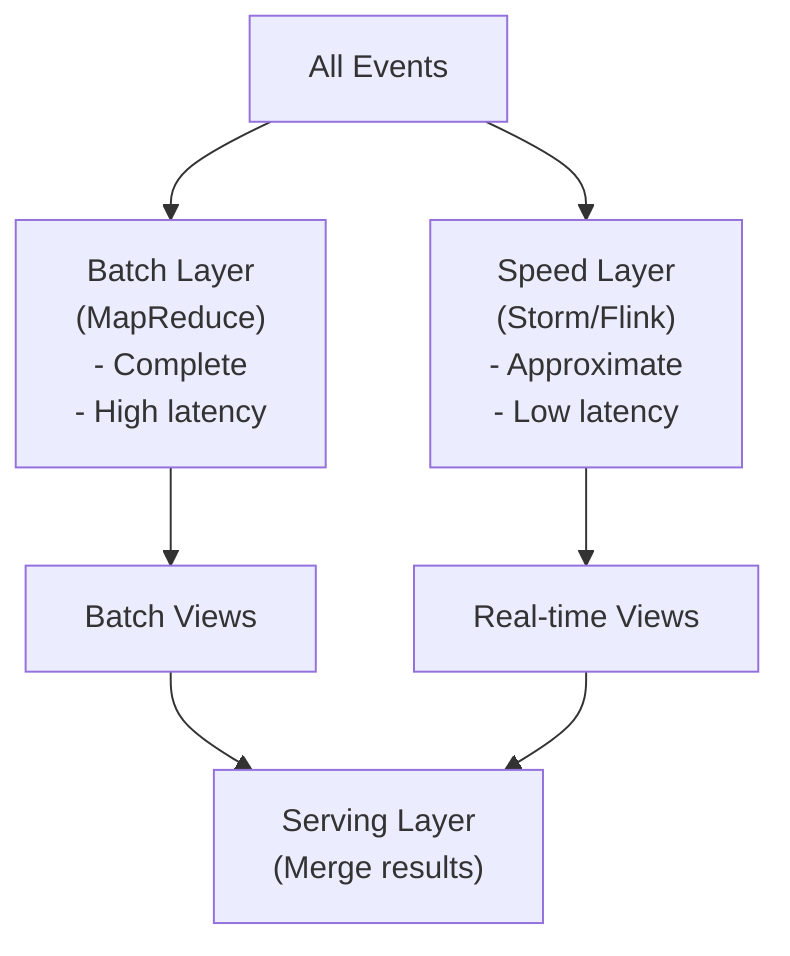

**Problems with Lambda Architecture:**
1. You maintain two separate codebases (batch + streaming)
2. Results must be merged, which is complex
3. Bug fixes must be applied in two places
4. Operational overhead is doubled

#### The Kappa Architecture

Jay Kreps proposed the **Kappa Architecture** as a simplification: use stream processing for everything. If you need to reprocess historical data, simply replay the event log from the beginning.

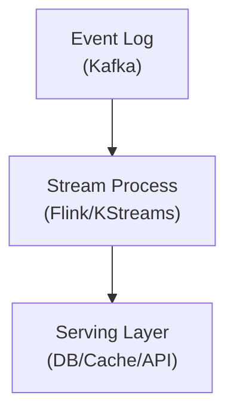

**Advantages:** One codebase, simpler operations, lower complexity.
**Disadvantages:** Reprocessing can be slow, stream processing must handle full historical volumes.

### 3.2 Event Streaming Fundamentals

#### What is an Event?

An event is an immutable record of something that happened at a particular point in time:

```json
{
  "event_id": "evt-a1b2c3",
  "event_type": "order.placed",
  "timestamp": "2024-01-15T14:30:00Z",
  "source": "checkout-service",
  "data": {
    "order_id": "ord-123",
    "user_id": "usr-456",
    "total": 99.99,
    "items": [
      {"sku": "SKU-789", "qty": 2, "price": 49.99}
    ]
  }
}
```

**Key properties of events:**
- **Immutable**: Events represent facts that happened. You can't change the past
- **Ordered**: Events have a temporal ordering (though distributed systems make global ordering hard)
- **Durable**: Events should be stored reliably so they can be replayed
- **Schema-ed**: Events should have a well-defined schema for evolution

#### Event Sourcing vs. Event Streaming

These are related but distinct concepts:

| Aspect | Event Sourcing | Event Streaming |
|--------|---------------|-----------------|
| **Purpose** | Application state management | Data integration and processing |
| **Scope** | Single service/aggregate | Cross-service/cross-system |
| **Storage** | Event store (append-only DB) | Event log (Kafka, Pulsar) |
| **Consumers** | The service itself | Any number of downstream systems |
| **Replay** | To rebuild application state | To reprocess data pipelines |

#### Message Queues vs. Event Streams

A critical distinction:

**Message Queue (RabbitMQ, SQS):**
- Messages are consumed and deleted
- Point-to-point delivery
- No replay capability
- Designed for task distribution

**Event Stream (Kafka, Pulsar):**
- Events are consumed but retained
- Pub/sub — multiple consumers can read the same events
- Full replay capability
- Designed for event sourcing and stream processing

### 3.3 Delivery Semantics

The most critical concept in stream processing is **delivery semantics**:

| Semantic | Description | Risk | Use Case |
|----------|-------------|------|----------|
| **At-most-once** | Events may be lost, never duplicated | Data loss | Metrics, logging (acceptable loss) |
| **At-least-once** | Events never lost, may be duplicated | Duplicates | Most systems (with deduplication) |
| **Exactly-once** | Events never lost, never duplicated | Complexity + cost | Financial transactions, billing |

**Why is exactly-once so hard?**

In a distributed system, a producer sends a message to a broker. The broker writes it and sends an acknowledgment. But what if the acknowledgment is lost? The producer doesn't know if the message was written or not. It has two choices:
1. **Resend** → At-least-once (possible duplicate)
2. **Don't resend** → At-most-once (possible loss)

Exactly-once requires additional mechanisms (idempotent writes, transactions, or deterministic processing) that add complexity and latency.

### 3.4 Time Semantics

Time in stream processing is surprisingly complex:

- **Event time**: When the event actually occurred (embedded in the event)
- **Ingestion time**: When the event entered the stream processing system
- **Processing time**: When the event is actually processed by the stream processor

**Why does this matter?**

Consider a mobile game that tracks high scores. A player achieves a high score at 3:00 PM (event time) but their phone is offline. The event arrives at the server at 5:00 PM (ingestion time) and is processed at 5:01 PM (processing time). If you're computing "highest score between 2 PM and 4 PM," you need event time, not processing time.

**Out-of-order events** are the norm in distributed systems. Network delays, retries, and buffering mean that events frequently arrive out of their original order:

```
Event Time:      1  2  3  4  5  6  7  8  9  10
Arrival Order:   1  3  2  5  4  7  6  8  10  9
```

This makes windowed aggregations (like "count events in the last 5 minutes") extremely challenging.

---

## 4. Architecture Deep Dive

### 4.1 Apache Kafka Architecture

Apache Kafka was originally developed at LinkedIn by Jay Kreps, Neha Narkhede, and Jun Rao in 2010. It was designed to solve LinkedIn's data pipeline problem: connecting hundreds of source systems to hundreds of destination systems, each with different data formats, protocols, and reliability requirements.

#### The Grand Architecture

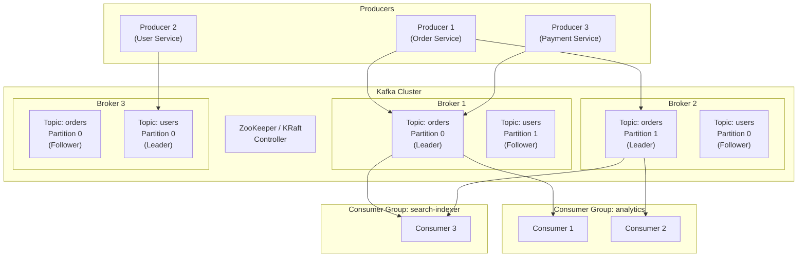

#### Core Components

**1. Brokers**

A Kafka broker is a single server in the Kafka cluster. Each broker:
- Stores a subset of topic partitions
- Handles produce and fetch requests
- Manages replication of partitions it leads
- Reports metrics and health to the controller

A typical production cluster has 3–100+ brokers, depending on throughput requirements.

**Key broker responsibilities:**
- **Storage**: Each partition is stored as a sequence of segment files on disk
- **Network**: Handles TCP connections from producers and consumers
- **Replication**: Replicates partition data to follower brokers
- **Leadership**: Acts as leader for some partitions, follower for others

**2. Topics**

A topic is a logical category for events. Think of it as a table in a database, but append-only. Topics are:
- **Named**: e.g., `orders`, `user-events`, `payment-transactions`
- **Configured**: Each topic has its own retention policy, replication factor, etc.
- **Partitioned**: Divided into one or more partitions for parallelism

**3. Partitions**

A partition is the fundamental unit of parallelism in Kafka. Each partition is:
- **Ordered**: Events within a partition are strictly ordered
- **Append-only**: New events are always added to the end
- **Immutable**: Once written, events cannot be modified
- **Assigned**: Each partition has exactly one leader broker and zero or more follower brokers

```
Topic: orders (3 partitions, replication factor 2)

Partition 0:  [0] [1] [2] [3] [4] [5] [6] [7] [8] →
              Leader: Broker 1, Follower: Broker 3

Partition 1:  [0] [1] [2] [3] [4] [5] →
              Leader: Broker 2, Follower: Broker 1

Partition 2:  [0] [1] [2] [3] [4] [5] [6] →
              Leader: Broker 3, Follower: Broker 2
```

**How events are assigned to partitions:**
- If a **key** is provided: `hash(key) % num_partitions` → deterministic partition assignment
- If **no key**: Round-robin or sticky partitioning (batch to same partition then switch)

**Why partitioning matters:**
- Events with the same key always go to the same partition → ordering guarantee per key
- Different partitions can be on different brokers → horizontal scalability
- Different consumers can read different partitions → parallel consumption

**4. ZooKeeper / KRaft**

Historically, Kafka used Apache ZooKeeper for:
- Broker membership and health tracking
- Controller election
- Topic/partition metadata
- ACL storage

Starting with Kafka 3.3+ (KRaft mode — Kafka Raft), ZooKeeper is being replaced with a built-in Raft-based consensus protocol:

| Aspect | ZooKeeper Mode | KRaft Mode |
|--------|---------------|------------|
| **External dependency** | Yes (ZooKeeper cluster) | No |
| **Metadata storage** | ZooKeeper znodes | Internal Kafka topic |
| **Controller** | One broker elected via ZK | One controller elected via Raft |
| **Scalability** | Limited by ZK | Better (no ZK bottleneck) |
| **Operations** | Must manage ZK + Kafka | Only Kafka |
| **Status** | Deprecated (Kafka 4.0+) | Production-ready |

#### Kafka Storage Internals

Each partition is stored as an ordered sequence of **segment files** on the broker's local filesystem:

```
/data/kafka-logs/orders-0/
├── 00000000000000000000.log        # Segment 0 (offsets 0-999)
├── 00000000000000000000.index      # Offset index for segment 0
├── 00000000000000000000.timeindex  # Time index for segment 0
├── 00000000000000001000.log        # Segment 1 (offsets 1000-1999)
├── 00000000000000001000.index
├── 00000000000000001000.timeindex
├── 00000000000000002000.log        # Segment 2 (offsets 2000-...)
├── 00000000000000002000.index
├── 00000000000000002000.timeindex
└── leader-epoch-checkpoint
```

**Segment files:**
- `.log`: The actual message data
- `.index`: Sparse offset-to-position mapping (for O(1) lookup by offset)
- `.timeindex`: Sparse timestamp-to-offset mapping (for time-based lookup)

**Why this design is brilliant:**
1. **Sequential I/O**: Writes are always appended to the end of the active segment → sequential disk I/O → extremely fast
2. **Zero-copy transfer**: Kafka uses `sendfile()` syscall to transfer data directly from the page cache to the network socket, bypassing user-space copies
3. **OS page cache**: Kafka relies on the OS page cache rather than managing its own cache in JVM heap → avoids GC pauses, leverages OS memory management
4. **Segment-based retention**: Old segments can be deleted entirely without compacting the active segment

### 4.2 Kafka Producer Internals

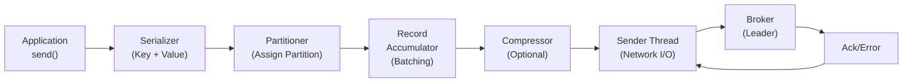

#### Step-by-Step Producer Flow

**Step 1: Serialization**
The producer serializes the key and value of each record using the configured serializers (e.g., `StringSerializer`, `JsonSerializer`, `AvroSerializer`).

**Step 2: Partitioning**
The partitioner determines which partition the record should go to:
- **Key-based** (default when key is non-null): `murmur2(key) % numPartitions`
- **Round-robin** (default when key is null, old behavior): Cycles through partitions
- **Sticky partitioner** (default when key is null, Kafka 2.4+): Sticks to one partition until the batch is full, then switches — improves batching efficiency
- **Custom partitioner**: You can implement your own `Partitioner` interface

**Step 3: Batching (Record Accumulator)**
Records are not sent one at a time. They are accumulated in a per-partition buffer called the **Record Accumulator**. A batch is sent when:
- `batch.size` bytes are accumulated (default: 16KB)
- `linger.ms` time has elapsed since the first record was added (default: 0ms, meaning send immediately)

**Setting `linger.ms` > 0 trades latency for throughput** — the producer waits a bit to collect more records into a batch before sending.

**Step 4: Compression**
If configured, the entire batch is compressed before sending. Supported algorithms:
- `none` (default)
- `gzip` (best compression, high CPU)
- `snappy` (good compression, low CPU)
- `lz4` (best throughput, good compression)
- `zstd` (best overall compression ratio)

**Step 5: Sending**
The **Sender thread** (a separate background thread) picks up batches and sends them to the appropriate broker (the leader of each partition). It manages:
- Connection pooling
- Request pipelining (`max.in.flight.requests.per.connection`, default: 5)
- Retries (`retries`, default: MAX_INT)
- Timeout handling (`delivery.timeout.ms`, default: 120000ms)

**Step 6: Acknowledgment**
The `acks` configuration controls when the broker considers a write successful:

| `acks` | Behavior | Durability | Latency | Throughput |
|--------|----------|------------|---------|------------|
| `0` | Fire and forget — don't wait for ack | Lowest | Lowest | Highest |
| `1` | Wait for leader to write to its local log | Medium | Medium | Medium |
| `all` (`-1`) | Wait for all ISR replicas to write | Highest | Highest | Lowest |

**Critical detail**: `acks=all` only waits for ISR replicas, not all replicas. If `min.insync.replicas=2` and there are 3 replicas, the producer needs the leader + at least 1 follower to acknowledge.

### 4.3 Kafka Consumer Internals

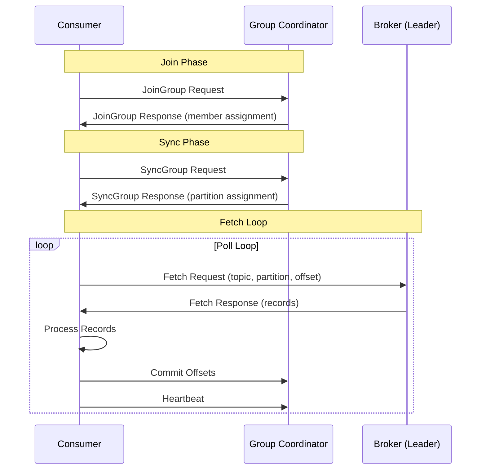

#### Consumer Groups

A consumer group is a set of consumers that cooperatively consume a topic. The key rules:

1. **Each partition is assigned to exactly one consumer** in the group
2. **A consumer can be assigned multiple partitions**
3. **If consumers > partitions**: Some consumers sit idle
4. **If consumers < partitions**: Some consumers handle multiple partitions

```
Topic: orders (6 partitions)

Consumer Group A (3 consumers):
  Consumer-1: [P0, P1]
  Consumer-2: [P2, P3]
  Consumer-3: [P4, P5]

Consumer Group B (2 consumers):
  Consumer-1: [P0, P1, P2]
  Consumer-2: [P3, P4, P5]

Consumer Group C (8 consumers):
  Consumer-1: [P0]
  Consumer-2: [P1]
  Consumer-3: [P2]
  Consumer-4: [P3]
  Consumer-5: [P4]
  Consumer-6: [P5]
  Consumer-7: [idle - no partition]
  Consumer-8: [idle - no partition]
```

#### Consumer Rebalancing

When the partition assignment needs to change (consumer joins, leaves, crashes, or partitions are added), a **rebalance** occurs.

**Rebalance triggers:**
- Consumer joins the group
- Consumer leaves the group (graceful shutdown)
- Consumer crashes (misses heartbeat → `session.timeout.ms`, default: 45s)
- Consumer takes too long to process (`max.poll.interval.ms`, default: 5 min)
- Topic partition count changes

**Rebalance Protocols:**

1. **Eager Rebalance (Stop-the-World)**
   - ALL consumers stop and revoke ALL partition assignments
   - The group coordinator reassigns ALL partitions
   - ALL consumers resume
   - Causes a complete processing pause

2. **Cooperative Rebalance (Incremental)**
   - Only the affected partitions are revoked and reassigned
   - Other partitions continue processing
   - Minimizes disruption
   - Default since Kafka 3.x+

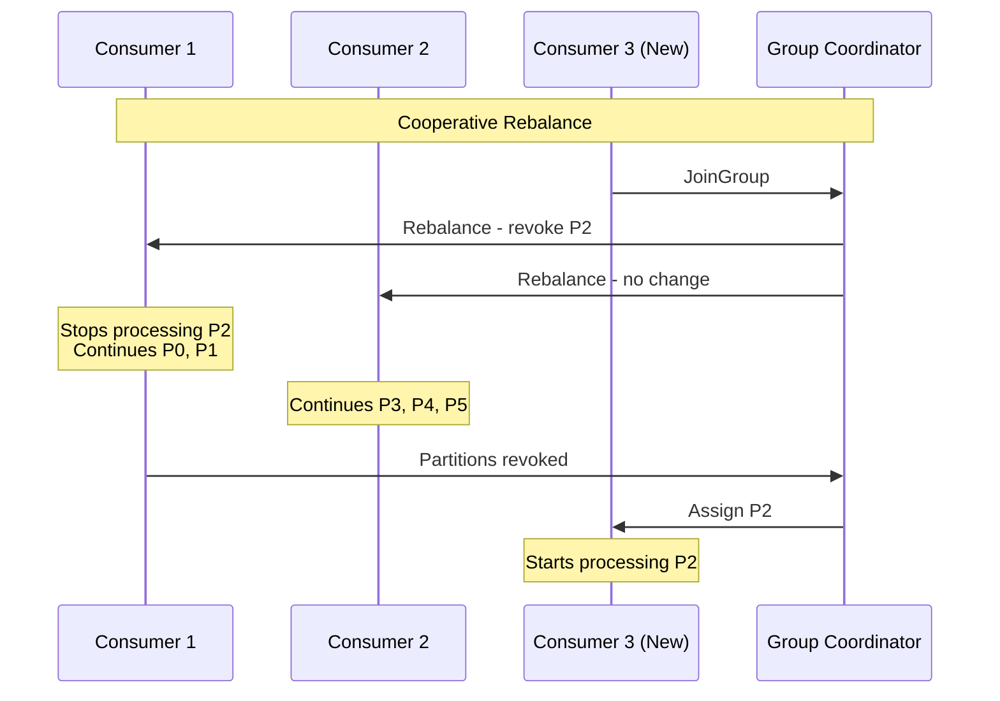

#### Offset Management

Each consumer tracks its position in each assigned partition using **offsets**:

- **Current offset**: The offset of the next record to be read
- **Committed offset**: The last offset that has been "checkpointed" — if the consumer crashes and restarts, it resumes from the committed offset
- **Log-end offset (LEO)**: The offset of the last record written to the partition
- **Consumer lag**: `LEO - committed_offset` — how far behind the consumer is

**Offset commit strategies:**

| Strategy | How | Risk |
|----------|-----|------|
| **Auto-commit** | Periodically (every `auto.commit.interval.ms`) | May commit before processing is done → data loss on crash |
| **Manual sync commit** | `consumer.commitSync()` after processing | Blocks until commit succeeds. If crash before commit → reprocessing (at-least-once) |
| **Manual async commit** | `consumer.commitAsync()` after processing | Non-blocking, but may lose commits on failure |

**Best practice**: Use manual sync commit in the main loop with async commit as an optimization, and sync commit in the shutdown hook:

```java
try {
    while (running) {
        ConsumerRecords<String, String> records = consumer.poll(Duration.ofMillis(100));
        for (ConsumerRecord<String, String> record : records) {
            process(record);
        }
        consumer.commitAsync(); // Fast, non-blocking
    }
} finally {
    consumer.commitSync(); // Sync on shutdown to ensure last offsets are committed
    consumer.close();
}
```

### 4.4 Kafka ISR (In-Sync Replicas) — Deep Dive

The ISR mechanism is Kafka's approach to balancing **durability** and **availability**.

#### How Replication Works

Each partition has:
- **One leader**: Handles all reads and writes
- **N-1 followers**: Replicate data from the leader

Followers fetch data from the leader using the same fetch protocol that consumers use. They are essentially specialized consumers.

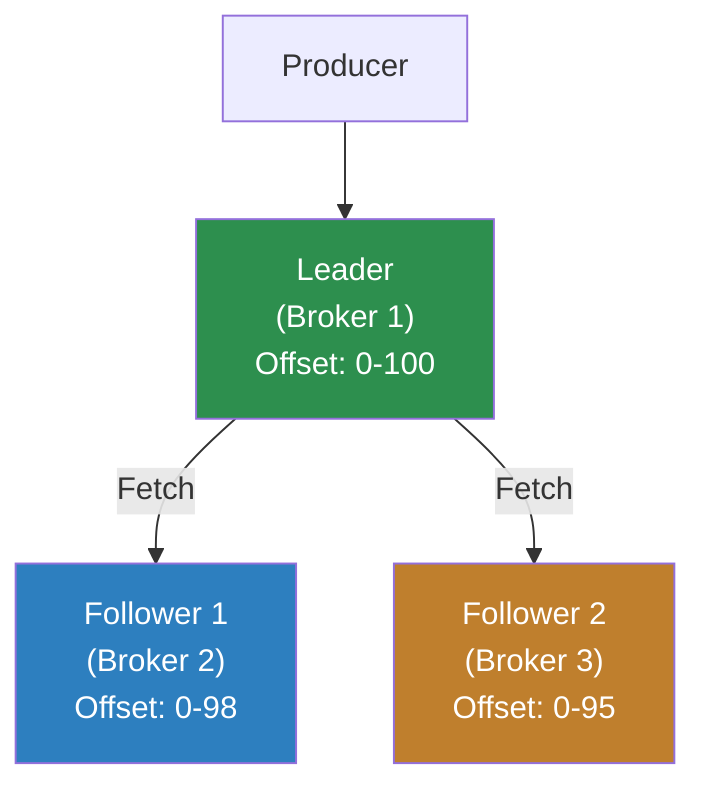

#### What Makes a Replica "In-Sync"?

A replica is considered in-sync if:
1. It has an active session with ZooKeeper/KRaft (for older/newer versions respectively)
2. It has fetched data from the leader within the last `replica.lag.time.max.ms` (default: 30s)
3. It is not more than `replica.lag.time.max.ms` behind the leader

**Note**: Kafka no longer uses `replica.lag.max.messages` (removed in 0.10.0). Only time-based lag is used.

#### The High Watermark

The **high watermark (HW)** is the offset up to which all ISR replicas have replicated:

```
Leader:     [0] [1] [2] [3] [4] [5] [6] [7] [8] [9]
Follower 1: [0] [1] [2] [3] [4] [5] [6] [7]
Follower 2: [0] [1] [2] [3] [4] [5] [6]

High Watermark: 6 (all ISR replicas have up to offset 6)
Leader's LEO:   9 (leader has up to offset 9)
```

**Consumers can only read up to the high watermark.** This ensures that consumers never read data that might be lost if the leader crashes (because followers haven't replicated it yet).

#### ISR Shrinkage and Expansion

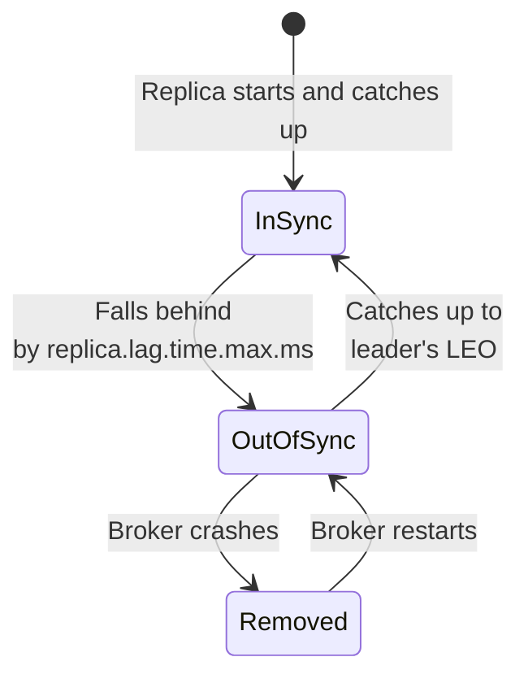

**When a replica falls out of ISR:**
1. The leader notices the follower hasn't fetched recently
2. The leader shrinks the ISR set (removes the slow follower)
3. If `acks=all`, writes now only need acknowledgment from fewer replicas
4. The high watermark can advance faster

**When a replica catches up:**
1. The follower continues fetching from the leader
2. Once it catches up to the leader's LEO, it's added back to the ISR
3. The ISR expands

#### `min.insync.replicas`

This is a **topic-level** (or broker-level default) configuration that controls the minimum number of replicas that must be in-sync for a producer to successfully write with `acks=all`:

```
Scenario: replication.factor=3, min.insync.replicas=2, acks=all

Case 1: ISR = {Leader, F1, F2} → Producer can write (3 >= 2) ✓
Case 2: ISR = {Leader, F1}     → Producer can write (2 >= 2) ✓
Case 3: ISR = {Leader}         → Producer CANNOT write (1 < 2) ✗
         → NotEnoughReplicasException
```

**The golden rule for durability:**
```
min.insync.replicas = replication.factor / 2 + 1
```

For `replication.factor=3`, set `min.insync.replicas=2`. This means you can tolerate one broker failure without data loss AND without blocking writes.

#### Unclean Leader Election

What happens if ALL ISR replicas are down, but there's an out-of-sync replica available?

- `unclean.leader.election.enable=true` (default: false): Allow an out-of-sync replica to become leader → **RISK: data loss** (the new leader doesn't have the latest data)
- `unclean.leader.election.enable=false`: The partition stays offline until an ISR replica recovers → **RISK: unavailability**

This is a classic **availability vs. durability** tradeoff.

### 4.5 Kafka Exactly-Once Semantics (EOS)

Kafka's exactly-once semantics is achieved through two mechanisms: **idempotent producers** and **transactional APIs**.

#### Idempotent Producer

When `enable.idempotence=true` (default since Kafka 3.0):

1. The producer is assigned a **Producer ID (PID)** by the broker
2. Each message includes a **sequence number** (per partition)
3. The broker tracks the last sequence number for each PID + partition
4. If a duplicate arrives (same PID + sequence number), the broker silently ignores it

```
Producer (PID=1) sends to Partition 0:
  Seq 0: "Hello"    → Broker writes, ACKs ✓
  Seq 1: "World"    → Broker writes, ACKs ✓
  Seq 1: "World"    → Duplicate detected, broker ignores, ACKs ✓
  Seq 3: "Skip"     → Out of order, broker rejects ✗
  Seq 2: "Correct"  → Broker writes, ACKs ✓
```

**Limitations of idempotent producer:**
- Only guarantees exactly-once within a single partition
- Only for a single producer session (PID changes on restart)
- Does not help with multi-partition writes or read-process-write patterns

#### Transactional API

For multi-partition exactly-once and read-process-write patterns:

```java
producer.initTransactions();

try {
    producer.beginTransaction();
    
    // Write to multiple partitions atomically
    producer.send(new ProducerRecord<>("orders", "key1", "value1"));
    producer.send(new ProducerRecord<>("inventory", "key2", "value2"));
    
    // Commit consumer offsets as part of the transaction
    producer.sendOffsetsToTransaction(offsets, consumerGroupMetadata);
    
    producer.commitTransaction();
} catch (Exception e) {
    producer.abortTransaction();
}
```

**How transactions work internally:**

1. Producer registers with a **Transaction Coordinator** (a broker)
2. Transaction Coordinator assigns a **transactional ID** and **epoch**
3. Producer sends messages to partitions normally, but with a transaction marker
4. On commit, the coordinator writes a `COMMIT` marker to all involved partitions
5. Consumers with `isolation.level=read_committed` only read messages up to the last committed transaction

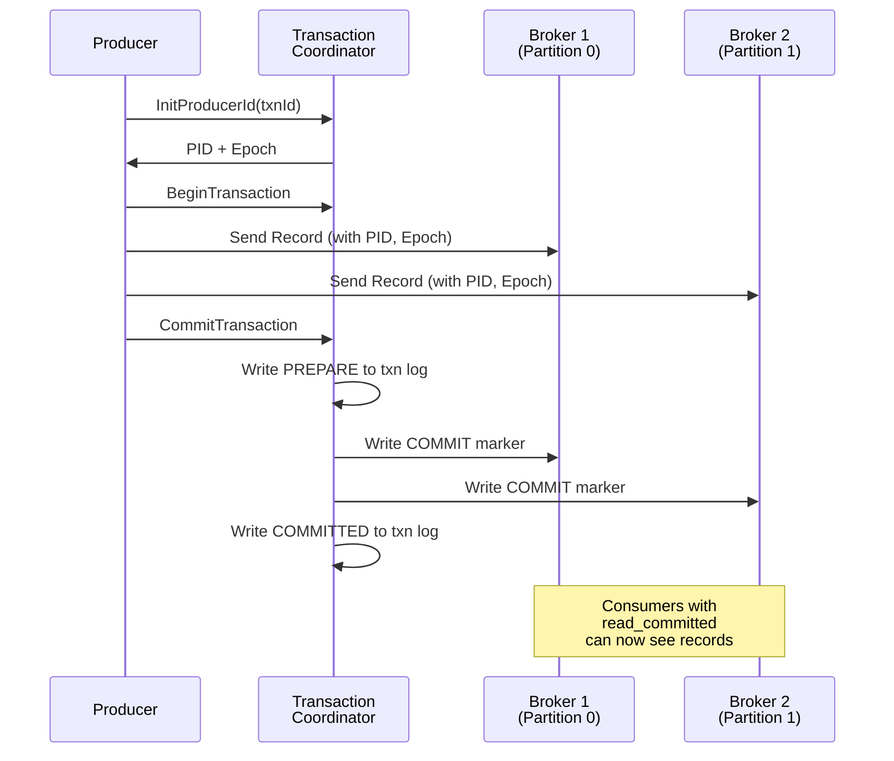

### 4.6 Kafka Connect

Kafka Connect is a framework for streaming data between Kafka and external systems without writing custom code.

**Architecture:**
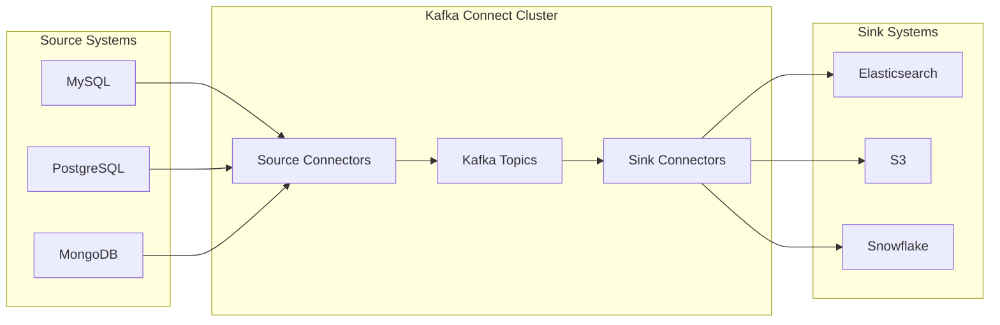

**Key concepts:**
- **Connectors**: High-level abstraction (e.g., "MySQL Source Connector")
- **Tasks**: The actual data-moving units (a connector can have multiple tasks for parallelism)
- **Workers**: JVM processes that run tasks
- **Converters**: Transform data formats (JSON, Avro, Protobuf)
- **Transforms (SMTs)**: Simple Message Transforms — lightweight transformations (filter fields, rename, mask)

**Popular Connectors:**
- **Debezium**: CDC (Change Data Capture) from MySQL, PostgreSQL, MongoDB, SQL Server
- **S3 Sink**: Write Kafka data to S3 in Parquet/JSON/Avro
- **Elasticsearch Sink**: Index Kafka data into Elasticsearch
- **JDBC Source/Sink**: Read/write from/to relational databases

### 4.7 Kafka Streams

Kafka Streams is a client library for building stream processing applications that consume from and produce to Kafka topics. Unlike Flink or Spark, it requires no separate cluster — it runs as part of your application.

**Key concepts:**
- **KStream**: An unbounded stream of key-value records
- **KTable**: A changelog stream — represents the latest value for each key
- **GlobalKTable**: A KTable that is fully replicated to all instances
- **State Store**: Local storage (RocksDB) for stateful operations
- **Topology**: The DAG of processing operations

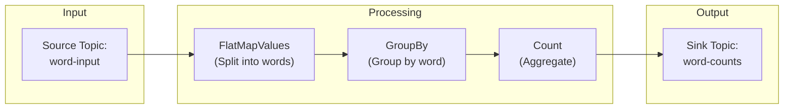

### 4.8 Log Compaction

By default, Kafka retains messages for a configured retention period (e.g., 7 days) and then deletes old segments. **Log compaction** is an alternative retention policy that retains the **latest value for each key**.

```
Before Compaction:
Offset: 0   1   2   3   4   5   6   7   8   9
Key:    A   B   A   C   B   A   D   C   A   B
Value:  a1  b1  a2  c1  b2  a3  d1  c2  a4  b3

After Compaction:
Offset: 6   7   8   9
Key:    D   C   A   B
Value:  d1  c2  a4  b3
```

**Use cases:**
- Database changelogs (CDC) — only keep the latest state for each row
- KTable materialization — reconstruct state from a compacted topic
- Configuration distribution — each key is a config parameter, latest value wins

**How compaction works:**
1. Kafka has a background **Log Cleaner** thread
2. It identifies "dirty" (uncompacted) segments
3. It reads records, keeping only the latest value for each key
4. It writes compacted segments, replacing the old ones
5. Records with null values (**tombstones**) are kept temporarily, then deleted

### 4.9 Schema Registry

In production, you need to ensure that producers and consumers agree on the data format. The **Schema Registry** (Confluent Schema Registry) provides:

1. **Schema storage**: Central repository for Avro, Protobuf, and JSON schemas
2. **Schema evolution**: Rules for forward/backward compatibility
3. **Schema validation**: Reject data that doesn't match the schema
4. **Schema IDs**: Each schema version gets a unique ID, embedded in messages

**Compatibility modes:**
| Mode | Rule | Use Case |
|------|------|----------|
| `BACKWARD` | New schema can read old data | Consumers upgraded first |
| `FORWARD` | Old schema can read new data | Producers upgraded first |
| `FULL` | Both backward and forward compatible | Most flexible |
| `NONE` | No compatibility check | Development only |

### 4.10 Apache Pulsar Architecture

Apache Pulsar was developed at Yahoo! and donated to the Apache Software Foundation. It was designed to address some of Kafka's architectural limitations.

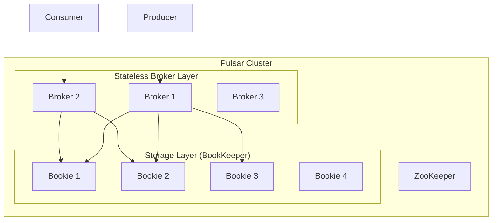

**Key architectural difference from Kafka:**

| Aspect | Kafka | Pulsar |
|--------|-------|--------|
| **Broker role** | Stateful (stores data) | Stateless (no local data) |
| **Storage** | Local disk on broker | Apache BookKeeper (separate) |
| **Scaling** | Must rebalance partitions | Add bookies independently |
| **Recovery** | Replay partition log | BookKeeper handles recovery |
| **Multi-tenancy** | Topic-level isolation | Native multi-tenancy |
| **Geo-replication** | MirrorMaker (manual) | Built-in geo-replication |

**Pulsar Multi-Tenancy:**
```
Pulsar Instance
├── Tenant: company-a
│   ├── Namespace: company-a/production
│   │   ├── Topic: orders
│   │   └── Topic: payments
│   └── Namespace: company-a/staging
│       └── Topic: orders
├── Tenant: company-b
│   └── Namespace: company-b/production
│       └── Topic: events
```

Each tenant can have its own:
- Authentication/authorization
- Storage quotas
- Rate limits
- Retention policies

**Pulsar Geo-Replication:**
Pulsar supports built-in, asynchronous geo-replication between clusters:
- Configured at the namespace level
- Each cluster has its own set of bookies
- Messages are replicated asynchronously between clusters
- Consumers in each region read from their local cluster

### 4.11 Apache Flink Architecture

Apache Flink is a distributed stream processing framework designed for stateful computations over unbounded and bounded data streams.

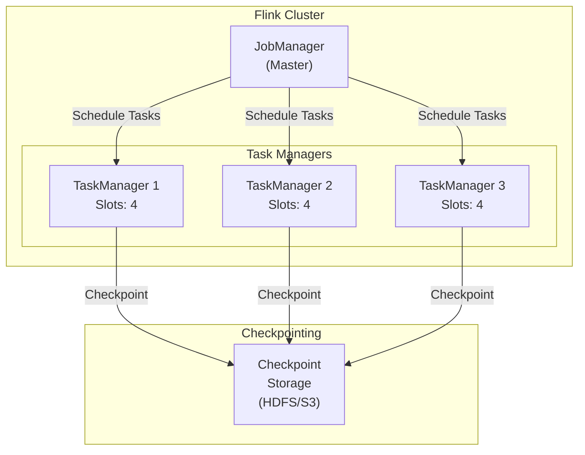

#### Flink's Exactly-Once: Chandy-Lamport Checkpointing

Flink achieves exactly-once processing through a variant of the **Chandy-Lamport distributed snapshot algorithm** called **asynchronous barrier snapshotting**:

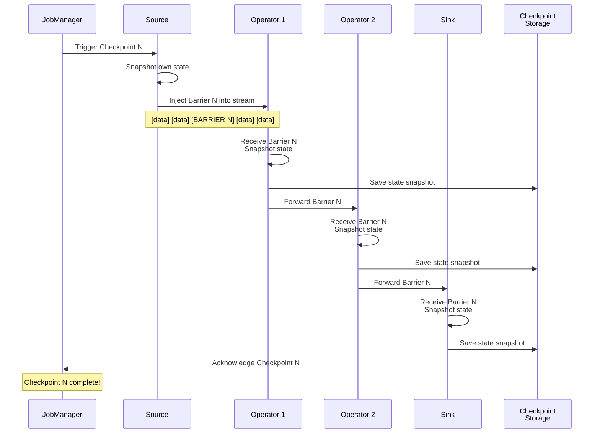

**How it works:**
1. JobManager periodically injects **checkpoint barriers** into the source streams
2. When an operator receives a barrier, it snapshots its state and forwards the barrier
3. For operators with multiple inputs, it uses **barrier alignment** — it buffers records from faster inputs until all barriers arrive (this is the trade-off for exactly-once)
4. Once all operators have acknowledged, the checkpoint is complete
5. On failure, the system restores from the last complete checkpoint and replays data from that point

#### Flink Windowing

Windows are how you group unbounded data into finite chunks for aggregation:

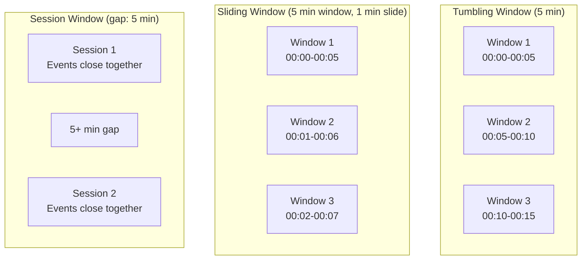

**Window types:**

| Type | Description | Use Case |
|------|-------------|----------|
| **Tumbling** | Fixed-size, non-overlapping | Hourly report, daily aggregation |
| **Sliding** | Fixed-size, overlapping | Moving average, rolling count |
| **Session** | Dynamic size, gap-based | User session analytics |
| **Global** | Single window for all data | Custom windowing logic |

#### Flink State Management

Flink provides rich state management:

- **Keyed State**: State partitioned by key (e.g., per-user state)
  - `ValueState<T>`: Single value
  - `ListState<T>`: List of values
  - `MapState<K, V>`: Map of key-value pairs
  - `ReducingState<T>`: Aggregated value
  - `AggregatingState<IN, OUT>`: More general aggregation

- **Operator State**: State per operator instance (not partitioned by key)
  - Used for source/sink connectors

- **State Backends**:
  - `HashMapStateBackend`: In-memory, fast, limited by memory
  - `EmbeddedRocksDBStateBackend`: On-disk (RocksDB), larger state support, slightly slower

### 4.12 Spark Structured Streaming

Apache Spark Structured Streaming treats a stream as an unbounded table that is continuously appended to:

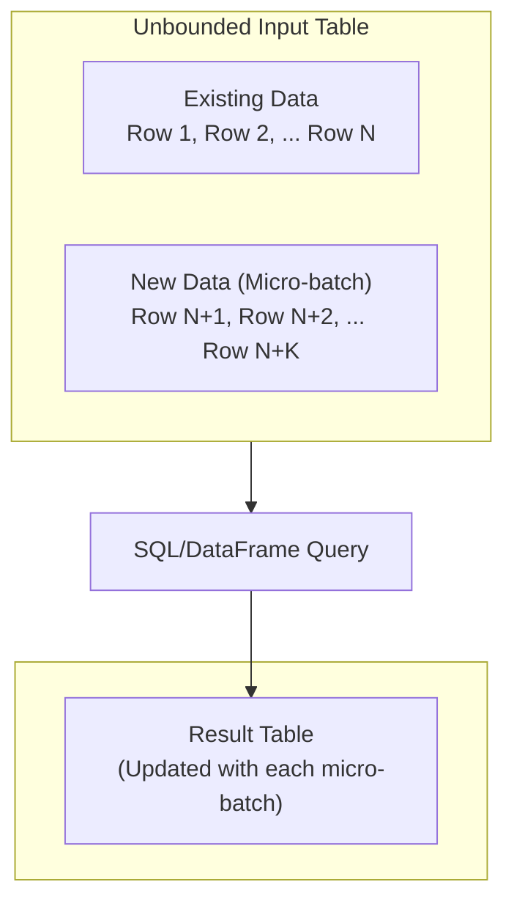

**Key differences from Flink:**

| Aspect | Flink | Spark Structured Streaming |
|--------|-------|--------------------------|
| **Model** | True streaming (record-at-a-time) | Micro-batch |
| **Latency** | Milliseconds | Seconds (100ms min with continuous) |
| **State management** | Rich, built-in | Moderate |
| **Exactly-once** | Checkpoint-based | Micro-batch inherent |
| **API** | DataStream API, Table API | DataFrame/Dataset API, SQL |
| **Ecosystem** | Focused on streaming | Unified batch + stream |

### 4.13 Watermarks

Watermarks are the mechanism by which stream processors handle **out-of-order events** and decide when a window is "complete."

A watermark is a timestamp that declares: **"We believe all events with timestamps ≤ W have arrived."**

```
Event stream with watermarks:

Time: ──────────────────────────────────────────►
Events: e(t=1) e(t=3) e(t=2) e(t=5) e(t=4) e(t=7) e(t=6) e(t=8)
                                ↑
                        Watermark W=4
                "All events with t ≤ 4 should have arrived"
```

**Trade-offs in watermark strategy:**

| Strategy | Completeness | Latency | Risk |
|----------|-------------|---------|------|
| **Aggressive** (small delay) | Lower | Lower | More late events dropped |
| **Conservative** (large delay) | Higher | Higher | Fewer late events but longer wait |

**Handling late events (events that arrive after the watermark has passed):**
1. **Drop**: Ignore late events (simplest, but data loss)
2. **Side output**: Send late events to a separate stream for special handling
3. **Allowed lateness**: Keep windows open beyond the watermark for a grace period
4. **Retracting results**: Re-emit corrected results when late events arrive

### 4.14 Backpressure Handling

Backpressure occurs when a downstream component can't keep up with the upstream production rate.

**Without backpressure handling:**
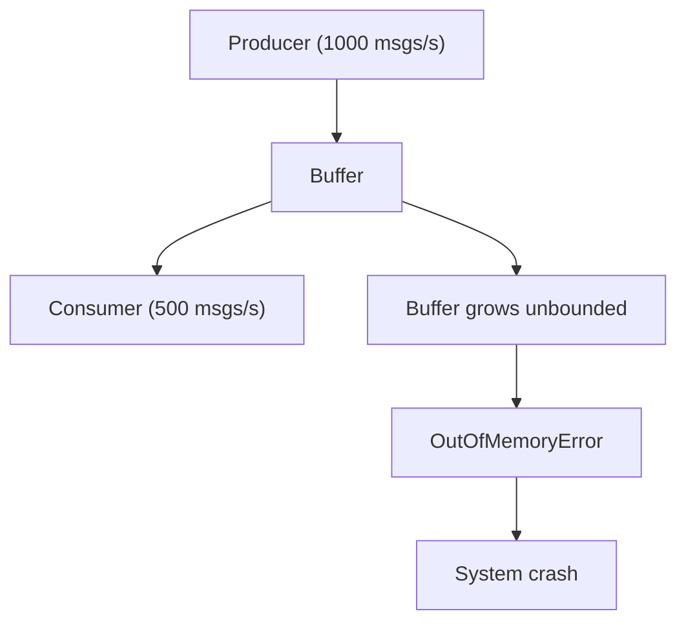

**Backpressure strategies:**

| Strategy | How | Used By |
|----------|-----|---------|
| **Blocking** | Upstream blocks when downstream is slow | TCP flow control |
| **Buffering** | Buffer messages and process later | Kafka consumer lag |
| **Dropping** | Drop messages when overwhelmed | UDP, metrics systems |
| **Credit-based** | Downstream tells upstream how much it can handle | Flink |
| **Rate limiting** | Limit the upstream production rate | API gateways |

**Flink's credit-based backpressure:**
- Each receiver has a buffer pool
- Receiver tells sender how many buffers are available (credits)
- Sender only sends data if it has credits
- If receiver is slow, credits run out, sender pauses
- No data loss, no buffer overflow

**Kafka's approach:**
- Kafka doesn't have built-in backpressure in the traditional sense
- Consumer lag naturally absorbs backpressure — events are stored in Kafka until the consumer catches up
- Producers can configure `max.block.ms` to block/fail when the broker is slow
- Consumers control their own rate via `poll()` interval and `max.poll.records`

---

## 5. Visual Diagrams

### Kafka End-to-End Message Flow

```mermaid
sequenceDiagram
    participant App as Application
    participant Prod as Producer
    participant Part as Partitioner
    participant Batch as Record Accumulator
    participant Sender as Sender Thread
    participant Leader as Leader Broker
    participant F1 as Follower 1
    participant F2 as Follower 2
    participant Cons as Consumer

    App->>Prod: send(key, value)
    Prod->>Prod: Serialize key & value
    Prod->>Part: Determine partition
    Part->>Batch: Add to partition batch
    
    Note over Batch: Wait for batch.size<br/>or linger.ms

    Batch->>Sender: Batch ready
    Sender->>Leader: ProduceRequest
    
    Leader->>Leader: Write to local log
    F1->>Leader: Fetch
    Leader->>F1: Send data
    F2->>Leader: Fetch
    Leader->>F2: Send data

    Note over Leader,F2: Wait for ISR acks<br/>(if acks=all)

    Leader->>Sender: ProduceResponse (success)
    Sender->>App: Callback (metadata)

    Note over Cons: poll() loop
    Cons->>Leader: FetchRequest(offset=N)
    Leader->>Cons: FetchResponse(records)
    Cons->>Cons: Process records
    Cons->>Leader: OffsetCommit
```

### Kafka Consumer Group Rebalancing

```mermaid
stateDiagram-v2
    [*] --> Stable: All consumers assigned

    Stable --> PreparingRebalance: Consumer joins/leaves/crashes
    PreparingRebalance --> CompletingRebalance: All members rejoin
    CompletingRebalance --> Stable: Assignments distributed
    
    Stable --> Dead: All consumers leave
    PreparingRebalance --> Empty: All consumers leave
    CompletingRebalance --> Empty: All consumers leave
    Empty --> PreparingRebalance: First consumer joins
    Dead --> [*]
```

### Stream Processing Pipeline Architecture

```mermaid
graph LR
    subgraph Sources["Data Sources"]
        S1["Web Events"]
        S2["Mobile Events"]
        S3["IoT Sensors"]
        S4["Database CDC"]
    end

    subgraph Ingestion["Ingestion Layer"]
        K["Apache Kafka"]
    end

    subgraph Processing["Processing Layer"]
        F["Apache Flink"]
        KS["Kafka Streams"]
    end

    subgraph Serving["Serving Layer"]
        ES["Elasticsearch"]
        R["Redis"]
        PG["PostgreSQL"]
        S3["S3/Data Lake"]
    end

    subgraph Consumers["Consumers"]
        D["Dashboard"]
        A["Alerts"]
        ML["ML Models"]
        API["REST APIs"]
    end

    S1 --> K
    S2 --> K
    S3 --> K
    S4 --> K

    K --> F
    K --> KS

    F --> ES
    F --> R
    F --> S3
    KS --> PG
    KS --> R

    ES --> D
    R --> API
    PG --> API
    R --> A
    S3 --> ML
```

### Flink Job Execution Graph

```mermaid
graph TD
    subgraph JobGraph["Flink Job: Word Count"]
        Source["Source:<br/>Kafka Consumer<br/>(parallelism=4)"]
        FlatMap["FlatMap:<br/>Split Sentences<br/>(parallelism=4)"]
        KeyBy["KeyBy + Count:<br/>Word Aggregation<br/>(parallelism=4)"]
        Sink["Sink:<br/>Kafka Producer<br/>(parallelism=4)"]
    end

    Source --> FlatMap
    FlatMap -->|"Hash<br/>Partitioning"| KeyBy
    KeyBy --> Sink

    subgraph Checkpoints
        CP["Checkpoint Storage<br/>(S3/HDFS)"]
    end

    Source -.-> CP
    FlatMap -.-> CP
    KeyBy -.-> CP
    Sink -.-> CP
```

---

## 6. Real Production Examples

### 6.1 LinkedIn — The Birthplace of Kafka

**The Problem (2009):**
LinkedIn needed to connect hundreds of data sources (user activity, page views, ad impressions, InMail) to hundreds of consumers (Hadoop, search indexing, monitoring, analytics). The naive approach of point-to-point integrations resulted in O(N²) connections.

**The Solution:**
Jay Kreps, Neha Narkhede, and Jun Rao designed Kafka as a **unified event streaming platform**:

```mermaid
graph LR
    subgraph Before["Before Kafka: O(N×M) connections"]
        S1["Source₁"]
        S2["Source₂"]
        C1["Consumer₁"]
        C2["Consumer₂"]
        C3["Consumer₃"]
        
        S1 --> C1
        S1 --> C2
        S1 --> C3
        S2 --> C1
        S2 --> C2
        S2 --> C3
    end

    subgraph After["After Kafka: O(N+M) connections"]
        AS1["Source₁"]
        AS2["Source₂"]
        AS3["Source₃"]
        K["Kafka"]
        AC1["Consumer₁"]
        AC2["Consumer₂"]
        AC3["Consumer₃"]
        
        AS1 --> K
        AS2 --> K
        AS3 --> K
        K --> AC1
        K --> AC2
        K --> AC3
    end
```

**Scale today (2024):**
- **7+ trillion messages per day**
- **100+ Kafka clusters**
- **4,000+ brokers**
- **100,000+ topics**
- **Peak: 13 million messages per second**

**Key engineering decisions:**
1. **Tiered storage**: Old data moved to object storage (HDFS/S3) to reduce broker disk costs
2. **Venice**: LinkedIn built a specialized database for serving Kafka-derived data
3. **Brooklin**: Custom mirroring framework (more efficient than MirrorMaker)
4. **LiKafka**: Customized Kafka clients with added reliability features

### 6.2 Uber — Kafka at Extreme Scale

**Scale:**
- **Trillions of messages per day** across all services
- Used for: trip events, driver locations, fare calculations, ETA estimates, marketplace signals
- Multiple data centers with cross-DC replication

**Architecture:**
```mermaid
graph LR
    subgraph UberDataPlatform["Uber's Data Platform"]
        subgraph Pattern["Pattern"]
            S["Services"] --> K1["Kafka"] --> F["Flink Jobs"] --> K2["Kafka"] --> D["Downstream"]
        end
        
        GPS["GPS Events"] --> K_GPS["Kafka"] --> Surge["Surge Pricing Engine"]
        Trip["Trip Events"] --> K_Trip["Kafka"] --> Analytics["Analytics / Hadoop"]
        Driver["Driver Events"] --> K_Driver["Kafka"] --> Monitor["Real-time Monitoring"]
        Payment["Payment Events"] --> K_Payment["Kafka"] --> Fraud["Fraud Detection"]
    end
```

**Key innovations:**
1. **uReplicator**: Uber's custom Kafka replicator (replaced MirrorMaker due to rebalancing issues at scale)
2. **Chaperone**: End-to-end audit system ensuring no data loss across the pipeline
3. **Dead Letter Queue (DLQ)**: Failed messages are routed to DLQ topics for later reprocessing
4. **Schema enforcement**: Mandatory Avro schemas with strict compatibility checks

**Failure story**: In 2018, Uber experienced a multi-hour Kafka outage caused by ZooKeeper instability. This led them to invest heavily in Kafka monitoring and eventually explore KRaft mode.

### 6.3 Netflix — Real-Time Data Pipeline

Netflix processes over **1.5 trillion events per day** for:
- Viewing activity tracking
- A/B test metric collection
- Real-time recommendations
- Content delivery optimization
- Error tracking and alerting

**Architecture: Keystone Pipeline**

```mermaid
graph LR
    subgraph NetflixKeystone["Netflix Keystone Pipeline<br/>Key Design: Event routing by event type and priority"]
        Services --> Kafka1["Kafka"]
        Kafka1 --> Router
        
        Router --> Kafka2["Kafka"] --> Flink1["Flink"] --> ES
        Router --> Kafka3["Kafka"] --> Flink2["Flink"] --> Druid
        Router --> S3["S3 (data lake)"]
        Router --> Kafka4["Kafka"] --> Spark --> HDFS
    end
```

**Key design decisions:**
1. **Two-tier Kafka**: Fronting Kafka (in data centers, low latency) and Processing Kafka (in cloud, high throughput)
2. **Schema evolution**: Netflix uses Avro with a custom schema registry
3. **Exactly-once delivery**: Netflix uses a combination of idempotent producers and consumer-side deduplication rather than Kafka transactions
4. **Multi-region**: Netflix operates in multiple AWS regions, with Kafka clusters in each region and cross-region replication

### 6.4 Spotify — Event Delivery System

Spotify's event delivery system handles:
- Every song play, skip, pause, and seek
- Search queries
- UI interactions
- Infrastructure events

**Scale:**
- **Hundreds of billions of events per day**
- **10+ GB/s** peak ingestion
- Events are the foundation for personalization, recommendations, and Wrapped

**Architecture:**
```mermaid
graph TD
    Clients["Clients (mobile/desktop/web)"] -->|HTTP/gRPC| EDS["Event Delivery Service"]
    EDS --> PubSub["Google Cloud Pub/Sub (primary) / Kafka"]
    PubSub --> Processing["Event Processing (Apache Beam / Scio)"]
    Processing --> BQ["BigQuery (analytics)"]
    Processing --> BT["Bigtable (serving)"]
    Processing --> GCS["GCS (storage)"]
```

**Key lessons from Spotify:**
1. **Client-side batching**: Mobile clients batch events and send them periodically to reduce battery and network usage
2. **At-least-once with deduplication**: Spotify uses event IDs for deduplication rather than attempting exactly-once
3. **Schema enforcement at ingestion**: Events without valid schemas are rejected at the gateway
4. **Event catalog**: A central registry of all event types, their schemas, owners, and consumers

---

## 7. Java Implementations

### 7.1 Kafka Producer — Production-Grade

```java
import org.apache.kafka.clients.producer.*;
import org.apache.kafka.common.serialization.StringSerializer;
import org.slf4j.Logger;
import org.slf4j.LoggerFactory;

import java.util.Properties;
import java.util.concurrent.CompletableFuture;
import java.util.concurrent.TimeUnit;

/**
 * Production-grade Kafka producer with proper error handling,
 * metrics, and graceful shutdown.
 */
public class ProductionKafkaProducer implements AutoCloseable {
    
    private static final Logger log = LoggerFactory.getLogger(ProductionKafkaProducer.class);
    
    private final KafkaProducer<String, String> producer;
    private final String topic;
    private volatile boolean closed = false;
    
    // Metrics
    private long messagesSent = 0;
    private long messagesErrored = 0;
    private long totalLatencyMs = 0;

    public ProductionKafkaProducer(String bootstrapServers, String topic) {
        this.topic = topic;
        this.producer = new KafkaProducer<>(buildProperties(bootstrapServers));
        
        // Register shutdown hook for graceful shutdown
        Runtime.getRuntime().addShutdownHook(new Thread(this::close));
    }

    private Properties buildProperties(String bootstrapServers) {
        Properties props = new Properties();
        
        // Connection
        props.put(ProducerConfig.BOOTSTRAP_SERVERS_CONFIG, bootstrapServers);
        props.put(ProducerConfig.CLIENT_ID_CONFIG, "order-producer-" + System.currentTimeMillis());
        
        // Serialization
        props.put(ProducerConfig.KEY_SERIALIZER_CLASS_CONFIG, StringSerializer.class.getName());
        props.put(ProducerConfig.VALUE_SERIALIZER_CLASS_CONFIG, StringSerializer.class.getName());
        
        // Durability: Wait for all ISR replicas to acknowledge
        props.put(ProducerConfig.ACKS_CONFIG, "all");
        
        // Idempotence: Prevent duplicate messages
        props.put(ProducerConfig.ENABLE_IDEMPOTENCE_CONFIG, true);
        
        // Batching: Optimize throughput
        props.put(ProducerConfig.BATCH_SIZE_CONFIG, 32768);       // 32KB batch
        props.put(ProducerConfig.LINGER_MS_CONFIG, 20);           // Wait up to 20ms for more messages
        props.put(ProducerConfig.BUFFER_MEMORY_CONFIG, 67108864); // 64MB buffer
        
        // Compression: Reduce network I/O
        props.put(ProducerConfig.COMPRESSION_TYPE_CONFIG, "lz4");
        
        // Retries: Handle transient failures
        props.put(ProducerConfig.RETRIES_CONFIG, Integer.MAX_VALUE);
        props.put(ProducerConfig.DELIVERY_TIMEOUT_MS_CONFIG, 120000);  // 2 min total timeout
        props.put(ProducerConfig.MAX_IN_FLIGHT_REQUESTS_PER_CONNECTION, 5);
        // With idempotence enabled, ordering is guaranteed even with in-flight > 1
        
        // Request timeout
        props.put(ProducerConfig.REQUEST_TIMEOUT_MS_CONFIG, 30000);   // 30s per request
        
        return props;
    }

    /**
     * Send a message asynchronously with callback.
     * Returns a CompletableFuture for easy composition.
     */
    public CompletableFuture<RecordMetadata> sendAsync(String key, String value) {
        if (closed) {
            return CompletableFuture.failedFuture(
                new IllegalStateException("Producer is closed"));
        }
        
        ProducerRecord<String, String> record = new ProducerRecord<>(topic, key, value);
        CompletableFuture<RecordMetadata> future = new CompletableFuture<>();
        long startTime = System.currentTimeMillis();

        producer.send(record, (metadata, exception) -> {
            long latency = System.currentTimeMillis() - startTime;
            
            if (exception == null) {
                messagesSent++;
                totalLatencyMs += latency;
                
                log.debug("Message sent: topic={}, partition={}, offset={}, latency={}ms",
                    metadata.topic(), metadata.partition(), metadata.offset(), latency);
                
                future.complete(metadata);
            } else {
                messagesErrored++;
                
                log.error("Failed to send message: key={}, error={}",
                    key, exception.getMessage(), exception);
                
                future.completeExceptionally(exception);
            }
        });

        return future;
    }

    /**
     * Send a message synchronously. Blocks until acknowledged or timeout.
     */
    public RecordMetadata sendSync(String key, String value) throws Exception {
        return sendAsync(key, value).get(30, TimeUnit.SECONDS);
    }

    /**
     * Send with headers for tracing and metadata.
     */
    public CompletableFuture<RecordMetadata> sendWithHeaders(
            String key, String value,
            String correlationId, String sourceService) {
        
        ProducerRecord<String, String> record = new ProducerRecord<>(topic, key, value);
        
        // Add headers for distributed tracing
        record.headers().add("correlation-id", correlationId.getBytes());
        record.headers().add("source-service", sourceService.getBytes());
        record.headers().add("timestamp", String.valueOf(System.currentTimeMillis()).getBytes());
        
        CompletableFuture<RecordMetadata> future = new CompletableFuture<>();
        producer.send(record, (metadata, exception) -> {
            if (exception == null) {
                future.complete(metadata);
            } else {
                future.completeExceptionally(exception);
            }
        });
        
        return future;
    }

    public double getAverageLatencyMs() {
        return messagesSent > 0 ? (double) totalLatencyMs / messagesSent : 0;
    }

    public long getMessagesSent() { return messagesSent; }
    public long getMessagesErrored() { return messagesErrored; }

    @Override
    public void close() {
        if (!closed) {
            closed = true;
            log.info("Closing producer. Messages sent: {}, errors: {}, avg latency: {}ms",
                messagesSent, messagesErrored, getAverageLatencyMs());
            producer.flush();   // Send any buffered messages
            producer.close(java.time.Duration.ofSeconds(30));
        }
    }
}
```

### 7.2 Kafka Consumer — Production-Grade

```java
import org.apache.kafka.clients.consumer.*;
import org.apache.kafka.common.errors.WakeupException;
import org.apache.kafka.common.serialization.StringDeserializer;
import org.slf4j.Logger;
import org.slf4j.LoggerFactory;

import java.time.Duration;
import java.util.*;
import java.util.concurrent.atomic.AtomicBoolean;

/**
 * Production-grade Kafka consumer with:
 * - Graceful shutdown
 * - Manual offset commit (at-least-once)
 * - Error handling with DLQ
 * - Rebalance listener
 * - Metrics
 */
public class ProductionKafkaConsumer implements Runnable {

    private static final Logger log = LoggerFactory.getLogger(ProductionKafkaConsumer.class);

    private final KafkaConsumer<String, String> consumer;
    private final List<String> topics;
    private final AtomicBoolean running = new AtomicBoolean(true);
    private final MessageProcessor processor;
    private final DeadLetterQueueProducer dlqProducer;

    // Metrics
    private long messagesProcessed = 0;
    private long messagesErrored = 0;

    @FunctionalInterface
    public interface MessageProcessor {
        void process(String key, String value, Map<String, String> headers) throws Exception;
    }

    @FunctionalInterface
    public interface DeadLetterQueueProducer {
        void sendToDLQ(String topic, String key, String value, String error);
    }

    public ProductionKafkaConsumer(
            String bootstrapServers,
            String groupId,
            List<String> topics,
            MessageProcessor processor,
            DeadLetterQueueProducer dlqProducer) {
        
        this.topics = topics;
        this.processor = processor;
        this.dlqProducer = dlqProducer;
        this.consumer = new KafkaConsumer<>(buildProperties(bootstrapServers, groupId));
    }

    private Properties buildProperties(String bootstrapServers, String groupId) {
        Properties props = new Properties();
        
        // Connection
        props.put(ConsumerConfig.BOOTSTRAP_SERVERS_CONFIG, bootstrapServers);
        props.put(ConsumerConfig.GROUP_ID_CONFIG, groupId);
        props.put(ConsumerConfig.CLIENT_ID_CONFIG, groupId + "-" + UUID.randomUUID());
        
        // Deserialization
        props.put(ConsumerConfig.KEY_DESERIALIZER_CLASS_CONFIG, StringDeserializer.class.getName());
        props.put(ConsumerConfig.VALUE_DESERIALIZER_CLASS_CONFIG, StringDeserializer.class.getName());
        
        // Offset management
        props.put(ConsumerConfig.ENABLE_AUTO_COMMIT_CONFIG, false); // Manual commit!
        props.put(ConsumerConfig.AUTO_OFFSET_RESET_CONFIG, "earliest"); // Start from beginning if no committed offset
        
        // Performance
        props.put(ConsumerConfig.MAX_POLL_RECORDS_CONFIG, 500);          // Process up to 500 records per poll
        props.put(ConsumerConfig.FETCH_MIN_BYTES_CONFIG, 1024);          // Wait for at least 1KB
        props.put(ConsumerConfig.FETCH_MAX_WAIT_MS_CONFIG, 500);         // Or wait max 500ms
        props.put(ConsumerConfig.MAX_PARTITION_FETCH_BYTES_CONFIG, 1048576); // 1MB per partition
        
        // Session management
        props.put(ConsumerConfig.SESSION_TIMEOUT_MS_CONFIG, 45000);      // 45s session timeout
        props.put(ConsumerConfig.HEARTBEAT_INTERVAL_MS_CONFIG, 15000);   // 15s heartbeat
        props.put(ConsumerConfig.MAX_POLL_INTERVAL_MS_CONFIG, 300000);   // 5 min max between polls
        
        // Cooperative rebalancing
        props.put(ConsumerConfig.PARTITION_ASSIGNMENT_STRATEGY_CONFIG,
            "org.apache.kafka.clients.consumer.CooperativeStickyAssignor");
        
        return props;
    }

    @Override
    public void run() {
        try {
            // Subscribe with rebalance listener
            consumer.subscribe(topics, new ConsumerRebalanceListener() {
                @Override
                public void onPartitionsRevoked(Collection<org.apache.kafka.common.TopicPartition> partitions) {
                    log.info("Partitions revoked: {}. Committing current offsets.", partitions);
                    consumer.commitSync(); // Commit before losing partitions
                }

                @Override
                public void onPartitionsAssigned(Collection<org.apache.kafka.common.TopicPartition> partitions) {
                    log.info("Partitions assigned: {}", partitions);
                }
            });

            while (running.get()) {
                ConsumerRecords<String, String> records = consumer.poll(Duration.ofMillis(100));
                
                if (records.isEmpty()) continue;

                for (ConsumerRecord<String, String> record : records) {
                    try {
                        // Extract headers
                        Map<String, String> headers = new HashMap<>();
                        record.headers().forEach(h -> 
                            headers.put(h.key(), new String(h.value())));

                        // Process the record
                        processor.process(record.key(), record.value(), headers);
                        messagesProcessed++;

                        if (messagesProcessed % 10000 == 0) {
                            log.info("Processed {} messages, {} errors", 
                                messagesProcessed, messagesErrored);
                        }
                    } catch (Exception e) {
                        messagesErrored++;
                        log.error("Error processing record: topic={}, partition={}, offset={}, key={}",
                            record.topic(), record.partition(), record.offset(), record.key(), e);

                        // Send to Dead Letter Queue
                        try {
                            dlqProducer.sendToDLQ(
                                record.topic(), record.key(), record.value(), e.getMessage());
                        } catch (Exception dlqError) {
                            log.error("Failed to send to DLQ!", dlqError);
                        }
                    }
                }

                // Commit offsets after processing the batch
                try {
                    consumer.commitAsync((offsets, exception) -> {
                        if (exception != null) {
                            log.warn("Async commit failed for offsets: {}", offsets, exception);
                        }
                    });
                } catch (Exception e) {
                    log.error("Failed to commit offsets", e);
                }
            }
        } catch (WakeupException e) {
            // Expected on shutdown
            if (running.get()) throw e;
        } finally {
            try {
                consumer.commitSync(); // Final sync commit
            } finally {
                consumer.close();
                log.info("Consumer closed. Total processed: {}, errors: {}", 
                    messagesProcessed, messagesErrored);
            }
        }
    }

    /**
     * Trigger graceful shutdown.
     * Thread-safe — can be called from another thread.
     */
    public void shutdown() {
        log.info("Shutdown requested");
        running.set(false);
        consumer.wakeup(); // Interrupt poll()
    }
}
```

### 7.3 Kafka Exactly-Once Producer (Transactional)

```java
import org.apache.kafka.clients.consumer.*;
import org.apache.kafka.clients.producer.*;
import org.apache.kafka.common.serialization.StringDeserializer;
import org.apache.kafka.common.serialization.StringSerializer;

import java.time.Duration;
import java.util.*;

/**
 * Demonstrates exactly-once semantics in a consume-transform-produce pattern.
 * Reads from an input topic, transforms data, and writes to an output topic
 * atomically with offset commit.
 */
public class ExactlyOnceProcessor {

    private final KafkaConsumer<String, String> consumer;
    private final KafkaProducer<String, String> producer;
    private final String inputTopic;
    private final String outputTopic;

    public ExactlyOnceProcessor(
            String bootstrapServers,
            String groupId,
            String inputTopic,
            String outputTopic,
            String transactionalId) {
        
        this.inputTopic = inputTopic;
        this.outputTopic = outputTopic;
        this.consumer = createConsumer(bootstrapServers, groupId);
        this.producer = createTransactionalProducer(bootstrapServers, transactionalId);
    }

    private KafkaConsumer<String, String> createConsumer(String bootstrapServers, String groupId) {
        Properties props = new Properties();
        props.put(ConsumerConfig.BOOTSTRAP_SERVERS_CONFIG, bootstrapServers);
        props.put(ConsumerConfig.GROUP_ID_CONFIG, groupId);
        props.put(ConsumerConfig.KEY_DESERIALIZER_CLASS_CONFIG, StringDeserializer.class.getName());
        props.put(ConsumerConfig.VALUE_DESERIALIZER_CLASS_CONFIG, StringDeserializer.class.getName());
        props.put(ConsumerConfig.ENABLE_AUTO_COMMIT_CONFIG, false);
        props.put(ConsumerConfig.ISOLATION_LEVEL_CONFIG, "read_committed"); // Only read committed transactions
        props.put(ConsumerConfig.AUTO_OFFSET_RESET_CONFIG, "earliest");
        return new KafkaConsumer<>(props);
    }

    private KafkaProducer<String, String> createTransactionalProducer(
            String bootstrapServers, String transactionalId) {
        Properties props = new Properties();
        props.put(ProducerConfig.BOOTSTRAP_SERVERS_CONFIG, bootstrapServers);
        props.put(ProducerConfig.KEY_SERIALIZER_CLASS_CONFIG, StringSerializer.class.getName());
        props.put(ProducerConfig.VALUE_SERIALIZER_CLASS_CONFIG, StringSerializer.class.getName());
        props.put(ProducerConfig.TRANSACTIONAL_ID_CONFIG, transactionalId);
        props.put(ProducerConfig.ENABLE_IDEMPOTENCE_CONFIG, true);
        props.put(ProducerConfig.ACKS_CONFIG, "all");
        
        KafkaProducer<String, String> producer = new KafkaProducer<>(props);
        producer.initTransactions(); // Initialize the transactional producer
        return producer;
    }

    /**
     * The main processing loop: consume → transform → produce atomically.
     */
    public void run() {
        consumer.subscribe(Collections.singletonList(inputTopic));

        try {
            while (true) {
                ConsumerRecords<String, String> records = consumer.poll(Duration.ofMillis(100));
                
                if (records.isEmpty()) continue;

                producer.beginTransaction();

                try {
                    Map<org.apache.kafka.common.TopicPartition, OffsetAndMetadata> offsetsToCommit 
                        = new HashMap<>();

                    for (ConsumerRecord<String, String> record : records) {
                        // Transform the record
                        String transformedValue = transform(record.value());

                        // Produce to output topic (within the transaction)
                        producer.send(new ProducerRecord<>(
                            outputTopic, record.key(), transformedValue));

                        // Track offsets to commit
                        offsetsToCommit.put(
                            new org.apache.kafka.common.TopicPartition(
                                record.topic(), record.partition()),
                            new OffsetAndMetadata(record.offset() + 1));
                    }

                    // Commit consumer offsets as part of the transaction
                    producer.sendOffsetsToTransaction(
                        offsetsToCommit,
                        consumer.groupMetadata());

                    // Atomically commit: output records + consumer offsets
                    producer.commitTransaction();

                } catch (Exception e) {
                    // Abort the transaction on any error
                    producer.abortTransaction();
                    System.err.println("Transaction aborted: " + e.getMessage());
                }
            }
        } finally {
            consumer.close();
            producer.close();
        }
    }

    private String transform(String input) {
        // Example transformation: convert to uppercase and add metadata
        return "{\"original\": \"" + input + "\", \"transformed\": \"" 
            + input.toUpperCase() + "\", \"timestamp\": " 
            + System.currentTimeMillis() + "}";
    }

    public static void main(String[] args) {
        ExactlyOnceProcessor processor = new ExactlyOnceProcessor(
            "localhost:9092",
            "eos-consumer-group",
            "input-topic",
            "output-topic",
            "eos-processor-txn-1"
        );
        processor.run();
    }
}
```

### 7.4 Kafka Streams — Word Count

```java
import org.apache.kafka.common.serialization.Serdes;
import org.apache.kafka.streams.*;
import org.apache.kafka.streams.kstream.*;

import java.util.Arrays;
import java.util.Properties;
import java.util.concurrent.CountDownLatch;

/**
 * Kafka Streams word count example.
 * Reads sentences from "sentences" topic,
 * counts word occurrences, and writes to "word-counts" topic.
 * 
 * No separate cluster needed — runs as a regular Java application!
 */
public class WordCountStream {

    public static void main(String[] args) {
        Properties props = new Properties();
        props.put(StreamsConfig.APPLICATION_ID_CONFIG, "word-count-app");
        props.put(StreamsConfig.BOOTSTRAP_SERVERS_CONFIG, "localhost:9092");
        props.put(StreamsConfig.DEFAULT_KEY_SERDE_CLASS_CONFIG, Serdes.String().getClass());
        props.put(StreamsConfig.DEFAULT_VALUE_SERDE_CLASS_CONFIG, Serdes.String().getClass());
        
        // Exactly-once semantics for the stream processing
        props.put(StreamsConfig.PROCESSING_GUARANTEE_CONFIG, StreamsConfig.EXACTLY_ONCE_V2);
        
        // State store directory
        props.put(StreamsConfig.STATE_DIR_CONFIG, "/tmp/kafka-streams-state");
        
        // Build the topology
        StreamsBuilder builder = new StreamsBuilder();

        // Source: read from "sentences" topic
        KStream<String, String> sentences = builder.stream("sentences");

        // Processing pipeline:
        // 1. Split each sentence into words
        // 2. Group by word (re-key the stream)
        // 3. Count occurrences
        // 4. Write to output topic
        KTable<String, Long> wordCounts = sentences
            // Split sentence into words
            .flatMapValues(sentence -> Arrays.asList(sentence.toLowerCase().split("\\W+")))
            // Filter out empty strings
            .filter((key, word) -> word != null && !word.isEmpty())
            // Re-key by word
            .groupBy((key, word) -> word, Grouped.with(Serdes.String(), Serdes.String()))
            // Count occurrences (materialized in a state store)
            .count(Materialized.as("word-counts-store"));

        // Write results to "word-counts" topic
        wordCounts.toStream().to("word-counts", 
            Produced.with(Serdes.String(), Serdes.Long()));

        // Also print to console for debugging
        wordCounts.toStream().foreach((word, count) ->
            System.out.printf("Word: %-20s Count: %d%n", word, count));

        // Build and start the topology
        Topology topology = builder.build();
        System.out.println("Topology:\n" + topology.describe());

        KafkaStreams streams = new KafkaStreams(topology, props);

        // Graceful shutdown
        final CountDownLatch latch = new CountDownLatch(1);
        Runtime.getRuntime().addShutdownHook(new Thread(() -> {
            streams.close();
            latch.countDown();
        }));

        try {
            streams.start();
            latch.await();
        } catch (InterruptedException e) {
            Thread.currentThread().interrupt();
        }
    }
}
```

### 7.5 Apache Flink — Streaming Job

```java
import org.apache.flink.api.common.eventtime.WatermarkStrategy;
import org.apache.flink.api.common.functions.AggregateFunction;
import org.apache.flink.api.common.functions.MapFunction;
import org.apache.flink.api.common.serialization.SimpleStringSchema;
import org.apache.flink.api.java.tuple.Tuple2;
import org.apache.flink.connector.kafka.source.KafkaSource;
import org.apache.flink.connector.kafka.source.enumerator.initializer.OffsetsInitializer;
import org.apache.flink.streaming.api.datastream.DataStream;
import org.apache.flink.streaming.api.environment.StreamExecutionEnvironment;
import org.apache.flink.streaming.api.windowing.assigners.TumblingEventTimeWindows;
import org.apache.flink.streaming.api.windowing.time.Time;

import java.time.Duration;

/**
 * Flink streaming job: Real-time page view counter.
 * 
 * Reads page view events from Kafka, computes page views per URL
 * in 1-minute tumbling windows using event time, with watermarks
 * that tolerate up to 5 seconds of out-of-orderness.
 */
public class PageViewCounterJob {

    public static void main(String[] args) throws Exception {
        // Set up the execution environment
        StreamExecutionEnvironment env = StreamExecutionEnvironment.getExecutionEnvironment();
        
        // Enable checkpointing for exactly-once (every 60 seconds)
        env.enableCheckpointing(60000);
        env.getCheckpointConfig().setMinPauseBetweenCheckpoints(30000);
        env.getCheckpointConfig().setCheckpointTimeout(120000);
        
        // Configure Kafka source
        KafkaSource<String> kafkaSource = KafkaSource.<String>builder()
            .setBootstrapServers("localhost:9092")
            .setTopics("page-views")
            .setGroupId("flink-page-view-counter")
            .setStartingOffsets(OffsetsInitializer.latest())
            .setValueOnlyDeserializer(new SimpleStringSchema())
            .build();

        // Define watermark strategy with 5-second tolerance for late events
        WatermarkStrategy<String> watermarkStrategy = WatermarkStrategy
            .<String>forBoundedOutOfOrderness(Duration.ofSeconds(5))
            .withTimestampAssigner((event, timestamp) -> extractTimestamp(event));

        // Build the processing pipeline
        DataStream<String> pageViewStream = env.fromSource(
            kafkaSource, watermarkStrategy, "Kafka Page Views");

        // Parse events, key by URL, window by 1 minute, count
        DataStream<Tuple2<String, Long>> pageViewCounts = pageViewStream
            // Parse JSON event to (url, 1)
            .map(new ParsePageViewEvent())
            // Key by URL
            .keyBy(tuple -> tuple.f0)
            // Tumbling 1-minute windows based on event time
            .window(TumblingEventTimeWindows.of(Time.minutes(1)))
            // Allow 10 seconds of late data
            .allowedLateness(Time.seconds(10))
            // Count events in each window
            .aggregate(new PageViewAggregator());

        // Output results
        pageViewCounts.print();

        // Execute the Flink job
        env.execute("Page View Counter");
    }

    /**
     * Parse a JSON page view event into (url, 1L).
     */
    public static class ParsePageViewEvent 
            implements MapFunction<String, Tuple2<String, Long>> {
        @Override
        public Tuple2<String, Long> map(String event) {
            // Simple JSON parsing (use Jackson in production)
            // Event format: {"url": "/page1", "timestamp": 1700000000000, "user": "u1"}
            String url = event.split("\"url\":\"")[1].split("\"")[0];
            return new Tuple2<>(url, 1L);
        }
    }

    /**
     * Aggregate function to count page views.
     */
    public static class PageViewAggregator 
            implements AggregateFunction<Tuple2<String, Long>, Long, Tuple2<String, Long>> {
        
        private String currentKey; // Will be set by window function
        
        @Override
        public Long createAccumulator() { return 0L; }

        @Override
        public Long add(Tuple2<String, Long> value, Long accumulator) {
            currentKey = value.f0;
            return accumulator + value.f1;
        }

        @Override
        public Tuple2<String, Long> getResult(Long accumulator) {
            return new Tuple2<>(currentKey, accumulator);
        }

        @Override
        public Long merge(Long a, Long b) { return a + b; }
    }

    private static long extractTimestamp(String event) {
        // Extract timestamp from JSON event
        try {
            String ts = event.split("\"timestamp\":")[1].split("[,}]")[0].trim();
            return Long.parseLong(ts);
        } catch (Exception e) {
            return System.currentTimeMillis(); // Fallback to processing time
        }
    }
}
```

### 7.6 Spring Boot Kafka Integration

```java
import org.springframework.boot.SpringApplication;
import org.springframework.boot.autoconfigure.SpringBootApplication;
import org.springframework.kafka.annotation.KafkaListener;
import org.springframework.kafka.core.KafkaTemplate;
import org.springframework.kafka.support.Acknowledgment;
import org.springframework.kafka.support.KafkaHeaders;
import org.springframework.messaging.handler.annotation.Header;
import org.springframework.messaging.handler.annotation.Payload;
import org.springframework.stereotype.Service;
import org.springframework.web.bind.annotation.*;

/**
 * Spring Boot application with Kafka producer and consumer.
 * Demonstrates the clean integration between Spring and Kafka.
 */
@SpringBootApplication
public class KafkaSpringApplication {
    public static void main(String[] args) {
        SpringApplication.run(KafkaSpringApplication.class, args);
    }
}

@RestController
@RequestMapping("/api/orders")
class OrderController {
    
    private final OrderEventProducer producer;
    
    OrderController(OrderEventProducer producer) {
        this.producer = producer;
    }
    
    @PostMapping
    public String createOrder(@RequestBody OrderRequest request) {
        String orderId = "ORD-" + System.currentTimeMillis();
        producer.sendOrderCreated(orderId, request);
        return orderId;
    }
}

@Service
class OrderEventProducer {
    
    private final KafkaTemplate<String, String> kafkaTemplate;
    
    OrderEventProducer(KafkaTemplate<String, String> kafkaTemplate) {
        this.kafkaTemplate = kafkaTemplate;
    }
    
    public void sendOrderCreated(String orderId, OrderRequest request) {
        String payload = String.format(
            "{\"orderId\":\"%s\",\"userId\":\"%s\",\"amount\":%.2f,\"timestamp\":%d}",
            orderId, request.userId(), request.amount(), System.currentTimeMillis());
        
        kafkaTemplate.send("orders", orderId, payload)
            .whenComplete((result, ex) -> {
                if (ex == null) {
                    System.out.printf("Order event sent: %s, partition=%d, offset=%d%n",
                        orderId, result.getRecordMetadata().partition(),
                        result.getRecordMetadata().offset());
                } else {
                    System.err.printf("Failed to send order event: %s, error=%s%n",
                        orderId, ex.getMessage());
                }
            });
    }
}

@Service
class OrderEventConsumer {
    
    /**
     * Consumes order events with manual acknowledgment.
     * Uses concurrent listener for higher throughput.
     */
    @KafkaListener(
        topics = "orders",
        groupId = "order-processor",
        concurrency = "3",  // 3 consumer threads
        containerFactory = "kafkaListenerContainerFactory"
    )
    public void handleOrderEvent(
            @Payload String message,
            @Header(KafkaHeaders.RECEIVED_PARTITION) int partition,
            @Header(KafkaHeaders.OFFSET) long offset,
            Acknowledgment ack) {
        
        try {
            System.out.printf("Received order: partition=%d, offset=%d, payload=%s%n",
                partition, offset, message);
            
            // Process the order
            processOrder(message);
            
            // Manual acknowledgment after successful processing
            ack.acknowledge();
            
        } catch (Exception e) {
            System.err.printf("Error processing order: %s%n", e.getMessage());
            // Don't acknowledge — message will be redelivered (at-least-once)
        }
    }
    
    private void processOrder(String message) {
        // Business logic here
        // In production: validate, update database, trigger downstream events
    }
}

record OrderRequest(String userId, double amount) {}
```

---

## 8. Performance Analysis

### 8.1 Kafka Performance Characteristics

| Metric | Typical Value | Best Case | Notes |
|--------|--------------|-----------|-------|
| **Producer throughput** | 100K-1M msgs/s per partition | 2M+ msgs/s | Depends on message size, acks, compression |
| **Consumer throughput** | 100K-500K msgs/s per partition | 1M+ msgs/s | Depends on processing complexity |
| **End-to-end latency** | 2-10ms | <1ms | `acks=1`, `linger.ms=0`, no compression |
| **Produce latency (acks=all)** | 5-20ms | 2ms | Depends on replication factor and ISR health |
| **Storage efficiency** | 0.5-2 bytes overhead per message | N/A | With compression, often 2-10x savings |

### 8.2 Kafka Throughput Optimization

**Producer side:**
```
Configuration                          Impact on Throughput
─────────────────────────────────────────────────────────
batch.size: 16KB → 64KB               +30-50%
linger.ms: 0 → 20                     +100-200% (at cost of 20ms latency)
compression.type: none → lz4          +50-100% (lower network, higher CPU)
acks: all → 1                         +20-30% (lower durability)
buffer.memory: 32MB → 128MB           Prevents blocking under load
max.in.flight.requests: 1 → 5         +200-300% (with idempotence for ordering)
```

**Consumer side:**
```
Configuration                          Impact on Throughput
─────────────────────────────────────────────────────────
max.poll.records: 500 → 2000          Fewer poll() calls, better batching
fetch.min.bytes: 1 → 16384            Wait for bigger fetches
fetch.max.wait.ms: 500 → 1000         Allow broker to accumulate more data
max.partition.fetch.bytes: 1MB → 5MB  Larger per-partition fetches
Parallel consumers: 1 → N             Linear scaling up to partition count
```

### 8.3 Kafka vs. Pulsar Performance

| Metric | Kafka | Pulsar |
|--------|-------|--------|
| **Publish latency (p99)** | 5-15ms | 5-25ms |
| **Publish throughput** | Higher | Slightly lower |
| **Tail read latency** | 1-3ms | 1-5ms |
| **Catch-up read throughput** | Very high (sequential I/O) | Good (via BookKeeper) |
| **Recovery time** | Slower (partition reassignment) | Faster (stateless brokers) |
| **Scaling elasticity** | Requires rebalancing | Add bookies independently |

### 8.4 Flink vs. Spark Streaming Performance

| Metric | Flink | Spark Structured Streaming |
|--------|-------|---------------------------|
| **Latency** | Milliseconds | Seconds (100ms minimum) |
| **Throughput** | Very high | Very high |
| **State access** | Fast (local RocksDB) | Moderate (state store overhead) |
| **Checkpointing overhead** | Low (asynchronous) | Moderate (micro-batch boundary) |
| **Large state handling** | Excellent (RocksDB) | Moderate |

### 8.5 Bottleneck Analysis

**Common bottlenecks in stream processing systems:**

1. **Producer-side bottlenecks:**
   - Serialization CPU cost (especially Avro/Protobuf)
   - Network bandwidth saturation
   - Broker-side write latency (slow disks)
   - Insufficient partitions

2. **Broker-side bottlenecks:**
   - Disk I/O (mixing sequential writes with random reads)
   - ISR replication lag (network between brokers)
   - Too many partitions per broker (file handle limits, memory pressure)
   - ZooKeeper/Controller bottleneck

3. **Consumer-side bottlenecks:**
   - Slow processing logic (database calls, API calls)
   - Deserialization cost
   - Consumer rebalancing storms
   - Too few consumers (< partitions)

4. **Stream processing bottlenecks:**
   - State size (exceeds memory, falls back to disk)
   - Checkpointing overhead
   - Backpressure propagation
   - Data skew (hot keys)

---

## 9. Tradeoffs

### 9.1 Kafka Configuration Tradeoffs

| Decision | Option A | Option B | Tradeoff |
|----------|----------|----------|----------|
| `acks` | `1` (fast, less durable) | `all` (slower, more durable) | Latency vs. Durability |
| `replication.factor` | `2` (less disk, faster) | `3` (more disk, safer) | Cost vs. Fault tolerance |
| `min.insync.replicas` | `1` (more available) | `2` (more durable) | Availability vs. Durability |
| `batch.size` | Small (low latency) | Large (high throughput) | Latency vs. Throughput |
| `linger.ms` | `0` (immediate send) | `20+` (batching delay) | Latency vs. Throughput |
| `compression.type` | `none` (low CPU) | `lz4/zstd` (low network) | CPU vs. Network |
| Number of partitions | Few (simpler) | Many (more parallelism) | Simplicity vs. Scalability |
| Retention | Short (less disk) | Long (more replay) | Cost vs. Replayability |

### 9.2 Kafka vs. Pulsar

| Aspect | Kafka | Pulsar | When to Choose |
|--------|-------|--------|---------------|
| **Maturity** | Very mature, huge community | Mature, growing community | Kafka for stability, Pulsar for features |
| **Operations** | Well-known, many tools | More complex (BookKeeper) | Kafka for smaller teams |
| **Multi-tenancy** | Limited (topic-level ACLs) | Native (tenant/namespace) | Pulsar for multi-tenant SaaS |
| **Geo-replication** | MirrorMaker (manual) | Built-in, simple | Pulsar for multi-region |
| **Scaling** | Partition rebalancing | Add bookies independently | Pulsar for elastic scaling |
| **Exactly-once** | Full support (transactions) | Limited (deduplication) | Kafka for strict EOS |
| **Ecosystem** | Enormous (Streams, Connect, Schema Registry) | Growing | Kafka for ecosystem |
| **Tiered storage** | Confluent/community | Built-in | Pulsar for cost optimization |

### 9.3 Flink vs. Spark Streaming

| Aspect | Flink | Spark Structured Streaming | When to Choose |
|--------|-------|---------------------------|---------------|
| **True streaming** | Yes | No (micro-batch) | Flink for low-latency |
| **Batch processing** | Good (DataSet API) | Excellent (Spark's strength) | Spark for batch + stream |
| **State management** | Excellent | Good | Flink for stateful streaming |
| **Machine learning** | FlinkML (limited) | MLlib (mature) | Spark for ML pipelines |
| **SQL support** | Flink SQL | Spark SQL | Both good, Spark more mature |
| **Community** | Large, growing | Very large | Spark for community support |
| **Learning curve** | Moderate | Moderate (if you know Spark) | Spark if team already uses it |

### 9.4 Stream Processing vs. Batch Processing

| Aspect | Stream | Batch | Hybrid |
|--------|--------|-------|--------|
| **Latency** | Milliseconds-seconds | Minutes-hours | Depends on path |
| **Completeness** | Approximate (watermarks) | Complete | Best of both |
| **Complexity** | High | Lower | Highest |
| **Cost** | Always running | Periodic resources | Moderate |
| **Correctness** | Challenging (out-of-order) | Easier (complete data) | Most correct |
| **Use case** | Real-time alerts, dashboards | Reports, ML training | Lambda/Kappa |

### 9.5 When NOT to Use Stream Processing

1. **Simple batch reports**: If you need a daily sales report, batch processing is simpler and cheaper
2. **Small data volumes**: If you process <100 events/second, a simple cron job + database query may suffice
3. **No real-time requirement**: If nobody needs results in real time, don't add streaming complexity
4. **Team doesn't have expertise**: Stream processing systems have a steep learning curve and complex failure modes
5. **Strong consistency requirements**: If you need ACID transactions with strong consistency, a traditional database might be more appropriate

---

## 10. Failure Scenarios

### 10.1 Kafka Broker Failure

**Scenario**: A broker hosting leader partitions crashes.

**What happens:**
1. Other brokers detect the failure via heartbeat timeout
2. The controller initiates leader election for affected partitions
3. A follower from the ISR is promoted to leader
4. Producers and consumers discover the new leader via metadata refresh
5. Processing resumes

**Impact:**
- With `replication.factor=3` and `min.insync.replicas=2`: No data loss, brief pause
- With `replication.factor=1`: **DATA LOSS** — all data on that broker is gone

**Recovery time**: Typically 10-30 seconds for leader election + client metadata refresh.

### 10.2 Consumer Group Rebalancing Storm

**Scenario**: A consumer takes too long to process messages, exceeds `max.poll.interval.ms`, gets kicked from the group, rejoins, gets kicked again → infinite loop.

**Symptoms:**
- Repeated rebalancing
- Consumer lag grows rapidly
- Processing stops entirely
- Logs full of "Commit cannot be completed since the group has already rebalanced"

**Root causes:**
- Processing logic too slow (database calls, API calls)
- Message size too large
- `max.poll.records` too high
- GC pauses

**Fix:**
```java
// Increase max.poll.interval.ms for slow processing
props.put(ConsumerConfig.MAX_POLL_INTERVAL_MS_CONFIG, 600000); // 10 min

// Reduce max.poll.records to process fewer records per poll
props.put(ConsumerConfig.MAX_POLL_RECORDS_CONFIG, 50);

// Move slow processing to a separate thread pool
ExecutorService executor = Executors.newFixedThreadPool(10);
for (ConsumerRecord<String, String> record : records) {
    executor.submit(() -> processSlowly(record));
}
```

### 10.3 Split Brain in Kafka

**Scenario**: Network partition isolates a broker that was the leader. It continues accepting writes while a new leader is elected on the other side of the partition.

**How Kafka prevents this:**
1. Leaders must maintain communication with the controller
2. If a leader can't reach ZooKeeper/KRaft, it steps down
3. `min.insync.replicas` ensures writes are acknowledged by multiple brokers
4. Fencing via epoch numbers — old leaders are fenced out

**When this can still fail:**
- If `unclean.leader.election.enable=true` and all ISR replicas are on the wrong side of the partition → data loss possible
- If `min.insync.replicas=1` → a single broker can acknowledge writes that might be lost

### 10.4 Exactly-Once Failure Scenarios

**Scenario**: A transactional producer crashes mid-transaction.

**What happens:**
1. The transaction coordinator notices the producer is gone (no heartbeat)
2. After `transaction.timeout.ms`, the coordinator aborts the transaction
3. Consumers with `isolation.level=read_committed` never see the uncommitted records
4. On producer restart, a new epoch is assigned, fencing the old producer

**Key failure modes:**
- **Transaction timeout too short**: If processing is slow, transactions may time out prematurely → data appears lost
- **Transaction timeout too long**: Uncommitted data blocks consumers → increased latency
- **Zombie producer**: An old producer with a stale epoch tries to commit → fenced by the broker

### 10.5 Flink Checkpointing Failures

**Scenario**: A Flink checkpoint fails because one task is too slow or a task crashes during checkpointing.

**What happens:**
1. If a checkpoint fails, Flink retries on the next interval
2. If a task crashes, Flink restores from the last successful checkpoint
3. All operators reset their state to the checkpoint
4. Kafka consumer offsets are reset to the checkpoint's offsets
5. Data from Kafka is replayed from the checkpoint offset

**Risk**: If checkpoints are infrequent and processing is expensive, reprocessing can take a long time. This is why checkpoint interval tuning is critical.

### 10.6 Data Skew (Hot Partition)

**Scenario**: One partition receives disproportionately more data than others because of a popular key (e.g., a viral tweet, a celebrity user).

**Symptoms:**
- One consumer is overloaded while others are idle
- Consumer lag on one partition grows while others are at 0
- Processing latency increases for events on the hot partition

**Solutions:**
1. **Add a random suffix**: `key = originalKey + "-" + random(0, N)` → spreads across partitions, but loses ordering
2. **Local pre-aggregation**: Aggregate locally before writing to the hot partition
3. **Increase partitions**: More partitions = finer-grained distribution
4. **Custom partitioner**: Route hot keys to a dedicated partition with a beefier consumer

### 10.7 Schema Evolution Failures

**Scenario**: A producer starts sending events with an incompatible schema change (e.g., removing a required field).

**What happens:**
- If Schema Registry is enabled with compatibility checks: The producer's registration is rejected → write fails → circuit breaker trips → alert fires
- If Schema Registry is not enforced: Consumers receive records they can't deserialize → processing failures → consumer lag grows → data pipeline breaks silently

**Lesson**: Always enforce schema compatibility in production. Forward-compatible changes only (adding optional fields).

---

## 11. Debugging & Observability

### 11.1 Key Metrics to Monitor

#### Producer Metrics

| Metric | Description | Alert Threshold |
|--------|-------------|-----------------|
| `record-send-rate` | Messages sent per second | Sudden drop |
| `record-error-rate` | Errors per second | > 0 sustained |
| `request-latency-avg` | Average produce latency | > 100ms |
| `batch-size-avg` | Average batch size | Too small = inefficient |
| `records-per-request-avg` | Records per request | Too low = too many requests |
| `buffer-available-bytes` | Available buffer memory | < 10% of total |
| `waiting-threads` | Threads blocked on buffer | > 0 sustained |

#### Consumer Metrics

| Metric | Description | Alert Threshold |
|--------|-------------|-----------------|
| `records-consumed-rate` | Messages consumed per second | Sudden drop |
| `records-lag-max` | Maximum consumer lag (records) | Growing trend |
| `commit-latency-avg` | Offset commit latency | > 100ms |
| `poll-rate` | poll() calls per second | Too low = slow processing |
| `rebalance-total` | Total rebalance count | Unexpected increases |
| `last-poll-seconds-ago` | Seconds since last poll() | > max.poll.interval.ms/2 |

#### Broker Metrics

| Metric | Description | Alert Threshold |
|--------|-------------|-----------------|
| `UnderReplicatedPartitions` | Partitions where ISR < RF | > 0 |
| `IsrShrinksPerSec` | ISR shrinkage rate | > 0 sustained |
| `RequestQueueSize` | Pending requests | Growing |
| `BytesInPerSec` | Input bytes per second | Near disk/network limit |
| `BytesOutPerSec` | Output bytes per second | Near network limit |
| `LogFlushLatencyMs` | Disk flush latency | > 50ms |
| `ActiveControllerCount` | Should be exactly 1 | != 1 |

### 11.2 Monitoring Stack

```
┌─────────────────────────────────────────────────────┐
│                   Monitoring Stack                   │
│                                                     │
│  Kafka Broker ──► JMX Exporter ──► Prometheus ──┐  │
│  Producer    ──► Micrometer    ──► Prometheus   │  │
│  Consumer    ──► Micrometer    ──► Prometheus   │  │
│  Flink       ──► Metrics Reporter ──► Prometheus│  │
│                                                 │  │
│                                    Grafana ◄────┘  │
│                                       │            │
│                                    Alerting        │
│                                  (PagerDuty)       │
└─────────────────────────────────────────────────────┘
```

### 11.3 Debugging Techniques

**1. Checking consumer lag (most important metric):**
```bash
# Using kafka-consumer-groups CLI
kafka-consumer-groups.sh \
  --bootstrap-server localhost:9092 \
  --describe \
  --group my-consumer-group

# Output:
# TOPIC   PARTITION  CURRENT-OFFSET  LOG-END-OFFSET  LAG
# orders  0          1000000         1000050          50
# orders  1          999990          1000100          110
# orders  2          1000000         1000000          0
```

**2. Reading from specific offset:**
```bash
# Read from beginning of partition 0
kafka-console-consumer.sh \
  --bootstrap-server localhost:9092 \
  --topic orders \
  --partition 0 \
  --offset earliest \
  --max-messages 10
```

**3. Checking topic configuration:**
```bash
kafka-topics.sh \
  --bootstrap-server localhost:9092 \
  --describe \
  --topic orders

# Output:
# Topic: orders  PartitionCount: 6  ReplicationFactor: 3
# Configs: retention.ms=604800000, min.insync.replicas=2
```

**4. Distributed tracing with Kafka:**
```java
// Add trace context to Kafka headers
producer.send(new ProducerRecord<>(topic, key, value), headers -> {
    Span span = tracer.currentSpan();
    headers.add("trace-id", span.traceId().getBytes());
    headers.add("span-id", span.spanId().getBytes());
});

// Read trace context on consumer side
consumer.poll(Duration.ofMillis(100)).forEach(record -> {
    String traceId = new String(record.headers().lastHeader("trace-id").value());
    try (Scope scope = tracer.withTrace(traceId)) {
        processRecord(record);
    }
});
```

### 11.4 Common Debugging Scenarios

| Symptom | Likely Cause | Investigation |
|---------|-------------|--------------|
| Consumer lag growing | Slow consumer, too few consumers | Check processing time, add consumers |
| Produce errors | Broker down, ISR too small | Check broker health, ISR status |
| High latency | Slow disk, large batches, acks=all | Check disk I/O, tune batching |
| Rebalancing loops | Consumer too slow, GC pauses | Check max.poll.interval.ms, GC logs |
| Out of memory | Too many partitions, large messages | Check partition count, message sizes |
| Data loss | acks=0/1, unclean election | Check acks, unclean.leader.election |
| Duplicate messages | At-least-once without dedup | Enable idempotence, add dedup logic |

---

## 12. Interview Questions

### Beginner Level

**Q1: What is the difference between a message queue and an event stream?**

**Expected Answer:**
A message queue (like RabbitMQ, SQS) delivers each message to exactly one consumer, and messages are deleted after consumption. An event stream (like Kafka, Pulsar) retains events after consumption, supports multiple consumer groups (each gets all events), and allows replay from any point. Event streams are append-only logs, while message queues are transient buffers.

**Q2: Explain Kafka's architecture in simple terms.**

**Expected Answer:**
Kafka is a distributed commit log. Producers write messages to topics, which are divided into partitions spread across brokers (servers). Each partition is an ordered, append-only log. Consumers read from partitions, tracking their position with offsets. Partitions are replicated across brokers for fault tolerance, with one leader handling reads/writes and followers replicating. Consumer groups allow horizontal scaling — each partition is assigned to exactly one consumer in a group.

**Q3: What is consumer lag and why does it matter?**

**Expected Answer:**
Consumer lag is the difference between the latest offset in a partition (log-end offset) and the consumer's committed offset. It represents how far behind the consumer is. Growing lag means the consumer can't keep up with the production rate, which leads to increasing latency for downstream systems. It's the most important metric for Kafka consumer health.

### Intermediate Level

**Q4: Explain the difference between `acks=1` and `acks=all`. When would you use each?**

**Expected Answer:**
`acks=1` means the producer considers a write successful when the leader broker acknowledges it, without waiting for followers to replicate. It offers lower latency but risks data loss if the leader crashes before replication. `acks=all` waits for all in-sync replicas (ISR) to acknowledge, providing the strongest durability but higher latency. Use `acks=1` for latency-sensitive, loss-tolerant data (metrics, logs). Use `acks=all` for critical data (financial transactions, audit logs). In practice, the latency difference is often just 2-5ms.

**Q5: How does Kafka achieve exactly-once semantics?**

**Expected Answer:**
Two mechanisms: (1) Idempotent producer — each producer gets a unique PID and each message gets a sequence number per partition. The broker deduplicates messages with the same PID + sequence. This handles exactly-once for single-partition single-session scenarios. (2) Transactional API — for multi-partition exactly-once and consume-transform-produce patterns. The producer wraps writes + offset commits in a transaction that is atomically committed or aborted. Consumers with `read_committed` isolation only see committed transactions.

**Q6: What is a watermark in stream processing?**

**Expected Answer:**
A watermark is a timestamp assertion that says "all events with timestamps ≤ W have been observed." It's used by stream processors (like Flink) to determine when a time-based window can be closed and its results emitted. Watermarks handle out-of-order events by allowing a configurable delay. Events arriving after the watermark are considered "late" and can be handled via side outputs, allowed lateness, or dropped.

### Advanced / FAANG Level

**Q7: Design a real-time fraud detection system using stream processing.**

**Expected Answer:**
```
1. Architecture:
   - Payment events → Kafka topic (partitioned by user_id)
   - Flink streaming job reads from Kafka
   - Flink computes features in real-time:
     - Transaction count in last 5 minutes (tumbling window)
     - Amount deviation from 30-day average (sliding window + state)
     - Geographic velocity (two transactions far apart in short time)
     - Merchant category risk score (enrichment from lookup table)
   - ML model scores each transaction (embedded in Flink as a map function)
   - High-risk scores → Kafka "alerts" topic → Alert service → Block transaction
   - All scores → Kafka "scores" topic → Analytics DB

2. Key Design Decisions:
   - Partition by user_id for all user-level aggregations
   - Use Flink ValueState for per-user running stats
   - Checkpoint every 30 seconds for fault tolerance
   - Use event time with 10-second watermark for accuracy
   - Side output for late events (reprocess separately)
   - ML model updated periodically via broadcast stream

3. Tradeoffs:
   - Latency requirement: <100ms → limits model complexity
   - Exactly-once: Use Flink checkpointing + Kafka transactions
   - False positives: Better to flag and require human review than miss fraud
```

**Q8: You're seeing Kafka consumer lag growing steadily. Walk through your debugging process.**

**Expected Answer:**
```
1. Identify scope:
   - Is lag growing on all partitions or specific ones?
   - All partitions → systemic issue. Few partitions → data skew or specific consumer problem

2. Check consumer health:
   - Are all consumers alive? (kafka-consumer-groups --describe)
   - Any recent rebalances? (consumer logs, rebalance metrics)
   - Processing time per record? (application metrics)
   
3. Check for bottlenecks:
   - CPU utilization on consumer instances
   - Database/API call latency (if processing involves external calls)
   - GC pauses (JVM metrics)
   - Network bandwidth

4. Check production rate:
   - Did production rate spike? (BytesInPerSec on brokers)
   - Seasonal pattern? (e.g., Black Friday)

5. Remediation:
   - Short term: Add more consumers (up to partition count)
   - Short term: Reduce max.poll.records, increase max.poll.interval.ms
   - Medium term: Optimize processing logic (batch DB calls, add caching)
   - Long term: Increase partition count, optimize data format
   - Last resort: Skip ahead (reset offsets to latest) — data loss!
```

**Q9: Compare Kafka's ISR mechanism with Raft consensus. What are the tradeoffs?**

**Expected Answer:**
```
Kafka ISR:
- Dynamic set of in-sync replicas (can shrink/expand)
- Leader handles all reads/writes
- No quorum vote — leader tracks which followers are caught up
- Write succeeds when all ISR replicas ack (or min.insync.replicas)
- Can tolerate f failures if ISR has f+1 members
- More flexible — ISR can be 1 in extreme cases (trading durability for availability)

Raft:
- Fixed voter set (configuration changes via joint consensus)
- Leader handles all writes, reads can go to any member (with read index)
- Quorum-based — write succeeds when majority (N/2+1) acknowledges
- Can tolerate f failures with 2f+1 members
- Stricter — always requires majority

Tradeoffs:
- Kafka ISR is more flexible (ISR can shrink to 1 for availability)
- Raft is safer (always requires quorum, no unclean election equivalent)
- Kafka can have higher throughput (fewer replicas needed for writes)
- Raft has simpler failure reasoning (well-defined quorum properties)
- Kafka's min.insync.replicas is equivalent to Raft's quorum size but configurable
```

**Q10: How would you migrate a Kafka cluster from one data center to another with zero downtime?**

**Expected Answer:**
```
Phase 1: Set up MirrorMaker 2 (MM2)
- Deploy MM2 between old and new clusters
- Configure topic replication (all topics)
- Verify data is flowing and lag is minimal

Phase 2: Migrate consumers
- Point consumers to the new cluster
- Use MM2's offset translation to preserve consumer positions
- Verify consumers are processing correctly from the new cluster

Phase 3: Migrate producers
- Point producers to the new cluster
- Both clusters now have the data — old cluster from direct writes,
  new cluster from MM2 + new producers

Phase 4: Decommission MM2
- Once all producers are on the new cluster, stop MM2
- Monitor for any remaining references to the old cluster

Phase 5: Decommission old cluster
- After retention period, decommission old brokers

Key considerations:
- Topic naming: Use MM2's RemoteClusterAlias to avoid naming conflicts
- Schema Registry: Migrate schemas before data
- ACLs/permissions: Replicate security configuration
- Testing: Use canary consumers to verify data integrity
```

---

## 13. Exercises

### Exercise 1: Conceptual — Design a Notification System (Beginner)

**Task**: Design a notification system for an e-commerce platform using Kafka. Users should receive notifications for: order placed, order shipped, delivery completed, and return processed.

**Requirements:**
- Multiple notification channels (email, SMS, push)
- Guaranteed delivery (at-least-once)
- Deduplication on the consumer side
- Ability to replay old notifications for debugging

**Deliverable**: Draw the architecture, specify topics, partitions, consumer groups, and key design decisions.

### Exercise 2: Coding — Build a Kafka-based Event Counter (Intermediate)

**Task**: Write a Kafka Streams application that:
1. Reads click events from a `clicks` topic (format: `{"userId": "u1", "page": "/home", "timestamp": 1700000000000}`)
2. Counts clicks per page in 1-minute tumbling windows
3. Outputs results to a `page-click-counts` topic
4. Also maintains a running total per page (all time)

**Bonus**: Add a REST endpoint to query the current count for any page using Kafka Streams interactive queries.

### Exercise 3: Debugging — Fix the Slow Consumer (Intermediate)

**Scenario**: You have a Kafka consumer processing order events. The consumer lag is steadily growing at 1,000 records per minute. The consumer is configured as follows:

```java
props.put(ConsumerConfig.MAX_POLL_RECORDS_CONFIG, 10000);
props.put(ConsumerConfig.MAX_POLL_INTERVAL_MS_CONFIG, 30000); // 30 seconds
props.put(ConsumerConfig.SESSION_TIMEOUT_MS_CONFIG, 10000);   // 10 seconds
// Processing includes a synchronous HTTP call per record (100ms each)
```

**Questions:**
1. What is causing the lag?
2. Why might the consumer be experiencing repeated rebalances?
3. What configuration changes would you make?
4. What architectural changes would you suggest?

**Expected Analysis:**
- 10,000 records × 100ms per record = 1,000 seconds to process one poll
- But `max.poll.interval.ms` is only 30 seconds → consumer gets kicked → rebalance → rejoins → gets kicked again
- Fix: Reduce `max.poll.records` to 100, increase `max.poll.interval.ms` to 300000
- Better fix: Make HTTP calls async, use a thread pool, or batch HTTP calls

### Exercise 4: System Design — Real-Time Analytics Dashboard (Advanced)

**Task**: Design a real-time analytics dashboard for a ride-sharing company that shows:
1. Live ride count per city (updated every second)
2. Average ride duration per city (5-minute sliding window)
3. Revenue per city per hour
4. Surge pricing areas (based on demand/supply ratio)

**Requirements:**
- Handle 100K ride events per second globally
- Sub-second dashboard refresh
- Multi-region deployment
- Fault tolerant (no data loss)

**Deliverable**: Complete architecture diagram, technology choices, partition strategy, windowing strategy, and state management approach.

### Exercise 5: Production — Kafka Cluster Sizing (Expert)

**Task**: You need to design a Kafka cluster for the following requirements:
- 500,000 messages per second peak (average message size: 1KB)
- 7-day retention
- Replication factor: 3
- 99.99% availability
- End-to-end latency < 10ms at p99

**Calculate:**
1. Total storage required
2. Minimum number of brokers
3. Number of partitions per topic
4. Network bandwidth requirements
5. Recommended hardware specs

---

## 14. Expert Insights

### 14.1 Hidden Complexities

**1. The "Exactly-Once" Tax**

Enabling exactly-once semantics (transactions) in Kafka adds significant overhead:
- **Latency increase**: 2-5x higher produce latency (transaction markers, coordinator overhead)
- **Throughput decrease**: 10-30% lower throughput
- **Operational complexity**: Transaction coordinator state, zombie fencing, transaction timeouts
- **Consumer-side cost**: `read_committed` consumers must buffer data until transaction boundaries

**Expert advice**: Use exactly-once only where financially required (billing, payments). For most use cases, at-least-once with idempotent consumers is simpler and more efficient.

**2. The Partition Count Trap**

More partitions = more parallelism, right? Not always:
- Each partition has an open file handle → OS limits (`ulimit`)
- Each partition-leader requires memory for index caching
- Controller has to track all partitions → metadata overhead
- Rebalancing time increases linearly with partition count
- End-to-end latency increases (more leaders to ack, more replication)

**Expert advice**: Start with fewer partitions (e.g., 6-12) and increase only when you've confirmed that consumer parallelism is the bottleneck. LinkedIn uses ~30 partitions for most topics. Large topics may have 100+.

**3. The Consumer Group Coordinator Bottleneck**

Every consumer group has a coordinator (a specific broker). The coordinator handles:
- Group membership (join/leave/heartbeat)
- Offset commits
- Rebalance protocol

If you have hundreds of consumer groups with thousands of consumers, the coordinator brokers can become bottlenecked. Each offset commit is a write to the `__consumer_offsets` internal topic.

**4. Kafka Connect's Hidden Gotchas**

- **Single Message Transforms (SMTs)** run synchronously and can become bottlenecks
- **Task rebalancing** can cause duplicate processing during transitions
- **Dead Letter Queue (DLQ)** for connectors is critical — without it, a single bad record can halt the connector
- **Schema evolution** in connectors is a minefield — test schema changes in staging first

### 14.2 Industry Lessons

**LinkedIn's Journey:**
- Started with Kafka as a simple message bus
- Evolved into the backbone of all data infrastructure
- Learned that **schema enforcement is non-negotiable** after multiple incidents of incompatible schema changes breaking downstream systems
- Built custom tooling for topic governance (who can create topics, naming conventions, retention policies)

**Uber's Pain Points:**
- Experienced a major outage due to ZooKeeper instability → invested in ZK monitoring and eventually KRaft
- Found that **MirrorMaker 1.0 doesn't scale** → built uReplicator
- Learned that **consumer lag monitoring must be real-time, not periodic** → built a dedicated monitoring system

**Netflix's Insights:**
- Uses **priority lanes** in their Kafka pipeline — critical events (billing, auth) get priority routing
- Found that **large messages (>1MB) cause significant performance degradation** → recommends externalizing large payloads (store in S3, put reference in Kafka)
- Discovered that **partition rebalancing during scaling causes momentary processing gaps** → uses sticky assignors and careful rolling restarts

### 14.3 Scaling Pain Points

**1. Cross-Data-Center Replication:**
- MirrorMaker 2 adds latency proportional to network RTT between DCs
- During failover, consumer offset translation is approximate, not exact
- Schema Registry must be either shared or synchronized between DCs

**2. Upgrading Kafka:**
- Rolling upgrades require careful protocol version management
- `inter.broker.protocol.version` must be set to the old version during upgrade
- After all brokers are upgraded, the protocol version can be bumped
- If you mess up the order → potential data loss or cluster instability

**3. State Store Management in Kafka Streams / Flink:**
- Large state stores (>100GB) make checkpointing slow
- State store recovery on failover can take minutes to hours
- Solution: Incremental checkpointing (Flink), standby replicas (Kafka Streams)

### 14.4 Emerging Trends

**1. Kafka without ZooKeeper (KRaft):**
- Production-ready since Kafka 3.3
- Removes ZooKeeper dependency entirely
- Simpler operations, faster controller failover
- All new clusters should use KRaft mode

**2. Tiered Storage:**
- Move old data from broker local disk to S3/HDFS
- Reduces broker storage costs by 60-80%
- Enables very long retention (months/years) without expensive broker storage
- Confluent Platform and open-source plugins available

**3. Kafka as a Database (KIP-405, KIP-500+):**
- Kafka is evolving toward being a complete event store
- KTables + interactive queries = queryable state
- But: don't use Kafka as a primary database for OLTP workloads

**4. WebAssembly (Wasm) for Stream Processing:**
- Deploy custom processing logic as Wasm modules
- Language-agnostic, sandboxed, portable
- Redpanda (Kafka-compatible) already supports Wasm transforms

---

## 15. Chapter Summary

### Key Takeaways

- **Stream processing** handles unbounded, continuously arriving data in real time, contrasting with batch processing's bounded, periodic approach

- **Apache Kafka** is the de facto standard for event streaming:
  - **Architecture**: Brokers store partitioned, replicated topics; producers write, consumers read
  - **Partitions** provide parallelism and ordering guarantees (per partition, not global)
  - **ISR (In-Sync Replicas)** balances durability and availability — high watermark ensures consumers only read replicated data
  - **Consumer groups** enable horizontal scaling — each partition assigned to exactly one consumer in a group
  - **Exactly-once semantics** via idempotent producers (single partition) and transactions (multi-partition), but with performance cost

- **Kafka Connect** enables code-free data integration between Kafka and external systems (databases, data lakes, search engines)

- **Kafka Streams** is a lightweight client library for stream processing — no separate cluster needed, runs as a regular Java application

- **Log compaction** retains only the latest value per key — essential for changelog streams and state reconstruction

- **Schema Registry** enforces schema compatibility, preventing breaking changes from propagating through the pipeline

- **Apache Pulsar** offers an alternative architecture with stateless brokers, BookKeeper storage, native multi-tenancy, and built-in geo-replication

- **Apache Flink** is the premier framework for stateful stream processing with:
  - True event-at-a-time processing (not micro-batch)
  - Exactly-once via Chandy-Lamport checkpointing
  - Rich windowing (tumbling, sliding, session)
  - Sophisticated state management (keyed state, operator state, RocksDB backend)

- **Spark Structured Streaming** provides stream processing with micro-batch semantics, integrated with the broader Spark ecosystem (ML, SQL, Graph)

- **Event time vs. processing time** — always use event time for accurate windowed aggregations; watermarks handle out-of-order events

- **Backpressure** is critical — Flink uses credit-based flow control, Kafka uses consumer lag as a natural buffer

- **Production essentials**: Monitor consumer lag religiously, enforce schemas, use cooperative rebalancing, test failure scenarios, and start with fewer partitions than you think you need

### Critical Decision Framework

```
Do you need real-time results?
├── No → Use batch processing (Spark, Hive, MapReduce)
└── Yes → Do you need sub-second latency?
    ├── Yes → Use Flink or Kafka Streams (true streaming)
    └── No (seconds OK) → Use Spark Structured Streaming (simpler if you already use Spark)

Do you need exactly-once?
├── No → At-least-once with deduplication (simpler, faster)
└── Yes → Kafka transactions + Flink checkpointing (complex, slower)

Do you need multi-tenancy?
├── No → Kafka (simpler, more mature)
└── Yes → Pulsar (native multi-tenancy) or Kafka with careful topic/ACL management

Do you need geo-replication?
├── No → Single cluster is fine
└── Yes → Pulsar (built-in) or Kafka + MirrorMaker 2
```

### Common Mistakes to Avoid

1. **Using too many partitions** — Start small, scale when needed
2. **Ignoring consumer lag** — It's the #1 indicator of pipeline health
3. **Using `acks=0` or `acks=1` for critical data** — Use `acks=all` with `min.insync.replicas=2`
4. **Not handling schema evolution** — Use Schema Registry with backward compatibility
5. **Processing synchronous external calls in the consumer loop** — Use async or thread pools
6. **Setting `max.poll.interval.ms` too low** — Causes rebalancing storms
7. **Not implementing Dead Letter Queues** — One bad message shouldn't halt your pipeline
8. **Assuming exactly-once is free** — It has significant performance and complexity costs
9. **Not monitoring broker disk usage** — Full disks cause cascading failures
10. **Mixing Kafka versions in a cluster** — Always do rolling upgrades carefully

---

*Next Chapter: [Chapter 16 - Microservices Architecture](../PART-4-MICROSERVICES-AND-CLOUD/Chapter-16-Microservices-Architecture.md)*
