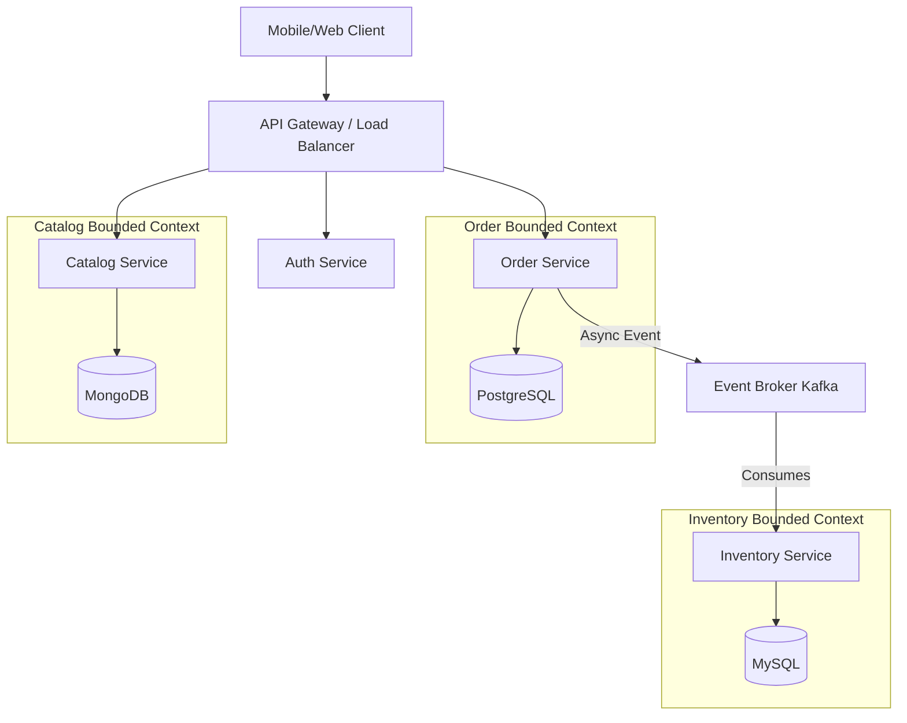
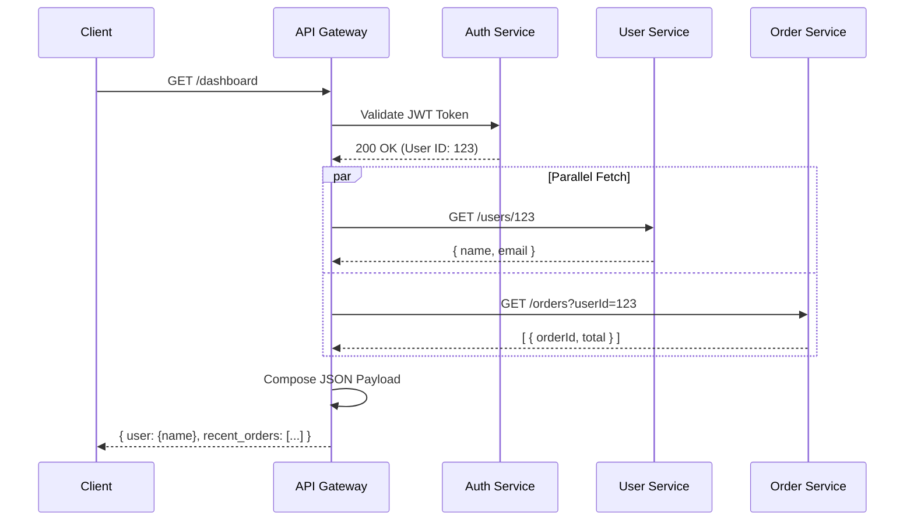
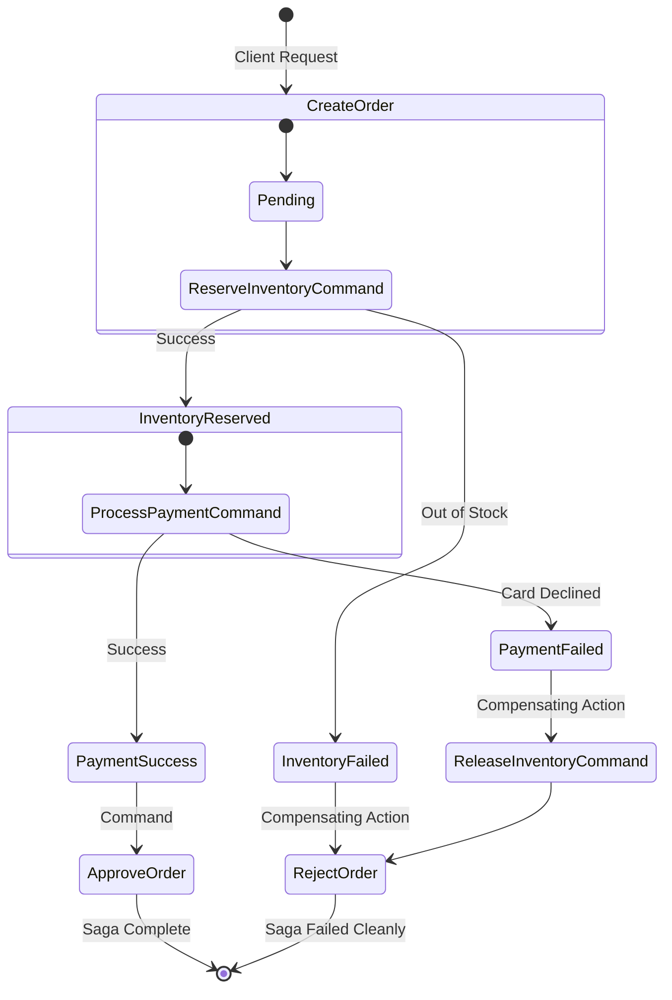
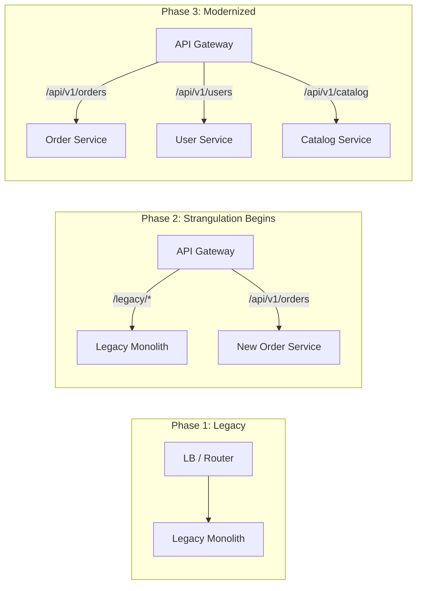
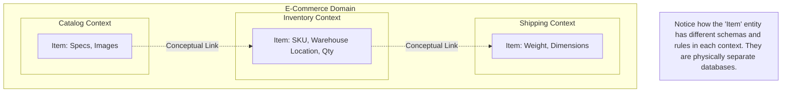

# Chapter 16: Microservices Architecture

## 1. Why This Matters

The transition from monolithic applications to microservices architecture is one of the most profound structural shifts in the history of software engineering. For decades, the default approach to building software was to compile everything into a single deployable unit—a monolith. While this approach worked well for small teams and straightforward domains, it began to crack under the weight of hyper-growth. Companies like Netflix, Amazon, and Uber realized that the single largest bottleneck to their organizational speed was the physical architecture of their codebases. 

Microservices matter because they solve an organizational scaling problem using a technical architecture. Conway's Law states that organizations design systems that mirror their communication structures. As engineering teams grew from tens to hundreds to thousands of developers, coordinating deployments of a single monolithic codebase became an administrative nightmare. Release cycles stretched from days to weeks or even months. A single bug in a minor feature could crash the entire system.

By decoupling the system into small, independently deployable services, organizations can decouple their teams. Microservices allow a team of 5-10 engineers to own a specific business capability end-to-end, from the database schema to the API layer, and deploy it independently of the rest of the company. 

Furthermore, this architecture matters for technical scalability and resilience. In a monolith, if one module consumes excessive CPU or memory, the entire application suffers. In a microservices ecosystem, we can scale compute resources precisely where they are needed. We can also isolate failures; a crash in the recommendation engine shouldn't prevent users from checking out their shopping carts. 

However, this transition comes at a massive cost: the introduction of distributed systems complexity. We replace in-process method calls with network calls. We replace local ACID transactions with distributed sagas. We replace a single database with a sprawling web of disparate data stores. Understanding microservices is not just about knowing how to spin up a Spring Boot application; it's about mastering the art of distributed data management, failure isolation, and asynchronous communication. 

In this chapter, we will comprehensively explore the patterns, anti-patterns, and core principles of designing, building, and maintaining a robust microservices architecture.

## 2. Beginner Intuition

Imagine you are running a restaurant. When you first open, you have a small operation. One highly skilled person, Bob, acts as the host, takes the orders, cooks the food, and washes the dishes. Bob is a **Monolith**. He is highly efficient because there is no communication overhead. If the host needs to tell the chef about an allergy, Bob just remembers it because he is both the host and the chef. 

However, as the restaurant becomes incredibly popular, Bob becomes overwhelmed. You hire more people to help Bob, but everyone is trying to do everything. Waiters are bumping into chefs in the kitchen, dishwashers are trying to seat guests, and it's chaos. If one person drops a tray of food, the entire restaurant stops to clean it up. The restaurant has hit a scaling bottleneck.

To solve this, you reorganize the restaurant into **Microservices**. You create distinct, specialized roles (services) and define strict boundaries and communication protocols between them. 
- You have the **Hosting Service** (greets guests, manages the queue).
- The **Waiter Service** (takes orders, serves food).
- The **Kitchen Service** (cooks food).
- The **Dishwashing Service** (cleans dishes).

Now, the Host doesn't need to know *how* to cook a steak. The Host just needs to know how to seat people and notify the Waiter. The Waiter communicates with the Kitchen by placing a standardized order ticket on a spinning wheel (an **Event Queue**). The Kitchen processes the ticket and rings a bell (an **Event**) when the food is ready. 

If the Dishwasher calls in sick (a service failure), the restaurant doesn't shut down entirely. The Kitchen can still cook, and the Waiters can still serve, using paper plates if necessary (graceful degradation), until the Dishwashing service is restored. 

Furthermore, if you notice the Kitchen is the bottleneck, you can hire three more chefs (scaling the service) without needing to hire more hosts or dishwashers. You are scaling resources exactly where the demand is.

This is the essence of microservices. We break a large, complex system into smaller, specialized, independent components that communicate over standardized channels. We gain independent scalability, fault isolation, and specialized teams, but we must now manage the complexity of communication (the order tickets, the bell) between these separate entities.

## 3. Core Theory

The theoretical foundation of microservices architecture rests on decoupling, bounding contexts, and managing distributed data. Let's delve into the formal concepts.

### 3.1 Monolith vs. Microservices: The Evolution

A **Monolithic Architecture** is a software application where the user interface, business logic, and data access layers are combined into a single program from a single platform.
- **Advantages:** Simple to develop initially, simple to test (everything is in one place), simple to deploy (copy one artifact to a server), and performant (inter-module communication is a fast, in-memory method call).
- **Disadvantages:** Tight coupling leads to a "Big Ball of Mud" over time. Scaling is one-dimensional (you must scale the entire application, not just the bottleneck). Deployment requires coordinating all teams. Technology lock-in (you are stuck with the language/framework chosen on day one).

A **Microservices Architecture** is a suite of small services, each running in its own process and communicating with lightweight mechanisms, often an HTTP resource API. These services are built around business capabilities and independently deployable by fully automated deployment machinery.
- **Advantages:** Independent deployability, independent scalability, technological freedom (polyglot persistence/programming), organizational scaling (Conway's Law), and fault isolation.
- **Disadvantages:** High operational complexity, distributed data management, network latency, complex debugging/tracing, and the overhead of managing eventual consistency.

### 3.2 Domain-Driven Design (DDD)

Microservices are inherently tied to Domain-Driven Design, a methodology pioneered by Eric Evans. You cannot build a successful microservices architecture without defining correct service boundaries. If your boundaries are wrong, you will create a **Distributed Monolith**—a system with all the operational complexity of microservices but the tight coupling of a monolith.

1. **The Domain:** The sphere of knowledge, influence, or activity around which the software is built (e.g., E-commerce, Ride-sharing).
2. **Subdomains:** The domain is broken down into subdomains. 
    - *Core Subdomain:* The essential differentiator for the business (e.g., matching algorithm for Uber).
    - *Supporting Subdomain:* Necessary but not the core differentiator (e.g., product catalog).
    - *Generic Subdomain:* Solved problems that can be bought off-the-shelf (e.g., invoicing, identity management).
3. **Bounded Contexts:** This is the most critical DDD concept for microservices. A Bounded Context is a linguistic and conceptual boundary within which a specific domain model is strictly defined and applicable. A term might mean different things in different contexts.
    - Example: In an E-commerce system, what is an "Item"? 
    - In the **Catalog Context**, an Item is an image, description, and specifications. 
    - In the **Inventory Context**, an Item is a SKU, a warehouse location, and a quantity. 
    - In the **Shipping Context**, an Item is a physical weight, dimensions, and fragility status.
    - *Rule:* Each Bounded Context typically maps to one Microservice. This prevents a god-class "Item" from being created and coupled across the entire organization.
4. **Aggregates:** A cluster of domain objects that can be treated as a single unit. Every aggregate has an **Aggregate Root**. Any external entity that wants to interact with the aggregate must do so through the aggregate root, ensuring consistency boundaries. In microservices, a transaction should ideally not cross aggregate boundaries.
5. **Domain Events:** Something that happened in the domain that domain experts care about (e.g., `OrderPlaced`, `PaymentSucceeded`). These are the primary mechanism for asynchronous communication between bounded contexts.

### 3.3 Service Decomposition Strategies

How do we decide what becomes a service? 
1. **Decompose by Business Capability:** Services correspond directly to business functions. E.g., Order Management, Customer Management, Shipping. This aligns with organizational structure but can sometimes lead to overly broad services if the business capability is complex.
2. **Decompose by Subdomain (DDD):** Defining services based on Bounded Contexts. This is generally the preferred approach for mature systems, as it defines clear data ownership and limits the need for cross-service database joins.

### 3.4 The API Layer: REST, gRPC, and GraphQL

Microservices must expose APIs to clients and to each other.
- **REST (Representational State Transfer):** The standard for client-facing APIs and a common choice for inter-service communication. It relies on HTTP verbs (GET, POST, PUT, DELETE) and resource URIs. 
    - *Best Practices:* Use nouns, not verbs, for URIs (`/users/123`, not `/getUser?id=123`). Version your APIs (e.g., `/v1/users`). Use appropriate HTTP status codes.
- **gRPC:** Developed by Google, a high-performance RPC (Remote Procedure Call) framework using HTTP/2 and Protocol Buffers (Protobuf).
    - *Why it's better for inter-service:* Protobuf provides strongly typed, binary-serialized payloads. It's significantly faster than JSON-over-HTTP/1.1. It supports bi-directional streaming. Contract-first development is enforced by the `.proto` files.
- **GraphQL:** Developed by Facebook, an API query language.
    - *Use Case:* Primarily for Client-to-API-Gateway communication. It solves the "over-fetching" and "under-fetching" problems of REST by allowing the client to specify exactly which fields it needs in a single request, aggregating data from multiple backend microservices.

### 3.5 API Gateways

In a system with 50 microservices, a mobile app cannot maintain 50 different IP addresses and handle authentication for each separately. Enter the **API Gateway**.
- The API Gateway acts as the single entry point for all external clients. 
- **Responsibilities:** 
    1. Request Routing (Reverse proxying requests to the appropriate service).
    2. API Composition (Fetching data from Service A and Service B and combining it for the client).
    3. Authentication and Authorization (Validating JWTs, ensuring the request is authenticated before hitting internal services).
    4. Rate Limiting and Throttling (Protecting backend services from traffic spikes).
    5. SSL Termination.
- **Popular Tools:** Kong, AWS API Gateway, NGINX, Spring Cloud Gateway.

### 3.6 Data Management: The Database per Service Pattern

The golden rule of microservices: **A service's data can only be accessed via its API.** 
Sharing a database (The **Shared Database Anti-Pattern**) completely defeats the purpose of microservices. If Service A and Service B read/write to the same tables, they are tightly coupled. A schema change by Service A breaks Service B.
- **Database per Service:** Each microservice has its own persistent storage. The Orders service might use PostgreSQL (relational), the Product Catalog might use MongoDB (document), and the Session service might use Redis (key-value). This is called **Polyglot Persistence**.
- **The Challenge:** How do we handle queries that need data from multiple services? How do we handle transactions that span multiple services?

### 3.7 Distributed Transactions: Sagas

In a monolith, we rely on ACID database transactions. If an order is placed, we deduct inventory and charge the credit card in a single commit. In microservices, we cannot use two-phase commit (2PC) because it locks resources and creates massive performance bottlenecks and availability risks.
Instead, we use **Sagas**.
A Saga is a sequence of local transactions. Each local transaction updates the database and publishes a message or event to trigger the next local transaction in the saga.
- **Choreography:** Each service listens to domain events and reacts. No central coordinator. (e.g., Order Service emits `OrderCreated`. Inventory Service listens, deducts stock, emits `InventoryReserved`). Good for simple workflows, but hard to trace in complex ones.
- **Orchestration:** A centralized "Saga Orchestrator" service manages the workflow. It sends commands to participant services and awaits replies. 
- **Compensating Transactions:** What if the inventory is reserved, but the credit card fails? The Saga must execute a *compensating transaction* to undo the previous steps. The orchestrator sends a `ReleaseInventory` command. Microservices must be designed for eventual consistency and idempotency.

### 3.8 Inter-Service Communication Patterns

1. **Synchronous (Request-Response):** Using REST or gRPC. Service A waits for Service B to respond. 
    - *Risk:* Temporal coupling. If B is down, A fails. Creates cascading failures.
2. **Asynchronous (Event-Driven):** Service A publishes a message to a broker (Kafka, RabbitMQ) and immediately returns. Service B processes it eventually. 
    - *Benefit:* High decoupling. Resilient to temporal outages (the broker stores the message until B is back).
3. **CQRS (Command Query Responsibility Segregation):** In a distributed system, querying data spanning multiple services is slow via API composition. CQRS separates the write model (Commands) from the read model (Queries). A dedicated "Read Service" consumes events from various write services and builds an optimized, materialized view in its own database specifically for fast querying.
4. **Event Sourcing:** Instead of storing the current state of an entity, store a sequence of state-changing events. The current state is derived by replaying the events. This pairs perfectly with CQRS and Sagas, ensuring 100% reliable audit trails.

## 4. Architecture Deep Dive

Let's do a deep dive into the physical architecture of a modern microservices deployment.

### 4.1 The Network Topology and Service Discovery

Microservices are dynamic. Instances spin up and down based on auto-scaling rules. IP addresses change constantly. A static configuration file (`Service B is at 10.0.0.5`) will not work.
- **Service Registry:** A centralized database of available service instances (e.g., HashiCorp Consul, Netflix Eureka, or etcd).
- **Service Discovery:** When Service A needs to call Service B, it asks the registry, "Give me an IP address for Service B." 
- **Client-side vs. Server-side Discovery:** 
    - *Client-side:* Service A queries the registry, gets a list of IPs, and load-balances across them itself.
    - *Server-side:* Service A calls a load balancer, which queries the registry and forwards the request.
    - *Modern approach (Kubernetes):* Kubernetes handles service discovery natively via internal DNS (CoreDNS) and Service resources (ClusterIP). The platform abstract this complexity away from the application code.

### 4.2 The Service Mesh

As the number of services grows, implementing retries, timeouts, circuit breakers, mutual TLS (mTLS), and tracing in *every single service's code* becomes a massive burden, especially in a polyglot environment (you need a Java library, a Go library, a Python library).
- A **Service Mesh** (e.g., Istio, Linkerd) solves this by decoupling network logic from application code.
- **Sidecar Pattern:** A lightweight proxy (e.g., Envoy) is deployed alongside every microservice instance (in the same Kubernetes Pod). 
- The microservice only communicates via localhost to its sidecar. The sidecar proxy intercepts all incoming and outgoing traffic. 
- The **Control Plane** configures all sidecars. Now, retries, circuit breaking, and mTLS are handled entirely by the proxy layer, transparently to the developer.

### 4.3 Migration Strategies: Monolith to Microservices

You don't rewrite a monolith from scratch. That is a recipe for disaster (often called the "Big Bang Rewrite" anti-pattern). You migrate iteratively.
1. **The Strangler Fig Pattern:** Named by Martin Fowler after the strangler fig tree that grows around an existing tree, eventually killing and replacing it. You build an API gateway in front of the monolith. When a new feature is needed, you build it as a new microservice. You route traffic for that specific feature to the new microservice. Over time, you extract existing modules from the monolith into microservices, slowly routing more traffic away from the monolith until it can be decommissioned.
2. **Branch by Abstraction:** A technique for migrating code inside the monolith before extracting it. You create an abstraction layer (an Interface) over the component to be replaced. You implement the new microservice and write a second implementation of the interface that acts as an HTTP client to the new service. You can toggle between the old local implementation and the new remote one using feature flags until you are confident.

### 4.4 Versioning and Backward Compatibility

APIs must evolve, but you cannot break existing clients or dependent services.
- **Robustness Principle (Postel's Law):** "Be conservative in what you do, be liberal in what you accept from others." Microservices should ignore unknown fields in JSON payloads rather than crashing.
- **Backward Compatible Changes:** Adding new endpoints, adding new optional fields to a request, adding new fields to a response.
- **Breaking Changes:** Removing endpoints, removing fields, changing data types, making optional fields mandatory.
- **Versioning Strategies:** 
    - URI Versioning (`/v1/orders`, `/v2/orders`) - easy to route, explicit.
    - Header Versioning (`Accept: application/vnd.company.v2+json`) - cleaner URIs, harder to test in a browser.
    - GraphQL solves this natively by allowing you to deprecate specific fields in the schema while keeping the overarching endpoint the same.

### 4.5 Testing Microservices

Testing a monolith is straightforward. Testing 50 interacting services is complex.
- **Unit Tests:** Test the internal logic of a single service.
- **Integration Tests:** Test the service's interaction with its own database and external APIs (using mocks like WireMock).
- **Consumer-Driven Contract Testing:** The most crucial pattern for microservices. Since services are developed by different teams, how do we ensure Service A doesn't break Service B's expectations when A updates its API? 
    - The *Consumer* (Service B) writes a "Contract" specifying the exact request it will send and the exact response it expects.
    - This contract is published to a central broker (e.g., Pact Broker).
    - The *Provider* (Service A) pulls these contracts during its CI/CD pipeline and runs them against its new build. If the test fails, Service A is not allowed to deploy. This prevents integration failures before they hit production, without needing to spin up the entire ecosystem.
- **End-to-End (E2E) Testing:** Spinning up the entire system and running user journeys. In microservices, E2E tests are incredibly brittle, slow, and hard to maintain. They should be used sparingly, focusing instead on exhaustive Contract Testing.

## 5. Visual Diagrams

To solidify these concepts, let's look at the architectural flows using Mermaid diagrams.

### 5.1 Microservice Architecture Overview



### 5.2 API Gateway Pattern



### 5.3 Saga Pattern (Orchestration)



### 5.4 Strangler Fig Migration Pattern



### 5.5 Bounded Context Mapping (DDD)



## 6. Real Production Examples

To understand the practical realities of microservices, we must look at how hyper-scale technology companies implemented and evolved them.

### 6.1 Netflix: The Pioneer
Netflix is often credited with popularizing the microservices architecture. Around 2008, Netflix experienced a major database corruption event that took down their monolithic DVD-shipping application for three days. This catalyzed their move to the cloud (AWS) and to microservices.
- **Scale:** Today, Netflix runs thousands of microservices handling billions of requests per day.
- **Chaos Engineering:** Netflix realized that in a distributed system, failure is constant. They invented **Chaos Monkey**, a script that randomly terminates production VM instances to force engineers to build resilient, auto-healing systems. 
- **Client-Side Load Balancing:** Netflix pioneered tools like Ribbon and Eureka (Service Registry) to handle dynamic IP routing before Kubernetes existed.
- **API Gateways (Zuul):** They built highly specialized gateways to route traffic based on device types (Smart TVs vs. Mobile vs. Web).

### 6.2 Uber: The "Macroservice" Correction
Uber initially embraced a hyper-granular microservice approach, eventually reaching over 4,000 microservices. They decomposed services so finely that engineers had to understand 50 different repositories just to add a simple feature.
- **The Pain:** Tracing a single request across 100 network hops resulted in massive latency and debugging nightmares.
- **The Solution (DOMA):** Uber shifted to **Domain-Oriented Microservice Architecture (DOMA)**. Instead of tiny nano-services, they grouped related microservices into logical "Domains" hidden behind a single Domain Gateway. This essentially shifted them from extreme microservices back toward "Macroservices" or modularized domains, proving that decomposition can go too far.

### 6.3 Amazon: Service-Oriented Architecture (SOA)
In 2002, Jeff Bezos issued his famous "API Mandate" memo. He declared that all teams must expose their data and functionality through service interfaces, teams must communicate only through these interfaces, and there would be no direct database reads or shared memory between teams.
- **The Result:** This mandate created the foundation for Amazon.com's massive scalability and directly led to the creation of AWS (Amazon Web Services). Because every internal team operated via APIs, Amazon realized they could expose these same infrastructure APIs to the public, birthing modern cloud computing.

### 6.4 Spotify: The Squad Model
Spotify's contribution to microservices is largely organizational. They structured their company into "Squads" (small, cross-functional, autonomous teams), "Tribes" (groups of squads working on related areas), and "Guilds" (communities of interest).
- **Architecture alignment:** Each Squad owns one or more microservices entirely. A Squad handles the frontend UI component, the backend microservice, and the database. This aligns perfectly with Conway's Law, allowing Spotify to scale its engineering organization without gridlock.

## 7. Java Implementations

Let's look at production-grade Java code for core microservice patterns. We will use Spring Boot, as it is the industry standard for Java microservices.

### 7.1 A Resilient Spring Boot Microservice

This example shows a robust service using Spring Boot, focusing on resilience patterns (Circuit Breaker via Resilience4j) and clean REST API design.

```java
package com.distributedsystems.orderservice.controller;

import org.springframework.web.bind.annotation.*;
import org.springframework.http.ResponseEntity;
import io.github.resilience4j.circuitbreaker.annotation.CircuitBreaker;
import lombok.RequiredArgsConstructor;
import lombok.extern.slf4j.Slf4j;

@RestController
@RequestMapping("/api/v1/orders")
@RequiredArgsConstructor
@Slf4j
public class OrderController {

    private final OrderService orderService;
    private final InventoryClient inventoryClient; // Feign client to call Inventory Service

    @PostMapping
    public ResponseEntity<OrderResponse> createOrder(@RequestBody OrderRequest request) {
        log.info("Received order request for user: {}", request.getUserId());
        OrderResponse response = orderService.processOrder(request);
        return ResponseEntity.ok(response);
    }

    // Applying a Circuit Breaker pattern to inter-service communication
    @GetMapping("/{orderId}/inventory-status")
    @CircuitBreaker(name = "inventoryService", fallbackMethod = "inventoryFallback")
    public ResponseEntity<String> checkInventoryStatus(@PathVariable String orderId) {
        // This is a synchronous network call to another microservice
        log.info("Calling Inventory Service synchronously...");
        return ResponseEntity.ok(inventoryClient.checkStock(orderId));
    }

    // Fallback method executed when the circuit breaker is OPEN (service down)
    public ResponseEntity<String> inventoryFallback(String orderId, Exception e) {
        log.error("Inventory service is down. Executing fallback for order {}", orderId);
        return ResponseEntity.status(503).body("Inventory check temporarily unavailable. Try again later.");
    }
}
```

### 7.2 Event-Driven Communication with Apache Kafka

To avoid synchronous bottlenecks, microservices should emit events. Here is a Spring Kafka producer and consumer.

**Producer (Order Service):**
```java
package com.distributedsystems.orderservice.messaging;

import org.springframework.kafka.core.KafkaTemplate;
import org.springframework.stereotype.Service;
import lombok.RequiredArgsConstructor;

@Service
@RequiredArgsConstructor
public class OrderEventPublisher {

    private final KafkaTemplate<String, Object> kafkaTemplate;
    private static final String TOPIC = "order-created-events";

    public void publishOrderCreatedEvent(Order order) {
        OrderCreatedEvent event = new OrderCreatedEvent(
            order.getId(), 
            order.getCustomerId(), 
            order.getTotalAmount()
        );
        
        // Keying by OrderID ensures all events for the same order go to the same partition
        kafkaTemplate.send(TOPIC, order.getId(), event);
        System.out.println("Published OrderCreatedEvent to Kafka topic: " + TOPIC);
    }
}
```

**Consumer (Inventory Service):**
```java
package com.distributedsystems.inventoryservice.messaging;

import org.springframework.kafka.annotation.KafkaListener;
import org.springframework.stereotype.Service;
import lombok.extern.slf4j.Slf4j;

@Service
@Slf4j
public class OrderEventConsumer {

    private final InventoryService inventoryService;

    public OrderEventConsumer(InventoryService inventoryService) {
        this.inventoryService = inventoryService;
    }

    @KafkaListener(topics = "order-created-events", groupId = "inventory-group")
    public void consumeOrderCreatedEvent(OrderCreatedEvent event) {
        log.info("Received OrderCreatedEvent for Order ID: {}", event.getOrderId());
        
        try {
            // Idempotent operation to reserve inventory
            inventoryService.reserveStockForOrder(event);
        } catch (Exception e) {
            log.error("Failed to process event. DLQ strategy needed.", e);
            // In production, throw exception to trigger Kafka retry, 
            // or route to a Dead Letter Queue (DLQ)
        }
    }
}
```

### 7.3 Spring Cloud API Gateway

Implementing a centralized entry point using Spring Cloud Gateway to route and filter traffic.

```yaml
# application.yml for the API Gateway
server:
  port: 8080

spring:
  cloud:
    gateway:
      routes:
        # Route 1: Direct requests starting with /api/orders to the order-service
        - id: order-service-route
          uri: lb://order-service  # 'lb://' uses client-side load balancing via Service Registry
          predicates:
            - Path=/api/orders/**
          filters:
            - AddRequestHeader=X-Gateway-Routed, true
            - name: RequestRateLimiter # Prevent DDoS or abuse
              args:
                redis-rate-limiter.replenishRate: 10
                redis-rate-limiter.burstCapacity: 20

        # Route 2: Direct catalog requests
        - id: catalog-service-route
          uri: lb://catalog-service
          predicates:
            - Path=/api/catalog/**
```

### 7.4 gRPC Inter-Service Contract (.proto)

For high-performance internal communication, Protobuf and gRPC are preferred.

```protobuf
syntax = "proto3";

package com.distributedsystems.shipping;
option java_multiple_files = true;
option java_package = "com.distributedsystems.shipping.grpc";

// The Shipping Service definition
service ShippingService {
    // A unary RPC call
    rpc CalculateShippingCost (ShippingRequest) returns (ShippingResponse);
    
    // A server-streaming RPC call (e.g., getting real-time tracking updates)
    rpc StreamTrackingUpdates (TrackingRequest) returns (stream TrackingUpdate);
}

// Strictly typed data structures
message ShippingRequest {
    string order_id = 1;
    string destination_zip = 2;
    double package_weight_kg = 3;
}

message ShippingResponse {
    double cost_usd = 1;
    string estimated_delivery_date = 2;
}

message TrackingRequest {
    string tracking_number = 1;
}

message TrackingUpdate {
    string location = 1;
    string timestamp = 2;
    string status = 3;
}
```

## 8. Performance Analysis

Microservices introduce significant performance overhead compared to a monolith. The core shift is replacing fast, in-memory function calls (nanoseconds) with network calls (milliseconds).

### 8.1 Network Latency and The N+1 Problem
If an API Gateway needs to resolve a user dashboard, it might need to call the User Service, Order Service, and Recommendation Service. 
- **Sequential Calls:** If called sequentially, the latency is `L_user + L_order + L_rec`. This is disastrous for performance.
- **Parallel Calls:** By making concurrent asynchronous calls (using Java's `CompletableFuture` or WebFlux), latency is reduced to `max(L_user, L_order, L_rec)`.
- **The N+1 API Problem:** A common anti-pattern where an endpoint returns a list of N items (e.g., 50 orders), and the client then makes N separate API calls to fetch details for each item. This destroys performance. It must be solved via **Batching** endpoints or using GraphQL to fetch the graph in one network hop.

### 8.2 Serialization Overhead
Microservices communicate primarily via JSON over HTTP. Parsing JSON strings into Java Objects (Jackson/Gson) requires CPU cycles and memory allocation. 
- **Mitigation:** High-throughput internal services should shift from JSON/HTTP to binary serialization (Protocol Buffers, Avro) over HTTP/2 (gRPC) or TCP. Binary protocols are heavily optimized, smaller over the wire, and require significantly less CPU to deserialize.

### 8.3 Data Duplication and Consistency Overhead
To avoid joining across databases over the network, data is often duplicated. The Order Service might keep a cached, read-only copy of User Data. 
- Keeping this duplicated data in sync requires asynchronous events. The overhead here is not necessarily computational, but rather the complexity of handling **Eventual Consistency**. A user updates their name, but for a few seconds, the Order Service still displays the old name.

### 8.4 Scalability and Resource Utilization
While single-request latency increases, overall system throughput and scalability improve dramatically.
- In a monolith, if memory is exhausted, you must deploy an entire replica of the massive application.
- In microservices, if the Image Processing Service is CPU-bound, you can deploy 50 instances of *only* that service, optimizing your cloud compute costs.

## 9. Tradeoffs

The decision to adopt microservices should never be taken lightly. It is a massive architectural tradeoff.

### 9.1 Pros (The "Why")
1. **Organizational Scaling:** Multiple teams can work autonomously without stepping on each other's toes (Conway's Law).
2. **Independent Deployability:** A bug fix in the UI service doesn't require compiling and deploying the payment processing code. Deployments become faster and safer.
3. **Fault Isolation:** A memory leak in the recommendation engine will crash the recommendation service, but users can still log in, browse, and checkout.
4. **Polyglot Persistence:** Choosing the right tool for the job. Neo4j for social graphs, Cassandra for time-series data, Postgres for transactional data.
5. **Elastic Scalability:** Scale only the components that are under load.

### 9.2 Cons (The "Cost")
1. **Extreme Operational Complexity:** Deploying one monolith is easy. Deploying, monitoring, and managing 50 independent services requires a highly mature DevOps culture (Kubernetes, CI/CD, Infrastructure as Code).
2. **Distributed Data Management:** ACID transactions are gone. You must implement complex Sagas, compensate for failures, and reason about eventual consistency. 
3. **Network Fallibility:** The network is not reliable. Calls will fail, timeout, or duplicate. You must write code to handle retries, idempotency, and circuit breaking.
4. **Testing Difficulty:** Integration testing across bounded contexts is notoriously difficult. 
5. **Cold Starts & Memory Overhead:** Running 50 JVMs requires more base memory than running 1 monolith JVM due to framework overhead per process.

### 9.3 When NOT to use Microservices
- **Startups seeking Product-Market Fit:** When your domain is unknown and changing rapidly, microservice boundaries will be wrong. Re-drawing boundaries between microservices is incredibly painful. Start with a Monolith. (The "Monolith First" strategy advocated by Martin Fowler).
- **Small Teams:** If you have 5 developers, the operational overhead of managing Kubernetes, service meshes, and distributed tracing will consume all your engineering time.
- **Tightly Coupled Domains:** If every operation in your system fundamentally requires joining data across all tables, microservices will turn your system into a slow, distributed monolith.

## 10. Failure Scenarios

Distributed systems fail in novel and terrifying ways. Designing for failure is mandatory.

### 10.1 The Network Partition (Split Brain)
- **Scenario:** The network link between the User Service and the Order Service is severed. Both services are running perfectly, but cannot talk.
- **Impact:** According to the CAP Theorem, you must choose between Consistency and Availability. Do you let the user place an order without validating their account (Available but Inconsistent), or do you block the order (Consistent but Unavailable)? Microservices heavily lean toward Availability and Eventual Consistency.

### 10.2 Cascading Failures
- **Scenario:** The Inventory Service slows down (due to a bad DB query). The Order Service makes synchronous HTTP calls to Inventory. Because Inventory is slow, threads in the Order Service back up waiting for responses. Soon, the Order Service runs out of threads and crashes. The API Gateway then crashes trying to reach the Order Service.
- **Solution:** **Circuit Breakers** and **Timeouts**. The Order Service must say, "If Inventory doesn't respond in 500ms, abort." If Inventory fails 50% of the time, the Circuit Breaker "opens," immediately failing fast without even attempting the network call, protecting the Order Service from thread exhaustion.

### 10.3 The Retry Storm (Thundering Herd)
- **Scenario:** Service A calls Service B. Service B is struggling under high load. Service A times out and automatically *retries*. Now Service B is receiving 2x the traffic, causing it to fail harder. Hundreds of clients retry simultaneously, effectively executing a self-inflicted DDoS attack.
- **Solution:** Implement **Exponential Backoff with Jitter**. Retries must wait exponentially longer (1s, 2s, 4s, 8s) and add random jitter (e.g., 4.2s, 4.8s) so clients don't retry at the exact same millisecond.

### 10.4 The Dual Write Problem
- **Scenario:** Service A saves data to its database, then publishes an event to Kafka. 
  ```java
  repository.save(order);
  kafkaTemplate.send("topic", event);
  ```
  What if the database commits, but the Kafka broker goes down before the event is sent? The database has the order, but downstream services never know. 
- **Solution:** The **Transactional Outbox Pattern**. The service writes the Order *and* the Event to a local database table (the Outbox) in a single ACID transaction. A separate background process reliably polls the Outbox table and publishes the events to Kafka.

### 10.5 Distributed Deadlocks
- **Scenario:** In an orchestrated Saga, Transaction A locks Resource 1 and waits for Resource 2. Transaction B locks Resource 2 and waits for Resource 1. Because these locks span different databases and services, standard RDBMS deadlock detection cannot see them.
- **Solution:** Sagas must avoid distributed locking entirely. Rely on compensating transactions and commutative operations instead of distributed state locking.

## 11. Debugging & Observability

In a monolith, you debug by reading a single log file or attaching a debugger to the process. In a microservices architecture, a single user request might touch 15 different services across 30 different servers. Traditional debugging is impossible. You need **Observability**.

### 11.1 Distributed Tracing
- **Concept:** When a request hits the API Gateway, it generates a unique `Trace ID` (e.g., `req-abc-123`). This ID is passed in the HTTP Headers (e.g., `X-B3-TraceId`) to every subsequent downstream service.
- **Implementation:** Services log their local work as a `Span`, tagged with the global `Trace ID`. These spans are sent asynchronously to a tracing backend.
- **Tools:** Jaeger, Zipkin, OpenTelemetry.
- **Benefit:** You can visualize the entire lifecycle of a request as a waterfall chart, immediately identifying exactly which service in the chain caused the 5-second latency delay.

### 11.2 Centralized Logging
- **Concept:** 50 microservices outputting logs to local disk is useless. Logs must be aggregated into a central, searchable database.
- **Implementation:** The ELK Stack (Elasticsearch, Logstash, Kibana) or EFK (Fluentd). Every log line must be structured (JSON format) and include the `Trace ID`, the Service Name, and the Environment.
- **Benefit:** You can search `traceId="req-abc-123"` in Kibana and instantly see the log output from every service involved in that specific user transaction in chronological order.

### 11.3 Metrics and Dashboards
- **Concept:** Logging is for debugging specific events; metrics are for understanding aggregate system health over time.
- **Implementation:** Services expose a `/metrics` endpoint (e.g., using Spring Boot Actuator/Micrometer). A time-series database like **Prometheus** scrapes these metrics every 10 seconds. **Grafana** is used to build visual dashboards.
- **Key Metrics (The RED Method):** 
    - **R**ate: Requests per second.
    - **E**rrors: Error rate per second.
    - **D**uration: Response time (p50, p95, p99 latency).
- **Alerting:** If the 99th percentile (p99) latency of the Payment Service exceeds 2 seconds for 5 minutes, Prometheus triggers an alert to PagerDuty to wake up an on-call engineer.

## 12. Interview Questions

Microservices are a major topic in senior engineering and system design interviews. Here is how to prepare.

### 12.1 Beginner
**Q: What is the main advantage of microservices over a monolithic architecture?**
**A:** Independent deployability and the ability to scale development teams organizationally. It solves the human coordination problem by defining strict technical boundaries. It also allows independent scaling of resources.

**Q: Why shouldn't microservices share a single relational database?**
**A:** Sharing a database creates tight coupling at the data layer. If Service A changes the schema of a table that Service B also reads from, Service B will break. This defeats the purpose of independent deployability. It's called the Shared Database Anti-Pattern.

### 12.2 Intermediate
**Q: Explain the API Gateway pattern. Why not let clients call microservices directly?**
**A:** If clients call services directly, they need to manage dozens of URLs, handle authentication multiple times, and make many round-trip calls over the internet (N+1 problem). An API Gateway acts as a single entry point, handles cross-cutting concerns like Auth and Rate Limiting, and can compose responses from multiple backend services, reducing client-side latency.

**Q: How do you handle distributed transactions? (e.g., booking a flight and a hotel)**
**A:** 2PC (Two-Phase Commit) is too slow and locks resources. Instead, use the Saga Pattern. It's a sequence of local transactions where each step publishes an event to trigger the next. If a step fails, the Saga executes *compensating transactions* to undo the previous steps (e.g., calling a `/cancel-flight` endpoint).

### 12.3 Advanced (FAANG-Level)
**Q: You have a highly concurrent system. Service A writes to its DB and publishes an event to Kafka. How do you guarantee the event is published if and only if the DB commits?**
**A:** Use the Transactional Outbox Pattern. Create an `outbox` table in Service A's database. When saving the entity, save the event payload to the outbox table in the *same ACID transaction*. Then, use a background polling thread or a CDC (Change Data Capture) tool like Debezium to read the outbox table and publish to Kafka.

**Q: In an event-driven architecture using Sagas, how do you handle messages arriving out of order or being processed twice?**
**A:** Network delivery guarantees are usually "at-least-once." Therefore, message consumers *must* be idempotent. This is achieved by tracking processed `Message IDs` in the database, or by designing operations to be naturally idempotent (e.g., `UPDATE status = 'PAID'` is idempotent; `UPDATE balance = balance - 10` is not). To handle out-of-order messages, you can use state machines or version numbers to reject older events if a newer one has already been processed.

## 13. Exercises

### 13.1 Conceptual Exercise: Domain Decomposition
You are building a "Food Delivery App" (like UberEats).
1. Identify at least 5 bounded contexts.
2. For each context, define the "Aggregate Root" entity.
3. Draw a diagram showing how these contexts communicate when a user places an order. (Which calls are synchronous? Which are asynchronous?)

### 13.2 Coding Exercise: The Strangler Fig
1. Create a simple Spring Boot Monolith with two REST endpoints: `/api/users` and `/api/orders`. 
2. Create a new, separate Spring Boot application for the `Order Service`.
3. Set up Spring Cloud Gateway (or NGINX) locally. Configure it to route `/api/users` to the Monolith on port 8080, and `/api/orders` to the new Order Service on port 8081.

### 13.3 System Design Exercise: Saga Implementation
Design a Saga for an E-commerce checkout process involving Inventory, Payment, and Shipping services.
1. Document the "Happy Path" sequence of events.
2. Document the "Failure Path" if the Payment fails but Inventory was already reserved. What are the specific compensating commands?
3. Decide whether you would use Choreography or Orchestration for this flow, and justify your choice.

## 14. Expert Insights

Microservices are a journey, not a destination. Here are insights from running these systems at scale:

1. **"Distributed Monoliths are Worse Than Monoliths."** The most common failure mode of microservice adoption is getting the boundaries wrong. If your services constantly require synchronous API calls to other services to complete a basic business function, you have built a distributed monolith. You suffer all the latency and operational pain of microservices without gaining decoupling. Redraw your boundaries based on DDD.
2. **"Eventual Consistency is a Business Decision, Not a Technical One."** Engineers stress over data being out of sync for 2 seconds. In reality, you must ask the Product Manager: "Is it okay if the user's updated profile picture doesn't appear on their old comments for 5 seconds?" Usually, the answer is yes. Don't build massive distributed locking systems to guarantee strong consistency if the business doesn't require it.
3. **"Master Observability Before Splitting."** Do not split a monolith until you have distributed tracing (OpenTelemetry) and centralized logging (ELK/Datadog) fully functional. Debugging microservices blindly is career-ending.
4. **"Embrace Dumb Pipes, Smart Endpoints."** A core tenet of microservices (unlike older SOA and ESB architectures). The communication mechanism (Kafka, RabbitMQ) should be "dumb"—it just routes messages. All the business logic, routing intelligence, and data transformation must live in the endpoints (the microservices themselves).

## 15. Chapter Summary

- **Microservices** solve the organizational bottlenecks of massive monoliths by decomposing software into independently deployable units based on business capabilities.
- **Domain-Driven Design (DDD)** and Bounded Contexts are the correct methodology for defining service boundaries to avoid distributed monoliths.
- **Database per Service** is a strict requirement to ensure decoupling. Data cannot be shared via database tables; it must be shared via APIs or Events.
- **API Gateways** manage external traffic, handling routing, composition, and cross-cutting concerns like authentication.
- **Sagas** replace 2PC for distributed transactions, using a sequence of local transactions and compensating actions to maintain data consistency.
- **Asynchronous Communication** (Event-Driven Architecture) is highly preferred over Synchronous (REST/gRPC) for inter-service communication to increase resilience and reduce temporal coupling.
- **Migration** should be iterative using the Strangler Fig pattern, never a "Big Bang" rewrite.
- **Observability** (Distributed Tracing, Centralized Logging, Metrics) is absolutely critical to survive the operational complexity of distributed systems.
