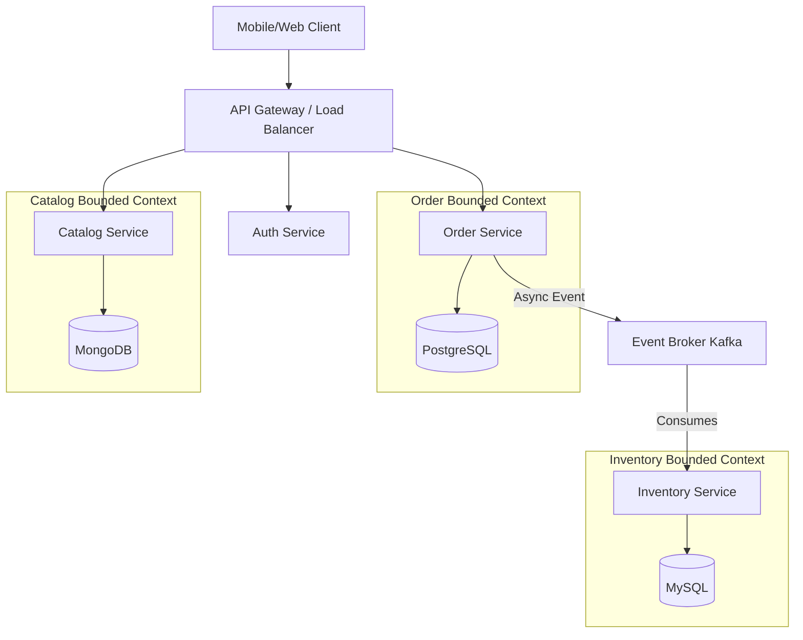
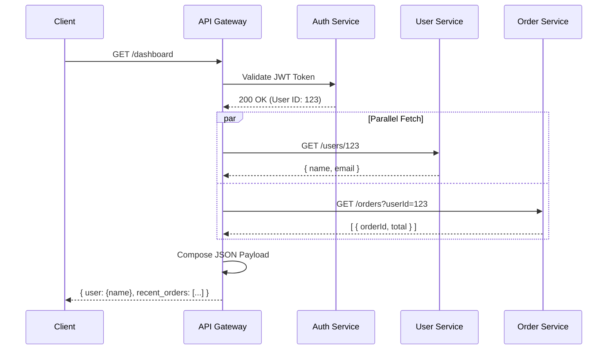
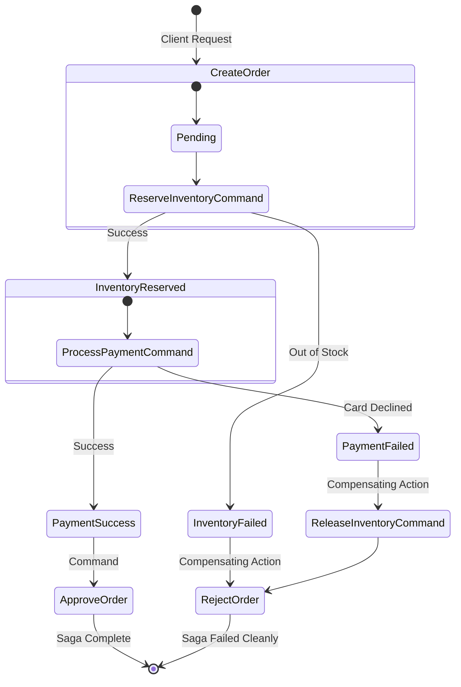
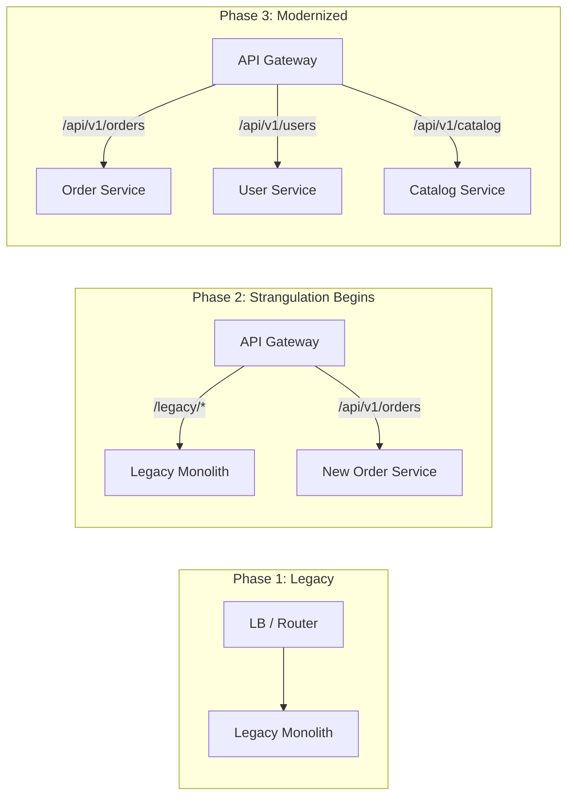
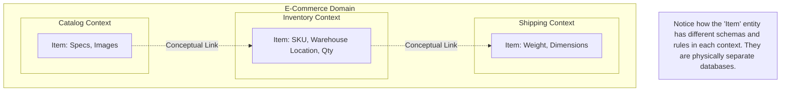

## 5. Visual Diagrams

To solidify these concepts, let's look at the architectural flows using Mermaid diagrams.

### 5.1 Microservice Architecture Overview



### 5.2 API Gateway Pattern



### 5.3 Saga Pattern (Orchestration)



### 5.4 Strangler Fig Migration Pattern



### 5.5 Bounded Context Mapping (DDD)



## 6. Real Production Examples

To understand the practical realities of microservices, we must look at how hyper-scale technology companies implemented and evolved them.

### 6.1 Netflix: The Pioneer
Netflix is often credited with popularizing the microservices architecture. Around 2008, Netflix experienced a major database corruption event that took down their monolithic DVD-shipping application for three days. This catalyzed their move to the cloud (AWS) and to microservices.
- **Scale:** Today, Netflix runs thousands of microservices handling billions of requests per day.
- **Chaos Engineering:** Netflix realized that in a distributed system, failure is constant. They invented **Chaos Monkey**, a script that randomly terminates production VM instances to force engineers to build resilient, auto-healing systems. 
- **Client-Side Load Balancing:** Netflix pioneered tools like Ribbon and Eureka (Service Registry) to handle dynamic IP routing before Kubernetes existed.
- **API Gateways (Zuul):** They built highly specialized gateways to route traffic based on device types (Smart TVs vs. Mobile vs. Web).

### 6.2 Uber: The "Macroservice" Correction
Uber initially embraced a hyper-granular microservice approach, eventually reaching over 4,000 microservices. They decomposed services so finely that engineers had to understand 50 different repositories just to add a simple feature.
- **The Pain:** Tracing a single request across 100 network hops resulted in massive latency and debugging nightmares.
- **The Solution (DOMA):** Uber shifted to **Domain-Oriented Microservice Architecture (DOMA)**. Instead of tiny nano-services, they grouped related microservices into logical "Domains" hidden behind a single Domain Gateway. This essentially shifted them from extreme microservices back toward "Macroservices" or modularized domains, proving that decomposition can go too far.

### 6.3 Amazon: Service-Oriented Architecture (SOA)
In 2002, Jeff Bezos issued his famous "API Mandate" memo. He declared that all teams must expose their data and functionality through service interfaces, teams must communicate only through these interfaces, and there would be no direct database reads or shared memory between teams.
- **The Result:** This mandate created the foundation for Amazon.com's massive scalability and directly led to the creation of AWS (Amazon Web Services). Because every internal team operated via APIs, Amazon realized they could expose these same infrastructure APIs to the public, birthing modern cloud computing.

### 6.4 Spotify: The Squad Model
Spotify's contribution to microservices is largely organizational. They structured their company into "Squads" (small, cross-functional, autonomous teams), "Tribes" (groups of squads working on related areas), and "Guilds" (communities of interest).
- **Architecture alignment:** Each Squad owns one or more microservices entirely. A Squad handles the frontend UI component, the backend microservice, and the database. This aligns perfectly with Conway's Law, allowing Spotify to scale its engineering organization without gridlock.

## 7. Java Implementations

Let's look at production-grade Java code for core microservice patterns. We will use Spring Boot, as it is the industry standard for Java microservices.

### 7.1 A Resilient Spring Boot Microservice

This example shows a robust service using Spring Boot, focusing on resilience patterns (Circuit Breaker via Resilience4j) and clean REST API design.

```java
package com.distributedsystems.orderservice.controller;

import org.springframework.web.bind.annotation.*;
import org.springframework.http.ResponseEntity;
import io.github.resilience4j.circuitbreaker.annotation.CircuitBreaker;
import lombok.RequiredArgsConstructor;
import lombok.extern.slf4j.Slf4j;

@RestController
@RequestMapping("/api/v1/orders")
@RequiredArgsConstructor
@Slf4j
public class OrderController {

    private final OrderService orderService;
    private final InventoryClient inventoryClient; // Feign client to call Inventory Service

    @PostMapping
    public ResponseEntity<OrderResponse> createOrder(@RequestBody OrderRequest request) {
        log.info("Received order request for user: {}", request.getUserId());
        OrderResponse response = orderService.processOrder(request);
        return ResponseEntity.ok(response);
    }

    // Applying a Circuit Breaker pattern to inter-service communication
    @GetMapping("/{orderId}/inventory-status")
    @CircuitBreaker(name = "inventoryService", fallbackMethod = "inventoryFallback")
    public ResponseEntity<String> checkInventoryStatus(@PathVariable String orderId) {
        // This is a synchronous network call to another microservice
        log.info("Calling Inventory Service synchronously...");
        return ResponseEntity.ok(inventoryClient.checkStock(orderId));
    }

    // Fallback method executed when the circuit breaker is OPEN (service down)
    public ResponseEntity<String> inventoryFallback(String orderId, Exception e) {
        log.error("Inventory service is down. Executing fallback for order {}", orderId);
        return ResponseEntity.status(503).body("Inventory check temporarily unavailable. Try again later.");
    }
}
```

### 7.2 Event-Driven Communication with Apache Kafka

To avoid synchronous bottlenecks, microservices should emit events. Here is a Spring Kafka producer and consumer.

**Producer (Order Service):**
```java
package com.distributedsystems.orderservice.messaging;

import org.springframework.kafka.core.KafkaTemplate;
import org.springframework.stereotype.Service;
import lombok.RequiredArgsConstructor;

@Service
@RequiredArgsConstructor
public class OrderEventPublisher {

    private final KafkaTemplate<String, Object> kafkaTemplate;
    private static final String TOPIC = "order-created-events";

    public void publishOrderCreatedEvent(Order order) {
        OrderCreatedEvent event = new OrderCreatedEvent(
            order.getId(), 
            order.getCustomerId(), 
            order.getTotalAmount()
        );
        
        // Keying by OrderID ensures all events for the same order go to the same partition
        kafkaTemplate.send(TOPIC, order.getId(), event);
        System.out.println("Published OrderCreatedEvent to Kafka topic: " + TOPIC);
    }
}
```

**Consumer (Inventory Service):**
```java
package com.distributedsystems.inventoryservice.messaging;

import org.springframework.kafka.annotation.KafkaListener;
import org.springframework.stereotype.Service;
import lombok.extern.slf4j.Slf4j;

@Service
@Slf4j
public class OrderEventConsumer {

    private final InventoryService inventoryService;

    public OrderEventConsumer(InventoryService inventoryService) {
        this.inventoryService = inventoryService;
    }

    @KafkaListener(topics = "order-created-events", groupId = "inventory-group")
    public void consumeOrderCreatedEvent(OrderCreatedEvent event) {
        log.info("Received OrderCreatedEvent for Order ID: {}", event.getOrderId());
        
        try {
            // Idempotent operation to reserve inventory
            inventoryService.reserveStockForOrder(event);
        } catch (Exception e) {
            log.error("Failed to process event. DLQ strategy needed.", e);
            // In production, throw exception to trigger Kafka retry, 
            // or route to a Dead Letter Queue (DLQ)
        }
    }
}
```

### 7.3 Spring Cloud API Gateway

Implementing a centralized entry point using Spring Cloud Gateway to route and filter traffic.

```yaml
# application.yml for the API Gateway
server:
  port: 8080

spring:
  cloud:
    gateway:
      routes:
        # Route 1: Direct requests starting with /api/orders to the order-service
        - id: order-service-route
          uri: lb://order-service  # 'lb://' uses client-side load balancing via Service Registry
          predicates:
            - Path=/api/orders/**
          filters:
            - AddRequestHeader=X-Gateway-Routed, true
            - name: RequestRateLimiter # Prevent DDoS or abuse
              args:
                redis-rate-limiter.replenishRate: 10
                redis-rate-limiter.burstCapacity: 20

        # Route 2: Direct catalog requests
        - id: catalog-service-route
          uri: lb://catalog-service
          predicates:
            - Path=/api/catalog/**
```

### 7.4 gRPC Inter-Service Contract (.proto)

For high-performance internal communication, Protobuf and gRPC are preferred.

```protobuf
syntax = "proto3";

package com.distributedsystems.shipping;
option java_multiple_files = true;
option java_package = "com.distributedsystems.shipping.grpc";

// The Shipping Service definition
service ShippingService {
    // A unary RPC call
    rpc CalculateShippingCost (ShippingRequest) returns (ShippingResponse);
    
    // A server-streaming RPC call (e.g., getting real-time tracking updates)
    rpc StreamTrackingUpdates (TrackingRequest) returns (stream TrackingUpdate);
}

// Strictly typed data structures
message ShippingRequest {
    string order_id = 1;
    string destination_zip = 2;
    double package_weight_kg = 3;
}

message ShippingResponse {
    double cost_usd = 1;
    string estimated_delivery_date = 2;
}

message TrackingRequest {
    string tracking_number = 1;
}

message TrackingUpdate {
    string location = 1;
    string timestamp = 2;
    string status = 3;
}
```
