# Chapter 17: Service Discovery

---

## 1. Why This Matters

In the era of monolithic applications, finding a service was trivial. Your database lived at `db.internal:5432`, your cache at `cache.internal:6379`, and your application at `app.internal:8080`. You wrote these addresses into configuration files and they rarely changed. Life was simple.

Then microservices happened.

Suddenly, instead of one application, you had 50. Instead of one database, you had 15. Instead of static servers, you had containers that spun up and down in seconds. Instead of a single data center, you operated across three regions. The static IP address taped to your monitor was no longer sufficient.

**Service discovery** is the mechanism by which services in a distributed system locate and communicate with each other. It is a foundational infrastructure concern that, when done poorly, cascades into every part of your system — causing cascading failures, stale routing, and debugging nightmares.

### Why Is Service Discovery Critical?

1. **Dynamic Environments**: In cloud-native architectures, instances are ephemeral. Containers start and stop. Auto-scaling groups grow and shrink. IP addresses are recycled. You cannot hardcode endpoints.

2. **Container Orchestration**: Kubernetes, Docker Swarm, and Mesos dynamically schedule containers across nodes. A service that was on `10.0.1.5` might move to `10.0.2.12` after a pod restart.

3. **Zero-Downtime Deployments**: Blue-green and canary deployments require the ability to route traffic to new instances while draining old ones — dynamically.

4. **Fault Tolerance**: When a service instance crashes, traffic must be routed away from it immediately. Service discovery provides the health-checking and deregistration mechanisms to make this possible.

5. **Multi-Region and Multi-Cloud**: Modern systems span regions and cloud providers. Service discovery must work across network boundaries.

6. **Developer Velocity**: Without service discovery, every new microservice requires manual DNS entries, load balancer configurations, and coordination meetings. Discovery automates this entirely.

### The Scale of the Problem

| Company | Microservices | Service Instances | Discovery Queries/sec |
|---------|--------------|-------------------|-----------------------|
| Netflix | 700+ | 10,000+ | Millions |
| Uber | 4,000+ | 40,000+ | Tens of millions |
| Alibaba | 10,000+ | 100,000+ | Hundreds of millions |
| Google | Unknown | Billions of containers/week | Unfathomable |

At Netflix, a single user request might traverse 10+ microservices. If service discovery fails, the entire user experience collapses. This isn't a nice-to-have — it's an existential infrastructure requirement.

### Industry Relevance

Service discovery appears in virtually every system design interview at FAANG companies:
- "Design a URL shortener" → How does the API gateway find the URL service?
- "Design a ride-sharing app" → How does the matching service find the notification service?
- "Design a distributed cache" → How do clients discover cache nodes?

Understanding service discovery separates junior engineers who "glue APIs together" from senior engineers who build resilient, self-healing distributed systems.

---

## 2. Beginner Intuition

### The Restaurant Analogy

Imagine you're in a large shopping mall with 200 restaurants. You're hungry and want sushi.

**Without service discovery (hardcoded endpoints):**
You have a printed map from 2019 that says "Sushi Palace is at Location B-42." You walk there, but it's now a shoe store. You're stuck. The map is wrong, and you have no way to find the new sushi restaurant.

**With service discovery (dynamic registry):**
You walk to the mall's information kiosk (the **service registry**). You say, "I want sushi." The kiosk tells you:
- "Sushi Palace moved to C-17" (service relocation)
- "Tokyo Bites is at D-5, currently open and not busy" (health status + load info)
- "Sashimi Express at A-12 is closed for renovation" (unhealthy instance)

The kiosk keeps track of which restaurants are open, where they are, and whether they're accepting customers.

### The Phone Book Analogy

Think of service discovery as a **living, breathing phone book** for your services:

```
Traditional DNS: A static phone book printed once a year
  → Address changes? Too bad, wait for the next edition.

Service Discovery: A smartphone contacts app synced in real-time
  → Bob changed his number? Updated instantly on all devices.
  → Bob's phone is off? Marked as unavailable automatically.
  → New contact added? Everyone sees it immediately.
```

### Three Simple Questions

Service discovery answers three fundamental questions:

1. **Where are you?** → What is the IP address and port of service X?
2. **Are you healthy?** → Can you actually handle requests right now?
3. **Which instance should I talk to?** → If there are 10 instances, which one should I choose?

### The Registration Dance

Every service discovery system follows this basic flow:

```
1. Service starts up → "Hey registry, I'm OrderService at 10.0.1.5:8080"
2. Registry acknowledges → "Got it, you're registered"
3. Service sends heartbeats → "Still alive!" (every 30 seconds)
4. Client asks registry → "Where is OrderService?"
5. Registry responds → "10.0.1.5:8080, 10.0.1.6:8080, 10.0.2.3:8080"
6. Client picks one → Routes request to 10.0.1.5:8080
7. Service dies → Heartbeats stop
8. Registry notices → "10.0.1.5:8080 is dead, removing from list"
9. Client asks again → Gets only healthy instances
```

This simple loop — register, heartbeat, discover, deregister — is the core of every service discovery system ever built. Everything else is optimization, reliability, and scale.

---

## 3. Core Theory

### 3.1 The Service Discovery Problem

Formally, service discovery solves the **service endpoint resolution** problem in distributed systems:

> Given a logical service name `S`, resolve it to one or more network endpoints `{(host, port)}` that are currently healthy and capable of handling requests.

This sounds simple, but it involves several complex sub-problems:

1. **Registration**: How do services announce their existence?
2. **Health monitoring**: How do we detect unhealthy instances?
3. **Query resolution**: How do clients find available instances?
4. **Consistency vs. availability**: Should we prioritize accuracy or uptime?
5. **Cross-datacenter discovery**: How do services discover across network boundaries?

### 3.2 Client-Side Discovery

In client-side discovery, the client is responsible for determining the network locations of available service instances and load-balancing requests across them.

**How it works:**
1. Service instances register with a service registry.
2. The client queries the service registry to get a list of available instances.
3. The client selects an instance using a load-balancing algorithm (round-robin, random, weighted, least connections).
4. The client directly communicates with the selected instance.

**Advantages:**
- No single point of failure in the load balancer
- Client can make intelligent routing decisions (locality-aware, latency-based)
- Fewer network hops (client → service directly)
- Client can implement circuit breakers and retry logic per-instance

**Disadvantages:**
- Couples the client to the service registry
- Client-side load balancing logic must be implemented in every language/framework
- Updating load-balancing logic requires updating all clients
- Increased complexity on the client side

**Example systems:** Netflix Eureka + Ribbon, gRPC client-side load balancing

### 3.3 Server-Side Discovery

In server-side discovery, the client makes a request to a load balancer or API gateway, which queries the service registry and forwards the request to an appropriate instance.

**How it works:**
1. Service instances register with a service registry.
2. The client sends a request to the load balancer/router (using a fixed DNS name or VIP).
3. The load balancer queries the service registry.
4. The load balancer selects an instance and forwards the request.
5. The response flows back through the load balancer.

**Advantages:**
- Clients are simpler — they just know a single endpoint
- Load balancing logic is centralized and easy to update
- Language/framework agnostic — any HTTP client works
- Can add cross-cutting concerns (TLS termination, rate limiting)

**Disadvantages:**
- Load balancer is a potential bottleneck and single point of failure
- Extra network hop (latency)
- Requires deployment and management of the load balancer infrastructure
- Load balancer must be highly available

**Example systems:** AWS ELB + ECS, Kubernetes Services + kube-proxy, Consul Connect

### 3.4 Service Registry Pattern

The **service registry** is a database of available service instances. It is the heart of any service discovery system.

A service registry must provide:
1. **Registration API**: Services can register and deregister themselves
2. **Query API**: Clients can look up instances by service name
3. **Health check mechanism**: Detect and remove unhealthy instances
4. **High availability**: The registry itself must be fault-tolerant
5. **Consistency guarantees**: Eventual or strong consistency for registry data

**Self-Registration vs. Third-Party Registration:**

| Aspect | Self-Registration | Third-Party Registration |
|--------|-------------------|--------------------------|
| Who registers? | The service itself | An external registrar (e.g., sidecar, orchestrator) |
| Coupling | Service coupled to registry | Service decoupled from registry |
| Complexity | Service has registration logic | Registrar has registration logic |
| Example | Eureka client | Kubernetes, Registrator |
| Failure mode | Service crash → heartbeats stop → deregistered | Registrar crash → no new registrations |

### 3.5 Health Checking

Health checking determines whether a service instance can handle requests. There are two fundamental approaches:

#### Active Health Checking (Pull-based)

The service registry or load balancer periodically probes service instances:

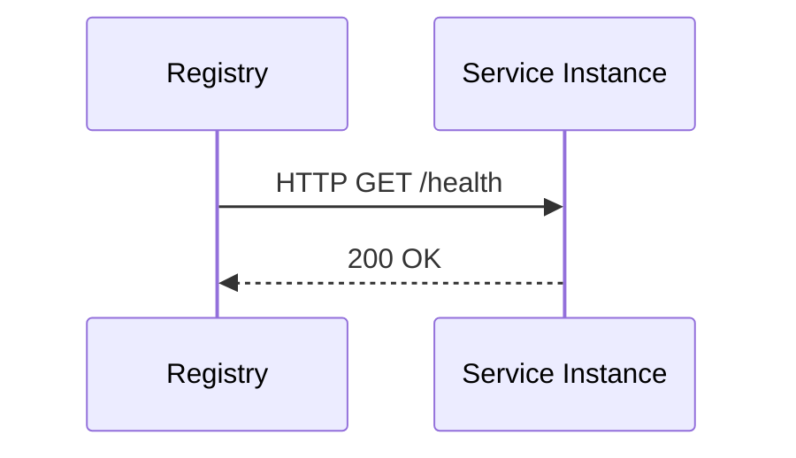
```mermaid
sequenceDiagram
    participant R as Registry
    participant SI as Service Instance
    R->>SI: HTTP GET /health
    SI-->>R: 200 OK
```

- **Pros**: Registry has direct evidence of health; works with any service
- **Cons**: Generates network traffic; may overwhelm instances; delays in detection

#### Passive Health Checking (Push-based / Heartbeat)

Service instances periodically send heartbeats to the registry:

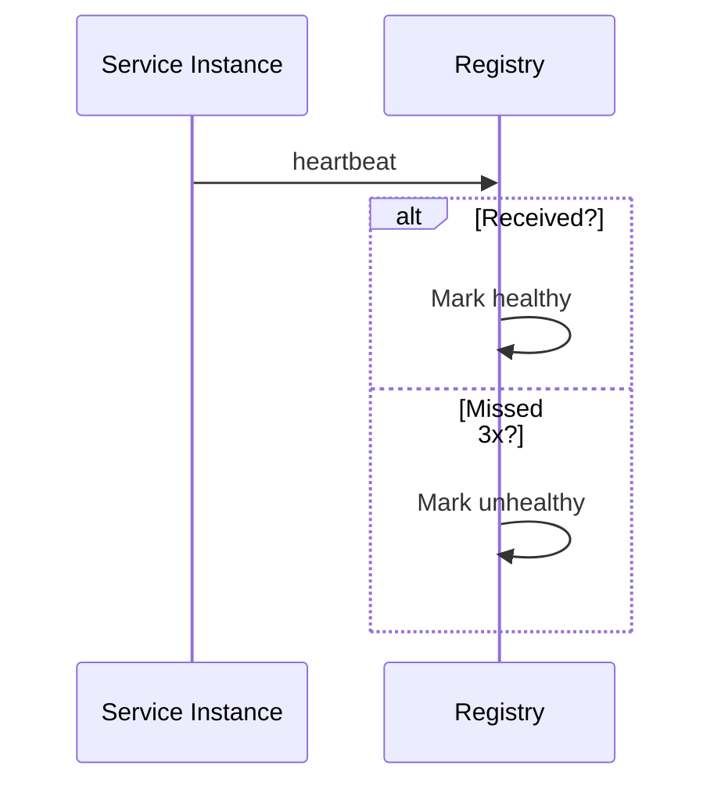
```mermaid
sequenceDiagram
    participant SI as Service Instance
    participant R as Registry
    SI->>R: heartbeat
    alt Received?
        R->>R: Mark healthy
    else Missed 3x?
        R->>R: Mark unhealthy
    end
```

- **Pros**: Lower overhead on registry; service controls timing
- **Cons**: Service must implement heartbeat logic; delayed failure detection

#### Health Check Dimensions

A comprehensive health check should evaluate multiple dimensions:

| Dimension | Check | Example |
|-----------|-------|---------|
| **Liveness** | Is the process running? | TCP port open |
| **Readiness** | Can it handle requests? | Dependencies connected |
| **Startup** | Has it finished initializing? | Data loaded into memory |
| **Deep health** | Are downstream dependencies healthy? | Database reachable, disk space available |

### 3.6 Consistency Models in Service Discovery

Service discovery systems must choose a consistency model:

**Strong Consistency (CP systems):**
- Every read returns the most recent write
- Examples: ZooKeeper, etcd, Consul (Raft consensus)
- Tradeoff: May become unavailable during network partitions

**Eventual Consistency (AP systems):**
- Reads may return stale data, but will converge
- Examples: Netflix Eureka (peer-to-peer replication)
- Tradeoff: May route to dead instances temporarily

**The CAP Theorem applied to Service Discovery:**

In practice, most service discovery systems prefer **availability over consistency** because:
- Stale data (routing to a dead instance) causes one failed request, retried quickly
- Unavailability (can't discover ANY instances) causes total service outage
- Eureka's famous principle: "It's better to have stale data than no data"

### 3.7 Service Discovery Anti-Patterns

1. **Hardcoded IPs**: The most basic anti-pattern. Never hardcode service endpoints.
2. **DNS-only discovery with long TTLs**: DNS TTLs of 5+ minutes cause stale routing.
3. **Tight coupling to discovery system**: Abstract the discovery mechanism behind an interface.
4. **No health checking**: Registering without health checks leads to routing to zombie instances.
5. **Single registry instance**: A single point of failure defeats the purpose of distributed systems.
6. **Ignoring the thundering herd**: When a registry comes back up, all clients reconnecting simultaneously can overwhelm it.

---

## 4. Architecture Deep Dive

### 4.1 Netflix Eureka Architecture

Netflix Eureka is an AP (available, partition-tolerant) service discovery system designed for the AWS cloud. It prioritizes availability over consistency.

#### Core Components

**Eureka Server (Service Registry):**
- Maintains an in-memory registry of service instances
- Exposes REST APIs for registration, deregistration, heartbeats, and queries
- Runs as a cluster with peer-to-peer replication
- Does NOT use any external database — everything is in memory

**Eureka Client (Service SDK):**
- Embedded in each microservice
- Registers the service on startup
- Sends heartbeats every 30 seconds (configurable)
- Caches the registry locally (updated every 30 seconds via delta fetches)
- Falls back to local cache if Eureka server is unreachable

#### Registration and Heartbeat Flow

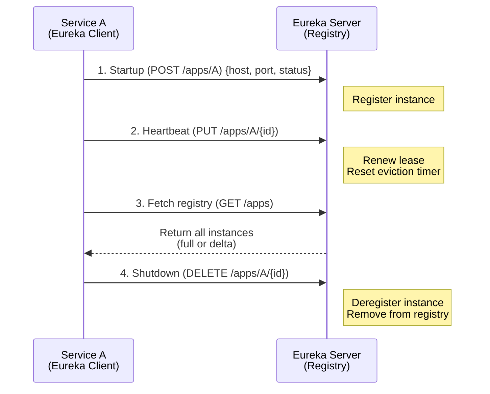
```mermaid
sequenceDiagram
    participant SA as Service A<br/>(Eureka Client)
    participant ES as Eureka Server<br/>(Registry)
    
    SA->>ES: 1. Startup (POST /apps/A) {host, port, status}
    Note right of ES: Register instance
    SA->>ES: 2. Heartbeat (PUT /apps/A/{id})
    Note right of ES: Renew lease<br/>Reset eviction timer
    SA->>ES: 3. Fetch registry (GET /apps)
    ES-->>SA: Return all instances<br/>(full or delta)
    SA->>ES: 4. Shutdown (DELETE /apps/A/{id})
    Note right of ES: Deregister instance<br/>Remove from registry
```

#### Self-Preservation Mode

This is one of Eureka's most important and misunderstood features.

**The problem:** During a network partition, heartbeats from healthy services might not reach Eureka. Without self-preservation, Eureka would evict these instances, causing a massive loss of registration data.

**The solution:** If Eureka detects that the number of heartbeats received falls below a threshold (85% of expected heartbeats), it enters self-preservation mode.

**In self-preservation mode:**
- Eureka stops evicting instances (even those that haven't sent heartbeats)
- Existing registrations are preserved
- New registrations and deregistrations are still processed
- A warning banner appears in the Eureka dashboard

**The tradeoff:** Self-preservation prevents mass eviction during network issues but may keep dead instances in the registry. This is an intentional design decision — Eureka prefers stale data over no data.

```
Normal Mode:
  Heartbeat received → Lease renewed
  Heartbeat missed 3x → Instance evicted

Self-Preservation Mode (triggered when renewals < 85% expected):
  Heartbeat received → Lease renewed
  Heartbeat missed 3x → Instance NOT evicted (preserved)
  New registrations → Still accepted
  
Exit condition: Renewals rise above threshold
```

#### Peer Replication

Eureka servers form a peer-to-peer cluster. There is no leader — every server is equal.

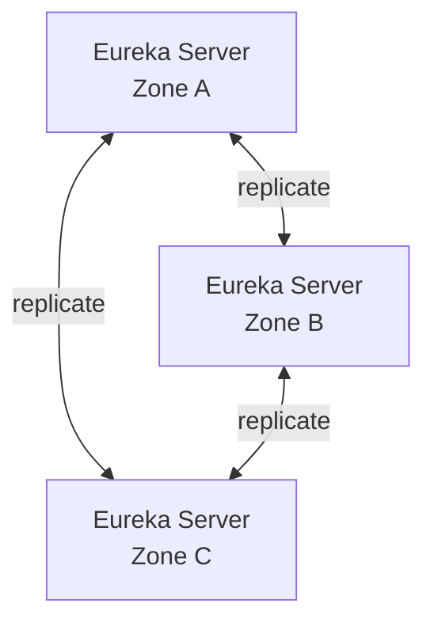
```mermaid
graph TD
    A[Eureka Server<br/>Zone A] <-->|replicate| B[Eureka Server<br/>Zone B]
    A <-->|replicate| C[Eureka Server<br/>Zone C]
    B <-->|replicate| C
```

- Registrations are replicated to all peers asynchronously
- Each server maintains a complete copy of the registry
- Replication is best-effort — eventual consistency
- Conflict resolution: Last-writer-wins based on timestamps
- Clients can register with any server; it will be replicated

#### Instance Status Lifecycle

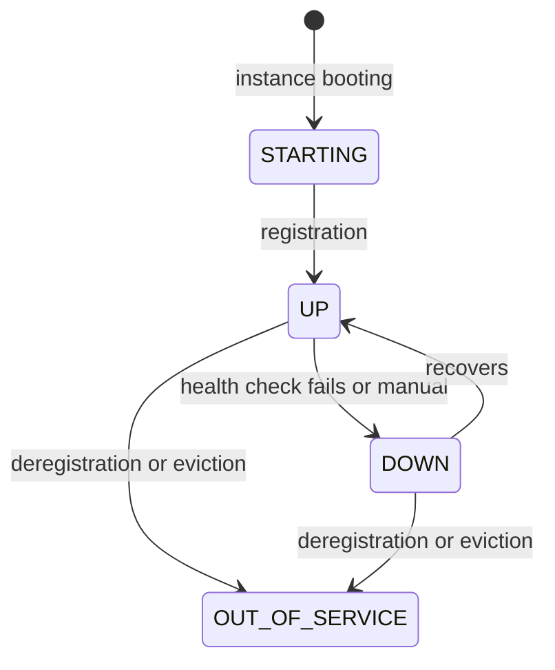
```mermaid
stateDiagram-v2
    [*] --> STARTING : instance booting
    STARTING --> UP : registration
    UP --> DOWN : health check fails or manual
    DOWN --> UP : recovers
    UP --> OUT_OF_SERVICE : deregistration or eviction
    DOWN --> OUT_OF_SERVICE : deregistration or eviction
```

### 4.2 HashiCorp Consul Architecture

Consul is a CP (consistent, partition-tolerant) service discovery system that uses the Raft consensus protocol. It provides service discovery, health checking, KV store, and service mesh capabilities.

#### Core Components

**Consul Servers:**
- Form a Raft consensus cluster (3 or 5 servers recommended)
- One leader, rest are followers
- Store service catalog, health check results, KV data
- Handle all queries that require strong consistency

**Consul Clients (Agents):**
- Run on every node in the infrastructure
- Lightweight processes that forward queries to servers
- Run local health checks
- Participate in the gossip protocol for failure detection

**Data Centers:**
- Each datacenter has its own set of Consul servers
- Cross-datacenter queries are forwarded via WAN gossip

#### Consul Architecture Diagram

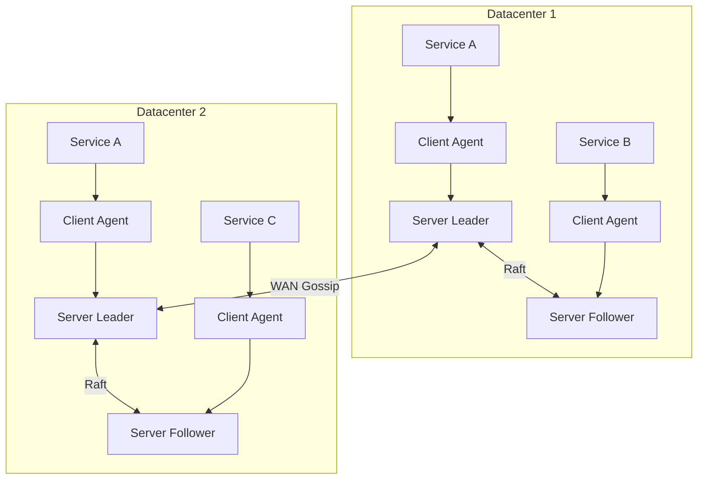
```mermaid
graph TD
    subgraph DC1 [Datacenter 1]
        L1[Server Leader]
        F1[Server Follower]
        CA1[Client Agent]
        CA2[Client Agent]
        SA[Service A]
        SB[Service B]
        
        L1 <-->|Raft| F1
        CA1 --> L1
        CA2 --> F1
        SA --> CA1
        SB --> CA2
    end
    
    subgraph DC2 [Datacenter 2]
        L2[Server Leader]
        F2[Server Follower]
        CA3[Client Agent]
        CA4[Client Agent]
        SA2[Service A]
        SC[Service C]
        
        L2 <-->|Raft| F2
        CA3 --> L2
        CA4 --> F2
        SA2 --> CA3
        SC --> CA4
    end
    
    L1 <-->|WAN Gossip| L2
```

#### Service Registration in Consul

Services register with their local Consul agent via:
1. **Service definition files** (JSON/HCL)
2. **HTTP API** (`PUT /v1/agent/service/register`)
3. **DNS** (for discovery only)

#### Health Checks in Consul

Consul supports multiple health check types:

| Type | Description | Example |
|------|-------------|---------|
| **Script** | Run a script, check exit code | `curl localhost:8080/health` |
| **HTTP** | GET request, check status code | 200-299 = passing |
| **TCP** | TCP connection attempt | Port open = passing |
| **TTL** | Service must report in before TTL expires | Heartbeat-based |
| **gRPC** | gRPC health check protocol | Standard gRPC health |
| **Docker** | Run a check inside a Docker container | Container-level check |
| **Alias** | Mirror another service's health | Dependency-based |

#### DNS Interface

Consul provides a built-in DNS server (port 8600 by default):

```bash
# Query for healthy instances of "web" service
dig @127.0.0.1 -p 8600 web.service.consul

# Query with tag "rails"
dig @127.0.0.1 -p 8600 rails.web.service.consul

# Query in a specific datacenter
dig @127.0.0.1 -p 8600 web.service.dc2.consul

# SRV record (includes port information)
dig @127.0.0.1 -p 8600 web.service.consul SRV
```

#### Key-Value Store

Consul includes a distributed KV store for configuration management:

```bash
# Store a value
consul kv put config/db/host 10.0.1.5

# Retrieve a value
consul kv get config/db/host

# Watch for changes
consul watch -type=key -key=config/db/host /script/update_config.sh
```

#### Consul Connect (Service Mesh)

Consul Connect provides secure service-to-service communication:
- **Mutual TLS**: Automatic encryption between services
- **Service intentions**: Define which services can communicate
- **Sidecar proxies**: Envoy proxies handle mTLS transparently

### 4.3 Apache ZooKeeper Architecture

ZooKeeper is a centralized service for maintaining configuration information, naming, distributed synchronization, and group services. It's one of the oldest and most battle-tested coordination services.

#### Ensemble Architecture

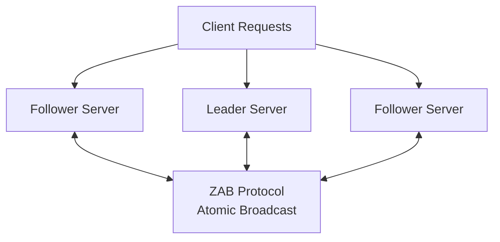
```mermaid
graph TD
    CR[Client Requests]
    
    F1[Follower Server]
    L[Leader Server]
    F2[Follower Server]
    
    CR --> F1
    CR --> L
    CR --> F2
    
    F1 <--> ZAB[ZAB Protocol <br/> Atomic Broadcast]
    L <--> ZAB
    F2 <--> ZAB
```

**ZooKeeper Ensemble:**
- Odd number of servers (3, 5, or 7 typically)
- One leader, rest are followers
- Writes go through the leader
- Reads can be served by any server (with optional linearizable reads)
- Requires a quorum (majority) for writes: `(N/2) + 1`

#### ZAB Protocol (ZooKeeper Atomic Broadcast)

ZAB is a consensus protocol similar to Paxos but optimized for primary-backup systems:

1. **Discovery**: Servers discover each other and elect a leader
2. **Synchronization**: Followers sync their state with the leader
3. **Broadcast**: Leader broadcasts state changes to followers

**Write path:**
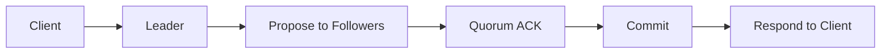
```mermaid
flowchart LR
    Client --> Leader --> Propose[Propose to Followers] --> ACK[Quorum ACK] --> Commit --> Respond[Respond to Client]
```

**Read path:**
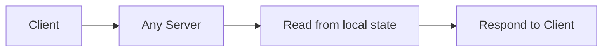
```mermaid
flowchart LR
    Client --> Server[Any Server] --> Read[Read from local state] --> Respond[Respond to Client]
```

#### ZNodes

The ZooKeeper data model is a hierarchical namespace, similar to a filesystem:

```
/
├── services
│   ├── order-service
│   │   ├── instance-001   (ephemeral)
│   │   ├── instance-002   (ephemeral)
│   │   └── config         (persistent)
│   └── payment-service
│       ├── instance-001   (ephemeral)
│       └── config         (persistent)
├── locks
│   └── order-lock
│       ├── _c_abc-0001    (ephemeral sequential)
│       └── _c_def-0002    (ephemeral sequential)
└── config
    ├── database
    │   ├── host
    │   └── port
    └── feature-flags
        ├── new-ui
        └── beta-search
```

**ZNode Types:**

| Type | Persistence | Use Case |
|------|-------------|----------|
| **Persistent** | Survives session end | Configuration, metadata |
| **Ephemeral** | Deleted when session ends | Service registration, locks |
| **Persistent Sequential** | Persistent + monotonic ID | Queues, barriers |
| **Ephemeral Sequential** | Ephemeral + monotonic ID | Leader election, distributed locks |

#### Watches

Watches are one-time triggers that notify clients when a znode changes:

```
1. Client sets watch on /services/order-service (getChildren with watch=true)
2. New instance registers → /services/order-service/instance-003 created
3. ZooKeeper sends WatchEvent to client
4. Client re-reads children and sets watch again
```

**Watch types:**
- **Data watches**: Triggered by `setData()` or `delete()` on the watched znode
- **Child watches**: Triggered by `create()` or `delete()` of children

**Important watch properties:**
- One-time trigger — must be re-registered after firing
- Ordered — events are delivered in order
- Guaranteed — if a change happens, you will see it (no missed events)

#### ZooKeeper for Service Discovery

```
Registration:
  Service starts → Create ephemeral znode /services/order-service/instance-{id}
  ZNode data: {"host": "10.0.1.5", "port": 8080, "metadata": {...}}

Discovery:
  Client → getChildren("/services/order-service", watch=true)
  Returns: [instance-001, instance-002, instance-003]
  Client reads each znode for host/port information

Deregistration:
  Service crashes → Session expires → Ephemeral znode auto-deleted
  Watch fires on parent → Clients notified of change
```

### 4.4 etcd Architecture

etcd is a distributed, reliable key-value store for the most critical data of a distributed system. It's the backbone of Kubernetes.

#### Core Architecture

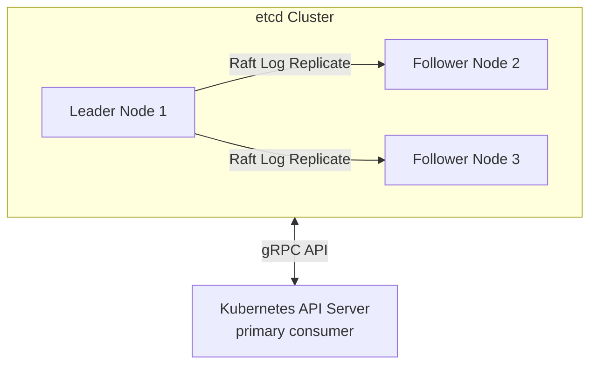
```mermaid
graph TD
    subgraph etcd [etcd Cluster]
        L[Leader Node 1]
        F1[Follower Node 2]
        F2[Follower Node 3]
        
        L -->|Raft Log Replicate| F1
        L -->|Raft Log Replicate| F2
    end
    
    K8s[Kubernetes API Server <br/> primary consumer]
    
    etcd <-->|gRPC API| K8s
```

#### Raft Consensus in etcd

etcd uses the Raft consensus protocol:

1. **Leader Election**: One node is elected leader. It handles all writes.
2. **Log Replication**: Leader replicates write operations to followers.
3. **Safety**: Only entries replicated to a majority are committed.
4. **Snapshot**: Periodic snapshots compact the log.

**Key guarantees:**
- Linearizable reads and writes (strong consistency)
- Every committed write survives leader failure
- Quorum-based: tolerates `(N-1)/2` failures

#### Watch API

etcd provides a powerful watch mechanism:

```
# Watch a key
etcdctl watch /services/order-service

# Watch a prefix (all keys starting with...)
etcdctl watch --prefix /services/

# Watch from a specific revision
etcdctl watch --rev 42 /services/order-service
```

Unlike ZooKeeper watches, etcd watches are:
- **Persistent** — don't need to be re-registered
- **Revision-based** — can catch up on missed events
- **Multiplexed** — multiple watches share a single gRPC stream

#### Kubernetes Integration

etcd is the single source of truth for all Kubernetes cluster state:

```
Kubernetes Component          etcd Key Pattern
──────────────────            ────────────────
Pods                          /registry/pods/{namespace}/{name}
Services                      /registry/services/specs/{namespace}/{name}
Endpoints                     /registry/services/endpoints/{namespace}/{name}
ConfigMaps                    /registry/configmaps/{namespace}/{name}
Secrets                       /registry/secrets/{namespace}/{name}
```

When you create a Kubernetes Service, the API server writes to etcd. kube-proxy watches etcd (via the API server) and updates iptables/IPVS rules accordingly. This is how Kubernetes implements service discovery natively.

### 4.5 DNS-Based Service Discovery

DNS is the oldest and most widely supported service discovery mechanism.

#### Traditional DNS

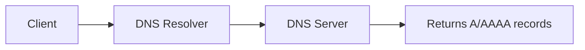
```mermaid
flowchart LR
    Client --> Resolver[DNS Resolver] --> Server[DNS Server] --> Returns[Returns A/AAAA records]
```

Example:
```text
  order-service.prod.example.com → [10.0.1.5, 10.0.1.6, 10.0.2.3]
```

**Limitations:**
- **TTL caching**: Clients and resolvers cache DNS responses. Changes take time to propagate.
- **No health checking**: DNS doesn't know if an instance is healthy.
- **No port information**: A records only contain IP addresses (SRV records add port but aren't universally supported).
- **No metadata**: Can't include version, region, or load information.

#### Modern DNS-Based Discovery

Modern systems enhance DNS with:
1. **Low TTL records** (5-30 seconds) for faster propagation
2. **SRV records** for port information
3. **Integration with health checks** (e.g., Route 53 health checks)
4. **DNS-SD (DNS Service Discovery)** — RFC 6763

#### Kubernetes DNS

Kubernetes provides built-in DNS-based service discovery:

```
Service DNS format:
  {service-name}.{namespace}.svc.cluster.local

Examples:
  order-service.default.svc.cluster.local → ClusterIP (10.96.0.15)
  order-service.production.svc.cluster.local → ClusterIP (10.96.0.42)

Headless Service (no ClusterIP):
  order-service.default.svc.cluster.local → Pod IPs directly
  → [10.244.1.5, 10.244.2.3, 10.244.3.7]

Pod DNS:
  {pod-ip-dashed}.{namespace}.pod.cluster.local
  10-244-1-5.default.pod.cluster.local
```

CoreDNS is the default DNS server in Kubernetes, watching the API server for service changes and updating DNS records in real-time.

---

## 5. Visual Diagrams

### 5.1 Client-Side vs Server-Side Discovery

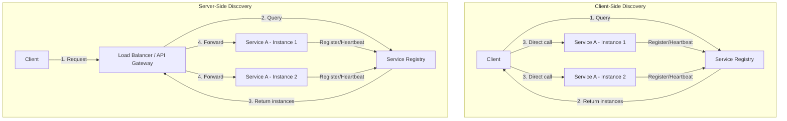
```mermaid
graph TB
    subgraph "Client-Side Discovery"
        C1[Client] -->|"1. Query"| SR1[Service Registry]
        SR1 -->|"2. Return instances"| C1
        C1 -->|"3. Direct call"| S1A[Service A - Instance 1]
        C1 -->|"3. Direct call"| S1B[Service A - Instance 2]
        S1A -->|"Register/Heartbeat"| SR1
        S1B -->|"Register/Heartbeat"| SR1
    end
    
    subgraph "Server-Side Discovery"
        C2[Client] -->|"1. Request"| LB[Load Balancer / API Gateway]
        LB -->|"2. Query"| SR2[Service Registry]
        SR2 -->|"3. Return instances"| LB
        LB -->|"4. Forward"| S2A[Service A - Instance 1]
        LB -->|"4. Forward"| S2B[Service A - Instance 2]
        S2A -->|"Register/Heartbeat"| SR2
        S2B -->|"Register/Heartbeat"| SR2
    end
```

### 5.2 Eureka Architecture

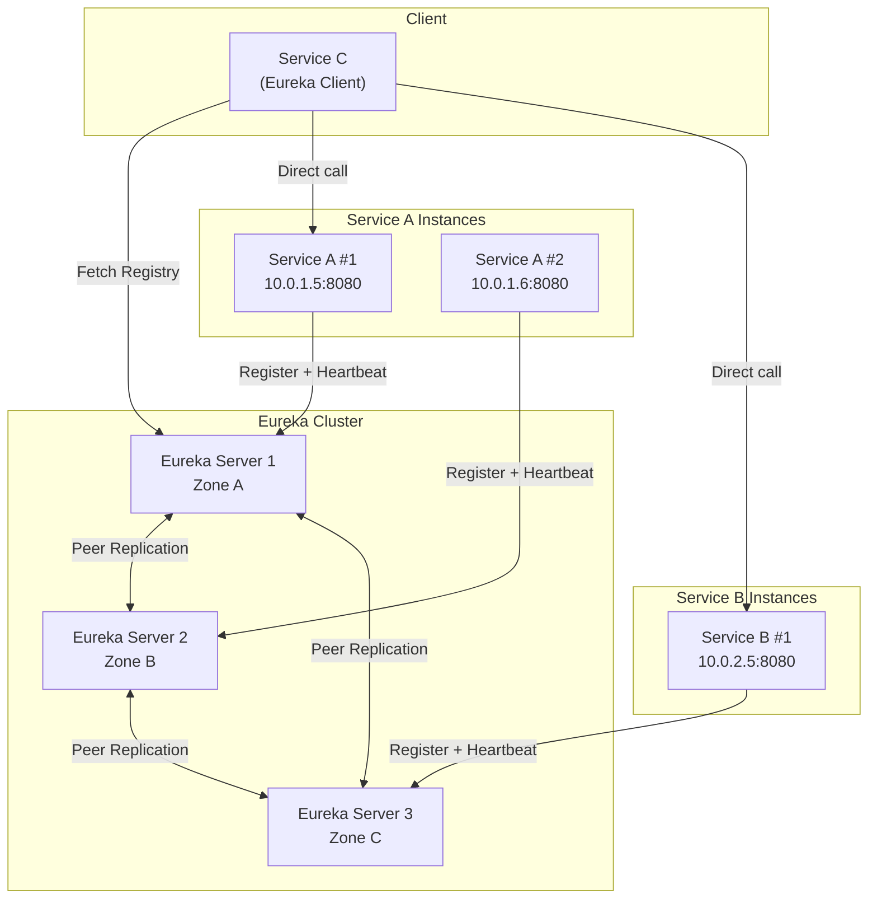
```mermaid
graph TB
    subgraph "Eureka Cluster"
        ES1[Eureka Server 1<br/>Zone A]
        ES2[Eureka Server 2<br/>Zone B]
        ES3[Eureka Server 3<br/>Zone C]
        ES1 <-->|"Peer Replication"| ES2
        ES2 <-->|"Peer Replication"| ES3
        ES1 <-->|"Peer Replication"| ES3
    end

    subgraph "Service A Instances"
        A1["Service A #1<br/>10.0.1.5:8080"]
        A2["Service A #2<br/>10.0.1.6:8080"]
    end

    subgraph "Service B Instances"
        B1["Service B #1<br/>10.0.2.5:8080"]
    end

    subgraph "Client"
        CL["Service C<br/>(Eureka Client)"]
    end

    A1 -->|"Register + Heartbeat"| ES1
    A2 -->|"Register + Heartbeat"| ES2
    B1 -->|"Register + Heartbeat"| ES3
    CL -->|"Fetch Registry"| ES1
    CL -->|"Direct call"| A1
    CL -->|"Direct call"| B1
```

### 5.3 ZooKeeper Ensemble

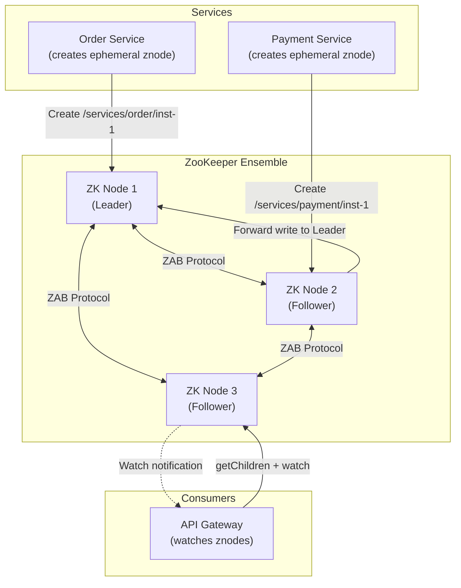
```mermaid
graph TB
    subgraph "ZooKeeper Ensemble"
        L["ZK Node 1<br/>(Leader)"]
        F1["ZK Node 2<br/>(Follower)"]
        F2["ZK Node 3<br/>(Follower)"]
        L <-->|"ZAB Protocol"| F1
        L <-->|"ZAB Protocol"| F2
        F1 <-->|"ZAB Protocol"| F2
    end

    subgraph "Services"
        S1["Order Service<br/>(creates ephemeral znode)"]
        S2["Payment Service<br/>(creates ephemeral znode)"]
    end

    subgraph "Consumers"
        C1["API Gateway<br/>(watches znodes)"]
    end

    S1 -->|"Create /services/order/inst-1"| L
    S2 -->|"Create /services/payment/inst-1"| F1
    F1 -->|"Forward write to Leader"| L
    C1 -->|"getChildren + watch"| F2
    F2 -.->|"Watch notification"| C1
```

### 5.4 Consul Multi-Datacenter

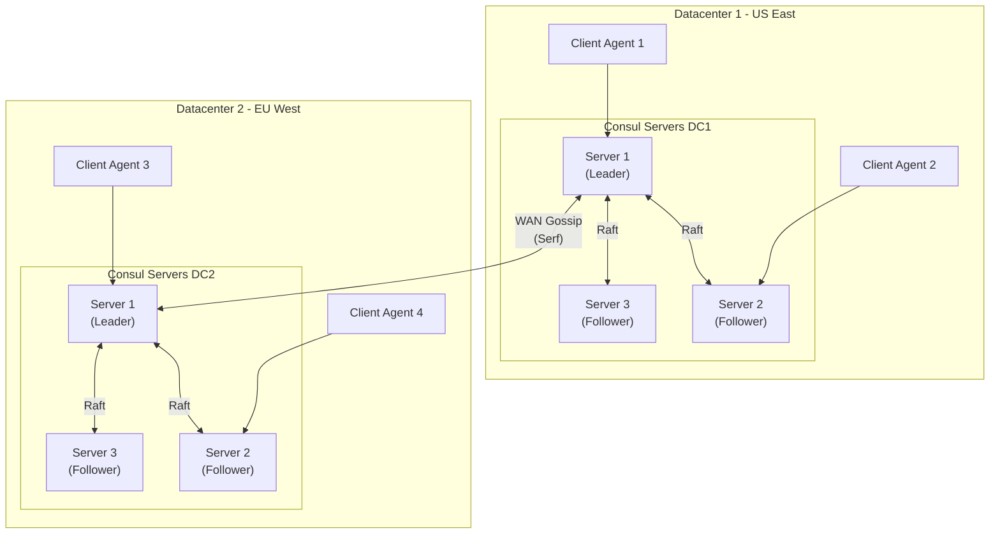
```mermaid
graph TB
    subgraph "Datacenter 1 - US East"
        subgraph "Consul Servers DC1"
            CS1L["Server 1<br/>(Leader)"]
            CS1F1["Server 2<br/>(Follower)"]
            CS1F2["Server 3<br/>(Follower)"]
            CS1L <-->|Raft| CS1F1
            CS1L <-->|Raft| CS1F2
        end
        CA1["Client Agent 1"] --> CS1L
        CA2["Client Agent 2"] --> CS1F1
    end

    subgraph "Datacenter 2 - EU West"
        subgraph "Consul Servers DC2"
            CS2L["Server 1<br/>(Leader)"]
            CS2F1["Server 2<br/>(Follower)"]
            CS2F2["Server 3<br/>(Follower)"]
            CS2L <-->|Raft| CS2F1
            CS2L <-->|Raft| CS2F2
        end
        CA3["Client Agent 3"] --> CS2L
        CA4["Client Agent 4"] --> CS2F1
    end

    CS1L <-->|"WAN Gossip<br/>(Serf)"| CS2L
```

### 5.5 Service Registration Flow

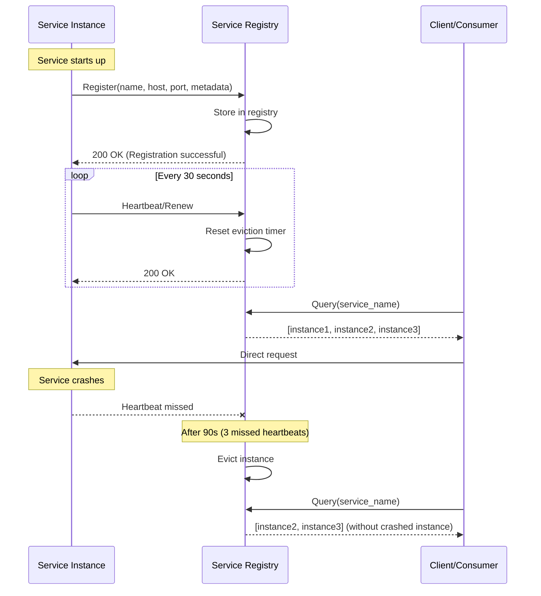
```mermaid
sequenceDiagram
    participant S as Service Instance
    participant R as Service Registry
    participant C as Client/Consumer

    Note over S: Service starts up
    S->>R: Register(name, host, port, metadata)
    R->>R: Store in registry
    R-->>S: 200 OK (Registration successful)
    
    loop Every 30 seconds
        S->>R: Heartbeat/Renew
        R->>R: Reset eviction timer
        R-->>S: 200 OK
    end

    C->>R: Query(service_name)
    R-->>C: [instance1, instance2, instance3]
    C->>S: Direct request

    Note over S: Service crashes
    S--xR: Heartbeat missed
    
    Note over R: After 90s (3 missed heartbeats)
    R->>R: Evict instance
    
    C->>R: Query(service_name)
    R-->>C: [instance2, instance3] (without crashed instance)
```

### 5.6 Self-Preservation Mode Decision Flow

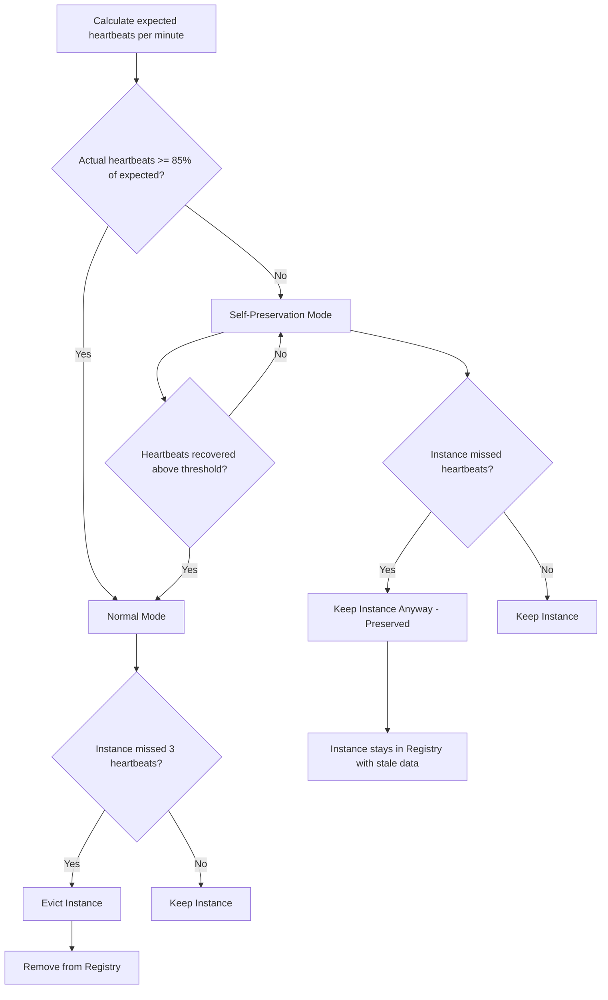
```mermaid
flowchart TD
    A[Calculate expected heartbeats per minute] --> B{Actual heartbeats >= 85% of expected?}
    B -->|Yes| C[Normal Mode]
    B -->|No| D[Self-Preservation Mode]
    
    C --> E{Instance missed 3 heartbeats?}
    E -->|Yes| F[Evict Instance]
    E -->|No| G[Keep Instance]
    
    D --> H{Instance missed heartbeats?}
    H -->|Yes| I[Keep Instance Anyway - Preserved]
    H -->|No| J[Keep Instance]
    
    F --> K[Remove from Registry]
    I --> L[Instance stays in Registry with stale data]
    
    D --> M{Heartbeats recovered above threshold?}
    M -->|Yes| C
    M -->|No| D
```

---

## 6. Real Production Examples

### 6.1 Netflix Eureka at Scale

Netflix is the poster child for microservice service discovery. They open-sourced Eureka in 2012, and it remains one of the most battle-tested service discovery systems.

**Netflix's Scale:**
- 700+ microservices
- 10,000+ service instances
- Multiple AWS regions (us-east-1, us-west-2, eu-west-1)
- Billions of discovery queries per day

**Key Architecture Decisions:**

1. **AP over CP**: Netflix chose eventual consistency because during an AWS outage, they needed Eureka to continue serving (possibly stale) data rather than becoming unavailable. As they famously stated: "If Eureka server has no connectivity due to network issues, the remaining Eureka servers will receive no heartbeats, and they might erroneously determine that all instances are down and evict them. Instead, Eureka goes into self-preservation mode."

2. **Client-Side Caching**: Every Eureka client caches the full registry locally. If every Eureka server goes down, services can still discover each other using cached data. This provides remarkable resilience.

3. **Region-Aware Routing**: Netflix uses Eureka's zone affinity to prefer instances in the same availability zone, reducing cross-zone data transfer costs (which are significant at Netflix's scale).

4. **Self-Preservation in Practice**: During the great AWS outage of 2015, Eureka's self-preservation mode prevented mass eviction of healthy services that simply couldn't reach Eureka servers. This saved Netflix from a complete outage.

**Lessons Learned:**
- Service discovery must be the most resilient component in your infrastructure
- Eventually consistent is fine for discovery — the client-side cache is your safety net
- Keep the registry in memory for speed; disk-based registries add unnecessary latency
- Zone-aware routing saves millions in cloud costs
- Monitor self-preservation carefully — it can mask real problems

### 6.2 Uber's Service Discovery

Uber's service discovery evolution tells a story of scale-driven architecture changes.

**Phase 1: Hyperbahn (TChannel-based)**
- Custom RPC protocol (TChannel) with ring-based routing
- Services registered with a Hyperbahn router
- Router forwarded requests to healthy instances
- Worked well at early Uber scale

**Phase 2: Custom Discovery System (M3)**
- As Uber grew to 4,000+ microservices, they built M3
- Based on etcd as the backing store
- Custom client libraries for Go and Java
- Integrated with their deployment system (uDeploy)

**Key Design Decisions:**
- **Incremental updates**: At 40,000+ instances, full registry fetches are expensive. Uber uses incremental (delta) updates to reduce network overhead.
- **Locality awareness**: Uber routes to the nearest datacenter first, falling back to remote datacenters only when local instances are unhealthy.
- **Graceful degradation**: If the discovery system is unavailable, services fall back to cached endpoints with exponential backoff.
- **Integration with deployment**: When a new version is deployed, the discovery system supports weighted routing for canary deployments.

### 6.3 Airbnb's SmartStack

Airbnb built SmartStack, one of the earliest and most influential service discovery systems, in 2013.

**Components:**
1. **Nerve**: Registration daemon that runs alongside each service
   - Performs local health checks
   - Registers with ZooKeeper if healthy
   - Deregisters if health check fails

2. **Synapse**: Discovery daemon that runs alongside each client
   - Watches ZooKeeper for service changes
   - Configures a local HAProxy instance with current endpoints
   - Client sends requests to localhost HAProxy → routed to healthy instances

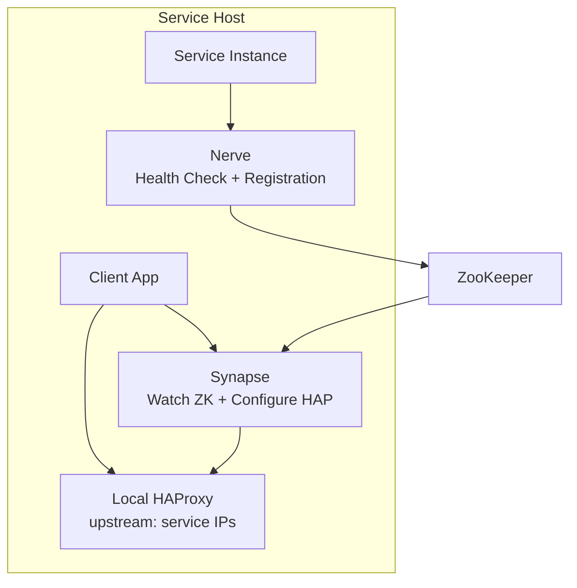
```mermaid
graph TD
    subgraph SH [Service Host]
        SI[Service Instance]
        Nerve[Nerve <br/> Health Check + Registration]
        CA[Client App]
        Synapse[Synapse <br/> Watch ZK + Configure HAP]
        HAP[Local HAProxy <br/> upstream: service IPs]
        
        SI --> Nerve
        CA --> Synapse
        CA --> HAP
        Synapse --> HAP
    end
    
    ZK[ZooKeeper]
    
    Nerve --> ZK
    ZK --> Synapse
```

**Key Innovation:**
SmartStack decoupled service registration from discovery and from the service itself. The service doesn't need to know about ZooKeeper — Nerve handles that. The client doesn't need a special library — Synapse configures HAProxy locally.

**Lessons:**
- Sidecar pattern (Nerve/Synapse) predated the modern service mesh (Istio/Envoy) by 5 years
- HAProxy provides battle-tested load balancing without custom client libraries
- ZooKeeper's ephemeral nodes are perfect for service registration
- Health checks should be local, not centralized

### 6.4 Google's Borg and Service Discovery

Google's internal systems use a custom service discovery mechanism tied to Borg (their cluster management system):

- Services register with **BNS (Borg Naming Service)**
- BNS provides DNS-like resolution: `//bns/cell/user/jobname/taskid`
- Chubby (distributed lock service, ZooKeeper's inspiration) is used for coordination
- Every service gets a name in BNS automatically when deployed via Borg

This tight coupling between orchestration and discovery is what Kubernetes inherited (every Pod gets a DNS name, every Service gets a ClusterIP).

### 6.5 Comparison of Production Approaches

| Aspect | Netflix (Eureka) | Uber (M3/etcd) | Airbnb (SmartStack) | Google (BNS) |
|--------|-----------------|-----------------|---------------------|-------------|
| Consistency | AP (eventual) | CP (Raft) | CP (ZooKeeper) | CP (Paxos) |
| Discovery Style | Client-side | Client-side | Server-side (HAProxy) | DNS-like |
| Health Check | Client heartbeat | Agent-based | Sidecar (Nerve) | Borg-managed |
| Scale | 10K instances | 40K+ instances | 1K+ instances | Millions |
| Open Source | Yes | Partially | Yes | No |
| Cloud | AWS | Multi-cloud | AWS | Private cloud |

---

## 7. Java Implementations

### 7.1 Spring Cloud + Netflix Eureka Server

```java
// =====================================
// Eureka Server Application
// =====================================

// pom.xml dependencies (Spring Boot 3.x)
/*
<dependency>
    <groupId>org.springframework.cloud</groupId>
    <artifactId>spring-cloud-starter-netflix-eureka-server</artifactId>
</dependency>
*/

package com.distributed.discovery.eureka.server;

import org.springframework.boot.SpringApplication;
import org.springframework.boot.autoconfigure.SpringBootApplication;
import org.springframework.cloud.netflix.eureka.server.EnableEurekaServer;

@SpringBootApplication
@EnableEurekaServer
public class EurekaServerApplication {
    
    public static void main(String[] args) {
        SpringApplication.run(EurekaServerApplication.class, args);
    }
}
```

```yaml
# application.yml for Eureka Server
server:
  port: 8761

spring:
  application:
    name: eureka-server

eureka:
  instance:
    hostname: localhost
    # Prefer IP address over hostname in AWS/cloud environments
    prefer-ip-address: true
  
  client:
    # Don't register with itself (this IS the registry)
    register-with-eureka: false
    # Don't fetch registry (this IS the registry)
    fetch-registry: false
    service-url:
      # For a cluster, list all peer Eureka servers
      defaultZone: http://eureka-server-2:8761/eureka/,http://eureka-server-3:8761/eureka/
  
  server:
    # Self-preservation threshold (default: 0.85 = 85%)
    renewal-percent-threshold: 0.85
    # How often to check for expired instances (default: 60s)
    eviction-interval-timer-in-ms: 60000
    # Enable self-preservation mode (default: true)
    enable-self-preservation: true
    # Expected client renewal interval (default: 30s)
    expected-client-renewal-interval-seconds: 30
    # Peer replication settings
    peer-eureka-nodes-update-interval-ms: 600000
    # Wait time before allowing traffic (for initial sync)
    wait-time-in-ms-when-sync-empty: 300000

# Logging configuration
logging:
  level:
    com.netflix.eureka: DEBUG
    com.netflix.discovery: DEBUG
```

### 7.2 Spring Cloud + Netflix Eureka Client

```java
// =====================================
// Order Service - Eureka Client
// =====================================

package com.distributed.discovery.eureka.client;

import org.springframework.boot.SpringApplication;
import org.springframework.boot.autoconfigure.SpringBootApplication;
import org.springframework.cloud.client.discovery.EnableDiscoveryClient;

@SpringBootApplication
@EnableDiscoveryClient
public class OrderServiceApplication {
    
    public static void main(String[] args) {
        SpringApplication.run(OrderServiceApplication.class, args);
    }
}
```

```java
// =====================================
// Custom Health Indicator for Eureka
// =====================================

package com.distributed.discovery.eureka.client.health;

import org.springframework.boot.actuate.health.Health;
import org.springframework.boot.actuate.health.HealthIndicator;
import org.springframework.stereotype.Component;

import javax.sql.DataSource;
import java.sql.Connection;

/**
 * Custom health indicator that checks database connectivity,
 * message broker connection, and disk space.
 * 
 * Eureka uses this to determine if the instance should be marked UP or DOWN.
 */
@Component
public class OrderServiceHealthIndicator implements HealthIndicator {

    private final DataSource dataSource;
    
    public OrderServiceHealthIndicator(DataSource dataSource) {
        this.dataSource = dataSource;
    }

    @Override
    public Health health() {
        try {
            // Check database connectivity
            try (Connection conn = dataSource.getConnection()) {
                if (!conn.isValid(5)) {
                    return Health.down()
                        .withDetail("database", "Connection invalid")
                        .build();
                }
            }
            
            // Check available disk space
            long freeSpace = new java.io.File("/").getFreeSpace();
            long totalSpace = new java.io.File("/").getTotalSpace();
            double diskUsagePercent = (1.0 - (double) freeSpace / totalSpace) * 100;
            
            if (diskUsagePercent > 95) {
                return Health.down()
                    .withDetail("disk", "Usage above 95%: " + diskUsagePercent + "%")
                    .build();
            }
            
            // Check memory usage
            Runtime runtime = Runtime.getRuntime();
            long usedMemory = runtime.totalMemory() - runtime.freeMemory();
            long maxMemory = runtime.maxMemory();
            double memoryUsagePercent = (double) usedMemory / maxMemory * 100;
            
            return Health.up()
                .withDetail("database", "Connected")
                .withDetail("diskUsage", String.format("%.1f%%", diskUsagePercent))
                .withDetail("memoryUsage", String.format("%.1f%%", memoryUsagePercent))
                .build();
                
        } catch (Exception e) {
            return Health.down()
                .withDetail("error", e.getMessage())
                .build();
        }
    }
}
```

```java
// =====================================
// Discovering and Calling Services via Eureka
// =====================================

package com.distributed.discovery.eureka.client.service;

import org.springframework.cloud.client.ServiceInstance;
import org.springframework.cloud.client.discovery.DiscoveryClient;
import org.springframework.cloud.client.loadbalancer.LoadBalanced;
import org.springframework.context.annotation.Bean;
import org.springframework.context.annotation.Configuration;
import org.springframework.stereotype.Service;
import org.springframework.web.client.RestTemplate;
import org.springframework.web.reactive.function.client.WebClient;

import java.util.List;
import java.util.concurrent.ThreadLocalRandom;

/**
 * Configuration for load-balanced REST communication.
 * The @LoadBalanced annotation integrates with Eureka to resolve
 * service names to actual host:port combinations.
 */
@Configuration
class RestConfig {
    
    @Bean
    @LoadBalanced  // This enables service name resolution via Eureka
    public RestTemplate restTemplate() {
        return new RestTemplate();
    }
    
    @Bean
    @LoadBalanced
    public WebClient.Builder webClientBuilder() {
        return WebClient.builder();
    }
}

@Service
public class PaymentServiceClient {

    private final RestTemplate restTemplate;
    private final DiscoveryClient discoveryClient;

    public PaymentServiceClient(RestTemplate restTemplate, 
                                 DiscoveryClient discoveryClient) {
        this.restTemplate = restTemplate;
        this.discoveryClient = discoveryClient;
    }

    /**
     * Method 1: Using @LoadBalanced RestTemplate
     * Service name "payment-service" is resolved via Eureka automatically.
     * Spring Cloud LoadBalancer handles instance selection.
     */
    public PaymentResponse processPaymentLoadBalanced(PaymentRequest request) {
        // "payment-service" is the spring.application.name of the target service
        // Spring Cloud resolves this to an actual host:port via Eureka
        return restTemplate.postForObject(
            "http://payment-service/api/v1/payments",
            request,
            PaymentResponse.class
        );
    }

    /**
     * Method 2: Manual discovery using DiscoveryClient
     * Useful when you need custom load balancing logic or instance metadata.
     */
    public PaymentResponse processPaymentManual(PaymentRequest request) {
        // Get all healthy instances of payment-service from Eureka
        List<ServiceInstance> instances = discoveryClient.getInstances("payment-service");
        
        if (instances.isEmpty()) {
            throw new ServiceUnavailableException("No instances of payment-service available");
        }
        
        // Custom load balancing: pick a random instance
        ServiceInstance instance = instances.get(
            ThreadLocalRandom.current().nextInt(instances.size())
        );
        
        // You can access instance metadata for smarter routing
        String version = instance.getMetadata().getOrDefault("version", "unknown");
        String zone = instance.getMetadata().getOrDefault("zone", "unknown");
        
        String url = String.format("http://%s:%d/api/v1/payments",
            instance.getHost(), instance.getPort());
        
        return new RestTemplate().postForObject(url, request, PaymentResponse.class);
    }

    /**
     * Method 3: Zone-aware routing
     * Prefer instances in the same zone to reduce latency and costs.
     */
    public PaymentResponse processPaymentZoneAware(PaymentRequest request, String myZone) {
        List<ServiceInstance> instances = discoveryClient.getInstances("payment-service");
        
        // Prefer same-zone instances
        List<ServiceInstance> sameZoneInstances = instances.stream()
            .filter(inst -> myZone.equals(inst.getMetadata().get("zone")))
            .toList();
        
        List<ServiceInstance> targetInstances = sameZoneInstances.isEmpty() 
            ? instances : sameZoneInstances;
        
        if (targetInstances.isEmpty()) {
            throw new ServiceUnavailableException("No instances available");
        }
        
        ServiceInstance instance = targetInstances.get(
            ThreadLocalRandom.current().nextInt(targetInstances.size())
        );
        
        String url = String.format("http://%s:%d/api/v1/payments",
            instance.getHost(), instance.getPort());
        
        return new RestTemplate().postForObject(url, request, PaymentResponse.class);
    }
}

// Supporting classes
record PaymentRequest(String orderId, double amount, String currency) {}
record PaymentResponse(String transactionId, String status) {}

class ServiceUnavailableException extends RuntimeException {
    public ServiceUnavailableException(String message) {
        super(message);
    }
}
```

```yaml
# application.yml for Eureka Client (Order Service)
server:
  port: 8080

spring:
  application:
    name: order-service

eureka:
  instance:
    # Use IP address instead of hostname (important in Docker/K8s)
    prefer-ip-address: true
    # Lease renewal interval (heartbeat) - default 30s
    lease-renewal-interval-in-seconds: 30
    # Lease expiration duration - default 90s (3 missed heartbeats)
    lease-expiration-duration-in-seconds: 90
    # Instance metadata
    metadata-map:
      zone: us-east-1a
      version: "2.1.0"
      environment: production
    # Health check URL
    health-check-url-path: /actuator/health
    status-page-url-path: /actuator/info
    
  client:
    # Eureka server URL(s)
    service-url:
      defaultZone: http://eureka-1:8761/eureka/,http://eureka-2:8761/eureka/
    # How often to fetch registry updates (default 30s)
    registry-fetch-interval-seconds: 30
    # Whether to fetch only delta updates (default true)
    disable-delta: false
    # Cache refresh settings
    instance-info-replication-interval-seconds: 30
    initial-instance-info-replication-interval-seconds: 40

# Actuator endpoints for health checking
management:
  endpoints:
    web:
      exposure:
        include: health,info,metrics
  endpoint:
    health:
      show-details: always
```

### 7.3 ZooKeeper Service Registration

```java
// =====================================
// ZooKeeper Service Discovery Implementation
// =====================================

package com.distributed.discovery.zookeeper;

import org.apache.zookeeper.*;
import org.apache.zookeeper.data.Stat;
import com.fasterxml.jackson.databind.ObjectMapper;

import java.io.IOException;
import java.nio.charset.StandardCharsets;
import java.util.*;
import java.util.concurrent.ConcurrentHashMap;
import java.util.concurrent.CopyOnWriteArrayList;
import java.util.concurrent.CountDownLatch;

/**
 * Represents a service instance in the registry.
 * Contains all information needed to route requests to this instance.
 */
record ServiceInstance(
    String serviceName,
    String instanceId,
    String host,
    int port,
    Map<String, String> metadata,
    long registrationTime
) {
    public String toAddress() {
        return host + ":" + port;
    }
}

/**
 * Callback interface for service change notifications.
 */
interface ServiceChangeListener {
    void onServiceChange(String serviceName, List<ServiceInstance> instances);
}

/**
 * ZooKeeper-based service registry that supports:
 * - Service registration via ephemeral znodes
 * - Service discovery via getChildren + watches
 * - Automatic deregistration on session expiry
 * - Caching for resilience
 * - Watch-based real-time updates
 * 
 * ZNode structure:
 *   /services/{serviceName}/{instanceId} -> ServiceInstance JSON
 * 
 * Ephemeral znodes ensure automatic cleanup when services crash.
 */
public class ZooKeeperServiceRegistry implements Watcher {

    private static final String SERVICES_ROOT = "/services";
    private static final int SESSION_TIMEOUT_MS = 30_000;
    private static final ObjectMapper MAPPER = new ObjectMapper();

    private final ZooKeeper zk;
    private final CountDownLatch connectedLatch = new CountDownLatch(1);
    
    // Local cache: serviceName -> list of instances
    private final Map<String, List<ServiceInstance>> serviceCache = new ConcurrentHashMap<>();
    
    // Registered listeners for service change notifications
    private final Map<String, List<ServiceChangeListener>> listeners = new ConcurrentHashMap<>();
    
    // Track our own registrations for re-registration on reconnect
    private final List<ServiceInstance> myRegistrations = new CopyOnWriteArrayList<>();

    public ZooKeeperServiceRegistry(String connectString) throws IOException, InterruptedException {
        this.zk = new ZooKeeper(connectString, SESSION_TIMEOUT_MS, this);
        // Wait for connection to be established
        connectedLatch.await();
        ensureRootPathExists();
    }

    /**
     * Handle ZooKeeper session events.
     * This is critical for handling reconnections and re-registrations.
     */
    @Override
    public void process(WatchedEvent event) {
        switch (event.getState()) {
            case SyncConnected:
                System.out.println("[ZK] Connected to ZooKeeper ensemble");
                connectedLatch.countDown();
                break;
            case Disconnected:
                System.out.println("[ZK] Disconnected from ZooKeeper - using cached data");
                break;
            case Expired:
                System.out.println("[ZK] Session expired - all ephemeral nodes lost!");
                // Must reconnect and re-register all services
                handleSessionExpiry();
                break;
            default:
                break;
        }

        // Handle child watch events (service instances changed)
        if (event.getType() == Event.EventType.NodeChildrenChanged) {
            String path = event.getPath();
            String serviceName = path.substring(SERVICES_ROOT.length() + 1);
            System.out.println("[ZK] Children changed for service: " + serviceName);
            refreshServiceInstances(serviceName);
        }
    }

    /**
     * Register a service instance.
     * Creates an ephemeral znode that will be automatically deleted
     * when the ZooKeeper session ends (service crashes).
     */
    public void register(ServiceInstance instance) throws Exception {
        String servicePath = SERVICES_ROOT + "/" + instance.serviceName();
        
        // Ensure service directory exists (persistent znode)
        ensurePathExists(servicePath);
        
        // Create ephemeral znode for this instance
        String instancePath = servicePath + "/" + instance.instanceId();
        byte[] data = MAPPER.writeValueAsBytes(instance);
        
        try {
            zk.create(instancePath, data, ZooDefs.Ids.OPEN_ACL_UNSAFE,
                      CreateMode.EPHEMERAL);
            System.out.println("[ZK] Registered: " + instancePath);
            
            // Track for re-registration on session expiry
            myRegistrations.add(instance);
        } catch (KeeperException.NodeExistsException e) {
            // Instance already registered, update data
            zk.setData(instancePath, data, -1);
            System.out.println("[ZK] Updated existing registration: " + instancePath);
        }
    }

    /**
     * Deregister a service instance.
     * Explicitly removes the ephemeral znode.
     */
    public void deregister(ServiceInstance instance) throws Exception {
        String instancePath = SERVICES_ROOT + "/" + instance.serviceName() 
                            + "/" + instance.instanceId();
        try {
            zk.delete(instancePath, -1);
            myRegistrations.remove(instance);
            System.out.println("[ZK] Deregistered: " + instancePath);
        } catch (KeeperException.NoNodeException e) {
            System.out.println("[ZK] Already deregistered: " + instancePath);
        }
    }

    /**
     * Discover all healthy instances of a service.
     * Sets a watch to receive notifications when instances change.
     * 
     * Uses local cache as fallback when ZooKeeper is unreachable.
     */
    public List<ServiceInstance> discover(String serviceName) {
        String servicePath = SERVICES_ROOT + "/" + serviceName;
        
        try {
            // Get children with watch - we'll be notified of changes
            List<String> children = zk.getChildren(servicePath, true);
            List<ServiceInstance> instances = new ArrayList<>();
            
            for (String child : children) {
                String childPath = servicePath + "/" + child;
                byte[] data = zk.getData(childPath, false, null);
                if (data != null) {
                    ServiceInstance instance = MAPPER.readValue(data, ServiceInstance.class);
                    instances.add(instance);
                }
            }
            
            // Update cache
            serviceCache.put(serviceName, instances);
            return instances;
            
        } catch (Exception e) {
            System.out.println("[ZK] Error discovering " + serviceName 
                             + ", using cache: " + e.getMessage());
            // Fallback to cached data
            return serviceCache.getOrDefault(serviceName, Collections.emptyList());
        }
    }

    /**
     * Subscribe to changes for a specific service.
     * Listener will be called whenever instances are added or removed.
     */
    public void subscribe(String serviceName, ServiceChangeListener listener) {
        listeners.computeIfAbsent(serviceName, k -> new CopyOnWriteArrayList<>())
                 .add(listener);
        // Trigger initial discovery to set the watch
        discover(serviceName);
    }

    /**
     * Refresh service instances when a watch fires.
     * Re-sets the watch for subsequent changes.
     */
    private void refreshServiceInstances(String serviceName) {
        List<ServiceInstance> instances = discover(serviceName);
        
        // Notify listeners
        List<ServiceChangeListener> serviceListeners = listeners.get(serviceName);
        if (serviceListeners != null) {
            for (ServiceChangeListener listener : serviceListeners) {
                try {
                    listener.onServiceChange(serviceName, instances);
                } catch (Exception e) {
                    System.err.println("[ZK] Listener error: " + e.getMessage());
                }
            }
        }
    }

    /**
     * Handle ZooKeeper session expiry.
     * All ephemeral znodes are lost - must reconnect and re-register.
     */
    private void handleSessionExpiry() {
        try {
            // Close old connection
            zk.close();
            
            // Note: In production, you'd reconnect here and re-register
            // For simplicity, we log the error
            System.err.println("[ZK] SESSION EXPIRED - All registrations lost!");
            System.err.println("[ZK] Services to re-register: " + myRegistrations.size());
            
            // In production: reconnect and re-register
            // ZooKeeper newZk = new ZooKeeper(connectString, SESSION_TIMEOUT_MS, this);
            // for (ServiceInstance instance : myRegistrations) {
            //     register(instance);
            // }
        } catch (Exception e) {
            System.err.println("[ZK] Failed to handle session expiry: " + e.getMessage());
        }
    }

    private void ensureRootPathExists() throws Exception {
        ensurePathExists(SERVICES_ROOT);
    }

    private void ensurePathExists(String path) throws Exception {
        Stat stat = zk.exists(path, false);
        if (stat == null) {
            try {
                // Create persistent znode (not ephemeral)
                zk.create(path, new byte[0], ZooDefs.Ids.OPEN_ACL_UNSAFE,
                          CreateMode.PERSISTENT);
            } catch (KeeperException.NodeExistsException e) {
                // Race condition - another client created it first, that's fine
            }
        }
    }

    public void close() throws Exception {
        // Deregister all our instances
        for (ServiceInstance instance : myRegistrations) {
            deregister(instance);
        }
        zk.close();
    }
}
```

```java
// =====================================
// ZooKeeper Leader Election Recipe
// =====================================

package com.distributed.discovery.zookeeper;

import org.apache.zookeeper.*;
import org.apache.zookeeper.data.Stat;

import java.util.Collections;
import java.util.List;

/**
 * Distributed leader election using ZooKeeper's ephemeral sequential znodes.
 * 
 * Algorithm:
 * 1. Each candidate creates an ephemeral sequential znode under /election
 * 2. The node with the smallest sequence number is the leader
 * 3. Each non-leader watches the node with the next smaller sequence number
 * 4. When a leader dies, its ephemeral node is deleted
 * 5. The next-in-line gets a watch notification and becomes leader
 * 
 * This avoids the "herd effect" where all nodes watch the leader:
 * only one node needs to react to a leadership change.
 */
public class ZooKeeperLeaderElection implements Watcher {

    private static final String ELECTION_ROOT = "/election";
    
    private final ZooKeeper zk;
    private final String candidateId;
    private final LeadershipCallback callback;
    private String myZnodePath;
    private boolean isLeader = false;

    public interface LeadershipCallback {
        void onElected();
        void onDemoted();
    }

    public ZooKeeperLeaderElection(ZooKeeper zk, String candidateId, 
                                     LeadershipCallback callback) {
        this.zk = zk;
        this.candidateId = candidateId;
        this.callback = callback;
    }

    /**
     * Join the election by creating an ephemeral sequential znode.
     */
    public void joinElection() throws Exception {
        // Ensure election root exists
        Stat stat = zk.exists(ELECTION_ROOT, false);
        if (stat == null) {
            try {
                zk.create(ELECTION_ROOT, new byte[0], 
                         ZooDefs.Ids.OPEN_ACL_UNSAFE, CreateMode.PERSISTENT);
            } catch (KeeperException.NodeExistsException e) {
                // Another node created it first
            }
        }

        // Create ephemeral sequential znode
        // Result: /election/candidate_0000000001
        myZnodePath = zk.create(
            ELECTION_ROOT + "/candidate_",
            candidateId.getBytes(),
            ZooDefs.Ids.OPEN_ACL_UNSAFE,
            CreateMode.EPHEMERAL_SEQUENTIAL
        );

        System.out.println("[Election] Created znode: " + myZnodePath);
        checkLeadership();
    }

    /**
     * Check if we are the leader (smallest sequence number).
     * If not, watch the node immediately before us.
     */
    private void checkLeadership() throws Exception {
        List<String> children = zk.getChildren(ELECTION_ROOT, false);
        Collections.sort(children);

        String myNodeName = myZnodePath.substring(ELECTION_ROOT.length() + 1);
        int myIndex = children.indexOf(myNodeName);

        if (myIndex == 0) {
            // We have the smallest sequence number → we are the leader
            if (!isLeader) {
                isLeader = true;
                System.out.println("[Election] I am the LEADER: " + candidateId);
                callback.onElected();
            }
        } else {
            // Watch the node just before us (avoids herd effect)
            String predecessorNode = children.get(myIndex - 1);
            String predecessorPath = ELECTION_ROOT + "/" + predecessorNode;
            
            System.out.println("[Election] Watching predecessor: " + predecessorPath);
            
            // Set watch on predecessor
            Stat predecessorStat = zk.exists(predecessorPath, this);
            
            if (predecessorStat == null) {
                // Predecessor already gone, re-check leadership
                checkLeadership();
            }
        }
    }

    @Override
    public void process(WatchedEvent event) {
        if (event.getType() == Event.EventType.NodeDeleted) {
            // Our predecessor was deleted → check if we're now the leader
            try {
                checkLeadership();
            } catch (Exception e) {
                System.err.println("[Election] Error checking leadership: " + e.getMessage());
            }
        }
    }

    /**
     * Voluntarily leave the election.
     */
    public void resign() throws Exception {
        if (myZnodePath != null) {
            try {
                zk.delete(myZnodePath, -1);
                if (isLeader) {
                    isLeader = false;
                    callback.onDemoted();
                }
                System.out.println("[Election] Resigned: " + candidateId);
            } catch (KeeperException.NoNodeException e) {
                // Already deleted
            }
        }
    }

    public boolean isLeader() {
        return isLeader;
    }
}
```

### 7.4 Consul Health Check Integration

```java
// =====================================
// Consul Service Registration with Health Checks
// =====================================

package com.distributed.discovery.consul;

import com.orbitz.consul.Consul;
import com.orbitz.consul.HealthClient;
import com.orbitz.consul.KeyValueClient;
import com.orbitz.consul.AgentClient;
import com.orbitz.consul.model.agent.ImmutableRegistration;
import com.orbitz.consul.model.agent.Registration;
import com.orbitz.consul.model.health.ServiceHealth;

import java.util.List;
import java.util.Map;
import java.util.Optional;

/**
 * Consul-based service discovery client.
 * Demonstrates registration, health checks, discovery, and KV store usage.
 * 
 * Dependencies (Maven):
 * <dependency>
 *     <groupId>com.orbitz.consul</groupId>
 *     <artifactId>consul-client</artifactId>
 *     <version>1.5.3</version>
 * </dependency>
 */
public class ConsulServiceDiscovery {

    private final Consul consul;
    private final AgentClient agentClient;
    private final HealthClient healthClient;
    private final KeyValueClient kvClient;

    public ConsulServiceDiscovery(String consulHost, int consulPort) {
        this.consul = Consul.builder()
            .withHostAndPort(com.google.common.net.HostAndPort.fromParts(consulHost, consulPort))
            .build();
        this.agentClient = consul.agentClient();
        this.healthClient = consul.healthClient();
        this.kvClient = consul.keyValueClient();
    }

    /**
     * Register a service with Consul, including health checks.
     * 
     * Consul supports multiple health check types:
     * - HTTP: Periodically GET a URL, expect 2xx
     * - TCP: Attempt TCP connection
     * - TTL: Service must call check-in API before TTL expires
     * - Script: Run a script, check exit code
     * - gRPC: Standard gRPC health check
     */
    public void registerService(String serviceName, String serviceId, 
                                  String host, int port) {
        // HTTP health check - Consul will GET this URL every 10 seconds
        Registration.RegCheck httpCheck = Registration.RegCheck.http(
            String.format("http://%s:%d/actuator/health", host, port),
            10,  // interval in seconds
            5,   // timeout in seconds
            15,  // deregister critical service after 15 seconds
            null // no TLS skip verify
        );

        Registration registration = ImmutableRegistration.builder()
            .id(serviceId)
            .name(serviceName)
            .address(host)
            .port(port)
            .addChecks(httpCheck)
            .putMeta("version", "2.1.0")
            .putMeta("environment", "production")
            .putMeta("region", "us-east-1")
            .addTags("v2", "production", "http")
            .build();

        agentClient.register(registration);
        System.out.println("[Consul] Registered: " + serviceName + "/" + serviceId);
    }

    /**
     * Register with TTL-based health check.
     * The service must periodically call passCheck() to stay healthy.
     */
    public void registerWithTtlCheck(String serviceName, String serviceId,
                                       String host, int port, int ttlSeconds) {
        Registration.RegCheck ttlCheck = Registration.RegCheck.ttl(ttlSeconds);

        Registration registration = ImmutableRegistration.builder()
            .id(serviceId)
            .name(serviceName)
            .address(host)
            .port(port)
            .addChecks(ttlCheck)
            .build();

        agentClient.register(registration);

        // Start a background thread to send TTL heartbeats
        Thread heartbeatThread = new Thread(() -> {
            while (!Thread.currentThread().isInterrupted()) {
                try {
                    agentClient.pass(serviceId, "Service is healthy");
                    Thread.sleep((ttlSeconds / 2) * 1000L);
                } catch (InterruptedException e) {
                    Thread.currentThread().interrupt();
                    break;
                } catch (Exception e) {
                    System.err.println("[Consul] Failed to send heartbeat: " + e.getMessage());
                }
            }
        }, "consul-heartbeat-" + serviceId);
        heartbeatThread.setDaemon(true);
        heartbeatThread.start();
    }

    /**
     * Discover all healthy instances of a service.
     * Only returns instances that are passing health checks.
     */
    public List<ServiceEndpoint> discoverHealthy(String serviceName) {
        List<ServiceHealth> healthyServices = healthClient
            .getHealthyServiceInstances(serviceName)
            .getResponse();

        return healthyServices.stream()
            .map(sh -> new ServiceEndpoint(
                sh.getService().getId(),
                sh.getService().getAddress(),
                sh.getService().getPort(),
                sh.getService().getMeta(),
                sh.getService().getTags()
            ))
            .toList();
    }

    /**
     * Discover instances with a specific tag.
     * Useful for canary deployments (tag: "canary") or version routing.
     */
    public List<ServiceEndpoint> discoverByTag(String serviceName, String tag) {
        return discoverHealthy(serviceName).stream()
            .filter(endpoint -> endpoint.tags().contains(tag))
            .toList();
    }

    /**
     * Use Consul KV store for configuration management.
     */
    public void putConfig(String key, String value) {
        kvClient.putValue(key, value);
    }

    public Optional<String> getConfig(String key) {
        return kvClient.getValueAsString(key);
    }

    /**
     * Watch a key for changes (blocking query).
     * Consul uses long-polling, not WebSockets.
     */
    public void watchKey(String key, ConfigChangeCallback callback) {
        Thread watchThread = new Thread(() -> {
            long lastIndex = 0;
            while (!Thread.currentThread().isInterrupted()) {
                try {
                    // This blocks until the key changes or timeout
                    var response = kvClient.getValue(key,
                        com.orbitz.consul.option.QueryOptions.blockMinutes(5, 
                            new java.math.BigInteger(String.valueOf(lastIndex))).build());
                    
                    if (response.getResponse() != null) {
                        long newIndex = response.getIndex();
                        if (newIndex > lastIndex) {
                            lastIndex = newIndex;
                            String value = response.getResponse().getValueAsString()
                                .orElse("");
                            callback.onChanged(key, value);
                        }
                    }
                } catch (Exception e) {
                    System.err.println("[Consul] Watch error: " + e.getMessage());
                    try { Thread.sleep(5000); } catch (InterruptedException ie) { break; }
                }
            }
        }, "consul-watch-" + key);
        watchThread.setDaemon(true);
        watchThread.start();
    }

    /**
     * Deregister a service.
     */
    public void deregister(String serviceId) {
        agentClient.deregister(serviceId);
        System.out.println("[Consul] Deregistered: " + serviceId);
    }

    // Supporting types
    record ServiceEndpoint(String id, String host, int port, 
                            Map<String, String> metadata, List<String> tags) {
        public String address() { return host + ":" + port; }
    }

    interface ConfigChangeCallback {
        void onChanged(String key, String value);
    }
}
```

### 7.5 Custom Service Registry Implementation

```java
// =====================================
// Custom In-Memory Service Registry
// =====================================

package com.distributed.discovery.custom;

import java.time.Duration;
import java.time.Instant;
import java.util.*;
import java.util.concurrent.*;
import java.util.concurrent.atomic.AtomicLong;
import java.util.stream.Collectors;

/**
 * A custom service registry implementation demonstrating core concepts:
 * - Registration with heartbeats
 * - Health checking (passive via heartbeats + active via HTTP probing)
 * - Instance eviction
 * - Watch/subscription support
 * - Self-preservation mode
 * 
 * This is an educational implementation. For production use,
 * use Eureka, Consul, etcd, or ZooKeeper.
 */
public class CustomServiceRegistry {

    // Configuration
    private static final Duration HEARTBEAT_INTERVAL = Duration.ofSeconds(30);
    private static final Duration EVICTION_TIMEOUT = Duration.ofSeconds(90);
    private static final Duration EVICTION_CHECK_INTERVAL = Duration.ofSeconds(60);
    private static final double SELF_PRESERVATION_THRESHOLD = 0.85;

    // State
    private final ConcurrentMap<String, ConcurrentMap<String, InstanceRegistration>> registry 
        = new ConcurrentHashMap<>();
    private final ConcurrentMap<String, List<RegistryListener>> listeners 
        = new ConcurrentHashMap<>();
    
    // Metrics
    private final AtomicLong expectedHeartbeatsPerMinute = new AtomicLong(0);
    private final AtomicLong actualHeartbeatsLastMinute = new AtomicLong(0);
    private volatile boolean selfPreservationMode = false;
    
    // Background tasks
    private final ScheduledExecutorService scheduler = Executors.newScheduledThreadPool(2);

    public CustomServiceRegistry() {
        // Start eviction timer
        scheduler.scheduleAtFixedRate(
            this::evictExpiredInstances,
            EVICTION_CHECK_INTERVAL.toSeconds(),
            EVICTION_CHECK_INTERVAL.toSeconds(),
            TimeUnit.SECONDS
        );
        
        // Reset heartbeat counter every minute
        scheduler.scheduleAtFixedRate(
            this::resetHeartbeatCounter,
            60, 60, TimeUnit.SECONDS
        );
    }

    /**
     * Register a service instance.
     * 
     * @param serviceName Logical service name (e.g., "order-service")
     * @param instanceId  Unique instance identifier (e.g., "order-service-1")
     * @param host        Host address
     * @param port        Port number
     * @param metadata    Additional metadata (version, zone, etc.)
     * @return Registration confirmation
     */
    public RegistrationResult register(String serviceName, String instanceId,
                                         String host, int port, 
                                         Map<String, String> metadata) {
        Objects.requireNonNull(serviceName, "Service name required");
        Objects.requireNonNull(instanceId, "Instance ID required");
        
        InstanceRegistration registration = new InstanceRegistration(
            serviceName, instanceId, host, port,
            metadata != null ? metadata : Map.of(),
            Instant.now(), Instant.now(),
            InstanceStatus.UP
        );

        registry.computeIfAbsent(serviceName, k -> new ConcurrentHashMap<>())
                .put(instanceId, registration);

        // Update expected heartbeat count
        long totalInstances = registry.values().stream()
            .mapToLong(Map::size).sum();
        expectedHeartbeatsPerMinute.set(totalInstances * (60 / HEARTBEAT_INTERVAL.toSeconds()));

        // Notify listeners
        notifyListeners(serviceName, getInstances(serviceName));

        System.out.println("[Registry] Registered: " + serviceName + "/" + instanceId 
                         + " at " + host + ":" + port);
        
        return new RegistrationResult(true, instanceId, 
            HEARTBEAT_INTERVAL.toSeconds());
    }

    /**
     * Renew a lease (heartbeat).
     * Must be called periodically to prevent eviction.
     */
    public boolean renewLease(String serviceName, String instanceId) {
        ConcurrentMap<String, InstanceRegistration> instances = registry.get(serviceName);
        if (instances == null) return false;

        InstanceRegistration existing = instances.get(instanceId);
        if (existing == null) return false;

        // Update last heartbeat time
        instances.put(instanceId, existing.withLastHeartbeat(Instant.now()));
        actualHeartbeatsLastMinute.incrementAndGet();
        
        return true;
    }

    /**
     * Deregister a service instance explicitly.
     * Called during graceful shutdown.
     */
    public boolean deregister(String serviceName, String instanceId) {
        ConcurrentMap<String, InstanceRegistration> instances = registry.get(serviceName);
        if (instances == null) return false;

        InstanceRegistration removed = instances.remove(instanceId);
        if (removed != null) {
            // Update expected heartbeats
            long totalInstances = registry.values().stream()
                .mapToLong(Map::size).sum();
            expectedHeartbeatsPerMinute.set(
                totalInstances * (60 / HEARTBEAT_INTERVAL.toSeconds()));
            
            notifyListeners(serviceName, getInstances(serviceName));
            System.out.println("[Registry] Deregistered: " + serviceName + "/" + instanceId);
            return true;
        }
        return false;
    }

    /**
     * Query for all healthy instances of a service.
     */
    public List<InstanceInfo> getInstances(String serviceName) {
        ConcurrentMap<String, InstanceRegistration> instances = registry.get(serviceName);
        if (instances == null) return List.of();

        return instances.values().stream()
            .filter(reg -> reg.status() == InstanceStatus.UP)
            .map(reg -> new InstanceInfo(
                reg.instanceId(), reg.host(), reg.port(),
                reg.metadata(), reg.status(), reg.lastHeartbeat()
            ))
            .collect(Collectors.toList());
    }

    /**
     * Get all registered services.
     */
    public Map<String, Integer> getAllServices() {
        Map<String, Integer> result = new HashMap<>();
        for (var entry : registry.entrySet()) {
            result.put(entry.getKey(), entry.getValue().size());
        }
        return result;
    }

    /**
     * Subscribe to changes for a specific service.
     */
    public void subscribe(String serviceName, RegistryListener listener) {
        listeners.computeIfAbsent(serviceName, k -> new CopyOnWriteArrayList<>())
                 .add(listener);
    }

    /**
     * Evict instances that have not sent heartbeats within the timeout.
     * Respects self-preservation mode.
     */
    private void evictExpiredInstances() {
        // Check self-preservation
        checkSelfPreservation();
        
        if (selfPreservationMode) {
            System.out.println("[Registry] SELF-PRESERVATION MODE ACTIVE - "
                             + "skipping eviction");
            return;
        }

        Instant evictionThreshold = Instant.now().minus(EVICTION_TIMEOUT);
        
        for (var serviceEntry : registry.entrySet()) {
            String serviceName = serviceEntry.getKey();
            ConcurrentMap<String, InstanceRegistration> instances = serviceEntry.getValue();
            
            List<String> toEvict = new ArrayList<>();
            
            for (var instanceEntry : instances.entrySet()) {
                InstanceRegistration reg = instanceEntry.getValue();
                if (reg.lastHeartbeat().isBefore(evictionThreshold)) {
                    toEvict.add(instanceEntry.getKey());
                }
            }
            
            for (String instanceId : toEvict) {
                instances.remove(instanceId);
                System.out.println("[Registry] EVICTED: " + serviceName 
                                 + "/" + instanceId + " (heartbeat timeout)");
            }
            
            if (!toEvict.isEmpty()) {
                notifyListeners(serviceName, getInstances(serviceName));
            }
        }
    }

    /**
     * Self-preservation check.
     * If fewer than 85% of expected heartbeats are received,
     * stop evicting instances to prevent mass deregistration
     * during network partitions.
     */
    private void checkSelfPreservation() {
        long expected = expectedHeartbeatsPerMinute.get();
        long actual = actualHeartbeatsLastMinute.get();
        
        if (expected == 0) {
            selfPreservationMode = false;
            return;
        }
        
        double ratio = (double) actual / expected;
        boolean shouldPreserve = ratio < SELF_PRESERVATION_THRESHOLD;
        
        if (shouldPreserve && !selfPreservationMode) {
            System.out.println("[Registry] ENTERING self-preservation mode! "
                + "Expected: " + expected + ", Actual: " + actual 
                + ", Ratio: " + String.format("%.2f", ratio));
        } else if (!shouldPreserve && selfPreservationMode) {
            System.out.println("[Registry] EXITING self-preservation mode. "
                + "Heartbeats normalized.");
        }
        
        selfPreservationMode = shouldPreserve;
    }

    private void resetHeartbeatCounter() {
        actualHeartbeatsLastMinute.set(0);
    }

    private void notifyListeners(String serviceName, List<InstanceInfo> instances) {
        List<RegistryListener> serviceListeners = listeners.get(serviceName);
        if (serviceListeners != null) {
            for (RegistryListener listener : serviceListeners) {
                try {
                    listener.onInstancesChanged(serviceName, instances);
                } catch (Exception e) {
                    System.err.println("[Registry] Listener error: " + e.getMessage());
                }
            }
        }
    }

    public boolean isSelfPreservationMode() {
        return selfPreservationMode;
    }

    public void shutdown() {
        scheduler.shutdown();
    }

    // ---- Supporting types ----

    enum InstanceStatus { UP, DOWN, STARTING, OUT_OF_SERVICE }

    record InstanceRegistration(
        String serviceName, String instanceId,
        String host, int port,
        Map<String, String> metadata,
        Instant registrationTime, Instant lastHeartbeat,
        InstanceStatus status
    ) {
        InstanceRegistration withLastHeartbeat(Instant time) {
            return new InstanceRegistration(serviceName, instanceId, host, port,
                metadata, registrationTime, time, status);
        }
    }

    record InstanceInfo(
        String instanceId, String host, int port,
        Map<String, String> metadata,
        InstanceStatus status, Instant lastHeartbeat
    ) {}

    record RegistrationResult(
        boolean success, String instanceId, long heartbeatIntervalSeconds
    ) {}

    interface RegistryListener {
        void onInstancesChanged(String serviceName, List<InstanceInfo> instances);
    }
}
```

```java
// =====================================
// REST API for Custom Service Registry
// =====================================

package com.distributed.discovery.custom;

import org.springframework.web.bind.annotation.*;
import org.springframework.http.ResponseEntity;

import java.util.*;

/**
 * REST API exposing the custom service registry.
 * Follows Eureka-like API patterns.
 */
@RestController
@RequestMapping("/api/v1/registry")
public class ServiceRegistryController {

    private final CustomServiceRegistry registry;

    public ServiceRegistryController(CustomServiceRegistry registry) {
        this.registry = registry;
    }

    /**
     * Register a service instance.
     * POST /api/v1/registry/apps/{serviceName}
     */
    @PostMapping("/apps/{serviceName}")
    public ResponseEntity<CustomServiceRegistry.RegistrationResult> register(
            @PathVariable String serviceName,
            @RequestBody RegistrationRequest request) {
        
        var result = registry.register(
            serviceName, request.instanceId(),
            request.host(), request.port(),
            request.metadata()
        );
        
        return ResponseEntity.ok(result);
    }

    /**
     * Renew lease (heartbeat).
     * PUT /api/v1/registry/apps/{serviceName}/{instanceId}
     */
    @PutMapping("/apps/{serviceName}/{instanceId}")
    public ResponseEntity<Void> renewLease(
            @PathVariable String serviceName,
            @PathVariable String instanceId) {
        
        boolean renewed = registry.renewLease(serviceName, instanceId);
        return renewed ? ResponseEntity.ok().build() : ResponseEntity.notFound().build();
    }

    /**
     * Deregister a service instance.
     * DELETE /api/v1/registry/apps/{serviceName}/{instanceId}
     */
    @DeleteMapping("/apps/{serviceName}/{instanceId}")
    public ResponseEntity<Void> deregister(
            @PathVariable String serviceName,
            @PathVariable String instanceId) {
        
        boolean deregistered = registry.deregister(serviceName, instanceId);
        return deregistered ? ResponseEntity.ok().build() : ResponseEntity.notFound().build();
    }

    /**
     * Get all instances of a service.
     * GET /api/v1/registry/apps/{serviceName}
     */
    @GetMapping("/apps/{serviceName}")
    public ResponseEntity<List<CustomServiceRegistry.InstanceInfo>> getInstances(
            @PathVariable String serviceName) {
        
        return ResponseEntity.ok(registry.getInstances(serviceName));
    }

    /**
     * Get all registered services.
     * GET /api/v1/registry/apps
     */
    @GetMapping("/apps")
    public ResponseEntity<Map<String, Integer>> getAllServices() {
        return ResponseEntity.ok(registry.getAllServices());
    }

    /**
     * Get registry status (including self-preservation mode).
     * GET /api/v1/registry/status
     */
    @GetMapping("/status")
    public ResponseEntity<RegistryStatus> getStatus() {
        return ResponseEntity.ok(new RegistryStatus(
            registry.isSelfPreservationMode(),
            registry.getAllServices()
        ));
    }

    // Request/response types
    record RegistrationRequest(
        String instanceId, String host, int port,
        Map<String, String> metadata
    ) {}

    record RegistryStatus(
        boolean selfPreservationMode,
        Map<String, Integer> services
    ) {}
}
```

---

## 8. Performance Analysis

### 8.1 Latency Characteristics

| System | Read Latency | Write Latency | Watch Latency | Notes |
|--------|-------------|---------------|---------------|-------|
| **Eureka** | ~1ms (local cache) | ~10-50ms (replicated) | ~30s (poll interval) | Reads from local cache are free |
| **Consul** | ~1-5ms (agent cache) | ~10-50ms (Raft) | ~100ms (blocking query) | Leader forwarding adds latency |
| **ZooKeeper** | ~1-2ms (follower read) | ~10-20ms (leader write) | ~1-10ms (push) | Watches are near-instant |
| **etcd** | ~1-5ms (linearizable) | ~10-50ms (Raft) | ~1-10ms (gRPC stream) | Linearizable reads go to leader |
| **DNS** | ~1ms (cached) | ~30-300s (propagation) | N/A (TTL-based) | TTL dominates staleness |

### 8.2 Throughput Analysis

**Eureka Server:**
- Single instance: ~10,000 registrations, ~50,000 heartbeats/min
- Cluster of 3: ~30,000 registrations (but replication overhead)
- Read throughput: Effectively unlimited (clients cache locally)

**ZooKeeper Ensemble (3 nodes):**
- Write throughput: ~10,000-20,000 writes/sec (limited by leader)
- Read throughput: ~100,000+ reads/sec (distributed across followers)
- Bottleneck: All writes go through the leader

**etcd Cluster (3 nodes):**
- Write throughput: ~10,000-15,000 writes/sec
- Read throughput: ~30,000+ reads/sec (linearizable), ~100,000+ (serializable)
- MVCC allows efficient range queries

**Consul (3 servers):**
- Write throughput: ~5,000-10,000 writes/sec
- DNS queries: ~10,000+ queries/sec per agent
- Blocking queries: Efficient (long-polling reduces load)

### 8.3 Scalability Considerations

**Registry Size:**
```
1,000 services × 10 instances × 1KB metadata = 10 MB
  → Fits comfortably in any system

10,000 services × 100 instances × 1KB metadata = 1 GB
  → Eureka: OK (in-memory)
  → ZooKeeper: Tight (ZK data should be < 1GB)
  → etcd: OK (multi-GB support)
  → Consul: OK (Raft log manageable)
```

**Client-Side Cache Refresh:**
```
10,000 clients × 1 fetch/30s = ~333 requests/sec to registry
  → With delta fetches (~1KB each): 333 KB/s = trivial
  → With full fetches (~1MB each): 333 MB/s = significant!
  
Solution: Always use delta/incremental fetches at scale.
```

**Watch Scalability:**
```
ZooKeeper: 10,000 watches → each fires individually → 10,000 notifications
  → Can overwhelm the server during mass changes

etcd: Watch multiplexing → single gRPC stream per client
  → Much better scalability for watch-heavy workloads
```

### 8.4 Network Overhead

| Operation | Eureka | Consul | ZooKeeper | etcd |
|-----------|--------|--------|-----------|------|
| Registration | 1 HTTP POST (~500B) | 1 HTTP PUT (~500B) | 1 ZK create (~200B) | 1 gRPC put (~200B) |
| Heartbeat | 1 HTTP PUT (~100B) | 1 HTTP PUT (~100B) | ZK session keepalive (~50B) | Lease keepalive (~50B) |
| Full fetch | 1 HTTP GET (~100KB-1MB) | 1 HTTP GET (~100KB) | Multiple getChildren (~10KB) | 1 gRPC range (~100KB) |
| Delta fetch | 1 HTTP GET (~1-10KB) | Blocking query (~1KB) | Watch notification (~200B) | Watch event (~200B) |

### 8.5 Resource Usage

**Memory footprint per instance tracked:**
- Eureka: ~500B-1KB (Java object + serialization overhead)
- Consul: ~200-500B (Go struct)
- ZooKeeper: ~200-500B (znode data + overhead)
- etcd: ~200-500B (key-value + MVCC overhead)

**CPU usage patterns:**
- Eureka: Dominated by HTTP handling and JSON serialization
- Consul: Dominated by Raft consensus and health checking
- ZooKeeper: Dominated by request processing and disk I/O (transaction log)
- etcd: Dominated by Raft and WAL writes

---

## 9. Tradeoffs

### 9.1 Consistency vs. Availability

This is THE fundamental tradeoff in service discovery:

```
Strong Consistency (ZooKeeper, etcd, Consul)
  ✓ Reads always return latest data
  ✓ No stale routing
  ✗ May become unavailable during partitions
  ✗ Higher write latency (consensus required)
  
Eventual Consistency (Eureka)
  ✓ Always available (AP system)
  ✓ Lower write latency
  ✓ Survives network partitions gracefully
  ✗ May route to dead instances temporarily
  ✗ Clients may see different views of the registry
```

**Netflix's Position:** "We would rather have stale data than no data. If Eureka goes down, services can still route using cached data. If ZooKeeper loses quorum, everyone is stuck."

**Counter-argument:** For services where routing to the wrong instance causes data corruption (financial transactions, distributed locks), strong consistency is required.

### 9.2 Pull vs. Push

| Aspect | Pull (Polling) | Push (Watch/Subscribe) |
|--------|---------------|------------------------|
| Freshness | Delayed (polling interval) | Near-instant |
| Network overhead | Constant (even when nothing changes) | Proportional to changes |
| Client complexity | Simple (periodic HTTP GET) | Complex (maintain connection) |
| Server scalability | Scales well | Connection overhead per client |
| Example | Eureka full fetch | ZooKeeper watches, etcd watches |

**Hybrid approaches** (like Eureka delta fetches and Consul blocking queries) combine the best of both worlds.

### 9.3 Client-Side vs. Server-Side Discovery

| Criterion | Client-Side | Server-Side |
|-----------|------------|-------------|
| Latency | Lower (direct calls) | Higher (extra hop) |
| Client complexity | Higher | Lower |
| Language support | Must build per language | Any HTTP client works |
| Load balancing flexibility | Full control | Limited to LB capabilities |
| Operational overhead | Per-service | Centralized |
| Failure blast radius | Per-client | LB affects all clients |
| Best for | Internal microservices | External/heterogeneous clients |

### 9.4 Dedicated Registry vs. Infrastructure Integration

**Dedicated Registry (Eureka, Consul, ZooKeeper):**
- ✓ Feature-rich
- ✓ Cross-platform
- ✗ Additional infrastructure to manage
- ✗ Another thing that can fail

**Infrastructure-Integrated (Kubernetes DNS, AWS ECS Service Discovery):**
- ✓ Zero additional infrastructure
- ✓ Tightly integrated with deployment
- ✗ Platform lock-in
- ✗ Limited features
- ✗ May not work across platforms

### 9.5 Cost Analysis at Scale

```
Small Scale (10 services, 50 instances):
  → Any solution works. Use what your platform provides.
  → Kubernetes DNS: Free (already running)
  → Eureka: Minimal (2 small instances)
  → Consul: Minimal (3 small instances)

Medium Scale (100 services, 1,000 instances):
  → Eureka: 3 medium instances (~$200/month on AWS)
  → Consul: 3-5 medium instances (~$300/month)
  → ZooKeeper: 3 medium instances (~$200/month)
  → Kubernetes DNS: Free (but scaling CoreDNS may be needed)

Large Scale (1,000+ services, 10,000+ instances):
  → Eureka: 5+ large instances + monitoring (~$1,000/month)
  → Consul: 5+ large instances + client agents (~$1,500/month)
  → Custom solution: Engineering cost is the real expense
  → Cross-zone data transfer costs can dominate (zone-aware routing saves $)
```

### 9.6 Comparison Matrix

| Feature | Eureka | Consul | ZooKeeper | etcd | K8s DNS |
|---------|--------|--------|-----------|------|---------|
| Consistency | AP | CP | CP | CP | AP |
| Health Checks | Client heartbeat | Multi-type | Session-based | Lease-based | Probes |
| KV Store | No | Yes | Yes | Yes | ConfigMap |
| DNS Interface | No | Yes | No | No | Yes |
| Service Mesh | No | Yes (Connect) | No | No | Istio |
| Multi-DC | Yes (zones) | Yes (native) | Limited | Limited | Federation |
| Language | Java | Go | Java | Go | N/A |
| Protocol | HTTP/REST | HTTP/gRPC/DNS | Custom (Jute) | gRPC | DNS |
| Watch Model | Poll (30s) | Blocking query | Push (one-shot) | Push (persistent) | DNS TTL |
| Complexity | Low | Medium | Medium-High | Low-Medium | Low |
| Best For | Spring/JVM apps | Multi-platform | Coordination | Kubernetes | K8s native |

---

## 10. Failure Scenarios

### 10.1 Service Registry Unavailable

**Scenario:** All Eureka servers go down simultaneously.

**Impact:**
- New services cannot register
- Existing services cannot renew leases
- Clients cannot fetch registry updates

**Mitigation:**
- **Eureka's approach**: Clients cache the full registry locally. Even if all Eureka servers die, services can discover each other using cached data. The cache continues to work until the data becomes too stale.
- **ZooKeeper's approach**: ZooKeeper requires a quorum. If quorum is lost, both reads and writes fail. This is more disruptive.
- **Best practice**: Deploy registry in multiple availability zones. Use circuit breakers in clients.

### 10.2 Network Partition

**Scenario:** A network partition separates the registry cluster.

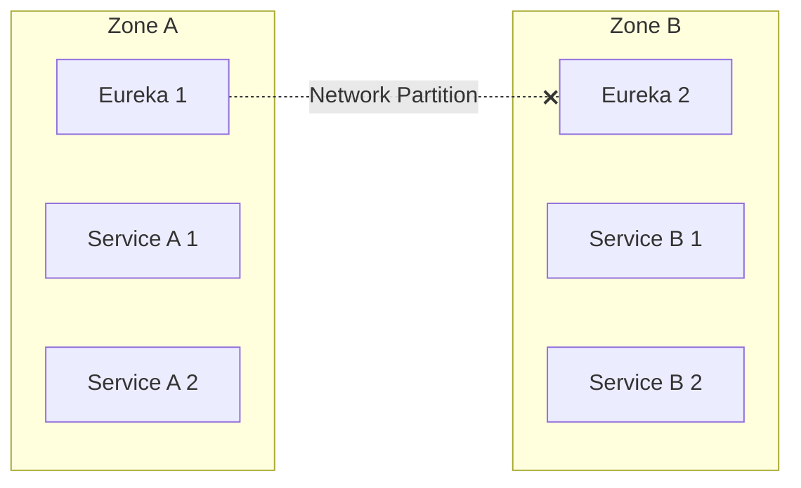
```mermaid
graph LR
    subgraph Zone A
        E1[Eureka 1]
        SA1[Service A 1]
        SA2[Service A 2]
    end
    subgraph Zone B
        E2[Eureka 2]
        SB1[Service B 1]
        SB2[Service B 2]
    end
    E1 -.-x|Network Partition| E2
```

**Eureka behavior:**
- Self-preservation mode activates in both partitions
- Both sides continue serving (with potentially stale data)
- When partition heals, registrations are reconciled
- Risk: Clients in Zone A can't discover services in Zone B

**ZooKeeper behavior:**
- The partition with quorum continues operating
- The partition without quorum becomes read-only (or unavailable)
- When partition heals, follower catches up from leader

**Consul behavior:**
- Similar to ZooKeeper (Raft consensus)
- WAN gossip may detect cross-DC partition faster
- Services in the minority partition can't write

### 10.3 Thundering Herd on Registry Restart

**Scenario:** Registry server restarts. All clients try to reconnect simultaneously.

**Impact:**
- Thousands of simultaneous registration/heartbeat/fetch requests
- Registry overwhelmed before it can stabilize
- Potential crash loop

**Mitigation:**
```java
// Client-side jitter for reconnection
private Duration getReconnectDelay(int attemptNumber) {
    // Exponential backoff with jitter
    long baseDelayMs = Math.min(1000 * (1L << attemptNumber), 30_000);
    long jitterMs = ThreadLocalRandom.current().nextLong(baseDelayMs);
    return Duration.ofMillis(baseDelayMs + jitterMs);
}
```

- Add random jitter to client reconnection logic
- Eureka's `wait-time-in-ms-when-sync-empty` delays initial traffic
- Rate limit the registration endpoint

### 10.4 Split Brain in ZooKeeper

**Scenario:** A ZooKeeper ensemble of 5 nodes experiences a network partition creating two groups of 3 and 2.

```
Group A (3 nodes) → Has quorum → Continues as leader + followers
Group B (2 nodes) → No quorum → Cannot serve writes, may serve stale reads
```

**Impact:**
- Services connected to Group B cannot register or discover
- Services connected to Group A operate normally
- When partition heals, Group B nodes catch up

**Critical lesson:** Always deploy an odd number of ZooKeeper nodes (3, 5, or 7). With an even number (e.g., 4), a 2-2 split means NEITHER side has quorum.

### 10.5 Stale Cache Leading to Cascading Failure

**Scenario:**
1. Payment service deploys a new version (breaking API change)
2. Old instances are deregistered, new instances register
3. Order service's Eureka cache still has old instance addresses
4. Order service routes to old (now dead) instances
5. All payment requests fail for up to 30 seconds (cache refresh interval)

**Mitigation:**
- Implement circuit breakers that detect and stop routing to failing instances
- Use retry-with-discovery: on failure, force-refresh the registry and retry
- Reduce cache refresh interval for critical services
- Use graceful shutdown with connection draining

```java
// Retry with forced discovery refresh
public PaymentResponse processWithRetry(PaymentRequest request) {
    for (int attempt = 0; attempt < 3; attempt++) {
        try {
            List<ServiceInstance> instances = discoveryClient.getInstances("payment-service");
            ServiceInstance instance = loadBalancer.choose(instances);
            return callService(instance, request);
        } catch (ServiceCallException e) {
            if (attempt < 2) {
                // Force refresh the discovery cache
                ((EurekaDiscoveryClient) discoveryClient).forceRefresh();
                continue;
            }
            throw e;
        }
    }
    throw new ServiceUnavailableException("All retries exhausted");
}
```

### 10.6 Health Check False Positives

**Scenario:** A service instance passes health checks (HTTP 200 on `/health`) but is actually unable to process requests (database connection pool exhausted).

**Root cause:** The health check only tests the HTTP endpoint, not the actual business logic path.

**Mitigation:**
- Implement deep health checks that test critical dependencies
- Use readiness probes (not just liveness probes)
- Implement circuit breakers at the client level
- Monitor actual request success rates, not just health check responses

### 10.7 DNS Caching Causing Stale Routing

**Scenario:** Using DNS-based discovery with Java's DNS caching.

Java's `InetAddress` caches DNS lookups forever by default (when a security manager is installed) or for 30 seconds. This means:
1. Service moves to new IP
2. DNS updated immediately
3. Java client continues using old IP for up to 30 seconds (or forever!)

**Mitigation:**
```java
// Set Java DNS TTL (in JVM arguments or code)
java.security.Security.setProperty("networkaddress.cache.ttl", "10");
java.security.Security.setProperty("networkaddress.cache.negative.ttl", "5");
```

---

## 11. Debugging & Observability

### 11.1 Key Metrics to Monitor

**Registry-Side Metrics:**

| Metric | Description | Alert Threshold |
|--------|-------------|-----------------|
| `eureka.server.registrations` | Total registered instances | Sudden drop > 20% |
| `eureka.server.renewals` | Heartbeats per minute | Below 85% of expected |
| `eureka.server.evictions` | Evicted instances per minute | > 10/min (unusual) |
| `eureka.server.self_preservation` | Self-preservation active | Any activation |
| `eureka.server.replication_lag` | Peer replication delay | > 5 seconds |
| `registry.response_time_p99` | Query response time (99th percentile) | > 100ms |

**Client-Side Metrics:**

| Metric | Description | Alert Threshold |
|--------|-------------|-----------------|
| `discovery.cache_size` | Number of instances in local cache | Sudden change > 30% |
| `discovery.cache_refresh_time` | Time to refresh cache | > 5 seconds |
| `discovery.instances_available` | Healthy instances per service | < minimum threshold |
| `discovery.fetch_errors` | Failed registry fetches | > 3 consecutive |
| `discovery.stale_cache_age` | Time since last successful refresh | > 5 minutes |

### 11.2 Structured Logging

```java
import org.slf4j.Logger;
import org.slf4j.LoggerFactory;
import org.slf4j.MDC;

public class ServiceDiscoveryLogger {
    
    private static final Logger log = LoggerFactory.getLogger(ServiceDiscoveryLogger.class);

    public void logRegistration(String serviceName, String instanceId, 
                                  String host, int port) {
        MDC.put("service", serviceName);
        MDC.put("instanceId", instanceId);
        MDC.put("event", "REGISTRATION");
        
        log.info("Service registered: {}:{} -> {}:{}", 
                 serviceName, instanceId, host, port);
        
        MDC.clear();
    }

    public void logDiscovery(String serviceName, int instanceCount, 
                               long latencyMs) {
        MDC.put("service", serviceName);
        MDC.put("event", "DISCOVERY");
        
        log.info("Discovered {} instances of {} in {}ms", 
                 instanceCount, serviceName, latencyMs);
        
        if (instanceCount == 0) {
            log.warn("No instances found for service: {}", serviceName);
        }
        
        MDC.clear();
    }

    public void logHeartbeatFailure(String serviceName, String instanceId, 
                                      int consecutiveFailures) {
        MDC.put("service", serviceName);
        MDC.put("instanceId", instanceId);
        MDC.put("event", "HEARTBEAT_FAILURE");
        
        log.warn("Heartbeat failed for {}:{} ({} consecutive failures)", 
                 serviceName, instanceId, consecutiveFailures);
        
        if (consecutiveFailures >= 3) {
            log.error("Instance likely dead: {}:{}", serviceName, instanceId);
        }
        
        MDC.clear();
    }

    public void logSelfPreservation(boolean entering, double renewalRatio) {
        MDC.put("event", "SELF_PRESERVATION");
        
        if (entering) {
            log.warn("ENTERING self-preservation mode. Renewal ratio: {}", 
                     String.format("%.2f", renewalRatio));
        } else {
            log.info("EXITING self-preservation mode. Renewal ratio normalized: {}", 
                     String.format("%.2f", renewalRatio));
        }
        
        MDC.clear();
    }
}
```

### 11.3 Distributed Tracing

Service discovery should integrate with distributed tracing to diagnose routing issues:

```java
import io.opentelemetry.api.trace.Span;
import io.opentelemetry.api.trace.Tracer;

public class TracedServiceDiscovery {
    
    private final DiscoveryClient discoveryClient;
    private final Tracer tracer;

    public List<ServiceInstance> discover(String serviceName) {
        Span span = tracer.spanBuilder("service-discovery")
            .setAttribute("discovery.service", serviceName)
            .startSpan();
        
        try {
            List<ServiceInstance> instances = discoveryClient.getInstances(serviceName);
            
            span.setAttribute("discovery.instances_found", instances.size());
            span.setAttribute("discovery.source", "eureka");
            
            if (instances.isEmpty()) {
                span.setAttribute("discovery.warning", "no_instances_found");
            }
            
            // Record which instance was selected
            if (!instances.isEmpty()) {
                ServiceInstance selected = instances.get(0); // simplified
                span.setAttribute("discovery.selected_host", selected.getHost());
                span.setAttribute("discovery.selected_port", selected.getPort());
            }
            
            return instances;
        } catch (Exception e) {
            span.setAttribute("discovery.error", e.getMessage());
            throw e;
        } finally {
            span.end();
        }
    }
}
```

### 11.4 Dashboard Recommendations

**Grafana Dashboard for Service Discovery:**

1. **Registry Health Panel:**
   - Total registered instances (gauge)
   - Registrations/Deregistrations per minute (counter)
   - Self-preservation mode indicator (boolean)
   
2. **Heartbeat Panel:**
   - Expected vs. actual heartbeats (comparison gauge)
   - Heartbeat latency histogram
   - Missed heartbeats per service (bar chart)

3. **Discovery Panel:**
   - Discovery query rate (counter)
   - Cache hit ratio (percentage)
   - Discovery latency percentiles (p50, p95, p99)
   
4. **Instance Health Panel:**
   - Instances per service (stacked bar)
   - Health check results (pass/warn/fail)
   - Eviction rate (counter)

### 11.5 Common Debugging Scenarios

**"Service X can't find Service Y"**
```
Debugging checklist:
1. Is Service Y registered in the registry?
   → curl http://eureka:8761/eureka/apps/SERVICE-Y
   
2. Is Service Y's health check passing?
   → curl http://service-y:8080/actuator/health
   
3. Is Service X's local cache up-to-date?
   → Check service X logs for last cache refresh
   → curl http://service-x:8080/actuator/env | grep eureka
   
4. Is there a network partition between X and the registry?
   → ping/traceroute from X to registry
   
5. Is self-preservation mode hiding dead instances?
   → Check Eureka dashboard for self-preservation banner
   
6. Is the service name correct (case-sensitive in some systems)?
   → spring.application.name must match exactly
```

---

## 12. Interview Questions

### Beginner Level

**Q1: What is service discovery and why is it needed?**

**Expected Answer:**
Service discovery is the mechanism by which services in a distributed system locate each other. It's needed because in modern cloud-native environments, service instances are ephemeral — they scale up/down, move between hosts, and change IP addresses. Hardcoding endpoints doesn't work. Service discovery provides a dynamic registry where services register their locations and clients query to find available instances.

**Q2: What's the difference between client-side and server-side discovery?**

**Expected Answer:**
In **client-side discovery**, the client queries the service registry directly, gets a list of instances, and uses client-side load balancing to pick one (e.g., Netflix Eureka + Ribbon). In **server-side discovery**, the client sends requests to a load balancer or gateway, which queries the registry and forwards the request (e.g., Kubernetes Services, AWS ELB). Client-side has fewer network hops but more client complexity; server-side is simpler for clients but adds a potential bottleneck.

**Q3: What is a health check in service discovery?**

**Expected Answer:**
A health check determines whether a service instance can handle requests. Active (pull-based) health checks have the registry periodically probe the service. Passive (push-based) health checks rely on the service sending heartbeats. A good health check should verify not just that the process is running (liveness) but that it can actually handle requests (readiness), including checking downstream dependencies.

### Intermediate Level

**Q4: Explain Eureka's self-preservation mode. When does it activate and why?**

**Expected Answer:**
Self-preservation mode activates when the number of heartbeat renewals received by Eureka drops below 85% of the expected count. This typically happens during network partitions when healthy services can't reach Eureka. Without self-preservation, Eureka would evict all these instances, causing mass deregistration. In self-preservation mode, Eureka stops evicting instances, preferring to keep potentially stale data rather than removing entries that might still be healthy. This is an AP-system design choice — availability over accuracy.

**Q5: Compare ZooKeeper and etcd for service discovery. When would you choose one over the other?**

**Expected Answer:**
Both are CP systems using consensus (ZAB vs. Raft). ZooKeeper has ephemeral znodes (ideal for service registration — auto-cleanup on crash) and one-shot watches. etcd has leases (similar but more flexible) and persistent watches with revision history. etcd is the better choice for Kubernetes environments (it's built-in), modern Go-based systems, and when you need persistent watches. ZooKeeper is better for JVM-based ecosystems (Kafka, Hadoop), when you need the rich recipe patterns (distributed locks, barriers), and in established big data infrastructure.

**Q6: How does DNS-based service discovery work in Kubernetes?**

**Expected Answer:**
Kubernetes runs CoreDNS, which watches the API server for Service and Endpoint changes. When you create a Service named `my-service` in namespace `default`, CoreDNS creates a DNS record: `my-service.default.svc.cluster.local` pointing to the ClusterIP. For headless services (no ClusterIP), the DNS record resolves directly to Pod IPs. Pods can discover services simply by DNS name. This is server-side discovery — kube-proxy (using iptables or IPVS) handles load balancing.

### Advanced Level

**Q7: You're designing service discovery for a system with 10,000 microservices and 100,000 instances across 3 regions. What are the key design decisions?**

**Expected Answer:**
Key decisions:
1. **Consistency model**: AP for most services (availability during partitions), with CP option for critical coordination.
2. **Registry architecture**: Regional registries with cross-region sync (like Consul multi-DC). Don't route cross-region for every discovery query.
3. **Update propagation**: Incremental (delta) fetches, not full registry pulls. At 100K instances, a full fetch would be ~100MB.
4. **Locality-aware routing**: Prefer same-zone, then same-region, then cross-region. This saves millions in cross-zone data transfer.
5. **Client caching**: Aggressive local caching with push-based invalidation. Clients must function when registry is unreachable.
6. **Health checking**: Distributed health checking (local agents, not centralized). Centralized health checking 100K instances would overwhelm any system.
7. **Self-preservation**: Absolutely necessary at this scale. Network glitches would otherwise cause mass eviction.
8. **Observability**: Comprehensive metrics on registration rates, heartbeat success rates, cache staleness.

**Q8: Explain the "thundering herd" problem in service discovery and how to mitigate it.**

**Expected Answer:**
The thundering herd occurs when many clients simultaneously attempt to connect/register with the registry — typically after a registry restart, network partition recovery, or deployment. With 10,000 clients all trying to register and fetch in the same second, the registry can be overwhelmed.

Mitigations:
1. **Randomized jitter**: Add random delay (0-30s) to client startup registration
2. **Exponential backoff**: If registry is unavailable, don't retry immediately
3. **Warm-up period**: Registry delays serving until it syncs with peers (Eureka's `wait-time-in-ms-when-sync-empty`)
4. **Rate limiting**: Registry-side rate limiting on registration endpoints
5. **Client-side caching**: Clients survive brief registry outages without reconnecting
6. **Staggered restarts**: Rolling restart of registry nodes, never all at once

**Q9: How would you implement service discovery that works across multiple cloud providers (AWS + GCP + on-prem)?**

**Expected Answer:**
This requires a multi-layer approach:

1. **Global registry layer**: Use Consul's multi-datacenter capability or build a custom global registry with regional replicas.
2. **Local registration**: Each environment has local agents/registrars that handle registration within their network.
3. **Cross-environment sync**: Asynchronous replication of service catalogs between environments. Use WAN gossip (Consul) or custom sync.
4. **Network connectivity**: VPN or interconnect between environments. Services must be able to reach cross-environment endpoints.
5. **Abstraction layer**: A service discovery SDK that abstracts the underlying mechanism. The SDK handles locality preference, fallback, and cross-environment resolution.
6. **Health checking**: Local health checks (not cross-environment probes). Aggregate health status at the registry level.
7. **DNS unification**: Use a common DNS zone (e.g., `service.internal`) with split-horizon DNS that resolves to local instances first.

### FAANG-Level

**Q10: Netflix has 700+ microservices. When they migrated from data center to AWS, how did their service discovery evolve, and what would you change about Eureka's design today?**

**Expected Answer:**
Evolution: In the data center, Netflix used hardware load balancers and manual DNS. In AWS, they needed dynamic discovery due to auto-scaling and availability zone failures. They built Eureka as an AP system because AWS network partitions were common, and they couldn't afford discovery outages.

What I'd change today:
1. **gRPC instead of REST**: Eureka's REST API with JSON serialization is chatty. gRPC with protocol buffers would reduce payload sizes by 5-10x and improve latency.
2. **Push-based updates**: Replace the 30-second polling with persistent gRPC streams (like etcd watches). This would reduce discovery latency from 30s to near-instant.
3. **Structured metadata**: Eureka's metadata is untyped string maps. Structured metadata with schemas would enable richer routing decisions.
4. **Built-in service mesh**: Modern discovery should integrate with service mesh for mTLS, traffic policies, and observability.
5. **Multi-protocol**: Support DNS, gRPC, and xDS (Envoy's discovery protocol) natively.
6. **Better consistency options**: Allow per-service consistency guarantees. Some services need strong consistency; most don't.

---

## 13. Exercises

### Exercise 1: Conceptual — Design a Service Registry (Beginner)

**Task:** Draw the architecture diagram for a service discovery system that supports:
- 50 microservices with 5 instances each
- Health checking via HTTP
- Client-side load balancing
- Graceful shutdown with deregistration

Answer the following:
1. What happens when an instance crashes without graceful shutdown?
2. How long before clients stop routing to the crashed instance?
3. What happens if the registry itself crashes?

### Exercise 2: Coding — Implement a Client-Side Load Balancer (Intermediate)

**Task:** Implement a `ServiceLoadBalancer` that supports multiple strategies:

```java
public interface ServiceLoadBalancer {
    ServiceInstance choose(String serviceName, List<ServiceInstance> instances);
}

// Implement these strategies:
// 1. RoundRobinLoadBalancer
// 2. RandomLoadBalancer
// 3. WeightedLoadBalancer (based on instance metadata "weight")
// 4. LeastConnectionsLoadBalancer (track active connections)
// 5. ZoneAwareLoadBalancer (prefer same zone, fallback to others)
```

**Bonus:** Implement circuit-breaker integration that automatically removes instances with high error rates from the rotation.

### Exercise 3: Coding — ZooKeeper Distributed Lock (Intermediate)

**Task:** Using the ZooKeeper API, implement a distributed lock:

```java
public interface DistributedLock {
    boolean tryLock(long timeout, TimeUnit unit) throws Exception;
    void unlock() throws Exception;
    boolean isHeldByCurrentThread();
}
```

Requirements:
- Use ephemeral sequential znodes
- Implement fair ordering (FIFO)
- Handle session expiry (lock auto-released)
- Avoid the herd effect (each waiter watches only predecessor)

### Exercise 4: System Design — Multi-Region Discovery (Advanced)

**Task:** Design a service discovery system for a company operating in 3 AWS regions (us-east-1, eu-west-1, ap-southeast-1) with:
- 200 microservices, 2,000 instances per region
- Latency-sensitive services that must prefer local instances
- Some services that are region-specific (e.g., compliance services)
- Disaster recovery: if one region goes down, traffic shifts to others

Design the following:
1. Registry topology (where are registry servers?)
2. Registration flow (how do services register?)
3. Discovery flow (how do clients find services?)
4. Cross-region discovery (how are services discovered across regions?)
5. Failure handling (what happens when a region goes down?)
6. Monitoring and alerting

### Exercise 5: Debugging — Diagnose a Discovery Failure (Advanced)

**Scenario:**
```
Alert: Order service cannot reach Payment service
Time: 14:32 UTC
Duration: Ongoing for 5 minutes

Observations:
- Eureka dashboard shows 45 instances of payment-service registered
- Order service logs: "No instances available for payment-service"
- Direct curl from order-service host to payment-service works
- Eureka server logs: "Self-preservation mode activated"
```

**Questions:**
1. What is the most likely root cause?
2. What additional data would you collect?
3. How would you resolve this immediately?
4. How would you prevent this from happening again?

---

## 14. Expert Insights

### 14.1 Hidden Complexities

**The Registry Bootstrapping Problem:**
When your entire system starts up (e.g., after a regional outage recovery), services need to find the registry to register. But how do they find the registry? Options:
- Hardcode registry addresses (most common but fragile)
- Use DNS for registry discovery (adds a layer of indirection)
- Use cloud provider metadata (AWS instance tags, GCP labels)
- Bootstrap file deployed with the application

At Netflix, Eureka server addresses are configured via Spring Cloud Config, which itself is discovered via DNS. It's turtles all the way down — at some point, you need a static endpoint.

**The CAP Reality:**
In practice, service discovery systems don't neatly fit into CP or AP categories:
- Eureka is AP, but during normal operation, replication lag is < 1 second (feels like CP)
- ZooKeeper is CP, but if you only read from followers, you get stale data (feels like AP)
- Consul can be configured for stale reads, making it behave as AP for queries

**Watch Scalability:**
ZooKeeper watches are one-shot. In a system with 10,000 clients watching the same znode, a single change triggers 10,000 notifications, each requiring the client to re-set the watch (another 10,000 requests). This is the "herd effect" and it's why ZooKeeper limits the size of watched datasets.

etcd solved this with persistent watches and watch multiplexing — a single gRPC stream can carry notifications for thousands of keys.

### 14.2 Industry Lessons

**Lesson 1: Discovery is not load balancing.**
Service discovery tells you WHERE services are. Load balancing decides WHICH instance to send traffic to. They're related but distinct. Many teams conflate them, leading to discovery systems that try to do load balancing (poorly) or load balancers that try to do discovery (incompletely).

**Lesson 2: The cache is more important than the registry.**
At Netflix's scale, the local client cache is the PRIMARY source of truth for routing. The registry is just the mechanism to keep the cache updated. When designing service discovery, invest heavily in cache management — freshness, invalidation, graceful degradation.

**Lesson 3: Don't use ZooKeeper for service discovery (if you can avoid it).**
ZooKeeper was designed for coordination (locks, elections, barriers), not service discovery. While ephemeral znodes work for registration, ZooKeeper's scalability limitations (< 1GB data, limited concurrent connections, herd effect with watches) make it a poor choice for large-scale discovery. This is why the Kafka community is replacing ZooKeeper with KRaft.

**Lesson 4: Health checks lie.**
A service can pass health checks and still be unable to handle traffic (connection pool exhaustion, memory pressure, stuck threads). The most reliable health signal is actual traffic success rates, not synthetic probes. This is why service mesh approaches (Istio, Linkerd) use actual request metrics for routing decisions.

**Lesson 5: Multi-tenancy in service discovery.**
In large organizations, thousands of engineers deploy services. Without namespace isolation in service discovery, name collisions, accidental overwrites, and discovery leaks between teams are common. Always namespace your services: `{team}.{service}.{environment}`.

### 14.3 Scaling Pain Points

**Pain Point 1: Registry as SPOF**
Despite clustering, the registry can become a practical SPOF. If all 3 Eureka servers are overwhelmed (thundering herd), all discovery fails. Solution: Overprovisioning, rate limiting, and aggressive client-side caching.

**Pain Point 2: Cross-zone data transfer costs**
At Netflix's scale, cross-zone data transfer costs were millions of dollars per year. Zone-aware routing in Eureka saved significant money by preferring same-zone instances.

**Pain Point 3: Service mesh transition**
Many organizations are moving from dedicated service discovery (Eureka/Consul) to service mesh (Istio/Linkerd). The transition is painful because it requires sidecar injection, changes to networking, and a new mental model. Hybrid approaches (running both during migration) add complexity.

**Pain Point 4: Discovery in serverless**
Functions-as-a-Service (Lambda, Cloud Functions) don't have long-running processes to register with a service registry. They need infrastructure-integrated discovery (API Gateway, cloud DNS). This fundamentally changes the discovery model.

### 14.4 When NOT to Use Specific Approaches

**Don't use Eureka if:**
- You need strong consistency guarantees
- You're not in a JVM/Spring ecosystem
- You're running on Kubernetes (use built-in DNS instead)

**Don't use ZooKeeper for service discovery if:**
- You have > 10,000 service instances
- You need cross-datacenter discovery
- You don't already have ZooKeeper in your infrastructure

**Don't use DNS-only discovery if:**
- You need sub-second discovery updates
- You need rich metadata (version, tags, load info)
- You need programmatic health checking

**Don't build a custom registry if:**
- Your team is < 50 engineers
- Off-the-shelf solutions meet your needs
- You don't have dedicated infrastructure engineering

---

## 15. Chapter Summary

### Key Concepts

- **Service discovery** solves the problem of locating services in dynamic, ephemeral environments where IP addresses change constantly.

- **Two fundamental patterns**: Client-side discovery (client queries registry, load-balances directly) vs. server-side discovery (client talks to load balancer, which queries registry).

- **Service registry** is the heart of discovery — a database of healthy service instances. Must be highly available and fault-tolerant.

- **Health checking** comes in two flavors: active (registry probes services) and passive (services send heartbeats). Deep health checks are essential.

### Technology Deep Dives

- **Netflix Eureka**: AP system, peer-to-peer replication, self-preservation mode prevents mass eviction during partitions. Best for JVM/Spring Cloud ecosystems.

- **HashiCorp Consul**: CP system using Raft, multi-datacenter support, built-in DNS and KV store, service mesh via Connect. Best for multi-platform environments.

- **Apache ZooKeeper**: CP system using ZAB protocol, ephemeral znodes for registration, one-shot watches. Best for JVM ecosystems and coordination patterns (locks, elections).

- **etcd**: CP system using Raft, persistent watches, Kubernetes backbone. Best for Kubernetes-native systems.

- **DNS-based discovery**: Simplest approach, universally supported, but limited by TTL caching and lack of health checking. Kubernetes DNS (CoreDNS) adds dynamic capabilities.

### Production Wisdom

- **Prefer availability over consistency** for service discovery — stale data is better than no data (Netflix's philosophy).

- **Client-side caching** is your most important resilience mechanism — services must function when the registry is unreachable.

- **Self-preservation** prevents catastrophic mass eviction during network partitions but may hide real failures.

- **Zone-aware routing** saves significant cloud costs and reduces latency at scale.

- **Health checks lie** — use actual traffic metrics alongside synthetic probes for routing decisions.

### Decision Framework

```
Starting a new microservices project?
  → Kubernetes? Use built-in DNS + optional Consul for cross-cluster
  → Spring Cloud ecosystem? Eureka or Consul
  → Multi-cloud / multi-platform? Consul
  → Already running Kafka/Hadoop? ZooKeeper (you already have it)
  → Need KV store + discovery? Consul or etcd
  → Need service mesh? Consul Connect or Istio (which uses its own discovery)
  → Building from scratch for learning? Build a custom registry (Exercise 5)
```

### Common Mistakes

1. ❌ Hardcoding service URLs in configuration files
2. ❌ Using a single registry instance (no high availability)
3. ❌ Not implementing health checks (routing to zombie instances)
4. ❌ Ignoring Java DNS caching (stale resolution for hours)
5. ❌ Full registry fetches at scale (use delta/incremental)
6. ❌ Not monitoring registry health (self-preservation masking failures)
7. ❌ Treating discovery as optional infrastructure (it's foundational)
8. ❌ Not implementing circuit breakers alongside discovery
9. ❌ Using strong consistency when eventual consistency suffices
10. ❌ Forgetting about cross-zone data transfer costs

---

*Next Chapter: [Chapter 18 — Containerization](./Chapter-18-Containerization.md) explores how containers transformed service deployment and paved the way for modern orchestration platforms.*
