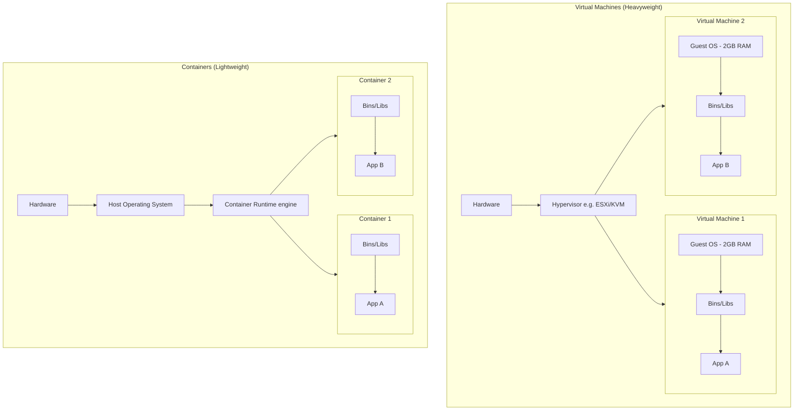
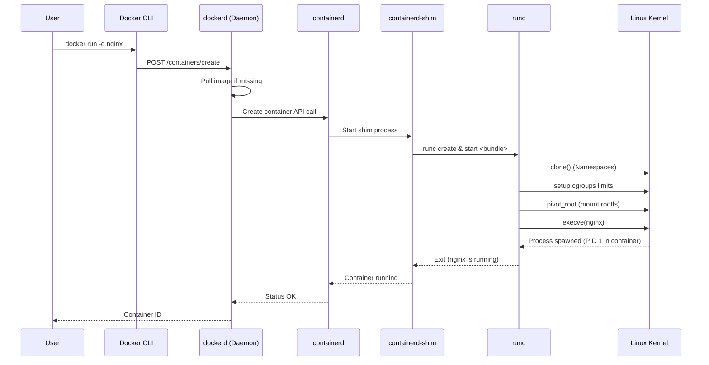
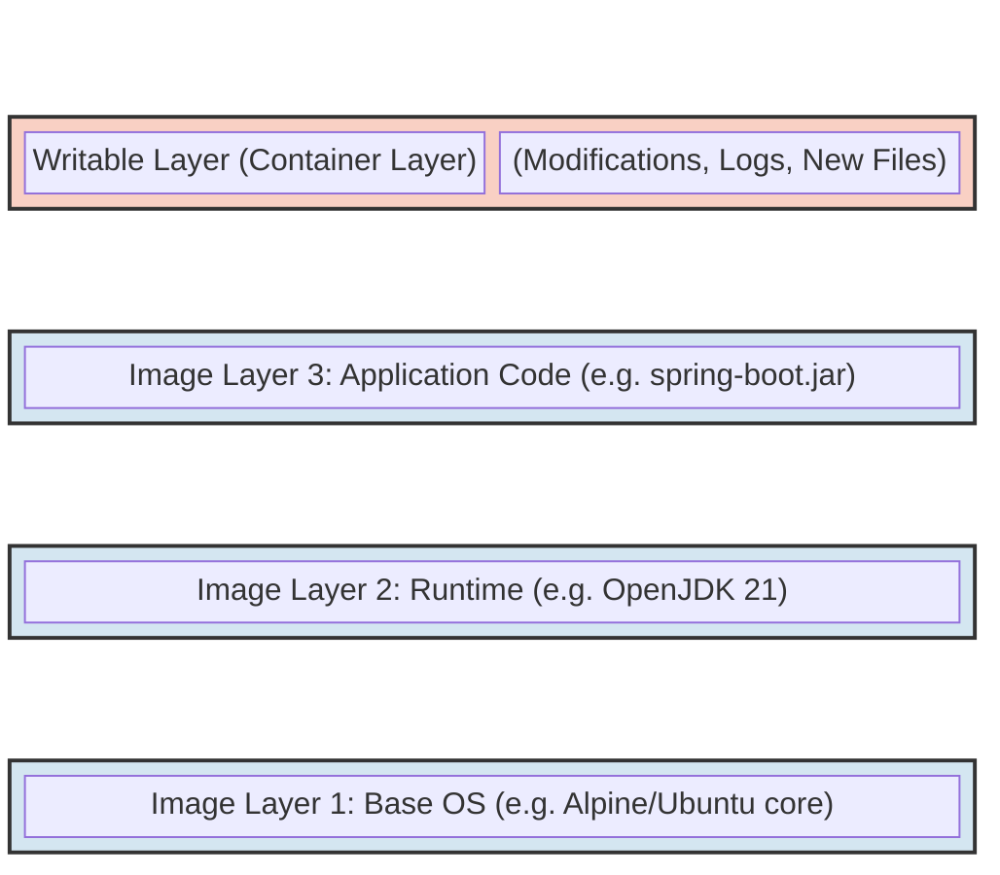
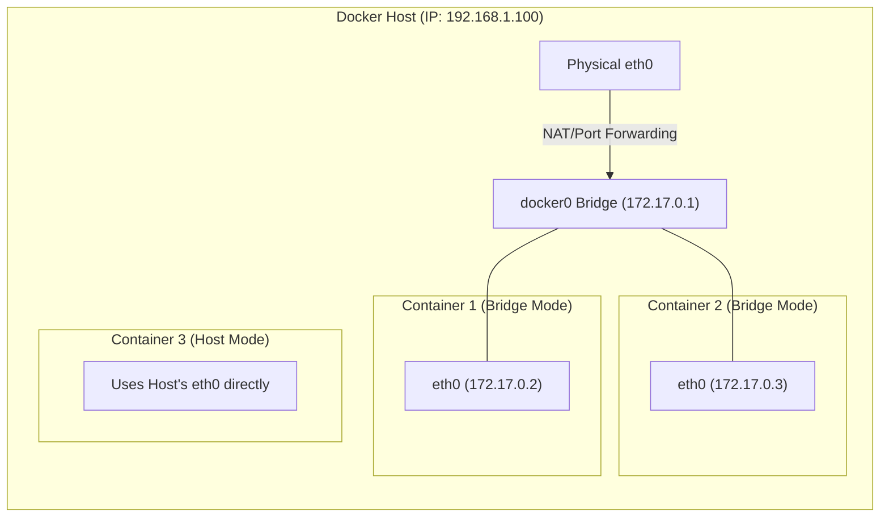

# Chapter 18: Containerization

## 1. Why This Matters

Before the advent of containers, deploying distributed systems was a fragile, complex, and notoriously error-prone process. The prevailing paradigm involved either deploying multiple applications on a single bare-metal server or utilizing Virtual Machines (VMs) to isolate workloads. Both approaches had profound flaws. Bare-metal deployments suffered from "dependency hell," where updating a shared library for Application A would inadvertently break Application B. VMs solved the isolation problem but introduced immense overhead: each VM required a full Guest Operating System (OS), consuming gigabytes of memory and significant CPU cycles simply to run the OS idle loops, severely limiting density and inflating cloud infrastructure costs.

Furthermore, the "It works on my machine" syndrome was rampant. An application that passed tests on a developer's macOS laptop would fail in production on CentOS due to subtle differences in system libraries, environment variables, or filesystem paths.

**Containerization revolutionized distributed systems by introducing Immutable Infrastructure and process-level isolation.** Containers package an application and all its dependencies—libraries, binaries, and configuration files—into a single, standardized, executable unit. This ensures absolute reproducibility across any environment. For systems architects, containers are the fundamental unit of deployment that enables modern microservices. Without containers, orchestrators like Kubernetes could not exist, CI/CD pipelines would be sluggish and brittle, and the massive scale achieved by modern cloud-native architectures would be economically and technically unfeasible.

In this chapter, we will dissect containerization from the ground up. We will strip away the magic of Docker to understand the raw Linux kernel features that make containers possible, analyze container runtimes and the Open Container Initiative (OCI) standards, and evaluate the tradeoffs, failure modes, and performance implications of containerizing applications, particularly with Java.

---

## 2. Beginner Intuition

Imagine the global shipping industry before the 1950s. Goods were transported in "break-bulk" cargo. Barrels of oil, sacks of flour, wooden crates of machinery, and loose items were all loaded individually onto ships. Every ship, truck, and train had to be custom-loaded. Loading a single ship took weeks, required immense manual labor, and goods were frequently damaged or stolen. Different ports had different equipment for handling different types of cargo.

Then, the **standardized shipping container** was invented.

Suddenly, it didn't matter what was inside the container—whether it was electronics, cars, or coffee beans. The container itself had exactly the same dimensions, the same corner fittings, and the same structural integrity everywhere in the world.
- Ships were redesigned to hold these standard boxes.
- Cranes were built to lift them efficiently.
- Trucks and trains were built with standard chassis to carry them.

**Software Containers** are the standardized shipping containers for code.
Before Docker, deploying an app meant custom-loading it onto a server (installing Java, setting up Tomcat, copying the WAR file, configuring properties). Every server was treated like a bespoke ship.

With software containers, the developer packs the application and all its dependencies into a standard "box" (a container image). The operations team—or more accurately, the container runtime and orchestrator—doesn't care if the box contains a Java Spring Boot app, a Python Django web server, or a C++ machine learning model. The infrastructure only knows how to start, stop, move, and monitor the standard box. The application inside the box is guaranteed to run exactly the same way on a developer's laptop, in a staging environment, or in a production datacenter.

---

## 3. Core Theory

The most critical realization for any systems engineer is this: **Containers are not virtual machines. They are just isolated Linux processes.**

A VM relies on a hypervisor (like ESXi, KVM, or Hyper-V) to emulate physical hardware (CPU, memory, disks). A full Guest OS runs on this emulated hardware.
A container, conversely, runs directly on the Host OS kernel. It is a standard OS process, but it is subjected to a set of constraints and illusions created by the kernel. The "container" is an illusion fabricated by three core Linux kernel features: **Namespaces**, **cgroups (Control Groups)**, and **Union Filesystems**.

### 3.1 Linux Namespaces (The Illusion of Isolation)
Namespaces limit what a process can *see*. When a process runs in a namespace, it is tricked into believing it has its own isolated instance of a global system resource.

1.  **PID (Process ID) Namespace**: Isolates the process ID number space. The first process created in a new PID namespace gets PID 1. Inside the container, the application thinks it is the init process. Outside the container, on the host, the same process might be PID 34582. This prevents containers from inspecting or killing processes belonging to other containers or the host.
2.  **NET (Network) Namespace**: Provides a private network stack. A process in a NET namespace gets its own network interfaces (e.g., a private `eth0` and `lo`), routing tables, IP addresses, and iptables rules.
3.  **MNT (Mount) Namespace**: Isolates the list of mount points seen by the processes. Similar to a sophisticated `chroot` jail, it ensures that a container cannot access the host's root filesystem; it only sees its own containerized filesystem.
4.  **UTS (UNIX Time-sharing System) Namespace**: Allows a single system to have different hostnames and domain names for different processes. When you run `hostname` inside a container, you get a unique container ID instead of the host machine's name.
5.  **IPC (Inter-Process Communication) Namespace**: Isolates System V IPC objects and POSIX message queues. Processes in different IPC namespaces cannot use shared memory to communicate.
6.  **USER Namespace**: Isolates user and group IDs. A process's user and group IDs can be different inside and outside the namespace. This is crucial for security (Rootless Containers): a process can run as the root user (`UID 0`) *inside* the container, but map to an unprivileged, restricted user (`UID 100000`) on the host system.
7.  **CGROUP Namespace**: Hides the identity of the cgroup of which process is a member.

### 3.2 Control Groups (cgroups) (The Limits of Consumption)
While namespaces restrict what a process can *see*, cgroups restrict what a process can *use*. Developed by Google engineers in 2006, cgroups monitor, account for, and limit resource usage for a group of processes.

- **CPU limit**: Prevents a noisy neighbor container from consuming 100% of the host CPU. It uses CFS (Completely Fair Scheduler) quotas to throttle the process.
- **Memory limit**: Sets an absolute cap on RAM usage. If the container exceeds this limit, the kernel's Out-Of-Memory (OOM) killer intervenes and immediately terminates the container process.
- **Block I/O limit**: Restricts disk read/write throughput (bytes per second or IOPS) to prevent a container from saturating the disk controller.
- **Network limits**: Shapes traffic to prevent bandwidth monopolization.

*Note: The Linux kernel has transitioned from cgroups v1 to cgroups v2, which provides a unified hierarchy and better resource delegation, especially for rootless containers.*

### 3.3 Union Filesystems (UnionFS / OverlayFS)
If every container needed a full copy of the Linux filesystem, disk space would be exhausted rapidly. Union Filesystems solve this by stacking multiple directories (layers) onto a single mount point, making them appear as a single cohesive filesystem.

When you pull a Docker image, it is composed of immutable, read-only layers.
1.  **Base Layer**: (e.g., Alpine Linux core files).
2.  **Dependency Layer**: (e.g., JRE installation).
3.  **Application Layer**: (e.g., Your compiled `.jar` file).

When a container starts, the runtime adds a thin, **writable layer** on top of these read-only layers. All modifications made by the running container (writing logs, creating files) happen exclusively in this writable layer. If a container modifies an existing file from a read-only layer, the runtime performs a **Copy-on-Write (CoW)** operation: it copies the file up to the writable layer and modifies it there. The underlying read-only layers remain untouched and can be shared among hundreds of other containers.

---

## 4. Architecture Deep Dive

The term "Docker" is often used loosely, but in reality, modern container architecture is heavily modularized to adhere to Open Container Initiative (OCI) standards.

### 4.1 OCI (Open Container Initiative) Standards
Formed in 2015, the OCI prevents ecosystem fragmentation by defining open industry standards around container formats and runtimes.
- **Image Specification**: Defines the format for container images (manifests, layer tarballs, configuration JSON). This guarantees that an image built by Docker can be run by Podman, containerd, or any other OCI-compliant tool.
- **Runtime Specification**: Defines how a container runtime should unpack an OCI image on disk and execute it. It standardizes the configuration file (`config.json`) and the lifecycle commands (`create`, `start`, `kill`, `delete`).

### 4.2 The Modern Container Stack

When you type `docker run`, a complex sequence of handoffs occurs across several architectural layers:

1.  **Docker CLI**: The command-line interface. It translates your commands into REST API calls and sends them to the Docker Daemon.
2.  **Docker Daemon (dockerd)**: The background service managing Docker objects (images, networks, volumes). It processes the API requests, handles image pulls from the Registry, and manages the build process. However, it *does not* actually run the containers anymore.
3.  **containerd**: An industry-standard core container runtime. It was extracted from Docker and donated to the CNCF. It manages the complete container lifecycle of its host system, from image transfer and storage to container execution and supervision.
4.  **containerd-shim**: A lightweight daemon that sits between containerd and the low-level runtime. It allows containerd to start a container and then exit, decoupling the lifecycle of the container from containerd. This means you can upgrade or restart containerd without killing all running containers on the host.
5.  **runc**: The default low-level OCI runtime. This is the CLI tool that actually interfaces with the Linux kernel. It takes the OCI bundle provided by containerd, calls the kernel API to create namespaces and cgroups, pivot_roots the filesystem, and execs the container's main process. Once the process is running, `runc` exits.

### 4.3 Alternative Runtimes
- **CRI-O**: A lightweight alternative to containerd, designed explicitly for Kubernetes via the Container Runtime Interface (CRI). It bypasses Docker entirely, pulling OCI images and passing them directly to runc.
- **gVisor (runsc)**: A sandboxed container runtime developed by Google. Instead of sharing the host kernel directly, it intercepts application system calls and implements them in user-space, providing an application kernel. This offers VM-like security isolation with container-like speed.
- **Firecracker/Kata Containers**: Use lightweight, hyper-optimized microVMs to run containers, offering the ultimate blend of VM security boundaries and container startup times.

### 4.4 Docker Networking Modes
Networking is fundamental to distributed systems. Docker provides several Network drivers:
- **Bridge (Default)**: Creates a private internal network on the host (`docker0`). Containers on this bridge get private IP addresses (e.g., `172.17.0.x`). They can communicate with each other. Outbound traffic is NAT-ed (Network Address Translation) through the host's IP. Inbound traffic requires explicit port binding (e.g., `-p 8080:80`).
- **Host**: Removes network isolation. The container uses the host's network stack directly. If a container binds to port 80, the host's port 80 is immediately bound. Highly performant as it skips NAT overhead, but sacrifices isolation and causes port conflicts.
- **None**: Total network isolation. The container has only a loopback interface (`lo`). Useful for highly secure, air-gapped batch processing.
- **Overlay**: Enables communication across multiple physical Docker hosts. Used natively by Docker Swarm. It encapsulates container traffic into UDP packets (VXLAN) to traverse the underlying physical network.
- **Macvlan**: Assigns a real MAC address to a container, making it appear as a physical device on the network. Useful for legacy applications that require direct Layer 2 access and expect to be directly connected to the physical network.

---

## 5. Visual Diagrams

### 5.1 Virtual Machines vs. Containers



### 5.2 The Modern Docker Architecture Stack



### 5.3 Docker Image Layers & OverlayFS



### 5.4 Docker Networking Modes



---

## 6. Real Production Examples

### 6.1 Google's Borg: The Ancestor of Modern Containers
Google was running containerized workloads a decade before Docker existed. Their internal system, **Borg**, heavily utilized Linux cgroups (which Google engineers invented precisely for this purpose) and `chroot` jails to isolate workloads.
Borg runs hundreds of thousands of jobs across thousands of machines. By eliminating VMs and using container isolation, Google achieved massive bin-packing efficiency. If a production-critical user-facing task (like Google Search) didn't need all its CPU, a batch processing task (like indexing) could burst into the unused CPU space dynamically. If the Search task suddenly needed the CPU back, Borg would aggressively throttle or kill the batch task using cgroups. This elastic, containerized bin-packing saved Google billions of dollars in hardware costs compared to static VM allocations.

### 6.2 Netflix: Titus Container Platform
Netflix originally built its massive streaming architecture on AWS EC2 VMs, utilizing AMI (Amazon Machine Image) baking. As their architecture grew into thousands of microservices, AMI baking became too slow (taking 15+ minutes just to build an image and spin up a VM).
Netflix built **Titus**, a container management platform integrated directly with AWS infrastructure. Titus executes millions of containers per day. It relies heavily on advanced container networking—injecting AWS Elastic Network Interfaces (ENIs) directly into the container network namespaces, allowing containers to have routable IP addresses directly within the AWS VPC, circumventing the Docker Bridge NAT overhead and mapping seamlessly into Netflix's existing IPC/RPC frameworks.

### 6.3 Uber: Peloton
Uber handles millions of concurrent trips and relies heavily on microservices. They built **Peloton**, a unified resource scheduler designed to co-locate stateful, stateless, and batch workloads on a single clustered pool of resources.
To handle peak loads (like New Year's Eve), Uber relies on the blazing-fast startup time of containers. A container can start in milliseconds because it bypasses the OS boot sequence entirely, allowing Uber to aggressively auto-scale their surge-pricing and matching engines up and down in near real-time, something completely impossible with VM provisioning.

---

## 7. Java Implementations

Running Java in containers historically presented significant challenges. The JVM, prior to Java 10, was not "cgroup aware." If a JVM ran inside a container limited to 1GB of RAM on a 64GB host, the JVM would read the *host's* memory (64GB), attempt to allocate a massive default heap size, and immediately get OOMKilled by the kernel. Modern Java versions perfectly understand cgroups.

### 7.1 The Anti-Pattern Dockerfile
Beginners often write Dockerfiles like this:
```dockerfile
# BAD PRACTICE: Do not do this in production
FROM ubuntu:latest
RUN apt-get update && apt-get install -y openjdk-21-jdk maven
COPY . /app
WORKDIR /app
RUN mvn clean package
CMD ["java", "-jar", "target/myapp.jar"]
```
**Why it's bad:**
1. It results in a massive 1.5GB+ image containing source code, Maven, and build caches.
2. It has an immense attack surface due to the full Ubuntu OS.
3. Every time you change one line of code, the entire `mvn clean package` step invalidates the layer cache and must rerun entirely.

### 7.2 The Production-Grade Multi-Stage Dockerfile
Multi-stage builds allow you to use a heavy image to compile the code, and a minimal, stripped-down image to run it.

```dockerfile
# ==========================================
# Stage 1: Build the application
# ==========================================
FROM maven:3.9.6-eclipse-temurin-21 AS builder
WORKDIR /build

# Copy only the pom.xml first to cache dependency resolution
COPY pom.xml .
RUN mvn dependency:go-offline

# Copy source code and build
COPY src ./src
RUN mvn clean package -DskipTests

# Extract Spring Boot layers (highly recommended for Spring Boot 2.3+)
# This separates dependencies from our custom code for better caching
RUN java -Djarmode=layertools -jar target/myapp.jar extract

# ==========================================
# Stage 2: Create the minimal runtime image
# ==========================================
# Distroless images contain no shell, no package managers, minimizing attack surface
FROM gcr.io/distroless/java21-debian12:nonroot
WORKDIR /app

# Switch to non-root user (provided by the distroless image)
USER nonroot

# Copy extracted layers from the builder stage in order of volatility
COPY --from=builder /build/dependencies/ ./
COPY --from=builder /build/spring-boot-loader/ ./
COPY --from=builder /build/snapshot-dependencies/ ./
COPY --from=builder /build/application/ ./

# Expose the application port
EXPOSE 8080

# Configure JVM for container environments
# MaxRAMPercentage ensures JVM respects container cgroup limits
ENV JAVA_OPTS="-XX:MaxRAMPercentage=75.0 -XX:+UseZGC"

# Launch via Spring Boot's exploded launcher
ENTRYPOINT ["java", "org.springframework.boot.loader.launch.JarLauncher"]
```

### 7.3 Docker Compose for Local Development
Docker Compose is an orchestration tool for defining multi-container applications using YAML.

```yaml
version: '3.8'

services:
  api-gateway:
    build: 
      context: ./api-gateway
      dockerfile: Dockerfile
    ports:
      - "8080:8080"
    environment:
      - SPRING_PROFILES_ACTIVE=dev
      - DB_URL=jdbc:postgresql://postgres-db:5432/microdb
    depends_on:
      postgres-db:
        condition: service_healthy
    networks:
      - microservices-net

  postgres-db:
    image: postgres:15-alpine
    environment:
      POSTGRES_USER: admin
      POSTGRES_PASSWORD: secretpassword
      POSTGRES_DB: microdb
    volumes:
      - pgdata:/var/lib/postgresql/data
    healthcheck:
      test: ["CMD-SHELL", "pg_isready -U admin -d microdb"]
      interval: 10s
      timeout: 5s
      retries: 5
    networks:
      - microservices-net

volumes:
  pgdata: # Named volume for database persistence

networks:
  microservices-net:
    driver: bridge
```

---

## 8. Performance Analysis

### 8.1 Startup Latency
- **VMs**: Must execute POST, load a kernel, initialize init/systemd, start host services, and finally start the app. Time: 10 seconds to several minutes.
- **Containers**: The host kernel is already running. `runc` simply creates the namespaces, configures cgroups, and issues an `exec` syscall. Time: **< 50 milliseconds** (plus application startup time). This sub-second startup makes Serverless computing (like AWS Fargate or Google Cloud Run) possible.

### 8.2 CPU and Memory Overhead
- CPU execution within a container is fundamentally native. There is zero hypervisor translation overhead. Code executes directly on the CPU.
- Memory overhead is almost zero. There is no Guest OS reserving 2GB of RAM. A container running an idle C++ binary consumes mere kilobytes of RAM.

### 8.3 Network Overhead
- The default **Bridge** network mode introduces noticeable latency (usually 10-20% throughput reduction) due to `iptables` NAT routing and the VETH (Virtual Ethernet) pair traversal.
- **Host mode** completely eliminates this overhead, achieving bare-metal network performance, but sacrifices isolation. Many high-performance data planes (like Envoy proxy or Kafka brokers) run in host networking mode to maximize throughput.

### 8.4 Storage I/O Overhead
- **OverlayFS** imposes a penalty on write operations, especially on first write (due to Copy-on-Write).
- **Solution**: For I/O intensive workloads (like PostgreSQL, Cassandra, or Kafka), you should **never** write data to the container's writable layer. Instead, use **Docker Volumes** (bind mounts). Volumes bypass the union filesystem and map directly to the host's native filesystem (e.g., ext4, xfs), offering native bare-metal I/O performance.

---

## 9. Tradeoffs

### 9.1 Pros
1.  **Immutability**: Guaranteed environment consistency from dev to prod.
2.  **Density and Efficiency**: Run thousands of containers on a host that could only support dozens of VMs.
3.  **Speed**: Millisecond startup times enabling rapid horizontal auto-scaling.
4.  **Ecosystem**: The standard unit of modern computing; tools like Kubernetes, Helm, and Istio assume a containerized environment.

### 9.2 Cons
1.  **Weak Security Isolation**: Because all containers share the same underlying host kernel, a kernel exploit (like Dirty COW) allows a malicious process to break out of the container and compromise the entire host and all other containers on it. VMs provide hardware-enforced boundaries which are strictly more secure.
2.  **Complexity**: Introduces a steep learning curve. Developers must understand Dockerfiles, layering strategies, image registries, and debugging inside namespaces.
3.  **State Management**: Containers are inherently ephemeral. If a container crashes, all data in its writable layer is permanently lost. Managing stateful distributed databases in containers requires complex volume management and orchestration (e.g., Kubernetes StatefulSets).
4.  **Layer Bloat**: Without discipline, teams generate massive, multi-gigabyte images with unnecessary dependencies, slowing down CI/CD pipelines and consuming excessive registry storage.

---

## 10. Failure Scenarios

### 10.1 The OOMKilled Scenario (Error 137)
When a container exceeds its cgroup memory limit, the Linux kernel instantly terminates the process. Docker reports an exit code of `137` (128 + SIGKILL (9)).
- **Cause**: Application memory leak, unbounded cache, or incorrectly configured JVM max heap.
- **Fix**: Profile the application memory, configure JVM `-XX:MaxRAMPercentage`, and appropriately size the container limits.

### 10.2 PID Exhaustion (Fork Bombs)
If a badly written application inside a container spawns threads or processes endlessly (a fork bomb), it can exhaust the maximum PID limit of the host OS, preventing the host from functioning.
- **Fix**: Use Docker's `--pids-limit` flag to restrict the maximum number of processes a specific container can spawn.

### 10.3 "No Space Left on Device"
Docker stores all images, layers, and volumes in a specific directory (usually `/var/lib/docker`). Over time, pulling new image tags and dropping old containers leaves "dangling" layers. The underlying host disk fills up, causing all container startups to fail.
- **Fix**: Implement cron jobs running `docker system prune -af` to aggressively clean up unused images and stopped containers.

### 10.4 Image Pull Rate Limiting
Public registries like Docker Hub impose strict rate limits on anonymous pulls (e.g., 100 pulls per 6 hours). In a massive distributed system, a sudden scale-out event can trigger thousands of image pulls simultaneously, resulting in `429 Too Many Requests` and failed deployments.
- **Fix**: Always use private, authenticated registries (AWS ECR, Google GCR, JFrog Artifactory) or configure aggressive image caching proxies.

### 10.5 Split Brain via Network Partitioning
While not strictly a container issue, running distributed systems in containers across multiple hosts makes them susceptible to network partitions. If the overlay network fails, containers on Host A cannot talk to containers on Host B, leading to split-brain scenarios in quorum-based systems (like ZooKeeper or etcd running in containers).

---

## 11. Debugging & Observability

Debugging a containerized application requires a shift in mindset. You cannot SSH into the machine and look around, because the "machine" is just an isolated process context.

1.  **Logs**: By default, applications should write logs solely to `stdout` and `stderr`. The container runtime captures these streams and stores them as JSON files on the host. Access them via `docker logs -f <container_id>`. In production, a log router (like Fluentd or Promtail) scrapes these files and forwards them to a centralized system (Elasticsearch, Loki).
2.  **Entering the Namespace**: To debug a running container, you execute a new shell process *inside* the container's namespaces using:
    `docker exec -it <container_id> /bin/sh`
    *(Note: This fails if you are using Distroless images which contain no shell! In such cases, use ephemeral debug containers in Kubernetes).*
3.  **Low-Level Debugging**: If a container crashes on startup and `docker logs` is empty, you must drop down to the kernel level.
    - Use `docker inspect` to find the container's Host PID.
    - Use `nsenter -t <PID> -n -m -p` to forcefully enter the process namespaces from the host.
    - Use `strace -p <PID>` on the host to trace system calls and identify exactly where the process is dying (e.g., failing to open a file).
4.  **Metrics**: CPU and Memory usage for containers are exposed by the kernel via the `/sys/fs/cgroup/` pseudo-filesystem. Tools like **cAdvisor** (Container Advisor) run as daemonsets to continuously read these metrics and export them to Prometheus.

---

## 12. Interview Questions

**Beginner**
1.  **What is the difference between a Container and a Virtual Machine?**
    *Answer:* VMs virtualize the hardware, requiring a full guest OS and hypervisor. Containers virtualize the OS, sharing the host kernel and isolating processes via namespaces and cgroups. Containers are much lighter and faster.
2.  **What does `docker build` do?**
    *Answer:* Reads a Dockerfile instruction by instruction, executing them to create a series of read-only image layers, finally producing a deployable container image.

**Intermediate**
3.  **Explain the difference between `CMD` and `ENTRYPOINT` in a Dockerfile.**
    *Answer:* `ENTRYPOINT` configures the container to run as an executable; it is the fixed command that is always executed. `CMD` provides default arguments to that ENTRYPOINT. If you run `docker run myimage arg1`, `arg1` overrides the `CMD` but is appended to the `ENTRYPOINT`.
4.  **How do you prevent a containerized Java application from causing an OutOfMemoryError due to host memory size?**
    *Answer:* Use Java 10+ (or 8u191+) which is cgroup-aware. Supply `-XX:MaxRAMPercentage=75.0` rather than hardcoded `-Xmx` values, so the JVM sizes its heap relative to the cgroup limit, not the host's physical RAM.
5.  **Why should you avoid putting data (like databases) in the container's writable layer?**
    *Answer:* Ephemerality (data is lost if the container is removed) and Performance (OverlayFS Copy-on-Write overhead is highly detrimental to database IOPS). You should use bind mounts or volumes instead.

**Advanced (FAANG-Level)**
6.  **Explain how Linux Namespaces and cgroups operate under the hood when a container is instantiated.**
    *Answer:* The runtime (runc) invokes the `clone()` syscall with specific flags (e.g., `CLONE_NEWPID`, `CLONE_NEWNET`) to spawn a process in new namespaces. It then creates directories in `/sys/fs/cgroup/` (like `cpu`, `memory`), configures the limits in the corresponding files (e.g., `memory.limit_in_bytes`), and writes the new process PID into `cgroup.procs`. Finally, it uses `pivot_root` to swap the mount namespace's root filesystem.
7.  **What is a rootless container and why is it important for security?**
    *Answer:* A rootless container runs the container daemon and containers themselves as a non-root user on the host. It utilizes User Namespaces to map UID 0 (root) *inside* the container to an unprivileged UID (e.g., 100000) *outside* the container. If an attacker breaches the container via a kernel exploit, they emerge on the host as a harmless unprivileged user, preventing total system compromise.
8.  **Describe the structure of an OCI Image.**
    *Answer:* An OCI image is an archive containing an Image Manifest (JSON describing configuration and layers), an Image Configuration JSON (env vars, entrypoints), and the actual filesystem layers compressed as tar archives (tarballs).

---

## 13. Exercises

1.  **Conceptual: The Layer Cache Optimization.**
    Given the following Dockerfile snippet, re-order the instructions to optimize the build cache. Currently, every time a line of source code changes, the heavy `npm install` runs again.
    ```dockerfile
    FROM node:18
    COPY . /app
    WORKDIR /app
    RUN npm install
    CMD ["npm", "start"]
    ```
    *(Hint: Separate the `package.json` copy from the source code copy).*

2.  **Coding: Multi-Stage Java Build.**
    Take a standard Spring Boot application. Write a multi-stage Dockerfile that uses Maven to build the application in Stage 1, uses `jlink` to create a custom, stripped-down JRE containing only the modules required by Spring Boot in Stage 2, and packages the application onto a minimal Alpine base in Stage 3. Measure the final image size difference.

3.  **System Design: Container Networking.**
    Design a Docker Compose setup for a 3-tier architecture (Nginx reverse proxy, Node.js API, PostgreSQL). Configure custom bridge networks such that:
    - Nginx can only talk to the Node.js API.
    - Node.js API can talk to both Nginx and PostgreSQL.
    - PostgreSQL is absolutely isolated from Nginx.

---

## 14. Expert Insights

### 14.1 The Myth of the "Fat Container"
A common mistake in large enterprises is treating containers exactly like VMs—running systemd, cron, sshd, and the application all inside the same container. This completely defeats the architectural benefits of containerization. **A container should encapsulate a single process or single concern.** If you need cron, run a separate container dedicated to cron scheduling. If you need a sidecar proxy, run it alongside the application in the same Pod (Kubernetes construct), not inside the same container.

### 14.2 Supply Chain Security and Image Signing
In high-security environments (banking, defense), arbitrary `docker pull` commands are banned. Every base image must be scanned for CVEs (Common Vulnerabilities and Exposures) using tools like Trivy or Clair. Furthermore, images must be cryptographically signed using technologies like **Sigstore/Cosign**. The runtime admission controllers will reject any container instantiation if the image signature cannot be verified against the organization's public key, preventing tampered or malicious images from reaching production.

### 14.3 eBPF: The Future of Container Networking
Historically, container networking relies heavily on Linux `iptables` for routing and NAT. However, as the number of containers on a host scales into the hundreds, iptables (which evaluates rules sequentially) becomes a massive CPU bottleneck.
Modern platforms are aggressively shifting to **eBPF (Extended Berkeley Packet Filter)**. Projects like **Cilium** use eBPF to compile network routing logic directly into the kernel, completely bypassing iptables. This provides near-bare-metal networking performance with advanced L7 observability, fundamentally changing the performance profile of heavily containerized distributed systems.

---

## 15. Chapter Summary

- **Containers are isolated processes**, not Virtual Machines. They run on a shared kernel without the overhead of a hypervisor.
- **Namespaces** provide the illusion of isolation (PID, Network, Mount), limiting what a process can see.
- **cgroups** restrict resource consumption (CPU, Memory, IO), limiting what a process can use.
- **Union Filesystems (OverlayFS)** allow multiple containers to share the same underlying read-only image layers, ensuring disk efficiency and fast startup.
- **OCI (Open Container Initiative)** ensures interoperability. Docker builds the image, `containerd` manages the lifecycle, and `runc` interfaces with the kernel to spawn the process.
- **Multi-stage builds** and **Distroless base images** are mandatory for production-grade Java applications to minimize size, attack surface, and build times.
- Containers introduce challenges with state persistence, requiring external volumes for databases.
- Understanding the underlying Linux primitives is essential for debugging advanced failure modes like OOMKills, PID exhaustion, and network bottlenecks.
- Containerization is the foundational layer upon which modern microservices and orchestrators like Kubernetes are built.
