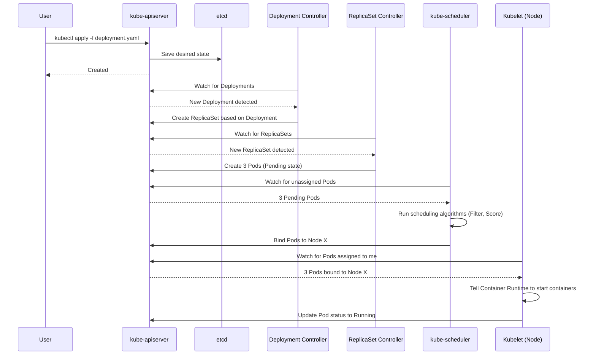

# Chapter 19: Kubernetes Deep Dive

## 1. Why This Matters

In the era of monolithic applications, deploying software meant carefully copying artifacts to a fleet of pets—servers that were manually configured, carefully nurtured, and specifically named. When the industry shifted toward microservices, the number of deployable components exploded. Packaging these services into containers (like Docker) solved the "it works on my machine" problem by bundling the application with its dependencies. 

However, running a few containers on a single laptop is vastly different from running thousands of containers across hundreds of virtual machines in a production cloud environment. When an organization reaches this scale, a new set of existential questions arises:
- **Resilience**: If a server crashes, who restarts the containers that were running on it?
- **Scaling**: If a particular microservice experiences a traffic spike, how do we automatically add more instances of just that service?
- **Networking**: How do thousands of ephemeral containers, constantly shifting IP addresses, discover and communicate with each other securely?
- **Deployment**: How do we rollout a new version of a service without downtime, and how do we roll back if a failure occurs?
- **Resource Management**: How do we pack containers efficiently onto virtual machines to minimize cloud costs while guaranteeing performance?

**Kubernetes (K8s)** emerged from Google's decade-plus experience running production workloads at planetary scale (systems like Borg and Omega). It is the definitive operating system for the cloud, abstracting away the underlying infrastructure (AWS, GCP, Azure, or bare metal) and providing a declarative, API-driven platform for automating deployment, scaling, and operations of application containers. 

Understanding Kubernetes is no longer optional for a distributed systems architect. It is the de facto standard for cloud-native infrastructure. An architect must not only know how to deploy to it but deeply understand its control loops, scheduling behaviors, failure modes, and networking models to design resilient distributed systems.

## 2. Beginner Intuition

Imagine you are the manager of a massive automated warehouse (the **Cluster**). 

The warehouse is full of robotic forklifts and conveyor belts (the **Worker Nodes**). Your job is to process thousands of orders (the **Applications/Containers**) every minute. 

If you try to manually tell each robotic forklift where to go and what box to pick up, you will fail. The system is too complex, and robots break down unpredictably. Instead, you sit in a control tower (the **Control Plane**) with a smart clipboard (the **API Server**).

You don't issue imperative commands like "Robot 4, go to aisle 2 and pick up box A." 
Instead, you write down a **declarative desired state** on your clipboard: "I want 5 copies of Box A being moved at all times."

The control tower employs a team of extremely diligent supervisors (**Controllers**). Their entire job is to constantly look at the clipboard (Desired State) and look at the warehouse floor (Actual State). 
- If the clipboard says "5 copies" but only 3 are moving, the supervisor orders the system to start 2 more.
- If a robot crashes and drops a box, the actual state becomes "4 copies". The supervisor immediately spots the discrepancy and commands another robot to pick up a new copy of Box A.

In this analogy:
- **The Control Tower**: Kubernetes Control Plane.
- **The Clipboard**: etcd (the database storing the desired state) and the API Server.
- **The Supervisors**: Controller Manager.
- **The Dispatcher**: Scheduler (decides *which* robot handles *which* box based on weight and robot capacity).
- **The Boxes**: Pods (which contain one or more containers).

Kubernetes operates on this continuous reconciliation loop: `Observe -> Diff -> Act`. It constantly steers the chaotic reality of the infrastructure toward the idealized declarative state defined by the engineers.

## 3. Core Theory

Kubernetes is built on several fundamental distributed systems principles:

### 3.1 Declarative State Management
Unlike imperative systems (e.g., shell scripts executing a sequence of steps), Kubernetes uses declarative APIs. You declare the desired state in YAML or JSON, submit it to the API server, and the system's controllers work asynchronously to converge the actual state to the desired state. This approach is inherently more robust against transient failures. If a step fails, the controller simply tries again in the next reconciliation loop.

### 3.2 Control Loops (Reconciliation)
A control loop is a non-terminating loop that regulates the state of the system. 
```text
for {
    actualState := GetActualState()
    desiredState := GetDesiredState()
    if actualState != desiredState {
        Reconcile(actualState, desiredState)
    }
    time.Sleep(interval)
}
```
Kubernetes has dozens of these controllers running concurrently. There is a controller for ReplicaSets, a controller for Endpoints, a controller for Nodes, etc. They operate independently, reacting to events emitted by the API Server.

### 3.3 Ephemerality
Kubernetes assumes everything is ephemeral. Pods are mortal; they are created, they die, and they are never resurrected (they are replaced). IP addresses change constantly. Nodes can be terminated at any time (e.g., spot instances). Designing for Kubernetes means embracing this ephemerality. Applications must be stateless where possible, handle SIGTERM gracefully, and rely on stable service abstractions rather than hardcoded IPs.

### 3.4 Level-Triggered vs Edge-Triggered
Kubernetes relies primarily on level-triggered logic rather than edge-triggered logic. 
- **Edge-triggered**: System reacts to *changes* (e.g., "A pod crashed!"). If the event is lost, the system state remains broken.
- **Level-triggered**: System reacts to *state* (e.g., "There should be 3 pods, but there are 2"). Even if an event is missed, the next polling cycle will observe the discrepancy and fix it. Kubernetes API watches are edge-triggered for efficiency, but the underlying reconciliation logic is level-triggered to ensure eventual consistency and fault tolerance.

## 4. Architecture Deep Dive

A Kubernetes cluster consists of two main components: the Control Plane and the Worker Nodes.

### 4.1 The Control Plane (The Brain)
The control plane makes global decisions about the cluster, detecting and responding to cluster events.

1. **kube-apiserver**: The front end of the control plane. It exposes the Kubernetes API. All communication between components, and from external clients (kubectl), goes through the API server. It is stateless and scales horizontally. It handles authentication, authorization, admission control, and validation.
2. **etcd**: A highly-available, distributed key-value store that serves as Kubernetes' backing store for all cluster data. It uses the Raft consensus algorithm to ensure strong consistency. If the API server is the brain, etcd is the memory. It stores the *desired state* and the *actual state*.
3. **kube-scheduler**: Watches for newly created Pods with no assigned Node, and selects a Node for them to run on. Decisions are based on resource requirements, hardware/software constraints, affinity/anti-affinity specifications, data locality, and inter-workload interference.
4. **kube-controller-manager**: Runs controller processes. Logically, each controller is a separate process, but to reduce complexity, they are all compiled into a single binary. Includes Node controller, Job controller, EndpointSlice controller, and ServiceAccount controller.
5. **cloud-controller-manager**: Embeds cloud-specific control logic. It links your cluster into your cloud provider's API (AWS, GCP, Azure), handling tasks like setting up cloud load balancers and routing.

### 4.2 The Worker Nodes (The Brawn)
Nodes are the machines (VMs or physical servers) that run the applications.

1. **kubelet**: An agent that runs on each node. It makes sure containers are running in a Pod. The kubelet takes a set of PodSpecs provided through various mechanisms (primarily the API server) and ensures the containers described in those PodSpecs are running and healthy. It does not manage containers not created by Kubernetes.
2. **kube-proxy**: A network proxy running on each node, implementing part of the Kubernetes Service concept. It maintains network rules on nodes (using iptables or IPVS) to allow network communication to your Pods from network sessions inside or outside of your cluster.
3. **Container Runtime**: The software responsible for running containers. Kubernetes supports runtimes that implement the Container Runtime Interface (CRI), such as containerd and CRI-O. (Docker was deprecated in favor of CRI-compatible runtimes).

### 4.3 Workload Concepts
- **Pods**: The smallest deployable computing unit in K8s. A Pod contains one or more containers that share storage, network IP, and lifecycle. Multi-container pods typically use patterns like sidecars (e.g., an Envoy proxy alongside an app container) or init containers (run to completion before main containers start).
- **ReplicaSets**: Ensures a specified number of pod replicas are running at any given time.
- **Deployments**: Provides declarative updates for Pods and ReplicaSets. Allows for rolling updates, rollbacks, and pausing deployments.
- **StatefulSets**: Like Deployments, but for stateful applications. Provides guarantees about the ordering and uniqueness of Pods (e.g., stable network identifiers like `kafka-0`, `kafka-1`, and stable persistent storage).
- **DaemonSets**: Ensures that all (or some) Nodes run a copy of a Pod. Useful for cluster-level services like logs collection (Fluentd) or node monitoring (Prometheus Node Exporter).

## 5. Visual Diagrams

### 5.1 Cluster Architecture


### 5.2 The Reconciliation Loop (Deployment)


### 5.3 K8s Networking: Service Routing
```mermaid
graph TD
    Client((Client)) -->|Traffic| Ingress[Ingress Controller (e.g., Nginx)]
    Ingress -->|Path routing| SVC[Service (ClusterIP)]
    SVC -->|iptables/IPVS load balancing| P1[Pod A: 10.244.1.2]
    SVC -->|iptables/IPVS load balancing| P2[Pod B: 10.244.2.5]
    SVC -->|iptables/IPVS load balancing| P3[Pod C: 10.244.3.8]
```

## 6. Real Production Examples

### 6.1 Google Kubernetes Engine (GKE) Autopilot
Google offers GKE Autopilot, a radically simplified Kubernetes operating mode. In Autopilot, Google manages not only the control plane but also the worker nodes. Engineers do not provision VMs; they simply deploy Pods, and GKE provisions the exact compute capacity required on demand. It dynamically schedules pods and bills per pod resource request, effectively turning Kubernetes into a massive, serverless container platform.

### 6.2 Airbnb's Migration to Kubernetes
Airbnb migrated from a monolithic architecture managed by Chef to a microservices architecture running on Kubernetes. They built tools like `kube-gen` to abstract away Kubernetes YAML complexity for their developers. They leverage namespaces heavily for isolation and use Custom Resource Definitions (CRDs) to define Airbnb-specific abstractions (like a `Service` CRD that automatically wires up deployments, HPA, and network policies). 

### 6.3 Spotify's Fleet Management
Spotify runs one of the largest Kubernetes fleets in the world. Instead of one massive cluster, they run hundreds of smaller clusters across multiple regions. To manage this at scale, they heavily utilize GitOps (using tools like ArgoCD or Flux). All cluster configurations are stored in Git. If a cluster goes down or is misconfigured, they simply spin up a new cluster and point the GitOps controller at the repository, recreating the entire state automatically.

## 7. Java Implementations & Configurations

While Kubernetes configuration is primarily YAML, modern Java applications interact deeply with Kubernetes constructs. Below is a production-grade configuration demonstrating how a Spring Boot Java application integrates with Kubernetes.

### 7.1 Spring Boot Application Graceful Shutdown
In Kubernetes, when a Pod is terminated (e.g., during a rolling update), K8s sends a SIGTERM signal to the container. If the application terminates immediately, in-flight requests will be dropped. We must configure Java to handle this gracefully.

```yaml
# application.yml
server:
  shutdown: graceful

spring:
  lifecycle:
    timeout-per-shutdown-phase: 30s
```

### 7.2 Liveness and Readiness Probes
Kubernetes needs to know if your application is alive (Liveness) and if it is ready to accept traffic (Readiness). Spring Boot Actuator provides these out of the box.

```java
// Spring Boot automatically exposes /actuator/health/liveness and /actuator/health/readiness
@RestController
public class BusinessLogicController {
    @GetMapping("/api/v1/process")
    public String process() {
        return "Processed successfully";
    }
}
```

### 7.3 Production Deployment YAML
```yaml
apiVersion: apps/v1
kind: Deployment
metadata:
  name: payment-service
  labels:
    app: payment
spec:
  replicas: 3
  selector:
    matchLabels:
      app: payment
  strategy:
    type: RollingUpdate
    rollingUpdate:
      maxUnavailable: 1 # Ensure at least 2 pods are always up during rollout
      maxSurge: 1       # Allow spinning up 1 extra pod during rollout
  template:
    metadata:
      labels:
        app: payment
    spec:
      containers:
      - name: payment-app
        image: myrepo/payment-service:v1.2.0
        ports:
        - containerPort: 8080
        # Resource Requests and Limits are CRITICAL for scheduling and stability
        resources:
          requests:
            memory: "512Mi"
            cpu: "500m"
          limits:
            memory: "1Gi"
            cpu: "1000m"
        # Readiness: Is the app ready to receive HTTP traffic?
        readinessProbe:
          httpGet:
            path: /actuator/health/readiness
            port: 8080
          initialDelaySeconds: 15
          periodSeconds: 5
        # Liveness: Is the app in a deadlocked/broken state requiring a restart?
        livenessProbe:
          httpGet:
            path: /actuator/health/liveness
            port: 8080
          initialDelaySeconds: 30
          periodSeconds: 10
        # Environment variables sourced from Secrets/ConfigMaps
        env:
        - name: DB_PASSWORD
          valueFrom:
            secretKeyRef:
              name: db-credentials
              key: password
```

## 8. Performance Analysis

### 8.1 API Server Bottlenecks
The kube-apiserver can become a bottleneck in very large clusters (thousands of nodes). Every kubelet, controller, and user is constantly polling or watching the API server.
- **Optimization**: Use edge-triggered API watches rather than aggressive polling. etcd limits its message sizes to ~1.5MB; storing massive objects (like huge ConfigMaps) can degrade performance.

### 8.2 Pod Churn and Kubelet Latency
If thousands of Pods are created simultaneously (e.g., a massive CronJob), the scheduler must assign them, and the kubelets must download the container images.
- **Optimization**: Use Node-local image caching. Implement aggressive Pod Anti-Affinity carefully, as complex affinity rules exponentially increase the time it takes the scheduler to find a suitable node.

### 8.3 Network Latency (kube-proxy)
By default, kube-proxy uses `iptables`. In clusters with tens of thousands of Services, `iptables` rules grow linearly, and evaluating them becomes an O(N) operation, causing significant network latency for new connections.
- **Optimization**: Switch kube-proxy to `IPVS` mode, which uses hash tables (O(1) lookups) and performs drastically better at scale. Alternatively, use an eBPF-based CNI like Cilium to entirely bypass kube-proxy.

## 9. Tradeoffs

### 9.1 Complexity vs. Power
**Tradeoff**: Kubernetes is notoriously complex. The learning curve is cliff-like.
- **Pros**: It provides a unified, declarative API to manage practically any type of distributed system workload. The rich ecosystem means there is an operator or Helm chart for almost everything.
- **Cons**: For a small startup with a simple monolithic app, adopting Kubernetes is often premature optimization that introduces immense operational overhead.

### 9.2 Abstraction vs. Leakage
**Tradeoff**: K8s attempts to abstract away the underlying infrastructure.
- **Pros**: You can write a YAML manifest and theoretically deploy it to AWS EKS, GCP GKE, or on-premise without modification.
- **Cons**: Abstractions leak. Storage (CSI) and networking (CNI) implementations differ wildly between cloud providers. A LoadBalancer service in AWS provisions a Classic/Network Load Balancer, while on bare metal it might do nothing unless you install MetalLB.

### 9.3 Stateful vs. Stateless
**Tradeoff**: K8s was originally built for stateless microservices. Running stateful databases on K8s (via StatefulSets and Operators) is now possible but debated.
- **Pros**: Unified control plane for both apps and databases.
- **Cons**: Databases like Postgres or Cassandra have their own complex clustering logic. Mapping K8s primitives (which assume ephemerality) to database nodes (which demand durability and stability) requires highly complex Operators. Many architects prefer managed databases (RDS, Cloud SQL) over running databases inside K8s.

## 10. Failure Scenarios

### 10.1 Split Brain / etcd Quorum Loss
If you have a 3-node etcd cluster and a network partition isolates 2 nodes from 1, the isolated node loses quorum. The API server connected to it becomes read-only. If 2 nodes die, the entire cluster loses quorum.
- **Resolution**: etcd requires a strict majority `(N/2)+1` to function. Always deploy etcd across multiple availability zones. Backup etcd snapshots regularly. In worst-case scenarios, rebuild the cluster from a snapshot.

### 10.2 Out of Memory (OOM) Kills
A container exceeds its defined `limits: memory`.
- **Impact**: The Linux kernel invokes the OOMKiller, immediately terminating the container process (often without warning or graceful shutdown).
- **Resolution**: Proper profiling. Never set memory limits too close to the JVM max heap size; remember the JVM needs off-heap memory for metaspace, threads, and direct buffers. Set `Xmx` to ~75% of the container memory limit.

### 10.3 The "CrashLoopBackOff" Storm
A Pod starts, crashes immediately, and restarts. Kubernetes employs an exponential backoff delay (10s, 20s, 40s... up to 5 mins).
- **Root Cause**: Usually application misconfiguration (missing secrets, failing DB connection, syntax error in config file).
- **Resolution**: `kubectl logs <pod>` and `kubectl describe pod <pod>`. Do not blindly scale up failing pods; fix the root cause.

### 10.4 Node Taint and Affinity Deadlocks
A deployment requires a specific node label (Node Affinity), but no nodes currently exist with that label, OR the nodes with that label are heavily tainted and the pod lacks the necessary Tolerations.
- **Impact**: Pods remain in a `Pending` state indefinitely.
- **Resolution**: Review `kubectl describe pod` to see the scheduler's rejection reasons. Ensure Cluster Autoscaler is configured to spin up node groups that match the required labels.

## 11. Debugging & Observability

### 11.1 The Golden Commands
When an incident occurs, an architect relies on these core commands:
- `kubectl get events --sort-by='.metadata.creationTimestamp'`: Shows a timeline of cluster events. Invaluable for seeing scheduler failures, OOM kills, and volume mount issues.
- `kubectl describe pod <name>`: Shows pod conditions, current state, and the events specific to that pod.
- `kubectl logs -f <pod> -c <container>`: Tails the application logs.
- `kubectl exec -it <pod> -- /bin/sh`: Spawns an interactive shell inside the container for direct network/filesystem debugging.

### 11.2 Logging Architecture
Pods are ephemeral, so local container logs vanish when the pod dies.
- **Best Practice**: Implement cluster-level logging. Use a DaemonSet of log forwarders (e.g., Fluent Bit, Promtail) that mount the Node's `/var/log/containers` directory, parse the JSON logs, and forward them to a central sink like Elasticsearch, Datadog, or Grafana Loki.

### 11.3 Metric Collection
- **Prometheus** is the standard. It uses a pull model. 
- Use the **Prometheus Operator**, which introduces CRDs like `ServiceMonitor`. You simply declare a `ServiceMonitor` in YAML, pointing it to your app's `/metrics` endpoint, and Prometheus automatically discovers and scrapes it.

## 12. Interview Questions

### 12.1 Beginner
**Q: What is a Pod, and why do we use Pods instead of directly managing containers?**
*Answer:* A Pod is the smallest deployable unit in K8s, representing a single instance of a running process. It can hold one or more containers that share network namespace (IP address and ports) and storage volumes. We use Pods instead of single containers to allow tightly coupled processes (like an app and a log-forwarding sidecar) to communicate easily via localhost and share a lifecycle.

### 12.2 Intermediate
**Q: Explain how a Service of type ClusterIP routes traffic to Pods.**
*Answer:* When a Service is created, K8s assigns it a virtual IP (ClusterIP). The Endpoint controller watches the Service's selector and finds matching Pods, adding their IPs to an Endpoints object. On every worker node, `kube-proxy` watches for Services and Endpoints, and updates the local node's `iptables` or `IPVS` rules. When a packet destined for the ClusterIP leaves a local pod, the kernel intercepts it using those iptables rules, randomly selects a backend Pod IP from the list, applies Destination NAT (DNAT), and routes the packet to the actual Pod.

### 12.3 Advanced (FAANG Level)
**Q: You have a Deployment with 10 replicas. You update the container image. Describe exactly what the Kubernetes control plane does, step-by-step, to execute this rolling update.**
*Answer:* 
1. The API Server receives the update and persists the new Deployment spec to etcd.
2. The Deployment Controller detects the spec change.
3. It creates a *new* ReplicaSet for the new image version, initially with 0 replicas.
4. Based on the `maxSurge` and `maxUnavailable` settings, it calculates how many new pods it can create and how many old pods it must kill.
5. It scales UP the new ReplicaSet (creating new Pods) and scales DOWN the old ReplicaSet.
6. For new Pods, the Scheduler assigns them to nodes. Kubelets start the containers.
7. Crucially, the endpoints are not updated until the new Pods pass their `readinessProbe`.
8. Once a new Pod is ready, its IP is added to the Service Endpoints.
9. An old Pod is sent SIGTERM, removed from Service Endpoints, and given a grace period to shut down before SIGKILL.
10. This scale-up/scale-down loop repeats until the old ReplicaSet has 0 pods and the new ReplicaSet has 10 pods.

## 13. Exercises

1. **Conceptual**: Map out the blast radius if the `kube-scheduler` binary crashes and cannot be restarted for 1 hour. What works? What breaks? (Hint: Existing pods continue fine. New deployments pend indefinitely. Scaling up fails).
2. **Coding**: Write a YAML manifest for a StatefulSet deploying a 3-node Redis cluster. Ensure each pod gets a persistent volume claim (PVC) of 10GB and they are scheduled on different worker nodes using `podAntiAffinity`.
3. **System Design**: Design a CI/CD pipeline that builds a Java application, creates a Docker image, updates a Kubernetes Kustomize overlay, and pushes to a GitOps repository. Detail how ArgoCD syncs the state.

## 14. Expert Insights

- **The Request/Limit Trap**: A common mistake is setting CPU limits. CPU is a compressible resource. If a container hits its CPU limit, it gets heavily throttled (CFS quota throttling), causing massive latency spikes in Java applications. Many experts recommend setting CPU *requests* accurately for scheduling, but leaving CPU *limits* completely blank (or very high) so pods can burst using idle node capacity without artificial throttling.
- **Init Containers for Migration**: Database migrations in Kubernetes are tricky. Running them in application startup code causes race conditions if 5 replicas start at once. Running them as a Job is better. Running them as an Init Container in the Deployment ensures the migration runs before the app starts, but again, beware of concurrency if multiple pods spin up. Tools like Liquibase with database-level locking are mandatory.
- **Taints are for Nodes, Affinity is for Pods**: To dedicate a set of expensive GPU nodes exclusively to Machine Learning pods, you must use BOTH. Taint the GPU nodes (`dedicated=ml:NoSchedule`) so normal web pods are repelled. Give the ML pods Tolerations for that taint. Finally, give the ML pods Node Affinity (`dedicated=ml`) so they are actively attracted to the GPU nodes.

## 15. Chapter Summary

- **Kubernetes is the Cloud OS**: It provides a declarative, API-driven platform for container orchestration.
- **Control Plane & Nodes**: The control plane (API Server, etcd, Scheduler, Controllers) manages state. Worker nodes (Kubelet, Proxy, Container Runtime) execute workloads.
- **Declarative Reconciliation**: The system continuously observes actual state and acts to match it to the desired state.
- **Pods are the Atom**: The smallest deployable unit. Ephemeral by nature.
- **Deployments & StatefulSets**: Higher-level abstractions that manage Pod replicas, rollouts, and state guarantees.
- **Networking via Services**: Abstract, stable IPs that load-balance across dynamic Pod IPs via kube-proxy.
- **Embrace Failure**: Design applications to handle SIGTERM gracefully, utilize readiness/liveness probes accurately, and expect underlying node rotation at any moment.
