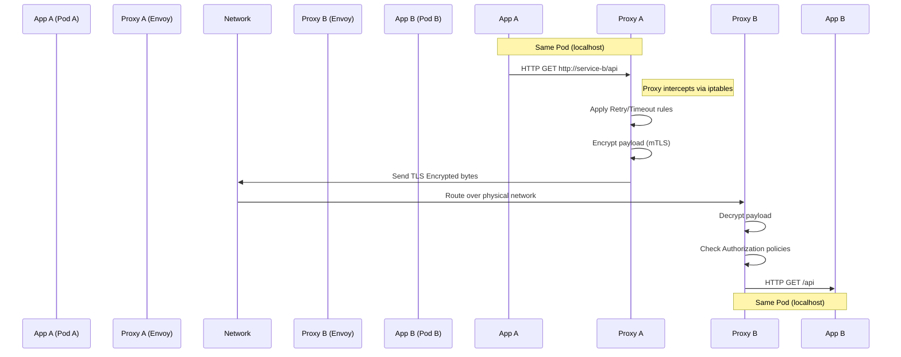

# Chapter 20: Service Mesh

## 1. Why This Matters

As organizations transition from monoliths to microservices, the network inevitably becomes the center of the architecture. In a monolith, component communication happens via in-memory function calls—they are fast, reliable, and secure. In a microservices architecture, component communication happens over an unreliable, insecure, and latent physical network. 

Suddenly, developers must handle a myriad of cross-cutting network concerns:
- **Resilience**: How do we handle transient network failures? (Retries, timeouts, circuit breakers)
- **Security**: How do we encrypt traffic between services and ensure Service A is authorized to talk to Service B? (mTLS, identity, access control)
- **Routing**: How do we shift 5% of traffic to a new version of a service for a canary release? (Traffic splitting, A/B testing)
- **Observability**: How do we trace a request as it hops through 15 different microservices? (Distributed tracing, metrics, access logs)

Initially, organizations bundled these capabilities into "fat client libraries" (like Netflix OSS Ribbon, Hystrix, and Eureka for Java). However, this approach had fatal flaws:
1. **Polyglot environments**: If you use Java, Node.js, Go, and Python, you must maintain and update network libraries for every language.
2. **Coupling**: Application code becomes tightly coupled to infrastructure networking logic.
3. **Upgrade fatigue**: Pushing a security patch to a core networking library requires rebuilding and redeploying every single microservice.

The **Service Mesh** pattern emerged to solve these problems by completely decoupling network communication mechanics from application code. It pushes these concerns down into the infrastructure layer, allowing developers to focus purely on business logic. For a distributed systems architect, mastering the service mesh is crucial for operating microservices securely and observably at scale.

## 2. Beginner Intuition

Imagine a bustling corporate office building where hundreds of employees (the **Microservices**) sit in different rooms, trying to collaborate on a massive project.

Initially, employees just yelled down the hallway to each other. Sometimes people didn't hear (network drops), sometimes malicious actors eavesdropped (security issues), and nobody knew who was talking to whom (lack of observability). 

To fix this, management gave every employee a rigid set of rules on how to format messages, how many times to repeat themselves, and a special codebook for encryption (Fat Client Libraries). But whenever the rules changed, everyone had to relearn the system.

The **Service Mesh** solution is different. Management hires an army of highly trained personal assistants (**Sidecar Proxies**).
Now, an employee never yells down the hallway. If Alice wants to talk to Bob, she simply whispers her message to her personal assistant standing right next to her.
Alice's assistant encrypts the message, walks down the hall, handles any locked doors or detours (routing), and delivers the message directly to Bob's personal assistant, who decrypts it and whispers it to Bob.

If a message is dropped, the assistant automatically retries. If Bob's assistant is overwhelmed, Alice's assistant knows to back off (circuit breaking). Furthermore, a central supervisor (the **Control Plane**) issues daily instructions to all assistants about new security rules, routing policies, and where to send their daily reports (telemetry). 

The employees (Microservices) are completely oblivious to the complexity of the hallway (Network); they just talk to their assistants.

## 3. Core Theory

A service mesh is a dedicated infrastructure layer for making service-to-service communication safe, fast, and reliable. It is implemented as a network of lightweight, high-performance proxies deployed alongside application code.

### 3.1 The Sidecar Proxy Pattern
The defining characteristic of a traditional service mesh is the sidecar pattern. A proxy container is injected into the same deployment unit (e.g., a Kubernetes Pod) as the application container. 
- They share the same network namespace (localhost).
- The application sends outbound traffic to `localhost:port`.
- Traffic is transparently intercepted by the sidecar proxy (often using `iptables` rules).
- The proxy handles all the complex network logic and forwards it to the destination's sidecar proxy.

### 3.2 Data Plane vs. Control Plane
Service meshes are cleanly divided into two distinct components:

**The Data Plane**:
- Composed of all the sidecar proxies (like Envoy, Linkerd2-proxy).
- Sits directly in the critical request path.
- Responsible for moving bytes. It performs routing, encryption, load balancing, circuit breaking, and telemetry generation.
- Must be incredibly fast, low-latency, and consume minimal memory.

**The Control Plane**:
- Sits out of band (not in the critical request path).
- The "brain" of the mesh (like Istiod).
- Responsible for configuration. It converts high-level routing and security policies into low-level proxy configurations and pushes them dynamically to the data plane.
- Manages identity, issues TLS certificates, and collects aggregated telemetry.

### 3.3 Out-of-Process vs. In-Process
Unlike libraries (in-process), a service mesh proxy is an out-of-process architecture. This provides process isolation (a proxy crash doesn't crash the app) and language agnosticism, but it introduces a slight latency penalty because of the extra hop over loopback and context switching.

## 4. Architecture Deep Dive

Let's deeply examine the leading components that power modern service meshes.

### 4.1 Envoy Proxy
Originally developed at Lyft, Envoy is the undisputed king of the data plane. Written in modern C++, it is a high-performance edge and service proxy.
- **Listeners**: Ports where Envoy listens for incoming connections.
- **Filters**: The heart of Envoy. Traffic passes through a chain of filters (TCP filters, HTTP filters). Filters can mutate headers, apply rate limits, or authorize requests.
- **Clusters**: Groups of logically similar upstream hosts (e.g., all instances of the Payment Service).
- **Routes**: Rules that match incoming requests (e.g., HTTP path `/api/v1/`) and direct them to specific Clusters.
- **xDS API**: Envoy's superpower. Instead of reading static configuration files, Envoy connects via gRPC to a control plane and dynamically streams configuration updates (Listener Discovery Service, Cluster Discovery Service, etc.) without requiring a restart.

### 4.2 Istio Architecture
Istio is the most prominent service mesh. It uses Envoy as its data plane.
- **Istiod**: The consolidated control plane binary. It acts as a Certificate Authority (CA) generating certificates for mTLS, converts Kubernetes Custom Resources (like `VirtualService`) into Envoy xDS configurations, and injects the Envoy sidecars into application pods using a Kubernetes Mutating Admission Webhook.

### 4.3 Linkerd Architecture
Linkerd takes a radically different philosophy: relentless simplicity and minimal resource overhead.
- Instead of Envoy, Linkerd uses its own custom-built data plane proxy (`linkerd2-proxy`) written in Rust.
- It intentionally omits extremely complex features in favor of being "zero-config", highly secure by default, and using a fraction of the memory and CPU footprint compared to Istio.

### 4.4 eBPF and the "Sidecarless" Mesh (Cilium)
The traditional sidecar pattern requires 2 extra network hops (App -> Proxy -> Network -> Proxy -> App) and running hundreds of proxy containers. 
Modern evolutions, spearheaded by **Cilium Service Mesh**, use **eBPF (Extended Berkeley Packet Filter)**. eBPF allows running sandboxed programs safely inside the Linux kernel. 
Instead of injecting a proxy into every pod, eBPF intercepts network calls directly at the kernel socket layer. This allows for transparent mTLS, routing, and visibility with drastically lower overhead, essentially moving the service mesh down into the operating system itself. Istio is also adapting to this with its new "Ambient Mesh" architecture.

## 5. Visual Diagrams

### 5.1 The Sidecar Request Flow


### 5.2 Istio Architecture (Control & Data Plane)


### 5.3 Traffic Splitting (Canary Release)
```mermaid
graph TD
    Client((Client Traffic)) -->|100%| Ingress[Istio Ingress Gateway]
    Ingress -->|VirtualService config| Router{Traffic Router}
    Router -->|90%| V1[Payment Service v1]
    Router -->|10%| V2[Payment Service v2 (Canary)]
```

## 6. Real Production Examples

### 6.1 Uber's Microservice Networking
Uber pioneered many microservice concepts. Operating thousands of microservices, they initially built massive RPC libraries. As they shifted toward a mesh approach, they heavily contributed to Envoy. Uber's service mesh relies on Envoy to handle billions of edge and internal requests, utilizing deep gRPC integration, strict timeout propagation, and custom rate-limiting filters at the Envoy layer to prevent cascading failures during peak rideshare hours.

### 6.2 Lyft and the Origin of Envoy
Lyft created Envoy specifically to solve the "polyglot networking" problem. They had services in PHP, Python, and Go, and debugging network issues across these languages was a nightmare. By deploying Envoy as a sidecar, they achieved consistent observability. If a request failed, they didn't have to guess if it was a bug in the Python `requests` library or the Go `http` client; they simply looked at the unified Envoy metrics and distributed traces.

### 6.3 Monzo Bank's Linkerd Adoption
Monzo, a UK digital bank, runs hundreds of Go microservices on Kubernetes. They required strict security (mTLS everywhere) for financial compliance. They found Istio too operationally complex and resource-heavy for their massive fleet of tiny services. They adopted Linkerd, heavily praising its zero-config mTLS and minimal Rust-proxy overhead, achieving compliance and deep observability without needing a dedicated team just to manage the mesh.

## 7. Implementations & Configurations

Service Mesh configuration is declarative, usually via Kubernetes Custom Resource Definitions (CRDs). Here we explore critical Istio configurations.

### 7.1 Advanced Traffic Splitting (Canary Deployment)
Deploying a new version of a service instantly to 100% of users is dangerous. Istio allows precise weighted traffic splitting.

```yaml
# DestinationRule defines the subsets (versions) available
apiVersion: networking.istio.io/v1beta1
kind: DestinationRule
metadata:
  name: payment-destination
spec:
  host: payment-service
  subsets:
  - name: v1
    labels:
      version: v1
  - name: v2
    labels:
      version: v2

---
# VirtualService dictates how traffic is routed to those subsets
apiVersion: networking.istio.io/v1beta1
kind: VirtualService
metadata:
  name: payment-route
spec:
  hosts:
  - payment-service
  http:
  - route:
    - destination:
        host: payment-service
        subset: v1
      weight: 95
    - destination:
        host: payment-service
        subset: v2
      weight: 5
```

### 7.2 Circuit Breaking (Outlier Detection)
If an instance of `inventory-service` starts failing (returning 500s), Istio can automatically eject it from the load balancing pool, protecting the client from hanging.

```yaml
apiVersion: networking.istio.io/v1beta1
kind: DestinationRule
metadata:
  name: inventory-circuit-breaker
spec:
  host: inventory-service
  trafficPolicy:
    outlierDetection:
      consecutive5xxErrors: 3    # Eject after 3 consecutive 5xx errors
      interval: 10s              # Evaluate every 10 seconds
      baseEjectionTime: 3m       # Keep it ejected for 3 minutes
      maxEjectionPercent: 50     # Don't eject more than 50% of the fleet to prevent total collapse
```

### 7.3 Fault Injection & Chaos Testing
To test system resilience, you can instruct the proxy to inject artificial delays or errors into network calls without touching application code.

```yaml
apiVersion: networking.istio.io/v1beta1
kind: VirtualService
metadata:
  name: ratings-fault
spec:
  hosts:
  - ratings-service
  http:
  - fault:
      delay:
        percentage:
          value: 10.0      # Apply to 10% of requests
        fixedDelay: 5s     # Inject a 5 second delay
    route:
    - destination:
        host: ratings-service
```

### 7.4 Zero-Trust Security (AuthorizationPolicy)
Ensure that ONLY the `checkout-service` can call the `payment-service`.

```yaml
apiVersion: security.istio.io/v1beta1
kind: AuthorizationPolicy
metadata:
  name: require-checkout-for-payment
  namespace: finance
spec:
  selector:
    matchLabels:
      app: payment-service
  action: ALLOW
  rules:
  - from:
    - source:
        principals: ["cluster.local/ns/default/sa/checkout-service-account"]
```

## 8. Performance Analysis

### 8.1 The Latency Penalty
Injecting a sidecar proxy introduces latency. For an HTTP request:
- Exiting the app container -> Kernel -> Envoy: ~0.5ms
- Envoy parsing HTTP, applying filters, TLS encryption: ~0.5ms - 1ms
- Receiving side Envoy decryption, routing: ~0.5ms - 1ms
**Total added latency**: Typically 2ms to 4ms per network hop. For shallow call graphs, this is invisible. For deep microservice call chains (e.g., A -> B -> C -> D -> E), 3ms per hop becomes a 12ms overall latency tax.

### 8.2 Resource Consumption
An Envoy proxy typically consumes 50MB to 150MB of RAM. If you have a cluster of 2,000 Pods, injecting a sidecar into every pod consumes roughly 200GB of RAM across the cluster, purely for infrastructure overhead. This is why Linkerd's Rust proxy (which consumes ~10MB) is highly attractive for cost optimization.

### 8.3 Control Plane Scaling
Istiod must push xDS updates to every Envoy proxy. If a single endpoint changes (a pod spins up), Istiod must compute the new configuration and push it to potentially thousands of sidecars. This can cause severe control plane CPU spikes.
- **Optimization**: Use Istio `Sidecar` resources to scope visibility. By default, every Envoy knows about every service in the cluster. Scoping it down so `Payment` Envoy only receives updates about `Database` and `Fraud` (and ignores `Frontend`) drastically reduces control plane load and data plane memory usage.

## 9. Tradeoffs

### 9.1 Developer Velocity vs. Operational Complexity
- **Pros**: Developers stop writing retry logic, mTLS boilerplate, and distributed tracing headers propagation code. They ship business logic faster.
- **Cons**: You have shifted the complexity to the platform team. Operating Istio requires deep expertise. When a network request fails, debugging whether the fault lies in the app, the sidecar `iptables` intercept, the Envoy filter chain, or an Istio VirtualService bug is notoriously difficult.

### 9.2 Mesh vs. API Gateway
**Tradeoff**: API Gateways handle North-South traffic (User to Cluster). Service Meshes handle East-West traffic (Service to Service). 
- **Reality**: The lines are blurring. Istio provides an Ingress Gateway. Kong and API7 provide both Gateway and Mesh. Do not try to replace a robust external API gateway (handling OIDC login, external rate limiting, monetization) entirely with a basic mesh gateway unless your edge requirements are simple.

### 9.3 mTLS Overhead
- **Pros**: Zero-trust networking out of the box. Cryptographically guaranteed identity.
- **Cons**: Establishing TLS handshakes is CPU intensive. While modern AES-NI hardware acceleration makes it cheap, it is not free. Additionally, network sniffing tools (tcpdump, Wireshark) become useless for debugging plain-text payloads unless you have the private keys.

## 10. Failure Scenarios

### 10.1 The Retry Storm
- **Scenario**: Service B is struggling and responding slowly. Service A's Envoy proxy hits a timeout. The mesh is configured to retry up to 3 times. 
- **Impact**: Instead of receiving 1,000 req/sec, the struggling Service B suddenly receives 4,000 req/sec (initial + 3 retries), causing a total cascading collapse.
- **Resolution**: Always use exponential backoff, jitter, and **Circuit Breakers**. If a service is failing, Envoy should trip the circuit and immediately return 503s rather than bombarding it with retries.

### 10.2 Control Plane Outage
- **Scenario**: Istiod crashes or loses connectivity to the cluster.
- **Impact**: The Data Plane (Envoy proxies) continues to route traffic perfectly based on its last known configuration. However, new pods will not receive configuration, meaning they cannot communicate with the mesh, and mTLS certificates cannot be rotated.
- **Resolution**: Run the control plane in high availability (multiple replicas) and monitor certificate expiration metrics closely.

### 10.3 The Race Condition at Pod Startup
- **Scenario**: A Pod starts. The application container starts slightly faster than the Envoy sidecar container. The app immediately tries to connect to a database.
- **Impact**: The network connection fails because Envoy is not yet ready to route outbound traffic, crashing the application.
- **Resolution**: In Kubernetes, use `initContainers` or set the `holdApplicationUntilProxyStarts` flag (available in modern Istio) to pause app startup until Envoy is fully initialized and synced with the control plane.

## 11. Debugging & Observability

### 11.1 The Golden Triangle of Observability
A service mesh provides the three pillars of observability out of the box without application code changes:
1. **Metrics**: Golden signals (Latency, Traffic, Errors, Saturation) are automatically exported to Prometheus.
2. **Access Logs**: Every HTTP request, method, path, response code, and latency is logged centrally.
3. **Distributed Tracing**: The mesh proxy automatically generates Jaeger/Zipkin spans for every hop.
*Note:* Applications MUST forward tracing headers (like `x-b3-traceid`) from incoming requests to outgoing requests to tie the distributed trace together. The mesh cannot do this magically.

### 11.2 Debugging Envoy Configuration
If a route isn't working, inspecting Envoy's actual internal state is mandatory.
- `istioctl proxy-status`: Shows if all proxies are synced with the control plane.
- `istioctl proxy-config routes <pod-name>`: Dumps the active Envoy routing tables.
- **Envoy Admin Port**: Port `15000` on the sidecar provides a web interface to view listeners, memory usage, and dynamically change log levels to `debug` without restarting the pod.

## 12. Interview Questions

### 12.1 Beginner
**Q: What is a sidecar proxy, and why is it preferred over a centralized network load balancer?**
*Answer:* A sidecar is a proxy container deployed alongside every application container, sharing the same network namespace. It intercepts all inbound and outbound traffic. It is preferred over centralized load balancers because it eliminates single points of failure, avoids creating a massive network bottleneck, and pushes policy enforcement directly to the edge of the compute unit, enabling zero-trust security.

### 12.2 Intermediate
**Q: Explain how mTLS works in a service mesh environment.**
*Answer:* The control plane acts as a Certificate Authority (CA) and provisions a unique X.509 certificate to every sidecar proxy based on the Pod's Kubernetes Service Account (its identity). When App A calls App B, App A's proxy initiates a TLS handshake with App B's proxy. Both proxies present their certificates and validate them against the root CA. Once established, traffic is encrypted. Crucially, App B's proxy extracts the identity from App A's certificate to perform Authorization checks.

### 12.3 Advanced (FAANG Level)
**Q: You are rolling out Istio to a cluster with 5000 microservices. After injecting sidecars, you notice extreme memory consumption on the worker nodes and massive CPU spikes on the Istio control plane. How do you architect a solution?**
*Answer:* The issue is uncontrolled xDS state distribution. By default, Istio sends the configuration of all 5000 services to every single Envoy proxy. This causes massive memory bloat in Envoy and forces the control plane to recompute the global graph for every single pod change. 
The solution is to implement `Sidecar` API resources to limit the scope of configuration. I would define a strict dependency graph (e.g., via namespace boundaries or explicit annotations) so an Envoy proxy in the `Frontend` namespace only receives xDS configurations for the `Backend` services it actually talks to. This reduces the proxy memory footprint drastically and isolates control plane computations.

## 13. Exercises

1. **Conceptual**: Draw the request flow for an architecture using eBPF (like Cilium Ambient Mesh) instead of a sidecar. Where does the encryption happen? How are network hops reduced?
2. **Configuration**: Write an Istio `VirtualService` that routes all requests with an HTTP header `x-user-type: beta` to a subset named `v2`, and all other traffic to `v1`.
3. **System Design**: You are architecting a multi-region deployment spanning AWS and GCP. Design a service mesh topology to securely route traffic between a service in AWS to a database in GCP over the public internet using mTLS.

## 14. Expert Insights

- **The "Boring" Mesh is Often Best**: Engineers love to play with advanced traffic splitting and chaos injection. In reality, the vast majority of companies only need the mesh for two things: mTLS (security compliance) and Metrics (observability). Start small. Do not adopt Istio just to do simple round-robin load balancing.
- **Headless Services are Enemies of the Mesh**: A service mesh relies on routing via Virtual IPs (ClusterIP). If you use Kubernetes Headless Services (which return a list of Pod IPs directly via DNS), you bypass the mesh's load balancing logic. Stateful systems like Kafka or Cassandra that rely on headless services require special, careful configuration to work smoothly within a mesh.
- **The Observability Tax**: Emitting traces for *every single request* in a high-throughput system will generate terabytes of trace data, costing more than the application itself. Always use probabilistic sampling (e.g., sample 1% of traces) or tail-based sampling (keep 100% of traces for errors, but only 1% for successful requests).

## 15. Chapter Summary

- **Service Mesh**: A dedicated infrastructure layer for managing service-to-service network communication.
- **Data Plane (Envoy)**: The sidecar proxies that sit in the request path, moving bytes, encrypting, and applying policies.
- **Control Plane (Istiod)**: The centralized manager that provisions certificates and dynamically configures the data plane.
- **Traffic Management**: Enables advanced release strategies (Canaries, Dark Launches) and resilience (Retries, Circuit Breaking).
- **Security**: Provides zero-trust networking out-of-the-box via automatic mTLS and identity-based authorization.
- **Observability**: Unifies metrics, logs, and traces across the entire polyglot microservice fleet.
- **Evolution**: The industry is actively exploring eBPF and sidecarless architectures to mitigate the latency and resource penalties of the sidecar pattern.
