# Chapter 21: Scalability Patterns

---

## 1. Why This Matters

Scalability is the single most consequential architectural concern for any system that expects growth. A brilliant product with a broken scaling story is a dead product. When Twitter experienced the "Fail Whale" era (2007–2009), it wasn't because the engineers were incompetent—it was because the original Ruby on Rails monolith couldn't handle the exponential growth in tweets and timeline reads. When Instagram was acquired by Facebook in 2012, it served 30 million users with a team of just 13 engineers—because they had mastered scalability patterns. When WhatsApp served 900 million users with only 50 engineers, it was because they chose Erlang and the right scaling architecture.

**Why should you care about scalability patterns?**

1. **Business survival**: Systems that can't scale lose users to competitors. Amazon found that every 100ms of additional latency cost them 1% in sales.
2. **Cost efficiency**: Scaling poorly means throwing hardware at problems. Scaling smartly means serving 10x users with 2x cost.
3. **Interview relevance**: Every FAANG system design interview is fundamentally a scalability discussion. "Design Twitter," "Design WhatsApp," "Design Netflix"—these are all scalability problems.
4. **Career growth**: Engineers who understand scalability patterns become architects. Those who don't remain implementers.
5. **Production reality**: Every production system eventually hits a scaling wall. The question is not *if* but *when*—and whether you're prepared.

Scalability is not just about handling more requests. It encompasses:

- **Read scalability**: Can you serve 1 billion reads per day?
- **Write scalability**: Can you ingest 1 million writes per second?
- **Storage scalability**: Can you store petabytes of data efficiently?
- **Compute scalability**: Can you process data 100x faster when needed?
- **Team scalability**: Can 500 engineers work on the same system without stepping on each other?

This chapter covers the patterns, algorithms, architectures, and real-world lessons that separate systems that scale from systems that collapse.

---

## 2. Beginner Intuition

### The Restaurant Analogy

Imagine you own a small restaurant with one chef, one waiter, and 10 tables. Business is good, and more customers want to eat here.

**Vertical Scaling (Scale Up):** You replace your chef with a world-class chef who can cook 3x faster. You replace your small stove with an industrial one. You're making your existing resources *better*. But there's a limit—even the world's best chef can only cook so fast.

**Horizontal Scaling (Scale Out):** You open 5 more restaurants across the city, each with its own chef and waiter. Now you can serve 60 tables. You've added more *instances* of the same thing.

**Stateless vs. Stateful:** If your waiter remembers every customer's order in their head (stateful), replacing them is a disaster. If orders are written on tickets (stateless), any waiter can pick up any order.

**Load Balancing:** You put a host at the door who directs customers to the restaurant with the shortest wait time.

**Caching:** The chef pre-makes popular dishes (today's special) so they can be served instantly instead of cooked from scratch.

**Queue-Based Scaling:** Instead of customers waiting at their tables for food, they place orders at a counter and sit down. The kitchen processes orders at its own pace. If there's a rush, you add more cooks.

**Rate Limiting:** You only let 10 new customers in per hour to prevent overwhelming the kitchen.

**Backpressure:** When the kitchen is overwhelmed, the host stops seating new customers until the backlog clears.

### The Elevator vs. Escalator Analogy

- **Vertical scaling** = Getting a faster elevator (limited by physics, expensive)
- **Horizontal scaling** = Adding more escalators (can keep adding, each is cheaper)
- **Sharding** = Each escalator serves a different floor range
- **Caching** = Having waiting areas on popular floors so people don't need the escalator at all

### Key Insight for Beginners

> Scalability is NOT about making things faster. It's about maintaining performance as load increases. A system that handles 100 requests in 10ms but takes 10 seconds for 10,000 requests is NOT scalable—even though it's fast at low load.

---

## 3. Core Theory

### 3.1 Formal Definition of Scalability

**Scalability** is the property of a system to handle a growing amount of work by adding resources to the system.

More formally:

> A system is **scalable** if it can increase its total output under increased load when resources are added. The degree of scalability is measured by how closely the output increases proportionally to the added resources.

**Linear scalability**: Doubling resources → doubling throughput. This is the ideal.

**Sub-linear scalability**: Doubling resources → less than doubling throughput. This is reality for most systems.

**Super-linear scalability**: Doubling resources → more than doubling throughput. Rare, but possible (e.g., when data fits in cache after adding memory).

**Negative scalability**: Adding resources *decreases* throughput. This happens with excessive coordination overhead.

### 3.2 Dimensions of Scalability

| Dimension | Description | Example |
|-----------|-------------|---------|
| **Load scalability** | Ability to handle increased user load | More concurrent users |
| **Geographic scalability** | Ability to serve users across regions | Multi-region deployment |
| **Administrative scalability** | Ease of managing larger systems | Microservices vs. monolith |
| **Functional scalability** | Ability to add new features | Plugin architecture |
| **Data scalability** | Ability to handle growing data volumes | Sharding, partitioning |

### 3.3 Horizontal vs. Vertical Scaling: Deep Comparison

#### Vertical Scaling (Scale Up)

Adding more power to an existing machine: more CPU cores, more RAM, faster SSDs, better network cards.

**Advantages:**
- Simple: No distributed systems complexity
- No data distribution needed
- ACID transactions remain straightforward
- Lower operational overhead
- No network partitions between components

**Disadvantages:**
- Hard limits: The biggest server in AWS (u-24tb1.metal) has 448 vCPUs and 24 TB RAM. That's the ceiling.
- Cost curve is exponential: A machine with 2x the power costs 4–10x more
- Single point of failure
- Downtime for upgrades (usually)
- Vendor lock-in to hardware capabilities

**Cost Curve:**
```
Cost ($)
│
│                          ╱ Vertical Scaling
│                        ╱   (exponential)
│                      ╱
│                    ╱
│                 ╱
│              ╱
│          ╱─────────── Horizontal Scaling
│        ╱               (linear)
│      ╱
│    ╱
│  ╱
│╱
└────────────────────── Performance
```

#### Horizontal Scaling (Scale Out)

Adding more machines of the same type to a pool.

**Advantages:**
- Near-infinite scaling ceiling (just add more nodes)
- Linear cost curve (each node costs the same)
- Fault tolerance through redundancy
- Can use commodity hardware
- Rolling upgrades possible (no downtime)

**Disadvantages:**
- Distributed systems complexity (network failures, consistency)
- Data distribution and partitioning challenges
- Distributed transactions are hard
- More operational complexity
- Inter-node communication overhead

#### Detailed Comparison Table

| Factor | Vertical Scaling | Horizontal Scaling |
|--------|-----------------|-------------------|
| **Cost Model** | Exponential | Linear |
| **Maximum Capacity** | Limited by hardware | Theoretically unlimited |
| **Complexity** | Low (single machine) | High (distributed) |
| **Downtime Risk** | High (single point) | Low (redundancy) |
| **Data Consistency** | Easy (single machine) | Hard (distributed) |
| **Upgrade Process** | Downtime usually required | Rolling upgrades |
| **Failure Domain** | Entire system | Individual nodes |
| **Network Overhead** | None | Significant |
| **Latency** | Low (local) | Higher (network hops) |
| **Use Case** | Databases, legacy systems | Web servers, microservices |

### 3.4 Stateless vs. Stateful Systems

#### Why Stateless Scales Better

A **stateless** system does not store any client session data between requests. Each request contains all information needed to process it.

A **stateful** system maintains client state across requests. The server "remembers" the client.

```
Stateless Request Flow:
┌────────┐     ┌──────────┐     ┌──────────┐
│ Client │────▶│ Server A │────▶│ Database │
└────────┘     └──────────┘     └──────────┘
                                      │
┌────────┐     ┌──────────┐           │
│ Client │────▶│ Server B │───────────┘
└────────┘     └──────────┘
Any server can handle any request.

Stateful Request Flow:
┌────────┐     ┌──────────┐
│ Client │────▶│ Server A │ (session stored here)
└────────┘     └──────────┘
If Server A dies, session is LOST.
Client MUST talk to Server A.
```

**Why stateless wins at scale:**

1. **Any server can handle any request**: Load balancers can freely distribute traffic
2. **Easy to add/remove servers**: No session migration needed
3. **No server affinity required**: No sticky sessions
4. **Simpler failure handling**: If a server dies, another takes over seamlessly
5. **Better cache utilization**: Shared external caches instead of per-server state

**Making stateful systems work at scale (when you must):**
- **Externalize state**: Store sessions in Redis/Memcached
- **Sticky sessions**: Route same client to same server (reduces flexibility)
- **Session replication**: Replicate state across servers (costly)
- **Client-side state**: JWT tokens, cookies (increases payload size)

### 3.5 Amdahl's Law

**Amdahl's Law** defines the theoretical maximum speedup of a system when only part of it can be parallelized.

**Formula:**
```
Speedup(N) = 1 / (S + (1 - S) / N)

Where:
  S = fraction of work that is serial (cannot be parallelized)
  N = number of processors/nodes
```

**Implications:**

| Serial Fraction (S) | Speedup with 10 nodes | Speedup with 100 nodes | Speedup with 1000 nodes |
|---------------------|----------------------|----------------------|------------------------|
| 1% | 9.17x | 50.25x | 90.99x |
| 5% | 6.90x | 16.80x | 19.63x |
| 10% | 5.26x | 9.17x | 9.91x |
| 25% | 3.08x | 3.88x | 3.99x |
| 50% | 1.82x | 1.98x | 2.00x |

**Key Insight:** Even 5% serial work limits your speedup to ~20x regardless of how many servers you throw at the problem. This is why eliminating serialization points (locks, sequential processing, single-leader writes) is critical.

### 3.6 Universal Scalability Law (USL)

The **Universal Scalability Law** (developed by Neil Gunther) extends Amdahl's Law to account for **coherence overhead**—the cost of keeping data consistent across nodes.

**Formula:**
```
Throughput(N) = N / (1 + α(N-1) + β·N·(N-1))

Where:
  α = contention parameter (serialization)
  β = coherence parameter (cross-node communication)
  N = number of nodes
```

**The three regimes:**

1. **Low N**: Throughput increases linearly (good)
2. **Medium N**: Throughput increases sub-linearly due to contention
3. **High N**: Throughput *decreases* due to coherence overhead

```
Throughput
│
│       ╱╲    USL Curve
│      ╱  ╲
│     ╱    ╲  ← Adding more nodes DECREASES throughput
│    ╱      ╲
│   ╱        ╲
│  ╱          ╲
│ ╱
│╱─ ─ ─ ─ ─ ─ ─ ─ ─ ─ Linear (ideal)
│
└──────────────────── Number of Nodes (N)
```

**Production Implication:** There exists an **optimal number of nodes** beyond which adding more nodes hurts performance. This is why you see systems like Kafka recommend specific cluster sizes rather than "just add more brokers."

### 3.7 The Thundering Herd Problem

When a popular cache entry expires, hundreds or thousands of requests simultaneously try to recompute and cache the value, overwhelming the backend.

**Scenario:**
1. Celebrity posts a photo on Instagram
2. Millions try to view it
3. Cache entry for the photo expires
4. All requests hit the database simultaneously
5. Database melts down

**Solutions:**

| Strategy | Description | Tradeoff |
|----------|-------------|----------|
| **Cache stampede lock** | Only one thread recomputes; others wait | Adds latency for waiters |
| **Probabilistic early expiration** | Random subset refreshes before expiry | May waste compute |
| **Stale-while-revalidate** | Serve stale data while refreshing | Brief staleness |
| **Request coalescing** | Group identical requests | Complexity |
| **Pre-warming** | Refresh cache before expiry | Extra compute |

### 3.8 Connection Pooling

Creating a new database connection is expensive (TCP handshake, TLS negotiation, authentication). Connection pooling maintains a set of pre-established connections for reuse.

**Without pooling:**
```
Request → Create Connection → Execute Query → Close Connection → Response
         ~~~50-100ms~~~                        ~~~10ms~~~
```

**With pooling:**
```
Request → Borrow Connection → Execute Query → Return Connection → Response
          ~~~<1ms~~~                           ~~~<1ms~~~
```

**Pool sizing formula (from PostgreSQL documentation):**
```
Optimal pool size = (core_count * 2) + effective_spindle_count

For SSDs: pool size ≈ core_count * 2
Example: 8-core server → pool size ≈ 16
```

**HikariCP (the gold standard for Java connection pools) defaults:**
- `minimumIdle`: Same as `maximumPoolSize`
- `maximumPoolSize`: 10
- `connectionTimeout`: 30 seconds
- `idleTimeout`: 10 minutes
- `maxLifetime`: 30 minutes

### 3.9 Rate Limiting and Throttling

Rate limiting controls the rate of requests that clients can make to an API. It protects against abuse, ensures fair usage, and prevents system overload.

#### Token Bucket Algorithm

Imagine a bucket that holds tokens. Tokens are added at a fixed rate. Each request consumes one token. If the bucket is empty, the request is rejected.

**Parameters:**
- `capacity`: Maximum number of tokens (burst size)
- `refillRate`: Tokens added per second

**Behavior:**
```
Time 0: Bucket full [●●●●●] (capacity=5)
Request: [●●●●○] (consumed 1)
Request: [●●●○○] (consumed 1)
...
Refill:  [●●●●○] (added 1 after refill interval)
```

**Pros:** Allows bursts up to capacity, smooth long-term rate
**Cons:** Burst can temporarily overwhelm downstream

#### Leaky Bucket Algorithm

Requests enter a queue (bucket) and are processed at a fixed rate. If the queue is full, new requests are dropped.

**Behavior:**
```
Incoming ──▶ [Queue: ● ● ● ● ●] ──▶ Process at fixed rate
              If full, drop ✗
```

**Pros:** Perfectly smooth output rate
**Cons:** No burst handling, potential latency increase

#### Sliding Window Log

Track the timestamp of each request. Count requests in the last N seconds.

**Pros:** Very accurate
**Cons:** Memory-intensive (stores all timestamps)

#### Sliding Window Counter

Combine fixed window counters with interpolation based on the current position within the window.

**Formula:**
```
rate = (count_previous_window * overlap_percentage) + count_current_window

Example:
Previous window (0-60s): 42 requests
Current window (60-120s, currently at 75s):  18 requests
Overlap: (60 - 15) / 60 = 75%
Estimated rate: 42 * 0.75 + 18 = 49.5 → allow if < limit
```

**Pros:** Memory efficient, good accuracy
**Cons:** Approximate (but good enough for most use cases)

### 3.10 Backpressure

**Backpressure** is a mechanism where downstream systems signal upstream systems to slow down when they're overwhelmed. Without backpressure, overwhelmed systems drop data, crash, or cascade failures.

**Analogy:** When a highway on-ramp has a traffic light (ramp metering), it's applying backpressure. Cars join the highway at a controlled rate instead of flooding it.

**Backpressure Strategies:**

| Strategy | Description | Example |
|----------|-------------|---------|
| **Drop** | Discard excess work | UDP packets, log sampling |
| **Buffer** | Queue excess work | Message queues, in-memory buffers |
| **Block** | Stop accepting new work | TCP flow control, blocking queues |
| **Signal** | Tell upstream to slow down | HTTP 429, Reactive Streams |

**In Reactive Streams (Java):**
```
Publisher ──(data)──▶ Subscriber
Subscriber ──(request(N))──▶ Publisher
         ↑
   Backpressure signal: "I can handle N more items"
```

---

## 4. Architecture Deep Dive

### 4.1 Database Scaling Architectures

#### Read Replicas

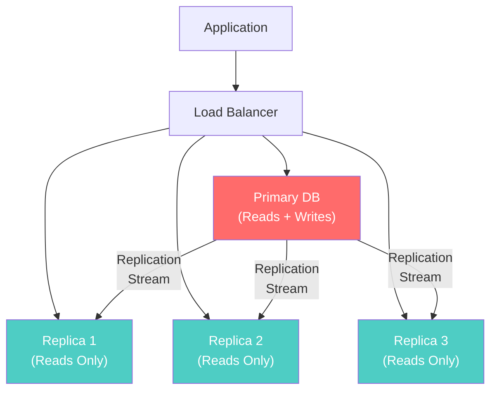

**How it works:**
1. All writes go to the primary (leader) database
2. Changes are replicated to read replicas asynchronously
3. Read queries are distributed across replicas
4. If a replica fails, traffic is redirected to others

**Replication Lag Problem:**
- Asynchronous replication means replicas may be behind the primary
- A user writes data, then reads from a replica that hasn't caught up → sees stale data
- Solution: **read-your-writes consistency** (route reads to primary for recently-written data)

**Production numbers (AWS Aurora):**
- Up to 15 read replicas
- Replication lag typically < 20ms
- Cross-region replicas: 1–2 seconds lag

#### Database Sharding

Sharding (horizontal partitioning) splits data across multiple database instances, each holding a subset of the data.

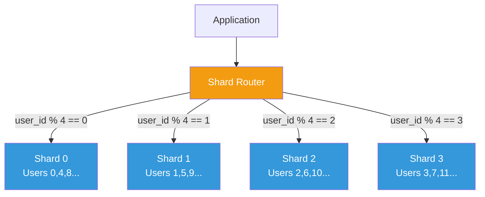

**Sharding Strategies:**

| Strategy | Description | Pros | Cons |
|----------|-------------|------|------|
| **Hash-based** | `shard = hash(key) % N` | Even distribution | Resharding is painful |
| **Range-based** | `shard = key_range` | Range queries possible | Hotspots possible |
| **Directory-based** | Lookup table maps keys to shards | Flexible | Lookup table is bottleneck |
| **Geographic** | Data lives near users | Low latency | Cross-region queries hard |
| **Consistent hashing** | Hash ring with virtual nodes | Minimal data movement on resize | More complex |

**Sharding Challenges:**
1. **Cross-shard queries**: JOINs across shards are extremely expensive
2. **Resharding**: Adding a new shard requires data migration
3. **Hotspots**: Some shards may receive more traffic (celebrity problem)
4. **Distributed transactions**: ACID across shards requires 2PC
5. **Auto-increment IDs**: Must use distributed ID generators (Snowflake, ULID)

#### CQRS (Command Query Responsibility Segregation)

CQRS separates the read model from the write model, allowing each to be optimized independently.

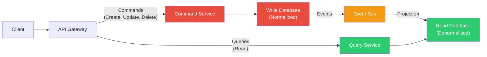

**Why CQRS?**
- Read and write workloads have different characteristics
- Reads are typically 10–100x more frequent than writes
- Read models can be denormalized for fast queries
- Write models can be normalized for data integrity
- Each side can scale independently

**When to use CQRS:**
- Read/write ratio is highly asymmetric
- Read and write models have different shapes
- You need to scale reads and writes independently
- Event sourcing is already in use

**When NOT to use CQRS:**
- Simple CRUD applications
- Read/write ratio is balanced
- Team doesn't have experience with eventual consistency
- Data consistency requirements are strict (banking core ledger)

### 4.2 Application Tier Scaling

#### Load Balancing Deep Dive

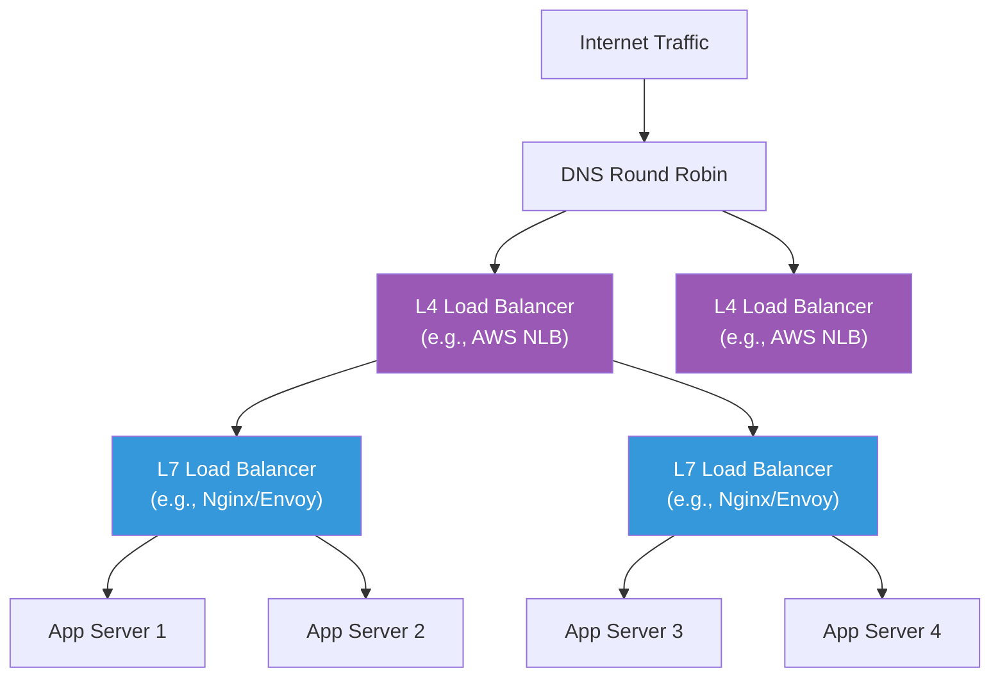

**L4 vs. L7 Load Balancing:**

| Feature | L4 (Transport) | L7 (Application) |
|---------|----------------|-------------------|
| **Layer** | TCP/UDP | HTTP/HTTPS/gRPC |
| **Speed** | Very fast (packet-level) | Slower (must parse headers) |
| **Intelligence** | IP + Port only | URL path, headers, cookies |
| **SSL Termination** | Pass-through | Yes |
| **Content Routing** | No | Yes (`/api` → service A) |
| **WebSocket Support** | Basic | Full |
| **Health Checks** | TCP SYN/ACK | HTTP GET /health |
| **Example** | AWS NLB, HAProxy (TCP) | Nginx, Envoy, ALB |

**Load Balancing Algorithms:**

| Algorithm | Description | Best For |
|-----------|-------------|----------|
| **Round Robin** | Sequential distribution | Homogeneous servers |
| **Weighted Round Robin** | Based on server capacity | Mixed server sizes |
| **Least Connections** | Send to least busy server | Variable request duration |
| **Least Response Time** | Fastest server gets traffic | Latency-sensitive apps |
| **IP Hash** | Same client → same server | Session affinity needed |
| **Random** | Random selection | Simple, surprisingly effective |
| **Power of Two Choices** | Pick 2 random, choose less loaded | Combines random + load-aware |

**The "Power of Two Choices" Algorithm:**
This is surprisingly effective and used in Envoy proxy. Instead of checking all servers (expensive) or picking one randomly (suboptimal), you pick two servers at random and send the request to the less-loaded one. This achieves near-optimal distribution with minimal overhead.

#### Auto-Scaling Groups

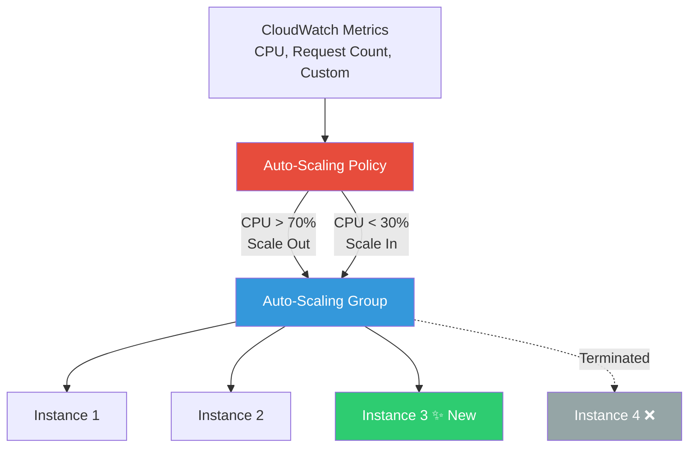

**Auto-Scaling Strategies:**

| Strategy | Trigger | Response Time | Accuracy |
|----------|---------|---------------|----------|
| **Reactive (Target Tracking)** | Metric exceeds threshold | 1–5 minutes | Good |
| **Scheduled** | Time-based rules | Immediate | Predictable patterns |
| **Predictive** | ML forecasts future load | Proactive | Great for patterns |
| **Step Scaling** | Multiple thresholds | Variable | Proportional response |

**Reactive vs. Predictive Auto-Scaling:**

```
Load
│    ╱╲
│   ╱  ╲   Actual Load
│  ╱    ╲
│ ╱      ╲
│╱        ╲
│─ ─ ─ ─ ─ ─ ─ ─ ─ ─
│   ╱╲
│  ╱  ╲    Reactive Scaling (delayed)
│ ╱    ╲
│╱      ╲
│─ ─ ─ ─ ─ ─ ─ ─ ─ ─
│  ╱╲
│ ╱  ╲     Predictive Scaling (ahead)
│╱    ╲
│      ╲
└────────────────── Time
```

### 4.3 Caching Tier Scaling

#### Multi-Level Cache Architecture

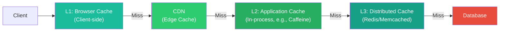

**Cache Scaling Strategies:**

1. **Replicated cache**: Every node has a full copy (good for small datasets, read-heavy)
2. **Partitioned cache**: Data split across nodes by key hash (good for large datasets)
3. **Near cache + remote cache**: In-process cache backed by Redis (lowest latency)
4. **Write-through**: Write to cache and DB simultaneously (consistent but slower writes)
5. **Write-behind**: Write to cache immediately, async to DB (fast writes, risk of data loss)
6. **Cache-aside**: Application manages cache reads/writes explicitly (most common)

**Redis Cluster Architecture:**
```
┌─────────────────────────────────────────────┐
│                Redis Cluster                 │
│                                             │
│  ┌────────┐  ┌────────┐  ┌────────┐       │
│  │Master 1│  │Master 2│  │Master 3│       │
│  │Slots   │  │Slots   │  │Slots   │       │
│  │0-5460  │  │5461-   │  │10923-  │       │
│  │        │  │10922   │  │16383   │       │
│  └───┬────┘  └───┬────┘  └───┬────┘       │
│      │           │           │             │
│  ┌───┴────┐  ┌───┴────┐  ┌───┴────┐       │
│  │Replica │  │Replica │  │Replica │       │
│  │  1a    │  │  2a    │  │  3a    │       │
│  └────────┘  └────────┘  └────────┘       │
│                                             │
└─────────────────────────────────────────────┘

16384 hash slots distributed across masters
key → CRC16(key) % 16384 → slot → master
```

### 4.4 Queue-Based Scaling

#### Decoupling Producers and Consumers

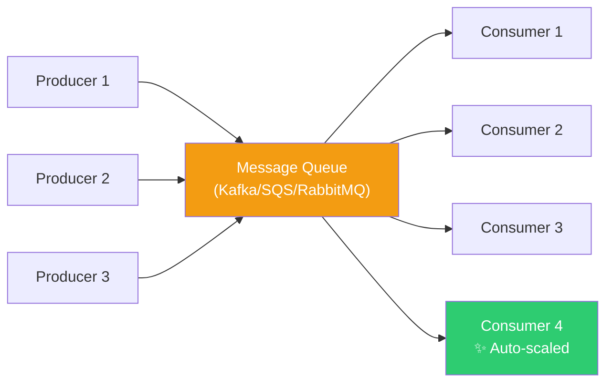

**Benefits of queue-based scaling:**

1. **Temporal decoupling**: Producers and consumers don't need to be available simultaneously
2. **Rate decoupling**: Producers can emit faster than consumers process
3. **Independent scaling**: Scale consumers independently of producers
4. **Load leveling**: Queues absorb traffic spikes
5. **Retry handling**: Failed messages can be retried automatically

**Queue-based auto-scaling formula:**
```
Desired consumers = Messages in queue / (Messages per consumer per second × Target processing time)

Example:
  Queue depth: 10,000 messages
  Consumer rate: 100 msg/s
  Target: process all within 60s
  Desired consumers: 10000 / (100 × 60) ≈ 2 consumers
```

### 4.5 Event Sourcing for Scalability

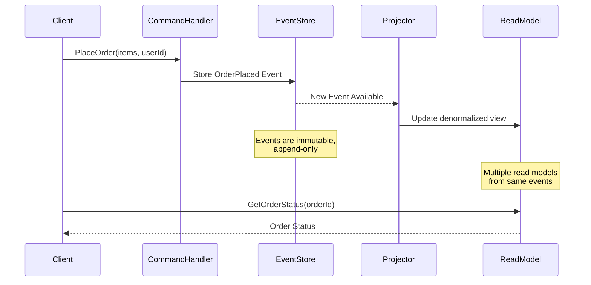

**Event Sourcing stores every state change as an immutable event:**

```
Traditional:  UPDATE orders SET status = 'shipped' WHERE id = 123
              → Previous state is LOST

Event Sourcing:
  Event 1: OrderCreated { id: 123, items: [...], time: T1 }
  Event 2: PaymentReceived { id: 123, amount: $50, time: T2 }
  Event 3: OrderShipped { id: 123, trackingNo: "XY123", time: T3 }
  → Complete history preserved, current state = replay all events
```

**Scalability benefits:**
- Append-only writes are extremely fast (sequential I/O)
- Multiple read models can be derived from the same events
- Events can be processed asynchronously
- Natural fit for CQRS
- Temporal queries possible ("what was the state at time T?")

### 4.6 Scatter-Gather Pattern

Used when a request must be sent to multiple services in parallel and results aggregated.

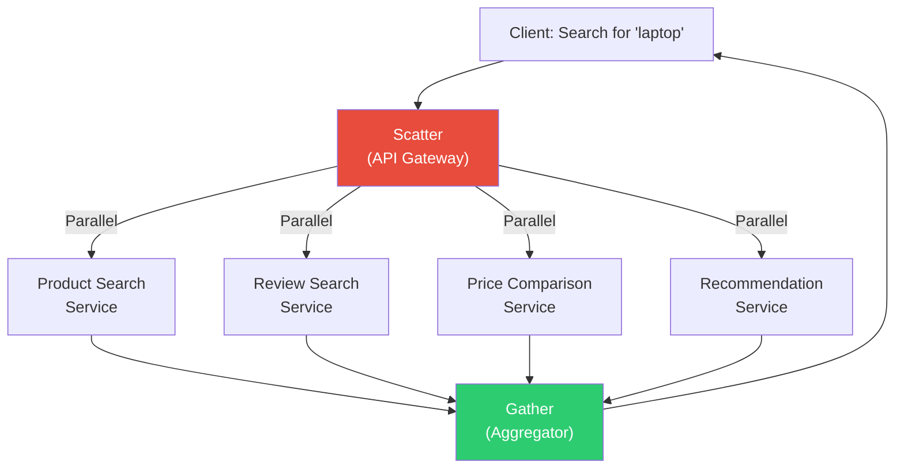

**Key considerations:**
- Set timeout for each scatter call (don't wait forever)
- Return partial results if some services are slow
- Use circuit breakers for failing services
- The total latency = max(individual latencies), not sum

### 4.7 MapReduce Pattern

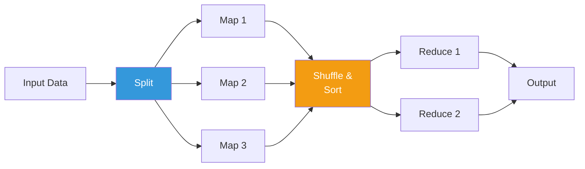

**Example: Word count across 1TB of text**

1. **Split**: Divide into 1GB chunks
2. **Map**: Each mapper emits (word, 1) pairs
3. **Shuffle**: Group by word, send to same reducer
4. **Reduce**: Sum counts per word

**MapReduce scales because:**
- Map phase is embarrassingly parallel
- Data locality: move compute to data, not data to compute
- Fault tolerance: if a mapper fails, rerun just that chunk

---

## 5. Visual Diagrams

### 5.1 Horizontal vs. Vertical Scaling

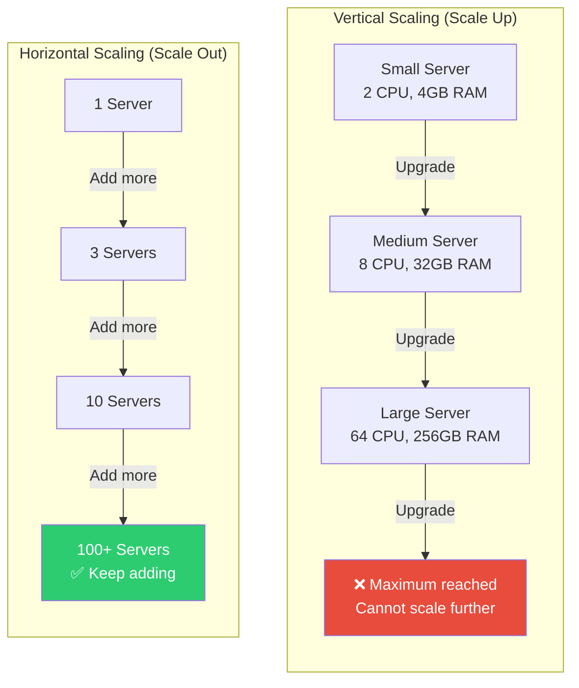

### 5.2 CQRS Full Architecture

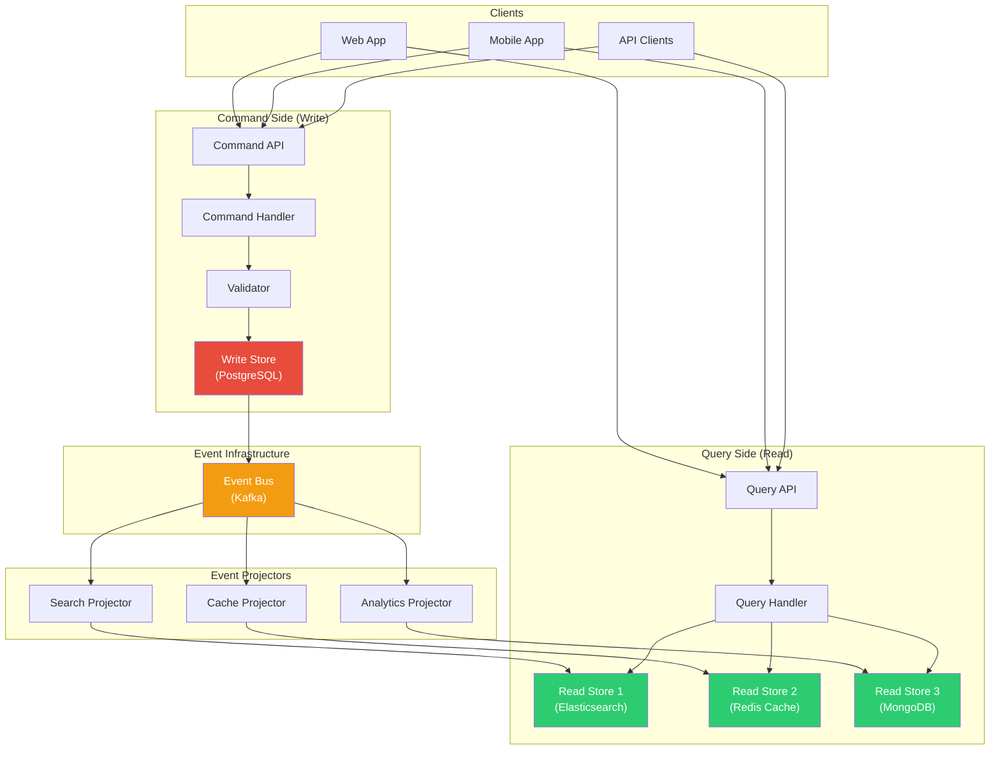

### 5.3 Rate Limiting Algorithms Comparison

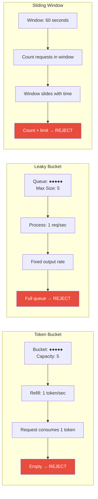

### 5.4 Auto-Scaling Architecture

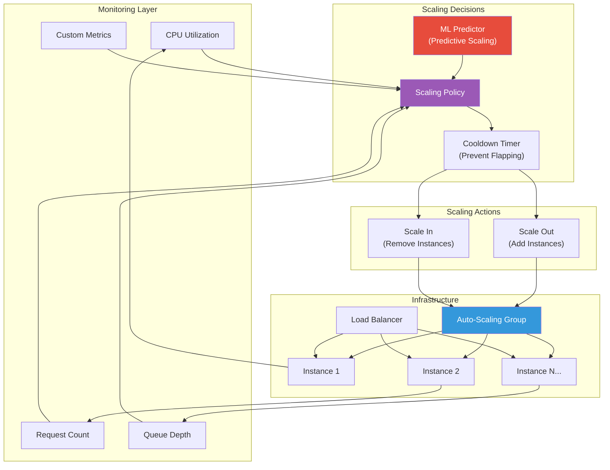

### 5.5 Event Sourcing Flow

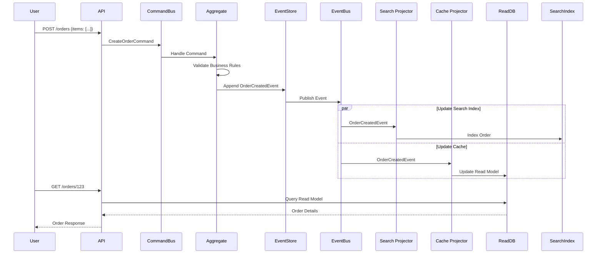

---

## 6. Real Production Examples

### 6.1 Netflix Scaling Architecture

**Scale:** 200+ million subscribers, 15% of global internet bandwidth

**Architecture Highlights:**

| Layer | Technology | Scale |
|-------|-----------|-------|
| **CDN** | Open Connect (own CDN) | 1000+ edge locations |
| **API Gateway** | Zuul 2 (async, non-blocking) | Billions of requests/day |
| **Service Mesh** | Custom (evolved from Eureka) | 1000+ microservices |
| **Database** | Cassandra, CockroachDB | Petabytes of data |
| **Cache** | EVCache (Memcached-based) | Trillions of cache hits/day |
| **Streaming** | Kafka | Trillions of events/day |
| **Compute** | Titus (container platform on AWS) | Millions of containers/week |

**Key scaling patterns used:**
1. **Microservices**: Each service scales independently
2. **EVCache**: Multi-tier caching with cross-region replication
3. **Zuul 2**: Async I/O for API gateway (handles 10x more connections than Zuul 1)
4. **Cassandra**: Multi-region, multi-datacenter, tunable consistency
5. **Chaos engineering**: Ensure scaling works under failure conditions
6. **Predictive auto-scaling**: Scryer predicts traffic patterns

**Netflix's "Request Flow":**
```
User → CDN (Open Connect) → AWS ELB → Zuul API Gateway → 
  → Service Discovery (Eureka) → Microservice →
    → EVCache (check cache) → Cassandra (if cache miss) →
  → Response composed → Zuul → User
  
Avg latency: < 200ms for API calls
Cache hit rate: > 99% for popular content metadata
```

### 6.2 Twitter Timeline Scaling

**The Problem:** Twitter's timeline is a classic fan-out problem. When a user with 30 million followers tweets, that tweet needs to appear in 30 million timelines.

**Evolution of Twitter's Architecture:**

**Phase 1: Pull-based (2006-2009)**
```
User opens timeline → 
  SELECT tweets FROM tweets 
  WHERE user_id IN (SELECT following FROM follows WHERE follower = ?)
  ORDER BY created_at DESC 
  LIMIT 200
```
**Problem:** This query is extremely expensive for users following many people. At scale, it crushed the database.

**Phase 2: Push-based (Fan-out-on-write) (2009-2012)**
```
User tweets →
  For each follower:
    INSERT INTO timeline_cache (follower_id, tweet)
    
User opens timeline →
  GET timeline_cache[user_id]  // Simple key lookup!
```
**Problem:** Celebrity tweets (30M followers) create massive write amplification. A single tweet by a celebrity generates 30 million writes.

**Phase 3: Hybrid (2012-present)**
```
Regular user tweets → Fan-out-on-write (push to followers' caches)
Celebrity tweets → Fan-out-on-read (merge at read time)

Celebrity threshold: ~5000 followers
```

**Numbers at Twitter scale:**
- 500 million tweets/day
- 200 billion timeline views/day
- Timeline cache: Redis clusters storing ~800 tweets per user
- Fan-out service: can push to 30M timelines in < 5 seconds

### 6.3 Instagram Scaling Story

**Scale:** 2 billion+ monthly active users

**Key architectural decisions:**

1. **Simplicity first**: Instagram famously ran on just 3 engineers for the first year
2. **PostgreSQL sharding**: Shard by user_id, using Postgres with pgbouncer
3. **Django + Gunicorn**: Python web tier, horizontally scaled
4. **Memcached → Redis**: For caching, session storage
5. **Celery + RabbitMQ**: Async task processing (notifications, feed generation)
6. **Cassandra**: For feed storage (write-heavy, eventually consistent is OK)

**Instagram's feed generation:**

```
Photo upload → 
  1. Store photo in S3
  2. Store metadata in PostgreSQL (sharded)
  3. Push to Celery queue
  4. Worker fans out to follower feeds (Cassandra)
  5. Invalidate CDN cache for profile
  6. Push notification via APNS/FCM
```

**Scaling milestones:**

| Users | Architecture Change |
|-------|-------------------|
| 1M | Single PostgreSQL + Memcached |
| 10M | PostgreSQL read replicas, sharding |
| 100M | Cassandra for feeds, multi-DC |
| 1B | Custom storage (Haystack → f4), ML infra |
| 2B+ | Full Meta infrastructure integration |

### 6.4 WhatsApp Scaling with Erlang

**Scale:** 2 billion users, 100 billion messages/day, ~50 engineers

**Why Erlang?**
- Designed for telecom (millions of concurrent connections)
- Lightweight processes (not OS threads): can run millions per node
- Built-in fault tolerance (supervisor trees, "let it crash")
- Hot code swapping (zero-downtime deploys)
- Soft real-time guarantees

**Architecture:**

```
User → TCP/WebSocket → FreeBSD Server (Erlang) → Mnesia (metadata)
                                                → Custom storage (messages)
```

**WhatsApp's key numbers:**
- Single server: 2 million concurrent connections
- Total: ~900 servers for 900 million users (2015 numbers)
- Each message: stored until delivered, then deleted
- No message history server-side (end-to-end encrypted)

**Why WhatsApp scaled so well:**
1. **No social graph computation**: Just message relay
2. **No feed algorithms**: No complex aggregation
3. **Erlang's concurrency model**: Millions of lightweight processes
4. **FreeBSD**: Tuned for massive concurrent connections
5. **Minimal feature set**: Focus on doing one thing extremely well
6. **Store-and-forward**: Messages stored briefly, not permanently

### 6.5 Key Lessons from Production

| Company | Key Scaling Lesson |
|---------|-------------------|
| **Netflix** | Cache everything, test failures proactively |
| **Twitter** | Hybrid fan-out (push for normal, pull for celebrities) |
| **Instagram** | Simplicity scales; don't over-engineer early |
| **WhatsApp** | Choose the right language/runtime for your problem |
| **Google** | Build your own infrastructure when nothing else works |
| **Amazon** | Service-oriented architecture enables independent scaling |
| **Facebook** | Custom everything at sufficient scale |

---

## 7. Java Implementations

### 7.1 Token Bucket Rate Limiter

```java
import java.util.concurrent.atomic.AtomicLong;
import java.util.concurrent.ConcurrentHashMap;

/**
 * Thread-safe Token Bucket Rate Limiter.
 * 
 * Used in production systems like:
 * - API Gateway rate limiting per client
 * - Database connection throttling
 * - Microservice-to-microservice call limiting
 * 
 * Time complexity: O(1) per request
 * Space complexity: O(1) per bucket (O(N) for N clients)
 */
public class TokenBucketRateLimiter {
    
    private final long maxTokens;          // Maximum burst capacity
    private final long refillRatePerSecond; // Tokens added per second
    private final ConcurrentHashMap<String, Bucket> buckets;
    
    public TokenBucketRateLimiter(long maxTokens, long refillRatePerSecond) {
        this.maxTokens = maxTokens;
        this.refillRatePerSecond = refillRatePerSecond;
        this.buckets = new ConcurrentHashMap<>();
    }
    
    /**
     * Check if a request is allowed for the given client.
     * Thread-safe: uses CAS operations for lock-free updates.
     * 
     * @param clientId Unique identifier for the client
     * @return true if the request is allowed, false if rate limited
     */
    public boolean tryAcquire(String clientId) {
        return tryAcquire(clientId, 1);
    }
    
    /**
     * Try to acquire multiple tokens (for weighted rate limiting).
     * Example: A file upload might cost 10 tokens while a metadata read costs 1.
     */
    public boolean tryAcquire(String clientId, int tokens) {
        Bucket bucket = buckets.computeIfAbsent(clientId, 
            k -> new Bucket(maxTokens, refillRatePerSecond));
        return bucket.tryConsume(tokens);
    }
    
    /**
     * Get remaining tokens for a client (useful for X-RateLimit-Remaining header).
     */
    public long getRemainingTokens(String clientId) {
        Bucket bucket = buckets.get(clientId);
        if (bucket == null) return maxTokens;
        return bucket.getAvailableTokens();
    }
    
    /**
     * Get time until next token is available (useful for Retry-After header).
     */
    public long getRetryAfterMillis(String clientId) {
        Bucket bucket = buckets.get(clientId);
        if (bucket == null) return 0;
        long available = bucket.getAvailableTokens();
        if (available > 0) return 0;
        return 1000 / refillRatePerSecond; // Time for one token refill
    }
    
    /**
     * Inner class representing a single token bucket.
     * Uses lock-free CAS operations for high throughput.
     */
    private static class Bucket {
        private final long maxTokens;
        private final long refillRatePerSecond;
        private final AtomicLong availableTokens;
        private final AtomicLong lastRefillTimestamp;
        
        Bucket(long maxTokens, long refillRatePerSecond) {
            this.maxTokens = maxTokens;
            this.refillRatePerSecond = refillRatePerSecond;
            this.availableTokens = new AtomicLong(maxTokens);
            this.lastRefillTimestamp = new AtomicLong(System.nanoTime());
        }
        
        boolean tryConsume(int tokens) {
            refill();
            while (true) {
                long current = availableTokens.get();
                if (current < tokens) {
                    return false; // Not enough tokens
                }
                if (availableTokens.compareAndSet(current, current - tokens)) {
                    return true; // Successfully consumed
                }
                // CAS failed, retry (another thread consumed tokens)
            }
        }
        
        long getAvailableTokens() {
            refill();
            return availableTokens.get();
        }
        
        private void refill() {
            long now = System.nanoTime();
            long lastRefill = lastRefillTimestamp.get();
            long elapsedNanos = now - lastRefill;
            
            // Calculate tokens to add based on elapsed time
            long tokensToAdd = elapsedNanos * refillRatePerSecond / 1_000_000_000;
            
            if (tokensToAdd > 0) {
                if (lastRefillTimestamp.compareAndSet(lastRefill, now)) {
                    long currentTokens = availableTokens.get();
                    long newTokens = Math.min(maxTokens, currentTokens + tokensToAdd);
                    availableTokens.set(newTokens);
                }
            }
        }
    }
    
    // ========== Spring Boot Integration ==========
    
    /**
     * Spring Boot Rate Limiting Filter
     * Add to your application for API-level rate limiting.
     */
    /*
    @Component
    public class RateLimitFilter extends OncePerRequestFilter {
        
        private final TokenBucketRateLimiter rateLimiter = 
            new TokenBucketRateLimiter(100, 10); // 100 burst, 10/sec sustained
        
        @Override
        protected void doFilterInternal(HttpServletRequest request, 
                                         HttpServletResponse response, 
                                         FilterChain chain) 
                throws ServletException, IOException {
            
            String clientId = extractClientId(request);
            
            if (rateLimiter.tryAcquire(clientId)) {
                // Add rate limit headers
                response.setHeader("X-RateLimit-Remaining", 
                    String.valueOf(rateLimiter.getRemainingTokens(clientId)));
                chain.doFilter(request, response);
            } else {
                response.setStatus(429); // Too Many Requests
                response.setHeader("Retry-After", 
                    String.valueOf(rateLimiter.getRetryAfterMillis(clientId) / 1000));
                response.getWriter().write("{\"error\": \"Rate limit exceeded\"}");
            }
        }
        
        private String extractClientId(HttpServletRequest request) {
            // Priority: API key > User ID > IP address
            String apiKey = request.getHeader("X-API-Key");
            if (apiKey != null) return "api:" + apiKey;
            
            String userId = request.getHeader("X-User-Id");
            if (userId != null) return "user:" + userId;
            
            return "ip:" + request.getRemoteAddr();
        }
    }
    */
}
```

### 7.2 Sliding Window Rate Limiter

```java
import java.util.concurrent.ConcurrentHashMap;
import java.util.concurrent.atomic.AtomicInteger;
import java.util.concurrent.atomic.AtomicLong;

/**
 * Sliding Window Counter Rate Limiter.
 * 
 * Combines the simplicity of fixed windows with the accuracy
 * of sliding windows. Used by Cloudflare, Stripe, and others.
 * 
 * Memory: O(1) per client (just two counters + timestamps)
 * vs O(N) for sliding window log approach.
 */
public class SlidingWindowRateLimiter {
    
    private final int maxRequests;       // Max requests per window
    private final long windowSizeMillis; // Window size in milliseconds
    private final ConcurrentHashMap<String, WindowState> windows;
    
    public SlidingWindowRateLimiter(int maxRequests, long windowSizeMillis) {
        this.maxRequests = maxRequests;
        this.windowSizeMillis = windowSizeMillis;
        this.windows = new ConcurrentHashMap<>();
    }
    
    /**
     * Check if a request should be allowed.
     * Uses weighted combination of current and previous window counts.
     */
    public synchronized boolean tryAcquire(String clientId) {
        long now = System.currentTimeMillis();
        WindowState state = windows.computeIfAbsent(clientId, k -> new WindowState());
        
        long currentWindowStart = (now / windowSizeMillis) * windowSizeMillis;
        long previousWindowStart = currentWindowStart - windowSizeMillis;
        
        // If we've moved to a new window, rotate
        if (state.currentWindowStart.get() < currentWindowStart) {
            if (state.currentWindowStart.get() == previousWindowStart) {
                // Previous window becomes the one we were just in
                state.previousCount.set(state.currentCount.get());
            } else {
                // We skipped a window entirely
                state.previousCount.set(0);
            }
            state.currentCount.set(0);
            state.currentWindowStart.set(currentWindowStart);
        }
        
        // Calculate weighted count using sliding window approximation
        long elapsedInCurrentWindow = now - currentWindowStart;
        double previousWindowWeight = 1.0 - ((double) elapsedInCurrentWindow / windowSizeMillis);
        
        double estimatedCount = (state.previousCount.get() * previousWindowWeight) 
                               + state.currentCount.get();
        
        if (estimatedCount >= maxRequests) {
            return false; // Rate limited
        }
        
        state.currentCount.incrementAndGet();
        return true;
    }
    
    private static class WindowState {
        final AtomicInteger currentCount = new AtomicInteger(0);
        final AtomicInteger previousCount = new AtomicInteger(0);
        final AtomicLong currentWindowStart = new AtomicLong(0);
    }
}
```

### 7.3 Connection Pool Implementation

```java
import java.util.concurrent.*;
import java.util.concurrent.atomic.AtomicInteger;

/**
 * Production-grade Connection Pool.
 * 
 * Design principles (inspired by HikariCP):
 * 1. Fast path: CAS-based connection acquisition
 * 2. Bounded: prevents resource exhaustion
 * 3. Timeout-based: no indefinite waiting
 * 4. Health checking: validates connections before use
 * 5. Idle eviction: reclaims unused connections
 * 
 * For production, use HikariCP. This is for understanding internals.
 */
public class ConnectionPool<T> implements AutoCloseable {
    
    private final BlockingQueue<PooledConnection<T>> idleConnections;
    private final AtomicInteger totalConnections;
    private final AtomicInteger activeConnections;
    private final ConnectionFactory<T> factory;
    private final int maxPoolSize;
    private final int minIdle;
    private final long connectionTimeoutMs;
    private final long maxLifetimeMs;
    private final long idleTimeoutMs;
    private final ScheduledExecutorService maintenanceExecutor;
    private volatile boolean closed = false;
    
    /**
     * @param factory           Creates new connections
     * @param maxPoolSize       Maximum connections in pool
     * @param minIdle           Minimum idle connections to maintain
     * @param connectionTimeout Max time to wait for a connection
     * @param maxLifetime       Max lifetime of a connection before refresh
     * @param idleTimeout       Time before idle connections are evicted
     */
    public ConnectionPool(ConnectionFactory<T> factory, 
                           int maxPoolSize, 
                           int minIdle,
                           long connectionTimeout,
                           long maxLifetime,
                           long idleTimeout) {
        this.factory = factory;
        this.maxPoolSize = maxPoolSize;
        this.minIdle = minIdle;
        this.connectionTimeoutMs = connectionTimeout;
        this.maxLifetimeMs = maxLifetime;
        this.idleTimeoutMs = idleTimeout;
        this.idleConnections = new LinkedBlockingQueue<>(maxPoolSize);
        this.totalConnections = new AtomicInteger(0);
        this.activeConnections = new AtomicInteger(0);
        
        // Pre-create minimum idle connections
        for (int i = 0; i < minIdle; i++) {
            createAndAddConnection();
        }
        
        // Schedule maintenance (evict idle, replace expired, maintain minimum)
        this.maintenanceExecutor = Executors.newSingleThreadScheduledExecutor(
            r -> {
                Thread t = new Thread(r, "pool-maintenance");
                t.setDaemon(true);
                return t;
            });
        maintenanceExecutor.scheduleAtFixedRate(this::maintenance, 30, 30, TimeUnit.SECONDS);
    }
    
    /**
     * Borrow a connection from the pool.
     * 
     * Fast path: Try to get an idle connection immediately.
     * Slow path: Create a new one if pool isn't full.
     * Wait path: Block until one becomes available or timeout.
     * 
     * @return A valid connection
     * @throws TimeoutException if no connection available within timeout
     */
    public T borrowConnection() throws TimeoutException, InterruptedException {
        if (closed) throw new IllegalStateException("Pool is closed");
        
        long deadline = System.currentTimeMillis() + connectionTimeoutMs;
        
        while (true) {
            // Fast path: try to get an idle connection
            PooledConnection<T> pooled = idleConnections.poll();
            
            if (pooled != null) {
                // Validate the connection
                if (isValid(pooled)) {
                    activeConnections.incrementAndGet();
                    return pooled.connection;
                } else {
                    // Connection is stale/expired, discard and try again
                    destroyConnection(pooled);
                    continue;
                }
            }
            
            // Slow path: try to create a new connection
            if (totalConnections.get() < maxPoolSize) {
                if (totalConnections.incrementAndGet() <= maxPoolSize) {
                    try {
                        T conn = factory.create();
                        activeConnections.incrementAndGet();
                        return conn;
                    } catch (Exception e) {
                        totalConnections.decrementAndGet();
                        throw new RuntimeException("Failed to create connection", e);
                    }
                } else {
                    totalConnections.decrementAndGet(); // Another thread beat us
                }
            }
            
            // Wait path: wait for a connection to be returned
            long remainingMs = deadline - System.currentTimeMillis();
            if (remainingMs <= 0) {
                throw new TimeoutException(
                    "Connection pool exhausted. Active: " + activeConnections.get() 
                    + ", Total: " + totalConnections.get() 
                    + ", Max: " + maxPoolSize);
            }
            
            pooled = idleConnections.poll(remainingMs, TimeUnit.MILLISECONDS);
            if (pooled == null) {
                throw new TimeoutException("Timed out waiting for connection");
            }
            
            if (isValid(pooled)) {
                activeConnections.incrementAndGet();
                return pooled.connection;
            } else {
                destroyConnection(pooled);
            }
        }
    }
    
    /**
     * Return a connection to the pool.
     * Connection is validated and placed back in the idle queue.
     */
    public void returnConnection(T connection) {
        if (closed) {
            closeQuietly(connection);
            return;
        }
        
        activeConnections.decrementAndGet();
        
        PooledConnection<T> pooled = new PooledConnection<>(connection, System.currentTimeMillis());
        
        if (!idleConnections.offer(pooled)) {
            // Pool is full (shouldn't happen normally), destroy the connection
            destroyConnection(pooled);
        }
    }
    
    /**
     * Execute an operation using a pooled connection with automatic return.
     * This is the preferred API - ensures connections are always returned.
     */
    public <R> R execute(ConnectionCallback<T, R> callback) 
            throws TimeoutException, InterruptedException {
        T connection = borrowConnection();
        try {
            return callback.doWithConnection(connection);
        } finally {
            returnConnection(connection);
        }
    }
    
    /**
     * Maintenance task: evict idle connections, replace expired ones,
     * ensure minimum idle count.
     */
    private void maintenance() {
        try {
            // 1. Evict expired/idle connections
            int evicted = 0;
            int poolSize = idleConnections.size();
            
            for (int i = 0; i < poolSize; i++) {
                PooledConnection<T> pooled = idleConnections.poll();
                if (pooled == null) break;
                
                if (!isValid(pooled)) {
                    destroyConnection(pooled);
                    evicted++;
                } else {
                    idleConnections.offer(pooled); // Put it back
                }
            }
            
            // 2. Ensure minimum idle connections
            while (idleConnections.size() < minIdle 
                   && totalConnections.get() < maxPoolSize) {
                createAndAddConnection();
            }
            
            if (evicted > 0) {
                System.out.printf("[Pool Maintenance] Evicted %d connections. " +
                    "Total: %d, Active: %d, Idle: %d%n",
                    evicted, totalConnections.get(), 
                    activeConnections.get(), idleConnections.size());
            }
        } catch (Exception e) {
            System.err.println("Pool maintenance error: " + e.getMessage());
        }
    }
    
    private boolean isValid(PooledConnection<T> pooled) {
        long now = System.currentTimeMillis();
        long age = now - pooled.createdAt;
        
        // Check max lifetime
        if (age > maxLifetimeMs) return false;
        
        // Check idle timeout (only if above minimum idle)
        if (idleConnections.size() > minIdle) {
            long idleTime = now - pooled.lastUsedAt;
            if (idleTime > idleTimeoutMs) return false;
        }
        
        // Validate connection health
        try {
            return factory.validate(pooled.connection);
        } catch (Exception e) {
            return false;
        }
    }
    
    private void createAndAddConnection() {
        try {
            T conn = factory.create();
            totalConnections.incrementAndGet();
            idleConnections.offer(new PooledConnection<>(conn, System.currentTimeMillis()));
        } catch (Exception e) {
            System.err.println("Failed to create connection: " + e.getMessage());
        }
    }
    
    private void destroyConnection(PooledConnection<T> pooled) {
        totalConnections.decrementAndGet();
        closeQuietly(pooled.connection);
    }
    
    private void closeQuietly(T connection) {
        try {
            factory.destroy(connection);
        } catch (Exception ignored) {}
    }
    
    @Override
    public void close() {
        closed = true;
        maintenanceExecutor.shutdown();
        PooledConnection<T> pooled;
        while ((pooled = idleConnections.poll()) != null) {
            destroyConnection(pooled);
        }
    }
    
    // === Pool statistics (for monitoring) ===
    
    public int getTotalConnections() { return totalConnections.get(); }
    public int getActiveConnections() { return activeConnections.get(); }
    public int getIdleConnections() { return idleConnections.size(); }
    public int getMaxPoolSize() { return maxPoolSize; }
    
    // === Inner classes ===
    
    private static class PooledConnection<T> {
        final T connection;
        final long createdAt;
        volatile long lastUsedAt;
        
        PooledConnection(T connection, long createdAt) {
            this.connection = connection;
            this.createdAt = createdAt;
            this.lastUsedAt = createdAt;
        }
    }
    
    @FunctionalInterface
    public interface ConnectionFactory<T> {
        T create() throws Exception;
        default boolean validate(T connection) { return true; }
        default void destroy(T connection) {}
    }
    
    @FunctionalInterface
    public interface ConnectionCallback<T, R> {
        R doWithConnection(T connection) throws Exception;
    }
}
```

### 7.4 Async Processing with CompletableFuture

```java
import java.util.concurrent.*;
import java.util.List;
import java.util.stream.Collectors;
import java.util.Map;

/**
 * Scatter-Gather pattern implementation using CompletableFuture.
 * 
 * Used in production for:
 * - Search aggregation (query multiple indices in parallel)
 * - Price comparison (check multiple providers)
 * - Dashboard data loading (fetch widgets concurrently)
 * - Fan-out requests in API gateways
 */
public class ScatterGatherService {
    
    private final ExecutorService executor;
    private final long timeoutMs;
    
    public ScatterGatherService(int threadPoolSize, long timeoutMs) {
        this.timeoutMs = timeoutMs;
        // Use virtual threads (Java 21+) for I/O-bound scatter-gather
        this.executor = Executors.newFixedThreadPool(threadPoolSize, r -> {
            Thread t = new Thread(r);
            t.setDaemon(true);
            t.setName("scatter-gather-" + t.getId());
            return t;
        });
    }
    
    /**
     * Scatter a search query to multiple services and gather results.
     * 
     * Key behaviors:
     * 1. All services are queried in parallel
     * 2. A timeout is applied to the entire operation
     * 3. Partial results are returned if some services are slow/fail
     * 4. Individual failures don't fail the entire request
     */
    public SearchResult scatterGatherSearch(String query) {
        long startTime = System.currentTimeMillis();
        
        // Scatter: Launch parallel requests
        CompletableFuture<List<Product>> productsFuture = 
            CompletableFuture.supplyAsync(() -> searchProducts(query), executor);
        
        CompletableFuture<List<Review>> reviewsFuture = 
            CompletableFuture.supplyAsync(() -> searchReviews(query), executor);
        
        CompletableFuture<List<Price>> pricesFuture = 
            CompletableFuture.supplyAsync(() -> comparePrices(query), executor);
        
        CompletableFuture<List<String>> suggestionsFuture = 
            CompletableFuture.supplyAsync(() -> getSuggestions(query), executor);
        
        // Gather: Wait for all with timeout, handle partial failures
        try {
            CompletableFuture<Void> allOf = CompletableFuture.allOf(
                productsFuture, reviewsFuture, pricesFuture, suggestionsFuture
            );
            
            // Wait for all, or until timeout
            allOf.get(timeoutMs, TimeUnit.MILLISECONDS);
            
        } catch (TimeoutException e) {
            System.out.println("Scatter-gather timed out after " + timeoutMs + "ms. " +
                "Returning partial results.");
        } catch (Exception e) {
            System.err.println("Scatter-gather error: " + e.getMessage());
        }
        
        long elapsed = System.currentTimeMillis() - startTime;
        
        // Gather results (use defaults for failed/slow services)
        return new SearchResult(
            getResultOrDefault(productsFuture, List.of()),
            getResultOrDefault(reviewsFuture, List.of()),
            getResultOrDefault(pricesFuture, List.of()),
            getResultOrDefault(suggestionsFuture, List.of()),
            elapsed
        );
    }
    
    /**
     * Fan-out pattern: Notify multiple services about an event.
     * Unlike scatter-gather, we don't need to collect results.
     * 
     * Use case: Order placed → notify inventory, shipping, billing, analytics
     */
    public CompletableFuture<Map<String, Boolean>> fanOut(
            String eventType, String payload, List<String> serviceEndpoints) {
        
        List<CompletableFuture<Map.Entry<String, Boolean>>> futures = 
            serviceEndpoints.stream()
                .map(endpoint -> CompletableFuture.supplyAsync(() -> {
                    try {
                        notifyService(endpoint, eventType, payload);
                        return Map.entry(endpoint, true);
                    } catch (Exception e) {
                        System.err.println("Failed to notify " + endpoint + ": " + e.getMessage());
                        return Map.entry(endpoint, false);
                    }
                }, executor))
                .collect(Collectors.toList());
        
        return CompletableFuture.allOf(futures.toArray(new CompletableFuture[0]))
            .thenApply(v -> futures.stream()
                .map(CompletableFuture::join)
                .collect(Collectors.toMap(Map.Entry::getKey, Map.Entry::getValue)));
    }
    
    /**
     * Pipeline pattern: Chain async operations with error handling.
     * 
     * Use case: Validate → Enrich → Transform → Store
     */
    public CompletableFuture<ProcessingResult> asyncPipeline(RawData input) {
        return CompletableFuture
            .supplyAsync(() -> validate(input), executor)
            .thenApplyAsync(validated -> enrich(validated), executor)
            .thenApplyAsync(enriched -> transform(enriched), executor)
            .thenApplyAsync(transformed -> store(transformed), executor)
            .exceptionally(throwable -> {
                System.err.println("Pipeline failed: " + throwable.getMessage());
                return new ProcessingResult(false, throwable.getMessage());
            });
    }
    
    /**
     * Bulk async processing with controlled concurrency.
     * Process N items with at most M concurrent operations.
     * 
     * Prevents overwhelming downstream services (backpressure).
     */
    public <T, R> List<R> processWithConcurrencyLimit(
            List<T> items, 
            java.util.function.Function<T, R> processor,
            int maxConcurrency) throws InterruptedException {
        
        Semaphore semaphore = new Semaphore(maxConcurrency);
        
        List<CompletableFuture<R>> futures = items.stream()
            .map(item -> CompletableFuture.supplyAsync(() -> {
                try {
                    semaphore.acquire();
                    try {
                        return processor.apply(item);
                    } finally {
                        semaphore.release();
                    }
                } catch (InterruptedException e) {
                    Thread.currentThread().interrupt();
                    throw new CompletionException(e);
                }
            }, executor))
            .collect(Collectors.toList());
        
        return futures.stream()
            .map(CompletableFuture::join)
            .collect(Collectors.toList());
    }
    
    // === Helper methods ===
    
    private <T> T getResultOrDefault(CompletableFuture<T> future, T defaultValue) {
        try {
            if (future.isDone() && !future.isCompletedExceptionally()) {
                return future.get();
            }
        } catch (Exception ignored) {}
        return defaultValue;
    }
    
    // Simulated service calls
    private List<Product> searchProducts(String query) {
        simulateLatency(100);
        return List.of(new Product(query + " result 1"), new Product(query + " result 2"));
    }
    
    private List<Review> searchReviews(String query) {
        simulateLatency(150);
        return List.of(new Review(query, 4.5));
    }
    
    private List<Price> comparePrices(String query) {
        simulateLatency(200);
        return List.of(new Price(query, 29.99), new Price(query, 34.99));
    }
    
    private List<String> getSuggestions(String query) {
        simulateLatency(50);
        return List.of(query + " pro", query + " lite");
    }
    
    private void notifyService(String endpoint, String eventType, String payload) {
        simulateLatency(100);
    }
    
    private RawData validate(RawData input) { return input; }
    private RawData enrich(RawData input) { return input; }
    private RawData transform(RawData input) { return input; }
    private ProcessingResult store(RawData input) { 
        return new ProcessingResult(true, "Stored"); 
    }
    
    private void simulateLatency(long ms) {
        try { Thread.sleep(ms); } catch (InterruptedException e) {
            Thread.currentThread().interrupt();
        }
    }
    
    // === Data classes ===
    
    record Product(String name) {}
    record Review(String product, double rating) {}
    record Price(String product, double amount) {}
    record RawData(String data) {}
    record ProcessingResult(boolean success, String message) {}
    record SearchResult(
        List<Product> products, 
        List<Review> reviews, 
        List<Price> prices, 
        List<String> suggestions,
        long latencyMs
    ) {}
}
```

### 7.5 Simple Load Balancer

```java
import java.util.List;
import java.util.concurrent.*;
import java.util.concurrent.atomic.*;

/**
 * Software Load Balancer with multiple algorithms.
 * 
 * In production, use Nginx/Envoy/HAProxy. This demonstrates
 * the algorithms behind the scenes.
 * 
 * Features:
 * - Multiple load balancing strategies
 * - Health checking
 * - Weighted distribution
 * - Graceful removal of unhealthy servers
 */
public class LoadBalancer {
    
    private final List<Server> servers;
    private final Strategy strategy;
    private final ScheduledExecutorService healthChecker;
    private final AtomicInteger roundRobinCounter = new AtomicInteger(0);
    
    public LoadBalancer(List<Server> servers, Strategy strategy) {
        this.servers = new CopyOnWriteArrayList<>(servers);
        this.strategy = strategy;
        
        // Start health checking
        this.healthChecker = Executors.newSingleThreadScheduledExecutor();
        this.healthChecker.scheduleAtFixedRate(this::healthCheck, 10, 10, TimeUnit.SECONDS);
    }
    
    /**
     * Select the next server based on the configured strategy.
     * Only returns healthy servers.
     */
    public Server selectServer(String clientIp) {
        List<Server> healthyServers = servers.stream()
            .filter(Server::isHealthy)
            .toList();
        
        if (healthyServers.isEmpty()) {
            throw new RuntimeException("No healthy servers available!");
        }
        
        return switch (strategy) {
            case ROUND_ROBIN -> roundRobin(healthyServers);
            case WEIGHTED_ROUND_ROBIN -> weightedRoundRobin(healthyServers);
            case LEAST_CONNECTIONS -> leastConnections(healthyServers);
            case IP_HASH -> ipHash(healthyServers, clientIp);
            case POWER_OF_TWO_CHOICES -> powerOfTwoChoices(healthyServers);
            case RANDOM -> random(healthyServers);
        };
    }
    
    // === Load Balancing Algorithms ===
    
    /**
     * Round Robin: Simple sequential rotation.
     * O(1) time, perfectly fair for homogeneous servers.
     */
    private Server roundRobin(List<Server> servers) {
        int index = Math.abs(roundRobinCounter.getAndIncrement() % servers.size());
        return servers.get(index);
    }
    
    /**
     * Weighted Round Robin: Higher-weight servers get more requests.
     * Use when servers have different capacities.
     * 
     * Example: Server A (weight=3), Server B (weight=1)
     * → A gets 75% of traffic, B gets 25%
     */
    private Server weightedRoundRobin(List<Server> servers) {
        int totalWeight = servers.stream().mapToInt(Server::getWeight).sum();
        int counter = Math.abs(roundRobinCounter.getAndIncrement() % totalWeight);
        
        int cumulativeWeight = 0;
        for (Server server : servers) {
            cumulativeWeight += server.getWeight();
            if (counter < cumulativeWeight) {
                return server;
            }
        }
        return servers.getLast(); // Fallback
    }
    
    /**
     * Least Connections: Route to server handling fewest requests.
     * Best for requests with variable processing times.
     */
    private Server leastConnections(List<Server> servers) {
        return servers.stream()
            .min((a, b) -> Integer.compare(a.getActiveConnections(), b.getActiveConnections()))
            .orElse(servers.getFirst());
    }
    
    /**
     * IP Hash: Consistent mapping from client IP to server.
     * Provides sticky sessions without cookies.
     * Uses consistent hashing concept.
     */
    private Server ipHash(List<Server> servers, String clientIp) {
        int hash = Math.abs(clientIp.hashCode());
        return servers.get(hash % servers.size());
    }
    
    /**
     * Power of Two Choices: Pick 2 random servers, choose less loaded.
     * 
     * Used by Envoy proxy. Achieves near-optimal distribution
     * with O(1) time and no shared state.
     * 
     * Mathematical proof: reduces max load from O(log n / log log n)
     * to O(log log n) compared to random selection.
     */
    private Server powerOfTwoChoices(List<Server> servers) {
        ThreadLocalRandom random = ThreadLocalRandom.current();
        Server a = servers.get(random.nextInt(servers.size()));
        Server b = servers.get(random.nextInt(servers.size()));
        
        return a.getActiveConnections() <= b.getActiveConnections() ? a : b;
    }
    
    /**
     * Random: Simple random selection.
     * Surprisingly effective for large server pools.
     */
    private Server random(List<Server> servers) {
        return servers.get(ThreadLocalRandom.current().nextInt(servers.size()));
    }
    
    // === Health Checking ===
    
    private void healthCheck() {
        for (Server server : servers) {
            try {
                boolean healthy = server.checkHealth();
                if (!healthy && server.isHealthy()) {
                    System.out.printf("[Health Check] Server %s marked UNHEALTHY%n", 
                        server.getAddress());
                    server.setHealthy(false);
                } else if (healthy && !server.isHealthy()) {
                    System.out.printf("[Health Check] Server %s marked HEALTHY%n", 
                        server.getAddress());
                    server.setHealthy(true);
                }
            } catch (Exception e) {
                server.setHealthy(false);
                System.out.printf("[Health Check] Server %s FAILED: %s%n", 
                    server.getAddress(), e.getMessage());
            }
        }
    }
    
    // === Server representation ===
    
    public static class Server {
        private final String address;
        private final int port;
        private final int weight;
        private volatile boolean healthy = true;
        private final AtomicInteger activeConnections = new AtomicInteger(0);
        
        public Server(String address, int port, int weight) {
            this.address = address;
            this.port = port;
            this.weight = weight;
        }
        
        public String getAddress() { return address + ":" + port; }
        public int getWeight() { return weight; }
        public boolean isHealthy() { return healthy; }
        public void setHealthy(boolean healthy) { this.healthy = healthy; }
        public int getActiveConnections() { return activeConnections.get(); }
        
        public void incrementConnections() { activeConnections.incrementAndGet(); }
        public void decrementConnections() { activeConnections.decrementAndGet(); }
        
        public boolean checkHealth() {
            // In production: HTTP GET /health, check status code
            // TCP connect check, or custom health check
            return true; // Simulated
        }
    }
    
    public enum Strategy {
        ROUND_ROBIN,
        WEIGHTED_ROUND_ROBIN,
        LEAST_CONNECTIONS,
        IP_HASH,
        POWER_OF_TWO_CHOICES,
        RANDOM
    }
}
```

### 7.6 CQRS Implementation

```java
import java.util.*;
import java.util.concurrent.*;
import java.time.Instant;

/**
 * CQRS (Command Query Responsibility Segregation) implementation.
 * 
 * Separates write operations (commands) from read operations (queries),
 * each with their own optimized data model.
 * 
 * This pattern is used at: Uber (trip management), Netflix (content catalog),
 * and most event-driven architectures.
 */
public class CQRSOrderSystem {
    
    // ================ COMMAND SIDE (Write Model) ================
    
    /**
     * Commands represent intentions to change state.
     * They are imperative: "Create this order", "Cancel this order"
     */
    public sealed interface Command permits 
            CreateOrderCommand, AddItemCommand, CancelOrderCommand {
        String orderId();
        Instant timestamp();
    }
    
    public record CreateOrderCommand(String orderId, String customerId, 
            Instant timestamp) implements Command {}
    
    public record AddItemCommand(String orderId, String productId, 
            int quantity, double price, Instant timestamp) implements Command {}
    
    public record CancelOrderCommand(String orderId, String reason, 
            Instant timestamp) implements Command {}
    
    /**
     * Events represent facts that have happened.
     * They are past tense: "Order was created", "Item was added"
     */
    public sealed interface DomainEvent permits 
            OrderCreated, ItemAdded, OrderCancelled {
        String orderId();
        Instant timestamp();
    }
    
    public record OrderCreated(String orderId, String customerId, 
            Instant timestamp) implements DomainEvent {}
    
    public record ItemAdded(String orderId, String productId, 
            int quantity, double price, Instant timestamp) implements DomainEvent {}
    
    public record OrderCancelled(String orderId, String reason, 
            Instant timestamp) implements DomainEvent {}
    
    /**
     * Command Handler: Validates business rules and produces events.
     * This is the "write" side of CQRS.
     */
    public static class CommandHandler {
        private final EventStore eventStore;
        private final EventBus eventBus;
        
        public CommandHandler(EventStore eventStore, EventBus eventBus) {
            this.eventStore = eventStore;
            this.eventBus = eventBus;
        }
        
        public void handle(Command command) {
            // Validate the command
            List<DomainEvent> events = switch (command) {
                case CreateOrderCommand cmd -> handleCreate(cmd);
                case AddItemCommand cmd -> handleAddItem(cmd);
                case CancelOrderCommand cmd -> handleCancel(cmd);
            };
            
            // Store events and publish
            for (DomainEvent event : events) {
                eventStore.append(event);
                eventBus.publish(event);
            }
        }
        
        private List<DomainEvent> handleCreate(CreateOrderCommand cmd) {
            // Business rule: Check if order already exists
            List<DomainEvent> existing = eventStore.getEvents(cmd.orderId());
            if (!existing.isEmpty()) {
                throw new IllegalStateException("Order already exists: " + cmd.orderId());
            }
            return List.of(new OrderCreated(cmd.orderId(), cmd.customerId(), Instant.now()));
        }
        
        private List<DomainEvent> handleAddItem(AddItemCommand cmd) {
            // Business rule: Order must exist and not be cancelled
            List<DomainEvent> existing = eventStore.getEvents(cmd.orderId());
            if (existing.isEmpty()) {
                throw new IllegalStateException("Order not found: " + cmd.orderId());
            }
            boolean cancelled = existing.stream().anyMatch(e -> e instanceof OrderCancelled);
            if (cancelled) {
                throw new IllegalStateException("Cannot add items to cancelled order");
            }
            return List.of(new ItemAdded(cmd.orderId(), cmd.productId(), 
                cmd.quantity(), cmd.price(), Instant.now()));
        }
        
        private List<DomainEvent> handleCancel(CancelOrderCommand cmd) {
            List<DomainEvent> existing = eventStore.getEvents(cmd.orderId());
            if (existing.isEmpty()) {
                throw new IllegalStateException("Order not found: " + cmd.orderId());
            }
            return List.of(new OrderCancelled(cmd.orderId(), cmd.reason(), Instant.now()));
        }
    }
    
    // ================ QUERY SIDE (Read Model) ================
    
    /**
     * Read Model: Denormalized view optimized for queries.
     * Updated by projecting events from the event bus.
     */
    public static class OrderReadModel {
        private final ConcurrentHashMap<String, OrderView> orders = new ConcurrentHashMap<>();
        
        /**
         * Project events into the read model.
         * Called by the event projector when new events arrive.
         */
        public void project(DomainEvent event) {
            switch (event) {
                case OrderCreated e -> {
                    OrderView view = new OrderView();
                    view.orderId = e.orderId();
                    view.customerId = e.customerId();
                    view.status = "CREATED";
                    view.items = new ArrayList<>();
                    view.totalAmount = 0;
                    view.createdAt = e.timestamp();
                    view.updatedAt = e.timestamp();
                    orders.put(e.orderId(), view);
                }
                case ItemAdded e -> {
                    OrderView view = orders.get(e.orderId());
                    if (view != null) {
                        view.items.add(new OrderItemView(
                            e.productId(), e.quantity(), e.price()));
                        view.totalAmount += e.price() * e.quantity();
                        view.status = "ACTIVE";
                        view.updatedAt = e.timestamp();
                    }
                }
                case OrderCancelled e -> {
                    OrderView view = orders.get(e.orderId());
                    if (view != null) {
                        view.status = "CANCELLED";
                        view.cancellationReason = e.reason();
                        view.updatedAt = e.timestamp();
                    }
                }
            }
        }
        
        // Query methods (fast reads from denormalized data)
        
        public OrderView getOrder(String orderId) {
            return orders.get(orderId);
        }
        
        public List<OrderView> getOrdersByCustomer(String customerId) {
            return orders.values().stream()
                .filter(o -> o.customerId.equals(customerId))
                .toList();
        }
        
        public List<OrderView> getActiveOrders() {
            return orders.values().stream()
                .filter(o -> "ACTIVE".equals(o.status))
                .toList();
        }
        
        public double getTotalRevenue() {
            return orders.values().stream()
                .filter(o -> !"CANCELLED".equals(o.status))
                .mapToDouble(o -> o.totalAmount)
                .sum();
        }
    }
    
    // ================ INFRASTRUCTURE ================
    
    /**
     * Event Store: Append-only log of all domain events.
     * In production: use EventStoreDB, Kafka, or DynamoDB Streams.
     */
    public static class EventStore {
        private final ConcurrentHashMap<String, List<DomainEvent>> events = 
            new ConcurrentHashMap<>();
        
        public void append(DomainEvent event) {
            events.computeIfAbsent(event.orderId(), k -> new CopyOnWriteArrayList<>())
                  .add(event);
        }
        
        public List<DomainEvent> getEvents(String orderId) {
            return events.getOrDefault(orderId, List.of());
        }
        
        public List<DomainEvent> getAllEvents() {
            return events.values().stream()
                .flatMap(List::stream)
                .sorted((a, b) -> a.timestamp().compareTo(b.timestamp()))
                .toList();
        }
    }
    
    /**
     * Event Bus: Publishes events to subscribers (projectors).
     * In production: use Kafka, RabbitMQ, or AWS EventBridge.
     */
    public static class EventBus {
        private final List<java.util.function.Consumer<DomainEvent>> subscribers = 
            new CopyOnWriteArrayList<>();
        
        public void subscribe(java.util.function.Consumer<DomainEvent> subscriber) {
            subscribers.add(subscriber);
        }
        
        public void publish(DomainEvent event) {
            subscribers.forEach(subscriber -> {
                try {
                    subscriber.accept(event);
                } catch (Exception e) {
                    System.err.println("Error processing event: " + e.getMessage());
                }
            });
        }
    }
    
    // ================ VIEW MODELS ================
    
    public static class OrderView {
        public String orderId;
        public String customerId;
        public String status;
        public List<OrderItemView> items;
        public double totalAmount;
        public String cancellationReason;
        public Instant createdAt;
        public Instant updatedAt;
        
        @Override
        public String toString() {
            return String.format("Order{id=%s, customer=%s, status=%s, items=%d, total=%.2f}",
                orderId, customerId, status, items.size(), totalAmount);
        }
    }
    
    public record OrderItemView(String productId, int quantity, double price) {}
    
    // ================ USAGE EXAMPLE ================
    
    public static void main(String[] args) {
        // Setup infrastructure
        EventStore eventStore = new EventStore();
        EventBus eventBus = new EventBus();
        OrderReadModel readModel = new OrderReadModel();
        
        // Wire up: events → read model projection
        eventBus.subscribe(readModel::project);
        
        // Command handler
        CommandHandler commandHandler = new CommandHandler(eventStore, eventBus);
        
        // Execute commands
        String orderId = UUID.randomUUID().toString();
        commandHandler.handle(new CreateOrderCommand(orderId, "customer-123", Instant.now()));
        commandHandler.handle(new AddItemCommand(orderId, "laptop", 1, 999.99, Instant.now()));
        commandHandler.handle(new AddItemCommand(orderId, "mouse", 2, 29.99, Instant.now()));
        
        // Query read model (fast!)
        OrderView order = readModel.getOrder(orderId);
        System.out.println("Order: " + order);
        System.out.println("Total revenue: $" + readModel.getTotalRevenue());
        
        // Event history (audit trail)
        System.out.println("Event history:");
        eventStore.getEvents(orderId).forEach(e -> System.out.println("  " + e));
    }
}
```

---

## 8. Performance Analysis

### 8.1 Scaling Performance Metrics

| Pattern | Latency Impact | Throughput Gain | Complexity |
|---------|---------------|-----------------|------------|
| **Read Replicas** | Reads: improved, Writes: same | Linear with replicas | Medium |
| **Sharding** | Improved (smaller datasets) | Linear with shards | Very High |
| **CQRS** | Reads: much better, Writes: slightly worse | Reads: very high | High |
| **Caching** | 10–1000x faster reads | Reduces DB load 10–100x | Medium |
| **Queue-based** | Increased (async) | Decoupled, very high | Medium |
| **Connection Pooling** | 50–100ms saved per request | 5–10x more connections | Low |
| **Rate Limiting** | <1ms overhead | Protects downstream | Low |
| **Auto-Scaling** | 1–5 min reaction | Automatic capacity | Medium |

### 8.2 Latency Analysis by Pattern

```
Pattern                     P50 Impact    P99 Impact    Notes
─────────────────────────────────────────────────────────────────
Cache Hit                   0.1-1ms       1-5ms         Best case
Cache Miss + DB             5-20ms        50-200ms      Cold start
Read Replica Read           2-10ms        20-100ms      Replica lag
Sharded DB Query            1-5ms         10-50ms       Single shard
Cross-Shard Query           20-100ms      200-1000ms    Avoid these
CQRS Read (denormalized)    1-5ms         10-50ms       Pre-computed
Event Sourcing Write        1-3ms         5-20ms        Append-only
Scatter-Gather              Max(services) 3-5x P50      Tail latency
Queue Processing            N/A (async)   N/A           Eventual
```

### 8.3 Cost Analysis

**Horizontal Scaling Cost Model:**
```
Cost = N × (server_cost + network_cost + management_cost)

Example (AWS):
  1 server:   1 × ($200 + $20 + $50) = $270/month
  10 servers: 10 × ($200 + $20 + $50) = $2,700/month
  100 servers: 100 × ($200 + $20 + $50) = $27,000/month
  
Linear scaling! ✅
```

**Vertical Scaling Cost Model:**
```
Cost = base_cost × (performance_multiplier ^ exponent)

Example (AWS EC2):
  t3.medium (2 vCPU, 4GB):    $30/month    → baseline
  m5.xlarge (4 vCPU, 16GB):   $140/month   → 4.7x cost for 2x CPU
  m5.4xlarge (16 vCPU, 64GB): $560/month   → 18.7x cost for 8x CPU
  m5.24xlarge (96 vCPU, 384GB): $3,360/month → 112x cost for 48x CPU
  
Exponential scaling! ❌
```

### 8.4 Throughput Analysis

**Database Read Replicas:**
```
With 1 primary:    10,000 reads/sec
With 3 replicas:   30,000 reads/sec (with read routing)
With 10 replicas:  90,000 reads/sec (diminishing returns due to replication overhead)
Write capacity:    unchanged (still limited by primary)
```

**Sharding:**
```
Single DB:         10,000 writes/sec
4 shards:          35,000 writes/sec (not 40k due to routing overhead)
16 shards:         120,000 writes/sec
64 shards:         400,000 writes/sec (cross-shard queries become bottleneck)
```

**Caching (hit rate matters enormously):**
```
Cache hit rate    DB load reduction    Effective throughput multiplier
90%               10x                  10x
95%               20x                  20x
99%               100x                 100x
99.9%             1000x                1000x

At Netflix: EVCache hit rate > 99.5% → DB load reduced by 200x
```

---

## 9. Tradeoffs

### 9.1 Fundamental Scalability Tradeoffs

| Tradeoff | Option A | Option B | Decision Factor |
|----------|----------|----------|-----------------|
| **Consistency vs. Availability** | Strong consistency (slower, less available) | Eventual consistency (faster, more available) | Business requirements |
| **Latency vs. Throughput** | Optimize for low latency (fewer batches) | Optimize for throughput (batch processing) | User experience vs. data volume |
| **Simplicity vs. Scalability** | Monolith (simple, limited scale) | Microservices (complex, high scale) | Team size, expected growth |
| **Cost vs. Performance** | Cheap hardware, smart software | Expensive hardware, simple software | Budget, time-to-market |
| **Read vs. Write Optimization** | Normalized schema (fast writes) | Denormalized/CQRS (fast reads) | Read/write ratio |
| **Freshness vs. Performance** | Real-time data (slow) | Cached/pre-computed data (fast) | Data sensitivity |

### 9.2 When NOT to Use These Patterns

| Pattern | Don't Use When |
|---------|---------------|
| **Sharding** | Data fits on one server; need frequent cross-shard queries |
| **CQRS** | Simple CRUD; team inexperienced with eventual consistency |
| **Event Sourcing** | Simple state transitions; no audit requirements |
| **Microservices** | Small team (<5 engineers); simple domain; early startup |
| **Distributed Cache** | Working set fits in local memory; data changes frequently |
| **Queue-Based** | Synchronous responses needed; very low latency required |
| **Auto-Scaling** | Stable, predictable load; cost-sensitive environment |

### 9.3 CAP Implications for Scaling Patterns

```
                    Consistency
                       /\
                      /  \
                     /    \
                    / CP   \
                   / Systems \
                  / (ZooKeeper,\
                 /   HBase)     \
                /________________\
               /                  \
              /   CA Systems       \
             /  (Single-node RDBMS) \
            /    (Cannot tolerate    \
           /     partitions)          \
          /____________________________\
         /                              \
        /        AP Systems              \
       /    (Cassandra, DynamoDB,         \
      /      Riak, CouchDB)               \
     /______________________________________\
    Availability ──────────────── Partition Tolerance
```

**Key insight:** In a distributed system, network partitions WILL happen. So the real choice is between CP and AP:

- **CP (Consistency + Partition Tolerance):** During a partition, reject requests to maintain consistency. Used for: financial systems, inventory counts, leader election.
- **AP (Availability + Partition Tolerance):** During a partition, serve potentially stale data to maintain availability. Used for: social media feeds, product catalogs, user preferences.

---

## 10. Failure Scenarios

### 10.1 Common Scalability Failures

#### Scenario 1: Thundering Herd After Cache Failure

```
Timeline:
00:00 - Redis cache serving 500K requests/sec, DB serving 5K requests/sec
00:01 - Redis primary fails, failover begins
00:02 - 500K requests/sec hit the database directly
00:03 - Database CPU hits 100%, connections exhausted
00:04 - Database crashes, cascading failure across all services
00:05 - Everything is down

Root Cause: No cache-aside fallback, no circuit breaker, no rate limiting

Prevention:
1. Redis Cluster with automatic failover (<1 second)
2. Circuit breaker on DB calls (fail fast when DB is overloaded)
3. Local in-process cache as L1 fallback
4. Rate limiting on DB connections
5. Pre-warming standby cache
```

#### Scenario 2: Hot Shard Problem

```
Timeline:
00:00 - Celebrity user (ID: 42) on shard 2 posts viral content
00:01 - 10M reads for user 42 data → all hit shard 2
00:02 - Shard 2 at 100% CPU, other shards at 10%
00:03 - Shard 2 starts rejecting connections
00:04 - All users on shard 2 affected (not just celebrity queries)

Root Cause: Hash-based sharding with uneven access patterns

Prevention:
1. Detect and special-case hot keys (cache them separately)
2. Use consistent hashing with virtual nodes
3. Replicate hot data to dedicated read-only shards
4. Cache hot data at the application layer
5. Rate limit queries for specific keys
```

#### Scenario 3: Auto-Scaling Oscillation (Flapping)

```
Timeline:
00:00 - CPU > 70%, scale-out triggers: 5 → 8 servers
00:02 - New servers start handling traffic, CPU drops to 30%
00:03 - CPU < 30%, scale-in triggers: 8 → 5 servers
00:04 - Less servers, CPU > 70%, scale-out triggers again
00:05 - Continuous oscillation between 5 and 8 servers

Root Cause: No cooldown period, aggressive thresholds

Prevention:
1. Set cooldown period (5-10 minutes between scaling actions)
2. Use different thresholds for scale-out (70%) and scale-in (30%)
3. Scale out aggressively, scale in conservatively
4. Use predictive scaling for known patterns
5. Add damping: require sustained threshold breach (e.g., 3 consecutive checks)
```

#### Scenario 4: Connection Pool Exhaustion

```
Timeline:
00:00 - Downstream service starts responding slowly (100ms → 5s)
00:01 - Connection pool connections are held longer
00:02 - Pool exhausted: all 100 connections in use, 500 threads waiting
00:03 - Thread pool exhausted, request queue grows
00:04 - Memory pressure increases, GC pauses begin
00:05 - Application becomes unresponsive
00:06 - Health checks fail, load balancer removes server
00:07 - Remaining servers get more traffic, same cascade

Root Cause: No timeout on borrowed connections, no circuit breaker

Prevention:
1. Set aggressive connection timeouts (e.g., 3 seconds)
2. Use circuit breaker to fast-fail when downstream is slow
3. Set connection pool max wait time (don't wait indefinitely)
4. Monitor pool saturation metrics
5. Implement bulkhead pattern (separate pools for different services)
```

#### Scenario 5: Split Brain in Sharded System

```
Timeline:
00:00 - Shard coordinator (ZooKeeper) experiences network partition
00:01 - Two app servers think they own the same shard range
00:02 - Both accept writes for the same keys
00:03 - Conflicting data written to different locations
00:04 - Partition heals, conflicting data must be reconciled
00:05 - Data corruption discovered, manual intervention required

Prevention:
1. Use quorum-based coordinator (ZooKeeper, etcd)
2. Fencing tokens for shard ownership
3. Epoch-based shard assignment
4. Write-ahead logging for conflict resolution
5. CRDTs for automatically-resolvable conflicts
```

### 10.2 Failure Impact Matrix

| Failure | Impact Without Mitigation | Impact With Mitigation |
|---------|--------------------------|----------------------|
| Cache failure | Complete outage (thundering herd) | Degraded performance (10x slower) |
| Single shard failure | 1/N data unavailable | Automatic failover, <1s outage |
| Load balancer failure | Complete outage | Redundant LB, DNS failover |
| Queue overflow | Data loss | Dead-letter queue, backpressure |
| Auto-scale failure | Performance degradation | Pre-provisioned capacity |
| Connection pool exhaustion | Cascading failure | Circuit breaker, fast-fail |

---

## 11. Debugging & Observability

### 11.1 Key Metrics for Scalability

#### The Four Golden Signals (Google SRE)

| Signal | What to Measure | Alert Threshold |
|--------|----------------|-----------------|
| **Latency** | P50, P95, P99 response time | P99 > 2x normal |
| **Traffic** | Requests per second | >80% capacity |
| **Errors** | Error rate (5xx, timeouts) | >1% error rate |
| **Saturation** | CPU, memory, disk, connections | >80% utilization |

### 11.2 Scaling-Specific Metrics

```yaml
# Prometheus metrics for scaling systems

# Connection Pool
hikaricp_connections_active{pool="master"}: gauge
hikaricp_connections_idle{pool="master"}: gauge
hikaricp_connections_timeout_total{pool="master"}: counter
hikaricp_connections_usage_seconds{pool="master"}: histogram

# Cache
cache_hit_ratio{cache="user_profiles"}: gauge  # Should be > 95%
cache_eviction_total{cache="user_profiles"}: counter
cache_size_bytes{cache="user_profiles"}: gauge
cache_load_duration_seconds{cache="user_profiles"}: histogram

# Queue
queue_depth{queue="order_processing"}: gauge  # Should not grow indefinitely
queue_oldest_message_age_seconds{queue="order_processing"}: gauge
queue_throughput_messages_per_second{queue="order_processing"}: gauge
queue_dead_letter_count{queue="order_processing"}: counter

# Auto-Scaling
autoscaling_group_size{group="web_tier"}: gauge
autoscaling_scaling_events_total{group="web_tier",action="out"}: counter
autoscaling_scaling_events_total{group="web_tier",action="in"}: counter
autoscaling_desired_vs_actual{group="web_tier"}: gauge

# Sharding
shard_query_duration_seconds{shard="0"}: histogram
shard_row_count{shard="0"}: gauge  # Monitor for imbalance
shard_connection_count{shard="0"}: gauge
cross_shard_query_total: counter  # Should be minimized

# Rate Limiting
rate_limiter_allowed_total{endpoint="/api/search"}: counter
rate_limiter_rejected_total{endpoint="/api/search"}: counter
rate_limiter_remaining_tokens{client="api_key_123"}: gauge

# Replication
replication_lag_seconds{replica="replica-1"}: gauge  # Alert if > 5s
replication_lag_bytes{replica="replica-1"}: gauge
```

### 11.3 Grafana Dashboard Layout

```
┌─────────────────────────────────────────────────────────────┐
│                    SCALABILITY DASHBOARD                      │
├──────────────────────┬──────────────────────────────────────┤
│ Request Rate         │ Latency Distribution (P50/P95/P99)   │
│ ▓▓▓▓▓▓▓▓░░ 8K/s    │ P50: 12ms  P95: 45ms  P99: 120ms    │
├──────────────────────┼──────────────────────────────────────┤
│ Server Count (ASG)   │ CPU Utilization per Server           │
│ Current: 12         │ Avg: 55%  Max: 72%  Min: 38%        │
│ Min: 4  Max: 20     │                                       │
├──────────────────────┼──────────────────────────────────────┤
│ Cache Hit Rate       │ Queue Depth                          │
│ 98.7% ▓▓▓▓▓▓▓▓▓░   │ Orders: 234  Notifications: 1.2K    │
├──────────────────────┼──────────────────────────────────────┤
│ DB Connection Pool   │ Rate Limiter                         │
│ Active: 42/100      │ Allowed: 9.8K/s  Rejected: 12/s     │
│ Idle: 58            │ 429 Rate: 0.12%                      │
├──────────────────────┼──────────────────────────────────────┤
│ Replication Lag      │ Shard Distribution                   │
│ R1: 2ms R2: 5ms     │ S0: 25% S1: 28% S2: 22% S3: 25%   │
│ R3: 3ms             │ ▓▓▓▓▓ ▓▓▓▓▓▓ ▓▓▓▓ ▓▓▓▓▓          │
└──────────────────────┴──────────────────────────────────────┘
```

### 11.4 Distributed Tracing for Scaling Issues

```
Trace ID: abc-123-def
├── API Gateway (2ms)
│   ├── Rate Limiter Check (0.1ms) ✅
│   └── Auth Service (5ms)
├── Product Service (12ms)
│   ├── Cache Lookup (0.5ms) ❌ MISS
│   ├── DB Query - Shard 3 (8ms)
│   └── Cache Write (1ms)
├── Price Service (25ms) ⚠️ SLOW
│   ├── Cache Lookup (0.3ms) ✅ HIT
│   └── Price Calculation (2ms)
├── Review Service (150ms) 🔴 VERY SLOW
│   ├── DB Query - Replica 2 (145ms) ← Replication lag!
│   └── Aggregation (3ms)
└── Response Assembly (1ms)

Total: 150ms (dominated by Review Service)
Root Cause: Replication lag on Replica 2 for review data
Action: Investigate replication lag, consider caching reviews
```

### 11.5 Common Debugging Patterns

| Symptom | Likely Cause | Investigation Steps |
|---------|-------------|-------------------|
| Latency spikes during scale-out | Cold caches on new instances | Check cache hit rate per instance, implement pre-warming |
| Uneven CPU across servers | Sticky sessions or hot keys | Check load distribution, review LB algorithm |
| Queue depth growing | Consumer slower than producer | Check consumer error rate, processing time |
| DB connection timeouts | Pool exhaustion | Check active vs. idle connections, slow query log |
| Periodic latency spikes | GC pauses or cron jobs | Correlate with GC logs, check scheduled tasks |
| Error rate > 1% after scaling | Configuration mismatch on new instances | Check feature flags, config propagation |

---

## 12. Interview Questions

### 12.1 Beginner Level

**Q1: What is the difference between horizontal and vertical scaling?**

**Expected Answer:** Vertical scaling (scale up) means adding more resources to a single machine—more CPU, RAM, or storage. Horizontal scaling (scale out) means adding more machines. Vertical is simpler but has hard limits and is more expensive at scale. Horizontal is more complex but offers near-infinite scaling capacity and better fault tolerance. Most large-scale systems use horizontal scaling.

**Q2: Why do stateless services scale better than stateful ones?**

**Expected Answer:** Stateless services don't store session data between requests, so any server can handle any request. This means load balancers can freely distribute traffic without sticky sessions, new servers can be added without session migration, and if a server dies, clients can be redirected to any other server without data loss. Stateful services require session affinity, making load balancing harder and failure handling more complex.

**Q3: What is a connection pool and why is it important?**

**Expected Answer:** A connection pool maintains a set of pre-established database connections that can be reused. Creating a new database connection is expensive (50-100ms for TCP handshake + TLS + authentication). With pooling, borrowing a connection takes <1ms. Pools also limit the total number of connections, preventing database overload. Popular implementations include HikariCP for Java. Typical pool size is 2× the number of CPU cores.

### 12.2 Intermediate Level

**Q4: Explain the thundering herd problem and how to solve it.**

**Expected Answer:** The thundering herd occurs when a popular cache entry expires and many concurrent requests simultaneously try to recompute the value, overwhelming the backend. For example, if a celebrity's profile is cached and the cache expires, thousands of requests hit the database at once.

Solutions include: (1) Cache stampede lock—only one request recomputes while others wait, (2) Probabilistic early expiration—randomly refresh before actual expiry, (3) Stale-while-revalidate—serve slightly stale data while refreshing in background, (4) Request coalescing—merge identical concurrent requests into one backend call.

**Q5: How does CQRS improve scalability?**

**Expected Answer:** CQRS separates the write model from the read model. This allows:
- Read side to use denormalized data stores optimized for queries (fast reads without JOINs)
- Write side to use normalized data stores optimized for integrity
- Each side to scale independently (10 read replicas, 1 write primary)
- Different technologies for each side (e.g., PostgreSQL for writes, Elasticsearch for reads)
- Read models to be pre-computed asynchronously

The tradeoff is eventual consistency—the read model may lag behind writes—and increased system complexity.

**Q6: Explain token bucket vs. leaky bucket rate limiting.**

**Expected Answer:** Token bucket adds tokens at a fixed rate up to a maximum capacity. Each request consumes a token. If no tokens are available, the request is rejected. This allows bursts up to the bucket capacity while maintaining an average rate.

Leaky bucket queues incoming requests and processes them at a fixed rate. If the queue is full, new requests are dropped. This produces perfectly smooth output but doesn't allow bursts.

Token bucket is more common in production (used by Stripe, AWS) because it handles legitimate traffic bursts. Leaky bucket is used when you need a strictly constant processing rate.

### 12.3 Advanced Level

**Q7: Design a rate limiter for a distributed system.**

**Expected Answer:** A distributed rate limiter must work across multiple application servers. Key decisions:

1. **Where to store state:** Redis (most common), Memcached, or dedicated rate-limiting service
2. **Algorithm:** Sliding window counter (best balance of accuracy and memory)
3. **Atomicity:** Use Redis Lua scripts for atomic increment-and-check
4. **Multi-datacenter:** Each datacenter can have local limits with periodic sync, or use a global Redis
5. **Client identification:** By API key > user ID > IP address
6. **Response headers:** Include `X-RateLimit-Remaining`, `X-RateLimit-Reset`, `Retry-After`

Redis implementation sketch:
```
MULTI
  INCR rate_limit:{client_id}:{window}
  EXPIRE rate_limit:{client_id}:{window} {window_size}
EXEC
// Check if result > limit
```

**Q8: How would you design Twitter's timeline (fan-out problem)?**

**Expected Answer:** This is the classic fan-out problem. Two approaches:

**Fan-out-on-write (push):** When a user tweets, push the tweet to every follower's timeline cache. Pros: Reading timeline is a simple cache read. Cons: Celebrity tweets (30M followers) create massive write amplification.

**Fan-out-on-read (pull):** When a user opens their timeline, query the tweets of everyone they follow and merge. Pros: No write amplification. Cons: Slow reads for users following many accounts.

**Hybrid approach (what Twitter does):** Use fan-out-on-write for regular users and fan-out-on-read for celebrities (>5000 followers). When you open your timeline, merge your pre-built timeline cache with the latest tweets from celebrities you follow. This bounds write amplification while keeping reads fast.

**Q9: Explain the Universal Scalability Law and its implications for system design.**

**Expected Answer:** The USL extends Amdahl's Law by adding a coherence/crosstalk parameter (β). The formula is: `Throughput(N) = N / (1 + α(N-1) + β·N·(N-1))` where α is contention and β is coherence overhead.

Key implications:
1. There exists an optimal number of nodes—beyond that, adding more *decreases* throughput
2. The β parameter (coherence) causes O(N²) overhead due to cross-node communication
3. Systems with high coherence requirements (strong consistency) scale poorly
4. To scale well, minimize both contention (α → 0) and coherence (β → 0)
5. This is why AP systems (Cassandra, DynamoDB) scale better than CP systems (Spanner)—lower coherence overhead

### 12.4 FAANG-Level System Design

**Q10: Design a scalable notification system that handles 1 million notifications per minute.**

**Expected Answer Structure:**

1. **Requirements:** 1M notifications/min, multi-channel (push, email, SMS), at-least-once delivery, prioritization, rate limiting per user, template support

2. **Architecture:**
   - API layer: accepts notification requests, validates, enqueues
   - Priority queues: Kafka topics by priority (urgent, normal, batch)
   - Worker fleet: consumers scale based on queue depth
   - Channel adapters: separate services for push (FCM/APNS), email (SES), SMS (Twilio)
   - Dedup service: prevent duplicate notifications (Redis with TTL)
   - User preference service: check opt-in/opt-out, quiet hours
   - Template engine: render notification content

3. **Scaling strategy:**
   - Kafka partitioned by user_id (ordering per user)
   - Workers auto-scaled by queue depth
   - Channel adapters scaled independently
   - Rate limiting per channel (email: 10/hour, push: unlimited)
   - Batch processing for non-urgent notifications

4. **Numbers:**
   - 1M/min = ~16,700/sec
   - Kafka: 3 brokers, 12 partitions = 50K messages/sec capacity
   - Workers: 20 workers × 1000 notifications/sec = 20K/sec capacity
   - Redis dedup: TTL-based, ~100K keys in memory

---

## 13. Exercises

### 13.1 Conceptual Exercises

**Exercise 1: Scaling Analysis**
You have an application serving 1,000 requests/second on a single server. The application has 10% serial code (database transactions that require locks). Using Amdahl's Law, calculate the maximum throughput you can achieve with 4, 8, 16, and 32 servers. At what point does adding more servers become ineffective?

**Exercise 2: Sharding Strategy**
You're designing a social media platform with 100 million users. Each user has a profile, posts, and followers. Design a sharding strategy. Consider:
- What is the shard key?
- How do you handle the "followers" table (which links two users who may be on different shards)?
- How do you handle the news feed query (aggregating posts from followed users)?

**Exercise 3: Cache Strategy Design**
An e-commerce platform has:
- Product catalog: 1 million products, changes daily
- User sessions: 10 million active sessions, 30-minute timeout
- Shopping carts: 500K active carts, modified frequently
- Search results: 100K unique queries/hour

Design a caching strategy for each data type. Specify: cache technology, TTL, invalidation strategy, and estimated hit rate.

### 13.2 Coding Exercises

**Exercise 4: Implement a Leaky Bucket Rate Limiter**
Implement a thread-safe leaky bucket rate limiter in Java that:
- Accepts requests into a fixed-size queue
- Processes requests at a constant rate
- Returns HTTP 429 when the queue is full
- Tracks metrics (accepted, rejected, processed counts)

**Exercise 5: Build a Consistent Hash Ring**
Implement a consistent hash ring with virtual nodes that:
- Supports adding and removing nodes
- Distributes keys evenly across nodes
- Minimizes key redistribution when nodes change
- Supports replication factor (keys stored on N consecutive nodes)

**Exercise 6: Implement Event Sourcing**
Build an event-sourced bank account system:
- Commands: CreateAccount, Deposit, Withdraw, Transfer
- Events: AccountCreated, MoneyDeposited, MoneyWithdrawn, MoneyTransferred
- Rebuild account state by replaying events
- Create a "balance at time T" query using event replay

### 13.3 System Design Exercises

**Exercise 7: Design a URL Shortener at Scale**
Design a URL shortener like bit.ly that handles:
- 100 million URLs created per month
- 10 billion redirects per month
- 99.99% availability for redirects
- P99 redirect latency < 10ms
- Analytics: click counts per URL, geographic distribution

Address: storage, caching, sharding, rate limiting, analytics pipeline.

**Exercise 8: Design a Real-Time Leaderboard**
Design a gaming leaderboard that:
- Supports 100 million players
- Updates in real-time (< 1 second latency)
- Shows top 100 players globally
- Shows a player's rank and nearby players
- Handles 50,000 score updates per second

Consider: Redis sorted sets, sharding by game/region, caching strategies.

---

## 14. Expert Insights

### 14.1 Hidden Complexities

**1. The Coordination Tax**
Every time you add a node to a distributed system, you add O(N) new communication paths (or O(N²) for full-mesh coordination). At Netflix's scale (thousands of services), service-to-service communication itself becomes a scalability bottleneck. This is why service meshes (Istio, Linkerd) and sidecar proxies exist—they manage the communication complexity.

**2. The Rebalancing Problem**
Adding or removing shards triggers data rebalancing. During rebalancing:
- Some data is in transit (not available on either shard)
- Write traffic to migrating data must be handled carefully
- Rebalancing itself consumes significant I/O and network bandwidth
- The system is in a degraded state until rebalancing completes

LinkedIn's Espresso database takes 24+ hours to rebalance when adding shards. This is why you over-provision shards initially (start with 16 shards even if 4 would suffice).

**3. Cache Invalidation is the Hardest Problem**
Phil Karlton famously said: "There are only two hard things in Computer Science: cache invalidation and naming things."

In a distributed system, cache invalidation becomes exponentially harder:
- Multiple cache layers (L1, L2, CDN)
- Multiple data centers (how do you invalidate cache in Tokyo when data changes in Virginia?)
- Cache coherence between replicas
- Race conditions between writes and cache invalidation

**4. Rate Limiting at the Edge vs. Per-Service**

| Layer | Purpose | Example |
|-------|---------|---------|
| CDN/Edge | DDoS protection, abuse prevention | Cloudflare rate limiting |
| API Gateway | Per-client rate limits, fairness | Kong, AWS API Gateway |
| Per-Service | Service protection, resource management | Application-level |
| Database | Connection limits, query throttling | pg_bouncer, ProxySQL |

Most production systems need rate limiting at EVERY layer.

### 14.2 Industry Lessons

**Netflix's Lesson: "The best way to test scaling is to break things intentionally."**
Chaos Monkey randomly terminates instances in production. Chaos Kong simulates entire region failures. This forced Netflix to build truly resilient scaling. Result: Netflix can lose an entire AWS region and continue serving customers.

**Google's Lesson: "Overload is the most common cause of outages."**
Google found that most outages aren't caused by bugs or hardware failures—they're caused by overload. A spike in traffic, a retry storm, a cascade of timeouts. This led to systematic investment in load shedding, priority-based admission control, and circuit breakers.

**Amazon's Lesson: "Everything fails all the time."**
Werner Vogels (Amazon CTO) famously said this. Amazon's response: build every service as if it will fail, use cell-based architecture to limit blast radius, and test recovery constantly. The result: Amazon.com handles Prime Day (25x normal traffic) without breaking.

**Twitter's Lesson: "Know your fan-out numbers."**
When Twitter adopted the hybrid fan-out approach, they needed to know exactly how many writes each tweet generates. Average fan-out: ~300. Celebrity fan-out: ~30 million. The 100,000x difference in fan-out required fundamentally different architectures for different users.

### 14.3 Modern Cloud-Native Scaling Patterns

**1. Serverless Scaling (AWS Lambda, Google Cloud Functions)**
- Scales to zero (no cost when idle)
- Scales to thousands of instances in seconds
- No server management
- Cold start problem (first request takes 1-5 seconds)
- Best for: event-driven, sporadic workloads

**2. Kubernetes Horizontal Pod Autoscaler (HPA)**
```yaml
apiVersion: autoscaling/v2
kind: HorizontalPodAutoscaler
metadata:
  name: web-app-hpa
spec:
  scaleTargetRef:
    apiVersion: apps/v1
    kind: Deployment
    name: web-app
  minReplicas: 3
  maxReplicas: 50
  metrics:
  - type: Resource
    resource:
      name: cpu
      target:
        type: Utilization
        averageUtilization: 70
  - type: Pods
    pods:
      metric:
        name: requests_per_second
      target:
        type: AverageValue
        averageValue: 1000
  behavior:
    scaleUp:
      stabilizationWindowSeconds: 60
      policies:
      - type: Percent
        value: 100
        periodSeconds: 60
    scaleDown:
      stabilizationWindowSeconds: 300
      policies:
      - type: Percent
        value: 10
        periodSeconds: 60
```

**3. KEDA (Kubernetes Event-Driven Autoscaler)**
- Scales based on event sources (Kafka lag, queue depth, custom metrics)
- Can scale to zero (unlike HPA)
- Supports 50+ event sources
- Perfect for queue-based scaling

**4. Cell-Based Architecture**
Used by AWS, DoorDash, and others:
```
Global Router → Cell 1 (serves users A-M)
              → Cell 2 (serves users N-Z)
              → Cell 3 (overflow/new users)

Each cell is a complete, independent stack.
Failure in Cell 1 does NOT affect Cell 2.
Maximum blast radius = 1 cell = 33% of users.
```

### 14.4 Common Mistakes Engineers Make

1. **Premature optimization**: "We need sharding" when the database has 100K rows
2. **Wrong shard key**: Choosing a shard key that leads to hotspots
3. **Ignoring Amdahl's Law**: Adding servers without reducing serial bottlenecks
4. **No cooldown on auto-scaling**: Causing scale-up/scale-down oscillation
5. **Cache without invalidation strategy**: Serving stale data indefinitely
6. **Synchronous calls in fan-out**: Calling 10 services sequentially instead of in parallel
7. **Same timeout for all services**: A 30-second timeout for a service that normally responds in 5ms
8. **No backpressure**: Letting producers overwhelm consumers until things crash
9. **Testing with small data**: Everything works with 1000 records, breaks with 100 million
10. **Scaling without monitoring**: Adding servers but not knowing if it helped

---

## 15. Chapter Summary

### Key Takeaways

- **Scalability** is the ability to maintain performance as load increases. It's not about being fast—it's about staying fast under load.

- **Horizontal scaling** (adding more machines) is preferred for distributed systems because it offers near-infinite capacity and linear cost. **Vertical scaling** (bigger machines) is simpler but limited and exponentially more expensive.

- **Stateless services** scale better because any server can handle any request. Externalize state to shared stores (Redis, databases) to make services stateless.

- **Amdahl's Law** limits speedup based on the serial fraction of work. Even 5% serial code limits maximum speedup to 20x, regardless of server count.

- **The Universal Scalability Law** shows that beyond an optimal number of nodes, adding more can *decrease* throughput due to coordination overhead.

- **Database scaling strategies**: Read replicas (easy, limited to reads), sharding (powerful, complex), CQRS (separates read/write for independent scaling).

- **Caching** is the most impactful scaling technique. A 99% cache hit rate effectively multiplies your database capacity by 100x.

- **Queue-based scaling** decouples producers from consumers, absorbs traffic spikes, and enables independent scaling of each side.

- **Rate limiting** (token bucket, sliding window) protects systems from overload. Every layer needs rate limiting.

- **Backpressure** is essential—without it, overwhelmed systems crash instead of gracefully degrading.

- **Auto-scaling** should be predictive when possible, reactive as a fallback, and always have cooldown periods to prevent oscillation.

- **Connection pooling** eliminates the 50-100ms overhead of creating new connections and limits database connections.

- **The thundering herd** is a common failure pattern. Solutions: cache stampede locks, probabilistic early expiration, stale-while-revalidate.

- **Event sourcing** enables append-only writes (fast) and multiple read models from the same data. Combined with CQRS, it's a powerful scaling pattern.

- **Real-world lessons**: Netflix scales with chaos engineering, Twitter uses hybrid fan-out, Instagram proves simplicity scales, WhatsApp shows language/runtime choice matters.

### Quick Reference Card

```
Pattern              When to Use                    Complexity    Impact
─────────────────────────────────────────────────────────────────────────
Read Replicas        Read-heavy workloads            Low          Medium
Sharding             Write scaling needed             Very High    Very High
CQRS                 Read/write ratio > 10:1         High         High
Caching              Hot data, repeated queries       Medium       Very High
Queue-Based          Async processing, spikes         Medium       High
Connection Pool      Database-backed services         Low          Medium
Rate Limiting        API protection                   Low          Medium
Auto-Scaling         Variable traffic patterns        Medium       High
Event Sourcing       Audit trail, temporal queries    High         Medium
Scatter-Gather       Multi-service aggregation        Medium       Medium
MapReduce            Batch data processing            High         High
```

---

*Next Chapter: [Chapter 22 - Reliability Engineering](./Chapter-22-Reliability-Engineering.md)*
