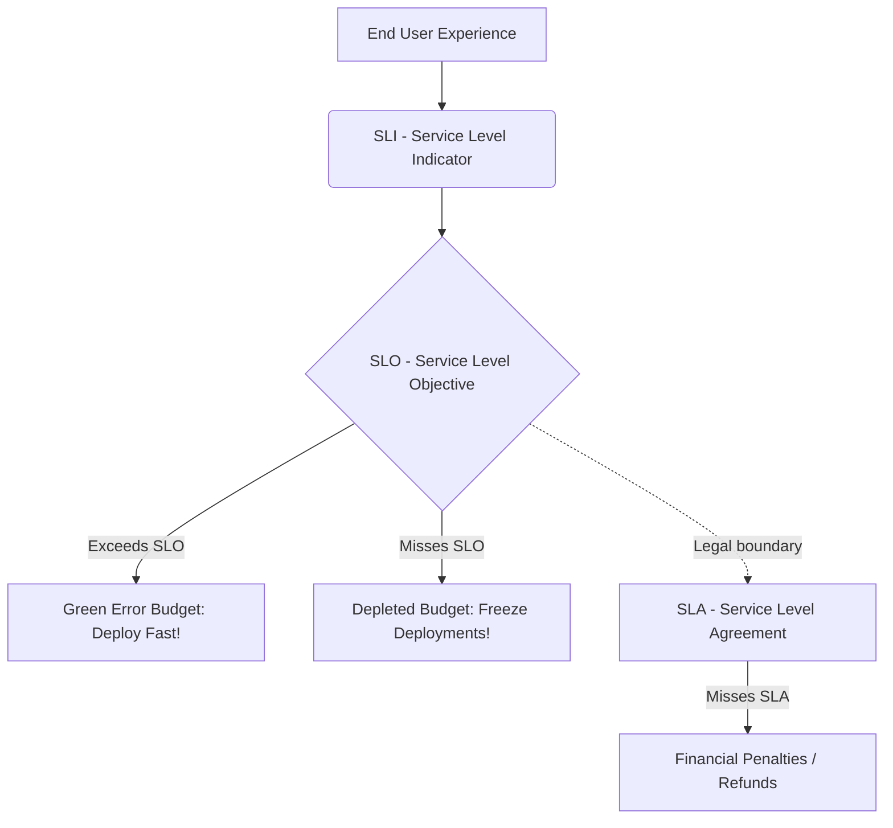
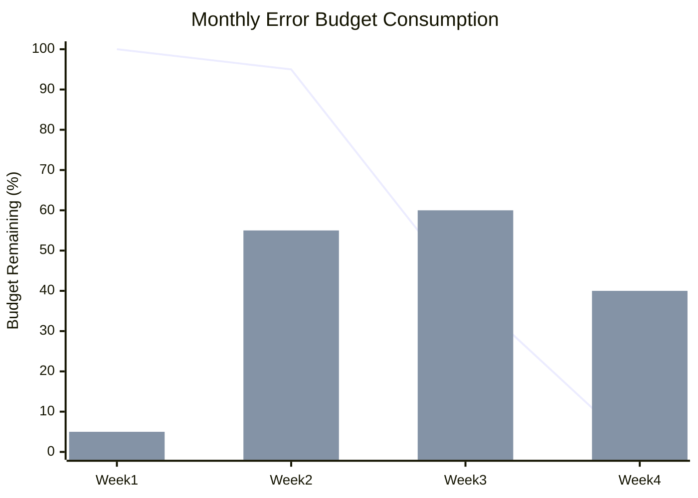
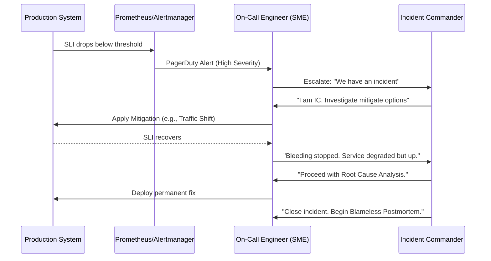

# Chapter 22: Reliability Engineering

## 1. Why This Matters

In the world of distributed systems, failures are not anomalies; they are an absolute certainty. Disks crash, networks partition, memory leaks occur, configuration files get corrupted, and human operators make mistakes. The fundamental challenge of a distributed system is not just building it to handle high throughput or massive scale, but engineering it to remain functional despite the continuous and inevitable failure of its underlying components.

This is why **Reliability Engineering** matters. If a system is not reliable, its scalability, performance, and feature set are completely irrelevant. Users do not care how elegant your consensus algorithm is if they cannot access their data. Businesses do not care about microsecond latency optimizations if the shopping cart checkout process fails 5% of the time. 

Reliability has direct, measurable business impacts:
- **Revenue Loss**: Every minute of downtime in an e-commerce platform during peak hours translates to millions of dollars in lost sales. 
- **Reputational Damage**: A major outage erodes customer trust. In highly competitive markets, users will simply migrate to a competitor.
- **Operational Costs**: Unreliable systems require constant human intervention (firefighting), which leads to burnout, high turnover, and massive engineering costs that could otherwise be spent on feature development.

The traditional approach to IT operations treated development and operations as two separate silos: developers threw code over the wall, and operators were responsible for keeping it running. This created misaligned incentives, where developers were incentivized to push changes fast, and operators were incentivized to block changes to maintain stability. **Site Reliability Engineering (SRE)**, pioneered by Google, fundamentally rewrote this paradigm. It applies software engineering principles to operations, treating reliability as a mathematical and engineering problem rather than a manual labor problem.

In this chapter, we will dive deep into the philosophy, metrics, practices, and implementation details of building highly reliable distributed systems.

---

## 2. Beginner Intuition

Imagine you are buying a car. You expect this car to perform its primary function: getting you from point A to point B. 

However, no car is perfect. Sometimes the battery dies, sometimes you get a flat tire, and sometimes the engine needs a massive overhaul. 
- If the car starts successfully 99% of the time, that means roughly 3-4 days out of the year, you will be stranded in your driveway unable to get to work. For most people, a car that fails to start 3 days a year is considered highly unreliable.
- If the car starts 99.999% of the time, it means you will only experience about 5 minutes of failure over an entire year.

In distributed systems, we measure reliability similarly, often counting the "nines." But how do we define "starting successfully"? For a web service, does it mean the homepage loads? Does it mean the user can log in? Does it mean the search results return in under 200 milliseconds? 

Reliability engineering is the process of defining exactly what "working correctly" means for your specific application, measuring how often you achieve that standard, and mathematically balancing the risk of making changes (deploying new features) against the risk of breaking that reliability. 

Think of it like a monthly allowance. Your parents give you $100 a month to spend on whatever you want (an **Error Budget**). If you spend it wisely, you can have fun (deploy new features rapidly). But if you blow through your $100 in the first week because you bought something reckless (a buggy deployment that caused an outage), you are grounded for the rest of the month (code freezes, focusing only on stability) until your budget resets. 

---

## 3. Core Theory

To engineer reliability, we must formalize our definitions. Reliability cannot be based on "gut feelings"; it must be quantified.

### 3.1 What is Reliability?

**Reliability** is formally defined as the probability that a system will perform its required function under specified conditions for a specified period of time. 

**Availability** is closely related but slightly different. Availability is the proportion of time a system is in a functioning condition. If a system is highly reliable, it doesn't fail often. If a system is highly available, it is up when you need it (which could mean it fails often but recovers instantaneously).

### 3.2 MTBF, MTTR, and MTTD

Three critical metrics define the lifecycle of a failure:

- **MTBF (Mean Time Between Failures)**: The average time a system runs continuously without failing. Higher MTBF means higher reliability. 
  `MTBF = Total Uptime / Number of Failures`
  
- **MTTR (Mean Time To Recovery / Repair)**: The average time it takes to fully restore a system after a failure has occurred. Lower MTTR means higher availability. 
  `MTTR = Total Downtime / Number of Failures`

- **MTTD (Mean Time To Detect)**: The average time it takes for the team or automated systems to realize that a failure has occurred. Lower MTTD is crucial for lowering MTTR.

Mathematically, Availability ($A$) can be expressed as:
$$ A = \frac{MTBF}{MTBF + MTTR} $$

Notice the implication of this formula: You can achieve high availability by either increasing MTBF (making the system break less often) or by drastically decreasing MTTR (recovering from failures so fast that users barely notice). Modern distributed systems focus heavily on **optimizing MTTR** because preventing all failures (infinite MTBF) is physically impossible in large-scale cloud environments.

### 3.3 The SRE Model: SLIs, SLOs, and SLAs

Google introduced a codified vocabulary for measuring reliability:

1. **Service Level Indicator (SLI)**
   An SLI is a carefully defined quantitative measure of some aspect of the level of service that is provided. 
   - **Example**: The proportion of HTTP GET requests to the `/login` endpoint that return a 200 OK status code within 300 milliseconds. 
   - Good SLIs always measure the *user's* experience. CPU utilization is not a good SLI because a user doesn't care if your CPU is at 99%, as long as their request succeeds fast.

2. **Service Level Objective (SLO)**
   An SLO is a target value or range of values for a service level that is measured by an SLI. 
   - **Example**: 99.9% of all HTTP GET requests to `/login` over a 30-day rolling window will return 200 OK within 300ms.
   - SLOs represent the internal goal. If the system drops below the SLO, internal actions (like halting deployments) are taken.

3. **Service Level Agreement (SLA)**
   An SLA is an explicit or implicit contract with your users that includes consequences of meeting (or missing) the SLOs. 
   - **Example**: If we fail to meet 99.9% availability for the month, we will refund 10% of the customer's monthly bill.
   - SLAs are typically defined by the business/legal teams, not engineers. The SLO should always be stricter than the SLA. If your SLA promises 99.9%, your internal SLO should be 99.95% so you have an internal warning before you start owing customers money.

---

## 4. Architecture Deep Dive

Let us dissect the architectural implementations of these reliability principles.

### 4.1 Error Budgets

An **Error Budget** is simply $100\% - \text{SLO}$. If your SLO is 99.9% availability, your error budget is 0.1%. 
If you process 10,000,000 requests in a month, an error budget of 0.1% means you are "allowed" to fail 10,000 requests. 

**Why have an error budget?**
100% reliability is the wrong target. As you approach 100%, the cost of adding another "nine" (e.g., going from 99.99% to 99.999%) increases exponentially. At a certain point, the network between the user and your ISP will fail more often than your system, rendering your extreme reliability invisible to the end user.
Instead, use the error budget to balance reliability with feature velocity. 

**How to spend it:**
- **Green Budget**: If you have plenty of error budget left for the month, deploy rapidly. Take risks. Run chaos experiments in production. 
- **Exhausted Budget**: If you blow your error budget, an **Error Budget Policy** kicks in. All feature deployments are frozen. Engineering effort is 100% redirected to reliability, bug fixes, and paying down technical debt until the budget replenishes.

### 4.2 Toil Elimination

**Toil** is defined by Google as work that is manual, repetitive, automatable, tactical, devoid of enduring value, and scales linearly as a service grows. 
- Example of toil: Manually creating user accounts, SSHing into a server to clear disk space, manually running database backups.
- Example of non-toil (engineering): Writing a script to automate database backups, architecting a new microservice.

SRE principles dictate that a team's time spent on toil must be capped at 50%. If toil exceeds 50%, the system is fundamentally unscalable because hiring humans scales linearly with traffic. The architectural solution is to build self-healing automation.

### 4.3 Incident Management Lifecycle

When failures occur, how does the architecture of the human organization respond? 

1. **Detection**: Monitoring systems (Prometheus/Datadog) detect an SLI violation and page the on-call engineer.
2. **Response**: The Incident Commander (IC) takes charge. They do not fix the bug; they coordinate the response, ensuring communication and delegating tasks to Subject Matter Experts (SMEs).
3. **Mitigation**: The goal is to stop the bleeding. Roll back the deployment, route traffic to a secondary region, or disable a non-critical feature. **Do not root-cause during mitigation.** Your goal is minimizing MTTR.
4. **Resolution**: Finding the true cause and implementing a permanent fix.
5. **Postmortem**: The most critical step. A blameless written record of the incident, its timeline, the root cause, and concrete action items to prevent it from *ever* happening again. **Blameless** means assuming everyone acted with the best information they had at the time. You cannot fire your way to reliable systems.

### 4.4 Capacity Planning

Capacity planning ensures the system has enough physical/virtual resources to handle expected and unexpected traffic.
Architectural strategies include:
- **Load Testing**: Simulating peak traffic.
- **N+1 Redundancy**: Always having at least one more server/zone/region than mathematically necessary to handle the load, so that if one fails, the remaining $N$ can absorb the traffic without saturation.
- **Graceful Degradation**: When capacity is breached, the system should shed non-critical load (e.g., Netflix stops showing personalized recommendations but still allows video playback).

### 4.5 Chaos Engineering

Chaos engineering is the discipline of experimenting on a system in order to build confidence in the system's capability to withstand turbulent conditions in production. You proactively inject failures to verify that your automated recovery mechanisms actually work.

### 4.6 Disaster Recovery (DR)

DR plans for catastrophic failures (a meteor hits your AWS region).
- **RPO (Recovery Point Objective)**: How much data are you willing to lose? (e.g., RPO = 5 minutes means backups must happen at least every 5 minutes).
- **RTO (Recovery Time Objective)**: How long can the system be down before the business collapses? (e.g., RTO = 2 hours means the system must be restored within 2 hours).

---

## 5. Visual Diagrams

### 5.1 SLI, SLO, and SLA Relationship



### 5.2 Error Budget Consumption


*(In this chart, a massive incident in Week 3 blows through the error budget, dropping the remaining budget to 40%, and by Week 4 it hits 0%, triggering a feature freeze).*

### 5.3 Incident Response Workflow



### 5.4 Chaos Engineering Pipeline

```mermaid
flowchart LR
    A[Steady State defined] --> B[Hypothesis formulated]
    B --> C[Run Experiment (Inject Fault)]
    C --> D{Did system recover?}
    D -- Yes --> E[Confidence Increased. Automate Test.]
    D -- No --> F[Vulnerability found!]
    F --> G[Fix systemic issue]
    G --> A
```

---

## 6. Real Production Examples

### 6.1 Google SRE Practices
Google literally wrote the book on SRE. When a Google service exceeds its error budget, the SRE team "hands back the pager" to the development team. This means developers must carry the pager and handle operations until they fix the reliability issues. This creates a perfect feedback loop: developers feel the pain of their buggy code directly, instantly motivating them to prioritize stability.

### 6.2 Netflix Chaos Monkey and the Simian Army
Netflix operates entirely on AWS. Early on, they realized that VMs in the cloud disappear unpredictably. Instead of trying to prevent AWS instances from dying, they wrote a script called **Chaos Monkey** that randomly terminates production instances during business hours. 
Because developers knew Chaos Monkey was running, they were forced to build their microservices to be stateless and resilient to sudden node death. Netflix expanded this into the **Simian Army**:
- **Latency Monkey**: Injects network delays.
- **Chaos Gorilla**: Drops an entire AWS Availability Zone.
- **Chaos Kong**: Drops an entire AWS Region (e.g., us-east-1).

### 6.3 Amazon's GameDay
Amazon uses "GameDays" to test their disaster response. A senior engineer will secretly orchestrate a massive, simulated failure in a staging or production-like environment. The on-call teams do not know it's a drill until they successfully mitigate it. It tests the runbooks, the alerting, and the human communication under stress.

### 6.4 Facebook's Storm (Project DiRT)
Facebook routinely runs global disaster recovery drills. In one infamous exercise, they completely disconnected their massive data center in Oregon from the internet without prior warning to the general engineering org, just to prove that global traffic routing would successfully shift the load to other data centers across the world.

---

## 7. Java Implementations

Let us examine how to implement these reliability concepts in code using Java, Spring Boot, Micrometer, and Resilience4j.

### 7.1 SLO Monitoring Implementation with Micrometer

To track SLIs, we need granular metrics. Let's create an interceptor that measures HTTP request latency and status codes, outputting them to Prometheus so we can calculate an SLO of "99% of requests under 200ms".

```java
package com.distributed.reliability.metrics;

import io.micrometer.core.instrument.MeterRegistry;
import io.micrometer.core.instrument.Timer;
import org.springframework.stereotype.Component;
import org.springframework.web.servlet.HandlerInterceptor;
import javax.servlet.http.HttpServletRequest;
import javax.servlet.http.HttpServletResponse;
import java.time.Duration;

@Component
public class SloMetricsInterceptor implements HandlerInterceptor {

    private final MeterRegistry meterRegistry;

    public SloMetricsInterceptor(MeterRegistry meterRegistry) {
        this.meterRegistry = meterRegistry;
    }

    @Override
    public boolean preHandle(HttpServletRequest request, HttpServletResponse response, Object handler) {
        request.setAttribute("startTime", System.currentTimeMillis());
        return true;
    }

    @Override
    public void afterCompletion(HttpServletRequest request, HttpServletResponse response, Object handler, Exception ex) {
        long startTime = (long) request.getAttribute("startTime");
        long duration = System.currentTimeMillis() - startTime;
        
        String uri = request.getRequestURI();
        String status = String.valueOf(response.getStatus());

        // Publish to Prometheus with SLO buckets
        Timer.builder("http.server.requests.slo")
             .description("Tracks HTTP requests for SLO calculation")
             .tag("uri", uri)
             .tag("status", status)
             // We specifically want to track buckets to calculate the 99th percentile against our 200ms threshold
             .publishPercentileHistogram()
             .minimumExpectedValue(Duration.ofMillis(10))
             .maximumExpectedValue(Duration.ofMillis(1000))
             // Explicit bucket for our 200ms SLO
             .serviceLevelObjectives(Duration.ofMillis(200))
             .register(meterRegistry)
             .record(Duration.ofMillis(duration));
    }
}
```

### 7.2 Error Budget Calculator Service

Imagine an internal dashboard service that continuously tracks your error budget. 

```java
package com.distributed.reliability.budget;

import org.springframework.stereotype.Service;
import java.math.BigDecimal;
import java.math.RoundingMode;

@Service
public class ErrorBudgetCalculator {

    private static final double SLO_TARGET = 99.9; // 99.9% availability
    private static final double MONTHLY_WINDOW_MINUTES = 30 * 24 * 60; // 43,200 minutes
    
    /**
     * Calculates the maximum allowed downtime in minutes for the month based on the SLO.
     */
    public double calculateAllowedDowntimeMinutes() {
        double errorBudgetPercent = 100.0 - SLO_TARGET;
        return (errorBudgetPercent / 100.0) * MONTHLY_WINDOW_MINUTES; // e.g., 43.2 minutes
    }

    /**
     * Calculates the remaining error budget percentage.
     * @param actualDowntimeMinutes The total minutes the system was degraded this month.
     * @return Percentage of error budget remaining (0 to 100).
     */
    public double calculateRemainingBudget(double actualDowntimeMinutes) {
        double allowedDowntime = calculateAllowedDowntimeMinutes();
        if (actualDowntimeMinutes >= allowedDowntime) {
            return 0.0; // Budget exhausted! Freeze deployments.
        }
        
        double remaining = ((allowedDowntime - actualDowntimeMinutes) / allowedDowntime) * 100;
        return BigDecimal.valueOf(remaining).setScale(2, RoundingMode.HALF_UP).doubleValue();
    }
}
```

### 7.3 Application-Level Chaos Injection (Mini Chaos Monkey)

You can build a small chaos engineering tool directly into your Spring Boot application to test how dependent microservices handle latency and failure.

```java
package com.distributed.reliability.chaos;

import org.slf4j.Logger;
import org.slf4j.LoggerFactory;
import org.springframework.beans.factory.annotation.Value;
import org.springframework.stereotype.Component;
import java.util.Random;

@Component
public class ChaosInterceptor {

    private static final Logger log = LoggerFactory.getLogger(ChaosInterceptor.class);
    private final Random random = new Random();

    @Value("${chaos.enabled:false}")
    private boolean chaosEnabled;

    @Value("${chaos.latency.probability:0.1}") // 10% chance
    private double latencyProbability;

    @Value("${chaos.error.probability:0.05}") // 5% chance
    private double errorProbability;

    public void injectChaos() {
        if (!chaosEnabled) return;

        double roll = random.nextDouble();

        // Inject Error (500 Internal Server Error)
        if (roll < errorProbability) {
            log.warn("CHAOS MONKEY: Injecting artificial 500 error!");
            throw new RuntimeException("Simulated Chaos Exception");
        }

        // Inject Latency
        if (roll < (errorProbability + latencyProbability)) {
            long delay = 500 + random.nextInt(2000); // 500ms to 2.5s delay
            log.warn("CHAOS MONKEY: Injecting artificial latency of {} ms", delay);
            try {
                Thread.sleep(delay);
            } catch (InterruptedException e) {
                Thread.currentThread().interrupt();
            }
        }
    }
}
```
*(You would call `injectChaos()` at the entry point of your service layer to test system resilience).*

### 7.4 Self-Healing with Resilience4j Circuit Breaker

To survive the chaos, systems must use Circuit Breakers to fail fast and shed load.

```java
package com.distributed.reliability.resilience;

import io.github.resilience4j.circuitbreaker.annotation.CircuitBreaker;
import org.springframework.stereotype.Service;
import org.springframework.web.client.RestTemplate;

@Service
public class DownstreamServiceClient {

    private final RestTemplate restTemplate;

    public DownstreamServiceClient(RestTemplate restTemplate) {
        this.restTemplate = restTemplate;
    }

    @CircuitBreaker(name = "inventoryService", fallbackMethod = "fallbackInventory")
    public String checkInventory(String productId) {
        // If the downstream service is failing or slow, the circuit breaker opens.
        return restTemplate.getForObject("http://inventory-service/api/v1/stock/" + productId, String.class);
    }

    // Fallback method must have the same signature + Throwable
    public String fallbackInventory(String productId, Throwable t) {
        // Graceful degradation: return a cached response or a safe default
        return "{\"productId\": \"" + productId + "\", \"stock\": \"UNKNOWN_BUT_AVAILABLE\"}";
    }
}
```

---

## 8. Performance Analysis

Adding observability, tracing, and reliability mechanisms is not free. There are inherent performance costs:
- **Metrics Overhead**: Pushing millions of high-cardinality metrics (like tracking latency per user ID) will consume immense memory and CPU in the application and overwhelm the Prometheus server. This is why we use Histograms and percentiles rather than tracking every individual request.
- **Tracing Overhead**: Distributed tracing (e.g., OpenTelemetry, Jaeger) can add significant network I/O overhead. In production, we typically use **probabilistic sampling**, capturing only 1% to 10% of requests to minimize the performance impact while maintaining statistical significance.
- **Circuit Breaker Cost**: State machines managing circuit breakers require synchronized state changes. Libraries like Resilience4j are heavily optimized using concurrent data structures (like `LongAdder`) to ensure the circuit breaker does not become a performance bottleneck itself.

---

## 9. Tradeoffs

Reliability engineering is entirely a study of tradeoffs. 

### Reliability vs. Feature Velocity
You can make a system 100% reliable by never deploying new code, turning off write access, and serving only cached static data. But then the business fails because it cannot innovate. Error budgets are the mathematical solution to this tradeoff.

### The Cost of Nines
- **99% Availability**: 3.65 days of downtime/year. Easily achievable with a single server and decent backups.
- **99.9% Availability ("Three Nines")**: 8.7 hours of downtime/year. Requires active redundancy, automated failover, and basic SRE practices.
- **99.99% Availability ("Four Nines")**: 52.6 minutes of downtime/year. Requires multi-AZ deployments, strict zero-downtime CI/CD pipelines, chaos engineering, and excellent on-call operations. Cost is very high.
- **99.999% Availability ("Five Nines")**: 5.26 minutes of downtime/year. Requires multi-region active-active databases, custom hardware redundancy, specialized routing. Cost is astronomical.

**Tradeoff Rule of Thumb**: Do not engineer for five nines if your users only expect three nines. It is a massive waste of capital.

---

## 10. Failure Scenarios

SREs are obsessed with what can go wrong. Here are classic scenarios:

1. **The Retry Storm (Thundering Herd)**
   - *Scenario*: Service A calls Service B. Service B has a brief 5-second network blip. Service A has a hardcoded retry loop that retries failed requests instantly without delay. 1,000 instances of Service A simultaneously blast Service B with 10x the normal traffic. Service B recovers from the network blip but is instantly crushed by the retries and goes down via Out-Of-Memory (OOM).
   - *SRE Fix*: Implement **Exponential Backoff and Jitter** on all retries.

2. **Alert Fatigue**
   - *Scenario*: An organization sets CPU alerts to page on-call engineers anytime a server hits 80% CPU. This happens 15 times a day. Engineers get used to acknowledging and ignoring it. One day, the 80% CPU is actually caused by a massive distributed denial of service (DDoS) attack, but the engineer ignores the page.
   - *SRE Fix*: Alert only on **SLI violations** (User pain), never on internal metrics alone.

3. **Cascading Failures due to Shared State**
   - *Scenario*: A primary database crashes. The automated system fails over to a replica. However, the system failed to drop the DNS TTL, so half the application servers continue trying to write to the dead primary, resulting in split-brain data corruption.
   - *SRE Fix*: Strong consensus algorithms (ZooKeeper, etcd) for leader election, and strict fencing tokens to isolate dead leaders.

---

## 11. Debugging & Observability

To achieve low MTTR, you must have exceptional observability. Google defines the **Four Golden Signals**:

1. **Latency**: The time it takes to service a request (distinguish between successful and failed requests).
2. **Traffic**: A measure of how much demand is being placed on the system (e.g., HTTP requests/second).
3. **Errors**: The rate of requests that fail (e.g., HTTP 500s, or "200 OK" responses that return corrupt payloads).
4. **Saturation**: How "full" your service is. A measure of your system fraction, emphasizing the resources that are most constrained (e.g., CPU, memory, I/O bandwidth, database connection pool exhaustion).

**Dashboards vs. Alerting**: 
- **Dashboards** are for human exploration during an incident to find the root cause (Debugging).
- **Alerts** are automated triggers to wake up a human when the system is broken. Do not use dashboards for alerting; nobody should be staring at a screen waiting for a line to drop.

---

## 12. Interview Questions

### Beginner
**Q: What is the difference between an SLO and an SLA?**
*A: An SLO (Service Level Objective) is an internal target set by engineering for system reliability (e.g., 99.9%). An SLA (Service Level Agreement) is a business contract with customers that dictates penalties or refunds if reliability drops below a certain threshold (e.g., 99.5%). SLOs should always be stricter than SLAs.*

### Intermediate
**Q: Explain how an Error Budget dictates deployment strategy.**
*A: The Error Budget is the remaining allowable downtime (100% - SLO). If a team has a positive error budget, they are encouraged to deploy rapidly and innovate. If the error budget hits zero, all feature deployments are halted, and the team must strictly focus on reliability and stability until the budget replenishes (typically over a rolling 30-day window).*

### Advanced (FAANG Level)
**Q: Your microservice architecture is experiencing cascading failures under heavy load. A downstream service fails, and upstream services block waiting for it, exhausting thread pools. Walk me through the architectural changes you would implement to prevent this.**
*A: 1. Implement strict Timeouts on all network calls. 2. Implement Circuit Breakers to fail-fast and prevent resource exhaustion. 3. Use Bulkheads to isolate thread pools so a failure in one downstream dependency doesn't consume all Tomcat threads. 4. Implement graceful degradation and fallback responses. 5. Introduce load shedding at the API Gateway to reject traffic before it hits internal services if saturation is reached. 6. Verify via Chaos Engineering.*

---

## 13. Exercises

1. **Conceptual Exercise**: Define SLIs for a video streaming service (like Netflix). Identify the metric, the measurement point, and a proposed SLO.
   *Hint: Consider time-to-first-byte for video playback, and error rates for the recommendation engine. Are they equally critical?*

2. **Mathematical Exercise**: A service has an SLO of 99.95% over a 30-day window. How many minutes of downtime are permitted? If an incident causes a total outage for 15 minutes, what percentage of the error budget remains?

3. **Coding Exercise**: Extend the `ErrorBudgetCalculator` Java class provided in Section 7. Modify it to use a sliding 28-day window instead of a fixed 30-day window, and integrate it with a mocked database of incident logs to dynamically calculate the budget in real-time.

---

## 14. Expert Insights

In industry, the hardest part of Reliability Engineering is almost never the technology—it is the **culture**.

Many companies declare they are "adopting SRE" by simply renaming their System Administrators to "Site Reliability Engineers" without changing any core processes. This is an anti-pattern known as "SRE in Name Only."

True SRE requires executive buy-in. When the error budget is exhausted, product managers *will* scream that their new feature must be launched. If the VP of Engineering overrides the error budget policy to push the feature, the SRE model is broken. The error budget must have teeth. 

Furthermore, **Blameless Postmortems** are incredibly difficult for humans to execute. Human nature wants a scapegoat. The phrase "The system went down because Dave pushed a bad config" is toxic. The expert mindset is: "The system went down because our CI/CD pipeline allowed a human to push an unverified config to production without canary testing." You fix the pipeline, you don't fire Dave.

Finally, experts know that **MTTD (Mean Time To Detect) is the silent killer**. If an outage takes 40 minutes to fix, but it took 35 minutes for a customer to complain on Twitter because your monitoring missed it, your observability stack is the actual problem.

---

## 15. Chapter Summary

- **Reliability** is the most critical feature of any distributed system.
- **SRE (Site Reliability Engineering)** treats operations as a software engineering problem.
- **SLIs** (Indicators) measure user pain. **SLOs** (Objectives) are internal targets. **SLAs** (Agreements) are business contracts.
- **Error Budgets** balance feature velocity against system stability. If the budget runs out, deployments stop.
- **Toil** (manual, repetitive work) must be automated away, capped at a maximum of 50% of an engineer's time.
- **Incident Management** relies on distinct roles (Incident Commander, SMEs) and emphasizes MTTR reduction followed by Blameless Postmortems.
- **Chaos Engineering** intentionally breaks production systems to verify that automated self-healing mechanisms function correctly.
- **Observability** (Latency, Traffic, Errors, Saturation) is non-negotiable for low MTTR and maintaining high-nines availability.
- The ultimate goal is not zero downtime, but a mathematically optimized balance between innovation and stability.
