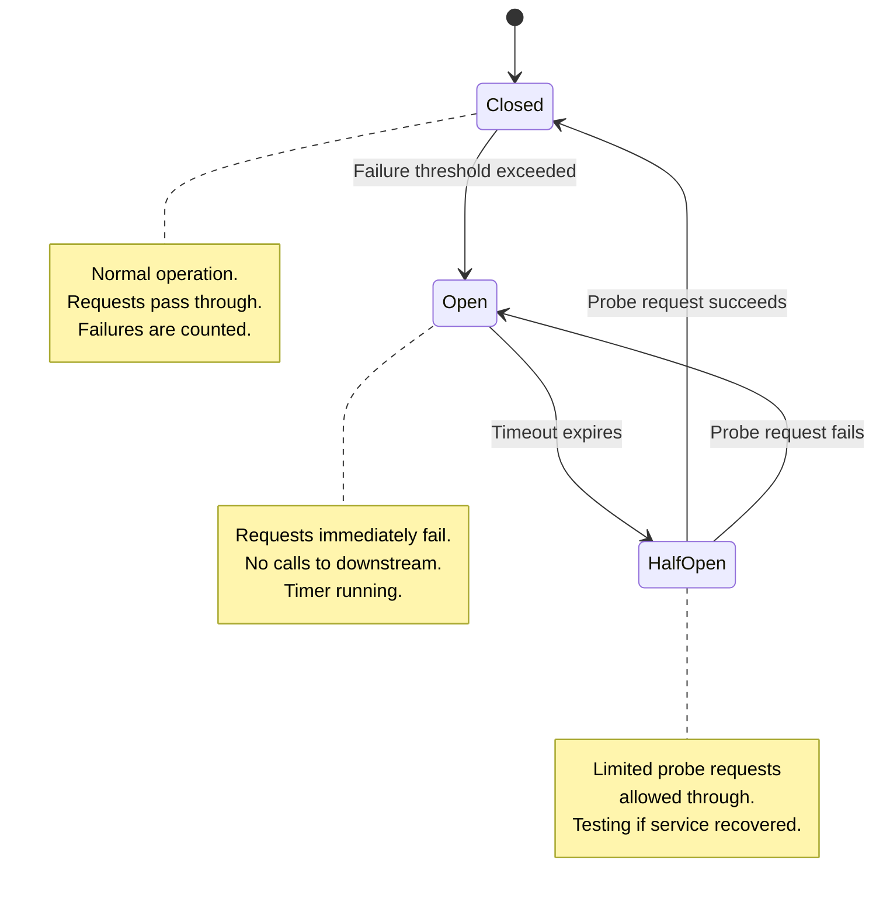
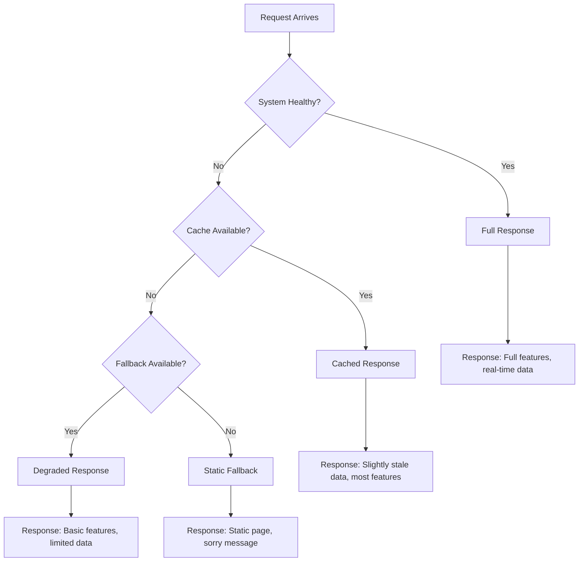
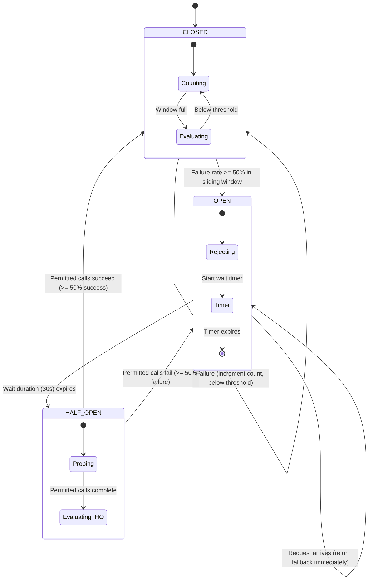
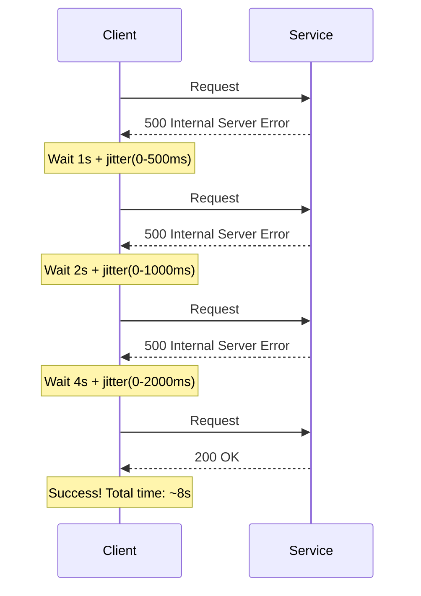
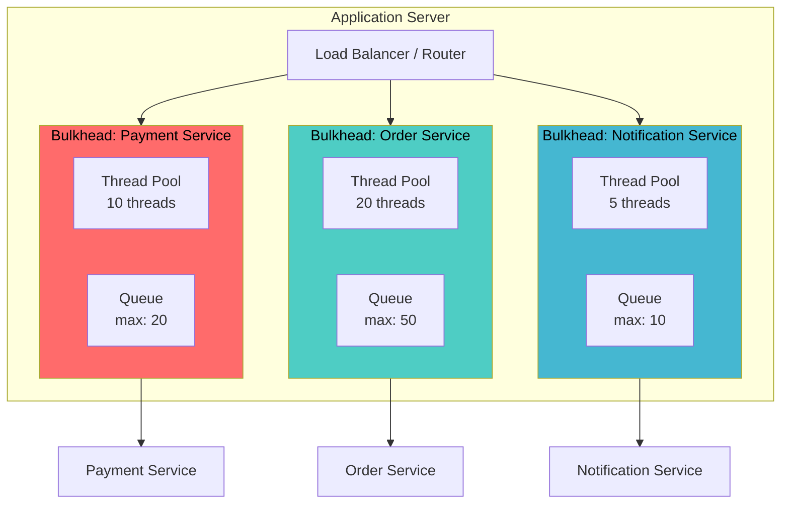
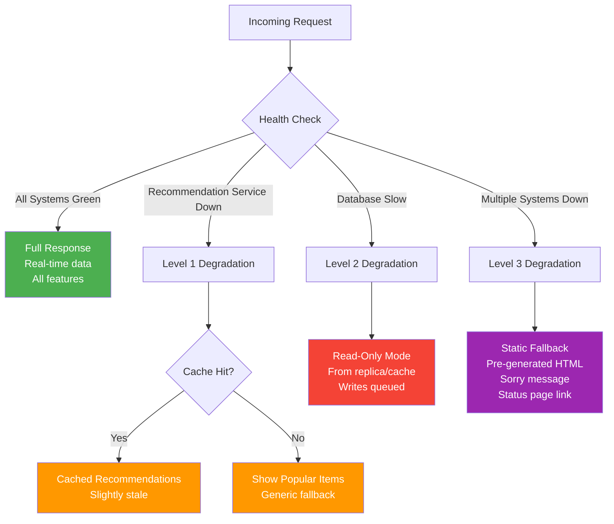
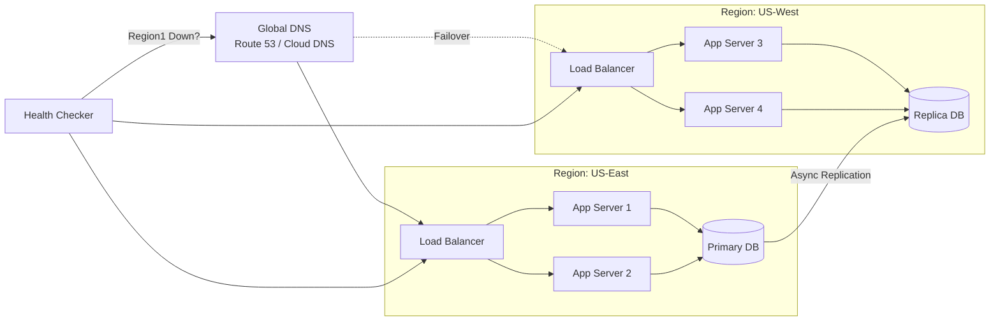
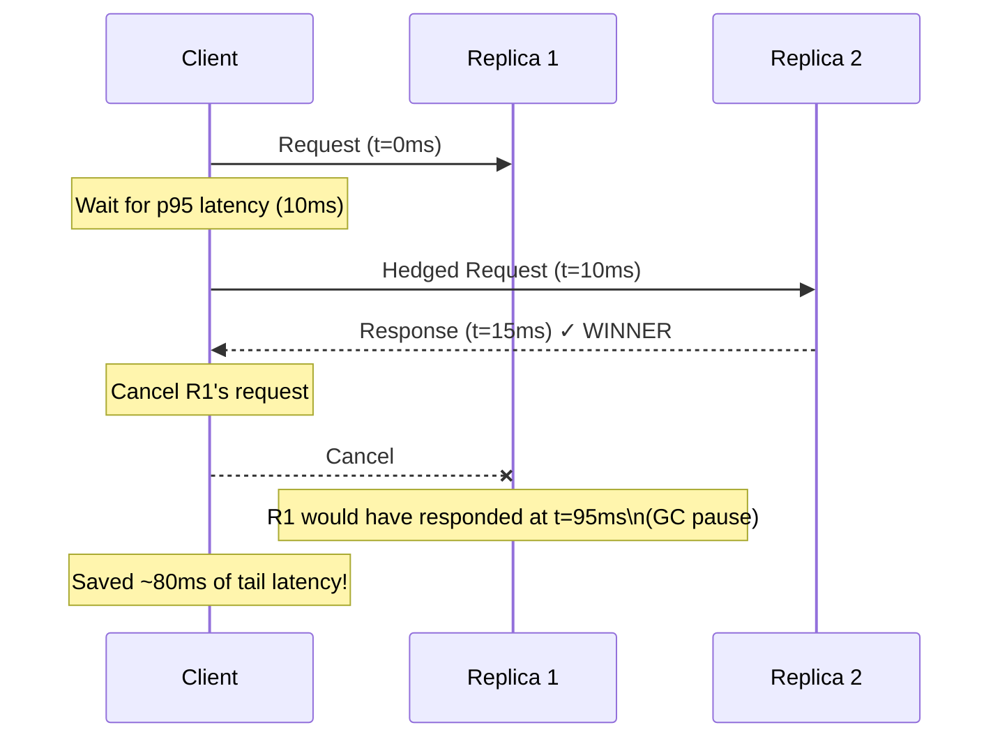

# Chapter 23: Fault Tolerance

---

## 1. Why This Matters

In the world of distributed systems, failure is not a possibility — it is a certainty. Hard drives will fail, networks will partition, processes will crash, and entire data centers will go dark. The question is never *if* something will fail, but *when*, and more importantly — **how will your system respond?**

Fault tolerance is the discipline of designing systems that continue to operate correctly even when components fail. It is the single most important non-functional requirement for any production distributed system. Without fault tolerance:

- **A single server crash takes down your entire payment processing pipeline**, costing millions in lost revenue per hour.
- **A network blip causes cascading failures** across dozens of microservices, turning a minor hiccup into a full-scale outage.
- **A slow database query exhausts all threads** in your application server, making it completely unresponsive to even simple health checks.
- **A retry storm from thousands of clients** overwhelms a recovering service, preventing it from ever coming back online.

### Industry Relevance

Every major tech company has learned fault tolerance lessons the hard way:

| Company | Incident | Root Cause | Impact |
|---------|----------|------------|--------|
| **Amazon** (2017) | S3 outage | Human error + cascading failure | Half the internet went down for 4 hours |
| **Facebook** (2021) | 6-hour global outage | BGP misconfiguration + lack of OOB access | $60M+ revenue loss |
| **Google** (2020) | Gmail/YouTube outage | Authentication service failure | 47 minutes of global unavailability |
| **Cloudflare** (2019) | Global outage | Bad regex in WAF rule | 27 minutes, millions of sites affected |
| **Netflix** (2012) | Christmas Eve outage | AWS ELB failure in US-East | Streaming unavailable during peak hours |

These incidents drove the creation of sophisticated fault tolerance patterns that we now consider industry best practices. Netflix built Hystrix. Google designed cell-based architectures. Amazon invented the blast radius concept. Each pattern in this chapter was born from production pain.

### System Design Interview Relevance

Fault tolerance questions appear in virtually every system design interview:

- *"How would you design a payment system that handles failures?"* → Idempotency, retry patterns, circuit breakers
- *"What happens when one of your microservices goes down?"* → Graceful degradation, fallbacks, bulkheads
- *"How do you prevent cascading failures?"* → Circuit breakers, timeouts, load shedding
- *"Design a system with 99.99% availability"* → Redundancy, failover, hedged requests

Understanding fault tolerance deeply separates senior engineers from junior ones. It's the difference between building a demo that works on your laptop and building a system that serves millions of users reliably.

---

## 2. Beginner Intuition

### The Hospital Analogy

Think of a distributed system like a large hospital:

**Faults are like injuries.** A doctor getting sick is a fault — something went wrong with one component. The hospital doesn't shut down because one doctor is sick. Other doctors cover their shifts. This is *fault tolerance*.

**Errors are like symptoms.** The sick doctor's patients notice longer wait times. The error is visible — service quality has degraded — but the hospital is still operating.

**Failures are when the hospital closes.** If *every* doctor gets sick and there are no replacements, the hospital fails. The entire system stops functioning.

### The Electrical Grid Analogy

Your home's electrical system is a masterclass in fault tolerance:

```
                    Power Grid
                       │
            ┌──────────┼──────────┐
            │          │          │
        Generator   Generator   Generator     ← REDUNDANCY
            │          │          │
            └──────────┼──────────┘
                       │
                  Transformer
                       │
              ┌────────┼────────┐
              │        │        │
           Circuit  Circuit  Circuit           ← BULKHEADS
           Breaker  Breaker  Breaker
              │        │        │
           Kitchen  Bedroom  Living Room
```

- **Multiple generators** feed the grid (redundancy)
- **Circuit breakers** prevent a short circuit in the kitchen from affecting the bedroom (isolation)
- **Fuses** blow to protect equipment (fail-fast)
- **Backup generators** kick in during power outages (failover)
- **UPS systems** provide power during the switchover (graceful degradation)

Every pattern in this chapter maps to something in this analogy:

| Electrical Concept | Distributed Systems Pattern |
|---|---|
| Multiple generators | Redundancy, replication |
| Circuit breaker | Circuit breaker pattern |
| Separate circuits | Bulkhead pattern |
| Fuse blowing | Fail-fast, timeout |
| Backup generator | Failover (active-passive) |
| UPS battery | Graceful degradation, cached responses |
| Voltage regulator | Load shedding, rate limiting |

### The Key Insight

> **Fault tolerance is not about preventing failures — it's about designing systems where failures don't matter.**

You cannot prevent a hard drive from failing. You cannot prevent a network cable from being cut. You cannot prevent a data center from losing power. But you *can* design systems where these events are handled automatically, transparently, and without impacting users.

---

## 3. Core Theory

### 3.1 Faults vs Errors vs Failures

Understanding the precise terminology is critical:

```
┌─────────────────────────────────────────────────────────┐
│                    FAULT                                 │
│  The root cause. A defect in the system.                │
│  Example: A disk sector goes bad                        │
│                                                         │
│        ↓ (activation)                                   │
│                                                         │
│                    ERROR                                 │
│  The manifestation. An incorrect system state.          │
│  Example: A read returns corrupted data                 │
│                                                         │
│        ↓ (propagation)                                  │
│                                                         │
│                   FAILURE                                │
│  The observable effect. System deviates from spec.      │
│  Example: User sees wrong account balance               │
└─────────────────────────────────────────────────────────┘
```

**Formal Definitions (Avizienis et al., 2004):**

- **Fault**: The adjudged or hypothesized cause of an error. A fault is *dormant* until it is *activated*.
- **Error**: That part of the system state that may cause a subsequent failure. An error is a *latent* fault manifestation.
- **Failure**: An event that occurs when the delivered service deviates from the correct service. A failure is *observable* by users.

**Classification of Faults:**

| Dimension | Types | Examples |
|-----------|-------|----------|
| **Duration** | Transient, Intermittent, Permanent | Network glitch, Flaky test, Dead disk |
| **Cause** | Hardware, Software, Human | CPU failure, Bug, Misconfiguration |
| **Domain** | Value, Timing | Wrong result, Late response |
| **Behavior** | Crash, Omission, Byzantine | Process dies, Message lost, Arbitrary behavior |

### 3.2 The Fault Hierarchy (Severity Model)

Different fault types require different tolerance mechanisms:

```
          Most Severe
              ▲
              │
    ┌─────────┴─────────┐
    │    Byzantine       │  Node sends arbitrary/malicious messages
    │    Faults          │  (Requires BFT consensus: 3f+1 nodes)
    ├────────────────────┤
    │    Performance     │  Node responds slowly or inconsistently
    │    Faults          │  (Timeouts, hedged requests)
    ├────────────────────┤
    │    Omission        │  Node fails to send/receive messages
    │    Faults          │  (Retries, replication)
    ├────────────────────┤
    │    Crash-Recovery   │  Node crashes but may restart
    │    Faults          │  (WAL, checkpointing, replicas)
    ├────────────────────┤
    │    Crash-Stop      │  Node crashes and never recovers
    │    Faults          │  (Replication: 2f+1 nodes)
    └────────────────────┘
              │
              ▼
          Least Severe
```

**Key insight**: Each level *subsumes* the levels below it. A system that tolerates Byzantine faults automatically tolerates crash faults. But the cost increases dramatically — you need more replicas and more complex protocols.

### 3.3 Redundancy: The Foundation of Fault Tolerance

All fault tolerance ultimately comes down to **redundancy** — having more than you need so that when something fails, the excess capacity absorbs the impact.

#### Hardware Redundancy

| Type | Description | Example | Cost |
|------|-------------|---------|------|
| **Active** | All copies process simultaneously | RAID-1 (mirroring) | High |
| **Passive** | Standby copies activated on failure | Hot/warm/cold standby servers | Medium |
| **N-Modular** | N copies vote on correct output | Triple Modular Redundancy (TMR) | Very High |

**Triple Modular Redundancy (TMR):**

```
    Input ──┬──► Module A ──┐
            │               │
            ├──► Module B ──┼──► Voter ──► Output
            │               │
            └──► Module C ──┘
            
    If Module A produces a wrong result,
    the voter takes the majority (B and C agree).
    System tolerates 1 out of 3 module failures.
```

#### Software Redundancy

- **N-Version Programming**: Multiple independent teams implement the same specification. Different implementations are unlikely to have the same bugs.
- **Recovery Blocks**: Primary algorithm runs first; if its acceptance test fails, a backup algorithm runs.
- **Process Pairs**: Two copies of a process run; if one crashes, the other takes over.

#### Information Redundancy

- **Checksums**: Detect corrupted data (CRC-32, SHA-256)
- **Error-Correcting Codes**: Fix corrupted data (Hamming codes, Reed-Solomon)
- **Replication**: Multiple copies of data across nodes (Raft, Paxos)

#### Time Redundancy

- **Retries**: Repeat an operation that failed due to a transient fault
- **Checkpointing**: Periodically save state; restart from last checkpoint after failure
- **Transaction Rollback**: Undo partial operations and retry

### 3.4 Availability Mathematics

Fault tolerance directly impacts availability. Understanding the math is essential:

**Availability** = MTTF / (MTTF + MTTR)

Where:
- **MTTF** = Mean Time To Failure
- **MTTR** = Mean Time To Repair

| Availability | Downtime/Year | Downtime/Month | Downtime/Week |
|-------------|---------------|----------------|---------------|
| 99% ("two nines") | 3.65 days | 7.31 hours | 1.68 hours |
| 99.9% ("three nines") | 8.77 hours | 43.83 minutes | 10.08 minutes |
| 99.99% ("four nines") | 52.60 minutes | 4.38 minutes | 1.01 minutes |
| 99.999% ("five nines") | 5.26 minutes | 26.30 seconds | 6.05 seconds |
| 99.9999% ("six nines") | 31.56 seconds | 2.63 seconds | 0.60 seconds |

**Series vs Parallel Availability:**

For components in **series** (all must work):
```
A_total = A₁ × A₂ × A₃ × ... × Aₙ
```

Example: Three services each at 99.9% in series:
```
A = 0.999 × 0.999 × 0.999 = 0.997 = 99.7%
```
You've lost a "nine" just by chaining three services!

For components in **parallel** (any one must work):
```
A_total = 1 - (1-A₁) × (1-A₂) × ... × (1-Aₙ)
```

Example: Two replicas each at 99.9% in parallel:
```
A = 1 - (0.001 × 0.001) = 1 - 0.000001 = 99.9999%
```
You've gained three nines through redundancy!

---

## 4. Architecture Deep Dive

### 4.1 Retry Patterns

Retries are the simplest and most fundamental fault tolerance mechanism. When a transient fault causes an operation to fail, simply try again. But naive retries can be devastating.

#### Simple Retry

```
Client ──[Request]──► Service
       ◄──[Error]────
       ──[Request]──► Service    (retry #1)
       ◄──[Error]────
       ──[Request]──► Service    (retry #2)
       ◄──[Success]──
```

**Problem**: If the service is overloaded, immediate retries make it worse. If 1000 clients all retry simultaneously, the service receives 3000 requests instead of 1000.

#### Retry with Exponential Backoff

Instead of retrying immediately, wait progressively longer between retries:

```
Attempt 1: Wait 0ms    (immediate)
Attempt 2: Wait 1000ms (1 second)
Attempt 3: Wait 2000ms (2 seconds)
Attempt 4: Wait 4000ms (4 seconds)
Attempt 5: Wait 8000ms (8 seconds)

Formula: delay = base_delay × 2^(attempt - 1)
```

**Problem**: If 1000 clients all start retrying at the same time with the same backoff, they still all retry at the same instants (retry storms at t=1s, t=3s, t=7s, etc.). This is called the **thundering herd** problem.

#### Retry with Jitter

Add randomness to break up synchronized retries:

```
Full Jitter:
  delay = random(0, base_delay × 2^attempt)

Equal Jitter:
  temp = base_delay × 2^attempt
  delay = temp/2 + random(0, temp/2)

Decorrelated Jitter:
  delay = random(base_delay, previous_delay × 3)
```

AWS's analysis showed that **full jitter** performs best in most scenarios, providing the fastest total completion time with the least work.

```
Without Jitter:          With Full Jitter:
  │                        │
  │ ████                   │ █ █  █   █
  │ ████                   │  █ █  █ █
  │ ████                   │ █  █ █  █
  ──────── time            ──────────── time
  (Thundering herd)        (Spread out)
```

#### Retry Budgets

Instead of configuring retries per-request, set a global retry budget:

> "No more than 10% of requests in the last 30 seconds should be retries."

This prevents retry storms at the system level. Google's gRPC uses this approach:

```
Total requests in window: 1000
Retries allowed: 100 (10% budget)
Retries used: 95
New failure → Can retry (5 retries remaining)

vs.

Total requests in window: 1000
Retries allowed: 100 (10% budget)
Retries used: 100
New failure → Cannot retry (budget exhausted)
```

#### When NOT to Retry

**Critical**: Not all operations are safe to retry!

| Operation | Safe to Retry? | Why? |
|-----------|---------------|------|
| GET /users/123 | ✅ Yes | Idempotent read |
| PUT /users/123 {name: "Alice"} | ✅ Yes | Idempotent update |
| DELETE /orders/456 | ✅ Yes | Idempotent delete (deleting twice = same result) |
| POST /payments {amount: 100} | ❌ NO! | Non-idempotent: may charge twice |
| POST /orders | ❌ NO! | Non-idempotent: may create duplicate orders |

**Exception**: POST operations *can* be safely retried if they use **idempotency keys** (covered in Section 4.7).

Also never retry on:
- **4xx errors** (client errors) — retrying won't fix bad input
- **Authentication failures** — retrying with the same expired token is pointless
- **Business logic errors** — "insufficient funds" won't change on retry

### 4.2 Circuit Breaker Pattern (Detailed)

The circuit breaker pattern prevents a failing service from being overwhelmed with requests, allowing it time to recover. Named after electrical circuit breakers that trip to prevent overload.

#### The Problem It Solves

Without a circuit breaker:

```
Service A ──[req]──► Service B (slow/down)
           wait 30s...
           ◄──[timeout]──
           
Meanwhile:
- Thread in Service A is blocked for 30s
- More requests arrive, more threads blocked
- Service A's thread pool exhausted
- Service A becomes unresponsive
- Services calling A also become unresponsive
- CASCADING FAILURE across the entire system
```

#### Three States



**State Details:**

| State | Behavior | Transition Trigger |
|-------|----------|-------------------|
| **CLOSED** | All requests pass through. Failures are counted in a sliding window. | Failure count or error rate exceeds threshold → OPEN |
| **OPEN** | All requests fail immediately with a fallback response. No calls to downstream service. | Wait timer expires → HALF_OPEN |
| **HALF_OPEN** | A limited number of probe requests are allowed through. | Probe succeeds → CLOSED; Probe fails → OPEN |

#### Configuration Parameters

| Parameter | Description | Typical Value |
|-----------|-------------|---------------|
| `failureRateThreshold` | Error percentage to trip the breaker | 50% |
| `slowCallRateThreshold` | Percentage of slow calls to trip | 80% |
| `slowCallDurationThreshold` | What counts as "slow" | 2 seconds |
| `slidingWindowSize` | Number of calls to evaluate | 100 |
| `slidingWindowType` | COUNT_BASED or TIME_BASED | COUNT_BASED |
| `minimumNumberOfCalls` | Minimum calls before evaluating | 10 |
| `waitDurationInOpenState` | How long to stay open before half-open | 30 seconds |
| `permittedNumberOfCallsInHalfOpenState` | Probe requests in half-open | 5 |

#### Sliding Window Types

**Count-Based**: Evaluates the last N calls
```
Window size = 5
Calls: [✓] [✓] [✗] [✗] [✗]  → 60% failure → TRIP!
```

**Time-Based**: Evaluates calls in the last N seconds
```
Window = 10 seconds
Last 10s: 20 calls, 12 failures → 60% failure → TRIP!
```

### 4.3 Bulkhead Pattern

Named after the watertight compartments in a ship's hull. If one compartment floods, the others remain sealed, and the ship stays afloat.

```
Ship without bulkheads:          Ship with bulkheads:
┌──────────────────────┐         ┌──────┬──────┬──────┐
│ ~~~~WATER~~~~~~~~    │         │ ~~~~ │      │      │
│ ~~~~WATER~~~~~~~~    │         │ WATER│      │      │
│ ~~~~WATER~~~~~~~~    │         │ ~~~~ │      │      │
└──────────────────────┘         └──────┴──────┴──────┘
      SHIP SINKS!                  Ship stays afloat!
```

In software, bulkheads isolate components so that a failure in one doesn't consume all resources and bring down the entire system.

#### Thread Pool Bulkhead

Each downstream service gets its own dedicated thread pool:

```
┌─────────────────────────────────────────────┐
│                Application                   │
│                                              │
│  ┌──────────────┐  ┌──────────────┐         │
│  │ Payment Pool │  │  Order Pool  │         │
│  │ (10 threads) │  │ (20 threads) │         │
│  │ ■ ■ ■ ■ ■    │  │ ■ ■ ■ ■ ■    │         │
│  │ ■ ■ ■ ■ ■    │  │ ■ ■ ■ ■ ■    │         │
│  │              │  │ ■ ■ ■ ■ ■    │         │
│  └──────┬───────┘  │ ■ ■ ■ ■ ■    │         │
│         │          └──────┬───────┘         │
│         ▼                 ▼                 │
│   Payment Service    Order Service          │
│                                              │
│  If Payment Service is slow, only its 10     │
│  threads are consumed. Order Service         │
│  continues working normally!                 │
└─────────────────────────────────────────────┘
```

**Pros**: True isolation; blocked threads don't affect other pools
**Cons**: Thread overhead; context switching cost; thread pool sizing is hard

#### Semaphore Bulkhead

Uses a counting semaphore to limit concurrent calls:

```
Semaphore (max = 5):
  Available permits: 2
  
  Request arrives → acquire permit → call service → release permit
  
  If no permits available → reject immediately (fail-fast)
```

**Pros**: Lightweight (no extra threads), low overhead
**Cons**: No true isolation (still uses the caller's thread), timeouts still possible

#### Process Bulkhead

Each service runs in its own process (or container):

```
┌────────────┐  ┌────────────┐  ┌────────────┐
│ Container 1│  │ Container 2│  │ Container 3│
│            │  │            │  │            │
│  Payment   │  │   Order    │  │ Inventory  │
│  Service   │  │  Service   │  │  Service   │
│            │  │            │  │            │
│ CPU: 2     │  │ CPU: 4     │  │ CPU: 2     │
│ MEM: 2GB   │  │ MEM: 4GB   │  │ MEM: 2GB   │
└────────────┘  └────────────┘  └────────────┘

If Payment Service has a memory leak and crashes,
Order Service and Inventory Service are unaffected.
```

This is the strongest form of bulkhead — complete resource isolation via OS-level or container-level boundaries. Kubernetes resource limits and requests implement this pattern.

### 4.4 Timeout Patterns

Timeouts are the most basic and most critical fault tolerance mechanism. Without timeouts, a slow downstream service can hold your threads forever.

#### Connection Timeout vs Read Timeout

```
Client ──── TCP SYN ────► Server
       ◄── SYN-ACK ─────
       ──── ACK ─────────►          ← Connection Timeout covers this
       
       ──── HTTP GET ────►
                          (server processing...)
       ◄── HTTP 200 ─────           ← Read Timeout covers this
```

| Timeout Type | What It Covers | Typical Value |
|-------------|----------------|---------------|
| **Connection Timeout** | Time to establish TCP connection | 1-5 seconds |
| **Read Timeout** | Time to receive response after sending request | 5-30 seconds |
| **Write Timeout** | Time to send the request body | 5-10 seconds |
| **Idle Timeout** | Time a connection can be idle in pool | 30-60 seconds |

**Common Mistake**: Setting read timeout too high. If your SLA is 200ms and you set a 30s timeout, you'll hold threads for 150x longer than expected during failures.

**Rule of Thumb**: Set read timeout to 2-3x your p99 latency. If p99 is 500ms, set timeout to 1-1.5 seconds.

#### Cascading Timeouts

In a microservice chain, timeouts must decrease as you go deeper:

```
┌─────────┐      ┌─────────┐      ┌─────────┐      ┌─────────┐
│  API    │      │ Service │      │ Service │      │Database │
│ Gateway │─────►│    A    │─────►│    B    │─────►│         │
│         │      │         │      │         │      │         │
│ T=3000ms│      │ T=2000ms│      │ T=1000ms│      │ T=500ms │
└─────────┘      └─────────┘      └─────────┘      └─────────┘

Each layer has a SMALLER timeout than its parent.
This ensures that failures propagate UP the chain correctly.
```

**Anti-Pattern**: Setting the same timeout (e.g., 5s) at every layer. If Service B times out at 5s, Service A also times out at 5s — but Service A spent time doing its own processing before calling B, so by the time B's timeout fires, A's timeout may have already expired, and A can't even report the error properly.

#### Deadline Propagation

Instead of independent timeouts, propagate a single deadline through the call chain:

```
API Gateway: "This request must complete by 12:00:00.500"

Service A receives: deadline = 12:00:00.500
  - Current time: 12:00:00.100
  - Time remaining: 400ms
  - Own processing: ~50ms
  - Calls Service B with deadline 12:00:00.500 (or 350ms remaining)

Service B receives: deadline = 12:00:00.500
  - Current time: 12:00:00.200
  - Time remaining: 300ms
  - If DB query takes > 300ms, abort immediately
```

Google's gRPC natively supports deadline propagation. The deadline is passed in the `grpc-timeout` header and automatically decrements at each hop.

### 4.5 Graceful Degradation

When the system is under stress, it's better to provide a *reduced* service than no service at all.



#### Feature Flags for Degradation

```
Normal Mode:
  ✅ Real-time recommendations
  ✅ Personalized search
  ✅ Live chat support
  ✅ Dynamic pricing
  ✅ Full analytics

Degraded Mode (Level 1):
  ✅ Real-time recommendations
  ❌ Personalized search → Generic search
  ✅ Live chat support
  ❌ Dynamic pricing → Fixed pricing
  ❌ Full analytics → Sampled analytics

Degraded Mode (Level 2):
  ❌ Real-time recommendations → Popular items
  ❌ Personalized search → Generic search
  ❌ Live chat support → FAQ page
  ❌ Dynamic pricing → Fixed pricing
  ❌ Full analytics → Disabled

Emergency Mode (Level 3):
  Static HTML page: "We're experiencing issues. Core functionality available."
  Only critical flows: login, view orders, basic search
```

#### Fallback Strategies

| Strategy | Description | When to Use |
|----------|-------------|-------------|
| **Cache Fallback** | Return cached data when service is down | Product catalogs, user profiles |
| **Default Value** | Return a sensible default | Recommendation: show popular items |
| **Stubbed Response** | Return an empty/minimal response | Analytics: return empty stats |
| **Alternative Service** | Call a backup service | CDN: fall back to origin |
| **Queue for Later** | Accept the request, process later | Order placement: queue and confirm later |

### 4.6 Failover Strategies

#### Active-Passive (Hot Standby)

```
Normal Operation:
┌──────────┐         ┌──────────┐
│  Active  │ ──sync──► Passive  │
│ (Primary)│         │(Standby) │
│  ■■■■■■  │         │  ■■■■■■  │
│ Handling  │         │  Idle    │
│ traffic   │         │ (warm)   │
└──────────┘         └──────────┘
     ▲
     │
  All traffic

After Failover:
┌──────────┐         ┌──────────┐
│  Failed  │         │  Active  │
│ (Down)   │         │(Promoted)│
│  XXXXX   │         │  ■■■■■■  │
│          │         │ Handling  │
│          │         │ traffic   │
└──────────┘         └──────────┘
                          ▲
                          │
                       All traffic
```

**Pros**: Simple, well-understood, works for databases (MySQL replication)
**Cons**: Standby wastes resources, failover has downtime, possible data loss

**Types of standby:**
- **Hot standby**: Receives all data in real-time, can take over immediately
- **Warm standby**: Receives periodic data syncs, takes minutes to activate
- **Cold standby**: Has software installed but no data, takes hours to activate

#### Active-Active

```
┌──────────┐         ┌──────────┐
│  Node A  │         │  Node B  │
│  ■■■■■■  │ ◄─sync─► ■■■■■■  │
│ Handling  │         │ Handling  │
│ 50% of   │         │ 50% of   │
│ traffic   │         │ traffic   │
└──────────┘         └──────────┘
     ▲                     ▲
     │                     │
  50% traffic           50% traffic

After Node A Fails:
┌──────────┐         ┌──────────┐
│  Failed  │         │  Node B  │
│ (Down)   │         │  ■■■■■■  │
│  XXXXX   │         │ Handling  │
│          │         │ 100% of  │
│          │         │ traffic   │
└──────────┘         └──────────┘
                          ▲
                          │
                       All traffic
```

**Pros**: No wasted resources, instant failover, higher total capacity
**Cons**: Complex (conflict resolution), state synchronization challenges

**Conflict Resolution in Active-Active:**
- **Last-writer-wins (LWW)**: Simplest, but can lose data
- **Vector clocks**: Track causality, merge conflicts
- **CRDTs**: Conflict-free replicated data types, automatic merge
- **Application-level merge**: Let the application decide

### 4.7 Idempotency

An operation is **idempotent** if performing it multiple times has the same effect as performing it once.

```
Idempotent:
  SET balance = 100       (always results in balance = 100)
  DELETE user WHERE id=5  (user 5 is gone regardless of how many times you delete)
  PUT /users/5 {name: "Alice"}  (user 5's name is Alice)

NOT Idempotent:
  INCREMENT balance BY 100  (each call adds another 100!)
  INSERT INTO orders(...)    (each call creates another order!)
  POST /payments             (each call may charge again!)
```

#### Idempotency Keys

To make non-idempotent operations safe to retry, use an **idempotency key**:

```
Client generates a unique key (UUID) for each logical operation.

Request 1: POST /payments
           Idempotency-Key: 550e8400-e29b-41d4-a716-446655440000
           {amount: 100, currency: "USD"}
           
           Server: Process payment, store key → result mapping
           Response: 200 OK {payment_id: "pay_123"}

Request 2 (retry): POST /payments
                    Idempotency-Key: 550e8400-e29b-41d4-a716-446655440000
                    {amount: 100, currency: "USD"}
                    
                    Server: Key already exists! Return stored result.
                    Response: 200 OK {payment_id: "pay_123"}
                    
                    NO DUPLICATE PAYMENT!
```

**How Stripe implements idempotency:**

```
┌────────────────────────────────────────────────────────┐
│                    Stripe API Server                    │
│                                                         │
│  1. Receive request with Idempotency-Key                │
│  2. Check Redis: does this key exist?                   │
│     ├── YES → Return stored response (HTTP 200)         │
│     └── NO  → Continue processing                       │
│  3. Acquire distributed lock on the key                 │
│  4. Process the payment                                 │
│  5. Store key → {status, response, created_at} in Redis │
│  6. Release lock                                        │
│  7. Return response                                     │
│                                                         │
│  Keys expire after 24 hours                             │
└────────────────────────────────────────────────────────┘
```

#### Delivery Semantics

| Semantics | Description | Implementation | Use Case |
|-----------|-------------|----------------|----------|
| **At-most-once** | Message delivered 0 or 1 times | Fire and forget, no retry | Metrics, logs |
| **At-least-once** | Message delivered 1 or more times | Retry until acknowledged | Most systems |
| **Exactly-once** | Message delivered exactly 1 time | At-least-once + idempotency | Payments, orders |

**The truth about "exactly-once"**: True exactly-once delivery is impossible in a distributed system (proven by the Two Generals' Problem). What we achieve in practice is **effectively-once**: at-least-once delivery + idempotent processing = each message is *processed* exactly once, even if *delivered* multiple times.

### 4.8 Hedged Requests

When you can't afford to wait for a slow response, send the same request to multiple replicas and use whichever responds first:

```
Time: 0ms    Client sends request to Replica A
Time: 5ms    No response yet → send same request to Replica B  (hedge)
Time: 8ms    Replica B responds → use this response, cancel A's request
Time: 50ms   Replica A would have responded (was slow due to GC pause)

Result: 8ms latency instead of 50ms!
```

**Key Design Decisions:**

1. **Hedge delay**: How long to wait before sending the hedge. Too short = too much extra load. Too long = no benefit. Typical: p95 latency.

2. **Cancellation**: Always cancel the outstanding request once you get a response. Otherwise, you permanently double your load.

3. **Budget**: Only hedge a small percentage of requests (e.g., 5%). Don't hedge when the system is already overloaded.

**Google's Approach (Jeff Dean's "Tail at Scale" paper):**
- Hedged requests reduce p99 latency dramatically
- Sending a hedged request at the 95th percentile latency costs only 5% extra load
- But reduces p99 from ~100ms to ~20ms in their experiments

### 4.9 Load Shedding

When a system is overwhelmed, it's better to reject some requests cleanly than to serve all requests poorly.

```
Without Load Shedding:
  1000 requests → Server (capacity: 500)
  All 1000 requests timeout after 30s
  0 successful requests
  Server is thrashing

With Load Shedding:
  1000 requests → Server (capacity: 500)
  500 requests processed successfully
  500 requests rejected immediately with HTTP 503
  Server remains healthy
```

**Load Shedding Strategies:**

| Strategy | Description | When to Use |
|----------|-------------|-------------|
| **Random** | Randomly reject X% of requests | Simple, fair |
| **LIFO** | Reject oldest requests first | Interactive systems (old requests are stale) |
| **Priority** | Reject low-priority requests first | Multi-tenant systems |
| **Adaptive** | Adjust rejection rate based on CPU/latency | Most production systems |
| **Client-based** | Reject requests from specific clients | Fair usage enforcement |

**Google's CoDel (Controlled Delay) algorithm** for load shedding:
- Track queue wait time
- If requests spend more than 5ms in queue for the last 100ms, start dropping
- Drop probability increases with queue time
- This prevents bufferbloat in the application layer

---

## 5. Visual Diagrams

### Circuit Breaker State Machine (Detailed)



### Retry with Backoff Timeline



### Bulkhead Pattern Architecture



### Graceful Degradation Flow



### Failover Architecture



### Hedged Requests Flow



---

## 6. Real Production Examples

### 6.1 Netflix Hystrix and Fault Tolerance

Netflix pioneered many fault tolerance patterns in microservices. Their API gateway handles billions of requests daily across 1000+ microservices.

**The Problem (2012):**
Netflix experienced cascading failures during AWS outages. A single slow service would exhaust thread pools in the API gateway, making the entire Netflix UI unresponsive — even for services that were perfectly healthy.

**The Solution — Hystrix:**
Netflix built Hystrix, an open-source library implementing:

1. **Circuit Breakers**: Each service dependency got its own circuit breaker
2. **Thread Pool Bulkheads**: Each service call got its own thread pool (typically 10-20 threads)
3. **Fallbacks**: Every service call had a defined fallback:
   - Recommendations down → Show popular titles
   - User profile down → Show cached profile
   - Similar titles down → Show empty section (not crash)
4. **Metrics Dashboard**: Real-time visualization of circuit states

```
Netflix Hystrix Dashboard (simplified):
┌──────────────────────────────────────────────────┐
│  Recommendations Service     │ CLOSED ● │  99.2% │
│  ████████████████████████░░ │ Calls: 1.2k/s      │
├──────────────────────────────────────────────────┤
│  User Profile Service        │ CLOSED ● │  99.8% │
│  ██████████████████████████ │ Calls: 800/s        │
├──────────────────────────────────────────────────┤
│  Ratings Service             │ OPEN ●   │  23.1% │
│  █████░░░░░░░░░░░░░░░░░░░░ │ Calls: 0/s (tripped)│
├──────────────────────────────────────────────────┤
│  Bookmarks Service           │ CLOSED ● │  98.5% │
│  ████████████████████████░░ │ Calls: 500/s        │
└──────────────────────────────────────────────────┘
```

**Why Hystrix was deprecated:**
- Thread pool per service adds significant overhead
- Reactive programming (RxJava/Project Reactor) made blocking thread pools less relevant
- Resilience4j provides the same patterns with a lighter, functional approach
- The industry moved to service meshes (Istio, Linkerd) that handle many of these concerns at the infrastructure level

**Netflix's current approach:**
- **Zuul 2**: Non-blocking API gateway
- **Resilience4j**: Lightweight circuit breakers
- **Chaos Engineering (Chaos Monkey)**: Proactively test fault tolerance
- **Service Mesh**: Envoy sidecars handle retries, circuit breaking at the network level

### 6.2 Google's Approach to Fault Tolerance

Google's infrastructure serves billions of requests per second across globally distributed data centers. Their fault tolerance approach is documented in the SRE book and various research papers.

**Key Principles:**

1. **Deadline Propagation**: Every RPC carries a deadline. When Service A calls Service B, it forwards the remaining deadline. If the deadline expires, all downstream work is cancelled immediately.

2. **Subsetting**: Each client connects to a small, randomly selected subset of backend servers. This limits the blast radius of a bad server and distributes load evenly.

3. **Retry Budgets**: Instead of per-request retry configuration, Google uses retry budgets: "No more than 10% additional requests from retries." This prevents retry storms.

4. **Client-Side Throttling (Adaptive)**: 
   ```
   Client tracks:
     requests = total requests sent
     accepts  = requests accepted by backend
   
   Rejection probability = max(0, (requests - K × accepts) / (requests + 1))
   
   Where K = 2.0 (configured multiplier)
   
   Example:
     1000 requests sent, 800 accepted
     P(reject) = max(0, (1000 - 2×800) / 1001) = max(0, -600/1001) = 0
     → No client-side throttling needed
   
     1000 requests sent, 300 accepted
     P(reject) = max(0, (1000 - 2×300) / 1001) = 400/1001 = 0.4
     → Client rejects 40% of requests before even sending them!
   ```

5. **Overload Protection (CoDel-style)**: Backend servers track queue latency. If requests are waiting too long in queue, they start rejecting new requests to protect themselves.

### 6.3 Amazon's Cell-Based Architecture

Amazon designed its services using **cells** — independent, isolated copies of a service stack that share nothing with each other.

```
┌─────────────────────────────────────────────────┐
│               Global Router                      │
│                                                  │
│    ┌─────────┐  ┌─────────┐  ┌─────────┐       │
│    │ Cell 1  │  │ Cell 2  │  │ Cell 3  │       │
│    │         │  │         │  │         │       │
│    │ App ──► │  │ App ──► │  │ App ──► │       │
│    │   DB    │  │   DB    │  │   DB    │       │
│    │   Cache │  │   Cache │  │   Cache │       │
│    │   Queue │  │   Queue │  │   Queue │       │
│    │         │  │         │  │         │       │
│    │ Users   │  │ Users   │  │ Users   │       │
│    │ A-H     │  │ I-P     │  │ Q-Z     │       │
│    └─────────┘  └─────────┘  └─────────┘       │
│                                                  │
│    Each cell is a complete, independent stack.    │
│    A failure in Cell 1 CANNOT affect Cells 2/3.  │
│    Blast radius = 1/N of users.                  │
└─────────────────────────────────────────────────┘
```

**Key properties:**
- Each cell has its own database, cache, queue, and compute
- Users are deterministically mapped to cells (by user ID hash)
- No cross-cell communication during normal operation
- A cell failure affects only the users mapped to that cell
- Can evacuate a cell by remapping its users to other cells

This architecture limits the **blast radius** of any failure to a fraction of users (1/N where N = number of cells).

### 6.4 Uber's Fault Tolerance

Uber's platform must be extremely resilient — riders and drivers depend on it in real-time, and failures mean people are stranded.

**DOSA (Declarative Object Storage Abstraction):**
- Uber built a storage abstraction that automatically falls back between storage engines
- Primary: Schemaless (MySQL-based) → Fallback: Cassandra → Fallback: Cached response
- Each fallback degrades gracefully: less consistent but still functional

**Ringpop (Consistent Hash Ring):**
- Uber's microservices use consistent hashing for request routing
- When a node dies, its keys are automatically remapped to neighboring nodes
- No single point of failure for any routing decision

**Peloton (Resource Management):**
- Uber's cluster manager automatically detects failed containers and reschedules them
- Uses health checks, liveness probes, and resource monitoring
- Implements preemption: lower-priority jobs are killed to make room for critical services during overload

---

## 7. Java Implementations

### 7.1 Circuit Breaker Implementation

```java
import java.time.Clock;
import java.time.Duration;
import java.time.Instant;
import java.util.concurrent.ConcurrentLinkedDeque;
import java.util.concurrent.atomic.AtomicInteger;
import java.util.concurrent.atomic.AtomicReference;
import java.util.function.Supplier;

/**
 * Production-grade Circuit Breaker implementation.
 * 
 * Features:
 * - Count-based sliding window
 * - Configurable failure threshold
 * - Half-open state with probe requests
 * - Thread-safe using CAS operations
 * - Fallback support
 * 
 * Usage:
 *   CircuitBreaker cb = CircuitBreaker.builder("payment-service")
 *       .failureRateThreshold(50)
 *       .slidingWindowSize(100)
 *       .waitDurationInOpenState(Duration.ofSeconds(30))
 *       .permittedCallsInHalfOpen(5)
 *       .build();
 *   
 *   String result = cb.execute(
 *       () -> paymentService.charge(amount),
 *       () -> "Payment queued for later processing"  // fallback
 *   );
 */
public class CircuitBreaker {
    
    public enum State {
        CLOSED,     // Normal operation, tracking failures
        OPEN,       // Failing fast, rejecting all requests
        HALF_OPEN   // Testing recovery with limited requests
    }
    
    private final String name;
    private final int failureRateThreshold;      // percentage (0-100)
    private final int slidingWindowSize;          // number of calls to track
    private final Duration waitDurationInOpenState;
    private final int permittedCallsInHalfOpen;
    private final int minimumNumberOfCalls;
    private final Clock clock;
    
    // State management
    private final AtomicReference<State> state = new AtomicReference<>(State.CLOSED);
    private volatile Instant openedAt;
    private final AtomicInteger halfOpenCallCount = new AtomicInteger(0);
    private final AtomicInteger halfOpenSuccessCount = new AtomicInteger(0);
    
    // Sliding window: stores true for success, false for failure
    private final ConcurrentLinkedDeque<Boolean> slidingWindow = new ConcurrentLinkedDeque<>();
    private final AtomicInteger windowFailureCount = new AtomicInteger(0);
    private final AtomicInteger windowTotalCount = new AtomicInteger(0);
    
    // Metrics
    private final AtomicInteger totalCallCount = new AtomicInteger(0);
    private final AtomicInteger totalFailureCount = new AtomicInteger(0);
    private final AtomicInteger totalRejectedCount = new AtomicInteger(0);
    
    private CircuitBreaker(Builder builder) {
        this.name = builder.name;
        this.failureRateThreshold = builder.failureRateThreshold;
        this.slidingWindowSize = builder.slidingWindowSize;
        this.waitDurationInOpenState = builder.waitDurationInOpenState;
        this.permittedCallsInHalfOpen = builder.permittedCallsInHalfOpen;
        this.minimumNumberOfCalls = builder.minimumNumberOfCalls;
        this.clock = builder.clock;
    }
    
    /**
     * Execute an operation through the circuit breaker.
     *
     * @param operation The operation to execute
     * @param fallback  The fallback to use if the circuit is open
     * @return The result of the operation or fallback
     */
    public <T> T execute(Supplier<T> operation, Supplier<T> fallback) {
        State currentState = state.get();
        
        switch (currentState) {
            case CLOSED:
                return executeInClosedState(operation, fallback);
            case OPEN:
                return handleOpenState(operation, fallback);
            case HALF_OPEN:
                return executeInHalfOpenState(operation, fallback);
            default:
                throw new IllegalStateException("Unknown state: " + currentState);
        }
    }
    
    /**
     * Execute without a fallback — throws CircuitBreakerOpenException if open.
     */
    public <T> T execute(Supplier<T> operation) {
        return execute(operation, () -> {
            throw new CircuitBreakerOpenException(
                "Circuit breaker '" + name + "' is OPEN. Call rejected.");
        });
    }
    
    private <T> T executeInClosedState(Supplier<T> operation, Supplier<T> fallback) {
        try {
            T result = operation.get();
            recordSuccess();
            return result;
        } catch (Exception e) {
            recordFailure();
            throw e;
        }
    }
    
    private <T> T handleOpenState(Supplier<T> operation, Supplier<T> fallback) {
        // Check if wait duration has elapsed
        if (shouldTransitionToHalfOpen()) {
            if (state.compareAndSet(State.OPEN, State.HALF_OPEN)) {
                halfOpenCallCount.set(0);
                halfOpenSuccessCount.set(0);
                System.out.printf("[CircuitBreaker:%s] State: OPEN → HALF_OPEN%n", name);
                return executeInHalfOpenState(operation, fallback);
            }
        }
        
        // Circuit is open — reject immediately
        totalRejectedCount.incrementAndGet();
        System.out.printf("[CircuitBreaker:%s] Request REJECTED (circuit OPEN)%n", name);
        return fallback.get();
    }
    
    private <T> T executeInHalfOpenState(Supplier<T> operation, Supplier<T> fallback) {
        int callNum = halfOpenCallCount.incrementAndGet();
        
        if (callNum > permittedCallsInHalfOpen) {
            // Exceeded permitted probe calls, reject
            totalRejectedCount.incrementAndGet();
            return fallback.get();
        }
        
        try {
            T result = operation.get();
            int successes = halfOpenSuccessCount.incrementAndGet();
            
            // If all permitted calls have been made, evaluate
            if (callNum >= permittedCallsInHalfOpen) {
                evaluateHalfOpenState(successes);
            }
            return result;
        } catch (Exception e) {
            // Probe failed — back to OPEN
            if (callNum >= permittedCallsInHalfOpen || callNum == 1) {
                transitionToOpen();
            }
            throw e;
        }
    }
    
    private void evaluateHalfOpenState(int successes) {
        double successRate = (double) successes / permittedCallsInHalfOpen * 100;
        if (successRate >= (100 - failureRateThreshold)) {
            transitionToClosed();
        } else {
            transitionToOpen();
        }
    }
    
    private void recordSuccess() {
        totalCallCount.incrementAndGet();
        addToSlidingWindow(true);
    }
    
    private void recordFailure() {
        totalCallCount.incrementAndGet();
        totalFailureCount.incrementAndGet();
        addToSlidingWindow(false);
        evaluateClosedState();
    }
    
    private void addToSlidingWindow(boolean success) {
        slidingWindow.addLast(success);
        windowTotalCount.incrementAndGet();
        if (!success) {
            windowFailureCount.incrementAndGet();
        }
        
        // Evict oldest entries beyond window size
        while (windowTotalCount.get() > slidingWindowSize) {
            Boolean evicted = slidingWindow.pollFirst();
            if (evicted != null) {
                windowTotalCount.decrementAndGet();
                if (!evicted) {
                    windowFailureCount.decrementAndGet();
                }
            }
        }
    }
    
    private void evaluateClosedState() {
        int total = windowTotalCount.get();
        if (total < minimumNumberOfCalls) {
            return; // Not enough data to evaluate
        }
        
        int failures = windowFailureCount.get();
        double failureRate = (double) failures / total * 100;
        
        if (failureRate >= failureRateThreshold) {
            transitionToOpen();
        }
    }
    
    private void transitionToOpen() {
        State previous = state.getAndSet(State.OPEN);
        openedAt = clock.instant();
        System.out.printf("[CircuitBreaker:%s] State: %s → OPEN (failure threshold exceeded)%n",
                name, previous);
    }
    
    private void transitionToClosed() {
        state.set(State.CLOSED);
        // Reset sliding window
        slidingWindow.clear();
        windowFailureCount.set(0);
        windowTotalCount.set(0);
        System.out.printf("[CircuitBreaker:%s] State: HALF_OPEN → CLOSED (recovery confirmed)%n",
                name);
    }
    
    private boolean shouldTransitionToHalfOpen() {
        return openedAt != null &&
                Duration.between(openedAt, clock.instant())
                        .compareTo(waitDurationInOpenState) >= 0;
    }
    
    // Getters for monitoring
    public State getState() { return state.get(); }
    public String getName() { return name; }
    public int getTotalCalls() { return totalCallCount.get(); }
    public int getTotalFailures() { return totalFailureCount.get(); }
    public int getTotalRejected() { return totalRejectedCount.get(); }
    
    public double getCurrentFailureRate() {
        int total = windowTotalCount.get();
        if (total == 0) return 0.0;
        return (double) windowFailureCount.get() / total * 100;
    }
    
    // Builder pattern
    public static Builder builder(String name) {
        return new Builder(name);
    }
    
    public static class Builder {
        private final String name;
        private int failureRateThreshold = 50;
        private int slidingWindowSize = 100;
        private Duration waitDurationInOpenState = Duration.ofSeconds(30);
        private int permittedCallsInHalfOpen = 5;
        private int minimumNumberOfCalls = 10;
        private Clock clock = Clock.systemUTC();
        
        public Builder(String name) { this.name = name; }
        
        public Builder failureRateThreshold(int threshold) {
            this.failureRateThreshold = threshold;
            return this;
        }
        
        public Builder slidingWindowSize(int size) {
            this.slidingWindowSize = size;
            return this;
        }
        
        public Builder waitDurationInOpenState(Duration duration) {
            this.waitDurationInOpenState = duration;
            return this;
        }
        
        public Builder permittedCallsInHalfOpen(int count) {
            this.permittedCallsInHalfOpen = count;
            return this;
        }
        
        public Builder minimumNumberOfCalls(int count) {
            this.minimumNumberOfCalls = count;
            return this;
        }
        
        public Builder clock(Clock clock) {
            this.clock = clock;
            return this;
        }
        
        public CircuitBreaker build() {
            return new CircuitBreaker(this);
        }
    }
    
    public static class CircuitBreakerOpenException extends RuntimeException {
        public CircuitBreakerOpenException(String message) {
            super(message);
        }
    }
}
```

### 7.2 Retry with Exponential Backoff and Jitter

```java
import java.time.Duration;
import java.util.Set;
import java.util.concurrent.ThreadLocalRandom;
import java.util.concurrent.TimeUnit;
import java.util.function.Predicate;
import java.util.function.Supplier;

/**
 * Production-grade retry mechanism with exponential backoff and jitter.
 * 
 * Features:
 * - Configurable max retries and base delay
 * - Multiple jitter strategies (Full, Equal, Decorrelated)
 * - Max delay cap to prevent unbounded waits
 * - Retryable exception filtering
 * - Retry budget support
 * - Detailed retry event callbacks
 * 
 * Usage:
 *   RetryPolicy retry = RetryPolicy.builder()
 *       .maxRetries(5)
 *       .baseDelay(Duration.ofMillis(100))
 *       .maxDelay(Duration.ofSeconds(30))
 *       .jitterStrategy(JitterStrategy.FULL)
 *       .retryOn(IOException.class, TimeoutException.class)
 *       .build();
 *   
 *   String result = retry.execute(() -> httpClient.get("https://api.example.com/data"));
 */
public class RetryPolicy {
    
    public enum JitterStrategy {
        NONE,           // Pure exponential backoff, no jitter
        FULL,           // delay = random(0, base * 2^attempt)
        EQUAL,          // delay = base * 2^attempt / 2 + random(0, base * 2^attempt / 2)
        DECORRELATED    // delay = random(base, previousDelay * 3)
    }
    
    private final int maxRetries;
    private final Duration baseDelay;
    private final Duration maxDelay;
    private final JitterStrategy jitterStrategy;
    private final Set<Class<? extends Exception>> retryableExceptions;
    private final Predicate<Exception> retryPredicate;
    private final RetryEventListener listener;
    
    private RetryPolicy(Builder builder) {
        this.maxRetries = builder.maxRetries;
        this.baseDelay = builder.baseDelay;
        this.maxDelay = builder.maxDelay;
        this.jitterStrategy = builder.jitterStrategy;
        this.retryableExceptions = builder.retryableExceptions;
        this.retryPredicate = builder.retryPredicate;
        this.listener = builder.listener;
    }
    
    /**
     * Execute an operation with retry logic.
     */
    public <T> T execute(Supplier<T> operation) {
        Exception lastException = null;
        long previousDelay = baseDelay.toMillis();
        
        for (int attempt = 0; attempt <= maxRetries; attempt++) {
            try {
                if (attempt > 0 && listener != null) {
                    listener.onRetry(attempt, lastException);
                }
                
                T result = operation.get();
                
                if (attempt > 0 && listener != null) {
                    listener.onSuccess(attempt);
                }
                return result;
                
            } catch (Exception e) {
                lastException = e;
                
                if (!isRetryable(e)) {
                    if (listener != null) {
                        listener.onNonRetryableFailure(attempt, e);
                    }
                    throw new RetryExhaustedException(
                        "Non-retryable exception on attempt " + (attempt + 1), e);
                }
                
                if (attempt >= maxRetries) {
                    if (listener != null) {
                        listener.onRetriesExhausted(attempt, e);
                    }
                    throw new RetryExhaustedException(
                        "All " + (maxRetries + 1) + " attempts failed", e);
                }
                
                // Calculate delay with jitter
                long delayMs = calculateDelay(attempt, previousDelay);
                previousDelay = delayMs;
                
                if (listener != null) {
                    listener.onRetryScheduled(attempt + 1, Duration.ofMillis(delayMs), e);
                }
                
                sleep(delayMs);
            }
        }
        
        // Should not reach here, but just in case
        throw new RetryExhaustedException("All retries exhausted", lastException);
    }
    
    /**
     * Calculate the delay for the next retry attempt.
     */
    long calculateDelay(int attempt, long previousDelay) {
        long exponentialDelay = baseDelay.toMillis() * (1L << attempt); // base * 2^attempt
        exponentialDelay = Math.min(exponentialDelay, maxDelay.toMillis());
        
        long delay;
        switch (jitterStrategy) {
            case NONE:
                delay = exponentialDelay;
                break;
                
            case FULL:
                // Full jitter: random(0, exponentialDelay)
                delay = ThreadLocalRandom.current().nextLong(0, exponentialDelay + 1);
                break;
                
            case EQUAL:
                // Equal jitter: exponentialDelay/2 + random(0, exponentialDelay/2)
                long half = exponentialDelay / 2;
                delay = half + ThreadLocalRandom.current().nextLong(0, half + 1);
                break;
                
            case DECORRELATED:
                // Decorrelated jitter: random(base, previousDelay * 3)
                long base = baseDelay.toMillis();
                long upper = Math.min(previousDelay * 3, maxDelay.toMillis());
                delay = base + ThreadLocalRandom.current().nextLong(0, Math.max(1, upper - base));
                break;
                
            default:
                delay = exponentialDelay;
        }
        
        return Math.min(delay, maxDelay.toMillis());
    }
    
    private boolean isRetryable(Exception e) {
        if (retryPredicate != null) {
            return retryPredicate.test(e);
        }
        
        if (retryableExceptions != null && !retryableExceptions.isEmpty()) {
            return retryableExceptions.stream()
                    .anyMatch(retryable -> retryable.isInstance(e));
        }
        
        // Default: retry on all exceptions
        return true;
    }
    
    private void sleep(long millis) {
        try {
            TimeUnit.MILLISECONDS.sleep(millis);
        } catch (InterruptedException e) {
            Thread.currentThread().interrupt();
            throw new RuntimeException("Retry interrupted", e);
        }
    }
    
    // Builder
    public static Builder builder() {
        return new Builder();
    }
    
    public static class Builder {
        private int maxRetries = 3;
        private Duration baseDelay = Duration.ofMillis(100);
        private Duration maxDelay = Duration.ofSeconds(30);
        private JitterStrategy jitterStrategy = JitterStrategy.FULL;
        private Set<Class<? extends Exception>> retryableExceptions = Set.of();
        private Predicate<Exception> retryPredicate;
        private RetryEventListener listener;
        
        public Builder maxRetries(int maxRetries) {
            this.maxRetries = maxRetries;
            return this;
        }
        
        public Builder baseDelay(Duration baseDelay) {
            this.baseDelay = baseDelay;
            return this;
        }
        
        public Builder maxDelay(Duration maxDelay) {
            this.maxDelay = maxDelay;
            return this;
        }
        
        public Builder jitterStrategy(JitterStrategy strategy) {
            this.jitterStrategy = strategy;
            return this;
        }
        
        @SafeVarargs
        public final Builder retryOn(Class<? extends Exception>... exceptions) {
            this.retryableExceptions = Set.of(exceptions);
            return this;
        }
        
        public Builder retryIf(Predicate<Exception> predicate) {
            this.retryPredicate = predicate;
            return this;
        }
        
        public Builder listener(RetryEventListener listener) {
            this.listener = listener;
            return this;
        }
        
        public RetryPolicy build() {
            return new RetryPolicy(this);
        }
    }
    
    // Event listener interface for observability
    public interface RetryEventListener {
        default void onRetry(int attempt, Exception lastException) {}
        default void onRetryScheduled(int nextAttempt, Duration delay, Exception cause) {}
        default void onSuccess(int totalAttempts) {}
        default void onRetriesExhausted(int totalAttempts, Exception lastException) {}
        default void onNonRetryableFailure(int attempt, Exception exception) {}
    }
    
    public static class RetryExhaustedException extends RuntimeException {
        public RetryExhaustedException(String message, Throwable cause) {
            super(message, cause);
        }
    }
}
```

### 7.3 Bulkhead Implementation

```java
import java.time.Duration;
import java.util.concurrent.*;
import java.util.concurrent.atomic.AtomicInteger;
import java.util.function.Supplier;

/**
 * Bulkhead pattern implementation with both Thread Pool and Semaphore modes.
 * 
 * Thread Pool Bulkhead:
 *   - Isolates execution in a separate thread pool
 *   - True isolation: blocked threads don't affect other bulkheads
 *   - Higher overhead due to thread context switching
 * 
 * Semaphore Bulkhead:
 *   - Limits concurrent calls using a semaphore
 *   - Lightweight: runs on the caller's thread
 *   - No true isolation if calls block
 * 
 * Usage:
 *   // Thread Pool Bulkhead
 *   Bulkhead<String> paymentBulkhead = Bulkhead.threadPool("payment-service")
 *       .maxConcurrent(10)
 *       .maxWait(20)
 *       .timeout(Duration.ofSeconds(5))
 *       .build();
 *   
 *   String result = paymentBulkhead.execute(() -> paymentService.charge(amount));
 *   
 *   // Semaphore Bulkhead
 *   Bulkhead<String> orderBulkhead = Bulkhead.semaphore("order-service")
 *       .maxConcurrent(25)
 *       .maxWaitDuration(Duration.ofMillis(500))
 *       .build();
 *   
 *   String result = orderBulkhead.execute(() -> orderService.create(order));
 */
public class Bulkhead<T> {
    
    public enum Type {
        THREAD_POOL,
        SEMAPHORE
    }
    
    private final String name;
    private final Type type;
    
    // Thread pool mode
    private final ExecutorService executor;
    private final Duration timeout;
    
    // Semaphore mode
    private final Semaphore semaphore;
    private final Duration maxWaitDuration;
    
    // Metrics
    private final AtomicInteger activeCalls = new AtomicInteger(0);
    private final AtomicInteger totalCalls = new AtomicInteger(0);
    private final AtomicInteger rejectedCalls = new AtomicInteger(0);
    private final AtomicInteger successfulCalls = new AtomicInteger(0);
    private final AtomicInteger failedCalls = new AtomicInteger(0);
    
    // Thread Pool constructor
    private Bulkhead(String name, int corePoolSize, int maxPoolSize,
                     int queueCapacity, Duration timeout) {
        this.name = name;
        this.type = Type.THREAD_POOL;
        this.timeout = timeout;
        this.semaphore = null;
        this.maxWaitDuration = null;
        
        BlockingQueue<Runnable> queue = queueCapacity > 0
                ? new ArrayBlockingQueue<>(queueCapacity)
                : new SynchronousQueue<>();
        
        this.executor = new ThreadPoolExecutor(
                corePoolSize,
                maxPoolSize,
                60L, TimeUnit.SECONDS,
                queue,
                new BulkheadThreadFactory(name),
                new BulkheadRejectionHandler()
        );
    }
    
    // Semaphore constructor
    private Bulkhead(String name, int maxConcurrent, Duration maxWaitDuration) {
        this.name = name;
        this.type = Type.SEMAPHORE;
        this.semaphore = new Semaphore(maxConcurrent, true); // fair
        this.maxWaitDuration = maxWaitDuration;
        this.executor = null;
        this.timeout = null;
    }
    
    /**
     * Execute an operation within the bulkhead.
     */
    public T execute(Supplier<T> operation) {
        totalCalls.incrementAndGet();
        
        return switch (type) {
            case THREAD_POOL -> executeWithThreadPool(operation);
            case SEMAPHORE -> executeWithSemaphore(operation);
        };
    }
    
    private T executeWithThreadPool(Supplier<T> operation) {
        Future<T> future;
        try {
            future = executor.submit(() -> {
                activeCalls.incrementAndGet();
                try {
                    return operation.get();
                } finally {
                    activeCalls.decrementAndGet();
                }
            });
        } catch (RejectedExecutionException e) {
            rejectedCalls.incrementAndGet();
            throw new BulkheadFullException(
                    "Bulkhead '" + name + "' is full. Thread pool and queue at capacity.", e);
        }
        
        try {
            T result = future.get(timeout.toMillis(), TimeUnit.MILLISECONDS);
            successfulCalls.incrementAndGet();
            return result;
        } catch (TimeoutException e) {
            future.cancel(true);
            failedCalls.incrementAndGet();
            throw new BulkheadTimeoutException(
                    "Bulkhead '" + name + "' execution timed out after " + timeout, e);
        } catch (ExecutionException e) {
            failedCalls.incrementAndGet();
            throw new RuntimeException("Execution failed in bulkhead '" + name + "'",
                    e.getCause());
        } catch (InterruptedException e) {
            Thread.currentThread().interrupt();
            future.cancel(true);
            throw new RuntimeException("Bulkhead '" + name + "' execution interrupted", e);
        }
    }
    
    private T executeWithSemaphore(Supplier<T> operation) {
        boolean acquired;
        try {
            acquired = semaphore.tryAcquire(maxWaitDuration.toMillis(), TimeUnit.MILLISECONDS);
        } catch (InterruptedException e) {
            Thread.currentThread().interrupt();
            throw new RuntimeException("Interrupted waiting for bulkhead '" + name + "'", e);
        }
        
        if (!acquired) {
            rejectedCalls.incrementAndGet();
            throw new BulkheadFullException(
                    "Bulkhead '" + name + "' is full. Max concurrent calls reached. " +
                    "Available permits: " + semaphore.availablePermits());
        }
        
        activeCalls.incrementAndGet();
        try {
            T result = operation.get();
            successfulCalls.incrementAndGet();
            return result;
        } catch (Exception e) {
            failedCalls.incrementAndGet();
            throw e;
        } finally {
            activeCalls.decrementAndGet();
            semaphore.release();
        }
    }
    
    // Metrics
    public BulkheadMetrics getMetrics() {
        return new BulkheadMetrics(
                name, type,
                activeCalls.get(),
                totalCalls.get(),
                rejectedCalls.get(),
                successfulCalls.get(),
                failedCalls.get(),
                type == Type.SEMAPHORE ? semaphore.availablePermits() : -1
        );
    }
    
    /**
     * Gracefully shut down the bulkhead (thread pool mode only).
     */
    public void shutdown() {
        if (executor != null) {
            executor.shutdown();
            try {
                if (!executor.awaitTermination(30, TimeUnit.SECONDS)) {
                    executor.shutdownNow();
                }
            } catch (InterruptedException e) {
                executor.shutdownNow();
                Thread.currentThread().interrupt();
            }
        }
    }
    
    // Builder for Thread Pool mode
    public static ThreadPoolBuilder threadPool(String name) {
        return new ThreadPoolBuilder(name);
    }
    
    // Builder for Semaphore mode
    public static SemaphoreBuilder semaphore(String name) {
        return new SemaphoreBuilder(name);
    }
    
    // Thread Pool Builder
    public static class ThreadPoolBuilder {
        private final String name;
        private int corePoolSize = 10;
        private int maxPoolSize = 10;
        private int queueCapacity = 20;
        private Duration timeout = Duration.ofSeconds(5);
        
        ThreadPoolBuilder(String name) { this.name = name; }
        
        public ThreadPoolBuilder maxConcurrent(int size) {
            this.corePoolSize = size;
            this.maxPoolSize = size;
            return this;
        }
        
        public ThreadPoolBuilder maxWait(int queueSize) {
            this.queueCapacity = queueSize;
            return this;
        }
        
        public ThreadPoolBuilder timeout(Duration timeout) {
            this.timeout = timeout;
            return this;
        }
        
        public <T> Bulkhead<T> build() {
            return new Bulkhead<>(name, corePoolSize, maxPoolSize, queueCapacity, timeout);
        }
    }
    
    // Semaphore Builder
    public static class SemaphoreBuilder {
        private final String name;
        private int maxConcurrent = 25;
        private Duration maxWaitDuration = Duration.ofMillis(500);
        
        SemaphoreBuilder(String name) { this.name = name; }
        
        public SemaphoreBuilder maxConcurrent(int max) {
            this.maxConcurrent = max;
            return this;
        }
        
        public SemaphoreBuilder maxWaitDuration(Duration duration) {
            this.maxWaitDuration = duration;
            return this;
        }
        
        public <T> Bulkhead<T> build() {
            return new Bulkhead<>(name, maxConcurrent, maxWaitDuration);
        }
    }
    
    // Custom thread factory for named threads
    private static class BulkheadThreadFactory implements ThreadFactory {
        private final String name;
        private final AtomicInteger counter = new AtomicInteger(0);
        
        BulkheadThreadFactory(String name) { this.name = name; }
        
        @Override
        public Thread newThread(Runnable r) {
            Thread thread = new Thread(r, "bulkhead-" + name + "-" + counter.incrementAndGet());
            thread.setDaemon(true);
            return thread;
        }
    }
    
    // Rejection handler
    private class BulkheadRejectionHandler implements RejectedExecutionHandler {
        @Override
        public void rejectedExecution(Runnable r, ThreadPoolExecutor executor) {
            throw new RejectedExecutionException(
                    "Bulkhead '" + name + "' thread pool rejected task");
        }
    }
    
    // Metrics record
    public record BulkheadMetrics(
            String name,
            Type type,
            int activeCalls,
            int totalCalls,
            int rejectedCalls,
            int successfulCalls,
            int failedCalls,
            int availablePermits
    ) {}
    
    // Exception types
    public static class BulkheadFullException extends RuntimeException {
        public BulkheadFullException(String message) { super(message); }
        public BulkheadFullException(String message, Throwable cause) { super(message, cause); }
    }
    
    public static class BulkheadTimeoutException extends RuntimeException {
        public BulkheadTimeoutException(String message, Throwable cause) {
            super(message, cause);
        }
    }
}
```

### 7.4 Idempotency Key Handler

```java
import java.time.Duration;
import java.time.Instant;
import java.util.Map;
import java.util.Optional;
import java.util.UUID;
import java.util.concurrent.ConcurrentHashMap;
import java.util.concurrent.locks.ReentrantLock;
import java.util.function.Supplier;

/**
 * Idempotency key handler for safely retrying non-idempotent operations.
 * 
 * This implementation provides:
 * - Exactly-once semantics for operations identified by idempotency keys
 * - Distributed lock to prevent concurrent execution of the same key
 * - Response caching for duplicate request detection
 * - Configurable TTL for stored responses
 * - Thread-safe in-memory implementation (replace with Redis for production)
 * 
 * Usage:
 *   IdempotencyHandler handler = new IdempotencyHandler(Duration.ofHours(24));
 *   
 *   // In your API controller:
 *   public PaymentResponse processPayment(String idempotencyKey, PaymentRequest request) {
 *       return handler.executeIdempotent(idempotencyKey, () -> {
 *           // This block executes AT MOST ONCE per idempotency key
 *           return paymentService.charge(request);
 *       });
 *   }
 */
public class IdempotencyHandler {
    
    /**
     * Represents the status of an idempotent operation.
     */
    public enum Status {
        PROCESSING,  // Operation is currently being executed
        COMPLETED,   // Operation completed successfully
        FAILED       // Operation failed with an error
    }
    
    /**
     * Stored record of an idempotent operation.
     */
    public record IdempotencyRecord(
            String key,
            Status status,
            Object response,        // Cached response for completed operations
            String errorMessage,     // Error details for failed operations
            Instant createdAt,
            Instant completedAt,
            int requestHash          // Hash of the original request for mismatch detection
    ) {
        public boolean isExpired(Duration ttl) {
            return Instant.now().isAfter(createdAt.plus(ttl));
        }
    }
    
    // In production, use Redis or a database instead of ConcurrentHashMap
    private final Map<String, IdempotencyRecord> store = new ConcurrentHashMap<>();
    private final Map<String, ReentrantLock> locks = new ConcurrentHashMap<>();
    private final Duration ttl;
    
    public IdempotencyHandler(Duration ttl) {
        this.ttl = ttl;
        startCleanupTask();
    }
    
    /**
     * Execute an operation with idempotency guarantees.
     * 
     * If the idempotency key has been seen before:
     *   - PROCESSING: Wait and return the result (or throw if still processing)
     *   - COMPLETED: Return the cached response
     *   - FAILED: Re-execute the operation (allow retry of failed operations)
     * 
     * If the key is new:
     *   - Execute the operation
     *   - Store the result
     *   - Return the result
     *
     * @param idempotencyKey Unique key identifying this logical operation
     * @param operation      The operation to execute (at most once per key)
     * @return The operation result (either fresh or cached)
     */
    @SuppressWarnings("unchecked")
    public <T> T executeIdempotent(String idempotencyKey, Supplier<T> operation) {
        return executeIdempotent(idempotencyKey, 0, operation);
    }
    
    /**
     * Execute with request hash validation.
     * Detects if a retry uses the same key but different request body.
     */
    @SuppressWarnings("unchecked")
    public <T> T executeIdempotent(String idempotencyKey, int requestHash,
                                    Supplier<T> operation) {
        // Check for existing completed operation (fast path, no lock needed)
        IdempotencyRecord existing = store.get(idempotencyKey);
        if (existing != null && !existing.isExpired(ttl)) {
            switch (existing.status()) {
                case COMPLETED:
                    // Validate request hash if provided
                    if (requestHash != 0 && existing.requestHash() != 0
                            && requestHash != existing.requestHash()) {
                        throw new IdempotencyKeyMismatchException(
                                "Idempotency key '" + idempotencyKey +
                                "' was used with a different request body. " +
                                "Each idempotency key must be used with the same request.");
                    }
                    return (T) existing.response();
                    
                case FAILED:
                    // Allow re-execution of failed operations
                    break;
                    
                case PROCESSING:
                    throw new IdempotencyConflictException(
                            "Operation with key '" + idempotencyKey +
                            "' is currently being processed. Please wait and retry.");
            }
        }
        
        // Acquire lock for this key (prevents concurrent execution)
        ReentrantLock lock = locks.computeIfAbsent(idempotencyKey, k -> new ReentrantLock());
        
        if (!lock.tryLock()) {
            throw new IdempotencyConflictException(
                    "Operation with key '" + idempotencyKey +
                    "' is currently being processed by another thread.");
        }
        
        try {
            // Double-check after acquiring lock
            existing = store.get(idempotencyKey);
            if (existing != null && existing.status() == Status.COMPLETED
                    && !existing.isExpired(ttl)) {
                return (T) existing.response();
            }
            
            // Mark as processing
            store.put(idempotencyKey, new IdempotencyRecord(
                    idempotencyKey, Status.PROCESSING, null, null,
                    Instant.now(), null, requestHash));
            
            try {
                // Execute the operation
                T result = operation.get();
                
                // Store successful result
                store.put(idempotencyKey, new IdempotencyRecord(
                        idempotencyKey, Status.COMPLETED, result, null,
                        Instant.now(), Instant.now(), requestHash));
                
                return result;
                
            } catch (Exception e) {
                // Store failure
                store.put(idempotencyKey, new IdempotencyRecord(
                        idempotencyKey, Status.FAILED, null, e.getMessage(),
                        Instant.now(), Instant.now(), requestHash));
                
                throw e;
            }
        } finally {
            lock.unlock();
            // Don't remove the lock immediately — it may be needed for concurrent access
        }
    }
    
    /**
     * Check if a key has already been processed.
     */
    public Optional<IdempotencyRecord> lookup(String idempotencyKey) {
        IdempotencyRecord record = store.get(idempotencyKey);
        if (record != null && !record.isExpired(ttl)) {
            return Optional.of(record);
        }
        return Optional.empty();
    }
    
    /**
     * Generate a new idempotency key (convenience method for clients).
     */
    public static String generateKey() {
        return UUID.randomUUID().toString();
    }
    
    /**
     * Periodically clean up expired records to prevent memory leaks.
     */
    private void startCleanupTask() {
        Thread cleanupThread = new Thread(() -> {
            while (!Thread.currentThread().isInterrupted()) {
                try {
                    Thread.sleep(ttl.toMillis() / 2);
                    int removed = 0;
                    for (var entry : store.entrySet()) {
                        if (entry.getValue().isExpired(ttl)) {
                            store.remove(entry.getKey());
                            locks.remove(entry.getKey());
                            removed++;
                        }
                    }
                    if (removed > 0) {
                        System.out.printf("[IdempotencyHandler] Cleaned up %d expired records%n",
                                removed);
                    }
                } catch (InterruptedException e) {
                    Thread.currentThread().interrupt();
                    break;
                }
            }
        }, "idempotency-cleanup");
        cleanupThread.setDaemon(true);
        cleanupThread.start();
    }
    
    // Exception types
    public static class IdempotencyConflictException extends RuntimeException {
        public IdempotencyConflictException(String message) { super(message); }
    }
    
    public static class IdempotencyKeyMismatchException extends RuntimeException {
        public IdempotencyKeyMismatchException(String message) { super(message); }
    }
}
```

### 7.5 Combining Resilience Patterns (Resilience4j Style)

```java
import java.time.Duration;
import java.util.function.Supplier;

/**
 * Demonstrates combining multiple resilience patterns together,
 * similar to how Resilience4j decorates function calls.
 * 
 * The order of decoration matters:
 *   Retry(CircuitBreaker(Bulkhead(TimeLimiter(actualCall))))
 * 
 * From outside to inside:
 * 1. Retry: Retries the entire chain if it fails
 * 2. CircuitBreaker: Fails fast if too many failures
 * 3. Bulkhead: Limits concurrent calls
 * 4. TimeLimiter: Limits execution time
 * 5. Actual service call
 */
public class ResilientServiceClient {
    
    private final CircuitBreaker circuitBreaker;
    private final RetryPolicy retryPolicy;
    private final Bulkhead<String> bulkhead;
    private final Duration timeout;
    
    public ResilientServiceClient() {
        // Configure circuit breaker
        this.circuitBreaker = CircuitBreaker.builder("payment-service")
                .failureRateThreshold(50)
                .slidingWindowSize(100)
                .waitDurationInOpenState(Duration.ofSeconds(30))
                .permittedCallsInHalfOpen(5)
                .minimumNumberOfCalls(10)
                .build();
        
        // Configure retry policy
        this.retryPolicy = RetryPolicy.builder()
                .maxRetries(3)
                .baseDelay(Duration.ofMillis(100))
                .maxDelay(Duration.ofSeconds(5))
                .jitterStrategy(RetryPolicy.JitterStrategy.FULL)
                .listener(new RetryPolicy.RetryEventListener() {
                    @Override
                    public void onRetry(int attempt, Exception lastException) {
                        System.out.printf("Retry attempt %d after: %s%n",
                                attempt, lastException.getMessage());
                    }
                    
                    @Override
                    public void onRetriesExhausted(int totalAttempts, Exception lastException) {
                        System.out.printf("All %d retries exhausted: %s%n",
                                totalAttempts, lastException.getMessage());
                    }
                })
                .build();
        
        // Configure bulkhead
        this.bulkhead = Bulkhead.<String>threadPool("payment-service")
                .maxConcurrent(10)
                .maxWait(20)
                .timeout(Duration.ofSeconds(5))
                .build();
        
        this.timeout = Duration.ofSeconds(5);
    }
    
    /**
     * Make a resilient service call with all patterns applied.
     */
    public String callPaymentService(String paymentId, double amount) {
        // Layer 1: Retry wraps everything
        return retryPolicy.execute(() -> {
            // Layer 2: Circuit breaker
            return circuitBreaker.execute(
                    () -> {
                        // Layer 3: Bulkhead limits concurrency
                        return bulkhead.execute(() -> {
                            // Layer 4: Actual service call (with timeout via bulkhead)
                            return doHttpCall(paymentId, amount);
                        });
                    },
                    () -> {
                        // Fallback when circuit is open
                        return getFallbackResponse(paymentId);
                    }
            );
        });
    }
    
    private String doHttpCall(String paymentId, double amount) {
        // Simulate HTTP call to payment service
        // In production, use RestTemplate, WebClient, or HttpClient
        System.out.printf("Calling payment service: id=%s, amount=%.2f%n",
                paymentId, amount);
        
        // Simulate occasional failures for demonstration
        if (Math.random() < 0.3) {
            throw new RuntimeException("Payment service unavailable");
        }
        
        return String.format("{\"status\": \"success\", \"paymentId\": \"%s\"}", paymentId);
    }
    
    private String getFallbackResponse(String paymentId) {
        System.out.printf("Circuit open! Returning fallback for payment %s%n", paymentId);
        return String.format(
                "{\"status\": \"queued\", \"paymentId\": \"%s\", " +
                "\"message\": \"Payment queued for processing\"}", paymentId);
    }
    
    /**
     * Demonstrate the resilient client in action.
     */
    public static void main(String[] args) {
        ResilientServiceClient client = new ResilientServiceClient();
        
        // Simulate 50 requests
        for (int i = 0; i < 50; i++) {
            try {
                String result = client.callPaymentService("PAY-" + i, 99.99);
                System.out.printf("Request %d: %s%n", i, result);
            } catch (Exception e) {
                System.out.printf("Request %d FAILED: %s%n", i, e.getMessage());
            }
            
            try {
                Thread.sleep(100);
            } catch (InterruptedException e) {
                Thread.currentThread().interrupt();
                break;
            }
        }
    }
}
```

### 7.6 Hedged Request Implementation

```java
import java.util.List;
import java.util.concurrent.*;
import java.util.function.Function;

/**
 * Hedged request implementation.
 * 
 * Sends the request to the first replica, waits for p95 latency,
 * then sends a hedge to a second replica. Returns whichever responds first.
 * 
 * Usage:
 *   HedgedRequester<String, String> hedger = new HedgedRequester<>(
 *       List.of("replica-1", "replica-2", "replica-3"),
 *       replica -> httpClient.get(replica + "/api/data"),
 *       Duration.ofMillis(50),  // hedge after 50ms (p95 latency)
 *       Duration.ofSeconds(5)    // overall timeout
 *   );
 *   
 *   String result = hedger.execute("request-123");
 */
public class HedgedRequester<K, V> {
    
    private final List<String> replicas;
    private final Function<String, V> caller;
    private final Duration hedgeDelay;
    private final Duration overallTimeout;
    private final ExecutorService executor;
    
    public HedgedRequester(List<String> replicas,
                           Function<String, V> caller,
                           Duration hedgeDelay,
                           Duration overallTimeout) {
        this.replicas = replicas;
        this.caller = caller;
        this.hedgeDelay = hedgeDelay;
        this.overallTimeout = overallTimeout;
        this.executor = Executors.newCachedThreadPool(r -> {
            Thread t = new Thread(r, "hedged-request-worker");
            t.setDaemon(true);
            return t;
        });
    }
    
    /**
     * Execute a hedged request.
     */
    public V execute(K request) throws Exception {
        if (replicas.isEmpty()) {
            throw new IllegalStateException("No replicas available");
        }
        
        // Use CompletionService to get the first completed result
        CompletionService<V> completionService = new ExecutorCompletionService<>(executor);
        
        // Submit request to first replica
        String primaryReplica = replicas.get(0);
        Future<V> primaryFuture = completionService.submit(() -> caller.apply(primaryReplica));
        
        int submittedCount = 1;
        
        try {
            // Wait for hedge delay
            Future<V> firstResult = completionService.poll(
                    hedgeDelay.toMillis(), TimeUnit.MILLISECONDS);
            
            if (firstResult != null) {
                // Primary responded within hedge delay — great!
                return firstResult.get();
            }
            
            // Primary is slow — send hedge to second replica
            if (replicas.size() > 1) {
                String hedgeReplica = replicas.get(1);
                completionService.submit(() -> caller.apply(hedgeReplica));
                submittedCount++;
            }
            
            // Wait for whichever responds first (with overall timeout)
            long remainingMs = overallTimeout.toMillis() - hedgeDelay.toMillis();
            Future<V> winner = completionService.poll(remainingMs, TimeUnit.MILLISECONDS);
            
            if (winner != null) {
                return winner.get();
            }
            
            throw new TimeoutException("All replicas timed out after " + overallTimeout);
            
        } finally {
            // Cancel all outstanding requests
            primaryFuture.cancel(true);
        }
    }
    
    public void shutdown() {
        executor.shutdown();
    }
}
```

---

## 8. Performance Analysis

### 8.1 Retry Impact on Latency and Throughput

| Scenario | Avg Latency | p99 Latency | Throughput Impact |
|----------|-------------|-------------|-------------------|
| No retries | 50ms | 200ms | Baseline |
| 3 retries, no backoff | 50ms (success) / 200ms (3 failures) | 600ms | 4x load on failures |
| 3 retries, exponential backoff | 50ms (success) / 7s (3 failures) | 7s | 1.3x load (staggered) |
| 3 retries, backoff + jitter | 50ms (success) / ~5s (3 failures) | ~5s | 1.1x load (distributed) |
| Retry budget (10%) | 50ms | 200ms | Max 1.1x load |

**Key Insight**: Without a retry budget, retries can amplify load by 2-4x during failures. With 1000 clients doing 3 retries each, a server that's already struggling gets hit with up to 4000 requests instead of 1000.

### 8.2 Circuit Breaker Performance Impact

```
WITHOUT Circuit Breaker:
  1000 req/s → Downstream (5s timeout each when down)
  = 5000 threads blocked simultaneously
  = Complete thread pool exhaustion in ~5 seconds
  = Total system failure

WITH Circuit Breaker:
  1000 req/s → Circuit Breaker (trips after 50 failures)
  First 50 requests: 5s timeout each = 50 threads blocked
  Remaining 950 requests: Immediate fallback (~1ms each)
  = Only 50 threads briefly affected
  = System continues operating with degraded functionality
```

| Metric | Without CB | With CB |
|--------|-----------|---------|
| Thread utilization during failure | 100% (all blocked) | ~5% (only during detection) |
| Recovery time | Minutes (threads slowly free up) | 30 seconds (open state duration) |
| User-visible errors | Timeouts for everyone | Fast fallback for most |
| Cascading failure risk | Very high | Very low |

### 8.3 Bulkhead Performance Impact

```
WITHOUT Bulkhead:
  Shared thread pool: 200 threads
  Service A (slow): consumes 200 threads → ALL services affected

WITH Thread Pool Bulkhead:
  Service A pool: 50 threads → Service A slow, 50 threads consumed
  Service B pool: 100 threads → Service B unaffected ✓
  Service C pool: 50 threads → Service C unaffected ✓
```

**Thread Pool Bulkhead Overhead:**
- Context switch cost: ~1-5μs per call
- Thread memory: ~1MB per thread (stack)
- 10 thread pools × 20 threads = 200 threads = ~200MB RAM overhead

**Semaphore Bulkhead Overhead:**
- Near zero: just an atomic counter operation (~10ns)
- No extra threads, no context switching
- But no true isolation — blocked calls still consume the caller's thread

### 8.4 Hedged Requests Performance

From Google's "Tail at Scale" paper:

| Configuration | p50 Latency | p99 Latency | Extra Load |
|---------------|-------------|-------------|------------|
| No hedging | 10ms | 100ms | 0% |
| Hedge at p50 (10ms) | 10ms | 15ms | ~50% |
| Hedge at p95 (50ms) | 10ms | 20ms | ~5% |
| Hedge at p99 (100ms) | 10ms | 50ms | ~1% |

**The sweet spot**: Hedge at p95 latency. This provides dramatic tail latency reduction (100ms → 20ms at p99) while only adding 5% extra load.

---

## 9. Tradeoffs

### 9.1 Retry Tradeoffs

| Aspect | Pros | Cons |
|--------|------|------|
| **Simple retry** | Easy to implement | Retry storms, worsens overload |
| **Exponential backoff** | Gives service time to recover | High latency for retried requests |
| **Jitter** | Prevents thundering herd | Adds unpredictability to latency |
| **Retry budget** | Prevents amplification | Complex to implement, needs coordination |

**When NOT to use retries:**
- Non-idempotent operations without idempotency keys
- When the error is deterministic (4xx, validation errors)
- When latency is more important than success rate (real-time trading)
- When the downstream is genuinely overloaded (retries make it worse)

### 9.2 Circuit Breaker Tradeoffs

| Aspect | Pros | Cons |
|--------|------|------|
| **Protection** | Prevents cascading failures | May reject requests even when service has recovered |
| **Fast failure** | Immediate fallback vs. 30s timeout | Needs careful threshold tuning |
| **Recovery** | Automatic recovery via half-open | Recovery can be slow (one request at a time) |
| **Fallback** | Graceful degradation | Fallback responses may not satisfy all use cases |

**When NOT to use circuit breakers:**
- For databases with connection pools (use pool-level health checks instead)
- For async/fire-and-forget operations (nothing to "break")
- When fallback is not possible (critical, non-degradable operations)

### 9.3 Bulkhead Tradeoffs

| Type | Pros | Cons |
|------|------|------|
| **Thread Pool** | True isolation, timeout support | Thread overhead, context switching |
| **Semaphore** | Lightweight, low overhead | No isolation, no timeout support |
| **Process** | Strongest isolation (OS-level) | Highest overhead, communication cost |

### 9.4 The Fundamental Tradeoff: Availability vs Consistency

```
          High Availability ◄────────────► Strong Consistency
          
          Retry more         Less retries
          Accept stale data  Reject stale data
          Eventual consistency  Linearizable reads
          Graceful degradation  All-or-nothing
          
          Amazon shopping cart    Banking transactions
          Social media feeds      Stock trades
          Content delivery       Medical records
```

Every fault tolerance decision involves balancing:
- **Availability** (always respond) vs **Consistency** (always respond correctly)
- **Latency** (respond fast) vs **Safety** (respond completely)
- **Simplicity** (fewer patterns) vs **Resilience** (more patterns, more complexity)

---

## 10. Failure Scenarios

### 10.1 Cascading Failure

**Scenario**: Service B becomes slow. Service A keeps calling B with 30-second timeouts. Service A's thread pool fills up. Services calling A also become unresponsive. The failure cascades through the entire system.

```
Timeline:
t=0:     Service B starts responding slowly (GC pause, DB deadlock)
t=5s:    Service A's 50 threads all blocked waiting for B
t=5s:    Service A stops responding to new requests
t=10s:   Services C, D, E (calling A) start timing out
t=15s:   API Gateway (calling C, D, E) becomes unresponsive
t=20s:   ENTIRE SYSTEM DOWN

                 ┌─────────────────────────────┐
                 │         API Gateway          │
                 │          (DOWN)              │
                 └──────┬──────┬──────┬────────┘
                        │      │      │
                   ┌────▼┐ ┌───▼──┐ ┌─▼────┐
                   │  C  │ │  D   │ │  E   │
                   │(DOWN)│ │(DOWN)│ │(DOWN)│
                   └──┬──┘ └──┬───┘ └──┬───┘
                      │       │        │
                   ┌──▼───────▼────────▼──┐
                   │      Service A        │
                   │   (threads exhausted) │
                   └──────────┬────────────┘
                              │
                   ┌──────────▼────────────┐
                   │      Service B        │
                   │      (slow/down)      │
                   └───────────────────────┘
```

**Prevention**:
1. Circuit breaker on A→B call (trips after 50% failure rate)
2. Bulkhead: A uses a dedicated thread pool for B calls (max 10 threads)
3. Timeout: A uses 2-second read timeout for B (not 30 seconds)
4. Fallback: A returns cached/default data when B is unreachable

### 10.2 Retry Storm

**Scenario**: Service B goes down for 10 seconds. 1000 clients each retry 3 times. When B comes back, it gets hit with 4000 requests simultaneously and goes down again.

```
Normal:     1000 req/s → Service B (capacity: 1500 req/s) ✓

Failure:    1000 × 4 = 4000 req/s → Service B (capacity: 1500 req/s) 
            Service B overwhelmed again → goes down → more retries → loop!
            
            This is called a "retry amplification" or "retry storm"
```

**Prevention**:
1. Exponential backoff + jitter (spread retries over time)
2. Retry budget (max 10% extra requests from retries)
3. Circuit breaker (stop retrying after many failures)
4. Server-side load shedding (reject excess requests cleanly)

### 10.3 Split Brain in Failover

**Scenario**: Active-passive database. Network partition makes the passive node think the active is down. Both nodes become active. Clients write to both. Data diverges.

```
                Network Partition
                      ║
    ┌─────────┐       ║       ┌─────────┐
    │ Active  │       ║       │ Passive │
    │ (thinks │       ║       │ (thinks │
    │  it's   │       ║       │ active  │
    │ still   │       ║       │  is     │
    │ active) │       ║       │  dead)  │
    └─────────┘       ║       └─────────┘
         ▲            ║            ▲
         │            ║            │
    Client A          ║       Client B
    writes: x=5       ║       writes: x=10
                      ║
         SPLIT BRAIN! Two "active" nodes!
         When partition heals: x=5 or x=10?
```

**Prevention**:
1. **Fencing tokens**: Each leader gets a monotonically increasing token. Storage rejects writes with old tokens.
2. **STONITH** (Shoot The Other Node In The Head): When taking over, forcibly power off the old primary.
3. **Quorum-based leader election**: Only the node that can reach a majority of nodes becomes leader.
4. **Lease-based leadership**: Leader must periodically renew its lease; if it can't reach the quorum, it loses leadership.

### 10.4 Thundering Herd on Recovery

**Scenario**: A cache server goes down. All cached data is lost. When the cache restarts, every request is a cache miss. The database gets hammered with the full request load.

```
Normal:     Requests → Cache (99% hit rate) → DB (1% of requests)
            DB handles ~100 req/s comfortably
            
Cache crash: Requests → Cache (EMPTY, 0% hit rate) → DB (100% of requests)
             DB handles 10,000 req/s → DB overwhelmed → DB crashes too!
```

**Prevention**:
1. **Cache warming**: Pre-populate the cache before directing traffic to it
2. **Staggered expiry**: Add random jitter to cache TTLs so entries don't expire simultaneously
3. **Request coalescing**: When multiple requests ask for the same missing key, only one goes to the DB
4. **Circuit breaker on DB**: Limit the rate of DB calls during cache-miss storms

### 10.5 Poison Pill / Infinite Retry Loop

**Scenario**: A message in a queue causes a processing error. The consumer retries. It fails again. It retries forever.

```
Queue: [msg1, msg2, POISON, msg4, msg5]
                      ↑
               Causes exception every time
               
Consumer reads POISON → exception → retry → exception → retry → ...
Messages msg4, msg5 never get processed!
```

**Prevention**:
1. **Dead Letter Queue (DLQ)**: After N failed attempts, move the message to a DLQ for manual investigation
2. **Max retry count per message**: Track retry count in message metadata
3. **Poison pill detection**: If a message fails more than 3 times, skip it and alert

---

## 11. Debugging & Observability

### 11.1 Circuit Breaker Observability

**Essential Metrics:**

| Metric | Type | Description |
|--------|------|-------------|
| `circuit_breaker_state` | Gauge | Current state (0=closed, 1=open, 2=half-open) |
| `circuit_breaker_calls_total` | Counter | Total calls (labeled by outcome: success/failure/rejected) |
| `circuit_breaker_failure_rate` | Gauge | Current failure rate percentage |
| `circuit_breaker_rejected_total` | Counter | Calls rejected due to open state |
| `circuit_breaker_state_transitions_total` | Counter | State transitions (labeled by from/to) |

**Grafana Dashboard Queries (Prometheus):**

```text
# Circuit breaker state timeline
circuit_breaker_state{service="payment-service"}

# Failure rate over time
circuit_breaker_failure_rate{service="payment-service"}

# Rejected calls per second
rate(circuit_breaker_rejected_total{service="payment-service"}[5m])

# State transitions per hour
increase(circuit_breaker_state_transitions_total{service="payment-service"}[1h])
```

**Alerting Rules:**

```yaml
# Alert when circuit breaker is open for more than 5 minutes
- alert: CircuitBreakerOpen
  expr: circuit_breaker_state == 1
  for: 5m
  labels:
    severity: critical
  annotations:
    summary: "Circuit breaker for {{ $labels.service }} has been OPEN for 5 minutes"
    
# Alert when circuit breaker is flapping (many transitions)
- alert: CircuitBreakerFlapping
  expr: increase(circuit_breaker_state_transitions_total[10m]) > 10
  labels:
    severity: warning
  annotations:
    summary: "Circuit breaker for {{ $labels.service }} is flapping"
```

### 11.2 Retry Observability

**Essential Metrics:**

| Metric | Type | Description |
|--------|------|-------------|
| `retries_total` | Counter | Total retry attempts (labeled by attempt number) |
| `retries_exhausted_total` | Counter | Operations where all retries failed |
| `retry_delay_seconds` | Histogram | Distribution of retry delays |

**Log Pattern:**

```json
{
    "timestamp": "2024-01-15T10:30:45.123Z",
    "level": "WARN",
    "logger": "RetryPolicy",
    "message": "Retry attempt",
    "context": {
        "service": "payment-service",
        "operation": "chargeCard",
        "attempt": 2,
        "maxAttempts": 4,
        "delayMs": 1524,
        "lastError": "Connection refused",
        "traceId": "abc123def456"
    }
}
```

### 11.3 Bulkhead Observability

```text
# Active calls per bulkhead
bulkhead_active_calls{name="payment-service"}

# Rejection rate
rate(bulkhead_rejected_total{name="payment-service"}[5m])

# Thread pool utilization
bulkhead_active_calls / bulkhead_max_concurrent * 100
```

### 11.4 Distributed Tracing for Fault Tolerance

Traces are invaluable for debugging fault tolerance behavior:

```
Trace: POST /api/payments/charge
│
├── [Retry] Attempt 1 (200ms)
│   ├── [CircuitBreaker] State: CLOSED, let through
│   ├── [Bulkhead] Acquired permit (3/10 active)
│   └── [HTTP] POST payment-service/charge → 500 Internal Error
│
├── [Retry] Backoff: 523ms (base=500, jitter=23)
│
├── [Retry] Attempt 2 (180ms)
│   ├── [CircuitBreaker] State: CLOSED, let through
│   ├── [Bulkhead] Acquired permit (5/10 active)
│   └── [HTTP] POST payment-service/charge → 200 OK
│
└── Total latency: 903ms (200 + 523 + 180)
```

### 11.5 Common Debugging Scenarios

| Symptom | Possible Cause | How to Debug |
|---------|---------------|--------------|
| Requests timing out but no errors logged | Timeout set too low for normal p99 | Check latency histograms, compare timeout to p99 |
| Circuit breaker keeps tripping and recovering | Threshold too sensitive, or intermittent failure | Check failure rate chart, look for patterns |
| Bulkhead rejecting requests | Pool too small, or downstream too slow | Check active call counts, latency of downstream |
| Retries making things worse | No jitter, or retrying non-retryable errors | Check retry count distribution, error types |
| Fallback responses being returned | Circuit open or downstream unavailable | Check circuit breaker state, downstream health |

---

## 12. Interview Questions

### Beginner Level

**Q1: What is the difference between a fault, an error, and a failure?**

**Expected Answer**: A *fault* is the root cause (e.g., a bad disk sector). An *error* is the manifestation in system state (e.g., corrupted data read from disk). A *failure* is when the user observes incorrect behavior (e.g., wrong account balance displayed). Faults lead to errors, which lead to failures if not handled. Fault tolerance aims to prevent faults from becoming failures.

**Q2: What is exponential backoff and why is it used?**

**Expected Answer**: Exponential backoff is a retry strategy where the delay between retries doubles each time (e.g., 1s, 2s, 4s, 8s). It's used because: (1) it gives the failing service time to recover, (2) it reduces the load on an already stressed service, and (3) compared to immediate retries, it prevents thundering herd problems. Adding jitter (randomness) further distributes retries across time.

**Q3: What are the three states of a circuit breaker?**

**Expected Answer**: (1) **Closed** — normal operation, requests flow through, failures are counted; (2) **Open** — circuit has tripped due to too many failures, requests are immediately rejected with a fallback response; (3) **Half-Open** — after a wait period, a few probe requests are allowed through to test if the service has recovered. If probes succeed, return to Closed; if probes fail, return to Open.

### Intermediate Level

**Q4: What is the bulkhead pattern and why is it important in microservice architectures?**

**Expected Answer**: The bulkhead pattern isolates different components of a system so that a failure in one doesn't exhaust shared resources and bring down others. Named after ship compartments. Implementation types: (1) Thread Pool Bulkhead — dedicated thread pool per dependency, prevents one slow service from consuming all threads; (2) Semaphore Bulkhead — limits concurrent calls to each dependency; (3) Process Bulkhead — each service runs in its own container with resource limits. It's critical in microservices because without it, a single slow dependency can cascade and take down the entire system.

**Q5: Explain idempotency and how idempotency keys make non-idempotent operations safe to retry.**

**Expected Answer**: An operation is idempotent if performing it multiple times produces the same result as performing it once. GET, PUT, and DELETE are naturally idempotent, but POST (create/submit) is not. Idempotency keys work by: (1) the client generates a unique key (UUID) per logical operation; (2) the server checks if this key has been seen before; (3) if yes, return the stored result without re-executing; (4) if no, execute the operation and store the key→result mapping. This allows safe retries of operations like payments — even if the client sends the same payment request twice, it will only be processed once. Stripe and other payment APIs use this pattern extensively.

**Q6: How do cascading timeouts work and what is deadline propagation?**

**Expected Answer**: In a microservice chain (A→B→C→D), timeouts at each level must be configured carefully. Cascading timeouts means each layer has a shorter timeout than its caller (e.g., API Gateway: 5s, Service A: 3s, Service B: 1.5s, DB: 500ms). This ensures that inner timeouts fire before outer ones. Deadline propagation is a more sophisticated approach: instead of independent timeouts, a single deadline (absolute timestamp) is propagated through the call chain. Each service calculates the remaining time and sets its timeout accordingly. Google's gRPC natively supports this via the `grpc-timeout` header, which decrements at each hop.

### Advanced Level

**Q7: You're designing a payment system. Describe all the fault tolerance patterns you would use and how they interact.**

**Expected Answer**: 
1. **Idempotency keys** — every payment request gets a UUID; duplicates return cached results
2. **Circuit breaker** — on the payment gateway connection; trips if gateway is down
3. **Retry with exponential backoff + jitter** — retry transient failures (5xx, timeout), never retry 4xx
4. **Bulkhead** — dedicated thread pool for payment gateway calls (10 threads), preventing slow payments from affecting other operations
5. **Timeout** — 3s connection timeout, 10s read timeout for payment gateway
6. **Deadline propagation** — total deadline of 15s from API to payment completion
7. **Fallback** — if circuit is open, queue the payment for async processing and return "pending" status
8. **Load shedding** — under extreme load, reject non-critical payment status checks to preserve capacity for actual charges

Order of decoration: Retry(CircuitBreaker(Bulkhead(TimeLimiter(IdempotencyCheck(PaymentCall)))))

**Q8: How does Google's approach to client-side throttling prevent retry storms, and why is it better than per-request retry limits?**

**Expected Answer**: Google's client-side throttling tracks two metrics: total requests sent and total requests accepted by the backend. It calculates a rejection probability: P(reject) = max(0, (requests - K × accepts) / (requests + 1)), where K is typically 2.0. When the backend is healthy, accepts ≈ requests, so P(reject) ≈ 0. When the backend is overloaded and accepting fewer requests, P(reject) increases, causing the client to self-limit. This is superior to per-request retry limits because: (1) it adapts dynamically to the backend's actual capacity, (2) it prevents amplification globally across all requests, not just per-request, (3) it works even without explicit retry logic — the client preemptively reduces load, (4) it considers the *system's* state, not individual request failures.

**Q9: Explain Amazon's cell-based architecture and how it limits blast radius.**

**Expected Answer**: Amazon's cell-based architecture divides services into independent, isolated cells, each containing a complete stack (compute, database, cache, queue). Users are deterministically mapped to cells (e.g., by user ID hash). Key properties: (1) No cross-cell communication during normal operation; (2) Each cell is sized to handle its user subset independently; (3) A failure in one cell (e.g., bad deployment, DB corruption) affects only the users in that cell (1/N blast radius); (4) Users can be evacuated from a failing cell by remapping to other cells. This limits the blast radius of any incident. For example, with 10 cells, even a catastrophic failure affects at most 10% of users. Combined with shuffled sharding (users across multiple cells for different services), the probability of a single user losing all services simultaneously is extremely low.

### FAANG-Level

**Q10: Design a fault-tolerant, globally distributed payment processing system that handles 100,000 transactions per second. Describe every fault tolerance pattern and how you handle network partitions between regions.**

**Expected Answer**: This requires a comprehensive design covering:

1. **Architecture**: Cell-based, multi-region (US-East, US-West, EU-West, AP-Southeast). Each region has multiple cells. Each cell has its own payment processing pipeline.

2. **Idempotency**: Every transaction gets a UUID. Idempotency records stored in a fast KV store (DynamoDB/Redis) with 24-hour TTL. Distributed lock (Redlock) prevents concurrent processing of the same key.

3. **Data Layer**: Synchronous replication within region (strong consistency for payments). Async replication between regions with conflict detection. Use Raft consensus within each cell's payment ledger.

4. **Network Partition Handling**: 
   - If a region loses connectivity to the global coordinator, it continues processing payments for users assigned to its cells
   - Use epoch-based fencing tokens so that when partition heals, stale writes are rejected
   - Reconciliation process runs after partition heals to merge any conflicts

5. **Load Management**: 
   - Rate limiting per merchant (prevent a single merchant from monopolizing capacity)
   - Priority queuing (VIP merchants get priority during overload)
   - Adaptive load shedding using CoDel algorithm
   - Client-side throttling pushed via server responses ("back off for 500ms")

6. **Circuit Breakers**: On every downstream dependency (bank APIs, fraud detection, currency conversion). Each bank integration has its own circuit breaker with bank-specific thresholds.

7. **Observability**: 
   - Distributed tracing (every payment gets a trace)
   - Real-time dashboards showing payment success rate by region, bank, currency
   - Automated anomaly detection (ML-based) triggering runbook alerts

8. **Chaos Engineering**: Regular game days where they intentionally fail regions, kill database leaders, introduce network latency, and verify that the system self-heals.

---

## 13. Exercises

### Exercise 1: Implement a Retry Budget (Conceptual + Code)

**Task**: Implement a `RetryBudget` class that tracks the ratio of retries to total requests over a sliding time window. The budget should reject retry attempts when the ratio exceeds a configurable threshold (e.g., 10%).

**Requirements**:
- Sliding window of the last N seconds
- Track both original requests and retry requests
- `allowRetry()` method returns true/false
- `recordRequest(isRetry: boolean)` method to track requests
- Thread-safe implementation

**Starter Code**:
```java
public class RetryBudget {
    private final double maxRetryRatio; // e.g., 0.10 for 10%
    private final Duration windowSize;
    
    // TODO: Implement sliding window tracking
    // TODO: Implement allowRetry()
    // TODO: Implement recordRequest(boolean isRetry)
}
```

### Exercise 2: Circuit Breaker with Time-Based Sliding Window

**Task**: Modify the circuit breaker implementation to use a time-based sliding window instead of a count-based one. The window should divide time into buckets (e.g., 10 buckets of 1 second each) and evaluate the failure rate across all buckets.

**Hint**: Use a circular buffer of buckets, where each bucket tracks success and failure counts for its time period.

### Exercise 3: Design a Graceful Degradation Strategy (System Design)

**Task**: You are designing a social media feed service. The feed depends on:
- User Service (user profiles)
- Post Service (post content)
- Recommendation Service (ranked feed)
- Ads Service (sponsored posts)
- Notification Service (unread counts)

Design 4 levels of degradation:
1. Level 0: Full functionality
2. Level 1: Non-critical features disabled
3. Level 2: Major features reduced
4. Level 3: Minimal viable service

For each level, specify:
- Which services are disabled
- What fallback is used
- How the UI changes
- What triggers this level

### Exercise 4: Cascading Failure Simulation (Code)

**Task**: Write a simulation of a 5-service microservice chain (A→B→C→D→E). Each service has configurable latency and failure rate. Implement the simulation without any fault tolerance, then add:
1. Timeouts at each level
2. Circuit breakers
3. Bulkheads
4. Retries with backoff

Compare the total system availability and latency distribution with and without each pattern.

### Exercise 5: Idempotency Key Store with Redis (Code)

**Task**: Implement a production-grade `IdempotencyStore` backed by Redis that:
- Uses `SETNX` (SET if Not eXists) for atomic key creation
- Uses `EXPIRE` for automatic TTL
- Handles race conditions with Redis transactions (MULTI/EXEC)
- Stores both the request hash and response for replay
- Returns the cached response for duplicate keys

---

## 14. Expert Insights

### 14.1 The Hidden Complexity of Timeouts

**Insight**: Most engineers set timeouts based on average latency. This is wrong.

Your timeout should be based on your **SLA** and your **p99 latency**:

```
If your SLA is 500ms for the entire request chain:
  - API Gateway processing: 50ms budget
  - Service A processing: 100ms budget  
  - Service A → B call: 200ms budget
  - Service B processing + DB: 150ms budget
  
  Total budget: 500ms
  
  Set Service A → B timeout to: 200ms (NOT 30 seconds!)
```

**The timeout paradox**: If your timeout is too long, failures are slow and painful. If your timeout is too short, you incorrectly fail healthy requests during normal latency spikes. The sweet spot requires continuous monitoring and adjustment.

**Expert approach**: Use adaptive timeouts that track p99 latency and set timeout to `max(p99 × 1.5, absoluteMinimum)`. Google's internal systems do this automatically.

### 14.2 Circuit Breaker Anti-Patterns

1. **Sharing circuit breakers across instances**: If Node A's circuit to Service B trips, Node C shouldn't be affected. Each instance should have its own circuit breaker.

2. **Too sensitive thresholds**: Setting failure threshold to 10% means the circuit trips during normal variance. Most production systems use 50% as a starting point.

3. **No fallback**: A circuit breaker without a fallback just returns errors faster. That's not fault tolerance — that's just faster failure.

4. **Not monitoring circuit breaker state**: If you don't have dashboards showing circuit breaker state, you're flying blind. You need to know when breakers trip, how often, and for how long.

### 14.3 The Retry Amplification Problem

In a deep service chain, retries at each level multiply:

```
A → B → C → D

Each level retries 3 times.
D fails.
C retries D: 3 calls to D.
B retries C: 3 × 3 = 9 calls to D.
A retries B: 3 × 3 × 3 = 27 calls to D!

A single request from A generates 27 calls to D!
With 1000 clients, D gets 27,000 requests.
```

**Expert Solution**: 
- Only retry at the edge (API gateway) or the closest point to the failure
- Use retry budgets (not per-request retry counts) at each level
- Propagate "is this a retry?" headers so downstream services can shed retried requests first

### 14.4 The Cost of Fault Tolerance

Every fault tolerance pattern has a cost:

| Pattern | Resource Cost | Complexity Cost | Latency Cost |
|---------|--------------|-----------------|--------------|
| Retries | +10-50% load during failures | Medium | +100ms-30s for retried requests |
| Circuit Breaker | Negligible | High (config tuning) | +1ms (state check) |
| Bulkhead (threads) | +200MB RAM per 200 threads | Medium | +1-5μs (context switch) |
| Bulkhead (semaphore) | Negligible | Low | +10ns |
| Hedged requests | +5-50% load always | Medium | Reduces tail latency |
| Idempotency | Storage for keys (Redis/DB) | High | +1-5ms (lookup) |
| Replication | 2-3x storage, network bandwidth | Very High | +1-50ms (sync write) |

**Expert advice**: Don't add fault tolerance patterns "just in case." Each pattern adds complexity and cost. Add them based on:
1. Observed failure modes (add patterns for failures you've actually seen)
2. Risk assessment (add patterns for failures that would be catastrophic)
3. SLA requirements (99.9% vs 99.99% requires very different approaches)

### 14.5 Chaos Engineering: Testing Fault Tolerance

> "The best way to test fault tolerance is to intentionally inject failures in production."

Netflix's Chaos Engineering Maturity Model:

| Level | What You Break | Example |
|-------|---------------|---------|
| Level 1 | Kill a process | Chaos Monkey |
| Level 2 | Inject latency | Latency Monkey: add 500ms to Service B calls |
| Level 3 | Kill an availability zone | Chaos Gorilla: terminate all instances in one AZ |
| Level 4 | Kill a region | Chaos Kong: simulate region-level outage |
| Level 5 | Inject Byzantine failures | Return wrong data, corrupt messages |

**Key principle**: Run chaos experiments during business hours with customers using the system. That's the only way to truly validate fault tolerance. Running chaos tests at 2 AM on a staging environment proves nothing about production resilience.

### 14.6 Industry Lesson: Don't Just Survive — Recover

Most engineers focus on surviving failures. Expert engineers focus on **recovery**:

- How quickly does the circuit breaker detect recovery? (Don't set `waitDurationInOpenState` too high)
- How quickly does the system return to full capacity after an outage? (Watch for thundering herd on recovery)
- How do you prevent the "stampeding herd" when a cache server restarts? (Cache warming, request coalescing)
- How do you handle the backlog of queued requests after recovery? (Prioritize, shed old requests)

**The recovery phase is often more dangerous than the failure itself.** When a service comes back online, it gets hit with a tsunami of retried requests, cache misses, and reconnection attempts. Design for graceful recovery, not just graceful failure.

---

## 15. Chapter Summary

### Key Concepts

- **Fault tolerance** is about designing systems where component failures don't cause system failures
- **Faults → Errors → Failures**: Understanding the failure chain is essential for building resilient systems
- **Redundancy** is the foundation: hardware, software, information, and time redundancy

### Patterns Covered

| Pattern | Purpose | Key Configuration |
|---------|---------|-------------------|
| **Simple Retry** | Handle transient failures | Max retries, retryable errors |
| **Exponential Backoff** | Give service recovery time | Base delay, max delay |
| **Jitter** | Prevent thundering herd | Full, Equal, or Decorrelated |
| **Retry Budget** | Prevent retry storms | Max 10% retries system-wide |
| **Circuit Breaker** | Prevent cascading failures | 50% failure threshold, 30s open, 5 probes |
| **Bulkhead** | Isolate component failures | Thread pools or semaphores per dependency |
| **Timeout** | Prevent indefinite waits | Connection + read, cascading, deadline propagation |
| **Graceful Degradation** | Serve reduced functionality | Feature flags, fallback hierarchy |
| **Failover** | Switch to standby on failure | Active-passive or active-active |
| **Idempotency** | Enable safe retries | Idempotency keys, stored responses |
| **Hedged Requests** | Reduce tail latency | Hedge at p95, 5% budget |
| **Load Shedding** | Reject excess load cleanly | Priority-based, CoDel algorithm |

### Production Rules of Thumb

1. **Always set timeouts.** No exception. Every network call needs a timeout.
2. **Always have a fallback.** A circuit breaker without a fallback just fails faster.
3. **Retry only idempotent operations** (or use idempotency keys).
4. **Add jitter to everything** — retries, cache TTLs, health check intervals.
5. **Monitor your resilience patterns** — circuit breaker state, retry rates, bulkhead utilization.
6. **Test your fault tolerance** — chaos engineering in production, not just in staging.
7. **Design for recovery**, not just survival — the recovery phase is often the most dangerous.
8. **Each nine of availability costs 10x more** — choose your SLA wisely.
9. **Fault tolerance has a cost** — add patterns based on observed failures and risk assessment, not "just in case."
10. **The most common cause of cascading failures is missing timeouts** — not missing retries.

### Key Formulas

```
Availability = MTTF / (MTTF + MTTR)

Series: A_total = A₁ × A₂ × ... × Aₙ
Parallel: A_total = 1 - (1-A₁) × (1-A₂) × ... × (1-Aₙ)

Exponential Backoff: delay = base × 2^attempt
Full Jitter: delay = random(0, base × 2^attempt)
Retry Budget: max_retries = 0.10 × total_requests_in_window

Google Client Throttling: P(reject) = max(0, (requests - K×accepts) / (requests + 1))
```

---

*Next Chapter: [Chapter 24 — Observability](./Chapter-24-Observability.md)*
