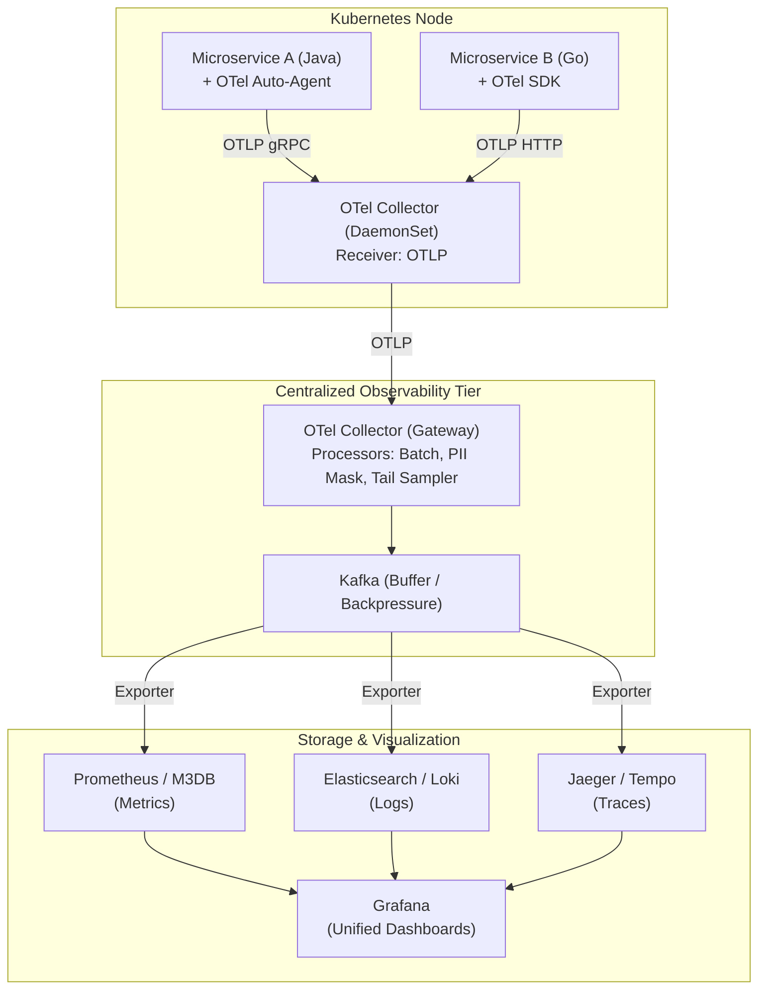
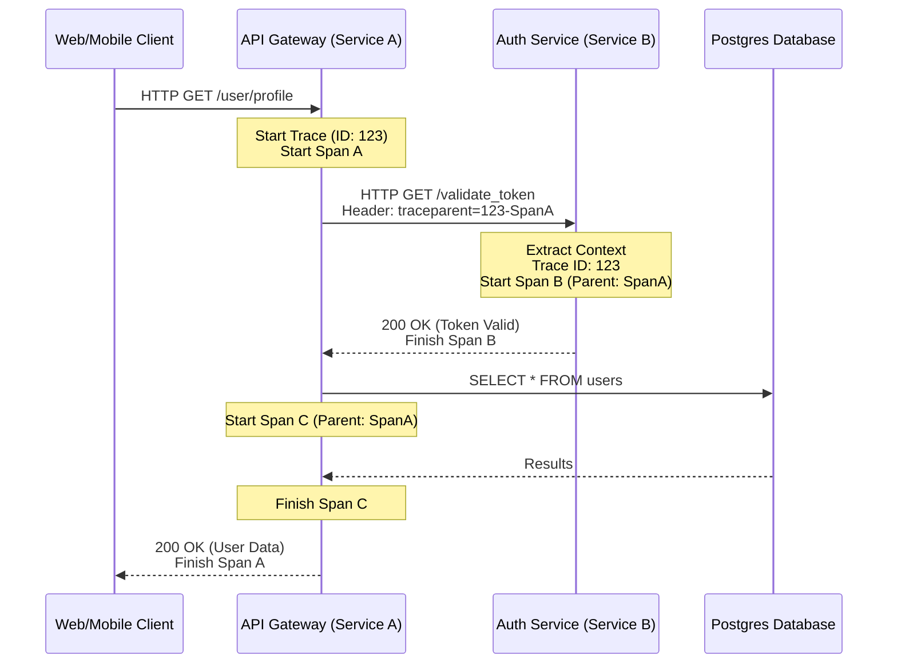
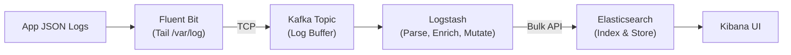

# Chapter 24: Observability

## 1. Why This Matters

In the era of monolithic applications, understanding system health was relatively straightforward. You had a single codebase, running on a single server (or a small, homogeneous cluster), backed by a single relational database. When something broke, you SSHed into the box, tailed the log file (`tail -f /var/log/application.log`), checked CPU usage with `top`, and generally found the root cause within minutes. 

The shift to distributed systems and microservices architectures completely shattered this paradigm. A single user request in a modern cloud-native application might traverse an API Gateway, an authentication service, three different business logic microservices, a message broker (like Kafka), a caching layer (like Redis), and multiple backend databases. 

When a user complains, "Checkout is slow today," where do you look? 
- Is the API gateway queuing requests?
- Is the inventory service struggling with a database lock?
- Is there a network partition between the payment service and the 3rd-party payment gateway?
- Is the recommendation engine hogging CPU resources on a shared Kubernetes node?

Without **Observability**, a distributed system is a "black box." Engineers are forced to guess, deploying speculative fixes and praying the metrics improve. This leads to unacceptable Mean Time To Resolution (MTTR), engineer burnout, and massive revenue loss during outages. Observability matters because it provides "X-ray vision" into your distributed architecture, allowing you to ask arbitrary questions about your system's behavior, identify the precise locus of failure, and understand *why* the system is behaving the way it is, rather than just knowing *that* it is broken.

In production environments at scale, observability is not a "nice-to-have" feature; it is a fundamental requirement for operating reliable software. It bridges the gap between the code you wrote and the chaotic reality of the network, hardware, and user behavior it runs on.

---

## 2. Beginner Intuition

To understand observability, it helps to distinguish it from its older sibling: **Monitoring**.

Imagine you are driving a car. 
**Monitoring** is the dashboard in front of you. The speedometer tells you how fast you are going. The fuel gauge tells you how much gas you have. The "Check Engine" light turns on if something is wrong. Monitoring is fantastic for known unknowns—things you anticipate might go wrong. It answers the question: *"Is the system working?"*

However, when the Check Engine light turns on, the dashboard doesn't tell you *why*. Is it a loose gas cap? A failing catalytic converter? A misfiring spark plug?
**Observability** is what happens when the mechanic plugs a sophisticated diagnostic tool into the car's OBD-II port, opens the hood, and examines the exact pressure, temperature, and electrical signals passing through the engine's components. It answers the question: *"Why is the system not working, and how do I fix it?"*

In software:
- **Monitoring** tells you: "CPU usage is at 99%." or "Error rates spiked to 5%."
- **Observability** lets you query: "Show me all requests that resulted in a 500 Error in the last 5 minutes, specifically for users on iOS devices trying to purchase the new iPhone, and trace exactly which downstream database query caused the timeout."

Observability is a property of a system. A system is "observable" if you can understand its internal state solely by examining its external outputs (telemetry data). We achieve this through the "Three Pillars": Metrics, Logs, and Traces.

---

## 3. Core Theory

The theoretical foundation of observability comes from control theory, defined by engineer Rudolf E. Kálmán in 1960. In control theory, observability is a measure of how well internal states of a system can be inferred from knowledge of its external outputs. In distributed systems, these "external outputs" are the telemetry data the system emits.

### 3.1 Monitoring vs. Observability
- **Monitoring (Reactive):** Focuses on aggregate metrics. Relies on predefined dashboards and alerts. Used to detect anomalies (e.g., "The site is down").
- **Observability (Proactive):** Focuses on highly granular, high-cardinality data. Relies on ad-hoc querying and exploration. Used to debug complex, unforeseen failures (e.g., "Why is the site down for this specific subset of users?").

### 3.2 The Three Pillars of Observability

While the "Three Pillars" model is somewhat oversimplified (observability is fundamentally about the *correlation* of data, not just silos of data), it is the standard framework for understanding telemetry generation.

#### Pillar 1: Metrics
Metrics are numeric representations of data measured over time intervals. Because they are just numbers, they are highly compressible and incredibly cheap to store and query.
- **Counter:** A cumulative metric that monotonically increases (e.g., `requests_total`, `errors_total`). It can only go up or be reset to zero upon process restart.
- **Gauge:** A metric that represents a single numerical value that can arbitrarily go up and down (e.g., `current_memory_usage`, `active_threads`, `queue_depth`).
- **Histogram:** Samples observations (usually things like request durations or response sizes) and counts them in configurable buckets. It also provides a sum of all observed values. Crucial for calculating percentiles (p95, p99).
- **Summary:** Similar to a histogram, but calculates streaming percentiles directly on the client-side. (Less flexible for aggregation across clusters than histograms).

**Dimensional Metrics (Tags/Labels):**
Modern metrics are multi-dimensional. Instead of a flat metric name like `http_requests_500_auth_service`, dimensional metrics use a base name and key-value pairs (labels/tags):
`http_requests_total{service="auth", status="500", endpoint="/login", region="us-east"}`.
This allows slicing and dicing the data dynamically.

**Standardized Metric Frameworks:**
1. **RED Method (For Services):** 
   - **R**ate (Requests per second)
   - **E**rrors (Number of failed requests)
   - **D**uration (Latency distributions)
2. **USE Method (For Resources):**
   - **U**tilization (Time resource was busy, e.g., CPU at 80%)
   - **S**aturation (Amount of queued work, e.g., run queue length)
   - **E**rrors (Count of error events, e.g., network collisions)
3. **The Four Golden Signals (Google SRE):** Latency, Traffic, Errors, Saturation.

#### Pillar 2: Logging
Logs are immutable, timestamped records of discrete events that happened over time. 
- **Unstructured Logging:** Raw text strings (`"User 123 failed to login due to bad password"`). Difficult to parse and query at scale.
- **Structured Logging:** Emitting logs as structured data objects (typically JSON). 
  `{"timestamp":"2023-10-01T12:00:00Z", "level":"ERROR", "user_id":"123", "event":"login_failure", "reason":"bad_password"}`. 
  Structured logging allows log aggregation systems (like Elasticsearch or Splunk) to index the fields, enabling lightning-fast, complex queries.
- **Log Levels:** TRACE (verbose internal flow), DEBUG (diagnostic info), INFO (general lifecycle events), WARN (unexpected but handled), ERROR (operation failed), FATAL (process crashing).
- **Correlation IDs:** A unique identifier generated at the edge (e.g., API Gateway) and passed to every downstream service via HTTP headers. Every service includes this ID in its logs, allowing engineers to grep for a single ID and see the entire lifecycle of a request across all microservices.

#### Pillar 3: Distributed Tracing
While correlation IDs in logs help, parsing thousands of logs to understand a request path is painful. Distributed tracing formalizes this.
- **Trace:** Represents the entire journey of a single request through a distributed system. A trace is made up of a tree of Spans.
- **Span:** Represents a single logical unit of work within a trace (e.g., a database query, an HTTP call to another service). It has a name, start time, duration, and contextual tags.
- **Context Propagation:** The mechanism of passing trace identifiers (Trace ID, Parent Span ID) between services. The **W3C Trace Context** is the modern standard, passing an HTTP header like `traceparent: 00-0af7651916cd43dd8448eb211c80319c-b7ad6b7169203331-01`.

### 3.3 High Cardinality Observability
Cardinality refers to the number of unique values a dimension (tag/label) can have. 
- *Low Cardinality:* `HTTP_Method` (GET, POST, PUT, DELETE - 4 values). `Region` (us-east, eu-west - 10 values).
- *High Cardinality:* `User_ID` (100 million values). `Order_ID` (1 billion values).
Traditional metric systems (like Prometheus) collapse if you inject high-cardinality tags. Modern observability demands platforms that can ingest, store, and query infinite cardinality data, allowing you to ask: *"Show me latency for User_ID = 987654321."*

---

## 4. Architecture Deep Dive

To understand how telemetry data flows from your application code to your eyeballs on a dashboard, we must deep-dive into the observability pipeline architecture. 

### 4.1 The OpenTelemetry (OTel) Standard
Historically, observability was fragmented. If you used Datadog, you used the Datadog SDK. If you switched to New Relic, you had to rewrite all your instrumentation code. 
**OpenTelemetry (OTel)**, a CNCF project, solved this by providing a unified, vendor-agnostic standard for generating, collecting, and exporting telemetry data.

The OTel Architecture consists of:
1. **OTel API:** Interfaces used by application developers to write manual instrumentation (e.g., `tracer.startSpan()`).
2. **OTel SDK:** The language-specific implementation of the API that processes the telemetry data, applies sampling, and buffers it.
3. **Auto-Instrumentation:** Agents (like the Java agent) that hook into the application runtime (via bytecode manipulation) to automatically instrument popular libraries (Spring, JDBC, HTTP clients) without code changes.
4. **OTLP (OpenTelemetry Protocol):** The standard wire protocol (usually gRPC or HTTP/Protobuf) used to transmit telemetry data.
5. **OTel Collector:** A vendor-agnostic proxy that sits between your applications and the storage backend.

### 4.2 The OpenTelemetry Collector Deep Dive
The Collector is the heart of a modern observability stack. It handles data ingestion, processing, and export. It operates via pipelines composed of three parts:

- **Receivers:** How data gets *in*. A receiver can accept OTLP, but can also scrape Prometheus metrics, accept Jaeger traces, or ingest Fluentd logs.
- **Processors:** How data is *transformed*. Examples include:
  - *Batch Processor:* Batches telemetry before sending (saves network overhead).
  - *Attributes Processor:* Masks PII (Personally Identifiable Information) like credit card numbers, or adds infrastructure tags (e.g., Kubernetes pod name).
  - *Tail-Sampling Processor:* Decides which traces to drop based on the entire trace's outcome.
- **Exporters:** How data gets *out*. Exporters translate the internal OTel data model into vendor-specific formats (e.g., sending to Prometheus, Elasticsearch, Datadog, Honeycomb).

### 4.3 Deployment Models
- **Agent Model (Sidecar/DaemonSet):** An OTel Collector runs locally on the same host or Kubernetes pod as the application. The app sends data over localhost. The agent adds host-level metadata and forwards it.
- **Gateway Model:** Agents forward data to a centralized cluster of OTel Collectors. This tier handles heavy processing, tail-based sampling, and API key management before sending data to the SaaS backend or internal storage.

### 4.4 Centralized Logging Aggregation
The standard stack for logs is **ELK (Elasticsearch, Logstash, Kibana)** or **EFK (Elasticsearch, Fluentd, Kibana)**.
1. Application writes JSON logs to `stdout` or a file.
2. A node-level agent (Fluent Bit / Promtail) reads the file, tails it, and buffers the logs.
3. Logs are pushed to a message broker (Kafka) for backpressure handling during log spikes.
4. Logstash/Fluentd consumes from Kafka, parses/mutates the JSON, and indexes it into Elasticsearch.
5. Engineers query the data via Kibana.
*(Modern alternative: **Grafana Loki**, which does not index the log text, only the metadata tags, functioning much like Prometheus for logs, drastically reducing storage costs).*

---

## 5. Visual Diagrams

### Diagram 1: Modern Observability Architecture (OpenTelemetry)



### Diagram 2: Distributed Trace Context Propagation



### Diagram 3: ELK Pipeline with Backpressure



---

## 6. Real Production Examples

### 6.1 Google's Dapper
Distributed tracing was essentially born at Google with the paper *"Dapper, a Large-Scale Distributed Systems Tracing Infrastructure"* (2010). Google faced a problem: a single web search touched thousands of machines. Finding the source of latency was impossible. Dapper introduced the concept of Trace Trees and Spans. Because Google's scale is astronomical, Dapper relied heavily on **probabilistic sampling**—only tracing 1 out of every 10,000 requests. The lessons from Dapper led to OpenTracing and eventually OpenTelemetry.

### 6.2 Uber's M3 and Jaeger
Uber's transition from a monolithic architecture to over 4,000 microservices created extreme observability challenges.
- **Jaeger:** Uber created Jaeger (now a CNCF project) for distributed tracing, highly optimized for Go and Java. It allowed them to visualize the complex fan-out architecture of ride dispatching.
- **M3:** Uber was generating billions of metrics per second. Prometheus couldn't handle the scale natively, and Cassandra was too expensive for time-series data. They built **M3**, an open-source, large-scale metrics platform designed to store high-cardinality time-series data and provide distributed query aggregation. M3DB serves as the highly compressed storage engine.

### 6.3 Netflix's Atlas
Netflix handles extreme volumes of telemetry data. They developed **Atlas** to manage dimensional time-series data. Atlas is uniquely optimized for operations that happen entirely in memory, allowing Netflix engineers to query millions of time-series lines and render graphs in milliseconds. Atlas introduced heavy reliance on tagging (dimensions), moving away from hierarchical metric names.

### 6.4 LinkedIn's InGraphs
Long before modern tools, LinkedIn built InGraphs to correlate application metrics with hardware performance. Their realization was that metrics must be highly correlated with deployment events. If latency spikes exactly when a new build is deployed to a specific Kubernetes cluster, the dashboard must show the deployment marker right alongside the metric spike.

---

## 7. Java Implementations

Let's look at production-grade Java code utilizing Spring Boot, Micrometer (for metrics), SLF4J/Logback (for structured logging), and OpenTelemetry (for tracing).

### 7.1 Custom Metrics with Micrometer
Micrometer is the standard metrics facade for Java (similar to what SLF4J is for logging).

```java
import io.micrometer.core.instrument.MeterRegistry;
import io.micrometer.core.instrument.Timer;
import io.micrometer.core.instrument.Counter;
import org.springframework.stereotype.Service;
import java.util.concurrent.TimeUnit;

@Service
public class OrderService {

    private final MeterRegistry registry;
    private final Counter orderCounter;
    private final Timer orderProcessingTimer;

    public OrderService(MeterRegistry registry) {
        this.registry = registry;
        
        // 1. Counter: Tracks total orders, tagged by type
        this.orderCounter = Counter.builder("orders.processed.total")
            .description("Total number of processed orders")
            .tags("region", "us-east-1") // Base dimension
            .register(registry);

        // 2. Timer/Histogram: Tracks latency and counts
        this.orderProcessingTimer = Timer.builder("orders.processing.latency")
            .description("Time taken to process an order")
            .publishPercentileHistogram() // Enable p95, p99 calculations
            .register(registry);
    }

    public OrderResponse processOrder(OrderRequest request) {
        long start = System.currentTimeMillis();
        
        try {
            // Simulate business logic
            Thread.sleep((long) (Math.random() * 100)); 
            
            // Increment counter with dynamic dimension
            registry.counter("orders.processed.total", 
                "status", "success", 
                "customer_tier", request.getTier().name()
            ).increment();
            
            return new OrderResponse("Success");
        } catch (Exception e) {
            registry.counter("orders.processed.total", "status", "failed").increment();
            throw new RuntimeException("Order failed", e);
        } finally {
            // Record duration
            orderProcessingTimer.record(System.currentTimeMillis() - start, TimeUnit.MILLISECONDS);
        }
    }
}
```

### 7.2 Structured JSON Logging with SLF4J and Logback MDC
To correlate logs with traces and add rich context, we use the Mapped Diagnostic Context (MDC).

**`logback-spring.xml` (JSON Layout configuration):**
```xml
<configuration>
    <appender name="CONSOLE_JSON" class="ch.qos.logback.core.ConsoleAppender">
        <encoder class="net.logstash.logback.encoder.LogstashEncoder">
            <!-- Includes MDC context, traceId, spanId automatically if OTel is present -->
            <includeMdcKeyName>userId</includeMdcKeyName>
            <includeMdcKeyName>transactionId</includeMdcKeyName>
        </encoder>
    </appender>
    <root level="INFO">
        <appender-ref ref="CONSOLE_JSON" />
    </root>
</configuration>
```

**Java Application Code:**
```java
import org.slf4j.Logger;
import org.slf4j.LoggerFactory;
import org.slf4j.MDC;
import org.springframework.web.bind.annotation.*;
import java.util.UUID;

@RestController
@RequestMapping("/api/payments")
public class PaymentController {

    private static final Logger log = LoggerFactory.getLogger(PaymentController.class);

    @PostMapping("/process")
    public String processPayment(@RequestHeader(value = "X-User-Id", required = false) String userId) {
        // Inject business context into the MDC. 
        // ALL logs generated in this thread will now include these fields.
        MDC.put("userId", userId != null ? userId : "anonymous");
        MDC.put("transactionId", UUID.randomUUID().toString());

        try {
            log.info("Starting payment processing"); // Outputs JSON with userId and transactionId
            
            boolean success = executePaymentLogic();
            
            if (success) {
                log.info("Payment processed successfully");
            } else {
                log.warn("Payment declined by fraud detection");
            }
            return "OK";
        } catch (Exception e) {
            log.error("Critical failure during payment processing", e);
            throw e;
        } finally {
            // CRITICAL: Always clear MDC to prevent context leaking to other thread pool requests
            MDC.clear();
        }
    }
}
```

### 7.3 Manual Tracing with OpenTelemetry Java SDK
While Auto-instrumentation handles HTTP/DB layers automatically, sometimes you need manual business-logic spans.

```java
import io.opentelemetry.api.trace.Span;
import io.opentelemetry.api.trace.Tracer;
import io.opentelemetry.api.trace.StatusCode;
import io.opentelemetry.context.Scope;
import org.springframework.stereotype.Service;

@Service
public class InventoryService {

    private final Tracer tracer;

    public InventoryService(Tracer tracer) {
        this.tracer = tracer; // Injected by Spring Boot OTel starter
    }

    public void checkAndReserveInventory(String itemId, int quantity) {
        // Create a custom child span
        Span span = tracer.spanBuilder("InventoryService.checkAndReserve")
                .setAttribute("inventory.item_id", itemId)
                .setAttribute("inventory.quantity_requested", quantity)
                .startSpan();

        // Scope makes the span "active" for the current thread, so logs/inner spans attach to it
        try (Scope scope = span.makeCurrent()) {
            
            // Business Logic
            boolean available = checkDatabase(itemId, quantity);
            if (!available) {
                span.addEvent("Out of stock event triggered"); // Log an event onto the span
                span.setAttribute("inventory.status", "out_of_stock");
                throw new OutOfStockException(itemId);
            }
            
            reserveItem(itemId, quantity);
            span.setStatus(StatusCode.OK);

        } catch (Exception e) {
            span.recordException(e); // Attaches stacktrace to the span
            span.setStatus(StatusCode.ERROR, e.getMessage());
            throw e;
        } finally {
            span.end(); // CRITICAL: Span must be ended, or memory leaks occur and data is lost
        }
    }
}
```

---

## 8. Performance Analysis

Adding observability is not free. Telemetry generation, serialization, and network transmission consume CPU, memory, and bandwidth. 

### 8.1 The Overhead of Telemetry
- **Metrics:** Very low overhead. Incrementing a counter or recording a histogram in memory takes nanoseconds. Pushing batch metrics every 30 seconds uses minimal network bandwidth.
- **Logs:** Moderate overhead. String formatting, JSON serialization, and disk I/O (or network I/O) can become a bottleneck. Asynchronous logging (e.g., Logback AsyncAppender) is mandatory in high-throughput systems to prevent blocking the main application threads.
- **Tracing:** High overhead. Creating span objects, tracking context across threads, and capturing stack traces takes a toll. A heavy trace payload attached to every request can significantly bloat network traffic.

### 8.2 Trace Sampling Strategies
To handle tracing overhead, systems employ **Sampling** (recording only a subset of traffic).
1. **Head-Based Sampling:** The decision to trace a request is made at the *beginning* of the trace (e.g., at the API Gateway). 
   - *Algorithm:* Generate a random number [0, 100]. If < 5 (for 5% sampling), set the `sampled` flag to true in the trace context header.
   - *Pros:* Extremely efficient. Downstream services know immediately if they should drop trace data.
   - *Cons:* You might sample 5% of your successful HTTP 200s (which are boring) and randomly miss the rare HTTP 500s you actually want to debug!
2. **Tail-Based Sampling:** The decision to keep or drop a trace is made at the *end* of the pipeline (typically at the OTel Collector Gateway).
   - *Algorithm:* 100% of telemetry is generated and sent to the Collector. The Collector buffers the spans until the trace is complete. It evaluates the entire trace: "Did any span have an ERROR status? Did the total duration exceed 5 seconds?" If yes, keep the trace. If it was a fast, successful request, drop it.
   - *Pros:* You never miss an error or an anomaly. You only store actionable data.
   - *Cons:* Consumes massive internal network bandwidth (100% of telemetry leaves the app) and requires huge memory buffers in the Collector fleet.

---

## 9. Tradeoffs

### 9.1 Storage Cost vs. Data Retention
Observability platforms are incredibly expensive. Datadog bills are famously high at scale.
- *Tradeoff:* Do you keep 100% of logs for 30 days? 
- *Solution:* Tiered storage. Keep high-resolution metrics and 100% of logs for 3 days (for immediate incident response). Downsample metrics (e.g., average per hour instead of per 10s) and move logs to AWS S3/Glacier for 1-year compliance retention.

### 9.2 Build vs. Buy
- **Buy (SaaS - Datadog, New Relic, Honeycomb):** 
  - *Pros:* Zero maintenance, rich UI, advanced ML features out-of-the-box.
  - *Cons:* Massive scaling costs, vendor lock-in, data leaves your network (compliance/security issues).
- **Build (OSS - ELK, Prometheus, Jaeger, Grafana):**
  - *Pros:* Complete control over data, lower pure-software costs.
  - *Cons:* Managing an Elasticsearch cluster at petabyte scale requires a dedicated team of engineers. You are paying in engineering salaries what you save in SaaS bills.

### 9.3 Push vs. Pull Metrics
- **Pull (Prometheus):** A central server reaches out to your application endpoints (e.g., `/metrics`) and scrapes the data. 
  - *Tradeoff:* Easy to scale the backend, apps don't need to know where the server is. Harder to handle short-lived ephemeral jobs (like AWS Lambdas) because they die before they can be scraped.
- **Push (StatsD, OTLP, Datadog):** The application sends data directly to the server.
  - *Tradeoff:* Excellent for ephemeral infrastructure. However, if the backend goes down, the application must manage backpressure and retries.

---

## 10. Failure Scenarios

What happens when the tools meant to observe failures fail themselves?

### 10.1 The "Log Storm" and Circular Dependencies
A classic failure: A database goes down. 50 microservices start throwing `SQLException` in a tight loop. They output massive multi-line stack traces to the logging framework.
The node-level log agent (Fluentd) maxes out CPU trying to parse the JSON. Network bandwidth is saturated sending logs to Kafka. The sheer volume causes the application to block on logging I/O, worsening the latency.
*Worse:* If the observability stack relies on the same infrastructure (e.g., the observability platform authenticates via the same downed Auth service), you get a circular dependency. **Rule of thumb: Observability infrastructure must be physically and logically isolated from production infrastructure.**

### 10.2 High Cardinality "Poison Pill" Metric
An engineer accidentally adds `customer_id` (10 million unique users) as a tag to the `http_request_duration` metric. The metrics backend (e.g., Prometheus) attempts to create a new time-series file for every unique combination of tags. 
*Result:* The Prometheus server runs out of RAM and crashes (OOMKill). The entire monitoring system goes dark because of a single poorly-thought-out tag in one microservice.

### 10.3 OOMing Auto-Instrumentation Agents
OTel or Java APM agents intercept bytecode. Under extreme load, if the agent's internal memory buffer for Spans fills up and fails to clear (perhaps because the downstream collector is unreachable and backpressure handling is faulty), the agent consumes the application's heap, resulting in `OutOfMemoryError` and taking the production app down with it. **Fail-open** design is critical: if telemetry can't be exported, it must be aggressively dropped, prioritizing application survival over telemetry generation.

---

## 11. Debugging & Observability

### 11.1 Observability-Driven Development (ODD)
In ODD, telemetry instrumentation is part of the feature definition. A PR is not approved unless it includes the metrics required to prove the feature works in production. You write the alert query *before* you deploy the code.

### 11.2 Incident Response Workflow (Using the 3 Pillars)
How do you use these tools at 3:00 AM when pager duty goes off?
1. **Alert fires:** "High Error Rate on Checkout Service." (Driven by a *Metric* alert).
2. **Dashboard (Metrics):** You open Grafana. You see the RED metrics for Checkout. You group by dimension and notice the error rate is specifically spiking on the `tag: payment_provider="stripe"`.
3. **Trace Search (Traces):** You jump to Jaeger/Honeycomb. You query for traces where `service="checkout"`, `payment_provider="stripe"`, and `error=true`.
4. **Waterfall View:** You open a specific trace. You see the request hits Checkout -> Cart -> UserAuth -> PaymentService. The span for PaymentService shows a duration of 5000ms followed by a timeout.
5. **Log Correlation (Logs):** You click the PaymentService span. Because of trace-to-log correlation, the UI directly brings up the exact logs emitted *during that span*.
6. **Root Cause Found:** The structured log reads: `{"level":"ERROR", "message":"Stripe API rate limit exceeded", "http_status": 429}`.
7. **Resolution:** You temporarily switch traffic to a backup payment provider or throttle requests.

This workflow transitions from macroscopic (Metrics) to scoped (Traces) to microscopic (Logs) seamlessly.

---

## 12. Interview Questions

### Beginner
**Q: What is the difference between a metric and a log?**
**A:** A log is an event-based record of a specific occurrence containing rich contextual data (strings/JSON). A metric is a numerical measurement over a time interval (e.g., a counter or gauge), stripped of specific event context but highly efficient for aggregation and alerting over long time periods.

### Intermediate
**Q: Explain how distributed tracing connects requests across multiple microservices.**
**A:** Tracing relies on Context Propagation. When a request enters the system, an edge service generates a unique Trace ID. As the request moves downstream via HTTP/gRPC, this Trace ID (and the Parent Span ID) is injected into the protocol headers (e.g., W3C `traceparent` header). Downstream services extract this header, attach it to their local spans, and propagate it further. The tracing backend later stitches all spans with the same Trace ID into a single trace tree.

### Advanced (FAANG Level)
**Q: You are designing an observability stack for a system handling 50,000 requests per second. Explain how you would prevent tracing overhead from taking down the network, while still ensuring you capture the root cause of rare errors (e.g., HTTP 500s occurring 0.01% of the time).**
**A:** I would utilize an OpenTelemetry Gateway architecture with Tail-Based Sampling. 
1. I would not use head-based probabilistic sampling (like keeping 1%), because the rare 0.01% errors would likely be dropped.
2. Applications would send 100% of telemetry to an OTel Collector DaemonSet running on `localhost` (low network cost).
3. The DaemonSet forwards to a centralized cluster of Gateway OTel Collectors. To manage bandwidth, I would use gRPC streaming and batch processors.
4. The Gateway implements Tail-Based Sampling. It buffers incoming spans for a configured window (e.g., 10 seconds). Once the trace is complete, it evaluates the trace. If any span contains an error status, or if the latency exceeds the p99 threshold, 100% of the trace is exported to the storage backend. Otherwise, it drops the trace or keeps a tiny representative baseline fraction (e.g., 0.1%).

---

## 13. Exercises

### Conceptual Exercise
Map the Four Golden Signals (Latency, Traffic, Errors, Saturation) to a specific technology. For a Kafka message broker, what specific metric represents each signal?
*(Answer Hint: Traffic = messages/sec in, Latency = produce request time, Errors = failed fetch requests, Saturation = disk capacity or network thread pool utilization).*

### Coding Exercise
Implement an SLF4J/Logback custom Filter in Java that intercepts all outgoing log statements. If the log message contains the string regex for a Visa or Mastercard (e.g., 16 digits), redact it and replace it with `****-****-****-1234` before it writes to the console.

### System Design Exercise
Design the observability pipeline for a global e-commerce site spanning AWS `us-east-1` and `eu-west-1`. 
- Requirement 1: If the network link between the US and EU drops, neither region's applications should block or crash.
- Requirement 2: Engineers need a single pane of glass to query logs globally.
*(Focus on using local Kafka clusters per region as buffers, asynchronous cross-region replication for storage, and federated query layers).*

---

## 14. Expert Insights

### 14.1 Continuous Profiling
While traces tell you *which* function is slow, they rarely tell you *why* a CPU-bound process is pegging the CPU. **Continuous Profiling** (e.g., tools like Pyroscope or Datadog Profiler) is emerging as the "Fourth Pillar." It continuously captures stack traces and CPU/Memory profiles of your application running in production (using minimal overhead algorithms). If a service spikes in CPU at 4:00 PM, you can look at a Flame Graph for exactly that minute and see that `java.util.regex.Pattern.compile` consumed 80% of the CPU cycles.

### 14.2 eBPF (Extended Berkeley Packet Filter)
The future of observability is moving towards the kernel. eBPF allows engineers to run sandboxed programs directly within the Linux kernel without changing kernel source code or loading modules.
Instead of forcing developers to add OpenTelemetry Java Agents or write code to trace network calls, an eBPF agent monitors network sockets, filesystem I/O, and CPU scheduling at the OS level. It automatically generates high-fidelity distributed traces and metrics for every container on a node with near-zero overhead and *absolutely no code changes* to the application. 

### 14.3 The Illusion of "Single Pane of Glass"
Vendors heavily market the "single pane of glass" platform. In expert practice at immense scale, this often fails. Metrics platforms require vastly different storage architectures (time-series databases) than log platforms (inverted indices) and trace platforms (graph/tree databases). Forcing them into one underlying datastore often leads to compromises in performance or exorbitant costs. The expert approach is often to use specialized best-in-class storage backends and unify them *only* at the UI layer (like Grafana).

---

## 15. Chapter Summary

- **Observability vs. Monitoring:** Monitoring tells you *when* a system is broken; observability provides the granular data needed to understand *why* it is broken and how to fix it.
- **The Three Pillars:** The foundation relies on **Metrics** (aggregatable, numerical time-series data), **Logs** (rich, structured, discrete events), and **Distributed Traces** (request-scoped causal relationships across microservices).
- **Data Standardization:** OpenTelemetry (OTel) is the industry standard for telemetry generation and routing, decoupling instrumentation from backend vendors.
- **Context is King:** Logging is only powerful at scale when it is structured (JSON) and contains Correlation IDs (Trace IDs via MDC) that stitch logs to traces.
- **Sampling is Mandatory:** At high throughput, tracking 100% of data is economically impossible. Tail-based sampling provides the best balance, dropping successful noise while keeping every erroneous transaction.
- **High Cardinality:** Modern debugging requires isolating variables down to a single user or container. This requires metric and log systems designed to ingest near-infinite cardinality without crashing.
- **Fail-Safe Design:** Observability pipelines must handle backpressure. If the telemetry system degrades, it must drop data rather than consume the memory/CPU of the production applications it is monitoring.
