# Chapter 25: Distributed Monitoring

---

> *"You can't fix what you can't see. In distributed systems, observability isn't optional—it's oxygen."*  
> — Adapted from Google SRE wisdom

---

## 1. Why This Matters

### The Invisible Complexity of Distributed Systems

In a monolithic application, when something goes wrong, you look at one log file, check one CPU graph, and scan one memory chart. In distributed systems, a single user request may traverse **dozens of services**, cross **multiple network boundaries**, and touch **several databases**. When that request fails or slows down, the question isn't just "what went wrong?"—it's "where, among hundreds of components, did things go wrong?"

This is why **distributed monitoring** is the backbone of operational excellence. Without it, you are flying blind through a storm.

### The Cost of Not Monitoring

Consider these real-world failures:

| Incident | Root Cause | Impact | Could Monitoring Have Prevented It? |
|----------|-----------|--------|-------------------------------------|
| Amazon S3 outage (2017) | Mistyped command removed too many servers | 4 hours, billions in losses | Yes—capacity monitoring with alerts |
| Facebook outage (2021) | BGP route withdrawal | 6 hours, $60M+ revenue loss | Yes—network reachability monitoring |
| Cloudflare outage (2019) | Regex in WAF rule caused CPU spike | 27 minutes, millions of sites | Yes—CPU utilization per rule alerts |
| GitLab database deletion (2017) | Accidental `rm -rf` on production DB | 18 hours recovery | Yes—replication lag monitoring |

### Why Engineers Must Master Monitoring

1. **System Design Interviews**: Every FAANG interview expects you to discuss how you'd monitor your proposed system. "How would you know if your system is healthy?" is a guaranteed question.

2. **Production Readiness**: No system goes to production without monitoring. Period. Google's Production Readiness Reviews mandate monitoring as a first-class requirement.

3. **Debugging at Scale**: When you have 10,000 containers, you can't SSH into each one. You need centralized metrics, dashboards, and alerts.

4. **Business Impact**: Monitoring directly translates to uptime, which translates to revenue. Amazon estimates that every 100ms of latency costs them 1% in sales.

5. **Career Growth**: Senior engineers are distinguished by their ability to build systems that are *observable*, not just functional.

### The Four Pillars of Observability

Before diving into tools, understand the conceptual framework:

```mermaid
graph LR
    subgraph OBSERVABILITY
        direction LR
        M["Metrics<br/>Numbers over time<br/><br/>'What's broken?'"]
        L["Logs<br/>Text events with context<br/><br/>'What happened?'"]
        T["Traces<br/>Request flow across services<br/><br/>'Where did it go?'"]
        P["Profiles<br/>Code perf data<br/><br/>'Why is it slow?'"]
    end
```

This chapter focuses primarily on **Metrics**—the first pillar—and the ecosystems built around them (Prometheus, Grafana, time series databases, alerting). Logs and traces are covered in Chapter 24.

---

## 2. Beginner Intuition

### The Hospital Analogy

Imagine a hospital. Every patient is connected to monitors that track:
- **Heart rate** (CPU usage)
- **Blood pressure** (Memory utilization)  
- **Temperature** (Error rate)
- **Oxygen saturation** (Request latency)

Now imagine a hospital with 10,000 patients. You can't have a nurse watching each monitor 24/7. Instead, you need:

1. **A central monitoring station** (Prometheus) that collects all readings
2. **Dashboard screens** (Grafana) that show trends and anomalies  
3. **Alarm systems** (Alertmanager) that beep when something is critically wrong
4. **A triage process** (Alert routing) that pages the right doctor
5. **Historical records** (Time series databases) for diagnosis patterns

This is exactly how distributed monitoring works.

### The Weather Station Analogy

Think of monitoring like a network of weather stations:

- Each **weather station** (exporter) collects local data: temperature, humidity, wind speed
- A **central office** (Prometheus server) periodically polls each station for readings
- The readings are stored with **timestamps** (time series)
- **Labels** tag each reading: `station="downtown"`, `sensor_type="temperature"`
- **Dashboards** (Grafana) show maps and trends
- **Weather alerts** (Alertmanager) warn about storms and extreme conditions

### The Pull vs. Push Model

One thing that surprises beginners is Prometheus's **pull model**:

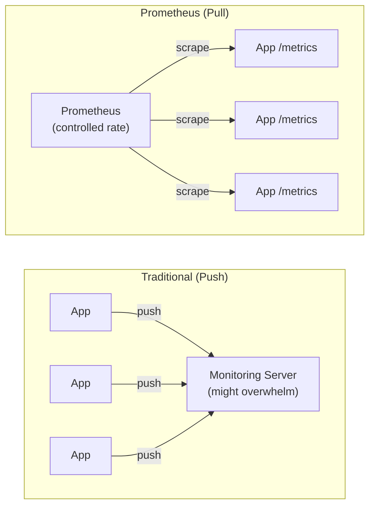

**Why pull?** Because the monitoring system controls the rate. If an app goes haywire and starts pushing a million metrics per second, it doesn't overwhelm your monitoring. Prometheus decides when and how fast to collect.

### Time Series: The Foundation

Every metric in monitoring is a **time series**—a sequence of values indexed by time:

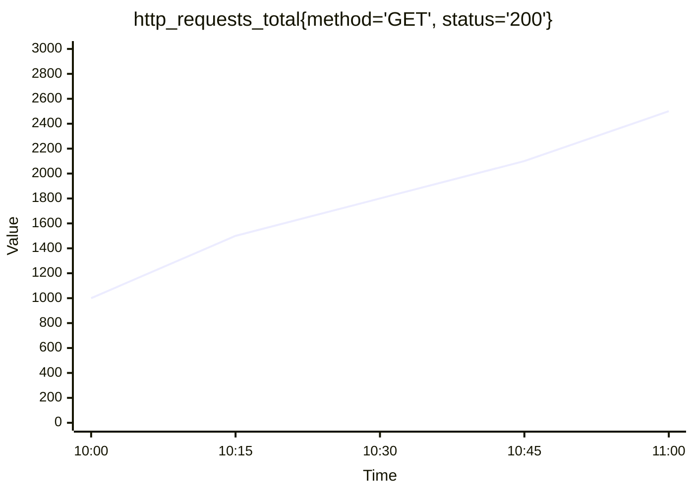

That's it. A metric name, some labels, and values over time. Everything else—dashboards, alerts, queries—builds on this simple foundation.

---

## 3. Core Theory

### 3.1 Metric Types

Prometheus defines four fundamental metric types, each serving a different purpose:

#### Counter
A **counter** is a cumulative metric that only goes up (or resets to zero on restart).

```
Use cases: Total requests, total errors, bytes transferred
Example:   http_requests_total = 1000, 1001, 1002, 1003...

Key insight: You almost never care about the raw value.
             You care about the RATE: rate(http_requests_total[5m])
```

**Mathematical Foundation:**
- A counter `C(t)` is a monotonically non-decreasing function
- The rate of change: `rate = ΔC / Δt`
- Handles resets: If `C(t₂) < C(t₁)`, Prometheus assumes a reset and adjusts

#### Gauge
A **gauge** is a metric that can go up and down.

```
Use cases: Temperature, memory usage, active connections, queue depth
Example:   node_memory_available_bytes = 4GB, 3.5GB, 3.8GB, 3.2GB...

Key insight: The current value IS meaningful.
             You might want avg, min, max over a window.
```

#### Histogram
A **histogram** samples observations and counts them in configurable buckets.

```
Use cases: Request latency, response sizes
Example:   http_request_duration_seconds_bucket{le="0.1"} = 500
           http_request_duration_seconds_bucket{le="0.5"} = 800
           http_request_duration_seconds_bucket{le="1.0"} = 950
           http_request_duration_seconds_bucket{le="+Inf"} = 1000

Key insight: Enables calculating percentiles (p50, p95, p99)
             histogram_quantile(0.99, rate(http_request_duration_seconds_bucket[5m]))
```

**Why Histograms Matter:**
Averages lie. If your average latency is 100ms, that could mean:
- All requests are 100ms (great!)
- 99% are 10ms and 1% are 9,100ms (terrible!)

Histograms reveal the **distribution**, which is what actually matters.

#### Summary
A **summary** is similar to a histogram but calculates quantiles on the client side.

```
Use cases: Pre-calculated quantiles when server-side aggregation isn't needed
Example:   http_request_duration_seconds{quantile="0.5"} = 0.05
           http_request_duration_seconds{quantile="0.9"} = 0.1
           http_request_duration_seconds{quantile="0.99"} = 0.5

Key insight: Cannot be aggregated across instances!
             Prefer histograms for multi-instance deployments.
```

#### Comparison Table

| Feature | Counter | Gauge | Histogram | Summary |
|---------|---------|-------|-----------|---------|
| Direction | Only up | Up and down | N/A (observations) | N/A (observations) |
| Reset on restart | Yes | N/A | Yes | Yes |
| Rate calculation | Yes (`rate()`) | No (use `deriv()`) | Yes (on `_bucket`) | Yes (on `_count`) |
| Aggregatable | Yes | Yes | Yes | **No** (quantiles) |
| Server-side percentiles | N/A | N/A | Yes | No |
| Use case | Counts | Levels | Latency distribution | Pre-computed quantiles |

### 3.2 The Data Model

Prometheus's data model is elegantly simple:

```mermaid
classDiagram
    class TimeSeriesData {
        <<Time Series Identifier>>
        metric_name{label1="value1", label2="value2", ...}
        Examples:
        http_requests_total{method="GET", handler="/api/users"}
        node_cpu_seconds_total{cpu="0", mode="idle"}
        up{job="api-server", instance="10.0.0.1:8080"}
        --
        <<Samples (Time Series Data)>>
        (timestamp_ms, float64_value)
        (1621500000000, 42.5)
        (1621500015000, 43.1)
        (1621500030000, 44.8)
    }
```

**Key rules for labels:**

1. **Cardinality matters**: Each unique combination of labels creates a new time series. `{method, status, handler, instance}` with 4 methods × 50 statuses × 200 handlers × 100 instances = 40,000,000 time series. This will **kill** your Prometheus server.

2. **Label naming conventions**:
   - Use snake_case: `http_request_duration_seconds`
   - Include unit in the name: `_seconds`, `_bytes`, `_total`
   - Don't put variable data in metric names; use labels instead

3. **Reserved labels**: Labels starting with `__` are reserved for internal use (e.g., `__name__`, `__address__`)

### 3.3 PromQL: Prometheus Query Language

PromQL is a powerful functional query language for time series data.

#### Instant Vectors

An instant vector returns the most recent value for each time series:

```text
# All HTTP requests
http_requests_total

# Filtered by method
http_requests_total{method="GET"}

# Regex matching
http_requests_total{method=~"GET|POST"}

# Negative matching
http_requests_total{status!~"2.."}
```

#### Range Vectors

A range vector returns all values within a time window:

```text
# Last 5 minutes of data points
http_requests_total[5m]

# Last 1 hour
http_requests_total[1h]
```

#### Key Functions and Operations

**Rate and Increase:**
```text
# Per-second rate over last 5 minutes (most common query)
rate(http_requests_total[5m])

# Total increase over last hour
increase(http_requests_total[1h])

# Instantaneous rate (less smooth)
irate(http_requests_total[5m])
```

**Aggregation:**
```text
# Total requests across all instances
sum(rate(http_requests_total[5m]))

# Requests per service
sum by (service) (rate(http_requests_total[5m]))

# Requests, ignoring instance labels
sum without (instance) (rate(http_requests_total[5m]))

# Top 5 services by request rate
topk(5, sum by (service) (rate(http_requests_total[5m])))
```

**Percentiles (Histograms):**
```text
# 99th percentile latency
histogram_quantile(0.99, 
  sum by (le) (rate(http_request_duration_seconds_bucket[5m]))
)

# 95th percentile latency per service
histogram_quantile(0.95,
  sum by (le, service) (rate(http_request_duration_seconds_bucket[5m]))
)
```

**Arithmetic and Comparison:**
```text
# Error rate percentage
sum(rate(http_requests_total{status=~"5.."}[5m])) 
/ 
sum(rate(http_requests_total[5m])) * 100

# Memory usage percentage
(node_memory_MemTotal_bytes - node_memory_MemAvailable_bytes) 
/ node_memory_MemTotal_bytes * 100

# Alert: error rate > 5%
sum(rate(http_requests_total{status=~"5.."}[5m])) 
/ 
sum(rate(http_requests_total[5m])) > 0.05
```

**Prediction and Trends:**
```text
# Predict when disk will be full (linear extrapolation)
predict_linear(node_filesystem_avail_bytes[6h], 24*3600) < 0

# Day-over-day comparison
rate(http_requests_total[5m]) 
/ 
rate(http_requests_total[5m] offset 1d)
```

**Subqueries:**
```text
# Maximum rate over the last hour, sampled every minute
max_over_time(rate(http_requests_total[5m])[1h:1m])

# Average 99th percentile latency over the last day
avg_over_time(
  histogram_quantile(0.99, sum by (le) (rate(http_request_duration_seconds_bucket[5m])))[1d:5m]
)
```

### 3.4 Service Discovery

In dynamic environments (Kubernetes, cloud), services come and go. Prometheus can automatically discover targets:

```yaml
# Static targets (simplest)
scrape_configs:
  - job_name: 'my-app'
    static_configs:
      - targets: ['localhost:8080', 'localhost:8081']

# Kubernetes service discovery
  - job_name: 'kubernetes-pods'
    kubernetes_sd_configs:
      - role: pod
    relabel_configs:
      - source_labels: [__meta_kubernetes_pod_annotation_prometheus_io_scrape]
        action: keep
        regex: true
      - source_labels: [__meta_kubernetes_pod_annotation_prometheus_io_path]
        action: replace
        target_label: __metrics_path__
        regex: (.+)

# Consul service discovery
  - job_name: 'consul-services'
    consul_sd_configs:
      - server: 'consul.example.com:8500'
        services: ['web', 'api', 'worker']

# EC2 service discovery
  - job_name: 'ec2-instances'
    ec2_sd_configs:
      - region: us-east-1
        port: 9100
        filters:
          - name: tag:Environment
            values: ['production']

# File-based service discovery
  - job_name: 'file-sd'
    file_sd_configs:
      - files:
          - '/etc/prometheus/targets/*.json'
        refresh_interval: 5m
```

**Relabeling** is one of Prometheus's most powerful features. It allows you to:
- Transform discovered labels before scraping
- Drop unwanted targets
- Rewrite metric labels
- Route metrics to different storage backends

```yaml
relabel_configs:
  # Keep only pods with prometheus.io/scrape: "true"
  - source_labels: [__meta_kubernetes_pod_annotation_prometheus_io_scrape]
    action: keep
    regex: true
  
  # Use pod name as instance label
  - source_labels: [__meta_kubernetes_pod_name]
    target_label: instance
  
  # Add namespace label
  - source_labels: [__meta_kubernetes_namespace]
    target_label: namespace
  
  # Drop internal metrics
  - source_labels: [__name__]
    regex: 'go_.*'
    action: drop

metric_relabel_configs:
  # Drop high-cardinality metric
  - source_labels: [__name__]
    regex: 'http_request_duration_seconds_bucket'
    action: drop
```

### 3.5 Recording Rules and Alerting Rules

#### Recording Rules
Pre-compute frequently used or expensive queries:

```yaml
groups:
  - name: http_rules
    interval: 30s
    rules:
      # Pre-compute request rate per service
      - record: service:http_requests:rate5m
        expr: sum by (service) (rate(http_requests_total[5m]))
      
      # Pre-compute error rate per service
      - record: service:http_errors:rate5m
        expr: sum by (service) (rate(http_requests_total{status=~"5.."}[5m]))
      
      # Pre-compute error percentage
      - record: service:http_error_rate:ratio
        expr: |
          service:http_errors:rate5m / service:http_requests:rate5m

      # Pre-compute p99 latency
      - record: service:http_latency:p99
        expr: |
          histogram_quantile(0.99, 
            sum by (le, service) (rate(http_request_duration_seconds_bucket[5m]))
          )
```

#### Alerting Rules
```yaml
groups:
  - name: sla_alerts
    rules:
      - alert: HighErrorRate
        expr: service:http_error_rate:ratio > 0.05
        for: 5m
        labels:
          severity: critical
          team: platform
        annotations:
          summary: "High error rate on {{ $labels.service }}"
          description: |
            Error rate is {{ $value | humanizePercentage }} 
            for service {{ $labels.service }}.
          runbook_url: "https://runbooks.example.com/HighErrorRate"
          dashboard_url: "https://grafana.example.com/d/svc/{{ $labels.service }}"

      - alert: DiskWillFillIn24Hours
        expr: predict_linear(node_filesystem_avail_bytes[6h], 24*3600) < 0
        for: 30m
        labels:
          severity: warning
        annotations:
          summary: "Disk space will be exhausted within 24 hours on {{ $labels.instance }}"
          
      - alert: HighLatency
        expr: service:http_latency:p99 > 1.0
        for: 10m
        labels:
          severity: warning
        annotations:
          summary: "P99 latency above 1 second for {{ $labels.service }}"
```

---

## 4. Architecture Deep Dive

### 4.1 Prometheus Architecture

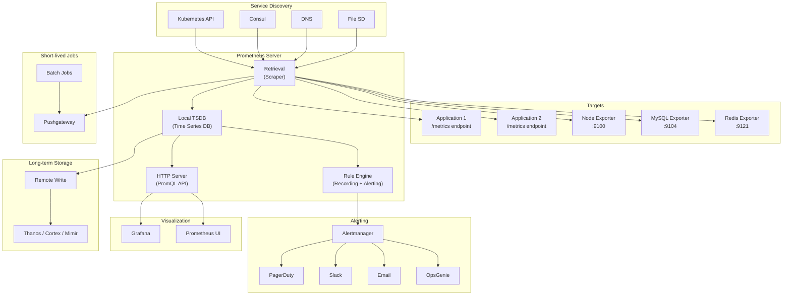

### 4.2 How Scraping Works

The **scrape loop** is Prometheus's heartbeat:

```
Every scrape_interval (default: 15s):
  1. Resolve targets via service discovery
  2. For each target:
     a. HTTP GET to target's /metrics endpoint
     b. Parse exposition format (text or protobuf)
     c. Apply metric_relabel_configs
     d. Append samples to TSDB with current timestamp
     e. Update 'up' metric (1=success, 0=failure)
     f. Record scrape_duration_seconds
```

**Exposition Format Example:**
```
# HELP http_requests_total Total number of HTTP requests
# TYPE http_requests_total counter
http_requests_total{method="GET",status="200"} 1234 1621500000000
http_requests_total{method="POST",status="200"} 567 1621500000000
http_requests_total{method="GET",status="500"} 12 1621500000000

# HELP http_request_duration_seconds Request latency histogram
# TYPE http_request_duration_seconds histogram
http_request_duration_seconds_bucket{le="0.005"} 24054
http_request_duration_seconds_bucket{le="0.01"} 33444
http_request_duration_seconds_bucket{le="0.025"} 100392
http_request_duration_seconds_bucket{le="0.05"} 129389
http_request_duration_seconds_bucket{le="0.1"} 133988
http_request_duration_seconds_bucket{le="+Inf"} 144320
http_request_duration_seconds_sum 53423.45
http_request_duration_seconds_count 144320
```

### 4.3 Prometheus TSDB Internals

Prometheus's local time series database is a masterpiece of engineering:

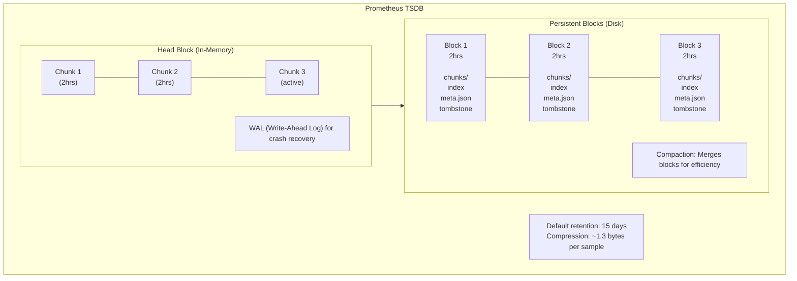

**Key design decisions:**
1. **Block-based storage**: Each block covers a fixed time range (default 2 hours)
2. **Immutable blocks**: Once written, blocks are never modified (append-only)
3. **Compaction**: Older blocks are merged to reduce file count and improve query performance
4. **Delta-of-delta encoding**: Timestamps are compressed using Gorilla-style encoding
5. **XOR encoding**: Values are compressed using XOR with the previous value
6. **Inverted index**: Fast lookup by label matchers

### 4.4 Alertmanager Architecture

The Alertmanager handles alert deduplication, grouping, silencing, inhibition, and routing:

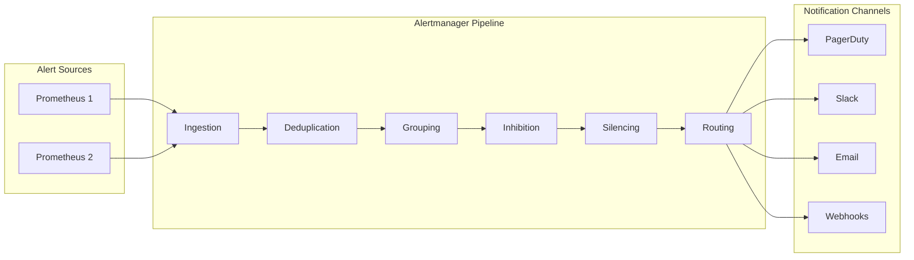

**Alertmanager Configuration:**
```yaml
global:
  resolve_timeout: 5m
  slack_api_url: 'https://hooks.slack.com/services/T00/B00/XXX'

route:
  receiver: 'default-receiver'
  group_by: ['alertname', 'cluster', 'service']
  group_wait: 30s        # Wait before sending first notification
  group_interval: 5m     # Wait before sending updates
  repeat_interval: 4h    # Resend if not resolved
  
  routes:
    # Critical alerts go to PagerDuty
    - match:
        severity: critical
      receiver: 'pagerduty-critical'
      continue: true
    
    # Warning alerts go to Slack
    - match:
        severity: warning
      receiver: 'slack-warnings'
    
    # Database alerts go to DBA team
    - match_re:
        alertname: '(MySQL|Postgres|Redis).*'
      receiver: 'dba-team'
      
    # Business hours only for non-critical
    - match:
        severity: info
      receiver: 'email-team'
      active_time_intervals:
        - business-hours

receivers:
  - name: 'default-receiver'
    slack_configs:
      - channel: '#alerts-general'
        
  - name: 'pagerduty-critical'
    pagerduty_configs:
      - service_key: '<PD_SERVICE_KEY>'
        severity: critical
        description: '{{ .CommonAnnotations.summary }}'
        
  - name: 'slack-warnings'
    slack_configs:
      - channel: '#alerts-warnings'
        title: '{{ .CommonLabels.alertname }}'
        text: '{{ .CommonAnnotations.description }}'
        
  - name: 'dba-team'
    pagerduty_configs:
      - service_key: '<DBA_PD_KEY>'
    slack_configs:
      - channel: '#dba-alerts'

  - name: 'email-team'
    email_configs:
      - to: 'team@example.com'

inhibit_rules:
  # If a critical alert fires, suppress warnings for the same service
  - source_match:
      severity: 'critical'
    target_match:
      severity: 'warning'
    equal: ['alertname', 'service']

time_intervals:
  - name: business-hours
    time_intervals:
      - weekdays: ['monday:friday']
        times:
          - start_time: '09:00'
            end_time: '17:00'
```

### 4.5 Federation

Federation allows one Prometheus to scrape selected metrics from another:

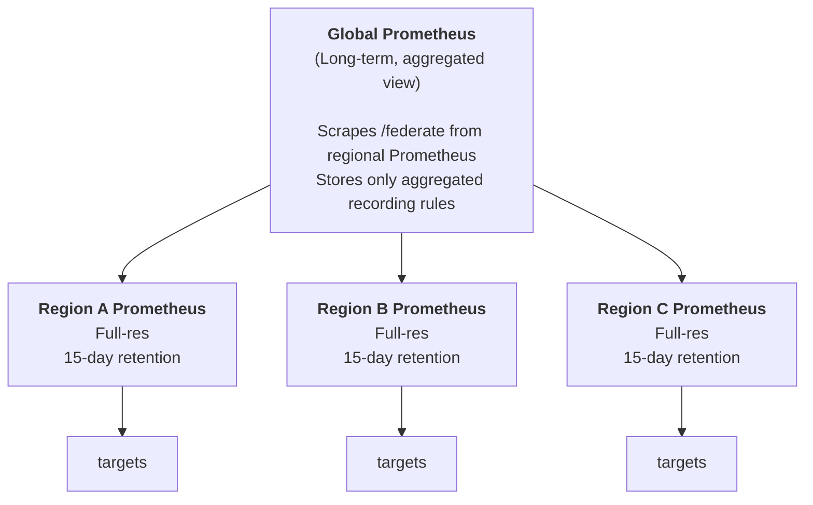

```yaml
# Global Prometheus config
scrape_configs:
  - job_name: 'federate'
    scrape_interval: 60s
    honor_labels: true
    metrics_path: '/federate'
    params:
      'match[]':
        - '{__name__=~"service:.*"}'   # Only recording rules
        - 'up'
    static_configs:
      - targets:
        - 'prometheus-region-a:9090'
        - 'prometheus-region-b:9090'
        - 'prometheus-region-c:9090'
```

### 4.6 Prometheus Operator for Kubernetes

The Prometheus Operator makes running Prometheus on Kubernetes native and declarative:

```yaml
# ServiceMonitor CRD - Automatically discovers and scrapes services
apiVersion: monitoring.coreos.com/v1
kind: ServiceMonitor
metadata:
  name: my-app-monitor
  namespace: monitoring
  labels:
    team: backend
spec:
  selector:
    matchLabels:
      app: my-application
  namespaceSelector:
    matchNames:
      - production
  endpoints:
    - port: metrics
      interval: 15s
      path: /metrics
      scrapeTimeout: 10s

---
# PodMonitor CRD - For pods without services
apiVersion: monitoring.coreos.com/v1
kind: PodMonitor
metadata:
  name: my-sidecar-monitor
spec:
  selector:
    matchLabels:
      app: my-sidecar
  podMetricsEndpoints:
    - port: metrics
      interval: 30s

---
# PrometheusRule CRD - Alerting and recording rules
apiVersion: monitoring.coreos.com/v1
kind: PrometheusRule
metadata:
  name: my-app-rules
spec:
  groups:
    - name: my-app.rules
      rules:
        - alert: MyAppDown
          expr: up{job="my-application"} == 0
          for: 5m
          labels:
            severity: critical
          annotations:
            summary: "{{ $labels.instance }} is down"

---
# Prometheus CRD - The Prometheus server itself
apiVersion: monitoring.coreos.com/v1
kind: Prometheus
metadata:
  name: main
spec:
  replicas: 2
  retention: 30d
  resources:
    requests:
      memory: 4Gi
      cpu: "2"
  serviceMonitorSelector:
    matchLabels:
      team: backend
  ruleSelector:
    matchLabels:
      team: backend
  alerting:
    alertmanagers:
      - namespace: monitoring
        name: alertmanager-main
        port: web
  storage:
    volumeClaimTemplate:
      spec:
        storageClassName: ssd
        resources:
          requests:
            storage: 200Gi
```

---

## 5. Visual Diagrams

### 5.1 Complete Monitoring Data Flow

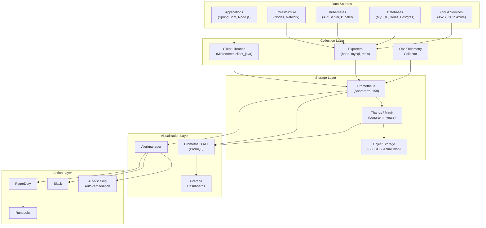

### 5.2 Grafana Dashboard Layout Design

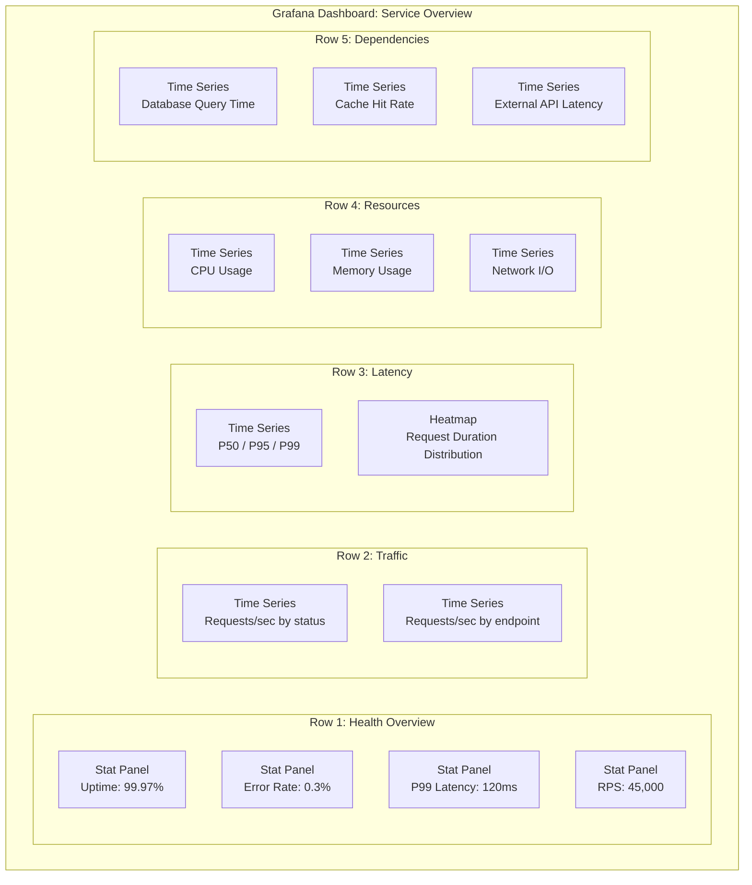

### 5.3 Thanos Architecture

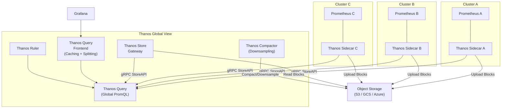

### 5.4 Alert Lifecycle

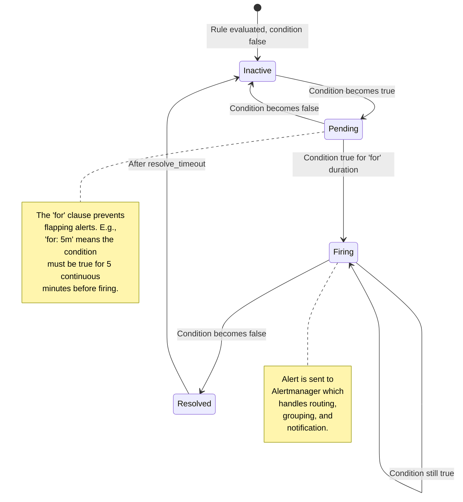

### 5.5 Monitoring Anti-Pattern: Alert Storm

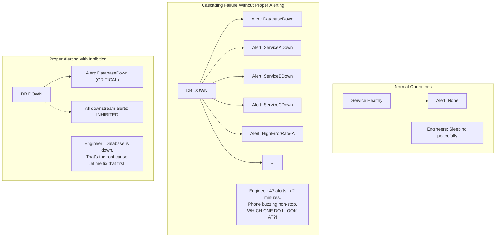

---

## 6. Real Production Examples

### 6.1 SoundCloud: The Birth of Prometheus

**Context:** Prometheus was created at SoundCloud in 2012, inspired by Google's Borgmon.

**Why they built it:**
- StatsD + Graphite couldn't handle dynamic service discovery
- Growing microservice architecture needed dimensional data model (labels)
- Required powerful query language for multi-dimensional data
- Needed alerting integrated with metrics

**Key innovations:**
- Pull-based model (controversial at the time)
- Dimensional data model with labels
- PromQL as a full expression language
- Integrated alerting via Alertmanager

**Impact:** Prometheus became the second project to graduate from CNCF (after Kubernetes), now the de facto monitoring standard for cloud-native applications.

### 6.2 Uber: M3 Platform

**Scale:**
- 500+ microservices
- Billions of time series
- 6.5 billion data points per second
- Petabytes of monitoring data

**Architecture:**
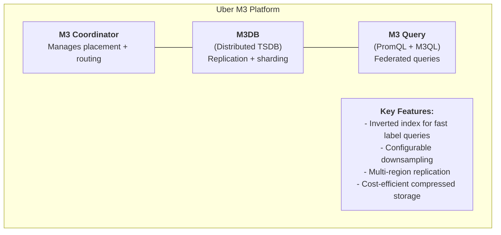

**Lessons learned:**
1. Prometheus alone can't scale to billions of series—they built M3DB
2. Downsampling is essential for long-term storage
3. Multi-region monitoring needs careful clock synchronization
4. Cardinality explosions are the #1 operational headache

### 6.3 Netflix: Atlas

**Scale:**
- 2+ billion time series
- 1.3 million metrics per second per Atlas node
- 200+ microservices monitored

**Key design decisions:**
- **In-memory time series database** for speed
- **Push-based model** (unlike Prometheus)
- **Stack Language (NetflixOSS Stack)** for queries
- **Dimensional model** with rich tagging

**Architecture principles:**
- Atlas is designed for **high churn** (containers come and go rapidly)
- Uses **streaming aggregation** to reduce storage
- **Short retention** in Atlas, long-term via S3

### 6.4 Datadog: Commercial Monitoring at Scale

**Architecture insights:**
- **Agent-based** collection (push model)
- **Centralized SaaS** storage and querying
- **Tag-based** dimensional model (similar to Prometheus labels)
- Supports metrics, logs, traces, and profiles in one platform

**Scale:**
- Processes trillions of events daily
- Stores data across hundreds of thousands of customer accounts
- Custom TSDB optimized for multi-tenant workloads

**Key lesson:** The convergence of metrics, logs, and traces into a single platform is where the industry is heading. This is why OpenTelemetry is so important.

### 6.5 Google: Borgmon → Monarch

**Evolution:**
- **Borgmon** (2003): Google's internal monitoring, inspiration for Prometheus
- **Monarch** (2019+): Next-generation monitoring for Google Cloud

**Borgmon principles that influenced Prometheus:**
- Pull-based scraping of `/varz` endpoints
- White-box monitoring of application internals
- Alerting based on time series expressions
- Service-based target discovery

**Monarch innovations:**
- Global-scale time series database
- In-memory leaf nodes for recent data
- Distributed query engine
- Multi-tenant with strong isolation

---

## 7. Java Implementations

### 7.1 Spring Boot with Micrometer (Prometheus Integration)

```java
// build.gradle dependencies
// implementation 'org.springframework.boot:spring-boot-starter-actuator'
// implementation 'io.micrometer:micrometer-registry-prometheus'

import io.micrometer.core.instrument.*;
import io.micrometer.core.instrument.binder.jvm.*;
import io.micrometer.core.instrument.binder.system.*;
import org.springframework.boot.SpringApplication;
import org.springframework.boot.autoconfigure.SpringBootApplication;
import org.springframework.context.annotation.Bean;
import org.springframework.context.annotation.Configuration;
import org.springframework.stereotype.Component;
import org.springframework.web.bind.annotation.*;
import org.springframework.web.servlet.HandlerInterceptor;

import jakarta.servlet.http.HttpServletRequest;
import jakarta.servlet.http.HttpServletResponse;
import java.time.Duration;
import java.util.concurrent.atomic.AtomicInteger;

/**
 * Production-grade Spring Boot application with comprehensive Prometheus monitoring.
 * 
 * Exposes metrics at /actuator/prometheus endpoint in Prometheus exposition format.
 * Includes custom business metrics, JVM metrics, and HTTP request metrics.
 */
@SpringBootApplication
public class MonitoredApplication {
    public static void main(String[] args) {
        SpringApplication.run(MonitoredApplication.class, args);
    }
}

/**
 * Configuration for Micrometer metrics registry.
 * Registers common tags and custom metric binders.
 */
@Configuration
class MetricsConfig {

    @Bean
    public MeterRegistryCustomizer<MeterRegistry> commonTags() {
        return registry -> registry.config()
            .commonTags(
                "application", "order-service",
                "environment", System.getenv().getOrDefault("ENV", "development"),
                "region", System.getenv().getOrDefault("REGION", "us-east-1")
            );
    }

    /**
     * Register JVM metrics: memory, GC, threads, class loading.
     * These are critical for understanding application health.
     */
    @Bean
    public JvmMemoryMetrics jvmMemoryMetrics() {
        return new JvmMemoryMetrics();
    }

    @Bean
    public JvmGcMetrics jvmGcMetrics() {
        return new JvmGcMetrics();
    }

    @Bean
    public JvmThreadMetrics jvmThreadMetrics() {
        return new JvmThreadMetrics();
    }

    @Bean
    public ProcessorMetrics processorMetrics() {
        return new ProcessorMetrics();
    }

    @Bean
    public UptimeMetrics uptimeMetrics() {
        return new UptimeMetrics();
    }
}

/**
 * Custom business metrics for an order processing service.
 * Demonstrates all four Prometheus metric types with Micrometer.
 */
@Component
class OrderMetrics {

    private final Counter ordersCreated;
    private final Counter ordersFailed;
    private final Timer orderProcessingTime;
    private final DistributionSummary orderValueDistribution;
    private final AtomicInteger activeOrders;

    public OrderMetrics(MeterRegistry registry) {
        // COUNTER: Track total orders created (monotonically increasing)
        this.ordersCreated = Counter.builder("orders.created.total")
            .description("Total number of orders created")
            .tag("type", "all")
            .register(registry);

        this.ordersFailed = Counter.builder("orders.failed.total")
            .description("Total number of failed orders")
            .register(registry);

        // TIMER: Track order processing duration (histogram + counter)
        this.orderProcessingTime = Timer.builder("orders.processing.duration")
            .description("Time taken to process an order")
            .publishPercentiles(0.5, 0.75, 0.95, 0.99)         // Client-side percentiles
            .publishPercentileHistogram()                         // Server-side histogram buckets
            .serviceLevelObjectives(                               // SLO buckets
                Duration.ofMillis(100),
                Duration.ofMillis(500),
                Duration.ofSeconds(1),
                Duration.ofSeconds(5)
            )
            .minimumExpectedValue(Duration.ofMillis(1))
            .maximumExpectedValue(Duration.ofSeconds(30))
            .register(registry);

        // DISTRIBUTION SUMMARY: Track order values
        this.orderValueDistribution = DistributionSummary.builder("orders.value")
            .description("Distribution of order values in dollars")
            .baseUnit("dollars")
            .publishPercentiles(0.5, 0.95, 0.99)
            .scale(0.01)  // Convert cents to dollars
            .register(registry);

        // GAUGE: Track currently active/processing orders
        this.activeOrders = registry.gauge(
            "orders.active",
            Tags.of("state", "processing"),
            new AtomicInteger(0)
        );
    }

    public void recordOrderCreated(String paymentMethod, double valueInCents) {
        ordersCreated.increment();
        orderValueDistribution.record(valueInCents);
    }

    public void recordOrderFailed(String reason) {
        ordersFailed.increment();
    }

    public Timer.Sample startProcessingTimer() {
        activeOrders.incrementAndGet();
        return Timer.start();
    }

    public void stopProcessingTimer(Timer.Sample sample, String status) {
        activeOrders.decrementAndGet();
        sample.stop(Timer.builder("orders.processing.duration")
            .tag("status", status)
            .register(ordersCreated.getId().getMeterRegistry()));
    }

    // Convenience method for wrapping operations
    public <T> T timeOrderProcessing(String status, java.util.function.Supplier<T> operation) {
        return orderProcessingTime.record(operation);
    }
}

/**
 * REST controller with comprehensive metric instrumentation.
 */
@RestController
@RequestMapping("/api/orders")
class OrderController {

    private final OrderMetrics metrics;
    private final MeterRegistry registry;

    public OrderController(OrderMetrics metrics, MeterRegistry registry) {
        this.metrics = metrics;
        this.registry = registry;
    }

    @PostMapping
    public ResponseEntity<OrderResponse> createOrder(@RequestBody OrderRequest request) {
        Timer.Sample sample = metrics.startProcessingTimer();
        
        try {
            // Simulate order processing
            OrderResponse response = processOrder(request);
            
            metrics.recordOrderCreated(request.getPaymentMethod(), request.getTotalCents());
            metrics.stopProcessingTimer(sample, "success");
            
            // Record custom business metric
            registry.counter("orders.by_category",
                "category", request.getCategory(),
                "payment", request.getPaymentMethod()
            ).increment();
            
            return ResponseEntity.ok(response);
            
        } catch (PaymentDeclinedException e) {
            metrics.recordOrderFailed("payment_declined");
            metrics.stopProcessingTimer(sample, "payment_declined");
            return ResponseEntity.badRequest().build();
            
        } catch (InventoryException e) {
            metrics.recordOrderFailed("out_of_stock");
            metrics.stopProcessingTimer(sample, "out_of_stock");
            return ResponseEntity.status(409).build();
            
        } catch (Exception e) {
            metrics.recordOrderFailed("internal_error");
            metrics.stopProcessingTimer(sample, "error");
            return ResponseEntity.internalServerError().build();
        }
    }

    @GetMapping("/{id}")
    public ResponseEntity<OrderResponse> getOrder(@PathVariable String id) {
        return registry.timer("orders.get.duration", "endpoint", "getById")
            .record(() -> {
                // Simulate DB lookup
                return ResponseEntity.ok(new OrderResponse(id));
            });
    }

    private OrderResponse processOrder(OrderRequest request) {
        // Business logic...
        return new OrderResponse("order-123");
    }
}

// Supporting classes
record OrderRequest(String category, String paymentMethod, double totalCents) {
    public String getCategory() { return category; }
    public String getPaymentMethod() { return paymentMethod; }
    public double getTotalCents() { return totalCents; }
}

record OrderResponse(String orderId) {}

class PaymentDeclinedException extends RuntimeException {
    public PaymentDeclinedException(String msg) { super(msg); }
}

class InventoryException extends RuntimeException {
    public InventoryException(String msg) { super(msg); }
}
```

### 7.2 Custom Prometheus Exporter

```java
import io.prometheus.client.*;
import io.prometheus.client.exporter.HTTPServer;
import io.prometheus.client.hotspot.DefaultExports;

import java.io.IOException;
import java.sql.*;
import java.util.concurrent.*;

/**
 * Custom Prometheus exporter for a database connection pool.
 * 
 * This exporter scrapes connection pool statistics and exposes them
 * as Prometheus metrics. It demonstrates building exporters for
 * systems that don't natively expose metrics.
 * 
 * Runs as a standalone HTTP server on port 9150.
 */
public class DatabasePoolExporter {

    // Define metrics with labels
    private static final Gauge POOL_ACTIVE_CONNECTIONS = Gauge.build()
        .name("db_pool_active_connections")
        .help("Number of currently active connections in the pool")
        .labelNames("pool_name", "database")
        .register();

    private static final Gauge POOL_IDLE_CONNECTIONS = Gauge.build()
        .name("db_pool_idle_connections")
        .help("Number of idle connections in the pool")
        .labelNames("pool_name", "database")
        .register();

    private static final Gauge POOL_TOTAL_CONNECTIONS = Gauge.build()
        .name("db_pool_total_connections")
        .help("Total number of connections in the pool")
        .labelNames("pool_name", "database")
        .register();

    private static final Gauge POOL_MAX_CONNECTIONS = Gauge.build()
        .name("db_pool_max_connections")
        .help("Maximum number of connections allowed in the pool")
        .labelNames("pool_name", "database")
        .register();

    private static final Counter POOL_CONNECTIONS_CREATED = Counter.build()
        .name("db_pool_connections_created_total")
        .help("Total number of connections created")
        .labelNames("pool_name", "database")
        .register();

    private static final Counter POOL_CONNECTIONS_CLOSED = Counter.build()
        .name("db_pool_connections_closed_total")
        .help("Total number of connections closed")
        .labelNames("pool_name", "database", "reason")
        .register();

    private static final Histogram POOL_WAIT_TIME = Histogram.build()
        .name("db_pool_wait_seconds")
        .help("Time spent waiting for a connection from the pool")
        .labelNames("pool_name")
        .buckets(0.001, 0.005, 0.01, 0.025, 0.05, 0.1, 0.25, 0.5, 1.0, 2.5, 5.0, 10.0)
        .register();

    private static final Summary QUERY_DURATION = Summary.build()
        .name("db_query_duration_seconds")
        .help("Database query execution time")
        .labelNames("pool_name", "query_type")
        .quantile(0.5, 0.01)
        .quantile(0.9, 0.01)
        .quantile(0.99, 0.001)
        .register();

    private static final Gauge POOL_HEALTH = Gauge.build()
        .name("db_pool_health")
        .help("Health status of the connection pool (1=healthy, 0=unhealthy)")
        .labelNames("pool_name")
        .register();

    // Info metric - provides metadata
    private static final Info POOL_INFO = Info.build()
        .name("db_pool")
        .help("Database connection pool information")
        .register();

    private final ScheduledExecutorService scheduler = Executors.newScheduledThreadPool(1);
    private final ConnectionPoolStats poolStats;
    private final String poolName;
    private final String database;

    public DatabasePoolExporter(String poolName, String database, ConnectionPoolStats poolStats) {
        this.poolName = poolName;
        this.database = database;
        this.poolStats = poolStats;

        // Set static info
        POOL_INFO.info(
            "pool_name", poolName,
            "database", database,
            "driver", "mysql-connector-java",
            "driver_version", "8.0.28"
        );
    }

    /**
     * Start the exporter HTTP server and metric collection.
     */
    public void start() throws IOException {
        // Register JVM metrics
        DefaultExports.initialize();

        // Start metric collection loop
        scheduler.scheduleAtFixedRate(this::collectMetrics, 0, 5, TimeUnit.SECONDS);

        // Start HTTP server on port 9150
        HTTPServer server = new HTTPServer.Builder()
            .withPort(9150)
            .build();

        System.out.println("Database Pool Exporter started on port 9150");
        System.out.println("Metrics available at http://localhost:9150/metrics");
    }

    /**
     * Collect metrics from the connection pool.
     * Called periodically by the scheduler.
     */
    private void collectMetrics() {
        try {
            POOL_ACTIVE_CONNECTIONS.labels(poolName, database)
                .set(poolStats.getActiveConnections());

            POOL_IDLE_CONNECTIONS.labels(poolName, database)
                .set(poolStats.getIdleConnections());

            POOL_TOTAL_CONNECTIONS.labels(poolName, database)
                .set(poolStats.getTotalConnections());

            POOL_MAX_CONNECTIONS.labels(poolName, database)
                .set(poolStats.getMaxConnections());

            // Health check
            boolean healthy = performHealthCheck();
            POOL_HEALTH.labels(poolName).set(healthy ? 1 : 0);

        } catch (Exception e) {
            POOL_HEALTH.labels(poolName).set(0);
            System.err.println("Error collecting metrics: " + e.getMessage());
        }
    }

    /**
     * Record a connection acquisition event.
     */
    public void recordConnectionAcquired(double waitTimeSeconds) {
        POOL_WAIT_TIME.labels(poolName).observe(waitTimeSeconds);
        POOL_CONNECTIONS_CREATED.labels(poolName, database).inc();
    }

    /**
     * Record a connection release event.
     */
    public void recordConnectionReleased(String reason) {
        POOL_CONNECTIONS_CLOSED.labels(poolName, database, reason).inc();
    }

    /**
     * Record a query execution.
     */
    public void recordQuery(String queryType, double durationSeconds) {
        QUERY_DURATION.labels(poolName, queryType).observe(durationSeconds);
    }

    private boolean performHealthCheck() {
        // Simulate health check
        return poolStats.getActiveConnections() < poolStats.getMaxConnections() * 0.9;
    }

    public static void main(String[] args) throws IOException {
        // Create a mock connection pool stats provider
        ConnectionPoolStats stats = new MockConnectionPoolStats();
        
        DatabasePoolExporter exporter = new DatabasePoolExporter(
            "primary", "orders_db", stats
        );
        exporter.start();
    }
}

/**
 * Interface for connection pool statistics.
 * Implementations would wrap HikariCP, DBCP, etc.
 */
interface ConnectionPoolStats {
    int getActiveConnections();
    int getIdleConnections();
    int getTotalConnections();
    int getMaxConnections();
}

/**
 * Collector pattern: For systems where you need to dynamically
 * discover what metrics to expose at scrape time.
 */
class DynamicDatabaseCollector extends Collector {

    private final DatabaseClusterManager clusterManager;

    public DynamicDatabaseCollector(DatabaseClusterManager clusterManager) {
        this.clusterManager = clusterManager;
    }

    @Override
    public List<MetricFamilySamples> collect() {
        List<MetricFamilySamples> mfs = new ArrayList<>();

        GaugeMetricFamily replicationLag = new GaugeMetricFamily(
            "db_replication_lag_seconds",
            "Replication lag in seconds",
            Arrays.asList("cluster", "replica")
        );

        // Dynamically discover all replicas and their lag
        for (DatabaseCluster cluster : clusterManager.getClusters()) {
            for (DatabaseReplica replica : cluster.getReplicas()) {
                replicationLag.addMetric(
                    Arrays.asList(cluster.getName(), replica.getHost()),
                    replica.getReplicationLagSeconds()
                );
            }
        }

        mfs.add(replicationLag);
        return mfs;
    }
}
```

### 7.3 Grafana API Integration

```java
import com.fasterxml.jackson.databind.ObjectMapper;
import com.fasterxml.jackson.databind.node.*;

import java.net.URI;
import java.net.http.*;
import java.time.Instant;
import java.util.*;

/**
 * Grafana API client for programmatic dashboard management.
 * 
 * Use cases:
 * - Auto-generate dashboards for new services
 * - Standardize dashboard layouts across teams
 * - Create dashboards as part of CI/CD pipelines
 * - Annotate deployments on dashboards
 */
public class GrafanaApiClient {

    private final HttpClient httpClient;
    private final String grafanaUrl;
    private final String apiKey;
    private final ObjectMapper mapper;

    public GrafanaApiClient(String grafanaUrl, String apiKey) {
        this.httpClient = HttpClient.newHttpClient();
        this.grafanaUrl = grafanaUrl.replaceAll("/$", "");
        this.apiKey = apiKey;
        this.mapper = new ObjectMapper();
    }

    /**
     * Create a standardized service dashboard.
     * This is the template every microservice gets automatically.
     */
    public String createServiceDashboard(String serviceName, String namespace) throws Exception {
        ObjectNode dashboard = mapper.createObjectNode();
        dashboard.put("title", serviceName + " - Service Dashboard");
        dashboard.put("uid", "svc-" + serviceName.toLowerCase().replace(" ", "-"));
        dashboard.put("timezone", "utc");
        dashboard.put("editable", true);
        dashboard.put("refresh", "30s");

        // Time range
        ObjectNode time = dashboard.putObject("time");
        time.put("from", "now-1h");
        time.put("to", "now");

        // Template variables
        ArrayNode templating = dashboard.putObject("templating").putArray("list");
        addVariable(templating, "namespace", "Namespace",
            "label_values(up{job=\"" + serviceName + "\"}, namespace)");
        addVariable(templating, "pod", "Pod",
            "label_values(up{job=\"" + serviceName + "\", namespace=\"$namespace\"}, pod)");

        // Dashboard panels
        ArrayNode panels = dashboard.putArray("panels");
        int panelId = 1;
        int yPos = 0;

        // Row 1: Overview stats
        yPos = addOverviewRow(panels, serviceName, panelId, yPos);
        panelId += 5;

        // Row 2: Request rate and errors
        yPos = addTrafficRow(panels, serviceName, panelId, yPos);
        panelId += 3;

        // Row 3: Latency
        yPos = addLatencyRow(panels, serviceName, panelId, yPos);
        panelId += 3;

        // Row 4: Resources
        yPos = addResourceRow(panels, serviceName, panelId, yPos);

        // Wrap in save request
        ObjectNode saveRequest = mapper.createObjectNode();
        saveRequest.set("dashboard", dashboard);
        saveRequest.put("folderId", 0);
        saveRequest.put("overwrite", true);
        saveRequest.put("message", "Auto-generated dashboard for " + serviceName);

        String body = mapper.writerWithDefaultPrettyPrinter().writeValueAsString(saveRequest);

        HttpRequest request = HttpRequest.newBuilder()
            .uri(URI.create(grafanaUrl + "/api/dashboards/db"))
            .header("Authorization", "Bearer " + apiKey)
            .header("Content-Type", "application/json")
            .POST(HttpRequest.BodyPublishers.ofString(body))
            .build();

        HttpResponse<String> response = httpClient.send(request,
            HttpResponse.BodyHandlers.ofString());

        if (response.statusCode() != 200) {
            throw new RuntimeException("Failed to create dashboard: " + response.body());
        }

        return response.body();
    }

    /**
     * Add a deployment annotation to Grafana.
     * Shows a vertical line on all dashboards at the deployment time.
     */
    public void addDeploymentAnnotation(String serviceName, String version,
                                         String deployedBy, String commitHash) throws Exception {
        ObjectNode annotation = mapper.createObjectNode();
        annotation.put("time", Instant.now().toEpochMilli());
        annotation.put("text", String.format(
            "Deployed %s v%s by %s\nCommit: %s",
            serviceName, version, deployedBy, commitHash
        ));

        ArrayNode tags = annotation.putArray("tags");
        tags.add("deployment");
        tags.add(serviceName);
        tags.add("v" + version);

        HttpRequest request = HttpRequest.newBuilder()
            .uri(URI.create(grafanaUrl + "/api/annotations"))
            .header("Authorization", "Bearer " + apiKey)
            .header("Content-Type", "application/json")
            .POST(HttpRequest.BodyPublishers.ofString(annotation.toString()))
            .build();

        HttpResponse<String> response = httpClient.send(request,
            HttpResponse.BodyHandlers.ofString());

        System.out.println("Deployment annotation created: " + response.statusCode());
    }

    /**
     * Query Prometheus through Grafana's data source proxy.
     * Useful for building custom alerting or reporting tools.
     */
    public PrometheusQueryResult queryPrometheus(String datasourceUid, String promql) throws Exception {
        String encodedQuery = java.net.URLEncoder.encode(promql, "UTF-8");
        String url = String.format("%s/api/datasources/proxy/uid/%s/api/v1/query?query=%s",
            grafanaUrl, datasourceUid, encodedQuery);

        HttpRequest request = HttpRequest.newBuilder()
            .uri(URI.create(url))
            .header("Authorization", "Bearer " + apiKey)
            .GET()
            .build();

        HttpResponse<String> response = httpClient.send(request,
            HttpResponse.BodyHandlers.ofString());

        return mapper.readValue(response.body(), PrometheusQueryResult.class);
    }

    // Helper methods for building dashboard panels
    private void addVariable(ArrayNode templating, String name, String label, String query) {
        ObjectNode variable = templating.addObject();
        variable.put("name", name);
        variable.put("label", label);
        variable.put("type", "query");
        variable.put("refresh", 2); // On time range change
        variable.put("multi", false);
        variable.put("includeAll", true);

        ObjectNode queryObj = variable.putObject("query");
        queryObj.put("query", query);
        queryObj.put("refId", "StandardVariableQuery");

        ObjectNode current = variable.putObject("current");
        current.put("text", "All");
        current.put("value", "$__all");
    }

    private int addOverviewRow(ArrayNode panels, String service, int startId, int yPos) {
        // Stat: Request Rate
        addStatPanel(panels, startId, "Request Rate",
            "sum(rate(http_requests_total{job=\"" + service + "\"}[5m]))",
            "reqps", 0, yPos, 6, 4);

        // Stat: Error Rate
        addStatPanel(panels, startId + 1, "Error Rate",
            "sum(rate(http_requests_total{job=\"" + service + "\",status=~\"5..\"}[5m])) / " +
            "sum(rate(http_requests_total{job=\"" + service + "\"}[5m])) * 100",
            "percent", 6, yPos, 6, 4);

        // Stat: P99 Latency
        addStatPanel(panels, startId + 2, "P99 Latency",
            "histogram_quantile(0.99, sum by (le) (rate(http_request_duration_seconds_bucket{job=\"" + service + "\"}[5m])))",
            "s", 12, yPos, 6, 4);

        // Stat: Uptime
        addStatPanel(panels, startId + 3, "Uptime",
            "avg(up{job=\"" + service + "\"})",
            "percentunit", 18, yPos, 6, 4);

        return yPos + 4;
    }

    private int addTrafficRow(ArrayNode panels, String service, int startId, int yPos) {
        addTimeSeriesPanel(panels, startId, "Requests per Second",
            "sum by (status) (rate(http_requests_total{job=\"" + service + "\"}[5m]))",
            "reqps", 0, yPos, 12, 8);

        addTimeSeriesPanel(panels, startId + 1, "Errors per Second",
            "sum by (status) (rate(http_requests_total{job=\"" + service + "\",status=~\"[45]..\"}[5m]))",
            "reqps", 12, yPos, 12, 8);

        return yPos + 8;
    }

    private int addLatencyRow(ArrayNode panels, String service, int startId, int yPos) {
        addTimeSeriesPanel(panels, startId, "Request Duration Percentiles",
            "histogram_quantile(0.99, sum by (le) (rate(http_request_duration_seconds_bucket{job=\"" + service + "\"}[5m])))",
            "s", 0, yPos, 12, 8);

        // Heatmap panel
        addHeatmapPanel(panels, startId + 1, "Request Duration Heatmap",
            "sum by (le) (increase(http_request_duration_seconds_bucket{job=\"" + service + "\"}[5m]))",
            12, yPos, 12, 8);

        return yPos + 8;
    }

    private int addResourceRow(ArrayNode panels, String service, int startId, int yPos) {
        addTimeSeriesPanel(panels, startId, "CPU Usage",
            "rate(process_cpu_seconds_total{job=\"" + service + "\"}[5m])",
            "percentunit", 0, yPos, 8, 8);

        addTimeSeriesPanel(panels, startId + 1, "Memory Usage",
            "process_resident_memory_bytes{job=\"" + service + "\"}",
            "bytes", 8, yPos, 8, 8);

        addTimeSeriesPanel(panels, startId + 2, "GC Duration",
            "rate(jvm_gc_pause_seconds_sum{job=\"" + service + "\"}[5m])",
            "s", 16, yPos, 8, 8);

        return yPos + 8;
    }

    private void addStatPanel(ArrayNode panels, int id, String title, String query,
                               String unit, int x, int y, int w, int h) {
        ObjectNode panel = panels.addObject();
        panel.put("id", id);
        panel.put("type", "stat");
        panel.put("title", title);

        ObjectNode gridPos = panel.putObject("gridPos");
        gridPos.put("x", x);
        gridPos.put("y", y);
        gridPos.put("w", w);
        gridPos.put("h", h);

        ArrayNode targets = panel.putArray("targets");
        ObjectNode target = targets.addObject();
        target.put("expr", query);
        target.put("refId", "A");

        ObjectNode fieldConfig = panel.putObject("fieldConfig");
        ObjectNode defaults = fieldConfig.putObject("defaults");
        defaults.put("unit", unit);
    }

    private void addTimeSeriesPanel(ArrayNode panels, int id, String title, String query,
                                      String unit, int x, int y, int w, int h) {
        ObjectNode panel = panels.addObject();
        panel.put("id", id);
        panel.put("type", "timeseries");
        panel.put("title", title);

        ObjectNode gridPos = panel.putObject("gridPos");
        gridPos.put("x", x);
        gridPos.put("y", y);
        gridPos.put("w", w);
        gridPos.put("h", h);

        ArrayNode targets = panel.putArray("targets");
        ObjectNode target = targets.addObject();
        target.put("expr", query);
        target.put("legendFormat", "{{status}}");
        target.put("refId", "A");

        ObjectNode fieldConfig = panel.putObject("fieldConfig");
        ObjectNode defaults = fieldConfig.putObject("defaults");
        defaults.put("unit", unit);
    }

    private void addHeatmapPanel(ArrayNode panels, int id, String title, String query,
                                   int x, int y, int w, int h) {
        ObjectNode panel = panels.addObject();
        panel.put("id", id);
        panel.put("type", "heatmap");
        panel.put("title", title);

        ObjectNode gridPos = panel.putObject("gridPos");
        gridPos.put("x", x);
        gridPos.put("y", y);
        gridPos.put("w", w);
        gridPos.put("h", h);

        ArrayNode targets = panel.putArray("targets");
        ObjectNode target = targets.addObject();
        target.put("expr", query);
        target.put("format", "heatmap");
        target.put("refId", "A");
    }
}

// Supporting record for Prometheus query results
record PrometheusQueryResult(String status, PrometheusData data) {}
record PrometheusData(String resultType, List<PrometheusResult> result) {}
record PrometheusResult(Map<String, String> metric, List<Object> value) {}
```

### 7.4 Comprehensive Health Check with Metrics

```java
import io.micrometer.core.instrument.*;
import org.springframework.boot.actuate.health.*;
import org.springframework.stereotype.Component;

import java.net.http.*;
import java.time.Duration;
import java.util.*;
import java.util.concurrent.*;

/**
 * Production-grade health check system that integrates with monitoring.
 * 
 * Implements the health check pattern used at companies like Uber and Netflix:
 * - Deep health checks (database, cache, dependencies)
 * - Health status exposed as Prometheus metrics
 * - Configurable timeouts and failure thresholds
 * - Circuit breaker integration
 */
@Component
public class MonitoredHealthIndicator implements HealthIndicator {

    private final MeterRegistry registry;
    private final List<DependencyCheck> dependencyChecks;
    private final ExecutorService executor;

    // Metrics
    private final Timer healthCheckDuration;
    private final Counter healthCheckFailures;
    private final Map<String, Gauge> dependencyHealthGauges = new ConcurrentHashMap<>();

    public MonitoredHealthIndicator(MeterRegistry registry) {
        this.registry = registry;
        this.executor = Executors.newFixedThreadPool(10);
        
        this.dependencyChecks = List.of(
            new DatabaseHealthCheck("primary-db", "jdbc:mysql://primary:3306/app"),
            new DatabaseHealthCheck("replica-db", "jdbc:mysql://replica:3306/app"),
            new RedisHealthCheck("cache", "redis://cache:6379"),
            new HttpDependencyCheck("auth-service", "http://auth-service:8080/health"),
            new HttpDependencyCheck("payment-service", "http://payment-service:8080/health"),
            new KafkaHealthCheck("events", "kafka:9092")
        );

        this.healthCheckDuration = Timer.builder("health.check.duration")
            .description("Time taken for health check")
            .register(registry);

        this.healthCheckFailures = Counter.builder("health.check.failures.total")
            .description("Total health check failures")
            .register(registry);

        // Create gauges for each dependency
        for (DependencyCheck check : dependencyChecks) {
            dependencyHealthGauges.put(check.name(),
                Gauge.builder("health.dependency.status", check, c -> c.isHealthy() ? 1.0 : 0.0)
                    .tag("dependency", check.name())
                    .tag("type", check.type())
                    .description("Health status of dependency (1=up, 0=down)")
                    .register(registry)
            );
        }
    }

    @Override
    public Health health() {
        return healthCheckDuration.record(() -> {
            Health.Builder builder = new Health.Builder();
            Map<String, Object> details = new ConcurrentHashMap<>();
            List<Future<DependencyResult>> futures = new ArrayList<>();

            // Run all checks in parallel with timeout
            for (DependencyCheck check : dependencyChecks) {
                futures.add(executor.submit(() -> {
                    long start = System.nanoTime();
                    try {
                        boolean healthy = check.check(Duration.ofSeconds(5));
                        long durationMs = (System.nanoTime() - start) / 1_000_000;
                        
                        registry.timer("health.dependency.check.duration",
                            "dependency", check.name()
                        ).record(Duration.ofMillis(durationMs));
                        
                        return new DependencyResult(check.name(), healthy, durationMs, null);
                    } catch (Exception e) {
                        long durationMs = (System.nanoTime() - start) / 1_000_000;
                        return new DependencyResult(check.name(), false, durationMs, e.getMessage());
                    }
                }));
            }

            // Collect results
            boolean allHealthy = true;
            for (Future<DependencyResult> future : futures) {
                try {
                    DependencyResult result = future.get(10, TimeUnit.SECONDS);
                    details.put(result.name(), Map.of(
                        "status", result.healthy() ? "UP" : "DOWN",
                        "responseTimeMs", result.durationMs(),
                        "error", result.error() != null ? result.error() : "none"
                    ));
                    if (!result.healthy()) {
                        allHealthy = false;
                        healthCheckFailures.increment();
                    }
                } catch (Exception e) {
                    allHealthy = false;
                    healthCheckFailures.increment();
                }
            }

            builder.withDetails(details);
            return allHealthy ? builder.up().build() : builder.down().build();
        });
    }

    // Inner classes for different dependency types
    record DependencyResult(String name, boolean healthy, long durationMs, String error) {}

    interface DependencyCheck {
        String name();
        String type();
        boolean check(Duration timeout) throws Exception;
        boolean isHealthy();
    }

    static class DatabaseHealthCheck implements DependencyCheck {
        private final String name;
        private final String jdbcUrl;
        private volatile boolean healthy = true;

        DatabaseHealthCheck(String name, String jdbcUrl) {
            this.name = name;
            this.jdbcUrl = jdbcUrl;
        }

        @Override public String name() { return name; }
        @Override public String type() { return "database"; }
        @Override public boolean isHealthy() { return healthy; }

        @Override
        public boolean check(Duration timeout) {
            // In production: execute "SELECT 1" with timeout
            healthy = true; // Simplified
            return healthy;
        }
    }

    static class RedisHealthCheck implements DependencyCheck {
        private final String name;
        private final String url;
        private volatile boolean healthy = true;

        RedisHealthCheck(String name, String url) {
            this.name = name;
            this.url = url;
        }

        @Override public String name() { return name; }
        @Override public String type() { return "cache"; }
        @Override public boolean isHealthy() { return healthy; }

        @Override
        public boolean check(Duration timeout) {
            // In production: execute PING command
            healthy = true;
            return healthy;
        }
    }

    static class HttpDependencyCheck implements DependencyCheck {
        private final String name;
        private final String healthUrl;
        private volatile boolean healthy = true;
        private final HttpClient client = HttpClient.newHttpClient();

        HttpDependencyCheck(String name, String healthUrl) {
            this.name = name;
            this.healthUrl = healthUrl;
        }

        @Override public String name() { return name; }
        @Override public String type() { return "service"; }
        @Override public boolean isHealthy() { return healthy; }

        @Override
        public boolean check(Duration timeout) throws Exception {
            HttpRequest request = HttpRequest.newBuilder()
                .uri(java.net.URI.create(healthUrl))
                .timeout(timeout)
                .GET()
                .build();
            HttpResponse<String> response = client.send(request, HttpResponse.BodyHandlers.ofString());
            healthy = response.statusCode() == 200;
            return healthy;
        }
    }

    static class KafkaHealthCheck implements DependencyCheck {
        private final String name;
        private final String brokers;
        private volatile boolean healthy = true;

        KafkaHealthCheck(String name, String brokers) {
            this.name = name;
            this.brokers = brokers;
        }

        @Override public String name() { return name; }
        @Override public String type() { return "messaging"; }
        @Override public boolean isHealthy() { return healthy; }

        @Override
        public boolean check(Duration timeout) {
            // In production: AdminClient.describeCluster() with timeout
            healthy = true;
            return healthy;
        }
    }
}
```

### 7.5 Application Configuration (application.yml)

```yaml
# Spring Boot + Prometheus configuration
management:
  endpoints:
    web:
      exposure:
        include: prometheus, health, info, metrics
  endpoint:
    health:
      show-details: always
      show-components: always
    prometheus:
      enabled: true
  metrics:
    export:
      prometheus:
        enabled: true
        step: 15s
    tags:
      application: ${spring.application.name}
      environment: ${ENVIRONMENT:development}
      region: ${REGION:us-east-1}
    distribution:
      percentiles-histogram:
        http.server.requests: true
      slo:
        http.server.requests: 50ms, 100ms, 200ms, 500ms, 1s, 5s
      percentiles:
        http.server.requests: 0.5, 0.75, 0.95, 0.99

spring:
  application:
    name: order-service

# Prometheus scrape config for this application
# Add as annotations on Kubernetes pod:
# prometheus.io/scrape: "true"
# prometheus.io/port: "8080"
# prometheus.io/path: "/actuator/prometheus"
```

---

## 8. Performance Analysis

### 8.1 Prometheus Performance Characteristics

| Metric | Value | Notes |
|--------|-------|-------|
| Ingestion rate | ~1M samples/sec | Single Prometheus instance |
| Active time series | ~10M | Before performance degrades significantly |
| Memory per series | ~3-4 KB | In head block |
| Disk per sample | ~1.3 bytes | After compression |
| Query latency (simple) | < 10ms | Instant vector, few series |
| Query latency (complex) | 100ms - 10s | Range query, many series |
| Scrape targets | ~10,000 | Per instance, with 15s interval |
| WAL replay on restart | ~1 min per GB | Can be significant with large WALs |

### 8.2 Capacity Planning Formula

```
Total time series = Σ (targets × metrics_per_target × unique_label_combinations)

Memory required ≈ total_active_series × 4 KB

Disk required per day ≈ total_active_series × samples_per_day × 1.3 bytes
                      ≈ total_active_series × (86400 / scrape_interval) × 1.3

Example:
  1000 targets × 500 metrics × 1 label combo = 500,000 series
  Memory: 500,000 × 4 KB = 2 GB
  Disk per day: 500,000 × 5760 × 1.3 = 3.7 GB
  Disk for 15 days: 56 GB
```

### 8.3 Performance Optimization Strategies

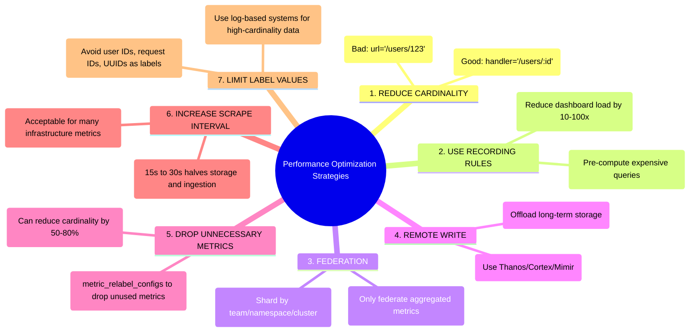

### 8.4 Benchmarks: Monitoring System Comparison

| System | Ingestion (samples/sec) | Query Speed | Storage Efficiency | Scalability |
|--------|------------------------|-------------|-------------------|-------------|
| Prometheus (single) | ~1M | Fast (local) | 1.3 bytes/sample | Single node |
| Thanos | ~10M+ | Good (distributed) | Object storage | Horizontal |
| Cortex/Mimir | ~50M+ | Good (distributed) | Object storage | Horizontal |
| VictoriaMetrics | ~5M (single) | Fast | 0.7 bytes/sample | Both |
| InfluxDB | ~1M | Fast | 3-4 bytes/sample | Enterprise only |
| TimescaleDB | ~500K | SQL-fast | PostgreSQL | PostgreSQL-based |
| M3DB (Uber) | ~Billions | Good | Compressed | Horizontal |
| Datadog | SaaS | SaaS | SaaS | SaaS |

---

## 9. Tradeoffs

### 9.1 Pull vs. Push Model

| Aspect | Pull (Prometheus) | Push (StatsD, Datadog) |
|--------|-------------------|----------------------|
| **Control** | Monitoring controls rate | Application controls rate |
| **Discovery** | Requires service discovery | Fire-and-forget |
| **Firewall** | Monitor reaches into targets | Targets push outward |
| **Short-lived jobs** | Problematic (need Pushgateway) | Natural fit |
| **Health detection** | `up` metric is free | Need separate health check |
| **Network topology** | May need ingress rules | Works behind NAT |
| **Backpressure** | Natural (just skip scrape) | Can overwhelm receiver |
| **Debugging** | Can manually curl /metrics | Must capture in transit |

### 9.2 Prometheus vs. Alternatives

```
When to USE Prometheus:
  ✓ Kubernetes-native environments
  ✓ Cloud-native microservices
  ✓ Need powerful querying (PromQL)
  ✓ Want open-source, community support
  ✓ Team comfortable with pull model
  ✓ Need strong alerting integration

When NOT to USE Prometheus (alone):
  ✗ Need years of data retention (use Thanos/Mimir)
  ✗ Need global multi-cluster view (use federation/Thanos)
  ✗ Very high cardinality workloads (> 10M series)
  ✗ Need SQL-based querying (use TimescaleDB)
  ✗ Need managed SaaS (use Datadog/New Relic)
  ✗ IoT with millions of push-only devices
```

### 9.3 Histogram vs. Summary

| Feature | Histogram | Summary |
|---------|-----------|---------|
| Aggregation across instances | ✅ Yes | ❌ No |
| Pre-defined buckets required | ✅ Yes | ❌ No |
| Accurate percentiles | Depends on buckets | Client-side accurate |
| Server-side computation | Yes (histogram_quantile) | Pre-computed |
| Cardinality impact | Higher (one series per bucket) | Lower |
| Recommendation | **Use for most cases** | Use only for single-instance |

### 9.4 Monitoring Costs at Scale

```
Cost Model for Self-Hosted Prometheus + Thanos:
  
  Infrastructure:
  - Prometheus servers: 3 × m5.2xlarge = $900/month
  - Thanos components: 5 × m5.xlarge = $750/month
  - Object storage (S3): 10TB × $0.023/GB = $230/month
  - EBS volumes: 3 × 500GB SSD = $150/month
  - Network transfer: ~$200/month
  Total: ~$2,230/month
  
  Hidden costs:
  - Engineering time to maintain: 0.5 FTE × $15,000/month = $7,500/month
  - On-call for monitoring infrastructure: Priceless (but expensive)
  
  Total TCO: ~$10,000/month for a mid-size deployment

Cost Model for Managed (Datadog):
  - 500 hosts × $23/host = $11,500/month
  - Custom metrics: 1000 × $0.05 = $50/month
  - APM: 500 hosts × $31/host = $15,500/month
  Total: ~$27,000/month
  
  But: Zero engineering maintenance, instant setup, integrated platform
```

---

## 10. Failure Scenarios

### 10.1 Prometheus Server Crash

**Scenario:** Prometheus server crashes or OOM kills.

**Impact:**
- Gap in metrics (no scraping during downtime)
- Active alerts may be lost
- Dashboards show no data

**Mitigation:**
```yaml
# Run two Prometheus replicas with same config
# Both scrape same targets independently
# Alertmanager deduplicates alerts from both

# Prometheus A
global:
  external_labels:
    replica: A

# Prometheus B (identical config except replica label)
global:
  external_labels:
    replica: B

# Thanos deduplicates at query time
# Thanos Query --store sidecar-a --store sidecar-b --query.replica-label replica
```

### 10.2 Cardinality Explosion

**Scenario:** A developer adds a label with unbounded values (e.g., user_id, request_id).

**Impact:**
```
Before: 10,000 time series, 40 MB memory
After:  10,000,000 time series, 40 GB memory → OOM!

Timeline:
  T+0:   Deploy with new metric label user_id=...
  T+5m:  Prometheus memory doubles
  T+15m: Prometheus at 90% memory
  T+20m: OOM killed
  T+21m: Prometheus restarts, replays WAL
  T+25m: OOM killed again
  T+30m: Monitoring is completely down
```

**Prevention:**
```yaml
# Limit series per scrape
scrape_configs:
  - job_name: 'risky-app'
    sample_limit: 10000
    
# Drop high-cardinality labels
metric_relabel_configs:
  - source_labels: [user_id]
    action: labeldrop
    
# Alert on cardinality
- alert: HighCardinality
  expr: prometheus_tsdb_head_series > 5000000
  for: 5m
  labels:
    severity: critical
  annotations:
    summary: "Cardinality explosion detected"
```

### 10.3 Scrape Target Overload

**Scenario:** A service returns 100,000+ metrics per scrape (common with JMX exporters).

**Impact:**
- Scrape takes longer than scrape_interval
- Missed scrapes → gaps in data
- High CPU on both Prometheus and target

**Solution:**
```yaml
# Increase scrape timeout for heavy targets
scrape_configs:
  - job_name: 'heavy-jmx'
    scrape_interval: 60s
    scrape_timeout: 30s
    metric_relabel_configs:
      # Keep only metrics we actually use
      - source_labels: [__name__]
        regex: '(jvm_memory|jvm_gc|jvm_threads|http_server).*'
        action: keep
```

### 10.4 Alertmanager Failure

**Scenario:** Alertmanager cluster loses quorum.

**Impact:**
- Alerts fire in Prometheus but notifications aren't sent
- Critical incidents go unnoticed
- **This is the worst failure mode: your alerting system itself is down**

**Mitigation:**
```yaml
# Run Alertmanager in HA mode (3+ replicas, mesh gossip)
alertmanager:
  replicas: 3
  config:
    cluster:
      peers:
        - alertmanager-0:9094
        - alertmanager-1:9094
        - alertmanager-2:9094

# Meta-alert: Alert on alerting being broken
- alert: AlertmanagerDown
  expr: up{job="alertmanager"} == 0
  for: 1m
  labels:
    severity: critical
    
# But wait—if Alertmanager is down, who sends this alert?
# Solution: Use a separate, simple monitoring system (deadman's switch)
# Healthchecks.io or a cron job that checks Alertmanager health
```

### 10.5 Clock Skew

**Scenario:** Servers in different regions have clock drift.

**Impact:**
- Metrics appear in the future or past
- Queries return incorrect results
- Rate calculations produce negative values

**Prevention:**
- NTP synchronization on all nodes
- Prometheus tolerates small skew (up to scrape_interval)
- Monitor NTP sync: `node_timex_sync_status`

### 10.6 Storage Corruption

**Scenario:** Disk corruption in Prometheus TSDB.

**Impact:**
- Prometheus fails to start
- Historical data lost

**Mitigation:**
```bash
# Prometheus can skip corrupted blocks
# On startup, check for corruption
promtool tsdb analyze /prometheus/data

# Remove corrupted block
rm -rf /prometheus/data/01CORRUPTED_BLOCK_ID/

# With Thanos: data is also in object storage
# Even if local TSDB is lost, historical data survives
```

---

## 11. Debugging & Observability

### 11.1 Prometheus Self-Monitoring

Prometheus monitors itself. Key metrics to watch:

```text
# Is Prometheus healthy?
up{job="prometheus"}

# How many time series are active?
prometheus_tsdb_head_series

# How many samples are ingested per second?
rate(prometheus_tsdb_head_samples_appended_total[5m])

# Are any scrapes failing?
up == 0

# How long do scrapes take?
scrape_duration_seconds

# How many samples are scraped per target?
scrape_samples_scraped

# Is the WAL corrupted?
prometheus_tsdb_wal_corruptions_total

# How much memory is the head block using?
prometheus_tsdb_head_chunks_storage_size_bytes

# Are any rules failing?
prometheus_rule_evaluation_failures_total

# How long do rule evaluations take?
prometheus_rule_group_last_duration_seconds

# Query performance
prometheus_engine_query_duration_seconds

# Are there any dropped samples?
prometheus_target_scrapes_sample_out_of_order_total
prometheus_target_scrapes_sample_duplicate_timestamp_total
```

### 11.2 Debugging Common Issues

**Issue: "No data" in Grafana**
```
Debugging checklist:
1. Check if target is up: up{job="my-app"}
2. Check scrape errors: 
   curl http://prometheus:9090/api/v1/targets
3. Check if metric exists:
   curl http://my-app:8080/metrics | grep metric_name
4. Check time range in Grafana (common: UTC vs local)
5. Check data source configuration in Grafana
6. Check if recording rules are evaluating:
   prometheus_rule_group_last_evaluation_timestamp_seconds
```

**Issue: "High cardinality warnings"**
```text
# Find metrics with most time series
topk(10, count by (__name__) ({__name__=~".+"}))

# Find labels causing cardinality explosion
count by (__name__, job) ({__name__=~".+"}) > 1000

# Check specific metric cardinality
count(http_requests_total) by (handler)
```

**Issue: "Slow queries"**
```text
# Find slow queries
topk(10, prometheus_engine_query_duration_seconds{quantile="0.99"})

# Common causes:
# 1. Query touches too many time series
# 2. Large time range without recording rules
# 3. Regex matchers on high-cardinality labels
# 4. histogram_quantile over many series

# Solution: Create recording rules
```

### 11.3 Grafana Debugging

```
Dashboard loading slowly?
1. Check query inspector (Ctrl+Shift+I in panel)
   - See actual PromQL sent
   - See response time
   - See number of data points

2. Check datasource health
   Settings → Data Sources → Test

3. Enable query caching
   Grafana 9+: Enable query result caching

4. Use $__rate_interval instead of hardcoded [5m]
   Automatically adjusts to scrape interval

5. Reduce time range or increase step
   Min step: 15s → 60s for overview dashboards
```

### 11.4 Monitoring the Monitoring (Meta-Monitoring)

```yaml
# Meta-monitoring: A separate, simple monitoring system
# that watches your primary monitoring
#
# Options:
# 1. A tiny Prometheus watching the main Prometheus
# 2. Healthchecks.io (SaaS dead man's switch)
# 3. AWS CloudWatch alarm on EC2/EKS health
# 4. Simple cron job + curl

# Dead man's switch alert:
# This alert ALWAYS fires. If Alertmanager stops sending it,
# the external system knows something is wrong.
groups:
  - name: dead-mans-switch
    rules:
      - alert: DeadMansSwitch
        expr: vector(1)
        labels:
          severity: none
        annotations:
          summary: "Dead man's switch - Prometheus and Alertmanager are working"

# Alertmanager routes it to an external watchdog
route:
  routes:
    - match:
        alertname: DeadMansSwitch
      receiver: 'watchdog'
      repeat_interval: 1m

receivers:
  - name: 'watchdog'
    webhook_configs:
      - url: 'https://nosnch.in/xxxx'  # Dead Man's Snitch
        send_resolved: false
```

---

## 12. Interview Questions

### Beginner Level

**Q1: What is the difference between metrics, logs, and traces?**
> **A:** Metrics are numerical measurements over time (CPU usage, request count). Logs are textual event records with timestamps (error messages, audit trails). Traces track individual requests across multiple services (request flow, latency breakdown). Metrics tell you *what* is wrong, logs tell you *what happened*, and traces tell you *where* the bottleneck is.

**Q2: Why does Prometheus use a pull model instead of push?**
> **A:** Pull gives Prometheus control over scrape rate (preventing overload), makes it easy to detect target failures (via the `up` metric), and allows operators to manually debug targets by hitting their `/metrics` endpoint. Push models risk overwhelming the monitoring system during traffic spikes and make it harder to detect if a service is truly down vs. just not emitting.

**Q3: What are the four Prometheus metric types?**
> **A:** Counter (monotonically increasing count), Gauge (value that can go up/down), Histogram (samples distributed in configurable buckets), and Summary (pre-calculated quantiles on the client). Counters are for things you count (requests, errors), Gauges for current levels (memory, connections), and Histograms/Summaries for distributions (latency).

### Intermediate Level

**Q4: You have 100 microservices, each with 500 metrics and 10 instances. How would you size your Prometheus?**
> **A:** Total series = 100 × 500 × 10 = 500,000 series. Memory: ~2GB for head block. Disk per day (15s interval): 500K × 5,760 × 1.3 bytes ≈ 3.7 GB. For 15 days retention: ~56 GB. A single m5.xlarge (4 CPU, 16GB RAM) with 100GB SSD would work. Add 50% headroom for spikes and queries. For production: run two replicas for HA. Use Thanos for long-term storage.

**Q5: Explain the difference between `rate()` and `irate()` in PromQL.**
> **A:** `rate()` calculates the per-second average rate of increase over the entire range window (e.g., 5 minutes). It smooths out spikes and is ideal for alerting and dashboards. `irate()` only uses the last two data points in the range window, showing the instantaneous rate. It's more volatile and sensitive to spikes. Best practice: use `rate()` for alerts and slow-moving dashboards, `irate()` for real-time debugging.

**Q6: How does Alertmanager prevent alert fatigue?**
> **A:** Several mechanisms: (1) **Grouping**: combines related alerts into single notifications (e.g., all pod failures for one service). (2) **Inhibition**: suppresses downstream alerts when a root cause alert fires (e.g., DB down inhibits all service errors). (3) **Silencing**: manually mute alerts during maintenance. (4) **Rate limiting**: `group_wait`, `group_interval`, `repeat_interval` control notification frequency.

### Advanced Level

**Q7: Design a monitoring system for a 1000-microservice architecture across 5 regions.**
> **A:** Use a hierarchical approach: (1) Per-cluster Prometheus instances with 15-day retention and recording rules. (2) Thanos Sidecars on each Prometheus uploading blocks to regional S3 buckets. (3) Thanos Query components in each region for regional views. (4) A global Thanos Query that federates across regions. (5) Thanos Compactor per region for downsampling. (6) Grafana with multi-datasource support pointing to regional and global Thanos Query. (7) Three-replica Alertmanager cluster per region with gossip mesh. Key considerations: network costs between regions, query timeout management, recording rules to pre-aggregate cross-service metrics.

**Q8: A Prometheus instance is OOM-killing every 30 minutes. Walk through your debugging process.**
> **A:** (1) Check `prometheus_tsdb_head_series` for cardinality explosion. (2) Find the culprit: `topk(10, count by (__name__) ({__name__=~".+"}))`. (3) Check if a recent deployment added high-cardinality labels: `count by (__name__, job) ({__name__=~".+"}) > 10000`. (4) Check WAL size: large WALs cause high memory on restart. (5) Check for expensive queries running against the head block. Solutions: drop high-cardinality metrics via `metric_relabel_configs`, increase memory, add `sample_limit` per scrape config, use recording rules to reduce query load.

**Q9: How would you implement monitoring for a service with exactly-once processing semantics?**
> **A:** Track: (1) `messages_received_total` (counter) per partition, (2) `messages_processed_total` (counter) per partition, (3) `messages_duplicates_detected_total` (counter), (4) `consumer_lag` (gauge) per partition (Burrow or consumer group metrics), (5) `processing_duration_seconds` (histogram), (6) `offset_committed_total` (counter) to track commit progress. Alert on: consumer lag > threshold, processing rate dropping, duplicate rate increasing. The key insight is monitoring the *gap* between what's received and what's committed, which reveals exactly-once violations.

### FAANG-Level Design Questions

**Q10: Design a monitoring platform like Datadog from scratch. What are the key architectural decisions?**

> **Expected answer covers:**
> 1. **Multi-tenant architecture**: Isolation between customers, resource quotas
> 2. **Ingestion pipeline**: Agent → Load balancer → Kafka → TSDB writers (horizontal scaling)
> 3. **Storage**: Custom TSDB optimized for append-heavy workloads, tiered storage (hot/warm/cold)
> 4. **Query engine**: Distributed query with partial results, query timeout, caching
> 5. **Alerting**: Distributed alert evaluation, at-least-once alert delivery
> 6. **Tag management**: Inverted index for fast tag queries, cardinality limits per customer
> 7. **Multi-region**: Region-local ingestion, cross-region replication for DR
> 8. **Cost optimization**: Downsampling, retention tiers, compute-storage separation

---

## 13. Exercises

### Exercise 1: PromQL Challenge (Beginner)

Write PromQL queries for:

1. Total HTTP request rate across all services
2. Error rate as a percentage for the `payment` service
3. 99th percentile latency for the `api-gateway`
4. Top 5 services by memory usage
5. Predict when disk will fill up at current growth rate

**Solutions:**
```text
# 1. Total HTTP request rate
sum(rate(http_requests_total[5m]))

# 2. Error rate percentage for payment service
sum(rate(http_requests_total{job="payment", status=~"5.."}[5m])) 
/ sum(rate(http_requests_total{job="payment"}[5m])) * 100

# 3. P99 latency for api-gateway
histogram_quantile(0.99, 
  sum by (le) (rate(http_request_duration_seconds_bucket{job="api-gateway"}[5m]))
)

# 4. Top 5 services by memory
topk(5, sum by (job) (process_resident_memory_bytes))

# 5. Disk full prediction
predict_linear(node_filesystem_avail_bytes{mountpoint="/"}[6h], 24*3600) < 0
```

### Exercise 2: Build a Custom Exporter (Intermediate)

Build a Prometheus exporter for a hypothetical message queue:

**Requirements:**
- Expose queue depth (gauge)
- Expose messages enqueued/dequeued rates (counters)
- Expose message processing latency (histogram)
- Expose consumer lag per partition (gauge)
- Health check endpoint

**Hints:**
- Use `io.prometheus.client` Java library
- Start HTTP server on port 9150
- Implement a `Collector` for dynamic metrics

### Exercise 3: Design Monitoring for an E-Commerce Platform (Advanced)

Design a complete monitoring solution for an e-commerce platform with:
- 50 microservices
- 3 regions
- PostgreSQL, Redis, Elasticsearch, Kafka
- Need 1-year data retention
- SLA: 99.99% uptime

**Deliverables:**
1. Architecture diagram (Prometheus, Thanos, Grafana layout)
2. Key metrics to track per service
3. Alerting rules (SLI/SLO based)
4. Dashboard designs for different audiences (SRE, Product, Executive)
5. Capacity planning for the monitoring infrastructure itself
6. Incident response runbooks

### Exercise 4: Implement SLO-Based Alerting (Expert)

Implement Google's SLO-based alerting using error budgets:

**Requirements:**
- Define SLI: Proportion of successful HTTP requests
- Define SLO: 99.9% success rate over 30 days
- Calculate error budget: 0.1% = 43.2 minutes of downtime per month
- Alert when error budget burn rate exceeds thresholds

```text
# Error budget burn rate alerting
# Multi-window, multi-burn rate approach (Google SRE book)

# 1-hour window, 14.4x burn rate (consuming monthly budget in 5 hours)
  (
    sum(rate(http_requests_total{status=~"5.."}[1h]))
    / sum(rate(http_requests_total[1h]))
  ) > (14.4 * 0.001)
AND
  (
    sum(rate(http_requests_total{status=~"5.."}[5m]))
    / sum(rate(http_requests_total[5m]))
  ) > (14.4 * 0.001)

# 6-hour window, 6x burn rate
  (
    sum(rate(http_requests_total{status=~"5.."}[6h]))
    / sum(rate(http_requests_total[6h]))
  ) > (6 * 0.001)
AND
  (
    sum(rate(http_requests_total{status=~"5.."}[30m]))
    / sum(rate(http_requests_total[30m]))
  ) > (6 * 0.001)
```

---

## 14. Expert Insights

### 14.1 The Cardinality Problem

> **"Cardinality is the single biggest operational challenge in monitoring at scale."**

Every unique combination of metric name and label values creates a new time series. In Prometheus, each active time series costs ~4KB of memory. Seemingly innocent changes can cause catastrophic cardinality explosions:

```
Dangerous patterns:
- Labels with user IDs:        Potentially millions of series
- Labels with request IDs:     Infinite cardinality
- Labels with timestamps:      Literally unbounded
- Labels with IP addresses:    Thousands to millions
- Labels with full URLs:       Unbounded (query params)
- Labels with error messages:  Thousands of unique strings
```

**How Netflix handles it:** Atlas has a strict cardinality limit per metric family. Exceeding it results in the metric being dropped entirely, with an alert to the owning team.

**How Uber handles it:** M3 Coordinator enforces per-metric cardinality limits and can apply automatic label dropping rules.

### 14.2 The Golden Signals

Google's SRE book defines four golden signals that every service should monitor:

```
1. LATENCY     - How long requests take
                 Track p50, p95, p99 (not average!)
                 Separate successful vs. failed request latency

2. TRAFFIC     - How much demand is placed on the system
                 HTTP requests/sec, network I/O, concurrent sessions

3. ERRORS      - Rate of failed requests
                 HTTP 5xx, gRPC errors, application exceptions

4. SATURATION  - How "full" the service is
                 CPU utilization, memory pressure, queue depth
                 Ideally includes utilization + limits + predictions
```

**USE Method (Brendan Gregg)** for infrastructure:
```
For every resource (CPU, memory, disk, network):
  - Utilization: How busy is it? (e.g., 75% CPU)
  - Saturation: How queued is it? (e.g., run queue length)
  - Errors: How many errors? (e.g., disk I/O errors)
```

**RED Method (Tom Wilkie)** for services:
```
For every service:
  - Rate: Requests per second
  - Errors: Failed requests per second
  - Duration: Distribution of request latencies
```

### 14.3 Grafana Dashboard Design: Lessons from Production

**The "Layers" approach to dashboard design:**

```
Layer 1: Executive Dashboard
  - Business metrics only
  - Revenue, active users, conversion rates
  - Red/green status indicators
  - No technical jargon

Layer 2: Service Overview Dashboard
  - One dashboard per service family
  - Golden signals: latency, traffic, errors, saturation
  - Drill-down links to detailed dashboards
  - Variable selectors: namespace, pod, time range

Layer 3: Deep-Dive Dashboard
  - JVM internals, database queries, cache stats
  - Used during incidents
  - Detailed enough for root cause analysis
  - Links to logs and traces

Layer 4: Infrastructure Dashboard
  - Node-level metrics: CPU, memory, disk, network
  - Kubernetes cluster health
  - Database replication lag
  - Network topology
```

**Anti-patterns in dashboard design:**
1. **Too many panels** → Nobody reads them all
2. **No variable selectors** → Hardcoded to one instance
3. **Average without percentiles** → Hides problems
4. **Missing thresholds** → Can't tell if values are good or bad
5. **No annotations** → Can't correlate changes with deployments
6. **Inconsistent units** → Confusion between bytes and bits, seconds and milliseconds

### 14.4 Monitoring at Scale: Thanos vs. Cortex vs. Mimir

```
Thanos:
  ✓ Minimal changes to existing Prometheus setup
  ✓ Sidecar model (non-invasive)
  ✓ Object storage for unlimited retention
  ✓ Global query view across clusters
  ✗ Query performance can degrade for cross-sidecar queries
  ✗ Compactor is a single point of failure (per bucket)
  Best for: Teams migrating from vanilla Prometheus

Cortex → Grafana Mimir:
  ✓ True multi-tenant monitoring
  ✓ Horizontally scalable ingestion
  ✓ Compatible with Prometheus remote write
  ✓ Better query performance for large-scale
  ✗ More complex to operate
  ✗ Requires more infrastructure
  Best for: SaaS providers, large multi-tenant environments

VictoriaMetrics:
  ✓ Drop-in Prometheus replacement
  ✓ Better compression (0.7 bytes/sample vs 1.3)
  ✓ Faster queries
  ✓ Simpler operations
  ✗ Smaller community
  ✗ Some PromQL incompatibilities
  Best for: Teams wanting better performance without architectural changes
```

### 14.5 Time Series Databases Deep Dive

#### InfluxDB
- **Data model:** Measurement + tag set + field set + timestamp
- **Query language:** InfluxQL (SQL-like) and Flux (functional)
- **Best for:** IoT, sensor data, DevOps monitoring
- **Limitation:** OSS version is single-node only

#### TimescaleDB
- **Built on:** PostgreSQL (extension)
- **Advantage:** Full SQL support, JOINs with relational data
- **Best for:** When you need SQL queries on time series + relational data
- **Unique feature:** Hypertables for automatic time-based partitioning

#### VictoriaMetrics
- **Compatibility:** PromQL-compatible remote write/read
- **Performance:** 2-5x better compression than Prometheus
- **Best for:** Drop-in Prometheus long-term storage
- **Architecture:** Single-binary or cluster mode

### 14.6 Common Mistakes Engineers Make

1. **Alerting on symptoms vs. causes:** Alert on "error rate > 5%" (symptom that affects users) rather than "CPU > 80%" (might not affect users).

2. **Setting `for: 0` on alerts:** This causes flapping. Always set a meaningful `for` duration (typically 5-15 minutes).

3. **Not using recording rules:** Dashboards that compute `histogram_quantile` on every panel load are slow. Pre-compute with recording rules.

4. **Monitoring only happy paths:** You need metrics on failures, timeouts, retries, circuit breaker states, and error categories.

5. **Not monitoring the monitoring:** If Prometheus goes down, who tells you? Implement meta-monitoring.

6. **Ignoring metric naming conventions:** `myService_requestCount` vs `http_requests_total`. Follow the [Prometheus naming conventions](https://prometheus.io/docs/practices/naming/).

7. **Using Prometheus for logging:** Prometheus is for metrics. Don't try to encode log messages as labels.

8. **Forgetting about retention:** Default 15 days. Plan for long-term storage from day one.

### 14.7 Monitoring Strategies

#### Infrastructure Monitoring
```
What to monitor on every server:
  - CPU: usage, steal, iowait
  - Memory: total, available, cached, swap usage
  - Disk: usage, I/O throughput, I/O latency, inode usage
  - Network: bandwidth, errors, retransmits, connection states
  - Process: open file descriptors, thread count

Kubernetes-specific:
  - Node status, conditions, pressure
  - Pod restarts, pending pods, evictions
  - Container resource usage vs. requests/limits
  - PersistentVolume capacity
  - API server latency and error rate
```

#### Application Performance Monitoring (APM)
```
For every microservice:
  - Request rate (by endpoint, method, status code)
  - Latency distribution (p50, p95, p99 by endpoint)
  - Error rate (by type: 4xx, 5xx, timeouts)
  - Dependency latency (database, cache, external APIs)
  - Circuit breaker states
  - Thread pool utilization
  - Connection pool utilization
  - JVM metrics (heap, GC, threads)
```

#### Synthetic Monitoring
```
Synthetic monitoring = Active probing from external locations

Implementation:
  - Periodically execute scripted user journeys
  - Measure: availability, response time, correctness
  - Run from multiple geographic locations
  - Alert on degradation before users complain

Tools: Grafana Synthetic Monitoring, Checkly, Pingdom
Use: SLA compliance, external availability validation
```

#### Real User Monitoring (RUM)
```
RUM = Passive collection from actual user sessions

Captures:
  - Page load time (DNS, TCP, TLS, TTFB, DOM)
  - Core Web Vitals (LCP, FID/INP, CLS)
  - JavaScript errors
  - API call latency from user perspective
  - Geographic distribution of users
  - Browser/device breakdown

Why: Synthetic monitoring tells you "can users reach us?"
     RUM tells you "what are users actually experiencing?"
```

#### Business Metrics Monitoring
```
Bridge the gap between technical metrics and business impact:

Examples:
  - Orders per minute (correlate with deployment events)
  - Checkout conversion rate (drops may indicate latency issues)
  - Payment success rate (failures may indicate API issues)
  - Search result quality (requires business metric pipelines)
  - Revenue per second (the ultimate SLI)

Implementation:
  - Emit business events as Prometheus counters
  - Create executive dashboards in Grafana
  - Set alerts on business metric anomalies
```

---

## 15. Chapter Summary

### Key Takeaways

- **Monitoring is not optional** in distributed systems. It's the foundation of reliability, debugging, and operational excellence.

- **Prometheus** is the de facto standard for cloud-native monitoring:
  - Pull-based model with service discovery
  - Dimensional data model (metric name + labels)
  - Powerful query language (PromQL)
  - Integrated alerting via Alertmanager
  - Local TSDB with 15-day default retention

- **Four metric types**: Counter (monotonic), Gauge (variable), Histogram (distribution), Summary (pre-computed quantiles). **Prefer histograms** over summaries for multi-instance deployments.

- **PromQL** enables powerful queries: `rate()`, `histogram_quantile()`, aggregations, predictions, and subqueries.

- **Grafana** provides visualization with templating, variables, and drill-down capabilities. Design dashboards in layers: executive → service → deep-dive → infrastructure.

- **Alerting best practices**: Alert on symptoms (not causes), use inhibition to prevent storms, set meaningful `for` durations, create runbooks, implement escalation policies.

- **Cardinality is the enemy** of monitoring at scale. Never use unbounded values (user IDs, URLs, etc.) as label values.

- **For scale beyond a single Prometheus**, use Thanos (sidecar model), Grafana Mimir (multi-tenant), or VictoriaMetrics (drop-in replacement).

- **The Golden Signals** (Latency, Traffic, Errors, Saturation) should be monitored for every service.

- **Monitor the monitoring** (meta-monitoring) using dead man's switches and external health checks.

- **Time series databases** (InfluxDB, TimescaleDB, VictoriaMetrics) offer different tradeoffs in compression, query language, and scalability.

- **Real-world systems** (Uber M3, Netflix Atlas, SoundCloud/Prometheus) demonstrate that monitoring at scale requires custom solutions for ingestion, storage, and query.

### Quick Reference

```
Monitoring Stack for Startups:
  Prometheus + Grafana + Alertmanager → Slack/PagerDuty

Monitoring Stack for Mid-Size:
  Prometheus + Thanos + Grafana + Alertmanager
  + Recording rules + Dashboards as code

Monitoring Stack for Enterprise:
  Grafana Mimir/Thanos + Grafana + Multi-region Alertmanager
  + Custom exporters + SLO-based alerting + Executive dashboards
  + Synthetic monitoring + RUM + APM integration

Or just use Datadog/New Relic if you can afford it and want to
focus engineering effort on product rather than monitoring infrastructure.
```

---

*Next Chapter: Chapter 26 — Event-Driven Architecture*
