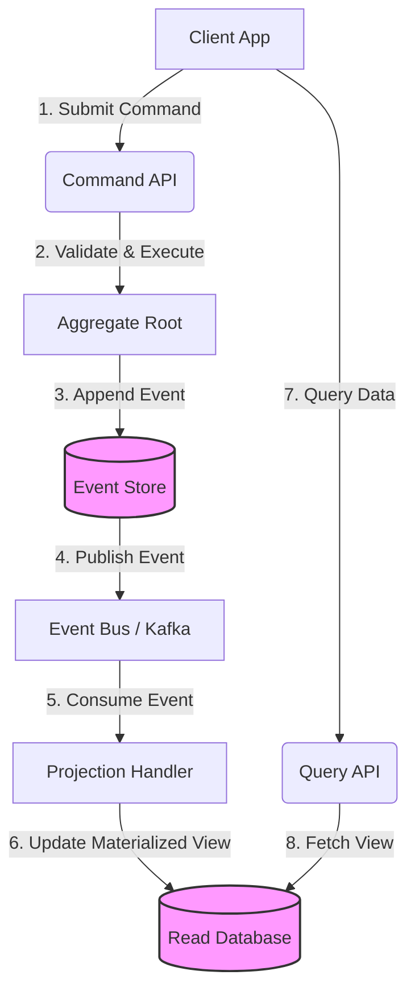
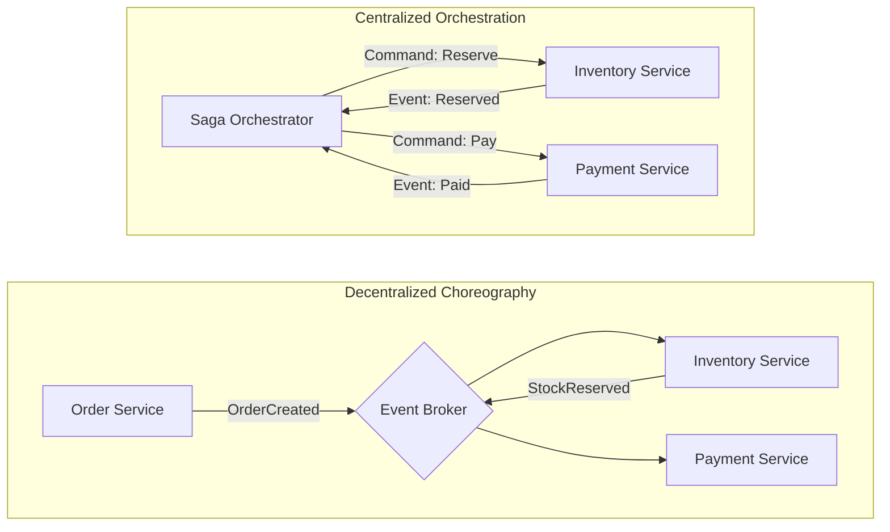
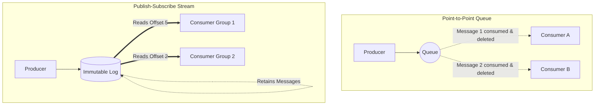

# Chapter 26: Event-Driven Architecture

## 1. Why This Matters

In the evolution of distributed systems, architects inevitably hit a wall with synchronous communication. Early microservice architectures simply replaced in-process method calls with remote procedure calls (RPC) over HTTP/REST or gRPC. While this separated deployment units, it maintained deep **temporal coupling**. 

When Service A synchronously calls Service B to complete a transaction, Service A cannot proceed until Service B responds. This creates several systemic vulnerabilities:
- **Cascading Failures:** If Service B experiences a slowdown or crash, Service A's thread pool is exhausted waiting for responses. This domino effect can bring down an entire cluster.
- **Availability Arithmetic:** The availability of synchronous systems is the product of their dependencies. If Service A (99.9% uptime) calls Service B (99.9%) and Service C (99.9%), the total transaction availability is $0.999 \times 0.999 \times 0.999 = 0.997$ (99.7%). The more services you chain together, the more fragile the system becomes.
- **Unpredictable Latency:** A chain of 5 microservices communicating synchronously means the total latency is the sum of all individual latencies, plus network overhead. A single slow node degrades the user experience globally.

Event-Driven Architecture (EDA) fundamentally shifts the paradigm. By introducing asynchronous event brokers and log-based streams, EDA breaks temporal coupling. Services no longer command other services to do work; instead, they announce that something happened (an "Event"). Other services, operating at their own pace, listen to these announcements and react accordingly.

This matters immensely in production environments because it enables:
1. **Load Leveling:** Sudden bursts of traffic don't overwhelm downstream services. The event stream acts as a shock absorber.
2. **Independent Scaling:** Fast producers and slow consumers can scale their infrastructure independently without dropping messages.
3. **Data Democratization:** Any new service can tap into the enterprise event stream without requiring API changes from the origin service, fostering incredible business agility.

## 2. Beginner Intuition

To truly grasp EDA, consider the analogy of a **Restaurant Kitchen**.

**The Synchronous Restaurant (REST/RPC):**
Imagine a waiter taking an order from a customer. In a synchronous world, the waiter walks to the kitchen, cooks the meal themselves, plates it, and brings it back to the customer. During this entire time, the waiter is blocked. They cannot serve any other tables. If the stove breaks, the waiter stands there helplessly. The throughput of the restaurant is strictly limited by the waiter's ability to execute every step linearly.

**The Event-Driven Restaurant (EDA):**
Now consider how a real restaurant operates. 
1. The waiter takes the order (receives a **Command**).
2. The waiter writes the order on a ticket and sticks it onto the kitchen's order rail (publishes an **Event**: "Order Placed").
3. The waiter immediately returns to the dining room to serve other customers.
4. The chefs (the **Consumers**) monitor the order rail. When a chef is free, they pull a ticket and start cooking.
5. When the food is ready, the chef rings a bell and puts the plate on the counter (publishes another **Event**: "Food Ready").
6. A runner hears the bell, picks up the food, and delivers it.

In the Event-Driven Restaurant, components are decoupled. The waiter doesn't need to know *how* to cook, nor do they need to wait for the food to be cooked. If there's a surge in customers, the tickets simply pile up on the rail (a **Queue**), acting as a buffer so the chefs aren't instantly overwhelmed. If a chef is slow, the waiter isn't blocked. This is the essence of Event-Driven Architecture.

Another intuition is the **Newspaper Subscription**. In a synchronous model, you would have to call the journalist every morning and ask, "Is there news today?" (Polling). In an event-driven model, you subscribe to the paper, and the publisher simply drops it at your door when it is ready. You react to its arrival asynchronously.

## 3. Core Theory

The foundation of EDA rests on understanding the distinct types of messages and the massive architectural patterns that emerge from them: Event Sourcing and CQRS.

### Events vs Commands vs Queries

It is a common pitfall to treat all messages over a broker as the same. They are semantically very different.

| Characteristic | Command | Query | Event |
| :--- | :--- | :--- | :--- |
| **Intent** | Request an action to happen. | Request data. | Notify that something *has* happened. |
| **Tense** | Imperative (`CreateUser`) | Imperative (`GetUser`) | Past Tense (`UserCreated`) |
| **Direction** | Point-to-Point (Targeted) | Point-to-Point | Publish-Subscribe (Broadcast) |
| **Mutability** | Can be rejected (Validation fails). | Pure function (No side effects). | Immutable (Cannot change history). |
| **Failure** | Must be handled by the caller. | Handled by caller. | Handled by the consumer (Producer doesn't care). |

### Event Sourcing (DETAILED)

**What it is and why:**
In traditional CRUD (Create, Read, Update, Delete) applications, the database stores the *current state* of an entity. If a user changes their address, the old address is overwritten. The history of how the system arrived at its current state is lost forever (unless you build complex, fragile audit tables).

**Event Sourcing** flips this entirely. Instead of storing the current state, you store a sequence of immutable, append-only *events* that represent state changes. The true source of truth is the event log (the ledger).

Why do this?
- **Perfect Auditability:** You have a flawless historical record of every change, crucial for financial systems, healthcare, and compliance.
- **Time-Travel Debugging:** You can reconstruct the state of the system at any specific millisecond in the past.
- **Avoiding Concurrent Update Anomalies:** Append-only operations are extremely fast and avoid complex locking scenarios associated with updates.

**Event Store Design:**
An Event Store is a specialized database optimized for appending logs and retrieving them in order. Each event belongs to an **Aggregate Stream** (e.g., `Account-123`). The store enforces optimistic concurrency control. When saving an event, the application specifies the `ExpectedVersion` of the aggregate. If another thread has appended an event in the meantime, the versions won't match, and the transaction is rejected, forcing the application to retry.

**Rebuilding State from Events:**
To get the current state of an entity, the application reads all events from the entity's stream and applies them sequentially to an empty object. In functional programming terms, this is a **Left Fold**.

```
Current State = Initial State + Event 1 + Event 2 + ... + Event N
```
If an account has events: `AccountCreated(balance: 0) -> Deposited(100) -> Withdrawn(30)`, the code replays these to arrive at a balance of 70.

**Snapshots:**
What happens when an aggregate has 100,000 events? Replaying them on every request would destroy performance. The solution is **Snapshotting**. Periodically (e.g., every 100 events), the system saves the current computed state as a snapshot. To load the aggregate, the system fetches the latest snapshot and only replays the events that occurred *after* the snapshot was taken.

**Event Versioning and Schema Evolution:**
Because event logs are immutable, you cannot go back and alter the schema of an event written 5 years ago. This creates massive challenges. How do you handle schema evolution?
- **Upcasting:** The most common pattern. When reading an old `UserCreated_V1` event from the store, an intermediate layer (the Upcaster) transforms it in-memory into a `UserCreated_V2` event before passing it to the domain logic. This keeps the domain model clean of legacy event structures.
- **Weak Schemas:** Storing events as flexible JSON blobs. Easier to evolve, but prone to runtime serialization errors.
- **Strong Schemas:** Using Avro/Protobuf with strict compatibility rules.

**Pros and Cons:**
*Pros:* Ultimate truth, perfect audit, domain-driven design alignment, high write performance.
*Cons:* Immense cognitive load for developers, dealing with eventual consistency, complexity in querying (you cannot easily query "give me all users older than 25" directly from an event store), and dealing with Right to be Forgotten (GDPR) in an immutable append-only log (usually solved by Crypto-shredding: throwing away the encryption key for that user's events).

### CQRS (Command Query Responsibility Segregation)

**Why separate reads and writes?**
In complex domains, the data model used to validate business logic and process transactions (Writes/Commands) is fundamentally different from the data model needed to serve UI views (Reads/Queries).
A write model requires normalized data to enforce invariants and ACID transactions. A read model requires denormalized, flattened data optimized for fast retrieval (e.g., avoiding 7-table SQL joins).
CQRS states that the Command model and the Query model should be completely separated, often having different APIs, different object models, and crucially, different databases.

**Implementation Patterns:**
1. **Single Database CQRS:** Separate Command and Query classes in code, but they hit the same underlying RDBMS. Commands use an ORM (Hibernate) for complex logic; Queries use raw SQL/JDBC for speed.
2. **Dual Database CQRS (True CQRS):** Commands write to a highly consistent store (like an Event Store or PostgreSQL). Events are published indicating the change. An asynchronous process listens to these events and updates a Read database heavily optimized for queries (like Elasticsearch for text search, or Redis for fast key-value lookups).

**CQRS + Event Sourcing Combination:**
This is the ultimate marriage in EDA.
- The **Write Side** processes Commands. It executes business logic and appends Events to the Event Store.
- The **Read Side** (Projections) listens to the Event Store. When a new event is appended, the projector transforms the event and updates materialized views in the Read Database.

**Eventual Consistency Challenges:**
The split between write and read DBs introduces Eventual Consistency. When a user submits a command to update their profile, the write is fast. The UI immediately refreshes and queries the Read DB. However, the background projection may take 50 milliseconds to update the Read DB. Result: The user sees their *old* profile data and assumes the update failed.
*Solutions:* 
- UI simulates the update locally.
- Backend returns a `CorrelationID` with the command response. The UI polls the Read DB waiting for the resource associated with that `CorrelationID` to appear.
- Push notifications via WebSockets when the projection completes.

### Message Queues vs Event Streams

It is critical to distinguish between traditional message queues and modern event streams.

**Point-to-Point (Message Queues like RabbitMQ, ActiveMQ, SQS):**
- **Architecture:** Messages are sent to a queue. Consumers connect to the queue and pull messages.
- **Destructive Read:** Once a consumer acknowledges (ACKs) a message, the broker deletes it from the queue.
- **Competing Consumers:** Multiple consumers can listen to the same queue to load-balance work. The broker ensures each message is delivered to only *one* consumer.
- **Best for:** Task distribution, background jobs (e.g., sending emails, resizing images).

**Publish-Subscribe (Event Streams like Kafka, Pulsar, Kinesis):**
- **Architecture:** Events are appended to an immutable, partitioned log.
- **Non-Destructive Read:** Consumers read from the log but do not delete the messages. Messages are retained based on a configured policy (e.g., 7 days, or indefinitely).
- **Multiple Consumer Groups:** Multiple different applications can read the *same* event stream independently. Consumer A might be updating a search index, while Consumer B is triggering an email. They maintain their own independent "offset" (cursor) in the log.
- **Replayability:** Because messages aren't deleted, a new consumer can be attached and replay the entire history of events from the beginning of time.
- **Best for:** System-wide data distribution, Event Sourcing, real-time analytics.

**Exactly-once delivery challenges:**
In distributed systems, networks drop packets. If a producer sends a message and doesn't get an ACK, it must retry. This leads to **At-Least-Once** delivery, meaning duplicate messages are inevitable.
Achieving "Exactly-Once" is theoretically impossible without coordination (Two Generals' Problem). Modern brokers like Kafka provide "Exactly-Once Semantics" (EOS) via distributed transactions and idempotent producer IDs, ensuring that even if a producer retries, the broker deduplicates the append. However, this only covers the Producer -> Broker leg. For the full end-to-end exactly-once guarantee, the Consumer *must* implement Idempotency.

### Event-Driven Patterns

How much data should an event contain?

1. **Event Notification (Thin Events):**
   - Payload: `{"eventType": "UserUpdated", "userId": "123"}`
   - Pros: Tiny payload, minimal broker overhead.
   - Cons: The consumer knows the user updated, but doesn't know *what* changed. The consumer must make a synchronous REST call back to the producer to fetch the new user state. This introduces reverse temporal coupling and can cause a DDOS attack on the producer if millions of events are processed simultaneously.

2. **Event-Carried State Transfer (Fat Events):**
   - Payload: `{"eventType": "UserUpdated", "userId": "123", "oldName": "Bob", "newName": "Alice", "email": "alice@x.com"}`
   - Pros: Consumer has everything it needs. No callbacks to the producer. Maximum decoupling.
   - Cons: Huge payloads. Data duplication across the enterprise. The broker essentially becomes a massive data integration pipe.

3. **Domain Events:**
   - Emitted by an Aggregate Root. They represent things that happened *inside* a specific business domain. They are highly granular (e.g., `ItemAddedToCart`, `CartCheckedOut`). Used primarily for internal coordination within a single microservice boundary.

4. **Integration Events:**
   - Used for communication *between* different microservices (bounded contexts). They are usually flattened, sanitized, and abstracted versions of Domain Events. You don't want to expose internal domain intricacies to external services.

## 4. Architecture Deep Dive

### Choreography vs Orchestration

When a complex business process spans multiple microservices (e.g., E-commerce Order Fulfillment involves Order, Inventory, Payment, and Shipping services), how do you coordinate the workflow?

**Choreography:**
- **Mechanism:** Decentralized. There is no central controller. Services act like dancers responding to the music (events).
- **Flow:** Order Service emits `OrderCreated`. Inventory Service listens, reserves stock, and emits `InventoryReserved`. Payment Service listens to that, processes payment, emits `PaymentProcessed`. Shipping listens to that and ships.
- **Pros:** Extremely loose coupling. No single point of failure. Easy to add a new step (just write a new consumer).
- **Cons:** Monitoring the overall state of an order is difficult. It requires complex distributed tracing. Understanding the business flow requires looking at the code of 5 different repositories. If something fails midway, implementing compensating transactions (undoing previous steps) across decoupled services is a nightmare.

**Orchestration (Saga Pattern):**
- **Mechanism:** Centralized. A dedicated service (the Orchestrator or Conductor) manages the workflow state machine.
- **Flow:** The Order Orchestrator tells Inventory "Reserve Stock" (Command). Inventory replies "Stock Reserved" (Event). Orchestrator then tells Payment "Process Payment".
- **Pros:** The workflow is defined explicitly in one place. You can instantly query the orchestrator to see the status of an order. Error handling and compensating transactions (rolling back) are much easier to manage.
- **Cons:** The Orchestrator becomes a point of deep conceptual coupling. It dictates logic to other services. Risk of the orchestrator becoming an overly smart monolithic "god service" while the domain services become anemic CRUD wrappers.

### Dead Letter Queues (DLQ)

Failures in event consumers are inevitable. They fall into two categories:
1. **Transient Failures:** Database is locked, network blip. Solution: Retry with exponential backoff.
2. **Non-Transient Failures (Poison Pills):** The event payload is malformed JSON, or it violates a strict database constraint that will never resolve.

If a consumer infinitely retries a Poison Pill, it blocks the processing of all subsequent valid events (especially in partitioned streams like Kafka where order is strict). 
To solve this, configure a **Dead Letter Queue**. If an event fails processing after $N$ retries, the consumer acknowledges the bad message (to clear it from the main topic) and republishes it to a separate DLQ topic. Engineers can monitor the DLQ, debug the payload, fix the code, and later replay the DLQ back into the main pipeline.

### Event Schema Management

As an event-driven system ages, the shape of the data will change. You will add fields, rename fields, or change data types. If a producer suddenly changes the JSON schema, hundreds of downstream consumers will crash with deserialization errors.

**Schema Registry:**
A centralized repository (like Confluent Schema Registry) that stores the schemas of all events.
- Producers serialize data into binary formats (Avro or Protobuf). Before publishing, they check the Schema Registry to ensure the event structure is compatible.
- The payload sent to the broker contains a small header with the Schema ID.
- Consumers read the Schema ID, fetch the exact schema from the Registry, and deserialize the binary data back into objects.

**Avro vs Protobuf:**
- **Avro:** Native to the Hadoop/Kafka ecosystem. The schema is stored separately from the code. It is dynamically typed, making it excellent for generic data processing tools that don't want to compile Java code for every event type.
- **Protobuf:** Google's standard. Heavily tied to code generation. Very fast, but less flexible for dynamic stream processors.

Compatibility Rules:
- **Backward Compatibility:** Consumers using the NEW schema can read data written by producers using the OLD schema. (Crucial for upgrading consumers before producers).
- **Forward Compatibility:** Consumers using the OLD schema can read data written by producers using the NEW schema. (Crucial for upgrading producers before consumers).

### Idempotent Consumers

Because brokers guarantee at-least-once delivery, your consumer *will* receive the same event twice eventually. If the event is `ChargeCreditCard($100)`, processing it twice is catastrophic.
**Idempotency** means that applying an operation multiple times has the same outcome as applying it once. $f(f(x)) = f(x)$.

**Implementation:**
1. **Natural Idempotency:** Setting `status = 'SHIPPED'` is naturally idempotent. Doing it 10 times results in the same state.
2. **Artificial Idempotency (Idempotency Keys):** The producer generates a unique `EventID` (UUID). The consumer maintains an `Processed_Events` table in its database.
   - When an event arrives, the consumer starts a local database transaction.
   - It attempts to insert the `EventID` into the `Processed_Events` table.
   - If the insert fails (Unique Constraint Violation), it means the event was already processed. The consumer simply drops the message and ACKs it.
   - If the insert succeeds, it executes the business logic and commits the transaction.

### Event Ordering Guarantees

In queues like RabbitMQ, global ordering is nearly impossible if you have multiple consumers.
In streams like Kafka, ordering is guaranteed **only within a single partition**.
If a topic has 10 partitions, events are distributed across them. If order matters (e.g., `UserCreated` must process before `UserUpdated`), you must ensure both events land in the *same* partition.
This is done using a **Partition Key**. By setting the `Partition Key = UserID`, the producer hashes the UserID and maps it to a specific partition. All events for User 123 will strictly land in Partition 4, guaranteeing strict chronological processing for that specific user, while allowing massively parallel processing across millions of other users.

## 5. Visual Diagrams

### Event Sourcing & CQRS Flow


### Choreography vs Orchestration


### Message Queue vs Event Stream


## 6. Real Production Examples

**Uber (Dispatch & Real-time Telemetry):**
Uber utilizes Event-Driven Architecture at an unprecedented scale. Their entire trip lifecycle is modeled as events. When a driver accepts a ride, a `RideAccepted` event is pushed to Kafka. This single event triggers dozens of downstream systems: pricing engines recalculate surge multipliers, telemetry systems update the driver's GPS coordinates on the rider's app, and fraud detection algorithms run real-time heuristics. Uber relies heavily on Kafka's partitioning by `CityID` or `TripID` to ensure strict ordering and localized processing.

**LinkedIn (The Birthplace of Kafka):**
LinkedIn invented Kafka to solve their massive event integration problems. Every click, profile view, and connection request is an event. They use these streams to power the "Who viewed your profile" feature in near real-time, feed massive Hadoop data lakes for offline machine learning (friend recommendations), and update search indices. Their architecture relies heavily on Confluent Schema Registry (using Avro) to manage schema evolution across thousands of microservices.

**Netflix (Keystone Pipeline):**
Netflix's streaming telemetry pipeline processes trillions of events per day. Every time a user hits play, pause, or experiences buffering, events are streamed. Netflix uses a combination of Kafka for buffering and Apache Flink for real-time stream processing. They utilize "Event-Carried State Transfer" extensively to enrich events in-flight, ensuring that downstream analytics databases don't have to perform expensive joins across microservices.

**Amazon EventBridge (Serverless EDA):**
AWS built EventBridge to facilitate serverless event-driven architectures. Unlike Kafka, which is a log, EventBridge acts as a sophisticated routing engine. Services emit JSON events, and EventBridge uses complex pattern matching rules to route these events to AWS Lambda functions, SQS queues, or third-party SaaS endpoints. It is the backbone of modern cloud-native choreography, abstracting away the underlying infrastructure completely.

## 7. Java Implementations

To bridge theory and practice, let us look at production-grade Java implementations. We will implement the core components of an Event Sourcing system and an idempotent Kafka consumer using Spring Boot concepts.

### Event Sourcing: Aggregate Root and Event Store

In Event Sourcing, the `AggregateRoot` is responsible for receiving commands, validating them, generating events, and applying those events to mutate its own state.

```java
import java.util.ArrayList;
import java.util.List;
import java.util.UUID;

// 1. Define the Events
abstract class DomainEvent {
    public final UUID eventId = UUID.randomUUID();
    public final long timestamp = System.currentTimeMillis();
}

class AccountCreatedEvent extends DomainEvent {
    public final UUID accountId;
    public final String owner;
    
    public AccountCreatedEvent(UUID accountId, String owner) {
        this.accountId = accountId;
        this.owner = owner;
    }
}

class MoneyDepositedEvent extends DomainEvent {
    public final UUID accountId;
    public final double amount;
    
    public MoneyDepositedEvent(UUID accountId, double amount) {
        this.accountId = accountId;
        this.amount = amount;
    }
}

// 2. The Aggregate Root
public class BankAccountAggregate {
    private UUID id;
    private String owner;
    private double balance;
    
    // Internal list of uncommitted events to be flushed to the DB
    private final List<DomainEvent> uncommittedEvents = new ArrayList<>();
    private int version = 0;

    // Constructor for rebuilding state from history
    public BankAccountAggregate(List<DomainEvent> history) {
        for (DomainEvent event : history) {
            applyChange(event, false);
        }
    }

    // Command Handler for Creation
    public BankAccountAggregate(UUID id, String owner) {
        applyChange(new AccountCreatedEvent(id, owner), true);
    }

    // Command Handler for Business Logic
    public void deposit(double amount) {
        if (amount <= 0) throw new IllegalArgumentException("Amount must be positive");
        applyChange(new MoneyDepositedEvent(this.id, amount), true);
    }

    // The State Mutator (The Left Fold mechanism)
    private void applyChange(DomainEvent event, boolean isNew) {
        if (event instanceof AccountCreatedEvent) {
            this.id = ((AccountCreatedEvent) event).accountId;
            this.owner = ((AccountCreatedEvent) event).owner;
            this.balance = 0;
        } else if (event instanceof MoneyDepositedEvent) {
            this.balance += ((MoneyDepositedEvent) event).amount;
        }
        
        this.version++;
        if (isNew) {
            uncommittedEvents.add(event);
        }
    }

    public List<DomainEvent> getUncommittedEvents() { return uncommittedEvents; }
    public void markChangesAsCommitted() { uncommittedEvents.clear(); }
    public double getBalance() { return balance; }
}
```

### Idempotent Kafka Consumer

To handle Kafka's at-least-once delivery guarantee, the consumer must enforce idempotency using a database transaction.

```java
import org.springframework.kafka.annotation.KafkaListener;
import org.springframework.stereotype.Service;
import org.springframework.transaction.annotation.Transactional;
import org.springframework.dao.DataIntegrityViolationException;

@Service
public class PaymentProcessingConsumer {

    private final ProcessedEventRepository eventRepository;
    private final PaymentService paymentService;

    public PaymentProcessingConsumer(ProcessedEventRepository repo, PaymentService service) {
        this.eventRepository = repo;
        this.paymentService = service;
    }

    @KafkaListener(topics = "orders.payment-required", groupId = "payment-processor-group")
    @Transactional
    public void handlePaymentRequiredEvent(PaymentRequiredEvent event) {
        try {
            // 1. Attempt to insert the Event ID into the deduplication table
            // This table must have a UNIQUE constraint on the eventId column.
            ProcessedEventRecord record = new ProcessedEventRecord(event.getEventId());
            eventRepository.saveAndFlush(record);

            // 2. If saveAndFlush succeeds, the event is new. Process business logic.
            paymentService.chargeCreditCard(event.getCustomerId(), event.getAmount());
            
            System.out.println("Payment processed successfully for event: " + event.getEventId());

        } catch (DataIntegrityViolationException e) {
            // 3. Catch unique constraint violation. This means duplicate event!
            System.out.println("Duplicate event ignored: " + event.getEventId());
            // We swallow the exception so Kafka can ACK the message and move the offset forward.
        }
    }
}
```

## 8. Performance Analysis

When moving from a synchronous architecture to an event-driven one, the performance profile of the system changes radically.

**Throughput vs Latency:**
EDA systems are generally optimized for **throughput** over latency. In a REST API, you might process a request in 50ms synchronously. In EDA, pushing to a broker takes 2ms, but the consumer might not pick it up for 200ms. Therefore, end-to-end latency often increases, but the system can handle millions of concurrent requests without dropping them, massively increasing total throughput.

**Broker Bottlenecks (Disk IO):**
Kafka is bounded by Disk I/O and Network bandwidth. Because Kafka writes every event sequentially to an append-only log on disk, leveraging the OS page cache, it can achieve millions of writes per second on standard magnetic drives. The bottleneck usually becomes network egress when multiple consumers are reading massive streams.

**Consumer Lag:**
The most critical performance metric in EDA is **Consumer Lag** (the difference between the latest offset produced and the latest offset consumed). If lag grows unbounded, your system is failing. Solutions include:
- Increasing partitions and adding more consumer instances.
- Batch processing: Instead of processing events one by one, consumers pull batches of 500 and execute bulk inserts into the database.
- Tuning `fetch.min.bytes` to compress network traffic.

## 9. Tradeoffs

Adopting EDA is not a silver bullet. The architectural tradeoff is profound.

**Pros:**
- **Decoupling:** Teams can build and deploy consumers independently without asking producers for permission.
- **Resilience:** The failure of one service does not take down the system. Messages simply queue up until the service recovers.
- **Scalability:** Extreme horizontal scalability, constrained only by partition counts.
- **Auditability:** Event Sourcing provides a time-machine for your business state.

**Cons (The Heavy Costs):**
- **Mental Complexity:** Developers must shift from linear, imperative thinking to asynchronous, reactive thinking. "Fire and forget" makes debugging vastly harder.
- **Eventual Consistency:** The UI must be redesigned to handle data that hasn't arrived yet. The CAP theorem forces us to choose Availability and Partition tolerance (AP) over strict Consistency.
- **Operational Burden:** Managing Kafka, Zookeeper/KRaft, Schema Registries, and distributed tracing requires highly specialized DevOps skills.
- **Data Duplication:** Event-carried state transfer implies replicating data across multiple service databases, increasing storage costs and the risk of stale data.

## 10. Failure Scenarios

Distributed event systems fail in exotic and painful ways.

1. **The Poison Pill:** A producer accidentally publishes a message with a malformed JSON payload or a schema that violates a database constraint on the consumer. The consumer crashes, restarts, pulls the same message, crashes again. This blocks the partition entirely. *Mitigation: Dead Letter Queues (DLQ) and schema registries.*
2. **The Retry Storm:** A downstream database goes offline. 50 consumers immediately fail their processing and throw exceptions. If unmanaged, they will retry in tight loops, DDOS-ing the broker and the database as it tries to recover. *Mitigation: Exponential backoff with jitter in the consumer retry policy.*
3. **Split Brain / Zombie Consumers:** A consumer enters a long Garbage Collection (GC) pause. Kafka assumes it died and reassigns its partition to another consumer. The first consumer wakes up, finishes processing, and tries to commit its offset, resulting in a conflict or duplicate processing. *Mitigation: Fencing tokens and strict idempotency checks.*
4. **Network Partitions:** The link between the producer and the broker goes down. If the producer is synchronous, it blocks. If it is asynchronous, it buffers messages in memory until it runs out of RAM and crashes (OOM). *Mitigation: Configure bounded memory buffers and decide whether to drop messages or block the application when the buffer is full.*

## 11. Debugging & Observability

Observability in an Event-Driven Architecture is non-negotiable. Without it, you are flying blind in a hurricane. Because processing is asynchronous, a user's request might span 10 different microservices across hours.

**Distributed Tracing:**
This is the only way to reconstruct the narrative of a transaction.
- When an API gateway receives an HTTP request, it generates a unique `TraceID` (e.g., using OpenTelemetry).
- When the API publishes an event to Kafka, it injects the `TraceID` into the Kafka message headers.
- Every consumer that picks up the event extracts the `TraceID` from the header, logs it, and passes it forward if it produces new events.
- Tools like Jaeger, Zipkin, or Datadog stitch these traces together into a visual Gantt chart, revealing exactly where bottlenecks occur.

**Log Correlation:**
All logs written by the application must include the `TraceID` and `SpanID`. Structured logging (JSON format) allows centralized logging platforms (ELK stack, Splunk) to query: "Show me all log lines across all microservices where TraceID = X".

**Critical Metrics:**
You must monitor:
- **Consumer Lag:** Alert aggressively if lag increases continuously.
- **DLQ Depth:** A non-zero DLQ means manual intervention is required. Messages are failing.
- **Producer Send Errors:** Indicates network issues or broker unavailability.
- **End-to-End Latency:** Time from the initial event publication to the final projection update.

## 12. Interview Questions

Event-driven concepts are heavily tested in senior engineering and architecture interviews.

**Beginner:**
*Q: What is the semantic difference between a Message Queue (RabbitMQ) and an Event Stream (Kafka)?*
A: A message queue is point-to-point; once a message is consumed and acknowledged, it is deleted. An event stream is an immutable log; messages remain on disk, allowing multiple independent consumer groups to read the same stream and even replay historical data.

**Intermediate:**
*Q: You have an e-commerce system using EDA. How do you handle a scenario where an 'OrderUpdated' event arrives at the consumer before the 'OrderCreated' event due to network routing anomalies?*
A: This is the out-of-order event problem. 
1. The producer must use a Partition Key (e.g., OrderID) to ensure both events land in the same Kafka partition, guaranteeing ordered delivery.
2. If using a system without strict ordering, the consumer must track state. If it receives 'Updated' for an unknown order, it can either put it in a temporary "wait buffer" or NACK it to be retried later when 'Created' has hopefully arrived.

**Advanced:**
*Q: Explain how you would implement the Saga pattern to handle a transaction spanning Inventory and Payment. What happens if Payment fails?*
A: I would use an Orchestration Saga. The Order service creates a 'PENDING' order and tells the Saga Orchestrator to begin. The orchestrator sends a 'ReserveStock' command to Inventory. Inventory replies 'Reserved'. The orchestrator sends a 'ChargeCard' command to Payment. If Payment fails and replies 'CardDeclined', the orchestrator must execute a Compensating Transaction. It sends a 'ReleaseStock' command back to the Inventory service to undo the previous step, and finally marks the order as 'FAILED'.

**FAANG-Level System Design:**
*Q: Design a financial ledger using Event Sourcing and CQRS that handles 10,000 transactions per second globally, ensuring no money is lost even if a data center burns down.*
A: (Expected points) Focus on Multi-Region Kafka clusters. Discuss the Event Store design with optimistic concurrency control using version numbers to prevent race conditions. Explain the separation of the write path (appending to log) and read path (projecting balances to an in-memory datastore like Redis for fast balance lookups). Discuss exactly-once processing semantics using database idempotency keys tied to transaction UUIDs.

## 13. Exercises

**Conceptual:**
Draw a sequence diagram for a user changing their email address in a CQRS + Event Sourced system. Detail every step from the UI click to the UI finally displaying the new email, taking Eventual Consistency into account.

**System Design:**
Design an architecture for a massive multiplayer online game (MMO) leaderboards system. Game servers stream millions of kill/death events per minute. The web dashboard must show real-time rankings.

**Coding:**
Write a simple Node.js or Java program that implements an Event Store utilizing a local PostgreSQL database. Write a `LeftFold` function to reconstruct a `ShoppingCart` aggregate from a stream of `ItemAdded` and `ItemRemoved` events. Implement a Snapshot optimization to the logic.

## 14. Expert Insights

**The GDPR Dilemma in Event Sourcing:**
Event sourcing relies on the immutability of the log. "Never update, never delete." But the EU's GDPR dictates the "Right to be Forgotten" (RTBF). If a user demands their data be deleted, you cannot simply go delete old events from an immutable Kafka log.
*Industry Solution:* **Crypto-Shredding**. Before writing sensitive PII to the event payload, encrypt the PII payload with a unique symmetric key generated specifically for that user. Store the key in a highly secure Key Management System (KMS). When the user requests deletion, you simply delete their encryption key from the KMS. The events in the immutable log remain, but the payload becomes permanently indecipherable cryptographic noise.

**The Complexity Tax:**
The biggest mistake companies make is adopting EDA everywhere. Event Sourcing is incredible for core domains (Ledgers, Order State Machines, Inventory), but it is a massive overkill for simple CRUD supporting domains (e.g., managing a list of static categories). Use EDA surgically where the decoupling and temporal advantages justify the massive cognitive and operational tax.

## 15. Chapter Summary

- **Synchronous architectures** suffer from temporal coupling, cascading failures, and complex availability math.
- **Event-Driven Architecture (EDA)** solves this by decoupling producers and consumers through asynchronous event brokers.
- A **Command** requests an action; an **Event** states a fact that already occurred.
- **Event Sourcing** stores the history of facts (events) as the single source of truth, deriving current state by replaying them.
- **CQRS** physically and logically separates the write model from the read model, allowing each to scale and be modeled independently.
- **Eventual Consistency** is the inherent tradeoff of CQRS and distributed projections.
- **Publish-Subscribe streams** (like Kafka) provide immutable, replayable logs, unlike traditional destructive point-to-point message queues.
- **Idempotency** is required on the consumer side to handle the inevitable at-least-once delivery duplicates.
- **Dead Letter Queues (DLQ)** protect pipelines from poison messages that would otherwise block processing infinitely.
- EDA is highly resilient and scalable, but it demands robust observability (distributed tracing) and a fundamental shift in how engineers conceptualize data consistency and workflow choreography.
