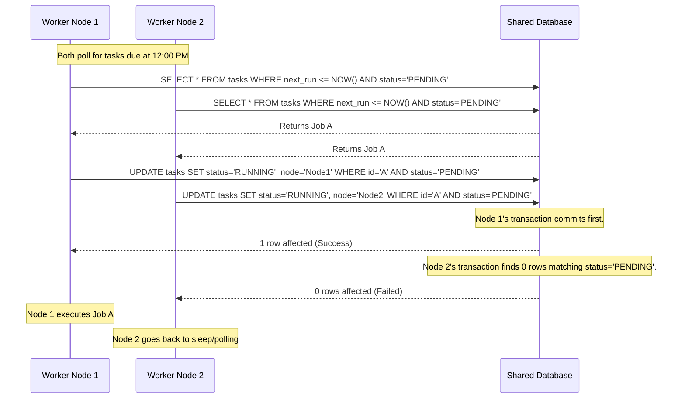
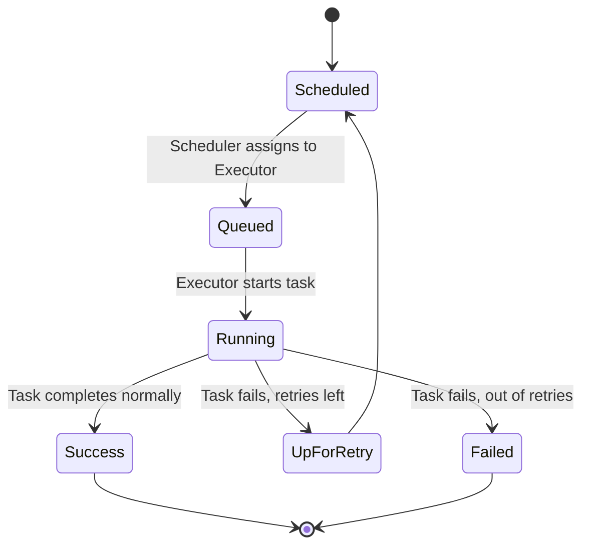

# Chapter 27: Distributed Scheduling

## 1. Why This Matters

As software systems grow from monolithic applications to microservices architectures, the need to execute tasks asynchronously, periodically, or as part of complex workflows becomes paramount. In a single-node system, scheduling a job is trivial—a simple `cron` daemon or a thread pool executor suffices. However, in a distributed environment involving hundreds or thousands of nodes, scheduling becomes a formidable challenge.

Distributed scheduling matters because modern applications require:
- **Fault Tolerance:** If the node executing a critical financial transaction or data pipeline crashes, the system must detect this and retry the task elsewhere without duplicating it.
- **Scalability:** Organizations process billions of events daily. A single machine cannot hold all scheduled tasks in memory or execute them within the required timeframes.
- **Stateful Workflows:** Many business processes (e.g., e-commerce order fulfillment, onboarding a new employee) span minutes, hours, or even weeks. These long-running processes require durable state management across multiple discrete steps.
- **Resource Optimization:** In large clusters, running workloads efficiently means packing jobs onto machines in a way that maximizes CPU and memory utilization, exactly what cluster schedulers like Kubernetes, Mesos, or Google's Borg do.

Understanding distributed scheduling is essential for building resilient backend systems. Whether you are scheduling a nightly database backup, triggering a series of microservices to process a payment, or orchestrating massive machine learning training jobs across a fleet of GPUs, distributed scheduling is the engine that drives asynchronous computation.

## 2. Beginner Intuition

Imagine you manage a large factory with thousands of workers (nodes). You have a massive whiteboard (the scheduler) where you write down tasks that need to be done.

**Single Node Cron:** You are the only worker. You look at your watch, see it's 5 PM, and take out the trash. Easy.
**Distributed Cron:** You have 10 janitors. At 5 PM, taking out the trash must happen *exactly once*. If all 10 janitors see the clock strike 5 PM and try to take out the trash, you waste resources and cause chaos. They need a way to elect a "leader" or use a locking mechanism to agree on who does the job.

**Workflows (Temporal/Cadence):** You need to build a car. It's not one task; it's a series of tasks. You must assemble the chassis, then install the engine, then paint the car. If the painter gets sick (node crash), the car shouldn't just sit there forever. The manager (workflow engine) remembers exactly where the process stopped and assigns a new painter. If the paint machine is broken, the manager waits and retries until it's fixed, maintaining the entire state of the car assembly.

**Cluster Schedulers (Borg/Kubernetes):** You have 10,000 tasks and 1,000 workers of varying skill levels and tools. Some tasks need a strong worker (high CPU), some need a precise worker (high memory). The scheduler's job is to play Tetris, fitting the right tasks to the right workers to keep everyone busy but not overloaded.

## 3. Core Theory

Distributed scheduling spans several distinct but related paradigms, each with its own formal theoretical underpinnings.

### 3.1 Time and Triggers
The fundamental concept of scheduling relies on evaluating conditions to transition tasks from a `PENDING` state to a `READY` state.
- **Temporal Triggers (Cron):** Based on wall-clock time. In distributed systems, relying on local clocks is dangerous due to clock drift. Hence, the scheduler must maintain a canonical view of time or rely on a centralized/consensus-based datastore to agree on when a trigger fires.
- **Event Triggers:** Tasks are triggered by state changes (e.g., a file lands in an S3 bucket).
- **Dependency Triggers:** A task triggers only when its parent tasks successfully complete (DAG execution).

### 3.2 Exactly-Once Execution
The hardest problem in distributed scheduling is guaranteeing exactly-once semantics. Due to the Two Generals' Problem, if a scheduler tells a worker to execute a task and the network fails, the scheduler doesn't know if the worker received the command, executed it, or died halfway.
- **At-least-once:** The scheduler keeps retrying until it gets an explicit `ACK`. This requires tasks to be *idempotent*.
- **At-most-once:** The scheduler fires the task and forgets. If it fails, it fails.
- **Exactly-once (Effectively):** Achieved by combining at-least-once delivery with idempotent task execution or strict transactional deduplication mechanisms.

### 3.3 Directed Acyclic Graphs (DAGs)
Workflow engines model tasks as DAGs. A graph $G = (V, E)$ where vertices $V$ are tasks and directed edges $E$ are dependencies. The scheduling algorithm performs a topological sort. If task $B$ depends on $A$, $B$ cannot be scheduled until $A$ enters a terminal `SUCCESS` state. Cycles are explicitly forbidden because they would cause deadlocks.

### 3.4 Cluster Scheduling Theory (Bin Packing)
Assigning tasks to machines is a variation of the multi-dimensional bin packing problem, which is NP-hard. The scheduler must pack multidimensional items (CPU, Memory, Disk, Network) into multidimensional bins (Servers). Advanced schedulers use heuristics (e.g., First-Fit Decreasing, simulated annealing) to find near-optimal placements rapidly.

### 3.5 Fairness and Multi-Tenancy
When multiple teams share a cluster, resources must be divided fairly.
- **Max-Min Fairness:** Maximize the minimum share allocated to any user. If user A wants 10% and user B wants 100%, user A gets 10%, and B gets the remaining 90%.
- **Dominant Resource Fairness (DRF):** An algorithm used in Mesos and YARN. Because tasks have multiple dimensions (CPU vs. Memory), DRF allocates resources by equalizing the dominant resource share of each user. If User A's tasks are CPU heavy and User B's are Memory heavy, DRF ensures they get fair shares of their respective bottleneck resources.

## 4. Architecture Deep Dive

Let's examine the architectures of three distinct paradigms: Distributed Cron, Workflow Engines, and Cluster Schedulers.

### 4.1 Distributed Cron Systems (Quartz, db-scheduler)
**Problem:** Execute a task periodically without duplication.
**Architecture:**
- **Shared Datastore:** A relational database (PostgreSQL/MySQL) or coordination service (ZooKeeper/Redis) acts as the source of truth.
- **Polling / Leader Election:**
  - *Leader Election approach:* Only one node is elected as the scheduler. It evaluates the cron expressions and pushes jobs into a message queue (RabbitMQ/Kafka) for workers to consume. If the leader dies, a new leader takes over.
  - *Optimistic Locking approach (Quartz/db-scheduler):* Every node continuously polls the database for jobs whose `next_execution_time <= NOW()`. When a node finds a job, it executes `UPDATE jobs SET state='RUNNING', locked_by='node_id' WHERE id=X AND state='PENDING'`. Only one node's UPDATE will succeed (row-level lock or MVCC). That node executes the task.

### 4.2 Workflow Engines (Temporal, Cadence)
Temporal (and its predecessor, Uber's Cadence) represents a paradigm shift: "Execution as Code".
**Architecture Components:**
- **Temporal Server (Cluster):** The brain. It maintains the state of all workflows in a database (Cassandra/PostgreSQL). It comprises matching services, history services, and frontend services.
- **Workers:** Your application code running on your servers. Workers poll the Temporal server for tasks.
- **Workflows:** Deterministic functions that orchestrate activities.
- **Activities:** Non-deterministic, side-effecting functions (API calls, DB writes).
**Execution Flow:**
1. A worker starts a Workflow. The Temporal server creates a state machine and records a `WorkflowExecutionStarted` event in the History DB.
2. The server adds a Workflow Task to the task queue.
3. A Workflow Worker picks it up, executes the workflow code until it hits an Activity call. It sends a `ScheduleActivityTask` command back to the server.
4. The server records this in history, puts the activity task in a queue.
5. An Activity Worker picks it up, executes it, and replies with success/failure.
6. The server records `ActivityTaskCompleted`, and schedules a new Workflow Task to resume the workflow from where it left off.
**Durability:** If the workflow worker crashes, another worker picks up the task, replays the entire history from the server (skipping already completed activities), and restores the local variable state perfectly.

### 4.3 Data Pipeline Schedulers (Apache Airflow)
**Architecture:**
- **Scheduler:** Parses Python DAG files, determines which tasks are ready, and sends them to the executor.
- **Metadata Database:** Stores state of DAGs, tasks, and historical runs.
- **Executor:** The engine that runs tasks (Local, Celery, Kubernetes).
- **Webserver:** UI for monitoring.
Airflow is batch-oriented. It evaluates the DAG, sends tasks to Celery/Kubernetes, and waits. It does not preserve local variable state like Temporal; tasks must communicate via external storage (e.g., S3).

### 4.4 Job Scheduling at Scale (Google Borg / Kubernetes)
**Architecture:**
- **State Store (Paxos/etcd):** Stores the desired state of the cluster.
- **Master/Control Plane:** Contains the API server and the Scheduler.
- **Scheduler:** Watches for unassigned Pods/Tasks. When it sees one, it filters the nodes (removing nodes with insufficient resources), ranks the remaining nodes (scoring based on affinity, bin-packing efficiency), and binds the Pod to a Node.
- **Kubelet / Borglet:** The agent on the worker node that receives the assignment and starts the container.

## 5. Visual Diagrams

### 5.1 Distributed Cron with Optimistic Locking



### 5.2 Temporal Workflow Execution Architecture

```mermaid
flowchart TD
    subgraph Client Application
        C[Client] -->|Start Workflow| API
    end

    subgraph Temporal Cluster
        API[Frontend Service] --> H[History Service]
        H --> M[Matching Service / Task Queues]
        H <--> DB[(Cassandra / PostgreSQL)]
    end

    subgraph Worker Application (Your Code)
        WW[Workflow Worker]
        AW[Activity Worker]
    end

    M <-->|Poll for Workflow Tasks| WW
    M <-->|Poll for Activity Tasks| AW
    WW -->|Schedule Activity Command| API
    AW -->|Activity Result| API
```

### 5.3 Apache Airflow DAG Execution



## 6. Real Production Examples

### 6.1 Uber Cadence (Predecessor to Temporal)
Uber developed Cadence to handle long-running, fault-tolerant stateful workflows across millions of concurrent executions. They used it for ride dispatching, driver onboarding, and Uber Eats order tracking. An Uber Eats order spans several hours, interacting with the restaurant app, the courier app, and the payment gateway. Cadence allowed developers to write this logic as a single, sequential, fault-tolerant function, abstracting away the complex distributed state management. Temporal is the open-source evolution of Cadence created by its original authors.

### 6.2 Airbnb Apache Airflow
Airbnb originally built Airflow in 2014 to manage their rapidly growing complex data pipelines. They had tasks extracting data from MySQL, loading it into Hive, running Spark transformations, and generating reports. Before Airflow, this was managed by complex bash scripts and cron jobs, which were unmaintainable and opaque. Airflow introduced "Configuration as Code" (Python DAGs), revolutionizing data engineering by making pipelines testable, observable, and easily retriable upon failure.

### 6.3 Google Borg
Borg is Google's cluster manager, predating Kubernetes. It runs hundreds of thousands of jobs, from thousands of different applications, across multiple clusters with up to tens of thousands of machines. Borg efficiently schedules both long-running services (like Gmail, Google Search) and batch jobs (MapReduce). It achieves massive resource utilization (often over 70% average CPU usage) through overcommitment, resource isolation (cgroups), and priority preemption (evicting batch jobs if a production service needs resources).

### 6.4 Netflix Meson
Netflix built Meson, an internal general-purpose workflow orchestration and scheduling framework, heavily used for their machine learning pipelines (e.g., video recommendation models). Meson allows data scientists to write workflows in Python/Scala, which are then scheduled across multi-region AWS infrastructure, handling massive scale data processing tasks efficiently with strict SLAs.

## 7. Java Implementations

### 7.1 Distributed Cron with Optimistic Locking (db-scheduler style)

This example demonstrates how to safely implement a distributed polling scheduler using Java and SQL optimistic locking.

```java
import java.sql.Connection;
import java.sql.PreparedStatement;
import java.sql.ResultSet;
import java.sql.SQLException;
import java.time.Instant;
import java.util.UUID;
import java.util.concurrent.Executors;
import java.util.concurrent.ScheduledExecutorService;
import java.util.concurrent.TimeUnit;

public class DistributedScheduler {

    private final String nodeId = UUID.randomUUID().toString();
    private final ScheduledExecutorService executor = Executors.newScheduledThreadPool(10);
    private final DatabaseConnectionPool pool;

    public DistributedScheduler(DatabaseConnectionPool pool) {
        this.pool = pool;
    }

    public void start() {
        // Poll every 10 seconds
        executor.scheduleAtFixedRate(this::pollAndExecute, 0, 10, TimeUnit.SECONDS);
    }

    private void pollAndExecute() {
        try (Connection conn = pool.getConnection()) {
            // 1. Find a PENDING task that is due
            String findSql = "SELECT id, task_name FROM scheduled_tasks " +
                             "WHERE status = 'PENDING' AND next_run <= ? LIMIT 1";
            try (PreparedStatement findStmt = conn.prepareStatement(findSql)) {
                findStmt.setObject(1, Instant.now());
                ResultSet rs = findStmt.executeQuery();
                
                if (rs.next()) {
                    String taskId = rs.getString("id");
                    String taskName = rs.getString("task_name");
                    
                    // 2. Attempt to lock the task via Optimistic Locking
                    String lockSql = "UPDATE scheduled_tasks SET status = 'RUNNING', " +
                                     "locked_by = ?, locked_at = ? " +
                                     "WHERE id = ? AND status = 'PENDING'";
                    try (PreparedStatement lockStmt = conn.prepareStatement(lockSql)) {
                        lockStmt.setString(1, nodeId);
                        lockStmt.setObject(2, Instant.now());
                        lockStmt.setString(3, taskId);
                        
                        int rowsAffected = lockStmt.executeUpdate();
                        if (rowsAffected == 1) {
                            // Lock acquired! Execute the task.
                            System.out.println("Node " + nodeId + " acquired lock for task: " + taskName);
                            executeTask(taskId, taskName, conn);
                        } else {
                            // Another node beat us to it.
                            System.out.println("Node " + nodeId + " failed to acquire lock for task: " + taskName);
                        }
                    }
                }
            }
        } catch (SQLException e) {
            e.printStackTrace();
        }
    }

    private void executeTask(String taskId, String taskName, Connection conn) {
        try {
            // Execute business logic
            System.out.println("Executing task " + taskName + " on node " + nodeId);
            Thread.sleep(2000); // Simulate work
            
            // Mark as SUCCESS or PENDING for next cron interval
            String completeSql = "UPDATE scheduled_tasks SET status = 'COMPLETED' WHERE id = ?";
            try (PreparedStatement stmt = conn.prepareStatement(completeSql)) {
                stmt.setString(1, taskId);
                stmt.executeUpdate();
            }
        } catch (Exception e) {
            // Handle failure, mark for retry
            try {
                String failSql = "UPDATE scheduled_tasks SET status = 'FAILED' WHERE id = ?";
                try (PreparedStatement stmt = conn.prepareStatement(failSql)) {
                    stmt.setString(1, taskId);
                    stmt.executeUpdate();
                }
            } catch (SQLException sqlEx) {
                sqlEx.printStackTrace();
            }
        }
    }
}
```

### 7.2 Temporal Java SDK: Durable Workflow implementation

This shows how a long-running saga (e-commerce order) is written in Temporal. Notice that the workflow code looks like standard synchronous Java, but it's highly distributed and resilient.

```java
import io.temporal.workflow.Workflow;
import io.temporal.workflow.Saga;
import io.temporal.workflow.WorkflowInterface;
import io.temporal.workflow.WorkflowMethod;
import io.temporal.activity.ActivityInterface;
import io.temporal.activity.ActivityMethod;
import io.temporal.activity.ActivityOptions;
import java.time.Duration;

// 1. Interfaces
@WorkflowInterface
public interface OrderWorkflow {
    @WorkflowMethod
    void processOrder(OrderRequest request);
}

@ActivityInterface
public interface PaymentActivities {
    @ActivityMethod
    boolean processPayment(String accountId, double amount);
    @ActivityMethod
    void refundPayment(String accountId, double amount);
}

@ActivityInterface
public interface InventoryActivities {
    @ActivityMethod
    boolean reserveInventory(String itemId, int count);
    @ActivityMethod
    void releaseInventory(String itemId, int count);
}

// 2. Workflow Implementation
public class OrderWorkflowImpl implements OrderWorkflow {
    
    // Activities are stubbed. Temporal intercepts calls to these stubs.
    private final ActivityOptions options = ActivityOptions.newBuilder()
            .setStartToCloseTimeout(Duration.ofMinutes(1))
            .build();
            
    private final PaymentActivities paymentActivities = 
            Workflow.newActivityStub(PaymentActivities.class, options);
    private final InventoryActivities inventoryActivities = 
            Workflow.newActivityStub(InventoryActivities.class, options);

    @Override
    public void processOrder(OrderRequest request) {
        Saga saga = new Saga(new Saga.Options.Builder().setParallelCompensation(true).build());
        
        try {
            // 1. Process Payment
            boolean paymentSuccess = paymentActivities.processPayment(request.getAccountId(), request.getAmount());
            if (!paymentSuccess) {
                throw new RuntimeException("Payment failed");
            }
            // Register compensation in case future steps fail
            saga.addCompensation(paymentActivities::refundPayment, request.getAccountId(), request.getAmount());
            
            // 2. Reserve Inventory
            boolean inventorySuccess = inventoryActivities.reserveInventory(request.getItemId(), request.getCount());
            if (!inventorySuccess) {
                throw new RuntimeException("Inventory reservation failed");
            }
            // Register compensation
            saga.addCompensation(inventoryActivities::releaseInventory, request.getItemId(), request.getCount());
            
            // 3. Shipping (simulated)
            // shippingActivities.shipOrder(...);
            
        } catch (Exception e) {
            // If any step fails, Temporal automatically executes the registered compensations (rollbacks)
            saga.compensate();
            throw Workflow.wrap(e); // Fail the workflow
        }
    }
}
```

*Crucial rule in Temporal:* The `OrderWorkflowImpl` code must be strictly deterministic. You cannot use `Math.random()`, `System.currentTimeMillis()`, or spawn local threads here, because Temporal replays this code to rebuild state. Non-deterministic code goes into the Activities.

## 8. Performance Analysis

- **Polling vs. Event-Driven:** Polling a database (Quartz style) scales up to thousands of tasks per minute. However, it introduces database load and latency (tasks execute seconds after they are due). At millions of tasks, polling collapses under database CPU starvation. Event-driven systems (Temporal, Kafka-backed queues) push tasks to consumers, scaling massively with lower latency.
- **Workflow State Size:** Temporal stores the history of every event in a workflow. If a workflow loops 10,000 times, the history grows massive, causing severe replay performance degradation (Temporal enforces a hard limit of 50K events per workflow). Schedulers must use "Continue-As-New" techniques to truncate history.
- **Bin-Packing Efficiency:** Cluster schedulers like Kubernetes track node resource fragmentation. A cluster might have 20% total CPU available, but scattered as 0.1 CPU across thousands of nodes. A large job needing 8 CPUs will stay pending. Schedulers use eviction, preemption, and cluster autoscalers to resolve fragmentation.

## 9. Tradeoffs

| Architecture | Pros | Cons | Best Used For |
| :--- | :--- | :--- | :--- |
| **Relational DB Polling (db-scheduler)** | Incredibly simple, no new infrastructure required, easy to reason about. | High latency, puts load on primary DB, doesn't scale to extreme high throughput. | Periodic batch jobs, email digests, cleanup tasks in standard web apps. |
| **Airflow / DAG Schedulers** | Excellent for data pipelines, rich visualization, vast ecosystem of operators. | Not built for sub-second streaming, no native stateful variables across tasks. | ETL, Data warehouse loading, Machine Learning pipelines. |
| **Temporal / Cadence** | Infinite durability, easy to write complex sagas/retries, high throughput. | Steep learning curve, requires running complex Temporal cluster infrastructure. | E-commerce state machines, CI/CD pipelines, long-running business logic. |
| **Queue-based (Celery/Sidekiq)** | Low latency, high throughput, very easy to scale workers. | Hard to manage complex multi-step dependencies, manual retry logic needed. | Sending emails, image processing, quick background tasks. |

## 10. Failure Scenarios

### 10.1 Split Brain / Zombie Executions
**Scenario:** Node A takes a database lock and starts task X. Node A suffers a long garbage collection (GC) pause. The scheduler thinks Node A is dead, breaks the lock, and assigns task X to Node B. Node B starts executing. Node A wakes up and continues executing. Now task X is running twice concurrently.
**Resolution:** Systems must use fencing tokens. Every lock comes with a monotonically increasing token. When writing results to storage, the storage layer must reject writes from an older token.

### 10.2 Retry Storms
**Scenario:** A downstream service (e.g., Stripe API) goes down. A distributed scheduler has 10,000 jobs configured to retry immediately on failure. All 10,000 workers hammer the downed service continually, exacerbating the outage and consuming all local worker threads.
**Resolution:** Implementing exponential backoff with jitter. Instead of retrying every 5 seconds, retry at $2^n + \text{random}(0, 1000) \text{ms}$. Schedulers must also support circuit breakers to pause task dispatching if error rates exceed thresholds.

### 10.3 The "Poison Pill" Task
**Scenario:** A task contains a bug that causes a JVM crash or OutOfMemoryError. A worker picks it up and dies. The scheduler detects the worker death and re-queues the task. Another worker picks it up and dies. This single task systematically assassinates the entire worker cluster.
**Resolution:** Schedulers must track delivery attempts. If a task is dispatched $N$ times and never completes (or fails cleanly), it is marked as a poison pill and moved to a Dead Letter Queue (DLQ).

## 11. Debugging & Observability

Observing distributed schedulers requires specific strategies:
- **Tracing:** Use OpenTelemetry to pass Trace IDs across scheduling boundaries. When the scheduler places a job on a queue, the context must flow with it so that the worker's logs are correlated with the initial API request.
- **Metrics to Alert On:**
  - `scheduler_lag`: The time difference between when a task was *supposed* to run and when it *actually* started running. High lag indicates worker starvation.
  - `dead_letter_queue_size`: An increasing DLQ means systemic failures need manual intervention.
  - `task_retry_rate`: Spikes indicate downstream system degradation.
- **Workflow UIs:** Tools like the Temporal Web UI or Airflow UI are critical. They allow operators to visualize exactly which step of a DAG failed, view the local variables (payloads) at that exact moment, and manually retry the specific node.

## 12. Interview Questions

**Q1: How would you design a distributed Cron system?**
*Expected Answer:* Discuss using a database with row-level locking (`SELECT FOR UPDATE SKIP LOCKED` in Postgres is a golden answer). Discuss leader election via ZooKeeper or Redis distributed locks. Mention clock drift issues and how to resolve them using a single logical clock (the database time).

**Q2: In Temporal, why must workflow code be deterministic?**
*Expected Answer:* Temporal achieves fault tolerance by replaying the workflow history from the beginning on a new node if the current node fails. If the code uses `Math.random()` or current system time, the replay will diverge from the recorded history, causing a `NonDeterministicWorkflowError`. Side effects must be relegated to Activities.

**Q3: How do you handle a long-running job that exceeds the scheduler's timeout?**
*Expected Answer:* Implement heartbeats. The worker should periodically ping the scheduler ("I'm still alive and at 50%"). If the heartbeat stops, the scheduler assumes the worker died and reassigns the job.

**Q4: Explain the difference between Kubernetes scheduling and Airflow scheduling.**
*Expected Answer:* Airflow schedules *logic* (tasks in a pipeline) based on time and data dependencies. Kubernetes schedules *infrastructure* (containers) based on available compute resources (CPU/RAM). Airflow tasks can be run *on* Kubernetes.

## 13. Exercises

1. **System Design:** Design an architecture for a massive email marketing system that allows users to schedule 10 million emails to go out exactly at 9:00 AM on New Year's Day.
2. **Coding:** Extend the provided `DistributedScheduler` Java code to include a heartbeat mechanism. If a task runs for more than 5 minutes without updating its `last_heartbeat` timestamp in the database, allow another node to steal it.
3. **Conceptual:** Draw a DAG for an e-commerce order processing pipeline. Identify which tasks can be run in parallel and write a pseudo-code topological sort algorithm to order their execution.

## 14. Expert Insights

- **The Database as a Queue Anti-Pattern:** Beginners often use SQL databases as message queues. At low scale, this is fine. At high scale, updating rows to 'PENDING', 'RUNNING', and 'COMPLETED' leads to massive table bloat, index fragmentation, and severe lock contention. At high throughput, transition to Kafka, RabbitMQ, or SQS.
- **Postgres `SKIP LOCKED`:** If you *must* use a database as a queue, Postgres 9.5+ introduced `SELECT ... FOR UPDATE SKIP LOCKED`. This allows workers to concurrently grab different rows without blocking each other, dramatically increasing the throughput of polling schedulers.
- **Idempotency is Non-Negotiable:** No distributed scheduler can perfectly guarantee exactly-once execution. They guarantee at-least-once. The burden of exactly-once falls on the developer to make tasks idempotent. Always use idempotency keys and design APIs to be safely retriable.

## 15. Chapter Summary

- **Distributed scheduling** is required to run tasks periodically or manage complex stateful workflows across a cluster of machines.
- **Distributed Cron** can be implemented using database polling with optimistic locking or leader election.
- **Workflow Engines** like Temporal treat executions as durable state machines, abstracting away retries and state management, but require strict determinism in orchestration code.
- **DAG Schedulers** like Airflow are optimized for data pipelines and batch processing.
- **Cluster Schedulers** like Kubernetes/Borg solve the bin-packing problem, placing workloads on physical nodes based on resource constraints.
- **Failure handling** (poison pills, retry storms, zombie executions) and **idempotency** are the most critical considerations when building scheduled tasks.
- As systems scale, migrating from simple polling to event-driven, specialized orchestration systems becomes an architectural necessity.
