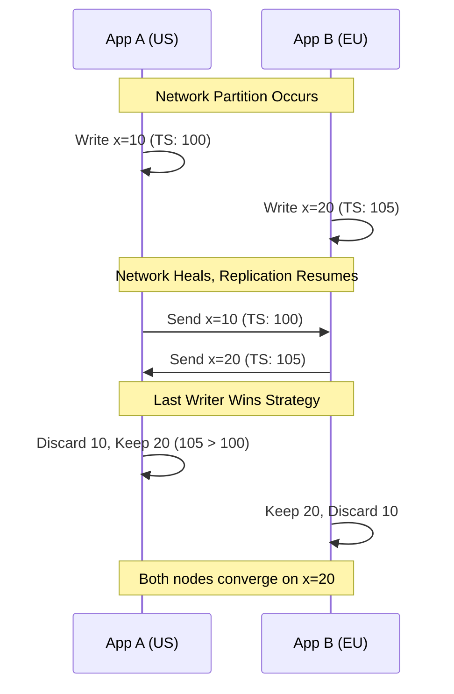

# Chapter 28: Geo-Distributed Systems

## 1. Why This Matters

As a software system's user base expands globally, serving all traffic from a single geographic region (e.g., US-East in Virginia) becomes untenable. A user in Tokyo accessing a server in Virginia faces significant network latency due to the physical limitations of the speed of light. Furthermore, relying on a single region represents a massive single point of failure; if a hurricane, power grid failure, or massive configuration error takes down the data center, the entire global business halts.

Geo-distributed systems matter for three primary reasons:
1. **Latency Reduction (Performance):** Serving data and applications from a data center physically close to the user dramatically reduces network round-trip times (RTT), vastly improving user experience.
2. **Disaster Recovery & High Availability:** Multi-region architectures ensure that if an entire continent's infrastructure goes offline, traffic can be instantly routed to a healthy region, achieving 99.999% (Five Nines) availability.
3. **Data Residency & Sovereignty (Compliance):** Governments increasingly mandate that citizen data must not leave their borders. GDPR in Europe, the PDPB in India, and various laws in China require that a user's data be physically stored and processed within that specific jurisdiction.

Designing for multi-region scale is the absolute pinnacle of distributed systems engineering. It introduces the harshest penalties for network partitioning, forces engineers to confront the CAP theorem on a global scale, and requires highly sophisticated traffic management and database replication strategies.

## 2. Beginner Intuition

Imagine you run a very popular bakery in New York. People love your secret recipe cookies.
- **Single Region:** Customers from Los Angeles and London have to fly to NY just to get a cookie. It takes them hours (high latency). If NY has a blizzard, no one gets cookies (low availability).
- **Active-Passive:** You build a backup bakery in Los Angeles. It has all the recipes and ovens, but the staff just sits there doing nothing. If NY gets a blizzard, you call LA and say "start baking!" (Failover). It takes a little time to get up to speed (RTO - Recovery Time Objective), and maybe LA doesn't have the absolutely latest recipe tweak made in NY 5 minutes ago (RPO - Recovery Point Objective).
- **Active-Active:** Both NY and LA bakeries are open 24/7. NY customers go to NY, LA customers go to LA. If LA burns down, LA customers are told to fly to NY. The tricky part: If an LA customer updates their allergy profile, LA has to quickly call NY and tell them. But what if the phone lines (network) are down? Do you let the customer buy the cookie anyway (availability) or make them wait until NY confirms the update (consistency)?
- **Data Sovereignty:** The European Union passes a law stating European cookie preferences cannot leave Europe. Now you MUST open a bakery in Paris, and the NY/LA bakeries are legally forbidden from ever receiving the European recipe books.

## 3. Core Theory

Geo-distributed systems operate under extreme constraints governed by physics and fundamental computer science theorems.

### 3.1 The Speed of Light Limit
Light in a vacuum travels at ~300,000 km/s. In fiber optic cables, it travels at roughly 200,000 km/s (the refractive index of glass).
- The physical distance from New York to Sydney is ~16,000 km.
- The absolute theoretical minimum round-trip time (RTT) is $2 \times 16,000 / 200 = 160$ milliseconds.
- In reality, routing overhead, switches, and imperfect cable paths make this ~250ms.
No software optimization can beat this physics limit. If an application makes 10 sequential database calls to a remote region, it will take at least 2.5 seconds. Geo-distribution is the only solution.

### 3.2 CAP Theorem on a Global Scale
In a single LAN, network partitions (P) are rare, so systems often choose C (Consistency) and A (Availability) without much pain. In a WAN (Wide Area Network) connecting continents, **P is inevitable**. Undersea cables get cut by ship anchors; transoceanic links experience jitter. When a transatlantic link drops, a geo-distributed system *must* choose between:
- **CP (Consistency):** Pause all writes in Europe until it can talk to the US master again. Availability drops.
- **AP (Availability):** Allow Europe and the US to keep accepting writes independently. When the link heals, you have conflicting data that must be resolved.

### 3.3 Replication Topologies
- **Synchronous Replication:** The primary node writes data, sends it to a remote region, waits for an acknowledgment, and *then* returns success to the user. Guarantees zero data loss (RPO = 0), but adds massive latency (e.g., +100ms per write).
- **Asynchronous Replication:** The primary node writes data, returns success immediately, and a background process ships the data across the globe. Fast, but if the primary region dies abruptly, recent writes are permanently lost.

### 3.4 Recovery Objectives
- **RTO (Recovery Time Objective):** How quickly can the system recover after a regional failure? (e.g., 5 seconds vs 5 hours).
- **RPO (Recovery Point Objective):** How much data loss is acceptable during a disaster? (e.g., 0 bytes vs 15 minutes of data).

## 4. Architecture Deep Dive

Building multi-region systems involves layers of complexity across traffic routing, computing, and state storage.

### 4.1 Global Traffic Management
To route a user in Tokyo to the Tokyo data center, systems use:
- **GeoDNS:** DNS servers look up the IP address of the user making the DNS request. Using a GeoIP database, the DNS server returns the IP of the closest data center. (Caveat: DNS caching can slow down failover).
- **Anycast IP:** A single IP address is announced from multiple global data centers using BGP (Border Gateway Protocol). The internet's core routers automatically send packets to the topologically closest data center. (Used heavily by Cloudflare).
- **Global Load Balancers (e.g., AWS Global Accelerator):** Users enter the cloud provider's network at an edge location closest to them, and the traffic rides the provider's dedicated, highly-optimized private backbone network to the appropriate region.

### 4.2 Multi-Region Database Strategies
Databases are the hardest part of geo-distribution.
- **Google Spanner (TrueTime):** Uses GPS and atomic clocks in data centers to establish a global, tightly bounded absolute time. This allows Spanner to provide external consistency (Linearizability) across the globe without heavy locking overhead.
- **CockroachDB / Cassandra:** Partition data globally. You can tag a row with `region=eu`. The database automatically ensures all replicas of that row physically reside on servers in the EU data centers.
- **Amazon DynamoDB Global Tables:** Implements AP (Available/Partition Tolerant) multi-master replication. You write to US-East, someone else writes to EU-West. The database asynchronously replicates. If there is a conflict (both modified the same row at the same time), DynamoDB resolves it using "Last Writer Wins" (LWW) based on timestamps.

### 4.3 Conflict-Free Replicated Data Types (CRDTs)
If you choose AP, how do you merge conflicting state? CRDTs are mathematical data structures that guarantee strong eventual consistency without coordination.
- **Example (Counter):** Instead of `count = count + 1`, a G-Counter (Grow-only counter) tracks increments per node: `[NodeA: 5, NodeB: 3]`. The total is the sum (8). If Node A and B disconnect, they can increment independently. When they reconnect, they merge by taking the max of each slot.
- CRDTs are used in collaborative text editors (Figma, Google Docs) and globally distributed databases (Riak, Redis Enterprise).

### 4.4 The Pilot Light & Warm Standby
Running Active-Active is incredibly expensive and complex. Alternatives:
- **Cold Standby:** Infrastructure as Code (Terraform) is ready, data backups are in S3. If US-East dies, you spin up US-West from scratch. RTO = Hours. Cost = Very Low.
- **Pilot Light:** Data is continuously asynchronously replicated to US-West. The core database runs on minimal hardware. App servers are OFF. In a disaster, you turn on app servers and scale up the DB. RTO = Minutes.
- **Warm Standby:** A scaled-down version of the entire stack is running in US-West handling a fraction (e.g., 5%) of traffic. Easily scales up.

## 5. Visual Diagrams

### 5.1 Global Active-Active Architecture with GeoDNS

```mermaid
flowchart TD
    U_EU[User in Paris]
    U_US[User in New York]
    DNS[Route53 / GeoDNS]

    U_EU -.->|DNS Query| DNS
    U_US -.->|DNS Query| DNS

    DNS -.->|Returns EU IP| U_EU
    DNS -.->|Returns US IP| U_US

    subgraph Region: EU-West (Ireland)
        LB_EU[Load Balancer]
        APP_EU[App Servers]
        DB_EU[(DB Primary EU)]
    end

    subgraph Region: US-East (Virginia)
        LB_US[Load Balancer]
        APP_US[App Servers]
        DB_US[(DB Primary US)]
    end

    U_EU -->|HTTPS| LB_EU
    LB_EU --> APP_EU
    APP_EU --> DB_EU

    U_US -->|HTTPS| LB_US
    LB_US --> APP_US
    APP_US --> DB_US

    DB_EU <-->|Asynchronous Multi-Master Replication| DB_US
```

### 5.2 Conflict Resolution (Last Writer Wins vs CRDT)



## 6. Real Production Examples

### 6.1 Netflix Multi-Region Architecture
Netflix runs active-active across multiple AWS regions (e.g., US-East, US-West, EU-West). They engineered their system so that any user can be served by any region. If US-East has a major outage, Netflix executes an evacuation. They use DNS to shift all 33% of traffic from US-East to the other two regions within minutes. They utilize Cassandra for global data replication, accepting eventual consistency for user viewing history to maintain high availability.

### 6.2 Uber's Multi-Region Setup
Uber operates in thousands of cities globally. They partition their architecture logically by city. A trip happening in London is handled entirely by European data centers. They use an Active-Active model but with "City Ownership". A specific city is pinned to a specific active region. If that region fails, the ownership of that city is failed over to a secondary region. This avoids multi-master write conflicts on the same trip data.

### 6.3 Google's Global Infrastructure
Google Spanner powers AdWords and Google Play. It provides a globally distributed, synchronously replicated database that supports distributed SQL transactions. By leveraging TrueTime (atomic clocks), Spanner achieves strict serializability globally, allowing Google to process financial transactions across continents without fear of data anomalies.

### 6.4 Spotify
Spotify uses a mix of Anycast DNS and edge caching points of presence (PoPs) to serve audio files. When you play a song, the metadata (playlists, likes) might come from a central European or US data center, but the heavy audio payload is delivered from a CDN cache physically located in your ISP's local city, minimizing latency and buffering.

## 7. Java Implementations

### 7.1 Multi-Region Resilience: Automatic Failover Client

This code demonstrates how an application layer might handle regional failover if the local region's database goes down.

```java
import java.util.concurrent.atomic.AtomicBoolean;
import java.util.concurrent.atomic.AtomicInteger;

public class RegionalFailoverClient {

    private final DatabaseClient localRegion;
    private final DatabaseClient remoteRegion;
    
    // Circuit breaker state
    private final AtomicBoolean localDown = new AtomicBoolean(false);
    private final AtomicInteger failureCount = new AtomicInteger(0);
    private final int FAILURE_THRESHOLD = 5;

    public RegionalFailoverClient(DatabaseClient localRegion, DatabaseClient remoteRegion) {
        this.localRegion = localRegion;
        this.remoteRegion = remoteRegion;
    }

    public Data readData(String key) {
        if (localDown.get()) {
            return readFromRemote(key);
        }

        try {
            Data data = localRegion.read(key);
            resetCircuitBreaker();
            return data;
        } catch (Exception e) {
            handleLocalFailure();
            // Fallback to remote
            return readFromRemote(key);
        }
    }

    private Data readFromRemote(String key) {
        System.out.println("Reading from REMOTE region due to local failure/failover");
        try {
            return remoteRegion.read(key);
        } catch (Exception e) {
            throw new RuntimeException("CRITICAL: Both local and remote regions are unreachable!", e);
        }
    }

    private void handleLocalFailure() {
        int failures = failureCount.incrementAndGet();
        if (failures >= FAILURE_THRESHOLD) {
            if (localDown.compareAndSet(false, true)) {
                System.out.println("CIRCUIT BREAKER OPENED: Local region marked as DOWN.");
                // In production, trigger an alert to PagerDuty here
                startHealthCheckThread();
            }
        }
    }

    private void resetCircuitBreaker() {
        failureCount.set(0);
    }

    private void startHealthCheckThread() {
        new Thread(() -> {
            while (localDown.get()) {
                try {
                    Thread.sleep(10000); // Wait 10 seconds
                    // Attempt a ping
                    localRegion.ping();
                    // If ping succeeds
                    System.out.println("Local region recovered. Closing circuit breaker.");
                    localDown.set(false);
                    failureCount.set(0);
                } catch (Exception e) {
                    System.out.println("Health check failed. Local region still down.");
                }
            }
        }).start();
    }
}

interface DatabaseClient {
    Data read(String key);
    void ping();
}
class Data { /* ... */ }
```

### 7.2 State-based CRDT: Grow-Only Counter (G-Counter)

Here is a basic implementation of a CRDT in Java, demonstrating how distributed state can merge without conflicts.

```java
import java.util.HashMap;
import java.util.Map;

public class GCounter {
    private final String nodeId;
    // Map of node IDs to their local counts
    private final Map<String, Integer> counts;

    public GCounter(String nodeId) {
        this.nodeId = nodeId;
        this.counts = new HashMap<>();
        this.counts.put(nodeId, 0);
    }

    // Increment locally
    public synchronized void increment() {
        int current = counts.getOrDefault(nodeId, 0);
        counts.put(nodeId, current + 1);
    }

    // Get the total value across all known nodes
    public synchronized int value() {
        return counts.values().stream().mapToInt(Integer::intValue).sum();
    }

    // Merge state from another node's GCounter (CRDT core logic)
    public synchronized void merge(GCounter other) {
        for (Map.Entry<String, Integer> entry : other.counts.entrySet()) {
            String remoteNode = entry.getKey();
            int remoteCount = entry.getValue();
            
            // Take the maximum of local knowledge vs remote knowledge
            int localCount = this.counts.getOrDefault(remoteNode, 0);
            this.counts.put(remoteNode, Math.max(localCount, remoteCount));
        }
    }

    // Deep copy for network transmission
    public synchronized GCounter replicate() {
        GCounter copy = new GCounter(this.nodeId);
        copy.counts.putAll(this.counts);
        return copy;
    }
}
```

## 8. Performance Analysis

- **Write Amplification vs Latency:** Synchronous multi-region databases severely impact write latency. A write in New York waiting for a London acknowledgment adds ~80ms. This limits throughput and increases open database connection times. Asynchronous replication provides sub-millisecond local latency but risks a non-zero RPO.
- **Cache Invalidation:** In a multi-region setup, cache invalidation is tricky. If a US user updates a profile, the US cache is cleared. But the European cache still has old data until the DB replication completes and triggers a European cache invalidation event via a cross-region Kafka topic. This race condition leads to phantom reads.
- **Failover Traffic Spikes:** If a region fails, traffic instantly shifts to the remaining regions. If US-East handles 50% of global traffic and fails, US-West will instantly experience a 100% traffic increase. The capacity planning must ensure US-West has enough idle compute to absorb this shock, which is expensive (requires running at <= 50% utilization globally).

## 9. Tradeoffs

| Multi-Region Model | Consistency | Latency | Infrastructure Cost | Operational Complexity |
| :--- | :--- | :--- | :--- | :--- |
| **Single Region** | Strong | High (for distant users) | Low | Low |
| **Active-Passive (Sync)** | Strong | Very High (Writes) | High | Medium |
| **Active-Passive (Async)** | Eventual (Risk of loss) | Low | High | Medium |
| **Active-Active (Multi-Master)**| Eventual / Conflicts | Low | Very High | Extremely High |
| **Geo-Partitioned (e.g., Cockroach)**| Strong (Local) | Low (Local) | High | High |

## 10. Failure Scenarios

### 10.1 Split-Brain and Conflict Storms
**Scenario:** The network link across the Atlantic drops. US and EU regions continue to accept writes (AP mode). Both regions modify the exact same user profile extensively. When the network link heals 3 hours later, a massive replication storm occurs as thousands of conflicting rows attempt to sync.
**Resolution:** Systems must use CRDTs or robust timestamp-based LWW (Last Writer Wins) logic. Furthermore, replication queues must be sized to handle hours of backlog without overflowing.

### 10.2 BGP Hijacking / Routing Failures
**Scenario:** A misconfiguration at a major ISP advertises bad BGP routes, causing traffic intended for the US region to be blackholed or routed to a malicious third party.
**Resolution:** Continuous global synthetic monitoring. Monitor endpoints from distinct global ISPs. Use DNS failover if Anycast/BGP fails.

### 10.3 The Global Schema Migration
**Scenario:** Running an `ALTER TABLE` in a multi-region active-active database. You run it in the US, but before it replicates to the EU, an application tries to write to the new column in the EU.
**Resolution:** Multi-phase migrations. Add the column globally (hidden from app). Then deploy app code globally that writes to both but reads from old. Then migrate data. Then flip reads to new column.

## 11. Debugging & Observability

- **Cross-Region Tracing:** Distributed tracing (OpenTelemetry) must pass context across Kafka replication topics or DB syncs to track how long a specific update took to propagate globally.
- **Replication Lag Metrics:** The most critical metric in an active-passive setup. If `replication_lag_seconds` spikes from 1s to 500s, an imminent RPO violation is at hand if the primary fails.
- **Synthetic Transactions:** Bots running in AWS regions globally, executing full login/purchase flows every minute, verifying that latency and regional routing are functioning correctly.

## 12. Interview Questions

**Q1: How would you design a multi-region architecture for a stock trading platform where data consistency is critical?**
*Expected Answer:* Stock trades cannot tolerate eventual consistency (cannot double-spend money). I would use an Active-Passive architecture with synchronous replication, or a globally consistent database like Spanner. The latency hit is necessary for correctness. Better yet, partition by user/region—a US user's data is strictly mastered in the US.

**Q2: What is the difference between RTO and RPO?**
*Expected Answer:* Recovery Time Objective (RTO) is the duration of the outage (how long to recover). Recovery Point Objective (RPO) is the amount of data lost (did we lose the last 5 minutes of writes?).

**Q3: Explain how "Last Writer Wins" (LWW) can lead to data anomalies.**
*Expected Answer:* If Alice adds an item to her cart (TS: 100) and Bob adds a different item to the same cart on a different regional node (TS: 105), LWW will overwrite Alice's change entirely. Bob's state wins, and Alice's item is silently deleted. CRDTs or application-level merges solve this.

**Q4: How do you handle GDPR compliance in a globally distributed system?**
*Expected Answer:* Use geo-partitioning. Ensure that EU user data is written only to tables physically homed in EU data centers. Do not replicate EU data to the US data center. Route EU user traffic via GeoDNS to the EU API endpoints.

## 13. Exercises

1. **System Design:** Design a global leaderboards system for a mobile game. Players in Asia, Europe, and America must see an updated top 100 list with minimal latency.
2. **Coding:** Implement an OR-Set (Observed-Remove Set) CRDT in Java, allowing elements to be added and removed across distinct nodes without conflicts.
3. **Conceptual:** Calculate the theoretical minimum latency between AWS `ap-southeast-2` (Sydney) and AWS `eu-west-1` (Ireland). Compare it to the actual measured latency via a ping tool. Explain the discrepancy.

## 14. Expert Insights

- **The Fallacy of Active-Active:** Many companies say they want "Active-Active" for high availability, without realizing the monumental complexity of distributed conflict resolution. Often, an automated Active-Passive setup with a 2-minute RTO is vastly cheaper, safer, and completely sufficient for business needs.
- **Data Gravity:** Compute is easy to move; data is heavy. Multi-region architectures often fail because teams try to run stateless apps in Europe while the database remains in the US. The app makes 50 DB calls per request, resulting in $50 \times 100\text{ms} = 5\text{ seconds}$ of latency. Co-locate data with compute.
- **DNS Caching Evils:** When failing over using DNS, you change the record's IP. However, ISPs and client devices routinely ignore TTLs (Time To Live) and cache the old IP for hours. Some users will remain routed to the dead data center.

## 15. Chapter Summary

- **Geo-distribution** solves physics (latency), disaster recovery, and compliance issues by placing infrastructure in multiple geographic regions.
- **Speed of Light constraints** force architectural trade-offs between consistency and availability (CAP theorem) when crossing large WAN distances.
- **Routing traffic** globally relies on GeoDNS, Anycast, and cloud-provider global network backbones.
- **Database replication** dictates the architecture type: Active-Passive (easier, failover time) vs. Active-Active (harder, conflict resolution).
- **CRDTs and Spanner/TrueTime** represent advanced solutions to the multi-region state problem.
- **RTO and RPO** are the business metrics that define exactly how a disaster recovery architecture must be built and tested.
