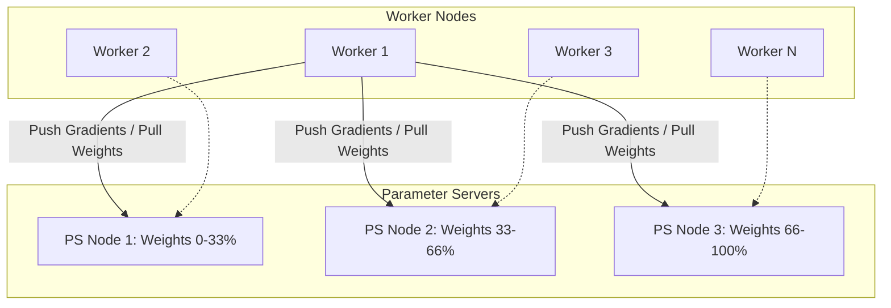
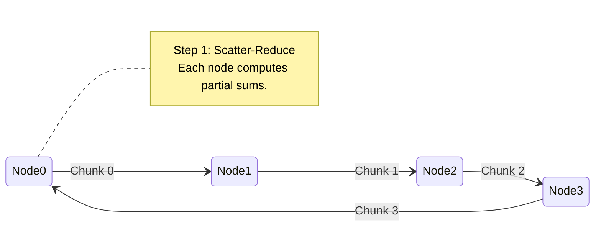
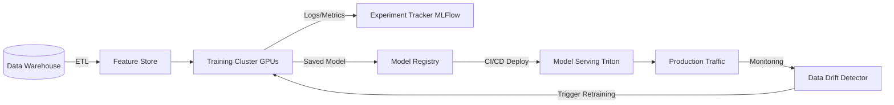

# Chapter 30: Distributed Machine Learning Systems

## 1. Why This Matters

The field of Machine Learning (ML) has experienced an explosive paradigm shift. In the early 2010s, training state-of-the-art models like AlexNet required a few GPUs and could be completed in days. Today, training Large Language Models (LLMs) such as GPT-4, Llama-3, or Gemini involves tens of thousands of specialized accelerators (GPUs, TPUs), petabytes of text data, and months of continuous distributed computation. 

In modern distributed systems, Machine Learning is no longer just a specialized math problem—it is a supreme test of distributed computing, networking, and fault tolerance. 

### The Scale of the Problem
- **Data Volume:** Traditional ML handled datasets that fit in a single machine's RAM (Gigabytes). Modern Deep Learning ingests entire internet crawls (Petabytes), requiring high-throughput distributed file systems and streaming pipelines.
- **Model Size:** Neural networks have grown from millions of parameters to trillions. A 1-trillion parameter model requires 2 Terabytes of memory just to store the weights in 16-bit float. It cannot mathematically fit onto a single GPU (which typically has 80GB of VRAM).
- **Training Time:** The compute required to train these models grows exponentially. Without distributed training, training a modern LLM on a single GPU would take hundreds or thousands of years.

### The Systems Challenge
Distributed ML systems push hardware and networks to their physical limits. When thousands of GPUs are synchronizing terabytes of gradients every millisecond, network latency, bandwidth bottlenecks, and straggler nodes become catastrophic issues. Understanding Distributed ML is crucial for system architects because it combines high-performance computing (HPC) with web-scale distributed systems and requires novel solutions to consistency, fault tolerance, and data scheduling.

---

## 2. Beginner Intuition

Imagine you have been assigned the task of reading a library of 100,000 books and writing a comprehensive summary of all human knowledge. 

If you try to do this alone (Single-node training), it will take you your entire lifetime. You are the sole processor (GPU), and the books are the dataset.

To speed this up, you hire a team of 1,000 readers. How do you divide the work?

### Approach 1: Data Parallelism (Reading different books)
You give each reader 100 different books. Everyone reads their books simultaneously and takes notes. At the end of the day, all 1,000 readers meet in a massive conference room to merge their notes into a single master summary. Then, they take the master summary back and use it as context for the next day's reading.
*In ML:* Each GPU holds a copy of the whole model but processes a different "batch" of data. They communicate to average their learnings (gradients) before the next step.

### Approach 2: Model Parallelism (Specialized reading)
What if the master summary book is so incredibly heavy that a single reader cannot lift it? You have to split the book itself. Reader A only reads and writes Chapter 1, Reader B handles Chapter 2. When a sentence spans across chapters, they must pass the paper back and forth.
*In ML:* The neural network is too large for one GPU's memory. Layer 1 is placed on GPU 1, Layer 2 on GPU 2. Data is passed sequentially through the GPUs.

### Approach 3: Pipeline Parallelism (The Assembly Line)
To make Model Parallelism efficient, instead of Reader 2 sitting idle while Reader 1 reads Chapter 1, you set up an assembly line. As soon as Reader 1 finishes paragraph 1, they pass it to Reader 2, and Reader 1 immediately starts paragraph 2.
*In ML:* Breaking down batches into "micro-batches" so that multiple layers on multiple GPUs can compute simultaneously without stalling.

---

## 3. Core Theory

Distributed training of neural networks is mathematically rooted in distributed optimization, primarily Distributed Stochastic Gradient Descent (SGD).

### The Math of Distributed SGD
In standard SGD, we update the model weights $W$ using the gradient of the loss function $\nabla L$ over a mini-batch of data $B$:

$$W_{t+1} = W_t - \eta \nabla L(W_t, B)$$

In **Distributed SGD** with $N$ nodes, each node $i$ computes the gradient on its local subset of the data $b_i$:

$$g_i = \nabla L(W_t, b_i)$$

The nodes must then aggregate their gradients to compute the global update:

$$W_{t+1} = W_t - \eta \left( \frac{1}{N} \sum_{i=1}^N g_i \right)$$

This seemingly simple equation hides massive distributed systems complexity: how do you sum arrays of billions of numbers across thousands of machines at a frequency of 10 times per second?

### Synchronization Models

**1. Bulk Synchronous Parallel (BSP)**
- **How it works:** All workers compute their gradients. The system waits until the *slowest* worker finishes (barrier synchronization). Once all gradients are collected, the average is computed, and weights are updated.
- **Pros:** Mathematically equivalent to single-node training. Highly stable.
- **Cons:** The "Straggler Problem". If one node has a thermal throttle or network blip, the entire multi-million-dollar cluster sits idle waiting for it.

**2. Asynchronous Parallel (ASP)**
- **How it works:** Workers compute gradients and send them to a Parameter Server. The server updates the weights instantly and sends the new weights back. Workers never wait for each other.
- **Pros:** Zero idle time. High hardware utilization.
- **Cons:** "Stale Gradients". Worker A might calculate a gradient based on $W_t$. By the time it sends the gradient, the server is already at $W_{t+10}$. Applying an old gradient to new weights can cause the model to diverge and crash.

**3. Stale Synchronous Parallel (SSP) / Bounded Staleness**
- **How it works:** A hybrid approach. Workers can proceed asynchronously, but the system enforces a "maximum staleness threshold" $S$. No worker is allowed to be more than $S$ steps ahead of the slowest worker.
- **Pros:** Balances hardware utilization with mathematical stability.

### The 3D Parallelism Paradigm
To train massive models, modern frameworks use a combination of three parallelisms:
1. **Data Parallelism (DP):** Replicate the model, split the data.
2. **Tensor Parallelism (TP):** Split individual mathematical operations (like Matrix Multiplication) across multiple GPUs within the same physical server (using extremely fast NVLink).
3. **Pipeline Parallelism (PP):** Split the layers of the model across different physical servers.

---

## 4. Architecture Deep Dive

### Parameter Server Architecture
Pioneered by Google (DistBelief) and popularized by architectures like MXNet, the Parameter Server isolates the role of storing weights from computing gradients.

- **Workers:** Read data, perform forward/backward passes, and calculate gradients.
- **Servers (PS):** Sharded key-value stores. They hold fragments of the global model weights. They receive gradients from workers, apply the optimizer step (e.g., Adam), and serve the updated weights.

While conceptually clean, the PS architecture suffers from network bottlenecks. If 1,000 workers send their gradients to a few Parameter Servers simultaneously, an incast network storm occurs, saturating the switch bandwidth.

### Ring All-Reduce Architecture
To solve the PS bottleneck, Baidu introduced the Ring All-Reduce algorithm to Deep Learning (later adopted by Horovod, PyTorch DDP). This is a decentralized, peer-to-peer approach.

Instead of a centralized server, GPUs are arranged in a logical ring.
1. **Scatter-Reduce:** Each GPU splits its gradient array into $N$ chunks. GPU $i$ sends chunk $c$ to GPU $i+1$, while receiving chunk $c-1$ from GPU $i-1$. It adds the received chunk to its own. After $N-1$ steps, each GPU holds the complete, summed gradient for one specific chunk.
2. **All-Gather:** GPUs circulate these completed chunks around the ring. After another $N-1$ steps, every GPU has the fully summed gradients for all chunks.

**Bandwidth Optimality:** The total data transferred by each node is exactly $2 \times \frac{N-1}{N} \times S$ (where $S$ is the gradient size). Crucially, this is independent of the number of nodes $N$. The network bandwidth is utilized perfectly without bottlenecks.

### Zero Redundancy Optimizer (ZeRO) & DeepSpeed
Developed by Microsoft, ZeRO eliminates the memory redundancies in pure Data Parallelism. In standard DP, every GPU holds a full copy of the Weights, Gradients, and Optimizer States. For a 100B parameter model, this requires >1TB of VRAM per GPU, which is impossible.

ZeRO partitions these states across GPUs:
- **ZeRO-1:** Partitions Optimizer States.
- **ZeRO-2:** Partitions Gradients.
- **ZeRO-3:** Partitions Model Weights.

Under ZeRO-3, a GPU only holds a fraction of the model. When it needs a layer to perform computation, it requests the weights from the other GPUs via high-speed networking, computes the layer, and then immediately deletes the weights to free memory. It turns VRAM into a distributed cache.

### Hardware and Networking
You cannot build distributed ML systems over standard TCP/IP on 1Gbps Ethernet.
- **Intra-Node (Inside the box):** 8 GPUs are connected via **NVLink** and **NVSwitch**, providing up to 900 GB/s bidirectional bandwidth per GPU. This is used for Tensor Parallelism.
- **Inter-Node (Between boxes):** Servers are connected via **InfiniBand** or **RoCE** (RDMA over Converged Ethernet) offering 400 Gbps to 800 Gbps per port.
- **RDMA (Remote Direct Memory Access):** Bypasses the CPU and OS kernel. GPU 1 on Server A writes data directly into the VRAM of GPU 2 on Server B via the NIC, resulting in microsecond latency.

---

## 5. Visual Diagrams

### 1. Parameter Server Architecture



### 2. Ring All-Reduce Data Flow



### 3. Machine Learning MLOps Pipeline



---

## 6. Real Production Examples

### Google's TPU Pods and Pathways
Google builds custom ASICs called Tensor Processing Units (TPUs). Instead of traditional switches, Google connects TPUs in a 3D Torus network topology. Recently, they introduced **Optical Circuit Switches (OCS)**, which use microscopic mirrors to reflect light and dynamically rewire the cluster topology on the fly based on the communication patterns of the ML model, entirely avoiding electrical switch bottlenecks.

### Meta's Research SuperCluster (RSC)
Meta built one of the world's largest AI supercomputers to train Llama models, featuring 16,000+ Nvidia A100 GPUs. A major design decision was using a Clos network topology with 200 Gbps InfiniBand endpoints. They heavily rely on PyTorch FSDP (Fully Sharded Data Parallel) to shard the massive Llama models across thousands of GPUs, balancing memory footprint against communication overhead.

### OpenAI's Azure Training Infrastructure
OpenAI trains models like GPT-4 on massive Microsoft Azure clusters. Because training runs for months, the failure of hardware is a statistical certainty. OpenAI's architecture relies heavily on constant, asynchronous checkpointing to distributed object storage. If a rack fails, the orchestrator detects the topology change, evicts the dead nodes, loads the latest checkpoint from Azure Blob Storage, reconfigures the ZeRO communication ring, and resumes training with minimal downtime.

### Uber's Michelangelo
For classical ML (XGBoost, Random Forests) and smaller deep learning models, Uber built Michelangelo. The core distributed systems innovation was the **Feature Store**. Instead of every data scientist writing bespoke SQL queries to calculate "rider trips in last 7 days", Michelangelo computes features globally in Spark, caches them in Cassandra (for low-latency online serving), and stores them in Hive (for high-throughput offline training batch generation).

---

## 7. Code Implementations

### Python: Distributed Data Parallel (DDP) with PyTorch
In production, you do not write raw MPI or sockets. You use PyTorch's `DistributedDataParallel`, which automatically wraps your model and hooks into the backward pass to execute Ring All-Reduce over NCCL (Nvidia Collective Communications Library).

```python
import os
import torch
import torch.distributed as dist
import torch.nn as nn
import torch.optim as optim
from torch.nn.parallel import DistributedDataParallel as DDP

def setup(rank, world_size):
    # Initialize the process group
    # Using NCCL backend which is highly optimized for NVIDIA GPUs
    os.environ['MASTER_ADDR'] = '10.0.0.1' # IP of node 0
    os.environ['MASTER_PORT'] = '12355'
    dist.init_process_group("nccl", rank=rank, world_size=world_size)
    torch.cuda.set_device(rank)

def cleanup():
    dist.destroy_process_group()

class SimpleModel(nn.Module):
    def __init__(self):
        super(SimpleModel, self).__init__()
        self.net = nn.Sequential(
            nn.Linear(1024, 4096),
            nn.ReLU(),
            nn.Linear(4096, 10)
        )
        
    def forward(self, x):
        return self.net(x)

def train_distributed(rank, world_size):
    setup(rank, world_size)
    
    # Create model and move it to the specific GPU for this rank
    model = SimpleModel().to(rank)
    
    # Wrap model in DDP. This automatically synchronizes gradients!
    ddp_model = DDP(model, device_ids=[rank])
    
    loss_fn = nn.CrossEntropyLoss()
    optimizer = optim.SGD(ddp_model.parameters(), lr=0.001)
    
    # Simulated training loop
    for epoch in range(10):
        optimizer.zero_grad()
        
        # Simulated batch of data
        inputs = torch.randn(32, 1024).to(rank)
        labels = torch.randint(0, 10, (32,)).to(rank)
        
        # Forward pass
        outputs = ddp_model(inputs)
        loss = loss_fn(outputs, labels)
        
        # Backward pass
        # DDP automatically runs All-Reduce on gradients under the hood here!
        loss.backward()
        
        # Update weights
        optimizer.step()
        
        if rank == 0:
            print(f"Epoch {epoch} | Loss: {loss.item()}")

    cleanup()

# In production, this script is launched via `torchrun` across multiple servers.
```

### Java: Model Serving API with Spring Boot
While Python dominates training, Java is frequently used in enterprise model serving and MLOps orchestration for its concurrency, type safety, and JVM performance.

```java
package com.distributedml.serving;

import org.springframework.web.bind.annotation.*;
import org.springframework.http.ResponseEntity;
import org.springframework.beans.factory.annotation.Autowired;
import java.util.List;
import java.util.concurrent.CompletableFuture;

@RestController
@RequestMapping("/api/v1/models")
public class ModelServingController {

    private final FeatureStoreClient featureStore;
    private final TritonInferenceClient tritonClient;

    @Autowired
    public ModelServingController(FeatureStoreClient featureStore, TritonInferenceClient tritonClient) {
        this.featureStore = featureStore;
        this.tritonClient = tritonClient;
    }

    /**
     * Endpoint to predict user churn.
     * Demonstrates the Scatter-Gather pattern in ML Pipelines.
     */
    @PostMapping("/predict-churn")
    public CompletableFuture<ResponseEntity<PredictionResponse>> predictChurn(
            @RequestBody PredictionRequest request) {
        
        // 1. Fetch features from low-latency Redis/Cassandra feature store
        return featureStore.getFeaturesAsync(request.getUserId(), List.of("txn_count_30d", "app_opens_7d"))
            .thenCompose(features -> {
                // 2. Format features as a Tensor and send via gRPC to Triton Inference Server
                Tensor inputTensor = TensorUtils.createFromFeatures(features);
                return tritonClient.inferAsync("churn_xgboost_model", "v2", inputTensor);
            })
            .thenApply(tensorResult -> {
                // 3. Post-process and return
                double probability = tensorResult.getFloatValue(0);
                boolean willChurn = probability > 0.75;
                return ResponseEntity.ok(new PredictionResponse(request.getUserId(), willChurn, probability));
            })
            .exceptionally(ex -> {
                // Fallback mechanism in case of distributed failure
                return ResponseEntity.internalServerError().build();
            });
    }
}
```

---

## 8. Performance Analysis

### The Roofline Model
When analyzing distributed ML, we use the Roofline Model. A system is either:
- **Compute-Bound:** The GPU math units (Tensor Cores) are maxed out, but memory bandwidth is underutilized.
- **Memory-Bound:** The GPU is waiting for data to arrive from VRAM or over the network. The math units are sitting idle.

Large Language Models (LLMs) are uniquely challenging because **Training is Compute-Bound** (massive matrix multiplications), but **Inference is Memory-Bound** (loading billions of weights just to generate one token).

### Amdahl's Law in ML
If 90% of your training loop is parallelizable math, and 10% is sequential network synchronization, the maximum theoretical speedup regardless of how many GPUs you buy is $1 / 0.1 = 10x$. Therefore, optimizing network collectives is paramount. Techniques like **Gradient Accumulation** (running multiple forward/backward passes locally before doing one network sync) artificially reduce the communication fraction, improving scalability.

### MFU (Model FLOPs Utilization)
MFU is the industry-standard metric for distributed training efficiency. It measures the percentage of theoretical peak hardware FLOPs that are *actually* being used to advance the model training.
- 100% MFU is physically impossible due to memory access.
- 50-60% MFU is considered excellent for large distributed clusters.
- If MFU drops to 20%, you have a massive network bottleneck or your batch sizes are too small.

---

## 9. Tradeoffs

### Data Parallelism vs. Model Parallelism
- **DP** is easy to implement and scales well up to a point, but limited by the memory of a single GPU. It duplicates weights everywhere.
- **MP** allows training models that exceed single GPU memory, but introduces massive pipeline bubbles (idle time) and high intra-node communication overhead.
- **Tradeoff Resolution:** 3D Parallelism uses DP across clusters, PP across servers, and MP (Tensor) within a server.

### Synchronous vs. Asynchronous SGD
- **Sync:** Mathematically sound, deterministic, easier to debug. Suffers from stragglers.
- **Async:** Incredible hardware utilization, immune to stragglers. Highly unstable, gradients become stale, loss might explode, difficult to reproduce bugs.
- **Tradeoff Resolution:** The industry has entirely standardized on **Synchronous** training for Deep Learning. The hardware utilization loss is mitigated by using identical, homogeneous GPU hardware and extremely fast RDMA networking to minimize synchronization time.

### Throughput vs. Latency (Inference)
When serving LLMs, do you want to generate the first token quickly (Time To First Token - TTFT), or do you want to serve the maximum number of users per second?
- **Low Latency:** Process one user's prompt instantly.
- **High Throughput:** Wait 50ms to gather 128 user requests, batch them into a single massive matrix multiplication.
- **Tradeoff Resolution:** **Continuous Batching / In-flight Batching**. Instead of waiting for a full batch to finish, the server dynamically injects new requests into the GPU execution stream at every single token generation step.

---

## 10. Failure Scenarios

When you run a distributed job across 10,000 GPUs for 3 months, hardware WILL fail. Mean Time Between Failures (MTBF) on large clusters is measured in hours.

**1. The Straggler Problem**
- *Scenario:* A GPU fan gets clogged with dust. It thermal-throttles, dropping its clock speed by 30%. Because training is Synchronous, the other 9,999 GPUs finish their math and sit completely idle waiting for the slow GPU to send its gradients.
- *Mitigation:* Observability agents track step times per node. If a node is consistently 2 standard deviations slower than the mean, the orchestrator kills the node, removes it from the collective, and brings up a spare node from the warm pool.

**2. Silent Data Corruption (Bit Flips)**
- *Scenario:* Cosmic rays or degrading silicon cause a bit flip in a GPU register. A gradient value becomes `NaN` (Not a Number) or `Inf`.
- *Catastrophe:* In Ring All-Reduce, this `NaN` is summed with other gradients. Within milliseconds, the `NaN` spreads like a virus to every single GPU in the cluster. The entire model's weights become `NaN`, ruining months of work.
- *Mitigation:* Gradient clipping and NaN-checks before the All-Reduce step. If a NaN is detected, the framework halts, throws out the current batch, and restores the weights from the last safe checkpoint.

**3. Split-Brain in Parameter Servers**
- *Scenario:* A network partition separates the cluster. Workers in partition A talk to PS A, workers in partition B talk to PS B.
- *Mitigation:* Standard distributed consensus (ZooKeeper/etcd) is used to maintain a global view of the cluster membership. If a node loses quorum, it pauses execution.

---

## 11. Debugging & Observability

Observing a distributed ML system requires correlating deep learning metrics with distributed systems metrics.

**1. Loss Curves and Gradient Norms**
- Tracked via tools like Weights & Biases (W&B) or MLflow.
- A sudden spike in the loss curve usually implies a bad batch of data or an exploding gradient. Tracking the $L_2$ norm of the gradients across layers helps identify if a specific layer is destabilizing.

**2. Distributed Tracing (PyTorch Profiler / TensorBoard)**
- Engineers inject tracing spans into the code to visualize the GPU execution timeline.
- A healthy timeline looks like: `Compute (Dense) -> Compute (Dense) -> Network All-Reduce -> Update`.
- A bad timeline shows massive white spaces (bubbles) where the GPU is waiting on the CPU to load data from disk (I/O bound) or waiting on the network.

**3. Model Drift & Data Drift**
- After a model is deployed, the real-world data distribution changes over time.
- **Concept Drift:** The mapping between input and output changes (e.g., macroeconomic factors change what "fraud" looks like).
- **Monitoring:** Production systems calculate the Kullback-Leibler (KL) divergence between the training data distribution and the live inference distribution. If divergence exceeds a threshold, an automated CI/CD pipeline triggers a distributed retraining job.

---

## 12. Interview Questions

1. **(Beginner)** Explain the difference between Data Parallelism and Model Parallelism. When would you use each?
   *Answer Focus:* DP duplicates model, splits data. MP splits model, processes data sequentially. Use DP for models that fit in VRAM, use MP when the model exceeds a single GPU's memory.

2. **(Intermediate)** Describe the Ring All-Reduce algorithm. Why is it preferred over a Parameter Server architecture in modern deep learning?
   *Answer Focus:* Ring All-Reduce decentralizes communication, moving data in chunks around a logical ring. Total bandwidth is constant $O(1)$ relative to the number of nodes, preventing the network switch bottleneck inherent in centralized PS architectures.

3. **(Intermediate)** What is a "pipeline bubble" in Pipeline Parallelism, and how do micro-batches alleviate it?
   *Answer Focus:* A bubble is idle GPU time while waiting for previous layers to compute forward passes. Micro-batches split the batch into smaller chunks, allowing layer 2 to start working on micro-batch 1 while layer 1 is working on micro-batch 2, overlapping computation.

4. **(Advanced)** Explain how ZeRO-3 optimization enables the training of massive LLMs. How does it handle weight retrieval?
   *Answer Focus:* ZeRO-3 shards optimizer states, gradients, AND weights. A GPU only holds $1/N$ of the model. Before computing a layer, it triggers an All-Gather over NVLink/RDMA to fetch the full weights for that specific layer, computes, and instantly discards the weights to free memory.

5. **(FAANG System Design)** Design the architecture for serving a large language model like ChatGPT to 100 million daily active users, optimizing for high throughput and low latency.
   *Answer Focus:* Must mention Load Balancing, KV Caching, PagedAttention (vLLM) to prevent memory fragmentation, Continuous/In-flight Batching, Tensor Parallelism across 8 GPUs for single-request inference, and auto-scaling based on queue length.

---

## 13. Exercises

1. **Conceptual Exercise:** Calculate the total memory required to train a 10-billion parameter model in FP16 (16-bit precision) using the Adam optimizer. (Hint: Weights = 2 bytes/param. Gradients = 2 bytes/param. Adam states = 4 bytes for momentum + 4 bytes for variance per param). Does this fit on an 80GB A100 GPU? If not, what strategy must be used?
2. **System Design Exercise:** Draw a Sequence Diagram showing the lifecycle of an asynchronous checkpointing system that saves a 500GB model to S3 every hour without stalling the GPU compute operations.
3. **Coding Exercise:** Using PyTorch, write a small script that spawns 4 local processes. Have each process create a random tensor, and use `torch.distributed.all_reduce` to calculate the global sum of all tensors.

---

## 14. Expert Insights

- **The Memory Wall:** Industry experts note that while GPU compute capabilities (FLOPs) have been doubling every 18 months, GPU memory bandwidth is growing at a much slower rate. Distributed ML is increasingly becoming a memory-bandwidth orchestration problem rather than a pure math problem.
- **The Magic of KV Cache:** In LLM inference, regenerating the keys and values for previously generated tokens is computationally wasteful. Storing them in a "KV Cache" shifts inference from being Compute-Bound to Memory-Bound. The invention of **PagedAttention** (inspired by OS virtual memory paging) solved KV cache fragmentation, increasing serving throughput by 3-4x.
- **Speculative Decoding:** A bleeding-edge serving technique where a tiny, fast "draft" model guesses the next 5 tokens, and the massive, slow "target" model verifies them in parallel. This breaks the sequential bottleneck of autoregressive generation, heavily utilizing distributed serving concepts.
- **Scaling Laws:** The "Chinchilla Scaling Laws" proved that most large models were significantly under-trained. Compute is better spent training slightly smaller models on massively larger datasets for longer times, which pushes distributed systems to handle months-long fault-tolerant runs across millions of gigabytes of text.

---

## 15. Chapter Summary

- **Distributed ML is Mandatory:** Modern models cannot fit on single hardware units; training and inference must be distributed across massive clusters.
- **Parallelism Strategies:** 
  - *Data Parallelism:* Splits data, duplicates model.
  - *Model Parallelism:* Splits model math across GPUs.
  - *Pipeline Parallelism:* Splits model layers across servers.
- **Communication Architectures:** The industry has moved from centralized Parameter Servers to peer-to-peer collectives like Ring All-Reduce over ultra-fast RDMA networks.
- **ZeRO Optimization:** Shards weights, gradients, and optimizer states, effectively turning GPU VRAM into a distributed cache.
- **MLOps Pipelines:** Production systems require Feature Stores for data consistency, MLflow for experiment tracking, and Triton/vLLM for optimized inference serving.
- **Inference at Scale:** Serving LLMs requires specialized memory management (PagedAttention) and dynamic scheduling (Continuous Batching) to balance latency and throughput.
- **Fault Tolerance:** With thousands of machines, failures are constant. Architectures must implement robust, asynchronous checkpointing and straggler mitigation to survive months of continuous execution.

---
*End of Chapter 30*
