# Chapter 31: Real-Time Systems

---

> *"The difference between a great user experience and an unusable product often comes down to milliseconds. Real-time systems are the invisible infrastructure that makes modern digital experiences feel alive."*

---

## 1. Why This Matters

Real-time systems are the backbone of modern digital communication and collaboration. When you send a message on WhatsApp and see the double blue checkmarks appear almost instantly, when you watch a Twitch stream with millions of concurrent viewers, when you collaborate on a Google Doc with your team—you are experiencing distributed real-time systems at work.

### Industry Relevance

The demand for real-time capabilities has exploded:

| Application Domain | Real-Time Requirement | Scale |
|---|---|---|
| **Messaging** (WhatsApp, Telegram) | Sub-second message delivery | 100B+ messages/day |
| **Live Streaming** (Twitch, YouTube Live) | <5s glass-to-glass latency | Millions concurrent viewers |
| **Collaboration** (Google Docs, Figma) | <100ms cursor/edit sync | Thousands of concurrent editors |
| **Gaming** (online multiplayer) | <50ms state synchronization | Millions of concurrent players |
| **Financial Trading** | <1ms order execution | Millions of transactions/second |
| **Ride-sharing** (Uber, Lyft) | Real-time location tracking | Millions of active drivers |
| **Social Media** (Twitter/X) | Real-time feed updates | 500M+ tweets/day |

### Why This Is Hard in Distributed Systems

Real-time systems in a distributed context face unique challenges that don't exist in single-machine systems:

1. **Network Latency Variability**: Internet latency can range from 1ms (same datacenter) to 300ms+ (cross-continent), making "real-time" a relative term.

2. **Connection State Management**: Maintaining millions of persistent connections across a cluster of servers requires careful coordination.

3. **Ordering Guarantees**: Messages from different servers may arrive out of order. Ensuring consistent ordering is fundamentally hard (see: Lamport clocks, vector clocks).

4. **Exactly-Once Delivery**: Network partitions, server crashes, and client disconnections make reliable delivery a complex problem.

5. **Fan-Out Explosion**: A single event (e.g., a celebrity tweet) may need to be pushed to millions of subscribers simultaneously.

6. **Consistency vs. Latency**: The tighter your latency requirements, the harder it becomes to maintain strong consistency (directly related to the CAP theorem and PACELC).

### System Design Interview Relevance

Real-time systems appear in nearly every FAANG system design interview:
- "Design a chat system" (Meta, Google)
- "Design a live streaming platform" (Amazon, Twitch)
- "Design a collaborative editor" (Google)
- "Design a notification system" (Any tech company)
- "Design a real-time location tracking system" (Uber, Lyft)

Understanding the foundational patterns, tradeoffs, and failure modes of real-time systems will give you a significant advantage.

---

## 2. Beginner Intuition

### The Restaurant Analogy

Imagine you're at a busy restaurant. There are different ways the kitchen can communicate with you:

**HTTP Request-Response (Traditional Web):**
You go to the counter, ask "Is my food ready?", the chef says "No." You sit down, wait 30 seconds, go back: "Is my food ready?" "No." You keep doing this until finally: "Yes!" This is **polling**—wasteful and slow.

**HTTP Long Polling:**
You go to the counter and ask "Is my food ready?" The chef says "I'll hold your question and answer when it IS ready." You stand at the counter waiting. When the food is ready, the chef hands it to you. Then you immediately ask again for the next update. Better, but you're blocking a counter spot.

**Server-Sent Events (SSE):**
The restaurant installs a screen that shows order statuses. You just watch the screen—updates flow to you whenever they happen. But you can't send messages back through the screen. This is a **one-way** channel.

**WebSockets:**
You and the chef get walkie-talkies. Either of you can talk at any time. Full **two-way** communication. No need to go to the counter. The chef can tell you when your food is ready, and you can modify your order—all in real time.

### The Town Crier Analogy (Pub/Sub)

In medieval towns, a town crier would stand in the square and shout news. Anyone who happened to be listening would hear it. This is **publish-subscribe** (pub/sub). The crier (publisher) doesn't know who's listening. The listeners (subscribers) don't know when the next announcement will come. They just subscribe to the "town square channel" and react when messages arrive.

### The Heartbeat Analogy (Presence)

Hospital patients are connected to heart monitors. As long as the monitor shows a heartbeat, the patient is "present." If the heartbeat stops (or the signal is lost), the patient is marked as "absent." Distributed presence systems work the same way—clients send periodic heartbeats to indicate they're online.

```mermaid
sequenceDiagram
    participant C as Client
    participant S as Server
    
    Note over C,S: Traditional HTTP
    C->>S: Request
    S->>C: Response (one round trip)
    
    Note over C,S: Long Polling
    C->>S: Request (held open...)
    S->>C: Response (when ready)
    
    Note over C,S: Server-Sent Events (SSE)
    C->>S: Subscribe
    S-->>C: Event
    S-->>C: Event
    S-->>C: Event (one-way stream)
    
    Note over C,S: WebSocket
    C->>S: Connect
    C<-->>S: Bidirectional Messages
```

---

## 3. Core Theory

### 3.1 Defining "Real-Time" in Distributed Systems

The term "real-time" has different meanings depending on context:

| Type | Latency Requirement | Examples |
|---|---|---|
| **Hard Real-Time** | Microseconds to milliseconds; missing a deadline is a system failure | Avionics, pacemakers, industrial control |
| **Firm Real-Time** | Milliseconds; missing a deadline degrades quality | Financial trading, online gaming |
| **Soft Real-Time** | Milliseconds to seconds; best-effort delivery | Chat, social media feeds, notifications |
| **Near Real-Time** | Seconds to minutes; perceivably timely | Analytics dashboards, email |

In distributed systems, we almost always deal with **soft real-time** or **near real-time** systems. The key challenge is minimizing perceived latency while maintaining correctness guarantees across network boundaries.

### 3.2 The WebSocket Protocol

WebSocket (RFC 6455) is the foundational protocol for bidirectional real-time communication on the web. Let's understand it from the ground up.

#### The HTTP Upgrade Handshake

WebSocket connections begin life as regular HTTP requests. The client sends an `Upgrade` request:

```
GET /chat HTTP/1.1
Host: server.example.com
Upgrade: websocket
Connection: Upgrade
Sec-WebSocket-Key: dGhlIHNhbXBsZSBub25jZQ==
Origin: http://example.com
Sec-WebSocket-Protocol: chat, superchat
Sec-WebSocket-Version: 13
```

The server responds with a `101 Switching Protocols`:

```
HTTP/1.1 101 Switching Protocols
Upgrade: websocket
Connection: Upgrade
Sec-WebSocket-Accept: s3pPLMBiTxaQ9kYGzzhZRbK+xOo=
Sec-WebSocket-Protocol: chat
```

The `Sec-WebSocket-Accept` is computed as:
```
Base64(SHA-1(Sec-WebSocket-Key + "258EAFA5-E914-47DA-95CA-C5AB0DC85B11"))
```

This handshake prevents caching proxies from accidentally treating WebSocket traffic as HTTP.

#### WebSocket Frame Structure

After the handshake, communication happens via **frames**:

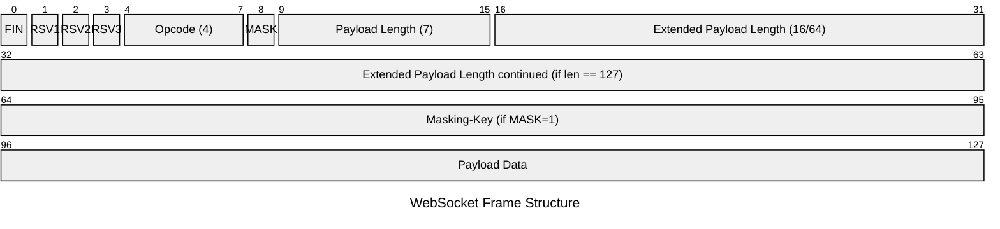

**Frame Types (Opcodes):**
| Opcode | Type | Description |
|---|---|---|
| 0x0 | Continuation | Part of a fragmented message |
| 0x1 | Text | UTF-8 encoded text data |
| 0x2 | Binary | Binary data |
| 0x8 | Close | Connection close |
| 0x9 | Ping | Keepalive probe |
| 0xA | Pong | Response to ping |

**Key Frame Fields:**
- **FIN bit**: Indicates whether this is the final fragment of a message
- **MASK bit**: Must be set for client-to-server frames (prevents proxy cache poisoning)
- **Payload length**: 7-bit for payloads ≤125 bytes, extended for larger payloads

#### Ping/Pong Keepalive

WebSocket uses ping/pong frames for connection liveness detection:

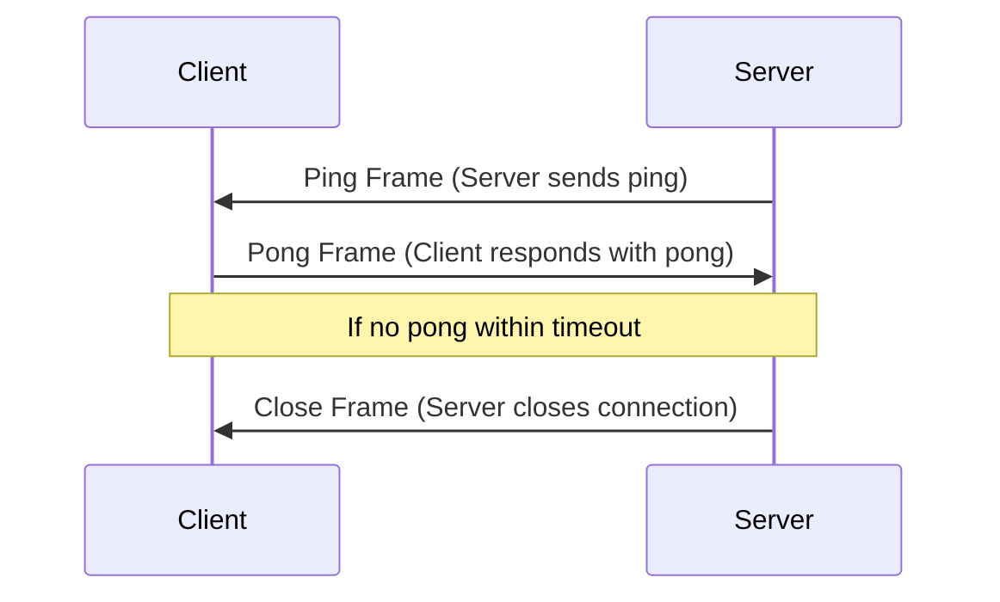

**Best Practice**: Set ping interval to 30 seconds with a 10-second pong timeout. This balances connection detection speed with resource usage.

### 3.3 WebSocket vs. HTTP Long Polling vs. SSE

Understanding when to use each protocol is critical for system design:

| Feature | WebSocket | Long Polling | SSE |
|---|---|---|---|
| **Direction** | Bidirectional | Client-initiated | Server → Client |
| **Connection** | Persistent TCP | Repeated HTTP | Persistent HTTP |
| **Protocol** | ws:// / wss:// | HTTP | HTTP |
| **Browser Support** | All modern browsers | All browsers | All modern (no IE) |
| **Through Proxies** | Can be problematic | Always works | Usually works |
| **Binary Data** | Yes | Yes (Base64) | No (text only) |
| **Reconnection** | Manual implementation | Built into pattern | Built-in (`EventSource`) |
| **Server Push** | Yes | Simulated | Yes |
| **Overhead per Message** | 2-14 bytes | ~800 bytes (HTTP headers) | ~50 bytes |
| **Scalability** | Harder (stateful) | Easier (stateless) | Moderate |
| **Load Balancing** | Sticky sessions needed | Standard LB works | Sticky sessions needed |
| **Firewall Friendly** | Sometimes blocked | Always passes | Always passes |

**Decision Framework:**
- **Use WebSocket** when: You need bidirectional, low-latency communication (chat, gaming, collaborative editing)
- **Use SSE** when: You only need server-to-client push (notifications, live feeds, dashboards)
- **Use Long Polling** when: You need maximum compatibility (legacy systems) or firewall/proxy traversal

### 3.4 Push vs. Pull Models

In distributed real-time systems, there are two fundamental data delivery models:

**Pull Model (Polling):**
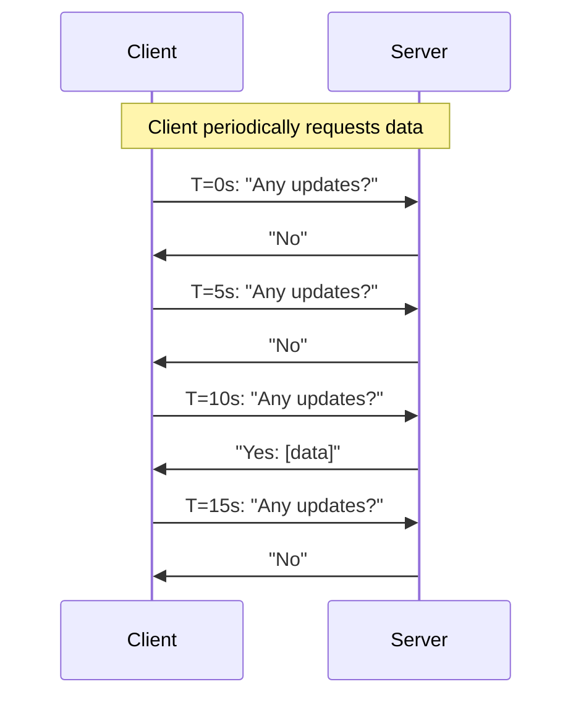

- **Pros**: Simple, stateless server, easy to scale
- **Cons**: Wasteful (most requests return empty), latency = polling interval
- **When to use**: When updates are infrequent, when simplicity matters, when clients control the refresh rate

**Push Model:**
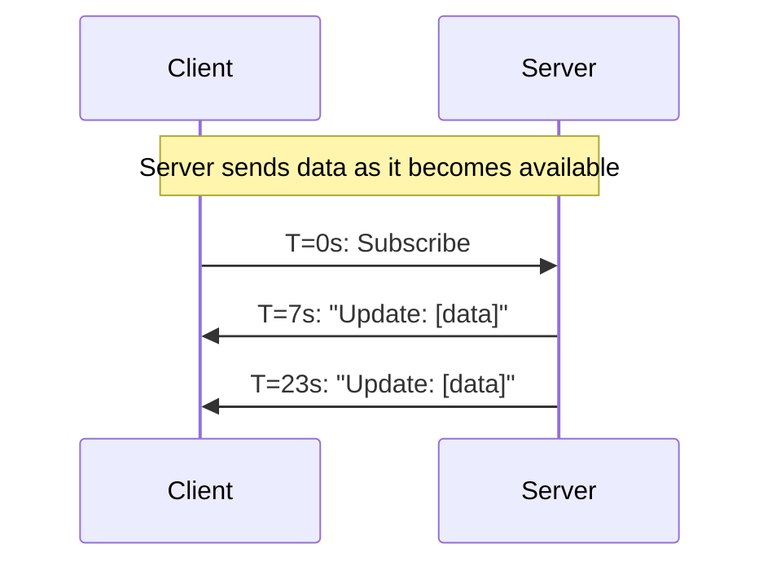

- **Pros**: Low latency, no wasted requests
- **Cons**: Requires persistent connections, harder to scale, back-pressure management
- **When to use**: When updates are frequent, when latency matters, when you control the infrastructure

**Hybrid Model (Used by most production systems):**
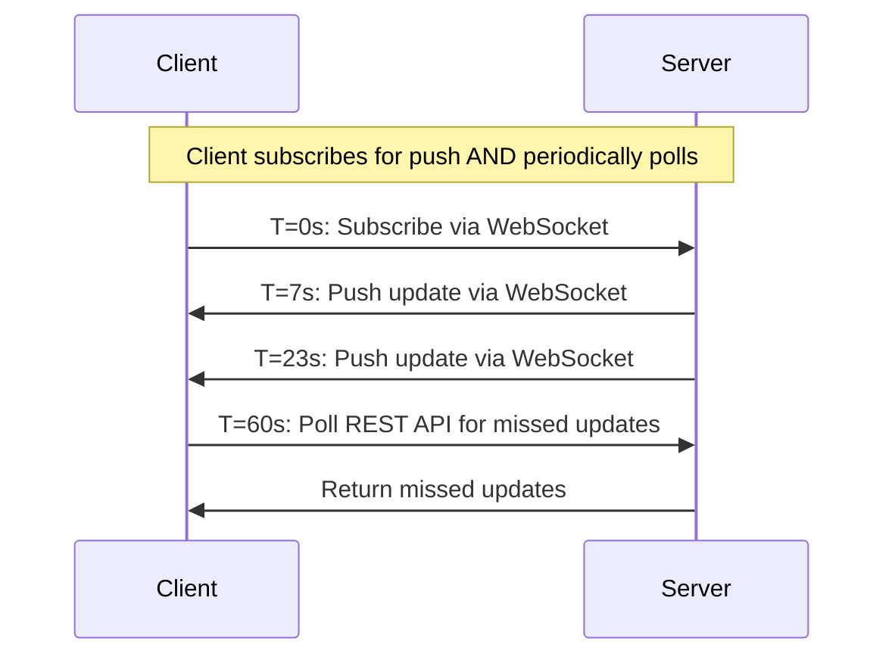

This is the pattern used by Slack, Discord, and most mature real-time systems.

### 3.5 Pub/Sub for Real-Time Systems

The **publish-subscribe** pattern decouples event producers from consumers:

**Core Concepts:**
- **Publisher**: Produces events (doesn't know who subscribes)
- **Subscriber**: Consumes events (doesn't know who publishes)
- **Topic/Channel**: Named logical channel for routing events
- **Broker**: Intermediary that routes events from publishers to subscribers

**Redis Pub/Sub:**
- In-memory, fire-and-forget delivery
- No message persistence—if a subscriber is offline, it misses the message
- Very low latency (~0.1ms intra-datacenter)
- Supports pattern-based subscriptions (`PSUBSCRIBE user:*`)
- Single-threaded model limits throughput to ~1M messages/sec per node

**Kafka as a Real-Time Backbone:**
- Durable, persistent message log
- Supports replay (subscribers can rewind)
- Partitioned for parallelism
- Consumer groups for load distribution
- Higher latency than Redis (~2-10ms)
- Handles 1M+ messages/sec per broker

**When to use which:**

| Criteria | Redis Pub/Sub | Kafka |
|---|---|---|
| Message durability | Not needed | Required |
| Replay capability | Not needed | Required |
| Latency requirement | Sub-millisecond | Low millisecond acceptable |
| Throughput | Moderate | Very high |
| Consumer scalability | Limited | Excellent (consumer groups) |
| Use case | Real-time notifications, presence | Event streaming, analytics, audit log |

### 3.6 Operational Transformation (OT) Theory

Operational Transformation is the foundational algorithm behind Google Docs' real-time collaboration. The core insight: **transform operations against concurrent operations to preserve user intent.**

**The Convergence Problem:**
```
Initial document: "ABC"

User 1: Insert("X", position=1) → "AXBC"    (Insert X after A)
User 2: Delete(position=2)      → "AC"       (Delete B)

If applied naively:
  Server applies User1 first: "ABC" → "AXBC"
  Then applies User2 (delete pos 2): "AXBC" → "AXC"  ← WRONG! User2 wanted to delete B, not X

With OT:
  Transform User2's operation against User1's:
  User1 inserted at pos 1, which shifts User2's target right by 1
  Transformed User2 op: Delete(position=3) → "AXC" wait... 
  
  Actually: "AXBC" delete position 3 → "AXC" 
  
  Hmm, let's reconsider. User2 wanted to delete 'B' which was originally at index 2.
  After User1's insert at position 1, 'B' is now at index 3.
  Transformed: Delete(position=3) → "AXBC" → "AXC"
```

**OT Transformation Rules (for Insert/Delete):**
```
Transform(Insert(p1, c), Insert(p2, d)):
  if p1 < p2: Insert(p1, c), Insert(p2+1, d)
  if p1 > p2: Insert(p1+1, c), Insert(p2, d)
  if p1 == p2: tiebreak by user ID

Transform(Insert(p1, c), Delete(p2)):
  if p1 <= p2: Insert(p1, c), Delete(p2+1)
  if p1 > p2:  Insert(p1-1, c), Delete(p2)

Transform(Delete(p1), Delete(p2)):
  if p1 < p2: Delete(p1), Delete(p2-1)
  if p1 > p2: Delete(p1-1), Delete(p2)
  if p1 == p2: NoOp, NoOp
```

**OT Challenges:**
- Algorithm correctness is notoriously hard to prove
- Centralized server needed for canonical ordering
- Transformation functions grow quadratically with operation types
- Google spent years getting this right for Google Docs

### 3.7 CRDTs for Real-Time Collaboration

**Conflict-Free Replicated Data Types (CRDTs)** offer an alternative to OT that doesn't require a central server for ordering.

**Key Insight**: Design data structures where all concurrent operations automatically commute—no matter what order they're applied, the result is the same.

**Types of CRDTs:**

| Type | Description | Example |
|---|---|---|
| **G-Counter** | Grow-only counter | View counts |
| **PN-Counter** | Positive-negative counter | Like/dislike counts |
| **G-Set** | Grow-only set | Users who've seen a message |
| **OR-Set** | Observed-remove set | Collaborative tag editing |
| **LWW-Register** | Last-writer-wins register | User profile fields |
| **RGA** | Replicated Growable Array | Collaborative text editing |

**RGA (Replicated Growable Array) for Text Editing:**
Used by Figma and other collaborative editors. Each character gets a unique, monotonically increasing identifier that never changes:

```
Initial: [(A, ts:1, uid:1), (B, ts:2, uid:1), (C, ts:3, uid:1)]

User1 inserts X after A:
  [(A, ts:1, uid:1), (X, ts:4, uid:1), (B, ts:2, uid:1), (C, ts:3, uid:1)]

User2 inserts Y after A (concurrently):
  [(A, ts:1, uid:1), (Y, ts:4, uid:2), (B, ts:2, uid:1), (C, ts:3, uid:1)]

Merge (both see each other's changes):
  Position after A has two elements: X(ts:4,uid:1) and Y(ts:4,uid:2)
  Tiebreak: lower UID wins → X before Y
  Result: [(A,1,1), (X,4,1), (Y,4,2), (B,2,1), (C,3,1)]
  Both users converge to: "AXYBC"
```

**CRDTs vs. OT:**

| Criteria | OT | CRDTs |
|---|---|---|
| Central server needed | Yes | No |
| Algorithm complexity | Very high | Moderate |
| Memory overhead | Low | High (tombstones, metadata) |
| Network topology | Star (client-server) | Any (peer-to-peer possible) |
| Proven correctness | Hard | Mathematically provable |
| Used by | Google Docs | Figma, Apple Notes, Yjs |

---

## 4. Architecture Deep Dive

### 4.1 WebSocket at Scale

Scaling WebSocket is fundamentally harder than scaling HTTP because WebSocket connections are **stateful** and **long-lived**.

#### The Connection Management Challenge

A single server can handle ~50,000-100,000 concurrent WebSocket connections (depending on hardware, message rate, and payload size). For a service with 10 million concurrent users, you need 100-200 WebSocket servers.

**Key challenges:**
1. **Connection routing**: How does a message for User A reach the correct server?
2. **Load balancing**: Traditional round-robin doesn't work well with persistent connections
3. **Server drain**: Upgrading a server means gracefully migrating connections
4. **Memory pressure**: Each connection consumes ~20-50KB of kernel buffer space

#### Architecture Pattern: Connection Gateway + Backend Services

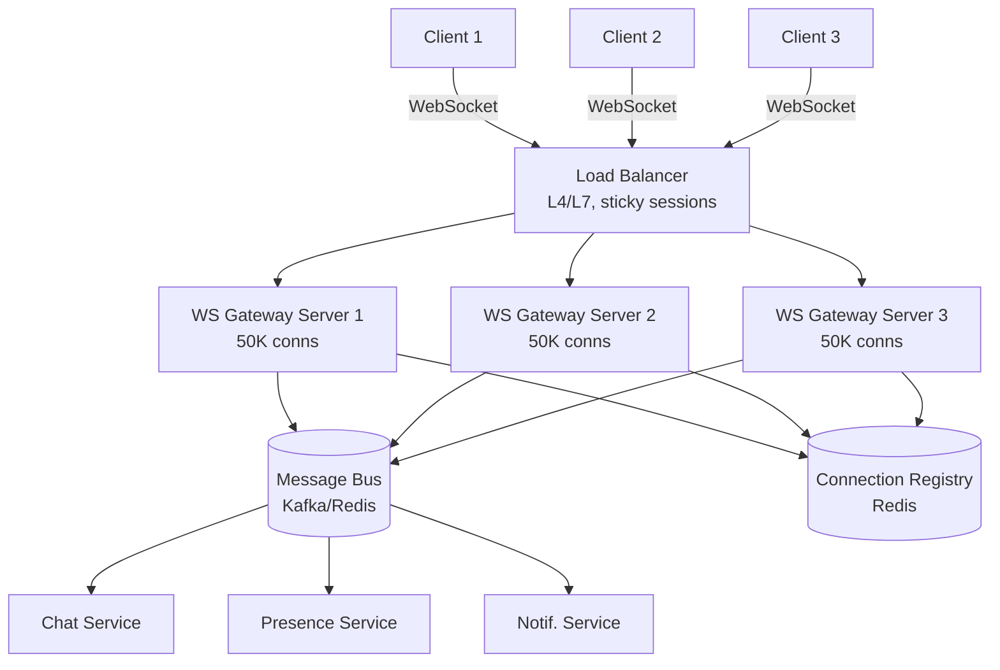

**Connection Registry**: A distributed mapping of `UserID → GatewayServer`. Stored in Redis for fast lookups:
```
user:12345 → ws-gateway-2
user:67890 → ws-gateway-1
```

When Service X wants to send a message to User 12345:
1. Look up `user:12345` in the connection registry → `ws-gateway-2`
2. Publish the message to `ws-gateway-2`'s inbox (via Redis Pub/Sub or Kafka)
3. `ws-gateway-2` looks up User 12345's local WebSocket connection and writes the message

#### Load Balancing WebSocket Connections

**Layer 4 (TCP) Load Balancing:**
- Distributes TCP connections (before HTTP upgrade)
- Supports sticky sessions via client IP or connection ID
- Used by: AWS NLB, HAProxy (TCP mode)
- **Pro**: Very fast, low overhead
- **Con**: No visibility into HTTP headers or WebSocket frames

**Layer 7 (HTTP) Load Balancing:**
- Inspects the HTTP upgrade request
- Can route based on headers, cookies, or URL path
- Used by: Nginx, Envoy, AWS ALB
- **Pro**: Intelligent routing, can add authentication
- **Con**: Higher overhead, must understand WebSocket upgrade

**Best Practice**: Use Layer 7 for the initial handshake (route based on user ID or session), then fall through to Layer 4 for the persistent connection.

### 4.2 Presence System Architecture

Presence detection (knowing who is online/offline) is a deceptively complex problem at scale.

#### Heartbeat-Based Presence

The simplest and most common approach:

```
Client sends heartbeat every 30 seconds:
  HEARTBEAT {user_id: 12345, timestamp: 1700000000}

Server logic:
  On receive heartbeat:
    SET user:12345:last_seen = now()
    SET user:12345:status = "online"
    EXPIRE user:12345:status 60  (TTL = 2 × heartbeat interval)

  Periodic scanner (or lazy evaluation):
    If now() - user:12345:last_seen > 60s:
      user:12345:status = "offline"
      PUBLISH presence_updates {user: 12345, status: "offline"}
```

**Challenges at Scale:**
- 10M online users × heartbeat every 30s = **333K heartbeats/second**
- Each heartbeat requires a Redis write → need Redis cluster
- Presence queries from contacts: If each user has 200 contacts, loading a contact list requires 200 Redis reads

**Optimization: Sliding Window with Batching:**
```
Instead of individual heartbeats, batch presence updates:

Gateway Server 1 accumulates heartbeats for 5 seconds:
  Batch: [user:123, user:456, user:789, ...]
  
Single MSET to Redis:
  MSET user:123:seen T user:456:seen T user:789:seen T ...

This reduces 10,000 individual writes to 1 batch write
```

#### Gossip-Based Presence

For truly massive scale (hundreds of millions of users), gossip protocols distribute presence information:

```
Node A knows: {user1: online, user2: offline}
Node B knows: {user2: online, user3: online}

Gossip round:
  Node A tells Node B: {user1: online, user2: offline}
  Node B merges: user1 is online, user2 conflict → use latest timestamp
  Node B tells Node C: {user1: online, user2: online, user3: online}

After O(log N) rounds, all nodes converge
```

**Pros**: No central point of failure, scales to millions of nodes
**Cons**: Eventual consistency (presence may be stale for seconds), more complex

#### Presence Fan-Out Problem

When User A comes online, which of their contacts need to be notified?

**Naive approach**: Look up all of User A's contacts, check if each is online, send notification to each online contact.

**Problem**: If User A has 5,000 contacts and 1,000 are online, that's 1,000 WebSocket messages. Multiply by 333K presence changes/second = **billions of messages/second**. This is the **thundering herd problem** for presence.

**Solution: Subscription-Based Presence**
```
When User B opens a chat with User A:
  Subscribe to presence channel: "presence:userA"

When User A's status changes:
  Publish to "presence:userA" channel
  Only users actively subscribed receive the update

When User B closes the chat:
  Unsubscribe from "presence:userA"
```

This reduces fan-out from "all contacts" to "contacts currently viewing this user's status."

### 4.3 Chat System Architecture

A modern chat system must handle:
- 1:1 conversations
- Group chats (up to thousands of members)
- Message delivery guarantees (at-least-once, ideally exactly-once at application level)
- Message ordering
- Offline message delivery
- Media messages (images, videos, files)
- Read receipts
- Push notifications

#### Message Flow Architecture

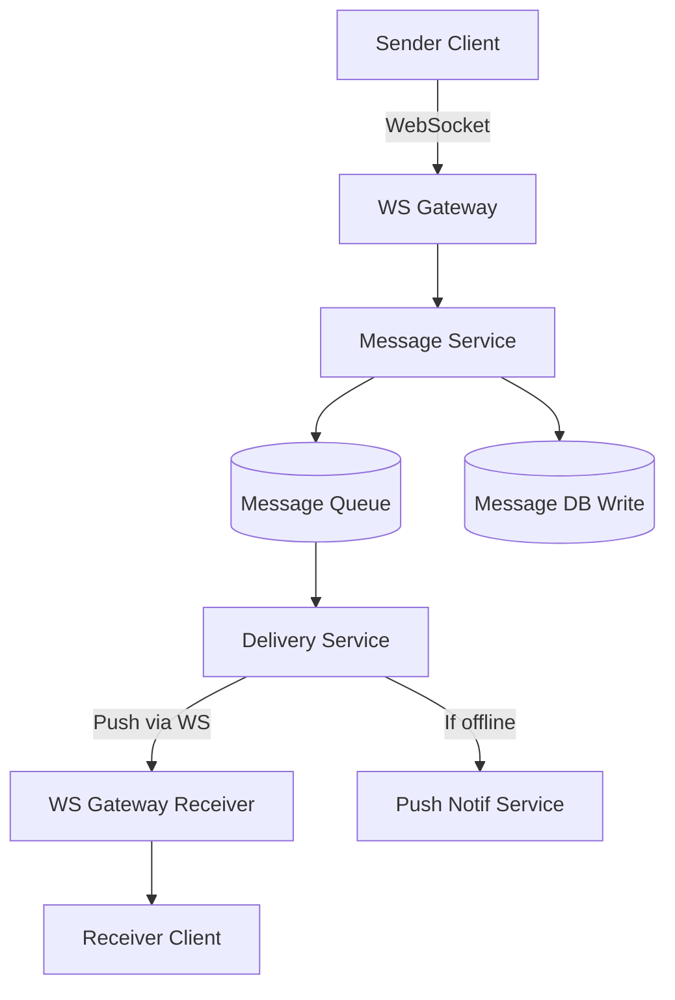

#### Message Delivery States

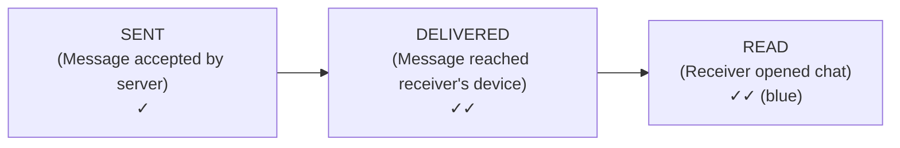

#### Message Ordering

**The Ordering Problem:**
```
User A sends: "Do you want pizza?"  (T=1)
User A sends: "or pasta?"           (T=2)

User B should see them in order. But what if message 2 arrives before message 1?
```

**Solution: Sequence Numbers per Conversation**

Each conversation maintains a monotonically increasing sequence number:

```
Conversation 12345:
  seq=1: "Hey!" (User A)
  seq=2: "Hi!"  (User B)
  seq=3: "Do you want pizza?" (User A)
  seq=4: "or pasta?" (User A)
```

The client buffers messages and displays them in sequence order, waiting for gaps to be filled.

**Cross-Conversation Ordering**: Use Hybrid Logical Clocks (HLC) which combine physical timestamps with logical counters. This provides causal ordering without the overhead of full vector clocks.

#### Group Chat Scalability

Group chats introduce the **fan-out problem**:

**Small groups (≤256 members, WhatsApp style):**
- Fan-out on write: When a message is sent, write it to each member's inbox
- Each member's inbox is a sorted list (by timestamp/sequence)
- This is how WhatsApp handles groups

**Large groups (1000+ members, Slack/Discord style):**
- Fan-out on read: Write the message once to the group's message log
- When a member opens the group, read from the group's log
- Use pagination (cursor-based) for history

**Hybrid approach (used by most systems):**
```
Message sent to Group G with 500 members:
  
  1. Write message to group_messages table (single write)
  2. Update unread_counts for all 500 members (batch update)
  3. For online members (say 50): push via WebSocket
  4. For recently active members (say 100): send push notification
  5. For inactive members (say 350): they'll pull on next app open
```

#### Read Receipts

Read receipts are expensive at scale because they generate N×M messages for a group of N members viewing M messages.

**Optimization: Watermark-based Read Receipts**
```
Instead of: "User B read message 5, message 6, message 7, message 8"
Send:       "User B read up to sequence 8"

This single watermark replaces multiple read receipt messages.

Storage: 
  read_watermarks table:
    (conversation_id, user_id) → last_read_seq

  When User B opens conversation:
    UPDATE read_watermarks SET last_read_seq = MAX(seq) 
    WHERE conversation_id = X AND user_id = B
```

### 4.4 Live Streaming Architecture

Live streaming is one of the most infrastructure-intensive real-time applications, combining video processing, content delivery, and massive fan-out.

#### End-to-End Pipeline

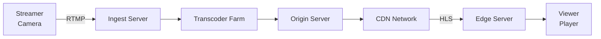

**Stage 1: Video Ingestion**
- Streamer encodes video using H.264/HEVC and sends via RTMP (Real-Time Messaging Protocol) or SRT (Secure Reliable Transport)
- Ingest server receives the raw stream and validates it
- Typical bitrate: 3-6 Mbps for 1080p @ 30fps

**Stage 2: Transcoding**
- Raw stream is transcoded into multiple quality levels:
  - 1080p @ 6000 Kbps
  - 720p @ 3000 Kbps
  - 480p @ 1500 Kbps
  - 360p @ 800 Kbps
  - 160p @ 400 Kbps (mobile low bandwidth)
- Uses GPU-accelerated encoding (NVENC, Intel QSV)
- Twitch uses a farm of ~10,000 transcoding servers

**Stage 3: Segmentation**
- Transcoded video is split into small segments (2-6 seconds each)
- HLS: `.ts` segments with `.m3u8` playlist manifest
- DASH: `.m4s` segments with `.mpd` manifest

**Stage 4: CDN Distribution**
- Segments are pushed to edge servers worldwide
- Viewers fetch segments from the nearest edge server
- Cache hit ratio target: >95%
- Twitch/YouTube have proprietary CDN networks

**Stage 5: Adaptive Bitrate Streaming**
- Player monitors available bandwidth
- Switches quality levels seamlessly based on conditions:
```
Available Bandwidth → Quality Level
  > 8 Mbps          → 1080p
  > 4 Mbps          → 720p
  > 2 Mbps          → 480p
  > 1 Mbps          → 360p
  < 1 Mbps          → 160p
```

#### HLS (HTTP Live Streaming) vs. DASH

| Feature | HLS | DASH |
|---|---|---|
| Developed by | Apple | MPEG consortium |
| Container | MPEG-TS or fMP4 | fMP4 |
| Manifest | .m3u8 (text) | .mpd (XML) |
| DRM | FairPlay | Widevine, PlayReady |
| Codec Support | H.264, HEVC, AV1 | Any codec |
| Browser Support | Safari native, others via MSE | Via MSE |
| Latency | 6-30s (standard), 2-5s (LL-HLS) | 2-10s |
| Industry Use | Dominant on Apple, widely adopted | Used by Netflix, YouTube |

### 4.5 Real-Time Collaboration Architecture

#### Google Docs Style Architecture

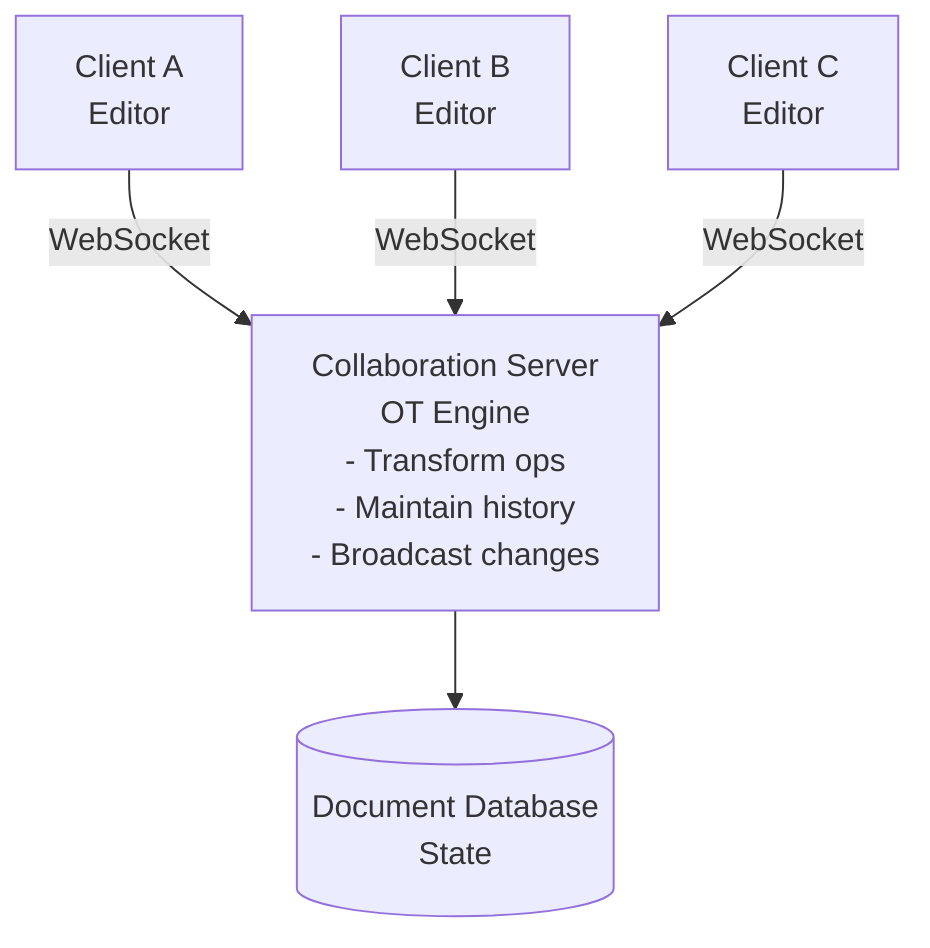

**Operation Flow:**
1. Client A types "Hello" → generates Insert operations
2. Operations are sent to server with client's current revision number
3. Server transforms operations against any concurrent operations from other clients
4. Server broadcasts transformed operations to all other clients
5. Other clients apply the transformed operations to their local document

**Cursor Awareness:**
Each client also broadcasts cursor position:
```json
{
  "type": "cursor_update",
  "user_id": "alice",
  "user_color": "#FF5733",
  "position": { "line": 15, "column": 23 },
  "selection": { "start": { "line": 15, "col": 20 }, "end": { "line": 15, "col": 23 } }
}
```

These are broadcast at a throttled rate (10-20 updates/second max) to avoid overwhelming the network.

---

## 5. Visual Diagrams

### 5.1 WebSocket Connection Lifecycle

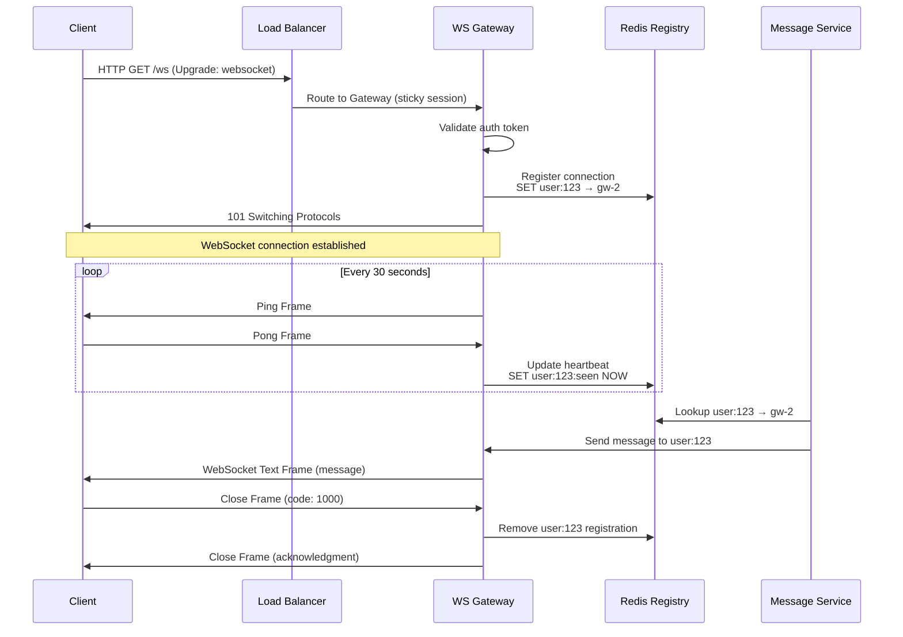

### 5.2 Chat System Architecture

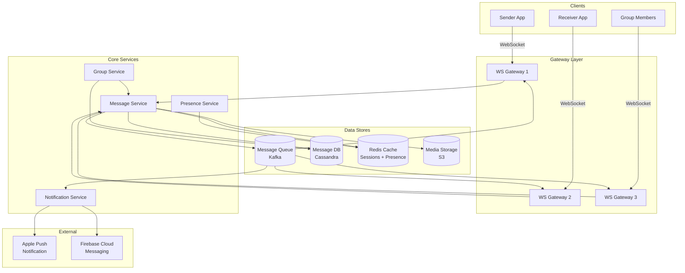

### 5.3 Presence System Design

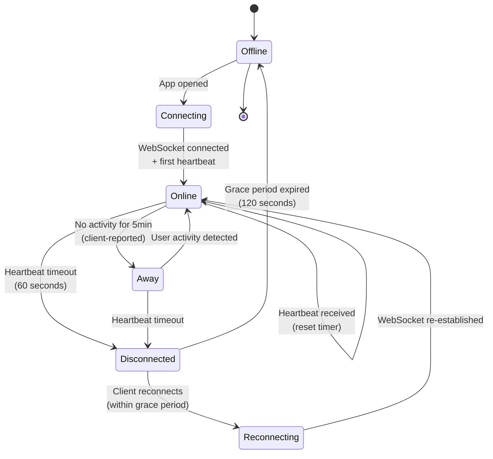

### 5.4 Live Streaming Pipeline

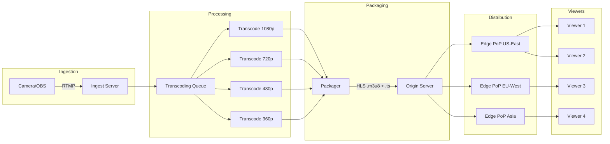

### 5.5 Real-Time Collaboration with CRDTs

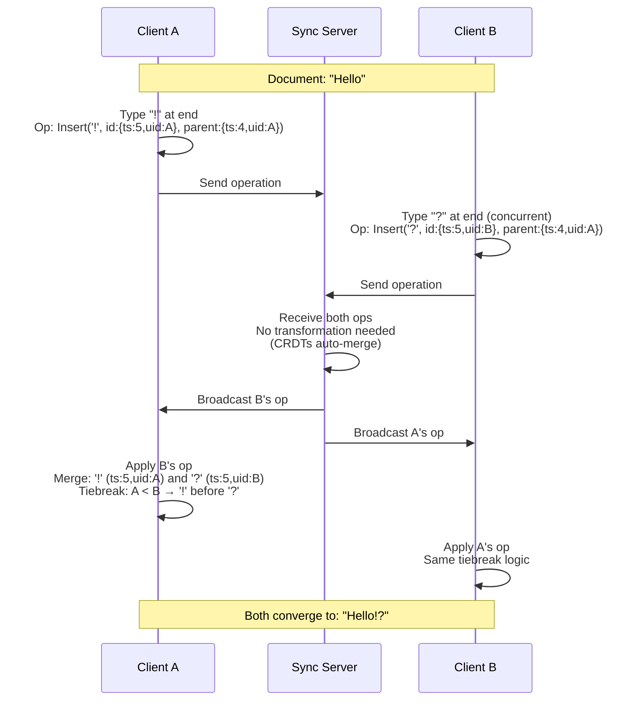

### 5.6 Message Delivery Flow with Guarantees

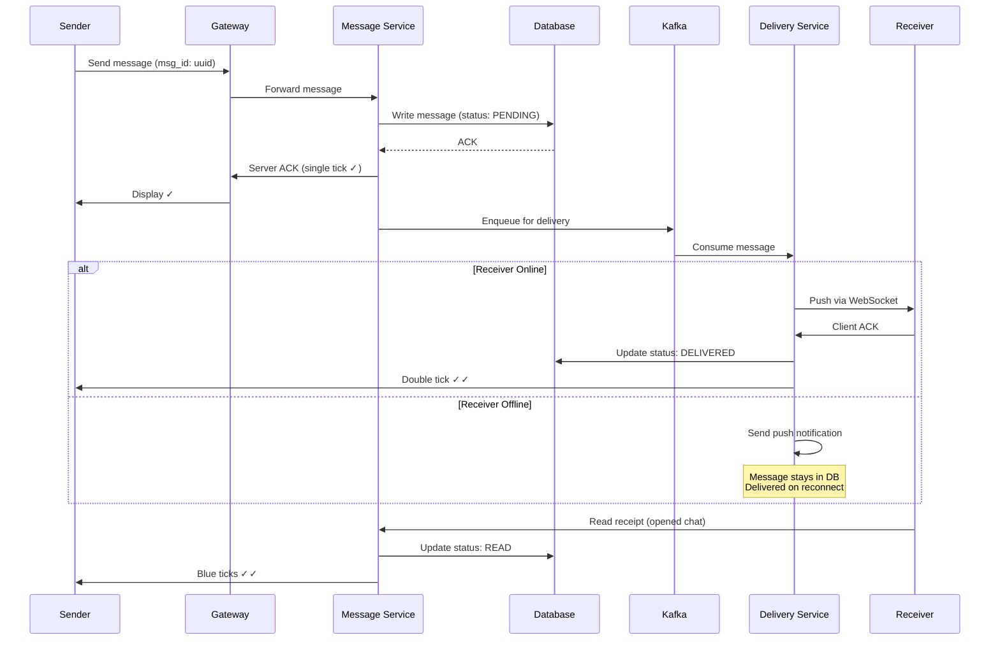

---

## 6. Real Production Examples

### 6.1 WhatsApp Messaging Architecture

WhatsApp handles **100 billion messages per day** with remarkable efficiency.

**Key Architecture Decisions:**

1. **Erlang/BEAM VM**: WhatsApp's backend is written in Erlang, which natively supports millions of lightweight concurrent processes. Each WebSocket connection maps to an Erlang process (~2KB memory).

2. **XMPP-Based Protocol**: Originally based on XMPP (Extensible Messaging and Presence Protocol), now heavily customized. Uses a custom binary protocol for efficiency.

3. **Fan-Out on Write for Groups**: When a message is sent to a group, it's written to each member's message queue. This means a message to a 256-member group creates 256 writes, but reads are fast (each user reads from their own queue).

4. **Mnesia Database**: Uses Erlang's built-in distributed database for session management and transient state. Messages are stored in a custom storage engine.

5. **End-to-End Encryption**: Signal Protocol. The server never sees plaintext messages—it only routes encrypted blobs.

6. **Offline Message Queue**: Each user has a per-device message queue. When the device comes online, it syncs all pending messages.

**Scale Numbers (approximate):**
- 2B+ monthly active users
- 100B messages/day
- ~50 engineers managing the backend (at peak efficiency)
- Peak: ~70M messages/second
- Server fleet: ~10,000 servers
- Each Erlang server handles ~2M concurrent connections

**Lessons Learned:**
- Simplicity scales. WhatsApp deliberately avoids complex features
- Erlang's actor model is a natural fit for messaging workloads
- Fan-out on write works well when group sizes are bounded

### 6.2 Discord's Real-Time Infrastructure

Discord handles **millions of concurrent voice and text connections** with sub-100ms latency.

**Key Architecture Decisions:**

1. **Elixir for Gateway**: Discord's WebSocket gateway is written in Elixir (which runs on the BEAM VM, like Erlang). Each gateway node handles ~1M concurrent connections.

2. **Guild (Server) Sharding**: Each Discord server (guild) is assigned to a specific gateway process. All members of a guild connect to the same logical shard.

3. **Rust for Performance-Critical Components**: The real-time audio/video mixing, message storage, and read state tracking are in Rust for performance.

4. **Cassandra → ScyllaDB**: Discord migrated from Cassandra to ScyllaDB for message storage, achieving 10x lower tail latency. Messages are partitioned by `(channel_id, bucket)` where bucket is a time window.

5. **Lazy Guilds**: For large servers (100K+ members), Discord doesn't send the full member list. Instead, it lazily loads members as they become visible in the UI.

6. **Voice Architecture**: Uses WebRTC with Selective Forwarding Units (SFUs). Each voice channel has a dedicated SFU that receives audio from speakers and forwards it to listeners (no mixing on the server for quality and latency reasons).

**Message Storage Schema (ScyllaDB):**
```
CREATE TABLE messages (
    channel_id bigint,
    bucket int,        -- time bucket (10 days)
    message_id bigint, -- Snowflake ID (timestamp-encoded)
    author_id bigint,
    content text,
    PRIMARY KEY ((channel_id, bucket), message_id)
) WITH CLUSTERING ORDER BY (message_id DESC);
```

**Scale Numbers:**
- 150M+ monthly active users
- 4B+ messages/day
- ~15M concurrent connections at peak
- Millions of concurrent voice connections
- 99th percentile API latency: <100ms

### 6.3 Slack's Messaging System

Slack processes **billions of messages** with strong consistency requirements.

**Key Architecture Decisions:**

1. **PHP → Hack → Go/Java**: Slack has been migrating from PHP to more performant languages for backend services.

2. **MySQL with Vitess**: Messages are stored in MySQL, sharded by workspace ID using Vitess. Each workspace's messages are in a single shard for strong ordering.

3. **Channel-Level Ordering**: Messages are strictly ordered within a channel using database sequence numbers.

4. **Flannel (Edge Cache)**: Slack built a custom edge caching layer called Flannel that caches workspace data (channels, users, messages) close to WebSocket gateways. This reduces database load by ~100x.

5. **RTM → Events API**: Slack migrated from the Real-Time Messaging (RTM) API (WebSocket per client) to the Events API (webhook-based) for third-party integrations to reduce connection overhead.

6. **Message Search**: Slack uses Solr/Lucene for full-text search, with per-workspace indexes.

**Key Insight**: Slack's architecture prioritizes **consistency over availability**. If a message is displayed, it's guaranteed to be persisted. This is different from WhatsApp's approach where messages can be in-flight and not yet persisted.

### 6.4 Twitch Live Streaming

Twitch serves **30M+ daily active users** with **7M+ unique streamers per month**.

**Key Architecture Decisions:**

1. **Custom CDN**: Twitch operates its own CDN with Points of Presence (PoPs) worldwide, plus uses third-party CDNs for overflow.

2. **Transcoding at Scale**: Every live stream is transcoded into 5+ quality levels in real-time. Twitch has ~10,000 GPU-equipped transcoding servers.

3. **Low-Latency HLS**: Twitch pioneered Low-Latency HLS (LL-HLS) achieving 2-3 second glass-to-glass latency (down from 10-15 seconds with standard HLS).

4. **Chat System**: Twitch's chat is separate from the video pipeline. Chat messages are distributed via a custom IRC-based protocol. Popular streams (100K+ viewers) require special fan-out handling.

5. **Clip Generation**: When a viewer creates a clip, Twitch extracts the relevant segments from the already-transcoded stream, avoiding re-transcoding.

**Chat Fan-Out Challenge:**
```
Popular streamer: 200,000 concurrent viewers
Chat rate: 50 messages/second

Fan-out per second: 200,000 × 50 = 10,000,000 messages/second
For just ONE channel!

Solution: Sharded chat rooms
  - Chat server handles a subset of viewers
  - Message is published to all chat servers for the channel
  - Each server fans out to its connected viewers
  - Chat servers: 200,000 / 5,000 = 40 chat servers per popular channel
```

### 6.5 Figma's Multiplayer Architecture

Figma enables **real-time collaborative design** with hundreds of concurrent editors.

**Key Architecture Decisions:**

1. **CRDTs, Not OT**: Figma uses CRDTs for conflict resolution, which allows peer-to-peer-like merging without a central ordering server.

2. **Rust + WASM**: Figma's multiplayer engine runs in the browser via WebAssembly, compiled from Rust. This provides near-native performance for complex document operations.

3. **Component-Level Granularity**: Instead of character-level CRDTs (like text editors), Figma operates on design components (shapes, frames, layers). Each component has its own CRDT state.

4. **LiveGraph**: Figma's custom data structure that represents the design document as a DAG (Directed Acyclic Graph). Each node in the graph is a CRDT.

5. **Cursor Broadcasting**: Figma broadcasts cursor positions at ~10Hz, throttled and batched to minimize bandwidth.

6. **Undo/Redo**: Each client maintains its own undo stack. Undoing an operation generates a new inverse operation (not a rollback), which is also a CRDT operation that gets merged normally.

**Performance Optimization:**
```
Document with 10,000 components, 50 concurrent editors:

Naive: Every edit broadcasts full component state
  → 10KB per component × 50 edits/sec = 500KB/sec per editor
  → 50 editors × 500KB = 25MB/sec bandwidth

Figma's approach: Delta compression
  → Only changed properties are broadcast
  → Average delta: ~100 bytes
  → 50 edits/sec × 100 bytes = 5KB/sec per editor
  → 50 editors × 5KB = 250KB/sec total (100x reduction)
```

---

## 7. Java Implementations

### 7.1 WebSocket Server with Spring Boot

```java
// ==========================================
// WebSocket Configuration
// ==========================================
package com.realtime.websocket.config;

import org.springframework.context.annotation.Configuration;
import org.springframework.web.socket.config.annotation.*;

@Configuration
@EnableWebSocket
public class WebSocketConfig implements WebSocketConfigurer {

    private final ChatWebSocketHandler chatHandler;
    private final WebSocketAuthInterceptor authInterceptor;

    public WebSocketConfig(ChatWebSocketHandler chatHandler,
                           WebSocketAuthInterceptor authInterceptor) {
        this.chatHandler = chatHandler;
        this.authInterceptor = authInterceptor;
    }

    @Override
    public void registerWebSocketHandlers(WebSocketHandlerRegistry registry) {
        registry.addHandler(chatHandler, "/ws/chat")
                .addInterceptors(authInterceptor)
                .setAllowedOrigins("*"); // In production, restrict origins
    }
}
```

```java
// ==========================================
// WebSocket Authentication Interceptor
// ==========================================
package com.realtime.websocket.config;

import org.springframework.http.server.ServerHttpRequest;
import org.springframework.http.server.ServerHttpResponse;
import org.springframework.http.server.ServletServerHttpRequest;
import org.springframework.stereotype.Component;
import org.springframework.web.socket.WebSocketHandler;
import org.springframework.web.socket.server.HandshakeInterceptor;

import java.util.Map;

@Component
public class WebSocketAuthInterceptor implements HandshakeInterceptor {

    private final JwtTokenValidator tokenValidator;

    public WebSocketAuthInterceptor(JwtTokenValidator tokenValidator) {
        this.tokenValidator = tokenValidator;
    }

    @Override
    public boolean beforeHandshake(ServerHttpRequest request,
                                    ServerHttpResponse response,
                                    WebSocketHandler wsHandler,
                                    Map<String, Object> attributes) {
        if (request instanceof ServletServerHttpRequest servletRequest) {
            // Extract token from query parameter or header
            String token = servletRequest.getServletRequest().getParameter("token");
            if (token == null) {
                token = servletRequest.getServletRequest().getHeader("Authorization");
                if (token != null && token.startsWith("Bearer ")) {
                    token = token.substring(7);
                }
            }

            if (token != null && tokenValidator.isValid(token)) {
                String userId = tokenValidator.extractUserId(token);
                attributes.put("userId", userId);
                return true; // Allow handshake
            }
        }
        return false; // Reject handshake
    }

    @Override
    public void afterHandshake(ServerHttpRequest request,
                               ServerHttpResponse response,
                               WebSocketHandler wsHandler,
                               Exception exception) {
        // Post-handshake logging
    }
}
```

```java
// ==========================================
// Chat WebSocket Handler
// ==========================================
package com.realtime.websocket.handler;

import com.fasterxml.jackson.databind.ObjectMapper;
import com.realtime.websocket.model.*;
import com.realtime.websocket.service.*;
import org.slf4j.Logger;
import org.slf4j.LoggerFactory;
import org.springframework.stereotype.Component;
import org.springframework.web.socket.*;
import org.springframework.web.socket.handler.TextWebSocketHandler;

import java.io.IOException;
import java.util.concurrent.*;

/**
 * Production-grade WebSocket handler for chat messages.
 * 
 * Key design decisions:
 * 1. Thread-safe connection registry using ConcurrentHashMap
 * 2. Async message processing to avoid blocking the WebSocket thread
 * 3. Per-connection send queue to handle back-pressure
 * 4. Graceful error handling with automatic cleanup
 */
@Component
public class ChatWebSocketHandler extends TextWebSocketHandler {

    private static final Logger log = LoggerFactory.getLogger(ChatWebSocketHandler.class);
    
    // Maps userId → WebSocket session for local connections
    private final ConcurrentHashMap<String, WebSocketSession> localSessions = 
            new ConcurrentHashMap<>();
    
    // Maps sessionId → userId for reverse lookups (cleanup on disconnect)
    private final ConcurrentHashMap<String, String> sessionToUser = 
            new ConcurrentHashMap<>();

    private final ObjectMapper objectMapper;
    private final MessageService messageService;
    private final PresenceService presenceService;
    private final ConnectionRegistry connectionRegistry; // Redis-backed distributed registry
    private final ExecutorService messageProcessor;

    public ChatWebSocketHandler(ObjectMapper objectMapper,
                                 MessageService messageService,
                                 PresenceService presenceService,
                                 ConnectionRegistry connectionRegistry) {
        this.objectMapper = objectMapper;
        this.messageService = messageService;
        this.presenceService = presenceService;
        this.connectionRegistry = connectionRegistry;
        // Bounded thread pool to prevent resource exhaustion
        this.messageProcessor = new ThreadPoolExecutor(
                4, 16, 60, TimeUnit.SECONDS,
                new LinkedBlockingQueue<>(10_000),
                new ThreadPoolExecutor.CallerRunsPolicy() // Back-pressure: slow down sender
        );
    }

    @Override
    public void afterConnectionEstablished(WebSocketSession session) {
        String userId = (String) session.getAttributes().get("userId");
        
        localSessions.put(userId, session);
        sessionToUser.put(session.getId(), userId);
        
        // Register in distributed connection registry
        String serverId = System.getenv("SERVER_ID"); // e.g., "ws-gateway-3"
        connectionRegistry.register(userId, serverId);
        
        // Update presence
        presenceService.setOnline(userId);
        
        // Send any pending offline messages
        messageService.deliverPendingMessages(userId, this::sendToLocal);
        
        log.info("WebSocket connected: userId={}, sessionId={}", userId, session.getId());
    }

    @Override
    protected void handleTextMessage(WebSocketSession session, TextMessage textMessage) {
        String userId = sessionToUser.get(session.getId());
        
        // Process message asynchronously to free WebSocket thread
        messageProcessor.submit(() -> {
            try {
                WebSocketMessage wsMessage = objectMapper.readValue(
                        textMessage.getPayload(), WebSocketMessage.class);
                
                switch (wsMessage.getType()) {
                    case CHAT_MESSAGE -> handleChatMessage(userId, wsMessage);
                    case TYPING_INDICATOR -> handleTypingIndicator(userId, wsMessage);
                    case READ_RECEIPT -> handleReadReceipt(userId, wsMessage);
                    case PRESENCE_HEARTBEAT -> handleHeartbeat(userId);
                    default -> log.warn("Unknown message type: {}", wsMessage.getType());
                }
            } catch (Exception e) {
                log.error("Error processing message from user {}: {}", userId, e.getMessage());
                sendError(session, "Failed to process message");
            }
        });
    }

    private void handleChatMessage(String senderId, WebSocketMessage wsMessage) {
        ChatMessage chatMessage = objectMapper.convertValue(
                wsMessage.getPayload(), ChatMessage.class);
        
        // 1. Validate message
        if (chatMessage.getContent() == null || chatMessage.getContent().isBlank()) {
            return;
        }
        
        // 2. Assign server-side metadata
        chatMessage.setSenderId(senderId);
        chatMessage.setTimestamp(System.currentTimeMillis());
        chatMessage.setMessageId(generateMessageId());
        chatMessage.setStatus(MessageStatus.SENT);
        
        // 3. Persist message
        messageService.saveMessage(chatMessage);
        
        // 4. Send ACK to sender (single tick ✓)
        sendToLocal(senderId, new WebSocketMessage(
                MessageType.MESSAGE_ACK,
                new MessageAck(chatMessage.getMessageId(), MessageStatus.SENT)
        ));
        
        // 5. Deliver to recipient(s)
        if (chatMessage.isGroupMessage()) {
            messageService.deliverToGroup(chatMessage, this::deliverToUser);
        } else {
            deliverToUser(chatMessage.getRecipientId(), chatMessage);
        }
    }

    /**
     * Delivers a message to a user, whether they're connected locally or on another server.
     */
    private void deliverToUser(String recipientId, ChatMessage message) {
        WebSocketSession localSession = localSessions.get(recipientId);
        
        if (localSession != null && localSession.isOpen()) {
            // Recipient is connected to this server
            sendToLocal(recipientId, new WebSocketMessage(
                    MessageType.CHAT_MESSAGE, message));
            
            // Update delivery status
            messageService.updateStatus(message.getMessageId(), MessageStatus.DELIVERED);
            
            // Notify sender of delivery (double tick ✓✓)
            sendToLocal(message.getSenderId(), new WebSocketMessage(
                    MessageType.MESSAGE_ACK,
                    new MessageAck(message.getMessageId(), MessageStatus.DELIVERED)
            ));
        } else {
            // Recipient is on another server or offline
            String targetServer = connectionRegistry.lookup(recipientId);
            if (targetServer != null) {
                // Route through message bus to the correct gateway server
                messageService.routeToServer(targetServer, recipientId, message);
            } else {
                // User is offline → queue for later delivery + push notification
                messageService.queueForOfflineDelivery(recipientId, message);
                messageService.sendPushNotification(recipientId, message);
            }
        }
    }

    private void handleTypingIndicator(String userId, WebSocketMessage wsMessage) {
        TypingIndicator indicator = objectMapper.convertValue(
                wsMessage.getPayload(), TypingIndicator.class);
        
        // Forward typing indicator to conversation partner(s)
        // Note: Typing indicators are fire-and-forget, no persistence needed
        String conversationId = indicator.getConversationId();
        messageService.getConversationMembers(conversationId).stream()
                .filter(memberId -> !memberId.equals(userId))
                .forEach(memberId -> deliverToUser(memberId, 
                        new ChatMessage(/* typing indicator payload */)));
    }

    private void handleReadReceipt(String userId, WebSocketMessage wsMessage) {
        ReadReceipt receipt = objectMapper.convertValue(
                wsMessage.getPayload(), ReadReceipt.class);
        
        // Update watermark: "User has read up to message X in conversation Y"
        messageService.updateReadWatermark(
                receipt.getConversationId(), userId, receipt.getLastReadMessageId());
        
        // Notify message senders about read status
        // (optimization: batch read receipts, send every 2 seconds)
    }

    private void handleHeartbeat(String userId) {
        presenceService.heartbeat(userId);
    }

    /**
     * Sends a message to a locally connected user.
     * Thread-safe: WebSocket session.sendMessage() must be synchronized.
     */
    private void sendToLocal(String userId, WebSocketMessage message) {
        WebSocketSession session = localSessions.get(userId);
        if (session != null && session.isOpen()) {
            try {
                String json = objectMapper.writeValueAsString(message);
                // WebSocket sendMessage is not thread-safe, must synchronize
                synchronized (session) {
                    session.sendMessage(new TextMessage(json));
                }
            } catch (IOException e) {
                log.error("Failed to send message to user {}: {}", userId, e.getMessage());
            }
        }
    }

    private void sendError(WebSocketSession session, String error) {
        try {
            WebSocketMessage errorMsg = new WebSocketMessage(
                    MessageType.ERROR, Map.of("message", error));
            synchronized (session) {
                session.sendMessage(new TextMessage(
                        objectMapper.writeValueAsString(errorMsg)));
            }
        } catch (IOException e) {
            log.error("Failed to send error message: {}", e.getMessage());
        }
    }

    @Override
    public void afterConnectionClosed(WebSocketSession session, CloseStatus status) {
        String userId = sessionToUser.remove(session.getId());
        if (userId != null) {
            localSessions.remove(userId);
            connectionRegistry.unregister(userId);
            
            // Don't immediately mark offline — use grace period
            // (handles brief disconnections during network switches)
            presenceService.scheduleOfflineCheck(userId, Duration.ofSeconds(30));
            
            log.info("WebSocket disconnected: userId={}, status={}", userId, status);
        }
    }

    @Override
    public void handleTransportError(WebSocketSession session, Throwable exception) {
        log.error("WebSocket transport error for session {}: {}", 
                session.getId(), exception.getMessage());
        try {
            session.close(CloseStatus.SERVER_ERROR);
        } catch (IOException e) {
            log.error("Failed to close session after error: {}", e.getMessage());
        }
    }

    private String generateMessageId() {
        // Use Snowflake-like ID for globally unique, time-ordered IDs
        return SnowflakeIdGenerator.nextId();
    }
}
```

### 7.2 Presence Service

```java
// ==========================================
// Presence Service with Redis Backend
// ==========================================
package com.realtime.presence;

import org.slf4j.Logger;
import org.slf4j.LoggerFactory;
import org.springframework.data.redis.core.StringRedisTemplate;
import org.springframework.data.redis.core.script.DefaultRedisScript;
import org.springframework.scheduling.annotation.Scheduled;
import org.springframework.stereotype.Service;

import java.time.Duration;
import java.time.Instant;
import java.util.*;
import java.util.concurrent.ConcurrentHashMap;
import java.util.stream.Collectors;

/**
 * Production-grade presence service.
 * 
 * Architecture:
 * - Uses Redis for distributed presence state
 * - Batches heartbeat updates to reduce Redis load
 * - Supports subscription-based presence fan-out
 * - Handles presence state machine: ONLINE → AWAY → OFFLINE
 * 
 * Scalability:
 * - 1M users: ~333K heartbeats/sec → batched to ~66 Redis ops/sec
 * - Presence lookup: O(1) per user via Redis
 * - Fan-out: subscription-based, not contact-list-based
 */
@Service
public class PresenceService {

    private static final Logger log = LoggerFactory.getLogger(PresenceService.class);

    // Redis key patterns
    private static final String PRESENCE_KEY = "presence:%s";           // Hash: status, lastSeen
    private static final String PRESENCE_SUBSCRIBERS = "presence:subs:%s"; // Set: subscriber userIds
    private static final String HEARTBEAT_BATCH_KEY = "presence:batch:%s"; // Set: batch of heartbeats

    // Timing constants
    private static final Duration HEARTBEAT_INTERVAL = Duration.ofSeconds(30);
    private static final Duration ONLINE_TTL = Duration.ofSeconds(90); // 3 × heartbeat interval
    private static final Duration AWAY_THRESHOLD = Duration.ofMinutes(5);
    private static final Duration GRACE_PERIOD = Duration.ofSeconds(30);

    private final StringRedisTemplate redis;
    private final PresenceNotifier presenceNotifier;
    
    // Local heartbeat buffer for batching
    private final ConcurrentHashMap<String, Long> heartbeatBuffer = new ConcurrentHashMap<>();

    public PresenceService(StringRedisTemplate redis, PresenceNotifier presenceNotifier) {
        this.redis = redis;
        this.presenceNotifier = presenceNotifier;
    }

    /**
     * Mark user as online. Called when WebSocket connection is established.
     */
    public void setOnline(String userId) {
        String key = String.format(PRESENCE_KEY, userId);
        
        // Atomic operation: set status + lastSeen + TTL
        redis.opsForHash().putAll(key, Map.of(
                "status", PresenceStatus.ONLINE.name(),
                "lastSeen", String.valueOf(Instant.now().toEpochMilli()),
                "server", System.getenv("SERVER_ID")
        ));
        redis.expire(key, ONLINE_TTL);
        
        // Notify subscribers about status change
        notifySubscribers(userId, PresenceStatus.ONLINE);
        
        log.debug("User {} is now ONLINE", userId);
    }

    /**
     * Process heartbeat from a connected client.
     * Buffered locally and flushed to Redis in batches.
     */
    public void heartbeat(String userId) {
        heartbeatBuffer.put(userId, System.currentTimeMillis());
    }

    /**
     * Flush heartbeat buffer to Redis every 5 seconds.
     * This reduces Redis writes from 333K/sec to ~66 ops/sec for 1M users.
     */
    @Scheduled(fixedRate = 5000)
    public void flushHeartbeats() {
        if (heartbeatBuffer.isEmpty()) return;
        
        // Swap buffer atomically
        Map<String, Long> batch = new HashMap<>(heartbeatBuffer);
        heartbeatBuffer.clear();
        
        // Pipeline Redis updates for efficiency
        redis.executePipelined((connection) -> {
            batch.forEach((userId, timestamp) -> {
                String key = String.format(PRESENCE_KEY, userId);
                byte[] keyBytes = key.getBytes();
                
                connection.hashCommands().hSet(keyBytes, 
                        "lastSeen".getBytes(), 
                        String.valueOf(timestamp).getBytes());
                connection.keyCommands().expire(keyBytes, ONLINE_TTL.getSeconds());
            });
            return null;
        });
        
        log.debug("Flushed {} heartbeats to Redis", batch.size());
    }

    /**
     * Schedule an offline check after grace period.
     * Handles brief disconnections (network switches, app backgrounding).
     */
    public void scheduleOfflineCheck(String userId, Duration delay) {
        // In production, use a delayed queue (e.g., Redis sorted set with timestamps)
        // or a scheduled executor
        redis.opsForHash().put(
                String.format(PRESENCE_KEY, userId),
                "disconnectedAt", 
                String.valueOf(Instant.now().toEpochMilli())
        );
        
        // Schedule check after grace period
        // Using Redis keyspace notifications or a separate scheduler service
        log.debug("Scheduled offline check for user {} in {}s", userId, delay.getSeconds());
    }

    /**
     * Get presence status for a single user.
     */
    public PresenceInfo getPresence(String userId) {
        String key = String.format(PRESENCE_KEY, userId);
        Map<Object, Object> data = redis.opsForHash().entries(key);
        
        if (data.isEmpty()) {
            return new PresenceInfo(userId, PresenceStatus.OFFLINE, 0L);
        }
        
        PresenceStatus status = PresenceStatus.valueOf((String) data.get("status"));
        long lastSeen = Long.parseLong((String) data.get("lastSeen"));
        
        return new PresenceInfo(userId, status, lastSeen);
    }

    /**
     * Get presence for multiple users efficiently (batch operation).
     * Used when loading a contact list or group member list.
     */
    public Map<String, PresenceInfo> getPresenceBatch(List<String> userIds) {
        // Use Redis pipeline for batch reads
        List<Object> results = redis.executePipelined((connection) -> {
            for (String userId : userIds) {
                String key = String.format(PRESENCE_KEY, userId);
                connection.hashCommands().hGetAll(key.getBytes());
            }
            return null;
        });
        
        Map<String, PresenceInfo> presenceMap = new HashMap<>();
        for (int i = 0; i < userIds.size(); i++) {
            String userId = userIds.get(i);
            @SuppressWarnings("unchecked")
            Map<Object, Object> data = (Map<Object, Object>) results.get(i);
            
            if (data == null || data.isEmpty()) {
                presenceMap.put(userId, new PresenceInfo(userId, PresenceStatus.OFFLINE, 0L));
            } else {
                PresenceStatus status = PresenceStatus.valueOf((String) data.get("status"));
                long lastSeen = Long.parseLong((String) data.get("lastSeen"));
                presenceMap.put(userId, new PresenceInfo(userId, status, lastSeen));
            }
        }
        
        return presenceMap;
    }

    /**
     * Subscribe to another user's presence changes.
     * Called when a user opens a chat with another user.
     */
    public void subscribe(String subscriberId, String targetUserId) {
        String key = String.format(PRESENCE_SUBSCRIBERS, targetUserId);
        redis.opsForSet().add(key, subscriberId);
        redis.expire(key, Duration.ofHours(24)); // Auto-cleanup
        
        // Immediately send current status
        PresenceInfo current = getPresence(targetUserId);
        presenceNotifier.notifyUser(subscriberId, targetUserId, current.getStatus());
    }

    /**
     * Unsubscribe from another user's presence changes.
     */
    public void unsubscribe(String subscriberId, String targetUserId) {
        String key = String.format(PRESENCE_SUBSCRIBERS, targetUserId);
        redis.opsForSet().remove(key, subscriberId);
    }

    /**
     * Notify all subscribers of a user's presence change.
     * Subscription-based: only actively interested users receive updates.
     */
    private void notifySubscribers(String userId, PresenceStatus newStatus) {
        String key = String.format(PRESENCE_SUBSCRIBERS, userId);
        Set<String> subscribers = redis.opsForSet().members(key);
        
        if (subscribers != null && !subscribers.isEmpty()) {
            for (String subscriberId : subscribers) {
                presenceNotifier.notifyUser(subscriberId, userId, newStatus);
            }
        }
    }

    /**
     * Periodic scan for stale presence entries.
     * Catches cases where the gateway server crashed without cleanup.
     */
    @Scheduled(fixedRate = 60000)
    public void cleanStalePresence() {
        // In production, this would scan a subset of keys per run (cursor-based)
        // to avoid blocking Redis
        log.debug("Running stale presence cleanup");
    }
}

/**
 * Presence status enum matching the state machine.
 */
enum PresenceStatus {
    ONLINE,     // Active WebSocket connection + recent heartbeat
    AWAY,       // Active connection but no user activity for 5 minutes
    OFFLINE,    // No active connection
    DO_NOT_DISTURB, // User-set status override
    INVISIBLE   // User appears offline but is actually connected
}

/**
 * Immutable presence information record.
 */
record PresenceInfo(String userId, PresenceStatus status, long lastSeenEpochMs) {
    
    public String getLastSeenFormatted() {
        if (status == PresenceStatus.ONLINE) return "now";
        Instant lastSeen = Instant.ofEpochMilli(lastSeenEpochMs);
        Duration ago = Duration.between(lastSeen, Instant.now());
        if (ago.toMinutes() < 1) return "just now";
        if (ago.toMinutes() < 60) return ago.toMinutes() + " minutes ago";
        if (ago.toHours() < 24) return ago.toHours() + " hours ago";
        return ago.toDays() + " days ago";
    }
}
```

### 7.3 Chat Message Handler with Delivery Guarantees

```java
// ==========================================
// Message Service with At-Least-Once Delivery
// ==========================================
package com.realtime.chat;

import org.springframework.kafka.core.KafkaTemplate;
import org.springframework.kafka.annotation.KafkaListener;
import org.springframework.stereotype.Service;
import org.springframework.transaction.annotation.Transactional;

import java.time.Instant;
import java.util.*;
import java.util.concurrent.CompletableFuture;

/**
 * Message service implementing at-least-once delivery with idempotent processing.
 * 
 * Delivery guarantee strategy:
 * 1. Message persisted to DB before any delivery attempt
 * 2. Published to Kafka for reliable async delivery
 * 3. Consumer processes with idempotency (dedup by messageId)
 * 4. Client-side ACK triggers status update
 * 5. Offline messages queued and delivered on reconnect
 * 
 * Idempotency: Each message has a unique ID. Recipients track received
 * message IDs to avoid duplicate processing.
 */
@Service
public class MessageService {

    private final MessageRepository messageRepository;
    private final ConversationRepository conversationRepository;
    private final KafkaTemplate<String, ChatMessage> kafkaTemplate;
    private final PushNotificationService pushService;
    private final ConnectionRegistry connectionRegistry;

    private static final String MESSAGE_TOPIC = "chat.messages";
    private static final String DELIVERY_TOPIC = "chat.delivery";

    public MessageService(MessageRepository messageRepository,
                          ConversationRepository conversationRepository,
                          KafkaTemplate<String, ChatMessage> kafkaTemplate,
                          PushNotificationService pushService,
                          ConnectionRegistry connectionRegistry) {
        this.messageRepository = messageRepository;
        this.conversationRepository = conversationRepository;
        this.kafkaTemplate = kafkaTemplate;
        this.pushService = pushService;
        this.connectionRegistry = connectionRegistry;
    }

    /**
     * Save and initiate delivery of a new chat message.
     * Uses Transactional Outbox Pattern for reliable Kafka publishing.
     */
    @Transactional
    public ChatMessage saveMessage(ChatMessage message) {
        // 1. Assign sequence number within conversation (for ordering)
        long sequenceNumber = conversationRepository.incrementAndGetSequence(
                message.getConversationId());
        message.setSequenceNumber(sequenceNumber);
        message.setTimestamp(Instant.now().toEpochMilli());
        message.setStatus(MessageStatus.SENT);
        
        // 2. Persist message
        messageRepository.save(message);
        
        // 3. Update conversation metadata
        conversationRepository.updateLastMessage(
                message.getConversationId(), 
                message.getMessageId(), 
                message.getTimestamp());
        
        // 4. Publish to Kafka for async delivery
        // Key = conversationId ensures ordering within a conversation
        kafkaTemplate.send(MESSAGE_TOPIC, message.getConversationId(), message);
        
        return message;
    }

    /**
     * Kafka consumer: processes messages for delivery to recipients.
     * Partitioned by conversationId → all messages for a conversation
     * are processed in order by a single consumer.
     */
    @KafkaListener(topics = MESSAGE_TOPIC, groupId = "delivery-service")
    public void processMessageForDelivery(ChatMessage message) {
        List<String> recipients = getRecipients(message);
        
        for (String recipientId : recipients) {
            if (recipientId.equals(message.getSenderId())) continue; // Skip sender
            
            DeliveryAttempt attempt = new DeliveryAttempt(
                    message.getMessageId(), recipientId, Instant.now());
            
            String targetServer = connectionRegistry.lookup(recipientId);
            
            if (targetServer != null) {
                // User is online → deliver via WebSocket
                kafkaTemplate.send(
                        DELIVERY_TOPIC + "." + targetServer,
                        recipientId,
                        message);
            } else {
                // User is offline
                queueForOfflineDelivery(recipientId, message);
                sendPushNotification(recipientId, message);
            }
        }
    }

    /**
     * Get recipients for a message.
     * For 1:1 chats: single recipient.
     * For group chats: all group members.
     */
    private List<String> getRecipients(ChatMessage message) {
        if (message.isGroupMessage()) {
            return conversationRepository.getMembers(message.getConversationId());
        } else {
            return List.of(message.getRecipientId());
        }
    }

    /**
     * Queue message for offline delivery.
     * Messages are stored in a per-user inbox, ordered by timestamp.
     */
    public void queueForOfflineDelivery(String userId, ChatMessage message) {
        messageRepository.addToOfflineQueue(userId, message);
    }

    /**
     * Deliver pending messages when user comes back online.
     * Called when a WebSocket connection is established.
     */
    public void deliverPendingMessages(String userId, MessageDeliveryCallback callback) {
        List<ChatMessage> pending = messageRepository.getOfflineQueue(userId);
        
        if (!pending.isEmpty()) {
            // Sort by conversation and sequence number for proper ordering
            pending.sort(Comparator
                    .comparing(ChatMessage::getConversationId)
                    .thenComparing(ChatMessage::getSequenceNumber));
            
            for (ChatMessage message : pending) {
                callback.deliver(userId, message);
            }
            
            // Clear the offline queue after successful delivery
            messageRepository.clearOfflineQueue(userId);
        }
    }

    /**
     * Update message status (SENT → DELIVERED → READ).
     * Status transitions are idempotent and monotonic.
     */
    @Transactional
    public void updateStatus(String messageId, MessageStatus newStatus) {
        messageRepository.findById(messageId).ifPresent(message -> {
            // Ensure monotonic status progression
            if (newStatus.ordinal() > message.getStatus().ordinal()) {
                message.setStatus(newStatus);
                messageRepository.save(message);
            }
        });
    }

    /**
     * Update read watermark for a user in a conversation.
     * Watermark-based approach: "User has read everything up to sequence X"
     */
    @Transactional
    public void updateReadWatermark(String conversationId, String userId, 
                                     String lastReadMessageId) {
        ReadWatermark watermark = ReadWatermark.builder()
                .conversationId(conversationId)
                .userId(userId)
                .lastReadMessageId(lastReadMessageId)
                .updatedAt(Instant.now())
                .build();
        
        messageRepository.upsertReadWatermark(watermark);
        
        // Find and notify message senders about read status
        // (batch this for efficiency)
    }

    /**
     * Send push notification for offline message delivery.
     */
    public void sendPushNotification(String recipientId, ChatMessage message) {
        // Rate limit: max 1 push notification per conversation per minute
        if (pushService.shouldSendPush(recipientId, message.getConversationId())) {
            PushNotification notification = PushNotification.builder()
                    .recipientId(recipientId)
                    .title(message.getSenderName())
                    .body(truncateForPush(message.getContent(), 100))
                    .data(Map.of(
                            "conversationId", message.getConversationId(),
                            "messageId", message.getMessageId()
                    ))
                    .build();
            
            pushService.send(notification);
        }
    }

    /**
     * Route message to another gateway server via Kafka.
     */
    public void routeToServer(String targetServer, String recipientId, 
                               ChatMessage message) {
        kafkaTemplate.send(
                DELIVERY_TOPIC + "." + targetServer,
                recipientId,
                message);
    }

    /**
     * Fetch message history for a conversation (cursor-based pagination).
     */
    public MessagePage getHistory(String conversationId, String cursor, int limit) {
        // cursor is the messageId (which encodes timestamp via Snowflake)
        List<ChatMessage> messages;
        
        if (cursor == null) {
            messages = messageRepository.getLatestMessages(conversationId, limit);
        } else {
            messages = messageRepository.getMessagesBefore(
                    conversationId, cursor, limit);
        }
        
        String nextCursor = messages.isEmpty() ? null : 
                messages.get(messages.size() - 1).getMessageId();
        boolean hasMore = messages.size() == limit;
        
        return new MessagePage(messages, nextCursor, hasMore);
    }

    private String truncateForPush(String content, int maxLength) {
        if (content == null) return "";
        if (content.length() <= maxLength) return content;
        return content.substring(0, maxLength - 3) + "...";
    }
}
```

### 7.4 Real-Time Notification System

```java
// ==========================================
// Real-Time Notification System
// ==========================================
package com.realtime.notification;

import org.springframework.data.redis.connection.Message;
import org.springframework.data.redis.connection.MessageListener;
import org.springframework.data.redis.core.StringRedisTemplate;
import org.springframework.data.redis.listener.ChannelTopic;
import org.springframework.data.redis.listener.RedisMessageListenerContainer;
import org.springframework.stereotype.Service;

import java.util.*;
import java.util.concurrent.*;
import java.util.function.Consumer;

/**
 * Real-time notification system using Redis Pub/Sub for cross-server communication.
 * 
 * Design:
 * - Each gateway server subscribes to its own Redis channel
 * - When a notification needs to reach a user on another server,
 *   it's published to that server's channel
 * - Local delivery uses direct WebSocket writes
 * 
 * Notification types:
 * - Chat messages (highest priority)
 * - Presence updates (normal priority)
 * - Typing indicators (low priority, throttled)
 * - System notifications (normal priority)
 * 
 * Deduplication:
 * - Each notification has a unique ID
 * - Recipients track last N notification IDs in a sliding window
 * - Duplicates are silently dropped
 */
@Service
public class NotificationService {

    private final StringRedisTemplate redis;
    private final RedisMessageListenerContainer listenerContainer;
    private final ObjectMapper objectMapper;
    
    // Local subscribers: userId → callback
    private final ConcurrentHashMap<String, Consumer<Notification>> localSubscribers = 
            new ConcurrentHashMap<>();
    
    // Deduplication window: userId → set of recent notification IDs
    private final ConcurrentHashMap<String, EvictingSet<String>> deduplicationWindow =
            new ConcurrentHashMap<>();

    // Notification throttling per type
    private final Map<NotificationType, RateLimiter> rateLimiters = Map.of(
            NotificationType.TYPING_INDICATOR, new RateLimiter(5, Duration.ofSeconds(1)),
            NotificationType.PRESENCE_UPDATE, new RateLimiter(10, Duration.ofSeconds(1)),
            NotificationType.CHAT_MESSAGE, new RateLimiter(100, Duration.ofSeconds(1)),
            NotificationType.SYSTEM, new RateLimiter(20, Duration.ofSeconds(1))
    );

    private final String serverId;

    public NotificationService(StringRedisTemplate redis,
                                RedisMessageListenerContainer listenerContainer,
                                ObjectMapper objectMapper) {
        this.redis = redis;
        this.listenerContainer = listenerContainer;
        this.objectMapper = objectMapper;
        this.serverId = System.getenv("SERVER_ID");
        
        // Subscribe to this server's notification channel
        subscribeToServerChannel();
    }

    /**
     * Subscribe to Redis channel for this gateway server.
     * All notifications targeted at users on this server arrive here.
     */
    private void subscribeToServerChannel() {
        String channel = "notifications:" + serverId;
        
        listenerContainer.addMessageListener(
                (message, pattern) -> {
                    try {
                        NotificationEnvelope envelope = objectMapper.readValue(
                                message.getBody(), NotificationEnvelope.class);
                        deliverLocally(envelope);
                    } catch (Exception e) {
                        log.error("Failed to process notification: {}", e.getMessage());
                    }
                },
                new ChannelTopic(channel)
        );
        
        log.info("Listening for notifications on channel: {}", channel);
    }

    /**
     * Register a local user for receiving notifications.
     * Called when a WebSocket connection is established.
     */
    public void registerLocalUser(String userId, Consumer<Notification> callback) {
        localSubscribers.put(userId, callback);
        deduplicationWindow.put(userId, new EvictingSet<>(1000)); // Track last 1000 IDs
    }

    /**
     * Unregister a local user.
     */
    public void unregisterLocalUser(String userId) {
        localSubscribers.remove(userId);
        deduplicationWindow.remove(userId);
    }

    /**
     * Send a notification to a user (may be local or remote).
     */
    public CompletableFuture<NotificationResult> send(Notification notification) {
        return CompletableFuture.supplyAsync(() -> {
            // Check rate limiting
            RateLimiter limiter = rateLimiters.get(notification.getType());
            if (limiter != null && !limiter.tryAcquire(notification.getRecipientId())) {
                return NotificationResult.RATE_LIMITED;
            }
            
            // Check if user is local
            Consumer<Notification> localCallback = localSubscribers.get(
                    notification.getRecipientId());
            
            if (localCallback != null) {
                // Deliver locally
                if (deduplicate(notification.getRecipientId(), notification.getId())) {
                    localCallback.accept(notification);
                    return NotificationResult.DELIVERED;
                }
                return NotificationResult.DUPLICATE;
            }
            
            // User is on another server → publish to Redis
            String targetServer = connectionRegistry.lookup(notification.getRecipientId());
            if (targetServer != null) {
                NotificationEnvelope envelope = new NotificationEnvelope(
                        notification.getRecipientId(), notification);
                String channel = "notifications:" + targetServer;
                redis.convertAndSend(channel, objectMapper.writeValueAsString(envelope));
                return NotificationResult.ROUTED;
            }
            
            // User is offline
            if (notification.isPersistent()) {
                persistForLater(notification);
                return NotificationResult.QUEUED;
            }
            
            return NotificationResult.USER_OFFLINE;
        });
    }

    /**
     * Send notification to multiple users (fan-out).
     * Uses batching and parallelism for efficiency.
     */
    public CompletableFuture<Map<String, NotificationResult>> sendBatch(
            List<String> recipientIds, Notification notification) {
        
        List<CompletableFuture<Map.Entry<String, NotificationResult>>> futures = 
                recipientIds.stream()
                .map(recipientId -> {
                    Notification personalized = notification.withRecipient(recipientId);
                    return send(personalized).thenApply(
                            result -> Map.entry(recipientId, result));
                })
                .toList();
        
        return CompletableFuture.allOf(futures.toArray(new CompletableFuture[0]))
                .thenApply(v -> futures.stream()
                        .map(CompletableFuture::join)
                        .collect(Collectors.toMap(Map.Entry::getKey, Map.Entry::getValue)));
    }

    /**
     * Deliver a notification locally after receiving it from Redis.
     */
    private void deliverLocally(NotificationEnvelope envelope) {
        Consumer<Notification> callback = localSubscribers.get(envelope.recipientId());
        if (callback != null) {
            if (deduplicate(envelope.recipientId(), envelope.notification().getId())) {
                callback.accept(envelope.notification());
            }
        }
    }

    /**
     * Deduplication check using a sliding window of recent notification IDs.
     * Returns true if the notification is new (not a duplicate).
     */
    private boolean deduplicate(String userId, String notificationId) {
        EvictingSet<String> seen = deduplicationWindow.get(userId);
        if (seen == null) return true;
        return seen.add(notificationId); // Returns false if already present
    }

    /**
     * Persist notification for later delivery (when user comes online).
     */
    private void persistForLater(Notification notification) {
        String key = "pending_notifications:" + notification.getRecipientId();
        String json = objectMapper.writeValueAsString(notification);
        redis.opsForList().rightPush(key, json);
        redis.expire(key, Duration.ofDays(7)); // Expire after 7 days
    }

    /**
     * Deliver all pending notifications when user reconnects.
     */
    public List<Notification> deliverPending(String userId) {
        String key = "pending_notifications:" + userId;
        List<String> pending = redis.opsForList().range(key, 0, -1);
        redis.delete(key);
        
        if (pending == null || pending.isEmpty()) {
            return Collections.emptyList();
        }
        
        return pending.stream()
                .map(json -> {
                    try {
                        return objectMapper.readValue(json, Notification.class);
                    } catch (Exception e) {
                        log.error("Failed to deserialize notification: {}", e.getMessage());
                        return null;
                    }
                })
                .filter(Objects::nonNull)
                .toList();
    }
}

/**
 * Thread-safe set with automatic eviction of oldest entries.
 * Used for deduplication windows.
 */
class EvictingSet<E> {
    private final int maxSize;
    private final LinkedHashSet<E> set;
    
    public EvictingSet(int maxSize) {
        this.maxSize = maxSize;
        this.set = new LinkedHashSet<>();
    }
    
    public synchronized boolean add(E element) {
        if (set.contains(element)) return false;
        if (set.size() >= maxSize) {
            Iterator<E> it = set.iterator();
            it.next();
            it.remove();
        }
        set.add(element);
        return true;
    }
}

/**
 * Simple sliding window rate limiter.
 */
class RateLimiter {
    private final int maxRequests;
    private final Duration window;
    private final ConcurrentHashMap<String, Deque<Long>> requestTimes = new ConcurrentHashMap<>();
    
    public RateLimiter(int maxRequests, Duration window) {
        this.maxRequests = maxRequests;
        this.window = window;
    }
    
    public boolean tryAcquire(String key) {
        long now = System.currentTimeMillis();
        Deque<Long> times = requestTimes.computeIfAbsent(key, k -> new ConcurrentLinkedDeque<>());
        
        // Remove expired entries
        while (!times.isEmpty() && now - times.peekFirst() > window.toMillis()) {
            times.pollFirst();
        }
        
        if (times.size() < maxRequests) {
            times.addLast(now);
            return true;
        }
        return false;
    }
}
```

### 7.5 CRDT Implementation for Collaborative Editing

```java
// ==========================================
// CRDT-based Collaborative Text Editor
// ==========================================
package com.realtime.collaboration;

import java.util.*;
import java.util.concurrent.ConcurrentSkipListMap;
import java.util.stream.Collectors;

/**
 * Replicated Growable Array (RGA) CRDT for collaborative text editing.
 * 
 * Each character is assigned a unique, globally ordered identifier.
 * Identifiers are never reused (deleted characters are tombstoned).
 * Concurrent insertions at the same position are resolved by comparing IDs.
 * 
 * This implementation supports:
 * - Insert character at position
 * - Delete character at position
 * - Merge operations from remote peers
 * - Automatic conflict resolution (no coordination needed)
 */
public class RGADocument {

    /**
     * Unique identifier for each character in the document.
     * Ordering: compare by lamport timestamp first, then by siteId for tiebreaking.
     */
    record CharId(long lamportTimestamp, String siteId) implements Comparable<CharId> {
        @Override
        public int compareTo(CharId other) {
            int cmp = Long.compare(this.lamportTimestamp, other.lamportTimestamp);
            if (cmp != 0) return cmp;
            return this.siteId.compareTo(other.siteId);
        }
    }

    /**
     * A node in the RGA linked list.
     */
    static class RGANode {
        final CharId id;
        final char character;
        final CharId parentId; // The character this was inserted after
        boolean deleted;       // Tombstone flag

        RGANode(CharId id, char character, CharId parentId) {
            this.id = id;
            this.character = character;
            this.parentId = parentId;
            this.deleted = false;
        }
    }

    /**
     * Operations that can be applied to the document.
     * These are what gets sent over the network between peers.
     */
    sealed interface Operation permits InsertOp, DeleteOp {
        CharId targetId();
    }

    record InsertOp(CharId id, char character, CharId parentId) implements Operation {
        @Override
        public CharId targetId() { return id; }
    }

    record DeleteOp(CharId targetId) implements Operation {
    }

    // The document state: ordered map of CharId → RGANode
    private final ConcurrentSkipListMap<CharId, RGANode> nodes = new ConcurrentSkipListMap<>();
    
    // Site-specific state
    private final String siteId;
    private long lamportClock = 0;
    
    // Operation log for undo/redo and sync
    private final List<Operation> operationLog = new ArrayList<>();
    
    // Sentinel: represents the "beginning of document" position
    private static final CharId SENTINEL_ID = new CharId(0, "");

    public RGADocument(String siteId) {
        this.siteId = siteId;
        // Insert sentinel node (invisible start-of-document marker)
        nodes.put(SENTINEL_ID, new RGANode(SENTINEL_ID, '\0', null));
    }

    /**
     * Insert a character at the given visible position.
     * Returns the operation for broadcasting to other peers.
     */
    public InsertOp insertAtPosition(int visiblePosition, char character) {
        // Find the CharId of the character at the given visible position
        CharId parentId = getCharIdAtVisiblePosition(visiblePosition - 1);
        
        // Generate new unique ID
        lamportClock++;
        CharId newId = new CharId(lamportClock, siteId);
        
        // Apply locally
        InsertOp op = new InsertOp(newId, character, parentId);
        applyInsert(op);
        operationLog.add(op);
        
        return op;
    }

    /**
     * Delete the character at the given visible position.
     * Returns the operation for broadcasting to other peers.
     */
    public DeleteOp deleteAtPosition(int visiblePosition) {
        CharId targetId = getCharIdAtVisiblePosition(visiblePosition);
        
        if (targetId.equals(SENTINEL_ID)) {
            throw new IllegalArgumentException("Cannot delete sentinel");
        }
        
        DeleteOp op = new DeleteOp(targetId);
        applyDelete(op);
        operationLog.add(op);
        
        return op;
    }

    /**
     * Apply a remote insert operation.
     * This is the key CRDT merge function—it must be commutative and idempotent.
     */
    public void applyInsert(InsertOp op) {
        // Update Lamport clock
        lamportClock = Math.max(lamportClock, op.id().lamportTimestamp()) + 1;
        
        // Idempotency: skip if already applied
        if (nodes.containsKey(op.id())) return;
        
        RGANode newNode = new RGANode(op.id(), op.character(), op.parentId());
        
        // Find the correct position to insert:
        // After the parent, but before any existing children with lower IDs
        nodes.put(op.id(), newNode);
        
        // The ConcurrentSkipListMap automatically maintains order by CharId,
        // which gives us the correct document ordering.
    }

    /**
     * Apply a remote delete operation.
     * Uses tombstoning—the node is marked as deleted but not removed.
     */
    public void applyDelete(DeleteOp op) {
        RGANode node = nodes.get(op.targetId());
        if (node != null) {
            node.deleted = true; // Tombstone
        }
    }

    /**
     * Apply any operation (dispatches to insert or delete).
     */
    public void applyOperation(Operation op) {
        switch (op) {
            case InsertOp insert -> applyInsert(insert);
            case DeleteOp delete -> applyDelete(delete);
        }
    }

    /**
     * Get the visible text of the document (excluding tombstoned characters).
     */
    public String getText() {
        StringBuilder sb = new StringBuilder();
        for (RGANode node : nodes.values()) {
            if (!node.deleted && !node.id.equals(SENTINEL_ID)) {
                sb.append(node.character);
            }
        }
        return sb.toString();
    }

    /**
     * Get the CharId at a given visible position.
     * Position 0 = sentinel (start of document)
     * Position 1 = first visible character
     */
    private CharId getCharIdAtVisiblePosition(int visiblePosition) {
        int count = -1; // Start at -1 because sentinel is at position "0"
        for (RGANode node : nodes.values()) {
            if (!node.deleted || node.id.equals(SENTINEL_ID)) {
                count++;
            }
            if (count == visiblePosition) {
                return node.id;
            }
        }
        throw new IndexOutOfBoundsException(
                "Position " + visiblePosition + " out of bounds (doc length: " + count + ")");
    }

    /**
     * Get the visible length of the document.
     */
    public int length() {
        return (int) nodes.values().stream()
                .filter(n -> !n.deleted && !n.id.equals(SENTINEL_ID))
                .count();
    }

    /**
     * Merge all operations from another document (full state merge).
     */
    public void merge(RGADocument other) {
        for (RGANode node : other.nodes.values()) {
            if (node.id.equals(SENTINEL_ID)) continue;
            
            if (!nodes.containsKey(node.id)) {
                nodes.put(node.id, new RGANode(node.id, node.character, node.parentId));
            }
            
            if (node.deleted) {
                RGANode localNode = nodes.get(node.id);
                if (localNode != null) localNode.deleted = true;
            }
        }
        
        lamportClock = Math.max(lamportClock, other.lamportClock);
    }

    /**
     * Demonstrates CRDT convergence with concurrent edits.
     */
    public static void main(String[] args) {
        // Simulate two peers editing concurrently
        RGADocument peerA = new RGADocument("A");
        RGADocument peerB = new RGADocument("B");

        // Both start with "Hello"
        InsertOp h = peerA.insertAtPosition(0, 'H');
        InsertOp e = peerA.insertAtPosition(1, 'e');
        InsertOp l1 = peerA.insertAtPosition(2, 'l');
        InsertOp l2 = peerA.insertAtPosition(3, 'l');
        InsertOp o = peerA.insertAtPosition(4, 'o');

        // Sync initial state to peer B
        peerB.applyInsert(h);
        peerB.applyInsert(e);
        peerB.applyInsert(l1);
        peerB.applyInsert(l2);
        peerB.applyInsert(o);

        System.out.println("Initial - Peer A: " + peerA.getText()); // "Hello"
        System.out.println("Initial - Peer B: " + peerB.getText()); // "Hello"

        // Concurrent edits:
        // Peer A adds "!" at the end
        InsertOp exclaim = peerA.insertAtPosition(5, '!');
        
        // Peer B adds "?" at the end (concurrently, before seeing A's edit)
        InsertOp question = peerB.insertAtPosition(5, '?');

        System.out.println("Before sync - Peer A: " + peerA.getText()); // "Hello!"
        System.out.println("Before sync - Peer B: " + peerB.getText()); // "Hello?"

        // Sync: exchange operations
        peerA.applyInsert(question); // A receives B's insert
        peerB.applyInsert(exclaim);  // B receives A's insert

        System.out.println("After sync - Peer A: " + peerA.getText()); // "Hello!?" or "Hello?!"
        System.out.println("After sync - Peer B: " + peerB.getText()); // Same as A!
        
        // Both peers converge to the same state (CRDT guarantee)
        assert peerA.getText().equals(peerB.getText()) : "CRDTs must converge!";
        System.out.println("✓ CRDTs converged: " + peerA.getText());
    }
}
```

---

## 8. Performance Analysis

### 8.1 WebSocket Performance Characteristics

| Metric | Value | Notes |
|---|---|---|
| **Handshake latency** | 1-2 RTT (50-200ms) | HTTP upgrade + TCP handshake |
| **Message overhead** | 2-14 bytes per frame | vs. ~800 bytes for HTTP headers |
| **Connections per server** | 50K-500K | Depends on message rate and payload |
| **Memory per connection** | 20-50KB | Kernel buffers + application state |
| **Max message throughput** | 100K-500K msg/sec/server | With small payloads (<1KB) |
| **Tail latency (p99)** | <10ms intra-DC | Network + serialization + app logic |

### 8.2 Connection Capacity Planning

```
Given:
  - 10M concurrent users
  - 50K connections per gateway server
  - 20KB memory per connection
  - Average 10 messages/user/minute (bidirectional)

Calculations:
  Gateway servers needed:     10M / 50K = 200 servers
  Total memory for connections: 10M × 20KB = 200 GB
  Message throughput:         10M × 10/60 = 1.67M messages/sec
  Bandwidth per server:       50K × 10/60 × 1KB = 8.3 MB/sec (in+out)
  
  Redis (connection registry):
    - 10M entries × ~100 bytes = 1 GB
    - 333K heartbeat writes/sec (batched to ~66K ops/sec)
    
  Kafka (message bus):
    - 1.67M messages/sec × 1KB = 1.67 GB/sec throughput
    - Need ~20 Kafka brokers with 3x replication
```

### 8.3 Latency Breakdown

```
End-to-end message delivery (1:1 chat, same datacenter):

Sender types message:                 0ms
  → Client serialization:            ~1ms
  → Network to gateway:              ~2ms (intra-DC)
  → Gateway processes:               ~1ms
  → Kafka publish:                   ~3ms
  → Kafka consume (delivery svc):    ~2ms
  → DB write (async):                ~5ms (parallel)
  → Lookup recipient server:         ~1ms
  → Redis pub/sub to gateway:        ~1ms
  → Gateway to recipient network:    ~2ms
  → Client deserialization:          ~1ms
Total:                               ~14ms

Cross-datacenter (US-East → EU-West):
  Add: ~80-120ms network latency
Total:                               ~100-140ms
```

### 8.4 Throughput Comparison

| Protocol | Throughput (msgs/sec/server) | Latency (p50) | Latency (p99) |
|---|---|---|---|
| HTTP Polling (1s interval) | Limited by poll rate | 500ms avg | 1000ms |
| HTTP Long Polling | ~10K | 50ms | 200ms |
| Server-Sent Events | ~50K | 5ms | 20ms |
| WebSocket | ~200K | 2ms | 10ms |
| Raw TCP (custom protocol) | ~500K | <1ms | 5ms |

### 8.5 Scaling Bottlenecks

1. **Connection State**: Each WebSocket server is stateful. Adding servers requires redistributing connections.
   - **Mitigation**: Consistent hashing for user-to-server assignment. Gradual drain on scale-down.

2. **Fan-Out**: A message to a 10K-member group requires 10K writes.
   - **Mitigation**: Hierarchical fan-out (publish to shard servers, each fans out to subset).

3. **Hot Partitions**: Celebrity users or viral groups concentrate load.
   - **Mitigation**: Detect hot partitions, split across multiple shards dynamically.

4. **Redis Single-Thread**: Redis Pub/Sub is single-threaded per channel.
   - **Mitigation**: Use Redis Cluster, partition channels across nodes.

5. **Thundering Herd**: Server restart causes 50K users to reconnect simultaneously.
   - **Mitigation**: Exponential backoff with jitter on client reconnection.

---

## 9. Tradeoffs

### 9.1 Push vs. Pull

| Criterion | Push (WebSocket) | Pull (Polling) |
|---|---|---|
| Latency | Very low (<50ms) | Depends on poll interval |
| Server resources | High (persistent connections) | Low (stateless) |
| Client battery | Low (no active polling) | High (constant requests) |
| Scalability | Harder (stateful) | Easier (stateless, cacheable) |
| Reliability | Needs reconnection logic | Inherently retry-friendly |
| Infrastructure | WebSocket gateways, message bus | Standard HTTP servers, CDN |
| Cost | Higher (always-on connections) | Lower (on-demand resources) |

### 9.2 Fan-Out on Write vs. Fan-Out on Read

| Criterion | Fan-Out on Write | Fan-Out on Read |
|---|---|---|
| Write amplification | High (N writes per message) | Low (1 write) |
| Read latency | Very low (pre-computed inbox) | Higher (must aggregate) |
| Storage cost | Higher (N copies) | Lower (1 copy) |
| Best for | Small groups, frequent reads | Large groups, infrequent reads |
| Used by | WhatsApp (groups ≤256) | Discord (servers with 100K+ members) |

### 9.3 OT vs. CRDTs

| Criterion | Operational Transformation | CRDTs |
|---|---|---|
| Central server | Required | Optional |
| Correctness proofs | Very difficult | Mathematically provable |
| Memory overhead | Low | High (tombstones, metadata) |
| Network topology | Star (client → server) | Any (P2P possible) |
| Offline editing | Limited | Excellent (merge on reconnect) |
| Maturity | Decades (Google Docs since 2006) | Growing (Figma, Yjs, Automerge) |
| Complexity | High (transform functions) | Moderate (data structure design) |
| Garbage collection | Straightforward | Complex (tombstone cleanup) |

### 9.4 WebSocket vs. gRPC Streaming

| Criterion | WebSocket | gRPC Streaming |
|---|---|---|
| Protocol | TCP with HTTP upgrade | HTTP/2 |
| Browser support | Native | Requires gRPC-Web proxy |
| Schema | Freeform (JSON/binary) | Protobuf (strongly typed) |
| Bidirectional | Yes | Yes (bidirectional streaming) |
| Load balancing | Sticky sessions | Per-stream via HTTP/2 |
| Backpressure | Manual | Built-in (flow control) |
| Use case | Browser clients | Service-to-service |

### 9.5 CAP Implications

Real-time systems must choose their position in the CAP spectrum:

- **Chat (WhatsApp)**: AP-leaning. Messages may be delivered out of order briefly, but availability is paramount. Eventual consistency with sequence-number-based reordering.

- **Collaboration (Google Docs)**: CP-leaning for document state. If the OT server partitions, edits may be blocked. CRDTs shift this toward AP.

- **Presence**: AP. It's acceptable for presence to be slightly stale (showing someone online who disconnected 30s ago).

- **Live Streaming**: AP. It's better to show slightly stale video than to buffer indefinitely.

---

## 10. Failure Scenarios

### 10.1 WebSocket Gateway Server Crash

**Scenario**: A gateway server handling 50K connections crashes without graceful shutdown.

**Impact**:
- 50K users suddenly disconnected
- Connection registry has stale entries
- In-flight messages may be lost

**Recovery**:
1. Clients detect disconnect → start reconnecting with exponential backoff + jitter
2. Load balancer detects dead server → removes from pool within 10-30s
3. Clients connect to healthy servers → re-register in connection registry
4. Stale registry entries cleaned up by TTL (90s) or by periodic scanner
5. Missed messages delivered from offline queue on reconnect

**Prevention**:
- Graceful shutdown: drain connections over 30s before stopping
- Connection registry TTL matches heartbeat timeout
- Client-side message queue: buffer unsent messages during disconnect

### 10.2 Redis Pub/Sub Partition

**Scenario**: Network partition between Redis and half the gateway servers.

**Impact**:
- Messages published to Redis don't reach partitioned gateway servers
- Users on partitioned servers don't receive real-time updates
- Presence information becomes stale

**Mitigation**:
- Use Redis Sentinel/Cluster for automatic failover
- Client-side polling fallback: if no WebSocket message received for 60s, poll REST API
- Eventual consistency: messages are persisted in Kafka/DB, poll catches up

### 10.3 Thundering Herd on Reconnect

**Scenario**: Cloud provider has a brief network glitch. 1M users disconnect simultaneously and all try to reconnect at once.

**Impact**:
- Gateway servers overwhelmed by connection storms
- Redis hammered by 1M registration writes
- Database hammered by 1M offline-message queries

**Mitigation**:
```java
// Client-side reconnection with exponential backoff + jitter
public class ReconnectionStrategy {
    private int attempt = 0;
    private static final int MAX_DELAY_MS = 30_000;
    
    public long getNextDelay() {
        attempt++;
        long baseDelay = Math.min(
            (long) Math.pow(2, attempt) * 100, MAX_DELAY_MS);
        // Add ±25% jitter to spread reconnections
        long jitter = (long) (baseDelay * 0.25 * (Math.random() * 2 - 1));
        return baseDelay + jitter;
    }
    
    public void reset() { attempt = 0; }
}
```

### 10.4 Message Ordering Violation

**Scenario**: User sends "Yes" followed by "I agree". Due to network timing, "I agree" arrives at the server first.

**Impact**: Conversation appears nonsensical to the recipient.

**Mitigation**:
```
Client assigns local sequence numbers:
  "Yes"     → clientSeq: 1
  "I agree" → clientSeq: 2

Server processes messages per conversation:
  If clientSeq 2 arrives before clientSeq 1:
    Buffer message 2 until message 1 arrives
    Deliver both in order

  If buffer exceeds timeout (5s):
    Deliver buffered messages (accept minor reordering)
    Log warning for investigation
```

### 10.5 Split Brain in Presence

**Scenario**: Datacenter partition causes two halves to disagree on a user's presence status.

**Impact**: User appears online in one datacenter and offline in another. Messages sent to the "offline" side are queued instead of delivered in real-time.

**Mitigation**:
- Use the user's last heartbeat timestamp as the source of truth
- On partition heal, merge presence states using "latest timestamp wins"
- Accept that presence is inherently best-effort (users understand "last seen" is approximate)

### 10.6 Media Message Delivery Failure

**Scenario**: User sends a 5MB image. Upload succeeds but the message delivery fails.

**Impact**: Recipient gets a message with a broken media link.

**Mitigation**:
```
1. Client uploads media to object storage → receives media URL
2. Client sends message with media URL
3. Server validates media URL is accessible before delivery
4. If media upload fails, client retries upload (separate from message delivery)
5. Message is only sent after media upload is confirmed
```

---

## 11. Debugging & Observability

### 11.1 Key Metrics

```yaml
# WebSocket Gateway Metrics
gateway_active_connections:
  type: gauge
  description: "Number of active WebSocket connections"
  labels: [server_id]

gateway_messages_received_total:
  type: counter
  description: "Total messages received from clients"
  labels: [server_id, message_type]

gateway_messages_sent_total:
  type: counter
  description: "Total messages sent to clients"
  labels: [server_id, message_type]

gateway_message_processing_duration_seconds:
  type: histogram
  description: "Time to process a single message"
  buckets: [0.001, 0.005, 0.01, 0.05, 0.1, 0.5, 1.0]

gateway_connection_duration_seconds:
  type: histogram
  description: "Duration of WebSocket connections"
  buckets: [1, 10, 60, 300, 3600, 86400]

# Message Delivery Metrics
message_delivery_latency_seconds:
  type: histogram
  description: "End-to-end message delivery latency"
  labels: [message_type, delivery_method]
  buckets: [0.01, 0.05, 0.1, 0.5, 1.0, 5.0]

message_delivery_status:
  type: counter
  description: "Message delivery outcomes"
  labels: [status]  # sent, delivered, read, failed, offline_queued

# Presence Metrics
presence_heartbeat_rate:
  type: counter
  description: "Heartbeats received per second"

presence_status_changes:
  type: counter
  description: "Presence status transitions"
  labels: [from_status, to_status]

presence_staleness_seconds:
  type: histogram
  description: "Age of presence data when queried"
```

### 11.2 Distributed Tracing

```
Trace: Message Delivery (1:1 chat)
├── Span: client.send_message [2ms]
│   └── Span: gateway.receive [1ms]
│       ├── Span: gateway.authenticate [0.5ms]
│       ├── Span: message_service.save [5ms]
│       │   ├── Span: db.write [3ms]
│       │   └── Span: kafka.publish [2ms]
│       └── Span: gateway.send_ack [0.5ms]
├── Span: delivery_service.consume [2ms]
│   ├── Span: registry.lookup_user [1ms]
│   ├── Span: redis.publish [1ms]
│   └── Span: target_gateway.deliver [2ms]
│       └── Span: websocket.send [0.5ms]
└── Total: ~14ms
```

### 11.3 Logging Best Practices

```java
// Structured logging for real-time systems
log.info("Message delivered",
    kv("messageId", msg.getId()),
    kv("senderId", msg.getSenderId()),
    kv("recipientId", msg.getRecipientId()),
    kv("conversationId", msg.getConversationId()),
    kv("messageType", msg.getType()),
    kv("payloadSize", msg.getContent().length()),
    kv("deliveryMethod", "websocket"),  // or "push", "offline_queue"
    kv("e2eLatencyMs", System.currentTimeMillis() - msg.getTimestamp()),
    kv("gatewayId", serverId)
);
```

### 11.4 Common Debugging Scenarios

**"Users report messages arriving late"**
1. Check `message_delivery_latency_seconds` histogram → identify p95/p99 spikes
2. Check Kafka consumer lag → if high, delivery service is falling behind
3. Check Redis latency → if spike, connection registry lookups are slow
4. Check gateway connection count → if near capacity, messages queued internally

**"Users appear online but aren't receiving messages"**
1. Check connection registry → is the user mapped to the correct gateway?
2. Check if the gateway server is healthy (not in a GC pause)
3. Check WebSocket ping/pong → is the connection actually alive?
4. Check for client-side bugs → is the client processing incoming frames?

**"Presence shows wrong status"**
1. Check heartbeat rate → is the client sending heartbeats?
2. Check Redis TTLs → are presence keys expiring correctly?
3. Check clock skew → if servers have different clocks, TTLs may behave unexpectedly
4. Check for stale registry entries from crashed gateways

### 11.5 Grafana Dashboard Layout

```
Row 1: Connection Health
  [Active Connections] [Connection Rate (new/s)] [Disconnection Rate] [Error Rate]

Row 2: Message Flow
  [Messages/sec (in vs out)] [Delivery Latency Heatmap] [Delivery Status Pie Chart]

Row 3: Infrastructure
  [Kafka Consumer Lag] [Redis Operations/sec] [DB Write Latency] [Gateway CPU/Memory]

Row 4: Presence
  [Online Users Count] [Status Change Rate] [Heartbeat Rate] [Presence Query Latency]

Row 5: Alerts
  [Consumer Lag > 10K] [Delivery Latency p99 > 1s] [Error Rate > 0.1%] [Connection Drop Spike]
```

---

## 12. Interview Questions

### Beginner Level

**Q1: What is the difference between WebSocket and HTTP?**

**Expected Answer**: HTTP is a request-response protocol—the client sends a request and waits for a response. Each request is independent (stateless). WebSocket is a full-duplex, persistent protocol that allows both client and server to send messages at any time. It starts as an HTTP request (upgrade handshake) and then switches to the WebSocket protocol. WebSocket is ideal for real-time applications where the server needs to push data to clients.

**Q2: What is long polling?**

**Expected Answer**: Long polling is a technique where the client sends an HTTP request, and the server holds the connection open until new data is available (or a timeout occurs). When the server responds, the client immediately sends another request. This simulates server push over HTTP without requiring WebSocket. The downside is the overhead of repeated HTTP connections and headers.

**Q3: What is Pub/Sub and how does it relate to real-time systems?**

**Expected Answer**: Publish-Subscribe (Pub/Sub) is a messaging pattern where publishers send messages to named channels/topics without knowing who the subscribers are. Subscribers express interest in specific channels and receive messages when publishers send to those channels. In real-time systems, Pub/Sub is used to decouple event producers from consumers—e.g., a chat service publishes messages to a topic, and notification services subscribe to deliver them.

### Intermediate Level

**Q4: How would you handle presence detection for 10 million concurrent users?**

**Expected Answer**: Use heartbeat-based presence with the following optimizations:
1. Clients send heartbeats every 30 seconds via WebSocket
2. Gateway servers batch heartbeats locally (buffer for 5s), then flush to Redis in bulk (MSET)
3. Redis keys have TTL = 3× heartbeat interval (90s)
4. Use subscription-based fan-out (only notify users currently viewing someone's status)
5. Batch presence queries (when loading contact list, pipeline Redis reads)
6. Accept eventual consistency—presence can be 30-60s stale

This reduces Redis writes from 333K/sec (individual) to ~66K/sec (batched), and fan-out from "all contacts" to "active subscribers."

**Q5: Explain the difference between fan-out on write and fan-out on read for a chat system.**

**Expected Answer**:
- **Fan-out on write**: When a message is sent, immediately write it to each recipient's inbox. Pros: Fast reads (each user reads from their own inbox). Cons: High write amplification (1 message × N recipients = N writes). Best for: Small groups (WhatsApp).
- **Fan-out on read**: Write the message once to the group's message log. When a user opens the chat, they read from the group log. Pros: Low write amplification. Cons: Slower reads (must aggregate). Best for: Large groups (Discord servers).
- **Hybrid**: Write to group log AND maintain per-user unread counters. Push to online users, let offline users pull on reconnect.

**Q6: How do you ensure message ordering in a distributed chat system?**

**Expected Answer**: Assign a monotonically increasing sequence number per conversation. The message service maintains a per-conversation counter (e.g., in Redis INCR or DB sequence). When a message is sent, it gets the next sequence number. The client displays messages sorted by sequence number. If a message arrives out of order (seq 5 arrives before seq 4), the client buffers it and waits for the gap to be filled. Additionally, the client includes a client-side sequence number to handle cases where two messages from the same client arrive at the server out of order.

### Advanced Level

**Q7: Design a system to handle WebSocket connections for 100M concurrent users.**

**Expected Answer**:

**Architecture**:
- **Gateway Layer**: ~2,000 gateway servers (50K connections each), written in a high-concurrency language (Erlang, Go, or Rust)
- **Connection Registry**: Redis Cluster (sharded) mapping userId → gatewayId. ~10GB total.
- **Message Bus**: Kafka cluster (~50 brokers, 3x replication) for reliable message routing between gateways
- **Load Balancing**: L4 load balancer (AWS NLB) with consistent hashing based on user ID

**Connection Management**:
- Consistent hashing assigns users to gateway servers
- When a server needs maintenance, drain connections gradually (30s grace period)
- Client reconnection: exponential backoff with jitter

**Message Routing**:
- Producer → Kafka (partitioned by conversationId) → Consumer (delivery service) → Redis Pub/Sub to gateway → WebSocket to client
- Hot partitions (celebrity DMs): split across multiple Kafka partitions

**Failure Handling**:
- Gateway crash: TTL-based cleanup + client reconnection
- Kafka partition leader change: automatic rebalancing
- Redis failover: Sentinel-based automatic failover

**Q8: Explain how Google Docs achieves real-time collaboration. What are the tradeoffs?**

**Expected Answer**: Google Docs uses Operational Transformation (OT) with a centralized server.

**How it works**:
1. Each client maintains a local copy of the document
2. When a user makes an edit, it's applied locally immediately (optimistic UI)
3. The operation is sent to the server with the client's revision number
4. The server transforms the operation against any concurrent operations it has received since that revision
5. The server broadcasts the transformed operation to all other clients
6. Other clients transform and apply the operation

**Tradeoffs**:
- **Central server required**: Single point of failure and scalability bottleneck. Mitigated by per-document sharding.
- **Algorithm complexity**: OT transformation functions are notoriously hard to get right. Google spent years debugging.
- **Limited offline support**: Without the server, clients can't merge divergent states.
- **Alternative**: CRDTs (used by Figma) don't require a central server and support offline editing, but have higher memory overhead due to tombstones.

**Q9: How would you build a live streaming platform that supports 10M concurrent viewers for a single stream with <5 second latency?**

**Expected Answer**:

**Pipeline**: Camera → RTMP Ingest → Transcoder → HLS Packager → Origin → CDN Edge → Viewer

**Key Design Decisions**:
1. **Transcoding**: GPU-accelerated, parallel transcoding into 5+ quality levels. Use a transcoding queue to handle load spikes.
2. **Segmentation**: Use Low-Latency HLS (LL-HLS) with 2-second segments and partial segments (CMAF) for <3 second latency.
3. **CDN**: Multi-tier CDN. Origin → Regional PoPs → Edge PoPs. Each edge serves ~50K viewers.
4. **10M viewers / 50K per edge = 200 edge servers** needed just for one stream.
5. **Cache warming**: Push segments to edge PoPs before viewers request them (pre-populate).
6. **Adaptive bitrate**: Player monitors bandwidth and switches quality levels dynamically.
7. **Chat fan-out**: Separate from video. Use sharded chat rooms (5K users each = 2000 chat shards).

**Latency breakdown**: Camera capture (1 frame = 33ms) → Encoding (100ms) → Ingest network (50ms) → Transcode (500ms) → Segment packaging (2000ms) → CDN propagation (200ms) → Player buffer (500ms) → Total: ~3.4 seconds.

### FAANG-Level

**Q10: You're building the messaging backend for a system like WhatsApp. A user reports that their messages in a group chat appear in a different order than what other members see. How do you investigate and fix this?**

**Expected Answer**:

**Investigation**:
1. Check message sequence numbers in the database for that conversation
2. Compare server-assigned timestamps vs. client-sent timestamps
3. Check if messages came from different gateway servers (cross-server ordering issue)
4. Check Kafka partition assignment for that conversation (all messages for one conversation should go to the same partition)
5. Check for clock skew between servers

**Root Cause Analysis**:
- If messages went to different Kafka partitions → fix partitioning (key by conversationId)
- If sequence number generation had a race condition → use Redis INCR or database SERIAL
- If the client is sorting by client-side timestamp instead of server-side sequence → fix client

**Fix**: Ensure single-writer per conversation:
- All messages for a conversation are routed to the same Kafka partition (key = conversationId)
- The consumer assigns sequence numbers atomically (Redis INCR or SELECT FOR UPDATE)
- Clients display messages sorted by server-assigned sequence number, not by timestamp

**Q11: Design a collaborative editing system that works offline and syncs when users reconnect. What data structure would you use and why?**

**Expected Answer**: Use CRDTs (specifically RGA or a tree-based CRDT like Yjs's YATA).

**Design**:
1. Each client maintains a full CRDT document locally
2. Edits are applied to the local CRDT immediately
3. Operations are queued in a local outbox
4. When online, operations are streamed to the sync server
5. The server merges operations and broadcasts to other clients
6. When a client reconnects after offline editing, it sends all queued operations
7. CRDTs guarantee convergence regardless of operation order

**Why CRDTs over OT**:
- OT requires a central server to establish canonical ordering
- With OT, offline edits can't be merged without the server
- CRDTs are designed for exactly this: concurrent, uncoordinated edits that automatically merge

**Challenges**:
- Tombstone garbage collection: deleted characters leave metadata. Periodically compact when all peers have seen the delete.
- Memory: CRDT metadata can be 10-100x the size of the actual text. Optimize with compression and periodic snapshots.
- Undo/redo: Must generate inverse operations (not rollback), which are themselves CRDT operations.

---

## 13. Exercises

### Exercise 1: Conceptual — Protocol Selection

You're building a stock trading dashboard that shows real-time stock prices updating every second. Users only view prices (no interaction needed). The dashboard must work through corporate firewalls. Which protocol would you choose (WebSocket, SSE, Long Polling) and why?

**Hint**: Consider the directionality (server→client only), firewall compatibility, and reconnection behavior.

### Exercise 2: Coding — Build a Presence Service

Implement a presence service in Java that:
1. Tracks user online/offline status using Redis
2. Supports heartbeat-based liveness detection (30s interval, 90s TTL)
3. Batches heartbeat updates (flush to Redis every 5 seconds)
4. Supports subscribing to another user's presence changes
5. Handles graceful offline transition (30s grace period before marking offline)

Test it with 3 simulated users going online, sending heartbeats, and going offline.

### Exercise 3: Coding — Message Ordering

Implement a message buffer that:
1. Accepts messages with sequence numbers that may arrive out of order
2. Delivers messages in sequence order to a callback
3. Handles gaps (buffers until the missing message arrives or timeout)
4. After 5-second timeout, delivers buffered messages even with gaps

```java
interface MessageBuffer {
    void onMessage(long sequenceNumber, String content);
    void setDeliveryCallback(Consumer<List<Message>> callback);
}
```

### Exercise 4: System Design — Design Discord

Design a system like Discord that supports:
- Text channels (ordered messages within a channel)
- Voice channels (real-time audio for up to 100 users)
- Servers with up to 1M members
- DMs (1:1 and group up to 10)
- Presence for all server members
- Roles and permissions

Focus on: data model, message delivery, voice architecture, and scaling to 150M monthly active users.

### Exercise 5: Coding — Simple CRDT Counter

Implement a G-Counter (grow-only counter) CRDT in Java:
1. Each node has its own counter
2. Increment only affects the local node's counter
3. Merge combines two G-Counters by taking the max of each node's counter
4. Value is the sum of all node counters
5. Prove convergence: create 3 nodes, do random increments, merge in different orders, verify they converge

### Exercise 6: System Design — Real-Time Collaborative Whiteboard

Design a real-time collaborative whiteboard (like Miro/FigJam):
- Drawing shapes (rectangles, circles, lines, text)
- Moving/resizing shapes
- Multiple cursors visible
- Undo/redo per user
- 100 concurrent users on one board
- Offline support

What CRDT structure would you use for each element? How do you handle conflicts when two users move the same shape simultaneously?

---

## 14. Expert Insights

### 14.1 Hidden Complexities

**"WebSocket is easy" — No, it's not.**
Most tutorials show a simple echo server. In production, you face:
- Half-open connections (TCP connection alive but client unresponsive)
- Proxy/firewall interference (some corporate proxies strip the Upgrade header)
- SSL/TLS termination at the load balancer breaking WebSocket
- Memory leaks from unclosed sessions
- Thread safety: `session.sendMessage()` is NOT thread-safe in Spring WebSocket
- Client reconnection storms after a deployment

**Presence is a lie.**
Every presence system is eventually consistent. A user shown as "online" may have disconnected 30 seconds ago. A user shown as "offline" may have connected 5 seconds ago. The best you can do is minimize the staleness window and set user expectations accordingly.

**Message ordering is harder than you think.**
You think you have ordering solved with sequence numbers? What about:
- Edited messages (does the edit appear at the original position or at the time of edit?)
- Deleted messages (do sequence numbers gap?)
- System messages (joins, leaves) — do they share the sequence with user messages?
- Cross-device messages (same user sends from phone and laptop simultaneously)

### 14.2 Industry Lessons

**From WhatsApp**: Simplicity wins. WhatsApp intentionally limited group sizes to 256 (now 1024) to keep fan-out manageable. They chose Erlang because its actor model naturally maps to messaging workloads. They resisted adding features that would complicate the backend.

**From Discord**: Don't fight your database. Discord's migration from Cassandra to ScyllaDB wasn't because Cassandra was "bad" — it was because their access patterns (random reads across time ranges) didn't match Cassandra's strengths (sequential writes, sequential reads). The lesson: choose databases that match your access patterns.

**From Slack**: Caching is your friend. Slack's Flannel edge cache reduced database load by 100x. In real-time systems, the "hot path" (active conversations, recent messages) is a tiny fraction of total data but receives the vast majority of traffic. Cache aggressively.

**From Twitch**: Chat and video are different problems. Twitch runs separate infrastructure for video delivery and chat. Video is a CDN problem (bandwidth, caching). Chat is a fan-out problem (connecting viewers to a shared state). Don't try to solve both with the same architecture.

**From Figma**: CRDTs are production-ready. Figma proves that CRDTs can work for complex, real-world collaborative editing (not just text). The key insight: operate at the component/object level (not character level), which dramatically reduces the CRDT overhead.

### 14.3 Scaling Pain Points

**10K users**: Everything works with a single server. WebSocket, Redis, PostgreSQL.

**100K users**: You need multiple WebSocket servers and a message bus. Connection routing becomes a concern. First encounter with the reconnection storm problem.

**1M users**: Redis starts becoming a bottleneck for presence. Need Redis Cluster. Kafka consumer lag becomes an issue. Need to shard by conversation.

**10M users**: Gateway layer needs dedicated auto-scaling. Connection registry needs high availability (Redis Sentinel/Cluster). Message routing complexity increases. Need regional deployment.

**100M users**: Multi-datacenter required. Cross-datacenter message routing. Presence becomes gossip-based. Need custom protocols (not just JSON over WebSocket). Battery and bandwidth optimization for mobile clients.

**1B users**: At WhatsApp scale, you need everything custom. Custom protocols, custom storage, custom networking. Erlang/BEAM becomes a strategic advantage. Every optimization matters because it saves millions in infrastructure cost.

### 14.4 Common Mistakes Engineers Make

1. **Using WebSocket for everything**: Not every feature needs real-time. REST APIs with client-side polling work fine for many use cases (e.g., loading message history).

2. **Not implementing reconnection properly**: Every WebSocket client MUST handle disconnection and reconnection with exponential backoff and jitter. This is not optional.

3. **Storing messages in Redis**: Redis is for caching and coordination, not for message persistence. Use a durable database (Cassandra, PostgreSQL, MySQL) for messages.

4. **Ignoring back-pressure**: If a client is slow to consume messages (weak network), the server will buffer messages in memory. Without back-pressure handling, this leads to OOM kills.

5. **Sending full state instead of deltas**: For collaborative editing, sending the full document on every change is catastrophically expensive. Always send operations/deltas.

6. **Not deduplicating messages**: Network retries, reconnections, and race conditions can cause duplicate messages. Every system needs idempotency (dedup by message ID).

7. **Blocking the WebSocket thread**: Message processing (DB writes, Kafka publishes) should be async. Blocking the WebSocket thread limits the number of connections a server can handle.

### 14.5 When NOT to Use Real-Time

- **Email-like systems**: Users don't expect instant delivery. Polling every 30s is fine.
- **Batch analytics**: Near-real-time (minutes) is usually sufficient. Don't pay the complexity cost of real-time.
- **CRUD applications**: Standard request-response is simpler, cheaper, and sufficient.
- **Infrequent updates**: If data changes once per hour, polling every 5 minutes is more efficient than maintaining a persistent connection.

---

## 15. Chapter Summary

### Key Concepts

- **Real-time systems** in distributed computing deal with soft real-time guarantees (milliseconds to seconds), not hard real-time (microseconds)

- **WebSocket** provides full-duplex, persistent communication with minimal overhead (2-14 bytes per frame vs. ~800 bytes for HTTP). The protocol starts with an HTTP upgrade handshake and uses ping/pong for keepalive.

- **Protocol Selection**:
  - WebSocket → bidirectional, low-latency (chat, gaming, collaboration)
  - SSE → server-to-client only (notifications, dashboards)
  - Long Polling → maximum compatibility (legacy, firewalls)

- **Push vs. Pull**: Most production systems use a hybrid approach — push for real-time delivery, pull for catch-up/reconciliation

- **Pub/Sub**: Redis Pub/Sub for low-latency fire-and-forget; Kafka for durable, replayable event streams

- **Presence Systems**: Heartbeat-based with batched updates. Use subscription-based fan-out to avoid the thundering herd problem. Accept eventual consistency.

- **Chat Architecture**:
  - At-least-once delivery with client-side deduplication
  - Sequence numbers per conversation for ordering
  - Fan-out on write for small groups, fan-out on read for large groups
  - Watermark-based read receipts for efficiency

- **Live Streaming**: Camera → RTMP Ingest → Transcode → HLS/DASH Segments → CDN Edge → Viewer. Adaptive bitrate streaming adjusts quality based on viewer bandwidth.

- **Real-Time Collaboration**:
  - OT (Google Docs): Central server required, complex transformation functions, limited offline support
  - CRDTs (Figma, Yjs): No central server needed, mathematically provable convergence, higher memory overhead

### Production Patterns

- **Connection Gateway + Message Bus**: Separate stateful WebSocket gateways from stateless backend services. Use Kafka/Redis for inter-server communication.
- **Connection Registry**: Distributed mapping of user → server, stored in Redis with TTL.
- **Graceful Degradation**: Clients should have polling fallback when WebSocket is unavailable.
- **Exponential Backoff + Jitter**: Mandatory for all reconnection logic.
- **Idempotent Message Processing**: Deduplication by message ID at every layer.

### Scale Numbers to Remember

| Metric | Value |
|---|---|
| WebSocket connections per server | 50K-500K |
| Memory per connection | 20-50KB |
| Heartbeat interval | 30 seconds |
| Presence TTL | 90 seconds (3× heartbeat) |
| Message delivery latency (same DC) | 10-20ms |
| HLS segment duration | 2-6 seconds |
| Low-latency HLS end-to-end | 2-5 seconds |
| WhatsApp messages per day | 100B+ |
| Discord concurrent connections | 15M+ |

### Critical Tradeoffs

| Decision | Option A | Option B |
|---|---|---|
| Connection type | WebSocket (stateful, complex) | HTTP polling (stateless, simple) |
| Message fan-out | Write (fast reads, high write cost) | Read (slow reads, low write cost) |
| Collaboration | OT (proven, centralized) | CRDTs (decentralized, higher memory) |
| Presence accuracy | Aggressive (5s heartbeat, 15s TTL) | Relaxed (30s heartbeat, 90s TTL) |
| Delivery guarantee | At-least-once (simpler) | Exactly-once (much harder) |

---

*Next Chapter: [Chapter 32 — Large Scale System Design Case Studies](./Chapter-32-Large-Scale-System-Design-Case-Studies.md)*
