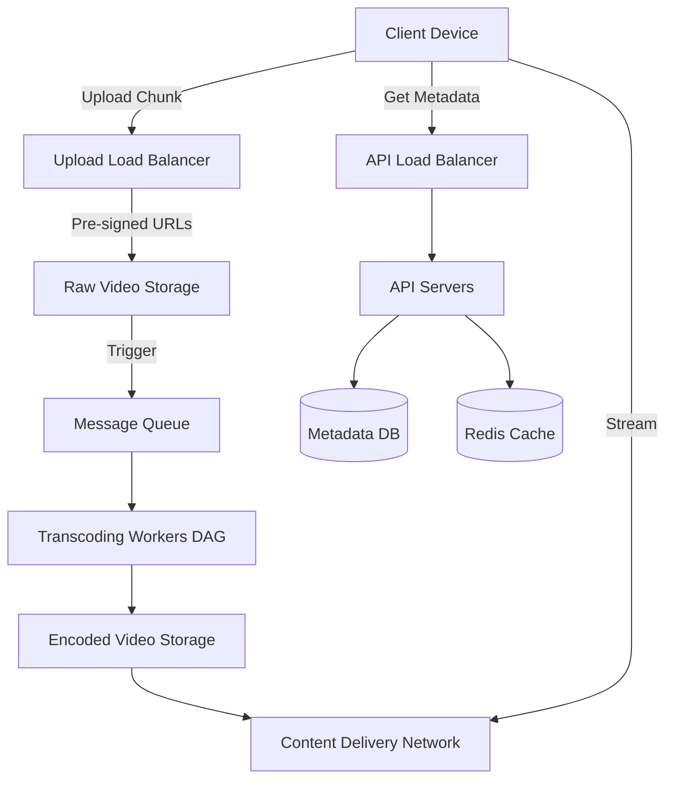
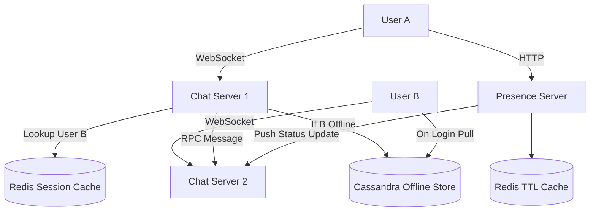
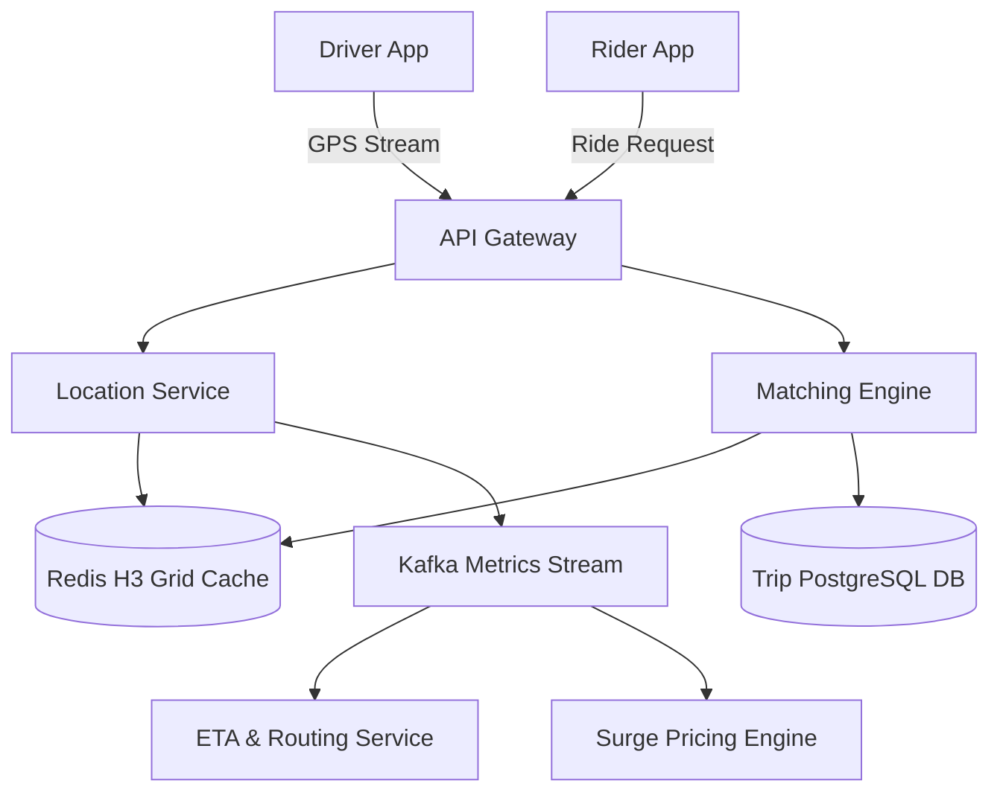
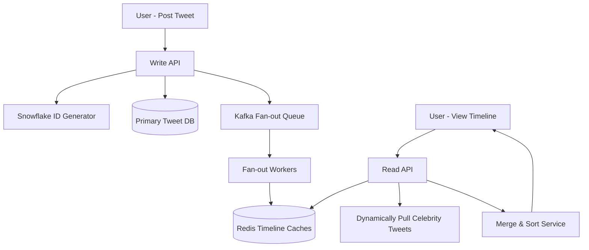
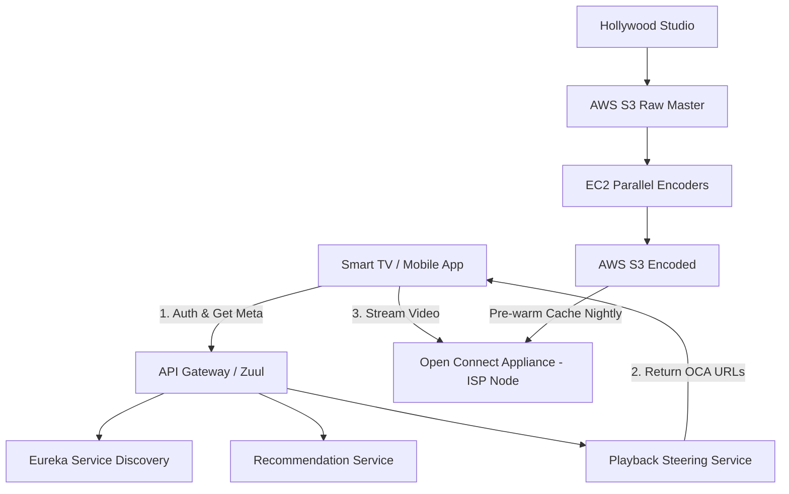
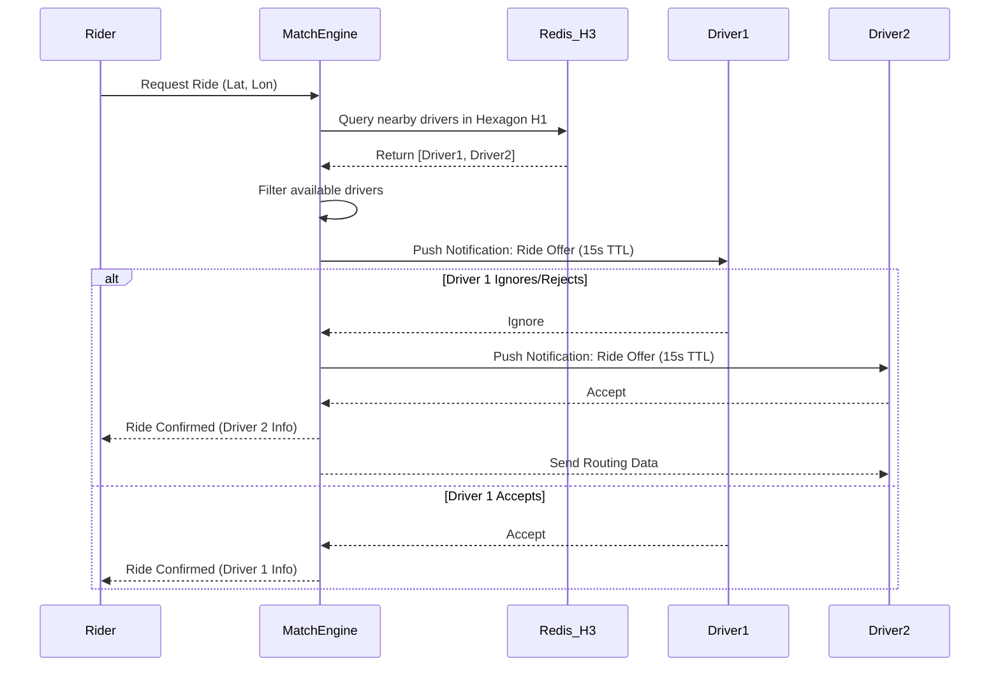
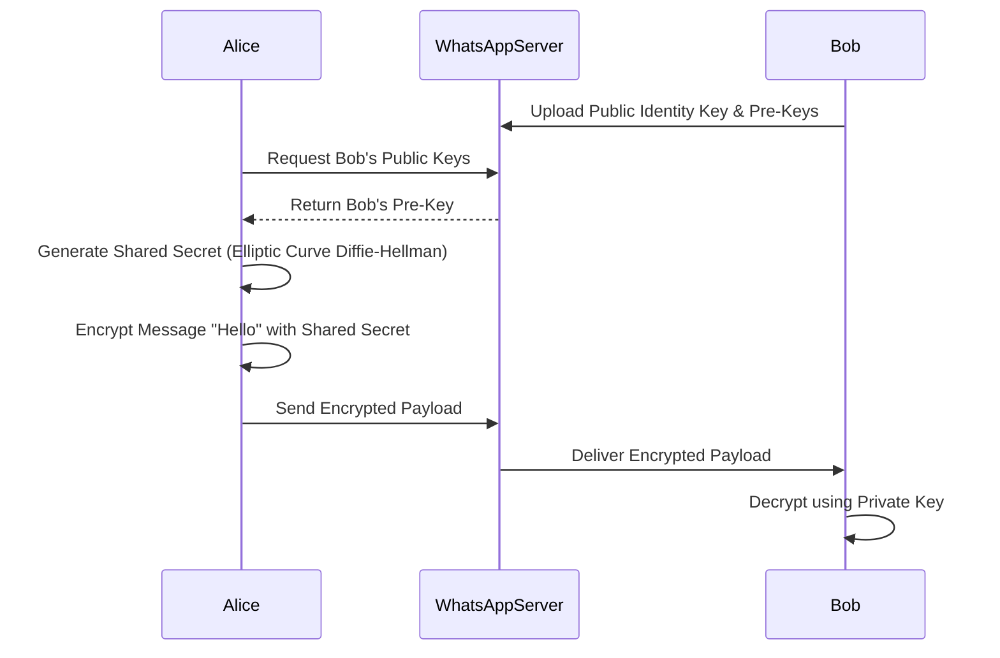

# Chapter 32: Large Scale System Design Case Studies

## 1. Why This Matters

System design is the ultimate test of a software engineer's ability to transition from writing functions to building distributed, fault-tolerant, and scalable systems. Understanding how planetary-scale applications like YouTube, WhatsApp, Uber, Twitter, and Netflix are architected is crucial for several reasons:

1. **Industry Standardization:** The architectural patterns pioneered by these tech giants have become the *de facto* standard for the industry. Concepts like microservices, eventual consistency, fan-out, and geospatial indexing are no longer esoteric academic topics; they are everyday engineering realities.
2. **Interview Preparedness:** In FAANG (Meta, Amazon, Apple, Netflix, Google) and similar tier-1 tech companies, the system design interview is the definitive hurdle for senior engineering candidates. It evaluates your ability to navigate ambiguity, balance tradeoffs, and apply foundational distributed systems theory to real-world problems.
3. **Pattern Recognition:** By studying these specific case studies, you develop a mental repository of architectural patterns. You learn that designing Twitter's timeline has parallels with designing an IoT telemetry dashboard, or that Uber's geospatial matching is analogous to proximity-based recommendations in a dating app.
4. **Failure Anticipation:** These case studies highlight the boundaries of hardware and software. They teach us why caching fails, how database hotspots occur, and why synchronous architectures collapse under load.

In this chapter, we will dissect five of the most iconic distributed systems in modern history. We will build them from the ground up, moving from requirements and estimations to high-level designs, database schemas, and deep dives into their core operational complexities.

---

## 2. Beginner Intuition

Before diving into complex diagrams and CAP theorem tradeoffs, it is helpful to establish a mental model for each system using everyday analogies:

- **YouTube:** Think of a massive, automated library. When an author (creator) drops off a manuscript (video), the library makes copies in various languages and font sizes (resolutions/transcoding). It then places these copies in local branch libraries globally (CDNs) so readers (viewers) can access them instantly without traveling to the central archive.
- **WhatsApp:** Imagine a heavily guarded post office where the postmaster (server) connects senders and receivers. If the receiver is home (online), the letter is handed over immediately, and the post office throws away its tracking slip. If the receiver is away (offline), the post office holds the letter temporarily. The letters themselves are written in a secret code (end-to-end encryption) that even the postmaster cannot read.
- **Uber:** Picture a fast-paced air traffic control tower. The tower tracks the continuous movement of all airplanes (drivers) and incoming landing requests (riders). The tower groups the airspace into hexagonal grids to quickly figure out which planes are closest to which requests, dynamically altering landing fees (surge pricing) based on how crowded a specific grid is.
- **Twitter/X:** Think of a newspaper publisher. When a celebrity writes an article, instead of putting it in a central pile for everyone to dig through, the publisher immediately prints a copy and drops it directly into the mailboxes of every single subscriber (fan-out on write). For megastars with millions of subscribers, printing millions of copies instantly is too expensive, so instead, subscribers must go pick up the megastar's article when they open their mailbox (hybrid fan-out).
- **Netflix:** Imagine a personalized television network. Before you even turn on the TV, the network has already pre-shipped the most popular shows on VHS tapes to your neighbor's house (Open Connect CDN). When you turn on the TV, it automatically switches the broadcast quality seamlessly depending on whether it's raining and the antenna is acting up (adaptive bitrate streaming).

---

## 3. Core Theory

To design these planetary-scale systems, we must rely on a set of foundational distributed systems concepts. These building blocks appear repeatedly across all five case studies:

### 3.1 Content Delivery Networks (CDNs)
A CDN is a geographically distributed network of proxy servers and their data centers. The goal is to provide high availability and performance by distributing the service spatially relative to end-users. In systems like YouTube and Netflix, CDNs are the backbone. They cache heavy binary data (video chunks) at the edge, drastically reducing latency and egress costs from the central data centers.

### 3.2 The Fan-Out Pattern
Fan-out refers to the process of delivering a message to multiple destinations.
- **Fan-out on Write (Push):** When a user creates content, it is proactively pushed to the feeds of all followers. Reads are O(1) and extremely fast, but writes for users with massive followings (celebrities) can overload the system.
- **Fan-out on Read (Pull):** Content is written to a central store. When a user requests their feed, the system dynamically queries the content of everyone they follow and merges it. Writes are fast, but reads are computationally heavy.
- **Hybrid Fan-out:** Combining both. Push for regular users, pull for celebrities.

### 3.3 Geospatial Indexing (Geohash / QuadTree / H3)
Standard SQL queries like `SELECT * FROM drivers WHERE lat BETWEEN x AND y` are painfully slow at scale. Geospatial indexing converts 2D coordinates into 1D strings or hierarchies.
- **Geohash:** Divides the world into a grid and assigns an alphanumeric string. Proximity is determined by shared prefixes.
- **QuadTree:** A tree data structure where each internal node has exactly four children, allowing for dynamic grid sizing based on density.
- **H3 (Uber's Hexagonal Grid):** A hierarchical geospatial indexing system that uses hexagons instead of squares, providing uniform distance to neighboring cell centers, which is mathematically superior for radius queries.

### 3.4 Persistent Connections (WebSockets & Long Polling)
HTTP is stateless and client-initiated. Chat applications (WhatsApp) and real-time tracking (Uber) require bidirectional communication.
- **WebSockets:** Provide full-duplex communication channels over a single TCP connection, maintaining the state between the client and the server.
- **Long Polling:** The client requests information from the server; if the server has no new information, it holds the request open until data is available.

---

## 4. Architecture Deep Dive

### 4.1 Case Study 1: Design YouTube

Designing YouTube is fundamentally about handling massive amounts of unstructured blob data (video) and structuring it efficiently for global, low-latency playback.

#### 4.1.1 Requirements
**Functional Requirements:**
- Users can upload videos (up to 10GB).
- Users can view videos with adaptive bitrate streaming.
- Users can search for videos.
- The system generates thumbnails automatically.
- The system tracks likes, views, and comments.

**Non-Functional Requirements:**
- High availability is prioritized over strong consistency (CAP Theorem: AP system).
- Real-time video processing is not strictly required, but fast processing is expected.
- Low latency streaming without buffering.

#### 4.1.2 Capacity Estimation
- **DAU (Daily Active Users):** 1 Billion
- **Views per user per day:** 5 videos. Total views = 5 Billion/day.
- **Uploads:** Assume 1 in 1000 users uploads a video per day = 1 Million uploads/day.
- **Storage:** Average video size = 500MB. 1M * 500MB = 500 TB/day of raw video. With transcoding (3 formats, multiple resolutions), storage triples to 1.5 PB/day.
- **Bandwidth:** 5 Billion views * 500MB (avg) = 2.5 Exabytes/day.

#### 4.1.3 API Design
```http
POST /v1/videos
Content-Type: multipart/form-data
Body: { "video_file": <binary>, "title": "My Vlog", "description": "..." }
Response: 202 Accepted, { "video_id": "v123abc", "status": "processing" }

GET /v1/videos/{video_id}/stream
Response: 200 OK, Content-Type: application/vnd.apple.mpegurl (HLS Manifest)
```

#### 4.1.4 Video Upload Pipeline
Uploading a 10GB file over HTTP on a mobile connection will fail frequently. We must implement **Resumable Uploads** using multi-part chunking.
1. Client breaks the video into chunks (e.g., 5MB each).
2. Client gets pre-signed URLs from the API server for an S3-like object store.
3. Client uploads chunks in parallel directly to the object store.
4. Once all chunks are uploaded, the client notifies the server to reconstruct the file.

Once the original file is stored, a message is published to a Message Queue (e.g., Kafka or RabbitMQ) to trigger the **Transcoding Pipeline**.
- **DAG (Directed Acyclic Graph) Scheduler:** Video processing is modeled as a DAG. Tasks include: video splitting, audio extraction, transcoding to 1080p, 720p, 360p, and watermark addition.
- **Workers:** Compute clusters pull tasks from the queue. If a worker dies, the task times out and is picked up by another worker.

#### 4.1.5 Video Streaming & CDN
Streaming massive MP4 files directly from a central server is impossible. We use **HLS (HTTP Live Streaming)** or **DASH (Dynamic Adaptive Streaming over HTTP)**.
- The video is segmented into 2-10 second chunks.
- A manifest file (.m3u8) lists the URLs for these chunks at different resolutions.
- The client player dynamically switches between resolutions based on the current network bandwidth.
- **CDN:** All chunks and manifests are cached at edge servers globally. When a user in Tokyo requests a video, they pull chunks from the Tokyo CDN node, not the US-East origin.

#### 4.1.6 Metadata Database Design
We need a DB to store video metadata, user profiles, and comments. A standard Sharded RDBMS (MySQL/PostgreSQL) or a NoSQL Document Store (MongoDB) works.
- `User Table`: UserID (PK), Name, Email, CreatedAt.
- `Video Table`: VideoID (PK), UserID (FK), Title, Description, S3_Path, Status, Likes, Views.
*Scaling Consideration:* Shard the Video database by `UserID` or `VideoID`. Sharding by `VideoID` ensures even distribution, while sharding by `UserID` makes querying a user's channel faster. A hybrid approach is often best.

#### 4.1.7 Search and Recommendations
- **Search:** Video titles and descriptions are asynchronously ingested into an Elasticsearch cluster.
- **Recommendations:** A machine learning pipeline processes user watch history (stored in Cassandra/Bigtable due to massive write volume) and generates a pre-computed list of recommended VideoIDs stored in Redis.

#### 4.1.8 Architecture Diagram


---

### 4.2 Case Study 2: Design WhatsApp

WhatsApp is the quintessential distributed real-time messaging system. The challenge lies in maintaining tens of millions of concurrent connections and ensuring messages are delivered reliably.

#### 4.2.1 Requirements
**Functional Requirements:**
- 1-on-1 messaging in real-time.
- Group messaging.
- Online/Offline status (Presence).
- Message read receipts (Sent, Delivered, Read).
- Media sharing (Images, Videos).

**Non-Functional Requirements:**
- High availability and extremely low latency.
- Strict ordering of messages.
- End-to-End Encryption (E2EE).
- Server should NOT store messages permanently after delivery.

#### 4.2.2 Connection Management (The Chat Servers)
To push messages to clients in real-time, clients maintain long-lived **WebSocket** connections to Chat Servers.
- **Scale:** A standard server can handle 65,535 ports, but with epoll/kqueue, a single robust server (e.g., written in Erlang, Go, or Java with Netty) can hold 1-2 million idle WebSocket connections.
- **WebSocket Manager:** When User A connects, the Load Balancer routes them to Chat Server #4. User A's connection state (UserID -> ServerIP) is stored in a highly available, fast key-value store like **Redis**.

#### 4.2.3 Message Delivery Flow
1. User A sends a message to User B via their active WebSocket connection to Chat Server #4.
2. Chat Server #4 queries the Redis Session Cache to find User B's current server.
3. Redis returns that User B is connected to Chat Server #9.
4. Chat Server #4 forwards the message via an internal RPC call to Chat Server #9.
5. Chat Server #9 pushes the message down User B's WebSocket connection.

**What if User B is Offline?**
If Redis shows User B is not connected, Chat Server #4 routes the message to an **Offline Message Queue/Database** (e.g., Cassandra). When User B comes online, they pull their pending messages from this store, and the messages are immediately deleted from the database.

#### 4.2.4 End-to-End Encryption
The server acts as a dumb router. 
- WhatsApp uses the Signal Protocol.
- Clients exchange public keys via the server.
- User A encrypts the message payload with User B's public key.
- The server sees `{"sender": "A", "receiver": "B", "payload": "0x8A9B..."}`.
- Only User B's private key can decrypt the payload.

#### 4.2.5 Group Messaging
Group messaging utilizes **Fan-out on Write** initiated by the client or the server.
- Given E2EE, if User A sends a message to a group with 50 people, User A's client generates 50 distinct encrypted payloads and sends them to the server.
- The server acts as a multiplexer, routing the 50 messages to the respective users just like 1-on-1 chats.
- For groups over 256 people, client-side fan-out strains mobile bandwidth. The architecture shifts to Server-Side Fan-Out using Sender Keys (a shared group symmetric key that is rotated frequently), drastically reducing client upload overhead.

#### 4.2.6 Presence System (Online Status)
Tracking exact online status for 2 billion users in real-time is an immense bottleneck.
- **Optimization:** We do not broadcast presence to everyone. We only broadcast a user's presence to people who have their chat window open or recently interacted with them.
- A heartbeat is sent from the client every 10 seconds.
- Presence Servers aggregate these heartbeats and update a distributed cache (Redis) with TTLs. If the TTL expires without a heartbeat, the user is marked offline.

#### 4.2.7 Architecture Diagram


### 4.3 Case Study 3: Design Uber

Uber's core challenge is bridging the physical and digital worlds in real-time. It requires highly accurate spatial queries and a robust state machine to track the lifecycle of a trip.

#### 4.3.1 Requirements
**Functional Requirements:**
- Riders can request a ride.
- Drivers can accept requests.
- The system matches riders with the nearest available drivers.
- Riders can see driver ETA and live location.
- The system calculates dynamic (surge) pricing.

**Non-Functional Requirements:**
- High availability.
- Extremely low latency for spatial queries (finding drivers within a radius).
- Consistency for trip state (a driver cannot accept two conflicting rides).

#### 4.3.2 Location Service & Geospatial Indexing
Drivers continuously stream their GPS coordinates (lat, lon) to the server every 4 seconds. We cannot store this in a standard SQL table and run distance queries.
- **H3 (Uber's Hexagonal Grid):** Uber divides the entire earth into a hierarchical grid of hexagons.
- When a driver sends their coordinate, the server determines which Hexagon ID they are in.
- The `Location Service` updates a fast in-memory store (Redis):
  `Key: HexagonID:H123 -> Value: Set(DriverID_1, DriverID_2)`
- When a rider requests a ride from coordinates within Hexagon H123, the `Matching Service` instantly pulls the Set of DriverIDs for H123. If empty, it traverses outward to adjacent hexagons.

#### 4.3.3 Real-Time Tracking & WebSockets
Like WhatsApp, Uber uses WebSockets or Server-Sent Events (SSE) for live tracking.
- The Driver app sends location updates over a persistent connection.
- The Server routes these coordinates to a Kafka topic for analytical processing (ETA recalculation, surge pricing) AND directly pushes the coordinates to the Rider's active WebSocket connection so the car moves smoothly on the rider's map.

#### 4.3.4 Matching Service Flow
The matching process is highly asynchronous and event-driven.
1. Rider requests a ride. The API creates a `Trip` record in a DB (PostgreSQL) with state `SEARCHING`.
2. The request enters a Kafka Queue.
3. The Matching Engine picks the request, queries the Location Service for nearby drivers.
4. It filters out drivers on active trips or those moving away.
5. It sends a push notification/WebSocket event to Driver 1.
6. Driver 1 has 15 seconds to accept. During this time, a Distributed Lock (Redis/ZooKeeper) ensures the trip isn't offered to another driver concurrently.
7. If Driver 1 ignores, the lock is released, and the Matching Engine tries Driver 2.
8. If accepted, the trip state transitions to `EN_ROUTE_TO_PICKUP`.

#### 4.3.5 ETA and Routing
Calculating ETA is not a simple "distance divided by speed" formula. Uber utilizes a massive graph processing engine built on historical routing data.
- **Segment Speeds:** Every street is broken into segments. Uber stores historical traffic speeds for every segment for every hour of the week.
- **Graph Traversal:** Using algorithms like A* or Dijkstra's, the system traverses the routing graph utilizing historical edge weights to provide highly accurate ETAs.

#### 4.3.6 Architecture Diagram


---

### 4.4 Case Study 4: Design Twitter/X

Twitter is the classic example of massive scale asymmetry. Writing a tweet is easy; reading a timeline populated by thousands of accounts you follow, some of which are megastars, is an enormous engineering hurdle.

#### 4.4.1 Requirements
**Functional Requirements:**
- Users can post tweets (text, images, videos).
- Users can follow other users.
- Users view a personalized home timeline.
- Users can search for tweets and hashtags.
- Real-time notification system.

**Non-Functional Requirements:**
- High availability (Eventual Consistency is acceptable).
- Fast timeline generation (under 200ms).
- Ability to handle massive traffic spikes (e.g., during the Super Bowl).

#### 4.4.2 Timeline Generation: The Fan-Out Tradeoff
**Approach 1: Fan-out on Read (Pull)**
- **Write:** When a user tweets, it goes into a massive `Tweets` table.
- **Read:** When User A opens their app, the server queries the `Follows` table to find everyone User A follows, then queries the `Tweets` table for the latest tweets from all those users, sorts them by time, and returns them.
- **Problem:** Doing this dynamically for millions of users opening the app simultaneously will crush the database. Reads are too slow.

**Approach 2: Fan-out on Write (Push) - The Original Twitter Way**
- Every user has a pre-computed "Home Timeline" cached in memory (Redis).
- **Write:** When User A tweets, the server looks up User A's followers. If they have 100 followers, the server injects the Tweet ID into the Redis list of all 100 followers.
- **Read:** When User A opens the app, the server simply fetches their pre-computed Redis list. Reads are O(1) and lightning fast.
- **Problem:** If Cristiano Ronaldo (100 million followers) tweets, the server must push the Tweet ID into 100 million Redis lists. This is called the "Thundering Herd" or "Justin Bieber Problem." It can take minutes to fan out, during which the system is heavily stressed.

**Approach 3: Hybrid Fan-out (The Modern Way)**
- Regular users use Fan-out on Write.
- Celebrities (users with >100k followers) are excluded from the Push process.
- **Read:** When a user opens their timeline, the system fetches their pre-computed Redis list (containing regular users' tweets) AND dynamically pulls tweets from any celebrities they follow. The system merges and sorts the two lists at runtime.

#### 4.4.3 Search and Inverted Index
To support searching hashtags, Twitter uses an **Inverted Index** distributed across an Elasticsearch cluster.
- Every tweet is tokenized.
- A mapping is created: `Word -> List of TweetIDs`.
- Example: `System -> [T1, T5, T9]`, `Design -> [T5, T12]`.
- To search for "System Design", the search engine intersects the sets for `System` and `Design` (yielding T5).
- Because thousands of tweets are created per second, the index must be real-time. Twitter uses bounded memory buffers that flush to disk in small segments rapidly (similar to Lucene's architecture).

#### 4.4.4 Media Storage and Snowflake IDs
- **Snowflake IDs:** Instead of using auto-incrementing DB IDs (which require a single master), Twitter open-sourced Snowflake, an algorithm to generate 64-bit unique IDs across distributed workers. It concatenates a timestamp, worker machine ID, and sequence number, ensuring tweets are sortable by time without a central coordinator.
- **Media:** Images are stored in an Object Store (Amazon S3 / Google Cloud Storage) and served via CDNs.

#### 4.4.5 Architecture Diagram


---

### 4.5 Case Study 5: Design Netflix

While YouTube is User-Generated Content (UGC), Netflix is Premium VOD (Video on Demand). Netflix has far fewer videos but much higher quality requirements and massive peak-hour bandwidth demands. Netflix represents the gold standard of Microservices and Cloud-Native design.

#### 4.5.1 Requirements
**Functional Requirements:**
- Users can browse content and view recommendations.
- Users can stream videos seamlessly.
- System tracks viewing history and bookmarks.
- Multi-profile support per account.

**Non-Functional Requirements:**
- Zero downtime (high availability).
- Near-zero buffering for streaming.
- Ability to withstand AWS region failures.

#### 4.5.2 Control Plane vs. Data Plane
Netflix's architecture is strictly divided into two halves:
1. **Control Plane (AWS):** Handles user login, billing, UI rendering, recommendations, search, and transcoding.
2. **Data Plane (Open Connect):** Handles the actual video streaming. Netflix built its own custom CDN hardware globally distributed inside ISP networks.

#### 4.5.3 Open Connect CDN (Data Plane)
When a user clicks "Play", the stream does NOT come from AWS.
- Netflix physically installs red "Open Connect Appliance" (OCA) servers inside the data centers of local ISPs (Comcast, Verizon, AT&T).
- These servers cache the entire Netflix catalog (or the most popular 90% of it).
- **Playback Flow:**
  1. Client asks the AWS Control Plane for the movie.
  2. The AWS Steering Service determines the client's ISP and location.
  3. The Steering Service returns the IP addresses of the 3 nearest OCA servers inside the client's own ISP.
  4. The client connects directly to the local OCA, ensuring massive throughput and bypassing standard internet backbone congestion.

#### 4.5.4 Transcoding Pipeline
Unlike YouTube, Netflix has the luxury of time to transcode premium content perfectly.
- A single source file for a movie (e.g., a 1TB master copy) is broken into thousands of small chunks.
- Thousands of AWS EC2 spot instances transcode these chunks in parallel.
- Netflix encodes the same scene in dozens of different bitrates and codecs. They even use ML to dynamically alter the bitrate per scene (complex action scenes get more data, static dialogue scenes get less).

#### 4.5.5 Microservices and API Gateways
Netflix operates thousands of microservices (e.g., Subscriber Service, Recommendation Service, Viewing History Service).
- **API Gateway (Zuul):** All client requests hit the gateway first. The gateway handles authentication, rate limiting, and dynamic routing.
- **BFF (Backend for Frontend):** Netflix uses a GraphQL/Federated approach where a specific edge API aggregates data from multiple microservices before sending it back to the client UI (reducing network roundtrips).

#### 4.5.6 Chaos Engineering
To ensure high availability, Netflix invented **Chaos Monkey**.
- A service that intentionally randomly terminates EC2 instances in the production environment during business hours.
- This forces engineers to build resilient, stateless services with proper fallback mechanisms and auto-scaling groups. If a service goes down, the system should gracefully degrade (e.g., showing generic fallback recommendations instead of a blank screen).

#### 4.5.7 Architecture Diagram


## 5. Visual Diagrams: Cross-Cutting Flows

While high-level architectural diagrams are useful, understanding the dynamic state changes and sequential interactions is critical. Here are two advanced flow diagrams detailing the internal mechanics of these systems.

### 5.1 Uber Ride Matching Sequence
This sequence diagram illustrates the complex asynchronous negotiation between the Rider, the Server, and multiple Drivers.


### 5.2 WhatsApp End-to-End Encryption Setup
The Signal Protocol ensures the server never sees plain text. This requires an initial key exchange.


---

## 6. Real Production Examples

System designs in interviews often look cleaner than reality. Production systems evolve over years of painful outages and refactoring.

1. **Twitter's Evolution from Ruby to JVM:** Early Twitter was a monolithic Ruby on Rails application. It famously suffered from the "Fail Whale" during high traffic because Ruby could not handle long-lived connections and heavy concurrent fan-out easily. They rewrote the core routing and message bus in Scala running on the JVM, utilizing Finagle (a highly concurrent RPC framework).
2. **Uber's Migration to H3:** Uber originally used a combination of R-Trees and Geohash. They found that edge-cases in square grids (where diagonal neighbors are further away than horizontal ones) caused inaccuracies in ETAs and surge pricing algorithms. They invented and open-sourced **H3**, a hexagonal hierarchical spatial index, which guarantees that all immediate neighbors are exactly the same distance from the center.
3. **Netflix's Microservices and Fallbacks:** Netflix runs thousands of microservices. If the "Recommendation Service" fails, instead of showing a blank page, the UI gracefully degrades and calls a fallback service that returns a hardcoded list of "Historically Popular Shows." This ensures the core business metric (user viewing time) is protected even during partial outages.

---

## 7. Java Implementations

Understanding the pseudocode behind core components bridges the gap between high-level boxes and actual engineering.

### 7.1 Twitter Snowflake ID Generator (Java)
A simplified, thread-safe implementation of Twitter's 64-bit ID generator to avoid auto-incrementing DB locks.

```java
public class SnowflakeIdGenerator {
    private static final long EPOCH = 1609459200000L; // Jan 1 2021
    private static final long WORKER_ID_BITS = 10L;
    private static final long SEQUENCE_BITS = 12L;

    private static final long MAX_WORKER_ID = ~(-1L << WORKER_ID_BITS);
    private static final long SEQUENCE_MASK = ~(-1L << SEQUENCE_BITS);

    private long workerId;
    private long sequence = 0L;
    private long lastTimestamp = -1L;

    public SnowflakeIdGenerator(long workerId) {
        if (workerId > MAX_WORKER_ID || workerId < 0) {
            throw new IllegalArgumentException("Invalid worker ID");
        }
        this.workerId = workerId;
    }

    public synchronized long nextId() {
        long timestamp = System.currentTimeMillis();

        if (timestamp < lastTimestamp) {
            throw new RuntimeException("Clock moved backwards.");
        }

        if (lastTimestamp == timestamp) {
            sequence = (sequence + 1) & SEQUENCE_MASK;
            if (sequence == 0) {
                timestamp = waitNextMillis(lastTimestamp);
            }
        } else {
            sequence = 0L;
        }

        lastTimestamp = timestamp;

        return ((timestamp - EPOCH) << (WORKER_ID_BITS + SEQUENCE_BITS))
                | (workerId << SEQUENCE_BITS)
                | sequence;
    }

    private long waitNextMillis(long lastTimestamp) {
        long timestamp = System.currentTimeMillis();
        while (timestamp <= lastTimestamp) {
            timestamp = System.currentTimeMillis();
        }
        return timestamp;
    }
}
```

### 7.2 WebSocket Handler for Chat (Spring Boot)
A standard Spring WebSocket configuration for managing chat connections.

```java
import org.springframework.web.socket.handler.TextWebSocketHandler;
import org.springframework.web.socket.*;
import java.util.concurrent.ConcurrentHashMap;

public class ChatWebSocketHandler extends TextWebSocketHandler {
    
    // Simulates the local session state
    private static final ConcurrentHashMap<String, WebSocketSession> sessions = new ConcurrentHashMap<>();

    @Override
    public void afterConnectionEstablished(WebSocketSession session) {
        String userId = getUserIdFromSession(session);
        sessions.put(userId, session);
        // Inform Redis that this UserID is connected to this specific Server IP
        RedisService.updateUserPresence(userId, "Server-10.0.0.5");
    }

    @Override
    protected void handleTextMessage(WebSocketSession session, TextMessage message) throws Exception {
        String payload = message.getPayload();
        // Parse payload -> find targetUserId -> Check Redis for target's Server IP
        // If local, send directly. If on another server, forward via RPC/Kafka.
    }

    @Override
    public void afterConnectionClosed(WebSocketSession session, CloseStatus status) {
        String userId = getUserIdFromSession(session);
        sessions.remove(userId);
        RedisService.removeUserPresence(userId);
    }
    
    private String getUserIdFromSession(WebSocketSession session) {
        return session.getUri().getQuery().split("=")[1]; // simplified extraction
    }
}
```

---

## 8. Performance Analysis

When designing these systems, understanding where the bottlenecks will occur is critical. 

- **Compute Bound:** Video transcoding (YouTube, Netflix) and Graph Routing/ETA calculation (Uber). These services require high CPU and memory limits. Scaling is achieved by horizontally adding worker nodes and chunking data.
- **Memory Bound:** Redis caches used for Twitter timelines and Uber's active driver grids. RAM is expensive. Scaling is achieved by aggressive eviction policies (LRU), TTLs, and data compression.
- **I/O Bound:** WhatsApp message routing and database writes. Fast NVMe SSDs, Connection Pooling, and asynchronous Non-Blocking I/O (Netty/Epoll) are required to prevent thread starvation.
- **Network Bound:** Netflix video streaming. Overcome entirely by moving the data physically closer to the user using Edge CDNs (Open Connect).

### Scalability Metrics Example
A typical chat server can handle roughly `65,000` concurrent connections if constrained by ephemeral ports, but by tuning the Linux kernel (`fs.file-max`, `net.ipv4.ip_local_port_range`), optimizing TCP buffers, and using Go or Erlang, a single 32-core machine can handle `1,000,000+` idle WebSocket connections.

---

## 9. Tradeoffs

No architecture is perfect; every design decision is a tradeoff.

1. **Fan-out on Write vs. Storage Costs:** Twitter pushes tweets to millions of pre-computed timeline lists. This makes the system blisteringly fast for the end-user (latency tradeoff), but it consumes enormous amounts of memory to store duplicated Tweet IDs across millions of lists (storage/cost tradeoff).
2. **Consistency vs. Availability (CAP Theorem):** 
   - *Uber:* Requires high consistency for the trip state. A driver cannot accept a trip that was just canceled by the user, or accepted by another driver. They use distributed locks and ACID compliant databases for trip state.
   - *YouTube:* Requires high availability. It is perfectly fine if User A sees a video view count of `1,040` while User B sees `1,038`. Eventual consistency is heavily utilized.
3. **TCP vs. UDP for Streaming:** YouTube and Netflix use TCP (via HTTP/DASH/HLS) for video streaming because video-on-demand requires lossless delivery. Conversely, live video conferencing apps (Zoom, Discord) use UDP (via WebRTC) because speed is more important than dropping a few frames.

## 10. Failure Scenarios

When operating at the planetary scale, failure is not an anomaly; it is a constant background noise.

### 10.1 The "Thundering Herd" (Retry Storms)
- **Scenario:** The WhatsApp load balancer drops a million connections briefly. All one million clients instantly attempt to reconnect at the exact same millisecond. This sudden spike in authentication requests crashes the Auth Service.
- **Mitigation:** **Exponential Backoff with Jitter**. Clients must wait progressively longer between retries (e.g., 1s, 2s, 4s) and add a random variable (jitter) so that they do not all retry at the exact same moment.

### 10.2 Split-Brain in Stateful Stores
- **Scenario:** The network partition separates a Redis Master from its Slaves. The Slaves elect a new Master. Now there are two Masters. When the network heals, which data is correct?
- **Mitigation:** Quorum-based consensus (Raft/Paxos). A system must require a strict majority (e.g., 3 out of 5 nodes) to acknowledge a write. A partitioned node that cannot reach a quorum will reject writes, preventing split-brain.

### 10.3 Hot Keys / Celebrity Outages
- **Scenario:** A massive global celebrity tweets something highly controversial. Millions of users attempt to reply, like, and retweet the exact same TweetID simultaneously, causing the specific database shard holding that TweetID to melt down (Hot Partition).
- **Mitigation:** Local caching at the application layer, queue-based backpressure (putting likes in a Kafka queue to be processed sequentially rather than synchronous DB locks), and consistent hashing with virtual nodes to distribute the load evenly.

---

## 11. Debugging & Observability

You cannot fix what you cannot see. Observability is the lifeblood of large-scale distributed systems.

### 11.1 Distributed Tracing (OpenTelemetry / Jaeger)
When a user clicks "Book Ride" in Uber, that single HTTP request might touch 40 different microservices. If the request takes 5 seconds, which service is the bottleneck?
- Every incoming request gets a unique `TraceID` at the API Gateway.
- Every internal RPC call passes this `TraceID` in the HTTP/gRPC headers.
- Each service logs its start and end times (Spans) associated with the `TraceID`.
- A centralized tracing UI (like Jaeger) aggregates these logs to visually reconstruct the entire request lifecycle.

### 11.2 The Three Pillars
1. **Metrics (Prometheus/Grafana):** Numerical data aggregated over time. Example: "P99 latency of the Payment Service is 240ms."
2. **Logs (ELK Stack):** Immutable records of discrete events. Example: "User 123 failed authentication."
3. **Traces:** As described above, tracks request flow across service boundaries.

---

## 12. Interview Questions

If you face these systems in a FAANG interview, expect the interviewer to probe deeply into specific edge cases.

**Beginner:**
1. *Question:* Why doesn't YouTube store videos directly in a MySQL database?
   *Answer:* Databases are optimized for structured tabular data, fast indexing, and transactional integrity. BLOBs (Binary Large Objects) inflate the database size, ruin cache efficiency, and slow down backups. Object Storage (S3) is designed for immutable binary files.

**Intermediate:**
2. *Question:* In WhatsApp, how do you handle a user having multiple devices (phone, web, tablet)?
   *Answer:* The server must maintain multiple active WebSocket connections mapped to the same UserID (e.g., `UserID_Device1`, `UserID_Device2`). When a message arrives, the Fan-out mechanism routes the message to all active device queues for that user. E2EE becomes vastly more complex as the sender must encrypt the message multiple times, once for each of the receiver's device public keys.

**Advanced (FAANG-level):**
3. *Question:* For Twitter, how do you handle the "Justin Bieber" problem during timeline fan-out?
   *Answer:* Avoid pushing to millions of followers. Instead, identify "celebrity" accounts (e.g., > 100k followers). Do not fan out their tweets on write. When a regular user fetches their timeline, the system retrieves their pre-computed inbox and actively polls the celebrity cache for new tweets, performing a merge-sort in memory at read time.

---

## 13. Exercises

Put your knowledge to the test by designing extensions to these systems:

1. **YouTube Live:** Extend the YouTube architecture to support Live Streaming. How does the ingestion pipeline change when you cannot wait for an entire video to upload before transcoding it? (Hint: RTMP protocol and on-the-fly chunk transcoding).
2. **Uber Pool:** Modify the Uber matching service to handle Uber Pool (shared rides). How do you alter the H3 grid search and the routing algorithm to calculate detours that don't violate the original rider's maximum SLA?
3. **WhatsApp Status:** Design the architecture for WhatsApp Status (disappearing photos after 24 hours). How do you efficiently clean up millions of expired images from your Object Store daily?

---

## 14. Expert Insights

> *"The biggest mistake engineers make in system design is over-engineering early. They reach for Kafka, Cassandra, and Kubernetes for a system that could be run entirely on a single large PostgreSQL instance. Planetary scale architectures introduce planetary scale operational burdens. Use these patterns only when the math forces you to."* — **Senior Principal Engineer**

> *"In video streaming, the network is always your enemy. It is volatile, unreliable, and completely outside your control. The entire architecture of Netflix and YouTube is built around a single premise: get the data as physically close to the user's home router as possible, and encode it in a way that gracefully survives network drops."* — **Video Infrastructure Architect**

---

## 15. Chapter Summary

- **YouTube** teaches us how to handle massive unstructured blob storage, asynchronous data pipelines (DAGs), and the absolute necessity of CDNs for binary delivery.
- **WhatsApp** demonstrates how to maintain millions of persistent, stateful WebSocket connections, multiplex real-time data streams, and implement bulletproof end-to-end encryption.
- **Uber** showcases the power of geospatial indexing (H3), real-time event-driven architectures, and complex graph-based routing algorithms.
- **Twitter/X** is the masterclass in the Fan-out pattern, illustrating the delicate tradeoffs between Read-heavy vs. Write-heavy architectures and hybrid caching strategies.
- **Netflix** exemplifies the pinnacle of Cloud-Native design, separating the Control Plane from the Data Plane, and enforcing resilience through Chaos Engineering and Microservices.

Understanding these five systems provides the blueprint for solving almost any scale-related engineering challenge in the modern era.
