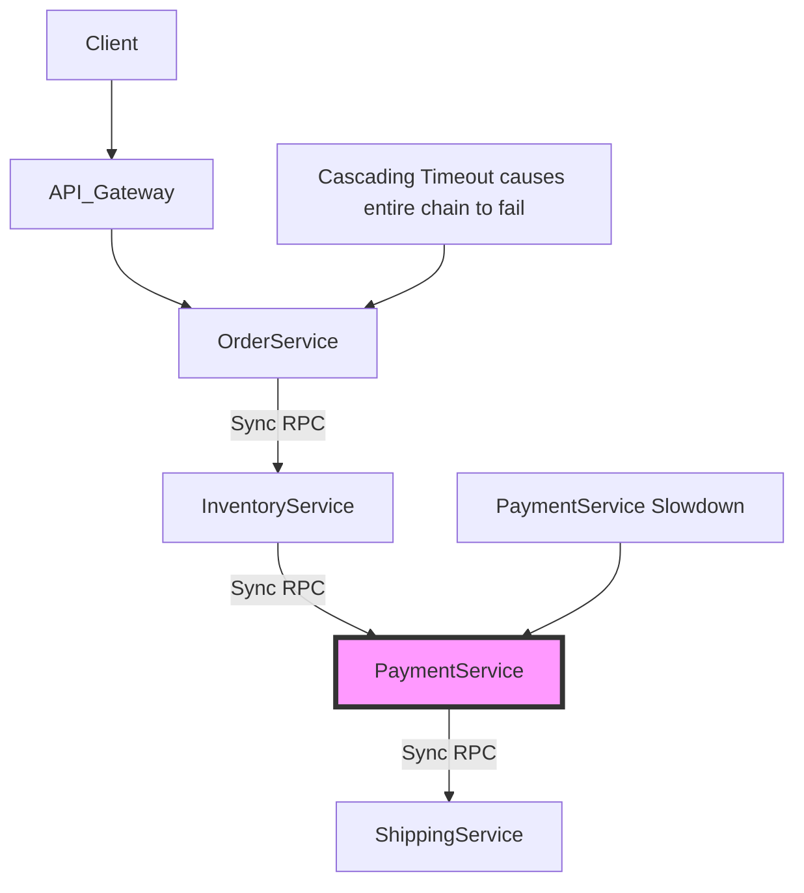
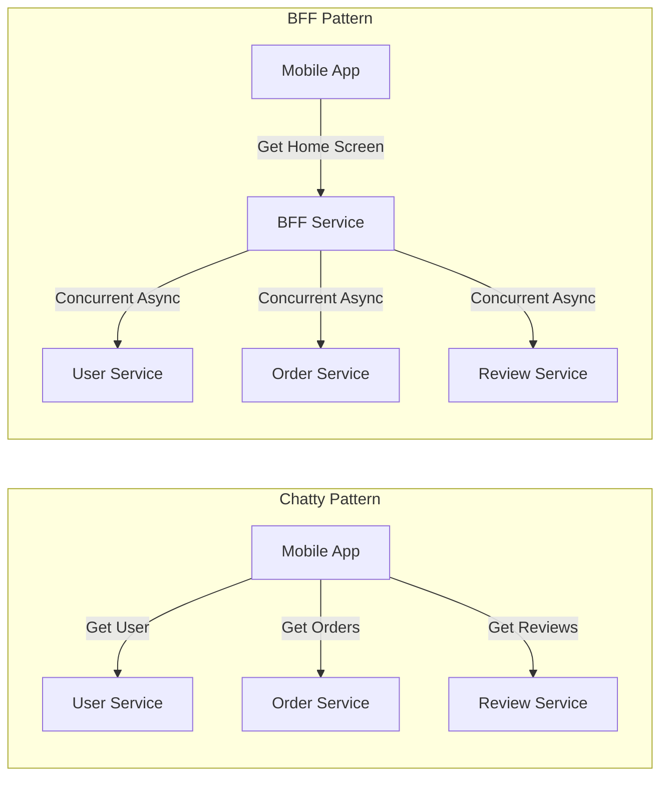
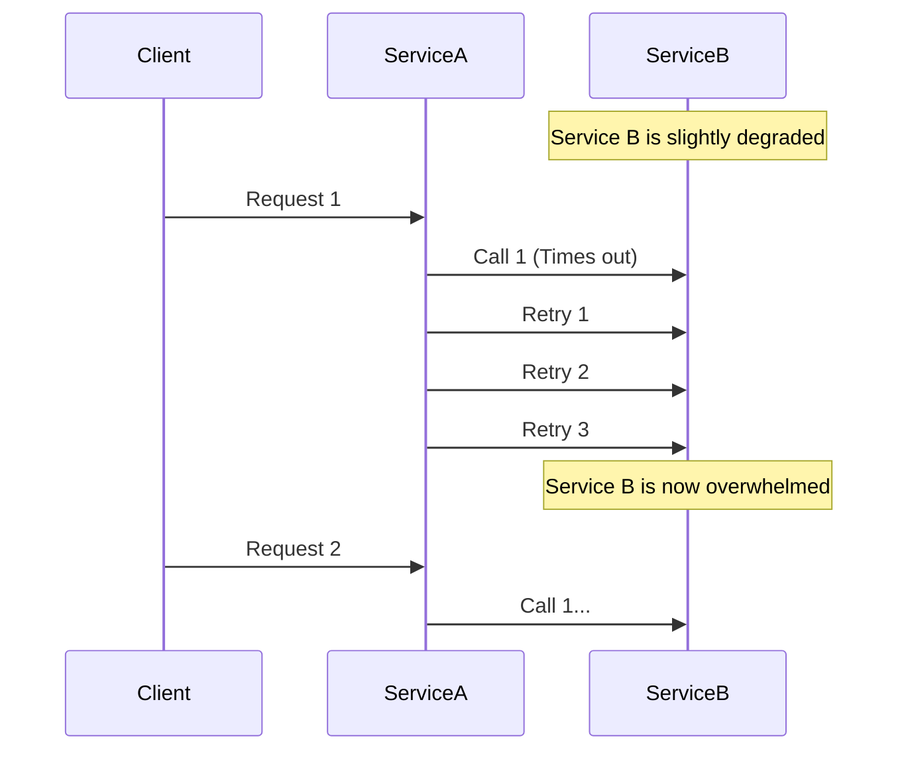

# Chapter 33: Distributed System Anti-Patterns

## 1. Why This Matters

Building distributed systems is inherently complex. It is common for engineers transitioning from monolithic architectures to microservices to carry over practices that worked well in a single process but are disastrous in a distributed environment. Understanding these "anti-patterns" is crucial because they often seem like good ideas at first—or at least harmless conveniences—but eventually lead to severe operational issues, catastrophic failures, and immense technical debt. 

When you design a distributed system, you are trading the simplicity of local method calls and single-node transactions for scalability, fault tolerance, and organizational autonomy. An anti-pattern usually emerges when a design fails to respect this trade-form, inadvertently recreating the monolith's constraints across network boundaries, or ignoring the realities of network communication. Knowing these anti-patterns allows architects to avoid landmines, diagnose systemic issues in legacy architectures, and design resilient, scalable systems that can handle real-world load gracefully.

## 2. Beginner Intuition

Imagine you and your friends decide to cook a massive feast. 
- **The Monolith:** You all cook in one giant kitchen. You share the same fridge, the same stove, and can easily shout to each other. It’s crowded but easy to coordinate.
- **The Microservices:** You all cook in your own separate kitchens across town. 

Now, imagine the anti-patterns:
- **Shared Database:** You all try to use the *same fridge* located in the center of town. Every time you need an egg, you drive across town. (Slow, congested, single point of failure).
- **Chatty Services:** You need a recipe for a cake. You call your friend to ask for the flour amount. You hang up. You call back for sugar. You hang up. You call back for eggs. (Wastes time, clogs the phone lines).
- **Synchronous Chain:** You can't start cooking until Alice chops onions. Alice can't chop onions until Bob buys them. Bob can't buy them until Charlie gives him money. If Charlie is asleep, everyone is stuck waiting. (Cascading failure).
- **Distributed Monolith:** You all have separate kitchens, but you are required to serve your dishes at the exact same millisecond, and you all use the same delivery truck. You have all the overhead of separate kitchens but none of the independence.

An anti-pattern is essentially a fundamentally flawed way of organizing this distributed work that makes the system fragile, slow, or impossible to maintain.

## 3. Core Theory

Distributed system anti-patterns are recurring design flaws that negatively impact system scalability, reliability, and maintainability. Let's formalize the core anti-patterns.

### 3.1 The Shared Database Anti-Pattern
Teams often extract microservices but keep them connected to the same central database to avoid the complexity of data replication and eventual consistency. 
**Problems:** 
- **Coupling:** Schema changes by one service can break others.
- **Scaling Limits:** The database becomes a single bottleneck for CPU, Memory, and I/O.
- **No Autonomy:** Deployments must be coordinated.

### 3.2 Chatty Services and Fan-Out
A chatty service requires multiple network calls to accomplish a single business task. 
- **N+1 Queries:** Fetching a list of items, then making a separate API call for each item's details.
- **Fan-Out Amplification:** A single user request fans out to 100 internal microservices. If any one of them is slow, the entire request is slow.

### 3.3 Tight Coupling
- **Temporal Coupling:** Services must be up at the same time to process a request (synchronous RPC).
- **Implementation Coupling:** Services share code libraries for business logic, tying their release cycles together.
- **Data Coupling:** Services depend on the internal structure of another service's data.

### 3.4 The Distributed Monolith
A system deployed as microservices but heavily intertwined. Services cannot be deployed independently. If one goes down, they all go down. It combines the worst of both worlds: the operational complexity of microservices and the rigid coupling of a monolith.

### 3.5 The God Service
A single service that accumulates too much business logic, often named `CoreService` or `CommonManager`. It handles orchestration, data aggregation, and routing, becoming a bottleneck for development and runtime performance.

### 3.6 Synchronous Call Chains
Service A calls B, which calls C, which calls D. 
- **Latency:** The total latency is the sum of all latencies.
- **Availability:** The total availability is the product of all individual availabilities (e.g., 0.99 * 0.99 * 0.99 = 0.97).

### 3.7 Improper Service Boundaries
- **Nanoservices (Too fine-grained):** Services are so small that every operation requires a distributed transaction.
- **Too Coarse-grained:** Services are too large, leading to God services.

### 3.8 Retry Storms
When a downstream service slows down, an upstream service times out and retries. If many upstream nodes retry simultaneously, they amplify the load on the struggling downstream service, completely destroying it.

### 3.9 Distributed Transactions Everywhere
Relying on 2-Phase Commit (2PC) across microservices. This locks resources across the network, scaling extremely poorly and destroying availability if any participant fails.

### 3.10 Ignoring Network Failures
Assuming the network is reliable, latency is zero, and bandwidth is infinite. This leads to infinite timeouts, missing retries, and missing circuit breakers.

### 3.11 Premature Optimization
Breaking a perfectly good monolith into microservices before there is an organizational or scaling need, simply because "that's what big tech does."

### 3.12 Missing Idempotency
APIs that modify state but cannot safely be retried. If a network timeout occurs, the client retries, and the operation happens twice (e.g., charging a credit card twice).

### 3.13 Unbounded Queues
In-memory or message broker queues without maximum size limits. Under load, these queues consume all available memory, causing OutOfMemory (OOM) crashes instead of shedding load gracefully.

## 4. Architecture Deep Dive

### Fixing the Shared Database
To fix this, we apply the **Database-per-Service** pattern.
1. **Migration Strategy:** Use the Strangler Fig pattern. 
2. Set up logical schemas first, restrict access via users/roles.
3. Use Change Data Capture (CDC) like Debezium to synchronize data during migration.
4. Move to Event Sourcing or Saga patterns for cross-service data consistency.

### Fixing Chatty Services
1. **Batch APIs:** Expose endpoints that accept lists of IDs rather than single IDs.
2. **GraphQL / BFF (Backend For Frontend):** Aggregate data at the edge. The BFF makes the concurrent calls to backend services and returns a single unified payload to the client.

### Fixing Synchronous Chains
Break the chain using **Event-Driven Architecture (Asynchronous)**.
Instead of A -> B -> C:
- A publishes an event `OrderCreated`.
- B listens to `OrderCreated`, does its work, publishes `InventoryReserved`.
- C listens to `InventoryReserved`, etc.
This removes temporal coupling.

### Fixing Retry Storms
Implement **Exponential Backoff with Jitter**. 
Never retry immediately. Wait 1s, 2s, 4s, 8s, and add randomness (jitter) to prevent thundering herds.
Use **Circuit Breakers** (e.g., Resilience4j). If a service is failing, open the circuit and fail fast instead of overwhelming it with retries.

### Domain-Driven Design (DDD) Boundaries
To fix improper boundaries, identify **Bounded Contexts**. A service should own a distinct business capability. Data should not be shared heavily across boundaries; only domain events should cross boundaries.

## 5. Visual Diagrams

### Distributed Monolith & Sync Chains


### Chatty Services vs BFF Pattern


### Retry Storm Cascade


## 6. Real Production Examples

- **Uber's N+1 Query Disaster:** Early in Uber's transition to microservices, their edge layer made individual calls to the user service for every single passenger and driver ID in a batch of trips. A single page load could trigger 1000+ RPC calls. They fixed this by aggressively implementing batching endpoints and GraphQL for edge resolution.
- **Amazon's Eventual Consistency:** Amazon avoids distributed transactions entirely. If a payment fails after an order is placed, they don't roll back a massive 2PC. Instead, they use a Saga-like workflow to email the user and request updated payment details. This sacrifices immediate consistency for extreme availability.
- **Netflix's Circuit Breaking:** Netflix popularized the Circuit Breaker pattern (with Hystrix) because synchronous chains were taking down their streaming service. If the Recommendation service was slow, it would exhaust threads on the edge service, taking down video playback. Circuit breakers isolated the failure, allowing playback to succeed with degraded recommendations.

## 7. Java Implementations

### Anti-Pattern: Chatty N+1 API
```java
// BAD: Chatty API causing N+1 problem
@RestController
public class OrderController {
    
    @Autowired
    private UserServiceFeignClient userClient;
    @Autowired
    private OrderRepository orderRepo;

    @GetMapping("/orders")
    public List<OrderDTO> getOrders() {
        List<Order> orders = orderRepo.findAll();
        List<OrderDTO> dtos = new ArrayList<>();
        
        for (Order order : orders) {
            // N network calls!
            User user = userClient.getUserById(order.getUserId()); 
            dtos.add(new OrderDTO(order, user));
        }
        return dtos;
    }
}
```

### Fix: Batching and Asynchronous Fetching
```java
// GOOD: Batching API call
@RestController
public class OrderControllerFixed {
    
    @Autowired
    private UserServiceFeignClient userClient;
    @Autowired
    private OrderRepository orderRepo;

    @GetMapping("/orders-fixed")
    public List<OrderDTO> getOrders() {
        List<Order> orders = orderRepo.findAll();
        
        // Extract all IDs
        List<Long> userIds = orders.stream()
            .map(Order::getUserId)
            .distinct()
            .collect(Collectors.toList());
            
        // 1 network call!
        Map<Long, User> userMap = userClient.getUsersByIds(userIds).stream()
            .collect(Collectors.toMap(User::getId, u -> u));
            
        return orders.stream()
            .map(o -> new OrderDTO(o, userMap.get(o.getUserId())))
            .collect(Collectors.toList());
    }
}
```

### Fixing Retry Storms with Resilience4j (Circuit Breaker & Jitter)
```java
import io.github.resilience4j.circuitbreaker.annotation.CircuitBreaker;
import io.github.resilience4j.retry.annotation.Retry;

@Service
public class PaymentServiceGateway {

    // Configured via application.yml to use exponential backoff and jitter
    @Retry(name = "paymentRetry", fallbackMethod = "fallbackPayment")
    @CircuitBreaker(name = "paymentCircuit", fallbackMethod = "fallbackPayment")
    public PaymentResponse processPayment(PaymentRequest request) {
        return restTemplate.postForObject("/api/payments", request, PaymentResponse.class);
    }

    public PaymentResponse fallbackPayment(PaymentRequest request, Throwable t) {
        // Fallback logic: e.g., queue for later, or return a graceful failure message
        log.warn("Payment service degraded, using fallback for request {}", request.getId());
        return new PaymentResponse(Status.PENDING_RETRY);
    }
}
```

## 8. Performance Analysis

- **Latency:** Synchronous chains cause latency to scale linearly with the depth of the chain. `P99_Total = sum(P99_Service_i)`. This makes tail latency extremely hard to control.
- **Throughput:** Shared databases bottleneck throughput. A single RDBMS can scale vertically (larger instance), but write throughput is hard-capped by disk I/O and lock contention. 
- **Resource Exhaustion:** Unbounded queues and missing circuit breakers lead to Thread Pool exhaustion and OOM errors. When downstream is slow, upstream holds connections open, exhausting TCP sockets and heap memory.

## 9. Tradeoffs

| Anti-Pattern | Intended Benefit | Actual Cost | Solution Tradeoff |
|--------------|------------------|-------------|-------------------|
| Shared DB | Easy joins, no replication lag, immediate consistency | High coupling, single point of failure, cannot scale independently | Database-per-service requires managing eventual consistency and sagas. |
| Sync Chains | Easy to trace, easy to reason about mentally | Cascading failures, terrible availability | Async events make debugging harder and require robust observability. |
| Distributed Monolith | Fast to build initially using monolithic habits | Deployment friction, brittle architecture | Properly decoupling bounded contexts takes significant upfront design time. |
| Missing Idempotency | Simpler API design, no state tracking needed for duplicate requests | Duplicate transactions (e.g. double billing) during retries | Requires tracking state (e.g. idempotency keys) and storage lookup per request. |

## 10. Failure Scenarios

1. **The Distributed Deadlock (Synchronous Circular Dependencies):** Service A calls B, B calls C, C calls A. All exhaust their thread pools waiting for each other. System requires a complete cold restart.
2. **The Thundering Herd:** A core service (like Auth) restarts. As soon as it comes up, all 50 microservices instantly retry their backlog of failed requests, crashing the Auth service again. Jitter is missing.
3. **Split Brain in Data Coupling:** Service A writes to a shared DB table. Service B reads from it based on an implicit assumption of a column's meaning. Service A changes the meaning of the column (e.g., Status '1' meant 'Active', now means 'Pending'). Service B silently corrupts data because the contract was implicit via the database, not via an API version.

## 11. Debugging & Observability

How to detect these anti-patterns in production:
- **Tracing (Jaeger/Zipkin):** Look for deep, synchronous spans. If a single edge request results in a trace with 30 sequential spans taking 2 seconds, you have a synchronous chain or chatty service.
- **Dependency Graphs:** APM tools (Datadog, New Relic) generate service maps. If your service map looks like a densely connected "death star" where everything points to everything, you have a distributed monolith with tight coupling.
- **Log Analysis:** Look for high rates of `TimeoutException` followed immediately by identical requests (Retry Storms).
- **Metric Dashboards:** Monitor database CPU. If the single shared database is constantly at 90% CPU, you are hitting the shared database anti-pattern limit.

## 12. Interview Questions

- **Beginner:** What is the "Shared Database" anti-pattern and why is it bad in microservices?
  - *Answer:* It prevents independent scaling, ties deployments together, and creates a single point of failure. Services lose encapsulation.
- **Intermediate:** How do you solve a cascading failure caused by a slow downstream service?
  - *Answer:* Implement a Circuit Breaker. If failures/timeouts cross a threshold, the circuit opens, immediately rejecting requests (failing fast) to prevent upstream thread exhaustion and give the downstream service time to recover.
- **Advanced:** Explain the N+1 problem in a microservice architecture and contrast two ways to solve it (Batching vs GraphQL BFF).
  - *Answer:* N+1 occurs when you fetch a list, then loop and fetch details per item over the network. Batching fixes this by accepting a list of IDs. A BFF fixes this by pushing the orchestration to an edge layer which can fire async requests in parallel, reducing overall response time, though it requires maintaining a new edge service.
- **FAANG-Level:** If you must use a synchronous call chain for a legacy business process, how do you manage the SLA and tail latency?
  - *Answer:* Set aggressive timeouts. Use parallel requests where possible. Pre-fetch or cache data. Use hedged requests (sending a duplicate request if the first doesn't return quickly). Set tight retry budgets (e.g. only retry 10% of requests).

## 13. Exercises

1. **System Design:** Design an e-commerce checkout flow. First, draw it using synchronous chains (Anti-pattern). Then, redesign it using an Event-Driven architecture (Sagas).
2. **Code:** Write a Spring Boot application that calls a mock external API. Induce a 5-second delay in the mock API. Write a loop that calls this API. Observe the thread pool exhaustion. Implement `Resilience4j` Circuit Breaker and observe the fail-fast behavior.
3. **Conceptual:** Review an open-source project's architecture diagram. Identify at least two potential points of tight coupling.

## 14. Expert Insights

"Microservices are not a free lunch; they are a highly expensive lunch that you buy when your monolithic kitchen is on fire." 
One of the biggest mistakes senior engineers make is trying to hide network boundaries. Frameworks like gRPC and Feign make remote calls look exactly like local method calls. This abstraction leaks terribly. Developers put network calls inside `for` loops, inside database transactions, and inside retry blocks without thinking about the physical reality of the packets traveling across a data center. Always make network boundaries explicit in your code. 

Another hidden complexity is **Eventual Consistency Fatigue**. Engineers tired of complex async sagas will often quietly slip back into synchronous RPCs or distributed transactions to solve a tricky bug, re-introducing the anti-pattern. Discipline is required to maintain proper boundaries.

## 15. Chapter Summary

- **Anti-patterns** in distributed systems usually stem from applying monolithic design principles to networked components.
- **Shared Databases** destroy autonomy and scale. Use Database-per-service and CDC/Events.
- **Chatty Services** kill performance through latency and network overhead. Use batching or a BFF.
- **Synchronous Chains** destroy availability through cascading failures. Use event-driven architectures.
- **Retry Storms** take down degraded systems. Use exponential backoff, jitter, and circuit breakers.
- **Distributed Monoliths** happen when services are decoupled in infrastructure but tightly coupled in logic.
- Avoid **Premature Optimization**; only distribute when the organizational or scaling needs demand it.
- **Idempotency** is mandatory. Never expose a state-mutating API that cannot be safely retried.
