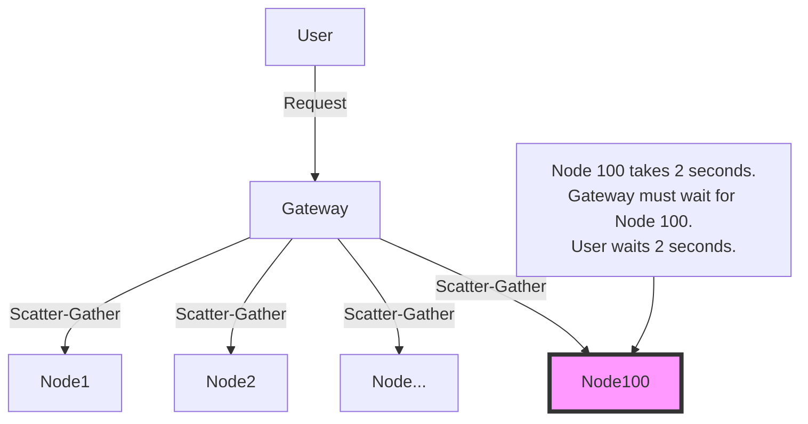
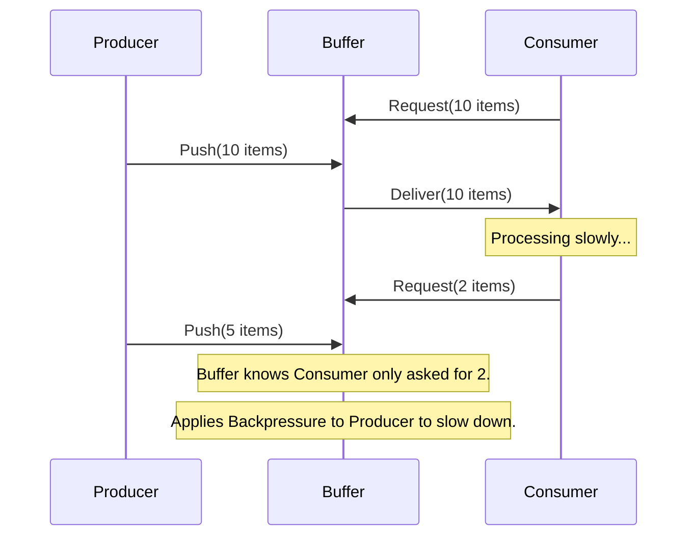
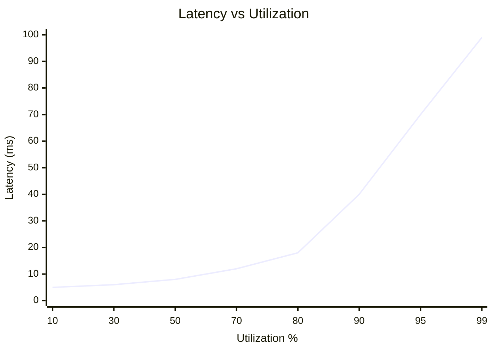

# Chapter 34: Performance Engineering

## 1. Why This Matters

In distributed systems, performance is not just a feature; it is often the core product. Amazon famously found that every 100ms of latency cost them 1% in sales. Google discovered that an extra 500ms in search page generation dropped traffic by 20%. As systems scale, small inefficiencies compound. A slow service deep in the stack can back up queues, exhaust memory, and trigger cascading outages across the entire platform. 

Performance engineering differs from performance testing. Testing is verifying that a system meets a requirement. Engineering is the proactive, continuous architectural discipline of designing for low latency, high throughput, and efficient resource utilization from day one. In the era of cloud computing, where you pay for every CPU cycle and byte of RAM, performance engineering directly translates to massive cost savings and superior user experiences.

## 2. Beginner Intuition

Imagine you are managing a busy coffee shop.
- **Latency (Response Time):** How long a single customer waits from the moment they order to the moment they get their coffee.
- **Throughput:** How many cups of coffee the shop can serve per hour.
- **Tail Latency:** Most customers get coffee in 2 minutes. But one customer's order (a complicated Frappuccino) takes 15 minutes because the blender broke. This unlucky customer experiences the "tail latency."
- **Backpressure:** The line is out the door. The cashier stops taking new orders and yells, "Give us a minute to catch up!" to prevent the baristas from getting overwhelmed and making mistakes.
- **Queueing:** Customers waiting in line. If the line gets too long (unbounded queue), people get angry and leave, or the shop exceeds its legal capacity.

Performance engineering is the science of tuning this coffee shop: adding more espresso machines (horizontal scaling), having a dedicated person just pull shots (pipelining/async), and limiting the line size (bounded queues).

## 3. Core Theory

### 3.1 What is Performance Engineering?
Performance engineering involves mathematical modeling (queueing theory), architectural patterns (backpressure, caching), and low-level tuning (GC, OS internals) to ensure systems meet their SLAs under extreme load.

### 3.2 Tail Latency (P99, P99.9, P99.99)
- **Percentiles:** If your P99 latency is 200ms, it means 99% of requests take 200ms or less, and 1% take longer. 
- **The Amplification Problem:** Jeff Dean (Google) highlighted that in distributed systems, tail latency amplifies. If a user request requires fetching data from 100 backend services, and each service has a 1% chance of being slow (>1 second), the probability that the user experiences a slow request is `1 - (0.99)^100 = 63%`. Your P99 tail latency becomes your median user experience!

### 3.3 Backpressure
Backpressure is a feedback mechanism where a downstream receiver communicates to an upstream sender that it is overwhelmed, asking it to slow down.
- **TCP Backpressure:** Built into the OS via receive windows.
- **Reactive Streams:** Application-level protocols (e.g., Project Reactor, RxJava) where consumers explicitly request `N` items.
- **Strategies:** When overwhelmed, a system can: 
  - **Buffer:** Queue the request (dangerous if unbounded).
  - **Drop:** Shed the load, return HTTP 429 Too Many Requests or 503.
  - **Sample/Degrade:** Return a partial or cached response.

### 3.4 Queue Management and Little's Law
- **Little's Law:** `L = λ * W` (Number of items in system = Arrival rate * Average time in system). 
- **Queue Depth vs Latency:** As a system approaches 100% utilization, queue depth and latency grow exponentially towards infinity. You must never run a system at 100% CPU utilization.
- **Bounded Queues:** Always limit queue size. If the queue is full, instantly reject new requests (fail fast).
- **CoDel (Controlled Delay):** An active queue management algorithm that drops packets if they spend too long in the queue, preventing "bufferbloat."

### 3.5 Hedged and Tied Requests
- **Hedged Requests:** To combat tail latency, send the same request to multiple replicas. Use the first response that comes back and cancel the others. 
- **Tied Requests:** A more efficient version where the request is sent to multiple queues, but once a server pulls it from a queue, it tells the other servers to drop it.

### 3.6 Optimization Vectors
- **Latency Optimization:** Caching, pooling, prefetching, compression.
- **Throughput Optimization:** Async I/O, horizontal scaling, parallel stream processing, pipelining.

## 4. Architecture Deep Dive

### Resolving Tail Latency Amplification
In an architecture heavily reliant on fan-out (e.g., search engines, recommendation systems), you must enforce strict latency bounds. 
1. **Timeouts & Partial Responses:** If the P99 is 100ms, set a hard timeout at 50ms. If 95 out of 100 nodes reply within 50ms, return the results of those 95 nodes and ignore the 5 stragglers. 
2. **Hedged Requests Strategy:** Send the request to Replica A. Wait for the P95 latency time. If A hasn't responded, send the request to Replica B. Whichever replies first wins. This dramatically cuts the P99 tail without doubling total load.

### Implementing Backpressure via Token Buckets
To protect a database, put an API gateway in front of it that enforces rate limits using a Token Bucket algorithm. If requests exceed the bucket's refill rate, the gateway returns HTTP 429. This explicitly pushes backpressure to the client, forcing the client to implement exponential backoff.

### JVM Memory Management & GC Tuning
In Java, Garbage Collection (GC) pauses (Stop-The-World) are a massive source of tail latency.
- **G1GC / ZGC:** Modern collectors designed for ultra-low pause times (sub-millisecond for ZGC).
- **Off-Heap Memory:** Storing large caches using `ByteBuffer.allocateDirect()`. This memory is not managed by the JVM GC, preventing massive GC pauses when sweeping gigabytes of cache data.
- **Memory-Mapped Files:** Using `mmap` to let the OS handle paging disk into memory, bypassing the JVM heap entirely (used heavily by Kafka and Cassandra).

## 5. Visual Diagrams

### Tail Latency Amplification


### Backpressure Flow (Reactive Streams)


### Queue Depth vs Latency Graph


## 6. Real Production Examples

- **Google's Search Tail Latency:** Google uses hedged requests heavily. They observed that by sending a duplicate request if the first one hasn't returned within the 95th percentile expected latency, they reduced their 99.9th percentile latency by orders of magnitude with only a 5% increase in total network traffic.
- **Netflix & RxJava:** Netflix built RxJava to handle the massive fan-out requirements of their API. Reactive streams allowed them to compose asynchronous data flows with built-in backpressure, ensuring that slow backend services wouldn't exhaust memory at the edge API layer.
- **Apache Kafka's High Throughput:** Kafka achieves millions of messages per second by utilizing OS-level features. It uses Memory-Mapped Files (page cache) and the `sendfile` system call (Zero-Copy) to move data directly from disk to the network socket without ever copying it into the JVM heap.

## 7. Java Implementations

### JMH Benchmark Example
Benchmarking in Java is notoriously tricky due to JIT compilation. JMH is the standard tool.
```java
import org.openjdk.jmh.annotations.*;
import java.util.concurrent.TimeUnit;

@BenchmarkMode(Mode.AverageTime)
@OutputTimeUnit(TimeUnit.NANOSECONDS)
@State(Scope.Thread)
@Fork(1)
@Warmup(iterations = 3, time = 1)
@Measurement(iterations = 5, time = 1)
public class StringConcatBenchmark {

    @Param({"10", "100", "1000"})
    private int iterations;

    @Benchmark
    public String usingStringBuilder() {
        StringBuilder sb = new StringBuilder();
        for (int i = 0; i < iterations; i++) {
            sb.append("test");
        }
        return sb.toString();
    }
}
```

### Hedged Request Implementation with CompletableFuture
```java
public class HedgedRequestService {
    private final ExecutorService executor = Executors.newFixedThreadPool(10);
    private final HttpClient client = HttpClient.newHttpClient();

    public String fetchWithHedge(String url) throws Exception {
        CompletableFuture<String> primary = sendRequest(url);
        
        // Schedule hedge request if primary is slow (e.g., P95 latency is 50ms)
        CompletableFuture<String> hedge = new CompletableFuture<>();
        ScheduledExecutorService scheduler = Executors.newScheduledThreadPool(1);
        scheduler.schedule(() -> {
            if (!primary.isDone()) {
                sendRequest(url).whenComplete((res, ex) -> {
                    if (ex == null) hedge.complete(res);
                    else hedge.completeExceptionally(ex);
                });
            }
        }, 50, TimeUnit.MILLISECONDS);

        // Return the first one to complete successfully
        return (String) CompletableFuture.anyOf(primary, hedge).get();
    }

    private CompletableFuture<String> sendRequest(String url) {
        HttpRequest req = HttpRequest.newBuilder().uri(URI.create(url)).build();
        return client.sendAsync(req, HttpResponse.BodyHandlers.ofString())
                     .thenApply(HttpResponse::body);
    }
}
```

### Bounded Queue using ArrayBlockingQueue
```java
// Never use LinkedBlockingQueue without a size limit!
// This explicitly bounds the queue to prevent OOM and provides load shedding.
int queueCapacity = 1000;
BlockingQueue<Runnable> queue = new ArrayBlockingQueue<>(queueCapacity);

// Reject requests immediately if queue is full
RejectedExecutionHandler rejectionHandler = new ThreadPoolExecutor.AbortPolicy();

ThreadPoolExecutor executor = new ThreadPoolExecutor(
    10, // Core pool size
    50, // Max pool size
    60L, TimeUnit.SECONDS,
    queue,
    rejectionHandler // Throws RejectedExecutionException, shedding load
);
```

## 8. Performance Analysis

- **Profiling Tools:** 
  - **CPU Profiling:** Uses stack sampling (e.g., async-profiler) to generate Flame Graphs. Wide blocks on top indicate hot methods burning CPU.
  - **Memory Profiling:** Analyzes heap dumps (Eclipse MAT) to find memory leaks or areas of high object churn causing GC pressure.
- **Load Testing Methodology:**
  - **Stress Testing:** Pushing the system beyond its limits to find the breaking point (e.g., when does it OOM?).
  - **Soak Testing:** Running a system at 80% load for 24-48 hours to find slow memory leaks or connection pool leaks.
  - **Spike Testing:** Instantly hitting the system with 5x load to see how well auto-scaling, circuit breakers, and load shedding react.

## 9. Tradeoffs

| Optimization | Pros | Cons |
|--------------|------|------|
| Hedged Requests | Dramatically lowers P99 tail latency. | Increases system load/network traffic. Requires operations to be strictly read-only/idempotent. |
| Bounded Queues | Prevents OOM crashes; enables graceful degradation. | Requires clients to handle rejections/retries. Drops traffic during spikes. |
| Off-Heap Memory | Bypasses GC pauses for large caches. | Hard to manage; requires manual allocation/deallocation (risk of native memory leaks). |
| Reactive Streams | Extremely efficient thread usage; high throughput. | Steep learning curve; code is harder to debug and stack traces are nearly useless. |

## 10. Failure Scenarios

1. **The Bufferbloat Outage:** A router or a proxy has an extremely large unbounded queue. During a traffic spike, requests enter the queue. They sit in the queue for 30 seconds. The client times out after 10 seconds and retries. The retries enter the queue. The server eventually processes requests that the client has already abandoned. System performs useless work while completely unavailable.
2. **GC Spiral of Death:** A high-throughput Java service caches too many objects. The heap fills up. The JVM spends 95% of its time doing Garbage Collection (Stop-The-World pauses) and 5% doing actual work. Latency skyrockets, health checks time out, and Kubernetes kills the pod, cascading load to other pods, taking down the cluster.

## 11. Debugging & Observability

- **Flame Graphs:** The ultimate tool for CPU performance engineering. It visually represents the call stack profile. Look for wide plateaus which represent methods taking up the most CPU time.
- **Metrics to monitor:** 
  - `http_requests_duration_seconds` (Histogram for percentiles).
  - `jvm_gc_pause_seconds_max` (Crucial for tail latency).
  - `thread_pool_active_threads` and `queue_size`.
- **Latency tracing:** Use OpenTelemetry to track a request across distributed boundaries to find exactly which hop introduces the latency.

## 12. Interview Questions

- **Beginner:** What is the difference between latency and throughput?
  - *Answer:* Latency is the time it takes to process a single request. Throughput is the number of requests processed per unit of time. 
- **Intermediate:** Why is an unbounded queue a dangerous anti-pattern?
  - *Answer:* Under high load, an unbounded queue will consume all available memory until the application crashes (OOM). It also masks backpressure, causing massive latency spikes (bufferbloat). It is better to use a bounded queue and shed load.
- **Advanced:** Explain Jeff Dean's concept of tail latency amplification.
  - *Answer:* In a microservices architecture with a large fan-out (e.g., scatter-gather), a single user request relies on multiple backend nodes. Even if a backend node is only slow 1% of the time, touching 100 nodes means there is a high probability the user request hits at least one slow node, making the P99 latency the median experience.
- **FAANG-Level:** How do you implement backpressure in a distributed system where the producer is a high-volume firehose (e.g., Kafka) and the consumer is a slow database?
  - *Answer:* The consumer should poll Kafka at its own pace (pull-based backpressure). If using a push-model, implement Reactive Streams. Alternatively, employ a token bucket rate limiter on the consumer. If the DB is too slow, we must scale the DB horizontally, or optimize batch writing (batching 1000 messages into a single DB insert) to increase throughput.

## 13. Exercises

1. **System Design:** Design a high-throughput metrics ingestion system capable of handling 1 million events per second. Detail your queuing strategy, storage mechanism, and backpressure handling.
2. **Code:** Write a Java JMH benchmark comparing standard `String` concatenation (using `+`) vs `StringBuilder` inside a loop of 1000 iterations. Analyze the allocation profile.
3. **Conceptual:** Review a GC log snippet showing frequent Full GCs. Diagnose the issue and propose a fix (e.g., tuning heap size, switching to ZGC, or fixing a memory leak).

## 14. Expert Insights

"You cannot tune what you cannot measure." Performance engineering starts with observability. Senior engineers do not guess what is slow; they profile it. 

A hidden complexity often encountered is **Coordinated Omission** in load testing. If your load testing tool (like older versions of JMeter) waits for a response before sending the next request, a slow server will artificially slow down the load generator. The load test will report low throughput but perfectly acceptable latency, completely masking the catastrophic queueing happening on the server. Always use open-model load generators (like wrk2 or Gatling) that maintain a constant arrival rate regardless of the server's response time to see true tail latencies.

Furthermore, beware of the "Cache it!" reflex. Caching is often used as a band-aid for poor underlying database design. A massive Redis cluster used to hide slow SQL queries is an operational nightmare waiting to happen (cache stampedes, eviction logic bugs). Fix the root performance issue first; use caching as a final optimization, not a crutch.

## 15. Chapter Summary

- **Performance Engineering** is proactive architectural design for scale, not just load testing.
- **Tail Latency** matters immensely in distributed systems due to fan-out amplification.
- Use **Hedged Requests** to combat tail latency without drastically increasing load.
- **Backpressure** is vital. Systems must communicate when they are overwhelmed and gracefully reject load.
- Never use **Unbounded Queues**. Enforce limits to prevent OOMs and massive queueing delays.
- Optimize vertically (JVM tuning, GC, Off-heap) and horizontally (scaling, async, parallelization).
- Use proper profiling tools (**JMH, Flame Graphs**) and avoid benchmarking pitfalls like Coordinated Omission.
- Always shed load gracefully rather than trying to process everything and crashing.
