# Chapter 35: Future of Distributed Systems

> *"The best way to predict the future is to invent it."* — Alan Kay

The distributed systems landscape is undergoing a seismic shift. Serverless computing abstracts away infrastructure. Edge computing pushes computation closer to users. WebAssembly challenges the container paradigm. AI workloads demand entirely new infrastructure patterns. Autonomous systems promise self-healing, self-tuning architectures. And emerging hardware like CXL and quantum processors threaten to rewrite our fundamental assumptions about latency, memory, and computation.

This chapter is not speculative futurism—it is a deep technical exploration of systems that are **already being deployed at scale** and the trends that will define the next decade of distributed computing.

---

## 1. Why This Matters

### The Inflection Point

We are at a crossroads in distributed systems engineering. The abstractions we built over the past two decades—containers, microservices, orchestrators—are being both refined and challenged by new paradigms:

| Era | Abstraction | Key Innovation |
|-----|-------------|---------------|
| 2000s | Virtual Machines | Hardware virtualization |
| 2010s | Containers | OS-level isolation |
| 2015s | Orchestration (K8s) | Declarative infrastructure |
| 2020s | Serverless / Edge / WASM | Function-level / location-aware compute |
| 2025+ | AI-native infra / Autonomous | Self-managing, intelligence-first systems |

### Why Engineers Must Care

1. **Career relevance**: Companies are investing billions in serverless, edge, and AI infrastructure. Engineers who understand these paradigms will lead the next generation of systems.

2. **System design interviews**: FAANG interviews increasingly ask about serverless architectures, edge deployments, and AI serving infrastructure. "Design a real-time recommendation system" now involves GPU scheduling, vector databases, and RAG pipelines.

3. **Cost optimization**: Serverless and edge computing can reduce infrastructure costs by 40-70% for the right workloads—but choosing wrong can be catastrophically expensive.

4. **Competitive advantage**: Companies that deploy AI inference at the edge with sub-10ms latency will outcompete those running centralized architectures.

5. **Reliability**: Autonomous self-healing systems reduce human toil and incident response time from hours to seconds.

### Industry Relevance

- **Netflix** runs thousands of serverless functions for encoding, personalization, and data pipelines.
- **Cloudflare** processes 50+ million requests/second at the edge using Workers (a V8-isolate-based serverless platform).
- **Tesla** runs AI inference at the edge in every vehicle, making real-time driving decisions with no cloud round-trip.
- **Google** deploys AI models across millions of edge devices via TensorFlow Lite.
- **Meta** uses vector databases for semantic search across billions of posts.

---

## 2. Beginner Intuition

### Serverless: The Restaurant Analogy

Imagine you want to serve food. Traditional infrastructure is like **owning a restaurant**—you pay rent, hire staff, maintain the kitchen, regardless of whether customers show up. Containers are like **renting a food truck**—cheaper, more flexible, but you still manage it. Serverless is like **cooking on a platform like Uber Eats from your home kitchen**—you only cook when there's an order, you pay nothing when idle, but the platform controls the experience.

### Edge Computing: The Branch Office Analogy

Imagine a global bank. Centralized computing is like having **one headquarters** where every customer must travel for service. Edge computing is like opening **branch offices in every city**—customers get faster service, but keeping all branches synchronized with headquarters is the challenge.

### WebAssembly: The Universal Translator

Think of WASM as a **universal translator** for code. Today, if you write code in Rust, it runs on Rust-compatible systems. If you write JavaScript, it runs in browsers. WASM lets you compile code from *any* language into a format that runs *anywhere*—browser, server, edge, IoT device—at near-native speed. It's like having a universal power adapter that works in every country.

### AI Infrastructure: The Factory Analogy

Training an AI model is like **building a factory**—massive upfront investment, specialized equipment (GPUs), months of construction. Serving (inference) is like **running the factory**—you need to handle varying demand, minimize waste, and deliver products (predictions) quickly.

### Autonomous Systems: The Self-Driving Car

A self-healing infrastructure is like a **self-driving car for your data center**. Instead of a human driver (SRE) watching the road (dashboards) and making corrections (incident response), the system detects problems, diagnoses root causes, and applies fixes—all autonomously.

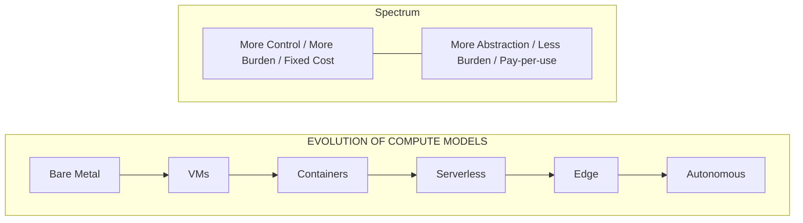
```mermaid
flowchart LR
    subgraph EVOLUTION OF COMPUTE MODELS
        direction LR
        BM[Bare Metal] --> VMs[VMs]
        VMs --> C[Containers]
        C --> S[Serverless]
        S --> E[Edge]
        E --> A[Autonomous]
    end
    
    subgraph Spectrum
        direction LR
        L1["More Control / More Burden / Fixed Cost"] --- R1["More Abstraction / Less Burden / Pay-per-use"]
    end
```

---

## 3. Core Theory

### 3.1 Serverless Computing

#### Function-as-a-Service (FaaS)

Serverless computing is a cloud execution model where:
- The cloud provider **dynamically manages** the allocation and provisioning of servers.
- You deploy **individual functions** rather than applications.
- You are billed based on **actual execution time** (often in milliseconds).
- The provider handles **scaling, availability, and fault tolerance**.

**Key characteristics:**
1. **Event-driven**: Functions are triggered by events (HTTP requests, queue messages, database changes, timers).
2. **Stateless**: Each invocation is independent. State must be externalized to databases, caches, or object stores.
3. **Ephemeral**: Function instances are created and destroyed dynamically. There is no persistent process.
4. **Auto-scaling**: Scales from zero to thousands of concurrent executions automatically.

**Major FaaS Platforms:**

| Platform | Max Timeout | Max Memory | Max Payload | Cold Start (typical) |
|----------|-------------|------------|-------------|---------------------|
| AWS Lambda | 15 min | 10 GB | 6 MB (sync) / 256 KB (async) | 100ms - 10s |
| Google Cloud Functions | 60 min (2nd gen) | 32 GB | 10 MB | 100ms - 5s |
| Azure Functions | Unlimited (Premium) | 14 GB | 100 MB | 50ms - 5s |
| Cloudflare Workers | 30s (free) / 15 min (paid) | 128 MB | 100 MB | <1ms |

#### The Cold Start Problem

The cold start is the Achilles' heel of serverless computing. It occurs when a function is invoked but no warm execution environment exists.

**Cold start breakdown:**

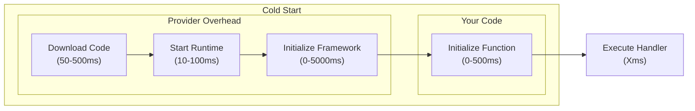
```mermaid
flowchart LR
    subgraph "Cold Start"
        direction LR
        subgraph ProviderOverhead["Provider Overhead"]
            direction LR
            A["Download Code<br/>(50-500ms)"] --> B["Start Runtime<br/>(10-100ms)"]
            B --> C["Initialize Framework<br/>(0-5000ms)"]
        end
        subgraph YourCode["Your Code"]
            direction LR
            D["Initialize Function<br/>(0-500ms)"]
        end
    end
    C --> D
    D --> E["Execute Handler<br/>(Xms)"]
```

**Cold start factors:**
- **Language runtime**: Java/C# have heavier runtimes than Python/Node.js/Go.
- **Package size**: Larger deployment packages = longer download + initialization.
- **VPC attachment**: Functions inside a VPC add ENI (Elastic Network Interface) setup time (historically 5-10s on AWS, now ~1s with Hyperplane).
- **Memory allocation**: More memory = more CPU = faster initialization.
- **Concurrency burst**: First invocations during a traffic spike all experience cold starts.

**Cold start mitigation strategies:**

1. **Provisioned Concurrency** (AWS Lambda): Pre-warm N instances, billed per hour.
2. **Minimum Instances** (Google Cloud Functions): Similar concept.
3. **Keep-alive pings**: Scheduled invocations every 5-15 minutes to prevent scale-to-zero.
4. **Slim deployments**: Minimize dependencies, use layers/shared libraries.
5. **SnapStart** (AWS Lambda for Java): Snapshots initialized state, restoring from snapshot instead of cold-starting.
6. **GraalVM Native Image**: Compile Java to native binaries, reducing startup from seconds to milliseconds.
7. **Language choice**: Use Go, Rust, or Python for latency-sensitive functions.

#### Serverless at Scale: Limitations and Workarounds

**Limitations:**

| Limitation | Impact | Workaround |
|-----------|--------|-----------|
| Execution timeout | Can't run long jobs | Step Functions / Durable Functions |
| Statelessness | No in-memory caching | External cache (Redis/ElastiCache) |
| Cold starts | Latency spikes | Provisioned concurrency |
| Concurrency limits | Throttling under load | Request limit increases, queuing |
| Vendor lock-in | Migration difficulty | Abstraction layers (Serverless Framework) |
| Debugging difficulty | Limited observability | Structured logging, X-Ray, distributed tracing |
| Cost at high throughput | Expensive vs. reserved instances | Hybrid: serverless for spiky, reserved for baseline |

**When Serverless Works:**
- Event-driven processing (S3 uploads, queue consumers)
- APIs with variable traffic (startup MVPs, seasonal workloads)
- Data pipelines and ETL
- Scheduled tasks (cron jobs)
- Webhooks and integrations
- Chat bots and notification handlers

**When Serverless Doesn't Work:**
- Long-running computations (ML training, video processing > 15 min)
- High-throughput, steady-state workloads (cheaper on containers)
- Workloads requiring persistent connections (WebSockets—though some platforms now support this)
- Applications requiring local state or large in-memory caches
- Ultra-low-latency requirements (<5ms P99)

#### Serverless Databases

Serverless databases extend the serverless model to data storage:

- **Amazon Aurora Serverless v2**: Scales compute in 0.5 ACU increments, scales to zero (v1) or near-zero, maintains storage continuously. Good for variable-traffic applications.
- **DynamoDB On-Demand**: Pay-per-request pricing, no capacity planning. Scales instantly to any traffic level. Cost-effective for unpredictable workloads but 5-7x more expensive per request vs. provisioned mode for steady traffic.
- **CockroachDB Serverless**: Distributed SQL database with per-operation billing.
- **PlanetScale**: Serverless MySQL-compatible database with branching.
- **Neon**: Serverless PostgreSQL with compute scaling and branching.

### 3.2 Edge Computing

Edge computing moves computation from centralized data centers to locations closer to the data source or end user.

#### The Edge Spectrum

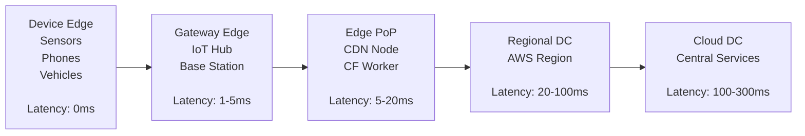
```mermaid
flowchart LR
    A["Device Edge<br/>Sensors<br/>Phones<br/>Vehicles<br/><br/>Latency: 0ms"] --> B["Gateway Edge<br/>IoT Hub<br/>Base Station<br/><br/>Latency: 1-5ms"]
    B --> C["Edge PoP<br/>CDN Node<br/>CF Worker<br/><br/>Latency: 5-20ms"]
    C --> D["Regional DC<br/>AWS Region<br/><br/>Latency: 20-100ms"]
    D --> E["Cloud DC<br/>Central Services<br/><br/>Latency: 100-300ms"]
```

#### CDN Compute

CDN compute platforms run code at the network edge—in Points of Presence (PoPs) distributed globally:

| Platform | Runtime | PoPs | Isolation | Use Case |
|----------|---------|------|-----------|----------|
| Cloudflare Workers | V8 Isolates | 300+ | V8 isolate (sub-ms startup) | API routing, A/B testing, auth |
| AWS Lambda@Edge | Node.js/Python | 400+ (CloudFront) | Container | Request/response transformation |
| AWS CloudFront Functions | JavaScript | 400+ | V8 isolate | Lightweight header manipulation |
| Vercel Edge Functions | V8/Wasm | 30+ (via CF) | V8 isolate | Next.js middleware, API routes |
| Deno Deploy | V8/Wasm | 35+ | V8 isolate | Full-stack apps, APIs |
| Fastly Compute | Wasm | 90+ | Wasm sandbox | High-perf API logic |

#### IoT Edge Processing

IoT edge processing handles data from sensors and devices locally before sending aggregated or filtered results to the cloud:

**Key patterns:**
1. **Filtering**: Discard noise, send only anomalies to cloud.
2. **Aggregation**: Compute averages/min/max locally, send summaries.
3. **Local inference**: Run ML models on-device for real-time decisions.
4. **Store-and-forward**: Buffer data during network outages, sync when connected.

**Platforms:**
- **AWS IoT Greengrass**: Run Lambda functions on IoT devices.
- **Azure IoT Edge**: Deploy containerized workloads to edge devices.
- **Google Cloud IoT**: Now sunset, but Coral (Edge TPU) continues.
- **KubeEdge**: Kubernetes-native edge computing framework.

#### Edge AI/ML Inference

Running ML models at the edge provides:
- **Low latency**: No round-trip to cloud (critical for autonomous vehicles, AR/VR).
- **Privacy**: Data never leaves the device (healthcare, financial).
- **Offline operation**: Works without internet connectivity.
- **Bandwidth savings**: Process locally instead of streaming raw data.

**Edge AI frameworks:**
- **TensorFlow Lite**: Optimized for mobile/embedded.
- **ONNX Runtime**: Cross-platform ML inference.
- **CoreML**: Apple's on-device ML framework.
- **NVIDIA TensorRT**: GPU-optimized inference for edge GPUs (Jetson).

#### Edge Challenges

1. **Consistency**: How do you keep state consistent across 300+ edge locations? Most edge platforms use eventual consistency. Cloudflare's Durable Objects provide strong consistency for specific object scopes.

2. **Deployment**: Rolling out code to 300+ locations atomically is hard. Most platforms use progressive rollouts with canary deployments.

3. **Debugging**: You can't SSH into an edge node. Debugging requires structured logging, distributed tracing, and remote observability.

4. **Resource constraints**: Edge nodes have limited CPU, memory, and storage. Code must be lightweight.

5. **Cold storage**: Keeping large datasets at every edge is impractical. Caching strategies are critical.

### 3.3 WebAssembly (WASM)

WebAssembly is a binary instruction format designed as a portable compilation target for high-level languages.

#### Why WASM for Distributed Systems?

| Property | Description |
|----------|-------------|
| **Portable** | Same binary runs on any architecture (x86, ARM, RISC-V) |
| **Fast** | Near-native execution speed |
| **Secure** | Sandboxed by default, capability-based security |
| **Lightweight** | Module sizes in KBs, startup in microseconds |
| **Polyglot** | Compile from Rust, C/C++, Go, AssemblyScript, Kotlin, etc. |

> *"If WASM+WASI existed in 2008, we wouldn't have needed to create Docker."* — Solomon Hykes, co-founder of Docker

#### WASI (WebAssembly System Interface)

WASI provides a standardized system interface for WASM modules, allowing them to interact with the filesystem, network, clocks, and random number generators in a capability-based, sandboxed manner.

**WASM Runtimes:**
- **Wasmtime** (Bytecode Alliance): Production-quality, used by Fastly.
- **WasmEdge** (CNCF): Optimized for edge and cloud-native.
- **Wasmer**: General-purpose, supports multiple backends.
- **wazero**: Zero-dependency Go runtime for WASM.

#### WASM vs. Containers

| Dimension | Containers (Docker) | WASM |
|-----------|-------------------|------|
| Startup time | 500ms - 5s | 1-10µs |
| Image size | 50MB - 2GB | 100KB - 10MB |
| Isolation | Linux namespaces + cgroups | Sandboxed by design |
| Security | Shared kernel, escape vulnerabilities | Memory-safe, capability-based |
| Portability | Linux-centric (cross-OS via VMs) | Truly portable (any OS/arch) |
| Performance | Native (near-zero overhead) | 0.9-1.0x native |
| Ecosystem | Massive (Docker Hub, K8s) | Growing rapidly |
| Networking | Full TCP/UDP/Unix sockets | Limited (WASI-nn, WASI-http emerging) |
| Filesystem | Full filesystem access | Capability-gated virtual FS |
| GPU access | Full GPU passthrough | Experimental (WASI-nn) |

#### WASM for Microservices

WASM enables a new microservice paradigm:
- **Nano-services**: Functions that start in microseconds, enabling request-per-instance models without cold start penalties.
- **Polyglot by default**: Services in Rust, Go, Python, C#—all compiled to WASM and running in the same runtime.
- **Density**: Run 10-100x more instances per server compared to containers.

**Key projects:**
- **Spin** (Fermyon): Developer-friendly framework for building WASM microservices.
- **wasmCloud**: Actor-model platform for WASM components.
- **Cosmonic**: Managed wasmCloud platform.
- **SpinKube**: Run Spin apps in Kubernetes via containerd's runwasi shim.

### 3.4 AI Infrastructure

#### Large-Scale Training Infrastructure

Training large AI models requires distributing computation across hundreds or thousands of GPUs:

**Training parallelism strategies:**

| Strategy | What's Distributed | When to Use |
|---------|-------------------|-------------|
| **Data Parallelism** | Training data (same model on all GPUs) | Model fits in single GPU memory |
| **Model Parallelism** | Model layers across GPUs | Model too large for single GPU |
| **Pipeline Parallelism** | Model stages (micro-batching) | Large models, want higher utilization |
| **Tensor Parallelism** | Individual tensors across GPUs | Very large layers (attention heads) |
| **Expert Parallelism** | MoE (Mixture of Experts) routing | Sparse models (e.g., Mixtral) |
| **ZeRO** (DeepSpeed) | Optimizer states, gradients, parameters | Memory-efficient data parallelism |
| **FSDP** (PyTorch) | Similar to ZeRO across GPUs | Native PyTorch training |

**Training infrastructure challenges:**
- **Communication overhead**: AllReduce across 1000s of GPUs requires high-bandwidth interconnects (NVLink, InfiniBand, RoCE).
- **Fault tolerance**: With 1000+ GPUs, failures are frequent. Checkpointing + elastic training is essential.
- **GPU scheduling**: Efficiently packing training jobs across heterogeneous GPU clusters (A100, H100, B200).
- **Data pipeline**: Feeding data fast enough to keep GPUs utilized (often need distributed filesystems like Lustre/GPFS).

#### Inference at Scale

Serving AI models in production requires:

1. **GPU Scheduling**: Efficiently sharing expensive GPUs across multiple models and tenants.
   - **Time-slicing**: Multiple models share a GPU via time-multiplexing.
   - **MPS (Multi-Process Service)**: CUDA feature for concurrent kernel execution.
   - **MIG (Multi-Instance GPU)**: Hardware partitioning on A100/H100.

2. **Batching**: Grouping multiple inference requests to maximize GPU utilization.
   - **Static batching**: Wait for N requests or T milliseconds.
   - **Dynamic batching**: Continuously form batches as requests arrive (Triton Inference Server).
   - **Continuous batching**: For LLMs, insert new requests into running batches (vLLM, TensorRT-LLM).

3. **Model Optimization**:
   - **Quantization**: Reduce precision (FP32 → FP16 → INT8 → INT4) for faster inference.
   - **Pruning**: Remove less important weights.
   - **Distillation**: Train a smaller model to mimic a larger one.
   - **Speculative decoding**: Use a small draft model to generate candidate tokens, verified by the large model.

4. **Serving frameworks:**
   - **vLLM**: High-throughput LLM serving with PagedAttention.
   - **TensorRT-LLM**: NVIDIA's optimized LLM inference.
   - **Triton Inference Server**: General-purpose model serving.
   - **TGI** (Text Generation Inference): Hugging Face's serving solution.
   - **Ollama**: Local LLM inference.

#### Vector Databases

Vector databases are purpose-built for storing and querying high-dimensional embeddings:

| Database | Type | Index Types | Scalability | Key Feature |
|----------|------|-------------|-------------|-------------|
| **Pinecone** | Managed SaaS | Proprietary | Fully managed | Simplicity, metadata filtering |
| **Milvus** | Open-source | IVF, HNSW, ANNOY | Distributed, sharded | Production-proven, GPU support |
| **Weaviate** | Open-source | HNSW | Distributed | Multi-modal, GraphQL API |
| **Qdrant** | Open-source | HNSW | Distributed | Rust-based, fast |
| **pgvector** | PostgreSQL extension | IVF, HNSW | Single-node (scale via replicas) | Leverage existing PostgreSQL |
| **ChromaDB** | Open-source | HNSW | Single-node | Simple, Python-native |

**Vector search algorithms:**
- **Brute-force (k-NN)**: Exact, O(n·d) per query. Only for small datasets.
- **IVF (Inverted File Index)**: Clusters vectors, searches nearby clusters. Fast but approximate.
- **HNSW (Hierarchical Navigable Small World)**: Graph-based, excellent recall/speed tradeoff. Most popular.
- **LSH (Locality-Sensitive Hashing)**: Hash-based, fast but lower recall.
- **Product Quantization (PQ)**: Compresses vectors for memory efficiency. Often combined with IVF.

#### RAG (Retrieval-Augmented Generation) Architecture

RAG combines the parametric knowledge of LLMs with non-parametric retrieval from external documents:

**Why RAG?**
- LLMs have knowledge cutoff dates.
- LLMs hallucinate when they lack knowledge.
- Fine-tuning is expensive and inflexible.
- RAG provides up-to-date, verifiable, source-attributed answers.

**RAG Pipeline:**
1. **Ingestion**: Documents → Chunking → Embedding → Vector DB
2. **Retrieval**: Query → Embedding → Vector search → Top-K chunks
3. **Augmentation**: Combine retrieved chunks with query into prompt
4. **Generation**: LLM generates answer grounded in retrieved context

**Advanced RAG techniques:**
- **Hybrid search**: Combine vector similarity with keyword search (BM25).
- **Reranking**: Use a cross-encoder to rerank retrieved chunks.
- **Query expansion**: Generate multiple query variants for better recall.
- **Chunking strategies**: Fixed-size, sentence-based, semantic, recursive.
- **Parent-child retrieval**: Retrieve child chunks, return parent context.
- **HyDE**: Hypothetical Document Embeddings—generate a hypothetical answer, embed it, use for retrieval.

#### AI Agents and Distributed Coordination

AI agents are autonomous LLM-powered systems that can plan, use tools, and coordinate:

**Challenges for distributed agent systems:**
- **Coordination**: Multiple agents working on sub-tasks need to synchronize.
- **State management**: Agent memory must persist across invocations.
- **Tool execution**: Agents invoke external APIs, databases, code execution—requires sandboxing.
- **Reliability**: LLM outputs are non-deterministic. Need retries, fallbacks, and validation.
- **Cost control**: Unbounded agent loops can burn through API credits.

**Frameworks:**
- **LangGraph**: Stateful, graph-based agent orchestration.
- **CrewAI**: Multi-agent collaboration framework.
- **AutoGen**: Microsoft's multi-agent framework.
- **Semantic Kernel**: Microsoft's AI orchestration SDK.

### 3.5 Autonomous Systems

#### Self-Healing Infrastructure

Self-healing systems detect, diagnose, and remediate failures automatically:

**Levels of autonomy:**

| Level | Name | Description | Example |
|-------|------|-------------|---------|
| 0 | Manual | Human detects and fixes | SSH into server, restart process |
| 1 | Reactive | System detects, human fixes | PagerDuty alert → human response |
| 2 | Auto-remediation | System detects and applies known fixes | K8s restarts crashed pods |
| 3 | Predictive | System predicts failures, prevents them | Pre-scale before traffic spike |
| 4 | Adaptive | System learns from past incidents | AI-driven root cause analysis |
| 5 | Fully Autonomous | System evolves its own remediation | Self-modifying infrastructure |

Most organizations are at Level 1-2. Leading companies (Google, Netflix) are at Level 3-4. Level 5 is aspirational.

#### AIOps

AIOps applies AI/ML to IT operations:
- **Anomaly detection**: Identify unusual patterns in metrics, logs, traces.
- **Root cause analysis**: Correlate alerts across services to find the root cause.
- **Predictive alerting**: Alert before a problem becomes user-impacting.
- **Intelligent incident routing**: Route incidents to the right team automatically.
- **Automated remediation**: Execute runbooks automatically when confident in diagnosis.

**AIOps platforms:**
- **Datadog AI**: ML-powered anomaly detection and correlation.
- **PagerDuty AIOps**: Intelligent alert grouping and routing.
- **Dynatrace Davis**: Causal AI for root cause analysis.
- **BigPanda**: Event correlation and automation.

#### Automated Capacity Planning

Traditional capacity planning is manual, error-prone, and either wastes money (over-provisioning) or causes outages (under-provisioning).

**Automated capacity planning:**
1. **Demand forecasting**: Use time-series models (Prophet, ARIMA, neural forecasters) to predict future load.
2. **Resource modeling**: Map demand forecasts to resource requirements (CPU, memory, GPU, storage).
3. **Optimization**: Find the cost-optimal resource allocation that meets SLO targets.
4. **Execution**: Automatically adjust capacity (autoscaling policies, reserved instance purchases).

#### Autonomous Database Tuning

Databases have hundreds of tunable parameters (buffer pool size, checkpoint frequency, query parallelism, etc.). Manual tuning is infeasible at scale.

**Autonomous tuning systems:**
- **Oracle Autonomous Database**: Fully self-tuning, self-securing.
- **OtterTune** (research → startup): ML-based PostgreSQL/MySQL tuning.
- **Amazon RDS Performance Insights**: AI-driven query analysis.
- **CockroachDB**: Automatic index recommendations.

**Techniques:**
- **Bayesian optimization**: Efficiently explore the parameter space.
- **Reinforcement learning**: Learn optimal configurations through trial and error.
- **Workload classification**: Identify workload type (OLTP, OLAP, mixed) and apply known-good configurations.

### 3.6 Emerging Trends

#### Disaggregated Storage and Compute

Traditional architecture couples compute (CPU/GPU) with storage (local disks) on the same node. Disaggregation separates them:

**Benefits:**
- **Independent scaling**: Scale compute and storage separately.
- **Better utilization**: No stranded storage or stranded compute.
- **Elasticity**: Add/remove compute nodes without data movement.
- **Cost**: Use different hardware tiers for compute and storage.

**Examples:**
- **Snowflake**: Fully disaggregated (compute clusters read from S3-like shared storage).
- **AWS Aurora**: Disaggregated storage (log-structured, distributed across 3 AZs).
- **BigQuery**: Serverless, disaggregated compute and Colossus storage.
- **Databricks**: Spark compute separate from Delta Lake storage on object stores.

#### CXL (Compute Express Link) and Memory Pooling

CXL is an open standard for high-speed CPU-to-device and CPU-to-memory interconnect:

**Types:**
- **CXL.io**: PCIe-compatible I/O protocol.
- **CXL.cache**: Allows devices to cache host memory with coherency.
- **CXL.mem**: Allows hosts to access device-attached memory.

**Impact on distributed systems:**
- **Memory pooling**: Multiple servers share a pool of memory, reducing stranded memory.
- **Near-memory compute**: Process data where it lives, reducing data movement.
- **Larger working sets**: Applications can access terabytes of memory without distributed caching.
- **Reduced network traffic**: Shared memory replaces RPCs for co-located services.

**CXL could fundamentally change how we think about distributed state**—instead of serializing data over the network, services could directly access shared memory with cache coherency.

#### Confidential Computing

Confidential computing protects data **in use** (not just at rest and in transit) using hardware-based Trusted Execution Environments (TEEs):

- **Intel SGX/TDX**: Hardware enclaves for secure computation.
- **AMD SEV-SNP**: Encrypted VM memory with integrity protection.
- **ARM CCA**: Confidential Compute Architecture for ARM.

**Distributed systems implications:**
- **Multi-party computation**: Multiple organizations can jointly analyze data without revealing their inputs.
- **Secure enclaves in the cloud**: Run sensitive workloads on untrusted cloud infrastructure.
- **Confidential AI**: Train models on sensitive data without exposing it to the cloud provider.

#### Sustainable Computing

Data centers consume ~1-2% of global electricity. With AI training demanding ever more compute, sustainability is critical:

**Strategies:**
- **Carbon-aware scheduling**: Run workloads when/where the grid is greenest.
- **Right-sizing**: Eliminate wasted resources through better capacity planning.
- **Serverless**: Scale to zero when idle.
- **Efficient hardware**: ARM-based processors (Graviton, Ampere) offer better perf/watt.
- **Liquid cooling**: More efficient than air cooling for high-density GPU clusters.

#### Quantum Computing Implications

Quantum computing is not yet practical for most distributed systems problems, but it has implications:

- **Cryptography**: Shor's algorithm breaks RSA and ECC. Post-quantum cryptography (lattice-based, hash-based) is being standardized (NIST PQC standards).
- **Optimization**: Quantum annealing may solve resource scheduling and routing problems faster.
- **Simulation**: Quantum simulation could model complex distributed system behaviors.
- **Timeline**: Practically relevant quantum computers are likely 10-20+ years away for most distributed systems problems, but migration to post-quantum cryptography should happen now.

---

## 4. Architecture Deep Dive

### 4.1 Serverless Architecture Internals

#### AWS Lambda Execution Model

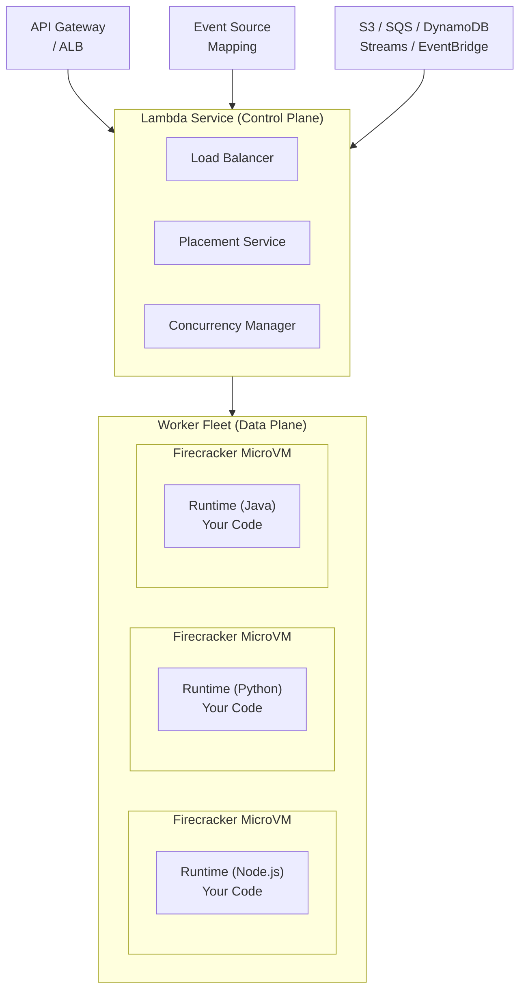
```mermaid
flowchart TB
    API["API Gateway<br/>/ ALB"] --> CP
    ESM["Event Source<br/>Mapping"] --> CP
    S3["S3 / SQS / DynamoDB<br/>Streams / EventBridge"] --> CP

    subgraph CP["Lambda Service (Control Plane)"]
        direction LR
        LB["Load Balancer"]
        PS["Placement Service"]
        CM["Concurrency Manager"]
    end

    CP --> DP

    subgraph DP["Worker Fleet (Data Plane)"]
        direction LR
        subgraph FC1["Firecracker MicroVM"]
            R1["Runtime (Node.js)<br/>Your Code"]
        end
        subgraph FC2["Firecracker MicroVM"]
            R2["Runtime (Python)<br/>Your Code"]
        end
        subgraph FC3["Firecracker MicroVM"]
            R3["Runtime (Java)<br/>Your Code"]
        end
    end
```

**Key components:**
1. **Firecracker MicroVM**: Lightweight VM (boots in ~125ms) providing strong isolation. Each function execution environment runs in its own MicroVM.
2. **Placement Service**: Decides which worker host to place a new execution environment on (bin-packing optimization).
3. **Concurrency Manager**: Enforces concurrency limits, manages reserved/provisioned concurrency.
4. **Warm pool**: Keeps recently-used execution environments alive for reuse (the "warm start" path).

#### Lambda Invocation Flow

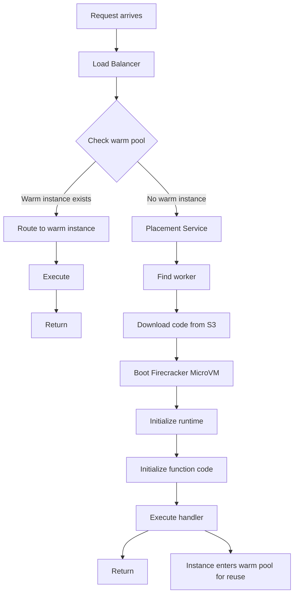
```mermaid
flowchart TD
    A[Request arrives] --> B[Load Balancer]
    B --> C{Check warm pool}
    
    C -->|Warm instance exists| D[Route to warm instance]
    D --> E[Execute]
    E --> F[Return]
    
    C -->|No warm instance| G[Placement Service]
    G --> H[Find worker]
    H --> I[Download code from S3]
    I --> J[Boot Firecracker MicroVM]
    J --> K[Initialize runtime]
    K --> L[Initialize function code]
    L --> M[Execute handler]
    M --> N[Return]
    M --> O[Instance enters warm pool for reuse]
```

### 4.2 Edge Computing Topology

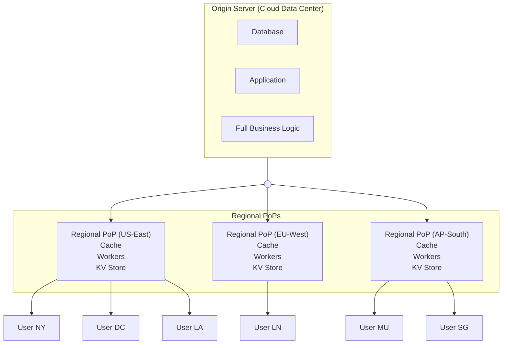
```mermaid
flowchart TB
    subgraph Origin["Origin Server (Cloud Data Center)"]
        D["Database"]
        A["Application"]
        L["Full Business Logic"]
    end

    Origin ---| | Link1(( ))

    subgraph PoPs["Regional PoPs"]
        direction LR
        PoP1["Regional PoP (US-East)<br/>Cache<br/>Workers<br/>KV Store"]
        PoP2["Regional PoP (EU-West)<br/>Cache<br/>Workers<br/>KV Store"]
        PoP3["Regional PoP (AP-South)<br/>Cache<br/>Workers<br/>KV Store"]
    end

    Link1 --> PoP1
    Link1 --> PoP2
    Link1 --> PoP3

    PoP1 --> U1["User NY"]
    PoP1 --> U2["User DC"]
    PoP1 --> U3["User LA"]

    PoP2 --> U4["User LN"]

    PoP3 --> U5["User MU"]
    PoP3 --> U6["User SG"]
```

### 4.3 WASM vs Container Architecture

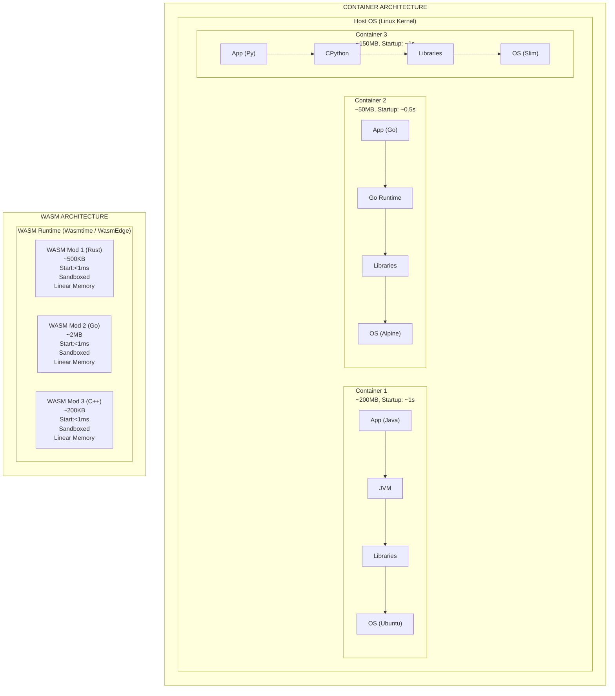
```mermaid
flowchart TB
    subgraph ContainerArch["CONTAINER ARCHITECTURE"]
        direction TB
        subgraph HostOS["Host OS (Linux Kernel)"]
            direction LR
            subgraph C1["Container 1<br/>~200MB, Startup: ~1s"]
                A1["App (Java)"] --> J1["JVM"] --> L1["Libraries"] --> O1["OS (Ubuntu)"]
            end
            subgraph C2["Container 2<br/>~50MB, Startup: ~0.5s"]
                A2["App (Go)"] --> G2["Go Runtime"] --> L2["Libraries"] --> O2["OS (Alpine)"]
            end
            subgraph C3["Container 3<br/>~150MB, Startup: ~1s"]
                A3["App (Py)"] --> P3["CPython"] --> L3["Libraries"] --> O3["OS (Slim)"]
            end
        end
    end

    subgraph WasmArch["WASM ARCHITECTURE"]
        direction TB
        subgraph WasmRuntime["WASM Runtime (Wasmtime / WasmEdge)"]
            direction LR
            W1["WASM Mod 1 (Rust)<br/>~500KB<br/>Start:<1ms<br/>Sandboxed<br/>Linear Memory"]
            W2["WASM Mod 2 (Go)<br/>~2MB<br/>Start:<1ms<br/>Sandboxed<br/>Linear Memory"]
            W3["WASM Mod 3 (C++)<br/>~200KB<br/>Start:<1ms<br/>Sandboxed<br/>Linear Memory"]
        end
    end
```

### 4.4 AI Inference Serving Architecture

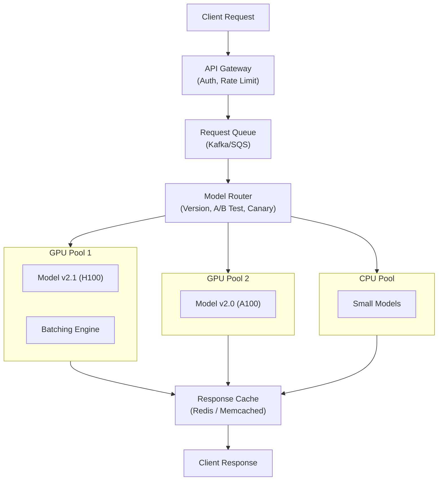
```mermaid
flowchart TB
    CR["Client Request"] --> AG["API Gateway<br/>(Auth, Rate Limit)"]
    AG --> RQ["Request Queue<br/>(Kafka/SQS)"]
    RQ --> MR["Model Router<br/>(Version, A/B Test, Canary)"]

    MR --> GP1
    MR --> GP2
    MR --> CP1

    subgraph GP1["GPU Pool 1"]
        M1["Model v2.1 (H100)"]
        BE1["Batching Engine"]
    end

    subgraph GP2["GPU Pool 2"]
        M2["Model v2.0 (A100)"]
    end

    subgraph CP1["CPU Pool"]
        SM["Small Models"]
    end

    GP1 --> RC
    GP2 --> RC
    CP1 --> RC

    RC["Response Cache<br/>(Redis / Memcached)"] --> CResp["Client Response"]
```

### 4.5 RAG Architecture Deep Dive

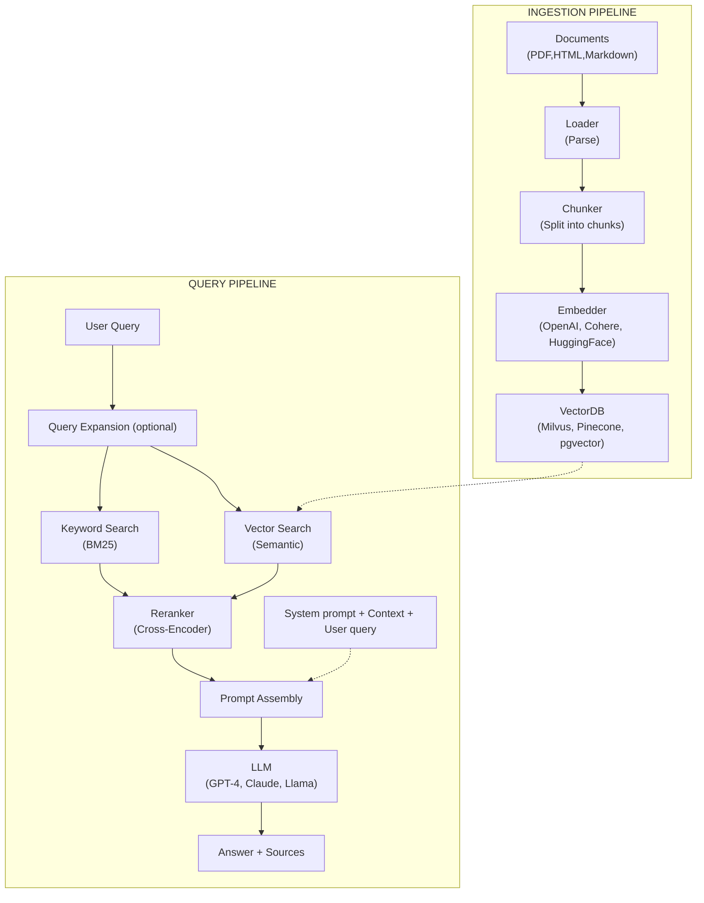
```mermaid
flowchart TB
    subgraph Ingestion["INGESTION PIPELINE"]
        direction LR
        Docs["Documents<br/>(PDF,HTML,Markdown)"] --> Loader["Loader<br/>(Parse)"]
        Loader --> Chunker["Chunker<br/>(Split into chunks)"]
        Chunker --> Embedder["Embedder<br/>(OpenAI, Cohere, HuggingFace)"]
        Embedder --> VectorDB["VectorDB<br/>(Milvus, Pinecone, pgvector)"]
    end

    subgraph Query["QUERY PIPELINE"]
        direction TB
        UQ["User Query"] --> QEx["Query Expansion (optional)"]
        QEx --> VS["Vector Search<br/>(Semantic)"]
        QEx --> KS["Keyword Search<br/>(BM25)"]
        VS --> Rerank["Reranker<br/>(Cross-Encoder)"]
        KS --> Rerank
        Rerank --> PA["Prompt Assembly"]
        SysCtx["System prompt + Context + User query"] -.-> PA
        PA --> LLM["LLM<br/>(GPT-4, Claude, Llama)"]
        LLM --> Ans["Answer + Sources"]
    end
    
    VectorDB -.-> VS
```

---

## 5. Visual Diagrams

### 5.1 Serverless Architecture Flow

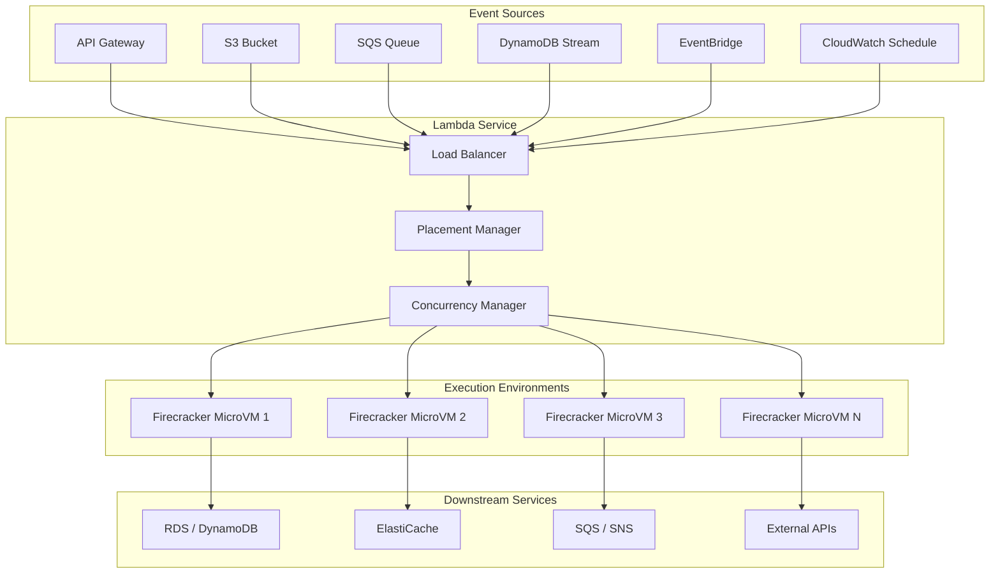
```mermaid
flowchart TB
    subgraph EventSources["Event Sources"]
        API["API Gateway"]
        S3["S3 Bucket"]
        SQS["SQS Queue"]
        DDB["DynamoDB Stream"]
        EB["EventBridge"]
        CRON["CloudWatch Schedule"]
    end

    subgraph LambdaService["Lambda Service"]
        LB["Load Balancer"]
        PM["Placement Manager"]
        CM["Concurrency Manager"]
    end

    subgraph ExecutionEnv["Execution Environments"]
        FV1["Firecracker MicroVM 1"]
        FV2["Firecracker MicroVM 2"]
        FV3["Firecracker MicroVM 3"]
        FVN["Firecracker MicroVM N"]
    end

    subgraph Downstream["Downstream Services"]
        DB["RDS / DynamoDB"]
        Cache["ElastiCache"]
        Q["SQS / SNS"]
        ExtAPI["External APIs"]
    end

    API --> LB
    S3 --> LB
    SQS --> LB
    DDB --> LB
    EB --> LB
    CRON --> LB
    LB --> PM
    PM --> CM
    CM --> FV1
    CM --> FV2
    CM --> FV3
    CM --> FVN
    FV1 --> DB
    FV2 --> Cache
    FV3 --> Q
    FVN --> ExtAPI
```

### 5.2 Edge Computing Topology

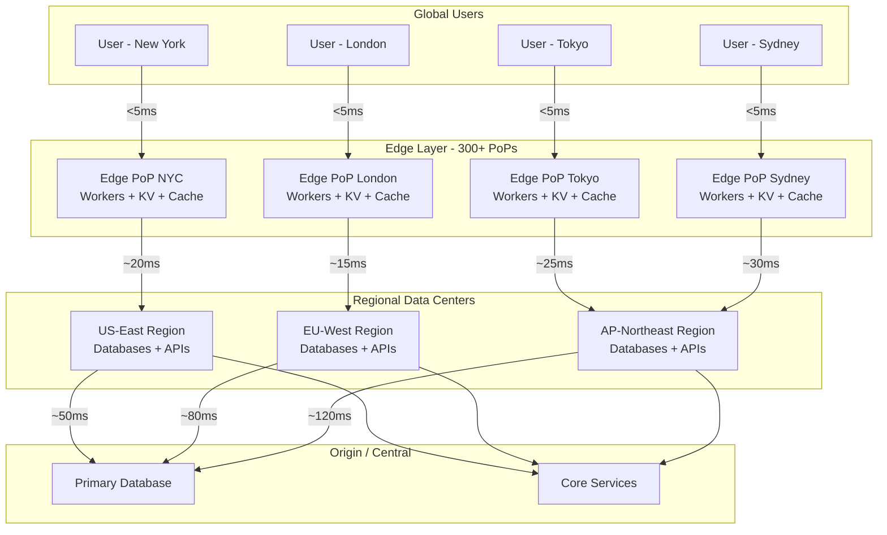
```mermaid
flowchart TB
    subgraph Users["Global Users"]
        U1["User - New York"]
        U2["User - London"]
        U3["User - Tokyo"]
        U4["User - Sydney"]
    end

    subgraph EdgeLayer["Edge Layer - 300+ PoPs"]
        E1["Edge PoP NYC<br/>Workers + KV + Cache"]
        E2["Edge PoP London<br/>Workers + KV + Cache"]
        E3["Edge PoP Tokyo<br/>Workers + KV + Cache"]
        E4["Edge PoP Sydney<br/>Workers + KV + Cache"]
    end

    subgraph RegionalDC["Regional Data Centers"]
        R1["US-East Region<br/>Databases + APIs"]
        R2["EU-West Region<br/>Databases + APIs"]
        R3["AP-Northeast Region<br/>Databases + APIs"]
    end

    subgraph Origin["Origin / Central"]
        O1["Primary Database"]
        O2["Core Services"]
    end

    U1 -->|"<5ms"| E1
    U2 -->|"<5ms"| E2
    U3 -->|"<5ms"| E3
    U4 -->|"<5ms"| E4

    E1 -->|"~20ms"| R1
    E2 -->|"~15ms"| R2
    E3 -->|"~25ms"| R3
    E4 -->|"~30ms"| R3

    R1 -->|"~50ms"| O1
    R2 -->|"~80ms"| O1
    R3 -->|"~120ms"| O1
    R1 --> O2
    R2 --> O2
    R3 --> O2
```

### 5.3 WASM vs Container Comparison

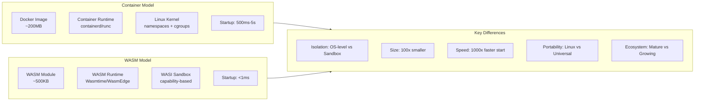
```mermaid
graph LR
    subgraph Container["Container Model"]
        C1["Docker Image<br/>~200MB"]
        C2["Container Runtime<br/>containerd/runc"]
        C3["Linux Kernel<br/>namespaces + cgroups"]
        C4["Startup: 500ms-5s"]
    end

    subgraph WASM["WASM Model"]
        W1["WASM Module<br/>~500KB"]
        W2["WASM Runtime<br/>Wasmtime/WasmEdge"]
        W3["WASI Sandbox<br/>capability-based"]
        W4["Startup: <1ms"]
    end

    subgraph Comparison["Key Differences"]
        D1["Isolation: OS-level vs Sandbox"]
        D2["Size: 100x smaller"]
        D3["Speed: 1000x faster start"]
        D4["Portability: Linux vs Universal"]
        D5["Ecosystem: Mature vs Growing"]
    end

    Container --> Comparison
    WASM --> Comparison
```

### 5.4 AI Inference Serving Pipeline

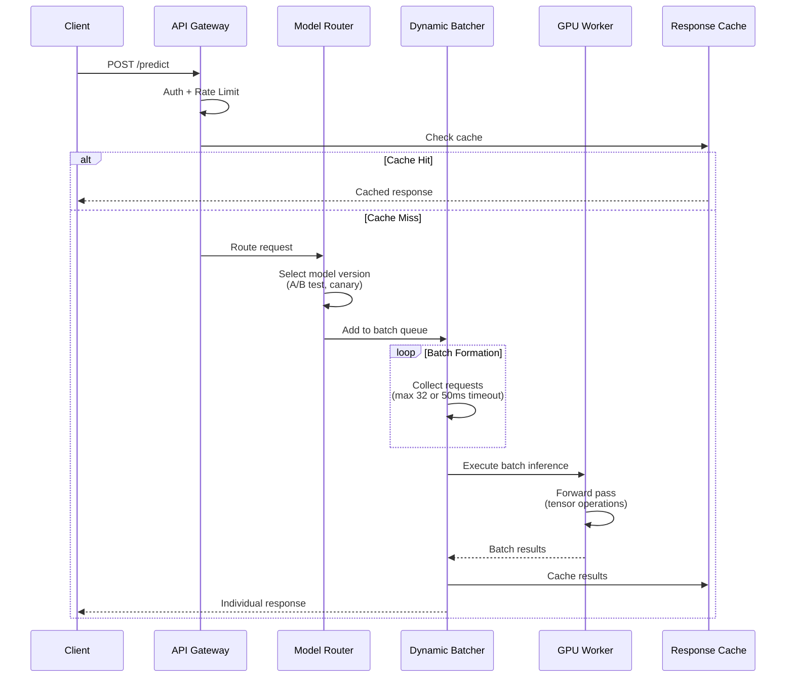
```mermaid
sequenceDiagram
    participant Client
    participant Gateway as API Gateway
    participant Router as Model Router
    participant Batcher as Dynamic Batcher
    participant GPU as GPU Worker
    participant Cache as Response Cache

    Client->>Gateway: POST /predict
    Gateway->>Gateway: Auth + Rate Limit
    Gateway->>Cache: Check cache
    
    alt Cache Hit
        Cache-->>Client: Cached response
    else Cache Miss
        Gateway->>Router: Route request
        Router->>Router: Select model version<br/>(A/B test, canary)
        Router->>Batcher: Add to batch queue
        
        loop Batch Formation
            Batcher->>Batcher: Collect requests<br/>(max 32 or 50ms timeout)
        end
        
        Batcher->>GPU: Execute batch inference
        GPU->>GPU: Forward pass<br/>(tensor operations)
        GPU-->>Batcher: Batch results
        Batcher->>Cache: Cache results
        Batcher-->>Client: Individual response
    end
```

### 5.5 RAG Architecture

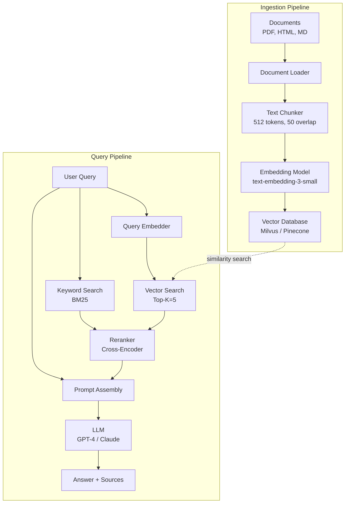
```mermaid
flowchart TB
    subgraph Ingestion["Ingestion Pipeline"]
        D["Documents<br/>PDF, HTML, MD"]
        L["Document Loader"]
        C["Text Chunker<br/>512 tokens, 50 overlap"]
        E["Embedding Model<br/>text-embedding-3-small"]
        V["Vector Database<br/>Milvus / Pinecone"]
        D --> L --> C --> E --> V
    end

    subgraph Query["Query Pipeline"]
        Q["User Query"]
        QE["Query Embedder"]
        VS["Vector Search<br/>Top-K=5"]
        KS["Keyword Search<br/>BM25"]
        RR["Reranker<br/>Cross-Encoder"]
        PA["Prompt Assembly"]
        LLM["LLM<br/>GPT-4 / Claude"]
        A["Answer + Sources"]

        Q --> QE --> VS
        Q --> KS
        VS --> RR
        KS --> RR
        RR --> PA
        Q --> PA
        PA --> LLM --> A
    end

    V -.->|"similarity search"| VS
```

### 5.6 Self-Healing Infrastructure Loop

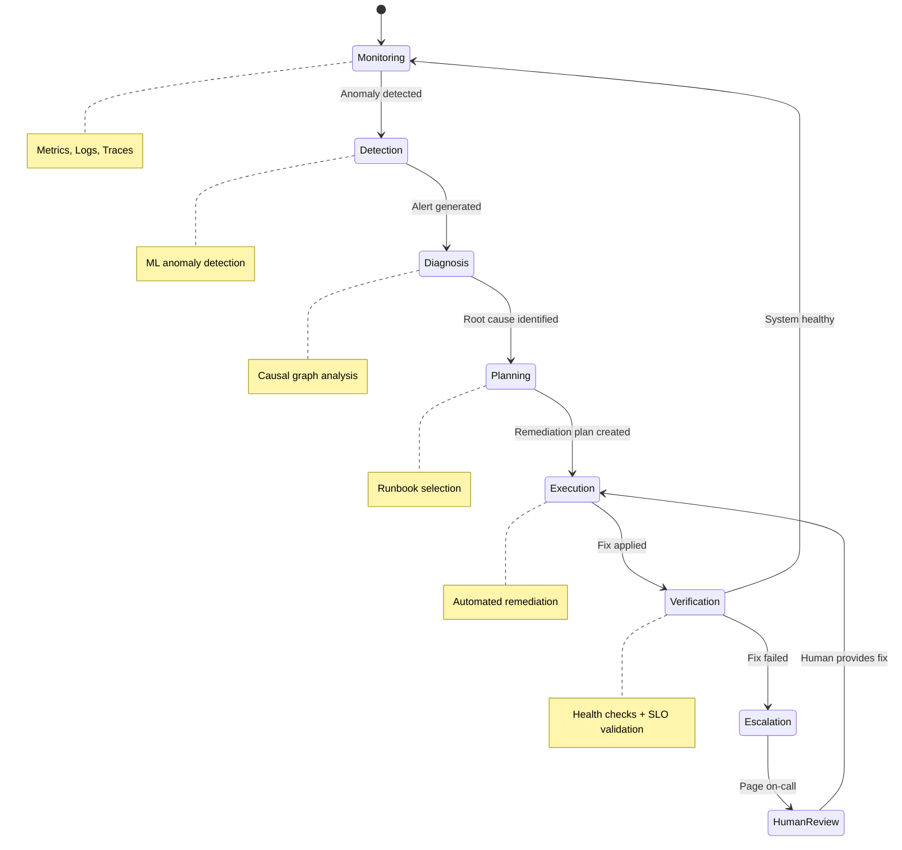
```mermaid
stateDiagram-v2
    [*] --> Monitoring
    Monitoring --> Detection: Anomaly detected
    Detection --> Diagnosis: Alert generated
    Diagnosis --> Planning: Root cause identified
    Planning --> Execution: Remediation plan created
    Execution --> Verification: Fix applied
    Verification --> Monitoring: System healthy
    Verification --> Escalation: Fix failed
    Escalation --> HumanReview: Page on-call
    HumanReview --> Execution: Human provides fix
    
    note right of Monitoring: Metrics, Logs, Traces
    note right of Detection: ML anomaly detection
    note right of Diagnosis: Causal graph analysis
    note right of Planning: Runbook selection
    note right of Execution: Automated remediation
    note right of Verification: Health checks + SLO validation
```

---

## 6. Real Production Examples

### 6.1 Netflix: Serverless at Scale

**Problem**: Netflix needs to process millions of encoding jobs, personalization computations, and data pipeline tasks daily.

**Solution**: Netflix uses serverless computing extensively:
- **Cosmos**: A serverless media computing platform built on top of AWS Lambda and Step Functions. Processes video encoding workflows as DAGs of serverless functions.
- **Mantis**: Real-time stream processing using serverless-inspired architecture.
- **Data pipeline**: ETL jobs triggered by events (new content upload → transcode → quality check → publish).

**Key insight**: Netflix uses serverless for **batch and event-driven** workloads but keeps **latency-critical services** (streaming API, personalization serving) on containers/EC2 for predictable performance.

**Architecture pattern:**
```
Content Upload → S3 Event → Lambda (validation) 
    → Step Functions → Lambda (transcode chunk 1) 
                     → Lambda (transcode chunk 2)
                     → Lambda (transcode chunk N)
    → Lambda (stitch results) → Lambda (quality check) → DynamoDB (metadata)
```

### 6.2 Cloudflare Workers: Edge Computing in Production

**Problem**: Cloudflare serves 50+ million requests/second across 300+ cities. Running full containers at every PoP is impractical.

**Solution**: Cloudflare Workers use **V8 isolates** instead of containers:
- Each Worker runs in a V8 isolate (the JavaScript engine from Chrome).
- Isolates start in **<1ms** (vs. seconds for containers).
- Thousands of isolates run on each edge server.
- Workers have access to edge-native storage: KV (eventually consistent), Durable Objects (strongly consistent), R2 (object storage), D1 (SQLite at edge).

**Real use cases:**
- **Bot detection**: Run bot detection logic at the edge before requests reach origin.
- **A/B testing**: Route users to different variants at the edge.
- **API gateway**: Authentication, rate limiting, request transformation at the edge.
- **Full applications**: Companies like Discord run bot interaction handling entirely on Workers.

**Key insight**: Cloudflare proved that V8 isolates provide sufficient security isolation for multi-tenant code execution. The **startup overhead is effectively zero**, making serverless at the edge viable.

### 6.3 Tesla: Edge AI in Production

**Problem**: Autonomous driving requires real-time AI inference with no cloud dependency.

**Solution**: Each Tesla vehicle runs a custom AI chip (FSD Computer) with:
- **Neural network inference**: Processes 8 camera feeds simultaneously.
- **Latency budget**: <100ms from camera frame to driving decision.
- **No cloud dependency**: All inference runs locally. Cloud is used for training and model updates.
- **Model updates**: OTA (Over-The-Air) updates push new model versions to vehicles.

**Architecture**:
- Edge inference hardware (FSD chip: 144 TOPS)
- Multiple neural networks running concurrently (lane detection, object detection, path planning)
- Fallback to simpler models if primary inference fails
- Shadow mode: New models run alongside production models without controlling the vehicle (A/B testing in production)

### 6.4 Uber: Vector Search for Driver Matching

**Problem**: Uber needs to match riders with optimal drivers in real-time, considering location, ETA, driver preferences, and vehicle type.

**Solution**: Uber uses vector embeddings and approximate nearest neighbor search:
- Drivers and riders are embedded into a multi-dimensional space encoding location, preferences, and context.
- Vector search finds the top-K nearest drivers for each ride request.
- A ranking model selects the optimal match.
- Results are returned in <100ms P99.

### 6.5 Meta: RAG for Internal Knowledge

**Problem**: Meta's engineering teams generate massive internal documentation, design docs, and code. Finding relevant information across millions of documents is a needle-in-haystack problem.

**Solution**: Meta built an internal RAG system:
- **Ingestion**: Millions of internal documents chunked, embedded, and indexed.
- **Retrieval**: Hybrid search (dense retrieval + sparse BM25) with learned reranking.
- **Generation**: Internal LLM generates answers grounded in retrieved documents.
- **Evaluation**: Continuous evaluation of retrieval quality (NDCG, MRR) and generation quality (faithfulness, relevance).

### 6.6 Google: Autonomous Database Operations with Borg

**Problem**: Google manages millions of database instances (Spanner, Bigtable, Cloud SQL). Manual tuning is impossible.

**Solution**:
- **Autopilot** (Borg): ML-based resource recommendation for all Borg jobs, including databases.
- **Automatic sharding**: Spanner automatically splits and merges tablet ranges based on load.
- **Query optimization**: ML-based query optimization in F1 and Spanner.
- **Capacity planning**: Predictive models for hardware procurement 6-18 months in advance.

---

## 7. Java Implementations

### 7.1 AWS Lambda Handler (Java)

```java
package com.distributed.serverless;

import com.amazonaws.services.lambda.runtime.Context;
import com.amazonaws.services.lambda.runtime.RequestHandler;
import com.amazonaws.services.lambda.runtime.events.APIGatewayProxyRequestEvent;
import com.amazonaws.services.lambda.runtime.events.APIGatewayProxyResponseEvent;
import com.fasterxml.jackson.databind.ObjectMapper;
import software.amazon.awssdk.services.dynamodb.DynamoDbClient;
import software.amazon.awssdk.services.dynamodb.model.*;

import java.time.Instant;
import java.util.HashMap;
import java.util.Map;

/**
 * Production-grade AWS Lambda handler for a serverless API.
 * 
 * Design decisions:
 * - DynamoDB client initialized outside handler (reused across warm invocations)
 * - ObjectMapper is reused (expensive to create)
 * - Structured logging for CloudWatch Insights queries
 * - Error handling returns proper HTTP status codes
 * - Cold start tracking via static initialization flag
 */
public class OrderApiHandler implements 
        RequestHandler<APIGatewayProxyRequestEvent, APIGatewayProxyResponseEvent> {

    // Initialized once per execution environment (cold start)
    // Reused across warm invocations — critical for performance
    private static final DynamoDbClient dynamoDb = DynamoDbClient.builder().build();
    private static final ObjectMapper objectMapper = new ObjectMapper();
    private static final String TABLE_NAME = System.getenv("ORDERS_TABLE");
    private static final boolean IS_COLD_START;
    
    static {
        IS_COLD_START = true;
        System.out.println("{\"level\":\"INFO\",\"message\":\"Cold start initialization\","
                + "\"timestamp\":\"" + Instant.now() + "\"}");
    }
    
    private boolean firstInvocation = true;

    @Override
    public APIGatewayProxyResponseEvent handleRequest(
            APIGatewayProxyRequestEvent event, Context context) {
        
        long startTime = System.nanoTime();
        String requestId = context.getAwsRequestId();
        String httpMethod = event.getHttpMethod();
        String path = event.getPath();
        
        // Structured logging
        logInfo(requestId, "Request received", Map.of(
                "method", httpMethod,
                "path", path,
                "coldStart", String.valueOf(firstInvocation && IS_COLD_START)
        ));
        
        if (firstInvocation) {
            firstInvocation = false;
        }
        
        try {
            APIGatewayProxyResponseEvent response = switch (httpMethod) {
                case "GET" -> handleGetOrder(event, requestId);
                case "POST" -> handleCreateOrder(event, requestId);
                case "PUT" -> handleUpdateOrder(event, requestId);
                case "DELETE" -> handleDeleteOrder(event, requestId);
                default -> buildResponse(405, Map.of("error", "Method not allowed"));
            };
            
            long durationMs = (System.nanoTime() - startTime) / 1_000_000;
            logInfo(requestId, "Request completed", Map.of(
                    "statusCode", String.valueOf(response.getStatusCode()),
                    "durationMs", String.valueOf(durationMs)
            ));
            
            return response;
            
        } catch (Exception e) {
            logError(requestId, "Unhandled exception", e);
            return buildResponse(500, Map.of(
                    "error", "Internal server error",
                    "requestId", requestId
            ));
        }
    }
    
    private APIGatewayProxyResponseEvent handleGetOrder(
            APIGatewayProxyRequestEvent event, String requestId) {
        
        String orderId = event.getPathParameters().get("orderId");
        if (orderId == null || orderId.isBlank()) {
            return buildResponse(400, Map.of("error", "orderId is required"));
        }
        
        GetItemResponse response = dynamoDb.getItem(GetItemRequest.builder()
                .tableName(TABLE_NAME)
                .key(Map.of("orderId", AttributeValue.builder().s(orderId).build()))
                .build());
        
        if (!response.hasItem()) {
            return buildResponse(404, Map.of("error", "Order not found"));
        }
        
        Map<String, String> order = new HashMap<>();
        response.item().forEach((key, value) -> order.put(key, value.s()));
        
        return buildResponse(200, order);
    }
    
    private APIGatewayProxyResponseEvent handleCreateOrder(
            APIGatewayProxyRequestEvent event, String requestId) {
        
        try {
            @SuppressWarnings("unchecked")
            Map<String, String> body = objectMapper.readValue(
                    event.getBody(), Map.class);
            
            String orderId = "ORD-" + System.currentTimeMillis();
            
            Map<String, AttributeValue> item = new HashMap<>();
            item.put("orderId", AttributeValue.builder().s(orderId).build());
            item.put("status", AttributeValue.builder().s("CREATED").build());
            item.put("createdAt", AttributeValue.builder()
                    .s(Instant.now().toString()).build());
            
            body.forEach((key, value) -> 
                item.put(key, AttributeValue.builder().s(value).build()));
            
            dynamoDb.putItem(PutItemRequest.builder()
                    .tableName(TABLE_NAME)
                    .item(item)
                    .conditionExpression("attribute_not_exists(orderId)")
                    .build());
            
            return buildResponse(201, Map.of(
                    "orderId", orderId,
                    "status", "CREATED"
            ));
            
        } catch (ConditionalCheckFailedException e) {
            return buildResponse(409, Map.of("error", "Order already exists"));
        } catch (Exception e) {
            logError(requestId, "Failed to create order", e);
            return buildResponse(500, Map.of("error", "Failed to create order"));
        }
    }
    
    private APIGatewayProxyResponseEvent handleUpdateOrder(
            APIGatewayProxyRequestEvent event, String requestId) {
        
        String orderId = event.getPathParameters().get("orderId");
        
        try {
            @SuppressWarnings("unchecked")
            Map<String, String> body = objectMapper.readValue(
                    event.getBody(), Map.class);
            
            String newStatus = body.get("status");
            
            dynamoDb.updateItem(UpdateItemRequest.builder()
                    .tableName(TABLE_NAME)
                    .key(Map.of("orderId", 
                            AttributeValue.builder().s(orderId).build()))
                    .updateExpression("SET #s = :status, updatedAt = :ts")
                    .expressionAttributeNames(Map.of("#s", "status"))
                    .expressionAttributeValues(Map.of(
                            ":status", AttributeValue.builder().s(newStatus).build(),
                            ":ts", AttributeValue.builder()
                                    .s(Instant.now().toString()).build()
                    ))
                    .conditionExpression("attribute_exists(orderId)")
                    .build());
            
            return buildResponse(200, Map.of(
                    "orderId", orderId,
                    "status", newStatus
            ));
            
        } catch (ConditionalCheckFailedException e) {
            return buildResponse(404, Map.of("error", "Order not found"));
        } catch (Exception e) {
            logError(requestId, "Failed to update order", e);
            return buildResponse(500, Map.of("error", "Failed to update order"));
        }
    }
    
    private APIGatewayProxyResponseEvent handleDeleteOrder(
            APIGatewayProxyRequestEvent event, String requestId) {
        
        String orderId = event.getPathParameters().get("orderId");
        
        dynamoDb.deleteItem(DeleteItemRequest.builder()
                .tableName(TABLE_NAME)
                .key(Map.of("orderId", 
                        AttributeValue.builder().s(orderId).build()))
                .build());
        
        return buildResponse(204, null);
    }
    
    private APIGatewayProxyResponseEvent buildResponse(
            int statusCode, Object body) {
        
        APIGatewayProxyResponseEvent response = new APIGatewayProxyResponseEvent();
        response.setStatusCode(statusCode);
        response.setHeaders(Map.of(
                "Content-Type", "application/json",
                "X-Request-Id", java.util.UUID.randomUUID().toString()
        ));
        
        if (body != null) {
            try {
                response.setBody(objectMapper.writeValueAsString(body));
            } catch (Exception e) {
                response.setBody("{\"error\":\"Serialization failed\"}");
            }
        }
        
        return response;
    }
    
    private void logInfo(String requestId, String message, Map<String, String> extra) {
        System.out.printf(
            "{\"level\":\"INFO\",\"requestId\":\"%s\",\"message\":\"%s\",\"data\":%s,\"timestamp\":\"%s\"}%n",
            requestId, message, extra, Instant.now()
        );
    }
    
    private void logError(String requestId, String message, Exception e) {
        System.out.printf(
            "{\"level\":\"ERROR\",\"requestId\":\"%s\",\"message\":\"%s\",\"error\":\"%s\",\"timestamp\":\"%s\"}%n",
            requestId, message, e.getMessage(), Instant.now()
        );
    }
}
```

### 7.2 Edge Function Example (Cloudflare Workers - JavaScript)

```javascript
/**
 * Cloudflare Worker: Edge API Gateway with Authentication and Caching
 * 
 * Runs at 300+ edge locations worldwide.
 * Handles auth, rate limiting, caching, and routing at the edge
 * before requests reach origin servers.
 */

// KV namespace binding for rate limiting state
// Durable Object for per-user rate counters

export default {
  async fetch(request, env, ctx) {
    const url = new URL(request.url);
    const startTime = Date.now();
    
    try {
      // 1. Authentication at the edge
      const authResult = await authenticateRequest(request, env);
      if (!authResult.authenticated) {
        return new Response(
          JSON.stringify({ error: 'Unauthorized' }),
          { status: 401, headers: { 'Content-Type': 'application/json' } }
        );
      }
      
      // 2. Rate limiting using edge KV store
      const rateLimitResult = await checkRateLimit(
        authResult.userId, env
      );
      if (rateLimitResult.limited) {
        return new Response(
          JSON.stringify({ 
            error: 'Rate limit exceeded',
            retryAfter: rateLimitResult.retryAfter 
          }),
          { 
            status: 429, 
            headers: { 
              'Content-Type': 'application/json',
              'Retry-After': String(rateLimitResult.retryAfter)
            } 
          }
        );
      }
      
      // 3. Check edge cache
      const cacheKey = new Request(url.toString(), request);
      const cache = caches.default;
      
      if (request.method === 'GET') {
        const cachedResponse = await cache.match(cacheKey);
        if (cachedResponse) {
          const response = new Response(cachedResponse.body, cachedResponse);
          response.headers.set('X-Cache', 'HIT');
          response.headers.set('X-Edge-Location', request.cf?.colo || 'unknown');
          return response;
        }
      }
      
      // 4. A/B test routing at the edge
      const variant = getABTestVariant(authResult.userId, 'checkout-flow');
      
      // 5. Route to appropriate origin
      const originUrl = routeToOrigin(url, variant, env);
      const originRequest = new Request(originUrl, {
        method: request.method,
        headers: request.headers,
        body: request.body,
      });
      
      // Add edge metadata headers
      originRequest.headers.set('X-User-Id', authResult.userId);
      originRequest.headers.set('X-AB-Variant', variant);
      originRequest.headers.set('X-Edge-Location', request.cf?.colo || 'unknown');
      originRequest.headers.set('X-Edge-Country', request.cf?.country || 'unknown');
      
      // 6. Fetch from origin
      const response = await fetch(originRequest);
      
      // 7. Cache the response at the edge
      if (request.method === 'GET' && response.status === 200) {
        const responseToCache = response.clone();
        responseToCache.headers.set('Cache-Control', 'public, max-age=60');
        ctx.waitUntil(cache.put(cacheKey, responseToCache));
      }
      
      // 8. Add edge headers to response
      const edgeResponse = new Response(response.body, response);
      edgeResponse.headers.set('X-Cache', 'MISS');
      edgeResponse.headers.set('X-Edge-Location', request.cf?.colo || 'unknown');
      edgeResponse.headers.set('X-Edge-Latency', 
        String(Date.now() - startTime) + 'ms');
      
      return edgeResponse;
      
    } catch (error) {
      console.error('Edge function error:', error);
      return new Response(
        JSON.stringify({ error: 'Edge processing failed' }),
        { status: 502, headers: { 'Content-Type': 'application/json' } }
      );
    }
  }
};

async function authenticateRequest(request, env) {
  const authHeader = request.headers.get('Authorization');
  if (!authHeader || !authHeader.startsWith('Bearer ')) {
    return { authenticated: false };
  }
  
  const token = authHeader.substring(7);
  
  // Verify JWT at the edge using Web Crypto API
  try {
    const payload = await verifyJWT(token, env.JWT_SECRET);
    return { authenticated: true, userId: payload.sub };
  } catch {
    return { authenticated: false };
  }
}

async function checkRateLimit(userId, env) {
  const key = `ratelimit:${userId}`;
  const limit = 100; // 100 requests per minute
  const window = 60; // 60 seconds
  
  const current = await env.RATE_LIMIT_KV.get(key);
  const count = current ? parseInt(current) : 0;
  
  if (count >= limit) {
    return { limited: true, retryAfter: window };
  }
  
  // Increment counter (KV is eventually consistent — acceptable for rate limiting)
  await env.RATE_LIMIT_KV.put(key, String(count + 1), { 
    expirationTtl: window 
  });
  
  return { limited: false };
}

function getABTestVariant(userId, experiment) {
  // Deterministic variant assignment based on user ID hash
  const hash = simpleHash(userId + experiment);
  return hash % 2 === 0 ? 'control' : 'treatment';
}

function simpleHash(str) {
  let hash = 0;
  for (let i = 0; i < str.length; i++) {
    hash = ((hash << 5) - hash) + str.charCodeAt(i);
    hash |= 0;
  }
  return Math.abs(hash);
}

function routeToOrigin(url, variant, env) {
  const origins = {
    control: env.ORIGIN_URL_CONTROL || 'https://api-v1.example.com',
    treatment: env.ORIGIN_URL_TREATMENT || 'https://api-v2.example.com',
  };
  
  return origins[variant] + url.pathname + url.search;
}

async function verifyJWT(token, secret) {
  const parts = token.split('.');
  if (parts.length !== 3) throw new Error('Invalid JWT');
  
  const encoder = new TextEncoder();
  const key = await crypto.subtle.importKey(
    'raw', encoder.encode(secret),
    { name: 'HMAC', hash: 'SHA-256' },
    false, ['verify']
  );
  
  const valid = await crypto.subtle.verify(
    'HMAC', key,
    base64UrlDecode(parts[2]),
    encoder.encode(parts[0] + '.' + parts[1])
  );
  
  if (!valid) throw new Error('Invalid signature');
  return JSON.parse(atob(parts[1]));
}

function base64UrlDecode(str) {
  str = str.replace(/-/g, '+').replace(/_/g, '/');
  const pad = str.length % 4;
  if (pad) str += '='.repeat(4 - pad);
  return Uint8Array.from(atob(str), c => c.charCodeAt(0));
}
```

### 7.3 Vector Database Query (Python)

```python
"""
Production-grade Vector Database Operations with Milvus.

Demonstrates:
- Collection creation with HNSW index
- Document embedding and insertion
- Similarity search with metadata filtering
- Hybrid search (vector + keyword)
- Batch operations for performance
"""

from pymilvus import (
    connections, Collection, CollectionSchema, 
    FieldSchema, DataType, utility
)
import numpy as np
from sentence_transformers import SentenceTransformer
from typing import List, Dict, Optional
import logging
import time

logging.basicConfig(level=logging.INFO)
logger = logging.getLogger(__name__)


class VectorStore:
    """
    Production vector store abstraction over Milvus.
    
    Design decisions:
    - HNSW index for best recall/speed tradeoff
    - Batch embedding for throughput
    - Metadata filtering for scoped searches
    - Connection pooling for concurrent access
    """
    
    def __init__(
        self, 
        host: str = "localhost", 
        port: int = 19530,
        collection_name: str = "documents",
        embedding_model: str = "all-MiniLM-L6-v2",
        embedding_dim: int = 384
    ):
        self.collection_name = collection_name
        self.embedding_dim = embedding_dim
        
        # Initialize embedding model (loaded once, reused)
        logger.info(f"Loading embedding model: {embedding_model}")
        self.embedder = SentenceTransformer(embedding_model)
        
        # Connect to Milvus
        logger.info(f"Connecting to Milvus at {host}:{port}")
        connections.connect("default", host=host, port=port)
        
        # Create or load collection
        self._ensure_collection()
    
    def _ensure_collection(self):
        """Create collection with optimized schema if it doesn't exist."""
        if utility.has_collection(self.collection_name):
            self.collection = Collection(self.collection_name)
            self.collection.load()
            logger.info(f"Loaded existing collection: {self.collection_name}")
            return
        
        # Define schema
        fields = [
            FieldSchema(
                name="id", dtype=DataType.VARCHAR, 
                is_primary=True, max_length=128
            ),
            FieldSchema(
                name="embedding", dtype=DataType.FLOAT_VECTOR, 
                dim=self.embedding_dim
            ),
            FieldSchema(
                name="text", dtype=DataType.VARCHAR, 
                max_length=8192
            ),
            FieldSchema(
                name="source", dtype=DataType.VARCHAR, 
                max_length=512
            ),
            FieldSchema(
                name="chunk_index", dtype=DataType.INT64
            ),
            FieldSchema(
                name="created_at", dtype=DataType.INT64
            ),
        ]
        
        schema = CollectionSchema(
            fields, 
            description="Document chunks with embeddings"
        )
        
        self.collection = Collection(
            self.collection_name, schema
        )
        
        # Create HNSW index — best tradeoff for most use cases
        # M=16: each node connects to 16 neighbors (higher = better recall, more memory)
        # efConstruction=256: search width during index build (higher = better index quality)
        index_params = {
            "metric_type": "COSINE",  # Cosine similarity for text embeddings
            "index_type": "HNSW",
            "params": {
                "M": 16,
                "efConstruction": 256
            }
        }
        
        self.collection.create_index(
            "embedding", index_params
        )
        self.collection.load()
        
        logger.info(
            f"Created collection '{self.collection_name}' "
            f"with HNSW index (M=16, efConstruction=256)"
        )
    
    def embed_texts(self, texts: List[str]) -> np.ndarray:
        """Embed a batch of texts. Uses batching for GPU efficiency."""
        return self.embedder.encode(
            texts, 
            batch_size=64,
            show_progress_bar=len(texts) > 100,
            normalize_embeddings=True  # For cosine similarity
        )
    
    def insert_documents(
        self, 
        documents: List[Dict[str, str]],
        batch_size: int = 1000
    ) -> int:
        """
        Insert documents into the vector store.
        
        Args:
            documents: List of dicts with 'id', 'text', 'source' keys
            batch_size: Insertion batch size (Milvus optimal: 1000-5000)
        
        Returns:
            Number of documents inserted
        """
        total_inserted = 0
        
        for i in range(0, len(documents), batch_size):
            batch = documents[i:i + batch_size]
            
            ids = [doc["id"] for doc in batch]
            texts = [doc["text"] for doc in batch]
            sources = [doc.get("source", "unknown") for doc in batch]
            chunk_indices = [doc.get("chunk_index", 0) for doc in batch]
            timestamps = [
                doc.get("created_at", int(time.time())) for doc in batch
            ]
            
            # Batch embed all texts
            embeddings = self.embed_texts(texts)
            
            # Insert into Milvus
            self.collection.insert([
                ids, 
                embeddings.tolist(), 
                texts, 
                sources, 
                chunk_indices,
                timestamps
            ])
            
            total_inserted += len(batch)
            logger.info(
                f"Inserted batch {i // batch_size + 1}: "
                f"{total_inserted}/{len(documents)} documents"
            )
        
        # Flush to ensure persistence
        self.collection.flush()
        logger.info(f"Total documents inserted: {total_inserted}")
        
        return total_inserted
    
    def search(
        self, 
        query: str, 
        top_k: int = 5,
        source_filter: Optional[str] = None,
        score_threshold: float = 0.0,
        ef_search: int = 128
    ) -> List[Dict]:
        """
        Search for similar documents.
        
        Args:
            query: Search query text
            top_k: Number of results to return
            source_filter: Optional filter by document source
            score_threshold: Minimum similarity score (0-1 for cosine)
            ef_search: HNSW search width (higher = better recall, slower)
        
        Returns:
            List of matching documents with scores
        """
        # Embed query
        query_embedding = self.embed_texts([query])
        
        # Build search parameters
        search_params = {
            "metric_type": "COSINE",
            "params": {"ef": ef_search}  # HNSW search parameter
        }
        
        # Build filter expression
        expr = None
        if source_filter:
            expr = f'source == "{source_filter}"'
        
        # Execute search
        results = self.collection.search(
            data=query_embedding.tolist(),
            anns_field="embedding",
            param=search_params,
            limit=top_k,
            expr=expr,
            output_fields=["text", "source", "chunk_index", "created_at"]
        )
        
        # Format results
        formatted_results = []
        for hits in results:
            for hit in hits:
                if hit.score >= score_threshold:
                    formatted_results.append({
                        "id": hit.id,
                        "score": round(hit.score, 4),
                        "text": hit.entity.get("text"),
                        "source": hit.entity.get("source"),
                        "chunk_index": hit.entity.get("chunk_index"),
                    })
        
        logger.info(
            f"Search for '{query[:50]}...' returned "
            f"{len(formatted_results)} results"
        )
        
        return formatted_results
    
    def hybrid_search(
        self, 
        query: str, 
        top_k: int = 5,
        vector_weight: float = 0.7,
        keyword_weight: float = 0.3
    ) -> List[Dict]:
        """
        Hybrid search combining vector similarity with keyword matching.
        
        Uses Reciprocal Rank Fusion (RRF) to combine results.
        """
        # Vector search
        vector_results = self.search(query, top_k=top_k * 2)
        
        # Keyword search (simplified — in production, use BM25 index)
        keyword_results = self._keyword_search(query, top_k=top_k * 2)
        
        # Reciprocal Rank Fusion
        rrf_scores = {}
        k = 60  # RRF constant
        
        for rank, result in enumerate(vector_results):
            doc_id = result["id"]
            rrf_scores[doc_id] = rrf_scores.get(doc_id, 0) + \
                vector_weight * (1.0 / (k + rank + 1))
            # Store the full result for later retrieval
            if doc_id not in rrf_scores:
                rrf_scores[doc_id] = result
        
        for rank, result in enumerate(keyword_results):
            doc_id = result["id"]
            rrf_scores[doc_id] = rrf_scores.get(doc_id, 0) + \
                keyword_weight * (1.0 / (k + rank + 1))
        
        # Sort by RRF score and return top-k
        all_results = {r["id"]: r for r in vector_results + keyword_results}
        sorted_ids = sorted(
            rrf_scores.keys(), 
            key=lambda x: rrf_scores[x] if isinstance(rrf_scores[x], (int, float)) else 0, 
            reverse=True
        )[:top_k]
        
        return [all_results[doc_id] for doc_id in sorted_ids if doc_id in all_results]
    
    def _keyword_search(
        self, query: str, top_k: int = 10
    ) -> List[Dict]:
        """Simple keyword search using Milvus expression filtering."""
        # In production, use a dedicated BM25 index (Elasticsearch, Tantivy)
        keywords = query.lower().split()
        if not keywords:
            return []
        
        # Search for documents containing any keyword
        # This is simplified; production systems use BM25 scoring
        expr = " or ".join(
            [f'text like "%{kw}%"' for kw in keywords[:3]]
        )
        
        results = self.collection.query(
            expr=expr,
            output_fields=["text", "source", "chunk_index"],
            limit=top_k
        )
        
        return [
            {
                "id": r["id"],
                "score": 0.5,  # Placeholder score
                "text": r["text"],
                "source": r["source"],
                "chunk_index": r["chunk_index"],
            }
            for r in results
        ]
    
    def delete_by_source(self, source: str) -> int:
        """Delete all documents from a specific source."""
        expr = f'source == "{source}"'
        result = self.collection.delete(expr)
        self.collection.flush()
        logger.info(f"Deleted documents from source: {source}")
        return result.delete_count
    
    def get_stats(self) -> Dict:
        """Get collection statistics."""
        self.collection.flush()
        return {
            "collection": self.collection_name,
            "num_entities": self.collection.num_entities,
            "index_type": "HNSW",
            "embedding_dim": self.embedding_dim,
        }


# --- Usage Example ---
if __name__ == "__main__":
    # Initialize vector store
    store = VectorStore(
        host="localhost",
        port=19530,
        collection_name="tech_docs",
        embedding_model="all-MiniLM-L6-v2",
        embedding_dim=384
    )
    
    # Insert documents
    documents = [
        {
            "id": "doc-1-chunk-0",
            "text": "Distributed consensus algorithms like Raft and Paxos "
                    "ensure agreement across nodes in a distributed system.",
            "source": "distributed-systems-book",
            "chunk_index": 0,
        },
        {
            "id": "doc-1-chunk-1",
            "text": "The CAP theorem states that a distributed system can "
                    "provide at most two of: Consistency, Availability, "
                    "and Partition tolerance.",
            "source": "distributed-systems-book",
            "chunk_index": 1,
        },
        {
            "id": "doc-2-chunk-0",
            "text": "Kubernetes uses etcd as its backing store for all "
                    "cluster data, implementing the Raft consensus algorithm.",
            "source": "kubernetes-docs",
            "chunk_index": 0,
        },
    ]
    
    store.insert_documents(documents)
    
    # Search
    results = store.search(
        "How does consensus work in distributed systems?",
        top_k=3
    )
    
    for r in results:
        print(f"Score: {r['score']:.4f} | Source: {r['source']}")
        print(f"Text: {r['text'][:100]}...")
        print("---")
    
    # Print stats
    print(store.get_stats())
```

### 7.4 RAG Pipeline (Python)

```python
"""
Production RAG (Retrieval-Augmented Generation) Pipeline.

Architecture:
1. Document Ingestion: Load → Chunk → Embed → Store
2. Query Processing: Query → Embed → Retrieve → Rerank → Generate

Design decisions:
- Recursive text chunking with overlap for context preservation
- Hybrid search (vector + BM25) for better recall
- Cross-encoder reranking for precision
- Streaming response for better UX
- Source attribution for trust and verification
"""

import os
import hashlib
from typing import List, Dict, Optional, Generator
from dataclasses import dataclass, field
import logging

# These imports assume the respective packages are installed
# pip install openai sentence-transformers pymilvus tiktoken

logger = logging.getLogger(__name__)


@dataclass
class Document:
    """A document with metadata."""
    content: str
    source: str
    metadata: Dict = field(default_factory=dict)


@dataclass
class Chunk:
    """A chunk of a document."""
    id: str
    content: str
    source: str
    chunk_index: int
    metadata: Dict = field(default_factory=dict)


@dataclass
class RetrievedChunk:
    """A retrieved chunk with relevance score."""
    chunk: Chunk
    score: float


@dataclass
class RAGResponse:
    """Response from the RAG pipeline."""
    answer: str
    sources: List[RetrievedChunk]
    model: str
    prompt_tokens: int
    completion_tokens: int


class TextChunker:
    """
    Recursive text chunker with overlap.
    
    Strategy: Split by paragraphs → sentences → words,
    maintaining chunk_size and overlap constraints.
    """
    
    def __init__(
        self, 
        chunk_size: int = 512, 
        chunk_overlap: int = 50,
        length_function=None
    ):
        self.chunk_size = chunk_size
        self.chunk_overlap = chunk_overlap
        self.length_function = length_function or len
        self.separators = ["\n\n", "\n", ". ", " ", ""]
    
    def chunk_document(self, document: Document) -> List[Chunk]:
        """Split a document into overlapping chunks."""
        text = document.content
        chunks_text = self._recursive_split(text, self.separators)
        
        chunks = []
        for i, chunk_text in enumerate(chunks_text):
            chunk_id = hashlib.md5(
                f"{document.source}:{i}:{chunk_text[:50]}".encode()
            ).hexdigest()
            
            chunks.append(Chunk(
                id=chunk_id,
                content=chunk_text.strip(),
                source=document.source,
                chunk_index=i,
                metadata={
                    **document.metadata,
                    "chunk_size": len(chunk_text),
                    "total_chunks": -1,  # Will be updated after
                }
            ))
        
        # Update total_chunks
        for chunk in chunks:
            chunk.metadata["total_chunks"] = len(chunks)
        
        return chunks
    
    def _recursive_split(
        self, text: str, separators: List[str]
    ) -> List[str]:
        """Recursively split text using decreasing separator granularity."""
        if not text:
            return []
        
        final_chunks = []
        separator = separators[-1]
        
        for sep in separators:
            if sep in text:
                separator = sep
                break
        
        splits = text.split(separator) if separator else list(text)
        
        current_chunk = []
        current_length = 0
        
        for split in splits:
            split_length = self.length_function(split)
            
            if current_length + split_length > self.chunk_size and current_chunk:
                chunk_text = separator.join(current_chunk)
                final_chunks.append(chunk_text)
                
                # Keep overlap
                overlap_chunks = []
                overlap_length = 0
                for item in reversed(current_chunk):
                    if overlap_length + self.length_function(item) > self.chunk_overlap:
                        break
                    overlap_chunks.insert(0, item)
                    overlap_length += self.length_function(item)
                
                current_chunk = overlap_chunks
                current_length = overlap_length
            
            current_chunk.append(split)
            current_length += split_length
        
        if current_chunk:
            final_chunks.append(separator.join(current_chunk))
        
        return final_chunks


class RAGPipeline:
    """
    Production RAG pipeline.
    
    Components:
    - Chunker: Splits documents into retrieval-friendly chunks
    - Embedder: Converts text to dense vectors
    - Vector Store: Stores and retrieves embeddings
    - Reranker: Reranks retrieved chunks for relevance
    - Generator: LLM that generates answers from context
    """
    
    def __init__(
        self,
        vector_store,  # VectorStore instance from previous example
        openai_api_key: Optional[str] = None,
        embedding_model: str = "text-embedding-3-small",
        generation_model: str = "gpt-4o",
        chunk_size: int = 512,
        chunk_overlap: int = 50,
        top_k_retrieval: int = 10,
        top_k_rerank: int = 5,
        max_context_tokens: int = 4000,
    ):
        self.vector_store = vector_store
        self.embedding_model = embedding_model
        self.generation_model = generation_model
        self.top_k_retrieval = top_k_retrieval
        self.top_k_rerank = top_k_rerank
        self.max_context_tokens = max_context_tokens
        
        self.chunker = TextChunker(
            chunk_size=chunk_size,
            chunk_overlap=chunk_overlap
        )
        
        # Initialize OpenAI client
        import openai
        self.openai_client = openai.OpenAI(
            api_key=openai_api_key or os.getenv("OPENAI_API_KEY")
        )
        
        # System prompt template
        self.system_prompt = """You are a helpful assistant that answers 
questions based on the provided context. Follow these rules:
1. Only answer based on the provided context
2. If the context doesn't contain enough information, say so
3. Cite your sources using [Source: filename] format
4. Be precise and concise
5. If multiple sources agree, synthesize the information
6. If sources conflict, mention the discrepancy"""
    
    def ingest_documents(self, documents: List[Document]) -> int:
        """
        Ingest documents into the RAG pipeline.
        
        Pipeline: Documents → Chunk → Embed → Store
        """
        all_chunks = []
        
        for doc in documents:
            chunks = self.chunker.chunk_document(doc)
            all_chunks.extend(chunks)
            logger.info(
                f"Chunked '{doc.source}' into {len(chunks)} chunks"
            )
        
        # Convert to vector store format
        vector_docs = [
            {
                "id": chunk.id,
                "text": chunk.content,
                "source": chunk.source,
                "chunk_index": chunk.chunk_index,
            }
            for chunk in all_chunks
        ]
        
        # Insert into vector store
        count = self.vector_store.insert_documents(vector_docs)
        logger.info(f"Ingested {count} chunks from {len(documents)} documents")
        
        return count
    
    def query(
        self, 
        question: str,
        source_filter: Optional[str] = None,
        use_reranking: bool = True,
        stream: bool = False
    ) -> RAGResponse:
        """
        Query the RAG pipeline.
        
        Pipeline: Question → Retrieve → Rerank → Generate
        """
        # Step 1: Retrieve relevant chunks
        retrieved = self.vector_store.search(
            query=question,
            top_k=self.top_k_retrieval,
            source_filter=source_filter
        )
        
        if not retrieved:
            return RAGResponse(
                answer="I couldn't find any relevant information to answer "
                       "your question.",
                sources=[],
                model=self.generation_model,
                prompt_tokens=0,
                completion_tokens=0
            )
        
        # Step 2: Rerank (optional but recommended)
        if use_reranking and len(retrieved) > self.top_k_rerank:
            retrieved = self._rerank(question, retrieved)
        
        # Step 3: Build context
        context = self._build_context(retrieved)
        
        # Step 4: Generate answer
        prompt = self._build_prompt(question, context)
        
        if stream:
            return self._generate_streaming(prompt, retrieved)
        else:
            return self._generate(prompt, retrieved)
    
    def _rerank(
        self, query: str, results: List[Dict]
    ) -> List[Dict]:
        """
        Rerank results using a cross-encoder.
        
        Cross-encoders are more accurate than bi-encoders for
        relevance scoring but too slow for initial retrieval
        (they process query-document pairs, not individual documents).
        """
        try:
            from sentence_transformers import CrossEncoder
            
            reranker = CrossEncoder('cross-encoder/ms-marco-MiniLM-L-6-v2')
            
            pairs = [(query, r["text"]) for r in results]
            scores = reranker.predict(pairs)
            
            for i, score in enumerate(scores):
                results[i]["rerank_score"] = float(score)
            
            results.sort(key=lambda x: x["rerank_score"], reverse=True)
            return results[:self.top_k_rerank]
            
        except ImportError:
            logger.warning(
                "Cross-encoder not available, skipping reranking"
            )
            return results[:self.top_k_rerank]
    
    def _build_context(self, results: List[Dict]) -> str:
        """Build context string from retrieved chunks."""
        context_parts = []
        
        for i, result in enumerate(results):
            context_parts.append(
                f"[Source {i+1}: {result['source']}]\n{result['text']}"
            )
        
        return "\n\n---\n\n".join(context_parts)
    
    def _build_prompt(self, question: str, context: str) -> List[Dict]:
        """Build the prompt messages for the LLM."""
        return [
            {"role": "system", "content": self.system_prompt},
            {
                "role": "user", 
                "content": f"""Context:
{context}

Question: {question}

Please answer the question based on the provided context. 
Cite your sources."""
            }
        ]
    
    def _generate(
        self, messages: List[Dict], sources: List[Dict]
    ) -> RAGResponse:
        """Generate answer using LLM."""
        response = self.openai_client.chat.completions.create(
            model=self.generation_model,
            messages=messages,
            temperature=0.1,  # Low temperature for factual answers
            max_tokens=1000,
        )
        
        return RAGResponse(
            answer=response.choices[0].message.content,
            sources=[
                RetrievedChunk(
                    chunk=Chunk(
                        id=s["id"],
                        content=s["text"],
                        source=s["source"],
                        chunk_index=s.get("chunk_index", 0)
                    ),
                    score=s["score"]
                )
                for s in sources
            ],
            model=self.generation_model,
            prompt_tokens=response.usage.prompt_tokens,
            completion_tokens=response.usage.completion_tokens
        )
    
    def _generate_streaming(
        self, messages: List[Dict], sources: List[Dict]
    ) -> Generator[str, None, None]:
        """Generate streaming answer for real-time display."""
        stream = self.openai_client.chat.completions.create(
            model=self.generation_model,
            messages=messages,
            temperature=0.1,
            max_tokens=1000,
            stream=True,
        )
        
        for chunk in stream:
            if chunk.choices[0].delta.content:
                yield chunk.choices[0].delta.content


# --- Usage Example ---
if __name__ == "__main__":
    from vector_store import VectorStore  # From previous example
    
    # Initialize components
    vector_store = VectorStore(
        host="localhost",
        port=19530,
        collection_name="rag_docs"
    )
    
    rag = RAGPipeline(
        vector_store=vector_store,
        generation_model="gpt-4o",
        chunk_size=512,
        chunk_overlap=50,
        top_k_retrieval=10,
        top_k_rerank=5
    )
    
    # Ingest documents
    documents = [
        Document(
            content=open("distributed-systems-chapter1.md").read(),
            source="chapter-1.md",
            metadata={"author": "Kleppmann", "topic": "foundations"}
        ),
        Document(
            content=open("distributed-systems-chapter2.md").read(),
            source="chapter-2.md",
            metadata={"author": "Kleppmann", "topic": "replication"}
        ),
    ]
    
    rag.ingest_documents(documents)
    
    # Query
    response = rag.query(
        "How does Raft handle leader election?",
        use_reranking=True
    )
    
    print(f"Answer: {response.answer}")
    print(f"\nSources:")
    for source in response.sources:
        print(f"  - {source.chunk.source} (score: {source.score:.4f})")
    print(f"\nTokens: {response.prompt_tokens} prompt, "
          f"{response.completion_tokens} completion")
```

### 7.5 WASM Microservice (Rust + Spin)

```rust
// A simple WASM microservice using Fermyon Spin
// This compiles to a WASM module that starts in <1ms

// Cargo.toml dependencies:
// [dependencies]
// spin-sdk = "2.0"
// serde = { version = "1", features = ["derive"] }
// serde_json = "1"

use spin_sdk::http::{IntoResponse, Request, Response, Method};
use spin_sdk::http_component;
use spin_sdk::key_value::Store;
use serde::{Deserialize, Serialize};

#[derive(Serialize, Deserialize)]
struct Order {
    id: String,
    customer: String,
    items: Vec<String>,
    total: f64,
    status: String,
}

#[derive(Serialize)]
struct ErrorResponse {
    error: String,
}

/// A WASM HTTP component that handles order CRUD operations.
/// 
/// Key advantages over containers:
/// - Starts in <1ms (vs 500ms-5s for containers)
/// - Module size: ~2MB (vs 50-200MB for container images)
/// - Memory-safe sandbox (no kernel vulnerabilities)
/// - Runs on any architecture without rebuilding
#[http_component]
fn handle_request(req: Request) -> anyhow::Result<impl IntoResponse> {
    let path = req.path();
    let method = req.method();
    
    // Simple router
    match (method, path) {
        // GET /orders/:id
        (&Method::Get, p) if p.starts_with("/orders/") => {
            let id = &p[8..];  // Extract ID from path
            get_order(id)
        }
        
        // POST /orders
        (&Method::Post, "/orders") => {
            let body = req.body();
            create_order(body)
        }
        
        // GET /health
        (&Method::Get, "/health") => {
            Ok(Response::builder()
                .status(200)
                .header("Content-Type", "application/json")
                .body(r#"{"status":"healthy","runtime":"wasm"}"#)
                .build())
        }
        
        _ => {
            Ok(Response::builder()
                .status(404)
                .header("Content-Type", "application/json")
                .body(serde_json::to_string(&ErrorResponse {
                    error: "Not found".to_string(),
                })?)
                .build())
        }
    }
}

fn get_order(id: &str) -> anyhow::Result<Response> {
    // Use Spin's built-in key-value store
    let store = Store::open_default()?;
    
    match store.get(id)? {
        Some(data) => {
            let order: Order = serde_json::from_slice(&data)?;
            Ok(Response::builder()
                .status(200)
                .header("Content-Type", "application/json")
                .body(serde_json::to_string(&order)?)
                .build())
        }
        None => {
            Ok(Response::builder()
                .status(404)
                .header("Content-Type", "application/json")
                .body(serde_json::to_string(&ErrorResponse {
                    error: format!("Order {} not found", id),
                })?)
                .build())
        }
    }
}

fn create_order(body: &[u8]) -> anyhow::Result<Response> {
    let mut order: Order = serde_json::from_slice(body)?;
    
    // Generate ID if not provided
    if order.id.is_empty() {
        order.id = format!("ORD-{}", 
            std::time::SystemTime::now()
                .duration_since(std::time::UNIX_EPOCH)
                .unwrap()
                .as_millis()
        );
    }
    order.status = "CREATED".to_string();
    
    // Store in key-value store
    let store = Store::open_default()?;
    store.set(&order.id, &serde_json::to_vec(&order)?)?;
    
    Ok(Response::builder()
        .status(201)
        .header("Content-Type", "application/json")
        .body(serde_json::to_string(&order)?)
        .build())
}
```

### 7.6 AWS Lambda with GraalVM Native Image (Java - Minimizing Cold Start)

```java
package com.distributed.serverless.native;

import com.amazonaws.services.lambda.runtime.Context;
import com.amazonaws.services.lambda.runtime.RequestHandler;
import com.amazonaws.services.lambda.runtime.events.APIGatewayV2HTTPEvent;
import com.amazonaws.services.lambda.runtime.events.APIGatewayV2HTTPResponse;

import java.util.Map;

/**
 * Lambda handler designed for GraalVM Native Image compilation.
 * 
 * Cold start comparison:
 * - Standard JVM:      ~3-5 seconds
 * - SnapStart:         ~200-400ms
 * - GraalVM Native:    ~50-100ms (comparable to Go/Rust)
 * 
 * Build command:
 * mvn package -Pnative -DskipTests
 * 
 * Key constraints for native image:
 * - No dynamic class loading
 * - Reflection must be configured via reflect-config.json
 * - Serialization must be pre-configured
 */
public class NativeLambdaHandler implements 
        RequestHandler<APIGatewayV2HTTPEvent, APIGatewayV2HTTPResponse> {

    // Static initialization runs during native image build (build-time init)
    // or at startup (runtime init) depending on configuration
    private static final String GREETING = System.getenv().getOrDefault(
        "GREETING", "Hello from GraalVM Native Lambda!"
    );

    @Override
    public APIGatewayV2HTTPResponse handleRequest(
            APIGatewayV2HTTPEvent event, Context context) {
        
        String name = "World";
        if (event.getQueryStringParameters() != null) {
            name = event.getQueryStringParameters().getOrDefault("name", "World");
        }
        
        String body = String.format(
            "{\"message\":\"%s, %s!\",\"runtime\":\"graalvm-native\","
            + "\"remainingTimeMs\":%d}",
            GREETING, name, context.getRemainingTimeInMillis()
        );
        
        return APIGatewayV2HTTPResponse.builder()
                .withStatusCode(200)
                .withHeaders(Map.of("Content-Type", "application/json"))
                .withBody(body)
                .build();
    }
}
```

---

## 8. Performance Analysis

### 8.1 Serverless Performance Characteristics

#### Cold Start Latency by Language and Memory

| Language | 128 MB | 256 MB | 512 MB | 1024 MB | 2048 MB |
|----------|--------|--------|--------|---------|---------|
| Python 3.12 | 250ms | 200ms | 150ms | 120ms | 100ms |
| Node.js 20 | 200ms | 170ms | 130ms | 100ms | 80ms |
| Go 1.22 | 100ms | 80ms | 60ms | 50ms | 40ms |
| Java 21 (JVM) | 3500ms | 2500ms | 1800ms | 1200ms | 800ms |
| Java 21 (SnapStart) | 400ms | 300ms | 250ms | 200ms | 150ms |
| Java 21 (Native) | 120ms | 100ms | 80ms | 60ms | 50ms |
| Rust | 80ms | 60ms | 50ms | 40ms | 35ms |
| .NET 8 (AOT) | 150ms | 120ms | 100ms | 80ms | 60ms |

*Note: These are approximate P50 values. P99 can be 2-5x higher.*

#### Cost Comparison: Serverless vs. Containers

**Scenario: API serving 10M requests/month, 100ms average duration**

| Model | Monthly Cost | Notes |
|-------|-------------|-------|
| AWS Lambda (128MB) | ~$18 | Pay per invocation + duration |
| AWS Lambda (512MB) | ~$42 | More memory = more CPU |
| AWS Fargate (0.25 vCPU, 512MB) | ~$9 | 1 task running 24/7 |
| EC2 t3.micro (reserved) | ~$5 | Must manage + over-provisioned |

**Crossover point**: At ~100M requests/month with steady traffic, containers become cheaper. Below that or with spiky traffic, serverless wins.

#### Serverless Throughput Limits

| Platform | Default Concurrency | Max Concurrency | Burst Rate |
|----------|-------------------|-----------------|------------|
| AWS Lambda | 1,000 | 10,000+ (request) | 3,000 initial burst |
| Google Cloud Functions | 1,000 | Unlimited (billable) | 1,000/s |
| Azure Functions | 200 (Consumption) | Custom (Premium) | 200/s |

### 8.2 Edge Computing Performance

#### Latency Reduction by Edge Deployment

| Scenario | Cloud (us-east-1) | Regional | Edge PoP |
|----------|-------------------|----------|----------|
| User in NYC | 20ms | 15ms | 3ms |
| User in London | 80ms | 15ms | 5ms |
| User in Tokyo | 150ms | 25ms | 4ms |
| User in Sydney | 200ms | 30ms | 5ms |

Edge deployment reduces P99 latency by **5-50x** for geographically distributed users.

#### V8 Isolate vs. Container Performance

| Metric | V8 Isolate (CF Workers) | Container (AWS Lambda) |
|--------|------------------------|----------------------|
| Cold start | <1ms | 100ms - 5s |
| Warm start | <0.5ms | 1-5ms |
| Memory overhead | ~3MB per isolate | ~30MB per container |
| Max memory | 128MB | 10GB |
| CPU time per request | 50ms (free) / 30s (paid) | Up to 15 min |
| Density per host | 10,000+ isolates | 100-500 containers |

### 8.3 WASM Performance

#### Startup Time Comparison

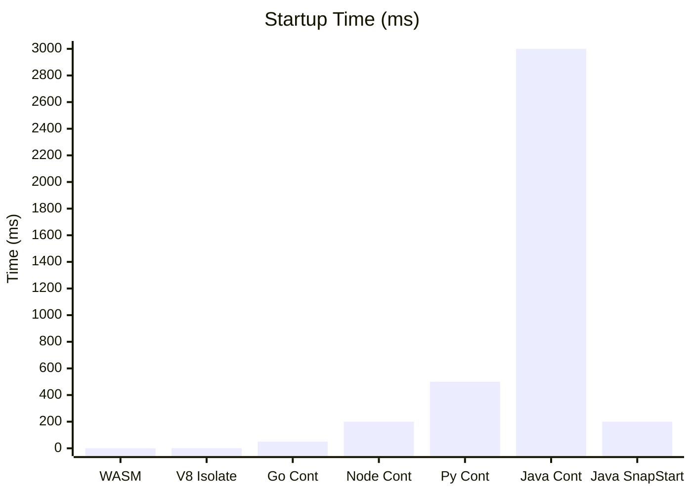
```mermaid
xychart-beta
    title "Startup Time (ms)"
    x-axis ["WASM", "V8 Isolate", "Go Cont", "Node Cont", "Py Cont", "Java Cont", "Java SnapStart"]
    y-axis "Time (ms)" 0 --> 3000
    bar [0.5, 1, 50, 200, 500, 3000, 200]
```

### 8.4 AI Inference Performance

#### GPU Utilization with Different Batching Strategies

| Strategy | GPU Utilization | Latency (P50) | Latency (P99) | Throughput |
|---------|----------------|---------------|---------------|------------|
| No batching (1 request) | 5-15% | 20ms | 50ms | 50 req/s |
| Static batch (32) | 60-80% | 35ms | 200ms | 800 req/s |
| Dynamic batch (8-64) | 70-90% | 30ms | 100ms | 1200 req/s |
| Continuous batch (LLM) | 85-95% | 25ms | 80ms | 2000 tokens/s |

#### Vector Search Performance (Milvus HNSW)

| Dataset Size | Recall@10 | Latency (P50) | Latency (P99) | QPS |
|-------------|-----------|---------------|---------------|-----|
| 100K vectors | 0.98 | 2ms | 5ms | 5000 |
| 1M vectors | 0.97 | 5ms | 15ms | 2000 |
| 10M vectors | 0.95 | 10ms | 30ms | 800 |
| 100M vectors | 0.93 | 20ms | 60ms | 300 |
| 1B vectors | 0.90 | 50ms | 150ms | 100 |

*HNSW parameters: M=16, efConstruction=256, efSearch=128, 768-dim vectors*

---

## 9. Tradeoffs

### 9.1 Serverless Tradeoffs

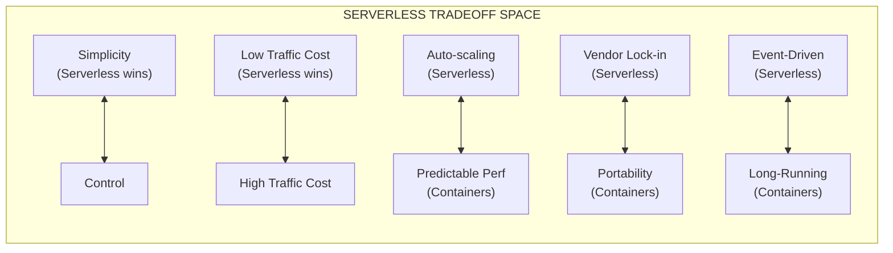
```mermaid
flowchart LR
    subgraph Tradeoffs["SERVERLESS TRADEOFF SPACE"]
        direction TB
        T1["Simplicity<br/>(Serverless wins)"] <--> T2["Control"]
        T3["Low Traffic Cost<br/>(Serverless wins)"] <--> T4["High Traffic Cost"]
        T5["Auto-scaling<br/>(Serverless)"] <--> T6["Predictable Perf<br/>(Containers)"]
        T7["Vendor Lock-in<br/>(Serverless)"] <--> T8["Portability<br/>(Containers)"]
        T9["Event-Driven<br/>(Serverless)"] <--> T10["Long-Running<br/>(Containers)"]
    end
```

**Decision Framework:**

| Factor | Choose Serverless | Choose Containers |
|--------|------------------|-------------------|
| Traffic pattern | Spiky, unpredictable | Steady, predictable |
| Execution time | <15 minutes | Long-running |
| State requirements | Stateless | Stateful |
| Team size | Small, want to move fast | Large, need control |
| Cost priority | Minimize idle cost | Minimize per-request cost |
| Latency requirement | >50ms acceptable | <10ms required |
| Language | Python/Node/Go | Java/C++/custom runtime |

### 9.2 Edge vs. Cloud Tradeoffs

| Dimension | Edge | Cloud | When to Choose Edge |
|-----------|------|-------|-------------------|
| Latency | <10ms | 50-200ms | Real-time UX, gaming, AR/VR |
| Consistency | Eventual (usually) | Strong (available) | Can tolerate eventual consistency |
| Compute | Limited (128MB-1GB) | Unlimited | Simple logic, transformations |
| Storage | Limited (KV, small DBs) | Full databases | Caching, session data |
| Cost | Per-request (can be cheaper) | Per-hour | High request volume, cacheable |
| Debugging | Hard (remote, distributed) | Easy (centralized) | Good observability tooling |
| Compliance | Data stays in country | May cross borders | GDPR, data sovereignty |

### 9.3 WASM vs. Container Tradeoffs

| Dimension | WASM | Container | Winner |
|-----------|------|-----------|--------|
| Startup speed | Microseconds | Seconds | WASM |
| Image size | KBs | MBs-GBs | WASM |
| Ecosystem maturity | Growing | Massive | Containers |
| GPU access | Experimental | Full | Containers |
| Debugging tools | Limited | Excellent | Containers |
| Networking | Limited (WASI evolving) | Full | Containers |
| Security model | Memory-safe sandbox | Shared kernel | WASM |
| Language support | Rust, C/C++, Go, AS | Any | Containers |
| Production readiness | Early (maturing) | Battle-tested | Containers |

**When to use WASM (today):**
- Edge computing (Cloudflare Workers, Fastly Compute)
- Plugin systems (extensible platforms)
- Lightweight microservices with extreme startup requirements
- Security-sensitive multi-tenant environments

**When to wait for WASM:**
- GPU-intensive workloads
- Complex networking requirements
- Applications requiring mature debugging/profiling tools
- Teams without Rust/C/C++ expertise

### 9.4 AI Infrastructure Tradeoffs

#### Build vs. Buy for AI Serving

| Factor | Self-Hosted (vLLM, TGI) | Managed API (OpenAI, Anthropic) |
|--------|------------------------|--------------------------------|
| Cost at low volume | Higher (GPU idle time) | Lower (pay per token) |
| Cost at high volume | Lower (amortized GPU) | Higher (per-token adds up) |
| Latency | Customizable | Fixed by provider |
| Model choice | Any open model | Provider's models |
| Data privacy | Full control | Data leaves your infra |
| Operational burden | High (GPU management) | None |
| Customization | Full (fine-tuning, quantization) | Limited |
| Reliability | Your responsibility | Provider's SLA |

**Crossover**: Self-hosting typically becomes cost-effective at >$10K/month in API spending.

---

## 10. Failure Scenarios

### 10.1 Serverless Failures

#### Thundering Herd Cold Starts

**Scenario**: A marketing email blast sends 500K users to your serverless API simultaneously.

**What happens:**
1. Current warm instances: 50 (handling baseline traffic)
2. Needed instances: 5,000 (burst)
3. AWS Lambda burst limit: 3,000 (us-east-1)
4. Result: 2,000 requests hit the concurrency limit → **throttled (429)**
5. The 3,000 new instances all experience cold starts → **latency spike**

**Mitigation:**
- Pre-warm with provisioned concurrency (expensive but reliable)
- Use a queue (SQS) to smooth the burst
- Progressive rollout of marketing campaigns
- Set up concurrency limit alarms

#### Serverless Database Connection Exhaustion

**Scenario**: Each Lambda invocation opens a new database connection. At high concurrency, you exhaust the database connection limit.

**What happens:**
1. Lambda scales to 1,000 concurrent executions
2. Each opens a PostgreSQL connection
3. PostgreSQL max_connections = 100 (default)
4. Result: **Connection refused errors**, cascading failures

**Mitigation:**
- Use Amazon RDS Proxy (connection pooling for serverless)
- Use DynamoDB (no connection limit)
- Implement connection pooling within the Lambda execution environment
- Use Aurora Serverless Data API (HTTP-based, no persistent connections)

### 10.2 Edge Computing Failures

#### Edge State Inconsistency

**Scenario**: User updates their profile at the New York edge node. Another request from the same user hits the London edge node before replication completes.

**What happens:**
1. Write to NYC KV store: `user.name = "John"` (was "Jonathan")
2. Read from London KV store: `user.name = "Jonathan"` (stale)
3. User sees inconsistent data

**Mitigation:**
- Use Durable Objects (Cloudflare) for strong consistency on critical data
- Session affinity (route same user to same edge)
- Read-your-writes consistency (include version token in client)
- Accept eventual consistency for non-critical data

#### Edge Deployment Failure

**Scenario**: Deploying a buggy edge function to all 300+ PoPs simultaneously.

**What happens:**
1. All edge nodes now run broken code
2. 100% of traffic affected globally
3. Rollback takes minutes (eternity at 50M req/s)

**Mitigation:**
- Canary deployments (deploy to 1% of edge nodes first)
- Feature flags at the edge
- Automated rollback on error rate spike
- Blue/green deployments with gradual traffic shift

### 10.3 AI Infrastructure Failures

#### GPU Out of Memory (OOM)

**Scenario**: Loading a large model that doesn't fit in GPU memory.

**What happens:**
1. vLLM tries to load a 70B parameter model on an A100 (80GB)
2. Model weights: ~140GB in FP16, ~70GB in INT8
3. KV cache needs additional memory for concurrent requests
4. Result: **CUDA OOM error**, inference pod crashes

**Mitigation:**
- Model quantization (FP16 → INT4 reduces memory 4x)
- Tensor parallelism across multiple GPUs
- Proper capacity planning (calculate memory budget: model + KV cache + activations)
- Graceful degradation (fall back to smaller model)

#### Vector Database Index Corruption

**Scenario**: A hardware failure corrupts the HNSW index in your vector database.

**What happens:**
1. HNSW graph has broken edges (pointers to deleted/corrupted nodes)
2. Search results become inconsistent or incomplete
3. Recall drops significantly (correct results not returned)
4. Application returns irrelevant or no results

**Mitigation:**
- Regular index health checks (recall measurement against ground truth)
- Index snapshots/backups before updates
- Rebuild index from raw vectors if corrupted
- Multi-replica deployment with health-based routing

#### RAG Hallucination Despite Retrieval

**Scenario**: RAG retrieves relevant documents, but the LLM still hallucinates.

**What happens:**
1. User asks: "What is our company's vacation policy?"
2. Retriever finds relevant HR documents (correct)
3. LLM generates: "Employees get 25 days of vacation" (wrong—it's 20 days)
4. The LLM "over-generates" beyond what the context states

**Mitigation:**
- Lower temperature (0.0-0.2) for factual queries
- Explicit instruction: "Only answer using the provided context"
- Post-generation validation (check answer against retrieved chunks)
- Confidence scoring (if LLM says "I'm not sure", flag for human review)
- Quote extraction (ask LLM to quote directly from context)

### 10.4 Autonomous System Failures

#### Auto-Remediation Loop (Thrashing)

**Scenario**: Self-healing system detects high CPU, restarts the service, which causes a cascade.

**What happens:**
1. High CPU alert triggers auto-remediation
2. System restarts the service
3. Startup load causes high CPU again
4. Auto-remediation triggers again → restart loop (thrashing)

**Mitigation:**
- Rate limiting on remediation actions (max 3 restarts per hour)
- Escalation after N failed attempts (page a human)
- Root cause analysis before remediation (CPU high because of legitimate load vs. bug)
- Cool-down periods between remediation attempts

---

## 11. Debugging & Observability

### 11.1 Serverless Observability

#### Structured Logging for Serverless

```java
/**
 * Structured logging pattern for AWS Lambda.
 * All logs are JSON-formatted for CloudWatch Insights queries.
 */
public class ServerlessLogger {
    
    private final String functionName;
    private final String functionVersion;
    
    public ServerlessLogger(Context context) {
        this.functionName = context.getFunctionName();
        this.functionVersion = context.getFunctionVersion();
    }
    
    public void log(String level, String requestId, String message, 
                    Map<String, Object> data) {
        Map<String, Object> logEntry = new LinkedHashMap<>();
        logEntry.put("timestamp", Instant.now().toString());
        logEntry.put("level", level);
        logEntry.put("requestId", requestId);
        logEntry.put("function", functionName);
        logEntry.put("version", functionVersion);
        logEntry.put("message", message);
        
        if (data != null) {
            logEntry.put("data", data);
        }
        
        // CloudWatch automatically indexes JSON fields
        System.out.println(toJson(logEntry));
    }
}

// CloudWatch Insights query to find cold starts:
// fields @timestamp, @message
// | filter message = "Cold start initialization"
// | stats count() by bin(1h)
// | sort @timestamp desc

// Query to find slow invocations:
// fields @timestamp, data.durationMs as duration
// | filter duration > 1000
// | sort duration desc
// | limit 20
```

#### Key Serverless Metrics

| Metric | What It Tells You | Alert Threshold |
|--------|-------------------|-----------------|
| Invocations | Request volume | Anomaly detection |
| Duration (P50/P99) | Execution time | P99 > 2x baseline |
| Errors | Function failures | Error rate > 1% |
| Throttles | Concurrency exhaustion | Any throttling |
| ConcurrentExecutions | Current parallelism | >80% of limit |
| Cold Start Rate | % of invocations that cold start | >10% |
| Iterator Age (streams) | Processing lag | >1 minute |

### 11.2 Edge Computing Observability

Edge debugging is uniquely challenging because you can't SSH into edge nodes. Key strategies:

1. **Tail workers**: Cloudflare's `wrangler tail` streams edge logs in real-time.
2. **Request tracing**: Add trace IDs at the edge, propagate to origin.
3. **Edge analytics**: Aggregate metrics from all edge nodes centrally.
4. **Replay requests**: Capture and replay failing requests for debugging.

```javascript
// Cloudflare Worker with structured observability
export default {
  async fetch(request, env) {
    const traceId = request.headers.get('X-Trace-Id') || crypto.randomUUID();
    const startTime = Date.now();
    
    try {
      const response = await handleRequest(request, env);
      
      // Log to analytics (async, doesn't block response)
      // Uses Cloudflare's Analytics Engine or Logpush
      env.ANALYTICS?.writeDataPoint({
        blobs: [request.url, response.status.toString(), traceId],
        doubles: [Date.now() - startTime],
        indexes: [request.cf?.colo || 'unknown'],
      });
      
      return response;
    } catch (error) {
      console.error(JSON.stringify({
        traceId,
        error: error.message,
        stack: error.stack,
        url: request.url,
        colo: request.cf?.colo,
      }));
      
      return new Response('Internal Error', { status: 500 });
    }
  }
};
```

### 11.3 AI Infrastructure Observability

Key metrics for AI serving systems:

| Metric | Description | Target |
|--------|-------------|--------|
| **Time to First Token (TTFT)** | Latency before first token generated | <500ms |
| **Tokens Per Second (TPS)** | Generation throughput | >30 tokens/s |
| **GPU Utilization** | % of GPU compute used | >80% |
| **GPU Memory Utilization** | % of GPU VRAM used | 70-90% |
| **Batch Size** | Average requests per batch | 8-64 |
| **Queue Depth** | Pending requests | <100 |
| **Cache Hit Rate** | % of requests served from cache | >20% |
| **Model Load Time** | Time to load model into GPU | <30s |

#### Grafana Dashboard for AI Inference

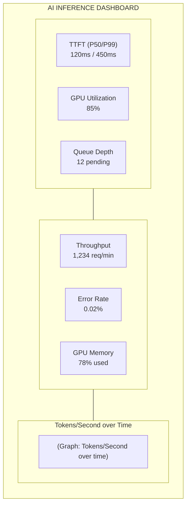
```mermaid
flowchart TB
    subgraph Dashboard["AI INFERENCE DASHBOARD"]
        direction TB
        subgraph TopRow[" "]
            direction LR
            TTFT["TTFT (P50/P99)<br/>120ms / 450ms"]
            GPU["GPU Utilization<br/>85%"]
            QD["Queue Depth<br/>12 pending"]
        end
        subgraph MidRow[" "]
            direction LR
            TP["Throughput<br/>1,234 req/min"]
            ER["Error Rate<br/>0.02%"]
            VRAM["GPU Memory<br/>78% used"]
        end
        subgraph BotRow["Tokens/Second over Time"]
            Graph["(Graph: Tokens/Second over time)"]
        end
        TopRow --- MidRow --- BotRow
    end
```

### 11.4 Distributed Tracing for Modern Architectures

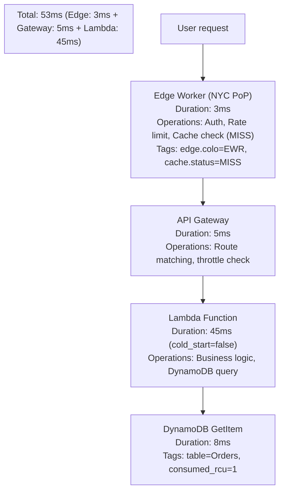
```mermaid
flowchart TD
    Req["User request"] --> EW["Edge Worker (NYC PoP)<br/>Duration: 3ms<br/>Operations: Auth, Rate limit, Cache check (MISS)<br/>Tags: edge.colo=EWR, cache.status=MISS"]
    EW --> AG["API Gateway<br/>Duration: 5ms<br/>Operations: Route matching, throttle check"]
    AG --> LF["Lambda Function<br/>Duration: 45ms (cold_start=false)<br/>Operations: Business logic, DynamoDB query"]
    LF --> DB["DynamoDB GetItem<br/>Duration: 8ms<br/>Tags: table=Orders, consumed_rcu=1"]
    
    subgraph Total["Total: 53ms (Edge: 3ms + Gateway: 5ms + Lambda: 45ms)"]
    end
```

---

## 12. Interview Questions

### 12.1 Beginner Level

**Q1: What is serverless computing? Does it mean there are no servers?**

**Expected Answer**: No, servers still exist—the cloud provider manages them. "Serverless" means the developer doesn't manage, provision, or think about servers. The provider handles scaling, availability, and billing based on actual usage. Key characteristics: event-driven, auto-scaling, pay-per-use, stateless execution.

**Q2: What is a cold start in serverless computing?**

**Expected Answer**: A cold start occurs when a serverless function is invoked but no pre-initialized execution environment exists. The platform must download the code, start the runtime, initialize the framework and function—all before executing the handler. This adds latency (100ms to 10s depending on language and configuration). Warm starts reuse existing environments and are much faster (~1ms).

**Q3: What is edge computing and why is it useful?**

**Expected Answer**: Edge computing runs computation closer to the user (at CDN PoPs, cell towers, or on-device) instead of in centralized data centers. Benefits: lower latency (5ms vs 200ms), reduced bandwidth (process locally), privacy (data stays local), offline operation. Challenges: limited resources, consistency across locations, debugging difficulty.

### 12.2 Intermediate Level

**Q4: Design a serverless image processing pipeline.**

**Expected Answer**: 
1. User uploads image to S3
2. S3 event triggers Lambda function
3. Lambda validates image, extracts metadata
4. Lambda publishes to SQS with processing instructions
5. Processing Lambda(s) consume from SQS, perform resize/crop/filter
6. Results stored back to S3
7. DynamoDB updated with processing status
8. EventBridge notifies client via WebSocket/SNS

Key considerations: Use SQS for decoupling (handles Lambda failures with retry), set appropriate timeout and memory, use layers for image processing libraries, implement DLQ for failed processing.

**Q5: How do vector databases achieve fast similarity search? What are the tradeoffs?**

**Expected Answer**: Vector databases use Approximate Nearest Neighbor (ANN) algorithms instead of brute-force search:
- **HNSW**: Graph-based, excellent recall/speed tradeoff. O(log n) search time. Higher memory usage.
- **IVF**: Clusters vectors, searches only nearby clusters. Lower memory but requires training step.
- **LSH**: Hash-based, fast but lower recall.

Tradeoffs: All ANN algorithms trade recall (accuracy) for speed. HNSW gives best recall but uses most memory. IVF+PQ is most memory-efficient but lower recall. Build time vs. query time tradeoff (better index = slower build, faster query).

**Q6: Explain the RAG architecture and when you'd use it instead of fine-tuning.**

**Expected Answer**: RAG retrieves relevant documents from a knowledge base and provides them as context to an LLM for answer generation.

Use RAG when: Knowledge changes frequently, need source attribution, multiple domains of knowledge, want to avoid expensive fine-tuning, need factual accuracy.

Use fine-tuning when: Need to change the model's style/tone, task-specific behavior, domain adaptation, smaller model with specialized capability.

RAG + fine-tuning: Fine-tune for style/format, RAG for knowledge. Best of both worlds.

### 12.3 Advanced Level

**Q7: Design an AI-powered search engine for a company's internal documents (system design).**

**Expected Answer**:

**Requirements**: Search 10M documents, <200ms P99 latency, support natural language queries, daily document updates.

**Architecture**:
1. **Ingestion**: Document crawler → Content extraction (PDF/HTML parser) → Text chunking (512 tokens, 50 overlap) → Embedding generation (batch, GPU) → Vector DB insertion + full-text index update

2. **Search**: Query → Query embedding → Hybrid search (vector similarity + BM25) → Reranking (cross-encoder) → Optional: LLM-generated answer (RAG)

3. **Infrastructure**:
   - Vector DB: Milvus cluster (3 nodes, 2 replicas per segment)
   - Full-text: Elasticsearch cluster (for BM25)
   - Embedding: GPU cluster for batch embedding (ingestion) + CPU for real-time query embedding
   - LLM: vLLM serving cluster for answer generation
   - Cache: Redis for frequent query caching

4. **Scaling considerations**:
   - Shard vector index by document category
   - Pre-compute embeddings for common query patterns
   - Cache reranking results for repeated queries
   - Incremental index updates (not full rebuild)

**Q8: How would you implement a self-healing distributed system?**

**Expected Answer**:

**Layers of self-healing:**

1. **Health checks**: Each service exposes `/health` endpoint. Load balancer removes unhealthy instances automatically.

2. **Auto-restart**: Kubernetes liveness probes restart crashed containers. Process supervisors (systemd) restart crashed processes.

3. **Circuit breakers**: Detect downstream failures, stop cascading. Auto-reset after cool-down.

4. **Auto-scaling**: Scale up when load increases, scale down when idle. Predictive scaling using time-series forecasting.

5. **Anomaly detection**: ML model trained on normal metrics. Alert when metrics deviate from baseline.

6. **Automated runbooks**: Map known failure patterns to remediation actions. Execute automatically with human confirmation for high-risk actions.

7. **Chaos engineering**: Continuously inject failures to validate self-healing mechanisms. GameDay exercises.

**Key design principles:**
- Idempotent remediation (safe to retry)
- Rate limiting on automated actions
- Escalation paths (auto → human)
- Audit trail for all automated actions

### 12.4 FAANG-Level

**Q9: Design a globally distributed AI inference platform that serves 1M requests/second with <50ms P99 latency.**

**Expected Answer**:

This is a multi-layered problem requiring edge caching, regional GPU clusters, intelligent routing, and graceful degradation.

**Architecture:**

1. **Edge layer** (300+ PoPs):
   - Request validation, auth, rate limiting
   - Response caching (for deterministic queries, cache hit rate ~30%)
   - Lightweight model inference for simple requests (WASM-based small models)
   - Route to nearest regional GPU cluster

2. **Regional GPU clusters** (5-10 regions):
   - GPU pool: Mix of H100 (large models) and A10G (smaller models)
   - Model serving: vLLM with continuous batching
   - Model routing: Select model based on request complexity
   - Auto-scaling: Scale GPU instances based on queue depth

3. **Routing intelligence**:
   - Latency-based routing (nearest region)
   - Capacity-aware routing (avoid overloaded regions)
   - Model affinity (keep model in GPU memory)
   - Fallback routing (if primary region down, route to secondary)

4. **Optimization**:
   - Speculative decoding for LLMs (3-5x throughput improvement)
   - KV-cache sharing across requests (prefix caching)
   - INT4 quantization for serving (4x memory reduction, minimal quality loss)
   - Response streaming (TTFT < 50ms, even if total generation takes longer)

5. **Reliability**:
   - Multi-region active-active
   - Graceful degradation (smaller model if GPU capacity low)
   - Request hedging (send to 2 regions, use first response)
   - SLO-based load shedding

**Q10: Compare the operational complexity of serverless, containers, and WASM for a microservices architecture. What would you choose for a startup vs. a large enterprise?**

**Expected Answer**:

| Aspect | Serverless | Containers (K8s) | WASM |
|--------|-----------|-------------------|------|
| Day 1 complexity | Low | High (K8s setup) | Medium |
| Day 100 complexity | Medium (many functions) | Medium (mature tooling) | Medium (newer tooling) |
| Operational burden | Low (provider manages) | High (manage K8s) | Low-Medium |
| Cost at $0 revenue | ~$0 | ~$200/month (min K8s) | ~$0 (edge platforms) |
| Cost at $10M revenue | High (per-invocation) | Medium (reserved) | Low (dense packing) |
| Debugging | Hard | Good tooling | Limited |
| Vendor lock-in | High | Medium | Low (WASI standard) |

**Startup (2-5 engineers)**: Serverless. Speed of development, zero ops burden, scale-to-zero for cost. Accept vendor lock-in as acceptable risk for speed. Migrate to containers only when serverless costs become prohibitive or limitations are blocking.

**Large enterprise**: Containers on Kubernetes. Need for control, compliance, multi-cloud portability. Use serverless selectively for event-driven workloads. Evaluate WASM for edge use cases and plugin architectures.

**Forward-looking**: WASM may become the default for new microservices within 3-5 years, combining the operational simplicity of serverless with the control of containers. The SpinKube project (WASM on Kubernetes) bridges both worlds.

---

## 13. Exercises

### 13.1 Conceptual Exercises

**Exercise 1: Serverless Cost Calculator**
Build a spreadsheet or calculator that compares the cost of running a web API on:
- AWS Lambda (various memory configurations)
- AWS Fargate (various CPU/memory)
- EC2 (various instance types)

For input parameters: requests/month, average duration, peak concurrency, baseline traffic. Find the crossover points.

**Exercise 2: Edge Consistency Protocol**
Design a protocol for maintaining user session consistency across edge nodes. Consider:
- User updates their cart on Edge A, then makes a request to Edge B
- How to ensure Edge B sees the updated cart
- What's the maximum acceptable staleness?
- How does this compare to traditional session management?

Write pseudocode for the protocol.

**Exercise 3: RAG Quality Evaluation**
Design an evaluation framework for a RAG system. Define metrics for:
- **Retrieval quality**: Precision@K, Recall@K, NDCG
- **Generation quality**: Faithfulness (no hallucination), relevance, completeness
- **End-to-end**: Answer correctness, source attribution accuracy

Create a test dataset of 50 question-answer pairs with ground truth sources.

### 13.2 Coding Exercises

**Exercise 4: Build a Serverless URL Shortener**
Using AWS Lambda + DynamoDB + API Gateway:
- POST /shorten: Accept a URL, return a short code
- GET /{code}: Redirect to the original URL
- GET /stats/{code}: Return click count, last accessed time

Requirements: Handle 1000 req/s, sub-100ms latency, idempotent (same URL → same code).

**Exercise 5: Implement a Simple Vector Search**
In Python, implement from scratch:
- Cosine similarity function
- Brute-force k-NN search
- Simple IVF index (cluster vectors using k-means, search nearest clusters)
- Compare recall and speed at 10K, 100K, 1M vectors

**Exercise 6: Build a Mini RAG Pipeline**
Build a complete RAG pipeline using:
- Document loader (read markdown files from a directory)
- Text chunker (500 tokens, 50 overlap)
- Embedding (use sentence-transformers locally)
- Vector store (ChromaDB or in-memory)
- Generation (call OpenAI API or use local Ollama)
- Evaluation: test with 10 questions about the loaded documents

### 13.3 System Design Exercises

**Exercise 7: Design an Edge-Native E-Commerce Platform**
Design an e-commerce platform that runs primarily at the edge:
- Product catalog served from edge cache
- Search powered by edge-local indexes
- Cart management with edge state
- Checkout process (requires origin for payment)
- Inventory management (strong consistency required)

What can run at the edge? What must run at origin? How do you handle consistency?

**Exercise 8: Design an AI Model Serving Platform**
Design a platform that serves 100 different ML models to internal teams:
- Models range from 100MB (sklearn) to 70B parameters (LLM)
- Some models are hot (1000 req/s), most are cold (<1 req/min)
- Need to minimize GPU cost
- Support A/B testing and canary deployments
- Model registry, versioning, rollback

Key challenges: GPU scheduling, model loading/unloading, batching strategies.

**Exercise 9: Design a Self-Healing Kubernetes Cluster**
Design a system that automatically detects and remediates common Kubernetes failures:
- Pod crash loops
- Node failures
- DNS resolution failures
- Certificate expiration
- Resource exhaustion (CPU, memory, disk)
- Network partition between nodes

For each failure mode, define: detection method, diagnosis logic, remediation action, verification, escalation criteria.

---

## 14. Expert Insights

### 14.1 Hidden Complexities

#### Serverless: The Hidden State Problem

> "Serverless functions are stateless, but your system is not."

The biggest challenge in serverless architectures isn't the functions—it's managing the **distributed state** that accumulates across databases, queues, caches, and external services. Each function invocation may succeed independently, but the aggregate state can become inconsistent.

**Real example**: An e-commerce checkout function:
1. Charges the credit card (Stripe API)
2. Updates the order status (DynamoDB)
3. Sends confirmation email (SES)

If step 2 fails after step 1 succeeds, you've charged the customer but not recorded the order. Step Functions with compensating transactions (Saga pattern) solve this, but add significant complexity.

#### Edge Computing: The Multi-Version Nightmare

In edge computing, you may have **multiple versions of your code running simultaneously** across 300+ locations. Edge deployments are not atomic—they roll out over minutes. During this window:
- User A (hitting PoP in NYC) runs v2.1
- User B (hitting PoP in London) runs v2.0

If v2.1 changes an API response format, clients may receive inconsistent responses. **Forward-compatible API design** is critical for edge deployments.

#### WASM: The Ecosystem Gap

WASM's technical properties are remarkable, but the **ecosystem gap is real**:
- Debugging WASM is significantly harder than debugging containers
- Profiling tools are immature
- Not all languages compile to WASM equally well (Java WASM support is experimental)
- WASI is still evolving (networking APIs are not fully standardized)
- Some libraries with C dependencies don't compile to WASM

Early adopters should be prepared to contribute to the ecosystem, not just consume it.

#### AI Infrastructure: The GPU Scheduling Nightmare

GPU scheduling is **fundamentally harder** than CPU scheduling because:
- GPUs are indivisible in most frameworks (a model either fits or doesn't)
- Loading/unloading models takes 10-60 seconds (compared to <1ms for CPU context switches)
- GPU memory fragmentation is a real problem
- Multi-tenant GPU sharing is immature

The ideal solution—something like "Kubernetes for GPUs"—doesn't fully exist yet. Companies like RunAI, Anyscale, and Modal are building towards it, but it remains one of the hardest infrastructure challenges.

### 14.2 Industry Lessons

#### Netflix's Serverless Journey

Netflix's key lesson: **Serverless is not all-or-nothing**. They use serverless for data pipelines and encoding workflows but keep latency-critical services on containers. The decision framework is simple:
- If latency matters (<100ms P99): Containers
- If cost-per-idle matters: Serverless
- If execution time >15 minutes: Step Functions + Lambda
- If predictable throughput: Containers with auto-scaling

#### Cloudflare's V8 Isolate Bet

Cloudflare bet that V8 isolates could provide sufficient security isolation for multi-tenant edge computing. The key insight: V8 has been battle-tested by billions of web users running untrusted JavaScript. If it's secure enough for the browser, it's secure enough for the edge. This eliminated the container overhead and enabled <1ms cold starts.

#### Meta's Vector Search at Scale

Meta's key lesson with vector search: **The embedding model matters more than the vector database**. They found that improving embedding quality (through better training data, hard negative mining, and domain-specific fine-tuning) improved search relevance 3x more than optimizing the ANN index parameters.

### 14.3 Scaling Pain Points

#### Serverless at Scale Pain Points

1. **Observability**: With 1000+ functions, understanding the overall system behavior is like watching 1000 TV channels simultaneously. Invest in distributed tracing (X-Ray, Jaeger) early.

2. **Deployment coordination**: When functions have dependencies (A calls B calls C), deployments must be coordinated. Version mismatches cause subtle bugs.

3. **Cost visibility**: Serverless costs are distributed across many micro-services, making it hard to attribute costs to features or teams. Implement cost tagging rigorously.

4. **Testing**: Integration testing serverless architectures requires emulating event sources, databases, and downstream services. LocalStack helps but isn't perfect.

#### Edge Computing at Scale Pain Points

1. **Log aggregation**: Logs from 300+ edge locations must be aggregated centrally for analysis. Volume is massive.

2. **Configuration management**: Pushing configuration changes to all edge nodes reliably and atomically is hard.

3. **Capacity planning**: Each edge node has limited resources. Popular content can overwhelm individual nodes.

4. **Regulatory compliance**: Different countries have different data processing regulations. Edge functions must comply with local laws.

#### AI Infrastructure at Scale Pain Points

1. **GPU availability**: H100/B200 GPUs have multi-month lead times. Capacity planning for AI workloads requires 6-12 month horizons.

2. **Model versioning**: Managing hundreds of model versions across training, staging, and production is complex. Model registries (MLflow, Weights & Biases) help but add operational overhead.

3. **Cost**: GPU infrastructure is 10-100x more expensive per compute-hour than CPU. Optimization (quantization, distillation, efficient architectures) is essential.

4. **Reproducibility**: AI training is non-deterministic. Reproducing a training run exactly requires careful management of random seeds, data ordering, hardware configuration, and software versions.

### 14.4 Where Things Are Heading

**The Convergence Thesis**: Serverless, edge, WASM, and AI are converging. Future applications will be:
- **Deployed as WASM modules** (for portability and startup speed)
- **Running at the edge** (for latency)
- **With serverless scaling** (for cost)
- **Powered by AI** (for intelligence)
- **Self-managed by autonomous systems** (for reliability)

**The Component Model**: WASM's Component Model will enable composable microservices where services are assembled from reusable components at deploy time, not just code modules. Think of it as "npm for backend services" but with compile-time type safety across language boundaries.

**The Death of the Connection**: CXL and disaggregated memory will blur the line between "local" and "remote" in distributed systems. When accessing memory 1 rack unit away takes 300ns instead of 1ms (network), many distributed systems patterns (caching, replication, partitioning) will need to be rethought.

---

## 15. Chapter Summary

### Key Takeaways

**Serverless Computing:**
- Functions-as-a-Service abstracts away infrastructure management
- Cold starts are the primary latency challenge (mitigated by provisioned concurrency, SnapStart, native compilation)
- Best for event-driven, variable-traffic workloads; poor for steady-state, long-running computations
- Serverless databases (Aurora Serverless, DynamoDB on-demand) extend the pay-per-use model to storage
- The hidden challenge is managing distributed state across stateless functions

**Edge Computing:**
- Pushes computation to 300+ global PoPs for <10ms user-facing latency
- V8 isolates enable sub-millisecond cold starts at the edge
- IoT edge processing filters and aggregates data locally
- Consistency across edge locations is the fundamental challenge
- Edge AI enables real-time inference without cloud round-trips

**WebAssembly (WASM):**
- Portable, secure, near-native-speed binary format
- 1000x faster startup than containers, 100x smaller images
- WASI provides standardized system interface with capability-based security
- Spin/Fermyon, wasmCloud, SpinKube are leading the server-side WASM movement
- Not yet a full container replacement but excels at edge, plugin, and density-sensitive use cases

**AI Infrastructure:**
- Training requires massive GPU clusters with sophisticated parallelism strategies
- Inference serving needs dynamic batching, GPU scheduling, and model optimization
- Vector databases (Milvus, Pinecone, pgvector) enable semantic search at scale
- RAG combines retrieval with generation for accurate, up-to-date, source-attributed AI answers
- AI agents require new distributed coordination patterns

**Autonomous Systems:**
- Self-healing ranges from auto-restart (Level 2) to fully autonomous (Level 5)
- AIOps applies ML to anomaly detection, root cause analysis, and automated remediation
- Automated capacity planning uses forecasting to right-size infrastructure
- Autonomous database tuning uses Bayesian optimization and RL
- Guard against auto-remediation loops with rate limiting and escalation

**Emerging Trends:**
- Disaggregated storage/compute enables independent scaling (Snowflake, Aurora)
- CXL memory pooling could fundamentally change distributed state management
- Confidential computing protects data in use with hardware TEEs
- Sustainable computing is a growing concern as AI workloads consume more energy
- Post-quantum cryptography migration should start now, even if quantum computers are years away

### The Future Is Hybrid

No single paradigm will dominate. The future of distributed systems is **hybrid**:
- Serverless for event-driven and variable workloads
- Containers for long-running and stateful services
- WASM for edge and density-sensitive deployments
- Dedicated GPU infrastructure for AI workloads
- Autonomous management for all of the above

The engineer who understands **when to apply each paradigm**—and more importantly, when NOT to—will be the most valuable architect in the room.

---

*"We are not at the end of distributed systems evolution—we are at the beginning of a new chapter. The systems of the next decade will be smarter, faster, more distributed, and more autonomous than anything we've built before. The fundamentals you've learned throughout this book—consistency, availability, partition tolerance, consensus, replication, fault tolerance—remain the foundation. What changes is the abstraction level at which we apply them."*

---

**End of Chapter 35**

[← Chapter 34: Case Studies and System Design](../PART-7-MODERN-SYSTEM-DESIGN/Chapter-34-Case-Studies-and-System-Design.md) | [Appendix: Mastery Roadmap →](../APPENDIX-Mastery-Roadmap.md)
